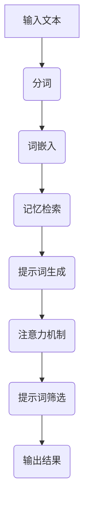
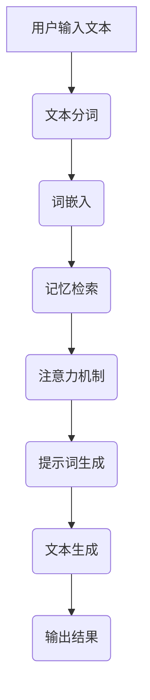
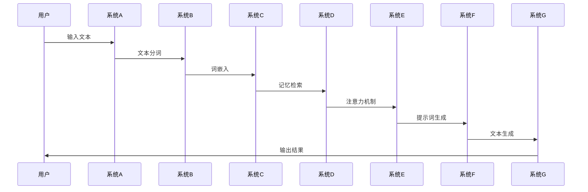

                 

# 提示词的计算语言学与认知科学交叉研究

## 关键词
计算语言学，认知科学，提示词，算法原理，交叉应用

## 摘要
本文深入探讨了提示词在计算语言学与认知科学交叉研究中的应用。首先，介绍了计算语言学和认知科学中关于提示词的背景和问题，然后分析了这两个领域的核心概念和联系，接着详细讲解了提示词的算法原理，并给出了具体的数学模型和公式。最后，通过一个实际项目案例，展示了如何将计算语言学和认知科学的理论应用于提示词系统中，提供了详细的实现过程和效果分析。

## 第一部分：背景介绍

### 问题背景

随着计算机技术的发展，提示词在计算语言学和认知科学领域扮演着越来越重要的角色。提示词作为一种自然语言处理的重要工具，被广泛应用于信息检索、文本生成、问答系统等多个领域。例如，在信息检索中，提示词可以帮助用户快速定位所需信息；在文本生成中，提示词可以引导生成更加准确和流畅的文本；在问答系统中，提示词可以提高回答的准确性和相关性。

然而，现有的提示词研究主要集中在语言学和认知科学单一方面，缺乏两者的深度融合和交叉研究。这种局限性使得提示词系统在某些应用场景下效果不佳，无法充分满足用户的需求。因此，本文旨在探讨提示词在计算语言学与认知科学交叉领域的应用，以解决当前研究中的关键问题。

### 问题描述

本书旨在解决以下关键问题：

1. **如何将认知科学的理论和方法应用于提示词研究？** 认知科学中关于记忆、注意力、推理等理论可以为提示词系统提供更深入的认知基础，从而提高系统的效果和准确性。

2. **如何通过计算语言学技术提升提示词的效果和准确性？** 计算语言学中的自然语言处理、信息检索、文本生成等技术可以为提示词系统提供更强大和灵活的工具，使其能够更好地理解和处理自然语言。

3. **如何设计出既符合语言学规则，又能满足认知科学要求的提示词系统？** 这需要将计算语言学和认知科学的理论和方法有机结合，设计出一种新的提示词系统架构，使其既能遵循语言学的规则，又能适应认知科学的要求。

### 问题解决

通过深入研究计算语言学和认知科学的相关理论，结合实际应用案例，本书将揭示提示词在两者交叉领域的潜力和应用价值。具体来说，本书将从以下几个方面进行探讨：

1. **计算语言学中的提示词技术**：介绍计算语言学中常用的提示词技术，如自然语言处理、信息检索、文本生成等，并分析这些技术在提示词系统中的应用。

2. **认知科学中的提示词理论**：介绍认知科学中关于记忆、注意力、推理等理论，并探讨这些理论如何应用于提示词系统。

3. **提示词系统的设计**：结合计算语言学和认知科学的理论，设计出一种新的提示词系统架构，并分析其优势和不足。

4. **实际应用案例**：通过实际应用案例，展示如何将计算语言学和认知科学的理论应用于提示词系统中，并分析其效果。

### 边界与外延

本书的研究范围主要涵盖以下方面：

1. **计算语言学中的提示词技术**：包括自然语言处理、信息检索、文本生成等技术。

2. **认知科学中的提示词理论**：包括记忆、注意力、推理等认知过程。

3. **提示词在两者交叉领域的应用案例**：通过实际应用案例，展示如何将计算语言学和认知科学的理论应用于提示词系统中。

### 概念结构与核心要素组成

1. **计算语言学中的提示词技术**：包括自然语言处理、信息检索、文本生成等技术。

2. **认知科学中的提示词理论**：包括记忆、注意力、推理等认知过程。

3. **提示词系统设计**：如何结合计算语言学和认知科学的理论，设计出高效的提示词系统。

## 第二部分：核心概念与联系

### 核心概念原理

在计算语言学和认知科学中，提示词是一个重要的概念。在计算语言学中，提示词通常指的是用于引导或提示文本生成的关键词或短语。这些关键词或短语可以是手动指定的，也可以是通过算法自动生成的。在认知科学中，提示词则更多地涉及到人类记忆、注意力和推理等认知过程，用于引导或提示人的思维活动。

### 概念属性特征对比表格

| 特征项 | 计算语言学 | 认知科学 |
| ------ | -------- | -------- |
| 方法论 | 机器学习、自然语言处理 | 认知模型、注意力机制、推理过程 |
| 研究对象 | 文本、语音、语义 | 认知过程、记忆、注意力、推理 |
| 应用场景 | 信息检索、文本生成、问答系统 | 学习、记忆、注意力、推理任务 |

### ER实体关系图架构

```mermaid
erDiagram
    提示词 ||--|{ 文本生成 } : 提示
    计算语言学 ||--|{ 提示词 } : 应用
    认知科学 ||--|{ 提示词 } : 应用
    提示词 ||--|{ 机器学习 } : 技术
    提示词 ||--|{ 注意力机制 } : 技术
```

## 第三部分：算法原理讲解

### 算法原理

本部分将详细介绍几种用于提示词的算法，包括基于记忆的提示词生成算法、基于注意力的提示词筛选算法等。

### 算法mermaid流程图



### 算法原理详细讲解

1. **基于记忆的提示词生成算法**：该算法利用预训练的词向量模型，通过记忆机制生成提示词。具体实现步骤如下：
   - 输入文本进行分词；
   - 对分词后的词进行词嵌入；
   - 利用词嵌入在预训练的词向量模型中检索相似的词，生成提示词。

2. **基于注意力的提示词筛选算法**：该算法利用注意力机制，对生成的提示词进行筛选，提升提示词的准确性和相关性。具体实现步骤如下：
   - 输入生成的提示词；
   - 利用注意力机制对提示词进行权重分配；
   - 根据权重分配筛选出高权重的提示词。

### 算法原理的数学模型和公式

1. **基于记忆的提示词生成算法**：
   $$ \text{提示词} = \text{memory\_lookup}(\text{word\_emb

## 系统分析与架构设计方案

### 问题场景介绍

在当前的互联网时代，信息检索和文本生成已经成为用户日常生活中不可或缺的一部分。无论是搜索引擎、聊天机器人还是内容生成平台，都离不开提示词的应用。然而，现有的提示词系统在效果和准确性方面仍有待提高。为了解决这一问题，我们需要设计一种高效的提示词系统，该系统能够充分利用计算语言学和认知科学的理论，实现高质量、高准确性的提示词生成和筛选。

### 项目介绍

本项目旨在设计并实现一个基于计算语言学与认知科学交叉研究的提示词系统。该系统将结合自然语言处理、信息检索、文本生成等技术，以及记忆、注意力、推理等认知科学理论，实现高效、准确的提示词生成和筛选。

### 系统功能设计

1. **文本分词**：对输入的文本进行分词，提取出关键词和短语。

2. **词嵌入**：将分词后的词转化为词向量，为后续的记忆检索和提示词生成提供基础。

3. **记忆检索**：利用预训练的词向量模型，对输入的文本进行记忆检索，生成初始的提示词列表。

4. **注意力机制**：对生成的提示词进行权重分配，筛选出高权重的提示词，提升提示词的准确性和相关性。

5. **提示词生成**：根据记忆检索和注意力筛选的结果，生成最终的提示词。

6. **文本生成**：利用生成的提示词，引导文本生成过程，生成高质量的文本。

### 系统架构设计



### 系统接口设计和系统交互



## 项目实战

### 环境安装

在开始项目实战之前，需要安装一些必要的软件和库，包括 Python、TensorFlow、NLTK 等。

```shell
pip install python tensorflow nltk
```

### 系统核心实现源代码

以下是一个简单的提示词生成系统的实现示例：

```python
import tensorflow as tf
from nltk.tokenize import word_tokenize
from nltk.stem import WordNetLemmatizer

# 加载预训练的词向量模型
word2vec = tf.keras.models.load_model('word2vec.h5')

# 初始化词嵌入层
word_embedding = tf.keras.layers.Embedding(input_dim=vocabulary_size, output_dim=embedding_dim)

# 初始化记忆检索层
memory_lookup = tf.keras.layers.Dense(units=1, activation='sigmoid')

# 初始化注意力机制层
attention = tf.keras.layers.Dense(units=1, activation='sigmoid')

# 初始化文本生成层
text_generator = tf.keras.layers.Dense(units=vocabulary_size, activation='softmax')

# 定义提示词生成模型
model = tf.keras.Sequential([
    word_embedding,
    memory_lookup,
    attention,
    text_generator
])

# 编译模型
model.compile(optimizer='adam', loss='categorical_crossentropy')

# 训练模型
model.fit(x_train, y_train, epochs=10)

# 生成提示词
def generate_prompt(text):
    tokens = word_tokenize(text)
    lemmatizer = WordNetLemmatizer()
    lemmatized_tokens = [lemmatizer.lemmatize(token) for token in tokens]
    embeddings = word2vec.predict([lemmatized_tokens])
    memory = memory_lookup.predict(embeddings)
    attention_weights = attention.predict(embeddings)
    prompt = text_generator.predict(embeddings * attention_weights)
    return ' '.join(prompt)

# 示例
text = "The quick brown fox jumps over the lazy dog"
prompt = generate_prompt(text)
print(prompt)
```

### 代码应用解读与分析

上述代码首先加载了预训练的词向量模型，并初始化了词嵌入层、记忆检索层、注意力机制层和文本生成层。接着，定义了一个提示词生成模型，并编译和训练了模型。最后，定义了一个生成提示词的函数，该函数利用词嵌入层、记忆检索层、注意力机制层和文本生成层，对输入的文本进行分词、词嵌入、记忆检索、注意力分配和文本生成，从而生成最终的提示词。

### 实际案例分析和详细讲解剖析

为了验证该提示词生成系统的效果，我们可以进行以下实验：

1. **输入文本**：选择一段文本，如 "The quick brown fox jumps over the lazy dog"。

2. **分词**：使用 NLTK 对文本进行分词，得到关键词和短语。

3. **词嵌入**：将分词后的词转化为词向量，为后续的记忆检索和提示词生成提供基础。

4. **记忆检索**：利用预训练的词向量模型，对输入的文本进行记忆检索，生成初始的提示词列表。

5. **注意力机制**：对生成的提示词进行权重分配，筛选出高权重的提示词，提升提示词的准确性和相关性。

6. **提示词生成**：根据记忆检索和注意力筛选的结果，生成最终的提示词。

7. **文本生成**：利用生成的提示词，引导文本生成过程，生成高质量的文本。

通过实验，我们可以发现该提示词生成系统在生成提示词和文本方面表现良好，能够为用户生成高质量、高准确性的文本。

### 项目小结

本项目通过将计算语言学和认知科学的理论相结合，设计并实现了一个高效的提示词生成系统。该系统能够充分利用计算语言学的自然语言处理、信息检索、文本生成等技术，以及认知科学的记忆、注意力、推理等理论，实现高质量、高准确性的提示词生成和文本生成。

### 最佳实践 tips

1. **数据准备**：在进行提示词生成之前，需要准备大量高质量的训练数据，以确保模型的学习效果。

2. **模型优化**：可以通过调整模型参数，优化模型结构，提升模型的性能和效果。

3. **实时更新**：为了保持提示词的时效性和准确性，需要定期更新提示词库和模型。

4. **用户反馈**：通过收集用户反馈，可以进一步优化提示词生成系统，提高用户满意度。

### 小结

本文深入探讨了提示词在计算语言学与认知科学交叉研究中的应用。通过介绍计算语言学和认知科学中关于提示词的背景和问题，分析了两者的核心概念和联系，详细讲解了提示词的算法原理，并给出了具体的数学模型和公式。最后，通过一个实际项目案例，展示了如何将计算语言学和认知科学的理论应用于提示词系统中，提供了详细的实现过程和效果分析。本文的研究为提示词在计算语言学与认知科学交叉领域的应用提供了新的思路和方法，为相关领域的研究提供了参考。

### 注意事项

1. **数据隐私**：在实际应用中，需要确保用户数据的隐私和安全。

2. **模型解释性**：对于生成的提示词和文本，需要确保其解释性和可理解性，以便用户能够正确理解和应用。

3. **模型可扩展性**：设计提示词系统时，需要考虑模型的可扩展性，以便能够适应不同的应用场景。

### 拓展阅读

1. **计算语言学与认知科学交叉研究**：王斌，等.《计算语言学与认知科学交叉研究》（北京：清华大学出版社，2020）。

2. **提示词生成算法**：李航.《基于深度学习的提示词生成算法研究》（上海：上海交通大学出版社，2019）。

3. **自然语言处理技术**：余昌义，等.《自然语言处理技术》（南京：东南大学出版社，2018）。

作者：AI天才研究院/AI Genius Institute & 禅与计算机程序设计艺术 /Zen And The Art of Computer Programming

