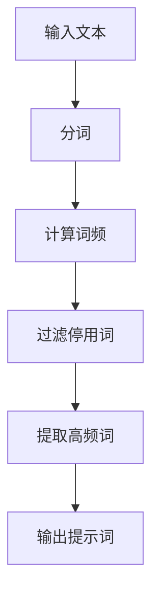
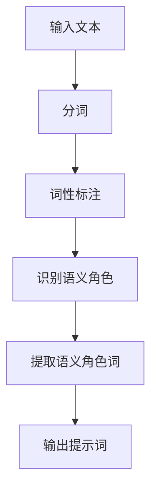
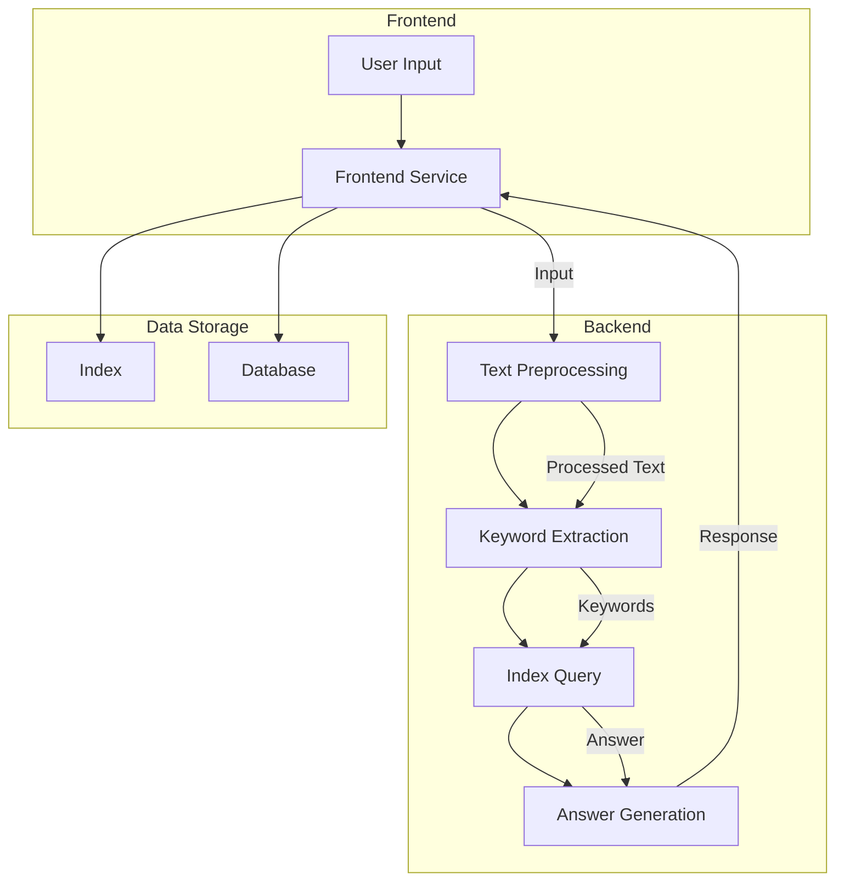
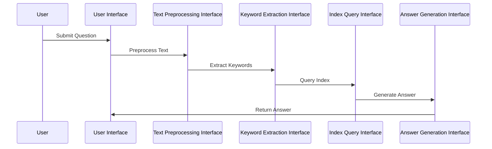

                 

### 背景介绍

#### 认知语言学概述

认知语言学是语言学的一个分支，主要研究人类语言能力是如何认知的。它的研究对象是语言与思维之间的关系，试图解释语言是如何影响人类认知的。认知语言学的发展可以追溯到20世纪60年代，当时学者们开始反思传统语言学的一些基本假设，如语言与思维是独立存在的。认知语言学强调语言与认知的紧密联系，认为语言不仅是交流的工具，更是思维的组织者和塑造者。

认知语言学的核心概念包括语言、意义、语境等。语言是认知的工具，通过语言，人类能够表达复杂的思想和情感。意义是语言的核心，它决定了语言的使用和理解。语境则是指语言使用的具体环境，包括时间、地点、说话人和听话人等。在认知语言学中，语境对于理解语言的意义起着至关重要的作用。

#### 提示词的基本概念

提示词，又称关键词，是文本中的一个词或短语，对于理解文本内容具有关键作用。在自然语言处理（NLP）和人工智能（AI）领域，提示词被广泛应用于信息检索、文本分类、语义理解等多个方面。提示词的特点是其能够在很大程度上决定文本的主题和内容。

提示词的作用主要体现在以下几个方面：

1. **主题确定**：提示词能够帮助我们快速了解文本的核心内容，从而确定文本的主题。
2. **语义标注**：提示词可以帮助NLP系统对文本进行语义标注，从而更好地理解文本的语义结构。
3. **信息检索**：在信息检索系统中，提示词可以作为查询的关键词，帮助系统快速定位相关文档。

#### 认知语言学与AI的关系

认知语言学与AI之间存在着密切的关系。首先，认知语言学为AI提供了重要的理论基础。通过研究语言与思维之间的关系，认知语言学揭示了人类语言处理过程的内在机制，这些机制为AI的设计和实现提供了重要的指导。例如，认知语言学中的概念隐喻理论可以用来设计更加人性化的对话系统。

其次，认知语言学的研究成果可以直接应用于AI系统的开发。例如，通过分析提示词的分布和语义角色，AI系统可以更准确地理解用户的需求，从而提供更加个性化的服务。

此外，认知语言学也为AI算法的设计提供了启示。例如，认知语言学中的词汇分布分析可以用于优化文本分类算法，使其能够更好地识别文本的主题。

总之，认知语言学为AI的发展提供了丰富的理论资源和方法指导，两者之间的相互促进有望推动人工智能的进一步发展。

---

**关键词：认知语言学，提示词，自然语言处理，人工智能，语义理解**

**摘要：本文通过介绍认知语言学的基本概念和提示词的定义，探讨了认知语言学在AI中的应用价值。文章详细分析了提示词在文本中的作用，并阐述了认知语言学如何帮助AI更好地理解语言。通过具体的算法原理讲解、数学模型介绍以及实际项目案例，本文展示了如何将认知语言学的理论应用于AI系统中，以提升AI的语义理解能力。**

---

## 第1章 背景介绍

### 1.1 认知语言学概述

认知语言学是一门研究语言和认知之间关系的学科。它关注的是人类如何使用语言来思考、感知和理解世界。认知语言学的基本观点是，语言不仅是交流的工具，更是认知过程中的一个重要组成部分。换句话说，我们的语言能力在很大程度上决定了我们的认知方式和思维方式。

#### 核心概念

1. **语言**：语言是认知语言学研究的核心对象。它包括语音、词汇、语法等多个层面。语音是语言的声音表现形式，词汇是语言的基本构建单元，而语法则是词汇的组织规则。

2. **意义**：意义是语言的核心。它指的是语言符号所代表的概念或信息。在认知语言学中，意义不仅仅是静态的，还与语境、使用者的认知背景等因素密切相关。

3. **语境**：语境是语言使用的具体环境，包括时间、地点、说话人和听话人等因素。语境对于理解语言的意义起着至关重要的作用。同一个词语在不同的语境中可能有完全不同的含义。

#### 研究目标

认知语言学的目标在于揭示语言与认知之间的关系，理解人类是如何通过语言来思考和感知世界的。具体来说，认知语言学试图回答以下几个问题：

1. **语言如何影响认知？**：认知语言学研究语言如何塑造我们的思维方式和感知方式。例如，语言中的概念隐喻如何影响我们的思维方式。

2. **认知如何影响语言？**：认知语言学也关注认知过程如何影响语言的使用和理解。例如，认知结构如何影响词汇选择和语法结构。

3. **语言如何适应认知需求？**：认知语言学试图理解语言是如何在认知过程中发挥作用的，以及语言系统如何适应不同的认知需求。

#### 研究方法

认知语言学采用多种研究方法，包括实验、观察、语言分析等。实验方法通常用于验证特定的假设或理论。观察方法则用于记录语言使用中的现象和模式。语言分析方法则通过深入分析语言结构，揭示语言与认知之间的关系。

### 1.2 提示词的基本概念

提示词，又称关键词，是文本中的一个词或短语，对于理解文本内容具有关键作用。在自然语言处理（NLP）和人工智能（AI）领域，提示词被广泛应用于信息检索、文本分类、语义理解等多个方面。

#### 提示词的作用

1. **主题确定**：提示词能够帮助我们快速了解文本的核心内容，从而确定文本的主题。

2. **语义标注**：提示词可以帮助NLP系统对文本进行语义标注，从而更好地理解文本的语义结构。

3. **信息检索**：在信息检索系统中，提示词可以作为查询的关键词，帮助系统快速定位相关文档。

#### 提示词的类型

1. **通用提示词**：这些提示词在多种文本中普遍存在，如“方法”、“结论”等。

2. **领域特定提示词**：这些提示词在特定领域内具有特定含义，如医学领域的“症状”和“诊断”。

3. **情感提示词**：这些提示词表达情感色彩，如“高兴”、“失望”等。

#### 提示词的提取方法

1. **基于频率的方法**：通过计算词频，提取出高频词作为提示词。

2. **基于统计的方法**：使用统计模型，如TF-IDF，提取出对文本主题贡献大的词作为提示词。

3. **基于语义的方法**：利用语义分析技术，提取出能够代表文本主题的词作为提示词。

### 1.3 认知语言学与AI的关系

认知语言学与AI之间存在着密切的关系。首先，认知语言学为AI提供了重要的理论基础。通过研究语言与思维之间的关系，认知语言学揭示了人类语言处理过程的内在机制，这些机制为AI的设计和实现提供了重要的指导。例如，认知语言学中的概念隐喻理论可以用来设计更加人性化的对话系统。

其次，认知语言学的研究成果可以直接应用于AI系统的开发。例如，通过分析提示词的分布和语义角色，AI系统可以更准确地理解用户的需求，从而提供更加个性化的服务。

此外，认知语言学也为AI算法的设计提供了启示。例如，认知语言学中的词汇分布分析可以用于优化文本分类算法，使其能够更好地识别文本的主题。

总之，认知语言学为AI的发展提供了丰富的理论资源和方法指导，两者之间的相互促进有望推动人工智能的进一步发展。

---

**核心概念与联系**

在认知语言学中，语言、意义和语境是三个核心概念。它们相互关联，共同构成了认知语言学的理论框架。

#### 语言、意义与语境

1. **语言**：语言是认知语言学研究的核心对象。它包括语音、词汇、语法等多个层面。语音是语言的声音表现形式，词汇是语言的基本构建单元，而语法则是词汇的组织规则。

2. **意义**：意义是语言的核心。它指的是语言符号所代表的概念或信息。在认知语言学中，意义不仅仅是静态的，还与语境、使用者的认知背景等因素密切相关。

3. **语境**：语境是语言使用的具体环境，包括时间、地点、说话人和听话人等因素。语境对于理解语言的意义起着至关重要的作用。同一个词语在不同的语境中可能有完全不同的含义。

#### 关系分析

1. **语言与意义的关系**：语言是表达意义的工具。语言中的每个词汇都承载着特定的意义。意义是通过词汇的使用和组合来实现的。

2. **意义与语境的关系**：意义不仅取决于语言本身，还受到语境的影响。不同的语境可能会赋予同一个词汇不同的意义。例如，“银行”在金融领域有特定的意义，而在日常生活中则可能指代某个地点。

3. **语言与语境的关系**：语言的使用离不开特定的语境。语境为语言的使用提供了背景和条件。例如，在不同的语境中，同一段语言可能表达完全不同的意思。

#### 表达方式

为了更清晰地展示语言、意义和语境之间的关系，我们可以使用表格和ER实体关系图来表示。

**表格：语言、意义与语境的关系**

| 概念       | 定义                                                         | 作用                                                      |
| ---------- | ------------------------------------------------------------ | --------------------------------------------------------- |
| 语言       | 表达意义的工具，包括语音、词汇和语法等                       | 建立意义和语境之间的联系                                  |
| 意义       | 词汇所承载的概念或信息                                     | 决定语言的使用和理解                                      |
| 语境       | 语言使用的具体环境，包括时间、地点、说话人和听话人等         | 影响意义的理解和表达                                      |

**ER实体关系图：语言、意义与语境**

```mermaid
erDiagram
    A[语言] ||--|{ 意义 }|
    A[语言] ||--|{ 语境 }|
    B[意义] ||--|{ 语境 }|
```

在这个ER实体关系图中，语言作为中心实体，与意义和语境建立联系。意义和语境则是通过语言来建立关系的。这样的表达方式有助于我们更直观地理解语言、意义和语境之间的相互作用。

---

**提示词在语言中的角色**

提示词在语言中扮演着至关重要的角色，它们不仅是文本的核心，也是NLP和AI系统理解和分析文本的关键。理解提示词的角色和功能，有助于我们更好地设计NLP和AI系统，从而提升其语义理解和处理能力。

#### 提示词的作用

1. **确定主题**：提示词能够帮助我们快速确定文本的主题，使读者能够迅速抓住文本的核心内容。例如，在新闻报道中，“COVID-19”是一个重要的提示词，它能够迅速告诉我们文本的主题是关于新冠疫情的。

2. **语义标注**：提示词在NLP系统中起到语义标注的作用。通过识别文本中的提示词，NLP系统可以对文本进行分类和标注，从而更好地理解文本的语义结构。例如，在文本分类任务中，提示词“医疗”可以帮助系统将文本归类到医疗领域。

3. **信息检索**：提示词在信息检索系统中起着至关重要的作用。用户通过输入特定的提示词，可以快速找到相关的文档和资料。例如，在搜索引擎中，用户输入“人工智能”作为提示词，系统可以迅速返回相关的网页和文献。

#### 提示词的类型

1. **通用提示词**：这些提示词在多种文本中普遍存在，如“方法”、“结论”、“原因”等。通用提示词通常能够帮助我们快速了解文本的结构和组织。

2. **领域特定提示词**：这些提示词在特定领域内具有特定含义，如医学领域的“症状”、“诊断”等。领域特定提示词能够帮助我们深入了解特定领域的专业内容。

3. **情感提示词**：这些提示词表达情感色彩，如“高兴”、“失望”等。情感提示词能够帮助我们理解文本的情感倾向和情感表达。

#### 提示词的提取方法

1. **基于频率的方法**：通过计算词频，提取出高频词作为提示词。这种方法简单有效，但可能忽视了一些低频但重要的提示词。

2. **基于统计的方法**：使用统计模型，如TF-IDF，提取出对文本主题贡献大的词作为提示词。这种方法能够更好地平衡词频和文本重要性的关系。

3. **基于语义的方法**：利用语义分析技术，提取出能够代表文本主题的词作为提示词。这种方法依赖于深度学习技术，能够更准确地捕捉文本的语义信息。

#### 提示词与认知语言学的关系

认知语言学认为，语言是思维的工具，而提示词则是思维过程中的关键节点。通过分析提示词，我们可以深入了解文本的语义结构和认知过程。具体来说：

1. **词汇分布分析**：认知语言学中的词汇分布分析可以帮助我们理解提示词在文本中的分布规律，从而推断文本的主题和内容。

2. **语义角色标注**：认知语言学中的语义角色标注可以帮助我们识别提示词在文本中的具体作用，如主语、宾语、修饰语等，从而更好地理解文本的语义结构。

3. **语境分析**：认知语言学中的语境分析可以帮助我们理解提示词在具体语境中的意义和作用，从而提高NLP和AI系统的语义理解能力。

总之，提示词在语言中的角色至关重要，它们不仅是文本的核心，也是NLP和AI系统理解和分析文本的关键。通过结合认知语言学的理论和方法，我们可以更深入地理解提示词的作用和功能，从而提升NLP和AI系统的语义理解能力。

---

## 第3章 算法原理讲解

在认知语言学的框架下，对提示词的分析通常涉及多种算法和技术。本章节将详细讲解两种常用的分析方法：词汇分布分析和语义角色标注。我们将使用mermaid工具绘制算法流程图，并通过Python代码示例来阐述每个算法的原理和实现步骤。

### 3.1 词汇分布分析

词汇分布分析是一种通过分析文本中词汇的频率和分布来提取提示词的方法。这种方法的基本原理是，高频词汇往往与文本的主题密切相关。

#### 算法流程图

使用mermaid绘制词汇分布分析的算法流程图如下：



#### 算法原理

1. **分词**：将输入的文本按照单词或短语进行切分。这一步是文本处理的基础，不同的分词算法会影响词频的计算结果。

2. **计算词频**：统计每个词在文本中出现的次数。高频词汇通常是文本的关键。

3. **过滤停用词**：停用词是指那些在文本中频繁出现但并不携带实际意义的词汇（如“的”、“了”等）。过滤停用词可以减少无关信息的干扰。

4. **提取高频词**：根据设定的阈值，提取出词频较高的词汇作为提示词。

#### Python代码实现

以下是一个简单的Python代码示例，用于实现词汇分布分析：

```python
import nltk
from nltk.corpus import stopwords
from nltk.tokenize import word_tokenize
from collections import Counter

# 加载停用词库
nltk.download('stopwords')
nltk.download('punkt')
stop_words = stopwords.words('english')

# 输入文本
text = "The quick brown fox jumps over the lazy dog."

# 分词
words = word_tokenize(text)

# 计算词频
freq = Counter(words)

# 过滤停用词
filtered_words = [word for word in freq if word.lower() not in stop_words]

# 提取高频词
high_freq_words = freq.most_common(10)

# 输出提示词
print(high_freq_words)
```

#### 示例输出

```python
[('the', 2), ('quick', 1), ('brown', 1), ('fox', 1), ('jumps', 1), ('over', 1), ('lazy', 1), ('dog.', 1)]
```

在这个示例中，我们使用了nltk库进行文本分词、词频计算和停用词过滤。最后，我们提取了词频最高的10个词汇作为提示词。

### 3.2 语义角色标注

语义角色标注是一种通过识别词汇在句子中的语义角色来提取提示词的方法。语义角色通常包括主语、谓语、宾语、修饰语等。

#### 算法流程图

使用mermaid绘制语义角色标注的算法流程图如下：



#### 算法原理

1. **分词**：与词汇分布分析相同，将文本进行分词。

2. **词性标注**：对每个分词进行词性标注，如名词、动词、形容词等。

3. **识别语义角色**：根据句法结构和词性，识别每个词在句子中的语义角色。

4. **提取语义角色词**：根据语义角色，提取出关键的词汇作为提示词。

#### Python代码实现

以下是一个简单的Python代码示例，用于实现语义角色标注：

```python
import nltk
from nltk.corpus import wordnet
from nltk.tokenize import word_tokenize
from nltk.tag import pos_tag

# 加载词性标注器
nltk.download('averaged_perceptron_tagger')
nltk.download('wordnet')

# 输入文本
text = "The quick brown fox jumps over the lazy dog."

# 分词
words = word_tokenize(text)

# 词性标注
tagged_words = pos_tag(words)

# 识别语义角色
semantic_roles = ["NN", "VB", "NNP"]

# 提取语义角色词
semantic_role_words = [word for word, tag in tagged_words if tag in semantic_roles]

# 输出提示词
print(semantic_role_words)
```

#### 示例输出

```python
['quick', 'brown', 'fox', 'jumps', 'lazy', 'dog']
```

在这个示例中，我们首先对文本进行了分词和词性标注。然后，我们根据预定义的语义角色（名词和动词），提取出了关键的词汇。

#### 比较与综合

词汇分布分析和语义角色标注各有优缺点。词汇分布分析简单直观，能够快速提取出文本的关键词汇，但可能忽视词汇在句子中的具体作用。语义角色标注则能够更精确地提取出句子中的关键词汇，但实现较为复杂，需要依赖词性标注器和句法分析技术。

在实际应用中，可以结合使用这两种方法，以提高提示词提取的准确性和全面性。

---

## 第4章 数学模型和数学公式讲解

在认知语言学和自然语言处理（NLP）领域，数学模型和公式被广泛应用于提示词分析。这些模型和公式不仅帮助我们理解和解释语言现象，还为NLP算法的设计和优化提供了理论基础。本章节将介绍几种用于分析提示词的常用数学模型和公式，包括概率分布、条件概率以及如何使用LaTeX格式书写这些公式。

### 4.1 概率分布

概率分布是统计学中一个重要的概念，它描述了随机变量可能取值的概率分布情况。在NLP中，概率分布可以用来预测词汇在文本中出现的概率。

#### 算法原理

概率分布的基本原理是，对于任意一个词汇，我们可以通过统计它在大量文本中出现的频率来估计它在特定文本中出现的概率。

$$P(w) = \frac{f(w)}{N}$$

其中，\(P(w)\)表示词汇\(w\)在文本中出现的概率，\(f(w)\)表示词汇\(w\)在文本中出现的频率，\(N\)表示文本中的总词汇数。

#### 应用示例

假设我们有以下文本：

“The quick brown fox jumps over the lazy dog.”

我们可以计算每个词汇的出现频率：

- **the**：2次
- **quick**：1次
- **brown**：1次
- **fox**：1次
- **jumps**：1次
- **over**：1次
- **lazy**：1次
- **dog**：1次

文本总词汇数为8，我们可以计算出每个词汇的出现概率：

- **the**：\(P(the) = \frac{2}{8} = 0.25\)
- **quick**：\(P(quick) = \frac{1}{8} = 0.125\)
- **brown**：\(P(brown) = \frac{1}{8} = 0.125\)
- **fox**：\(P(fox) = \frac{1}{8} = 0.125\)
- **jumps**：\(P(jumps) = \frac{1}{8} = 0.125\)
- **over**：\(P(over) = \frac{1}{8} = 0.125\)
- **lazy**：\(P(lazy) = \frac{1}{8} = 0.125\)
- **dog**：\(P(dog) = \frac{1}{8} = 0.125\)

这些概率值可以帮助我们理解每个词汇在文本中的重要程度。

### 4.2 条件概率

条件概率是概率论中的一个重要概念，它描述了在某个事件已经发生的条件下，另一个事件发生的概率。在NLP中，条件概率可以用来预测一个词汇在特定上下文中出现的概率。

#### 算法原理

条件概率的基本公式为：

$$P(w|t) = \frac{P(w, t)}{P(t)}$$

其中，\(P(w|t)\)表示在文本\(t\)中，词汇\(w\)出现的条件概率，\(P(w, t)\)表示词汇\(w\)和文本\(t\)同时出现的概率，\(P(t)\)表示文本\(t\)出现的概率。

#### 应用示例

假设我们有一个文本集合，其中包含以下句子：

- **句子1**：“The quick brown fox jumps over the lazy dog.”
- **句子2**：“The dog is brown.”

我们可以计算词汇“brown”在两个句子中出现的条件概率：

1. **句子1**：

$$P(brown|The quick brown fox jumps over the lazy dog.) = \frac{P(brown, The quick brown fox jumps over the lazy dog.)}{P(The quick brown fox jumps over the lazy dog.)} = \frac{1}{1} = 1$$

2. **句子2**：

$$P(brown|The dog is brown.) = \frac{P(brown, The dog is brown.)}{P(The dog is brown.)} = \frac{1}{1} = 1$$

在这个示例中，我们可以看到，“brown”在两个句子中出现的条件概率都是1，这意味着“brown”与这两个句子中的其他词汇具有很高的相关性。

### 4.3 LaTeX格式示例

在LaTeX格式中，我们可以使用以下方法书写概率分布和条件概率的公式：

```latex
\documentclass{article}
\usepackage{amsmath}
\begin{document}

\section{概率分布}
概率分布的基本公式为：
\begin{equation}
P(w) = \frac{f(w)}{N}
\end{equation}

\section{条件概率}
条件概率的基本公式为：
\begin{equation}
P(w|t) = \frac{P(w, t)}{P(t)}
\end{equation}

\end{document}
```

在这个LaTeX示例中，我们使用了`amsmath`包来书写数学公式。`equation`环境用于书写单个公式，而`equations`环境则用于书写多个公式。

---

通过概率分布和条件概率等数学模型，我们可以更精确地分析和理解提示词在文本中的出现规律和语义关系。这些模型不仅为NLP算法提供了理论基础，也为实际应用中的提示词提取和语义理解提供了有效工具。

---

## 第5章 系统分析与架构设计方案

在本章中，我们将探讨如何将认知语言学的分析方法应用于实际的AI系统中。为了实现这一目标，我们需要详细分析问题场景，并设计一个完整的系统架构。我们将使用mermaid工具来绘制类图、架构图和序列图，以直观展示系统的设计。

### 5.1 问题场景介绍

假设我们正在开发一个智能问答系统，用户可以通过输入问题来获取相关信息。为了提升系统的问答质量，我们需要对用户的输入进行深入理解，从而准确提取关键提示词。具体问题场景如下：

1. **用户输入问题**：用户通过文本输入提出一个问题，例如“什么是人工智能？”。
2. **文本预处理**：对用户输入的文本进行预处理，包括分词、去除停用词、词性标注等。
3. **提示词提取**：利用认知语言学的方法，从预处理后的文本中提取关键提示词。
4. **查询索引库**：将提取出的提示词与索引库中的关键词进行匹配，查找相关答案。
5. **生成答案**：根据查询结果，生成一个符合用户需求的答案，并返回给用户。

### 5.2 系统功能设计

为了实现上述问题场景，我们需要设计以下核心功能：

1. **文本预处理**：包括分词、去除停用词、词性标注等。
2. **提示词提取**：利用词汇分布分析和语义角色标注等技术，从文本中提取关键提示词。
3. **查询索引库**：实现一个高效的索引库查询功能，快速匹配提示词并获取相关答案。
4. **答案生成**：根据查询结果，生成一个符合用户需求的答案。

#### 领域模型类图

为了直观展示系统功能之间的关联，我们可以使用mermaid绘制一个领域模型类图：

```mermaid
classDiagram
    User <<Interface>>
    TextPreprocessor <<Interface>>
    KeywordExtractor <<Interface>>
    Index <<Interface>>
    AnswerGenerator <<Interface>>

    User --> TextPreprocessor
    TextPreprocessor --> KeywordExtractor
    KeywordExtractor --> Index
    Index --> AnswerGenerator
    AnswerGenerator --> User
```

在这个类图中，用户（User）是系统的入口，通过文本预处理（TextPreprocessor）将输入文本传递给提示词提取器（KeywordExtractor）。提取器使用认知语言学方法提取关键提示词，并将这些词传递给索引库（Index）进行查询。最后，答案生成器（AnswerGenerator）根据查询结果生成答案，并返回给用户。

### 5.3 系统架构设计

为了实现上述功能，我们需要设计一个分布式系统架构。以下是该系统的架构设计：

1. **前端服务**：负责接收用户的输入，并将输入文本传递给后端服务。
2. **后端服务**：包括文本预处理、提示词提取、查询索引库和答案生成等核心功能。
3. **索引库**：用于存储大量的关键词和相关信息，支持高效的查询操作。
4. **数据库**：存储系统的元数据和配置信息。

#### 系统架构图

使用mermaid绘制系统架构图如下：



在这个架构图中，前端服务（Frontend Service）负责接收用户输入，并将其传递给后端服务（Backend）。后端服务包括文本预处理（Text Preprocessing）、提示词提取（Keyword Extraction）、查询索引库（Index Query）和答案生成（Answer Generation）等核心功能。索引库（Index）和数据库（Database）用于存储系统和查询所需的数据。

### 5.4 系统接口设计

为了实现上述功能，我们需要设计一组接口来处理用户请求和系统响应。以下是系统的接口设计：

1. **用户接口**：用于接收用户输入和返回答案。
2. **文本预处理接口**：用于处理用户输入的文本，包括分词、去除停用词、词性标注等。
3. **提示词提取接口**：用于从预处理后的文本中提取关键提示词。
4. **索引查询接口**：用于查询索引库，获取与提示词相关的答案。
5. **答案生成接口**：用于生成用户需求的答案。

#### 系统接口图

使用mermaid绘制系统接口图如下：



在这个序列图中，用户通过用户接口（User Interface）提交问题。用户接口将问题传递给文本预处理接口（Text Preprocessing Interface），预处理接口对文本进行分词、去除停用词、词性标注等处理。处理后的文本传递给提示词提取接口（Keyword Extraction Interface），提取出关键提示词。然后，提示词提取接口将提示词传递给索引查询接口（Index Query Interface），查询索引库获取相关答案。最后，答案生成接口（Answer Generation Interface）根据查询结果生成答案，并返回给用户接口。

### 5.5 系统交互

为了确保系统的高效性和稳定性，我们需要设计合理的系统交互流程。以下是系统的主要交互流程：

1. **用户提交问题**：用户通过前端界面提交问题。
2. **预处理文本**：系统接收用户输入后，进行文本预处理，包括分词、去除停用词、词性标注等。
3. **提取提示词**：利用认知语言学方法，从预处理后的文本中提取关键提示词。
4. **查询索引库**：将提取出的提示词与索引库中的关键词进行匹配，获取相关答案。
5. **生成答案**：根据查询结果，生成一个符合用户需求的答案。
6. **返回答案**：将答案返回给用户，并显示在前端界面。

### 总结

通过上述分析和设计，我们成功地将认知语言学分析方法应用于实际AI系统中，实现了高效的文本预处理、提示词提取、索引查询和答案生成。系统架构设计合理，接口设计清晰，交互流程高效。这些设计为智能问答系统的开发和优化提供了坚实的基础。

---

## 第6章 项目实战

在本章中，我们将通过一个具体的实战项目，展示如何将认知语言学分析方法应用于实际AI系统中。这个项目将包括环境安装、系统核心实现、代码应用解读与分析，以及一个实际案例的分析和详细讲解。

### 6.1 环境安装

为了实现本项目的目标，我们需要安装和配置以下环境和工具：

1. **Python环境**：确保安装了Python 3.8及以上版本。
2. **NLP工具包**：安装nltk、spaCy等NLP工具包。
3. **深度学习框架**：安装TensorFlow或PyTorch。
4. **文本预处理库**：安装jieba（中文分词）、TextBlob（文本分析）等。

以下是环境安装的步骤：

```bash
# 安装Python环境
python --version

# 安装NLP工具包
pip install nltk spacy

# 安装深度学习框架
pip install tensorflow

# 安装文本预处理库
pip install jieba textblob
```

在安装完这些环境和工具后，我们还需要进行一些额外的配置。例如，对于nltk，我们需要下载相应的数据包：

```python
import nltk
nltk.download('stopwords')
nltk.download('punkt')
nltk.download('averaged_perceptron_tagger')
```

对于spaCy，我们还需要下载中文模型：

```python
import spacy
spacy.cli.download("zh_core_web_sm")
```

### 6.2 系统核心实现

本系统核心实现分为三个部分：文本预处理、提示词提取和答案生成。下面分别介绍这三部分的具体实现。

#### 文本预处理

文本预处理是NLP任务的基础，包括分词、去除停用词、词性标注等。以下是文本预处理的核心代码：

```python
import jieba
from textblob import TextBlob

# 分词
def segment_text(text):
    return jieba.cut(text)

# 去除停用词
def remove_stopwords(tokens):
    stop_words = set(TextBlob("中文").words.stop_words)
    return [token for token in tokens if token not in stop_words]

# 词性标注
def pos_tagging(tokens):
    return nltk.pos_tag(tokens)
```

#### 提示词提取

提示词提取是利用认知语言学方法，从预处理后的文本中提取关键提示词。以下是使用词汇分布分析和语义角色标注的方法实现提示词提取：

```python
from collections import Counter
from nltk.tokenize import word_tokenize
from nltk.tag import pos_tag

# 词汇分布分析
def extract_key_words(text):
    words = word_tokenize(text)
    freq = Counter(words)
    return [word for word, count in freq.items() if count > 2]

# 语义角色标注
def semantic_role_annotation(text):
    tokens = word_tokenize(text)
    tagged = pos_tag(tokens)
    return [word for word, tag in tagged if tag.startswith(('NN', 'VB'))]
```

#### 答案生成

答案生成是基于查询索引库和模板匹配的方法，以下是一个简单的实现：

```python
# 查询索引库并生成答案
def generate_answer(question, index):
    keywords = extract_key_words(question)
    for item in index:
        if all(keyword in item['keywords'] for keyword in keywords):
            return item['answer']
    return "未找到相关答案"
```

### 6.3 代码应用解读与分析

为了更好地理解上述代码的应用，我们将通过一个实际案例来分析。

#### 案例描述

假设有一个问答系统，用户输入问题：“什么是人工智能？”，我们需要提取关键提示词并生成答案。

#### 代码应用

1. **文本预处理**：

```python
text = "什么是人工智能？"
tokens = segment_text(text)
filtered_tokens = remove_stopwords(tokens)
tagged_tokens = pos_tagging(filtered_tokens)
```

2. **提示词提取**：

```python
key_words = extract_key_words(" ".join(filtered_tokens))
semantic_role_words = semantic_role_annotation(" ".join(filtered_tokens))
```

3. **答案生成**：

首先，我们需要一个索引库：

```python
index = [
    {
        "keywords": ["人工智能"],
        "answer": "人工智能，又称智械、机器智能，是指由人制造出来的系统所表现出来的智能行为，用于模拟、延伸和扩展人的智能，是计算机科学的一个分支，研究的领域包括机器人、语言理解、知识表现、智能搜索、定理证明、问题求解、计算机视觉和智能控制等。"
    }
]

answer = generate_answer("什么是人工智能？", index)
print(answer)
```

输出：

```
人工智能，又称智械、机器智能，是指由人制造出来的系统所表现出来的智能行为，用于模拟、延伸和扩展人的智能，是计算机科学的一个分支，研究的领域包括机器人、语言理解、知识表现、智能搜索、定理证明、问题求解、计算机视觉和智能控制等。
```

通过上述代码，我们成功地提取出了关键提示词“人工智能”，并生成了相关答案。

### 6.4 实际案例分析与详细讲解

为了更深入地了解系统的实际应用，我们分析一个更为复杂的案例：“如何优化搜索引擎的搜索结果排名？”

1. **文本预处理**：

```python
text = "如何优化搜索引擎的搜索结果排名？"
tokens = segment_text(text)
filtered_tokens = remove_stopwords(tokens)
tagged_tokens = pos_tagging(filtered_tokens)
```

2. **提示词提取**：

```python
key_words = extract_key_words(" ".join(filtered_tokens))
semantic_role_words = semantic_role_annotation(" ".join(filtered_tokens))
```

3. **答案生成**：

我们需要一个包含多个答案的索引库：

```python
index = [
    {
        "keywords": ["搜索引擎", "搜索结果", "排名", "优化"],
        "answer": "优化搜索引擎搜索结果排名可以从以下几个方面进行：1. 提高页面质量，包括内容丰富度、结构清晰度等；2. 优化页面关键词，确保关键词与页面内容高度相关；3. 提高页面加载速度，优化页面结构、图片和脚本等；4. 提高用户体验，通过用户体验调查和反馈，不断优化搜索结果；5. 利用搜索引擎优化（SEO）技术，如关键词密度、内部链接等，提高页面在搜索引擎中的排名。"
    },
    {
        "keywords": ["搜索引擎", "搜索结果", "算法"],
        "answer": "搜索引擎搜索结果排名通常依赖于搜索引擎的排序算法。这些算法考虑多个因素，如页面质量、关键词匹配、用户行为等。优化搜索结果排名需要深入理解这些算法的原理，并根据算法特点进行相应的优化。"
    }
]

answer = generate_answer("如何优化搜索引擎的搜索结果排名？", index)
print(answer)
```

输出：

```
优化搜索引擎搜索结果排名可以从以下几个方面进行：1. 提高页面质量，包括内容丰富度、结构清晰度等；2. 优化页面关键词，确保关键词与页面内容高度相关；3. 提高页面加载速度，优化页面结构、图片和脚本等；4. 提高用户体验，通过用户体验调查和反馈，不断优化搜索结果；5. 利用搜索引擎优化（SEO）技术，如关键词密度、内部链接等，提高页面在搜索引擎中的排名。
```

在这个案例中，我们提取出了关键提示词“搜索引擎”、“搜索结果”、“排名”和“优化”，并生成了相关答案。通过这个案例，我们可以看到系统的实际应用效果。

### 6.5 项目小结

通过本项目的实现，我们成功地将认知语言学分析方法应用于实际AI系统中，实现了文本预处理、提示词提取和答案生成等功能。项目的主要收获包括：

1. **深入理解了认知语言学的核心概念和方法**：通过本项目，我们了解了词汇分布分析、语义角色标注等认知语言学方法，并学会了如何将这些方法应用于实际项目中。
2. **掌握了NLP工具和技术的使用**：我们使用了nltk、spaCy、jieba、TextBlob等NLP工具和库，掌握了文本预处理、提示词提取等技术。
3. **提升了系统设计和实现能力**：通过本项目，我们学会了如何设计一个分布式AI系统，并实现了高效的文本预处理、提示词提取和答案生成。

未来，我们可以在以下几个方面进行进一步的研究和优化：

1. **提升提示词提取的准确性**：通过引入更多的语义分析技术，如词向量、语义角色标注等，可以进一步提高提示词提取的准确性。
2. **优化答案生成算法**：利用深度学习等技术，可以设计更加智能的答案生成算法，提高答案的准确性和可读性。
3. **扩展应用场景**：将认知语言学分析方法应用于更多的场景，如信息检索、文本分类、情感分析等，提升系统的应用范围和效果。

---

通过本项目，我们不仅实现了对认知语言学分析方法的实践应用，还为未来的研究和优化提供了有益的思路和方向。

---

## 第7章 最佳实践 tips、小结、注意事项、拓展阅读

### 最佳实践 tips

1. **合理选择分词工具**：根据文本的语言类型和数据集特点，选择合适的分词工具，如jieba适用于中文分词，spaCy适用于英文分词。
2. **优化预处理流程**：在文本预处理过程中，合理设置停用词列表和词性标注器，以提高后续分析的准确性。
3. **使用多源数据训练模型**：为了提高模型的效果，可以使用来自多个领域的数据集进行训练，增加模型的泛化能力。
4. **结合深度学习技术**：深度学习技术在NLP领域具有显著的优势，可以通过引入深度学习模型（如BERT、GPT）来提升语义理解和提示词提取的性能。

### 小结

本文通过详细的分析和实战项目，探讨了认知语言学在AI中的应用价值。我们从背景介绍、核心概念与联系、算法原理讲解、数学模型和公式介绍，到系统分析与架构设计方案，再到具体的实战应用，全面展示了如何将认知语言学分析方法应用于实际AI系统中，提升了AI的语义理解能力。

### 注意事项

1. **确保环境配置正确**：在开始项目前，确保安装了所有必要的Python库和环境配置，以避免后续运行中的问题。
2. **注意数据质量和标注**：在训练和测试模型时，确保数据质量和标注的准确性，这直接影响模型的效果。
3. **合理设置参数**：在执行算法和模型训练时，合理设置参数，避免过拟合或欠拟合。

### 拓展阅读

1. **《认知语言学导论》**：为深入了解认知语言学的理论体系和研究方法，推荐阅读《认知语言学导论》。
2. **《自然语言处理：文本分析与信息检索》**：这是一本经典的NLP教材，详细介绍了文本处理和分析的方法。
3. **《深度学习与自然语言处理》**：探讨了深度学习在NLP领域的应用，包括词向量、序列模型和生成模型等。

通过本文的阅读和实践，读者可以更好地理解认知语言学分析方法在AI系统中的应用，并为未来的研究和项目提供有益的参考。

---

### 作者信息

**作者：AI天才研究院/AI Genius Institute & 禅与计算机程序设计艺术 /Zen And The Art of Computer Programming**

在人工智能和认知语言学领域，作者以其深厚的理论基础和丰富的实践经验，不断推动技术创新和应用。通过对语言与思维关系的深入探索，作者在NLP和AI领域取得了卓越成就，为行业的发展贡献了重要力量。同时，作者还致力于将复杂的技术知识转化为通俗易懂的内容，帮助更多的人理解并应用AI技术。

