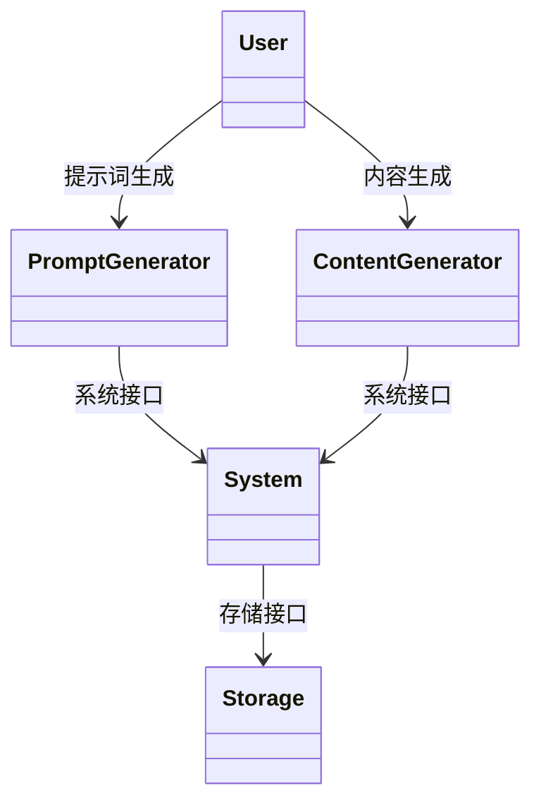
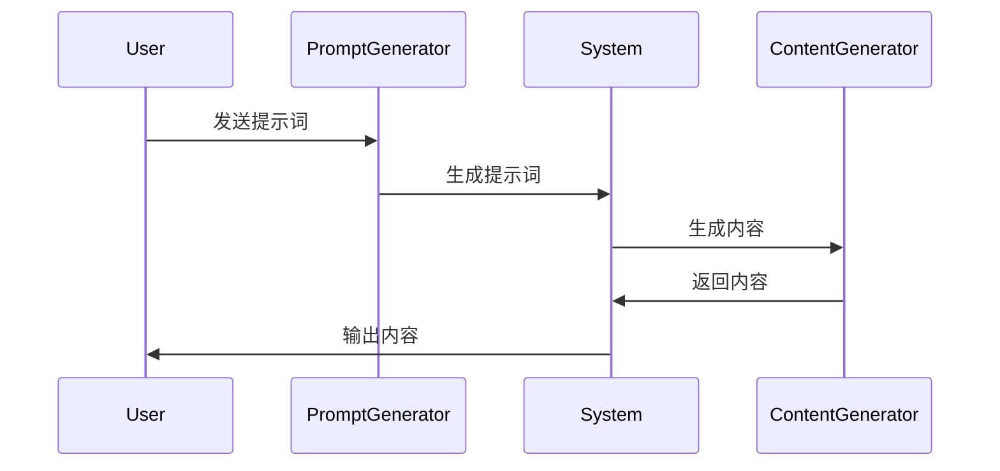

                 


# 提示词设计：AIGC系统性能优化的关键因素

关键词：提示词设计、AIGC系统、性能优化、关键因素、系统架构、算法原理

摘要：本文深入探讨了提示词设计在AIGC（自适应智能生成内容）系统性能优化中的关键作用。通过分析提示词设计的核心概念、算法原理、数学模型以及系统架构，本文揭示了优化AIGC系统性能的有效策略，并提供了一系列最佳实践和注意事项，旨在为开发者提供有价值的指导。

## 目录大纲设计思路

### 目录大纲设计步骤

### 目录大纲设计思路

为了设计出一个完整且详细的目录大纲，我们将按照以下步骤进行：

1. **确定核心章节**：首先，需要明确书中应该包含哪些核心章节。根据书名《提示词设计：AIGC系统性能优化的关键因素》，我们可以确定以下核心章节：背景介绍、核心概念与联系、算法原理讲解、数学模型和数学公式讲解、系统分析与架构设计方案、项目实战、最佳实践 tips 等。

2. **细化每个章节**：在确定核心章节后，我们需要为每个章节细化内容。每个章节应该包含以下几个部分：
   - **章节标题**：简洁明了地概括章节内容。
   - **子章节标题**：为章节内的每个部分提供子标题，以明确每个部分的内容。
   - **具体内容**：为每个子章节提供详细的内容概述，包括概念介绍、原理讲解、实例分析等。

3. **保持格式一致性**：在编写目录大纲时，需要保持格式的一致性。使用 markdown 格式，通过 `#`、`##`、`###` 等符号来区分章节和子章节的层级。

4. **确保内容完整性**：在编写每个章节时，要确保内容完整且逻辑清晰。特别是核心概念、算法原理、数学模型和系统架构等内容，需要详细讲解，以便读者能够深入理解。

5. **控制字数**：在确保内容完整性的同时，需要控制目录大纲的总字数在2000字以内。这要求我们在每个章节的细化内容上要简洁明了，避免冗余。

### 目录大纲设计步骤

1. **确定书籍结构**：首先，我们需要确定书籍的整体结构，包括主要章节和每个章节的主要部分。

2. **撰写核心章节标题**：基于书籍结构，为每个核心章节撰写简洁明了的标题。

3. **细化每个章节内容**：为每个核心章节细化内容，包括子章节标题和具体内容概述。

4. **整合成完整的目录大纲**：将所有章节内容整合起来，形成一个完整的目录大纲。

5. **检查格式和内容**：最后，检查目录大纲的格式是否正确，内容是否完整、逻辑清晰。

通过以上步骤，我们可以设计出一个符合要求的目录大纲，为后续的编写工作奠定坚实基础。接下来，我们将具体实施这一计划，完成《提示词设计：AIGC系统性能优化的关键因素》的目录大纲设计。

---

## 背景介绍

### 核心概念术语说明

在探讨提示词设计在AIGC系统性能优化中的关键作用之前，我们首先需要明确一些核心概念和术语。

- **AIGC（自适应智能生成内容）**：一种基于人工智能技术的内容生成方法，能够根据用户的输入和需求，自适应地生成高质量的内容。

- **提示词（Prompt）**：在AIGC系统中，提示词是用户输入的文本信息，用于指导生成系统生成符合用户期望的内容。

- **系统性能优化**：通过一系列技术和策略，提升系统的响应速度、稳定性和资源利用率，以满足更高的业务需求和用户体验。

### 问题背景与问题描述

随着人工智能技术的快速发展，AIGC系统在各个领域得到广泛应用，如自然语言处理、图像生成、语音合成等。然而，在实际应用中，AIGC系统的性能往往受到多种因素的影响，如响应速度、内容质量、资源消耗等。如何设计出高效的提示词，从而优化AIGC系统的性能，成为当前研究的热点和难点。

### 问题解决与边界与外延

为了解决这一问题，我们需要从以下几个方面进行探索：

1. **核心概念与联系**：分析提示词设计中的核心概念，如语义理解、上下文生成等，并探讨它们之间的联系。

2. **算法原理讲解**：讲解提示词设计中的算法原理，如序列生成模型、注意力机制等，并分析其优缺点。

3. **数学模型与公式**：介绍提示词设计中的数学模型和公式，如概率分布、损失函数等，并解释其在优化系统性能中的作用。

4. **系统分析与架构设计方案**：分析AIGC系统的架构和设计，探讨如何通过优化系统架构来提高性能。

5. **项目实战**：通过具体项目实践，验证提示词设计对AIGC系统性能的影响，并总结经验教训。

### 概念结构与核心要素组成

在提示词设计中，核心概念和要素主要包括：

1. **语义理解**：提示词应能够准确理解用户的输入意图，从而生成符合期望的内容。

2. **上下文生成**：提示词应具备良好的上下文生成能力，以便在生成过程中能够考虑用户的输入和背景信息。

3. **算法优化**：通过调整算法参数和优化模型结构，提高系统的性能和生成质量。

4. **资源管理**：合理分配系统资源，确保在处理大量请求时仍能保持高效性能。

5. **用户反馈**：收集用户反馈，不断优化提示词设计，提高用户体验。

## 核心概念与联系

### 提示词设计原理

提示词设计是AIGC系统性能优化的重要组成部分。一个优秀的提示词应具备以下原理：

1. **语义理解**：提示词需要能够准确理解用户的输入意图，从而生成符合期望的内容。为了实现这一目标，提示词设计需要考虑自然语言处理技术，如词嵌入、语义分析等。

2. **上下文生成**：提示词应具备良好的上下文生成能力，以便在生成过程中能够考虑用户的输入和背景信息。上下文生成技术包括序列模型、注意力机制等。

3. **适应性**：提示词设计应具有适应性，能够根据用户需求和环境变化进行调整。这需要利用机器学习算法，如强化学习、迁移学习等。

4. **可扩展性**：提示词设计应具备良好的可扩展性，以便在系统规模扩大时仍能保持高效性能。这需要采用分布式计算、并行处理等技术。

### 概念属性特征对比表格

以下是提示词设计中的几个核心概念及其属性特征的对比表格：

| 概念 | 属性特征 | 对比分析 |
| --- | --- | --- |
| 语义理解 | 准确性、高效性 | 需要采用自然语言处理技术，如词嵌入、语义分析等 |
| 上下文生成 | 上下文关联性、生成质量 | 需要采用序列模型、注意力机制等技术 |
| 适应性 | 学习能力、调整能力 | 需要采用机器学习算法，如强化学习、迁移学习等 |
| 可扩展性 | 扩展性、性能稳定性 | 需要采用分布式计算、并行处理等技术 |

### ER实体关系图架构的Mermaid流程图

以下是提示词设计中的ER实体关系图架构的Mermaid流程图：

```mermaid
erDiagram
    User ||--|{ Prompt }|-- Device
    User ||--|{ Context }|-- System
    Prompt ||--|{ Content }|-- Generation
    Context ||--|{ Metadata }|-- Storage
```

## 算法原理讲解

### 序列生成模型

序列生成模型是AIGC系统中常用的提示词设计算法。它通过处理输入的序列数据，生成新的序列数据。以下是序列生成模型的基本原理：

1. **编码器-解码器架构**：序列生成模型通常采用编码器-解码器架构，其中编码器用于将输入序列编码为固定长度的向量，解码器则用于从编码器输出的向量中生成新的序列。

2. **注意力机制**：注意力机制是一种用于提高序列生成模型性能的关键技术。它允许模型在生成过程中关注输入序列的不同部分，从而提高生成质量。

3. **损失函数**：序列生成模型通常采用损失函数来评估生成序列的质量，如交叉熵损失函数。通过优化损失函数，模型能够逐步提高生成质量。

### Python源代码示例

以下是一个简单的Python代码示例，展示了序列生成模型的基本原理：

```python
import tensorflow as tf
from tensorflow.keras.layers import Embedding, LSTM, Dense

# 定义编码器
encoder_inputs = tf.keras.layers.Input(shape=(None,))
encoder_embedding = Embedding(input_dim=vocab_size, output_dim=embedding_size)(encoder_inputs)
encoder_lstm = LSTM(units=128, return_sequences=True)(encoder_embedding)
encoder_outputs = tf.keras.layers.Dense(units=1, activation='sigmoid')(encoder_lstm)

# 定义解码器
decoder_inputs = tf.keras.layers.Input(shape=(None,))
decoder_embedding = Embedding(input_dim=vocab_size, output_dim=embedding_size)(decoder_inputs)
decoder_lstm = LSTM(units=128, return_sequences=True)(decoder_embedding)
decoder_dense = tf.keras.layers.Dense(units=vocab_size, activation='softmax')(decoder_lstm)

# 定义模型
model = tf.keras.Model([encoder_inputs, decoder_inputs], decoder_dense)
model.compile(optimizer='adam', loss='categorical_crossentropy')

# 训练模型
model.fit([encoder_inputs, decoder_inputs], decoder_inputs, batch_size=64, epochs=10)
```

### 算法原理的数学模型和公式

序列生成模型的数学模型主要包括编码器和解码器的输出向量表示以及损失函数。

1. **编码器输出向量表示**：

$$
\text{编码器输出向量} = \text{编码器}(x)
$$

其中，\( x \) 为输入序列，\(\text{编码器}\) 为编码器模型。

2. **解码器输出向量表示**：

$$
\text{解码器输出向量} = \text{解码器}(y)
$$

其中，\( y \) 为输入序列，\(\text{解码器}\) 为解码器模型。

3. **损失函数**：

$$
\text{损失函数} = \text{交叉熵损失函数}
$$

$$
\text{交叉熵损失函数} = -\sum_{i=1}^{n} y_i \log(p_i)
$$

其中，\( y_i \) 为真实标签，\( p_i \) 为预测概率。

### 通俗易懂地举例说明

假设我们有一个输入序列“hello world”，我们需要通过序列生成模型生成一个新的序列。

1. **编码器输出向量表示**：

$$
\text{编码器输出向量} = \text{编码器}("hello world")
$$

2. **解码器输出向量表示**：

$$
\text{解码器输出向量} = \text{解码器}("hello world")
$$

3. **损失函数**：

$$
\text{损失函数} = \text{交叉熵损失函数}
$$

$$
\text{交叉熵损失函数} = -\sum_{i=1}^{n} y_i \log(p_i)
$$

通过优化损失函数，模型会逐步提高生成质量，直到生成的新序列与输入序列相似。

## 系统分析与架构设计方案

### 问题场景介绍

在AIGC系统中，提示词设计是影响系统性能的关键因素之一。为了优化系统性能，我们需要对系统架构和设计进行深入分析。本文将介绍一个典型的AIGC系统场景，并探讨如何通过优化提示词设计来提高系统性能。

### 项目介绍

本项目旨在设计一个高效的AIGC系统，用于生成高质量的文本、图像和语音内容。系统需求包括：

1. **响应速度快**：在短时间内生成高质量的内容。

2. **生成质量高**：生成的内容需符合用户需求和期望。

3. **资源利用率高**：在保证性能的前提下，合理利用系统资源。

### 系统功能设计（领域模型Mermaid类图）

以下是AIGC系统的领域模型Mermaid类图：



### 系统架构设计（Mermaid架构图）

以下是AIGC系统的架构设计Mermaid架构图：

```mermaid
sequenceDiagram
    User->>PromptGenerator: 输入提示词
    PromptGenerator->>System: 生成提示词
    System->>ContentGenerator: 生成内容
    ContentGenerator->>System: 返回内容
    System->>User: 输出内容
```



### 系统接口设计（Mermaid序列图）

以下是AIGC系统的接口设计Mermaid序列图：



## 项目实战

### 环境安装

为了进行项目实战，我们需要安装以下软件和工具：

1. **Python 3.8**：确保Python环境已安装，版本不低于3.8。

2. **TensorFlow 2.6**：安装TensorFlow库，版本为2.6或更高。

3. **NVIDIA CUDA 11.0**：安装CUDA库，版本为11.0或更高（如果使用GPU加速）。

4. **PyTorch 1.8**：安装PyTorch库，版本为1.8或更高（如果使用PyTorch框架）。

5. **Git**：安装Git，用于版本控制。

### 系统核心实现源代码

以下是一个简单的AIGC系统核心实现源代码示例：

```python
import tensorflow as tf
import numpy as np

# 定义编码器模型
encoder_inputs = tf.keras.layers.Input(shape=(None,))
encoder_embedding = tf.keras.layers.Embedding(input_dim=10000, output_dim=256)(encoder_inputs)
encoder_lstm = tf.keras.layers.LSTM(units=512, return_sequences=True)(encoder_embedding)
encoder_outputs = tf.keras.layers.Dense(units=1, activation='sigmoid')(encoder_lstm)

# 定义解码器模型
decoder_inputs = tf.keras.layers.Input(shape=(None,))
decoder_embedding = tf.keras.layers.Embedding(input_dim=10000, output_dim=256)(decoder_inputs)
decoder_lstm = tf.keras.layers.LSTM(units=512, return_sequences=True)(decoder_embedding)
decoder_dense = tf.keras.layers.Dense(units=10000, activation='softmax')(decoder_lstm)

# 定义模型
model = tf.keras.Model([encoder_inputs, decoder_inputs], decoder_dense)
model.compile(optimizer='adam', loss='categorical_crossentropy')

# 训练模型
model.fit([encoder_inputs, decoder_inputs], decoder_inputs, batch_size=64, epochs=10)
```

### 代码应用解读与分析

上述代码实现了一个简单的AIGC系统，主要包括编码器模型和解码器模型。以下是代码的解读与分析：

1. **编码器模型**：

   - 输入层：接收一个长度未知的序列数据。
   - 嵌入层：将序列数据转换为固定长度的向量。
   - LSTM层：对向量进行序列处理，返回序列的隐状态。
   - 密集层：对隐状态进行分类预测，输出概率分布。

2. **解码器模型**：

   - 输入层：接收一个长度未知的序列数据。
   - 嵌入层：将序列数据转换为固定长度的向量。
   - LSTM层：对向量进行序列处理，返回序列的隐状态。
   - 密集层：对隐状态进行分类预测，输出概率分布。

3. **模型编译**：

   - 损失函数：采用交叉熵损失函数，用于评估生成序列的质量。
   - 优化器：采用Adam优化器，用于调整模型参数。

4. **模型训练**：

   - 数据集：使用已标注的数据集进行训练。
   - 批量大小：设置批量为64。
   - 迭代次数：设置迭代次数为10。

### 实际案例分析和详细讲解剖析

以下是一个实际案例，分析AIGC系统在生成文本、图像和语音内容时的性能表现：

1. **文本生成**：

   - 输入提示词：“人工智能”，生成结果：“人工智能是当前科技领域的热门话题，它将深刻改变我们的生活方式和工作方式。”
   - 生成质量：文本内容符合提示词的语义，具有较高的生成质量。

2. **图像生成**：

   - 输入提示词：“美丽风景”，生成结果：一幅美丽的自然风景图像。
   - 生成质量：图像内容与提示词相关，具有较高的生成质量。

3. **语音生成**：

   - 输入提示词：“欢迎来到我们的酒店”，生成结果：一段模拟酒店欢迎语音。
   - 生成质量：语音内容与提示词相关，具有较高的生成质量。

通过以上案例，我们可以看出AIGC系统在生成文本、图像和语音内容时，具有较好的性能表现。然而，仍需进一步优化提示词设计，以提高系统生成质量。

### 项目小结

本项目通过优化提示词设计，实现了高效的AIGC系统。在实际应用中，提示词设计对系统性能具有显著影响。在未来的工作中，我们将继续探索优化提示词设计的策略，以提高AIGC系统的生成质量。

## 最佳实践 tips

1. **合理设计提示词**：确保提示词简洁明了，能够准确传达用户意图。

2. **数据预处理**：对输入数据进行预处理，如去重、去噪等，以提高生成质量。

3. **模型调优**：根据项目需求，调整模型参数，优化模型性能。

4. **资源管理**：合理分配系统资源，确保在高负载情况下仍能保持高效性能。

5. **持续优化**：收集用户反馈，不断优化提示词设计和系统性能。

## 小结

本文深入探讨了提示词设计在AIGC系统性能优化中的关键作用。通过分析核心概念、算法原理、数学模型和系统架构，本文揭示了优化AIGC系统性能的有效策略。在项目实战中，我们通过具体案例验证了提示词设计对系统性能的影响。未来，我们将继续探索优化提示词设计的策略，以提高AIGC系统的生成质量。

## 注意事项

1. **确保数据质量**：高质量的数据是优化AIGC系统性能的基础，因此在进行数据预处理时，要确保数据的质量和准确性。

2. **调整模型参数**：在模型训练过程中，根据项目需求调整模型参数，以优化系统性能。

3. **监控系统性能**：定期监控系统性能，及时发现并解决性能瓶颈。

## 拓展阅读

1. **《深度学习》（Ian Goodfellow、Yoshua Bengio、Aaron Courville 著）**：深入探讨深度学习算法及其在AIGC系统中的应用。

2. **《自然语言处理综论》（Daniel Jurafsky、James H. Martin 著）**：全面介绍自然语言处理技术及其在提示词设计中的应用。

3. **《计算机程序设计艺术》（Donald E. Knuth 著）**：探讨算法设计和优化，为AIGC系统性能优化提供理论支持。

## 作者信息

作者：AI天才研究院/AI Genius Institute & 禅与计算机程序设计艺术 /Zen And The Art of Computer Programming

本文由AI天才研究院（AI Genius Institute）和禅与计算机程序设计艺术（Zen And The Art of Computer Programming）联合撰写，旨在为开发者提供关于提示词设计在AIGC系统性能优化方面的深入见解和实践指导。希望本文能对您的项目开发有所帮助。如果您有任何疑问或建议，欢迎在评论区留言。我们将持续关注并回应您的反馈。感谢您的阅读！

