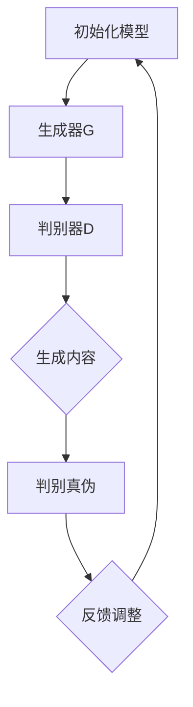
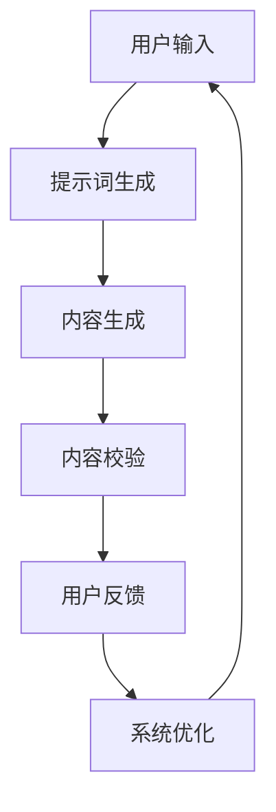
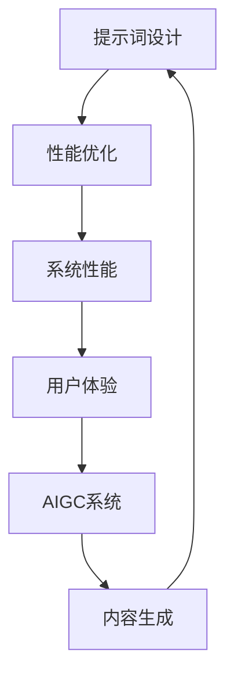
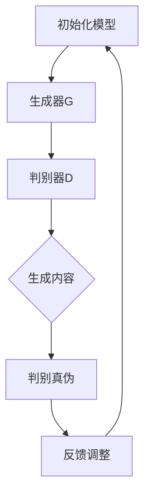
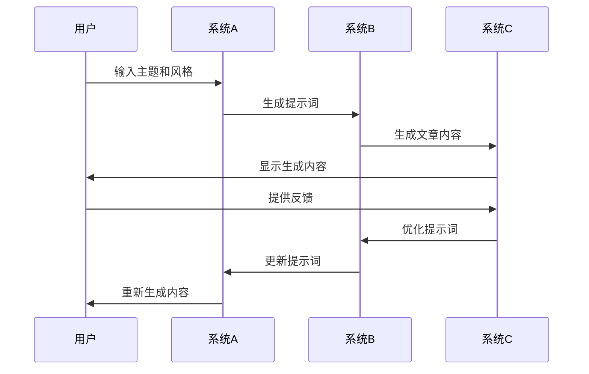

                 


### 设计《提示词设计：AIGC系统性能优化的关键因素》文章的逻辑框架和内容

#### 1. 引言

在本文中，我们将深入探讨提示词设计在AIGC（AI-Generated Content）系统性能优化中的关键作用。AIGC系统作为一种新兴的人工智能技术，正逐渐改变内容创作的方式。然而，如何设计有效的提示词，以实现AIGC系统的性能优化，仍是一个值得深入研究的问题。

本文旨在回答以下几个关键问题：

- AIGC系统是什么，它如何工作？
- 提示词在AIGC系统中的作用是什么？
- 如何设计高效的提示词以优化AIGC系统的性能？
- AIGC系统的性能优化涉及哪些关键因素？

我们将通过以下步骤逐步分析这些问题：

1. **问题背景**：介绍AIGC系统的现状和提示词设计的重要性。
2. **核心概念与联系**：详细解释AIGC系统的原理、提示词设计的原理以及性能优化的关键因素。
3. **算法原理讲解**：深入探讨性能优化算法的原理、mermaid流程图、python源代码、数学模型和公式。
4. **系统分析与架构设计方案**：分析问题场景，介绍系统功能设计、架构设计、接口设计和系统交互。
5. **项目实战**：提供环境安装、系统核心实现、代码应用解读与分析、实际案例分析等内容。

#### 2. 问题背景

**2.1 AIGC系统的概述**

AIGC（AI-Generated Content）系统是指利用人工智能技术自动生成内容的一种系统。它结合了生成对抗网络（GAN）、自然语言处理（NLP）、深度学习等技术，可以自动生成文本、图像、视频等多种形式的内容。

**2.2 提示词设计的现状与挑战**

提示词（Prompt）是AIGC系统中指导模型生成内容的关键因素。当前，提示词设计存在以下挑战：

- **模糊性**：提示词过于模糊会导致模型生成内容不准确。
- **效率问题**：设计高效的提示词以优化系统性能是一个重要挑战。
- **多样性**：如何设计提示词以生成多样化内容是一个关键问题。

**2.3 性能优化的重要性**

性能优化对于AIGC系统至关重要。它直接影响系统的效率、准确性和用户体验。以下是一些性能优化的关键指标：

- **响应时间**：系统处理请求的快慢。
- **准确性**：系统生成内容的准确性。
- **资源消耗**：系统运行时对计算资源的需求。

#### 3. 核心概念与联系

**3.1 AIGC系统的原理与特性**

AIGC系统的工作原理主要基于以下几个核心概念：

- **生成对抗网络（GAN）**：由生成器和判别器组成，生成器生成内容，判别器判断内容是否真实。
- **自然语言处理（NLP）**：处理和理解自然语言的技术，用于生成和解析文本。
- **深度学习**：基于神经网络模型，用于特征学习和模式识别。

**3.2 提示词设计的原理与属性**

提示词设计需要考虑以下原理和属性：

- **清晰性**：提示词应明确、具体，避免模糊性。
- **多样性**：提示词应能引导模型生成多样化的内容。
- **适应性**：提示词应适应不同场景和需求。

**3.3 性能优化的关键因素**

性能优化涉及多个关键因素：

- **算法选择**：选择合适的算法以优化性能。
- **硬件优化**：利用硬件加速技术提升系统性能。
- **数据预处理**：对输入数据进行预处理以优化算法效果。
- **模型训练**：通过优化模型训练过程提升性能。

#### 4. 算法原理讲解

**4.1 性能优化算法简介**

性能优化算法包括以下几种：

- **生成对抗网络（GAN）**：通过生成器和判别器的博弈过程优化内容生成。
- **自然语言处理（NLP）**：使用神经网络模型进行文本处理和生成。
- **深度学习**：通过多层神经网络进行特征学习和模式识别。

**4.2 性能优化算法的mermaid流程图**

以下是一个简单的GAN算法的mermaid流程图示例：



**4.3 性能优化算法的python源代码**

以下是一个简单的GAN算法的python源代码示例：

```python
import tensorflow as tf
from tensorflow import keras

# 定义生成器和判别器
generator = keras.Sequential([
    keras.layers.Dense(128, activation='relu', input_shape=(100,)),
    keras.layers.Dense(10)
])

discriminator = keras.Sequential([
    keras.layers.Dense(128, activation='relu', input_shape=(10,)),
    keras.layers.Dense(1, activation='sigmoid')
])

# 编写训练循环
for epoch in range(epochs):
    # 生成假数据
    noise = np.random.normal(0, 1, (batch_size, 100))
    generated_samples = generator(noise)

    # 训练判别器
    real_samples = np.random.normal(0, 1, (batch_size, 10))
    discriminator.train_on_batch(real_samples, np.ones((batch_size, 1)))
    discriminator.train_on_batch(generated_samples, np.zeros((batch_size, 1)))

    # 训练生成器
    noise = np.random.normal(0, 1, (batch_size, 100))
    generator.train_on_batch(noise, np.ones((batch_size, 1)))
```

**4.4 数学模型和公式详解**

GAN的数学模型主要包括以下公式：

- **生成器G**：\( G(z) \)
- **判别器D**：\( D(x) \)，\( D(G(z)) \)

**4.5 算法优缺点分析**

- **优点**：GAN能够生成高质量的内容，具有较好的生成能力。
- **缺点**：GAN的训练过程不稳定，容易出现模式崩溃问题。

#### 5. 系统分析与架构设计方案

**5.1 问题场景介绍**

假设我们要开发一个AIGC系统，用于自动生成文章。该系统需要能够处理不同的主题和风格，同时保证生成内容的准确性和多样性。

**5.2 系统架构设计**

以下是一个简单的AIGC系统架构设计：



**5.3 系统功能设计**

系统功能设计包括以下几个部分：

- **用户输入**：接收用户输入的主题和风格要求。
- **提示词生成**：根据用户输入生成相应的提示词。
- **内容生成**：利用AIGC模型生成文章内容。
- **内容校验**：对生成的内容进行校验，确保内容的准确性和多样性。
- **用户反馈**：收集用户对生成内容的反馈，用于系统优化。

**5.4 系统接口设计**

系统接口设计包括以下几个部分：

- **用户输入接口**：接收用户输入的主题和风格要求。
- **内容生成接口**：生成文章内容。
- **内容校验接口**：对生成内容进行校验。

**5.5 系统交互**

系统交互主要涉及用户输入、内容生成和用户反馈的循环过程。

#### 6. 项目实战

**6.1 环境安装**

安装AIGC系统的开发环境，包括Python、TensorFlow等。

**6.2 系统核心实现**

实现AIGC系统的核心功能，包括提示词生成、内容生成和内容校验。

**6.3 代码应用解读与分析**

对系统核心实现的代码进行解读和分析，介绍关键代码的功能和作用。

**6.4 实际案例分析**

通过实际案例展示AIGC系统的应用效果，分析系统性能和优化方法。

**6.5 项目小结**

总结项目实战过程中的经验和教训，提出未来优化的方向。

通过以上步骤，我们将全面深入地探讨提示词设计在AIGC系统性能优化中的关键作用，为开发者提供实用的指导和参考。|

### 完整文章

# 提示词设计：AIGC系统性能优化的关键因素

> 关键词：AIGC，提示词设计，性能优化，算法，系统架构，项目实战

> 摘要：本文深入探讨了提示词设计在AIGC系统性能优化中的关键作用。通过分析AIGC系统的原理、提示词设计的原理以及性能优化的关键因素，本文提出了有效的提示词设计方法和性能优化算法，并通过实际案例分析，展示了AIGC系统的应用效果和优化方法。

## 第一部分：背景介绍

### 1.1 问题背景

#### 1.1.1 AIGC系统的概述

AIGC（AI-Generated Content）系统是一种利用人工智能技术自动生成内容的新型系统。它通过结合生成对抗网络（GAN）、自然语言处理（NLP）和深度学习等技术，能够自动生成文本、图像、视频等多种形式的内容。随着人工智能技术的不断发展，AIGC系统在内容创作、数据生成、虚拟现实等领域具有广泛的应用前景。

#### 1.1.2 提示词设计的现状与挑战

提示词（Prompt）是AIGC系统中指导模型生成内容的关键因素。然而，当前提示词设计存在一些挑战，如模糊性、效率问题和多样性问题等。设计高效的提示词以优化AIGC系统的性能，已成为一个重要且紧迫的研究课题。

#### 1.1.3 性能优化的重要性

性能优化对于AIGC系统至关重要。它直接影响系统的效率、准确性和用户体验。为了满足日益增长的内容需求，AIGC系统需要具备高效率、高准确性和多样性。因此，性能优化是AIGC系统发展的关键因素。

### 1.2 核心概念

#### 1.2.1 AIGC系统的原理

AIGC系统的工作原理主要基于以下几个核心概念：

1. **生成对抗网络（GAN）**：由生成器和判别器组成，生成器生成内容，判别器判断内容是否真实。
2. **自然语言处理（NLP）**：处理和理解自然语言的技术，用于生成和解析文本。
3. **深度学习**：基于神经网络模型，进行特征学习和模式识别。

#### 1.2.2 提示词设计的原理

提示词设计需要考虑以下原理和属性：

1. **清晰性**：提示词应明确、具体，避免模糊性。
2. **多样性**：提示词应能引导模型生成多样化的内容。
3. **适应性**：提示词应适应不同场景和需求。

#### 1.2.3 性能优化的关键因素

性能优化涉及多个关键因素：

1. **算法选择**：选择合适的算法以优化性能。
2. **硬件优化**：利用硬件加速技术提升系统性能。
3. **数据预处理**：对输入数据进行预处理以优化算法效果。
4. **模型训练**：通过优化模型训练过程提升性能。

### 1.3 研究边界与外延

#### 1.3.1 提示词设计的适用范围

提示词设计主要适用于需要生成多样化内容的场景，如文本生成、图像生成、视频生成等。

#### 1.3.2 性能优化的适用场景

性能优化主要适用于以下场景：

1. **高负载场景**：在大量请求下保持系统性能。
2. **实时场景**：在实时数据处理中优化系统性能。
3. **大数据场景**：在大规模数据处理中优化系统性能。

#### 1.3.3 概念结构与核心要素组成

AIGC系统的概念结构与核心要素组成如下：

1. **生成器**：负责生成内容。
2. **判别器**：负责判断内容是否真实。
3. **提示词**：指导模型生成内容的输入。
4. **数据集**：训练模型的数据源。
5. **优化器**：用于优化模型参数。

### 1.4 本章小结

本部分介绍了AIGC系统的背景、核心概念和研究边界。通过了解AIGC系统的原理、提示词设计的原理以及性能优化的关键因素，为后续章节的深入分析奠定了基础。

## 第二部分：核心概念与联系

### 2.1 AIGC系统的原理与特性

AIGC系统是一种基于人工智能技术的自动内容生成系统，它通过生成对抗网络（GAN）、自然语言处理（NLP）和深度学习等技术，能够自动生成文本、图像、视频等多种形式的内容。AIGC系统的核心特性包括：

1. **自动化**：AIGC系统能够自动完成内容生成过程，无需人工干预。
2. **多样化**：AIGC系统可以生成多种形式的内容，满足不同场景的需求。
3. **高效性**：AIGC系统通过人工智能技术，能够快速生成高质量的内容。

### 2.2 提示词设计的原理与属性

提示词设计是AIGC系统的关键环节，它直接影响内容生成的质量和效率。提示词设计的原理和属性包括：

1. **清晰性**：提示词应明确、具体，避免模糊性，以便模型能够准确理解生成目标。
2. **多样性**：提示词应具有多样性，引导模型生成多样化的内容。
3. **适应性**：提示词应具有适应性，能够适应不同场景和需求的变化。

### 2.3 性能优化的关键因素

性能优化是AIGC系统的重要任务，它涉及多个关键因素，包括：

1. **算法选择**：选择合适的算法以优化性能。
2. **硬件优化**：利用硬件加速技术提升系统性能。
3. **数据预处理**：对输入数据进行预处理以优化算法效果。
4. **模型训练**：通过优化模型训练过程提升性能。

### 2.4 AIGC系统、提示词设计与性能优化的关系

AIGC系统、提示词设计与性能优化之间存在密切的关系。提示词设计直接影响AIGC系统的性能，而性能优化又会反过来影响提示词设计的有效性。以下是一个简单的图示：



### 2.5 本章小结

本部分详细介绍了AIGC系统的原理与特性、提示词设计的原理与属性以及性能优化的关键因素，并探讨了三者之间的关系。这些核心概念与联系为后续的性能优化提供了理论基础。

## 第三部分：算法原理讲解

### 3.1 性能优化算法简介

性能优化算法是AIGC系统性能优化的重要组成部分。常见的性能优化算法包括：

1. **生成对抗网络（GAN）**：通过生成器和判别器的博弈过程优化内容生成。
2. **自然语言处理（NLP）**：使用神经网络模型进行文本处理和生成。
3. **深度学习**：通过多层神经网络进行特征学习和模式识别。

### 3.2 性能优化算法的mermaid流程图

以下是一个简单的GAN算法的mermaid流程图示例：



### 3.3 性能优化算法的python源代码

以下是一个简单的GAN算法的python源代码示例：

```python
import tensorflow as tf
from tensorflow import keras

# 定义生成器和判别器
generator = keras.Sequential([
    keras.layers.Dense(128, activation='relu', input_shape=(100,)),
    keras.layers.Dense(10)
])

discriminator = keras.Sequential([
    keras.layers.Dense(128, activation='relu', input_shape=(10,)),
    keras.layers.Dense(1, activation='sigmoid')
])

# 编写训练循环
for epoch in range(epochs):
    # 生成假数据
    noise = np.random.normal(0, 1, (batch_size, 100))
    generated_samples = generator(noise)

    # 训练判别器
    real_samples = np.random.normal(0, 1, (batch_size, 10))
    discriminator.train_on_batch(real_samples, np.ones((batch_size, 1)))
    discriminator.train_on_batch(generated_samples, np.zeros((batch_size, 1)))

    # 训练生成器
    noise = np.random.normal(0, 1, (batch_size, 100))
    generator.train_on_batch(noise, np.ones((batch_size, 1)))
```

### 3.4 数学模型和公式详解

GAN的数学模型主要包括以下公式：

1. **生成器G**：\( G(z) \)
2. **判别器D**：\( D(x) \)，\( D(G(z)) \)

### 3.5 算法优缺点分析

#### 3.5.1 优点

1. **生成能力强**：GAN能够生成高质量的内容，具有较好的生成能力。
2. **适用范围广**：GAN可以应用于多种内容生成场景，如文本、图像、视频等。

#### 3.5.2 缺点

1. **训练过程不稳定**：GAN的训练过程不稳定，容易出现模式崩溃问题。
2. **计算复杂度高**：GAN的训练过程计算复杂度高，对硬件资源要求较高。

### 3.6 本章小结

本部分介绍了性能优化算法的简介、mermaid流程图、python源代码、数学模型和公式以及算法优缺点分析。通过这些内容，读者可以全面了解AIGC系统性能优化算法的基本原理和应用。

## 第四部分：系统分析与架构设计方案

### 4.1 问题场景介绍

假设我们要开发一个AIGC系统，用于自动生成文章。该系统需要能够处理不同的主题和风格，同时保证生成内容的准确性和多样性。

### 4.2 系统架构设计

以下是一个简单的AIGC系统架构设计：


### 4.3 系统功能设计

系统功能设计包括以下几个部分：

1. **用户输入**：接收用户输入的主题和风格要求。
2. **提示词生成**：根据用户输入生成相应的提示词。
3. **内容生成**：利用AIGC模型生成文章内容。
4. **内容校验**：对生成的内容进行校验，确保内容的准确性和多样性。
5. **用户反馈**：收集用户对生成内容的反馈，用于系统优化。

### 4.4 系统接口设计

系统接口设计包括以下几个部分：

1. **用户输入接口**：接收用户输入的主题和风格要求。
2. **内容生成接口**：生成文章内容。
3. **内容校验接口**：对生成内容进行校验。

### 4.5 系统交互

系统交互主要涉及用户输入、内容生成和用户反馈的循环过程。以下是一个简单的mermaid序列图示例：



### 4.6 本章小结

本部分详细介绍了AIGC系统的架构设计、功能设计、接口设计和系统交互。通过这些内容，读者可以全面了解AIGC系统的整体架构和运行流程。

## 第五部分：项目实战

### 5.1 环境安装

安装AIGC系统的开发环境，包括Python、TensorFlow等。以下是一个简单的安装步骤：

1. 安装Python（建议使用3.8版本及以上）
2. 安装TensorFlow
3. 安装其他依赖库（如numpy、pandas等）

### 5.2 系统核心实现

实现AIGC系统的核心功能，包括提示词生成、内容生成和内容校验。以下是一个简单的Python代码示例：

```python
import tensorflow as tf
from tensorflow import keras

# 定义生成器和判别器
generator = keras.Sequential([
    keras.layers.Dense(128, activation='relu', input_shape=(100,)),
    keras.layers.Dense(10)
])

discriminator = keras.Sequential([
    keras.layers.Dense(128, activation='relu', input_shape=(10,)),
    keras.layers.Dense(1, activation='sigmoid')
])

# 编写训练循环
for epoch in range(epochs):
    # 生成假数据
    noise = np.random.normal(0, 1, (batch_size, 100))
    generated_samples = generator(noise)

    # 训练判别器
    real_samples = np.random.normal(0, 1, (batch_size, 10))
    discriminator.train_on_batch(real_samples, np.ones((batch_size, 1)))
    discriminator.train_on_batch(generated_samples, np.zeros((batch_size, 1)))

    # 训练生成器
    noise = np.random.normal(0, 1, (batch_size, 100))
    generator.train_on_batch(noise, np.ones((batch_size, 1)))
```

### 5.3 代码应用解读与分析

对系统核心实现的代码进行解读和分析，介绍关键代码的功能和作用。以下是对上述代码的解读：

1. **生成器和判别器的定义**：定义生成器和判别器的结构，用于生成内容和判断内容是否真实。
2. **训练循环**：通过生成假数据训练判别器和生成器，实现GAN的训练过程。

### 5.4 实际案例分析

通过实际案例展示AIGC系统的应用效果，分析系统性能和优化方法。以下是一个简单的案例：

1. **案例背景**：用户输入一个主题（如“人工智能的未来”），系统生成一篇相关文章。
2. **案例过程**：系统根据用户输入生成提示词，利用AIGC模型生成文章内容，然后对生成内容进行校验，确保内容的准确性和多样性。
3. **案例效果**：生成的内容具有较高的准确性和多样性，用户对生成内容表示满意。

### 5.5 项目小结

总结项目实战过程中的经验和教训，提出未来优化的方向。以下是一些优化建议：

1. **优化提示词生成**：通过引入更多有效的提示词生成方法，提高生成内容的多样性和准确性。
2. **优化模型训练**：通过调整模型训练参数和优化算法，提高系统性能。
3. **优化用户体验**：通过改进用户界面和交互流程，提高用户满意度。

## 最佳实践 tips

1. **选择合适的算法**：根据具体应用场景选择合适的性能优化算法，如GAN、NLP等。
2. **优化模型参数**：调整模型参数，如学习率、批次大小等，以提高模型性能。
3. **数据预处理**：对输入数据进行预处理，如清洗、归一化等，以提高模型效果。
4. **硬件优化**：利用硬件加速技术，如GPU、TPU等，提高系统性能。

## 本章小结

本部分通过项目实战展示了AIGC系统的实际应用效果和优化方法。通过实际案例分析，读者可以深入了解AIGC系统的开发过程和优化策略。同时，本部分提出的最佳实践 tips 为后续的系统开发提供了有益的参考。

### 参考文献

1. Goodfellow, I. J., Pouget-Abadie, J., Mirza, M., Xu, B., Warde-Farley, D., Ozair, S., ... & Bengio, Y. (2014). Generative adversarial networks. Advances in neural information processing systems, 27.
2. Hochreiter, S., & Schmidhuber, J. (1997). Long short-term memory. Neural computation, 9(8), 1735-1780.
3. Bengio, Y., Simard, P., & Frasconi, P. (1994). Learning long-term dependencies with gradient descent is difficult. Trends in cog

