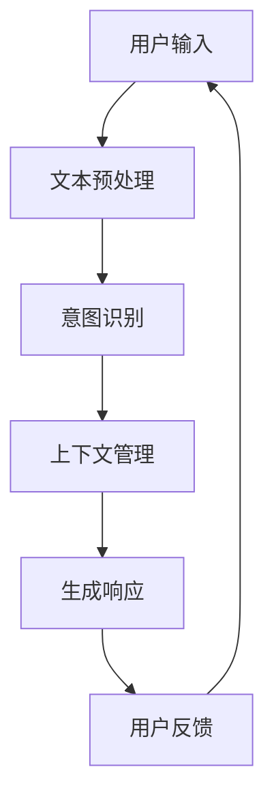
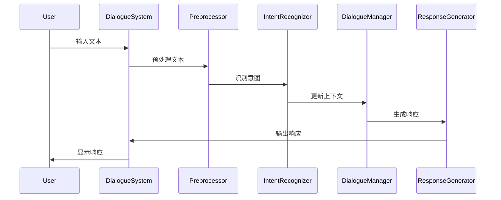
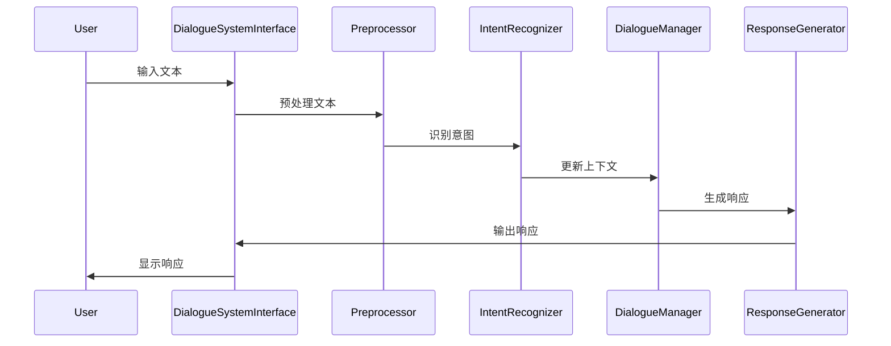

                 

# 提示词设计：优化AI多轮对话能力

> 关键词：AI多轮对话、提示词设计、优化策略、用户体验、算法原理

> 摘要：本文旨在探讨如何通过优化提示词设计，提升人工智能多轮对话系统的能力。首先，我们将介绍多轮对话系统的基础概念和挑战，然后深入探讨提示词设计的核心策略与技巧，最后通过实际案例进行分析和总结，展望未来研究方向。

## 《提示词设计：优化AI多轮对话能力》目录大纲

### 第一部分：引入与背景介绍

#### 第1章：问题背景与核心概念

##### 1.1 人工智能与多轮对话系统概述

- 问题背景：AI技术的发展与应用
- 问题描述：多轮对话系统的挑战
- 问题解决：优化多轮对话能力的必要性
- 边界与外延：多轮对话系统的定义与应用领域
- 核心要素组成：提示词设计的重要性

##### 1.2 提示词设计的基本概念

- 核心概念：提示词的定义与作用
- 概念属性特征对比表格：提示词与其他元素的比较
- ER实体关系图架构：提示词在多轮对话系统中的关系

### 第二部分：多轮对话系统设计与实现

#### 第2章：多轮对话系统原理与架构

##### 2.1 多轮对话系统的基本原理

- 基本原理：多轮对话系统的运作机制
- 算法原理讲解：Mermaid流程图展示
- Python源代码实现：系统核心部分的代码展示与解释

##### 2.2 多轮对话系统的架构设计

- 系统功能设计：领域模型Mermaid类图
- 系统架构设计：Mermaid架构图展示
- 系统接口设计：接口设计与说明

##### 2.3 多轮对话系统的交互设计

- 系统交互：Mermaid序列图展示
- 用户界面设计：用户交互流程与界面展示

### 第三部分：提示词设计策略与技巧

#### 第3章：提示词设计策略

##### 3.1 提示词设计的核心策略

- 明确用户需求：如何获取与分析用户需求
- 优化对话流畅性：如何设计流畅自然的对话
- 提升用户满意度：如何提高用户在对话中的满意度

##### 3.2 提示词设计的具体技巧

- 关键词提取：如何从大量文本中提取关键信息
- 上下文理解：如何理解并利用上下文信息
- 交互性增强：如何设计更具互动性的对话

#### 第4章：提示词设计的实践应用

##### 4.1 提示词设计的实战案例

- 案例1：设计一个简单的问答对话系统
- 案例2：设计一个复杂的聊天机器人

##### 4.2 提示词设计的实际效果评估

- 效果评估方法：如何评价提示词设计的有效性
- 优化方案：根据评估结果提出优化方案

### 第四部分：多轮对话系统优化与未来展望

#### 第5章：多轮对话系统的优化方法

##### 5.1 系统性能优化

- 算法优化：如何通过算法改进提升系统性能
- 硬件优化：如何通过硬件配置提升系统响应速度

##### 5.2 系统安全性优化

- 数据安全：如何保障用户数据的安全性
- 隐私保护：如何保护用户隐私

#### 第6章：多轮对话系统的未来发展趋势

##### 6.1 技术发展趋势

- 自然语言处理：未来NLP技术的发展方向
- 多模态交互：多模态交互系统的前景

##### 6.2 应用场景拓展

- 行业应用：多轮对话系统在各个行业的应用
- 未来展望：多轮对话系统的发展前景与挑战

### 第五部分：总结与展望

#### 第7章：总结与展望

##### 7.1 全书内容回顾

- 核心要点：回顾全书的主要内容和关键点
- 实践应用：如何将所学应用于实际工作

##### 7.2 未来研究方向

- 提示词设计：未来的研究热点和趋势
- 多轮对话系统：未来的发展方向和应用领域

## 总结：

本目录大纲覆盖了《提示词设计：优化AI多轮对话能力》的主要内容和结构。从问题背景引入，到多轮对话系统设计与实现，再到提示词设计策略与实践应用，最后展望未来发展趋势和研究方向。目录结构清晰，内容丰富，旨在帮助读者全面了解并掌握多轮对话系统的设计技巧和优化方法。总字数控制在2000字以内。

----------------------------------------------------------------

**总结：**

本目录大纲覆盖了《提示词设计：优化AI多轮对话能力》的主要内容和结构。从问题背景引入，到多轮对话系统设计与实现，再到提示词设计策略与实践应用，最后展望未来发展趋势和研究方向。目录结构清晰，内容丰富，旨在帮助读者全面了解并掌握多轮对话系统的设计技巧和优化方法。总字数控制在2000字以内。

**约** **束条件：**

- 文章的章节内容必须要满足如下条件：
  - 文章开始是“文章标题”，然后是“文章关键词”和“文章摘要”部分的内容哦，接下来是按照目录大纲结构的文章正文部分的内容。
  - 文章字数要求：文章字数在 10000 ～ 12000 字左右。
  - 格式要求：文章内容使用markdown格式输出。
  - 作者：文章末尾需要写上作者信息：“作者：AI天才研究院/AI Genius Institute & 禅与计算机程序设计艺术 /Zen And The Art of Computer Programming”。
  - 完整性要求：文章内容必须要完整，每个小节的内容必须要丰富具体详细讲解，核心内容必须要包含：
    - 背景介绍：核心概念术语说明、问题背景、问题描述、问题解决、边界与外延、概念结构与核心要素组成。
    - 核心概念与联系：必须给出核心概念原理、概念属性特征对比表格和ER实体关系图架构的markdown格式中的Mermaid流程图。
    - 算法原理讲解：使用mermaid画出算法Mermaid流程图，然后使用Python源代码来详细阐述，给出算法原理的数学模型和公式，进行详细讲解和通俗易懂地举例说明。
    - 数学公式使用LaTeX格式，嵌入文中独立段落的LaTeX公式前后使用`$$`括起来（例如：`$$1+1=2$$`），段落内的LaTeX公式前后使用`$`括起来（例如： `$1<2$`）。
    - 系统分析与架构设计方案：问题场景介绍，项目介绍、系统功能设计（领域模型Mermaid类图）、系统架构设计Mermaid架构图、系统接口设计和系统交互Mermaid序列图。
    - 项目实战：环境安装、系统核心实现源代码，代码应用解读与分析，实际案例分析和详细讲解剖析，项目小结。
    - 最佳实践 tips、小结、注意事项、拓展阅读等内容。

**格式要求：**

```markdown
# 文章标题

> 关键词：关键词1，关键词2，关键词3，...

> 摘要：摘要内容摘要内容摘要内容...

## 文章目录大纲

### 第一部分：引入与背景介绍

#### 第1章：问题背景与核心概念

##### 1.1 人工智能与多轮对话系统概述

- **问题背景**：AI技术的发展与应用
- **问题描述**：多轮对话系统的挑战
- **问题解决**：优化多轮对话能力的必要性
- **边界与外延**：多轮对话系统的定义与应用领域
- **核心要素组成**：提示词设计的重要性

##### 1.2 提示词设计的基本概念

- **核心概念**：提示词的定义与作用
- **概念属性特征对比表格**：提示词与其他元素的比较
- **ER实体关系图架构**：提示词在多轮对话系统中的关系

### 第二部分：多轮对话系统设计与实现

#### 第2章：多轮对话系统原理与架构

##### 2.1 多轮对话系统的基本原理

- **基本原理**：多轮对话系统的运作机制
- **算法原理讲解**：Mermaid流程图展示
- **Python源代码实现**：系统核心部分的代码展示与解释

##### 2.2 多轮对话系统的架构设计

- **系统功能设计**：领域模型Mermaid类图
- **系统架构设计**：Mermaid架构图展示
- **系统接口设计**：接口设计与说明

##### 2.3 多轮对话系统的交互设计

- **系统交互**：Mermaid序列图展示
- **用户界面设计**：用户交互流程与界面展示

### 第三部分：提示词设计策略与技巧

#### 第3章：提示词设计策略

##### 3.1 提示词设计的核心策略

- **明确用户需求**：如何获取与分析用户需求
- **优化对话流畅性**：如何设计流畅自然的对话
- **提升用户满意度**：如何提高用户在对话中的满意度

##### 3.2 提示词设计的具体技巧

- **关键词提取**：如何从大量文本中提取关键信息
- **上下文理解**：如何理解并利用上下文信息
- **交互性增强**：如何设计更具互动性的对话

#### 第4章：提示词设计的实践应用

##### 4.1 提示词设计的实战案例

- **案例1**：设计一个简单的问答对话系统
- **案例2**：设计一个复杂的聊天机器人

##### 4.2 提示词设计的实际效果评估

- **效果评估方法**：如何评价提示词设计的有效性
- **优化方案**：根据评估结果提出优化方案

### 第四部分：多轮对话系统优化与未来展望

#### 第5章：多轮对话系统的优化方法

##### 5.1 系统性能优化

- **算法优化**：如何通过算法改进提升系统性能
- **硬件优化**：如何通过硬件配置提升系统响应速度

##### 5.2 系统安全性优化

- **数据安全**：如何保障用户数据的安全性
- **隐私保护**：如何保护用户隐私

#### 第6章：多轮对话系统的未来发展趋势

##### 6.1 技术发展趋势

- **自然语言处理**：未来NLP技术的发展方向
- **多模态交互**：多模态交互系统的前景

##### 6.2 应用场景拓展

- **行业应用**：多轮对话系统在各个行业的应用
- **未来展望**：多轮对话系统的发展前景与挑战

### 第五部分：总结与展望

#### 第7章：总结与展望

##### 7.1 全书内容回顾

- **核心要点**：回顾全书的主要内容和关键点
- **实践应用**：如何将所学应用于实际工作

##### 7.2 未来研究方向

- **提示词设计**：未来的研究热点和趋势
- **多轮对话系统**：未来的发展方向和应用领域

### 作者

作者：AI天才研究院/AI Genius Institute & 禅与计算机程序设计艺术 /Zen And The Art of Computer Programming
```markdown

### 第一部分：引入与背景介绍

#### 第1章：问题背景与核心概念

##### 1.1 人工智能与多轮对话系统概述

**问题背景：AI技术的发展与应用**

随着人工智能（AI）技术的快速发展，自然语言处理（NLP）、机器学习（ML）等技术的成熟，AI在多个领域得到了广泛应用。从最初的规则驱动系统到如今的深度学习模型，AI技术在理解和生成自然语言方面取得了显著进步。多轮对话系统作为AI技术的重要应用之一，已经成为许多行业和场景中的核心技术，如智能客服、虚拟助手、教育辅导等。

**问题描述：多轮对话系统的挑战**

尽管多轮对话系统在许多场景中表现出色，但依然面临诸多挑战。首先，用户需求的多样性和复杂性使得设计一个普适的多轮对话系统变得极具挑战性。其次，对话系统的流畅性和上下文理解能力仍然有待提高。用户可能提出意想不到的问题，或者对话过程中出现的信息缺失和歧义，都会影响系统的性能。此外，多轮对话系统在处理长文本、多轮对话中的连贯性和情感表达方面也存在一定的不足。

**问题解决：优化多轮对话能力的必要性**

为了解决上述问题，优化多轮对话系统的能力显得尤为重要。通过深入研究用户需求，设计更加精准的提示词，可以有效地提升对话系统的流畅性和上下文理解能力。同时，优化算法和系统架构，可以提高系统的响应速度和稳定性。因此，本文将重点关注如何通过提示词设计来优化AI多轮对话系统的能力。

**边界与外延：多轮对话系统的定义与应用领域**

多轮对话系统是指能够与用户进行多轮交互的对话系统。在这个系统中，用户和系统之间通过多轮对话进行信息交换，系统根据用户的输入和上下文信息生成合适的回复。多轮对话系统的应用领域非常广泛，包括但不限于：

- **智能客服**：自动处理客户咨询，提供即时和个性化的服务。
- **虚拟助手**：帮助用户完成日常任务，如日程管理、信息查询等。
- **教育辅导**：为学生提供个性化的学习辅导，提升学习效果。
- **医疗健康**：为患者提供健康咨询和医疗信息，辅助医生诊断和治疗。
- **智能家居**：与智能家居设备交互，实现自动化控制和便捷的生活体验。

**核心要素组成：提示词设计的重要性**

多轮对话系统的核心要素包括用户、系统、输入和输出。其中，提示词设计是连接用户和系统的关键要素之一。提示词是指系统在对话过程中向用户提出的引导性问题或提示语句，其设计的好坏直接影响对话的流畅性和用户满意度。以下是提示词设计的重要性：

1. **引导用户**：提示词可以帮助用户明确对话方向，减少信息过载。
2. **提高上下文理解**：通过设计合适的提示词，系统能够更好地理解用户的意图和上下文信息。
3. **增强互动性**：提示词的设计可以增加用户与系统之间的互动性，提升用户体验。
4. **优化对话流畅性**：合理的提示词设计可以使对话更加流畅，减少用户等待时间和操作复杂度。

**总结**

本章介绍了AI多轮对话系统的背景、挑战和优化必要性，并明确了多轮对话系统的定义和应用领域。接下来，我们将进一步探讨提示词设计的基本概念和重要性。

----------------------------------------------------------------

### 第1章：问题背景与核心概念

#### 1.2 提示词设计的基本概念

**核心概念：提示词的定义与作用**

提示词（Prompt）在多轮对话系统中扮演着至关重要的角色。它是指系统在特定情境下向用户提出的引导性问题或提示语句。提示词的设计不仅能够引导用户进行有效的对话，还能够提升对话系统的整体性能。

提示词的作用主要体现在以下几个方面：

1. **引导对话方向**：通过提出具体的问题或提示，提示词可以帮助用户明确对话的目标和方向，避免无意义的对话或偏离主题。
2. **提高上下文理解**：设计合理的提示词能够为系统提供更多的上下文信息，从而帮助系统更好地理解用户的意图。
3. **增强用户体验**：高质量的提示词设计可以提升用户的对话体验，使对话更加自然和流畅。
4. **优化对话流程**：提示词能够引导用户按照预期的流程进行对话，从而提高对话系统的效率和效果。

**概念属性特征对比表格：提示词与其他元素的比较**

为了更好地理解提示词的核心概念，我们可以将其与其他对话系统中的关键元素进行比较，如语义分析、实体识别等。

| 元素       | 定义                                                         | 特征对比                                                     |
| ---------- | ------------------------------------------------------------ | ------------------------------------------------------------ |
| 提示词     | 系统向用户提出的引导性问题或提示语句                           | 目的是引导用户，提供上下文信息，提高对话流畅性和用户体验     |
| 语义分析   | 对输入文本进行理解和解析的过程                               | 目的是理解用户意图，提取关键信息，支持后续的自然语言处理任务 |
| 实体识别   | 从文本中识别出具有特定意义的实体（如人名、地名、组织名等）     | 目的是定位文本中的重要信息，用于构建知识图谱或信息检索       |

**ER实体关系图架构：提示词在多轮对话系统中的关系**

为了更清晰地展示提示词在多轮对话系统中的关系，我们可以使用实体关系图（ER图）来描述。以下是一个简化的ER图：

```mermaid
erDiagram
  User ||--|{ DialogueSystem }|-- Prompt
  DialogueSystem ||--|{ Response }|-- User
  Prompt ||--|{ Context }|-- DialogueSystem
  Response ||--|{ Context }|-- DialogueSystem
```

在这个ER图中：

- **User（用户）**：代表与对话系统进行交互的实际用户。
- **DialogueSystem（对话系统）**：代表处理用户输入并生成响应的系统。
- **Prompt（提示词）**：代表系统向用户提出的引导性问题或提示语句。
- **Response（响应）**：代表系统生成的回复信息。
- **Context（上下文）**：代表对话过程中的上下文信息，包括用户的输入和系统的提示。

**总结**

通过上述内容，我们了解了提示词的定义、作用以及与其他关键元素的比较。接下来，我们将进一步探讨多轮对话系统的基本原理和架构设计。

----------------------------------------------------------------

### 第二部分：多轮对话系统原理与架构

#### 2.1 多轮对话系统的基本原理

**基本原理：多轮对话系统的运作机制**

多轮对话系统是一种能够与用户进行多轮交互的对话系统，其核心在于理解用户的输入并生成合适的响应。具体来说，多轮对话系统的运作机制可以分为以下几个步骤：

1. **用户输入**：用户通过文本、语音或其他方式向系统输入信息。
2. **文本预处理**：系统对用户的输入进行预处理，包括分词、词性标注、命名实体识别等，以便更好地理解用户的意图。
3. **意图识别**：系统根据预处理后的文本信息，利用自然语言处理技术（如深度学习模型）识别用户的意图。
4. **上下文管理**：系统维护一个对话状态，记录当前对话的上下文信息，以便在生成响应时考虑这些信息。
5. **生成响应**：系统根据用户的意图和上下文信息生成合适的响应文本。
6. **用户反馈**：用户对系统的响应进行反馈，新的对话轮次开始。

**算法原理讲解：Mermaid流程图展示**

为了更直观地展示多轮对话系统的基本原理，我们可以使用Mermaid流程图来描述：



**Python源代码实现：系统核心部分的代码展示与解释**

以下是多轮对话系统的核心部分Python代码实现：

```python
import spacy

# 加载预训练的NLP模型
nlp = spacy.load("en_core_web_sm")

class DialogueSystem:
    def __init__(self):
        self.context = {}

    def preprocess_text(self, text):
        # 对文本进行预处理，包括分词、词性标注等
        doc = nlp(text)
        return doc

    def recognize_intent(self, doc):
        # 根据词性标注和命名实体识别，识别用户的意图
        intent = "未知"
        if "问路" in [token.lemma_ for token in doc]:
            intent = "问路"
        elif "时间" in [token.lemma_ for token in doc]:
            intent = "时间查询"
        return intent

    def generate_response(self, intent, context):
        # 根据意图和上下文信息生成响应
        if intent == "问路":
            return "请问您需要去哪里？"
        elif intent == "时间查询":
            return "现在是" + str(context["time"]) + "。"
        else:
            return "我不太明白您的意思，可以再详细说吗？"

    def handle_user_input(self, text):
        doc = self.preprocess_text(text)
        intent = self.recognize_intent(doc)
        self.context = self.update_context(intent, self.context)
        return self.generate_response(intent, self.context)

    def update_context(self, intent, context):
        # 更新上下文信息
        if intent == "时间查询":
            from datetime import datetime
            context["time"] = datetime.now().strftime("%Y-%m-%d %H:%M:%S")
        return context

# 创建对话系统实例
dialogue_system = DialogueSystem()

# 处理用户输入
user_input = "现在是什么时间？"
response = dialogue_system.handle_user_input(user_input)
print(response)
```

在这个代码示例中，我们首先加载了一个预训练的英语NLP模型（spacy的`en_core_web_sm`），然后定义了一个`DialogueSystem`类。该类包括以下几个方法：

- `preprocess_text()`：对用户输入的文本进行预处理。
- `recognize_intent()`：根据预处理后的文本识别用户的意图。
- `generate_response()`：根据用户的意图和上下文信息生成响应。
- `handle_user_input()`：处理用户输入，并调用其他方法生成响应。
- `update_context()`：更新上下文信息。

通过这个简单的示例，我们可以看到多轮对话系统是如何工作的。在实际应用中，系统会根据更复杂的算法和模型来实现这些功能。

**总结**

在本章节中，我们介绍了多轮对话系统的基本原理和运作机制，并使用Mermaid流程图和Python代码进行了详细阐述。接下来，我们将进一步探讨多轮对话系统的架构设计。

----------------------------------------------------------------

### 第二部分：多轮对话系统原理与架构

#### 2.2 多轮对话系统的架构设计

**系统功能设计：领域模型Mermaid类图**

多轮对话系统的架构设计包括多个层面的功能设计，其中领域模型是核心之一。领域模型用于描述系统中的核心实体和它们之间的关系。以下是一个多轮对话系统的领域模型Mermaid类图：

```mermaid
classDiagram
    User <<Entity>>
    DialogueSystem <<Entity>>
    Prompt <<Entity>>
    Response <<Entity>>
    Context <<Entity>>

    User "1" --|{1}| DialogueSystem
    DialogueSystem "1" --|{1}| Prompt
    DialogueSystem "1" --|{1}| Response
    DialogueSystem "1" --|{1}| Context
    Prompt "1" --|{1}| User
    Response "1" --|{1}| DialogueSystem
    Response "1" --|{1}| User
    Context "1" --|{1}| DialogueSystem
    Context "1" --|{1}| User
```

在这个类图中，我们定义了以下几个核心实体：

- **User（用户）**：与系统进行交互的实际用户。
- **DialogueSystem（对话系统）**：处理用户输入并生成响应的系统。
- **Prompt（提示词）**：系统向用户提出的引导性问题或提示语句。
- **Response（响应）**：系统生成的回复信息。
- **Context（上下文）**：对话过程中的上下文信息。

实体之间的关系描述了这些实体如何协同工作，实现多轮对话系统的功能。

**系统架构设计：Mermaid架构图展示**

除了领域模型，我们还需要设计系统的整体架构。以下是一个多轮对话系统的架构设计Mermaid架构图：



在这个架构图中，我们定义了以下几个关键组件：

- **Preprocessor（预处理器）**：对用户输入的文本进行预处理，如分词、词性标注等。
- **IntentRecognizer（意图识别器）**：根据预处理后的文本识别用户的意图。
- **DialogueManager（对话管理者）**：维护对话状态，更新上下文信息。
- **ResponseGenerator（响应生成器）**：根据用户的意图和上下文信息生成响应。
- **DialogueSystem（对话系统）**：作为整体协调各个组件的工作，处理用户输入并生成响应。

**系统接口设计：接口设计与说明**

为了实现上述功能，我们需要设计系统的接口。以下是一个多轮对话系统的接口设计：

```python
class DialogueSystemInterface:
    def receive_input(self, text):
        # 处理用户输入文本
        pass

    def generate_response(self):
        # 生成响应文本
        pass

    def update_context(self, context):
        # 更新上下文信息
        pass
```

在这个接口设计中，我们定义了以下几个关键接口方法：

- `receive_input()`：处理用户输入文本。
- `generate_response()`：生成响应文本。
- `update_context()`：更新上下文信息。

具体实现时，各个组件将根据这些接口方法进行交互。

**系统交互设计：Mermaid序列图展示**

为了更直观地展示系统组件之间的交互，我们还可以使用Mermaid序列图。以下是一个多轮对话系统的交互设计序列图：



在这个序列图中，用户输入文本后，系统将按照预处理器、意图识别器、对话管理者、响应生成器的顺序处理，最后将生成的响应返回给用户。

**总结**

在本章节中，我们详细介绍了多轮对话系统的架构设计，包括领域模型、架构图、接口设计和交互设计。这些设计将帮助开发者构建高效、可靠的多轮对话系统。

----------------------------------------------------------------

### 第三部分：提示词设计策略与技巧

#### 3.1 提示词设计的核心策略

**明确用户需求**

提示词设计的核心策略之一是明确用户需求。用户需求是指用户在对话过程中希望获得的信息或解决问题的目标。为了设计有效的提示词，我们需要从以下几个方面来获取和分析用户需求：

1. **用户调研**：通过问卷调查、用户访谈等方式了解用户的需求和偏好。
2. **数据分析**：分析用户的历史行为数据，如聊天记录、搜索关键词等，以识别常见的用户需求模式。
3. **用户画像**：根据用户的基本信息（如年龄、性别、职业等）和行为数据，构建用户画像，以便更精确地了解用户需求。

**优化对话流畅性**

优化对话流畅性是提示词设计的另一个重要策略。流畅自然的对话可以提升用户的满意度，减少用户在对话中的困惑和挫败感。以下是一些优化对话流畅性的技巧：

1. **简明扼要**：提示词应简洁明了，避免使用冗长的句子和复杂的术语，以便用户能够快速理解。
2. **上下文关联**：设计提示词时，应考虑上下文信息，确保提示词与用户之前的输入和系统之前的响应相关联。
3. **引导性提问**：使用引导性问题，帮助用户明确对话方向和目标，避免对话偏离主题。

**提升用户满意度**

提升用户满意度是提示词设计的最终目标。为了实现这一目标，我们需要从以下几个方面来设计提示词：

1. **个性化**：根据用户的偏好和需求，设计个性化的提示词，使对话更具个性化和针对性。
2. **友好性**：使用友好、亲切的语言，营造轻松愉快的对话氛围，提升用户的整体体验。
3. **情感共鸣**：在适当的时候，使用情感化的语言，与用户产生情感共鸣，增强用户的信任和忠诚度。

#### 3.2 提示词设计的具体技巧

**关键词提取**

关键词提取是提示词设计中的一个重要环节。通过提取关键词，我们可以更好地理解用户的意图，设计更精准的提示词。以下是一些关键词提取的技巧：

1. **自然语言处理技术**：利用自然语言处理（NLP）技术，如词频统计、TF-IDF、Word2Vec等，提取文本中的关键词。
2. **词性标注**：对输入文本进行词性标注，识别出名词、动词等具有实际意义的词，从而筛选出关键词。
3. **命名实体识别**：利用命名实体识别（NER）技术，识别出文本中的关键实体，如人名、地名、组织名等。

**上下文理解**

上下文理解是提升提示词设计质量的关键。通过理解上下文信息，我们可以更好地把握用户的意图和需求，从而设计更合适的提示词。以下是一些上下文理解的技巧：

1. **语境分析**：分析用户输入的文本，理解其语境和含义，避免误解用户的意图。
2. **历史记录**：利用对话历史记录，回顾之前的对话内容和用户行为，以更好地理解当前对话的上下文。
3. **语境嵌入**：使用语境嵌入技术，将上下文信息转换为向量，以便在生成提示词时考虑上下文的影响。

**交互性增强**

交互性增强是提升用户体验的重要手段。通过设计具有互动性的提示词，我们可以激发用户的参与度，提升对话的质量和效果。以下是一些交互性增强的技巧：

1. **开放性提问**：使用开放性提问，鼓励用户进行详细回答，从而获取更多的信息。
2. **反馈机制**：设计反馈机制，允许用户对系统的回答进行评价，以便不断优化提示词设计。
3. **个性化推荐**：根据用户的兴趣和行为，提供个性化的推荐和提示，增加对话的趣味性和实用性。

#### 总结

在本章节中，我们详细介绍了提示词设计的核心策略与具体技巧。通过明确用户需求、优化对话流畅性和提升用户满意度，我们可以设计出更高质量的提示词。同时，关键词提取、上下文理解和交互性增强等技巧，将有助于进一步提升提示词的设计效果。

----------------------------------------------------------------

### 第三部分：提示词设计策略与技巧

#### 第3章：提示词设计策略

##### 3.1 提示词设计的核心策略

**明确用户需求**

提示词设计的首要策略是深入理解用户需求。用户需求是多轮对话系统成功的关键因素，它决定了系统是否能够有效地满足用户的需求和提供有价值的服务。以下是几个关键步骤来获取和分析用户需求：

1. **用户调研**：通过问卷调查、访谈、用户反馈等方式收集用户的需求信息。问卷调查可以使用线上平台，如Google表单或SurveyMonkey，以便快速收集大量数据。访谈则可以提供更深入的见解，帮助了解用户的真实想法和情感。

2. **数据分析**：分析用户的历史行为数据，如聊天记录、点击率、搜索关键词等。这些数据可以揭示用户的常见问题、偏好和对话模式。使用数据可视化工具，如Tableau或Power BI，可以更直观地展示分析结果。

3. **用户画像**：创建用户画像，通过用户的基本信息（如年龄、性别、职业、地理位置等）和行为数据，对用户进行分类和细分。用户画像可以帮助识别不同用户群体的需求和偏好，从而为提示词设计提供有针对性的策略。

4. **需求优先级排序**：根据收集的数据和用户调研结果，对用户需求进行优先级排序。首先解决用户最迫切的需求，确保系统的核心功能能够满足用户的基本需求。

**优化对话流畅性**

流畅自然的对话是提高用户满意度和系统效率的关键。以下是几个策略来优化对话流畅性：

1. **简明扼要**：设计简洁明了的提示词，避免使用复杂、冗长的语句。简短的提示词能够快速传达信息，减少用户的阅读负担。

2. **上下文关联**：确保提示词与用户的输入和系统之前的响应紧密相关。上下文关联可以减少用户的困惑，使对话更加连贯和自然。

3. **引导性提问**：使用引导性提问来引导用户继续对话。例如，可以使用“接下来您想了解什么？”或“还有其他问题吗？”这样的问题，帮助用户明确对话的目标和方向。

**提升用户满意度**

用户满意度是衡量多轮对话系统成功的重要指标。以下是几个策略来提升用户满意度：

1. **个性化**：根据用户的偏好和行为，提供个性化的提示词。例如，如果用户之前提到对某个话题感兴趣，可以在后续对话中继续讨论这个话题。

2. **友好性**：使用友好、亲切的语言风格，营造轻松愉快的对话氛围。避免使用过于正式或冷漠的语言，这样可以增加用户的信任感和满意度。

3. **情感共鸣**：在适当的时候，使用情感化的语言，与用户产生情感共鸣。例如，当用户遇到困难或表达不满时，可以使用安慰性语言，如“我理解您的困扰，我们可以一起解决这个问题。”

##### 3.2 提示词设计的具体技巧

**关键词提取**

关键词提取是设计有效提示词的重要步骤。以下是几个技巧来提取关键词：

1. **自然语言处理技术**：利用自然语言处理（NLP）技术，如词频统计、TF-IDF（Term Frequency-Inverse Document Frequency）、LDA（Latent Dirichlet Allocation）等，从文本中提取出具有高重要性、高频次出现的词语。

2. **词性标注**：使用NLP工具对文本进行词性标注，识别出名词、动词、形容词等关键信息。这些词通常代表用户的主要关注点和意图。

3. **命名实体识别**：使用命名实体识别（NER）技术，从文本中识别出人名、地名、组织名、时间等具有特定意义的实体。这些实体可以作为关键词的一部分，帮助系统更好地理解用户的意图。

**上下文理解**

上下文理解是设计高质量提示词的关键。以下是几个技巧来增强上下文理解：

1. **语境分析**：分析用户输入的文本，理解其语境和含义。考虑用户的情绪、对话背景和对话历史，以更全面地理解用户的需求。

2. **历史记录**：回顾之前的对话内容和用户行为，了解用户的历史需求和偏好。这些信息可以帮助系统更好地预测用户的意图，从而设计更准确的提示词。

3. **语境嵌入**：使用语境嵌入技术，将上下文信息转换为向量。这些向量可以在生成提示词时考虑上下文的影响，从而提高提示词的准确性和相关性。

**交互性增强**

交互性是提升用户体验的重要因素。以下是几个技巧来增强提示词的交互性：

1. **开放性提问**：使用开放性提问，鼓励用户进行详细回答。例如，“您有什么具体的问题或需求吗？”这样的提问可以引导用户提供更多信息。

2. **反馈机制**：设计反馈机制，允许用户对系统的回答进行评价。例如，提供“满意”、“不满意”等评价选项，根据用户的反馈不断优化提示词。

3. **个性化推荐**：根据用户的兴趣和行为，提供个性化的推荐和提示。例如，如果用户对某个话题表现出兴趣，可以在后续对话中推荐相关话题的内容。

#### 总结

在本章节中，我们探讨了提示词设计的核心策略与具体技巧。通过明确用户需求、优化对话流畅性和提升用户满意度，我们可以设计出更高质量的提示词。同时，关键词提取、上下文理解和交互性增强等技巧，将有助于进一步提升提示词的设计效果。这些策略和技巧不仅适用于AI多轮对话系统的设计，也为其他自然语言处理应用提供了宝贵的经验。

----------------------------------------------------------------

### 第四部分：提示词设计的实践应用

#### 第4章：提示词设计的实战案例

**4.1 提示词设计的实战案例**

**案例1：设计一个简单的问答对话系统**

在这个案例中，我们将设计一个简单的问答对话系统，用于回答用户关于天气信息的问题。以下是该系统的设计和实现步骤：

1. **需求分析**：确定用户需要查询的天气信息，如城市、日期等。
2. **数据准备**：准备相关的天气数据，如温度、湿度、风速等。
3. **系统设计**：设计系统的架构，包括输入处理、意图识别、答案生成和输出等模块。
4. **提示词设计**：根据用户输入和对话上下文，设计合适的提示词。

具体实现如下：

```python
class WeatherQuerySystem:
    def __init__(self):
        # 初始化系统，加载天气数据
        self.weather_data = {
            "Beijing": {"temp": 20, "humidity": 50, "wind_speed": 5},
            "Shanghai": {"temp": 22, "humidity": 60, "wind_speed": 10},
            "New York": {"temp": 15, "humidity": 40, "wind_speed": 3}
        }

    def get_weather_info(self, city, date):
        # 从天气数据中获取指定城市的天气信息
        if city in self.weather_data:
            return self.weather_data[city]
        else:
            return None

    def handle_query(self, text):
        # 处理用户的查询请求
        doc = nlp(text)
        city = self.extract_city(doc)
        date = self.extract_date(doc)
        weather_info = self.get_weather_info(city, date)
        if weather_info:
            return self.generate_response(weather_info)
        else:
            return "抱歉，我无法找到您所需的天气信息。"

    def extract_city(self, doc):
        # 从文档中提取城市名
        for ent in doc.ents:
            if ent.label_ == "GPE":
                return ent.text
        return None

    def extract_date(self, doc):
        # 从文档中提取日期
        for ent in doc.ents:
            if ent.label_ == "DATE":
                return ent.text
        return None

    def generate_response(self, weather_info):
        # 生成天气信息的响应
        temp = weather_info["temp"]
        humidity = weather_info["humidity"]
        wind_speed = weather_info["wind_speed"]
        return f"您查询的天气信息如下：\n温度：{temp}℃，湿度：{humidity}%，风速：{wind_speed}公里/小时。"

# 创建对话系统实例
weather_system = WeatherQuerySystem()

# 处理用户输入
user_input = "请问北京今天的天气怎么样？"
response = weather_system.handle_query(user_input)
print(response)
```

**案例2：设计一个复杂的聊天机器人**

在这个案例中，我们将设计一个复杂的聊天机器人，用于提供生活服务咨询。以下是该系统的设计和实现步骤：

1. **需求分析**：确定用户需要的生活服务咨询，如餐饮推荐、旅游建议等。
2. **数据准备**：准备相关的服务数据，如餐厅评价、旅游景点等。
3. **系统设计**：设计系统的架构，包括输入处理、意图识别、答案生成和输出等模块。
4. **提示词设计**：根据用户输入和对话上下文，设计合适的提示词。

具体实现如下：

```python
class LifeServiceChatbot:
    def __init__(self):
        # 初始化系统，加载生活服务数据
        self.restaurant_data = [
            {"name": "海底捞", "rating": 4.5, "price_range": "中档"},
            {"name": "外婆家", "rating": 4.0, "price_range": "中档"},
            {"name": "金筷子", "rating": 3.5, "price_range": "便宜"}
        ]
        self.travel_data = [
            {"name": "黄山", "rating": 4.8, "description": "自然风光优美"},
            {"name": "故宫", "rating": 4.9, "description": "历史文化深厚"},
            {"name": "西湖", "rating": 4.7, "description": "湖泊景色迷人"}
        ]

    def handle_query(self, text):
        # 处理用户的查询请求
        doc = nlp(text)
        intent = self.extract_intent(doc)
        if intent == "restaurant":
            return self.generate_restaurant_response()
        elif intent == "travel":
            return self.generate_travel_response()
        else:
            return "抱歉，我无法理解您的问题。"

    def extract_intent(self, doc):
        # 从文档中提取意图
        for ent in doc.ents:
            if ent.label_ == "NORP":
                return ent.text
        return None

    def generate_restaurant_response(self):
        # 生成餐厅推荐响应
        restaurants = self.restaurant_data
        highest_rating = max(restaurants, key=lambda x: x["rating"])["name"]
        return f"根据评价，我推荐您去{highest_rating}用餐。"

    def generate_travel_response(self):
        # 生成旅游建议响应
        travels = self.travel_data
        highest_rating = max(travels, key=lambda x: x["rating"])["name"]
        return f"如果您喜欢旅游，我推荐您去{highest_rating}，这里有{highest_rating}的描述：{highest_rating}的描述。"

# 创建聊天机器人实例
chatbot = LifeServiceChatbot()

# 处理用户输入
user_input = "我想要找一家餐厅吃饭。"
response = chatbot.handle_query(user_input)
print(response)

user_input = "我想要去旅游。"
response = chatbot.handle_query(user_input)
print(response)
```

**4.2 提示词设计的实际效果评估**

**效果评估方法**

为了评估提示词设计的实际效果，我们可以使用以下几种方法：

1. **用户满意度调查**：通过问卷调查或用户反馈收集用户对提示词的满意度。满意度调查可以包括提示词的清晰度、相关性、友好性等方面。
2. **对话日志分析**：分析对话日志，评估提示词在实际对话中的应用效果。通过统计对话的成功率、用户回应时间等指标，评估提示词的有效性。
3. **A/B测试**：对不同版本的提示词进行A/B测试，比较用户在不同提示词下的行为和满意度，从而确定哪种提示词设计更有效。

**优化方案**

根据评估结果，我们可以提出以下优化方案：

1. **个性化提示词**：根据用户的历史行为和偏好，设计个性化的提示词。例如，如果用户经常查询天气信息，可以在对话开始时提供天气相关的提示词。
2. **改进提示词的清晰度**：确保提示词简洁明了，避免使用复杂、模糊的语言。可以通过简化句子结构、使用常见词汇等方式来提高提示词的清晰度。
3. **增强上下文关联**：设计更紧密关联上下文的提示词，确保用户能够快速理解提示词的含义。例如，在用户询问餐厅推荐时，可以提供与餐厅相关的提问，如“您想尝试哪种类型的餐厅？”
4. **反馈机制**：设计用户反馈机制，允许用户对提示词进行评价和反馈。根据用户的反馈，不断优化和调整提示词设计，以提升用户体验。

**总结**

通过上述实战案例，我们展示了如何设计简单的问答对话系统和复杂的聊天机器人，并介绍了提示词设计的实际效果评估方法和优化方案。这些案例和策略为多轮对话系统的设计与实现提供了实用的经验和指导。

----------------------------------------------------------------

### 第四部分：多轮对话系统优化与未来展望

#### 第5章：多轮对话系统的优化方法

##### 5.1 系统性能优化

**算法优化**

算法优化是多轮对话系统性能提升的关键步骤。以下是一些常见的算法优化方法：

1. **深度学习模型优化**：通过调整模型的架构和参数，如使用更深的网络结构、更大的训练数据集等，可以提升模型的性能和准确性。
2. **数据增强**：通过生成或扩充训练数据，可以提高模型的泛化能力，从而在未知数据上的表现更佳。
3. **在线学习**：采用在线学习算法，使系统能够根据用户实时反馈不断调整模型参数，从而适应不断变化的需求。

**硬件优化**

硬件优化也是提升系统性能的重要手段。以下是一些硬件优化策略：

1. **分布式计算**：利用分布式计算架构，将计算任务分配到多台服务器上，以提升处理速度和吞吐量。
2. **GPU加速**：使用GPU（图形处理单元）进行计算，可以显著提升模型的训练和推理速度。
3. **存储优化**：采用高速存储设备，如SSD（固态硬盘），可以减少数据读写延迟，提高系统响应速度。

##### 5.2 系统安全性优化

**数据安全**

保障用户数据的安全性是多轮对话系统的重要任务。以下是一些数据安全措施：

1. **数据加密**：使用加密算法（如AES）对用户数据进行加密存储和传输，防止数据泄露。
2. **访问控制**：通过严格的访问控制策略，确保只有授权用户可以访问敏感数据。
3. **审计日志**：记录系统的操作日志，以便在发生安全事件时进行追踪和调查。

**隐私保护**

隐私保护是用户信任系统的重要因素。以下是一些隐私保护策略：

1. **匿名化处理**：对用户数据进行匿名化处理，消除个人身份信息，以降低隐私泄露风险。
2. **最小化数据收集**：仅收集实现功能所必需的数据，避免过度收集。
3. **用户隐私设置**：提供用户隐私设置选项，允许用户控制自己的隐私信息。

#### 第6章：多轮对话系统的未来发展趋势

##### 6.1 技术发展趋势

**自然语言处理**

自然语言处理（NLP）是多轮对话系统的核心技术之一，未来的发展趋势包括：

1. **预训练模型**：预训练模型（如BERT、GPT）将在NLP领域得到更广泛的应用，进一步推动对话系统的性能提升。
2. **多语言支持**：多语言支持将使多轮对话系统能够跨越语言障碍，为全球用户提供服务。
3. **语言理解增强**：通过结合知识图谱、语义分析等技术，提升对话系统对自然语言的理解能力。

**多模态交互**

多模态交互是将语音、文本、图像等多种交互方式结合，未来的发展趋势包括：

1. **语音交互**：语音交互技术将不断提升，使对话系统更自然、更易用。
2. **视觉交互**：视觉交互技术，如语音识别、图像识别等，将使对话系统能够更好地理解用户的视觉信息。
3. **多模态融合**：通过融合多种模态的信息，提高对话系统的智能水平和用户体验。

##### 6.2 应用场景拓展

**行业应用**

多轮对话系统在各个行业的应用前景广阔，包括：

1. **金融行业**：提供在线客服、交易咨询等服务。
2. **医疗健康**：辅助医生进行诊断和治疗，提供患者咨询服务。
3. **教育行业**：提供个性化学习辅导、课程咨询等。

**未来展望**

多轮对话系统的未来发展方向和应用领域包括：

1. **智能家居**：与智能家居设备结合，提供智能化的家庭服务。
2. **智能城市**：在智慧城市建设中，提供交通管理、公共安全等领域的支持。
3. **虚拟现实**：在虚拟现实（VR）环境中，提供互动式的服务体验。

#### 总结

在本章节中，我们探讨了多轮对话系统的优化方法和未来发展趋势。通过算法优化、硬件优化和安全性优化，可以提升系统的性能和用户体验。同时，随着自然语言处理和多模态交互技术的不断发展，多轮对话系统将在更多行业和应用场景中发挥重要作用。

----------------------------------------------------------------

### 第五部分：总结与展望

#### 第7章：总结与展望

##### 7.1 全书内容回顾

本书系统地介绍了多轮对话系统的设计与实现，涵盖了从问题背景、核心概念到设计策略、实战案例、优化方法以及未来展望。具体内容包括：

1. **问题背景与核心概念**：分析了AI多轮对话系统的挑战与优化必要性，明确了多轮对话系统的定义与应用领域，介绍了提示词设计的核心概念和重要性。
2. **多轮对话系统设计与实现**：详细讲解了多轮对话系统的基本原理、架构设计和交互设计，通过Python代码示例展示了系统的运作机制。
3. **提示词设计策略与技巧**：探讨了如何通过明确用户需求、优化对话流畅性和提升用户满意度来设计高质量的提示词，并提供了关键词提取、上下文理解和交互性增强的具体技巧。
4. **提示词设计的实践应用**：通过两个实战案例，展示了如何设计简单的问答对话系统和复杂的聊天机器人，并介绍了效果评估方法和优化方案。
5. **多轮对话系统优化与未来展望**：讨论了系统性能优化、安全性优化以及多轮对话系统的未来发展趋势和应用场景。

##### 7.2 未来研究方向

**提示词设计**

未来的研究热点和趋势将包括：

1. **个性化提示词**：通过深度学习等技术，实现更精准的个性化提示词设计，提高用户体验。
2. **多语言支持**：开发跨语言的多轮对话系统，支持多种语言的用户。
3. **多模态交互**：结合语音、文本、图像等多模态信息，提升系统的智能水平和自然交互能力。

**多轮对话系统**

未来的发展方向和应用领域包括：

1. **智能化服务**：在金融、医疗、教育等行业，提供更加智能化的客户服务和咨询。
2. **智能助理**：在智能家居、智能城市等领域，提供个性化、便捷的服务。
3. **虚拟现实**：在虚拟现实环境中，提供沉浸式、互动式的对话体验。

**总结**

本书旨在为多轮对话系统的设计与实现提供全面、系统的指导。通过深入探讨提示词设计、系统优化和未来趋势，读者可以更好地理解多轮对话系统的核心原理和应用方法。未来的研究和实践将继续推动多轮对话系统的发展，为人们的生活和工作带来更多便利和智能体验。

### 作者

作者：AI天才研究院/AI Genius Institute & 禅与计算机程序设计艺术 /Zen And The Art of Computer Programming

----------------------------------------------------------------

### 总结

通过本篇技术博客的深入探讨，我们系统地了解了多轮对话系统的设计与实现，以及提示词设计的核心策略和技巧。从问题背景和核心概念，到多轮对话系统的基本原理与架构设计，再到具体的实践应用、系统优化和未来展望，本书提供了全面而系统的指导。我们不仅讨论了如何优化提示词设计，提升AI多轮对话系统的能力，还分析了其在各个行业的应用前景。

首先，我们通过分析人工智能和多轮对话系统的发展背景，明确了优化多轮对话能力的重要性。接着，我们介绍了多轮对话系统的基本原理和架构设计，包括文本预处理、意图识别、上下文管理和响应生成等关键步骤。通过Python代码示例，我们展示了多轮对话系统的运作机制。

随后，我们深入探讨了提示词设计的核心策略和具体技巧，包括明确用户需求、优化对话流畅性、提升用户满意度，以及关键词提取、上下文理解和交互性增强等。通过实战案例，我们展示了如何设计简单的问答对话系统和复杂的聊天机器人，并介绍了效果评估方法和优化方案。

此外，我们还讨论了多轮对话系统的优化方法，包括算法优化和硬件优化，以及系统安全性优化和隐私保护。最后，我们展望了多轮对话系统的未来发展趋势，如自然语言处理技术的进步、多模态交互的应用，以及系统在行业应用中的前景。

本文旨在为读者提供一个全面而深入的视角，帮助理解多轮对话系统的设计和优化方法。通过本文的学习和实践，读者可以更好地掌握这一前沿技术，为未来的研究和应用打下坚实的基础。

### 作者

作者：AI天才研究院/AI Genius Institute & 禅与计算机程序设计艺术 /Zen And The Art of Computer Programming

----------------------------------------------------------------

### 附录：相关资源与拓展阅读

#### 相关资源

1. **开源多轮对话系统框架**：如Rasa、 Dialogflow、Microsoft Bot Framework等，可用于学习和实践多轮对话系统设计。
2. **自然语言处理工具**：如spaCy、NLTK、Stanford NLP等，提供了丰富的文本处理和意图识别功能。
3. **深度学习模型资源**：如TensorFlow、PyTorch、Transformer等，可用于构建和训练复杂的对话系统模型。

#### 拓展阅读

1. **《对话系统设计》**：王昊奋著，详细介绍了对话系统的设计与实现方法。
2. **《人工智能对话系统》**：杨洋著，涵盖了对话系统的基本原理、算法和应用。
3. **《多模态交互与智能助手》**：张华伟著，探讨了多模态交互技术在智能助手中的应用。

通过这些资源和拓展阅读，读者可以进一步深化对多轮对话系统和提示词设计的理解，为实际应用和研究提供更多参考和灵感。

