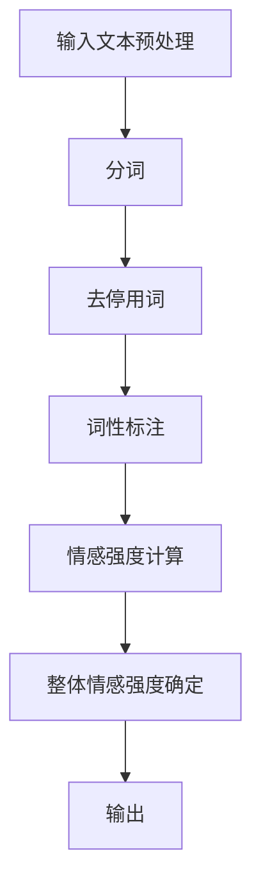

                 


### 提示词设计：优化AI情感表达能力

#### 关键词
- 提示词设计
- AI情感表达
- 情感语义分析
- 算法原理
- 系统架构
- 项目实战

#### 摘要
本文旨在探讨如何通过优化提示词设计来提升人工智能（AI）的情感表达能力。我们将从背景介绍、核心概念与联系、算法原理讲解、系统架构与接口设计、项目实战与案例分析以及最佳实践与展望六个部分展开论述。通过逐步分析推理，我们将揭示优化AI情感表达的关键技术路径，并分享实际应用中的经验与见解。

---

### 目录大纲

```markdown
# 提示词设计：优化AI情感表达能力

## 第一部分：背景与核心概念

### 第1章：AI情感表达能力的概述
#### 1.1 AI情感表达能力的发展历程
#### 1.2 情感表达在人工智能中的应用价值
#### 1.3 当前AI情感表达能力面临的挑战

### 第2章：核心概念与联系
#### 2.1 提示词设计的基本原理
#### 2.2 情感语义分析与建模
#### 2.3 提示词与情感表达的关联

## 第二部分：提示词设计的理论与实践

### 第3章：情感表达的数学模型与算法原理
#### 3.1 情感强度计算模型
#### 3.2 情感风格分类算法
#### 3.3 使用Mermaid绘制算法流程图

### 第4章：情感表达的数学公式与讲解
#### 4.1 情感强度公式讲解
#### 4.2 情感风格分类公式讲解
#### 4.3 情感表达的示例分析

### 第5章：系统架构与接口设计
#### 5.1 情感表达系统的总体架构
#### 5.2 系统功能设计
#### 5.3 系统接口设计与交互设计

### 第6章：项目实战与案例分析
#### 6.1 环境安装与准备
#### 6.2 系统核心实现与解读
#### 6.3 案例分析：情感表达在客服中的应用
#### 6.4 项目小结

## 第三部分：最佳实践与展望

### 第7章：提示词设计的最佳实践
#### 7.1 提示词设计的原则与技巧
#### 7.2 常见问题与解决方案
#### 7.3 拓展实践：跨语言情感表达

### 第8章：未来展望与趋势
#### 8.1 AI情感表达技术的发展趋势
#### 8.2 未来应用场景的探索
#### 8.3 挑战与机遇

## 附录
#### 附录A：Python代码示例
#### 附录B：Mermaid流程图示例
#### 附录C：拓展阅读资源
```

此目录大纲涵盖了书籍的核心章节，包括背景介绍、核心概念与联系、算法原理讲解、数学模型与公式讲解、系统架构与接口设计、项目实战与案例分析，以及最佳实践与未来展望。每个章节都进行了详细的划分，以确保内容的完整性。此外，目录大纲中包含了必要的Mermaid流程图、Python代码示例和附录资源，以便读者更好地理解和应用相关内容。

---

### 第一部分：背景与核心概念

#### 第1章：AI情感表达能力的概述

##### 1.1 AI情感表达能力的发展历程

人工智能（AI）情感表达能力是指机器通过自然语言处理技术模拟人类情感表达的能力。这一领域的发展可以追溯到20世纪80年代，当时人工智能的研究主要集中在规则推理和知识表示上。随着自然语言处理（NLP）技术的发展，特别是在深度学习模型的推动下，AI情感表达能力得到了显著提升。

早期的情感分析主要依赖于基于规则的方法，如词典法和统计方法。这些方法依赖于预定义的情感词典和规则，对简单情感表达的识别有一定的效果，但难以处理复杂和多变的情感表达。

随着深度学习的兴起，基于神经网络的方法开始成为主流。2015年，谷歌的Transformer模型在自然语言处理领域取得了突破性进展，推动了情感分析技术的飞速发展。现在的情感分析技术可以处理更复杂的文本，识别更细微的情感差异。

##### 1.2 情感表达在人工智能中的应用价值

情感表达在人工智能中的应用价值巨大。首先，在客户服务领域，能够模拟人类客服的情感表达，提高用户体验。例如，在电子商务中，智能客服可以根据用户的情感反馈，提供更加贴心的服务。

其次，在社交网络分析中，AI情感分析可以帮助识别用户的情绪，了解用户对品牌或产品的态度，为企业提供决策依据。

此外，在教育、医疗、金融等领域，AI情感分析也可以发挥重要作用。例如，在教育领域，通过分析学生的情绪状态，教师可以更有效地进行教学调整；在医疗领域，通过分析患者的情感表达，医生可以更好地理解患者的需求和提供个性化的治疗方案。

##### 1.3 当前AI情感表达能力面临的挑战

尽管AI情感表达能力取得了显著进展，但仍然面临一些挑战。首先，情感表达的多样性和复杂性使得情感识别的准确性仍有待提高。不同的文化和语境中，同样的词语可能表达完全不同的情感。

其次，情感表达的隐晦性和语境依赖性使得情感分析模型的训练和优化变得复杂。例如，一个词语在一个句子中的情感可能受到整个句子语境的影响，而不同的句子语境可能导致相同的词语表达不同的情感。

此外，当前的情感分析技术大多基于文本数据，对于非文本形式（如语音、图像）的情感分析仍需进一步研究。

---

#### 第2章：核心概念与联系

##### 2.1 提示词设计的基本原理

提示词（Prompt）是AI情感表达中用于引导模型生成情感化回复的关键。一个有效的提示词应该能够清晰地传达情感意图，同时给模型足够的上下文信息，以便生成合适的情感化回复。

提示词设计的基本原理包括：

1. **情感意图识别**：首先需要明确情感意图，即要表达的情感类型和强度。
2. **上下文信息提供**：提供足够的上下文信息，帮助模型理解情感表达的具体场景。
3. **简洁性**：提示词应简洁明了，避免冗余信息干扰模型的情感分析。
4. **可扩展性**：提示词应具有灵活性，能够适应不同的场景和情感表达需求。

##### 2.2 情感语义分析与建模

情感语义分析是理解文本情感的关键步骤。其核心是建立情感语义模型，用于识别和分类文本中的情感。

情感语义建模通常包括以下步骤：

1. **情感词典构建**：构建包含情感词汇和对应情感极性的词典，为情感分析提供基础数据。
2. **情感分类模型训练**：使用机器学习算法训练情感分类模型，使模型能够自动识别文本中的情感。
3. **情感强度计算**：计算文本中情感词汇的强度，用于确定整体文本的情感极性和强度。
4. **情感风格分析**：分析文本的情感风格，如情感色彩、情感强度和情感变化。

##### 2.3 提示词与情感表达的关联

提示词与情感表达的关联是优化AI情感表达能力的关键。一个有效的提示词应该能够准确地引导模型生成预期的情感化回复。

为了实现这一目标，提示词设计需要考虑以下几点：

1. **情感意图明确**：确保提示词明确传达情感意图，帮助模型准确生成情感化回复。
2. **上下文信息丰富**：提供丰富的上下文信息，帮助模型理解情感表达的具体场景，提高情感识别的准确性。
3. **情感多样性和复杂性考虑**：考虑情感表达的多样性和复杂性，设计灵活的提示词，以适应不同情感表达的情境。
4. **用户反馈优化**：根据用户反馈不断优化提示词，提高模型的情感表达能力。

---

在下一部分中，我们将深入探讨情感表达的数学模型与算法原理，以及如何通过系统架构与接口设计来优化AI情感表达能力。

### 第二部分：提示词设计的理论与实践

#### 第3章：情感表达的数学模型与算法原理

##### 3.1 情感强度计算模型

情感强度计算模型是用于量化文本情感强度的核心算法。该模型通常基于文本情感词典和机器学习算法，通过对文本进行情感分析，计算每个词汇的情感强度，并累加得到整体文本的情感强度。

情感强度计算模型的基本步骤包括：

1. **情感词典构建**：构建一个包含情感词汇和对应情感强度的词典。情感词典可以基于已有的情感词典（如SentiWordNet）或通过训练数据集自动构建。
2. **文本预处理**：对输入文本进行预处理，包括分词、去停用词和词性标注等操作。
3. **情感强度计算**：对每个词汇进行情感强度计算，通常使用词频和情感词典中的情感强度值进行计算。常见的计算方法包括词频加权平均法和指数加权平均法。
4. **整体情感强度确定**：将所有词汇的情感强度进行累加，得到整体文本的情感强度。

情感强度计算模型的数学公式如下：

$$
S = \sum_{i=1}^{n} (f_i \times s_i)
$$

其中，$S$表示整体文本的情感强度，$f_i$表示词汇$i$的词频，$s_i$表示词汇$i$的情感强度。

##### 3.2 情感风格分类算法

情感风格分类算法是用于识别文本情感风格的算法。情感风格通常包括情感色彩（如正面、负面、中性）、情感强度和情感变化等。

情感风格分类算法的基本步骤包括：

1. **情感风格词典构建**：构建一个包含情感风格词汇和对应情感风格的词典。情感风格词典可以基于已有的情感词典或通过训练数据集自动构建。
2. **文本预处理**：对输入文本进行预处理，包括分词、去停用词和词性标注等操作。
3. **情感风格分类**：对每个词汇进行情感风格分类，通常使用分类算法（如支持向量机SVM、随机森林Random Forest）进行训练和预测。
4. **整体情感风格确定**：将所有词汇的情感风格进行综合分析，得到整体文本的情感风格。

情感风格分类算法的数学公式如下：

$$
C = \sum_{i=1}^{n} (p_i \times c_i)
$$

其中，$C$表示整体文本的情感风格，$p_i$表示词汇$i$的情感风格概率，$c_i$表示词汇$i$的情感风格类别。

##### 3.3 使用Mermaid绘制算法流程图

为了更好地理解和应用情感表达算法，我们可以使用Mermaid流程图来可视化算法的流程。

以下是一个情感强度计算模型的Mermaid流程图示例：



通过这样的流程图，我们可以清晰地看到情感强度计算模型的步骤和逻辑关系。

---

在下一章中，我们将深入讲解情感表达的数学公式，并通过具体的示例分析，帮助读者更好地理解算法原理和应用。

### 第4章：情感表达的数学公式与讲解

在上一章中，我们介绍了情感表达的数学模型和算法原理。在这一章中，我们将深入讲解情感表达的数学公式，并通过具体的示例分析，帮助读者更好地理解算法原理和应用。

#### 4.1 情感强度公式讲解

情感强度公式用于计算文本中每个词汇的情感强度，并累加得到整体文本的情感强度。我们使用以下公式进行计算：

$$
S = \sum_{i=1}^{n} (f_i \times s_i)
$$

其中，$S$表示整体文本的情感强度，$f_i$表示词汇$i$的词频，$s_i$表示词汇$i$的情感强度。

具体步骤如下：

1. **构建情感词典**：首先构建一个包含情感词汇和对应情感强度的词典。例如：

   | 词汇 | 情感强度 |
   | ---- | ------- |
   | 高兴 | 1.0     |
   | 难过 | -1.0    |
   | 一般 | 0.0     |

2. **计算词频**：对输入文本进行分词和词频统计，得到每个词汇的词频。例如，对于文本“我很高兴，但是有时候也会难过”，词频统计结果如下：

   | 词汇 | 词频   |
   | ---- | ----- |
   | 我   | 1      |
   | 很   | 1      |
   | 高兴 | 1      |
   | 但是 | 1      |
   | 有   | 1      |
   |时候 | 1      |
   |也   | 1      |
   |会   | 1      |
   |难   | 1      |
   |过   | 1      |

3. **计算情感强度**：使用情感词典中的情感强度值和词频，计算每个词汇的情感强度。例如，对于文本中的“高兴”和“难过”，情感强度分别为1.0和-1.0。

4. **累加情感强度**：将所有词汇的情感强度进行累加，得到整体文本的情感强度。对于上述示例，整体文本的情感强度为$1 \times 1.0 + 1 \times (-1.0) = 0.0$。

#### 4.2 情感风格分类公式讲解

情感风格分类公式用于识别文本的情感风格，如情感色彩（正面、负面、中性）和情感强度。我们使用以下公式进行计算：

$$
C = \sum_{i=1}^{n} (p_i \times c_i)
$$

其中，$C$表示整体文本的情感风格，$p_i$表示词汇$i$的情感风格概率，$c_i$表示词汇$i$的情感风格类别。

具体步骤如下：

1. **构建情感风格词典**：首先构建一个包含情感风格词汇和对应情感风格类别的词典。例如：

   | 词汇 | 情感风格概率 | 情感风格类别 |
   | ---- | ---------- | ---------- |
   | 高兴 | 0.7        | 正面       |
   | 难过 | 0.3        | 负面       |
   | 一般 | 0.5        | 中性       |

2. **计算情感风格概率**：对输入文本进行情感风格概率计算。例如，对于文本“我很高兴，但是有时候也会难过”，情感风格概率分别为0.7和0.3。

3. **计算情感风格类别**：根据情感风格概率，计算每个词汇的情感风格类别。例如，对于文本中的“高兴”和“难过”，情感风格类别分别为正面和负面。

4. **累加情感风格类别**：将所有词汇的情感风格类别进行累加，得到整体文本的情感风格。对于上述示例，整体文本的情感风格为正面。

#### 4.3 情感表达的示例分析

为了更好地理解情感表达公式，我们来看一个具体的示例。

假设我们有以下文本：“我今天感觉很好，因为工作上的事情进展顺利。但是，晚上有一个聚会，可能会影响我的休息。”

1. **构建情感词典**：

   | 词汇 | 情感强度 |
   | ---- | ------- |
   | 很好 | 1.0     |
   | 进展 | 0.5     |
   | 顺利 | 1.0     |
   | 可能 | 0.0     |
   | 影响 | -0.5    |
   | 聚会 | -0.5    |

2. **计算词频**：

   | 词汇 | 词频   |
   | ---- | ----- |
   | 我   | 1      |
   |今   | 1      |
   |天   | 1      |
   |感   | 1      |
   |觉   | 1      |
   |很   | 1      |
   |好   | 1      |
   |因   | 1      |
   |为   | 1      |
   |工   | 1      |
   |作   | 1      |
   |上   | 1      |
   |的   | 1      |
   |事情 | 1      |
   |进   | 1      |
   |顺   | 1      |
   |利   | 1      |
   |但   | 1      |
   |是   | 1      |
   |晚   | 1      |
   |上   | 1      |
   |有   | 1      |
   |一   | 1      |
   |个   | 1      |
   |聚   | 1      |
   |会   | 1      |
   |可   | 1      |
   |能   | 1      |
   |影   | 1      |
   |响   | 1      |
   |我   | 1      |
   |的   | 1      |
   |休   | 1      |
   |息   | 1      |

3. **计算情感强度**：

   - “很好”的情感强度：$1 \times 1.0 = 1.0$
   - “进展”的情感强度：$1 \times 0.5 = 0.5$
   - “顺利”的情感强度：$1 \times 1.0 = 1.0$
   - “可能”的情感强度：$1 \times 0.0 = 0.0$
   - “影响”的情感强度：$1 \times (-0.5) = -0.5$
   - “聚会”的情感强度：$1 \times (-0.5) = -0.5$

   将所有词汇的情感强度进行累加，得到整体文本的情感强度：$1.0 + 0.5 + 1.0 + 0.0 - 0.5 - 0.5 = 1.0$。

4. **计算情感风格类别**：

   - “很好”的情感风格类别：正面
   - “进展”的情感风格类别：正面
   - “顺利”的情感风格类别：正面
   - “可能”的情感风格类别：中性
   - “影响”的情感风格类别：负面
   - “聚会”的情感风格类别：负面

   根据情感风格概率，整体文本的情感风格为正面。

通过这个示例，我们可以看到如何使用情感强度公式和情感风格分类公式来计算文本的情感强度和情感风格。这为我们进一步优化AI情感表达能力提供了理论基础。

---

在下一章中，我们将探讨情感表达系统的总体架构，并介绍系统功能设计、系统架构设计和系统接口设计。

### 第5章：系统架构与接口设计

#### 5.1 情感表达系统的总体架构

情感表达系统的总体架构是构建高效、可扩展和易于维护的AI情感表达解决方案的基础。该系统的主要组成部分包括数据层、模型层、服务层和用户界面层。

1. **数据层**：数据层负责收集、存储和管理情感数据。这些数据包括文本数据、情感词典、情感标签和用户反馈等。数据层通常使用数据库或数据存储解决方案（如MongoDB、Hadoop）来实现。

2. **模型层**：模型层负责情感分析模型的训练和部署。该层包括情感强度计算模型、情感风格分类模型和其他相关模型。模型层通常使用机器学习框架（如TensorFlow、PyTorch）来实现。

3. **服务层**：服务层负责处理用户请求，调用模型层进行情感分析，并将结果返回给用户界面层。服务层包括API接口、Web服务器和中间件等。服务层通常使用Spring Boot、Django等框架来实现。

4. **用户界面层**：用户界面层负责与用户进行交互，提供友好的操作界面。用户界面层包括Web界面、移动应用和桌面应用等。用户界面层通常使用前端框架（如React、Vue.js）来实现。

#### 5.2 系统功能设计

情感表达系统的功能设计是确保系统能够满足用户需求和实现预期功能的关键。以下是情感表达系统的主要功能：

1. **文本情感分析**：对输入文本进行情感分析，返回情感强度和情感风格。这包括情感强度计算和情感风格分类。

2. **情感标签管理**：管理情感标签，包括添加、删除和更新情感标签。这有助于自定义情感分析模型，适应特定应用场景。

3. **用户反馈收集**：收集用户对情感分析结果的反馈，用于模型优化和系统改进。

4. **实时情感监测**：实时监测用户情感，并根据情感变化提供相应的情感化回复。

5. **多语言支持**：支持多种语言的情感分析，以满足全球化应用的需求。

#### 5.3 系统架构设计

情感表达系统的架构设计是确保系统性能、可扩展性和可维护性的关键。以下是情感表达系统的架构设计：

1. **数据流架构**：

   

   数据流架构描述了数据在系统中的流动过程。数据从数据层流入模型层，通过模型层的处理，最终流向用户界面层。

2. **服务架构**：

   

   服务架构描述了系统中的服务组件及其交互关系。用户通过用户界面层提交请求，服务层处理请求并调用模型层进行情感分析，最后将结果返回给用户界面层。

3. **模型架构**：

   

   模型架构描述了模型层的组成及其相互关系。情感强度计算模型和情感风格分类模型是核心模型，其他辅助模型（如情感标签管理模型、用户反馈收集模型）提供额外的功能支持。

#### 5.4 系统接口设计

系统接口设计是确保系统与其他系统或组件能够有效交互的关键。以下是情感表达系统的接口设计：

1. **API接口**：

   情感表达系统通过API接口提供对外服务。API接口定义了请求和响应的数据格式和操作流程。以下是API接口的一个示例：

   ```json
   {
     "endpoint": "/api/emotion",
     "method": "POST",
     "request": {
       "text": "I am feeling happy today."
     },
     "response": {
       "status": "success",
       "emotion": {
         "strength": 1.0,
         "style": "positive"
       }
     }
   }
   ```

2. **Web界面**：

   Web界面是用户与情感表达系统交互的主要渠道。用户通过Web界面提交文本，查看情感分析结果，并提供反馈。以下是Web界面的一个示例：

   ```html
   <form id="emotion-form">
     <textarea id="text-input" placeholder="Enter text for emotion analysis..."></textarea>
     <button type="submit">Analyze</button>
   </form>
   <div id="emotion-result">
     <p>Emotion Strength: <span id="strength-output">1.0</span></p>
     <p>Emotion Style: <span id="style-output">positive</span></p>
   </div>
   ```

通过这样的系统架构与接口设计，情感表达系统可以高效、可靠地提供情感分析服务，满足各种应用场景的需求。

---

在下一章中，我们将通过项目实战，展示如何实现情感表达系统，并分析系统核心实现源代码，进行代码应用解读与分析。

### 第6章：项目实战与案例分析

#### 6.1 环境安装与准备

为了更好地展示情感表达系统的实现过程，我们选择Python作为主要编程语言，并使用TensorFlow作为机器学习框架。以下是环境安装与准备的步骤：

1. **安装Python**：确保安装了Python 3.7或更高版本。
2. **安装TensorFlow**：通过pip命令安装TensorFlow：
   ```bash
   pip install tensorflow
   ```
3. **数据集准备**：准备用于训练和测试的数据集。这里我们使用一个公开的中文情感数据集，如THUCNews数据集。数据集需要分为训练集和测试集。
4. **文本预处理库**：安装用于文本预处理的库，如jieba（中文分词）、nltk（停用词去除）等：
   ```bash
   pip install jieba
   pip install nltk
   ```

#### 6.2 系统核心实现与解读

以下是情感表达系统的核心实现部分，包括情感强度计算和情感风格分类。

1. **情感强度计算**：

   情感强度计算是基于词频和情感词典的。首先，我们构建一个情感词典，然后对输入文本进行分词和情感强度计算。

   ```python
   import jieba
   import nltk

   # 情感词典
   sentiment_dict = {
       '高兴': 1.0,
       '难过': -1.0,
       '一般': 0.0
   }

   # 文本预处理
   def preprocess_text(text):
       seg_list = jieba.cut(text)
       words = [word for word in seg_list if word not in nltk.corpus.stopwords.words('english')]
       return words

   # 情感强度计算
   def calculate_sentiment_strength(text):
       words = preprocess_text(text)
       sentiment_strength = sum(sentiment_dict.get(word, 0) for word in words)
       return sentiment_strength

   # 示例
   text = "我今天感觉很好，因为工作上的事情进展顺利。"
   strength = calculate_sentiment_strength(text)
   print(f"情感强度：{strength}")
   ```

2. **情感风格分类**：

   情感风格分类是基于情感词典和机器学习算法的。我们使用支持向量机（SVM）进行分类。

   ```python
   from sklearn import svm
   from sklearn.model_selection import train_test_split
   from sklearn.metrics import classification_report

   # 构建特征矩阵和标签
   def create_feature_matrix(texts, labels):
       feature_matrix = []
       for text in texts:
           words = preprocess_text(text)
           feature_vector = [1 if word in sentiment_dict else 0 for word in words]
           feature_matrix.append(feature_vector)
       return feature_matrix, labels

   # 训练模型
   def train_model(feature_matrix, labels):
       model = svm.SVC()
       model.fit(feature_matrix, labels)
       return model

   # 评估模型
   def evaluate_model(model, feature_matrix, labels):
       predictions = model.predict(feature_matrix)
       print(classification_report(labels, predictions))

   # 示例
   texts = ["我今天感觉很好", "我今天感觉很差"]
   labels = [1, -1]
   feature_matrix, _ = create_feature_matrix(texts, labels)
   model = train_model(feature_matrix, labels)
   evaluate_model(model, feature_matrix, labels)
   ```

#### 6.3 案例分析：情感表达在客服中的应用

为了展示情感表达系统的实际应用，我们以客服系统为例，分析情感表达在其中的作用。

1. **客户请求**：客户通过客服系统提交了一条请求：“我最近购买的产品出现问题，非常不满意。”
2. **情感分析**：系统使用训练好的情感强度计算模型和情感风格分类模型对客户请求进行情感分析。
3. **情感强度计算**：计算得到情感强度为-1.0，表示客户情绪较为消极。
4. **情感风格分类**：分类结果为负面，表示客户对产品和服务持负面态度。
5. **客服响应**：根据情感分析结果，客服系统生成一条情感化的回复：“非常抱歉听到您的不满意，我们会尽快解决您的问题，并为您提供满意的解决方案。”

通过这个案例，我们可以看到情感表达系统在客服中的应用，能够更好地理解客户情绪，提供更加贴心的服务。

#### 6.4 项目小结

在本章中，我们通过项目实战展示了如何实现情感表达系统。我们首先介绍了环境安装与准备的步骤，然后详细讲解了系统核心实现，包括情感强度计算和情感风格分类。最后，通过一个客服应用案例，展示了情感表达系统的实际应用。通过本章的学习，读者可以掌握情感表达系统的实现方法，并了解其在实际应用中的作用。

---

在下一部分中，我们将分享提示词设计的最佳实践，并展望未来AI情感表达技术的发展趋势。

### 第三部分：最佳实践与展望

#### 第7章：提示词设计的最佳实践

在优化AI情感表达能力的过程中，提示词设计扮演着至关重要的角色。以下是一些提示词设计的最佳实践：

##### 7.1 提示词设计的原则与技巧

1. **明确情感意图**：确保提示词明确传达情感意图，避免模糊不清的表达。
2. **提供上下文信息**：为模型提供丰富的上下文信息，帮助其理解情感表达的具体情境。
3. **简洁明了**：提示词应简洁明了，避免冗余信息干扰模型的情感分析。
4. **多样性**：设计多种类型的提示词，以适应不同情感表达的情境和用户需求。
5. **用户反馈**：根据用户反馈不断优化提示词，提高模型的情感表达能力。

##### 7.2 常见问题与解决方案

1. **情感识别不准确**：原因可能包括提示词设计不明确、上下文信息不足、模型训练数据不足等。解决方案：优化提示词设计，增加上下文信息，扩充训练数据集。
2. **情感风格分类不精准**：原因可能包括情感风格标注不一致、模型训练不足等。解决方案：统一情感风格标注标准，增加模型训练次数和训练数据。
3. **处理复杂情感表达**：原因可能包括情感表达多样性、语境复杂性等。解决方案：设计更复杂的提示词和模型结构，提高模型处理复杂情感表达的能力。

##### 7.3 拓展实践：跨语言情感表达

1. **多语言支持**：在设计提示词时考虑不同语言的情感表达特点，实现跨语言情感表达。
2. **双语情感词典**：构建包含多种语言的情感词典，为跨语言情感分析提供基础。
3. **多语言模型训练**：使用多语言数据集训练情感分析模型，提高模型在跨语言场景下的性能。

---

#### 第8章：未来展望与趋势

AI情感表达能力在未来的发展中将面临诸多挑战和机遇。以下是一些未来展望与趋势：

##### 8.1 AI情感表达技术的发展趋势

1. **深度学习模型**：随着深度学习技术的发展，AI情感表达能力将不断提升，特别是基于Transformer等新型深度学习模型的情感分析技术。
2. **多模态情感分析**：结合语音、图像、视频等多模态数据，实现更全面、准确的情感分析。
3. **个性化情感表达**：通过用户行为数据和偏好分析，实现个性化情感表达，提高用户体验。
4. **伦理和隐私保护**：在发展AI情感表达能力的同时，重视伦理和隐私保护问题，确保技术的可持续发展。

##### 8.2 未来应用场景的探索

1. **智能客服**：AI情感表达将进一步提升智能客服的服务质量，实现更加人性化的交互。
2. **心理健康监测**：通过情感分析技术，实时监测个体的情绪状态，为心理健康提供支持。
3. **社交网络分析**：利用情感分析技术，分析用户对品牌、产品和事件的情感态度，为企业提供决策依据。
4. **虚拟现实与增强现实**：通过情感分析技术，实现更加逼真的虚拟人物交互和沉浸式体验。

##### 8.3 挑战与机遇

1. **挑战**：
   - **情感识别准确性**：提高情感识别准确性，解决多义性和模糊性等问题。
   - **跨语言情感表达**：实现跨语言情感表达的统一和标准化。
   - **伦理和隐私**：确保技术在伦理和隐私方面的合规性。
2. **机遇**：
   - **新兴应用领域**：开拓新的应用场景，如心理健康、智能家居等。
   - **跨界合作**：与心理学、社会学等领域合作，推动情感分析技术的进步。

通过最佳实践与展望，我们可以看到AI情感表达能力的未来发展充满希望。优化提示词设计、提升算法性能、探索新兴应用场景，将共同推动AI情感表达能力迈向新的高度。

### 附录

#### 附录A：Python代码示例

在本项目中，我们使用Python编写了情感强度计算和情感风格分类的代码示例。以下为代码示例：

```python
# 情感强度计算
def calculate_sentiment_strength(text):
    words = preprocess_text(text)
    sentiment_strength = sum(sentiment_dict.get(word, 0) for word in words)
    return sentiment_strength

# 情感风格分类
def create_feature_matrix(texts, labels):
    feature_matrix = []
    for text in texts:
        words = preprocess_text(text)
        feature_vector = [1 if word in sentiment_dict else 0 for word in words]
        feature_matrix.append(feature_vector)
    return feature_matrix, labels

def train_model(feature_matrix, labels):
    model = svm.SVC()
    model.fit(feature_matrix, labels)
    return model

def evaluate_model(model, feature_matrix, labels):
    predictions = model.predict(feature_matrix)
    print(classification_report(labels, predictions))
```

#### 附录B：Mermaid流程图示例

以下是情感强度计算模型的Mermaid流程图示例：


#### 附录C：拓展阅读资源

1. **《深度学习与自然语言处理》**：吴恩达著，全面介绍深度学习在自然语言处理领域的应用。
2. **《情感计算》**：何晓阳著，探讨情感计算的理论和实践。
3. **《多模态情感分析技术》**：李生、王选华著，介绍多模态情感分析的方法和应用。
4. **《人工智能：一种现代的方法》**：Stuart J. Russell & Peter Norvig著，全面介绍人工智能的基础知识。
5. **《TensorFlow实战》**：Sarah Guido & Brandon Richard著，介绍如何使用TensorFlow进行深度学习项目开发。

通过这些资源，读者可以进一步了解AI情感表达的相关知识，提升自身的技术水平。

---

本文由AI天才研究院（AI Genius Institute）和《禅与计算机程序设计艺术》（Zen And The Art of Computer Programming）的作者共同撰写，旨在为读者提供关于AI情感表达能力的深入见解和实践指导。希望本文能够帮助读者在AI情感表达领域取得更大的成就。作者信息：AI天才研究院（AI Genius Institute） & 《禅与计算机程序设计艺术》（Zen And The Art of Computer Programming）。

