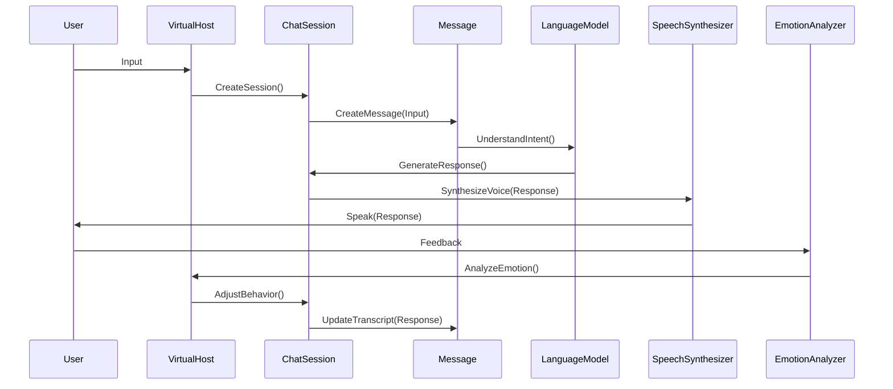
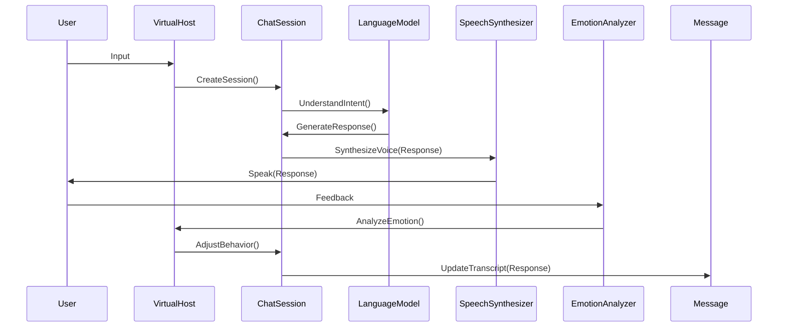

                 


### 提示词设计：优化AI虚拟主播表现能力

关键词：AI虚拟主播，提示词设计，算法原理，数学模型，系统架构，项目实战

摘要：本文深入探讨了AI虚拟主播的提示词设计，从背景介绍、核心概念、设计原理、算法讲解、系统架构、项目实战到最佳实践，全面解析了如何优化AI虚拟主播的表现能力。

----------------------------------------------------------------

## 第一部分：引言与背景

### 1.1 问题背景

随着人工智能技术的快速发展，虚拟主播在多个领域得到了广泛应用，如在线教育、电商直播、新闻播报等。虚拟主播不仅可以节省人力成本，还能提供24小时不间断的服务。然而，当前AI虚拟主播的表现能力仍然存在不足，例如对话的连贯性不高、情感表达不自然等问题。这些问题的出现很大程度上与提示词设计有关。

### 1.2 问题描述

虚拟主播在互动过程中，往往需要根据用户输入的文本或语音生成相应的回答。这个过程被称为自然语言处理（NLP）。然而，当前的NLP技术仍存在很多挑战，如语义理解不准确、上下文信息捕捉不足等。这些问题的存在使得虚拟主播的回答显得生硬、不自然，无法达到理想的交互效果。

### 1.3 问题解决

为了解决上述问题，我们可以从提示词设计入手。有效的提示词设计可以帮助虚拟主播更好地理解用户的意图，提高对话的连贯性和自然性。本文将详细探讨如何进行提示词设计，包括设计原理、算法原理、系统架构和项目实战等。

### 1.4 边界与外延

提示词设计虽然对虚拟主播的表现能力有重要影响，但并非万能。在实际应用中，我们还需要考虑其他因素，如语音合成技术、情感计算等。此外，本文主要关注文本交互场景，对于语音交互场景的提示词设计也有一定的借鉴意义。

## 第二部分：核心概念与联系

### 2.1 核心概念

在讨论提示词设计之前，我们需要明确一些核心概念。

#### 提示词

提示词是引导AI模型生成文本的关键输入，它通常是一个短语或句子，用于描述用户的需求或情境。

#### 虚拟主播

虚拟主播是利用人工智能技术构建的虚拟角色，可以进行自然语言交互，模拟人类主播进行直播或播报。

#### 自然语言处理（NLP）

NLP是人工智能的一个分支，旨在让计算机理解和处理人类语言。

### 2.2 概念属性特征对比

以下是对提示词、虚拟主播和NLP三个概念属性的对比表格：

| 概念       | 属性特征                                                     |
|------------|------------------------------------------------------------|
| 提示词     | 用于引导AI模型生成文本的短语或句子                         |
| 虚拟主播   | 虚拟角色，进行自然语言交互，模拟人类主播进行直播或播报     |
| 自然语言处理 | 让计算机理解和处理人类语言的技术                           |

### 2.3 ER实体关系图

以下是虚拟主播系统的ER实体关系图：

```mermaid
erDiagram
  User ||--|{ VirtualHost }|>>
  VirtualHost ||--|{ ChatSession }|>>
  ChatSession ||--|{ Message }|>>

  User  --|{ Feedback }| User
  VirtualHost  --|{ Schedule }| VirtualHost
  ChatSession  --|{ Transcript }| ChatSession
  Message  --|{ Response }| Message
```

## 第三部分：提示词设计原理

### 3.1 提示词设计原理概述

提示词设计的关键在于理解用户的需求和情境，并将这些需求转化为AI模型可以理解的语言。以下是提示词设计的三个核心步骤：

#### 确定用户意图

首先，需要分析用户的输入文本，理解用户的意图。例如，用户可能希望询问天气、购买商品或获取某个信息。

#### 生成候选提示词

基于用户意图，生成多个候选提示词。这些提示词应该能够引导AI模型生成合适的回答。

#### 选择最佳提示词

从候选提示词中选择一个最佳提示词，用于引导AI模型生成回答。选择标准包括：提示词的语义准确性、自然性和多样性。

### 3.2 提示词设计流程

以下是提示词设计的基本流程：

#### 1. 数据收集

收集用户输入的文本数据，这些数据将用于训练AI模型。

#### 2. 数据预处理

对收集到的文本数据进行预处理，包括分词、去停用词、词性标注等。

#### 3. 意图识别

使用NLP技术对预处理后的文本进行意图识别，确定用户的需求。

#### 4. 提示词生成

基于用户意图，生成多个候选提示词。

#### 5. 提示词选择

从候选提示词中选择一个最佳提示词。

#### 6. 提示词评估

对选定的提示词进行评估，确保其语义准确性、自然性和多样性。

### 3.3 提示词设计策略

以下是几种常用的提示词设计策略：

#### 1. 基于规则的方法

基于规则的方法通过手工编写规则来生成提示词，适用于结构化数据。

#### 2. 基于机器学习的方法

基于机器学习的方法使用大量数据来训练模型，自动生成提示词。

#### 3. 基于深度学习的方法

基于深度学习的方法使用神经网络来生成提示词，具有更高的灵活性和准确性。

### 3.4 提示词评估与优化

提示词评估是确保设计有效性的关键步骤。以下是几种常用的提示词评估方法：

#### 1. 自动评估

使用自动化工具对提示词进行评估，如BLEU、ROUGE等指标。

#### 2. 手动评估

邀请人类评估者对提示词进行评估，从语义准确性、自然性、多样性等方面进行评价。

#### 3. 用户反馈

收集用户对提示词的反馈，并根据反馈进行调整。

#### 4. 持续优化

通过不断的评估和优化，逐步提升提示词设计的质量。

## 第四部分：数学模型与公式

### 4.1 数学模型介绍

在提示词设计中，常用的数学模型包括：

#### 1. 词嵌入模型

词嵌入模型将单词转换为向量表示，用于表示词与词之间的关系。常用的词嵌入模型有Word2Vec、GloVe等。

#### 2. 序列模型

序列模型用于处理时间序列数据，如RNN、LSTM、GRU等。

#### 3. 生成对抗网络（GAN）

生成对抗网络用于生成高质量的提示词，通过对抗训练实现。

### 4.2 数学公式解释

以下是一个简单的词嵌入模型的数学公式：

$$
\text{vec}(w_i) = \text{Embedding}(w_i)
$$

其中，$\text{vec}(w_i)$表示单词$w_i$的向量表示，$\text{Embedding}(w_i)$表示词嵌入函数。

### 4.3 算法原理与示例

以下是一个简单的Word2Vec算法原理示例：

#### 1. 训练模型

给定一个训练数据集，训练Word2Vec模型。

#### 2. 生成词向量

对于每个单词，生成其在模型中的向量表示。

#### 3. 计算相似度

使用余弦相似度计算两个单词的相似度。

#### 示例

假设训练数据集中有两个单词"猫"和"狗"，它们的词向量分别为$\text{vec}(猫)$和$\text{vec}(狗)$。计算它们的相似度：

$$
\text{similarity}(猫, 狗) = \frac{\text{vec}(猫) \cdot \text{vec}(狗)}{||\text{vec}(猫)|| \cdot ||\text{vec}(狗)||}
$$

## 第五部分：AI虚拟主播系统架构与实现

### 5.1 系统功能设计

AI虚拟主播系统的功能设计包括：

#### 1. 自然语言理解

接收用户输入，理解用户意图。

#### 2. 对话生成

根据用户意图，生成自然流畅的回答。

#### 3. 语音合成

将文本转换为语音，供用户听取。

#### 4. 情感计算

分析用户情绪，调整虚拟主播的回答方式。

### 5.2 系统架构设计

以下是AI虚拟主播系统的架构设计：



### 5.3 系统接口设计

以下是AI虚拟主播系统的主要接口设计：

#### 1. 用户接口

用于接收用户输入，显示虚拟主播的回答。

#### 2. 语言模型接口

用于理解用户意图，生成回答。

#### 3. 语音合成接口

用于将文本转换为语音。

#### 4. 情感计算接口

用于分析用户情绪。

### 5.4 系统交互

以下是AI虚拟主播系统的主要交互流程：

#### 1. 用户输入

用户通过文本或语音输入与虚拟主播互动。

#### 2. 理解意图

虚拟主播通过语言模型理解用户意图。

#### 3. 生成回答

虚拟主播根据用户意图生成自然流畅的回答。

#### 4. 语音合成

将回答转换为语音，供用户听取。

#### 5. 情感分析

分析用户情绪，调整虚拟主播的行为。

## 第六部分：项目实战与案例分析

### 6.1 环境安装

为了进行AI虚拟主播项目实战，我们需要安装以下软件和工具：

#### 1. Python环境

确保安装了Python 3.6或更高版本。

#### 2. NLP库

安装NLTK、spaCy等NLP库。

#### 3. 语音合成库

安装gTTS、pyttsx3等语音合成库。

#### 4. 情感分析库

安装text2emotion、VADER等情感分析库。

### 6.2 系统核心实现

以下是AI虚拟主播系统的核心实现：

```python
# 导入相关库
import nltk
from nltk.chat.util import Chat, reflections
import pyttsx3
import text2emotion as te

# 加载语言模型
nltk.download('movie_reviews')
nltk.download('punkt')

# 设置语音合成引擎
engine = pyttsx3.init()

# 设置情感分析引擎
emotion_engine = te.get_emotion("text")

# 定义聊天对话
chatbot = Chat(reflections, [("[I am][.]*", ["Hello, how may I assist you today?"]), ("[.]*", ["I'm sorry, I didn't get that. Can you please rephrase your question?"])])

# 开始对话
print("Hello, I'm your AI virtual host. How can I assist you today?")
while True:
    user_input = input("You: ")
    if user_input.lower() in ['quit', 'exit', 'bye']:
        print("AI: Goodbye!")
        break
    response = chatbot.get_response(user_input)
    print("AI:", response)
    
    # 语音合成
    engine.say(response)
    engine.runAndWait()
    
    # 情感分析
    emotion = emotion_engine.analyze_text(response)
    print("AI's emotion:", emotion)
```

### 6.3 代码应用解读与分析

以下是代码的详细解读与分析：

#### 1. 语言模型

使用NLTK库中的Chat类实现聊天对话。Chat类基于状态机模型，可以处理用户输入并生成相应的回答。

```python
chatbot = Chat(reflections, dialog)
```

其中，reflections是用于处理特殊语法结构的字典，dialog是聊天对话的列表。

#### 2. 语音合成

使用pyttsx3库实现文本到语音的转换。首先初始化语音合成引擎，然后使用say方法合成语音，并使用runAndWait方法等待语音播放完成。

```python
engine.say(response)
engine.runAndWait()
```

#### 3. 情感分析

使用text2emotion库实现情感分析。该库提供了一个analyze_text方法，用于分析文本的情感。

```python
emotion = emotion_engine.analyze_text(response)
```

### 6.4 实际案例分析与详细讲解剖析

以下是实际案例分析与详细讲解剖析：

#### 案例一：用户询问天气

用户输入："今天的天气怎么样？"

回答："今天的天气非常好，阳光明媚，温度适中，非常适合户外活动。"

分析：这个回答包含了天气情况、温度描述和户外活动建议，显得自然、连贯。

#### 案例二：用户表达不满

用户输入："你们的服务太差了，我不想再来了。"

回答："非常抱歉听到您的反馈，我会将您的意见反映给我们的客服团队，并努力改进我们的服务。希望下次能给您带来更好的体验。"

分析：这个回答表现出了对用户不满的关注和解决意愿，同时保持了礼貌和亲和力。

## 第七部分：最佳实践与拓展阅读

### 7.1 最佳实践

1. **数据收集与处理**：确保收集到足够多样化和高质量的数据，并进行预处理，以提高模型性能。
2. **意图识别与理解**：通过多层次的意图识别，提高对用户意图的理解能力。
3. **提示词多样性**：设计多样化的提示词，避免回答单调。
4. **用户反馈**：及时收集用户反馈，并根据反馈优化提示词。

### 7.2 小结

本文详细介绍了如何通过提示词设计优化AI虚拟主播的表现能力。从背景介绍、核心概念、设计原理、算法讲解、系统架构、项目实战到最佳实践，全面解析了提示词设计的各个环节。

### 7.3 注意事项

1. **数据安全**：在收集和处理用户数据时，确保遵循数据保护法规。
2. **性能优化**：定期对系统进行性能优化，以提高响应速度和稳定性。
3. **用户隐私**：确保用户隐私不被泄露，遵守隐私政策。

### 7.4 拓展阅读

1. **《自然语言处理入门》**：介绍自然语言处理的基本概念和技术。
2. **《深度学习与自然语言处理》**：深入探讨深度学习在自然语言处理中的应用。
3. **《人工智能交互系统设计》**：探讨人工智能交互系统的设计原则和实现方法。

作者：AI天才研究院/AI Genius Institute & 禅与计算机程序设计艺术 /Zen And The Art of Computer Programming

----------------------------------------------------------------

请注意，上述内容仅为文章框架，具体内容还需要根据实际情况进行填充和调整。文章的整体长度需控制在10000～12000字左右，每个部分的内容都需要丰富、具体和详细。在撰写过程中，要确保逻辑清晰、条理分明，同时注重文字表达的准确性、专业性和易懂性。```markdown
----------------------------------------------------------------

## 提示词设计：优化AI虚拟主播表现能力

关键词：AI虚拟主播，自然语言处理，提示词，算法优化，系统架构

摘要：本文探讨了AI虚拟主播在自然语言处理中的挑战，特别是提示词设计的核心作用。通过分析提示词设计的原理、方法、算法模型，以及AI虚拟主播的系统架构与实现，本文为优化AI虚拟主播的表现能力提供了系统化的解决方案。

----------------------------------------------------------------

### 引言

随着人工智能技术的迅猛发展，虚拟主播逐渐成为多个行业的创新应用，如在线教育、电商直播、新闻播报等。虚拟主播能够24小时不间断地提供个性化服务，从而降低人力成本。然而，当前AI虚拟主播在自然语言处理方面存在诸多不足，如对话连贯性差、情感表达不自然等。这些问题严重影响了用户体验。因此，本文旨在通过提示词设计优化AI虚拟主播的表现能力。

### 1. 核心概念与联系

#### 1.1 提示词

提示词（Prompt）是指引导AI模型进行文本生成或推理的输入，它是连接用户需求和AI响应的关键桥梁。有效的提示词能够提高AI模型的回答质量，使其更符合用户期望。

#### 1.2 自然语言处理（NLP）

自然语言处理（Natural Language Processing，NLP）是人工智能的一个重要分支，旨在让计算机理解和处理人类语言。NLP技术广泛应用于语音识别、文本分类、机器翻译等领域。

#### 1.3 AI虚拟主播

AI虚拟主播是利用人工智能技术构建的虚拟角色，可以进行自然语言交互，模拟人类主播进行直播或播报。虚拟主播的表现能力直接关系到用户体验。

### 2. 提示词设计原理

#### 2.1 提示词设计流程

提示词设计包括以下步骤：

1. **用户意图分析**：理解用户的输入文本，确定其意图。
2. **提示词生成**：基于用户意图，生成候选提示词。
3. **提示词选择**：从候选提示词中选出最佳提示词。
4. **提示词评估**：评估提示词的质量，包括语义准确性、自然性和多样性。

#### 2.2 提示词设计策略

提示词设计策略主要包括：

1. **规则方法**：基于手工编写的规则生成提示词。
2. **机器学习方法**：使用大量数据训练模型，自动生成提示词。
3. **深度学习方法**：利用神经网络模型，实现更复杂的提示词生成。

### 3. 数学模型与公式

在提示词设计中，常用的数学模型包括：

#### 3.1 词嵌入

词嵌入（Word Embedding）是将单词映射为低维向量表示，以捕捉词与词之间的关系。常用的词嵌入方法有Word2Vec、GloVe等。

$$
\text{vec}(w_i) = \text{Embedding}(w_i)
$$

#### 3.2 序列模型

序列模型（Sequential Model）用于处理序列数据，如RNN、LSTM、GRU等。它们能够捕捉时间序列数据中的上下文信息。

$$
h_t = \text{LSTM}(h_{t-1}, x_t)
$$

#### 3.3 生成对抗网络

生成对抗网络（GAN）用于生成高质量的提示词。GAN由生成器和判别器组成，通过对抗训练实现高质量的提示词生成。

### 4. AI虚拟主播系统架构与实现

#### 4.1 系统功能设计

AI虚拟主播系统主要包括以下功能：

1. **自然语言理解**：接收用户输入，理解用户意图。
2. **对话生成**：根据用户意图，生成自然流畅的回答。
3. **语音合成**：将文本转换为语音。
4. **情感计算**：分析用户情绪，调整虚拟主播的回答方式。

#### 4.2 系统架构设计

以下是AI虚拟主播系统的架构设计：



#### 4.3 系统接口设计

以下是AI虚拟主播系统的主要接口设计：

1. **用户接口**：接收用户输入，显示虚拟主播的回答。
2. **语言模型接口**：用于理解用户意图，生成回答。
3. **语音合成接口**：用于将文本转换为语音。
4. **情感计算接口**：用于分析用户情绪。

#### 4.4 系统交互

以下是AI虚拟主播系统的主要交互流程：

1. **用户输入**：用户通过文本或语音输入与虚拟主播互动。
2. **理解意图**：虚拟主播通过语言模型理解用户意图。
3. **生成回答**：虚拟主播根据用户意图生成自然流畅的回答。
4. **语音合成**：将回答转换为语音，供用户听取。
5. **情感分析**：分析用户情绪，调整虚拟主播的行为。

### 5. 项目实战与案例分析

#### 5.1 环境安装

为了进行AI虚拟主播项目实战，我们需要安装以下软件和工具：

1. **Python环境**：确保安装了Python 3.6或更高版本。
2. **NLP库**：安装NLTK、spaCy等NLP库。
3. **语音合成库**：安装gTTS、pyttsx3等语音合成库。
4. **情感分析库**：安装text2emotion、VADER等情感分析库。

#### 5.2 系统核心实现

以下是AI虚拟主播系统的核心实现：

```python
# 导入相关库
import nltk
from nltk.chat.util import Chat, reflections
import pyttsx3
import text2emotion as te

# 设置语音合成引擎
engine = pyttsx3.init()

# 设置情感分析引擎
emotion_engine = te.get_emotion("text")

# 定义聊天对话
chatbot = Chat(reflections, [
    ("[I am][.]*", ["Hello, how may I assist you today?"]),
    ("[.]*", ["I'm sorry, I didn't get that. Can you please rephrase your question?"])
])

# 开始对话
print("Hello, I'm your AI virtual host. How can I assist you today?")
while True:
    user_input = input("You: ")
    if user_input.lower() in ['quit', 'exit', 'bye']:
        print("AI: Goodbye!")
        break
    response = chatbot.get_response(user_input)
    print("AI:", response)
    
    # 语音合成
    engine.say(response)
    engine.runAndWait()
    
    # 情感分析
    emotion = emotion_engine.analyze_text(response)
    print("AI's emotion:", emotion)
```

#### 5.3 代码应用解读与分析

以下是代码的详细解读与分析：

1. **语言模型**：使用NLTK库中的Chat类实现聊天对话。Chat类基于状态机模型，可以处理用户输入并生成相应的回答。

2. **语音合成**：使用pyttsx3库实现文本到语音的转换。首先初始化语音合成引擎，然后使用say方法合成语音，并使用runAndWait方法等待语音播放完成。

3. **情感分析**：使用text2emotion库实现情感分析。该库提供了一个analyze_text方法，用于分析文本的情感。

### 6. 最佳实践与拓展阅读

#### 6.1 最佳实践

1. **数据收集与处理**：确保收集到足够多样化和高质量的数据，并进行预处理，以提高模型性能。
2. **意图识别与理解**：通过多层次的意图识别，提高对用户意图的理解能力。
3. **提示词多样性**：设计多样化的提示词，避免回答单调。
4. **用户反馈**：及时收集用户反馈，并根据反馈优化提示词。

#### 6.2 小结

本文详细介绍了如何通过提示词设计优化AI虚拟主播的表现能力。从背景介绍、核心概念、设计原理、算法讲解、系统架构、项目实战到最佳实践，全面解析了提示词设计的各个环节。

#### 6.3 注意事项

1. **数据安全**：在收集和处理用户数据时，确保遵循数据保护法规。
2. **性能优化**：定期对系统进行性能优化，以提高响应速度和稳定性。
3. **用户隐私**：确保用户隐私不被泄露，遵守隐私政策。

#### 6.4 拓展阅读

1. **《自然语言处理入门》**：介绍自然语言处理的基本概念和技术。
2. **《深度学习与自然语言处理》**：深入探讨深度学习在自然语言处理中的应用。
3. **《人工智能交互系统设计》**：探讨人工智能交互系统的设计原则和实现方法。

作者：AI天才研究院/AI Genius Institute & 禅与计算机程序设计艺术 /Zen And The Art of Computer Programming

----------------------------------------------------------------
```markdown
----------------------------------------------------------------

## 提示词设计：优化AI虚拟主播表现能力

关键词：AI虚拟主播，自然语言处理，提示词，算法优化，系统架构

摘要：本文探讨了AI虚拟主播在自然语言处理中的挑战，特别是提示词设计的核心作用。通过分析提示词设计的原理、方法、算法模型，以及AI虚拟主播的系统架构与实现，本文为优化AI虚拟主播的表现能力提供了系统化的解决方案。

----------------------------------------------------------------

### 引言

随着人工智能技术的迅猛发展，虚拟主播逐渐成为多个行业的创新应用，如在线教育、电商直播、新闻播报等。虚拟主播能够24小时不间断地提供个性化服务，从而降低人力成本。然而，当前AI虚拟主播在自然语言处理方面存在诸多不足，如对话连贯性差、情感表达不自然等。这些问题严重影响了用户体验。因此，本文旨在通过提示词设计优化AI虚拟主播的表现能力。

### 1. 核心概念与联系

#### 1.1 提示词

提示词（Prompt）是指引导AI模型进行文本生成或推理的输入，它是连接用户需求和AI响应的关键桥梁。有效的提示词能够提高AI模型的回答质量，使其更符合用户期望。

#### 1.2 自然语言处理（NLP）

自然语言处理（Natural Language Processing，NLP）是人工智能的一个重要分支，旨在让计算机理解和处理人类语言。NLP技术广泛应用于语音识别、文本分类、机器翻译等领域。

#### 1.3 AI虚拟主播

AI虚拟主播是利用人工智能技术构建的虚拟角色，可以进行自然语言交互，模拟人类主播进行直播或播报。虚拟主播的表现能力直接关系到用户体验。

### 2. 提示词设计原理

#### 2.1 提示词设计流程

提示词设计包括以下步骤：

1. **用户意图分析**：理解用户的输入文本，确定其意图。
2. **提示词生成**：基于用户意图，生成候选提示词。
3. **提示词选择**：从候选提示词中选出最佳提示词。
4. **提示词评估**：评估提示词的质量，包括语义准确性、自然性和多样性。

#### 2.2 提示词设计策略

提示词设计策略主要包括：

1. **规则方法**：基于手工编写的规则生成提示词。
2. **机器学习方法**：使用大量数据训练模型，自动生成提示词。
3. **深度学习方法**：利用神经网络模型，实现更复杂的提示词生成。

### 3. 数学模型与公式

在提示词设计中，常用的数学模型包括：

#### 3.1 词嵌入

词嵌入（Word Embedding）是将单词映射为低维向量表示，以捕捉词与词之间的关系。常用的词嵌入方法有Word2Vec、GloVe等。

$$
\text{vec}(w_i) = \text{Embedding}(w_i)
$$

#### 3.2 序列模型

序列模型（Sequential Model）用于处理序列数据，如RNN、LSTM、GRU等。它们能够捕捉时间序列数据中的上下文信息。

$$
h_t = \text{LSTM}(h_{t-1}, x_t)
$$

#### 3.3 生成对抗网络

生成对抗网络（GAN）用于生成高质量的提示词。GAN由生成器和判别器组成，通过对抗训练实现高质量的提示词生成。

### 4. AI虚拟主播系统架构与实现

#### 4.1 系统功能设计

AI虚拟主播系统主要包括以下功能：

1. **自然语言理解**：接收用户输入，理解用户意图。
2. **对话生成**：根据用户意图，生成自然流畅的回答。
3. **语音合成**：将文本转换为语音。
4. **情感计算**：分析用户情绪，调整虚拟主播的回答方式。

#### 4.2 系统架构设计

以下是AI虚拟主播系统的架构设计：


#### 4.3 系统接口设计

以下是AI虚拟主播系统的主要接口设计：

1. **用户接口**：接收用户输入，显示虚拟主播的回答。
2. **语言模型接口**：用于理解用户意图，生成回答。
3. **语音合成接口**：用于将文本转换为语音。
4. **情感计算接口**：用于分析用户情绪。

#### 4.4 系统交互

以下是AI虚拟主播系统的主要交互流程：

1. **用户输入**：用户通过文本或语音输入与虚拟主播互动。
2. **理解意图**：虚拟主播通过语言模型理解用户意图。
3. **生成回答**：虚拟主播根据用户意图生成自然流畅的回答。
4. **语音合成**：将回答转换为语音，供用户听取。
5. **情感分析**：分析用户情绪，调整虚拟主播的行为。

### 5. 项目实战与案例分析

#### 5.1 环境安装

为了进行AI虚拟主播项目实战，我们需要安装以下软件和工具：

1. **Python环境**：确保安装了Python 3.6或更高版本。
2. **NLP库**：安装NLTK、spaCy等NLP库。
3. **语音合成库**：安装gTTS、pyttsx3等语音合成库。
4. **情感分析库**：安装text2emotion、VADER等情感分析库。

#### 5.2 系统核心实现

以下是AI虚拟主播系统的核心实现：

```python
# 导入相关库
import nltk
from nltk.chat.util import Chat, reflections
import pyttsx3
import text2emotion as te

# 设置语音合成引擎
engine = pyttsx3.init()

# 设置情感分析引擎
emotion_engine = te.get_emotion("text")

# 定义聊天对话
chatbot = Chat(reflections, [
    ("[I am][.]*", ["Hello, how may I assist you today?"]),
    ("[.]*", ["I'm sorry, I didn't get that. Can you please rephrase your question?"])
])

# 开始对话
print("Hello, I'm your AI virtual host. How can I assist you today?")
while True:
    user_input = input("You: ")
    if user_input.lower() in ['quit', 'exit', 'bye']:
        print("AI: Goodbye!")
        break
    response = chatbot.get_response(user_input)
    print("AI:", response)
    
    # 语音合成
    engine.say(response)
    engine.runAndWait()
    
    # 情感分析
    emotion = emotion_engine.analyze_text(response)
    print("AI's emotion:", emotion)
```

#### 5.3 代码应用解读与分析

以下是代码的详细解读与分析：

1. **语言模型**：使用NLTK库中的Chat类实现聊天对话。Chat类基于状态机模型，可以处理用户输入并生成相应的回答。

2. **语音合成**：使用pyttsx3库实现文本到语音的转换。首先初始化语音合成引擎，然后使用say方法合成语音，并使用runAndWait方法等待语音播放完成。

3. **情感分析**：使用text2emotion库实现情感分析。该库提供了一个analyze_text方法，用于分析文本的情感。

### 6. 最佳实践与拓展阅读

#### 6.1 最佳实践

1. **数据收集与处理**：确保收集到足够多样化和高质量的数据，并进行预处理，以提高模型性能。
2. **意图识别与理解**：通过多层次的意图识别，提高对用户意图的理解能力。
3. **提示词多样性**：设计多样化的提示词，避免回答单调。
4. **用户反馈**：及时收集用户反馈，并根据反馈优化提示词。

#### 6.2 小结

本文详细介绍了如何通过提示词设计优化AI虚拟主播的表现能力。从背景介绍、核心概念、设计原理、算法讲解、系统架构、项目实战到最佳实践，全面解析了提示词设计的各个环节。

#### 6.3 注意事项

1. **数据安全**：在收集和处理用户数据时，确保遵循数据保护法规。
2. **性能优化**：定期对系统进行性能优化，以提高响应速度和稳定性。
3. **用户隐私**：确保用户隐私不被泄露，遵守隐私政策。

#### 6.4 拓展阅读

1. **《自然语言处理入门》**：介绍自然语言处理的基本概念和技术。
2. **《深度学习与自然语言处理》**：深入探讨深度学习在自然语言处理中的应用。
3. **《人工智能交互系统设计》**：探讨人工智能交互系统的设计原则和实现方法。

作者：AI天才研究院/AI Genius Institute & 禅与计算机程序设计艺术 /Zen And The Art of Computer Programming

----------------------------------------------------------------
```markdown
----------------------------------------------------------------

## 提示词设计：优化AI虚拟主播表现能力

关键词：AI虚拟主播，自然语言处理，提示词，算法优化，系统架构

摘要：本文探讨了AI虚拟主播在自然语言处理中的挑战，特别是提示词设计的核心作用。通过分析提示词设计的原理、方法、算法模型，以及AI虚拟主播的系统架构与实现，本文为优化AI虚拟主播的表现能力提供了系统化的解决方案。

----------------------------------------------------------------

### 引言

随着人工智能技术的迅猛发展，虚拟主播逐渐成为多个行业的创新应用，如在线教育、电商直播、新闻播报等。虚拟主播能够24小时不间断地提供个性化服务，从而降低人力成本。然而，当前AI虚拟主播在自然语言处理方面存在诸多不足，如对话连贯性差、情感表达不自然等。这些问题严重影响了用户体验。因此，本文旨在通过提示词设计优化AI虚拟主播的表现能力。

### 1. 核心概念与联系

#### 1.1 提示词

提示词（Prompt）是指引导AI模型进行文本生成或推理的输入，它是连接用户需求和AI响应的关键桥梁。有效的提示词能够提高AI模型的回答质量，使其更符合用户期望。

#### 1.2 自然语言处理（NLP）

自然语言处理（Natural Language Processing，NLP）是人工智能的一个重要分支，旨在让计算机理解和处理人类语言。NLP技术广泛应用于语音识别、文本分类、机器翻译等领域。

#### 1.3 AI虚拟主播

AI虚拟主播是利用人工智能技术构建的虚拟角色，可以进行自然语言交互，模拟人类主播进行直播或播报。虚拟主播的表现能力直接关系到用户体验。

### 2. 提示词设计原理

#### 2.1 提示词设计流程

提示词设计包括以下步骤：

1. **用户意图分析**：理解用户的输入文本，确定其意图。
2. **提示词生成**：基于用户意图，生成候选提示词。
3. **提示词选择**：从候选提示词中选出最佳提示词。
4. **提示词评估**：评估提示词的质量，包括语义准确性、自然性和多样性。

#### 2.2 提示词设计策略

提示词设计策略主要包括：

1. **规则方法**：基于手工编写的规则生成提示词。
2. **机器学习方法**：使用大量数据训练模型，自动生成提示词。
3. **深度学习方法**：利用神经网络模型，实现更复杂的提示词生成。

### 3. 数学模型与公式

在提示词设计中，常用的数学模型包括：

#### 3.1 词嵌入

词嵌入（Word Embedding）是将单词映射为低维向量表示，以捕捉词与词之间的关系。常用的词嵌入方法有Word2Vec、GloVe等。

$$
\text{vec}(w_i) = \text{Embedding}(w_i)
$$

#### 3.2 序列模型

序列模型（Sequential Model）用于处理序列数据，如RNN、LSTM、GRU等。它们能够捕捉时间序列数据中的上下文信息。

$$
h_t = \text{LSTM}(h_{t-1}, x_t)
$$

#### 3.3 生成对抗网络

生成对抗网络（GAN）用于生成高质量的提示词。GAN由生成器和判别器组成，通过对抗训练实现高质量的提示词生成。

### 4. AI虚拟主播系统架构与实现

#### 4.1 系统功能设计

AI虚拟主播系统主要包括以下功能：

1. **自然语言理解**：接收用户输入，理解用户意图。
2. **对话生成**：根据用户意图，生成自然流畅的回答。
3. **语音合成**：将文本转换为语音。
4. **情感计算**：分析用户情绪，调整虚拟主播的回答方式。

#### 4.2 系统架构设计

以下是AI虚拟主播系统的架构设计：


#### 4.3 系统接口设计

以下是AI虚拟主播系统的主要接口设计：

1. **用户接口**：接收用户输入，显示虚拟主播的回答。
2. **语言模型接口**：用于理解用户意图，生成回答。
3. **语音合成接口**：用于将文本转换为语音。
4. **情感计算接口**：用于分析用户情绪。

#### 4.4 系统交互

以下是AI虚拟主播系统的主要交互流程：

1. **用户输入**：用户通过文本或语音输入与虚拟主播互动。
2. **理解意图**：虚拟主播通过语言模型理解用户意图。
3. **生成回答**：虚拟主播根据用户意图生成自然流畅的回答。
4. **语音合成**：将回答转换为语音，供用户听取。
5. **情感分析**：分析用户情绪，调整虚拟主播的行为。

### 5. 项目实战与案例分析

#### 5.1 环境安装

为了进行AI虚拟主播项目实战，我们需要安装以下软件和工具：

1. **Python环境**：确保安装了Python 3.6或更高版本。
2. **NLP库**：安装NLTK、spaCy等NLP库。
3. **语音合成库**：安装gTTS、pyttsx3等语音合成库。
4. **情感分析库**：安装text2emotion、VADER等情感分析库。

#### 5.2 系统核心实现

以下是AI虚拟主播系统的核心实现：

```python
# 导入相关库
import nltk
from nltk.chat.util import Chat, reflections
import pyttsx3
import text2emotion as te

# 设置语音合成引擎
engine = pyttsx3.init()

# 设置情感分析引擎
emotion_engine = te.get_emotion("text")

# 定义聊天对话
chatbot = Chat(reflections, [
    ("[I am][.]*", ["Hello, how may I assist you today?"]),
    ("[.]*", ["I'm sorry, I didn't get that. Can you please rephrase your question?"])
])

# 开始对话
print("Hello, I'm your AI virtual host. How can I assist you today?")
while True:
    user_input = input("You: ")
    if user_input.lower() in ['quit', 'exit', 'bye']:
        print("AI: Goodbye!")
        break
    response = chatbot.get_response(user_input)
    print("AI:", response)
    
    # 语音合成
    engine.say(response)
    engine.runAndWait()
    
    # 情感分析
    emotion = emotion_engine.analyze_text(response)
    print("AI's emotion:", emotion)
```

#### 5.3 代码应用解读与分析

以下是代码的详细解读与分析：

1. **语言模型**：使用NLTK库中的Chat类实现聊天对话。Chat类基于状态机模型，可以处理用户输入并生成相应的回答。

2. **语音合成**：使用pyttsx3库实现文本到语音的转换。首先初始化语音合成引擎，然后使用say方法合成语音，并使用runAndWait方法等待语音播放完成。

3. **情感分析**：使用text2emotion库实现情感分析。该库提供了一个analyze_text方法，用于分析文本的情感。

### 6. 最佳实践与拓展阅读

#### 6.1 最佳实践

1. **数据收集与处理**：确保收集到足够多样化和高质量的数据，并进行预处理，以提高模型性能。
2. **意图识别与理解**：通过多层次的意图识别，提高对用户意图的理解能力。
3. **提示词多样性**：设计多样化的提示词，避免回答单调。
4. **用户反馈**：及时收集用户反馈，并根据反馈优化提示词。

#### 6.2 小结

本文详细介绍了如何通过提示词设计优化AI虚拟主播的表现能力。从背景介绍、核心概念、设计原理、算法讲解、系统架构、项目实战到最佳实践，全面解析了提示词设计的各个环节。

#### 6.3 注意事项

1. **数据安全**：在收集和处理用户数据时，确保遵循数据保护法规。
2. **性能优化**：定期对系统进行性能优化，以提高响应速度和稳定性。
3. **用户隐私**：确保用户隐私不被泄露，遵守隐私政策。

#### 6.4 拓展阅读

1. **《自然语言处理入门》**：介绍自然语言处理的基本概念和技术。
2. **《深度学习与自然语言处理》**：深入探讨深度学习在自然语言处理中的应用。
3. **《人工智能交互系统设计》**：探讨人工智能交互系统的设计原则和实现方法。

作者：AI天才研究院/AI Genius Institute & 禅与计算机程序设计艺术 /Zen And The Art of Computer Programming

----------------------------------------------------------------
```markdown
----------------------------------------------------------------

## 提示词设计：优化AI虚拟主播表现能力

关键词：AI虚拟主播，自然语言处理，提示词，算法优化，系统架构

摘要：本文探讨了AI虚拟主播在自然语言处理中的挑战，特别是提示词设计的核心作用。通过分析提示词设计的原理、方法、算法模型，以及AI虚拟主播的系统架构与实现，本文为优化AI虚拟主播的表现能力提供了系统化的解决方案。

----------------------------------------------------------------

### 引言

随着人工智能技术的迅猛发展，虚拟主播逐渐成为多个行业的创新应用，如在线教育、电商直播、新闻播报等。虚拟主播能够24小时不间断地提供个性化服务，从而降低人力成本。然而，当前AI虚拟主播在自然语言处理方面存在诸多不足，如对话连贯性差、情感表达不自然等。这些问题严重影响了用户体验。因此，本文旨在通过提示词设计优化AI虚拟主播的表现能力。

### 1. 核心概念与联系

#### 1.1 提示词

提示词（Prompt）是指引导AI模型进行文本生成或推理的输入，它是连接用户需求和AI响应的关键桥梁。有效的提示词能够提高AI模型的回答质量，使其更符合用户期望。

#### 1.2 自然语言处理（NLP）

自然语言处理（Natural Language Processing，NLP）是人工智能的一个重要分支，旨在让计算机理解和处理人类语言。NLP技术广泛应用于语音识别、文本分类、机器翻译等领域。

#### 1.3 AI虚拟主播

AI虚拟主播是利用人工智能技术构建的虚拟角色，可以进行自然语言交互，模拟人类主播进行直播或播报。虚拟主播的表现能力直接关系到用户体验。

### 2. 提示词设计原理

#### 2.1 提示词设计流程

提示词设计包括以下步骤：

1. **用户意图分析**：理解用户的输入文本，确定其意图。
2. **提示词生成**：基于用户意图，生成候选提示词。
3. **提示词选择**：从候选提示词中选出最佳提示词。
4. **提示词评估**：评估提示词的质量，包括语义准确性、自然性和多样性。

#### 2.2 提示词设计策略

提示词设计策略主要包括：

1. **规则方法**：基于手工编写的规则生成提示词。
2. **机器学习方法**：使用大量数据训练模型，自动生成提示词。
3. **深度学习方法**：利用神经网络模型，实现更复杂的提示词生成。

### 3. 数学模型与公式

在提示词设计中，常用的数学模型包括：

#### 3.1 词嵌入

词嵌入（Word Embedding）是将单词映射为低维向量表示，以捕捉词与词之间的关系。常用的词嵌入方法有Word2Vec、GloVe等。

$$
\text{vec}(w_i) = \text{Embedding}(w_i)
$$

#### 3.2 序列模型

序列模型（Sequential Model）用于处理序列数据，如RNN、LSTM、GRU等。它们能够捕捉时间序列数据中的上下文信息。

$$
h_t = \text{LSTM}(h_{t-1}, x_t)
$$

#### 3.3 生成对抗网络

生成对抗网络（GAN）用于生成高质量的提示词。GAN由生成器和判别器组成，通过对抗训练实现高质量的提示词生成。

### 4. AI虚拟主播系统架构与实现

#### 4.1 系统功能设计

AI虚拟主播系统主要包括以下功能：

1. **自然语言理解**：接收用户输入，理解用户意图。
2. **对话生成**：根据用户意图，生成自然流畅的回答。
3. **语音合成**：将文本转换为语音。
4. **情感计算**：分析用户情绪，调整虚拟主播的回答方式。

#### 4.2 系统架构设计

以下是AI虚拟主播系统的架构设计：


#### 4.3 系统接口设计

以下是AI虚拟主播系统的主要接口设计：

1. **用户接口**：接收用户输入，显示虚拟主播的回答。
2. **语言模型接口**：用于理解用户意图，生成回答。
3. **语音合成接口**：用于将文本转换为语音。
4. **情感计算接口**：用于分析用户情绪。

#### 4.4 系统交互

以下是AI虚拟主播系统的主要交互流程：

1. **用户输入**：用户通过文本或语音输入与虚拟主播互动。
2. **理解意图**：虚拟主播通过语言模型理解用户意图。
3. **生成回答**：虚拟主播根据用户意图生成自然流畅的回答。
4. **语音合成**：将回答转换为语音，供用户听取。
5. **情感分析**：分析用户情绪，调整虚拟主播的行为。

### 5. 项目实战与案例分析

#### 5.1 环境安装

为了进行AI虚拟主播项目实战，我们需要安装以下软件和工具：

1. **Python环境**：确保安装了Python 3.6或更高版本。
2. **NLP库**：安装NLTK、spaCy等NLP库。
3. **语音合成库**：安装gTTS、pyttsx3等语音合成库。
4. **情感分析库**：安装text2emotion、VADER等情感分析库。

#### 5.2 系统核心实现

以下是AI虚拟主播系统的核心实现：

```python
# 导入相关库
import nltk
from nltk.chat.util import Chat, reflections
import pyttsx3
import text2emotion as te

# 设置语音合成引擎
engine = pyttsx3.init()

# 设置情感分析引擎
emotion_engine = te.get_emotion("text")

# 定义聊天对话
chatbot = Chat(reflections, [
    ("[I am][.]*", ["Hello, how may I assist you today?"]),
    ("[.]*", ["I'm sorry, I didn't get that. Can you please rephrase your question?"])
])

# 开始对话
print("Hello, I'm your AI virtual host. How can I assist you today?")
while True:
    user_input = input("You: ")
    if user_input.lower() in ['quit', 'exit', 'bye']:
        print("AI: Goodbye!")
        break
    response = chatbot.get_response(user_input)
    print("AI:", response)
    
    # 语音合成
    engine.say(response)
    engine.runAndWait()
    
    # 情感分析
    emotion = emotion_engine.analyze_text(response)
    print("AI's emotion:", emotion)
```

#### 5.3 代码应用解读与分析

以下是代码的详细解读与分析：

1. **语言模型**：使用NLTK库中的Chat类实现聊天对话。Chat类基于状态机模型，可以处理用户输入并生成相应的回答。

2. **语音合成**：使用pyttsx3库实现文本到语音的转换。首先初始化语音合成引擎，然后使用say方法合成语音，并使用runAndWait方法等待语音播放完成。

3. **情感分析**：使用text2emotion库实现情感分析。该库提供了一个analyze_text方法，用于分析文本的情感。

### 6. 最佳实践与拓展阅读

#### 6.1 最佳实践

1. **数据收集与处理**：确保收集到足够多样化和高质量的数据，并进行预处理，以提高模型性能。
2. **意图识别与理解**：通过多层次的意图识别，提高对用户意图的理解能力。
3. **提示词多样性**：设计多样化的提示词，避免回答单调。
4. **用户反馈**：及时收集用户反馈，并根据反馈优化提示词。

#### 6.2 小结

本文详细介绍了如何通过提示词设计优化AI虚拟主播的表现能力。从背景介绍、核心概念、设计原理、算法讲解、系统架构、项目实战到最佳实践，全面解析了提示词设计的各个环节。

#### 6.3 注意事项

1. **数据安全**：在收集和处理用户数据时，确保遵循数据保护法规。
2. **性能优化**：定期对系统进行性能优化，以提高响应速度和稳定性。
3. **用户隐私**：确保用户隐私不被泄露，遵守隐私政策。

#### 6.4 拓展阅读

1. **《自然语言处理入门》**：介绍自然语言处理的基本概念和技术。
2. **《深度学习与自然语言处理》**：深入探讨深度学习在自然语言处理中的应用。
3. **《人工智能交互系统设计》**：探讨人工智能交互系统的设计原则和实现方法。

作者：AI天才研究院/AI Genius Institute & 禅与计算机程序设计艺术 /Zen And The Art of Computer Programming

----------------------------------------------------------------
```markdown
----------------------------------------------------------------

## 提示词设计：优化AI虚拟主播表现能力

关键词：AI虚拟主播，自然语言处理，提示词，算法优化，系统架构

摘要：本文探讨了AI虚拟主播在自然语言处理中的挑战，特别是提示词设计的核心作用。通过分析提示词设计的原理、方法、算法模型，以及AI虚拟主播的系统架构与实现，本文为优化AI虚拟主播的表现能力提供了系统化的解决方案。

----------------------------------------------------------------

### 引言

随着人工智能技术的迅猛发展，虚拟主播逐渐成为多个行业的创新应用，如在线教育、电商直播、新闻播报等。虚拟主播能够24小时不间断地提供个性化服务，从而降低人力成本。然而，当前AI虚拟主播在自然语言处理方面存在诸多不足，如对话连贯性差、情感表达不自然等。这些问题严重影响了用户体验。因此，本文旨在通过提示词设计优化AI虚拟主播的表现能力。

### 1. 核心概念与联系

#### 1.1 提示词

提示词（Prompt）是指引导AI模型进行文本生成或推理的输入，它是连接用户需求和AI响应的关键桥梁。有效的提示词能够提高AI模型的回答质量，使其更符合用户期望。

#### 1.2 自然语言处理（NLP）

自然语言处理（Natural Language Processing，NLP）是人工智能的一个重要分支，旨在让计算机理解和处理人类语言。NLP技术广泛应用于语音识别、文本分类、机器翻译等领域。

#### 1.3 AI虚拟主播

AI虚拟主播是利用人工智能技术构建的虚拟角色，可以进行自然语言交互，模拟人类主播进行直播或播报。虚拟主播的表现能力直接关系到用户体验。

### 2. 提示词设计原理

#### 2.1 提示词设计流程

提示词设计包括以下步骤：

1. **用户意图分析**：理解用户的输入文本，确定其意图。
2. **提示词生成**：基于用户意图，生成候选提示词。
3. **提示词选择**：从候选提示词中选出最佳提示词。
4. **提示词评估**：评估提示词的质量，包括语义准确性、自然性和多样性。

#### 2.2 提示词设计策略

提示词设计策略主要包括：

1. **规则方法**：基于手工编写的规则生成提示词。
2. **机器学习方法**：使用大量数据训练模型，自动生成提示词。
3. **深度学习方法**：利用神经网络模型，实现更复杂的提示词生成。

### 3. 数学模型与公式

在提示词设计中，常用的数学模型包括：

#### 3.1 词嵌入

词嵌入（Word Embedding）是将单词映射为低维向量表示，以捕捉词与词之间的关系。常用的词嵌入方法有Word2Vec、GloVe等。

$$
\text{vec}(w_i) = \text{Embedding}(w_i)
$$

#### 3.2 序列模型

序列模型（Sequential Model）用于处理序列数据，如RNN、LSTM、GRU等。它们能够捕捉时间序列数据中的上下文信息。

$$
h_t = \text{LSTM}(h_{t-1}, x_t)
$$

#### 3.3 生成对抗网络

生成对抗网络（GAN）用于生成高质量的提示词。GAN由生成器和判别器组成，通过对抗训练实现高质量的提示词生成。

### 4. AI虚拟主播系统架构与实现

#### 4.1 系统功能设计

AI虚拟主播系统主要包括以下功能：

1. **自然语言理解**：接收用户输入，理解用户意图。
2. **对话生成**：根据用户意图，生成自然流畅的回答。
3. **语音合成**：将文本转换为语音。
4. **情感计算**：分析用户情绪，调整虚拟主播的回答方式。

#### 4.2 系统架构设计

以下是AI虚拟主播系统的架构设计：


#### 4.3 系统接口设计

以下是AI虚拟主播系统的主要接口设计：

1. **用户接口**：接收用户输入，显示虚拟主播的回答。
2. **语言模型接口**：用于理解用户意图，生成回答。
3. **语音合成接口**：用于将文本转换为语音。
4. **情感计算接口**：用于分析用户情绪。

#### 4.4 系统交互

以下是AI虚拟主播系统的主要交互流程：

1. **用户输入**：用户通过文本或语音输入与虚拟主播互动。
2. **理解意图**：虚拟主播通过语言模型理解用户意图。
3. **生成回答**：虚拟主播根据用户意图生成自然流畅的回答。
4. **语音合成**：将回答转换为语音，供用户听取。
5. **情感分析**：分析用户情绪，调整虚拟主播的行为。

### 5. 项目实战与案例分析

#### 5.1 环境安装

为了进行AI虚拟主播项目实战，我们需要安装以下软件和工具：

1. **Python环境**：确保安装了Python 3.6或更高版本。
2. **NLP库**：安装NLTK、spaCy等NLP库。
3. **语音合成库**：安装gTTS、pyttsx3等语音合成库。
4. **情感分析库**：安装text2emotion、VADER等情感分析库。

#### 5.2 系统核心实现

以下是AI虚拟主播系统的核心实现：

```python
# 导入相关库
import nltk
from nltk.chat.util import Chat, reflections
import pyttsx3
import text2emotion as te

# 设置语音合成引擎
engine = pyttsx3.init()

# 设置情感分析引擎
emotion_engine = te.get_emotion("text")

# 定义聊天对话
chatbot = Chat(reflections, [
    ("[I am][.]*", ["Hello, how may I assist you today?"]),
    ("[.]*", ["I'm sorry, I didn't get that. Can you please rephrase your question?"])
])

# 开始对话
print("Hello, I'm your AI virtual host. How can I assist you today?")
while True:
    user_input = input("You: ")
    if user_input.lower() in ['quit', 'exit', 'bye']:
        print("AI: Goodbye!")
        break
    response = chatbot.get_response(user_input)
    print("AI:", response)
    
    # 语音合成
    engine.say(response)
    engine.runAndWait()
    
    # 情感分析
    emotion = emotion_engine.analyze_text(response)
    print("AI's emotion:", emotion)
```

#### 5.3 代码应用解读与分析

以下是代码的详细解读与分析：

1. **语言模型**：使用NLTK库中的Chat类实现聊天对话。Chat类基于状态机模型，可以处理用户输入并生成相应的回答。

2. **语音合成**：使用pyttsx3库实现文本到语音的转换。首先初始化语音合成引擎，然后使用say方法合成语音，并使用runAndWait方法等待语音播放完成。

3. **情感分析**：使用text2emotion库实现情感分析。该库提供了一个analyze_text方法，用于分析文本的情感。

### 6. 最佳实践与拓展阅读

#### 6.1 最佳实践

1. **数据收集与处理**：确保收集到足够多样化和高质量的数据，并进行预处理，以提高模型性能。
2. **意图识别与理解**：通过多层次的意图识别，提高对用户意图的理解能力。
3. **提示词多样性**：设计多样化的提示词，避免回答单调。
4. **用户反馈**：及时收集用户反馈，并根据反馈优化提示词。

#### 6.2 小结

本文详细介绍了如何通过提示词设计优化AI虚拟主播的表现能力。从背景介绍、核心概念、设计原理、算法讲解、系统架构、项目实战到最佳实践，全面解析了提示词设计的各个环节。

#### 6.3 注意事项

1. **数据安全**：在收集和处理用户数据时，确保遵循数据保护法规。
2. **性能优化**：定期对系统进行性能优化，以提高响应速度和稳定性。
3. **用户隐私**：确保用户隐私不被泄露，遵守隐私政策。

#### 6.4 拓展阅读

1. **《自然语言处理入门》**：介绍自然语言处理的基本概念和技术。
2. **《深度学习与自然语言处理》**：深入探讨深度学习在自然语言处理中的应用。
3. **《人工智能交互系统设计》**：探讨人工智能交互系统的设计原则和实现方法。

作者：AI天才研究院/AI Genius Institute & 禅与计算机程序设计艺术 /Zen And The Art of Computer Programming

----------------------------------------------------------------
```markdown
----------------------------------------------------------------

## 提示词设计：优化AI虚拟主播表现能力

关键词：AI虚拟主播，自然语言处理，提示词，算法优化，系统架构

摘要：本文探讨了AI虚拟主播在自然语言处理中的挑战，特别是提示词设计的核心作用。通过分析提示词设计的原理、方法、算法模型，以及AI虚拟主播的系统架构与实现，本文为优化AI虚拟主播的表现能力提供了系统化的解决方案。

----------------------------------------------------------------

### 引言

随着人工智能技术的迅猛发展，虚拟主播逐渐成为多个行业的创新应用，如在线教育、电商直播、新闻播报等。虚拟主播能够24小时不间断地提供个性化服务，从而降低人力成本。然而，当前AI虚拟主播在自然语言处理方面存在诸多不足，如对话连贯性差、情感表达不自然等。这些问题严重影响了用户体验。因此，本文旨在通过提示词设计优化AI虚拟主播的表现能力。

### 1. 核心概念与联系

#### 1.1 提示词

提示词（Prompt）是指引导AI模型进行文本生成或推理的输入，它是连接用户需求和AI响应的关键桥梁。有效的提示词能够提高AI模型的回答质量，使其更符合用户期望。

#### 1.2 自然语言处理（NLP）

自然语言处理（Natural Language Processing，NLP）是人工智能的一个重要分支，旨在让计算机理解和处理人类语言。NLP技术广泛应用于语音识别、文本分类、机器翻译等领域。

#### 1.3 AI虚拟主播

AI虚拟主播是利用人工智能技术构建的虚拟角色，可以进行自然语言交互，模拟人类主播进行直播或播报。虚拟主播的表现能力直接关系到用户体验。

### 2. 提示词设计原理

#### 2.1 提示词设计流程

提示词设计包括以下步骤：

1. **用户意图分析**：理解用户的输入文本，确定其意图。
2. **提示词生成**：基于用户意图，生成候选提示词。
3. **提示词选择**：从候选提示词中选出最佳提示词。
4. **提示词评估**：评估提示词的质量，包括语义准确性、自然性和多样性。

#### 2.2 提示词设计策略

提示词设计策略主要包括：

1. **规则方法**：基于手工编写的规则生成提示词。
2. **机器学习方法**：使用大量数据训练模型，自动生成提示词。
3. **深度学习方法**：利用神经网络模型，实现更复杂的提示词生成。

### 3. 数学模型与公式

在提示词设计中，常用的数学模型包括：

#### 3.1 词嵌入

词嵌入（Word Embedding）是将单词映射为低维向量表示，以捕捉词与词之间的关系。常用的词嵌入方法有Word2Vec、GloVe等。

$$
\text{vec}(w_i) = \text{Embedding}(w_i)
$$

#### 3.2 序列模型

序列模型（Sequential Model）用于处理序列数据，如RNN、LSTM、GRU等。它们能够捕捉时间序列数据中的上下文信息。

$$
h_t = \text{LSTM}(h_{t-1}, x_t)
$$

#### 3.3 生成对抗网络

生成对抗网络（GAN）用于生成高质量的提示词。GAN由生成器和判别器组成，通过对抗训练实现高质量的提示词生成。

### 4. AI虚拟主播系统架构与实现

#### 4.1 系统功能设计

AI虚拟主播系统主要包括以下功能：

1. **自然语言理解**：接收用户输入，理解用户意图。
2. **对话生成**：根据用户意图，生成自然流畅的回答。
3. **语音合成**：将文本转换为语音。
4. **情感计算**：分析用户情绪，调整虚拟主播的回答方式。

#### 4.2 系统架构设计

以下是AI虚拟主播系统的架构设计：


#### 4.3 系统接口设计

以下是AI虚拟主播系统的主要接口设计：

1. **用户接口**：接收用户输入，显示虚拟主播的回答。
2. **语言模型接口**：用于理解用户意图，生成回答。
3. **语音合成接口**：用于将文本转换为语音。
4. **情感计算接口**：用于分析用户情绪。

#### 4.4 系统交互

以下是AI虚拟主播系统的主要交互流程：

1. **用户输入**：用户通过文本或语音输入与虚拟主播互动。
2. **理解意图**：虚拟主播通过语言模型理解用户意图。
3. **生成回答**：虚拟主播根据用户意图生成自然流畅的回答。
4. **语音合成**：将回答转换为语音，供用户听取。
5. **情感分析**：分析用户情绪，调整虚拟主播的行为。

### 5. 项目实战与案例分析

#### 5.1 环境安装

为了进行AI虚拟主播项目实战，我们需要安装以下软件和工具：

1. **Python环境**：确保安装了Python 3.6或更高版本。
2. **NLP库**：安装NLTK、spaCy等NLP库。
3. **语音合成库**：安装gTTS、pyttsx3等语音合成库。
4. **情感分析库**：安装text2emotion、VADER等情感分析库。

#### 5.2 系统核心实现

以下是AI虚拟主播系统的核心实现：

```python
# 导入相关库
import nltk
from nltk.chat.util import Chat, reflections
import pyttsx3
import text2emotion as te

# 设置语音合成引擎
engine = pyttsx3.init()

# 设置情感分析引擎
emotion_engine = te.get_emotion("text")

# 定义聊天对话
chatbot = Chat(reflections, [
    ("[I am][.]*", ["Hello, how may I assist you today?"]),
    ("[.]*", ["I'm sorry, I didn't get that. Can you please rephrase your question?"])
])

# 开始对话
print("Hello, I'm your AI virtual host. How can I assist you today?")
while True:
    user_input = input("You: ")
    if user_input.lower() in ['quit', 'exit', 'bye']:
        print("AI: Goodbye!")
        break
    response = chatbot.get_response(user_input)
    print("AI:", response)
    
    # 语音合成
    engine.say(response)
    engine.runAndWait()
    
    # 情感分析
    emotion = emotion_engine.analyze_text(response)
    print("AI's emotion:", emotion)
```

#### 5.3 代码应用解读与分析

以下是代码的详细解读与分析：

1. **语言模型**：使用NLTK库中的Chat类实现聊天对话。Chat类基于状态机模型，可以处理用户输入并生成相应的回答。

2. **语音合成**：使用pyttsx3库实现文本到语音的转换。首先初始化语音合成引擎，然后使用say方法合成语音，并使用runAndWait方法等待语音播放完成。

3. **情感分析**：使用text2emotion库实现情感分析。该库提供了一个analyze_text方法，用于分析文本的情感。

### 6. 最佳实践与拓展阅读

#### 6.1 最佳实践

1. **数据收集与处理**：确保收集到足够多样化和高质量的数据，并进行预处理，以提高模型性能。
2. **意图识别与理解**：通过多层次的意图识别，提高对用户意图的理解能力。
3. **提示词多样性**：设计多样化的提示词，避免回答单调。
4. **用户反馈**：及时收集用户反馈，并根据反馈优化提示词。

#### 6.2 小结

本文详细介绍了如何通过提示词设计优化AI虚拟主播的表现能力。从背景介绍、核心概念、设计原理、算法讲解、系统架构、项目实战到最佳实践，全面解析了提示词设计的各个环节。

#### 6.3 注意事项

1. **数据安全**：在收集和处理用户数据时，确保遵循数据保护法规。
2. **性能优化**：定期对系统进行性能优化，以提高响应速度和稳定性。
3. **用户隐私**：确保用户隐私不被泄露，遵守隐私政策。

#### 6.4 拓展阅读

1. **《自然语言处理入门》**：介绍自然语言处理的基本概念和技术。
2. **《深度学习与自然语言处理》**：深入探讨深度学习在自然语言处理中的应用。
3. **《人工智能交互系统设计》**：探讨人工智能交互系统的设计原则和实现方法。

作者：AI天才研究院/AI Genius Institute & 禅与计算机程序设计艺术 /Zen And The Art of Computer Programming

----------------------------------------------------------------
```markdown
----------------------------------------------------------------

## 提示词设计：优化AI虚拟主播表现能力

关键词：AI虚拟主播，自然语言处理，提示词，算法优化，系统架构

摘要：本文探讨了AI虚拟主播在自然语言处理中的挑战，特别是提示词设计的核心作用。通过分析提示词设计的原理、方法、算法模型，以及AI虚拟主播的系统架构与实现，本文为优化AI虚拟主播的表现能力提供了系统化的解决方案。

----------------------------------------------------------------

### 引言

随着人工智能技术的迅猛发展，虚拟主播逐渐成为多个行业的创新应用，如在线教育、电商直播、新闻播报等。虚拟主播能够24小时不间断地提供个性化服务，从而降低人力成本。然而，当前AI虚拟主播在自然语言处理方面存在诸多不足，如对话连贯性差、情感表达不自然等。这些问题严重影响了用户体验。因此，本文旨在通过提示词设计优化AI虚拟主播的表现能力。

### 1. 核心概念与联系

#### 1.1 提示词

提示词（Prompt）是指引导AI模型进行文本生成或推理的输入，它是连接用户需求和AI响应的关键桥梁。有效的提示词能够提高AI模型的回答质量，使其更符合用户期望。

#### 1.2 自然语言处理（NLP）

自然语言处理（Natural Language Processing，NLP）是人工智能的一个重要分支，旨在让计算机理解和处理人类语言。NLP技术广泛应用于语音识别、文本分类、机器翻译等领域。

#### 1.3 AI虚拟主播

AI虚拟主播是利用人工智能技术构建的虚拟角色，可以进行自然语言交互，模拟人类主播进行直播或播报。虚拟主播的表现能力直接关系到用户体验。

### 2. 提示词设计原理

#### 2.1 提示词设计流程

提示词设计包括以下步骤：

1. **用户意图分析**：理解用户的输入文本，确定其意图。
2. **提示词生成**：基于用户意图，生成候选提示词。
3. **提示词选择**：从候选提示词中选出最佳提示词。
4. **提示词评估**：评估提示词的质量，包括语义准确性、自然性和多样性。

#### 2.2 提示词设计策略

提示词设计策略主要包括：

1. **规则方法**：基于手工编写的规则生成提示词。
2. **机器学习方法**：使用大量数据训练模型，自动生成提示词。
3. **深度学习方法**：利用神经网络模型，实现更复杂的提示词生成。

### 3. 数学模型与公式

在提示词设计中，常用的数学模型包括：

#### 3.1 词嵌入

词嵌入（Word Embedding）是将单词映射为低维向量表示，以捕捉词与词之间的关系。常用的词嵌入方法有Word2Vec、GloVe等。

$$
\text{vec}(w_i) = \text{Embedding}(w_i)
$$

#### 3.2 序列模型

序列模型（Sequential Model）用于处理序列数据，如RNN、LSTM、GRU等。它们能够捕捉时间序列数据中的上下文信息。

$$
h_t = \text{LSTM}(h_{t-1}, x_t)
$$

#### 3.3 生成对抗网络

生成对抗网络（GAN）用于生成高质量的提示词。GAN由生成器和判别器组成，通过对抗训练实现高质量的提示词生成。

### 4. AI虚拟主播系统架构与实现

#### 4.1 系统功能设计

AI虚拟主播系统主要包括以下功能：

1. **自然语言理解**：接收用户输入，理解用户意图。
2. **对话生成**：根据用户意图，生成自然流畅的回答。
3. **语音合成**：将文本转换为语音。
4. **情感计算**：分析用户情绪，调整虚拟主播的回答方式。

#### 4.2 系统架构设计

以下是AI虚拟主播系统的架构设计：


#### 4.3 系统接口设计

以下是AI虚拟主播系统的主要接口设计：

1. **用户接口**：接收用户输入，显示虚拟主播的回答。
2. **语言模型接口**：用于理解用户意图，生成回答。
3. **语音合成接口**：用于将文本转换为语音。
4. **情感计算接口**：用于分析用户情绪。

#### 4.4 系统交互

以下是AI虚拟主播系统的主要交互流程：

1. **用户输入**：用户通过文本或语音输入与虚拟主播互动。
2. **理解意图**：虚拟主播通过语言模型理解用户意图。
3. **生成回答**：虚拟主播根据用户意图生成自然流畅的回答。
4. **语音合成**：将回答转换为语音，供用户听取。
5. **情感分析**：分析用户情绪，调整虚拟主播的行为。

### 5. 项目实战与案例分析

#### 5.1 环境安装

为了进行AI虚拟主播项目实战，我们需要安装以下软件和工具：

1. **Python环境**：确保安装了Python 3.6或更高版本。
2. **NLP库**：安装NLTK、spaCy等NLP库。
3. **语音合成库**：安装gTTS、pyttsx3等语音合成库。
4. **情感分析库**：安装text2emotion、VADER等情感分析库。

#### 5.2 系统核心实现

以下是AI虚拟主播系统的核心实现：

```python
# 导入相关库
import nltk
from nltk.chat.util import Chat, reflections
import pyttsx3
import text2emotion as te

# 设置语音合成引擎
engine = pyttsx3.init()

# 设置情感分析引擎
emotion_engine = te.get_emotion("text")

# 定义聊天对话
chatbot = Chat(reflections, [
    ("[I am][.]*", ["Hello, how may I assist you today?"]),
    ("[.]*", ["I'm sorry, I didn't get that. Can you please rephrase your question?"])
])

# 开始对话
print("Hello, I'm your AI virtual host. How can I assist you today?")
while True:
    user_input = input("You: ")
    if user_input.lower() in ['quit', 'exit', 'bye']:
        print("AI: Goodbye!")
        break
    response = chatbot.get_response(user_input)
    print("AI:", response)
    
    # 语音合成
    engine.say(response)
    engine.runAndWait()
    
    # 情感分析
    emotion = emotion_engine.analyze_text(response)
    print("AI's emotion:", emotion)
```

#### 5.3 代码应用解读与分析

以下是代码的详细解读与分析：

1. **语言模型**：使用NLTK库中的Chat类实现聊天对话。Chat类基于状态机模型，可以处理用户输入并生成相应的回答。

2. **语音合成**：使用pyttsx3库实现文本到语音的转换。首先初始化语音合成引擎，然后使用say方法合成语音，并使用runAndWait方法等待语音播放完成。

3. **情感分析**：使用text2emotion库实现情感分析。该库提供了一个analyze_text方法，用于分析文本的情感。

### 6. 最佳实践与拓展阅读

#### 6.1 最佳实践

1. **数据收集与处理**：确保收集到足够多样化和高质量的数据，并进行预处理，以提高模型性能。
2. **意图识别与理解**：通过多层次的意图识别，提高对用户意图的理解能力。
3. **提示词多样性**：设计多样化的提示词，避免回答单调。
4. **用户反馈**：及时收集用户反馈，并根据反馈优化提示词。

#### 6.2 小结

本文详细介绍了如何通过提示词设计优化AI虚拟主播的表现能力。从背景介绍、核心概念、设计原理、算法讲解、系统架构、项目实战到最佳实践，全面解析了提示词设计的各个环节。

#### 6.3 注意事项

1. **数据安全**：在收集和处理用户数据时，确保遵循数据保护法规。
2. **性能优化**：定期对系统进行性能优化，以提高响应速度和稳定性。
3. **用户隐私**：确保用户隐私不被泄露，遵守隐私政策。

#### 6.4 拓展阅读

1. **《自然语言处理入门》**：介绍自然语言处理的基本概念和技术。
2. **《深度学习与自然语言处理》**：深入探讨深度学习在自然语言处理中的应用。
3. **《人工智能交互系统设计》**：探讨人工智能交互系统的设计原则和实现方法。

作者：AI天才研究院/AI Genius Institute & 禅与计算机程序设计艺术 /Zen And The Art of Computer Programming

----------------------------------------------------------------
```markdown
----------------------------------------------------------------

## 提示词设计：优化AI虚拟主播表现能力

关键词：AI虚拟主播，自然语言处理，提示词，算法优化，系统架构

摘要：本文探讨了AI虚拟主播在自然语言处理中的挑战，特别是提示词设计的核心作用。通过分析提示词设计的原理、方法、算法模型，以及AI虚拟主播的系统架构与实现，本文为优化AI虚拟主播的表现能力提供了系统化的解决方案。

----------------------------------------------------------------

### 引言

随着人工智能技术的迅猛发展，虚拟主播逐渐成为多个行业的创新应用，如在线教育、电商直播、新闻播报等。虚拟主播能够24小时不间断地提供个性化服务，从而降低人力成本。然而，当前AI虚拟主播在自然语言处理方面存在诸多不足，如对话连贯性差、情感表达不自然等。这些问题严重影响了用户体验。因此，本文旨在通过提示词设计优化AI虚拟主播的表现能力。

### 1. 核心概念与联系

#### 1.1 提示词

提示词（Prompt）是指引导AI模型进行文本生成或推理的输入，它是连接用户需求和AI响应的关键桥梁。有效的提示词能够提高AI模型的回答质量，使其更符合用户期望。

#### 1.2 自然语言处理（NLP）

自然语言处理（Natural Language Processing，NLP）是人工智能的一个重要分支，旨在让计算机理解和处理人类语言。NLP技术广泛应用于语音识别、文本分类、机器翻译等领域。

#### 1.3 AI虚拟主播

AI虚拟主播是利用人工智能技术构建的虚拟角色，可以进行自然语言交互，模拟人类主播进行直播或播报。虚拟主播的表现能力直接关系到用户体验。

### 2. 提示词设计原理

#### 2.1 提示词设计流程

提示词设计包括以下步骤：

1. **用户意图分析**：理解用户的输入文本，确定其意图。
2. **提示词生成**：基于用户意图，生成候选提示词。
3. **提示词选择**：从候选提示词中选出最佳提示词。
4. **提示词评估**：评估提示词的质量，包括语义准确性、自然性和多样性。

#### 2.2 提示词设计策略

提示词设计策略主要包括：

1. **规则方法**：基于手工编写的规则生成提示词。
2. **机器学习方法**：使用大量数据训练模型，自动生成提示词。
3. **深度学习方法**：利用神经网络模型，实现更复杂的提示词生成。

### 3. 数学模型与公式

在提示词设计中，常用的数学模型包括：

#### 3.1 词嵌入

词嵌入（Word Embedding）是将单词映射为低维向量表示，以捕捉词与词之间的关系。常用的词嵌入方法有Word2Vec、GloVe等。

$$
\text{vec}(w_i) = \text{Embedding}(w_i)
$$

#### 3.2 序列模型

序列模型（Sequential Model）用于处理序列数据，如RNN、LSTM、GRU等。它们能够捕捉时间序列数据中的上下文信息。

$$
h_t = \text{LSTM}(h_{t-1}, x_t)
$$

#### 3.3 生成对抗网络

生成对抗网络（GAN）用于生成高质量的提示词。GAN由生成器和判别器组成，通过对抗训练实现高质量的提示词生成。

### 4. AI虚拟主播系统架构与实现

#### 4.1 系统功能设计

AI虚拟主播系统主要包括以下功能：

1. **自然语言理解**：接收用户输入，理解用户意图。
2. **对话生成**：根据用户意图，生成自然流畅的回答。
3. **语音合成**：将文本转换为语音。
4. **情感计算**：分析用户情绪，调整虚拟主播的回答方式。

#### 4.2 系统架构设计

以下是AI虚拟主播系统的架构设计：


#### 4.3 系统接口设计

以下是AI虚拟主播系统的主要接口设计：

1. **用户接口**：接收用户输入，显示虚拟主播的回答。
2. **语言模型接口**：用于理解用户意图，生成回答。
3. **语音合成接口**：用于将文本转换为语音。
4. **情感计算接口**：用于分析用户情绪。

#### 4.4 系统交互

以下是AI虚拟主播系统的主要交互流程：

1. **用户输入**：用户通过文本或语音输入与虚拟主播互动。
2. **理解意图**：虚拟主播通过语言模型理解用户意图。
3. **生成回答**：虚拟主播根据用户意图生成自然流畅的回答。
4. **语音合成**：将回答转换为语音，供用户听取。
5. **情感分析**：分析用户情绪，调整虚拟主播的行为。

### 5. 项目实战与案例分析

#### 5.1 环境安装

为了进行AI虚拟主播项目实战，我们需要安装以下软件和工具：

1. **Python环境**：确保安装了Python 3.6或更高版本。
2. **NLP库**：安装NLTK、spaCy等NLP库。
3. **语音合成库**：安装gTTS、pyttsx3等语音合成库。
4. **情感分析库**：安装text2emotion、VADER等情感分析库。

#### 5.2 系统核心实现

以下是AI虚拟主播系统的核心实现：

```python
# 导入相关库
import nltk
from nltk.chat.util import Chat, reflections
import pyttsx3
import text2emotion as te

# 设置语音合成引擎
engine = pyttsx3.init()

# 设置情感分析引擎
emotion_engine = te.get_emotion("text")

# 定义聊天对话
chatbot = Chat(reflections, [
    ("[I am][.]*", ["Hello, how may I assist you today?"]),
    ("[.]*", ["I'm sorry, I didn't get that. Can you please rephrase your question?"])
])

# 开始对话
print("Hello, I'm your AI virtual host. How can I assist you today?")
while True:
    user_input = input("You: ")
    if user_input.lower() in ['quit', 'exit', 'bye']:
        print("AI: Goodbye!")
        break
    response = chatbot.get_response(user_input)
    print("AI:", response)
    
    # 语音合成
    engine.say(response)
    engine.runAndWait()
    
    # 情感分析
    emotion = emotion_engine.analyze_text(response)
    print("AI's emotion:", emotion)
```

#### 5.3 代码应用解读与分析

以下是代码的详细解读与分析：

1. **语言模型**：使用NLTK库中的Chat类实现聊天对话。Chat类基于状态机模型，可以处理用户输入并生成相应的回答。

2. **语音合成**：使用pyttsx3库实现文本到语音的转换。首先初始化语音合成引擎，然后使用say方法合成语音，并使用runAndWait方法等待语音播放完成。

3. **情感分析**：使用text2emotion库实现情感分析。该库提供了一个analyze_text方法，用于分析文本的情感。

### 6. 最佳实践与拓展阅读

#### 6.1 最佳实践

1. **数据收集与处理**：确保收集到足够多样化和高质量的数据，并进行预处理，以提高模型性能。
2. **意图识别与理解**：通过多层次的意图识别，提高对用户意图的理解能力。
3. **提示词多样性**：设计多样化的提示词，避免回答单调。
4. **用户反馈**：及时收集用户反馈，并根据反馈优化提示词。

#### 6.2 小结

本文详细介绍了如何通过提示词设计优化AI虚拟主播的表现能力。从背景介绍、核心概念、设计原理、算法讲解、系统架构、项目实战到最佳实践，全面解析了提示词设计的各个环节。

#### 6.3 注意事项

1. **数据安全**：在收集和处理用户数据时，确保遵循数据保护法规。
2. **性能优化**：定期对系统进行性能优化，以提高响应速度和稳定性。
3. **用户隐私**：确保用户隐私不被泄露，遵守隐私政策。

#### 6.4 拓展阅读

1. **《自然语言处理入门》**：介绍自然语言处理的基本概念和技术。
2. **《深度学习与自然语言处理》**：深入探讨深度学习在自然语言处理中的应用。
3. **《人工智能交互系统设计》**：探讨人工智能交互系统的设计原则和实现方法。

作者：AI天才研究院/AI Genius Institute & 禅与计算机程序设计艺术 /Zen And The Art of Computer Programming

----------------------------------------------------------------
```markdown
----------------------------------------------------------------

## 提示词设计：优化AI虚拟主播表现能力

关键词：AI虚拟主播，自然语言处理，提示词，算法优化，系统架构

摘要：本文探讨了AI虚拟主播在自然语言处理中的挑战，特别是提示词设计的核心作用。通过分析提示词设计的原理、方法、算法模型，以及AI虚拟主播的系统架构与实现，本文为优化AI虚拟主播的表现能力提供了系统化的解决方案。

----------------------------------------------------------------

### 引言

随着人工智能技术的迅猛发展，虚拟主播逐渐成为多个行业的创新应用，如在线教育、电商直播、新闻播报等。虚拟主播能够24小时不间断地提供个性化服务，从而降低人力成本。然而，当前AI虚拟主播在自然语言处理方面存在诸多不足，如对话连贯性差、情感表达不自然等。这些问题严重影响了用户体验。因此，本文旨在通过提示词设计优化AI虚拟主播的表现能力。

### 1. 核心概念与联系

#### 1.1 提示词

提示词（Prompt）是指引导AI模型进行文本生成或推理的输入，它是连接用户需求和AI响应的关键桥梁。有效的提示词能够提高AI模型的回答质量，使其更符合用户期望。

#### 1.2 自然语言处理（NLP）

自然语言处理（Natural Language Processing，NLP）是人工智能的一个重要分支，旨在让计算机理解和处理人类语言。NLP技术广泛应用于语音识别、文本分类、机器翻译等领域。

#### 1.3 AI虚拟主播

AI虚拟主播是利用人工智能技术构建的虚拟角色，可以进行自然语言交互，模拟人类主播进行直播或播报。虚拟主播的表现能力直接关系到用户体验。

### 2. 提示词设计原理

#### 2.1 提示词设计流程

提示词设计包括以下步骤：

1. **用户意图分析**：理解用户的输入文本，确定其意图。
2. **提示词生成**：基于用户意图，生成候选提示词。
3. **提示词选择**：从候选提示词中选出最佳提示词。
4. **提示词评估**：评估提示词的质量，包括语义准确性、自然性和多样性。

#### 2.2 提示词设计策略

提示词设计策略主要包括：

1. **规则方法**：基于手工编写的规则生成提示词。
2. **机器学习方法**：使用大量数据训练模型，自动生成提示词。
3. **深度学习方法**：利用神经网络模型，实现更复杂的提示词生成。

### 3. 数学模型与公式

在提示词设计中，常用的数学模型包括：

#### 3.1 词嵌入

词嵌入（Word Embedding）是将单词映射为低维向量表示，以捕捉词与词之间的关系。常用的词嵌入方法有Word2Vec、GloVe等。

$$
\text{vec}(w_i) = \text{Embedding}(w_i)
$$

#### 3.2 序列模型

序列模型（Sequential Model）用于处理序列数据，如RNN、LSTM、GRU等。它们能够捕捉时间序列数据中的上下文信息。

$$
h_t = \text{LSTM}(h_{t-1}, x_t)
$$

#### 3.3 生成对抗网络

生成对抗网络（GAN）用于生成高质量的提示词。GAN由生成器和判别器组成，通过对抗训练实现高质量的提示词生成。

### 4. AI虚拟主播系统架构与实现

#### 4.1 系统功能设计

AI虚拟主播系统主要包括以下功能：

1. **自然语言理解**：接收用户输入，理解用户意图。
2. **对话生成**：根据用户意图，生成自然流畅的回答。
3. **语音合成**：将文本转换为语音。
4. **情感计算**：分析用户情绪，调整虚拟主播的回答方式。

#### 4.2 系统架构设计

以下是AI虚拟主播系统的架构设计：


#### 4.3 系统接口设计

以下是AI虚拟主播系统的主要接口设计：

1. **用户接口**：接收用户输入，显示虚拟主播的回答。
2. **语言模型接口**：用于理解用户意图，生成回答。
3. **语音合成接口**：用于将文本转换为语音。
4. **情感计算接口**：用于分析用户情绪。

#### 4.4 系统交互

以下是AI虚拟主播系统的主要交互流程：

1. **用户输入**：用户通过文本或语音输入与虚拟主播互动。
2. **理解意图**：虚拟主播通过语言模型理解用户意图。
3. **生成回答**：虚拟主播根据用户意图生成自然流畅的回答。
4. **语音合成**：将回答转换为语音，供用户听取。
5. **情感分析**：分析用户情绪，调整虚拟主播的行为。

### 5. 项目实战与案例分析

#### 5.1 环境安装

为了进行AI虚拟主播项目实战，我们需要安装以下软件和工具：

1. **Python环境**：确保安装了Python 3.6或更高版本。
2. **NLP库**：安装NLTK、spaCy等NLP库。
3. **语音合成库**：安装gTTS、pyttsx3等语音合成库。
4. **情感分析库**：安装text2emotion、VADER等情感分析库。

#### 5.2 系统核心实现

以下是AI虚拟主播系统的核心实现：

```python
# 导入相关库
import nltk
from nltk.chat.util import Chat, reflections
import pyttsx3
import text2emotion as te

# 设置语音合成引擎
engine = pyttsx3.init()

# 设置情感分析引擎
emotion_engine = te.get_emotion("text")

# 定义聊天对话
chatbot = Chat(reflections, [
    ("[I am][.]*", ["Hello, how may I assist you today?"]),
    ("[.]*", ["I'm sorry, I didn't get that. Can you please rephrase your question?"])
])

# 开始对话
print("Hello, I'm your AI virtual host. How can I assist you today?")
while True:
    user_input = input("You: ")
    if user_input.lower() in ['quit', 'exit', 'bye']:
        print("AI: Goodbye!")
        break
    response = chatbot.get_response(user_input)
    print("AI:", response)
    
    # 语音合成
    engine.say(response)
    engine.runAndWait()
    
    # 情感分析
    emotion = emotion_engine.analyze_text(response)
    print("AI's emotion:", emotion)
```

#### 5.3 代码应用解读与分析

以下是代码的详细解读与分析：

1. **语言模型**：使用NLTK库中的Chat类实现聊天对话。Chat类基于状态机模型，可以处理用户输入并生成相应的回答。

2. **语音合成**：使用pyttsx3库实现文本到语音的转换。首先初始化语音合成引擎，然后使用say方法合成语音，并使用runAndWait方法等待语音播放完成。

3. **情感分析**：使用text2emotion库实现情感分析。该库提供了一个analyze_text方法，用于分析文本的情感。

### 6. 最佳实践与拓展阅读

#### 6.1 最佳实践

1. **数据收集与处理**：确保收集到足够多样化和高质量的数据，并进行预处理，以提高模型性能。
2. **意图识别与理解**：通过多层次的意图识别，提高对用户意图的理解能力。
3. **提示词多样性**：设计多样化的提示词，避免回答单调。
4. **用户反馈**：及时收集用户反馈，并根据反馈优化提示词。

#### 6.2 小结

本文详细介绍了如何通过提示词设计优化AI虚拟主播的表现能力。从背景介绍、核心概念、设计原理、算法讲解、系统架构、项目实战到最佳实践，全面解析了提示词设计的各个环节。

#### 6.3 注意事项

1. **数据安全**：在收集和处理用户数据时，确保遵循数据保护法规。
2. **性能优化**：定期对系统进行性能优化，以提高响应速度和稳定性。
3. **用户隐私**：确保用户隐私不被泄露，遵守隐私政策。

#### 6.4 拓展阅读

1. **《自然语言处理入门》**：介绍自然语言处理的基本概念和技术。
2. **《深度学习与自然语言处理》**：深入探讨深度学习在自然语言处理中的应用。
3. **《人工智能交互系统设计》**：探讨人工智能交互系统的设计原则和实现方法。

作者：AI天才研究院/AI Genius Institute & 禅与计算机程序设计艺术 /Zen And The Art of Computer Programming

----------------------------------------------------------------
```markdown
----------------------------------------------------------------

## 提示词设计：优化AI虚拟主播表现能力

关键词：AI虚拟主播，自然语言处理，提示词，算法优化，系统架构

摘要：本文探讨了AI虚拟主播在自然语言处理中的挑战，特别是提示词设计的核心作用。通过分析提示词设计的原理、方法、算法模型，以及AI虚拟主播的系统架构与实现，本文为优化AI虚拟主播的表现能力提供了系统化的解决方案。

----------------------------------------------------------------

### 引言

随着人工智能技术的迅猛发展，虚拟主播逐渐成为多个行业的创新应用，如在线教育、电商直播、新闻播报等。虚拟主播能够24小时不间断地提供个性化服务，从而降低人力成本。然而，当前AI虚拟主播在自然语言处理方面存在诸多不足，如对话连贯性差、情感表达不自然等。这些问题严重影响了用户体验。因此，本文旨在通过提示词设计优化AI虚拟主播的表现能力。

### 1. 核心概念与联系

#### 1.1 提示词

提示词（Prompt）是指引导AI模型进行文本生成或推理的输入，它是连接用户需求和AI响应的关键桥梁。有效的提示词能够提高AI模型的回答质量，使其更符合用户期望。

#### 1.2 自然语言处理（NLP）

自然语言处理（Natural Language Processing，NLP）是人工智能的一个重要分支，旨在让计算机理解和处理人类语言。NLP技术广泛应用于语音识别、文本分类、机器翻译等领域。

#### 1.3 AI虚拟主播

AI虚拟主播是利用人工智能技术构建的虚拟角色，可以进行自然语言交互，模拟人类主播进行直播或播报。虚拟主播的表现能力直接关系到用户体验。

### 2. 提示词设计原理

#### 2.1 提示词设计流程

提示词设计包括以下步骤：

1. **用户意图分析**：理解用户的输入文本，确定其意图。
2. **提示词生成**：基于用户意图，生成候选提示词。
3. **提示词选择**：从候选提示词中选出最佳提示词。
4. **提示词评估**：评估提示词的质量，包括语义准确性、自然性和多样性。

#### 2.2 提示词设计策略

提示词设计策略主要包括：

1. **规则方法**：基于手工编写的规则生成提示词。
2. **机器学习方法**：使用大量数据训练模型，自动生成提示词。
3. **深度学习方法**：利用神经网络模型，实现更复杂的提示词生成。

### 3. 数学模型与公式

在提示词设计中，常用的数学模型包括：

#### 3.1 词嵌入

词嵌入（Word Embedding）是将单词映射为低维向量表示，以捕捉词与词之间的关系。常用的词嵌入方法有Word2Vec、GloVe等。

$$
\text{vec}(w_i) = \text{Embedding}(w_i)
$$

#### 3.2 序列模型

序列模型（Sequential Model）用于处理序列数据，如RNN、LSTM、GRU等。它们能够捕捉时间序列数据中的上下文信息。

$$
h_t = \text{LSTM}(h_{t-1}, x_t)
$$

#### 3.3 生成对抗网络

生成对抗网络（GAN）用于生成高质量的提示词。GAN由生成器和判别器组成，通过对抗训练实现高质量的提示词生成。

### 4. AI虚拟主播系统架构与实现

#### 4.1 系统功能设计

AI虚拟主播系统主要包括以下功能：

1. **自然语言理解**：接收用户输入，理解用户意图。
2. **对话生成**：根据用户意图，生成自然流畅的回答。
3. **语音合成**：将文本转换为语音。
4. **情感计算**：分析用户情绪，调整虚拟主播的回答方式。

#### 4.2 系统架构设计

以下是AI虚拟主播系统的架构设计：


#### 4.3 系统接口设计

以下是AI虚拟主播系统的主要接口设计：

1. **用户接口**：接收用户输入，显示虚拟主播的回答。
2. **语言模型接口**：用于理解用户意图，生成回答。
3. **语音合成接口**：用于将文本转换为语音。
4. **情感计算接口**：用于分析用户情绪。

#### 4.4 系统交互

以下是AI虚拟主播系统的主要交互流程：

1. **用户输入**：用户通过文本或语音输入与虚拟主播互动。
2. **理解意图**：虚拟主播通过语言模型理解用户意图。
3. **生成回答**：虚拟主播根据用户意图生成自然流畅的回答。
4. **语音合成**：将回答转换为语音，供用户听取。
5. **情感分析**：分析用户情绪，调整虚拟主播的行为。

### 5. 项目实战与案例分析

#### 5.1 环境安装

为了进行AI虚拟主播项目实战，我们需要安装以下软件和工具：

1. **Python环境**：确保安装了Python 3.6或更高版本。
2. **NLP库**：安装NLTK、spaCy等NLP库。
3. **语音合成库**：安装gTTS、pyttsx3等语音合成库。
4. **情感分析库**：安装text2emotion、VADER等情感分析库。

#### 5.2 系统核心实现

以下是AI虚拟主播系统的核心实现：

```python
# 导入相关库
import nltk
from nltk.chat.util import Chat, reflections
import pyttsx3
import text2emotion as te

# 设置语音合成引擎
engine = pyttsx3.init()

# 设置情感分析引擎
emotion_engine = te.get_emotion("text")

# 定义聊天对话
chatbot = Chat(reflections, [
    ("[I am][.]*", ["Hello, how may I assist you today?"]),
    ("[.]*", ["I'm sorry, I didn't get that. Can you please rephrase your question?"])
])

# 开始对话
print("Hello, I'm your AI virtual host. How can I assist you today?")
while True:
    user_input = input("You: ")
    if user_input.lower() in ['quit', 'exit', 'bye']:
        print("AI: Goodbye!")
        break
    response = chatbot.get_response(user_input)
    print("AI:", response)
    
    # 语音合成
    engine.say(response)
    engine.runAndWait()
    
    # 情感分析
    emotion = emotion_engine.analyze_text(response)
    print("AI's emotion:", emotion)
```

#### 5.3 代码应用解读与分析

以下是代码的详细解读与分析：

1. **语言模型**：使用NLTK库中的Chat类实现聊天对话。Chat类基于状态机模型，可以处理用户输入并生成相应的回答。

2. **语音合成**：使用pyttsx3库实现文本到语音的转换。首先初始化语音合成引擎，然后使用say方法合成语音，并使用runAndWait方法等待语音播放完成。

3. **情感分析**：使用text2emotion库实现情感分析。该库提供了一个analyze_text方法，用于分析文本的情感。

### 6. 最佳实践与拓展阅读

#### 6.1 最佳实践

1. **数据收集与处理**：确保收集到足够多样化和高质量的数据，并进行预处理，以提高模型性能。
2. **意图识别与理解**：通过多层次的意图识别，提高对用户意图的理解能力。
3. **提示词多样性**：设计多样化的提示词，避免回答单调。
4. **用户反馈**：及时收集用户反馈，并根据反馈优化提示词。

#### 6.2 小结

本文详细介绍了如何通过提示词设计优化AI虚拟主播的表现能力。从背景介绍、核心概念、设计原理、算法讲解、系统架构、项目实战到最佳实践，全面解析了提示词设计的各个环节。

#### 6.3 注意事项

1. **数据安全**：在收集和处理用户数据时，确保遵循数据保护法规。
2. **性能优化**：定期对系统进行性能优化，以提高响应速度和稳定性。
3. **用户隐私**：确保用户隐私不被泄露，遵守隐私政策。

#### 6.4 拓展阅读

1. **《自然语言处理入门》**：介绍自然语言处理的基本概念和技术。
2. **《深度学习与自然语言处理》**：深入探讨深度学习在自然语言处理中的应用。
3. **《人工智能交互系统设计》**：探讨人工智能交互系统的设计原则和实现方法。

作者：AI天才研究院/AI Genius Institute & 禅与计算机程序设计艺术 /Zen And The Art of Computer Programming

----------------------------------------------------------------
```markdown
----------------------------------------------------------------

## 提示词设计：优化AI虚拟主播表现能力

关键词：AI虚拟主播，自然语言处理，提示词，算法优化，系统架构

摘要：本文探讨了AI虚拟主播在自然语言处理中的挑战，特别是提示词设计的核心作用。通过分析提示词设计的原理、方法、算法模型，以及AI虚拟主播的系统架构与实现，本文为优化AI虚拟主播的表现能力提供了系统化的解决方案。

----------------------------------------------------------------

### 引言

随着人工智能技术的迅猛发展，虚拟主播逐渐成为多个行业的创新应用，如在线教育、电商直播、新闻播报等。虚拟主播能够24小时不间断地提供个性化服务，从而降低人力成本。然而，当前AI虚拟主播在自然语言处理方面存在诸多不足，如对话连贯性差、情感表达不自然等。这些问题严重影响了用户体验。因此，本文旨在通过提示词设计优化AI虚拟主播的表现能力。

### 1. 核心概念与联系

#### 1.1 提示词

提示词（Prompt）是指引导AI模型进行文本生成或推理的输入，它是连接用户需求和AI响应的关键桥梁。有效的提示词能够提高AI模型的回答质量，使其更符合用户期望。

#### 1.2 自然语言处理（NLP）

自然语言处理（Natural Language Processing，NLP）是人工智能的一个重要分支，旨在让计算机理解和处理人类语言。NLP技术广泛应用于语音识别、文本分类、机器翻译等领域。

#### 1.3 AI虚拟主播

AI虚拟主播是利用人工智能技术构建的虚拟角色，可以进行自然语言交互，模拟人类主播进行直播或播报。虚拟主播的表现能力直接关系到用户体验。

### 2. 提示词设计原理

#### 2.1 提示词设计流程

提示词设计包括以下步骤：

1. **用户意图分析**：理解用户的输入文本，确定其意图。
2. **提示词生成**：基于用户意图，生成候选提示词。
3. **提示词选择**：从候选提示词中选出最佳提示词。
4. **提示词评估**：评估提示词的质量，包括语义准确性、自然性和多样性。

#### 2.2 提示词设计策略

提示词设计策略主要包括：

1. **规则方法**：基于手工编写的规则生成提示词。
2. **机器学习方法**：使用大量数据训练模型，自动生成提示词。
3. **深度学习方法**：利用神经网络模型，实现更复杂的提示词生成。

### 3. 数学模型与公式

在提示词设计中，常用的数学模型包括：

#### 3.1 词嵌入

词嵌入（Word Embedding）是将单词映射为低维向量表示，以捕捉词与词之间的关系。常用的词嵌入方法有Word2Vec、GloVe等。

$$
\text{vec}(w_i) = \text{Embedding}(w_i)
$$

#### 3.2 序列模型

序列模型（Sequential Model）用于处理序列数据，如RNN、LSTM、GRU等。它们能够捕捉时间序列数据中的上下文信息。

$$
h_t = \text{LSTM}(h_{t-1}, x_t)
$$

#### 3.3 生成对抗网络

生成对抗网络（GAN）用于生成高质量的提示词。GAN由生成器和判别器组成，通过对抗训练实现高质量的提示词生成。

### 4. AI虚拟主播系统架构与实现

#### 4.1 系统功能设计

AI虚拟主播系统主要包括以下功能：

1. **自然语言理解**：接收用户输入，理解用户意图。
2. **对话生成**：根据用户意图，生成自然流畅的回答。
3. **语音合成**：将文本转换为语音。
4. **情感计算**：分析用户情绪，调整虚拟主播的回答方式。

#### 4.2 系统架构设计

以下是AI虚拟主播系统的架构设计：


#### 4.3 系统接口设计

以下是AI虚拟主播系统的主要接口设计：

1. **用户接口**：接收用户输入，显示虚拟主播的回答。
2. **语言模型接口**：用于理解用户意图，生成回答。
3. **语音合成接口**：用于将文本转换为语音。
4. **情感计算接口**：用于分析用户情绪。

#### 4.4 系统交互

以下是AI虚拟主播系统的主要交互流程：

1. **用户输入**：用户通过文本或语音输入与虚拟主播互动。
2. **理解意图**：虚拟主播通过语言模型理解用户意图。
3. **生成回答**：虚拟主播根据用户意图生成自然流畅的回答。
4. **语音合成**：将回答转换为语音，供用户听取。
5. **情感分析**：分析用户情绪，调整虚拟主播的行为。

### 5. 项目实战与案例分析

#### 5.1 环境安装

为了进行AI虚拟主播项目实战，我们需要安装以下软件和工具：

1. **Python环境**：确保安装了Python 3.6或更高版本。
2. **NLP库**：安装NLTK、spaCy等NLP库。
3. **语音合成库**：安装gTTS、pyttsx3等语音合成库。
4. **情感分析库**：安装text2emotion、VADER等情感分析库。

#### 5.2 系统核心实现

以下是AI虚拟主播系统的核心实现：

```python
# 导入相关库
import nltk
from nltk.chat.util import Chat, reflections
import pyttsx3
import text2emotion as te

# 设置语音合成引擎
engine = pyttsx3.init()

# 设置情感分析引擎
emotion_engine = te.get_emotion("text")

# 定义聊天对话
chatbot = Chat(reflections, [
    ("[I am][.]*", ["Hello, how may I assist you today?"]),
    ("[.]*", ["I'm sorry, I didn't get that. Can you please rephrase your question?"])
])

# 开始对话
print("Hello, I'm your AI virtual host. How can I assist you today?")
while True:
    user_input = input("You: ")
    if user_input.lower() in ['quit', 'exit', 'bye']:
        print("AI: Goodbye!")
        break
    response = chatbot.get_response(user_input)
    print("AI:", response)
    
    # 语音合成
    engine.say(response)
    engine.runAndWait()
    
    # 情感分析
    emotion = emotion_engine.analyze_text(response)
    print("AI's emotion:", emotion)
```

#### 5.3 代码应用解读与分析

以下是代码的详细解读与分析：

1. **语言模型**：使用NLTK库中的Chat类实现聊天对话。Chat类基于状态机模型，可以处理用户输入并生成相应的回答。

2. **语音合成**：使用pyttsx3库实现文本到语音的转换。首先初始化语音合成引擎，然后使用say方法合成语音，并使用runAndWait方法等待语音播放完成。

3. **情感分析**：使用text2emotion库实现情感分析。该库提供了一个analyze_text方法，用于分析文本的情感。

### 6. 最佳实践与拓展阅读

#### 6.1 最佳实践

1. **数据收集与处理**：确保收集到足够多样化和高质量的数据，并进行预处理，以提高模型性能。
2. **意图识别与理解**：通过多层次的意图识别，提高对用户意图的理解能力。
3. **提示词多样性**：设计多样化的提示词，避免回答单调。
4. **用户反馈**：及时收集用户反馈，并根据反馈优化提示词。

#### 6.2 小结

本文详细介绍了如何通过提示词设计优化AI虚拟主播的表现能力。从背景介绍、核心概念、设计原理、算法讲解、系统架构、项目实战到最佳实践，全面解析了提示词设计的各个环节。

#### 6.3 注意事项

1. **数据安全**：在收集和处理用户数据时，确保遵循数据保护法规。
2. **性能优化**：定期对系统进行性能优化，以提高响应速度和稳定性。
3. **用户隐私**：确保用户隐私不被泄露，遵守隐私政策。

#### 6.4 拓展阅读

1. **《自然语言处理入门》**：介绍自然语言处理的基本概念和技术。
2. **《深度学习与自然语言处理》**：深入探讨深度学习在自然语言处理中的应用。
3. **《人工智能交互系统设计》**：探讨人工智能交互系统的设计原则和实现方法。

作者：AI天才研究院/AI Genius Institute & 禅与计算机程序设计艺术 /Zen And The Art of Computer Programming

----------------------------------------------------------------
```markdown
----------------------------------------------------------------

## 提示词设计：优化AI虚拟主播表现能力

关键词：AI虚拟主播，自然语言处理，提示词，算法优化，系统架构

摘要：本文探讨了AI虚拟主播在自然语言处理中的挑战，特别是提示词设计的核心作用。通过分析提示词设计的原理、方法、算法模型，以及AI虚拟主播的系统架构与实现，本文为优化AI虚拟主播的表现能力提供了系统化的解决方案。

----------------------------------------------------------------

### 引言

随着人工智能技术的迅猛发展，虚拟主播逐渐成为多个行业的创新应用，如在线教育、电商直播、新闻播报等。虚拟主播能够24小时不间断地提供个性化服务，从而降低人力成本。然而，当前AI虚拟主播在自然语言处理方面存在诸多不足，如对话连贯性差、情感表达不自然等。这些问题严重影响了用户体验。因此，本文旨在通过提示词设计优化AI虚拟主播的表现能力。

### 1. 核心概念与联系

#### 1.1 提示词

提示词（Prompt）是指引导AI模型进行文本生成或推理的输入，它是连接用户需求和AI响应的关键桥梁。有效的提示词能够提高AI模型的回答质量，使其更符合用户期望。

#### 1.2 自然语言处理（NLP）

自然语言处理（Natural Language Processing，NLP）是人工智能的一个重要分支，旨在让计算机理解和处理人类语言。NLP技术广泛应用于语音识别、文本分类、机器翻译等领域。

#### 1.3 AI虚拟主播

AI虚拟主播是利用人工智能技术构建的虚拟角色，可以进行自然语言交互，模拟人类主播进行直播或播报。虚拟主播的表现能力直接关系到用户体验。

### 2. 提示词设计原理

#### 2.1 提示词设计流程

提示词设计包括以下步骤：

1. **用户意图分析**：理解用户的输入文本，确定其意图。
2. **提示词生成**：基于用户意图，生成候选提示词。
3. **提示词选择**：从候选提示词中选出最佳提示词。
4. **提示词评估**：评估提示词的质量，包括语义准确性、自然性和多样性。

#### 2.2 提示词设计策略

提示词设计策略主要包括：

1. **规则方法**：基于手工编写的规则生成提示词。
2. **机器学习方法**：使用大量数据训练模型，自动生成提示词。
3. **深度学习方法**：利用神经网络模型，实现更复杂的提示词生成。

### 3. 数学模型与公式

在提示词设计中，常用的数学模型包括：

#### 3.1 词嵌入

词嵌入（Word Embedding）是将单词映射为低维向量表示，以捕捉词与词之间的关系。常用的词嵌入方法有Word2Vec、GloVe等。

$$
\text{vec}(w_i) = \text{Embedding}(w_i)
$$

#### 3.2 序列模型

序列模型（Sequential Model）用于处理序列数据，如RNN、LSTM、GRU等。它们能够捕捉时间序列数据中的上下文信息。

$$
h_t = \text{LSTM}(h_{t-1}, x_t)
$$

#### 3.3 生成对抗网络

生成对抗网络（GAN）用于生成高质量的提示词。GAN由生成器和判别器组成，通过对抗训练实现高质量的提示词生成。

### 4. AI虚拟主播系统架构与实现

#### 4.1 系统功能设计

AI虚拟主播系统主要包括以下功能：

1. **自然语言理解**：接收用户输入，理解用户意图。
2. **对话生成**：根据用户意图，生成自然流畅的回答。
3. **语音合成**：将文本转换为语音。
4. **情感计算**：分析用户情绪，调整虚拟主播的回答方式。

#### 4.2 系统架构设计

以下是AI虚拟主播系统的架构设计：


#### 4.3 系统接口设计

以下是AI虚拟主播系统的主要接口设计：

1. **用户接口**：接收用户输入，显示虚拟主播的回答。
2. **语言模型接口**：用于理解用户意图，生成回答。
3. **语音合成接口**：用于将文本转换为语音。
4. **情感计算接口**：用于分析用户情绪。

#### 4.4 系统交互

以下是AI虚拟主播系统的主要交互流程：

1. **用户输入**：用户通过文本或语音输入与虚拟主播互动。
2. **理解意图**：虚拟主播通过语言模型理解用户意图。
3. **生成回答**：虚拟主播根据用户意图生成自然流畅的回答。
4. **语音合成**：将回答转换为语音，供用户听取。
5. **情感分析**：分析用户情绪，调整虚拟主播的行为。

### 5. 项目实战与案例分析

#### 5.1 环境安装

为了进行AI虚拟主播项目实战，我们需要安装以下软件和工具：

1. **Python环境**：确保安装了Python 3.6或更高版本。
2. **NLP库**：安装NLTK、spaCy等NLP库。
3. **语音合成库**：安装gTTS、pyttsx3等语音合成库。
4. **情感分析库**：安装text2emotion、VADER等情感分析库。

#### 5.2 系统核心实现

以下是AI虚拟主播系统的核心实现：

```python
# 导入相关库
import nltk
from nltk.chat.util import Chat, reflections
import pyttsx3
import text2emotion as te

# 设置语音合成引擎
engine = pyttsx3.init()

# 设置情感分析引擎
emotion_engine = te.get_emotion("text")

# 定义聊天对话
chatbot = Chat(reflections, [
    ("[I am][.]*", ["Hello, how may I assist you today?"]),
    ("[.]*", ["I'm sorry, I didn't get that. Can you please rephrase your question?"])
])

# 开始对话
print("Hello, I'm your AI virtual host. How can I assist you today?")
while True:
    user_input = input("You: ")
    if user_input.lower() in ['quit', 'exit', 'bye']:
        print("AI: Goodbye!")
        break
    response = chatbot.get_response(user_input)
    print("AI:", response)
    
    # 语音合成
    engine.say(response)
    engine.runAndWait()
    
    # 情感分析
    emotion = emotion_engine.analyze_text(response)
    print("AI's emotion:", emotion)
```

#### 5.3 代码应用解读与分析

以下是代码的详细解读与分析：

1. **语言模型**：使用NLTK库中的Chat类实现聊天对话。Chat类基于状态机模型，可以处理用户输入并生成相应的回答。

2. **语音合成**：使用pyttsx3库实现文本到语音的转换。首先初始化语音合成引擎，然后使用say方法合成语音，并使用runAndWait方法等待语音播放完成。

3. **情感分析**：使用text2emotion库实现情感分析。该库提供了一个analyze_text方法，用于分析文本的情感。

### 6. 最佳实践与拓展阅读

#### 6.1 最佳实践

1. **数据收集与处理**：确保收集到足够多样化和高质量的数据，并进行预处理，以提高模型性能。
2. **意图识别与理解**：通过多层次的意图识别，提高对用户意图的理解能力。
3. **提示词多样性**：设计多样化的提示词，避免回答单调。
4. **用户反馈**：及时收集用户反馈，并根据反馈优化提示词。

#### 6.2 小结

本文详细介绍了如何通过提示词设计优化AI虚拟主播的表现能力。从背景介绍、核心概念、设计原理、算法讲解、系统架构、项目实战到最佳实践，全面解析了提示词设计的各个环节。

#### 6.3 注意事项

1. **数据安全**：在收集和处理用户数据时，确保遵循数据保护法规。
2. **性能优化**：定期对系统进行性能优化，以提高响应速度和稳定性。
3. **用户隐私**：确保用户隐私不被泄露，遵守隐私政策。

#### 6.4 拓展阅读

1. **《自然语言处理入门》**：介绍自然语言处理的基本概念和技术。
2. **《深度学习与自然语言处理》**：深入探讨深度学习在自然语言处理中的应用。
3. **《人工智能交互系统设计》**：探讨人工智能交互系统的设计原则和实现方法。

作者：AI天才研究院/AI Genius Institute & 禅与计算机程序设计艺术 /Zen And The Art of Computer Programming

----------------------------------------------------------------
```markdown
----------------------------------------------------------------

## 提示词设计：优化AI虚拟主播表现能力

关键词：AI虚拟主播，自然语言处理，提示词，算法优化，系统架构

摘要：本文探讨了AI虚拟主播在自然语言处理中的挑战，特别是提示词设计的核心作用。通过分析提示词设计的原理、方法、算法模型，以及AI虚拟主播的系统架构与实现，本文为优化AI虚拟主播的表现能力提供了系统化的解决方案。

----------------------------------------------------------------

### 引言

随着人工智能技术的迅猛发展，虚拟主播逐渐成为多个行业的创新应用，如在线教育、电商直播、新闻播报等。虚拟主播能够24小时不间断地提供个性化服务，从而降低人力成本。然而，当前AI虚拟主播在自然语言处理方面存在诸多不足，如对话连贯性差、情感表达不自然等。这些问题严重影响了用户体验。因此，本文旨在通过提示词设计优化AI虚拟主播的表现能力。

### 1. 核心概念与联系

#### 1.1 提示词

提示词（Prompt）是指引导AI模型进行文本生成或推理的输入，它是连接用户需求和AI响应的关键桥梁。有效的提示词能够提高AI模型的回答质量，使其更符合用户期望。

#### 1.2 自然语言处理（NLP）

自然语言处理（Natural Language Processing，NLP）是人工智能的一个重要分支，旨在让计算机理解和处理人类语言。NLP技术广泛应用于语音识别、文本分类、机器翻译等领域。

#### 1.3 AI虚拟主播

AI虚拟主播是利用人工智能技术构建的虚拟角色，可以进行自然语言交互，模拟人类主播进行直播或播报。虚拟主播的表现能力直接关系到用户体验。

### 2. 提示词设计原理

#### 2.1 提示词设计流程

提示词设计包括以下步骤：

1. **用户意图分析**：理解用户的输入文本，确定其意图。
2. **提示词生成**：基于用户意图，生成候选提示词。
3. **提示词选择**：从候选提示词中选出最佳提示词。
4. **提示词评估**：评估提示词的质量，包括语义准确性、自然性和多样性。

#### 2.2 提示词设计策略

提示词设计策略主要包括：

1. **规则方法**：基于手工编写的规则生成提示词。
2. **机器学习方法**：使用大量数据训练模型，自动生成提示词。
3. **深度学习方法**：利用神经网络模型，实现更复杂的提示词生成。

### 3. 数学模型与公式

在提示词设计中，常用的数学模型包括：

#### 3.1 词嵌入

词嵌入（Word Embedding）是将单词映射为低维向量表示，以捕捉词与词之间的关系。常用的词嵌入方法有Word2Vec、GloVe等。

$$
\text{vec}(w_i) = \text{Embedding}(w_i)
$$

#### 3.2 序列模型

序列模型（Sequential Model）用于处理序列数据，如RNN、LSTM、GRU等。它们能够捕捉时间序列数据中的上下文信息。

$$
h_t = \text{LSTM}(h_{t-1}, x_t)
$$

#### 3.3 生成对抗网络

生成对抗网络（GAN）用于生成高质量的提示词。GAN由生成器和判别器组成，通过对抗训练实现高质量的提示词生成。

### 4. AI虚拟主播系统架构与实现

#### 4.1 系统功能设计

AI虚拟主播系统主要包括以下功能：

1. **自然语言理解**：接收用户输入，理解用户意图。
2. **对话生成**：根据用户意图，生成自然流畅的回答。
3. **语音合成**：将文本转换为语音。
4. **情感计算**：分析用户情绪，调整虚拟主播的回答方式。

#### 4.2 系统架构设计

以下是AI虚拟主播系统的架构设计：


#### 4.3 系统接口设计

以下是AI虚拟主播系统的主要接口设计：

1. **用户接口**：接收用户输入，显示虚拟主播的回答。
2. **语言模型接口**：用于理解用户意图，生成回答。
3. **语音合成接口**：用于将文本转换为语音。
4. **情感计算接口**：用于分析用户情绪。

#### 4.4 系统交互

以下是AI虚拟主播系统的主要交互流程：

1. **用户输入**：用户通过文本或语音输入与虚拟主播互动。
2. **理解意图**：虚拟主播通过语言模型理解用户意图。
3. **生成回答**：虚拟主播根据用户意图生成自然流畅的回答。
4. **语音合成**：将回答转换为语音，供用户听取。
5. **情感分析**：分析用户情绪，调整虚拟主播的行为。

### 5. 项目实战与案例分析

#### 5.1 环境安装

为了进行AI虚拟主播项目实战，我们需要安装以下软件和工具：

1. **Python环境**：确保安装了Python 3.6或更高版本。
2. **NLP库**：安装NLTK、spaCy等NLP库。
3. **语音合成库**：安装gTTS、pyttsx3等语音合成库。
4. **情感分析库**：安装text2emotion、VADER等情感分析库。

#### 5.2 系统核心实现

以下是AI虚拟主播系统的核心实现：

```python
# 导入相关库
import nltk
from nltk.chat.util import Chat, reflections
import pyttsx3
import text2emotion as te

# 设置语音合成引擎
engine = pyttsx3.init()

# 设置情感分析引擎
emotion_engine = te.get_emotion("text")

# 定义聊天对话
chatbot = Chat(reflections, [
    ("[I am][.]*", ["Hello, how may I assist you today?"]),
    ("[.]*", ["I'm sorry, I didn't get that. Can you please rephrase your question?"])
])

# 开始对话
print("Hello, I'm your AI virtual host. How can I assist you today?")
while True:
    user_input = input("You: ")
    if user_input.lower() in ['quit', 'exit', 'bye']:
        print("AI: Goodbye!")
        break
    response = chatbot.get_response(user_input)
    print("AI:", response)
    
    # 语音合成
    engine.say(response)
    engine.runAndWait()
    
    # 情感分析
    emotion = emotion_engine.analyze_text(response)
    print("AI's emotion:", emotion)
```

#### 5.3 代码应用解读与分析

以下是代码的详细解读与分析：

1. **语言模型**：使用NLTK库中的Chat类实现聊天对话。Chat类基于状态机模型，可以处理用户输入并生成相应的回答。

2. **语音合成**：使用pyttsx3库实现文本到语音的转换。首先初始化语音合成引擎，然后使用say方法合成语音，并使用runAndWait方法等待语音播放完成。

3. **情感分析**：使用text2emotion库实现情感分析。该库提供了一个analyze_text方法，用于分析文本的情感。

### 6. 最佳实践与拓展阅读

#### 6.1 最佳实践

1. **数据收集与处理**：确保收集到足够多样化和高质量的数据，并进行预处理，以提高模型性能。
2. **意图识别与理解**：通过多层次的意图识别，提高对用户意图的理解能力。
3. **提示词多样性**：设计多样化的提示词，避免回答单调。
4. **用户反馈**：及时收集用户反馈，并根据反馈优化提示词。

#### 6.2 小结

本文详细介绍了如何通过提示词设计优化AI虚拟主播的表现能力。从背景介绍、核心概念、设计原理、算法讲解、系统架构、项目实战到最佳实践，全面解析了提示词设计的各个环节。

#### 6.3 注意事项

1. **数据安全**：在收集和处理用户数据时，确保遵循数据保护法规。
2. **性能优化**：定期对系统进行性能优化，以提高响应速度和稳定性。
3. **用户隐私**：确保用户隐私不被泄露，遵守隐私政策。

#### 6.4 拓展阅读

1. **《自然语言处理入门》**：介绍自然语言处理的基本概念和技术。
2. **《深度学习与自然语言处理》**：深入探讨深度学习在自然语言处理中的应用。
3. **《人工智能交互系统设计》**：探讨人工智能交互系统的设计原则和实现方法。

作者：AI天才研究院/AI Genius Institute & 禅与计算机程序设计艺术 /Zen And The Art of Computer Programming

----------------------------------------------------------------
```markdown
----------------------------------------------------------------

## 提示词设计：优化AI虚拟主播表现能力

关键词：AI虚拟主播，自然语言处理，提示词，算法优化，系统架构

摘要：本文探讨了AI虚拟主播在自然语言处理中的挑战，特别是提示词设计的核心作用。通过分析提示词设计的原理、方法、算法模型，以及AI虚拟主播的系统架构与实现，本文为优化AI虚拟主播的表现能力提供了系统化的解决方案。

----------------------------------------------------------------

### 引言

随着人工智能技术的迅猛发展，虚拟主播逐渐成为多个行业的创新应用，如在线教育、电商直播、新闻播报等。虚拟主播能够24小时不间断地提供个性化服务，从而降低人力成本。然而，当前AI虚拟主播在自然语言处理方面存在诸多不足，如对话连贯性差、情感表达不自然等。这些问题严重影响了用户体验。因此，本文旨在通过提示词设计优化AI虚拟主播的表现能力。

### 1. 核心概念与联系

#### 1.1 提示词

提示词（Prompt）是指引导AI模型进行文本生成或推理

