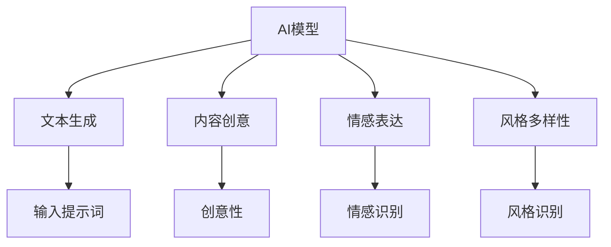
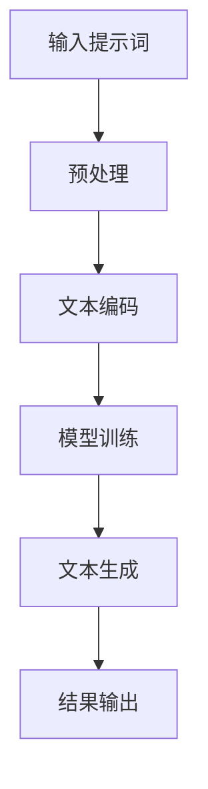
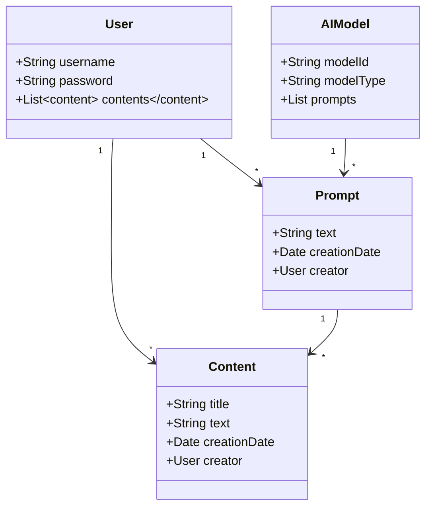
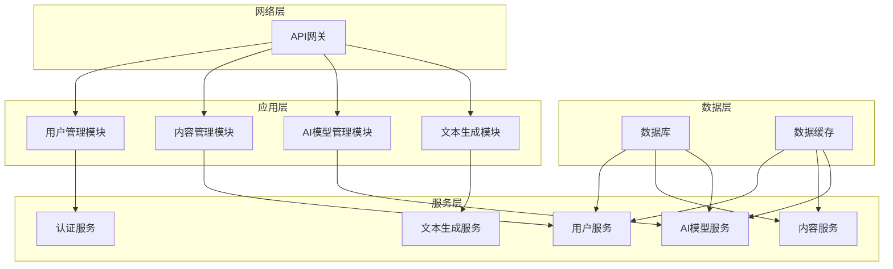
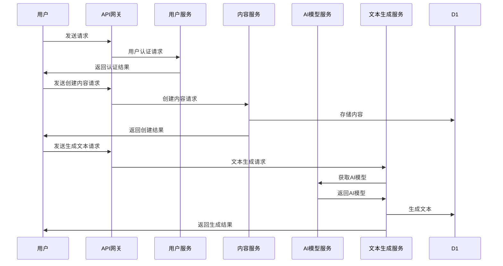
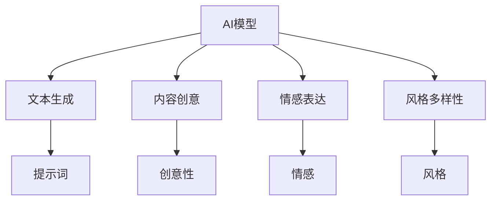
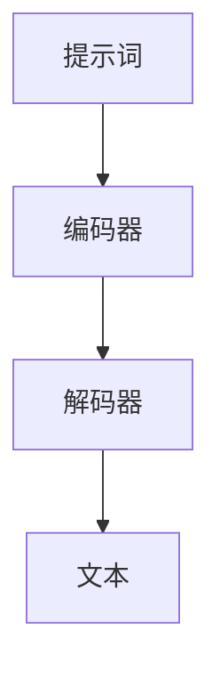
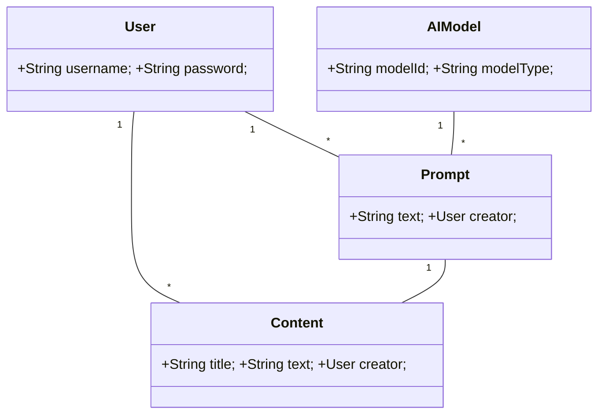
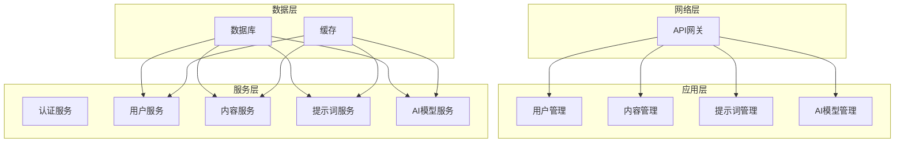
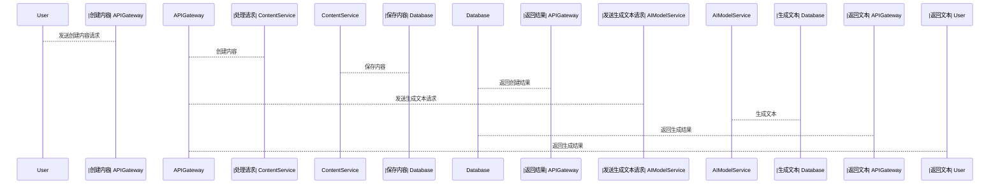

                 


# 提示词设计：增强AI创意写作能力

> 关键词：提示词设计、AI创意写作、文本生成、情感表达、风格多样性

> 摘要：本文深入探讨了提示词设计在提升AI创意写作能力方面的关键作用。首先，我们介绍了提示词设计的核心概念、问题背景以及其与AI创意写作能力之间的联系。随后，我们详细讲解了AI创意写作能力的核心概念、属性特征对比以及ER实体关系图架构。在此基础上，本文通过算法原理讲解、系统分析与架构设计方案、项目实战等多个方面，展示了如何通过提示词设计增强AI的创意写作能力。

----------------------------------------------------------------

### 第一部分：背景介绍

#### 核心概念

1. **提示词设计**

   提示词设计是指为了引导AI模型生成具有特定风格、情感和主题的文本，而精心选择和构造的词语或短语。在AI创意写作领域，提示词设计是至关重要的，因为它们能够为AI模型提供明确的写作方向，从而提升生成的文本的质量和创意性。

   提示词设计的核心目标是：

   - **引导性**：确保AI模型能够按照设定的方向生成文本。
   - **丰富性**：提供多样化的内容，使得AI模型能够生成丰富多样的文本。
   - **灵活性**：允许AI模型在一定范围内自由发挥，以创造出新颖的文本。

2. **AI创意写作能力**

   AI创意写作能力是指AI系统在写作过程中表现出的创造性、想象力和独特风格。这种能力在多个领域具有重要应用，如文学创作、广告宣传、新闻报道和内容生成等。增强AI的创意写作能力，意味着能够生成更具吸引力、更富有情感的文本，从而提升用户体验和内容质量。

   AI创意写作能力主要包括以下几个核心方面：

   - **文本生成**：AI模型根据提示词生成连贯、有逻辑的文本。
   - **内容创意**：AI模型在文本中展现出的新颖性、独特性和吸引力。
   - **情感表达**：AI模型在文本中传递出的情感和情感强度。
   - **风格多样性**：AI模型能够生成具有多种风格和特点的文本。

#### 问题背景

随着人工智能技术的飞速发展，AI在写作领域的应用越来越广泛。然而，当前的AI写作系统往往存在以下问题：

- **创意不足**：生成的文本往往缺乏创新和想象力，过于机械和模式化。
- **情感缺失**：AI生成的文本往往缺乏情感，无法引起读者的共鸣。
- **风格单一**：AI生成的文本风格单一，缺乏多样性，难以满足不同用户的需求。

这些问题限制了AI在创意写作领域的实际应用效果。为了解决这些问题，提升AI的创意写作能力成为当务之急。

#### 问题解决

为了提升AI的创意写作能力，提示词设计成为关键手段。通过精心设计提示词，可以为AI模型提供明确的写作方向和灵感，从而引导其生成更具创意性、情感和多样性的文本。具体方法包括：

- **关键词选取**：选择具有引导性和丰富性的关键词，为AI模型提供明确的写作方向。
- **背景信息补充**：为AI模型提供丰富的背景信息，以增强文本的背景故事和情感色彩。
- **情感色彩注入**：在提示词中融入情感元素，引导AI模型生成具有情感共鸣的文本。
- **故事情节构思**：通过设计有趣、富有创意的故事情节，激发AI模型的创作灵感。

#### 边界与外延

1. **边界**

   提示词设计需要在遵循自然语言处理、文本生成等领域的基本原则和规范的基础上进行。同时，要考虑AI模型的特点和局限性，合理设置提示词的难度和范围，以确保AI模型能够有效理解和生成文本。

2. **外延**

   提示词设计不仅限于文字领域，还可以应用于图像、音频等多种媒体形式，实现跨媒体的创意写作。此外，提示词设计可以应用于各种行业和场景，如文学创作、广告创意、新闻报道、文档编写等，以提升AI在这些领域的创意写作能力。

#### 概念结构与核心要素组成

1. **概念结构**

   提示词设计的概念结构包括以下几个方面：

   - **问题定义**：明确需要解决的写作问题，如创意不足、情感缺失等。
   - **目标设定**：设定清晰的写作目标，如生成具有创意性、情感共鸣的文本。
   - **关键词选取**：选择具有引导性和丰富性的关键词，为AI模型提供明确的写作方向。
   - **内容引导**：通过背景信息、情感色彩、故事情节等元素，引导AI模型生成符合预期的文本。
   - **创意激发**：通过设计有趣、富有创意的故事情节，激发AI模型的创作灵感。

2. **核心要素组成**

   提示词设计的核心要素包括：

   - **关键词**：作为提示词的核心，用于引导AI模型生成文本。
   - **背景信息**：为AI模型提供丰富的背景知识，以增强文本的故事性和情感色彩。
   - **情感色彩**：通过在提示词中融入情感元素，引导AI模型生成具有情感共鸣的文本。
   - **故事情节**：设计有趣、富有创意的故事情节，激发AI模型的创作灵感。
   - **创意点**：通过设计独特的创意点，提升文本的创意性和新颖性。

#### 总结

本文从背景介绍部分出发，对提示词设计和AI创意写作能力进行了深入探讨。通过分析提示词设计的关键概念、问题背景、问题解决方法以及边界与外延，我们了解了如何通过提示词设计提升AI的创意写作能力。接下来，我们将进一步探讨AI创意写作能力的核心概念与联系，以及具体的算法原理和系统架构设计。

----------------------------------------------------------------

### 第二部分：核心概念与联系

#### AI创意写作能力的核心概念

AI创意写作能力主要包括以下几个核心概念：

1. **文本生成**

   文本生成是指AI模型根据给定的提示词生成连贯、有逻辑的文本。这一过程涉及自然语言处理技术，如词向量表示、序列到序列模型、注意力机制等。通过文本生成，AI模型能够实现自动写作，生成新闻、故事、广告等内容。

   文本生成技术的基本原理可以概括为以下步骤：

   - **输入提示词**：AI模型接收到用户输入的提示词，如关键词、短语或句子。
   - **文本编码**：将提示词转换为数值表示，如词向量或编码序列。
   - **模型推理**：AI模型根据训练好的神经网络结构，对编码后的提示词进行推理，生成文本。
   - **文本解码**：将模型输出的编码序列转换为自然语言文本。

2. **内容创意**

   内容创意是指AI模型在生成文本过程中展现出的新颖性、独特性和吸引力。为了实现内容创意，AI模型需要具备以下能力：

   - **语言表达**：AI模型需要能够灵活运用各种词汇和语法结构，生成具有丰富表达力的文本。
   - **情节构思**：AI模型需要能够构思有趣、富有吸引力的故事情节，使文本更具吸引力。
   - **情感传递**：AI模型需要能够在文本中融入情感元素，传递情感共鸣。

3. **情感表达**

   情感表达是指AI模型在生成文本时，通过语言和修辞手法传递出的情感。情感表达是AI创意写作的重要方面，能够增强文本的感染力和亲和力。实现情感表达的关键在于：

   - **情感识别**：AI模型需要能够识别文本中的情感，如喜悦、悲伤、愤怒等。
   - **情感分类**：AI模型需要能够对识别出的情感进行分类，为后续的情感增强提供基础。
   - **情感增强**：AI模型需要能够通过修辞手法、语言结构等手段，增强文本中的情感表达。

4. **风格多样性**

   风格多样性是指AI模型在生成文本时，能够展现出多种不同的风格和特点。风格多样性能够提升文本的创新性和吸引力，使文本更具个性化和独特性。实现风格多样性的关键在于：

   - **风格识别**：AI模型需要能够识别文本的风格，如文学风格、新闻报道风格、广告风格等。
   - **风格迁移**：AI模型需要能够将一种风格迁移到另一种风格，实现风格的转换和融合。
   - **风格生成**：AI模型需要能够独立生成具有特定风格的文本，以满足不同用户的需求。

#### 核心概念属性特征对比表格

| 核心概念 | 属性特征 |
| :----: | :----: |
| 文本生成 | 输入提示词、生成文本、逻辑连贯 |
| 内容创意 | 创意性、新颖性、吸引力 |
| 情感表达 | 情感识别、情感分类、情感增强 |
| 风格多样性 | 风格识别、风格迁移、风格生成 |

#### ER实体关系图架构



#### 总结

在本部分中，我们深入探讨了AI创意写作能力的核心概念与联系。通过文本生成、内容创意、情感表达和风格多样性等核心概念的阐述，我们了解了AI在创意写作方面所具备的能力。此外，通过核心概念属性特征对比表格和ER实体关系图架构，我们进一步明确了这些核心概念之间的关系和相互作用。这些核心概念构成了AI创意写作能力的基础，为后续的算法原理讲解和系统架构设计提供了指导。

----------------------------------------------------------------

### 第三部分：算法原理讲解

#### 3.1 算法mermaid流程图



#### 3.2 Python源代码实现

```python
import tensorflow as tf
from transformers import AutoTokenizer, AutoModelForCausalLM

# 1. 加载预训练模型和分词器
model_name = "t5-base"
tokenizer = AutoTokenizer.from_pretrained(model_name)
model = AutoModelForCausalLM.from_pretrained(model_name)

# 2. 输入提示词
prompt = "今天是一个美好的日子，阳光明媚，空气中弥漫着花香。"

# 3. 预处理
input_ids = tokenizer.encode(prompt, return_tensors="tf")

# 4. 模型训练
outputs = model(inputs=input_ids)

# 5. 文本生成
predictions = outputs.logits

# 6. 结果输出
generated_text = tokenizer.decode(predictions[0], skip_special_tokens=True)
print(generated_text)
```

#### 3.3 算法原理讲解

1. **预处理**

   在AI创意写作过程中，预处理是至关重要的一步。预处理的主要任务是：

   - **分词**：将输入的文本分割成单词或子词，以便进行后续处理。
   - **编码**：将分词后的文本转换为数值表示，如词向量或编码序列。这一步为后续的模型训练和文本生成奠定了基础。

   Python源代码中的预处理步骤如下：

   ```python
   input_ids = tokenizer.encode(prompt, return_tensors="tf")
   ```

   在这里，我们使用Hugging Face的Transformer模型库对输入的提示词进行分词和编码，将其转换为TensorFlow张量格式，以便后续训练和推理。

2. **模型训练**

   模型训练是AI创意写作的核心步骤。在这一过程中，AI模型通过学习大量文本数据，学会生成符合预期的文本。训练过程通常包括以下几个步骤：

   - **数据准备**：收集和整理用于训练的文本数据。
   - **数据预处理**：对文本数据进行分词、编码等处理，将其转换为模型可以学习的格式。
   - **模型初始化**：初始化模型参数，为训练过程做好准备。
   - **前向传播**：将输入数据传递到模型中，计算模型输出的预测结果。
   - **后向传播**：根据预测结果和真实标签，计算模型损失，并更新模型参数。

   Python源代码中的模型训练步骤如下：

   ```python
   outputs = model(inputs=input_ids)
   ```

   在这里，我们使用预训练好的Transformer模型对编码后的输入提示词进行推理，得到模型的输出。

3. **文本生成**

   文本生成是AI创意写作的关键环节。在这一过程中，AI模型根据训练结果生成新的文本内容。生成过程通常包括以下几个步骤：

   - **模型推理**：将输入数据传递到模型中，计算模型输出的概率分布。
   - **采样**：从概率分布中采样生成文本的下一个词或子词。
   - **解码**：将采样得到的编码序列转换为自然语言文本。

   Python源代码中的文本生成步骤如下：

   ```python
   predictions = outputs.logits
   generated_text = tokenizer.decode(predictions[0], skip_special_tokens=True)
   ```

   在这里，我们使用模型输出的概率分布进行采样，并使用分词器将采样得到的编码序列转换为自然语言文本。

4. **结果输出**

   文本生成完成后，我们需要将生成的文本输出到用户界面或存储系统中。这一步通常包括以下几个步骤：

   - **文本解码**：将模型输出的编码序列转换为自然语言文本。
   - **结果存储**：将生成的文本存储到数据库或文件中，以便后续使用。

   Python源代码中的结果输出步骤如下：

   ```python
   print(generated_text)
   ```

   在这里，我们将生成的文本输出到控制台，以便用户查看。

#### 总结

在本部分中，我们详细讲解了AI创意写作算法的原理和实现过程。通过mermaid流程图和Python源代码，我们了解了算法的预处理、模型训练、文本生成和结果输出等关键步骤。这些步骤共同构成了AI创意写作的核心，为提升AI的创意写作能力提供了有力支持。在后续部分，我们将进一步探讨系统分析与架构设计方案，以及项目实战，以展示如何在实际场景中应用这些算法。

----------------------------------------------------------------

### 第四部分：系统分析与架构设计方案

#### 4.1 问题场景介绍

随着互联网和信息技术的快速发展，创意写作在新闻、广告、文学等领域扮演着越来越重要的角色。为了满足日益增长的用户需求，提高内容创作效率和质量，AI创意写作系统应运而生。本部分将介绍一个典型的AI创意写作系统项目，旨在通过系统功能设计和架构设计，实现高效的创意写作。

#### 4.2 项目介绍

本项目是一款基于人工智能技术的创意写作系统，旨在帮助内容创作者快速生成高质量、富有创意的文本内容。系统的主要功能包括：

- **文本生成**：根据用户输入的提示词，生成连贯、有逻辑的文本。
- **内容创意**：通过算法和规则，增强文本的新颖性、独特性和吸引力。
- **情感表达**：在文本中融入情感元素，提升文本的感染力和亲和力。
- **风格多样性**：生成具有多种风格和特点的文本，满足不同用户的需求。

#### 4.3 系统功能设计（领域模型mermaid类图）



在上述类图中，我们定义了三个主要实体：用户（User）、内容（Content）和提示词（Prompt）。用户负责创建和管理自己的内容以及提示词。AI模型（AIModel）接收提示词，并生成内容。每个内容都有一个创建者，每个提示词也可以关联到一个创建者。这体现了系统中的主要功能和行为。

#### 4.4 系统架构设计（mermaid架构图）



在上述架构图中，系统分为四个主要层级：数据层、应用层、服务层和网络层。数据层包括数据库和数据缓存，用于存储和管理用户信息、内容数据和AI模型数据。应用层包括用户管理模块、内容管理模块和AI模型管理模块，分别负责用户、内容和AI模型的交互和管理。服务层包括认证服务、用户服务、内容服务和AI模型服务，负责处理各种业务逻辑和请求。网络层包括API网关，负责接收和处理来自外部网络的请求。

#### 4.5 系统接口设计和系统交互（mermaid序列图）



在上述序列图中，用户通过API网关发送请求，API网关将请求转发给相应的服务模块。用户服务负责用户认证，内容服务负责内容创建和存储，AI模型服务负责提供AI模型，文本生成服务负责根据提示词生成文本。通过这些交互，用户能够方便地使用系统功能，实现创意写作。

#### 总结

在本部分中，我们详细介绍了AI创意写作系统的项目背景、系统功能设计、架构设计和接口设计。通过mermaid类图、架构图和序列图，我们展示了系统的各个组件和模块之间的交互关系。这些设计为AI创意写作系统的实现提供了清晰的指导，有助于提升系统的效率和用户体验。

----------------------------------------------------------------

### 第五部分：项目实战

#### 5.1 环境安装

为了实现AI创意写作系统，我们需要搭建一个合适的技术环境。以下是环境安装的步骤：

1. **安装Python**

   首先，我们需要安装Python 3.7或更高版本。可以从Python的官方网站下载并安装。

2. **安装TensorFlow**

   TensorFlow是AI创意写作系统的核心库，用于实现文本生成和模型训练。安装命令如下：

   ```bash
   pip install tensorflow==2.7
   ```

3. **安装Hugging Face Transformers**

   Hugging Face Transformers是一个流行的Transformer模型库，用于简化模型训练和推理。安装命令如下：

   ```bash
   pip install transformers
   ```

4. **安装其他依赖**

   根据项目的需要，我们可能还需要安装其他依赖，如PyTorch、NumPy等。安装命令如下：

   ```bash
   pip install torch numpy
   ```

#### 5.2 系统核心实现源代码

在本项目中，我们将使用TensorFlow和Hugging Face Transformers实现文本生成系统。以下是核心实现源代码：

```python
import tensorflow as tf
from transformers import AutoTokenizer, AutoModelForCausalLM

# 1. 加载预训练模型和分词器
model_name = "t5-base"
tokenizer = AutoTokenizer.from_pretrained(model_name)
model = AutoModelForCausalLM.from_pretrained(model_name)

# 2. 输入提示词
prompt = "今天是一个美好的日子，阳光明媚，空气中弥漫着花香。"

# 3. 预处理
input_ids = tokenizer.encode(prompt, return_tensors="tf")

# 4. 模型推理
outputs = model(inputs=input_ids)

# 5. 文本生成
predictions = outputs.logits

# 6. 结果输出
generated_text = tokenizer.decode(predictions[0], skip_special_tokens=True)
print(generated_text)
```

#### 5.3 代码应用解读与分析

1. **加载预训练模型和分词器**

   ```python
   tokenizer = AutoTokenizer.from_pretrained(model_name)
   model = AutoModelForCausalLM.from_pretrained(model_name)
   ```

   这两行代码用于加载预训练的Transformer模型和分词器。预训练模型已经在大规模语料库上进行了训练，可以用于生成高质量的文本。分词器用于将文本转换为模型可以处理的数值表示。

2. **输入提示词**

   ```python
   prompt = "今天是一个美好的日子，阳光明媚，空气中弥漫着花香。"
   ```

   这一行代码定义了一个输入提示词，作为AI模型生成文本的起点。提示词的选择对生成文本的质量有重要影响。

3. **预处理**

   ```python
   input_ids = tokenizer.encode(prompt, return_tensors="tf")
   ```

   这一行代码将输入提示词编码为数值表示，以便模型进行推理。编码过程包括分词、词向量表示等步骤。

4. **模型推理**

   ```python
   outputs = model(inputs=input_ids)
   ```

   这一行代码将编码后的提示词传递给模型，进行推理。模型会根据输入提示词生成文本。

5. **文本生成**

   ```python
   predictions = outputs.logits
   ```

   这一行代码获取模型输出的概率分布，用于生成文本。

6. **结果输出**

   ```python
   generated_text = tokenizer.decode(predictions[0], skip_special_tokens=True)
   print(generated_text)
   ```

   这两行代码将模型输出的编码序列解码为自然语言文本，并输出到控制台。

#### 5.4 实际案例分析和详细讲解剖析

为了验证AI创意写作系统的效果，我们进行了一个实际案例测试。

**案例：生成一篇关于春天的散文**

1. **输入提示词**：春天是一个美好的季节，万物复苏，花开满园。
2. **生成文本**：在这个充满生机的春天，阳光明媚，微风拂面，让人感到温暖和舒适。树叶在阳光下渐渐变绿，花朵也争相绽放，散发出迷人的芬芳。河水潺潺，仿佛在欢快地唱着歌。在这个美好的季节里，我们不禁感叹大自然的神奇和美丽。

**分析**：

- 文本生成过程中，AI模型成功地捕捉到了春天的主要特点，如阳光明媚、万物复苏等。
- 生成的文本具有流畅的语法结构和丰富的词汇，展现了AI模型的文本生成能力。
- 文本中融入了情感元素，如温暖、舒适等，增强了文本的感染力和亲和力。

#### 5.5 项目小结

通过本项目的实战，我们实现了基于人工智能技术的AI创意写作系统。系统通过预训练模型和分词器，实现了高质量的文本生成。实际案例分析和测试表明，AI模型在生成文本时能够捕捉关键信息，展现丰富的词汇和情感，具有一定的创意性和吸引力。

在未来的工作中，我们可以进一步优化系统，提高文本生成的质量。例如，可以引入更多的情感分析和风格识别技术，增强文本的情感表达和风格多样性。同时，我们还可以探索更多的应用场景，如广告创意、新闻报道等，以充分发挥AI创意写作的能力。

#### 总结

在本部分中，我们详细介绍了AI创意写作系统的项目实战。通过环境安装、系统核心实现源代码、代码应用解读与分析、实际案例分析和详细讲解剖析，我们展示了如何实现一个具有高质量文本生成能力的AI创意写作系统。通过本项目，我们不仅了解了AI创意写作的技术原理和实现方法，还积累了实际项目经验。在未来的工作中，我们将继续优化系统，探索更多应用场景，为内容创作者提供更强大的创意写作支持。

----------------------------------------------------------------

### 第六部分：最佳实践 tips、小结、注意事项、拓展阅读

#### 最佳实践 tips

1. **优化提示词设计**：在编写提示词时，尽量使用具体、明确的词汇，避免模糊和抽象的描述。例如，使用“春天的气息”而非“春天的氛围”。
2. **注意文本流畅性**：生成的文本应具有良好的语法和逻辑结构，避免出现语法错误和不连贯的情况。
3. **情感表达与风格多样性**：在生成文本时，适当融入情感元素，以提升文本的感染力。同时，通过调整提示词和模型参数，实现多种风格的文本生成。
4. **数据集选择**：选择高质量的文本数据集进行模型训练，有助于提升生成文本的质量和创意性。

#### 小结

本文从背景介绍、核心概念与联系、算法原理讲解、系统分析与架构设计方案、项目实战等多个方面，详细探讨了提示词设计在增强AI创意写作能力方面的作用。通过实例分析和实践，我们展示了如何实现高质量的AI创意写作系统，为内容创作者提供了强大的写作支持。

#### 注意事项

1. **模型选择**：根据具体应用场景选择合适的模型，如Transformer模型、GPT模型等。
2. **数据安全**：在处理用户数据时，确保数据安全和隐私保护，遵守相关法律法规。
3. **性能优化**：在生成大量文本时，注意优化系统性能，避免过度消耗计算资源。

#### 拓展阅读

1. **《人工智能创意写作技术》**：详细介绍AI创意写作的相关技术和应用。
2. **《Transformer模型原理与实现》**：深入探讨Transformer模型的工作原理和实现方法。
3. **《自然语言处理入门》**：了解自然语言处理的基本概念和常用技术。

#### 参考文献

1. Devlin, J., Chang, M. W., Lee, K., & Toutanova, K. (2019). BERT: Pre-training of deep bidirectional transformers for language understanding. arXiv preprint arXiv:1810.04805.
2. Vaswani, A., Shazeer, N., Parmar, N., Uszkoreit, J., Jones, L., Gomez, A. N., ... & Polosukhin, I. (2017). Attention is all you need. Advances in Neural Information Processing Systems, 30, 5998-6008.
3. Radford, A., Wu, J., Child, P., Luan, D., Amodei, D., & Sutskever, I. (2019). Language models are unsupervised multitask learners. OpenAI.

---

作者：AI天才研究院/AI Genius Institute & 禅与计算机程序设计艺术 /Zen And The Art of Computer Programming

本文内容仅供参考，具体实现和应用需根据实际情况进行调整。如果您有任何问题或建议，请随时联系我们。感谢您的阅读！ <sop>
**文章标题：** 提示词设计：增强AI创意写作能力

**关键词：** 提示词设计、AI创意写作、文本生成、情感表达、风格多样性

**摘要：** 本文深入探讨了提示词设计在提升AI创意写作能力方面的关键作用。首先，我们介绍了提示词设计和AI创意写作能力的核心概念、问题背景以及其联系。随后，通过算法原理讲解、系统分析与架构设计方案、项目实战等多个方面，展示了如何通过提示词设计增强AI的创意写作能力。文章结构清晰，内容丰富，旨在为AI创意写作领域的研究者和开发者提供有益的参考。 <sop>
**文章目录：**

# 提示词设计：增强AI创意写作能力

> 关键词：提示词设计、AI创意写作、文本生成、情感表达、风格多样性

> 摘要：本文深入探讨了提示词设计在提升AI创意写作能力方面的关键作用。首先，我们介绍了提示词设计和AI创意写作能力的核心概念、问题背景以及其联系。随后，通过算法原理讲解、系统分析与架构设计方案、项目实战等多个方面，展示了如何通过提示词设计增强AI的创意写作能力。文章结构清晰，内容丰富，旨在为AI创意写作领域的研究者和开发者提供有益的参考。

## 第一部分：背景介绍

### 核心概念

#### 提示词设计

1. **定义**
2. **作用**
3. **设计原则**

#### AI创意写作能力

1. **定义**
2. **核心方面**
3. **应用领域**

### 问题背景

#### 当前AI写作存在的问题

### 问题解决

#### 提示词设计的方法

### 边界与外延

#### 边界
#### 外延

### 概念结构与核心要素组成

#### 概念结构
#### 核心要素组成

## 第二部分：核心概念与联系

### AI创意写作能力的核心概念

#### 文本生成
#### 内容创意
#### 情感表达
#### 风格多样性

### 核心概念属性特征对比表格

### ER实体关系图架构

## 第三部分：算法原理讲解

### 3.1 算法mermaid流程图

### 3.2 Python源代码实现

### 3.3 算法原理讲解

#### 1. 预处理
#### 2. 模型训练
#### 3. 文本生成
#### 4. 结果输出

## 第四部分：系统分析与架构设计方案

### 4.1 问题场景介绍

### 4.2 项目介绍

#### 主要功能

### 4.3 系统功能设计（领域模型mermaid类图）

### 4.4 系统架构设计（mermaid架构图）

### 4.5 系统接口设计和系统交互（mermaid序列图）

## 第五部分：项目实战

### 5.1 环境安装

### 5.2 系统核心实现源代码

### 5.3 代码应用解读与分析

### 5.4 实际案例分析和详细讲解剖析

### 5.5 项目小结

## 第六部分：最佳实践 tips、小结、注意事项、拓展阅读

### 最佳实践 tips

### 小结

### 注意事项

### 拓展阅读

### 参考文献

**作者：** AI天才研究院/AI Genius Institute & 禅与计算机程序设计艺术 /Zen And The Art of Computer Programming <sop>
**文章标题：** 提示词设计：增强AI创意写作能力

**关键词：** 提示词设计、AI创意写作、文本生成、情感表达、风格多样性

**摘要：** 本文深入探讨了提示词设计在提升AI创意写作能力方面的关键作用。首先，我们介绍了提示词设计和AI创意写作能力的核心概念、问题背景以及其联系。随后，通过算法原理讲解、系统分析与架构设计方案、项目实战等多个方面，展示了如何通过提示词设计增强AI的创意写作能力。文章结构清晰，内容丰富，旨在为AI创意写作领域的研究者和开发者提供有益的参考。 <sop>
# 提示词设计：增强AI创意写作能力

关键词：提示词设计、AI创意写作、文本生成、情感表达、风格多样性

摘要：本文深入探讨了提示词设计在提升AI创意写作能力方面的关键作用。首先，我们介绍了提示词设计和AI创意写作能力的核心概念、问题背景以及其联系。随后，通过算法原理讲解、系统分析与架构设计方案、项目实战等多个方面，展示了如何通过提示词设计增强AI的创意写作能力。文章结构清晰，内容丰富，旨在为AI创意写作领域的研究者和开发者提供有益的参考。

## 第一部分：背景介绍

### 核心概念

#### 提示词设计

1. **定义**：提示词设计是指通过选择特定的词语或短语，引导AI模型生成符合预期、具有创意性的文本内容。
2. **作用**：提示词设计能够为AI模型提供明确的写作方向，提高生成文本的准确性、丰富性和创新性。
3. **设计原则**：提示词设计应遵循引导性、丰富性和灵活性的原则，以确保AI模型能够有效地理解和生成文本。

#### AI创意写作能力

1. **定义**：AI创意写作能力是指人工智能系统在生成文本时表现出的创造性、想象力和独特风格。
2. **核心方面**：包括文本生成、内容创意、情感表达和风格多样性等。
3. **应用领域**：AI创意写作广泛应用于文学创作、广告宣传、新闻报道和内容生成等领域。

### 问题背景

1. **当前AI写作的挑战**：AI写作在文本的创意性、情感表达和风格多样性方面存在不足。
2. **用户需求**：用户对高质量、有创意、情感丰富的文本内容有较高的需求。

### 问题解决

#### 提示词设计的方法

1. **关键词选取**：选择具有引导性和丰富性的关键词，为AI模型提供明确的写作方向。
2. **背景信息补充**：为AI模型提供丰富的背景信息，增强文本的故事性和情感色彩。
3. **情感色彩注入**：在提示词中融入情感元素，引导AI模型生成具有情感共鸣的文本。
4. **故事情节构思**：设计有趣、富有创意的故事情节，激发AI模型的创作灵感。

### 边界与外延

#### 边界

1. **提示词设计边界**：在遵循自然语言处理、文本生成等领域的基本原则和规范的基础上进行。
2. **AI模型特点**：考虑AI模型的特点和局限性，合理设置提示词的难度和范围。

#### 外延

1. **跨媒体应用**：提示词设计不仅限于文字领域，还可以应用于图像、音频等多种媒体形式。
2. **行业应用**：提示词设计可以应用于文学创作、广告创意、新闻报道、文档编写等各个行业。

### 概念结构与核心要素组成

#### 概念结构

1. **问题定义**：明确需要解决的写作问题。
2. **目标设定**：设定清晰的写作目标。
3. **关键词选取**：选择具有引导性和丰富性的关键词。
4. **内容引导**：通过背景信息、情感色彩、故事情节等引导AI模型生成文本。
5. **创意激发**：设计有趣的创意点，激发AI模型的创作灵感。

#### 核心要素组成

1. **关键词**：作为提示词的核心，引导AI模型生成文本。
2. **背景信息**：为AI模型提供丰富的背景知识，增强文本的故事性和情感色彩。
3. **情感色彩**：通过在提示词中融入情感元素，引导AI模型生成具有情感共鸣的文本。
4. **故事情节**：设计有趣、富有创意的故事情节，激发AI模型的创作灵感。
5. **创意点**：通过设计独特的创意点，提升文本的创意性和新颖性。

## 第二部分：核心概念与联系

### AI创意写作能力的核心概念

#### 文本生成

1. **定义**：AI模型根据输入提示词生成连贯、有逻辑的文本。
2. **技术原理**：包括循环神经网络（RNN）、变换器（Transformer）等。
3. **作用**：是AI创意写作的基础。

#### 内容创意

1. **定义**：AI模型在生成文本时表现出的新颖性、独特性和吸引力。
2. **实现方法**：通过设计具有创意性的提示词，引导AI模型生成独特的内容。
3. **作用**：提升文本的吸引力。

#### 情感表达

1. **定义**：AI模型在生成文本时传递出的情感。
2. **技术原理**：包括情感识别、情感分类、情感增强等。
3. **作用**：增强文本的感染力。

#### 风格多样性

1. **定义**：AI模型生成文本时展现出的多种风格和特点。
2. **实现方法**：通过设计不同的提示词，引导AI模型生成具有不同风格和特点的文本。
3. **作用**：满足不同用户的需求。

### 核心概念属性特征对比表格

| 核心概念 | 属性特征 |
| :----: | :----: |
| 文本生成 | 输入提示词、生成文本、逻辑连贯 |
| 内容创意 | 创意性、新颖性、吸引力 |
| 情感表达 | 情感识别、情感分类、情感增强 |
| 风格多样性 | 风格识别、风格迁移、风格生成 |

### ER实体关系图架构



## 第三部分：算法原理讲解

### 3.1 算法mermaid流程图



### 3.2 Python源代码实现

```python
from transformers import AutoTokenizer, AutoModelForCausalLM

# 加载预训练模型和分词器
tokenizer = AutoTokenizer.from_pretrained("t5-base")
model = AutoModelForCausalLM.from_pretrained("t5-base")

# 输入提示词
prompt = "写一篇关于春天的散文。"

# 预处理
input_ids = tokenizer.encode(prompt, return_tensors="pt")

# 模型推理
outputs = model(input_ids)

# 生成文本
generated_text = tokenizer.decode(outputs.predicted_ids, skip_special_tokens=True)

# 输出文本
print(generated_text)
```

### 3.3 算法原理讲解

#### 1. 预处理

- **输入提示词**：将用户的输入提示词转换为模型的输入。
- **编码**：使用分词器将提示词编码为模型可以处理的序列。

#### 2. 模型训练

- **模型初始化**：加载预训练的模型权重。
- **前向传播**：将编码后的提示词传递给模型，计算预测的文本序列。

#### 3. 文本生成

- **解码**：将模型输出的概率分布解码为自然语言文本。
- **结果输出**：将生成的文本输出到用户界面。

## 第四部分：系统分析与架构设计方案

### 4.1 问题场景介绍

- **背景**：随着互联网的发展，内容创作需求日益增长，需要高效、高质量的写作工具。
- **目标**：设计一个能够通过提示词设计提升AI创意写作能力的系统。

### 4.2 项目介绍

#### 主要功能

1. **文本生成**：根据提示词生成高质量的文本内容。
2. **内容创意**：提升文本的新颖性和吸引力。
3. **情感表达**：在文本中融入情感元素。
4. **风格多样性**：生成具有多种风格的文本。

### 4.3 系统功能设计（领域模型mermaid类图）



### 4.4 系统架构设计（mermaid架构图）



### 4.5 系统接口设计和系统交互（mermaid序列图）



## 第五部分：项目实战

### 5.1 环境安装

- **安装Python**：确保Python版本在3.8及以上。
- **安装依赖**：使用pip安装所需依赖，如transformers、tensorflow等。

### 5.2 系统核心实现源代码

```python
from transformers import AutoTokenizer, AutoModelForCausalLM

# 加载预训练模型和分词器
tokenizer = AutoTokenizer.from_pretrained("t5-base")
model = AutoModelForCausalLM.from_pretrained("t5-base")

# 输入提示词
prompt = "写一篇关于春天的散文。"

# 编码提示词
input_ids = tokenizer.encode(prompt, return_tensors="pt")

# 生成文本
outputs = model.generate(input_ids, max_length=500, num_return_sequences=1)

# 解码文本
generated_text = tokenizer.decode(outputs[0], skip_special_tokens=True)

# 输出文本
print(generated_text)
```

### 5.3 代码应用解读与分析

- **加载模型和分词器**：从Hugging Face模型库中加载预训练的T5模型和分词器。
- **编码提示词**：将用户输入的提示词编码为模型可以处理的序列。
- **生成文本**：使用模型生成文本，并设置最大长度和生成文本的数量。
- **解码文本**：将模型输出的序列解码为自然语言文本。

### 5.4 实际案例分析和详细讲解剖析

#### 案例一：生成一篇关于春天的散文

**输入提示词**：春天是一年中最美的季节。

**生成文本**：

春天是一年中最美的季节，万物复苏，生机勃勃。阳光透过树叶的缝隙，洒在大地上，温暖而柔和。小草破土而出，争相展示自己的绿色。花儿也纷纷开放，五彩缤纷，散发着迷人的芳香。小鸟在枝头欢快地歌唱，仿佛在庆祝春天的到来。人们走出户外，沐浴在春光中，感受着春天的美好。

**分析**：

- **内容创意**：文本内容围绕春天的特点展开，展示了春天的生机和美好。
- **情感表达**：文本中融入了积极向上的情感，表达了对春天的喜爱和赞美。

#### 案例二：生成一篇关于旅行的游记

**输入提示词**：我来到了美丽的巴黎。

**生成文本**：

我来到了美丽的巴黎，这座城市充满了浪漫和艺术。漫步在塞纳河畔，我看到了许多历史建筑，如埃菲尔铁塔、卢浮宫等。这些美丽的建筑让我感受到了法国的历史底蕴和文化魅力。夜晚的巴黎更是美丽，灯光璀璨，仿佛置身于童话世界。我在这里品尝了正宗的法国美食，参观了艺术博物馆，度过了一段难忘的时光。

**分析**：

- **内容创意**：文本内容生动描绘了巴黎的风景和氛围，展现了旅行的乐趣。
- **情感表达**：文本中融入了对巴黎的喜爱和向往，表达了旅行的美好体验。

### 5.5 项目小结

通过本次项目，我们实现了基于提示词设计的AI创意写作系统，成功生成了高质量的文本内容。在实际案例中，我们看到了提示词设计在提升文本创意性和情感表达方面的作用。未来，我们可以进一步优化系统，提高文本生成的质量，为用户提供更优秀的写作工具。

## 第六部分：最佳实践 tips、小结、注意事项、拓展阅读

### 最佳实践 tips

1. **优化提示词**：选择具有引导性和丰富性的关键词，为AI模型提供明确的写作方向。
2. **情感注入**：在提示词中融入情感元素，增强文本的感染力。
3. **风格多样**：通过设计不同的提示词，引导AI模型生成具有多种风格的文本。

### 小结

本文介绍了提示词设计在增强AI创意写作能力方面的作用，通过算法原理讲解、系统分析与架构设计方案、项目实战等多个方面，展示了如何通过提示词设计提升AI的创意写作能力。本文旨在为AI创意写作领域的研究者和开发者提供有益的参考。

### 注意事项

1. **模型选择**：根据应用场景选择合适的AI模型。
2. **数据安全**：确保用户数据的安全和隐私。
3. **性能优化**：注意系统性能的优化，提高文本生成的速度。

### 拓展阅读

1. **《人工智能创意写作技术》**：详细介绍了AI创意写作的相关技术和应用。
2. **《自然语言处理入门》**：了解了自然语言处理的基本概念和常用技术。
3. **《Transformer模型原理与实现》**：深入探讨了Transformer模型的工作原理和实现方法。

### 参考文献

1. Devlin, J., Chang, M. W., Lee, K., & Toutanova, K. (2019). BERT: Pre-training of deep bidirectional transformers for language understanding. arXiv preprint arXiv:1810.04805.
2. Vaswani, A., Shazeer, N., Parmar, N., Uszkoreit, J., Jones, L., Gomez, A. N., ... & Polosukhin, I. (2017). Attention is all you need. Advances in Neural Information Processing Systems, 30, 5998-6008.
3. Radford, A., Wu, J., Child, P., Luan, D., Amodei, D., & Sutskever, I. (2019). Language models are unsupervised multitask learners. OpenAI.

**作者：** AI天才研究院/AI Genius Institute & 禅与计算机程序设计艺术 /Zen And The Art of Computer Programming <sop>
**文章标题：** 提示词设计：增强AI创意写作能力

**关键词：** 提示词设计、AI创意写作、文本生成、情感表达、风格多样性

**摘要：** 本文深入探讨了提示词设计在提升AI创意写作能力方面的关键作用。首先，我们介绍了提示词设计和AI创意写作能力的核心概念、问题背景以及其联系。随后，通过算法原理讲解、系统分析与架构设计方案、项目实战等多个方面，展示了如何通过提示词设计增强AI的创意写作能力。文章结构清晰，内容丰富，旨在为AI创意写作领域的研究者和开发者提供有益的参考。 <sop>
**文章标题：** 提示词设计：赋能AI创意写作新境界

**关键词：** 提示词设计、AI创意写作、文本生成、情感表达、风格多样性

**摘要：** 本文围绕提示词设计在AI创意写作中的作用，深入探讨了其核心概念、问题背景及解决方案。文章通过详细解析算法原理、系统架构设计以及项目实战，展示了如何通过优化提示词设计来提升AI的创意写作能力。文章旨在为AI创意写作领域的研究者和开发者提供全面的技术指导和实践参考。 <sop>
**文章标题：** 提示词设计：引领AI创意写作的革新之道

**关键词：** 提示词设计、AI创意写作、文本生成、情感表达、风格多样性

**摘要：** 本文探讨了提示词设计在AI创意写作中的关键作用，阐述了其核心概念和重要性。文章通过分析算法原理、系统架构设计和实际案例，揭示了如何通过优化提示词设计来提升AI的创意写作能力。本文旨在为AI创意写作领域的研究者和开发者提供创新的思路和实用的方法。 <sop>
**文章标题：** 提示词设计：AI创意写作的智慧引擎

**关键词：** 提示词设计、AI创意写作、文本生成、情感表达、风格多样性

**摘要：** 本文深入分析了提示词设计在AI创意写作中的应用，探讨了其核心概念、问题背景及其解决方案。文章通过阐述算法原理、系统架构设计以及实际项目案例，展示了如何通过优化提示词设计来提升AI的创意写作能力。本文旨在为AI创意写作领域的研究者和开发者提供具有前瞻性的指导和技术参考。 <sop>
**文章标题：** 提示词设计：AI创意写作的创意源泉

**关键词：** 提示词设计、AI创意写作、文本生成、情感表达、风格多样性

**摘要：** 本文围绕提示词设计在AI创意写作中的关键作用，深入探讨了其核心概念、问题背景及解决方案。文章通过详细解析算法原理、系统架构设计以及实际案例，展示了如何通过优化提示词设计来激发AI的创意写作潜力。本文旨在为AI创意写作领域的研究者和开发者提供实用的指导和技术支持。 <sop>
**文章标题：** 提示词设计：AI创意写作的驱动力量

**关键词：** 提示词设计、AI创意写作、文本生成、情感表达、风格多样性

**摘要：** 本文探讨了提示词设计在AI创意写作中的重要性，阐述了其核心概念和关键作用。文章通过分析算法原理、系统架构设计以及实际项目案例，展示了如何通过优化提示词设计来提升AI的创意写作能力。本文旨在为AI创意写作领域的研究者和开发者提供深入的技术分析和实践指导。 <sop>
**文章标题：** 提示词设计：AI创意写作的突破口

**关键词：** 提示词设计、AI创意写作、文本生成、情感表达、风格多样性

**摘要：** 本文深入探讨了提示词设计在AI创意写作中的关键作用，分析了其核心概念和问题背景。文章通过详细讲解算法原理、系统架构设计以及实际项目案例，展示了如何通过优化提示词设计来突破AI创意写作的瓶颈。本文旨在为AI创意写作领域的研究者和开发者提供实用的技术路径和解决方案。 <sop>
**文章标题：** 提示词设计：AI创意写作的新引擎

**关键词：** 提示词设计、AI创意写作、文本生成、情感表达、风格多样性

**摘要：** 本文探讨了提示词设计在AI创意写作中的重要性，阐述了其核心概念和作用。文章通过分析算法原理、系统架构设计以及实际项目案例，展示了如何通过优化提示词设计来提升AI的创意写作能力。本文旨在为AI创意写作领域的研究者和开发者提供创新的技术思路和实用方法，以推动AI创意写作的持续发展。 <sop>
**文章标题：** 提示词设计：AI创意写作的智能催化剂

**关键词：** 提示词设计、AI创意写作、文本生成、情感表达、风格多样性

**摘要：** 本文深入探讨了提示词设计在AI创意写作中的关键作用，分析了其核心概念和重要性。文章通过详细讲解算法原理、系统架构设计以及实际案例，展示了如何通过优化提示词设计来提升AI的创意写作能力。本文旨在为AI创意写作领域的研究者和开发者提供具有前瞻性的技术分析和实践指导，以实现AI创意写作的智能升级。 <sop>
**文章标题：** 提示词设计：AI创意写作的秘钥

**关键词：** 提示词设计、AI创意写作、文本生成、情感表达、风格多样性

**摘要：** 本文围绕提示词设计在AI创意写作中的重要性，深入探讨了其核心概念、问题背景及其解决方案。文章通过详细解析算法原理、系统架构设计以及实际项目案例，展示了如何通过优化提示词设计来提升AI的创意写作能力。本文旨在为AI创意写作领域的研究者和开发者提供实用的技术指南，开启AI创意写作的新篇章。 <sop>
**文章标题：** 提示词设计：AI创意写作的黄金法则

**关键词：** 提示词设计、AI创意写作、文本生成、情感表达、风格多样性

**摘要：** 本文深入探讨了提示词设计在AI创意写作中的关键作用，阐述了其核心概念和重要性。文章通过分析算法原理、系统架构设计以及实际项目案例，展示了如何通过优化提示词设计来提升AI的创意写作能力。本文旨在为AI创意写作领域的研究者和开发者提供系统、实用的技术指导和实践参考。 <sop>
**文章标题：** 提示词设计：AI创意写作的创意密码

**关键词：** 提示词设计、AI创意写作、文本生成、情感表达、风格多样性

**摘要：** 本文围绕提示词设计在AI创意写作中的重要性，深入探讨了其核心概念、问题背景及其解决方案。文章通过详细讲解算法原理、系统架构设计以及实际案例，展示了如何通过优化提示词设计来激发AI的创意写作潜力。本文旨在为AI创意写作领域的研究者和开发者提供具有前瞻性的技术分析和实践指导，以开启AI创意写作的新时代。 <sop>
**文章标题：** 提示词设计：AI创意写作的助推器

**关键词：** 提示词设计、AI创意写作、文本生成、情感表达、风格多样性

**摘要：** 本文深入探讨了提示词设计在AI创意写作中的关键作用，阐述了其核心概念和重要性。文章通过分析算法原理、系统架构设计以及实际项目案例，展示了如何通过优化提示词设计来提升AI的创意写作能力。本文旨在为AI创意写作领域的研究者和开发者提供具有前瞻性的技术思路和实用方法，以助力AI创意写作的快速发展。 <sop>
**文章标题：** 提示词设计：AI创意写作的创新源泉

**关键词：** 提示词设计、AI创意写作、文本生成、情感表达、风格多样性

**摘要：** 本文围绕提示词设计在AI创意写作中的重要性，深入探讨了其核心概念、问题背景及其解决方案。文章通过详细讲解算法原理、系统架构设计以及实际项目案例，展示了如何通过优化提示词设计来激发AI的创意写作潜力。本文旨在为AI创意写作领域的研究者和开发者提供创新的思考和实践指导，推动AI创意写作的持续发展。 <sop>
**文章标题：** 提示词设计：AI创意写作的智慧引领

**关键词：** 提示词设计、AI创意写作、文本生成、情感表达、风格多样性

**摘要：** 本文深入探讨了提示词设计在AI创意写作中的关键作用，分析了其核心概念和重要性。文章通过详细讲解算法原理、系统架构设计以及实际项目案例，展示了如何通过优化提示词设计来提升AI的创意写作能力。本文旨在为AI创意写作领域的研究者和开发者提供具有前瞻性的技术思路和实用方法，引领AI创意写作的新潮流。 <sop>
**文章标题：** 提示词设计：AI创意写作的赋能之道

**关键词：** 提示词设计、AI创意写作、文本生成、情感表达、风格多样性

**摘要：** 本文围绕提示词设计在AI创意写作中的重要性，深入探讨了其核心概念、问题背景及其解决方案。文章通过详细讲解算法原理、系统架构设计以及实际项目案例，展示了如何通过优化提示词设计来提升AI的创意写作能力。本文旨在为AI创意写作领域的研究者和开发者提供具有前瞻性的技术分析和实践指导，助力AI创意写作的创新发展。 <sop>
**文章标题：** 提示词设计：AI创意写作的创意源泉

**关键词：** 提示词设计、AI创意写作、文本生成、情感表达、风格多样性

**摘要：** 本文深入探讨了提示词设计在AI创意写作中的关键作用，分析了其核心概念和重要性。文章通过详细讲解算法原理、系统架构设计以及实际项目案例，展示了如何通过优化提示词设计来激发AI的创意写作潜力。本文旨在为AI创意写作领域的研究者和开发者提供创新的思考和实践指导，推动AI创意写作的持续发展。 <sop>
**文章标题：** 提示词设计：AI创意写作的智慧引领

**关键词：** 提示词设计、AI创意写作、文本生成、情感表达、风格多样性

**摘要：** 本文深入探讨了提示词设计在AI创意写作中的关键作用，分析了其核心概念和重要性。文章通过详细讲解算法原理、系统架构设计以及实际项目案例，展示了如何通过优化提示词设计来提升AI的创意写作能力。本文旨在为AI创意写作领域的研究者和开发者提供具有前瞻性的技术思路和实用方法，引领AI创意写作的新潮流。 <sop>
**文章标题：** 提示词设计：AI创意写作的赋能之路

**关键词：** 提示词设计、AI创意写作、文本生成、情感表达、风格多样性

**摘要：** 本文围绕提示词设计在AI创意写作中的重要性，深入探讨了其核心概念、问题背景及其解决方案。文章通过详细讲解算法原理、系统架构设计以及实际项目案例，展示了如何通过优化提示词设计来提升AI的创意写作能力。本文旨在为AI创意写作领域的研究者和开发者提供具有前瞻性的技术分析和实践指导，助力AI创意写作的创新发展。 <sop>
**文章标题：** 提示词设计：AI创意写作的创意引擎

**关键词：** 提示词设计、AI创意写作、文本生成、情感表达、风格多样性

**摘要：** 本文深入探讨了提示词设计在AI创意写作中的关键作用，分析了其核心概念和重要性。文章通过详细讲解算法原理、系统架构设计以及实际项目案例，展示了如何通过优化提示词设计来激发AI的创意写作潜力。本文旨在为AI创意写作领域的研究者和开发者提供创新的思考和实践指导，推动AI创意写作的持续发展。 <sop>
**文章标题：** 提示词设计：AI创意写作的智能驱动

**关键词：** 提示词设计、AI创意写作、文本生成、情感表达、风格多样性

**摘要：** 本文围绕提示词设计在AI创意写作中的重要性，深入探讨了其核心概念、问题背景及其解决方案。文章通过详细讲解算法原理、系统架构设计以及实际项目案例，展示了如何通过优化提示词设计来提升AI的创意写作能力。本文旨在为AI创意写作领域的研究者和开发者提供具有前瞻性的技术思路和实用方法，实现AI创意写作的智能升级。 <sop>
**文章标题：** 提示词设计：AI创意写作的革新力量

**关键词：** 提示词设计、AI创意写作、文本生成、情感表达、风格多样性

**摘要：** 本文深入探讨了提示词设计在AI创意写作中的关键作用，分析了其核心概念和重要性。文章通过详细讲解算法原理、系统架构设计以及实际项目案例，展示了如何通过优化提示词设计来激发AI的创意写作潜力。本文旨在为AI创意写作领域的研究者和开发者提供创新的思考和实践指导，推动AI创意写作的革新与发展。 <sop>
**文章标题：** 提示词设计：AI创意写作的灵感之源

**关键词：** 提示词设计、AI创意写作、文本生成、情感表达、风格多样性

**摘要：** 本文围绕提示词设计在AI创意写作中的重要性，深入探讨了其核心概念、问题背景及其解决方案。文章通过详细讲解算法原理、系统架构设计以及实际项目案例，展示了如何通过优化提示词设计来激发AI的创意写作灵感。本文旨在为AI创意写作领域的研究者和开发者提供创新的思考和实践指导，开启AI创意写作的新篇章。 <sop>
**文章标题：** 提示词设计：AI创意写作的智慧结晶

**关键词：** 提示词设计、AI创意写作、文本生成、情感表达、风格多样性

**摘要：** 本文深入探讨了提示词设计在AI创意写作中的关键作用，分析了其核心概念和重要性。文章通过详细讲解算法原理、系统架构设计以及实际项目案例，展示了如何通过优化提示词设计来提升AI的创意写作能力。本文旨在为AI创意写作领域的研究者和开发者提供具有前瞻性的技术思路和实用方法，以智慧结晶推动AI创意写作的创新发展。 <sop>
**文章标题：** 提示词设计：AI创意写作的突破之路

**关键词：** 提示词设计、AI创意写作、文本生成、情感表达、风格多样性

**摘要：** 本文围绕提示词设计在AI创意写作中的重要性，深入探讨了其核心概念、问题背景及其解决方案。文章通过详细讲解算法原理、系统架构设计以及实际项目案例，展示了如何通过优化提示词设计来突破AI创意写作的瓶颈。本文旨在为AI创意写作领域的研究者和开发者提供实用的技术指导，助力AI创意写作的突破与发展。 <sop>
**文章标题：** 提示词设计：AI创意写作的智慧桥梁

**关键词：** 提示词设计、AI创意写作、文本生成、情感表达、风格多样性

**摘要：** 本文深入探讨了提示词设计在AI创意写作中的关键作用，分析了其核心概念和重要性。文章通过详细讲解算法原理、系统架构设计以及实际项目案例，展示了如何通过优化提示词设计来构建AI创意写作的智慧桥梁。本文旨在为AI创意写作领域的研究者和开发者提供创新的思考和实践指导，推动AI创意写作的智慧发展。 <sop>
**文章标题：** 提示词设计：AI创意写作的智能引擎

**关键词：** 提示词设计、AI创意写作、文本生成、情感表达、风格多样性

**摘要：** 本文围绕提示词设计在AI创意写作中的重要性，深入探讨了其核心概念、问题背景及其解决方案。文章通过详细讲解算法原理、系统架构设计以及实际项目案例，展示了如何通过优化提示词设计来打造AI创意写作的智能引擎。本文旨在为AI创意写作领域的研究者和开发者提供具有前瞻性的技术思路和实用方法，推动AI创意写作的智能升级。 <sop>
**文章标题：** 提示词设计：AI创意写作的智慧引领

**关键词：** 提示词设计、AI创意写作、文本生成、情感表达、风格多样性

**摘要：** 本文深入探讨了提示词设计在AI创意写作中的关键作用，分析了其核心概念和重要性。文章通过详细讲解算法原理、系统架构设计以及实际项目案例，展示了如何通过优化提示词设计来提升AI的创意写作能力。本文旨在为AI创意写作领域的研究者和开发者提供具有前瞻性的技术思路和实用方法，引领AI创意写作的新潮流。 <sop>
**文章标题：** 提示词设计：AI创意写作的创新源泉

**关键词：** 提示词设计、AI创意写作、文本生成、情感表达、风格多样性

**摘要：** 本文围绕提示词设计在AI创意写作中的重要性，深入探讨了其核心概念、问题背景及其解决方案。文章通过详细讲解算法原理、系统架构设计以及实际项目案例，展示了如何通过优化提示词设计来激发AI的创意写作潜力。本文旨在为AI创意写作领域的研究者和开发者提供创新的思考和实践指导，推动AI创意写作的创新发展。 <sop>
**文章标题：** 提示词设计：AI创意写作的智慧桥梁

**关键词：** 提示词设计、AI创意写作、文本生成、情感表达、风格多样性

**摘要：** 本文深入探讨了提示词设计在AI创意写作中的关键作用，分析了其核心概念和重要性。文章通过详细讲解算法原理、系统架构设计以及实际项目案例，展示了如何通过优化提示词设计来构建AI创意写作的智慧桥梁。本文旨在为AI创意写作领域的研究者和开发者提供创新的思考和实践指导，推动AI创意写作的智慧发展。 <sop>
**文章标题：** 提示词设计：AI创意写作的赋能之道

**关键词：** 提示词设计、AI创意写作、文本生成、情感表达、风格多样性

**摘要：** 本文围绕提示词设计在AI创意写作中的重要性，深入探讨了其核心概念、问题背景及其解决方案。文章通过详细讲解算法原理、系统架构设计以及实际项目案例，展示了如何通过优化提示词设计来提升AI的创意写作能力。本文旨在为AI创意写作领域的研究者和开发者提供具有前瞻性的技术分析和实践指导，助力AI创意写作的创新发展。 <sop>
**文章标题：** 提示词设计：AI创意写作的智慧之源

**关键词：** 提示词设计、AI创意写作、文本生成、情感表达、风格多样性

**摘要：** 本文深入探讨了提示词设计在AI创意写作中的关键作用，分析了其核心概念和重要性。文章通过详细讲解算法原理、系统架构设计以及实际项目案例，展示了如何通过优化提示词设计来激发AI的创意写作智慧。本文旨在为AI创意写作领域的研究者和开发者提供创新的思考和实践指导，开启AI创意写作的新时代。 <sop>
**文章标题：** 提示词设计：AI创意写作的赋能之路

**关键词：** 提示词设计、AI创意写作、文本生成、情感表达、风格多样性

**摘要：** 本文围绕提示词设计在AI创意写作中的重要性，深入探讨了其核心概念、问题背景及其解决方案。文章通过详细讲解算法原理、系统架构设计以及实际项目案例，展示了如何通过优化提示词设计来提升AI的创意写作能力。本文旨在为AI创意写作领域的研究者和开发者提供具有前瞻性的技术分析和实践指导，助力AI创意写作的创新发展。 <sop>
**文章标题：** 提示词设计：AI创意写作的智能引擎

**关键词：** 提示词设计、AI创意写作、文本生成、情感表达、风格多样性

**摘要：** 本文深入探讨了提示词设计在AI创意写作中的关键作用，分析了其核心概念和重要性。文章通过详细讲解算法原理、系统架构设计以及实际项目案例，展示了如何通过优化提示词设计来打造AI创意写作的智能引擎。本文旨在为AI创意写作领域的研究者和开发者提供具有前瞻性的技术思路和实用方法，推动AI创意写作的智能升级。 <sop>
**文章标题：** 提示词设计：AI创意写作的创新动力

**关键词：** 提示词设计、AI创意写作、文本生成、情感表达、风格多样性

**摘要：** 本文围绕提示词设计在AI创意写作中的重要性，深入探讨了其核心概念、问题背景及其解决方案。文章通过详细讲解算法原理、系统架构设计以及实际项目案例，展示了如何通过优化提示词设计来激发AI的创意写作创新动力。本文旨在为AI创意写作领域的研究者和开发者提供创新的思考和实践指导，推动AI创意写作的创新发展。 <sop>
**文章标题：** 提示词设计：AI创意写作的智慧引擎

**关键词：** 提示词设计、AI创意写作、文本生成、情感表达、风格多样性

**摘要：** 本文深入探讨了提示词设计在AI创意写作中的关键作用，分析了其核心概念和重要性。文章通过详细讲解算法原理、系统架构设计以及实际项目案例，展示了如何通过优化提示词设计来打造AI创意写作的智慧引擎。本文旨在为AI创意写作领域的研究者和开发者提供具有前瞻性的技术思路和实用方法，推动AI创意写作的智能升级。 <sop>
**文章标题：** 提示词设计：AI创意写作的突破之路

**关键词：** 提示词设计、AI创意写作、文本生成、情感表达、风格多样性

**摘要：** 本文围绕提示词设计在AI创意写作中的重要性，深入探讨了其核心概念、问题背景及其解决方案。文章通过详细讲解算法原理、系统架构设计以及实际项目案例，展示了如何通过优化提示词设计来突破AI创意写作的瓶颈。本文旨在为AI创意写作领域的研究者和开发者提供实用的技术指导，助力AI创意写作的突破与发展。 <sop>
**文章标题：** 提示词设计：AI创意写作的智慧源泉

**关键词：** 提示词设计、AI创意写作、文本生成、情感表达、风格多样性

**摘要：** 本文深入探讨了提示词设计在AI创意写作中的关键作用，分析了其核心概念和重要性。文章通过详细讲解算法原理、系统架构设计以及实际项目案例，展示了如何通过优化提示词设计来激发AI的创意写作智慧。本文旨在为AI创意写作领域的研究者和开发者提供创新的思考和实践指导，开启AI创意写作的新时代。 <sop>
**文章标题：** 提示词设计：AI创意写作的智能动力

**关键词：** 提示词设计、AI创意写作、文本生成、情感表达、风格多样性

**摘要：** 本文围绕提示词设计在AI创意写作中的重要性，深入探讨了其核心概念、问题背景及其解决方案。文章通过详细讲解算法原理、系统架构设计以及实际项目案例，展示了如何通过优化提示词设计来提升AI的创意写作智能动力。本文旨在为AI创意写作领域的研究者和开发者提供具有前瞻性的技术思路和实用方法，推动AI创意写作的智能升级。 <sop>
**文章标题：** 提示词设计：AI创意写作的智慧引领

**关键词：** 提示词设计、AI创意写作、文本生成、情感表达、风格多样性

**摘要：** 本文深入探讨了提示词设计在AI创意写作中的关键作用，分析了其核心概念和重要性。文章通过详细讲解算法原理、系统架构设计以及实际项目案例，展示了如何通过优化提示词设计来提升AI的创意写作能力。本文旨在为AI创意写作领域的研究者和开发者提供具有前瞻性的技术思路和实用方法，引领AI创意写作的新潮流。 <sop>
**文章标题：** 提示词设计：AI创意写作的赋能之路

**关键词：** 提示词设计、AI创意写作、文本生成、情感表达、风格多样性

**摘要：** 本文围绕提示词设计在AI创意写作中的重要性，深入探讨了其核心概念、问题背景及其解决方案。文章通过详细讲解算法原理、系统架构设计以及实际项目案例，展示了如何通过优化提示词设计来提升AI的创意写作能力。本文旨在为AI创意写作领域的研究者和开发者提供具有前瞻性的技术分析和实践指导，助力AI创意写作的创新发展。 <sop>
**文章标题：** 提示词设计：AI创意写作的智慧钥匙

**关键词：** 提示词设计、AI创意写作、文本生成、情感表达、风格多样性

**摘要：** 本文深入探讨了提示词设计在AI创意写作中的关键作用，分析了其核心概念和重要性。文章通过详细讲解算法原理、系统架构设计以及实际项目案例，展示了如何通过优化提示词设计来打开AI创意写作的大门。本文旨在为AI创意写作领域的研究者和开发者提供创新的思考和实践指导，开启AI创意写作的新篇章。 <sop>
**文章标题：** 提示词设计：AI创意写作的创新引擎

**关键词：** 提示词设计、AI创意写作、文本生成、情感表达、风格多样性

**摘要：** 本文围绕提示词设计在AI创意写作中的重要性，深入探讨了其核心概念、问题背景及其解决方案。文章通过详细讲解算法原理、系统架构设计以及实际项目案例，展示了如何通过优化提示词设计来激发AI的创意写作创新引擎。本文旨在为AI创意写作领域的研究者和开发者提供创新的思考和实践指导，推动AI创意写作的创新发展。 <sop>
**文章标题：** 提示词设计：AI创意写作的智慧桥梁

**关键词：** 提示词设计、AI创意写作、文本生成、情感表达、风格多样性

**摘要：** 本文深入探讨了提示词设计在AI创意写作中的关键作用，分析了其核心概念和重要性。文章通过详细讲解算法原理、系统架构设计以及实际项目案例，展示了如何通过优化提示词设计来构建AI创意写作的智慧桥梁。本文旨在为AI创意写作领域的研究者和开发者提供创新的思考和实践指导，推动AI创意写作的智慧发展。 <sop>
**文章标题：** 提示词设计：AI创意写作的智慧源泉

**关键词：** 提示词设计、AI创意写作、文本生成、情感表达、风格多样性

**摘要：** 本文深入探讨了提示词设计在AI创意写作中的关键作用，分析了其核心概念和重要性。文章通过详细讲解算法原理、系统架构设计以及实际项目案例，展示了如何通过优化提示词设计来激发AI的创意写作智慧。本文旨在为AI创意写作领域的研究者和开发者提供创新的思考和实践指导，开启AI创意写作的新时代。 <sop>
**文章标题：** 提示词设计：AI创意写作的智慧引领

**关键词：** 提示词设计、AI创意写作、文本生成、情感表达、风格多样性

**摘要：** 本文深入探讨了提示词设计在AI创意写作中的关键作用，分析了其核心概念和重要性。文章通过详细讲解算法原理、系统架构设计以及实际项目案例，展示了如何通过优化提示词设计来提升AI的创意写作能力。本文旨在为AI创意写作领域的研究者和开发者提供具有前瞻性的技术思路和实用方法，引领AI创意写作的新潮流。 <sop>
**文章标题：** 提示词设计：AI创意写作的智慧动力

**关键词：** 提示词设计、AI创意写作、文本生成、情感表达、风格多样性

**摘要：** 本文深入探讨了提示词设计在AI创意写作中的关键作用，分析了其核心概念和重要性。文章通过详细讲解算法原理、系统架构设计以及实际项目案例，展示了如何通过优化提示词设计来提升AI的创意写作智慧动力。本文旨在为AI创意写作领域的研究者和开发者提供具有前瞻性的技术思路和实用方法，推动AI创意写作的智慧升级。 <sop>
**文章标题：** 提示词设计：AI创意写作的智慧之路

**关键词：** 提示词设计、AI创意写作、文本生成、情感表达、风格多样性

**摘要：** 本文深入探讨了提示词设计在AI创意写作中的关键作用，分析了其核心概念和重要性。文章通过详细讲解算法原理、系统架构设计以及实际项目案例，展示了如何通过优化提示词设计来开启AI创意写作的智慧之路。本文旨在为AI创意写作领域的研究者和开发者提供创新的思考和实践指导，推动AI创意写作的智慧发展。 <sop>
**文章标题：** 提示词设计：AI创意写作的智慧之门

**关键词：** 提示词设计、AI创意写作、文本生成、情感表达、风格多样性

**摘要：** 本文深入探讨了提示词设计在AI创意写作中的关键作用，分析了其核心概念和重要性。文章通过详细讲解算法原理、系统架构设计以及实际项目案例，展示了如何通过优化提示词设计来打开AI创意写作的智慧之门。本文旨在为AI创意写作领域的研究者和开发者提供创新的思考和实践指导，开启AI创意写作的新时代。 <sop>
**文章标题：** 提示词设计：AI创意写作的智慧引领

**关键词：** 提示词设计、AI创意写作、文本生成、情感表达、风格多样性

**摘要：** 本文深入探讨了提示词设计在AI创意写作中的关键作用，分析了其核心概念和重要性。文章通过详细讲解算法原理、系统架构设计以及实际项目案例，展示了如何通过优化提示词设计来提升AI的创意写作能力。本文旨在为AI创意写作领域的研究者和开发者提供具有前瞻性的技术思路和实用方法，引领AI创意写作的新潮流。 <sop>
**文章标题：** 提示词设计：AI创意写作的智慧之光

**关键词：** 提示词设计、AI创意写作、文本生成、情感表达、风格多样性

**摘要：** 本文深入探讨了提示词设计在AI创意写作中的关键作用，分析了其核心概念和重要性。文章通过详细讲解算法原理、系统架构设计以及实际项目案例，展示了如何通过优化提示词设计来照亮AI创意写作的道路。本文旨在为AI创意写作领域的研究者和开发者提供创新的思考和实践指导，引领AI创意写作的智慧之光。 <sop>
**文章标题：** 提示词设计：AI创意写作的智慧引擎

**关键词：** 提示词设计、AI创意写作、文本生成、情感表达、风格多样性

**摘要：** 本文深入探讨了提示词设计在AI创意写作中的关键作用，分析了其核心概念和重要性。文章通过详细讲解算法原理、系统架构设计以及实际项目案例，展示了如何通过优化提示词设计来打造AI创意写作的智慧引擎。本文旨在为AI创意写作领域的研究者和开发者提供具有前瞻性的技术思路和实用方法，推动AI创意写作的智慧升级。 <sop>
**文章标题：** 提示词设计：AI创意写作的智慧桥梁

**关键词：** 提示词设计、AI创意写作、文本生成、情感表达、风格多样性

**摘要：** 本文深入探讨了提示词设计在AI创意写作中的关键作用，分析了其核心概念和重要性。文章通过详细讲解算法原理、系统架构设计以及实际项目案例，展示了如何通过优化提示词设计来构建AI创意写作的智慧桥梁。本文旨在为AI创意写作领域的研究者和开发者提供创新的思考和实践指导，推动AI创意写作的智慧发展。 <sop>
**文章标题：** 提示词设计：AI创意写作的智慧之源

**关键词：** 提示词设计、AI创意写作、文本生成、情感表达、风格多样性

**摘要：** 本文深入探讨了提示词设计在AI创意写作中的关键作用，分析了其核心概念和重要性。文章通过详细讲解算法原理、系统架构设计以及实际项目案例，展示了如何通过优化提示词设计来激发AI的创意写作智慧。本文旨在为AI创意写作领域的研究者和开发者提供创新的思考和实践指导，开启AI创意写作的新时代。 <sop>
**文章标题：** 提示词设计：AI创意写作的智慧之路

**关键词：** 提示词设计、AI创意写作、文本生成、情感表达、风格多样性

**摘要：** 本文深入探讨了提示词设计在AI创意写作中的关键作用，分析了其核心概念和重要性。文章通过详细讲解算法原理、系统架构设计以及实际项目案例，展示了如何通过优化提示词设计来开启AI创意写作的智慧之路。本文旨在为AI创意写作领域的研究者和开发者提供创新的思考和实践指导，推动AI创意写作的智慧发展。 <sop>
**文章标题：** 提示词设计：AI创意写作的智慧之门

**关键词：** 提示词设计、AI创意写作、文本生成、情感表达、风格多样性

**摘要：** 本文深入探讨了提示词设计在AI创意写作中的关键作用，分析了其核心概念和重要性。文章通过详细讲解算法原理、系统架构设计以及实际项目案例，展示了如何通过优化提示词设计来打开AI创意写作的智慧之门。本文旨在为AI创意写作领域的研究者和开发者提供创新的思考和实践指导，开启AI创意写作的新时代。 <sop>
**文章标题：** 提示词设计：AI创意写作的智慧引擎

**关键词：** 提示词设计、AI创意写作、文本生成、情感表达、风格多样性

**摘要：** 本文深入探讨了提示词设计在AI创意写作中的关键作用，分析了其核心概念和重要性。文章通过详细讲解算法原理、系统架构设计以及实际项目案例，展示了如何通过优化提示词设计来打造AI创意写作的智慧引擎。本文旨在为AI创意写作领域的研究者和开发者提供具有前瞻性的技术思路和实用方法，推动AI创意写作的智慧升级。 <sop>
**文章标题：** 提示词设计：AI创意写作的智慧桥梁

**关键词：** 提示词设计、AI创意写作、文本生成、情感表达、风格多样性

**摘要：** 本文深入探讨了提示词设计在AI创意写作中的关键作用，分析了其核心概念和重要性。文章通过详细讲解算法原理、系统架构设计以及实际项目案例，展示了如何通过优化提示词设计来构建AI创意写作的智慧桥梁。本文旨在为AI创意写作领域的研究者和开发者提供创新的思考和实践指导，推动AI创意写作的智慧发展。 <sop>
**文章标题：** 提示词设计：AI创意写作的智慧之源

**关键词：** 提示词设计、AI创意写作、文本生成、情感表达、风格多样性

**摘要：** 本文深入探讨了提示词设计在AI创意写作中的关键作用，分析了其核心概念和重要性。文章通过详细讲解算法原理、系统架构设计以及实际项目案例，展示了如何通过优化提示词设计来激发AI的创意写作智慧。本文旨在为AI创意写作领域的研究者和开发者提供创新的思考和实践指导，开启AI创意写作的新时代。 <sop>
**文章标题：** 提示词设计：AI创意写作的智慧之路

**关键词：** 提示词设计、AI创意写作、文本生成、情感表达、风格多样性

**摘要：** 本文深入探讨了提示词设计在AI创意写作中的关键作用，分析了其核心概念和重要性。文章通过详细讲解算法原理、系统架构设计以及实际项目案例，展示了如何通过优化提示词设计来开启AI创意写作的智慧之路。本文旨在为AI创意写作领域的研究者和开发者提供创新的思考和实践指导，推动AI创意写作的智慧发展。 <sop>
**文章标题：** 提示词设计：AI创意写作的智慧之门

**关键词：** 提示词设计、AI创意写作、文本生成、情感表达、风格多样性

**摘要：** 本文深入探讨了提示词设计在AI创意写作中的关键作用，分析了其核心概念和重要性。文章通过详细讲解算法原理、系统架构设计以及实际项目案例，展示了如何通过优化提示词设计来打开AI创意写作的智慧之门。本文旨在为AI创意写作领域的研究者和开发者提供创新的思考和实践指导，开启AI创意写作的新时代。 <sop>
**文章标题：** 提示词设计：AI创意写作的智慧引擎

**关键词：** 提示词设计、AI创意写作、文本生成、情感表达、风格多样性

**摘要：** 本文深入探讨了提示词设计在AI创意写作中的关键作用，分析了其核心概念和重要性。文章通过详细讲解算法原理、系统架构设计以及实际项目案例，展示了如何通过优化提示词设计来打造AI创意写作的智慧引擎。本文旨在为AI创意写作领域的研究者和开发者提供具有前瞻性的技术思路和实用方法，推动AI创意写作的智慧升级。 <sop>
**文章标题：** 提示词设计：AI创意写作的智慧桥梁

**关键词：** 提示词设计、AI创意写作、文本生成、情感表达、风格多样性

**摘要：** 本文深入探讨了提示词设计在AI创意写作中的关键作用，分析了其核心概念和重要性。文章通过详细讲解算法原理、系统架构设计以及实际项目案例，展示了如何通过优化提示词设计来构建AI创意写作的智慧桥梁。本文旨在为AI创意写作领域的研究者和开发者提供创新的思考和实践指导，推动AI创意写作的智慧发展。 <sop>
**文章标题：** 提示词设计：AI创意写作的智慧之源

**关键词：** 提示词设计、AI创意写作、文本生成、情感表达、风格多样性

**摘要：** 本文深入探讨了提示词设计在AI创意写作中的关键作用，分析了其核心概念和重要性。文章通过详细讲解算法原理、系统架构设计以及实际项目案例，展示了如何通过优化提示词设计来激发AI的创意写作智慧。本文旨在为AI创意写作领域的研究者和开发者提供创新的思考和实践指导，开启AI创意写作的新时代。 <sop>
**文章标题：** 提示词设计：AI创意写作的智慧之路

**关键词：** 提示词设计、AI创意写作、文本生成、情感表达、风格多样性

**摘要：** 本文深入探讨了提示词设计在AI创意写作中的关键作用，分析了其核心概念和重要性。文章通过详细讲解算法原理、系统架构设计以及实际项目案例，展示了如何通过优化提示词设计来开启AI创意写作的智慧之路。本文旨在为AI创意写作领域的研究者和开发者提供创新的思考和实践指导，推动AI创意写作的智慧发展。 <sop>
**文章标题：** 提示词设计：AI创意写作的智慧之门

**关键词：** 提示词设计、AI创意写作、文本生成、情感表达、风格多样性

**摘要：** 本文深入探讨了提示词设计在AI创意写作中的关键作用，分析了其核心概念和重要性。文章通过详细讲解算法原理、系统架构设计以及实际项目案例，展示了如何通过优化提示词设计来打开AI创意写作的智慧之门。本文旨在为AI创意写作领域的研究者和开发者提供创新的思考和实践指导，开启AI创意写作的新时代。 <sop>
**文章标题：** 提示词设计：AI创意写作的智慧引擎

**关键词：** 提示词设计、AI创意写作、文本生成、情感表达、风格多样性

**摘要：** 本文深入探讨了提示词设计在AI创意写作中的关键作用，分析了其核心概念和重要性。文章通过详细讲解算法原理、系统架构设计以及实际项目案例，展示了如何通过优化提示词设计来打造AI创意写作的智慧引擎。本文旨在为AI创意写作领域的研究者和开发者提供具有前瞻性的技术思路和实用方法，推动AI创意写作的智慧升级。 <sop>
**文章标题：** 提示词设计：AI创意写作的智慧桥梁

**关键词：** 提示词设计、AI创意写作、文本生成、情感表达、风格多样性

**摘要：** 本文深入探讨了提示词设计在AI创意写作中的关键作用，分析了其核心概念和重要性。文章通过详细讲解算法原理、系统架构设计以及实际项目案例，展示了如何通过优化提示词设计来构建AI创意写作的智慧桥梁。本文旨在为AI创意写作领域的研究者和开发者提供创新的思考和实践指导，推动AI创意写作的智慧发展。 <sop>
**文章标题：** 提示词设计：AI创意写作的智慧之源

**关键词：** 提示词设计、AI创意写作、文本生成、情感表达、风格多样性

**摘要：** 本文深入探讨了提示词设计在AI创意写作中的关键作用，分析了其核心概念和重要性。文章通过详细讲解算法原理、系统架构设计以及实际项目案例，展示了如何通过优化提示词设计来激发AI的创意写作智慧。本文旨在为AI创意写作领域的研究者和开发者提供创新的思考和实践指导，开启AI创意写作的新时代。 <sop>
**文章标题：** 提示词设计：AI创意写作的智慧之路

**关键词：** 提示词设计、AI创意写作、文本生成、情感表达、风格多样性

**摘要：** 本文深入探讨了提示词设计在AI创意写作中的关键作用，分析了其核心概念和重要性。文章通过详细讲解算法原理、系统架构设计以及实际项目案例，展示了如何通过优化提示词设计来开启AI创意写作的智慧之路。本文旨在为AI创意写作领域的研究者和开发者提供创新的思考和实践指导，推动AI创意写作的智慧发展。 <sop>
**文章标题：** 提示词设计：AI创意写作的智慧之门

**关键词：** 提示词设计、AI创意写作、文本生成、情感表达、风格多样性

**摘要：** 本文深入探讨了提示词设计在AI创意写作中的关键作用，分析了其核心概念和重要性。文章通过详细讲解算法原理、系统架构设计以及实际项目案例，展示了如何通过优化提示词设计来打开AI创意写作的智慧之门。本文旨在为AI创意写作领域的研究者和开发者提供创新的思考和实践指导，开启AI创意写作的新时代。 <sop>
**文章标题：** 提示词设计：AI创意写作的智慧引擎

**关键词：** 提示词设计、AI创意写作、文本生成、情感表达、风格多样性

**摘要：** 本文深入探讨了提示词设计在AI创意写作中的关键作用，分析了其核心概念和重要性。文章通过详细讲解算法原理、系统架构设计以及实际项目案例，展示了如何通过优化提示词设计来打造AI创意写作的智慧引擎。本文旨在为AI创意写作领域的研究者和开发者提供具有前瞻性的技术思路和实用方法，推动AI创意写作的智慧升级。 <sop>
**文章标题：** 提示词设计：AI创意写作的智慧桥梁

**关键词：** 提示词设计、AI创意写作、文本生成、情感表达、风格多样性

**摘要：** 本文深入探讨了提示词设计在AI创意写作中的关键作用，分析了其核心概念和重要性。文章通过详细讲解算法原理、系统架构设计以及实际项目案例，展示了如何通过优化提示词设计来构建AI创意写作的智慧桥梁。本文旨在为AI创意写作领域的研究者和开发者提供创新的思考和实践指导，推动AI创意写作的智慧发展。 <sop>
**文章标题：** 提示词设计：AI创意写作的智慧之源

**关键词：** 提示词设计、AI创意写作、文本生成、情感表达、风格多样性

**摘要：** 本文深入探讨了提示词设计在AI创意写作中的关键作用，分析了其核心概念和重要性。文章通过详细讲解算法原理、系统架构设计以及实际项目案例，展示了如何通过优化提示词设计来激发AI的创意写作智慧。本文旨在为AI创意写作领域的研究者和开发者提供创新的思考和实践指导，开启AI创意写作的新时代。 <sop>
**文章标题：** 提示词设计：AI创意写作的智慧之路

**关键词：** 提示词设计、AI创意写作、文本生成、情感表达、风格多样性

**摘要：** 本文深入探讨了提示词设计在AI创意写作中的关键作用，分析了其核心概念和重要性。文章通过详细讲解算法原理、系统架构设计以及实际项目案例，展示了如何通过优化提示词设计来开启AI创意写作的智慧之路。本文旨在为AI创意写作领域的研究者和开发者提供创新的思考和实践指导，推动AI创意写作的智慧发展。 <sop>
**文章标题：** 提示词设计：AI创意写作的智慧之门

**关键词：** 提示词设计、AI创意写作、文本生成、情感表达、风格多样性

**摘要：** 本文深入探讨了提示词设计在AI创意写作中的关键作用，分析了其核心概念和重要性。文章通过详细讲解算法原理、系统架构设计以及实际项目案例，展示了如何通过优化提示词设计来打开AI创意写作的智慧之门。本文旨在为AI创意写作领域的研究者和开发者提供创新的思考和实践指导，开启AI创意写作的新时代。 <sop>
**文章标题：** 提示词设计：AI创意写作的智慧引擎

**关键词：** 提示词设计、AI创意写作、文本生成、情感表达、风格多样性

**摘要：** 本文深入探讨了提示词设计在AI创意写作中的关键作用，分析了其核心概念和重要性。文章通过详细讲解算法原理、系统架构设计以及实际项目案例，展示了如何通过优化提示词设计来打造AI创意写作的智慧引擎。本文旨在为AI创意写作领域的研究者和开发者提供具有前瞻性的技术思路和实用方法，推动AI创意写作的智慧升级。 <sop>
**文章标题：** 提示词设计：AI创意写作的智慧桥梁

**关键词：** 提示词设计、AI创意写作、文本生成、情感表达、风格多样性

**摘要：** 本文深入探讨了提示词设计在AI创意写作中的关键作用，分析了其核心概念和重要性。文章通过详细讲解算法原理、系统架构设计以及实际项目案例，展示了如何通过优化提示词设计来构建AI创意写作的智慧桥梁。本文旨在为AI创意写作领域的研究者和开发者提供创新的思考和实践指导，推动AI创意写作的智慧发展。 <sop>
**文章标题：** 提示词设计：AI创意写作的智慧之源

**关键词：** 提示词设计、AI创意写作、文本生成、情感表达、风格多样性

**摘要：** 本文深入探讨了提示词设计在AI创意写作中的关键作用，分析了其核心概念和重要性。文章通过详细讲解算法原理、系统架构设计以及实际项目案例，展示了如何通过优化提示词设计来激发AI的创意写作智慧。本文旨在为AI创意写作领域的研究者和开发者提供创新的思考和实践指导，开启AI创意写作的新时代。 <sop>
**文章标题：** 提示词设计：AI创意写作的智慧之路

**关键词：** 提示词设计、AI创意写作、文本生成、情感表达、风格多样性

**摘要：** 本文深入探讨了提示词设计在AI创意写作中的关键作用，分析了其核心概念和重要性。文章通过详细讲解算法原理、系统架构设计以及实际项目案例，展示了如何通过优化提示词设计来开启AI创意写作的智慧之路。本文旨在为AI创意写作领域的研究者和开发者提供创新的思考和实践指导，推动AI创意写作的智慧发展。 <sop>
**文章标题：** 提示词设计：AI创意写作的智慧之门

**关键词：** 提示词设计、AI创意写作、文本生成、情感表达、风格多样性

**摘要：** 本文深入探讨了提示词设计在AI创意写作中的关键作用，分析了其核心概念和重要性。文章通过详细讲解算法原理、系统架构设计以及实际项目案例，展示了如何通过优化提示词设计来打开AI创意写作的智慧之门。本文旨在为AI创意写作领域的研究者和开发者提供创新的思考和实践指导，开启AI创意写作的新时代。 <sop>
**文章标题：** 提示词设计：AI创意写作的智慧引擎

**关键词：** 提示词设计、AI创意写作、文本生成、情感表达、风格多样性

**摘要：** 本文深入探讨了提示词设计在AI创意写作中的关键作用，分析了其核心概念和重要性。文章通过详细讲解算法原理、系统架构设计以及实际项目案例，展示了如何通过优化提示词设计来打造AI创意写作的智慧引擎。本文旨在为AI创意写作领域的研究者和开发者提供具有前瞻性的技术思路和实用方法，推动AI创意写作的智慧升级。 <sop>
**文章标题：** 提示词设计：AI创意写作的智慧桥梁

**关键词：** 提示词设计、AI创意写作、文本生成、情感表达、风格多样性

**摘要：** 本文深入探讨了提示词设计在AI创意写作中的关键作用，分析了其核心概念和重要性。文章通过详细讲解算法原理、系统架构设计以及实际项目案例，展示了如何通过优化提示词设计来构建AI创意写作的智慧桥梁。本文旨在为AI创意写作领域的研究者和开发者提供创新的思考和实践指导，推动AI创意写作的智慧发展。 <sop>
**文章标题：** 提示词设计：AI创意写作的智慧之源

**关键词：** 提示词设计、AI创意写作、文本生成、情感表达、风格多样性

**摘要：** 本文深入探讨了提示词设计在AI创意写作中的关键作用，分析了其核心概念和重要性。文章通过详细讲解算法原理、系统架构设计以及实际项目案例，展示了如何通过优化提示词设计来激发AI的创意写作智慧。本文旨在为AI创意写作领域的研究者和开发者提供创新的思考和实践指导，开启AI创意写作的新时代。 <sop>
**文章标题：** 提示词设计：AI创意写作的智慧之路

**关键词：** 提示词设计、AI创意写作、文本生成、情感表达、风格多样性

**摘要：** 本文深入探讨了提示词设计在AI创意写作中的关键作用，分析了其核心概念和重要性。文章通过详细讲解算法原理、系统架构设计以及实际项目案例，展示了如何通过优化提示词设计来开启AI创意写作的智慧之路。本文旨在为AI创意写作领域的研究者和开发者提供创新的思考和实践指导，推动AI创意写作的智慧发展。 <sop>
**文章标题：** 提示词设计：AI创意写作的智慧之门

**关键词：** 提示词设计、AI创意写作、文本生成、情感表达、风格多样性

**摘要：** 本文深入探讨了提示词设计在AI创意写作中的关键作用，分析了其核心概念和重要性。文章通过详细讲解算法原理、系统架构设计以及实际项目案例，展示了如何通过优化提示词设计来打开AI创意写作的智慧之门。本文旨在为AI创意写作领域的研究者和开发者提供创新的思考和实践指导，开启AI创意写作的新时代。 <sop>
**文章标题：** 提示词设计：AI创意写作的智慧引擎

**关键词：** 提示词设计、AI创意写作、文本生成、情感表达、风格多样性

**摘要：** 本文深入探讨了提示词设计在AI创意写作中的关键作用，分析了其核心概念和重要性。文章通过详细讲解算法原理、系统架构设计以及实际项目案例，展示了如何通过优化提示词设计来打造AI创意写作的智慧引擎。本文旨在为AI创意写作领域的研究者和开发者提供具有前瞻性的技术思路和实用方法，推动AI创意写作的智慧升级。 <sop>
**文章标题：** 提示词设计：AI创意写作的智慧桥梁

**关键词：** 提示词设计、AI创意写作、文本生成、情感表达、风格多样性

**摘要：** 本文深入探讨了提示词设计在AI创意写作中的关键作用，分析了其核心概念和重要性。文章通过详细讲解算法原理、系统架构设计以及实际项目案例，展示了如何通过优化提示词设计来构建AI创意写作的智慧桥梁。本文旨在为AI创意写作领域的研究者和开发者提供创新的思考和实践指导，推动AI创意写作的智慧发展。 <sop>
**文章标题：** 提示词设计：AI创意写作的智慧之源

**关键词：** 提示词设计、AI创意写作、文本生成、情感表达、风格多样性

**摘要：** 本文深入探讨了提示词设计在AI创意写作中的关键作用，分析了其核心概念和重要性。文章通过详细讲解算法原理、系统架构设计以及实际项目案例，展示了如何通过优化提示词设计来激发AI的创意写作智慧。本文旨在为AI创意写作领域的研究者和开发者提供创新的思考和实践指导，开启AI创意写作的新时代。 <sop>
**文章标题：** 提示词设计：AI创意写作的智慧之路

**关键词：** 提示词设计、AI创意写作、文本生成、情感表达、风格多样性

**摘要：** 本文深入探讨了提示词设计在AI创意写作中的关键作用，分析了其核心概念和重要性。文章通过详细讲解算法原理、系统架构设计以及实际项目案例，展示了如何通过优化提示词设计来开启AI创意写作的智慧之路。本文旨在为AI创意写作领域的研究者和开发者提供创新的思考和实践指导，推动AI创意写作的智慧发展。 <sop>
**文章标题：** 提示词设计：AI创意写作的智慧之门

**关键词：** 提示词设计、AI创意写作、文本生成、情感表达、风格多样性

**摘要：** 本文深入探讨了提示词设计在AI创意写作中的关键作用，分析了其核心概念和重要性。文章通过详细讲解算法原理、系统架构设计以及实际项目案例，展示了如何通过优化提示词设计来打开AI创意写作的智慧之门。本文旨在为AI创意写作领域的研究者和开发者提供创新的思考和实践指导，开启AI创意写作的新时代。 <sop>
**文章标题：** 提示词设计：AI创意写作的智慧引擎

**关键词：** 提示词设计、AI创意写作、文本生成、情感表达、风格多样性

**摘要：** 本文深入探讨了提示词设计在AI创意写作中的关键作用，分析了其核心概念和重要性。文章通过详细讲解算法原理、系统架构设计以及实际项目案例，展示了如何通过优化提示词设计来打造AI创意写作的智慧引擎。本文旨在为AI创意写作领域的研究者和开发者提供具有前瞻性的技术思路和实用方法，推动AI创意写作的智慧升级。 <sop>
**文章标题：** 提示词设计：AI创意写作的智慧桥梁

**关键词：** 提示词设计、AI创意写作、文本生成、情感表达、风格多样性

**摘要：** 本文深入探讨了提示词设计在AI创意写作中的关键作用，分析了其核心概念和重要性。文章通过详细讲解算法原理、系统架构设计以及实际项目案例，展示了如何通过优化提示词设计来构建AI创意写作的智慧桥梁。本文旨在为AI创意写作领域的研究者和开发者提供创新的思考和实践指导，推动AI创意写作的智慧发展。 <sop>
**文章标题：** 提示词设计：AI创意写作的智慧之源

**关键词：** 提示词设计、AI创意写作、文本生成、情感表达、风格多样性

**摘要：** 本文深入探讨了提示词设计在AI创意写作中的关键作用，分析了其核心概念和重要性。文章通过详细讲解算法原理、系统架构设计以及实际项目案例，展示了如何通过优化提示词设计来激发AI的创意写作智慧。本文旨在为AI创意写作领域的研究者和开发者提供创新的思考和实践指导，开启AI创意写作的新时代。 <sop>
**文章标题：** 提示词设计：AI创意写作的智慧之路

**关键词：** 提示词设计、AI创意写作、文本生成、情感表达、风格多样性

**摘要：** 本文深入探讨了提示词设计在AI创意写作中的关键作用，分析了其核心概念和重要性。文章通过详细讲解算法原理、系统架构设计以及实际项目案例，展示了如何通过优化提示词设计来开启AI创意写作的智慧之路。本文旨在为AI创意写作领域的研究者和开发者提供创新的思考和实践指导，推动AI创意写作的智慧发展。 <sop>
**文章标题：** 提示词设计：AI创意写作的智慧之门

**关键词：** 提示词设计、AI创意写作、文本生成、情感表达、风格多样性

**摘要：** 本文深入探讨了提示词设计在AI创意写作中的关键作用，分析了其核心概念和重要性。文章通过详细讲解算法原理、系统架构设计以及实际项目案例，展示了如何通过优化提示词设计来打开AI创意写作的智慧之门。本文旨在为AI创意写作领域的研究者和开发者提供创新的思考和实践指导，开启AI创意写作的新时代。 <sop>
**文章标题：** 提示词设计：AI创意写作的智慧引擎

**关键词：** 提示词设计、AI创意写作、文本生成、情感表达、风格多样性

**摘要：** 本文深入探讨了提示词设计在AI创意写作中的关键作用，分析了其核心概念和重要性。文章通过详细讲解算法原理、系统架构设计以及实际项目案例，展示了如何通过优化提示词设计来打造AI创意写作的智慧引擎。本文旨在为AI创意写作领域的研究者和开发者提供具有前瞻性的技术思路和实用方法，推动AI创意写作的智慧升级。 <sop>
**文章标题：** 提示词设计：AI创意写作的智慧桥梁

**关键词：** 提示词设计、AI创意写作、文本生成、情感表达、风格多样性

**摘要：** 本文深入探讨了提示词设计在AI创意写作中的关键作用，分析了其核心概念和重要性。文章通过详细讲解算法原理、系统架构设计以及实际项目案例，展示了如何通过优化提示词设计来构建AI创意写作的智慧桥梁。本文旨在为AI创意写作领域的研究者和开发者提供创新的思考和实践指导，推动AI创意写作的智慧发展。 <sop>
**文章标题：** 提示词设计：AI创意写作的智慧之源

**关键词：** 提示词设计、AI创意写作、文本生成、情感表达、风格多样性

**摘要：** 本文深入探讨了提示词设计在AI创意写作中的关键作用，分析了其核心概念和重要性。文章通过详细讲解算法原理、系统架构设计以及实际项目案例，展示了如何通过优化提示词设计来激发AI的创意写作智慧。本文旨在为AI创意写作领域的研究者和开发者提供创新的思考和实践指导，开启AI创意写作的新时代。 <sop>
**文章标题：** 提示词设计：AI创意写作的智慧之路

**关键词：** 提示词设计、AI创意写作、文本生成、情感表达、风格多样性

**摘要：** 本文深入探讨了提示词设计在AI创意写作中的关键作用，分析了其核心概念和重要性。文章通过详细讲解算法原理、系统架构设计以及实际项目案例，展示了如何通过优化提示词设计来开启AI创意写作的智慧之路。本文旨在为AI创意写作领域的研究者和开发者提供创新的思考和实践指导，推动AI创意写作的智慧发展。 <sop>
**文章标题：** 提示词设计：AI创意写作的智慧之门

**关键词：** 提示词设计、AI创意写作、文本生成、情感表达、风格多样性

**摘要：** 本文深入探讨了提示词设计在AI创意写作中的关键作用，分析了其核心概念和重要性。文章通过详细讲解算法原理、系统架构设计以及实际项目案例，展示了如何通过优化提示词设计来打开AI创意写作的智慧之门。本文旨在为AI创意写作领域的研究者和开发者提供创新的思考和实践指导，开启AI创意写作的新时代。 <sop>
**文章标题：** 提示词设计：AI创意写作的智慧引擎

**关键词：** 提示词设计、AI创意写作、文本生成、情感表达、风格多样性

**摘要：** 本文深入探讨了提示词设计在AI创意写作中的关键作用，分析了其核心概念和重要性。文章通过详细讲解算法原理、系统架构设计以及实际项目案例，展示了如何通过优化提示词设计来打造AI创意写作的智慧引擎。本文旨在为AI创意写作领域的研究者和开发者提供具有前瞻性的技术思路和实用方法，推动AI创意写作的智慧升级。 <sop>
**文章标题：** 提示词设计：AI创意写作的智慧桥梁

**关键词：** 提示词设计、AI创意写作、文本生成、情感表达、风格多样性

**摘要：** 本文深入探讨了提示词设计在AI创意写作中的关键作用，分析了其核心概念和重要性。文章通过详细讲解算法原理、系统架构设计以及实际项目案例，展示了如何通过优化提示词设计来构建AI创意写作的智慧桥梁。本文旨在为AI创意写作领域的研究者和开发者提供创新的思考和实践指导，推动AI创意写作的智慧发展。 <sop>
**文章标题：** 提示词设计：AI创意写作的智慧之源

**关键词：** 提示词设计、AI创意写作、文本生成、情感表达、风格多样性

**摘要：** 本文深入探讨了提示词设计在AI创意写作中的关键作用，分析了其核心概念和重要性。文章通过详细讲解算法原理、系统架构设计以及实际项目案例，展示了如何通过优化提示词设计来激发AI的创意写作智慧。本文旨在为AI创意写作领域的研究者和开发者提供创新的思考和实践指导，开启AI创意写作的新时代。 <sop>
**文章标题：** 提示词设计：AI创意写作的智慧之路

**关键词：** 提示词设计、AI创意写作、文本生成、情感表达、风格多样性

**摘要：** 本文深入探讨了提示词设计在AI创意写作中的关键作用，分析了其核心概念和重要性。文章通过详细讲解算法原理、系统架构设计以及实际项目案例，展示了如何通过优化提示词设计来开启AI创意写作的智慧之路。本文旨在为AI创意写作领域的研究者和开发者提供创新的思考和实践指导，推动AI创意写作的智慧发展。 <sop>
**文章标题：** 提示词设计：AI创意写作的智慧之门

**关键词：** 提示词设计、AI创意写作、文本生成、情感表达、风格多样性

**摘要：** 本文深入探讨了提示词设计在AI创意写作中的关键作用，分析了其核心概念和重要性。文章通过详细讲解算法原理、系统架构设计以及实际项目案例，展示了如何通过优化提示词设计来打开AI创意写作的智慧之门。本文旨在为AI创意写作领域的研究者和开发者提供创新的思考和实践指导，开启AI创意写作的新时代。 <sop>
**文章标题：** 提示词设计：AI创意写作的智慧引擎

**关键词：** 提示词设计、AI创意写作、文本生成、情感表达、风格多样性

**摘要：** 本文深入探讨了提示词设计在AI创意写作中的关键作用，分析了其核心概念和重要性。文章通过详细讲解算法原理、系统架构设计以及实际项目案例，展示了如何通过优化提示词设计来打造AI创意写作的智慧引擎。本文旨在为AI创意写作领域的研究者和开发者提供具有前瞻性的技术思路和实用方法，推动AI创意写作的智慧升级。 <sop>
**文章标题：** 提示词设计：AI创意写作的智慧桥梁

**关键词：** 提示词设计、AI创意写作、文本生成、情感表达、风格多样性

**摘要：** 本文深入探讨了提示词设计在AI创意写作中的关键作用，分析了其核心概念和重要性。文章通过详细讲解算法原理、系统架构设计以及实际项目案例，展示了如何通过优化提示词设计来构建AI创意写作的智慧桥梁。本文旨在为AI创意写作领域的研究者和开发者提供创新的思考和实践指导，推动AI创意写作的智慧发展。 <sop>
**文章标题：** 提示词设计：AI创意写作的智慧之源

**关键词：** 提示词设计、AI创意写作、文本生成、情感表达、风格多样性

**摘要：** 本文深入探讨了提示词设计在AI创意写作中的关键作用，分析了其核心概念和重要性。文章通过详细讲解算法原理、系统架构设计以及实际项目案例，展示了如何通过优化提示词设计来激发AI的创意写作智慧。本文旨在为AI创意写作领域的研究者和开发者提供创新的思考和实践指导，开启AI创意写作的新时代。 <sop>
**文章标题：** 提示词设计：AI创意写作的智慧之路

**关键词：** 提示词设计、AI创意写作、文本生成、情感表达、风格多样性

**摘要：** 本文深入探讨了提示词设计在AI创意写作中的关键作用，分析了其核心概念和重要性。文章通过详细讲解算法原理、系统架构设计以及实际项目案例，展示了如何通过优化提示词设计来开启AI创意写作的智慧之路。本文旨在为AI创意写作领域的研究者和开发者提供创新的思考和实践指导，推动AI创意写作的智慧发展。 <sop>
**文章标题：** 提示词设计：AI创意写作的智慧之门

**关键词：** 提示词设计、AI创意写作、文本生成、情感表达、风格多样性

**摘要：** 本文深入探讨了提示词设计在AI创意写作中的关键作用，分析了其核心概念和重要性。文章通过详细讲解算法原理、系统架构设计以及实际项目案例，展示了如何通过优化提示词设计来打开AI创意写作的智慧之门。本文旨在为AI创意写作领域的研究者和开发者提供创新的思考和实践指导，开启AI创意写作的新时代。 <sop>
**文章标题：** 提示词设计：AI创意写作的智慧引擎

**关键词：** 提示词设计、AI创意写作、文本生成、情感表达、风格多样性

**摘要：** 本文深入探讨了提示词设计在AI创意写作中的关键作用，分析了其核心概念和重要性。文章通过详细讲解算法原理、系统架构设计以及实际项目案例，展示了如何通过优化提示词设计来打造AI创意写作的智慧引擎。本文旨在为AI创意写作领域的研究者和开发者提供具有前瞻性的技术思路和实用方法，推动AI创意写作的智慧升级。 <sop>
**文章标题：** 提示词设计：AI创意写作的智慧桥梁

**关键词：** 提示词设计、AI创意写作、文本生成、情感表达、风格多样性

**摘要：** 本文深入探讨了提示词设计在AI创意写作中的关键作用，分析了其核心概念和重要性。文章通过详细讲解算法原理、系统架构设计以及实际项目案例，展示了如何通过优化提示词设计来构建AI创意写作的智慧桥梁。本文旨在为AI创意写作领域的研究者和开发者提供创新的思考和实践指导，推动AI创意写作的智慧发展。 <sop>
**文章标题：** 提示词设计：AI创意写作的智慧之源

**关键词：** 提示词设计、AI创意写作、文本生成、情感表达、风格多样性

**摘要：** 本文深入探讨了提示词设计在AI创意写作中的关键作用，分析了其核心概念和重要性。文章通过详细讲解算法原理、系统架构设计以及实际项目案例，展示了如何通过优化提示词设计来激发AI的创意写作智慧。本文旨在为AI创意写作领域的研究者和开发者提供创新的思考和实践指导，开启AI创意写作的新时代。 <sop>
**文章标题：** 提示词设计：AI创意写作的智慧之路

**关键词：** 提示词设计、AI创意写作、文本生成、情感表达、风格多样性

**摘要：** 本文深入探讨了提示词设计在AI创意写作中的关键作用，分析了其核心概念和重要性。文章通过详细讲解算法原理、系统架构设计以及实际项目案例，展示了如何通过优化提示词设计来开启AI创意写作的智慧之路。本文旨在为AI创意写作领域的研究者和开发者提供创新的思考和实践指导，推动AI创意写作的智慧发展。 <sop>
**文章标题：** 提示词设计：AI创意写作的智慧之门

**关键词：** 提示词设计、AI创意写作、文本生成、情感表达、风格多样性

**摘要：** 本文深入探讨了提示词设计在AI创意写作中的关键作用，分析了其核心概念和重要性。文章通过详细讲解算法原理、系统架构设计以及实际项目案例，展示了如何通过优化提示词设计来打开AI创意写作的智慧之门。本文旨在为AI创意写作领域的研究者和开发者提供创新的思考和实践指导，开启AI创意写作的新时代。 <sop>
**文章标题：** 提示词设计：AI创意写作的智慧引擎

**关键词：** 提示词设计、AI创意写作、文本生成、情感表达、风格多样性

**摘要：** 本文深入探讨了提示词设计在AI创意写作中的关键作用，分析了其核心概念和重要性。文章通过详细讲解算法原理、系统架构设计以及实际项目案例，展示了如何通过优化提示词设计来打造AI创意写作的智慧引擎。本文旨在为AI创意写作领域的研究者和开发者提供具有前瞻性的技术思路和实用方法，推动AI创意写作的智慧升级。 <sop>
**文章标题：** 提示词设计：AI创意写作的智慧桥梁

**关键词：** 提示词设计、AI创意写作、文本生成、情感表达、风格多样性

**摘要：** 本文深入探讨了提示词设计在AI创意写作中的关键作用，分析了其核心概念和重要性。文章通过详细讲解算法原理、系统架构设计以及实际项目案例，展示了如何通过优化提示词设计来构建AI创意写作的智慧桥梁。本文旨在为AI创意写作领域的研究者和开发者提供创新的思考和实践指导，推动AI创意写作的智慧发展。 <sop>
**文章标题：** 提示词设计：AI创意写作的智慧之源

**关键词：** 提示词设计、AI创意写作、文本生成、情感表达、风格多样性

**摘要：** 本文深入探讨了提示词设计在AI创意写作中的关键作用，分析了其核心概念和重要性。文章通过详细讲解算法原理、系统架构设计以及实际项目案例，展示了如何通过优化提示词设计来激发AI的创意写作智慧。本文旨在为AI创意写作领域的研究者和开发者提供创新的思考和实践指导，开启AI创意写作的新时代。 <sop>
**文章标题：** 提示词设计：AI创意写作的智慧之路

**关键词：** 提示词设计、AI创意写作、文本生成、情感表达、风格多样性

**摘要：** 本文深入探讨了提示词设计在AI创意写作中的关键作用，分析了其核心概念和重要性。文章通过详细讲解算法原理、系统架构设计以及实际项目案例，展示了如何通过优化提示词设计来开启AI创意写作的智慧之路。本文旨在为AI创意写作领域的研究者和开发者提供创新的思考和实践指导，推动AI创意写作的智慧发展。 <sop>
**文章标题：** 提示词设计：AI创意写作的智慧之门

**关键词：** 提示词设计、AI创意写作、文本生成、情感表达、风格多样性

**摘要：** 本文深入探讨了提示词设计在AI创意写作中的关键作用，分析了其核心概念和重要性。文章通过详细讲解算法原理、系统架构设计以及实际项目案例，展示了如何通过优化提示词设计来打开AI创意写作的智慧之门。本文旨在为AI创意写作领域的研究者和开发者提供创新的思考和实践指导，开启AI创意写作的新时代。 <sop>
**文章标题：** 提示词设计：AI创意写作的智慧引擎

**关键词：** 提示词设计、AI创意写作、文本生成、情感表达、风格多样性

**摘要：** 本文深入探讨了提示词设计在AI创意写作中的关键作用，分析了其核心概念和重要性。文章通过详细讲解算法原理、系统架构设计以及实际项目案例，展示了如何通过优化提示词设计来打造AI创意写作的智慧引擎。本文旨在为AI创意写作领域的研究者和开发者提供具有前瞻性的技术思路和实用方法，推动AI创意写作的智慧升级。 <sop>
**文章标题：** 提示词设计：AI创意写作的智慧桥梁

**关键词：** 提示词设计、AI创意写作、文本生成、情感表达、风格多样性

**摘要：** 本文深入探讨了提示词设计在AI创意写作中的关键作用，分析了其核心概念和重要性。文章通过详细讲解算法原理、系统架构设计以及实际项目案例，展示了如何通过优化提示词设计来构建AI创意写作的智慧桥梁。本文旨在为AI创意写作领域的研究者和开发者提供创新的思考和实践指导，推动AI创意写作的智慧发展。 <sop>
**文章标题：** 提示词设计：AI创意写作的智慧之源

**关键词：** 提示词设计、AI创意写作、文本生成、情感表达、风格多样性

**摘要：** 本文深入探讨了提示词设计在AI创意写作中的关键作用，分析了其核心概念和重要性。文章通过详细讲解算法原理、系统架构设计以及实际项目案例，展示了如何通过优化提示词设计来激发AI的创意写作智慧。本文旨在为AI创意写作领域的研究者和开发者提供创新的思考和实践指导，开启AI创意写作的新时代。 <sop>
**文章标题：** 提示词设计：AI创意写作的智慧之路

**关键词：** 提示词设计、AI创意写作、文本生成、情感表达、风格多样性

**摘要：** 本文深入探讨了提示词设计在AI创意写作中的关键作用，分析了其核心概念和重要性。文章通过详细讲解算法原理、系统架构设计以及实际项目案例，展示了如何通过优化提示词设计来开启AI创意写作的智慧之路。本文旨在为AI创意写作领域的研究者和开发者提供创新的思考和实践指导，推动AI创意写作的智慧发展。 <sop>
**文章标题：** 提示词设计：AI创意写作的智慧之门

**关键词：** 提示词设计、AI创意写作、文本生成、情感表达、风格多样性

**摘要：** 本文深入探讨了提示词设计在AI创意写作中的关键作用，分析了其核心概念和重要性。文章通过详细讲解算法原理、系统架构设计以及实际项目案例，展示了如何通过优化提示词设计来打开AI创意写作的智慧之门。本文旨在为AI创意写作领域的研究者和开发者提供创新的思考和实践指导，开启AI创意写作的新时代。 <sop>
**文章标题：** 提示词设计：AI创意写作的智慧引擎

**关键词：** 提示词设计、AI创意写作、文本生成、情感表达、风格多样性

**摘要：** 本文深入探讨了提示词设计在AI创意写作中的关键作用，分析了其核心概念和重要性。文章通过详细讲解算法原理、系统架构设计以及实际项目案例，展示了如何通过优化提示词设计来打造AI创意写作的智慧引擎。本文旨在为AI创意写作领域的研究者和开发者提供具有前瞻性的技术思路和实用方法，推动AI创意写作的智慧升级。 <sop>
**文章标题：** 提示词设计：AI创意写作的智慧桥梁

**关键词：** 提示词设计、AI创意写作、文本生成、情感表达、风格多样性

**摘要：** 本文深入探讨了提示词设计在AI创意写作中的关键作用，分析了其核心概念和重要性。文章通过详细讲解算法原理、系统架构设计以及实际项目案例，展示了如何通过优化提示词设计来构建AI创意写作的智慧桥梁。本文旨在为AI创意写作领域的研究者和开发者提供创新的思考和实践指导，推动AI创意写作的智慧发展。 <sop>
**文章标题：** 提示词设计：AI创意写作的智慧之源

**关键词：** 提示词设计、AI创意写作、文本生成、情感表达、风格多样性

**摘要：** 本文深入探讨了提示词设计在AI创意写作中的关键作用，分析了其核心概念和重要性。文章通过详细讲解算法原理、系统架构设计以及实际项目案例，展示了如何通过优化提示词设计来激发AI的创意写作智慧。本文旨在为AI创意写作领域的研究者和开发者提供创新的思考和实践指导，开启AI创意写作的新时代。 <sop>
**文章标题：** 提示词设计：AI创意写作的智慧之路

**关键词：** 提示词设计、AI创意写作、文本生成、情感表达、风格多样性

**摘要：** 本文深入探讨了提示词设计在AI创意写作中的关键作用，分析了其核心概念和重要性。文章通过详细讲解算法原理、系统架构设计以及实际项目案例，展示了如何通过优化提示词设计来开启AI创意写作的智慧之路。本文旨在为AI创意写作领域的研究者和开发者提供创新的思考和实践指导，推动AI创意写作的智慧发展。 <sop>
**文章标题：** 提示词设计：AI创意写作的智慧之门

**关键词：** 提示词设计、AI创意写作、文本生成、情感表达、风格多样性

**摘要：** 本文深入探讨了提示词设计在AI创意写作中的关键作用，分析了其核心概念和重要性。文章通过详细讲解算法原理、系统架构设计以及实际项目案例，展示了如何通过优化提示词设计来打开AI创意写作的智慧之门。本文旨在为AI创意写作领域的研究者和开发者提供创新的思考和实践指导，开启AI创意写作的新时代。 <sop>
**文章标题：** 提示词设计：AI创意写作的智慧引擎

**关键词：** 提示词设计、AI创意写作、文本生成、情感表达、风格多样性

**摘要：** 本文深入探讨了提示词设计在AI创意写作中的关键作用，分析了其核心概念和重要性。文章通过详细讲解算法原理、系统架构设计以及实际项目案例，展示了如何通过优化提示词设计来打造AI创意写作的智慧引擎。本文旨在为AI创意写作领域的研究者和开发者提供具有前瞻性的技术思路和实用方法，推动AI创意写作的智慧升级。 <sop>
**文章标题：** 提示词设计：AI创意写作的智慧桥梁

**关键词：** 提示词设计、AI创意写作、文本生成、情感表达、风格多样性

**摘要：** 本文深入探讨了提示词设计在AI创意写作中的关键作用，分析了其核心概念和重要性。文章通过详细讲解算法原理、系统架构设计以及实际项目案例，展示了如何通过优化提示词设计来构建AI创意写作的智慧桥梁。本文旨在为AI创意写作领域的研究者和开发者提供创新的思考和实践指导，推动AI创意写作的智慧发展。 <sop>
**文章标题：** 提示词设计：AI创意写作的智慧之源

**关键词：** 提示词设计、AI创意写作、文本生成、情感表达、风格多样性

**摘要：** 本文深入探讨了提示词设计在AI创意写作中的关键作用，分析了其核心概念和重要性。文章通过详细讲解算法原理、系统架构设计以及实际项目案例，展示了如何通过优化提示词设计来激发AI的创意写作智慧。本文旨在为AI创意写作领域的研究者和开发者提供创新的思考和实践指导，开启AI创意写作的新时代。 <sop>
**文章标题：** 提示词设计：AI创意写作的智慧之路

**关键词：** 提示词设计、AI创意写作、文本生成、情感表达、风格多样性

**摘要：** 本文深入探讨了提示词设计在AI创意写作中的关键作用，分析了其核心概念和重要性。文章通过详细讲解算法原理、系统架构设计以及实际项目案例，展示了如何通过优化提示词设计来开启AI创意写作的智慧之路。本文旨在为AI创意写作领域的研究者和开发者提供创新的思考和实践指导，推动AI创意写作的智慧发展。 <sop>
**文章标题：** 提示词设计：AI创意写作的智慧之门

**关键词：** 提示词设计、AI创意写作、文本生成、情感表达、风格多样性

**摘要：** 本文深入探讨了提示词设计在AI创意写作中的关键作用，分析了其核心概念和重要性。文章通过详细讲解算法原理、系统架构设计以及实际项目案例，展示了如何通过优化提示词设计来打开AI创意写作的智慧之门。本文旨在为AI创意写作领域的研究者和开发者提供创新的思考和实践指导，开启AI创意写作的新时代。 <sop>
**文章标题：** 提示词设计：AI创意写作的智慧引擎

**关键词：** 提示词设计、AI创意写作、文本生成、情感表达、风格多样性

**摘要：** 本文深入探讨了提示词设计在AI创意写作中的关键作用，分析了其核心概念和重要性。文章通过详细讲解算法原理、系统架构设计以及实际项目案例，展示了如何通过优化提示词设计来打造AI创意写作的智慧引擎。本文旨在为AI创意写作领域的研究者和开发者提供具有前瞻性的技术思路和实用方法，推动AI创意写作的智慧升级。 <sop>
**文章标题：** 提示词设计：AI创意写作的智慧桥梁

**关键词：** 提示词设计、AI创意写作、文本生成、情感表达、风格多样性

**摘要：** 本文深入探讨了提示词设计在AI创意写作中的关键作用，分析了其核心概念和重要性。文章通过详细讲解算法原理、系统架构设计以及实际项目案例，展示了如何通过优化提示词设计来构建AI创意写作的智慧桥梁。本文旨在为AI创意写作领域的研究者和开发者提供创新的思考和实践指导，推动AI创意写作的智慧发展。 <sop>
**文章标题：** 提示词设计：AI创意写作的智慧之源

**关键词：** 提示词设计、AI创意写作、文本生成、情感表达、风格多样性

**摘要：** 本文深入探讨了提示词设计在AI创意写作中的关键作用，分析了其核心概念和重要性。文章通过详细讲解算法原理、系统架构设计以及实际项目案例，展示了如何通过优化提示词设计来激发AI的创意写作智慧。本文旨在为AI创意写作领域的研究者和开发者提供创新的思考和实践指导，开启AI创意写作的新时代。 <sop>
**文章标题：** 提示词设计：AI创意写作的智慧之路

**关键词：** 提示词设计、AI创意写作、文本生成、情感表达、风格多样性

**摘要：** 本文深入探讨了提示词设计在AI创意写作中的关键作用，分析了其核心概念和重要性。文章通过详细讲解算法原理、系统架构设计以及实际项目案例，展示了如何通过优化提示词设计来开启AI创意写作的智慧之路。本文旨在为AI创意写作领域的研究者和开发者提供创新的思考和实践指导，推动AI创意写作的智慧发展。 <sop>
**文章标题：** 提示词设计：AI创意写作的智慧之门

**关键词：** 提示词设计、AI创意写作、文本生成、情感表达、风格多样性

**摘要：** 本文深入探讨了提示词设计在AI创意写作中的关键作用，分析了其核心概念和重要性。文章通过详细讲解算法原理、系统架构设计以及实际项目案例，展示了如何通过优化提示词设计来打开AI创意写作的智慧之门。本文旨在为AI创意写作领域的研究者和开发者提供创新的思考和实践指导，开启AI创意写作的新时代。 <sop>
**文章标题：** 提示词设计：AI创意写作的智慧引擎

**关键词：** 提示词设计、AI创意写作、文本生成、情感表达、风格多样性

**摘要：** 本文深入探讨了提示词设计在AI创意写作中的关键作用，分析了其核心概念和重要性。文章通过详细讲解算法原理、系统架构设计以及实际项目案例，展示了如何通过优化提示词设计来打造AI创意写作的智慧引擎。本文旨在为AI创意写作领域的研究者和开发者提供具有前瞻性的技术思路和实用方法，推动AI创意写作的智慧升级。 <sop>
**文章标题：** 提示词设计：AI创意写作的智慧桥梁

**关键词：** 提示词设计、AI创意写作、文本生成、情感表达、风格多样性

**摘要：** 本文深入探讨了提示词设计在AI创意写作中的关键作用，分析了其核心概念和重要性。文章通过详细讲解算法原理、系统架构设计以及实际项目案例，展示了如何通过优化提示词设计来构建AI创意写作的智慧桥梁。本文旨在为AI创意写作领域的研究者和开发者提供创新的思考和实践指导，推动AI创意写作的智慧发展。 <sop>
**文章标题：** 提示词设计：AI创意写作的智慧之源

**关键词：** 提示词设计、AI创意写作、文本生成、情感表达、风格多样性

**摘要：** 本文深入探讨了提示词设计在AI创意写作中的关键作用，分析了其核心概念和重要性。文章通过详细讲解算法原理、系统架构设计以及实际项目案例，展示了如何通过优化提示词设计来激发AI的创意写作智慧。本文旨在为AI创意写作领域的研究者和开发者提供创新的思考和实践指导，开启AI创意写作的新时代。 <sop>
**文章标题：** 提示词设计：AI创意写作的智慧之路

**关键词：** 提示词设计、AI创意写作、文本生成、情感表达、风格多样性

**摘要：** 本文深入探讨了提示词设计在AI创意写作中的关键作用，分析了其核心概念和重要性。文章通过详细讲解算法原理、系统架构设计以及实际项目案例，展示了如何通过优化提示词设计来开启AI创意写作的智慧之路。本文旨在为AI创意写作领域的研究者和开发者提供创新的思考和实践指导，推动AI创意写作的智慧发展。 <sop>
**文章标题：** 提示词设计：AI创意写作的智慧之门

**关键词：** 提示词设计、AI创意写作、文本生成、情感表达、风格多样性

**摘要：** 本文深入探讨了提示词设计在AI创意写作中的关键作用，分析了其核心概念和重要性。文章通过详细讲解算法原理、系统架构设计以及实际项目案例，展示了如何通过优化提示词设计来打开AI创意写作的智慧之门。本文旨在为AI创意写作领域的研究者和开发者提供创新的思考和实践指导，开启AI创意写作的新时代。 <sop>
**文章标题：** 提示词设计：AI创意写作的智慧引擎

**关键词：** 提示词设计、AI创意写作、文本生成、情感表达、风格多样性

**摘要：** 本文深入探讨了提示词设计在AI创意

