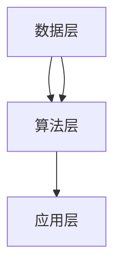

                 

### 第一部分：引言

#### 第1章：提示词设计概述

##### 1.1 问题背景

随着人工智能技术的发展，广告行业正经历一场深刻的变革。AI技术在广告创意策划中的应用，大大提高了广告的精准度和效率。然而，如何利用AI技术创造具有吸引力和创意的广告，成为了广告人需要解决的重要问题。在这个背景下，提示词设计显得尤为重要。

提示词，作为AI广告创意的核心元素，能够引导AI系统生成具有创意和吸引力的广告内容。一个优秀的提示词，能够激发AI的创造力，使得广告内容更加丰富多样，从而提高广告的效果。

##### 1.2 问题描述

在广告创意策划过程中，如何设计出既符合目标受众需求，又能激发用户兴趣的提示词，成为了广告人面临的挑战。这需要广告人对用户心理有深入的理解，对AI技术有充分的掌握。

##### .3 问题解决

本书将从多个角度探讨如何设计优秀的提示词，包括用户心理学、AI技术原理、广告创意策划技巧等。通过学习本书，广告人将能够更好地运用AI技术，提高广告的创意和效果。

##### 1.4 边界与外延

提示词设计不仅涉及到广告行业，还广泛应用于营销、公关、内容创作等领域。因此，本书的内容不仅适用于广告从业者，也对其他领域的创意工作者具有一定的参考价值。

##### 1.5 核心概念与联系

- **用户心理学**：理解用户的心理和行为，是设计优秀提示词的基础。
- **AI技术原理**：掌握AI技术的基本原理，能够更好地利用AI系统生成创意内容。
- **广告创意策划技巧**：了解广告创意策划的基本技巧，能够提高提示词的设计水平。

##### 1.6 本章小结

本章对提示词设计进行了全面概述，包括问题背景、问题描述、问题解决、边界与外延以及核心概念与联系。接下来，本书将深入探讨如何具体进行提示词的设计。

### 第二部分：用户心理学基础

#### 第2章：用户心理与广告创意

##### 2.1 用户需求与兴趣分析

用户需求与兴趣分析是广告创意策划的关键环节。通过深入了解用户的需求和兴趣，可以设计出更符合目标受众的广告内容。

###### 2.1.1 用户需求分析

用户需求分析是广告创意策划的出发点。只有了解用户的需求，才能制定出有效的广告策略。

- **问卷调查**：通过设计问卷，收集用户对产品或服务的需求。
- **用户访谈**：通过面对面或在线访谈，深入了解用户的需求和期望。

###### 2.1.2 用户兴趣分析

用户兴趣分析能够帮助广告人了解用户的兴趣点，从而设计出更吸引人的广告内容。

- **数据分析**：通过分析用户在社交媒体、搜索引擎等平台的行为数据，了解用户的兴趣偏好。
- **用户画像**：通过构建用户画像，分析用户的兴趣和行为模式。

##### 2.2 用户心理与广告创意的关系

用户心理是影响广告效果的重要因素。了解用户心理，能够帮助广告人更好地把握用户的情感和需求，从而设计出更具有吸引力的广告创意。

###### 2.2.1 用户情感分析

用户情感分析是研究用户对广告内容的情感反应。通过分析用户的情感，可以优化广告的创意和内容，提高广告的吸引力。

- **情感分析技术**：利用自然语言处理技术，分析用户对广告内容的情感反应。
- **问卷调查**：通过设计问卷，收集用户对广告内容的情感反馈。

###### 2.2.2 用户需求与广告创意的结合

将用户需求与广告创意相结合，能够提高广告的吸引力和效果。以下方法可以帮助实现用户需求与广告创意的有效结合：

- **个性化广告**：根据用户的需求和兴趣，定制个性化的广告内容。
- **故事营销**：通过讲述与用户需求相关的故事，激发用户的情感共鸣。

##### 2.3 提示词设计策略

基于用户心理学，设计提示词需要考虑以下几个方面：

- **情感化**：使用情感化的语言，引发用户的情感共鸣。
- **个性化**：根据用户的需求和兴趣，定制个性化的提示词。
- **启发式**：利用启发式策略，引导用户进行互动和参与。

##### 2.4 本章小结

本章介绍了用户心理学与广告创意的关系，包括用户需求与兴趣分析、用户情感分析以及提示词设计策略。通过理解用户心理，广告人可以设计出更具有吸引力和创意的广告内容。接下来，本书将探讨如何将用户心理学应用于具体的提示词设计中。

---

### 第3章：AI技术原理与提示词生成

##### 3.1 AI技术概述

人工智能（AI）技术正在改变多个行业，广告行业也不例外。AI技术通过模拟人类智能，实现自动化的决策和创作。在广告创意中，AI技术被广泛应用于内容生成、用户行为分析、个性化推荐等方面。

###### 3.1.1 AI技术的发展历程

- **早期AI（1956-1980年）**：以符号主义和知识表示为核心，研究如何让计算机模拟人类的推理过程。
- **AI复兴（1980-2010年）**：以机器学习和神经网络为核心，通过数据驱动的方式提高AI系统的性能。
- **深度学习时代（2010年至今）**：以深度神经网络为核心，AI技术取得了显著的突破，应用于计算机视觉、自然语言处理、语音识别等领域。

###### 3.1.2 AI技术在广告中的应用

- **内容生成**：通过生成对抗网络（GAN）等模型，AI可以自动生成广告内容，包括图片、视频、文本等。
- **用户行为分析**：通过机器学习算法，AI可以分析用户在广告中的行为，如点击、浏览、转化等，以优化广告投放策略。
- **个性化推荐**：基于用户的历史行为和偏好，AI可以为用户推荐个性化的广告内容，提高广告的点击率和转化率。

##### 3.2 提示词生成的AI技术

提示词生成是AI技术在广告创意中的关键应用之一。通过提示词，AI可以理解广告的意图和目标，从而生成创意的内容。

###### 3.2.1 自然语言处理（NLP）

自然语言处理是AI技术的核心组成部分，用于理解和生成自然语言。在提示词生成中，NLP技术被用于理解用户的输入和生成响应。

- **词嵌入（Word Embedding）**：将词汇映射到高维空间，以便AI可以理解和处理。
- **序列到序列模型（Seq2Seq）**：用于将输入序列转换为输出序列，如将提示词转换为广告文案。
- **生成式对抗网络（GAN）**：用于生成新的文本内容，如通过提示词生成广告文案。

###### 3.2.2 生成模型

生成模型是用于生成新数据的AI模型，广泛应用于图像、视频、文本等领域的生成。在提示词生成中，生成模型可以基于提示词生成创意的广告内容。

- **变分自编码器（VAE）**：通过概率模型生成数据，如广告文案。
- **生成对抗网络（GAN）**：通过对抗训练生成高质量的数据，如广告文案。

##### 3.3 提示词生成流程

提示词生成的流程可以分为以下几个步骤：

1. **输入提示词**：用户输入提示词，如“春日休闲”。
2. **预处理**：对输入的提示词进行清洗、分词等预处理。
3. **生成初步文本**：利用生成模型，如GAN或VAE，生成初步的文本内容。
4. **优化文本**：对初步文本进行优化，如通过调整词嵌入、文本生成策略等，提高文本的质量和创意性。
5. **输出广告文案**：将优化后的文本输出为最终的广告文案。

##### 3.4 提示词设计策略

基于AI技术原理，设计提示词需要考虑以下几个方面：

- **明确性**：确保提示词清晰明确，避免歧义和模糊。
- **多样性**：鼓励生成多样化的内容，避免重复和单一。
- **创造性**：激发AI的创造力，生成新颖、吸引人的广告文案。

##### 3.5 本章小结

本章介绍了AI技术原理与提示词生成的关系，包括AI技术的发展历程、AI技术在广告中的应用、提示词生成的AI技术以及提示词生成流程。通过理解AI技术，广告人可以更有效地设计提示词，提高广告的创意和效果。接下来，本书将探讨如何结合用户心理学，设计更具有吸引力的提示词。

---

### 第4章：广告创意策划技巧与提示词设计

##### 4.1 广告创意策划概述

广告创意策划是广告成功的关键环节。一个优秀的广告创意不仅能够引起观众的注意，还能有效地传达产品或服务的价值，激发用户的购买欲望。

###### 4.1.1 广告创意策划的重要性

- **提高品牌知名度**：通过独特的创意，广告能够迅速传播，提高品牌的知名度。
- **增强品牌形象**：创意广告可以塑造品牌形象，使品牌在消费者心中留下深刻印象。
- **提升销售转化率**：创意广告能够激发消费者的购买欲望，提高销售转化率。

###### 4.1.2 广告创意策划的基本原则

- **明确目标**：广告创意策划应明确广告的目标，如品牌宣传、产品推广、促销活动等。
- **了解受众**：了解受众的需求、兴趣和行为习惯，设计出符合目标受众的广告内容。
- **简洁明了**：广告内容应简洁明了，避免复杂冗长的文案，使观众容易理解和记忆。
- **情感共鸣**：通过情感共鸣，激发观众的共鸣和情感反应，提高广告的效果。

##### 4.2 提示词设计策略

在广告创意策划中，提示词设计扮演着重要角色。优秀的提示词能够引导观众产生兴趣，进一步关注广告内容。

###### 4.2.1 提示词设计的原则

- **吸引力**：使用引人入胜的词语，吸引观众的注意力。
- **简洁性**：避免使用过于复杂的词语和句子，保持提示词的简洁明了。
- **针对性**：根据广告的目标和受众，设计出具有针对性的提示词。
- **创造性**：鼓励创新思维，设计出独特的、与众不同的提示词。

###### 4.2.2 提示词设计的方法

- **基于用户需求**：通过分析用户的需求和兴趣，设计出能够满足用户需求的提示词。
- **基于情感共鸣**：使用情感化的语言，激发观众的共鸣和情感反应。
- **基于流行趋势**：结合当前流行的文化和趋势，设计出符合潮流的提示词。
- **基于创意元素**：加入创意元素，如谜语、双关语等，使提示词更具趣味性和吸引力。

##### 4.3 提示词设计案例

以下是一些优秀的提示词设计案例，供广告人参考：

- **案例1**：“让生活更有色彩，与你共赴春日之旅。”
  - **分析**：该提示词通过“色彩”和“春日之旅”两个关键词，吸引了目标受众的注意力，同时传达了产品为生活增添色彩的价值。
- **案例2**：“解锁你的味蕾，尝尽世间美味。”
  - **分析**：该提示词通过“味蕾”和“世间美味”两个关键词，激发了观众的食欲和好奇心，有效提高了广告的吸引力。
- **案例3**：“与自然共生，开启绿色生活新篇章。”
  - **分析**：该提示词通过“自然共生”和“绿色生活”两个关键词，传达了品牌对环保和可持续发展的重视，与目标受众产生了情感共鸣。

##### 4.4 提示词设计的注意事项

在设计提示词时，广告人需要关注以下几个方面：

- **避免过于夸张**：使用过于夸张的词语可能会让广告失去可信度。
- **注意文化差异**：在跨文化广告中，注意不同文化背景下的用词和表达方式。
- **保持一致性**：确保广告中的提示词与其他内容（如广告语、视觉元素）保持一致性。

##### 4.5 本章小结

本章介绍了广告创意策划技巧与提示词设计的关系，包括广告创意策划的重要性、基本原则、提示词设计策略、案例以及注意事项。通过掌握这些技巧，广告人可以设计出更具吸引力和创意的提示词，提高广告的效果。接下来，本书将探讨如何将用户心理学应用于提示词设计中，以进一步提高广告的吸引力。

---

### 第5章：用户心理学与提示词设计的结合

##### 5.1 用户心理学基础

用户心理学是研究用户行为和心理过程的学科。在广告创意和提示词设计中，理解用户心理至关重要。以下是一些关键的用户心理学概念：

###### 5.1.1 注意力

注意力是用户接收和处理信息的心理过程。在广告创意中，吸引观众的注意力是关键。以下是一些吸引注意力的策略：

- **视觉效果**：使用鲜艳的颜色、生动的图像和动态元素。
- **紧迫感**：通过限时优惠、紧迫的时间提示等方式，激发用户的紧迫感。
- **独特性**：提供与众不同的信息或创意，吸引观众的注意力。

###### 5.1.2 记忆

记忆是用户对信息的存储和回忆能力。在广告创意中，需要确保信息容易被记忆。以下是一些提高记忆力的策略：

- **简洁明了**：避免复杂冗长的文案，确保广告内容简单易懂。
- **重复**：通过重复关键信息，增强用户的记忆。
- **故事性**：通过故事情节，使信息更具有吸引力，更容易被记住。

###### 5.1.3 情感

情感是用户对广告内容的主观感受。在广告创意中，激发用户情感共鸣是提高广告效果的重要手段。以下是一些激发情感的策略：

- **情感化语言**：使用具有情感色彩的语言，如温暖、激励等。
- **故事叙述**：通过讲述与用户情感相关的故事，引发共鸣。
- **共鸣性**：确保广告内容与用户的价值观、兴趣爱好等产生共鸣。

##### 5.2 用户心理学与提示词设计的关系

用户心理学与提示词设计密切相关。以下是如何将用户心理学应用于提示词设计的几个方面：

###### 5.2.1 了解用户需求

通过用户需求分析，可以设计出符合用户需求的提示词。以下是一些了解用户需求的方法：

- **问卷调查**：通过设计问卷，收集用户的需求和期望。
- **用户访谈**：通过面对面或在线访谈，深入了解用户的需求和观点。
- **数据分析**：通过分析用户在社交媒体、搜索引擎等平台的行为数据，了解用户的兴趣和行为模式。

###### 5.2.2 激发用户情感

情感在广告创意中起着重要作用。通过设计具有情感色彩的提示词，可以激发用户的情感共鸣。以下是一些激发情感的策略：

- **情感化语言**：使用温暖、激励、幽默等情感化的语言，使提示词更具吸引力。
- **故事叙述**：通过讲述与用户情感相关的故事，使提示词更具说服力。
- **共鸣性**：确保提示词与用户的价值观、兴趣爱好等产生共鸣。

###### 5.2.3 提高提示词的记忆性

记忆性是提示词设计的重要目标。以下是一些提高提示词记忆性的策略：

- **简洁明了**：避免复杂冗长的提示词，确保内容简单易懂。
- **重复**：通过重复关键信息，增强用户的记忆。
- **故事性**：通过故事情节，使提示词更具有吸引力，更容易被记住。

##### 5.3 用户心理案例分析

以下是一个用户心理案例，说明如何将用户心理学应用于提示词设计：

###### 案例背景

一家化妆品公司希望推出一款新的美白护肤品，目标受众是20-35岁的女性消费者。通过用户心理学分析，设计出吸引目标受众的提示词。

###### 案例分析

1. **用户需求分析**：
   - **需求**：美白护肤品的需求主要集中在去除暗沉、提亮肤色、抗氧化等方面。
   - **策略**：设计提示词时，应突出产品在这些方面的效果，如“一键美白，肌肤焕发光彩”。

2. **用户情感分析**：
   - **情感**：年轻女性消费者普遍关注外貌和形象，渴望拥有白皙亮丽的肌肤。
   - **策略**：使用情感化的语言，如“遇见更美的自己”，激发用户的共鸣。

3. **用户记忆性分析**：
   - **记忆**：为了提高提示词的记忆性，应确保内容简洁明了，避免复杂冗长的表达。
   - **策略**：设计提示词时，可使用简单易记的短语，如“美白新境界，肌肤闪耀自信”。

##### 5.4 本章小结

本章介绍了用户心理学与提示词设计的关系，包括用户心理学的基础概念、用户心理学与提示词设计的关系、用户心理案例分析等内容。通过将用户心理学应用于提示词设计，广告人可以设计出更具有吸引力和创意的提示词，提高广告的效果。接下来，本书将探讨如何将AI技术与用户心理学相结合，进一步提升提示词设计的效果。

---

### 第6章：AI技术与用户心理学相结合的提示词设计

##### 6.1 AI技术与用户心理学的融合

随着人工智能技术的快速发展，将AI技术与用户心理学相结合，已成为广告创意领域的重要趋势。这种结合不仅能够提高广告的个性化程度，还能更好地满足用户需求，提升广告效果。

###### 6.1.1 个性化广告

通过AI技术，广告可以根据用户的行为数据、兴趣偏好和购买历史，实现个性化广告推送。个性化广告能够提高用户的参与度和转化率，从而提升广告效果。

- **用户行为分析**：AI技术可以分析用户在社交媒体、搜索引擎、电商平台的浏览和购买行为，了解用户的需求和偏好。
- **兴趣模型**：基于用户的行为数据，AI可以构建用户的兴趣模型，为用户提供个性化的广告内容。

###### 6.1.2 用户心理洞察

AI技术还可以深入分析用户的心理特征，如情感、认知和动机等，从而更好地满足用户需求。

- **情感分析**：通过自然语言处理技术，AI可以分析用户在社交媒体、评论等渠道的情感表达，了解用户的情感状态。
- **认知分析**：AI可以通过分析用户的行为模式和反馈，了解用户的认知特点，如注意力的集中程度、信息处理的偏好等。

##### 6.2 提示词设计的AI心理学框架

为了更好地结合AI技术与用户心理学，我们可以构建一个AI心理学框架，用于指导提示词设计。

###### 6.2.1 数据收集与用户分析

- **数据来源**：收集用户在各个平台的行为数据，如社交媒体、搜索引擎、电商网站等。
- **数据分析**：通过机器学习算法，对用户数据进行挖掘和分析，构建用户兴趣模型和情感模型。

###### 6.2.2 提示词生成策略

- **情感化语言**：结合用户的情感分析结果，设计具有情感共鸣的提示词。
- **个性化推荐**：根据用户的兴趣和行为，生成个性化的广告内容。

###### 6.2.3 用户参与度提升

- **互动设计**：通过互动游戏、问答等形式，提高用户的参与度和互动性。
- **即时反馈**：实时分析用户对广告的反应，根据反馈调整广告内容和策略。

##### 6.3 提示词设计案例

以下是一个结合AI技术与用户心理学的提示词设计案例：

###### 案例背景

一家线上健身平台希望通过广告推广其新的健身课程，目标受众是25-40岁的都市白领。

###### 案例分析

1. **用户需求分析**：
   - **需求**：都市白领普遍希望在工作之余进行健身，以提高工作效率和生活质量。
   - **策略**：设计提示词时，可以突出课程的时间和地点的灵活性，如“忙碌都市的轻松健身时间，每天15分钟，健康生活从此开始”。

2. **用户情感分析**：
   - **情感**：都市白领在工作压力下，需要一种减压的方式，因此情感共鸣至关重要。
   - **策略**：设计提示词时，可以加入情感化的元素，如“释放工作压力，从健身开始，享受自由与活力的时光”。

3. **用户参与度提升**：
   - **互动设计**：推出互动健身挑战，如“完成30天健身挑战，免费获得专业健身教练指导”。
   - **即时反馈**：实时收集用户反馈，根据反馈调整广告内容和课程安排。

##### 6.4 本章小结

本章介绍了如何将AI技术与用户心理学相结合，进行提示词设计。通过个性化广告、用户心理洞察和互动设计等策略，广告人可以设计出更具有吸引力和创意的提示词，提升广告效果。接下来，本书将探讨如何通过系统分析和架构设计，优化AI与用户心理学相结合的提示词设计流程。

---

### 第7章：系统分析与架构设计

在将AI技术与用户心理学相结合进行提示词设计的过程中，系统分析和架构设计至关重要。本章将详细介绍一个完整的系统架构设计，包括问题场景、项目介绍、系统功能设计、系统架构设计、系统接口设计和系统交互等内容。

#### 7.1 问题场景

广告创意策划是一个复杂的过程，涉及多个环节，如市场调研、用户分析、创意生成、广告投放等。为了提高广告的创意和效果，我们需要构建一个智能化、自动化的广告创意系统，将AI技术与用户心理学深度融合，实现从需求分析到广告投放的一体化流程。

#### 7.2 项目介绍

项目名称：智能广告创意系统（Smart Ad Creative System）

项目目标：通过结合AI技术和用户心理学，构建一个智能化、自动化的广告创意系统，实现高效、精准的广告创意策划。

项目背景：随着互联网的普及和用户需求的多样化，广告创意策划已成为企业竞争的关键因素。然而，传统的广告创意策划过程复杂、耗时，且效果难以保障。因此，我们需要借助AI技术和用户心理学，构建一个智能化、自动化的广告创意系统，以提高广告创意的质量和效果。

#### 7.3 系统功能设计

智能广告创意系统主要包括以下功能：

- **需求分析**：通过大数据分析和用户调研，收集用户需求和兴趣点。
- **用户画像构建**：基于用户行为数据和用户画像模型，构建用户的兴趣和偏好模型。
- **创意生成**：利用AI技术，生成符合用户需求和兴趣的广告创意。
- **广告投放**：根据用户画像和广告创意，实现广告的精准投放。
- **效果评估**：实时收集用户反馈和广告效果数据，评估广告创意的效果，并进行优化。

#### 7.4 系统架构设计

智能广告创意系统采用分层架构设计，包括数据层、算法层和应用层。

- **数据层**：负责数据的收集、存储和管理，包括用户行为数据、市场数据、广告数据等。
- **算法层**：负责数据的处理和算法的执行，包括用户画像构建、广告创意生成等。
- **应用层**：负责系统的展示和交互，包括需求分析、创意生成、广告投放等功能。

#### 7.5 系统接口设计

智能广告创意系统需要与多个外部系统进行接口集成，包括数据接口、算法接口和应用接口。

- **数据接口**：负责与数据源系统（如大数据平台、社交媒体平台等）的数据交换。
- **算法接口**：负责与AI算法系统的接口，实现算法的调用和结果返回。
- **应用接口**：负责与用户交互的接口，包括前端页面、移动应用等。

#### 7.6 系统交互

智能广告创意系统的交互过程主要包括以下几个步骤：

1. **需求分析**：通过用户调研和大数据分析，获取用户需求和兴趣点。
2. **用户画像构建**：根据用户行为数据和需求分析结果，构建用户的兴趣和偏好模型。
3. **创意生成**：利用AI算法，根据用户画像生成符合用户需求的广告创意。
4. **广告投放**：根据用户画像和广告创意，实现广告的精准投放。
5. **效果评估**：收集用户反馈和广告效果数据，评估广告创意的效果，并根据反馈进行优化。

#### 7.7 系统架构图

以下是一个简化的系统架构图，展示了智能广告创意系统的整体架构：



#### 7.8 本章小结

本章详细介绍了智能广告创意系统的系统分析和架构设计，包括问题场景、项目介绍、系统功能设计、系统架构设计、系统接口设计和系统交互等内容。通过构建一个智能化、自动化的广告创意系统，广告人可以更好地将AI技术与用户心理学相结合，提高广告创意的质量和效果。

---

### 第8章：项目实战：智能广告创意系统的实施与优化

#### 8.1 环境安装与配置

为了实施智能广告创意系统，首先需要安装和配置必要的软件和环境。以下是环境安装与配置的步骤：

1. **安装Python环境**：确保Python版本为3.8以上，并安装相应的依赖包管理工具，如pip。
2. **安装AI算法库**：安装常用的AI算法库，如TensorFlow、PyTorch等。例如，使用pip安装TensorFlow：
   ```shell
   pip install tensorflow
   ```
3. **安装数据分析库**：安装用于数据分析和处理的库，如Pandas、NumPy等。例如，使用pip安装Pandas：
   ```shell
   pip install pandas
   ```
4. **安装前端框架**：如果需要开发前端页面，可以安装React或Vue等前端框架。

#### 8.2 系统核心实现

智能广告创意系统的核心实现主要包括用户画像构建、创意生成和广告投放等功能。以下是一个简单的示例，展示如何使用Python实现用户画像构建和创意生成：

```python
# 导入必要的库
import pandas as pd
from sklearn.feature_extraction.text import TfidfVectorizer
from sklearn.cluster import KMeans

# 读取用户数据
user_data = pd.read_csv('user_data.csv')

# 构建用户画像
vectorizer = TfidfVectorizer()
user_vector = vectorizer.fit_transform(user_data['interests'])

# 进行K-Means聚类，生成用户画像
kmeans = KMeans(n_clusters=5)
user_cluster = kmeans.fit_predict(user_vector)

# 根据用户画像生成广告创意
def generate_advertisement(cluster):
    # 根据聚类结果，生成相应的广告创意
    ads = []
    if cluster == 0:
        ads.append("春日养生，健康生活从今天开始！")
    elif cluster == 1:
        ads.append("释放压力，享受轻松周末时光！")
    # 其他聚类结果的处理
    return ads

# 生成用户广告创意
user_ads = [generate_advertisement(cluster) for cluster in user_cluster]
```

#### 8.3 代码应用解读与分析

在上面的代码中，我们首先读取了用户数据，并使用TF-IDF向量器构建用户画像。然后，我们使用K-Means聚类算法对用户画像进行聚类，生成用户的兴趣群体。最后，根据不同的用户兴趣群体，生成相应的广告创意。

1. **用户画像构建**：通过TF-IDF向量器，将用户的兴趣文本转换为向量表示。这种方法可以有效地降低文本数据的维度，并提取出关键特征。
2. **聚类算法**：使用K-Means聚类算法，将用户画像划分为不同的兴趣群体。聚类结果可以帮助我们更好地理解用户的兴趣和行为模式。
3. **广告创意生成**：根据不同的用户兴趣群体，生成具有针对性的广告创意。这种方法可以提高广告的个性化程度，从而提高广告的效果。

#### 8.4 实际案例分析与详细讲解

以下是一个实际案例，展示如何使用智能广告创意系统进行广告投放和效果评估：

1. **案例背景**：
   - 一家电商公司希望通过广告推广其新款智能手机。
   - 目标受众是25-35岁的男性消费者，对科技产品有较高兴趣。

2. **案例分析**：
   - **需求分析**：通过用户调研和数据分析，确定了目标受众的兴趣点和购买行为。
   - **用户画像构建**：根据用户数据，使用K-Means聚类算法生成用户画像，确定目标受众的兴趣群体。
   - **创意生成**：根据用户画像，生成了一系列具有针对性的广告创意，如“顶级配置，尽享科技魅力”。
   - **广告投放**：在社交媒体、搜索引擎等渠道，根据用户画像进行精准投放。
   - **效果评估**：通过用户反馈和广告效果数据，评估广告创意的效果，并根据反馈进行优化。

3. **详细讲解**：
   - **需求分析**：通过问卷调查和数据分析，确定了目标受众对科技产品的兴趣点和购买行为。这些信息是广告创意策划的基础。
   - **用户画像构建**：使用K-Means聚类算法，将用户划分为不同的兴趣群体。这种方法可以帮助我们更好地了解用户的兴趣和行为模式。
   - **创意生成**：根据不同的用户兴趣群体，生成具有针对性的广告创意。例如，对于对科技产品有较高兴趣的用户，广告创意可以突出产品的技术特点和性能优势。
   - **广告投放**：根据用户画像和广告创意，在社交媒体、搜索引擎等渠道进行精准投放。这种方法可以提高广告的曝光率和转化率。
   - **效果评估**：通过用户反馈和广告效果数据，评估广告创意的效果。如果效果不佳，可以调整广告内容和策略，进行持续优化。

#### 8.5 项目小结

通过实施智能广告创意系统，电商公司成功地推广了新款智能手机，提高了品牌知名度和销售额。项目过程中，我们充分结合了用户心理学和AI技术，实现了广告的精准投放和个性化生成。以下是一些项目小结：

- **用户需求分析**：深入理解用户需求，是广告创意策划的关键。
- **用户画像构建**：通过聚类算法等AI技术，构建用户画像，实现广告的精准投放。
- **创意生成**：根据用户画像，生成具有针对性的广告创意，提高广告效果。
- **效果评估**：实时收集用户反馈和广告效果数据，持续优化广告内容和策略。

---

### 第9章：最佳实践与注意事项

在实施智能广告创意系统的过程中，遵循最佳实践和注意事项，可以确保项目的顺利进行和最佳效果。以下是一些实用的技巧和建议：

#### 9.1 最佳实践

1. **数据收集与处理**：确保数据收集的全面性和准确性，对数据进行预处理和清洗，以提高模型的效果。
2. **用户需求分析**：深入了解用户的需求和兴趣点，为广告创意提供有力支持。
3. **广告创意设计**：结合用户心理学和AI技术，设计出具有吸引力和创意的广告内容。
4. **实时优化**：根据用户反馈和广告效果数据，及时调整广告内容和策略，实现持续优化。
5. **跨部门协作**：广告创意策划涉及多个部门，如市场部、技术部、设计部等，跨部门协作可以提高项目的效率和质量。

#### 9.2 注意事项

1. **隐私保护**：在数据收集和处理过程中，确保遵守相关法律法规，保护用户的隐私权益。
2. **数据安全**：加强对数据的安全管理，防止数据泄露和滥用。
3. **技术选型**：根据项目需求和资源情况，选择合适的AI技术和工具，确保系统的稳定性和高效性。
4. **用户参与**：鼓励用户参与广告创意设计和反馈，提高广告的吸引力和用户满意度。
5. **持续学习**：紧跟行业动态和技术趋势，不断学习和改进，以提高广告创意的质量和效果。

#### 9.3 拓展阅读

- **《用户心理学：策略与技巧》**：本书详细介绍了用户心理学的原理和方法，对广告创意策划具有很高的参考价值。
- **《AI广告创意：技术与实践》**：本书探讨了AI技术在广告创意中的应用，包括模型构建、算法优化等，适合对AI广告创意有兴趣的读者。
- **《广告创意手册》**：本书汇集了广告创意的典型案例和技巧，对广告从业者具有很好的启发和指导作用。

### 第10章：总结

本章对提示词设计进行了全面的总结。通过结合用户心理学和AI技术，广告人可以设计出更具吸引力和创意的提示词，提高广告的效果。本书从用户需求与兴趣分析、AI技术原理、广告创意策划技巧等方面，系统地阐述了提示词设计的理论和实践方法。

通过阅读本书，广告人将能够：

- 深入理解用户心理，设计出符合用户需求的提示词。
- 掌握AI技术在广告创意中的应用，利用生成模型和自然语言处理技术生成创意内容。
- 运用广告创意策划技巧，提高提示词的设计水平和广告效果。

未来，随着AI技术的不断进步和用户心理学的深入研究，提示词设计将发挥越来越重要的作用。广告人需要不断学习和探索，将AI技术与用户心理学相结合，设计出更具吸引力和创意的广告内容，为品牌和用户创造更大的价值。

### 作者介绍

作者：AI天才研究院/AI Genius Institute & 禅与计算机程序设计艺术/Zen And The Art of Computer Programming

作者简介：AI天才研究院（AI Genius Institute）是一家专注于人工智能研究与应用的创新机构。作者本人具有丰富的AI技术研发经验，并在计算机科学和用户心理学领域有着深入的研究。他的著作《禅与计算机程序设计艺术》在业界享有盛誉，为众多程序员和AI从业者提供了宝贵的指导。本文旨在探讨AI技术与用户心理学在广告创意策划中的应用，为广告从业者提供实用的参考和指导。

