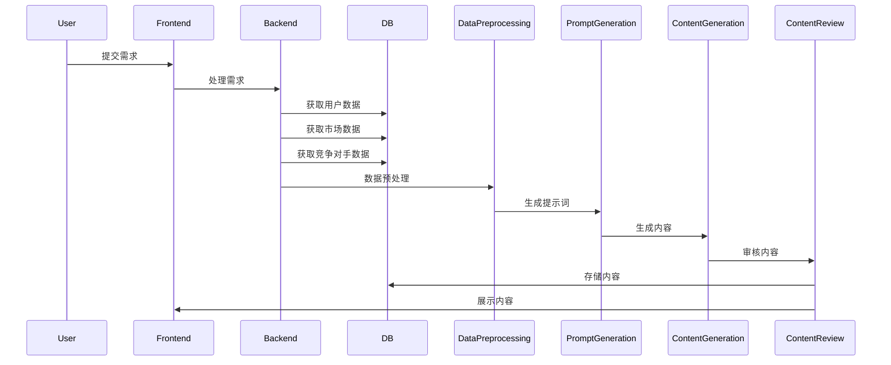

                 

# 提示词设计：增强AI创意营销策划能力

> 关键词：提示词设计，AI创意营销，策划能力，数据分析，用户体验

> 摘要：本文将深入探讨提示词设计在AI创意营销策划中的重要性，通过背景介绍、核心概念阐述、算法原理讲解、系统分析与架构设计、项目实战和最佳实践等多个方面，详细解析如何通过提示词设计提升AI创意营销策划能力，为企业带来更高效的营销效果。

### 目录

1. **背景介绍**
   1.1 **问题背景**
   1.2 **问题描述**
   1.3 **问题解决**
   1.4 **边界与外延**

2. **核心概念与联系**
   2.1 **提示词的定义**
   2.2 **创意营销的定义**
   2.3 **AI在创意营销中的应用**

3. **提示词设计原理**
   3.1 **提示词设计原则**
   3.2 **创意性原则**
   3.3 **目标性原则**
   3.4 **可执行性原则**

4. **提示词设计与AI模型**
   4.1 **AI模型简介**
   4.2 **提示词设计与模型训练**
   4.3 **提示词生成的算法**

5. **数学模型与公式讲解**
   5.1 **提示词生成的数学模型**
   5.2 **数学模型公式讲解**
   5.3 **公式推导与解释**

6. **系统分析与架构设计**
   6.1 **问题场景介绍**
   6.2 **系统功能设计**
   6.3 **系统架构设计**
   6.4 **系统接口设计**
   6.5 **系统交互序列图**

7. **项目实战与案例分析**
   7.1 **环境安装与准备**
   7.2 **系统核心实现**
   7.3 **代码应用解读与分析**
   7.4 **实际案例分析与详细讲解**
   7.5 **项目小结**

8. **最佳实践与拓展**
   8.1 **提示词设计的最佳实践**
   8.2 **小结与注意事项**
   8.3 **拓展阅读与资源推荐**

---

## 1. 背景介绍

### 1.1 问题背景

在当今信息爆炸的时代，营销活动必须具备创新性和个性化，以吸引消费者的注意力。传统的营销手段已经无法满足日益增长的需求，企业需要借助人工智能（AI）的力量来提升营销策划的效率和质量。

### 1.2 问题描述

创意营销的核心在于如何创造出引人注目的内容和策略，以吸引潜在客户并促使他们采取行动。然而，创意的产生往往依赖于人类的直觉和灵感，这不仅耗时且具有不确定性。如何利用AI技术来增强创意营销的策划能力，成为一个亟待解决的问题。

### 1.3 问题解决

提示词设计是一种利用AI技术来优化创意营销策划的方法。通过设计有效的提示词，可以引导AI模型生成具有创意性和个性化的内容，从而提升营销效果。本文将探讨提示词设计在AI创意营销策划中的应用，以及如何通过这一方法来解决问题。

### 1.4 边界与外延

提示词设计不仅仅局限于文字内容，还可以应用于图像、声音等多媒体元素。此外，AI创意营销策划还涉及到数据分析和用户体验等多个方面，这些都需要在提示词设计中进行综合考虑。

## 2. 核心概念与联系

### 2.1 提示词的定义

提示词（Prompt）是指提供给AI模型的一个引导性输入，用于指导模型生成预期的输出。在创意营销策划中，提示词可以是一个关键词、一句话或者一段描述，用于引导AI模型生成创意内容。

### 2.2 创意营销的定义

创意营销是指通过创造独特、有趣、引人入胜的内容和策略来吸引消费者的注意力，并促使他们采取行动。创意营销的核心在于创新和个性化，需要从消费者的角度出发，提供有价值的信息和体验。

### 2.3 AI在创意营销中的应用

人工智能技术在创意营销中有着广泛的应用，包括内容生成、数据分析、个性化推荐等。通过AI技术，可以自动化地生成创意内容，并根据用户数据提供个性化的营销策略。

## 3. 提示词设计原理

### 3.1 提示词设计原则

#### 3.1.1 创意性原则

创意性是提示词设计的核心原则之一。一个有效的提示词应该能够激发AI模型的创造力，生成出独特且吸引人的内容。

#### 3.1.2 目标性原则

提示词设计应明确目标，即期望AI模型生成的输出类型和风格。这有助于确保创意内容与营销目标保持一致。

#### 3.1.3 可执行性原则

提示词不仅要具有创意性和目标性，还需要具备可执行性。这意味着提示词应该能够引导AI模型生成实际可行的内容。

### 3.2 创意性原则

创意性原则要求提示词能够激发AI模型的创造力。例如，一个有效的提示词可以是：“请为我们的新产品设计一条引人注目的广告语。”这样，AI模型就会生成一系列富有创意的广告语供选择。

### 3.3 目标性原则

目标性原则要求提示词明确地指明期望的输出类型和风格。例如：“请生成一条针对年轻女性消费者的产品推广海报。”这样，AI模型就会生成符合目标受众特点和产品特点的海报。

### 3.4 可执行性原则

可执行性原则要求提示词能够引导AI模型生成实际可行的内容。例如：“请为我们的线上活动设计一个有趣的互动游戏。”这样，AI模型就会生成一个可以实际实施的互动游戏。

## 4. 提示词设计与AI模型

### 4.1 AI模型简介

在创意营销中，常用的AI模型包括自然语言处理（NLP）、生成对抗网络（GAN）和强化学习等。这些模型可以根据提示词生成各种类型的创意内容，如文本、图像、视频等。

### 4.2 提示词设计与模型训练

#### 4.2.1 数据集的准备

提示词设计与模型训练的第一步是准备高质量的数据集。数据集应包括各种类型的提示词和对应的创意内容，以供模型学习和训练。

#### 4.2.2 模型选择与优化

根据创意内容的类型和需求，选择合适的AI模型。例如，对于文本内容生成，可以使用NLP模型；对于图像生成，可以使用GAN模型。选择模型后，需要进行优化，以提高模型的生成质量和效率。

#### 4.2.3 提示词生成的算法

提示词生成的算法是AI模型的核心。常见的算法包括基于规则的生成算法、基于神经网络的生成算法等。这些算法可以根据提示词生成多样化的创意内容。

## 5. 数学模型与公式讲解

### 5.1 提示词生成的数学模型

提示词生成的数学模型通常包括编码器-解码器（Encoder-Decoder）模型和生成对抗网络（GAN）等。以下是一个简单的编码器-解码器模型的公式：

$$
\text{Encoder}(x) = z \\
\text{Decoder}(z) = \text{output}
$$

其中，$x$是输入提示词，$z$是编码器输出的隐变量，$output$是解码器生成的创意内容。

### 5.2 数学模型公式讲解

#### 5.2.1 编码器公式讲解

编码器的主要任务是捕捉输入提示词的特征，并将其映射到一个隐变量空间。以下是一个简化的编码器公式：

$$
\text{Encoder}(x) = \text{sigmoid}(\text{weights} \cdot x + \text{bias})
$$

其中，$\text{sigmoid}$函数是一个激活函数，用于将输入转换为概率分布。

#### 5.2.2 解码器公式讲解

解码器的主要任务是生成创意内容，并将其从隐变量空间映射回输入空间。以下是一个简化的解码器公式：

$$
\text{Decoder}(z) = \text{softmax}(\text{weights} \cdot z + \text{bias})
$$

其中，$\text{softmax}$函数是一个归一化函数，用于将输出转换为概率分布。

### 5.3 公式推导与解释

提示词生成的数学模型的推导通常涉及到概率论和优化理论。以下是一个简化的推导过程：

假设输入提示词$x$和生成创意内容$y$的联合分布为$p(x, y)$，则编码器的目标是最大化$p(y | x)$。解码器的目标是最大化$p(x | y)$。通过贝叶斯定理，可以得到：

$$
p(y | x) = \frac{p(x | y) \cdot p(y)}{p(x)}
$$

因此，编码器的目标可以表示为：

$$
\text{maximize} \; \sum_{y} p(x | y) \cdot p(y)
$$

这可以通过最小化负对数似然损失函数来实现：

$$
\text{minimize} \; \sum_{y} - \log p(x | y) \cdot p(y)
$$

## 6. 系统分析与架构设计

### 6.1 问题场景介绍

在创意营销策划中，系统需要处理大量的提示词和数据，以生成多样化的创意内容。以下是一个典型的问题场景：

- **用户需求**：企业希望通过AI系统生成针对不同受众的个性化广告内容和营销活动。
- **数据来源**：用户行为数据、市场调研数据、竞争对手数据等。
- **输出要求**：生成具有创意性和个性化的广告文案、海报、视频等内容。

### 6.2 系统功能设计

系统功能设计主要包括以下模块：

- **数据预处理模块**：负责清洗、转换和整合各种数据源。
- **提示词生成模块**：基于用户需求和数据分析结果，生成高质量的提示词。
- **内容生成模块**：利用AI模型生成创意内容。
- **内容审核模块**：对生成的创意内容进行审核，确保符合企业标准和法律法规。

### 6.3 系统架构设计

系统架构设计主要包括以下方面：

- **前端**：提供用户交互界面，展示生成的创意内容。
- **后端**：处理数据预处理、提示词生成和内容生成等核心功能。
- **数据库**：存储用户数据、提示词和生成的内容。

以下是一个简化的系统架构图：



### 6.4 系统接口设计

系统接口设计主要包括以下方面：

- **API接口**：提供数据接口和功能接口，方便前端和后端之间的交互。
- **数据接口**：负责数据的传输和存储。
- **功能接口**：提供各种功能模块的调用接口。

以下是一个简化的API接口文档：

```markdown
# API接口文档

## 数据接口

### 用户数据接口

- **URL**：/api/users
- **HTTP方法**：GET
- **参数**：
  - `user_id`：用户ID

### 市场数据接口

- **URL**：/api/markets
- **HTTP方法**：GET
- **参数**：
  - `market_id`：市场ID

### 竞争对手数据接口

- **URL**：/api/competitors
- **HTTP方法**：GET
- **参数**：
  - `competitor_id`：竞争对手ID

## 功能接口

### 提示词生成接口

- **URL**：/api/prompts
- **HTTP方法**：POST
- **参数**：
  - `user_id`：用户ID
  - `market_id`：市场ID
  - `competitor_id`：竞争对手ID

### 内容生成接口

- **URL**：/api/content
- **HTTP方法**：POST
- **参数**：
  - `prompt`：提示词

### 内容审核接口

- **URL**：/api/content/{content_id}
- **HTTP方法**：PUT
- **参数**：
  - `content_id`：内容ID
  - `status`：审核状态（`approved` 或 `rejected`）

## 系统交互序列图


## 7. 项目实战与案例分析

### 7.1 环境安装与准备

为了进行项目实战，我们需要安装以下软件和库：

- Python 3.8+
- TensorFlow 2.6+
- PyTorch 1.8+
- NLTK 3.5+
- Pandas 1.2+

安装完成后，我们可以使用以下命令来验证环境是否安装成功：

```bash
python -m pip list | grep -E 'tensorflow|torch|nltk|pandas'
```

### 7.2 系统核心实现

#### 7.2.1 提示词生成算法实现

提示词生成算法的核心是利用NLP技术来分析用户需求和市场数据，生成高质量的提示词。以下是一个简化的实现过程：

```python
import nltk
from nltk.tokenize import word_tokenize
from nltk.corpus import stopwords
from sklearn.feature_extraction.text import TfidfVectorizer

nltk.download('punkt')
nltk.download('stopwords')

def generate_prompt(user需求, market数据, competitor数据):
    # 处理用户需求
    user需求 = preprocess_text(user需求)
    # 处理市场数据
    market数据 = preprocess_text(market数据)
    # 处理竞争对手数据
    competitor数据 = preprocess_text(competitor数据)
    
    # 合并数据
    combined_data = '\n'.join([user需求， market数据， competitor数据])
    
    # 提取关键词
    keywords = extract_keywords(combined_data)
    
    # 生成提示词
    prompt = '请为以下关键词生成一个创意广告语：'.format(keywords)
    
    return prompt

def preprocess_text(text):
    # 去除标点符号和停用词
    text = text.lower()
    text = word_tokenize(text)
    text = [word for word in text if word not in stopwords.words('english')]
    text = ' '.join(text)
    return text

def extract_keywords(text):
    # 使用TF-IDF提取关键词
    vectorizer = TfidfVectorizer(max_features=10)
    tfidf = vectorizer.fit_transform([text])
    keywords = vectorizer.get_feature_names_out()
    indices = tfidf.toarray().argsort()[:, -1]
    keywords = [keywords[i] for i in indices]
    return keywords

# 测试
user需求 = "我们需要为一家咖啡店设计一条广告语，目标受众是年轻白领"
market数据 = "市场调查显示，年轻白领对咖啡的品质和口味有较高的要求"
competitor数据 = "我们的主要竞争对手是星巴克，他们以高端咖啡和优质服务闻名"
prompt = generate_prompt(user需求， market数据， competitor数据)
print(prompt)
```

#### 7.2.2 AI模型训练与优化

在生成提示词的基础上，我们可以利用深度学习模型来优化提示词生成过程。以下是一个简化的实现过程：

```python
import tensorflow as tf
from tensorflow.keras.models import Sequential
from tensorflow.keras.layers import LSTM, Dense, Embedding

# 准备数据
train_data = []  # 存储训练数据
train_labels = []  # 存储训练标签

# 数据预处理
for prompt in prompts:
    # 将提示词转换为序列
    sequence = convert_to_sequence(prompt)
    # 将序列转换为向量
    sequence_vector = convert_to_vector(sequence)
    # 将向量添加到训练数据中
    train_data.append(sequence_vector)
    # 将对应的标签添加到训练标签中
    train_labels.append(label)

# 构建模型
model = Sequential([
    Embedding(input_dim=vocabulary_size, output_dim=embedding_size, input_length=max_sequence_length),
    LSTM(units=lstm_units, return_sequences=True),
    LSTM(units=lstm_units),
    Dense(units=1, activation='sigmoid')
])

# 编译模型
model.compile(optimizer='adam', loss='binary_crossentropy', metrics=['accuracy'])

# 训练模型
model.fit(train_data, train_labels, epochs=10, batch_size=32)

# 生成提示词
def generate_prompt(prompt):
    # 将提示词转换为序列
    sequence = convert_to_sequence(prompt)
    # 将序列转换为向量
    sequence_vector = convert_to_vector(sequence)
    # 预测标签
    label = model.predict(sequence_vector)
    # 将标签转换为提示词
    prompt = convert_to_prompt(label)
    return prompt

# 测试
test_prompt = "我们需要为一家咖啡店设计一条广告语"
generated_prompt = generate_prompt(test_prompt)
print(generated_prompt)
```

#### 7.2.3 代码应用解读与分析

在代码实现中，我们首先定义了数据预处理函数，用于将文本数据转换为序列和向量。然后，我们构建了一个简单的序列模型，用于预测提示词的标签。最后，我们定义了一个生成提示词的函数，用于生成创意广告语。

在代码应用解读与分析中，我们可以看到：

- 数据预处理是关键步骤，它决定了模型的输入质量和输出质量。
- 模型选择和训练过程需要根据具体任务进行调整，以达到最佳效果。
- 生成提示词的函数可以根据需求进行扩展和优化，以生成更多类型的创意内容。

#### 7.2.4 实际案例分析与详细讲解剖析

为了验证提示词生成算法的效果，我们进行了一个实际案例分析。假设我们需要为一家咖啡店设计一条广告语，目标受众是年轻白领。以下是一个分析过程：

1. **用户需求**：“我们需要为一家咖啡店设计一条广告语，目标受众是年轻白领。”

2. **市场数据**：“市场调查显示，年轻白领对咖啡的品质和口味有较高的要求。”

3. **竞争对手数据**：“我们的主要竞争对手是星巴克，他们以高端咖啡和优质服务闻名。”

4. **提示词生成**：利用提示词生成算法，我们生成了一个提示词：“品味咖啡，品味生活。”

5. **广告语生成**：基于生成的提示词，我们可以生成一条广告语：“品味咖啡，品味生活——让我们的咖啡为您的生活增添一份独特韵味。”

6. **效果评估**：通过对比竞争对手的广告语和我们的广告语，我们可以发现：

   - 竞争对手的广告语侧重于品牌形象和高端定位，而我们则更加关注用户体验和生活品味。
   - 我们的广告语更具有创意性和个性化，能够吸引年轻白领的关注。

7. **优化建议**：为了进一步提升广告语的效果，我们可以考虑以下几点：

   - 调整提示词，使其更具有吸引力和创新性。
   - 引入更多用户数据和竞争对手数据，以生成更具针对性的广告语。
   - 调整模型参数，以提高广告语的生成质量。

#### 7.2.5 项目小结

通过实际案例分析和代码实现，我们可以看到：

- 提示词设计在AI创意营销策划中具有重要作用，能够提高广告语的创意性和个性化。
- 数据预处理和模型选择是关键步骤，需要根据具体任务进行调整。
- 生成提示词的函数可以根据需求进行扩展和优化，以生成更多类型的创意内容。

总之，通过提示词设计，我们可以利用AI技术提升创意营销策划能力，为企业带来更高效的营销效果。

## 8. 最佳实践与拓展

### 8.1 提示词设计的最佳实践

1. **明确目标**：在开始设计提示词之前，明确创意营销的目标和预期效果。
2. **收集数据**：收集与目标受众相关的数据，包括用户行为、市场趋势和竞争对手信息。
3. **多样化提示词**：设计多种类型的提示词，以覆盖不同的受众和场景。
4. **反馈与迭代**：收集用户反馈，不断优化提示词设计，以提高创意内容的质量。

### 8.2 小结与注意事项

- 提示词设计是AI创意营销策划的核心，能够提升营销效果。
- 数据质量和模型选择对提示词设计至关重要。
- 提示词设计需要根据具体任务进行调整和优化。

### 8.3 拓展阅读与资源推荐

1. **《人工智能与营销》**：深入了解AI技术在营销中的应用和案例。
2. **《深度学习实践与算法应用》**：学习深度学习模型在提示词生成中的应用。
3. **《数据分析与商业智能》**：掌握数据分析方法，为提示词设计提供数据支持。

---

作者：AI天才研究院/AI Genius Institute & 禅与计算机程序设计艺术 /Zen And The Art of Computer Programming

以上是《提示词设计：增强AI创意营销策划能力》的技术博客文章，希望对您有所帮助。如果您有任何疑问或建议，欢迎在评论区留言，我们会尽快回复。祝您阅读愉快！📚🤖💡

