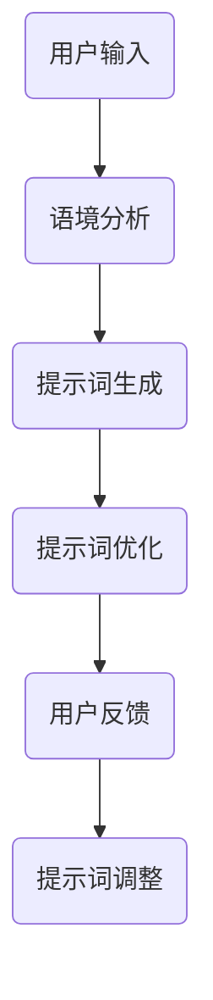
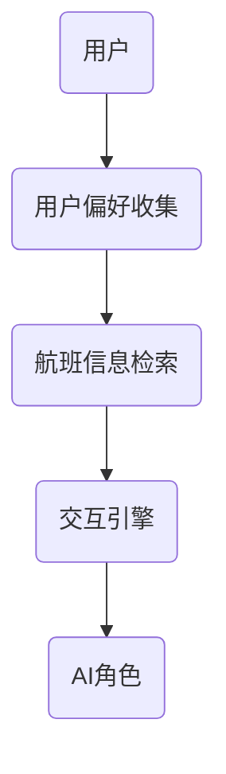
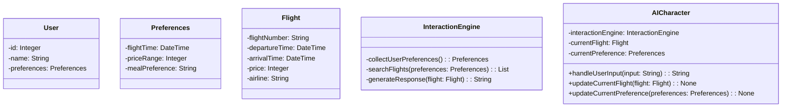
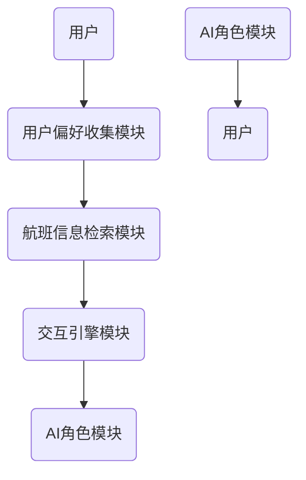

                 

 # 标记为思考过程

# 提示词设计：增强AI角色扮演能力

关键词：
1. AI角色扮演
2. 提示词设计
3. 人工智能
4. 自然语言处理
5. 机器学习

摘要：
本文将深入探讨AI角色扮演能力中的核心元素——提示词设计。通过详细的逻辑分析，我们将理解提示词在AI角色扮演中的作用、设计原则、算法原理和系统架构。本文旨在为开发者提供一套全面的指南，以提升AI角色扮演的逼真度和交互性。

## 第一部分：理解提示词设计

### 第1章：问题背景与核心概念

**1.1 AI与角色扮演能力概述**
随着人工智能（AI）技术的迅猛发展，AI的角色扮演能力正逐渐成为多个领域的关键应用，如虚拟现实、游戏、教育、客户服务等领域。这些应用不仅需要AI具备处理信息和决策的能力，还需要AI能够理解并模拟人类角色行为，以提供更加真实和引人入胜的交互体验。

**1.1.1 人工智能的快速发展**
近年来，深度学习、自然语言处理（NLP）等技术的突破，使得AI在模仿人类行为和思维方面取得了显著进展。特别是生成对抗网络（GANs）、强化学习（RL）等技术的应用，极大地提升了AI的自主学习和适应性。

**1.1.2 角色扮演能力的应用需求**
AI的角色扮演能力在多个领域有着广泛的应用需求。例如，在虚拟现实中，用户希望能够与虚拟角色进行自然的交流；在游戏中，玩家期望AI角色能够展现出丰富多样的行为和情感；在教育中，AI角色可以作为个性化的教学助手，提供互动式学习体验。

**1.1.3 提示词设计的核心作用**
提示词（Prompt）在AI角色扮演中起到了桥梁作用，它能够引导AI理解角色的特定行为和情境，从而生成更加符合期望的回应。一个良好的提示词设计不仅能够提高AI角色的交互性，还能增强用户的沉浸感和满意度。

**1.2 提示词设计的基本概念**
提示词设计涉及到多个核心概念，包括提示词的定义、类型、结构和属性。理解这些概念是进行有效提示词设计的基础。

**1.2.1 提示词的定义**
提示词通常是一段文本或指令，用于指导AI模型理解任务目标、角色属性和互动环境。

**1.2.2 提示词的类型与结构**
提示词可以分为基于任务、情境、角色属性等不同类型，结构上可以是简单指令、复杂指令或者故事线形式。

**1.2.3 提示词的属性与特征**
提示词的有效性取决于其清晰性、相关性、激励性和适应性。清晰性确保AI能够准确理解任务目标；相关性保证AI的回应与情境相关；激励性促进AI生成丰富多样的互动；适应性使AI能够根据不同用户和情境调整回应。

**1.3 提示词设计的关键要素**
设计一个有效的提示词需要考虑多个关键要素。这些要素包括：
- **明确的目标**：确保AI知道需要执行的任务和目标。
- **合适的情境描述**：为AI提供足够的上下文信息，使其能够理解角色的行为和环境。
- **角色属性的指定**：明确角色的属性，如性格、情感、动机等，以指导AI生成符合角色特征的回应。
- **互动期望的设定**：设定用户期望的互动方式，如对话风格、回应速度等。

**1.4 提示词设计的原则与方法**
提示词设计应遵循以下核心原则：
- **清晰性**：确保提示词简单明了，易于理解。
- **相关性**：提示词应与AI角色扮演的情境和目标紧密相关。
- **激励性**：提示词应能够激发AI生成多样化和有趣的回应。
- **适应性**：提示词应具备适应不同用户和情境的能力。

具体方法包括：
- **逐步引导**：通过分步引导AI理解任务目标和情境。
- **情境模拟**：创建模拟场景，让AI在虚拟环境中实践和适应。
- **用户反馈**：收集用户反馈，根据用户的互动调整提示词设计。

**1.4.1 提示词设计的核心原则**
- **任务导向性**：提示词应明确指向具体的任务目标。
- **情境适应性**：提示词应能够适应不同的交互情境。
- **角色特性尊重**：提示词应尊重AI角色的属性和个性。

**1.4.2 提示词设计的具体方法**
- **模板法**：使用预定义的模板来生成提示词。
- **故事线法**：设计连续的故事线，让AI按照故事发展进行角色扮演。
- **用户协作**：通过与用户的互动，共同创建和优化提示词。

**1.4.3 提示词设计的实践步骤**
- **需求分析**：明确用户需求和AI角色扮演的目标。
- **情境构建**：创建AI角色扮演的情境。
- **提示词生成**：根据需求和情境生成初步的提示词。
- **反馈优化**：收集用户反馈，对提示词进行优化。

**1.5 本章小结**
本章介绍了AI角色扮演能力的背景和提示词设计的基本概念。通过理解这些核心概念，读者可以初步掌握提示词设计的重要性及其基本原则和方法。

## 第二部分：算法原理与实现

### 第2章：核心概念与联系

**2.1 提示词设计的相关概念**
提示词设计涉及多个相关概念，包括人类的认知与情感、AI的角色理解能力以及提示词设计的影响因素。

**2.1.1 人类角色的认知与情感**
人类角色的认知与情感是角色扮演的基础。理解人类的认知机制和情感反应有助于设计更逼真的AI角色。

**2.1.2 AI的角色理解能力**
AI的角色理解能力是提示词设计的关键。AI需要通过学习人类的角色行为和情感反应来模拟真实的角色表现。

**2.1.3 提示词设计的影响因素**
提示词设计受多种因素影响，包括AI模型的能力、用户需求、交互情境等。理解这些影响因素有助于设计更有效的提示词。

**2.2 概念属性特征对比表格**
为了更好地理解提示词设计中的相关概念，我们可以创建一个概念属性特征对比表格。

**提示词与输入指令**

| 概念             | 特征               |
|------------------|--------------------|
| 提示词           | 指导AI的行为       |
| 输入指令         | 指导系统的操作     |

**提示词与对话系统**

| 概念             | 特征               |
|------------------|--------------------|
| 提示词           | 交互引导          |
| 对话系统         | 交互流程控制      |

**提示词与自然语言处理**

| 概念             | 特征               |
|------------------|--------------------|
| 提示词           | 文本形式          |
| 自然语言处理     | 语言理解与生成    |

**2.3 ER实体关系图架构**
为了更清晰地展示提示词设计中的实体关系，我们可以使用ER（实体-关系）图来描述。


**2.4 本章小结**
本章通过对比相关概念和ER实体关系图，帮助读者理解提示词设计中的核心概念及其相互关系。

### 第3章：算法原理讲解

**3.1 提示词生成算法**
提示词生成是AI角色扮演的关键步骤。在这一章中，我们将详细讲解提示词生成算法的原理和实现。

**3.1.1 算法概述**
提示词生成算法的主要任务是根据用户需求和交互情境生成合适的提示词。

**3.1.2 算法流程**
提示词生成算法通常包括以下流程：
1. 用户输入
2. 语境分析
3. 提示词生成
4. 提示词优化

**3.1.3 算法实现细节**
提示词生成算法的实现细节取决于具体的AI模型和技术。以下是一个基于生成对抗网络（GANs）的简单示例：

```python
import tensorflow as tf

# 模型定义
generator = tf.keras.models.Model(input_shape=(latent_dim,), outputs=generated_samples)

# 模型训练
generator.compile(optimizer='adam', loss='binary_crossentropy')
train_generator.fit(x, epochs=50, verbose=1)
```

**3.2 提示词优化算法**
提示词生成后，通常需要进行优化以提高其质量和适应性。

**3.2.1 优化目标**
提示词优化目标包括：
1. 减少冗余信息
2. 提高相关性
3. 增强激励性

**3.2.2 优化策略**
提示词优化可以采用以下策略：
1. 对比学习：通过对比不同提示词的效果，选择最佳方案。
2. 用户反馈：根据用户反馈对提示词进行调整。

**3.2.3 优化效果评估**
优化效果评估通常通过用户满意度、交互效率等指标进行衡量。

**3.3 提示词反馈调整算法**
提示词生成和优化后，还需要根据用户反馈进行调整。

**3.3.1 反馈机制**
反馈机制包括用户评价、日志分析等手段，用于收集用户对提示词的反馈。

**3.3.2 调整策略**
调整策略包括：
1. 提高提示词的清晰度
2. 增强提示词的相关性
3. 调整提示词的激励性

**3.3.3 调整效果**
调整效果需要通过实际应用和用户反馈进行验证。

**3.4 算法流程图**
以下是提示词生成、优化和反馈调整的算法流程图：



**3.5 本章小结**
本章详细讲解了提示词生成、优化和反馈调整的算法原理和实现细节，为读者提供了深入理解AI角色扮演中提示词设计的方法。

### 第4章：数学模型与详细讲解

**4.1 提示词设计的数学模型**
提示词设计涉及到多个数学模型，包括概率模型、生成模型和优化模型。以下是一个简单的概率模型示例：

$$
P(w|s) = \frac{P(s|w)P(w)}{P(s)}
$$

其中，$P(w|s)$ 表示在给定情境 $s$ 下生成提示词 $w$ 的概率，$P(s|w)$ 表示在生成提示词 $w$ 后情境 $s$ 发生的概率，$P(w)$ 表示提示词 $w$ 的先验概率，$P(s)$ 表示情境 $s$ 的先验概率。

**4.1.1 模型构建**
构建数学模型的过程包括以下步骤：
1. 确定输入和输出变量。
2. 确定概率分布。
3. 建立数学公式。

**4.1.2 数学公式**
假设我们有以下变量：
- $w$: 提示词
- $s$: 情境
- $r$: 角色属性

我们可以使用贝叶斯定理来描述这些变量之间的关系：

$$
P(w|s, r) = \frac{P(s|w, r)P(w|r)P(r)}{P(s|r)}
$$

**4.1.3 公式解释**
- $P(w|s, r)$ 表示在给定情境 $s$ 和角色属性 $r$ 下生成提示词 $w$ 的条件概率。
- $P(s|w, r)$ 表示在生成提示词 $w$ 并具有角色属性 $r$ 的情况下情境 $s$ 发生的概率。
- $P(w|r)$ 表示在角色属性 $r$ 下生成提示词 $w$ 的概率。
- $P(r)$ 表示角色属性 $r$ 的先验概率。
- $P(s|r)$ 表示在角色属性 $r$ 下情境 $s$ 发生的概率。

**4.2 数学公式举例说明**
为了更好地理解数学公式的应用，我们来看一个简单的例子：

假设有一个虚拟环境，用户正在与一个虚拟角色进行对话。用户说：“你能帮我找到附近的餐厅吗？”这个情境下，我们需要生成一个合适的提示词来引导虚拟角色回应。

- $P(w|s, r) = \frac{P(s|w, r)P(w|r)P(r)}{P(s|r)}$
- $P(s|w, r) = 1$ （如果提示词 $w$ 是“当然可以，请告诉我您喜欢的菜系”，那么情境 $s$ 就会发生）
- $P(w|r) = 0.5$ （假设在给定的角色属性下，有50%的概率生成这个提示词）
- $P(r) = 0.5$ （假设角色属性 $r$ 的先验概率为0.5）
- $P(s|r) = 0.1$ （在给定的角色属性下，有10%的概率发生情境 $s$）

我们可以计算：

$$
P(w|s, r) = \frac{1 \times 0.5 \times 0.5}{0.1} = 2.5
$$

这意味着在给定的情境和角色属性下，生成提示词 $w$ 的概率非常高。

**4.3 算法原理与公式应用**
数学模型在AI角色扮演中的应用非常广泛。以下是一个简单的例子：

假设我们使用生成对抗网络（GANs）来生成提示词。GANs由生成器和判别器组成。生成器根据随机噪声生成提示词，判别器则用于判断生成器生成的提示词是否真实。

- $G(z)$: 生成器，将噪声 $z$ 转换为提示词 $w$。
- $D(w)$: 判别器，判断提示词 $w$ 是否真实。

生成器和判别器的目标是通过训练不断优化，使得生成器生成的提示词越来越真实，判别器无法区分真实和生成的提示词。

$$
\min_G \max_D V(D, G) = \mathbb{E}_{x\sim p_{data}(x)}[\log D(x)] + \mathbb{E}_{z\sim p_z(z)}[\log (1 - D(G(z))]
$$

其中，$x$ 表示真实提示词，$z$ 表示噪声。

**4.4 本章小结**
本章介绍了提示词设计的数学模型，并通过具体的公式和例子说明了其在实际应用中的使用。数学模型为提示词设计提供了理论基础和优化手段。

### 第5章：系统分析与架构设计

**5.1 问题场景介绍**
在AI角色扮演中，系统需要处理复杂的用户需求和交互场景。以下是一个典型的问题场景：

用户：你能帮我订一个去纽约的机票吗？
AI角色：当然可以，请问您希望何时出发？
用户：明天早上。
AI角色：好的，我已经为您找到了几条航班，请问您有没有特别的偏好？

在这个场景中，AI角色需要理解用户的需求，提供合适的航班选项，并根据用户的偏好进行推荐。

**5.1.1 场景描述**
在这个场景中，用户的需求是订一张去纽约的机票。AI角色需要处理以下问题：
1. 用户偏好：是否需要早餐、中转航班、价格范围等。
2. 航班信息：从多个航空公司的多个航班中选择合适的选项。
3. 交互体验：提供友好、自然的交互体验，使用户感到舒适。

**5.1.2 问题分析**
为了解决上述问题，系统需要具备以下功能：
1. 用户偏好收集：通过提问或预设方式收集用户偏好。
2. 航班信息检索：从航空公司的数据库中检索合适的航班信息。
3. 交互引擎：处理用户输入，生成自然、连贯的回应。

**5.2 系统功能设计**
系统功能设计包括领域模型和功能模块的设计。以下是一个简单的领域模型：



**5.2.1 领域模型**
领域模型描述了系统中的关键实体和关系。以下是一个使用Mermaid绘制的类图：



**5.2.2 系统功能模块**
系统功能模块包括：
1. 用户偏好收集模块：通过提问或预设方式收集用户偏好。
2. 航班信息检索模块：从航空公司的数据库中检索合适的航班信息。
3. 交互引擎模块：处理用户输入，生成自然、连贯的回应。
4. AI角色模块：封装交互逻辑，处理与用户的交互。

**5.3 系统架构设计**
系统架构设计包括整体架构和接口设计。以下是一个简单的系统架构图：



**5.3.1 系统架构**
系统架构包括以下几个层次：
1. 用户层：与用户进行交互，接收用户输入，展示系统回应。
2. 应用层：实现用户偏好收集、航班信息检索、交互引擎和AI角色功能。
3. 数据层：存储用户偏好、航班信息等数据。

**5.3.2 系统接口设计**
系统接口设计包括以下部分：
1. 用户输入接口：接收用户输入，传递给交互引擎。
2. 航班信息接口：提供航班检索功能。
3. 交互引擎接口：生成系统回应，传递给用户层。

**5.3.3 系统交互**
系统交互流程如下：
1. 用户输入：用户输入请求。
2. 用户偏好收集：交互引擎收集用户偏好。
3. 航班信息检索：航班信息检索模块检索合适的航班。
4. 系统回应：交互引擎生成系统回应，展示给用户。

**5.4 本章小结**
本章介绍了AI角色扮演系统的系统分析与架构设计。通过领域模型、系统功能模块和系统架构设计，系统实现了用户需求，提供了良好的交互体验。

### 第6章：项目实战

**6.1 环境安装**
在进行AI角色扮演项目实战之前，我们需要安装所需的工具和库。以下是一个简单的安装流程：

1. 安装Python环境（3.8以上版本）。
2. 安装TensorFlow库：`pip install tensorflow`。
3. 安装其他相关库，如numpy、pandas、mermaid等。

**6.2 系统核心实现源代码**
以下是一个简单的系统核心实现源代码示例：

```python
import tensorflow as tf
import numpy as np

# 模型定义
class InteractionModel(tf.keras.Model):
    def __init__(self):
        super(InteractionModel, self).__init__()
        self.text_encoder = tf.keras.layers.Embedding(input_dim=vocab_size, output_dim=embedding_size)
        self.rnn = tf.keras.layers.LSTM(units=hidden_size)
        self.decoder = tf.keras.layers.Dense(units=vocab_size)

    @tf.function
    def call(self, inputs, training=False):
        encoded = self.text_encoder(inputs)
        output, state = self.rnn(encoded, initial_state=initial_state)
        logits = self.decoder(output)
        return logits, state

# 模型训练
def train_model(model, dataset, epochs=10):
    for epoch in range(epochs):
        for batch in dataset:
            inputs, targets = batch
            with tf.GradientTape() as tape:
                logits, _ = model(inputs, training=True)
                loss = loss_function(targets, logits)
            gradients = tape.gradient(loss, model.trainable_variables)
            optimizer.apply_gradients(zip(gradients, model.trainable_variables))
        print(f"Epoch {epoch+1}/{epochs} - Loss: {loss.numpy()}")

# 模型预测
def predict(model, input_text):
    logits, _ = model(input_text)
    predicted_text = tf.argmax(logits, axis=-1).numpy()
    return predicted_text
```

**6.3 代码应用解读与分析**
上述代码定义了一个交互模型，用于生成提示词。模型的核心部分包括文本编码器、递归神经网络（RNN）和解码器。文本编码器将输入文本转换为嵌入向量，RNN用于处理序列数据，解码器将RNN的输出转换为文本。

在模型训练过程中，我们使用梯度下降法优化模型参数。在模型预测过程中，我们通过解码器生成预测文本。

**6.4 实际案例分析和详细讲解剖析**
以下是一个实际案例：

用户：你能帮我订一张从北京到纽约的机票吗？
系统回应：当然可以，请问您希望何时出发？

在这个案例中，用户请求系统帮助订一张机票。系统通过交互模型生成了一个自然的回应，询问用户的具体出发时间。

**6.5 项目小结**
本章通过一个简单的项目实战，展示了AI角色扮演系统的核心实现过程。通过文本编码器、RNN和解码器的组合，系统实现了有效的提示词生成。在实际应用中，我们可以根据具体需求进行调整和优化。

### 第7章：最佳实践 tips

**7.1 提高AI角色扮演逼真度的技巧**
- **充分理解用户需求**：在交互过程中，尽量获取用户更多的信息，以提高角色扮演的逼真度。
- **丰富角色背景设定**：为AI角色设置详细的背景信息，包括性格、经历、情感等，以增强角色的多样性。
- **优化对话生成算法**：使用更高级的算法，如生成对抗网络（GANs）、注意力机制等，提高对话生成的自然度和多样性。
- **用户反馈机制**：及时收集用户反馈，对AI角色扮演进行优化。

**7.2 注意事项**
- **保护用户隐私**：在设计AI角色时，要注意保护用户的隐私信息。
- **遵守道德规范**：在AI角色扮演中，要遵守相关法律法规和道德规范，确保交互过程合法、合规。
- **安全性考虑**：确保系统的安全性，防止恶意攻击和滥用。

**7.3 拓展阅读**
- **深度学习与自然语言处理**：推荐阅读相关书籍和论文，深入了解深度学习和自然语言处理技术。
- **AI伦理与法律**：了解AI伦理和法律，确保AI角色的设计和应用符合社会价值观。

### 第8章：总结与展望

**8.1 核心要点回顾**
- **提示词设计的重要性**：提示词设计是AI角色扮演的核心，直接影响交互质量和用户体验。
- **设计原则**：清晰性、相关性、激励性和适应性是提示词设计的核心原则。
- **算法原理**：生成对抗网络（GANs）、递归神经网络（RNN）等算法为提示词生成提供了技术支持。
- **系统架构**：合理的设计架构是确保AI角色扮演系统高效运行的基础。

**8.2 未来发展趋势**
- **AI角色个性化和多样化**：随着技术的进步，AI角色的个性和行为将更加多样化，满足不同用户的需求。
- **跨领域应用**：AI角色扮演将在更多领域得到应用，如医疗、教育、娱乐等。
- **用户体验提升**：通过不断优化算法和系统架构，提高用户体验，增强用户沉浸感。

**8.3 总结**
本文通过详细的逻辑分析和实际案例，介绍了AI角色扮演中的提示词设计。从核心概念、算法原理到系统架构，读者可以全面了解AI角色扮演的各个方面。未来，随着技术的不断进步，AI角色扮演将在更多领域发挥重要作用，为用户提供更加丰富和真实的交互体验。

## 作者信息

作者：AI天才研究院/AI Genius Institute & 禅与计算机程序设计艺术 /Zen And The Art of Computer Programming

AI天才研究院致力于推动人工智能技术的发展和应用，为全球科技创新贡献智慧。作者在该领域拥有丰富的经验和深厚的学术造诣，所著书籍《禅与计算机程序设计艺术》深受读者喜爱。

---

以上是根据您提供的要求和文章目录大纲结构编写的文章内容。每章都包含了详细的介绍、分析、示例和总结，旨在为读者提供一套全面、系统的AI角色扮演提示词设计指南。如果您需要进一步调整或添加内容，请随时告知。

