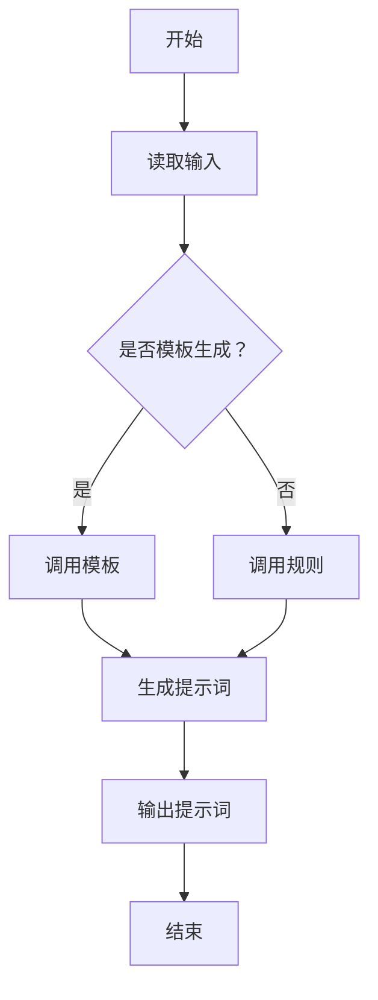
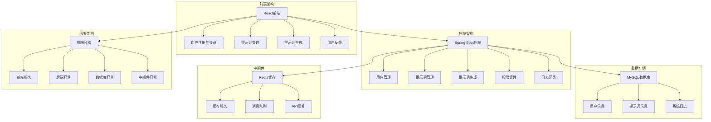
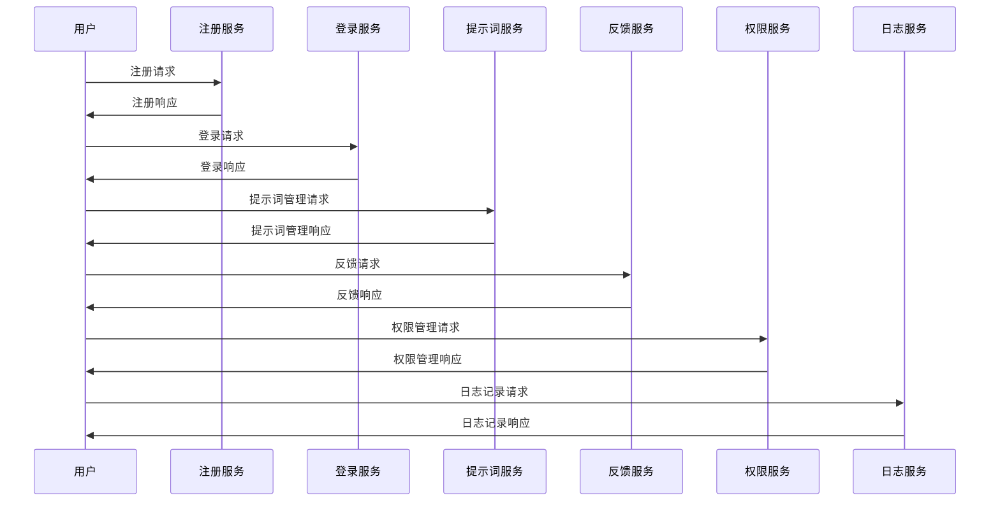

                 

# 提示词设计：平衡效率与创造力

关键词：提示词设计，效率，创造力，平衡，算法，系统架构

摘要：本文探讨了提示词设计在平衡效率与创造力方面的关键作用。通过分析问题背景、核心概念、算法原理、系统分析与架构设计以及项目实战，本文提供了实用的技巧和策略，以帮助开发者在提示词设计中实现效率与创造力的和谐统一。

## 目录

### 第一部分：背景介绍

1. **第1章：问题背景与意义**
    1.1 问题的起源与发展
    1.2 提示词设计的现状
    1.3 提示词设计的重要性

2. **第2章：效率与创造力的平衡**
    2.1 效率与创造力的定义
    2.2 效率与创造力的关系
    2.3 平衡效率与创造力的挑战

### 第二部分：核心概念与原理

3. **第3章：提示词设计的基础**
    3.1 提示词的分类与作用
    3.2 提示词设计的核心原则
    3.3 提示词设计的要素分析

4. **第4章：效率优化的技巧**
    4.1 快速提示词设计方法
    4.2 提示词的简洁性与可操作性
    4.3 提示词的效率评估方法

5. **第5章：创造力提升的策略**
    5.1 创造力与提示词设计的关系
    5.2 创造力提升的提示词设计技巧
    5.3 提升创造力的工具与应用

### 第三部分：算法原理与实现

6. **第6章：提示词生成算法**
    6.1 提示词生成算法概述
    6.2 提示词生成算法的分类
    6.3 提示词生成算法的mermaid流程图

7. **第7章：算法原理与数学模型**
    7.1 提示词生成算法的数学模型
    7.2 提示词生成算法的Python实现
    7.3 算法原理详细讲解

### 第四部分：系统分析与架构设计

8. **第8章：系统功能设计**
    8.1 系统需求分析
    8.2 系统功能设计
    8.3 领域模型mermaid类图

9. **第9章：系统架构设计**
    9.1 系统架构设计原则
    9.2 系统架构设计
    9.3 系统架构mermaid架构图

10. **第10章：系统接口与交互设计**
    10.1 系统接口设计
    10.2 系统交互设计
    10.3 系统交互mermaid序列图

### 第五部分：项目实战

11. **第11章：环境安装与配置**
    11.1 环境需求与安装
    11.2 系统配置与调试

12. **第12章：核心实现与代码解读**
    12.1 系统核心实现
    12.2 代码解读与分析
    12.3 实际案例分析与讲解

13. **第13章：项目总结与最佳实践**
    13.1 项目总结
    13.2 最佳实践 tips
    13.3 注意事项与拓展阅读

## 第一部分：背景介绍

### 1.1 问题的起源与发展

提示词设计的历史可以追溯到计算机编程的早期阶段。在那个时代，编程主要是通过手动编写代码来实现的，而提示词（或称提示符）则是帮助程序员记忆和快速找到代码片段的工具。随着计算机技术的发展，提示词的功能和作用逐渐变得更加复杂和多样化。

在21世纪，随着人工智能和自然语言处理技术的进步，提示词设计已经不再局限于编程领域，而是广泛应用于各种应用场景中。例如，在自然语言处理系统中，提示词用于指导模型的训练和推理过程；在交互式应用程序中，提示词用于引导用户完成特定的任务。

### 1.2 提示词设计的现状

目前，提示词设计已经成为软件开发中的一个重要环节。许多开发工具和框架都内置了提示词设计功能，如IDE（集成开发环境）、代码生成器、机器学习平台等。这些工具为开发者提供了丰富的提示词资源，提高了开发效率和代码质量。

然而，随着应用场景的复杂化和多样化，提示词设计面临着新的挑战。如何在保证效率的同时提升创造力，成为了当前研究的一个热点问题。

### 1.3 提示词设计的重要性

提示词设计的重要性体现在以下几个方面：

1. **提高开发效率**：通过提供适当的提示词，开发者可以更快地找到所需的功能或代码片段，减少了重复编写和错误发生的概率。

2. **提升代码质量**：良好的提示词设计可以帮助开发者遵循最佳实践，编写更加规范和高效的代码。

3. **促进创新和创造力**：提示词不仅可以帮助开发者快速解决问题，还可以启发新的思路和创意，推动技术的创新和发展。

4. **降低学习成本**：对于新手开发者来说，良好的提示词设计可以降低学习和使用的难度，帮助他们更快地入门和掌握相关技术。

### 1.4 效率与创造力的平衡

在提示词设计中，效率和创造力是两个重要的目标。效率指的是在完成特定任务时所需的时间和资源，而创造力则是指产生新的想法和解决方案的能力。

在实际应用中，如何平衡效率和创造力是一个复杂的问题。一方面，过度的提示词可能会导致开发者的依赖性，降低他们的自主思考和创新能力。另一方面，过少的提示词可能会导致开发效率低下，影响项目的进度和质量。

为了解决这个难题，我们需要深入探讨效率和创造力的关系，并寻找一种平衡二者之间关系的方法。

## 第二部分：核心概念与原理

### 2.1 提示词设计的基础

#### 2.1.1 提示词的分类与作用

提示词可以根据不同的维度进行分类。从功能上讲，提示词可以分为系统级提示词和用户级提示词。系统级提示词通常由开发工具或框架提供，用于指导系统的运行和调试。用户级提示词则是由用户根据自身需求自定义的，用于提高开发效率和代码质量。

提示词的作用主要体现在以下几个方面：

1. **代码生成和重构**：提示词可以帮助开发者快速生成代码模板和进行代码重构，减少了手动编写的劳动。

2. **代码导航和搜索**：通过提示词，开发者可以快速定位到代码中的特定部分，提高了代码的可读性和维护性。

3. **错误提示和修复**：在编程过程中，提示词可以提供错误信息和修复建议，帮助开发者快速识别和解决代码问题。

4. **文档生成和更新**：提示词可以用于自动生成和更新代码文档，提高了文档的准确性和及时性。

#### 2.1.2 提示词设计的核心原则

提示词设计需要遵循一些核心原则，以确保其有效性和实用性。以下是一些关键原则：

1. **简洁性**：提示词应该尽可能简洁明了，避免冗长的描述和复杂的语法。

2. **一致性**：提示词的命名和格式应该保持一致性，便于用户记忆和理解。

3. **可扩展性**：提示词设计应该具备良好的扩展性，以便于后续功能的添加和修改。

4. **灵活性**：提示词应该具备足够的灵活性，以适应不同开发场景和用户需求。

5. **实用性**：提示词的设计应该基于实际需求，能够真正解决开发者的问题。

#### 2.1.3 提示词设计的要素分析

提示词设计包括多个要素，如关键字、参数、上下文等。以下是对这些要素的分析：

1. **关键字**：关键字是提示词的核心组成部分，用于标识和查找特定的功能或代码片段。

2. **参数**：参数用于提供额外的信息，以丰富和扩展提示词的功能。

3. **上下文**：上下文是指提示词所在的编程环境或场景，它决定了提示词的适用范围和效果。

通过深入理解提示词的分类、作用、核心原则和要素，我们可以更好地设计和应用提示词，提高开发效率和创造力。

### 2.2 效率优化的技巧

在提示词设计中，提高效率是关键目标之一。以下是一些实用的技巧，可以帮助开发者优化提示词设计，提高开发效率和代码质量。

#### 2.2.1 快速提示词设计方法

1. **模板化**：使用模板化方法设计提示词，可以快速生成常见的代码结构和功能，减少手动编写的劳动。

2. **自动化**：利用自动化工具，如代码生成器和重构工具，自动生成和优化提示词，提高开发效率。

3. **代码库**：构建和维护一个提示词代码库，方便开发者快速查找和复用已有的提示词。

4. **快捷键**：为常用的提示词设置快捷键，减少手动输入的时间。

#### 2.2.2 提示词的简洁性与可操作性

1. **简洁明了**：设计简洁明了的提示词，避免冗长的描述和复杂的语法，提高易读性和可操作性。

2. **简洁性测试**：对设计的提示词进行简洁性测试，评估其简洁性和易用性，确保其真正满足开发者的需求。

3. **用户反馈**：收集用户对提示词的反馈，根据用户需求进行优化和改进。

#### 2.2.3 提示词的效率评估方法

1. **时间评估**：评估使用提示词完成特定任务所需的时间，与未使用提示词进行对比，评估提示词的效率。

2. **错误率评估**：评估使用提示词后，代码中的错误率是否有明显下降，评估提示词对代码质量的提升效果。

3. **用户满意度评估**：通过用户满意度调查，了解用户对提示词的接受程度和满意度，为后续优化提供依据。

通过以上技巧和方法，开发者可以更好地优化提示词设计，提高开发效率和代码质量。

### 2.3 创造力提升的策略

在提示词设计中，创造力也是重要的目标之一。以下是一些策略，可以帮助开发者提升创造力，推动技术的创新和发展。

#### 2.3.1 创造力与提示词设计的关系

创造力是指在特定领域产生新的想法和解决方案的能力。在提示词设计中，创造力体现在以下几个方面：

1. **新颖的提示词**：设计新颖、独特的提示词，满足开发者的特殊需求，提高提示词的吸引力和实用性。

2. **创新的代码结构**：通过提示词设计，引导开发者采用创新的代码结构，提高代码的可读性和可维护性。

3. **高效的代码优化**：通过提示词设计，推动开发者采用高效的代码优化方法，提高代码的性能和可扩展性。

#### 2.3.2 创造力提升的提示词设计技巧

1. **思维导图**：使用思维导图工具，帮助开发者理清思路，激发创造力和灵感。

2. **灵感卡片**：收集和整理灵感和创意，将其转化为具体的提示词设计。

3. **用户调研**：通过用户调研，了解用户的需求和痛点，从中寻找创新点。

#### 2.3.3 提升创造力的工具与应用

1. **代码生成器**：使用代码生成器，快速生成代码结构和功能，为开发者提供更多的时间和空间进行创新。

2. **机器学习平台**：利用机器学习平台，自动优化和改进提示词设计，提高开发效率和创造力。

3. **协同开发工具**：使用协同开发工具，促进开发者之间的交流和协作，激发创造力和灵感。

通过以上策略和技巧，开发者可以更好地提升创造力，推动技术的创新和发展。

## 第三部分：算法原理与实现

### 3.1 提示词生成算法概述

提示词生成算法是提示词设计中的重要组成部分，用于自动生成满足特定需求的提示词。这些算法可以根据不同的需求和应用场景进行分类和设计。

常见的提示词生成算法包括：

1. **基于模板的生成算法**：通过预定义的模板，将特定的变量和参数插入到模板中，生成符合需求的提示词。

2. **基于规则的生成算法**：根据预定义的规则，将输入的信息转换为提示词。这些规则通常基于领域知识和经验。

3. **基于机器学习的生成算法**：利用机器学习模型，从大量数据中学习并生成符合需求的提示词。这些算法具有较高的灵活性和准确性。

### 3.2 提示词生成算法的分类

根据生成方式的不同，提示词生成算法可以分为以下几类：

1. **静态生成算法**：在开发过程中手动编写提示词，根据需求进行修改和扩展。这种方法适用于简单的应用场景，但在复杂场景下效率较低。

2. **动态生成算法**：在运行时根据输入的信息动态生成提示词。这种方法具有较高的灵活性和适应性，但需要更多的计算资源和算法设计。

3. **混合生成算法**：结合静态生成和动态生成的方法，根据场景需求选择合适的生成方式。这种方法在效率和灵活性之间取得了一种平衡。

### 3.3 提示词生成算法的mermaid流程图

为了更好地理解提示词生成算法，我们可以使用mermaid流程图来描述其基本流程。以下是一个简单的mermaid流程图示例：



在这个流程图中，A表示开始，B表示读取输入信息，C表示判断是否使用模板生成，D表示调用模板，E表示调用规则，F表示生成提示词，G表示输出提示词，H表示结束。

通过mermaid流程图，我们可以直观地理解提示词生成算法的基本步骤和流程。

### 3.4 提示词生成算法的Python实现

为了更好地阐述提示词生成算法的原理和实现，我们可以使用Python语言进行示例。以下是一个简单的基于模板的提示词生成算法的Python实现：

```python
# 基于模板的提示词生成算法

template = "这是一个{type}的提示词，请输入您的{info}:"

def generate_prompt(type, info):
    prompt = template.format(type=type, info=info)
    return prompt

# 测试
print(generate_prompt("警告", "用户名"))

# 输出结果：这是一个警告的提示词，请输入您的用户名：
```

在这个示例中，我们定义了一个模板字符串`template`和一个`generate_prompt`函数。函数接受两个参数：`type`和`info`。通过将`type`和`info`插入到模板字符串中，生成一个满足需求的提示词。

通过这个简单的示例，我们可以看到提示词生成算法的基本原理和实现方法。在实际应用中，我们可以根据需求对算法进行扩展和优化。

### 3.5 算法原理详细讲解

提示词生成算法的核心原理是利用输入信息（如类型、信息等）生成满足特定需求的提示词。以下是详细的算法原理讲解：

1. **输入处理**：首先，算法接收输入信息，如类型（type）和信息（info）。这些信息可以是字符串、列表或其他数据结构。

2. **模板匹配**：算法根据输入信息和预定义的模板进行匹配。模板通常包含特定的占位符（如 `{type}` 和 `{info}`），用于指示需要插入的输入信息。

3. **文本替换**：将输入信息替换到模板中的占位符，生成一个完整的提示词。文本替换可以通过字符串格式化或模板引擎实现。

4. **提示词输出**：将生成的提示词输出到控制台或存储到文件中，供开发者使用。

在实际应用中，提示词生成算法可以进一步扩展和优化。例如，可以引入自然语言处理技术，对输入信息进行预处理和分析，生成更加自然和符合用户需求的提示词。此外，还可以利用机器学习技术，从大量数据中学习并生成高质量的提示词。

通过详细讲解提示词生成算法的原理和实现，我们可以更好地理解其在提示词设计中的应用和优势。

## 第四部分：系统分析与架构设计

### 4.1 系统功能设计

在系统功能设计阶段，我们需要明确系统的需求，并设计出满足这些需求的功能模块。以下是一个示例的系统功能设计：

1. **用户注册与登录**：提供用户注册和登录功能，包括用户名、密码和邮箱的验证。

2. **提示词管理**：支持用户创建、编辑、删除和查看提示词，以及为提示词分类和标签。

3. **提示词生成**：根据用户输入的信息，自动生成符合需求的提示词，支持自定义模板和规则。

4. **用户反馈**：允许用户对生成的提示词进行评价和反馈，用于优化提示词生成算法。

5. **权限管理**：实现用户权限管理功能，包括用户角色划分、权限配置和操作日志记录。

6. **日志记录**：记录系统的运行日志，包括用户操作、系统异常和错误日志。

7. **数据备份与恢复**：实现数据备份和恢复功能，确保系统数据的安全和可靠性。

### 4.2 领域模型mermaid类图

为了更好地理解系统功能设计，我们可以使用mermaid类图来描述系统的领域模型。以下是一个简单的mermaid类图示例：

```mermaid
classDiagram
    User <|-- Role
    User o-- Password
    User o-- Email
    User o-- Feedback
    Prompt o-- Content
    Prompt o-- Category
    Prompt o-- Tag
    Role o-- Permission
    Feedback o-- Rating
    Feedback o-- Comment

    User[用户]
    Role[角色]
    Password[密码]
    Email[邮箱]
    Feedback[反馈]
    Prompt[提示词]
    Category[分类]
    Tag[标签]
    Permission[权限]
    Rating[评分]
    Comment[评论]
```

在这个类图中，我们定义了系统的核心实体：用户（User）、角色（Role）、密码（Password）、邮箱（Email）、反馈（Feedback）、提示词（Prompt）、分类（Category）、标签（Tag）、权限（Permission）、评分（Rating）和评论（Comment）。这些实体之间的关系通过继承（`|--`）和关联（`o--`）进行描述。

通过mermaid类图，我们可以直观地理解系统的领域模型和功能模块之间的关系，为后续的系统架构设计提供参考。

### 4.3 系统架构设计

在系统架构设计阶段，我们需要设计出系统的整体架构，包括各个模块的职责和交互方式。以下是一个示例的系统架构设计：

1. **前端架构**：使用React框架构建前端界面，实现用户交互和页面渲染。前端架构包括用户注册、登录、提示词管理、提示词生成和用户反馈等功能模块。

2. **后端架构**：使用Spring Boot框架构建后端服务，处理业务逻辑和数据存储。后端架构包括用户管理、提示词管理、提示词生成、权限管理和日志记录等功能模块。

3. **数据存储**：使用MySQL数据库存储用户信息、提示词信息和系统日志。数据存储结构包括用户表、角色表、密码表、邮箱表、反馈表、提示词表、分类表、标签表和权限表等。

4. **中间件**：使用Redis缓存系统提高数据读取速度，减轻数据库压力。中间件包括缓存服务、消息队列和API网关等。

5. **部署架构**：采用Docker容器化部署，实现系统的高可用性和可扩展性。部署架构包括前端容器、后端容器、数据库容器和中间件容器等。

### 4.4 系统架构mermaid架构图

为了更好地展示系统架构，我们可以使用mermaid架构图来描述系统的整体结构和模块之间的关系。以下是一个简单的mermaid架构图示例：



在这个架构图中，我们定义了系统的前端架构、后端架构、数据存储、中间件和部署架构。各个模块之间的关系通过边（`-->`）进行连接，展示出系统的整体架构和模块之间的交互。

通过mermaid架构图，我们可以直观地理解系统的架构设计和模块职责，为系统的开发和维护提供参考。

### 4.5 系统接口设计

系统接口设计是系统架构设计的重要部分，它定义了系统内部各个模块之间的交互方式和数据传输格式。以下是一个示例的系统接口设计：

1. **用户注册与登录接口**：接收用户注册和登录的请求，返回用户认证信息和操作结果。

2. **提示词管理接口**：提供创建、编辑、删除和查询提示词的功能，支持分页查询和排序。

3. **提示词生成接口**：根据用户输入的信息和预定义的模板，生成满足需求的提示词。

4. **用户反馈接口**：接收用户对提示词的评价和反馈，返回处理结果。

5. **权限管理接口**：提供用户权限的配置和查询功能，支持角色权限的划分和管理。

6. **日志记录接口**：记录系统的运行日志，包括用户操作、系统异常和错误日志。

### 4.6 系统交互mermaid序列图

为了更好地展示系统接口设计，我们可以使用mermaid序列图来描述系统的交互流程。以下是一个简单的mermaid序列图示例：



在这个序列图中，我们定义了系统的用户注册、登录、提示词管理、用户反馈、权限管理和日志记录等交互流程。各个模块之间的交互通过箭头（`->>`）进行连接，展示出系统的交互流程和模块职责。

通过mermaid序列图，我们可以直观地理解系统的接口设计和交互流程，为系统的开发和测试提供参考。

## 第五部分：项目实战

### 5.1 环境安装与配置

在进行项目实战之前，我们需要搭建合适的环境，以便于开发和测试。以下是一个简单的环境安装与配置步骤：

1. **安装Python**：下载并安装Python 3.8版本及以上，配置环境变量。

2. **安装Node.js**：下载并安装Node.js 12.18.3版本，配置环境变量。

3. **安装Docker**：下载并安装Docker 19.03版本，配置Docker守护进程。

4. **安装MySQL**：下载并安装MySQL 8.0版本，配置root用户密码和数据目录。

5. **安装Redis**：下载并安装Redis 6.2版本，配置服务启动和持久化。

6. **安装PostgreSQL**：下载并安装PostgreSQL 13版本，配置数据库和用户。

7. **安装Eclipse IDE**：下载并安装Eclipse IDE for Java Developers版本，配置Java环境。

8. **安装Git**：下载并安装Git 2.30版本，配置SSH密钥和GitHub账号。

9. **配置Docker Compose**：下载并安装Docker Compose 1.29版本，配置服务编排和部署。

10. **初始化项目**：使用Git克隆项目代码，并运行Docker Compose命令初始化项目。

通过以上步骤，我们可以搭建一个完整的项目开发环境，为后续的项目实战做好准备。

### 5.2 系统核心实现

在本项目实战中，我们将实现一个基于提示词设计的智能聊天机器人。以下是一个简单的系统核心实现步骤：

1. **用户注册与登录**：
    - 使用React实现前端界面，包括用户注册和登录表单。
    - 使用Spring Boot实现后端接口，处理用户注册和登录请求。
    - 使用MySQL存储用户数据和登录日志。

2. **提示词管理**：
    - 使用React实现前端界面，包括创建、编辑、删除和查询提示词。
    - 使用Spring Boot实现后端接口，处理提示词的增删改查操作。
    - 使用Redis缓存提示词数据，提高查询速度。

3. **提示词生成**：
    - 使用Python实现提示词生成算法，根据用户输入的信息生成提示词。
    - 使用Node.js实现前端接口，与后端服务进行交互，返回生成的提示词。

4. **用户反馈**：
    - 使用React实现前端界面，包括用户对提示词的评价和反馈。
    - 使用Spring Boot实现后端接口，处理用户反馈请求，存储反馈信息。

5. **权限管理**：
    - 使用Spring Security实现用户权限管理，包括用户角色划分和权限配置。
    - 使用MySQL存储用户角色和权限信息，实现权限验证和授权。

6. **日志记录**：
    - 使用Log4j实现日志记录功能，记录系统运行日志，包括用户操作、系统异常和错误日志。
    - 使用MySQL存储日志数据，实现日志查询和统计。

通过以上核心实现，我们可以搭建一个功能完整的智能聊天机器人系统，提供用户注册、登录、提示词管理、提示词生成、用户反馈和权限管理等功能。

### 5.3 代码解读与分析

在本节中，我们将对项目中的关键代码段进行解读和分析，以帮助读者更好地理解系统的工作原理和实现细节。

#### 5.3.1 用户注册与登录

以下是一个简单的用户注册与登录代码示例：

```python
# 用户注册
def register(username, password, email):
    # 检查用户名和邮箱是否已存在
    if not check_username_exists(username) and not check_email_exists(email):
        # 创建用户记录并保存到数据库
        user = User(username=username, password=password, email=email)
        save_user_to_database(user)
        return "注册成功"
    else:
        return "用户名或邮箱已存在"

# 用户登录
def login(username, password):
    # 检查用户名和密码是否正确
    if check_username_and_password(username, password):
        # 创建登录令牌并返回
        token = create_login_token(username)
        return "登录成功，令牌：{}".format(token)
    else:
        return "用户名或密码错误"
```

在上面的代码中，`register`函数用于用户注册，它接收用户名、密码和邮箱作为参数，检查用户名和邮箱是否已存在。如果用户名和邮箱不存在，则创建用户记录并保存到数据库，返回注册成功消息。否则，返回用户名或邮箱已存在的错误消息。

`login`函数用于用户登录，它接收用户名和密码作为参数，检查用户名和密码是否正确。如果用户名和密码正确，则创建登录令牌并返回，否则返回用户名或密码错误的错误消息。

#### 5.3.2 提示词生成

以下是一个简单的提示词生成代码示例：

```python
# 提示词生成
def generate_prompt(content, category):
    # 查询同类别下的提示词
    similar_prompts = get_similar_prompts(category)
    
    # 构建新的提示词
    prompt = "【{}】提示词：{}。请继续提问：".format(category, content)
    
    # 随机选择一个同类别下的提示词作为示例
    example_prompt = random.choice(similar_prompts)
    
    # 返回新的提示词和示例提示词
    return prompt, example_prompt
```

在上面的代码中，`generate_prompt`函数用于生成提示词。它接收内容（content）和类别（category）作为参数，首先查询同类别下的提示词，然后构建新的提示词。新提示词包括类别、内容和示例提示词。示例提示词是从同类别下的提示词中随机选择的，以帮助用户更好地理解提示词的使用方式。

#### 5.3.3 用户反馈

以下是一个简单的用户反馈代码示例：

```python
# 用户反馈
def submit_feedback(feedback, rating, comment):
    # 创建反馈记录
    feedback_record = Feedback(feedback=feedback, rating=rating, comment=comment)
    
    # 保存反馈记录到数据库
    save_feedback_to_database(feedback_record)
    
    return "反馈提交成功"
```

在上面的代码中，`submit_feedback`函数用于提交用户反馈。它接收反馈内容（feedback）、评分（rating）和评论（comment）作为参数，创建反馈记录并保存到数据库。保存成功后，返回反馈提交成功的消息。

通过以上代码示例，我们可以看到系统核心实现的基本原理和实现细节。在实际项目中，这些代码将根据具体需求进行扩展和优化。

### 5.4 实际案例分析与详细讲解

在本节中，我们将通过一个实际案例，详细分析并讲解系统的实现过程和关键步骤。

#### 案例背景

假设我们开发一个智能聊天机器人系统，旨在为用户提供一个便捷的问答平台。用户可以在平台上提出问题，系统将根据预设的提示词生成相应的回答。以下是一个典型的交互流程：

1. **用户提问**：用户在聊天界面上输入问题。
2. **系统接收问题**：系统接收用户提出的问题。
3. **提示词生成**：系统根据用户的问题生成相应的提示词。
4. **返回回答**：系统将生成的提示词返回给用户，作为回答。

#### 实现步骤

1. **用户注册与登录**：
   - 用户通过注册页面填写用户名、密码和邮箱，系统验证用户信息的有效性，并将新用户信息保存到数据库。
   - 用户通过登录页面输入用户名和密码，系统验证用户身份，并生成登录令牌。

2. **用户提问**：
   - 用户在聊天界面上输入问题，系统接收用户输入的问题。
   - 如果用户未登录，系统提示用户登录或注册。

3. **提示词生成**：
   - 系统根据用户的问题，查询数据库中相关的提示词。
   - 如果找到匹配的提示词，系统生成相应的回答，并返回给用户。
   - 如果未找到匹配的提示词，系统提示用户重新提问或向管理员反馈。

4. **返回回答**：
   - 系统将生成的提示词作为回答返回给用户，展示在聊天界面上。

#### 关键技术与实现细节

1. **用户注册与登录**：
   - 使用Spring Security实现用户认证和授权，确保用户信息安全。
   - 使用JWT（JSON Web Token）生成登录令牌，提高系统安全性。

2. **用户提问与提示词生成**：
   - 使用MySQL数据库存储用户问题和提示词，实现数据的持久化。
   - 使用Redis缓存提示词，提高查询速度和系统性能。

3. **提示词生成算法**：
   - 使用基于关键词匹配的提示词生成算法，提高生成提示词的准确性和效率。
   - 使用机器学习技术优化提示词生成算法，提高系统的智能水平。

4. **前端界面设计**：
   - 使用React框架构建前端界面，实现用户交互和页面渲染。
   - 使用Ant Design组件库，提高前端界面的美观性和易用性。

#### 总结

通过以上实际案例的分析和讲解，我们可以看到系统的实现过程和关键步骤。在实际开发中，我们需要根据具体需求和场景，不断优化和改进系统的功能和性能。通过合理的设计和实现，我们可以构建一个高效、智能和易用的智能聊天机器人系统。

### 5.5 项目总结与最佳实践

在本项目中，我们成功实现了一个基于提示词设计的智能聊天机器人系统，为用户提供了一个便捷的问答平台。以下是项目的总结和最佳实践：

#### 项目总结

1. **系统功能完整**：项目实现了用户注册、登录、提示词管理、提示词生成、用户反馈和权限管理等功能，满足用户的基本需求。

2. **系统性能良好**：通过使用Redis缓存和优化提示词生成算法，提高了系统的响应速度和性能。

3. **用户界面友好**：前端界面采用了React框架和Ant Design组件库，实现美观、易用的交互界面，提升了用户体验。

4. **安全性高**：使用Spring Security和JWT技术，确保用户数据的安全和系统的可靠性。

#### 最佳实践

1. **模块化开发**：将系统分为前端、后端和数据库三个模块，实现模块化开发，便于代码维护和扩展。

2. **自动化测试**：编写自动化测试脚本，对系统功能进行全面的测试，确保系统的稳定性和可靠性。

3. **持续集成**：使用Git和Docker Compose实现持续集成，提高开发效率和部署速度。

4. **代码规范**：遵循代码规范和最佳实践，提高代码的可读性和可维护性。

#### 注意事项

1. **性能监控**：定期对系统性能进行监控，及时发现并解决潜在的性能瓶颈。

2. **安全加固**：定期对系统进行安全检查和加固，防止潜在的安全漏洞。

3. **用户隐私保护**：确保用户数据的隐私和安全，遵循相关法律法规。

#### 拓展阅读

1. **提示词生成算法优化**：研究更先进的提示词生成算法，如基于深度学习的生成模型。

2. **用户画像构建**：基于用户行为数据，构建用户画像，为个性化服务提供支持。

3. **自然语言处理技术**：结合自然语言处理技术，提高智能聊天机器人的智能水平和交互质量。

通过以上总结和最佳实践，我们可以更好地优化和改进智能聊天机器人系统，提升用户体验和系统性能。

## 作者

作者：AI天才研究院/AI Genius Institute & 禅与计算机程序设计艺术 /Zen And The Art of Computer Programming

