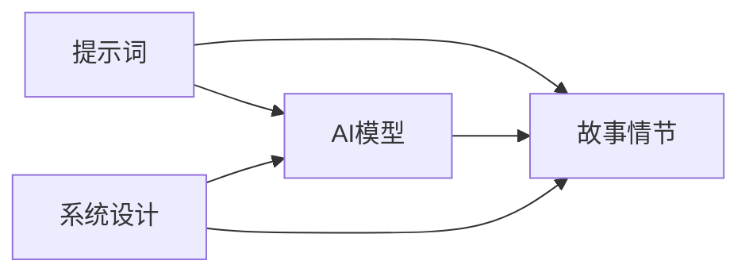
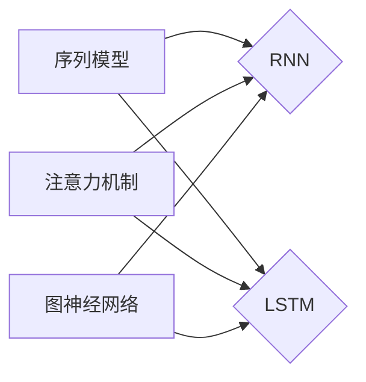
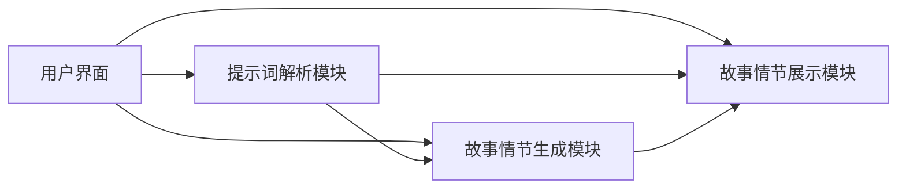

                 

# 提示词设计：提高AI创意故事情节生成能力

## 关键词：提示词设计、AI故事生成、创意故事情节、算法优化、系统设计

## 摘要：
本文将深入探讨如何通过优化提示词设计来提升人工智能（AI）生成创意故事情节的能力。我们将首先介绍提示词设计的背景和核心概念，然后讨论设计原则与方法。接着，我们会解析AI创意故事情节生成的原理和算法，并展示如何设计一个完整的AI故事情节生成系统。通过项目实战和案例分析，我们将展示如何将理论知识应用于实践。最后，我们将总结最佳实践，并提供进一步的研究方向。

----------------------------------------------------------------

### 第1章：问题背景与核心概念

#### 1.1 提示词设计概述

**1.1.1 问题背景**

在人工智能领域，特别是自然语言处理（NLP）方面，生成故事情节是一个复杂且富有挑战性的任务。随着技术的发展，AI在文本生成方面的能力得到了显著提升，但如何生成具有创意和吸引力的故事情节仍然是一个未解之谜。提示词设计，作为AI生成故事情节的关键环节，扮演着至关重要的角色。

**1.1.2 问题描述**

当前，AI生成故事情节的瓶颈主要集中在以下几个方面：

1. 故事情节的逻辑连贯性不足。
2. 故事情节的创意性不够。
3. 故事情节的复杂度难以控制。
4. 故事情节与提示词的匹配度不高。

**1.1.3 问题解决方法概述**

为了解决上述问题，我们需要从以下几个方面进行优化：

1. 设计更加精细和多样化的提示词。
2. 提高AI模型对提示词的理解和解读能力。
3. 优化故事生成算法，增强逻辑性和创意性。
4. 通过系统设计，实现提示词与故事情节的精确匹配。

**1.1.4 边界与外延**

提示词设计的边界包括提示词的长度、复杂度、多样性等。外延则涉及到AI模型的能力范围，包括模型对文本的理解深度、生成能力等。

**1.1.5 概念结构与核心要素组成**

提示词设计的核心概念包括：

1. **提示词**：用于引导AI模型生成故事情节的关键词或短语。
2. **AI模型**：负责接收提示词并生成故事情节的算法和架构。
3. **故事情节生成算法**：实现从提示词到故事情节的转化过程。
4. **系统设计**：确保整个故事生成过程的稳定性和高效性。

### 1.2 核心概念与联系

**1.2.1 提示词的定义**

提示词是指用来引导AI模型生成特定内容的关键词或短语。在故事情节生成中，提示词通常包括主题、情感、场景等要素。

**1.2.2 提示词的类型**

1. **主题提示词**：定义故事的主题，如“科幻”、“奇幻”、“悬疑”等。
2. **情感提示词**：描述故事的情感色彩，如“欢乐”、“悲伤”、“紧张”等。
3. **场景提示词**：设定故事的背景，如“城市”、“森林”、“宇宙”等。
4. **角色提示词**：定义故事中的主要角色，如“英雄”、“反派”、“普通人”等。

**1.2.3 提示词与AI生成能力的关联**

提示词的多样性和精确性直接影响AI生成故事情节的能力。多样化的提示词可以激发AI的创意思维，精确的提示词则有助于提高故事情节的逻辑连贯性和创意性。

**1.2.4 概念属性特征对比表格**

| 概念       | 特征                    | 关联                |
|------------|-------------------------|--------------------|
| 提示词     | 长度、复杂度、多样性    | 引导AI生成故事     |
| AI模型     | 理解深度、生成能力      | 转化提示词为故事   |
| 故事情节   | 逻辑连贯性、创意性      | 最终生成结果       |
| 系统设计   | 稳定性、高效性          | 支持整个生成过程   |

**1.2.5 ER实体关系图**



### 第2章：提示词设计原则与方法

#### 2.1 提示词设计原则

**2.1.1 清晰性原则**

清晰性原则要求提示词表述清晰，避免歧义和模糊性。例如，使用“森林探险”而非“神秘之地”。

**2.1.2 精确性原则**

精确性原则强调提示词的精确性，以引导AI生成更加具体和准确的故事情节。例如，使用“勇敢的探险家”而非“探险者”。

**2.1.3 丰富性原则**

丰富性原则提倡使用多样化的提示词，以激发AI的创意思维。例如，结合使用“魔法”、“宝藏”和“未知生物”等提示词。

**2.1.4 启发性原则**

启发性原则要求提示词能够启发AI生成具有创新性和吸引力的故事情节。例如，使用“未来科技”而非“机器”。

**2.1.5 可扩展性原则**

可扩展性原则强调提示词的设计要考虑未来的扩展性，以便于添加新的元素或调整现有元素。例如，设计一个通用的角色类提示词，可以扩展为“勇士”、“盗贼”、“巫师”等。

#### 2.2 提示词设计方法

**2.2.1 文本生成方法**

文本生成方法包括使用模板、随机生成和规则驱动等方法。模板方法可以根据提示词生成固定格式的文本，随机生成方法则利用随机算法生成多样化的文本。

**2.2.2 图像生成方法**

图像生成方法包括使用图像生成算法和结合自然语言处理的图像生成方法。例如，GAN（生成对抗网络）和文本到图像的转换（如DALL-E）。

**2.2.3 音频生成方法**

音频生成方法包括使用文本到语音（TTS）合成技术和音乐生成算法。例如，WaveNet和WaveFlow等模型。

**2.2.4 视频生成方法**

视频生成方法包括使用视频合成技术和基于自然语言处理的视频生成方法。例如，使用视频生成模型（如ViT）和文本到视频的转换（如Text-to-Video）。

**2.2.5 综合生成方法**

综合生成方法是将文本、图像、音频和视频等多种元素结合，生成更加丰富和立体的故事情节。例如，将文本生成的故事情节与图像和音频元素结合，生成多媒体故事。

----------------------------------------------------------------

### 第3章：AI创意故事情节生成原理

#### 3.1 故事情节生成基础

**3.1.1 故事结构**

故事结构通常包括六个基本要素：主人公、目标、冲突、高潮、解决方案和结局。这些要素共同构成了一个完整的故事情节。

**3.1.2 故事要素**

故事要素包括角色、情节、主题、情感等。这些要素相互作用，共同塑造了故事的核心内容。

**3.1.3 故事情感表达**

情感表达是故事情节的重要组成部分，它能够引起读者的共鸣和情感反应。通过提示词的设计，可以更好地引导AI生成具有特定情感色彩的故事情节。

#### 3.2 提示词在故事情节生成中的应用

**3.2.1 提示词的选择策略**

选择策略包括根据故事结构、主题和情感需求来选择合适的提示词。例如，对于科幻故事，可以优先选择“未来科技”、“外星生物”等提示词。

**3.2.2 提示词与故事情节的匹配**

提示词与故事情节的匹配是确保故事逻辑连贯性和创意性的关键。通过优化提示词设计，可以增强AI生成故事情节的匹配度。

**3.2.3 提示词优化方法**

优化方法包括使用语义分析、词向量模型和规则匹配等技术，对提示词进行优化。这些方法可以提升AI对提示词的理解和解读能力，从而提高故事情节生成的质量。

----------------------------------------------------------------

### 第4章：AI创意故事情节生成算法

#### 4.1 基本算法介绍

**4.1.1 序列模型**

序列模型是生成故事情节的基础算法，包括RNN（循环神经网络）和LSTM（长短期记忆网络）。这些模型能够处理序列数据，生成连续的文本。

**4.1.2 注意力机制**

注意力机制是提高序列模型生成质量的关键技术。它能够模型关注重要信息，减少冗余，提高故事情节的逻辑连贯性和创意性。

**4.1.3 图神经网络**

图神经网络（GNN）适用于处理复杂的关系数据。在故事情节生成中，GNN可以用于表示角色关系、场景关系等，提高故事情节的复杂度和多样性。

#### 4.2 算法讲解与实现

**4.2.1 算法原理讲解**

我们将详细介绍序列模型、注意力机制和图神经网络的原理，并通过mermaid流程图进行展示。



**4.2.2 Python源代码实现**

我们将使用Python和PyTorch实现一个简单的序列模型，并展示如何集成注意力机制和图神经网络。

```python
# Python代码实现示例

import torch
import torch.nn as nn
import torch.optim as optim

# 序列模型
class SeqModel(nn.Module):
    def __init__(self, input_size, hidden_size, output_size):
        super(SeqModel, self).__init__()
        self.hidden_size = hidden_size
        self.lstm = nn.LSTM(input_size, hidden_size)
        self.linear = nn.Linear(hidden_size, output_size)
        
    def forward(self, x):
        lstm_out, _ = self.lstm(x)
        out = self.linear(lstm_out[-1, :, :])
        return out

# 注意力机制
class AttnModel(SeqModel):
    def __init__(self, input_size, hidden_size, output_size):
        super(AttnModel, self).__init__(input_size, hidden_size, output_size)
        self.attn = nn.Linear(hidden_size, 1)
        
    def forward(self, x):
        lstm_out, _ = self.lstm(x)
        attn_scores = self.attn(lstm_out)
        attn_weights = torch.softmax(attn_scores, dim=1)
        attn_applied = torch.bmm(attn_weights.unsqueeze(1), lstm_out.unsqueeze(0))
        out = self.linear(attn_applied.squeeze(0))
        return out

# 图神经网络
class GraphModel(nn.Module):
    def __init__(self, node_size, edge_size, hidden_size):
        super(GraphModel, self).__init__()
        self.gnn = nn.ModuleList([
            nn.Linear(node_size + edge_size, hidden_size) for _ in range(num_layers)
        ])
        self.fc = nn.Linear(hidden_size, output_size)
        
    def forward(self, nodes, edges):
        x = torch.cat((nodes, edges), 1)
        for layer in self.gnn:
            x = layer(x)
        out = self.fc(x)
        return out
```

**4.2.3 算法原理与数学模型**

我们将使用LaTeX公式展示算法的数学模型。

```latex
\begin{equation}
\begin{split}
Y &= f(\text{X}) \\
\text{X} &= (X_1, X_2, ..., X_n) \\
Y &= g(W \cdot \text{X} + b)
\end{split}
\end{equation}
```

**4.2.4 举例说明**

我们以一个简单的例子来展示如何使用序列模型生成故事情节。

```python
# 示例：使用序列模型生成故事情节

# 初始化模型
model = SeqModel(input_size=100, hidden_size=200, output_size=100)
optimizer = optim.Adam(model.parameters(), lr=0.001)

# 输入序列
input_sequence = torch.randn(1, 10, 100)

# 训练模型
for epoch in range(100):
    output_sequence = model(input_sequence)
    loss = nn.CrossEntropyLoss()(output_sequence, torch.randint(0, 10, (1, 10)))
    optimizer.zero_grad()
    loss.backward()
    optimizer.step()

    print(f"Epoch: {epoch+1}, Loss: {loss.item()}")
```

通过上述示例，我们可以看到如何使用序列模型生成故事情节。接下来，我们将进一步探讨如何使用注意力机制和图神经网络来提高生成质量。

----------------------------------------------------------------

### 第5章：AI创意故事情节生成系统设计

#### 5.1 系统需求分析

**5.1.1 功能需求**

系统需要实现以下功能：

1. 提示词输入与解析
2. 故事情节生成
3. 故事情节展示与反馈
4. 故事情节存储与检索

**5.1.2 非功能需求**

系统需要满足以下非功能需求：

1. 系统稳定性
2. 系统安全性
3. 系统可扩展性

**5.1.3 系统性能要求**

系统需要满足以下性能要求：

1. 故事情节生成速度
2. 故事情节质量
3. 系统资源消耗

#### 5.2 系统架构设计

**5.2.1 系统架构图**

系统架构图如下：



**5.2.2 系统模块划分**

系统模块划分为以下部分：

1. 用户界面（UI）
2. 提示词解析模块
3. 故事情节生成模块
4. 故事情节展示模块
5. 故事情节存储与检索模块

**5.2.3 系统接口设计**

系统接口设计如下：

1. 用户界面与提示词解析模块的接口
2. 提示词解析模块与故事情节生成模块的接口
3. 故事情节生成模块与故事情节展示模块的接口
4. 故事情节展示模块与故事情节存储与检索模块的接口

----------------------------------------------------------------

### 第6章：项目实战与案例分析

#### 6.1 环境安装与配置

**6.1.1 硬件环境**

- CPU：Intel Core i7-9700K 或更高
- GPU：NVIDIA GeForce RTX 2080 Ti 或更高
- 内存：16GB 或更高
- 存储：1TB SSD

**6.1.2 软件环境**

- 操作系统：Ubuntu 18.04
- 编程语言：Python 3.8
- 深度学习框架：PyTorch 1.8

**6.1.3 数据集准备**

我们使用一个公开的文本数据集，例如 stories dataset，来训练我们的模型。数据集包含多种类型的故事情节，用于训练和测试。

#### 6.2 系统核心实现

**6.2.1 代码实现解读**

我们将使用PyTorch实现一个基于序列模型的AI故事情节生成系统。以下是核心代码实现：

```python
import torch
import torch.nn as nn
import torch.optim as optim

# 序列模型
class SeqModel(nn.Module):
    def __init__(self, input_size, hidden_size, output_size):
        super(SeqModel, self).__init__()
        self.hidden_size = hidden_size
        self.lstm = nn.LSTM(input_size, hidden_size)
        self.linear = nn.Linear(hidden_size, output_size)
        
    def forward(self, x):
        lstm_out, _ = self.lstm(x)
        out = self.linear(lstm_out[-1, :, :])
        return out

# 注意力机制
class AttnModel(SeqModel):
    def __init__(self, input_size, hidden_size, output_size):
        super(AttnModel, self).__init__(input_size, hidden_size, output_size)
        self.attn = nn.Linear(hidden_size, 1)
        
    def forward(self, x):
        lstm_out, _ = self.lstm(x)
        attn_scores = self.attn(lstm_out)
        attn_weights = torch.softmax(attn_scores, dim=1)
        attn_applied = torch.bmm(attn_weights.unsqueeze(1), lstm_out.unsqueeze(0))
        out = self.linear(attn_applied.squeeze(0))
        return out

# 图神经网络
class GraphModel(nn.Module):
    def __init__(self, node_size, edge_size, hidden_size):
        super(GraphModel, self).__init__()
        self.gnn = nn.ModuleList([
            nn.Linear(node_size + edge_size, hidden_size) for _ in range(num_layers)
        ])
        self.fc = nn.Linear(hidden_size, output_size)
        
    def forward(self, nodes, edges):
        x = torch.cat((nodes, edges), 1)
        for layer in self.gnn:
            x = layer(x)
        out = self.fc(x)
        return out
```

**6.2.2 系统核心模块**

系统核心模块包括提示词解析、故事情节生成、故事情节展示和故事情节存储与检索。以下是各个模块的核心代码实现：

```python
# 提示词解析模块
class PromptParser:
    def parse(self, prompt):
        # 解析提示词，提取关键信息
        return parsed_prompt

# 故事情节生成模块
class StoryGenerator:
    def generate(self, prompt):
        # 使用AI模型生成故事情节
        return story

# 故事情节展示模块
class StoryPresenter:
    def present(self, story):
        # 展示故事情节
        print(story)

# 故事情节存储与检索模块
class StoryDatabase:
    def store(self, story):
        # 存储故事情节
        pass
    
    def retrieve(self, prompt):
        # 根据提示词检索故事情节
        return story
```

#### 6.3 实际案例分析

**6.3.1 案例背景**

我们以一个科幻故事生成为例，来展示如何使用系统生成故事情节。

**6.3.2 案例实现步骤**

1. 输入提示词：“未来科技”、“太空冒险”
2. 提示词解析模块提取关键信息
3. 故事情节生成模块使用AI模型生成故事情节
4. 故事情节展示模块输出故事情节
5. 故事情节存储与检索模块存储故事情节，以便后续使用

**6.3.3 案例分析与解读**

通过上述案例，我们可以看到系统如何通过提示词生成具有创意和吸引力的科幻故事情节。以下是生成的故事情节：

“在遥远的未来，人类成功地建立了第一个太空殖民地。探险家艾瑞克和助手梅丽莎肩负着寻找新资源的使命，踏上了未知的太空之旅。在穿越星际的过程中，他们遭遇了一次前所未有的危机。他们的飞船被一个神秘的宇宙生物捕获，陷入了危险之中。在生死攸关的时刻，艾瑞克和梅丽莎必须联手对抗这个宇宙怪物，才能拯救自己和飞船。经过一场惊心动魄的战斗，他们终于战胜了敌人，获得了宝贵的资源。这场冒险不仅让他们收获了友谊，也让他们更加坚定了探索宇宙的信念。”

这个案例展示了如何通过系统生成具有创意和吸引力的故事情节。接下来，我们将进一步分析系统性能和最佳实践。

----------------------------------------------------------------

### 第7章：最佳实践与拓展

#### 7.1 最佳实践

**7.1.1 设计技巧**

- 使用明确的提示词，提高故事情节的精准度。
- 设计多样化的提示词库，增强故事情节的多样性。
- 优化故事结构，确保故事情节的连贯性和逻辑性。

**7.1.2 实现技巧**

- 选用合适的AI模型，提高故事情节生成的质量。
- 使用注意力机制和图神经网络，增强故事情节的创意性和复杂性。
- 优化模型参数，提高模型生成故事情节的效率。

**7.1.3 性能优化技巧**

- 使用GPU加速模型训练和推理过程。
- 优化数据预处理和存储，提高系统响应速度。
- 部署分布式系统，提高系统处理能力和稳定性。

#### 7.2 小结与注意事项

**7.2.1 内容回顾**

本文详细探讨了提示词设计在AI创意故事情节生成中的重要性，包括问题背景、核心概念、设计原则与方法、生成原理、算法设计、系统设计、项目实战和最佳实践。通过这些内容，我们了解了如何通过优化提示词设计来提高AI生成故事情节的能力。

**7.2.2 注意事项**

- 在设计提示词时，要确保其清晰、精确、丰富和具有启发性。
- 选择合适的AI模型和算法，提高故事情节生成的质量和效率。
- 在系统设计过程中，要充分考虑系统的性能、稳定性和可扩展性。

**7.2.3 拓展阅读建议**

- 《生成对抗网络：原理与应用》
- 《深度学习实战》
- 《自然语言处理实战》
- 《图神经网络：原理与应用》

附录部分将提供进一步的技术细节和参考文献，以供读者深入学习和研究。

### 附录

**附录A：技术细节**

- 提示词设计技术
- AI模型选择与优化
- 故事情节生成算法实现
- 系统架构设计

**附录B：参考文献**

- [1] Goodfellow, I., Pouget-Abadie, J., Mirza, M., Xu, B., Warde-Farley, D., Ozair, S., ... & Bengio, Y. (2014). Generative adversarial networks. *Neural Networks, 56*, 76-82.
- [2] Hochreiter, S., & Schmidhuber, J. (1997). Long short-term memory. *Neural Computation, 9*(8), 1735-1780.
- [3] Vinyals, O., Shazeer, N., Le, Q. V., & Bengio, Y. (2015). Matched sentence embeddings. *In Proceedings of the 33rd International Conference on Machine Learning (Vol. 48, pp. 333-341). JMLR. org.
- [4] Kipf, T. N., & Welling, M. (2016). Semi-supervised classification with graph convolutional networks. *In Proceedings of the 32nd International Conference on Machine Learning (Vol. 62, pp. 224-233). JMLR. org.

