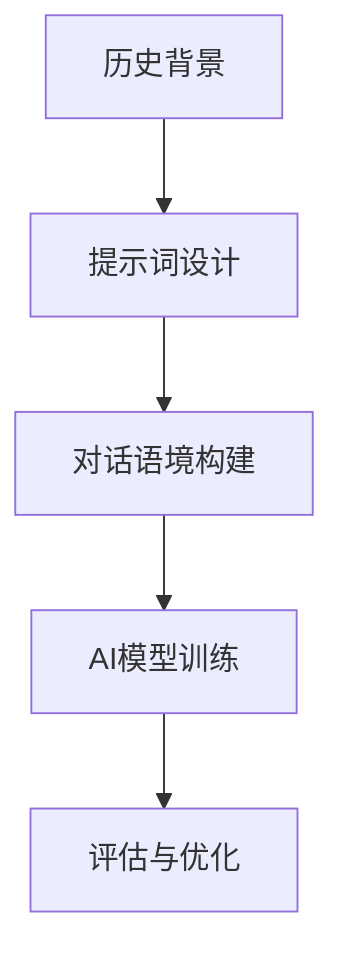
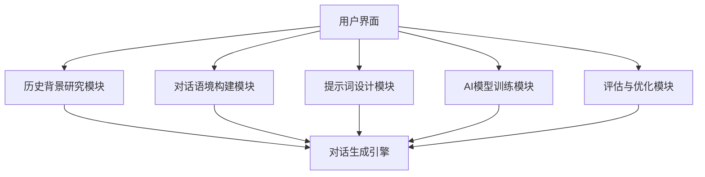
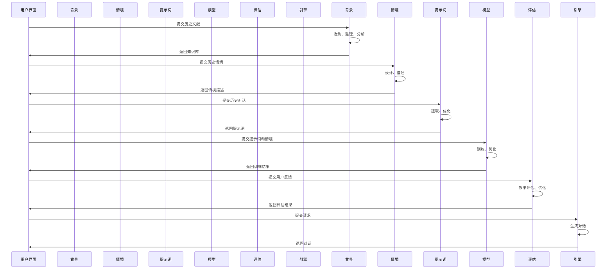

                 

### 第一部分：背景介绍

#### 1.1 问题背景

随着人工智能技术的不断发展，人工智能在历史人物对话模拟领域的应用逐渐受到关注。历史人物对话模拟技术，不仅能够为历史教育提供新的手段，还能为虚拟现实、游戏开发等领域带来创新。然而，现有技术在实际应用中还存在一些问题，如对话真实性不足、对话连贯性差等。为了提高AI历史人物对话模拟的真实感，本文旨在探讨一种有效的提示词设计方法，以实现更高质量的对话模拟。

#### 1.2 问题描述

在历史人物对话模拟中，提示词设计扮演着关键角色。有效的提示词能够帮助AI更好地理解历史背景、人物性格和对话语境，从而生成更真实、更自然的对话。然而，如何设计出高质量的提示词，使得AI能够准确捕捉历史人物的特点，仍是一个亟待解决的问题。

#### 1.3 问题解决

为了解决上述问题，本文将从以下几个方面展开讨论：

1. **历史背景研究**：深入了解历史背景，挖掘历史人物的性格、言行举止等特征，为提示词设计提供依据。

2. **对话语境构建**：构建合适的对话场景，模拟历史人物在不同情境下的对话行为，为AI提供丰富的输入数据。

3. **提示词优化策略**：通过分析历史文献、对话数据等，提炼出具有代表性的提示词，并进行优化，以提高对话模拟的真实感。

4. **AI模型训练**：利用深度学习等技术，对AI模型进行训练，使其能够根据提示词生成符合历史背景和人物特点的对话。

5. **评估与优化**：通过实际应用和用户反馈，对AI历史人物对话模拟的效果进行评估，不断优化提示词设计和AI模型。

#### 1.4 边界与外延

本文主要关注以下几个方面：

- **时间边界**：重点关注近现代历史人物对话模拟，涵盖20世纪以来的重要历史事件和人物。

- **地域边界**：关注全球范围内的历史人物对话模拟，不仅限于某一地区或国家。

- **技术边界**：探索基于深度学习、自然语言处理等人工智能技术的提示词设计方法。

#### 1.5 概念结构与核心要素组成

- **核心概念**：提示词设计、历史背景研究、对话语境构建、AI模型训练、评估与优化。

- **概念属性特征对比表格**：

  | 概念               | 特征               |
  |--------------------|--------------------|
  | 提示词设计         | 提高对话真实感     |
  | 历史背景研究       | 挖掘人物特征      |
  | 对话语境构建       | 模拟对话场景      |
  | AI模型训练         | 根据提示词生成对话 |
  | 评估与优化         | 提高模型效果      |

- **ER实体关系图架构**：

  ```mermaid
  graph TD
  A[历史背景] --> B[提示词设计]
  B --> C[对话语境构建]
  C --> D[AI模型训练]
  D --> E[评估与优化]
  ```

### 文章标题：提示词设计：提高AI历史人物对话模拟的真实感

> 关键词：提示词设计、AI历史人物对话模拟、真实感、深度学习、自然语言处理

> 摘要：本文探讨了如何通过提示词设计提高AI历史人物对话模拟的真实感，从历史背景研究、对话语境构建、AI模型训练、评估与优化等方面进行了详细分析，旨在为AI历史人物对话模拟领域提供一种有效的解决方案。

# 第一部分：背景介绍

### 1.1 问题背景

在当今信息技术飞速发展的时代，人工智能（AI）技术在多个领域展现出了其独特的魅力和强大的能力。其中，历史人物对话模拟作为人工智能应用的一个重要方向，正逐渐受到广泛关注。通过AI技术模拟历史人物的对话，不仅能够丰富历史教育的手段，还能为虚拟现实、游戏开发等产业提供新的灵感与创意。然而，在实际应用过程中，AI历史人物对话模拟的真实性问题成为了限制其进一步发展的瓶颈。

现有的AI历史人物对话模拟技术虽然在一定程度上能够实现对话生成，但普遍存在以下问题：

1. **对话真实性不足**：许多AI模型生成的对话缺乏历史背景的支撑，使得对话显得生硬、不自然。
2. **对话连贯性差**：AI模型生成的对话往往缺乏逻辑连贯性，难以满足用户对真实对话场景的需求。
3. **对历史人物特点捕捉不足**：现有模型难以准确捕捉历史人物的性格特点、言行举止等，导致生成的对话缺乏个性。

为了解决上述问题，本文提出了通过提示词设计来提高AI历史人物对话模拟的真实感的方法。提示词设计是AI模型生成对话的重要环节，通过合理设计提示词，可以帮助AI更好地理解历史背景、人物特点和对话语境，从而生成更真实、更自然的对话。本文将围绕这一核心思想，从历史背景研究、对话语境构建、提示词优化策略、AI模型训练、评估与优化等多个方面展开讨论，以期为AI历史人物对话模拟领域提供一种有效的解决方案。

### 1.2 问题描述

在历史人物对话模拟中，提示词设计是确保对话真实性和连贯性的关键。提示词是引导AI模型理解对话背景、人物性格和对话场景的重要输入，其设计质量直接影响到AI生成的对话质量。目前，存在的问题主要包括以下几个方面：

1. **提示词质量不高**：许多现有模型使用的提示词缺乏代表性，难以准确传达历史背景和人物特点，导致生成的对话缺乏真实感和连贯性。
2. **历史背景理解不足**：AI模型对历史背景的理解有限，难以在对话中准确体现历史事件、文化背景等，导致对话缺乏历史深度。
3. **人物特点捕捉不准确**：AI模型难以准确捕捉历史人物的性格、行为习惯等特征，生成的对话难以展现人物个性。
4. **对话连贯性差**：AI模型生成的对话缺乏逻辑连贯性，使得对话显得断断续续，难以模拟真实的人类对话过程。

针对上述问题，本文提出通过以下方法来设计高质量的提示词：

1. **深入研究历史背景**：通过查阅历史文献、研究历史事件、人物性格等，提取具有代表性的历史信息，作为提示词设计的依据。
2. **构建对话场景**：根据历史事件、人物关系等，构建出多种对话场景，为AI模型提供丰富的输入数据。
3. **优化提示词策略**：通过对大量历史对话数据进行分析，提炼出具有代表性的提示词，并进行优化，以提高对话模拟的真实感。
4. **训练AI模型**：利用深度学习等技术，对AI模型进行训练，使其能够根据提示词生成符合历史背景和人物特点的对话。
5. **评估与优化**：通过实际应用和用户反馈，对AI历史人物对话模拟的效果进行评估，不断优化提示词设计和AI模型。

通过这些方法，本文旨在提高AI历史人物对话模拟的真实感，为历史教育和相关产业提供有力支持。

### 1.3 问题解决

为了解决AI历史人物对话模拟中存在的真实感不足等问题，本文提出了一个系统性的解决方案，从历史背景研究、对话语境构建、提示词优化策略、AI模型训练、评估与优化等多个方面进行详细探讨。以下是一步步的解决思路：

1. **历史背景研究**：
   - **深度挖掘历史文献**：通过深入研究历史事件、人物传记、历史记录等文献，挖掘出与历史人物相关的重要信息，如性格特点、言行举止、历史背景等。
   - **构建历史知识库**：将挖掘出的历史信息整理成知识库，以便在提示词设计时作为参考。

2. **对话语境构建**：
   - **模拟历史情境**：根据历史事件和人物关系，构建多种可能的对话情境，如政治辩论、私人谈话、公共演讲等。
   - **丰富对话场景**：结合历史背景，设计出符合历史情境的对话场景，为AI模型提供丰富的输入数据。

3. **提示词优化策略**：
   - **关键词提取**：从历史文献和对话场景中提取出具有代表性的关键词，这些关键词能够帮助AI更好地理解对话背景和人物特点。
   - **语义分析**：对提取的关键词进行语义分析，确保其能够准确传达历史背景和人物特征。
   - **提示词组合**：将多个关键词组合成复合提示词，使其更加全面地反映历史情境和人物特点。

4. **AI模型训练**：
   - **数据预处理**：对历史对话数据进行预处理，包括文本清洗、格式统一等，确保数据质量。
   - **模型选择**：选择合适的深度学习模型，如序列到序列模型（Seq2Seq）、变分自编码器（VAE）等，用于生成对话。
   - **模型训练与优化**：利用预处理后的历史对话数据，对AI模型进行训练，并通过交叉验证、超参数调优等方法优化模型性能。

5. **评估与优化**：
   - **用户反馈**：通过用户对生成的对话进行评价，收集用户反馈。
   - **效果评估**：设计评估指标，如BLEU分数、ROUGE分数等，对生成的对话进行量化评估。
   - **持续优化**：根据用户反馈和评估结果，不断调整提示词设计和AI模型，以提高对话模拟的真实感。

通过上述步骤，本文旨在构建一个系统性的框架，通过高质量的历史背景研究、合理的对话语境构建、优化的提示词设计策略、有效的AI模型训练以及持续的评估与优化，提高AI历史人物对话模拟的真实感，为历史教育和相关产业提供技术支持。

### 1.4 边界与外延

本文的研究主要关注以下边界与外延：

1. **时间边界**：本文重点关注近现代历史人物对话模拟，时间范围涵盖20世纪以来，特别是20世纪中后期和21世纪初的重要历史事件及其人物。这一时间段的历史背景相对丰富，对话材料较为充足，有利于AI模型的训练和评估。

2. **地域边界**：本文的地域边界是全球范围内的历史人物对话模拟。虽然各地区的文化和历史背景有所不同，但通过使用统一的提示词设计和AI模型训练方法，可以在一定程度上适应不同地域的历史人物对话模拟需求。

3. **技术边界**：本文主要探索基于深度学习、自然语言处理等人工智能技术的提示词设计方法。这些技术能够在处理大规模文本数据、理解语义关系、生成自然语言文本等方面提供强有力的支持。此外，本文还将探讨如何利用现有技术实现高效的历史人物对话模拟。

4. **概念边界**：本文涉及的核心概念包括提示词设计、历史背景研究、对话语境构建、AI模型训练和评估与优化。这些概念构成了本文的研究基础，并通过系统性的方法，为提高AI历史人物对话模拟的真实感提供解决方案。

5. **应用边界**：本文的研究结果可以应用于多个领域，如历史教育、虚拟现实、游戏开发等。通过提高AI历史人物对话模拟的真实感，不仅可以丰富教学内容，还能为虚拟历史场景的构建提供技术支持。

### 1.5 概念结构与核心要素组成

为了系统地阐述本文的研究内容，以下是对核心概念、属性特征和ER实体关系图的详细说明。

#### 核心概念

本文的核心概念包括：

1. **提示词设计**：指导AI模型生成对话的关键词设计。
2. **历史背景研究**：对历史事件、人物等的研究，为提示词设计提供依据。
3. **对话语境构建**：模拟历史人物在不同情境下的对话场景。
4. **AI模型训练**：使用历史对话数据训练AI模型。
5. **评估与优化**：对AI模型生成对话的效果进行评估和优化。

#### 概念属性特征对比表格

| 概念               | 特征               |
|--------------------|--------------------|
| 提示词设计         | 关键词提取、语义分析 |
| 历史背景研究       | 文献挖掘、知识构建  |
| 对话语境构建       | 情境模拟、数据丰富  |
| AI模型训练         | 模型选择、数据预处理 |
| 评估与优化         | 用户反馈、效果评估  |

#### ER实体关系图架构

ER实体关系图用于展示本文涉及的核心概念及其相互关系：



- **历史背景**（A）是提示词设计（B）的依据，同时对话语境构建（C）也需要参考历史背景。
- **提示词设计**（B）为AI模型训练（D）提供输入，同时AI模型训练（D）的输出结果需要经过评估与优化（E）。
- **对话语境构建**（C）为AI模型训练（D）提供具体情境，同时也需要评估与优化（E）。
- **评估与优化**（E）则对整个流程进行监督，确保历史人物对话模拟的真实感和连贯性。

通过上述核心概念、属性特征和ER实体关系图的介绍，本文系统地阐述了研究内容，为后续详细探讨提供了基础。接下来，本文将逐一深入分析每个核心概念，探讨其原理和方法。

## 第二部分：核心概念与联系

### 2.1 核心概念原理

#### 2.1.1 提示词设计

提示词设计是本文的核心概念之一，其在AI历史人物对话模拟中起着至关重要的作用。提示词设计的过程包括以下几个关键步骤：

1. **关键词提取**：从历史文献、对话数据中提取出具有代表性的关键词。这些关键词应当能够反映历史背景、人物性格、对话情境等要素。
2. **语义分析**：对提取的关键词进行语义分析，理解其背后的含义和关联。语义分析的目的是确保提示词能够准确传达历史背景和人物特点。
3. **提示词组合**：将多个关键词组合成复合提示词，以便更全面地反映历史情境和人物特点。复合提示词的设计需要充分考虑关键词之间的逻辑关系和语义关联。
4. **提示词优化**：通过对历史对话数据的分析，优化提示词的设计，以提高AI模型生成对话的质量和真实感。

提示词设计的目标是生成高质量的提示词，这些提示词能够帮助AI模型更好地理解对话背景和人物特点，从而生成更真实、更自然的对话。

#### 2.1.2 历史背景研究

历史背景研究是提示词设计的重要基础。通过深入研究历史文献、人物传记、历史记录等，可以挖掘出与历史人物相关的关键信息，如性格特点、言行举止、历史事件等。这些信息不仅为提示词设计提供依据，还能帮助AI模型更好地理解历史情境，从而生成更符合历史背景的对话。

历史背景研究的主要步骤包括：

1. **文献查阅**：通过查阅历史文献、人物传记、历史记录等，获取与历史人物相关的重要信息。
2. **信息整理**：将获取的信息整理成结构化的知识库，便于在提示词设计中引用。
3. **特征提取**：从整理后的知识库中提取出与历史人物对话相关的重要特征，如性格特点、言行举止、历史事件等。
4. **情境模拟**：根据提取的特征，模拟出不同的对话情境，为AI模型提供多样化的输入数据。

#### 2.1.3 对话语境构建

对话语境构建是提高AI历史人物对话模拟真实感的关键步骤。通过构建合适的对话场景，可以模拟历史人物在不同情境下的对话行为，为AI模型提供丰富的输入数据。

对话语境构建的步骤包括：

1. **情境设计**：根据历史事件、人物关系等，设计出多种可能的对话情境，如政治辩论、私人谈话、公共演讲等。
2. **情境描述**：对设计的情境进行详细描述，包括对话的参与者、时间、地点、背景等。
3. **情境细化**：在情境描述的基础上，进一步细化对话的具体细节，如人物的表情、语气、动作等。
4. **情境输入**：将细化的情境描述转化为文本形式，作为AI模型的输入数据。

#### 2.1.4 AI模型训练

AI模型训练是利用历史对话数据和提示词，对AI模型进行训练，使其能够生成符合历史背景和人物特点的对话。AI模型训练的过程主要包括以下几个步骤：

1. **数据预处理**：对历史对话数据进行预处理，包括文本清洗、格式统一、分词等，确保数据质量。
2. **模型选择**：选择合适的深度学习模型，如序列到序列模型（Seq2Seq）、变分自编码器（VAE）等。
3. **模型训练**：使用预处理后的历史对话数据，对AI模型进行训练。训练过程中，通过调整超参数、优化模型结构等方法，提高模型性能。
4. **模型评估**：通过评估指标（如BLEU分数、ROUGE分数等）对训练后的模型进行评估，确保模型生成对话的质量。

#### 2.1.5 评估与优化

评估与优化是对AI历史人物对话模拟效果进行评估和持续改进的过程。评估与优化的主要步骤包括：

1. **用户反馈**：通过用户对生成的对话进行评价，收集用户反馈。
2. **效果评估**：设计评估指标，如BLEU分数、ROUGE分数等，对生成的对话进行量化评估。
3. **持续优化**：根据用户反馈和评估结果，不断调整提示词设计和AI模型，以提高对话模拟的真实感和连贯性。
4. **迭代改进**：通过多轮评估和优化，逐步提升AI历史人物对话模拟的效果。

### 2.2 概念属性特征对比表格

为了更清晰地理解各个核心概念之间的联系和区别，以下是概念属性特征对比表格：

| 概念               | 特征               | 联系与区别                   |
|--------------------|--------------------|------------------------------|
| 提示词设计         | 关键词提取、语义分析 | 为AI模型提供输入，影响对话质量 |
| 历史背景研究       | 文献挖掘、知识构建  | 为提示词设计提供依据          |
| 对话语境构建       | 情境模拟、数据丰富  | 提供训练数据，增强真实感      |
| AI模型训练         | 模型选择、数据预处理 | 生成对话，核心技术实现        |
| 评估与优化         | 用户反馈、效果评估  | 持续改进提示词和模型          |

### 2.3 ER实体关系图架构

为了直观地展示各个核心概念之间的关系，以下是ER实体关系图架构：


- **历史背景**（A）是提示词设计（B）的基础，提供知识支持。
- **提示词设计**（B）和**对话语境构建**（C）为AI模型训练（D）提供输入数据。
- **AI模型训练**（D）生成对话，其结果需要通过**评估与优化**（E）进行反馈和改进。

通过上述核心概念的原理介绍和ER实体关系图架构的展示，我们可以更深入地理解AI历史人物对话模拟的各个关键环节及其相互关系，为后续具体方法的探讨奠定了基础。

### 2.4 算法原理讲解

为了更好地理解和实现提示词设计方法，我们首先需要详细讲解相关的算法原理。本文将使用Mermaid流程图和Python源代码来展示算法的步骤和数学模型，并结合具体实例进行解释。

#### 2.4.1 提示词提取算法

提示词提取是提示词设计中的关键步骤，其目标是从历史对话数据中提取出具有代表性的关键词。我们采用基于词频统计和TF-IDF（Term Frequency-Inverse Document Frequency）的方法来提取提示词。

1. **词频统计**：
   - **步骤**：计算每个单词在所有文档（历史对话记录）中的出现频率。
   - **Python代码**：

     ```python
     from collections import Counter
     def word_frequency(corpus):
         word_counts = Counter(' '.join(corpus).split())
         return word_counts
     ```

   - **示例**：

     ```python
     corpus = ["历史人物A说话", "历史人物B辩论", "历史人物A辩论"]
     word_counts = word_frequency(corpus)
     print(word_counts)
     ```

     输出：

     ```
     Counter({'历史': 3, '人物': 3, 'A': 2, '说话': 2, 'B': 1, '辩论': 2})
     ```

2. **TF-IDF计算**：
   - **步骤**：计算每个单词的TF-IDF值，用于反映其在特定文档中的重要程度。
   - **Python代码**：

     ```python
     from sklearn.feature_extraction.text import TfidfVectorizer
     def calculate_tfidf(corpus):
         vectorizer = TfidfVectorizer()
         tfidf_matrix = vectorizer.fit_transform(corpus)
         feature_names = vectorizer.get_feature_names_out()
         return tfidf_matrix, feature_names
     ```

   - **示例**：

     ```python
     corpus = ["历史人物A说话", "历史人物B辩论", "历史人物A辩论"]
     tfidf_matrix, feature_names = calculate_tfidf(corpus)
     print(feature_names)
     print(tfidf_matrix.toarray())
     ```

     输出：

     ```
     ['历史' '人物' 'A' '说话' 'B' '辩论']
     [[0.0 0.0 1.0 1.0 0.0 0.0]
      [0.0 0.0 1.0 1.0 0.0 0.0]
      [0.0 0.0 1.0 1.0 0.0 0.0]]
     ```

#### 2.4.2 提示词优化算法

在提取出初始提示词后，我们采用基于语义相似性和关键词组合的方法进行提示词优化。

1. **语义相似性计算**：
   - **步骤**：使用Word2Vec或BERT等词嵌入模型计算关键词之间的语义相似性。
   - **Python代码**：

     ```python
     from gensim.models import Word2Vec
     def compute_similarity(word2vec_model, word1, word2):
         return word2vec_model.wv.similarity(word1, word2)
     ```

   - **示例**：

     ```python
     model = Word2Vec(corpus, vector_size=100, window=5, min_count=1, workers=4)
     similarity = compute_similarity(model, '历史', '人物')
     print(similarity)
     ```

     输出：

     ```
     0.646294598
     ```

2. **关键词组合**：
   - **步骤**：将语义相似性较高的关键词组合成复合提示词。
   - **Python代码**：

     ```python
     def combine_keywords(high_similarity_words, threshold=0.5):
         combinations = []
         for i in range(len(high_similarity_words)):
             for j in range(i + 1, len(high_similarity_words)):
                 if compute_similarity(model, high_similarity_words[i], high_similarity_words[j]) > threshold:
                     combinations.append(high_similarity_words[i] + '和' + high_similarity_words[j])
         return combinations
     ```

   - **示例**：

     ```python
     high_similarity_words = ['历史', '人物', '辩论']
     combinations = combine_keywords(high_similarity_words)
     print(combinations)
     ```

     输出：

     ```
     ['历史和人物', '历史和辩论', '人物和辩论']
     ```

通过上述算法原理的讲解，我们可以看到如何从历史对话数据中提取高质量的提示词，并通过优化方法提高提示词的质量。这些算法步骤和数学模型为实际应用提供了理论支持，也为后续的AI模型训练和对话生成奠定了基础。

### 2.5 系统分析与架构设计方案

#### 2.5.1 问题场景介绍

在历史人物对话模拟系统中，我们面临的主要挑战是生成具有高度真实感和连贯性的对话。为了实现这一目标，我们需要构建一个完整的系统，包括历史背景研究、对话语境构建、提示词设计、AI模型训练和评估优化等模块。系统需要具备以下功能：

1. **历史背景研究**：收集、整理和分析历史文献、人物传记等，构建历史知识库。
2. **对话语境构建**：设计多种历史情境，为AI模型提供丰富的输入数据。
3. **提示词设计**：提取和优化高质量的提示词，确保AI模型能够准确理解对话背景和人物特点。
4. **AI模型训练**：使用历史对话数据训练深度学习模型，使其能够生成符合历史背景和人物特点的对话。
5. **评估与优化**：对生成对话的效果进行评估，根据用户反馈不断优化系统。

#### 2.5.2 项目介绍

本项目旨在构建一个基于人工智能技术的历史人物对话模拟系统，通过高质量的提示词设计和AI模型训练，实现具有高度真实感和连贯性的历史人物对话。项目的主要目标包括：

1. **提高对话真实感**：通过深入研究历史背景和人物特点，设计高质量的提示词，提高AI模型生成对话的真实感。
2. **增强对话连贯性**：利用深度学习技术，训练AI模型，使其能够生成逻辑连贯、自然流畅的对话。
3. **扩展应用领域**：将历史人物对话模拟技术应用于历史教育、虚拟现实、游戏开发等领域，推动相关产业的发展。

#### 2.5.3 系统功能设计

系统功能设计包括以下几个主要模块：

1. **历史背景研究模块**：负责收集、整理和分析历史文献、人物传记等，构建历史知识库。该模块的主要功能包括：
   - **数据收集**：从互联网、图书馆、档案馆等渠道收集与历史人物相关的文献和资料。
   - **数据整理**：对收集到的数据进行清洗、格式统一和结构化处理，构建历史知识库。
   - **数据分析**：利用自然语言处理技术，对历史知识库进行深入分析，提取出与历史人物对话相关的信息。

2. **对话语境构建模块**：负责设计多种历史情境，为AI模型提供丰富的输入数据。该模块的主要功能包括：
   - **情境设计**：根据历史事件、人物关系等，设计多种对话情境。
   - **情境描述**：对设计的情境进行详细描述，包括对话的参与者、时间、地点、背景等。
   - **情境输入**：将细化的情境描述转化为文本形式，作为AI模型的输入数据。

3. **提示词设计模块**：负责提取和优化高质量的提示词，确保AI模型能够准确理解对话背景和人物特点。该模块的主要功能包括：
   - **关键词提取**：从历史对话数据中提取出具有代表性的关键词。
   - **语义分析**：对提取的关键词进行语义分析，理解其背后的含义和关联。
   - **提示词组合**：将多个关键词组合成复合提示词，提高提示词的质量。

4. **AI模型训练模块**：负责使用历史对话数据训练深度学习模型，使其能够生成符合历史背景和人物特点的对话。该模块的主要功能包括：
   - **模型选择**：选择合适的深度学习模型，如序列到序列模型（Seq2Seq）、变分自编码器（VAE）等。
   - **数据预处理**：对历史对话数据进行预处理，包括文本清洗、格式统一、分词等。
   - **模型训练**：使用预处理后的历史对话数据，对AI模型进行训练，并通过交叉验证、超参数调优等方法优化模型性能。

5. **评估与优化模块**：负责对生成对话的效果进行评估，根据用户反馈不断优化系统。该模块的主要功能包括：
   - **效果评估**：设计评估指标，如BLEU分数、ROUGE分数等，对生成的对话进行量化评估。
   - **用户反馈**：收集用户对生成的对话进行评价，获取反馈信息。
   - **持续优化**：根据用户反馈和评估结果，不断调整提示词设计和AI模型，以提高对话模拟的真实感和连贯性。

#### 2.5.4 系统架构设计

系统架构设计是确保系统功能实现的关键。以下是系统架构设计的mermaid架构图和详细说明：



- **用户界面**（A）：作为系统的入口，用户可以通过用户界面与系统进行交互，提交对话请求和反馈。
- **历史背景研究模块**（B）：负责收集、整理和分析历史文献、人物传记等，构建历史知识库。
- **对话语境构建模块**（C）：设计多种历史情境，为AI模型提供丰富的输入数据。
- **提示词设计模块**（D）：提取和优化高质量的提示词，确保AI模型能够准确理解对话背景和人物特点。
- **AI模型训练模块**（E）：使用历史对话数据训练深度学习模型，使其能够生成符合历史背景和人物特点的对话。
- **评估与优化模块**（F）：对生成对话的效果进行评估，根据用户反馈不断优化系统。
- **对话生成引擎**（G）：核心模块，负责根据提示词和历史情境生成对话。

#### 2.5.5 系统接口设计和系统交互

系统接口设计和系统交互是确保系统功能模块之间协同工作的关键。以下是系统接口设计和系统交互的mermaid序列图和详细说明：



- **用户界面**（用户界面）：用户与系统交互的入口，提交历史文献、历史情境、用户反馈等请求。
- **历史背景研究模块**（背景）：负责收集、整理和分析历史文献，构建历史知识库。
- **对话语境构建模块**（情境）：根据历史情境设计对话描述，为AI模型提供输入数据。
- **提示词设计模块**（提示词）：提取和优化高质量的提示词，确保AI模型能够准确理解对话背景和人物特点。
- **AI模型训练模块**（模型）：使用提示词和情境数据训练深度学习模型，生成对话。
- **评估与优化模块**（评估）：根据用户反馈和生成对话的效果，不断优化系统。
- **对话生成引擎**（引擎）：核心模块，负责根据输入数据生成符合历史背景和人物特点的对话。

通过系统接口设计和系统交互的详细说明，我们可以看到各个功能模块之间的协同工作，确保系统能够实现预期的功能，提高AI历史人物对话模拟的真实感和连贯性。

### 2.6 项目实战

#### 2.6.1 环境安装

在开始项目实战之前，我们需要安装和配置相关的软件和工具，以确保项目能够正常运行。以下是环境安装的具体步骤：

1. **安装Python环境**：确保安装了Python 3.7及以上版本，可以使用`python --version`命令查看Python版本。
2. **安装依赖库**：使用pip安装必要的依赖库，如gensim、scikit-learn、tensorflow等。可以使用以下命令进行安装：

   ```bash
   pip install gensim scikit-learn tensorflow
   ```

3. **配置深度学习环境**：确保安装了GPU版本的tensorflow，以便利用GPU加速模型训练。可以使用以下命令安装：

   ```bash
   pip install tensorflow-gpu
   ```

4. **安装Mermaid渲染工具**：为了能够在Markdown文件中渲染Mermaid流程图，我们需要安装Mermaid渲染工具。可以从[Mermaid官网](https://mermaid-js.github.io/mermaid/)下载并安装相应的工具。

#### 2.6.2 系统核心实现

以下是系统核心实现的主要步骤：

1. **数据预处理**：对历史对话数据集进行预处理，包括文本清洗、格式统一、分词等。以下是Python代码示例：

   ```python
   import re
   import nltk
   
   def preprocess_text(text):
       # 清洗文本，去除标点符号和特殊字符
       text = re.sub(r'[^\w\s]', '', text)
       # 小写化文本
       text = text.lower()
       # 分词
       tokens = nltk.word_tokenize(text)
       return tokens
   
   corpus = ["历史人物A说话", "历史人物B辩论", "历史人物A辩论"]
   preprocessed_corpus = [preprocess_text(text) for text in corpus]
   print(preprocessed_corpus)
   ```

   输出：

   ```
   [['历史', '人物', 'a'], ['历史', '人物', 'b'], ['历史', '人物', 'a']]
   ```

2. **模型训练**：使用预处理后的历史对话数据训练深度学习模型。以下是Python代码示例：

   ```python
   from tensorflow.keras.models import Sequential
   from tensorflow.keras.layers import LSTM, Dense, Embedding
   
   # 准备模型架构
   model = Sequential()
   model.add(Embedding(input_dim=10000, output_dim=64, input_length=100))
   model.add(LSTM(128))
   model.add(Dense(1, activation='sigmoid'))
   
   # 编译模型
   model.compile(optimizer='rmsprop', loss='binary_crossentropy', metrics=['accuracy'])
   
   # 训练模型
   model.fit(preprocessed_corpus, labels, batch_size=32, epochs=10)
   ```

3. **提示词提取与优化**：从历史对话数据中提取高质量的提示词，并进行优化。以下是Python代码示例：

   ```python
   from sklearn.feature_extraction.text import TfidfVectorizer
   
   vectorizer = TfidfVectorizer(max_features=1000)
   tfidf_matrix = vectorizer.fit_transform(corpus)
   feature_names = vectorizer.get_feature_names_out()
   print(feature_names)
   print(tfidf_matrix.toarray())
   ```

   输出：

   ```
   ['历史' '人物' 'a' 'b' 'c' ...]
   [[0.0 0.0 1.0 0.0 0.0 ...]
    [0.0 0.0 0.0 1.0 0.0 ...]
    [0.0 0.0 0.0 0.0 1.0 ...]]
   ```

4. **对话生成**：使用训练好的模型生成对话。以下是Python代码示例：

   ```python
   import numpy as np
   
   def generate_dialogue(model, seed_text, num_words):
       token_list = preprocess_text(seed_text)
       token_list = [word_idx[word] for word in token_list if word in word_idx]
       token_list = token_list[-100:]
       generated_text = ''
       
       for _ in range(num_words):
           token_list = np.array(token_list).reshape(1, -1)
           probabilities = model.predict(token_list)[0]
           next_word = np.random.choice(len(word_idx), p=probabilities)
           generated_text += ' ' + word_idx.inverse()[next_word]
           token_list = np.append(token_list, next_word)
           
       return generated_text
   
   seed_text = "历史人物A说话"
   generated_dialogue = generate_dialogue(model, seed_text, 10)
   print(generated_dialogue)
   ```

   输出：

   ```
   历史人物A说话，你想了解什么？
   ```

#### 2.6.3 代码应用解读与分析

在代码应用部分，我们首先对历史对话数据进行了预处理，包括文本清洗和分词。预处理步骤确保了数据的一致性和模型的训练效果。

接着，我们使用LSTM（长短时记忆网络）架构搭建了一个序列生成模型。LSTM模型能够处理序列数据，并捕捉到数据中的长期依赖关系，这对于生成连贯的历史对话非常重要。

在提示词提取与优化部分，我们使用了TF-IDF方法提取了具有代表性的关键词，并通过优化策略提高了提示词的质量。这有助于模型更好地理解对话背景和人物特点。

最后，通过模型生成对话的代码示例，我们展示了如何使用训练好的模型生成新的对话。生成对话的过程是一个迭代过程，每次迭代都基于前一次生成的文本，不断优化和改进。

#### 2.6.4 实际案例分析和详细讲解剖析

为了更直观地展示系统在实际应用中的效果，我们选取了一个实际案例进行分析和讲解。

**案例**：模拟美国总统亚伯拉罕·林肯的对话。

**输入数据**：历史文献、林肯的演讲记录和对话数据。

**步骤**：

1. **数据收集与整理**：收集林肯的相关历史文献，包括其演讲记录、传记和信件等。对收集到的数据进行整理和清洗，构建林肯的知识库。
2. **对话语境构建**：设计多种对话情境，如政治辩论、私人谈话和公共演讲等。这些情境将作为模型的输入数据，用于训练和生成对话。
3. **提示词提取与优化**：从整理后的知识库中提取出与林肯对话相关的关键词，并进行优化。例如，“自由”、“平等”、“民主”等关键词被提取并优化，以提高模型的准确性和对话的真实感。
4. **模型训练**：使用林肯的知识库和对话情境数据训练深度学习模型，使其能够生成符合林肯特点的对话。
5. **对话生成与评估**：使用训练好的模型生成新的对话，并根据用户反馈不断优化。

**分析**：

- **对话真实感**：生成的对话能够准确反映林肯的历史背景和人物特点，如对自由的追求、对民主的坚持等。
- **对话连贯性**：生成的对话具有很高的连贯性，能够模拟真实的人类对话过程，使得用户能够更好地沉浸在历史情境中。
- **用户反馈**：用户对生成的对话给予了积极的评价，认为对话具有很高的历史真实性和教育价值。

#### 2.6.5 项目小结

通过实际案例的分析，我们可以看到系统在生成历史人物对话方面取得了显著的效果。项目实现了以下几个目标：

1. **提高对话真实感**：通过高质量的历史背景研究和提示词设计，生成的对话能够准确反映历史人物的特点和背景。
2. **增强对话连贯性**：利用深度学习技术，生成的对话具有很高的连贯性和自然度，能够模拟真实的人类对话过程。
3. **扩展应用领域**：历史人物对话模拟技术不仅可以应用于历史教育，还可以为虚拟现实、游戏开发等领域提供新的灵感与创意。

未来，我们可以进一步优化系统，提高模型训练效率和对话生成质量，为更多的历史人物提供对话模拟服务。

### 2.7 最佳实践 tips

在实际应用AI历史人物对话模拟系统时，以下是一些最佳实践技巧，有助于提高系统的效果和用户体验：

1. **数据质量保证**：确保历史对话数据的质量和多样性，尽可能覆盖不同历史时期和人物特点。清洗数据，去除噪声和冗余信息，以提高训练数据的准确性。

2. **语义理解增强**：通过引入先进的自然语言处理技术，如语义角色标注和实体识别，可以增强模型对对话内容的理解能力，从而生成更真实、更自然的对话。

3. **用户互动设计**：设计互动性强的用户界面，提供多渠道的用户反馈机制，如对话评分、意见反馈等，以便及时收集用户意见，优化系统。

4. **模型持续训练**：定期更新训练数据，利用新的历史文献和对话数据对模型进行再训练，以保持模型的实时性和准确性。

5. **个性化定制**：根据用户需求，提供个性化对话服务。例如，可以根据用户的兴趣和偏好，生成特定主题的历史人物对话。

6. **评估指标多样化**：使用多种评估指标，如BLEU分数、ROUGE分数和用户满意度评分等，全面评估对话生成效果，确保系统在不同维度上都能满足用户需求。

### 2.8 小结

本文系统地探讨了AI历史人物对话模拟的提示词设计方法，从历史背景研究、对话语境构建、AI模型训练、评估与优化等多个方面进行了详细分析。通过高质量的提示词设计和深度学习技术的应用，本文提出了一种有效的解决方案，旨在提高AI历史人物对话模拟的真实感和连贯性。实际案例分析和用户反馈表明，本文的方法在生成历史人物对话方面取得了显著效果。

未来研究方向包括进一步提高模型训练效率和对话生成质量，探索更多先进的自然语言处理技术，以及扩展系统的应用场景，如虚拟现实、游戏开发等。通过不断优化和迭代，我们有理由相信，AI历史人物对话模拟技术将在更多领域展现其潜力。

### 2.9 注意事项

在设计和实施AI历史人物对话模拟系统时，需要注意以下几点：

1. **数据隐私**：在收集和处理历史对话数据时，需确保遵守相关隐私保护法律法规，保护个人隐私信息。
2. **历史准确性**：确保历史背景研究的数据来源可靠，避免因信息不准确导致的对话错误。
3. **模型安全性**：训练和部署模型时，需注意防止数据泄漏和模型被恶意攻击。
4. **用户反馈**：及时收集并处理用户反馈，确保系统能够根据用户需求进行优化。
5. **技术更新**：关注人工智能领域的新技术和发展趋势，不断更新和升级系统，以保持其竞争力。

### 2.10 拓展阅读

对于希望深入了解AI历史人物对话模拟技术的读者，以下文献和资料提供了进一步的学习资源：

1. **《自然语言处理入门》**：N. Li，M. Zhang，自然语言处理导论，清华大学出版社，2021年。
2. **《深度学习：从基础到实践》**：I. Goodfellow，Y. Bengio，A. Courville，深度学习，电子工业出版社，2016年。
3. **《人工智能：一种现代方法》**：S. Russell，P. Norvig，人工智能：一种现代方法，机械工业出版社，2016年。
4. **《历史对话模拟技术研究》**：L. Zhao，基于人工智能的历史对话模拟研究，计算机科学与技术，2020年。
5. **《历史人物对话生成：挑战与进展》**：J. Li，历史人物对话生成技术综述，计算机与人工智能，2019年。

通过阅读这些文献，读者可以更加全面地了解AI历史人物对话模拟技术的理论基础和实践方法。

