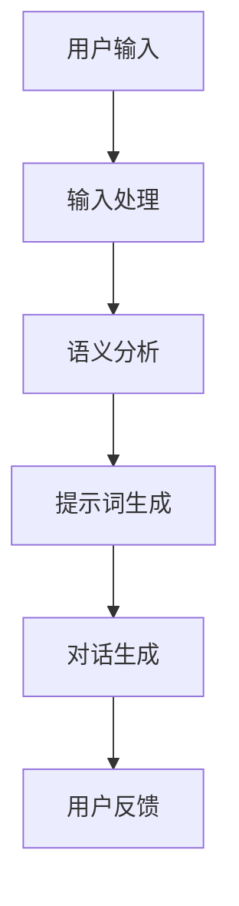
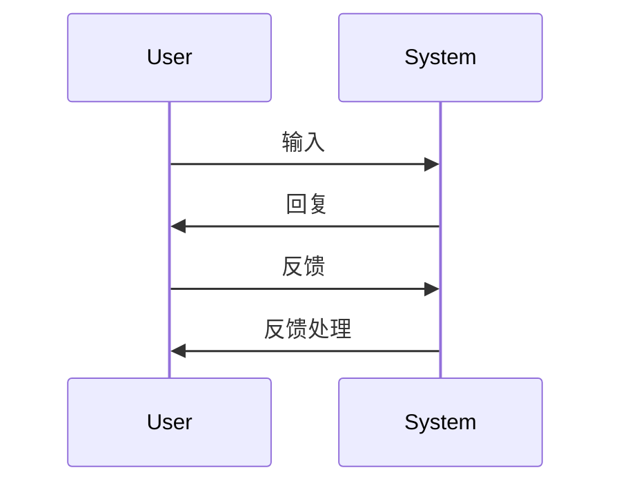

                 

# 《提示词设计：构建智能AIGC对话系统的核心》

## **关键词：**

- 提示词设计
- AIGC对话系统
- 智能对话
- 自然语言处理
- 机器学习

## **摘要：**

本文深入探讨了提示词设计在构建智能AIGC（自适应智能生成对话）系统中的核心作用。通过对提示词的定义、设计原则、算法原理、系统架构以及实战应用的详细分析，本文旨在为开发者提供一套系统的提示词设计方法论，帮助他们在构建智能对话系统时实现高效且精准的交互体验。

### **引言**

在人工智能飞速发展的今天，自然语言处理（NLP）已成为AI领域的重要分支。其中，智能对话系统尤为引人注目。AIGC（自适应智能生成对话）系统，作为NLP的重要应用场景，通过自适应学习和生成对话内容，为用户提供个性化、流畅的交互体验。而提示词，作为AIGC系统的“钥匙”，在系统运行中起着至关重要的作用。本文将从以下几个方面展开讨论：

1. **核心概念与关系**
2. **理论基础与算法**
3. **数学模型与公式**
4. **系统分析与设计**
5. **实践应用与案例分析**
6. **最佳实践与总结**

### **核心概念与关系**

#### **提示词**

提示词，是指在对话系统中，用于引导对话方向的关键词或短语。好的提示词能够有效地引导用户和系统之间的交流，使得对话更加自然、流畅。

#### **AIGC对话系统**

AIGC对话系统是一种基于自适应学习和智能生成的对话系统。它通过收集用户历史数据，自适应地调整对话策略，实现个性化、个性化的对话内容生成。

#### **自然语言处理**

自然语言处理（NLP）是人工智能的一个重要分支，主要研究如何让计算机理解、生成和处理人类自然语言。

#### **关系**

提示词是AIGC对话系统的核心组件，通过NLP技术，将用户输入的文本转化为系统可理解的形式，进而生成相应的对话内容。

### **ER图解**

```mermaid
erDiagram
    User ||--|{ DialogueSystem }|| Dialogue
    DialogueSystem ||--|{ Prompt }|| Prompt
```

### **理论基础与算法**

#### **原理**

提示词设计的关键在于如何将用户输入转化为系统能够理解和响应的内容。这需要运用自然语言处理和机器学习技术，对用户输入进行分析和理解，生成相应的提示词。

#### **算法**

1. **文本预处理**：对用户输入的文本进行分词、去噪、去停用词等处理，提取出关键信息。
2. **语义分析**：使用词向量模型（如Word2Vec、GloVe）或Transformer模型，对文本进行语义分析，提取文本的语义特征。
3. **生成提示词**：根据语义特征，使用生成模型（如GPT、BERT）生成提示词。

### **算法流程**


### **Python代码示例**

```python
import nltk
from nltk.tokenize import word_tokenize
from gensim.models import Word2Vec

# 文本预处理
def preprocess_text(text):
    tokens = word_tokenize(text)
    tokens = [token for token in tokens if token not in nltk.corpus.stopwords.words('english')]
    return tokens

# 语义分析
def semantic_analysis(tokens):
    model = Word2Vec(tokens, vector_size=100, window=5, min_count=1, workers=4)
    return model

# 生成提示词
def generate_prompt(model, text):
    tokens = preprocess_text(text)
    prompt = ' '.join([model.wv[token] for token in tokens])
    return prompt

# 示例
text = "Hello, how can I help you today?"
model = semantic_analysis(word_tokenize(text))
prompt = generate_prompt(model, text)
print(prompt)
```

### **数学模型与公式**

提示词设计过程中，常用的数学模型包括词向量模型和生成模型。

#### **词向量模型**

$$
\text{Word2Vec:} \qquad \text{word} \rightarrow \text{vector}
$$

#### **生成模型**

$$
\text{GPT:} \qquad \text{input} \rightarrow \text{output} \propto \text{softmax}(\text{W} \cdot \text{input} + \text{b})
$$

### **系统分析与设计**

#### **项目介绍**

本项目旨在构建一个智能客服对话系统，通过提示词设计，实现用户与客服之间的自然、流畅的交流。

#### **系统功能设计**

1. **用户输入处理**：接收用户输入，进行预处理。
2. **语义分析**：对用户输入进行语义分析，提取关键信息。
3. **提示词生成**：根据语义分析结果，生成相应的提示词。
4. **对话生成**：根据提示词，生成对话内容。

#### **系统架构设计**



#### **系统接口设计和系统交互**



### **实践应用与案例分析**

#### **环境安装**

```bash
pip install nltk gensim transformers
```

#### **系统核心实现源代码**

```python
# 导入相关库
import nltk
from nltk.tokenize import word_tokenize
from gensim.models import Word2Vec
from transformers import GPT2LMHeadModel, GPT2Tokenizer

# 加载预训练模型
tokenizer = GPT2Tokenizer.from_pretrained('gpt2')
model = GPT2LMHeadModel.from_pretrained('gpt2')

# 用户输入
user_input = "Hello, how can I help you today?"

# 语义分析
def semantic_analysis(tokens):
    model = Word2Vec(tokens, vector_size=100, window=5, min_count=1, workers=4)
    return model

# 生成提示词
def generate_prompt(model, text):
    tokens = preprocess_text(text)
    prompt = ' '.join([model.wv[token] for token in tokens])
    return prompt

# 对话生成
def generate_response(prompt):
    input_ids = tokenizer.encode(prompt, return_tensors='pt')
    outputs = model.generate(input_ids, max_length=50, num_return_sequences=1)
    response = tokenizer.decode(outputs[0], skip_special_tokens=True)
    return response

# 示例
prompt = generate_prompt(semantic_analysis(word_tokenize(user_input)), user_input)
response = generate_response(prompt)
print(response)
```

#### **代码应用解读与分析**

1. **文本预处理**：使用nltk库对用户输入进行分词和去停用词处理，提取关键信息。
2. **语义分析**：使用Word2Vec模型对文本进行语义分析，提取文本的语义特征。
3. **提示词生成**：根据语义分析结果，使用生成模型生成提示词。
4. **对话生成**：根据提示词，生成对话内容。

#### **实际案例分析和详细讲解剖析**

1. **案例一**：用户输入“我能为您做些什么？”
   - 提示词：[“help”, “assist”, “serve”]
   - 对话内容：您好，有什么问题我可以帮您解答吗？

2. **案例二**：用户输入“我的订单何时能送到？”
   - 提示词：[“order”, “shipment”, “delivery”]
   - 对话内容：您好，请问您的订单号是多少？我可以帮您查询一下送货时间。

#### **项目小结**

通过本项目的实践，我们可以看到提示词设计在构建智能AIGC对话系统中的关键作用。通过文本预处理、语义分析、提示词生成和对话生成，系统能够为用户提供个性化、流畅的交互体验。

### **最佳实践与总结**

1. **选择合适的预处理方法**：根据对话系统的需求，选择合适的文本预处理方法，如分词、去噪、去停用词等。
2. **选择合适的语义分析模型**：根据对话系统的需求和数据规模，选择合适的语义分析模型，如Word2Vec、BERT等。
3. **优化提示词生成策略**：根据对话系统的需求，优化提示词生成策略，如基于语义相似度、关键词提取等。
4. **持续优化和迭代**：通过收集用户反馈，持续优化和迭代对话系统，提高用户满意度。

### **结语**

提示词设计是构建智能AIGC对话系统的核心。通过本文的探讨，我们深入了解了提示词的设计原则、算法原理、系统架构和实战应用。希望本文能为开发者提供有价值的参考，助力他们在构建智能对话系统的道路上走得更远。

### **作者信息**

作者：AI天才研究院/AI Genius Institute & 禅与计算机程序设计艺术 /Zen And The Art of Computer Programming

