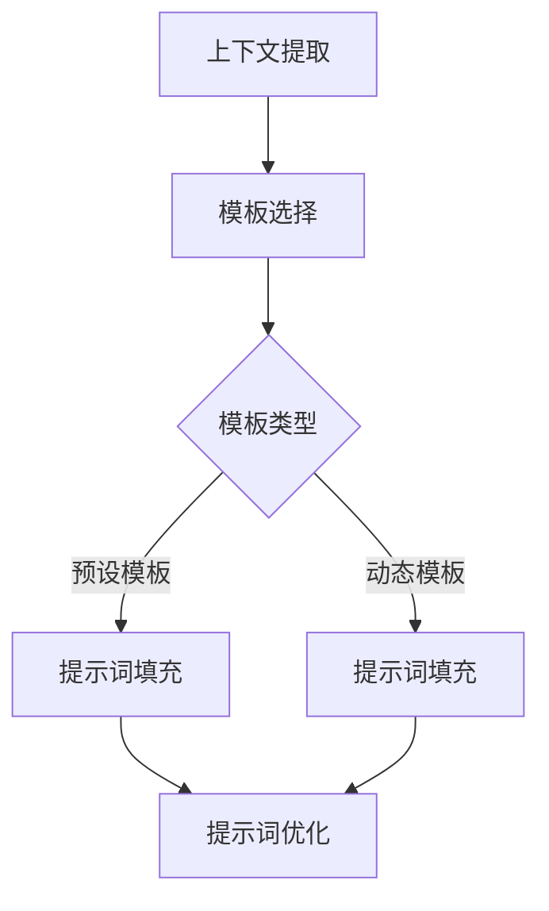
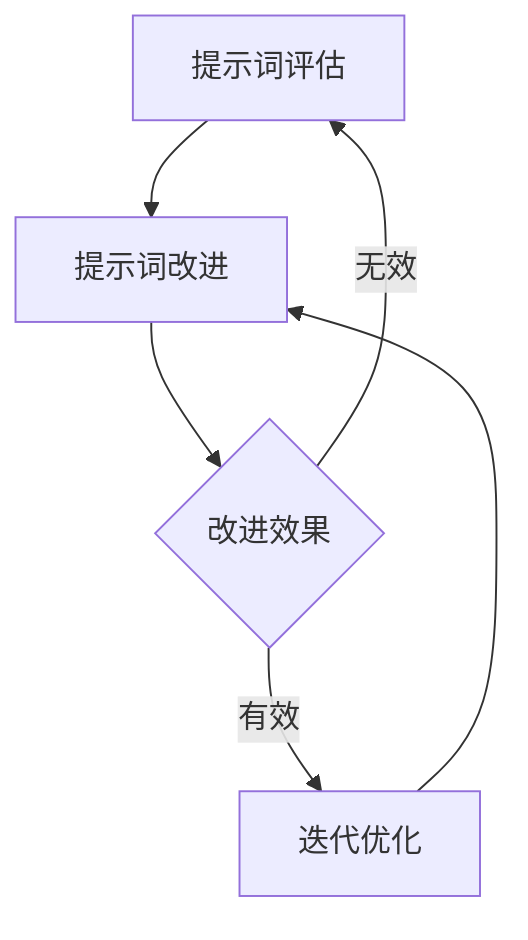
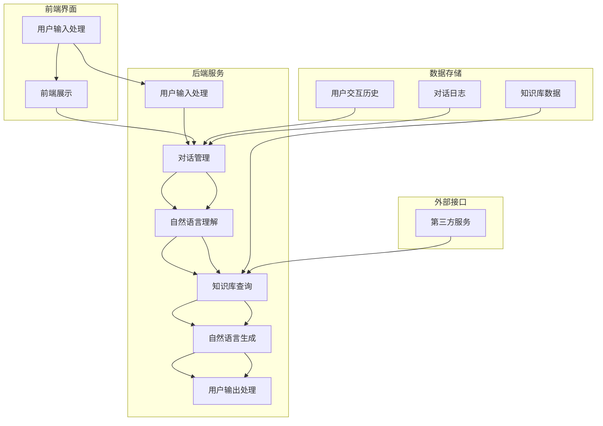
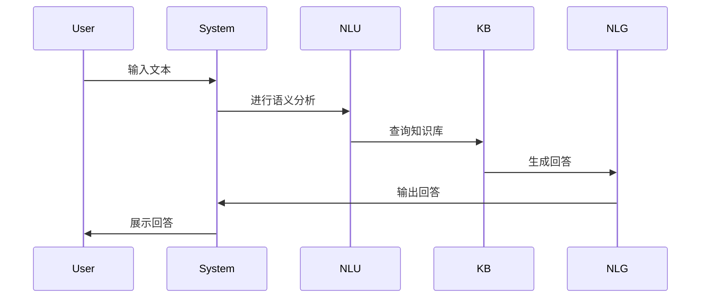

                 

## 提示词设计：构建智能AIGC对话系统的核心要素

> 关键词：提示词设计、智能对话系统、AIGC、算法原理、系统架构

> 摘要：本文旨在深入探讨提示词设计在构建智能AIGC对话系统中的核心作用。通过分析提示词的基本概念、设计与对话系统架构的关系、算法原理以及系统分析与架构设计，本文将为读者提供一个系统、全面的提示词设计指南，帮助构建高效、智能的对话系统。

## 设计《提示词设计：构建智能AIGC对话系统的核心要素》目录大纲

**一、前言**
- 1.1 编者介绍
- 1.2 书籍的目的与定位
- 1.3 阅读对象
- 1.4 书籍结构

**二、背景介绍**
- 2.1 智能对话系统的崛起
  - 2.1.1 智能对话系统的发展历程
  - 2.1.2 当前智能对话系统的应用场景
- 2.2 AIGC（人工智能生成内容）的概念
  - 2.2.1 AIGC的定义
  - 2.2.2 AIGC的技术特点
- 2.3 提示词在智能对话系统中的重要性
  - 2.3.1 提示词的作用
  - 2.3.2 提示词设计的影响因素

**三、核心概念与联系**
- 3.1 提示词设计的基本概念
  - 3.1.1 提示词的定义
  - 3.1.2 提示词的类型
- 3.2 提示词设计与对话系统架构的关系
  - 3.2.1 对话系统架构概述
  - 3.2.2 提示词设计与对话系统的匹配
- 3.3 提示词设计与用户体验的联系
  - 3.3.1 用户需求分析
  - 3.3.2 用户行为数据的应用

**四、算法原理讲解**
- 4.1 提示词生成算法
  - 4.1.1 提示词生成算法概述
  - 4.1.2 提示词生成算法的mermaid流程图
  - 4.1.3 Python代码实现
  - 4.1.4 数学模型和公式讲解
- 4.2 提示词优化算法
  - 4.2.1 提示词优化算法概述
  - 4.2.2 提示词优化算法的mermaid流程图
  - 4.2.3 Python代码实现
  - 4.2.4 数学模型和公式讲解

**五、系统分析与架构设计方案**
- 5.1 问题场景介绍
  - 5.1.1 智能对话系统的常见场景
  - 5.1.2 提示词设计在具体场景中的应用
- 5.2 系统功能设计
  - 5.2.1 领域模型mermaid类图
  - 5.2.2 系统功能模块划分
- 5.3 系统架构设计
  - 5.3.1 系统架构概述
  - 5.3.2 系统架构mermaid架构图
- 5.4 系统接口设计
  - 5.4.1 接口功能定义
  - 5.4.2 接口规范
- 5.5 系统交互
  - 5.5.1 系统交互概述
  - 5.5.2 系统交互mermaid序列图

**六、项目实战**
- 6.1 环境安装
  - 6.1.1 硬件环境要求
  - 6.1.2 软件环境安装
- 6.2 系统核心实现源代码
  - 6.2.1 提示词生成算法实现
  - 6.2.2 提示词优化算法实现
- 6.3 代码应用解读与分析
  - 6.3.1 提示词生成算法应用分析
  - 6.3.2 提示词优化算法应用分析
- 6.4 实际案例分析和详细讲解剖析
  - 6.4.1 案例选取
  - 6.4.2 案例分析
  - 6.4.3 深入剖析
- 6.5 项目小结
  - 6.5.1 项目总结
  - 6.5.2 项目亮点
  - 6.5.3 项目不足与改进建议

**七、最佳实践 tips**
- 7.1 提示词设计的最佳实践
  - 7.1.1 设计原则
  - 7.1.2 设计技巧
  - 7.1.3 经验分享

**八、小结与展望**
- 8.1 全书回顾
- 8.2 提示词设计的关键点
- 8.3 未来发展趋势

---

本文将按照上述目录结构，逐步深入探讨提示词设计在智能AIGC对话系统构建中的核心作用。接下来，我们将首先介绍智能对话系统的背景和AIGC的概念，以便读者更好地理解提示词设计的重要性。随后，我们将详细讨论提示词设计的基本概念、与对话系统架构的关系以及算法原理。在此基础上，我们将分析系统分析与架构设计方案，并通过项目实战和实际案例分析来进一步巩固提示词设计的应用与实践。最后，我们将总结全文，探讨提示词设计的未来发展趋势。让我们开始这一精彩的探索之旅。## 背景介绍

### 2.1 智能对话系统的崛起

#### 2.1.1 智能对话系统的发展历程

智能对话系统的概念起源于20世纪80年代，当时主要应用于军事和科学研究领域。随着计算机技术和互联网的发展，特别是自然语言处理（NLP）技术的突破，智能对话系统逐渐进入商业应用领域。早期的智能对话系统主要依赖于规则驱动的方法，即通过编写大量的预定义规则来模拟人类的对话行为。

进入21世纪，机器学习技术的崛起使得基于统计学习和深度学习的智能对话系统得到了快速发展。2005年，IBM的沃森（Watson）超级计算机在《危险边缘》电视节目中击败了人类选手，标志着人工智能技术的重要进展。同时，随着语音识别技术的成熟，基于语音交互的智能对话系统开始广泛应用于智能手机、智能音箱等设备。

近年来，随着深度学习技术的进一步发展，特别是生成对抗网络（GAN）和变分自编码器（VAE）等技术的引入，智能对话系统的性能得到了显著提升。现代智能对话系统能够通过大量数据的学习，自动生成自然流畅的对话内容，实现更高层次的交互体验。

#### 2.1.2 当前智能对话系统的应用场景

智能对话系统的应用场景广泛，涵盖了从个人生活到企业服务的各个领域。

1. **个人生活领域**：
   - **智能家居**：智能音箱、智能助手等设备通过智能对话系统实现与用户的互动，提供音乐播放、天气查询、日程管理等服务。
   - **虚拟助手**：在社交平台上，如微信、QQ等，虚拟助手通过对话系统与用户进行交流，提供信息查询、在线购物、娱乐互动等服务。

2. **企业服务领域**：
   - **客服机器人**：企业利用智能对话系统构建客服机器人，实现自动化的客户服务，提高客户满意度，降低运营成本。
   - **内部办公系统**：智能对话系统被应用于企业内部办公系统，如日程管理、任务分配、文档查询等，提高工作效率。

3. **专业领域**：
   - **医疗健康**：智能对话系统在医疗健康领域被用于提供健康咨询、疾病查询、预约挂号等服务。
   - **教育**：智能对话系统在教育领域应用于在线辅导、课程推荐、作业批改等，提供个性化教学服务。

### 2.2 AIGC（人工智能生成内容）的概念

#### 2.2.1 AIGC的定义

AIGC，即人工智能生成内容（AI-generated content），是指利用人工智能技术生成文本、图像、视频等数字内容的过程。与传统的手动创作内容相比，AIGC具有自动化、高效、多样性的特点，能够大幅提升内容生产的效率和质量。

AIGC的核心技术包括自然语言生成（NLG）、计算机视觉、图像生成、视频合成等。通过这些技术的结合，AIGC能够生成丰富多样、符合人类需求的内容。

#### 2.2.2 AIGC的技术特点

1. **自动化**：AIGC能够自动生成内容，减少了人工创作的负担，提高了生产效率。

2. **高效性**：AIGC能够快速生成大量内容，满足快速响应的需求。

3. **多样性**：AIGC生成的文本、图像、视频内容具有多样性，能够满足不同场景和用户需求。

4. **个性化**：AIGC可以根据用户的需求和偏好，生成个性化的内容，提供更好的用户体验。

### 2.3 提示词在智能对话系统中的重要性

#### 2.3.1 提示词的作用

提示词（Prompt）在智能对话系统中起着至关重要的作用。提示词是一段引导性的文本或语言，用于指导智能对话系统生成适当的响应内容。具体来说，提示词具有以下作用：

1. **引导对话方向**：通过提供具体的提示词，智能对话系统能够明确对话的方向和主题，避免无关或偏离主题的对话内容。

2. **提高响应质量**：合适的提示词能够帮助智能对话系统生成更准确、更流畅的响应，提高对话的整体质量。

3. **增强用户体验**：通过精准的提示词，智能对话系统能够更好地理解用户需求，提供个性化的服务，从而提升用户体验。

#### 2.3.2 提示词设计的影响因素

提示词设计的影响因素包括：

1. **用户需求**：提示词的设计需要充分考虑用户的需求，确保能够引导智能对话系统生成符合用户期望的内容。

2. **对话场景**：不同的对话场景需要不同的提示词，提示词的设计需要与具体的场景紧密结合。

3. **对话系统架构**：提示词的设计需要与对话系统的整体架构相匹配，确保提示词能够有效地驱动对话系统的各个模块。

4. **技术限制**：提示词的设计需要考虑当前技术水平的限制，确保提示词能够被智能对话系统正确理解和执行。

通过上述背景介绍，我们可以看出，智能对话系统和AIGC技术的崛起为提示词设计提供了广阔的应用场景和可能性。提示词设计在构建智能AIGC对话系统中起着核心作用，是提高对话系统性能和用户体验的关键要素。接下来，我们将进一步探讨提示词设计的基本概念和原理。## 核心概念与联系

### 3.1 提示词设计的基本概念

#### 3.1.1 提示词的定义

提示词（Prompt）在智能对话系统中是一段引导性的文本或语言，用于引导和激励对话系统的生成模型产生特定的回答或输出。提示词通常包含关键信息、上下文背景以及具体的问题或指令，从而帮助对话系统更好地理解和生成符合预期的响应。

#### 3.1.2 提示词的类型

根据提示词的形式和用途，可以将其分为以下几种类型：

1. **开放性提示词**：这类提示词不提供具体的答案，而是鼓励用户进行自由的思考和回答。例如：“你最近有什么新鲜事吗？”这种类型的提示词适合用于探索用户兴趣和需求。

2. **封闭性提示词**：这类提示词提供明确的答案选项，要求用户选择或确认。例如：“您是否需要购买一杯咖啡？”这种类型的提示词适合用于收集用户的具体信息和决策。

3. **情境性提示词**：这类提示词基于特定的情境或背景，提供与当前场景相关的信息。例如：“在今天的会议上，您有什么发言要点吗？”这种类型的提示词有助于保持对话的连贯性和相关性。

4. **问题性提示词**：这类提示词以问题的形式出现，引导用户思考和回答。例如：“您对公司今年的财务状况有什么看法？”这种类型的提示词有助于引导深入对话和获取更多有用信息。

### 3.2 提示词设计与对话系统架构的关系

#### 3.2.1 对话系统架构概述

一个典型的对话系统架构包括以下几个核心模块：

1. **用户输入处理模块**：负责接收并处理用户的输入信息，将其转换为系统可以理解的形式。

2. **对话管理模块**：负责对话的整体流程控制，包括上下文的维护、对话状态的跟踪等。

3. **自然语言理解模块**：负责对用户的输入进行语义分析和意图识别，从而理解用户的意图和需求。

4. **知识库模块**：提供对话系统所需的知识和信息，以支持对话的生成和回复。

5. **自然语言生成模块**：负责根据用户输入和对话管理模块的信息生成自然流畅的回复。

6. **用户输出处理模块**：负责将生成的回复呈现给用户，包括文本、语音等多种形式。

#### 3.2.2 提示词设计与对话系统的匹配

提示词设计需要与对话系统架构的各个模块紧密结合，以确保对话系统能够生成高质量的响应。具体来说，提示词设计与对话系统架构的匹配体现在以下几个方面：

1. **用户输入处理**：提示词应清晰明确，便于用户输入和理解。同时，应考虑用户输入的多样性和不确定性，设计灵活的处理机制。

2. **对话管理**：提示词应有助于对话管理模块维护对话的上下文和状态。例如，可以通过提供具体的情境信息和问题，帮助对话系统更好地理解当前对话的主题和目标。

3. **自然语言理解**：提示词的设计应包含关键信息，以帮助自然语言理解模块准确识别用户的意图和需求。例如，可以使用明确的指示词或关键词，减少歧义和误解。

4. **知识库**：提示词应能够引导对话系统调用和利用知识库中的相关信息，以生成更为丰富和有针对性的回复。

5. **自然语言生成**：提示词应提供足够的上下文和信息，以激励自然语言生成模块生成自然流畅的回复。例如，可以通过设置问题的形式或提供相关的背景信息，引导系统生成更为具体的回答。

6. **用户输出处理**：提示词的设计还应考虑用户输出的形式和渠道，确保生成的回复能够有效传达给用户。

通过上述分析，我们可以看出，提示词设计在对话系统架构中扮演着关键角色。它不仅影响对话系统的响应质量和用户体验，还直接影响对话系统的整体性能和效果。接下来，我们将进一步探讨提示词设计与用户体验的联系。### 提示词设计与用户体验的联系

#### 3.3.1 用户需求分析

用户需求分析是提示词设计的重要基础。了解用户的需求有助于设计出更加贴合用户实际需求的提示词，从而提升用户体验。以下是进行用户需求分析的一些关键步骤：

1. **用户访谈和调查**：通过直接与用户进行访谈或问卷调查，收集用户对当前对话系统的使用情况、满意度、遇到的问题等反馈信息。

2. **用户行为数据**：分析用户在对话系统中的行为数据，如用户输入的内容、点击的选项、交互时长等，以了解用户的使用习惯和偏好。

3. **用户画像**：基于用户数据，构建用户画像，包括用户的年龄、性别、职业、兴趣等，以便更准确地理解用户的需求。

4. **场景模拟**：模拟用户在不同场景下的使用情况，分析用户可能的需求和期望，从而设计出相应的提示词。

#### 3.3.2 用户行为数据的应用

用户行为数据是提示词设计的重要参考依据。以下是如何利用用户行为数据进行提示词设计的一些方法：

1. **行为模式识别**：通过分析用户在对话系统中的行为模式，如频繁使用的关键词、常见的问题类型等，设计出能够引导用户行为的提示词。

2. **个性化提示词**：根据用户画像和行为数据，为不同用户群体设计个性化的提示词。例如，对于年轻用户，可以使用更时尚、流行的语言；对于商务用户，可以使用更正式、专业的语言。

3. **交互优化**：通过分析用户在对话系统中的交互路径和时长，优化提示词的设计，提高用户的操作效率和满意度。例如，对于复杂的问题，可以设计多步骤的提示词，引导用户逐步完成操作。

4. **反馈机制**：设计反馈机制，收集用户对提示词的反馈，不断调整和优化提示词，以提高用户体验。

#### 3.3.3 提示词设计与用户体验的关联性

提示词设计直接影响用户体验。以下是提示词设计对用户体验的一些具体影响：

1. **响应速度**：提示词的清晰度和准确性直接影响对话系统的响应速度。设计良好的提示词能够快速引导用户，提高系统的响应效率。

2. **交互流畅度**：提示词的连贯性和一致性有助于提升对话的流畅度，减少用户在交互过程中的困惑和等待时间。

3. **任务完成度**：合理的提示词设计有助于用户顺利完成对话任务，提高系统的实用性和满意度。

4. **满意度**：提示词的友好性、亲切性和个性化程度直接影响用户对对话系统的满意度。设计个性化的、有温度的提示词能够提升用户的心理体验。

总之，提示词设计在智能AIGC对话系统中不仅起到技术层面的作用，还直接影响到用户的体验和满意度。通过深入分析用户需求和用户行为数据，设计出符合用户需求的提示词，是提升用户体验的关键。在接下来的章节中，我们将详细讲解提示词生成和优化的算法原理，帮助读者更好地理解和应用这些技术。## 算法原理讲解

### 4.1 提示词生成算法

#### 4.1.1 提示词生成算法概述

提示词生成算法是智能对话系统中至关重要的一环，其核心任务是利用给定的上下文信息生成高质量的提示词。一个典型的提示词生成算法通常包括以下几个步骤：

1. **上下文提取**：从用户输入的信息中提取关键信息和上下文背景，为生成提示词提供基础。
2. **提示词模板选择**：根据上下文信息选择合适的提示词模板，模板可以是预设的或动态生成的。
3. **提示词填充**：将提取的关键信息填充到提示词模板中，生成具体的提示词。
4. **提示词优化**：对生成的提示词进行优化，确保其符合语法规范、语义清晰且具有吸引力。

#### 4.1.2 提示词生成算法的mermaid流程图

为了更好地理解提示词生成算法的流程，我们可以使用mermaid工具绘制其流程图。以下是mermaid流程图的示例：



#### 4.1.3 Python代码实现

以下是一个简单的Python代码示例，用于实现提示词生成算法的基本流程：

```python
import random

# 提示词模板库
templates = [
    "请问您有什么问题吗？",
    "您需要帮助解决什么问题？",
    "请问有什么我能为您做的吗？",
    "您想了解哪方面的信息？"
]

# 上下文信息
context = "用户刚刚询问了关于天气预报的问题。"

# 提示词生成函数
def generate_prompt(context, templates):
    # 根据上下文信息选择合适的模板
    if "天气预报" in context:
        chosen_template = random.choice(templates[:2])
    else:
        chosen_template = random.choice(templates[2:])
    
    # 填充提示词模板
    prompt = chosen_template
    return prompt

# 调用提示词生成函数
prompt = generate_prompt(context, templates)
print(prompt)
```

#### 4.1.4 数学模型和公式讲解

在提示词生成算法中，可以使用一些数学模型和公式来优化提示词的质量。以下是一个简单的数学模型示例：

$$
Prompt_{\text{score}} = f(\text{context\_score}, \text{template\_score}, \text{filling\_score})
$$

其中：
- \( \text{context\_score} \) 表示上下文信息的质量得分，可以通过计算上下文信息的关键词和语义重要性来确定。
- \( \text{template\_score} \) 表示提示词模板的质量得分，可以根据模板的常见度和与上下文的匹配度来评估。
- \( \text{filling\_score} \) 表示提示词填充的质量得分，可以通过检查填充后的提示词的语法和语义一致性来评估。

函数 \( f \) 可以是加权平均、最大化或最小化等操作，用于综合评估提示词的整体质量。

### 4.2 提示词优化算法

#### 4.2.1 提示词优化算法概述

提示词优化算法的主要目标是提高生成的提示词质量，使其更符合用户的期望和需求。优化算法通常包括以下几个步骤：

1. **提示词评估**：评估当前生成的提示词的质量，可以基于用户反馈、语法正确性、语义一致性等因素。
2. **提示词改进**：根据评估结果，对提示词进行改进，可以采用重填模板、调整关键词、添加上下文信息等方法。
3. **迭代优化**：重复评估和改进过程，逐步提升提示词的质量。

#### 4.2.2 提示词优化算法的mermaid流程图

以下是提示词优化算法的mermaid流程图：



#### 4.2.3 Python代码实现

以下是一个简单的Python代码示例，用于实现提示词优化算法的基本流程：

```python
import random

# 提示词库
prompts = [
    "请问您有什么问题吗？",
    "您需要帮助解决什么问题？",
    "请问有什么我能为您做的吗？",
    "您想了解哪方面的信息？"
]

# 用户反馈函数
def user_feedback(prompt):
    if "问题" in prompt:
        return "不满意"
    else:
        return "满意"

# 提示词优化函数
def optimize_prompt(prompt):
    feedback = user_feedback(prompt)
    if feedback == "不满意":
        # 根据反馈优化提示词
        new_prompt = random.choice(prompts)
        print(f"优化前：{prompt}\n优化后：{new_prompt}")
    else:
        print(f"当前提示词：{prompt}\n无需优化")

# 调用提示词优化函数
optimize_prompt(prompts[0])
```

#### 4.2.4 数学模型和公式讲解

提示词优化算法中可以采用一些数学模型和公式来评估和改进提示词质量。以下是一个简单的数学模型示例：

$$
Optimize_{\text{score}} = f(\text{current\_score}, \text{improvement\_score}, \text{user\_satisfaction})
$$

其中：
- \( \text{current\_score} \) 表示当前提示词的质量得分，可以通过计算语法正确性、语义一致性等因素来确定。
- \( \text{improvement\_score} \) 表示提示词改进的质量得分，可以根据改进后的提示词与当前提示词的对比来评估。
- \( \text{user\_satisfaction} \) 表示用户的满意度得分，可以通过用户反馈来评估。

函数 \( f \) 可以是加权平均、最大化或最小化等操作，用于综合评估提示词的优化效果。

通过上述算法原理讲解，我们可以看到提示词生成和优化算法在智能对话系统中的重要性。这些算法不仅提高了提示词的质量和准确性，还大大提升了用户的交互体验。在下一章节中，我们将进一步探讨系统分析与架构设计方案，帮助读者更好地理解和实现智能AIGC对话系统。## 系统分析与架构设计方案

### 5.1 问题场景介绍

#### 5.1.1 智能对话系统的常见场景

智能对话系统广泛应用于各种场景，以下是一些典型的应用场景：

1. **客服支持**：智能客服机器人可以自动回答用户常见问题，提供24/7的客户服务，减轻人工客服的工作负担。

2. **在线教育**：智能辅导系统可以为学生提供个性化的学习建议、作业批改和答疑服务，提高学习效率。

3. **医疗咨询**：智能医疗助手可以帮助患者进行初步的健康咨询，提供就医建议和病情跟踪，辅助医生进行诊断。

4. **金融理财**：智能投资顾问可以根据用户的财务状况和风险偏好，提供个性化的投资建议和理财方案。

5. **智能家居**：智能家居系统可以通过对话与用户互动，实现家电的智能控制、环境监测和家庭安全管理。

6. **电子商务**：智能购物助手可以帮助用户进行商品推荐、购买咨询和售后服务，提高购物体验。

#### 5.1.2 提示词设计在具体场景中的应用

在不同应用场景中，提示词设计需要根据具体的对话需求和用户行为特点进行定制。以下是一些具体的应用实例：

1. **客服支持**：在客服场景中，提示词需要引导用户明确问题描述，如“您是关于订单问题还是售后服务？”这样可以快速定位问题类型，提高响应效率。

2. **在线教育**：在教育场景中，提示词需要帮助学生明确学习目标，如“您希望学习哪一科目的知识？”这样可以提供更加精准的学习资源。

3. **医疗咨询**：在医疗咨询场景中，提示词需要引导用户提供关键的健康信息，如“请描述您的症状持续了多久？”这样可以辅助医生进行初步诊断。

4. **金融理财**：在金融理财场景中，提示词需要引导用户输入财务信息，如“请输入您的月收入和支出情况？”这样可以进行个性化的理财建议。

5. **智能家居**：在智能家居场景中，提示词需要引导用户进行设备控制，如“您想要调整客厅的温度还是灯光？”这样可以实现智能家居的智能控制。

6. **电子商务**：在电子商务场景中，提示词需要引导用户进行购物决策，如“您是否需要了解更多关于这款产品的信息？”这样可以提高购物转化率。

### 5.2 系统功能设计

#### 5.2.1 领域模型mermaid类图

为了更好地描述系统功能，我们可以使用mermaid工具绘制一个领域模型类图。以下是一个简化的领域模型类图示例：

```mermaid
classDiagram
    User <<class>>
    Question <<class>>
    Response <<class>>
    Dialogue <<class>>

    User --|{1}--> Question
    User --|{2}--> Response
    Question --|{3}--> Dialogue
    Response --|{4}--> Dialogue
```

- **User（用户）**：表示与对话系统交互的用户实体，包括用户基本信息、交互历史等。
- **Question（问题）**：表示用户提出的问题实体，包含问题内容、提问时间等属性。
- **Response（回答）**：表示对话系统生成的回答实体，包含回答内容、生成时间等属性。
- **Dialogue（对话）**：表示一次完整的对话过程，包含多个问题和回答实体。

#### 5.2.2 系统功能模块划分

智能对话系统通常划分为以下几个功能模块：

1. **用户输入处理模块**：负责接收并解析用户的输入，提取关键信息。
2. **对话管理模块**：负责维护对话的上下文信息，控制对话流程。
3. **自然语言理解模块**：负责对用户输入进行语义分析和意图识别。
4. **知识库模块**：提供对话系统所需的知识和信息。
5. **自然语言生成模块**：负责生成自然流畅的回答。
6. **用户输出处理模块**：负责将生成的回答呈现给用户。

### 5.3 系统架构设计

#### 5.3.1 系统架构概述

智能对话系统的架构设计需要考虑系统的可扩展性、稳定性和用户体验。以下是一个典型的智能对话系统架构概述：

1. **前端界面**：负责接收用户的输入，并展示对话系统生成的回答。
2. **后端服务**：包括用户输入处理、对话管理、自然语言理解和生成等核心功能模块。
3. **数据存储**：负责存储用户的交互历史、对话日志和知识库数据。
4. **外部接口**：与第三方服务或系统进行数据交换和功能集成。

#### 5.3.2 系统架构mermaid架构图

以下是智能对话系统的mermaid架构图示例：



- **前端界面**：负责与用户进行交互，接收用户的输入，并将对话系统的回答展示给用户。
- **后端服务**：包括用户输入处理、对话管理、自然语言理解和生成等核心功能模块，是智能对话系统的核心部分。
- **数据存储**：用于存储用户的交互历史、对话日志和知识库数据，为后端服务提供数据支持。
- **外部接口**：与第三方服务或系统进行数据交换和功能集成，扩展对话系统的功能和应用范围。

### 5.4 系统接口设计

#### 5.4.1 接口功能定义

系统接口设计是智能对话系统架构的重要组成部分，以下是一些关键的接口功能定义：

1. **用户输入接口**：接收用户的输入信息，包括文本、语音等多种形式。
2. **对话管理接口**：维护对话的上下文信息，控制对话流程和状态。
3. **自然语言理解接口**：对用户输入进行语义分析和意图识别。
4. **知识库查询接口**：从知识库中检索相关信息，支持问答和知识分享。
5. **自然语言生成接口**：生成自然流畅的回答，支持文本、语音等多种输出形式。
6. **用户输出接口**：将生成的回答呈现给用户，包括文本、语音、图像等多种形式。

#### 5.4.2 接口规范

接口规范是确保系统接口设计和实现的一致性和可靠性的重要保障。以下是一些基本的接口规范：

1. **数据格式**：接口数据通常采用JSON或XML格式，确保数据的可读性和可扩展性。
2. **请求方法**：根据接口功能，选择合适的HTTP请求方法，如GET、POST、PUT、DELETE等。
3. **响应格式**：定义接口响应的数据格式和状态码，确保接口调用结果的清晰和一致。
4. **安全措施**：采用HTTPS协议，使用API密钥或令牌进行身份验证和授权，确保接口的安全性。
5. **错误处理**：定义接口调用失败时的错误处理策略，提供详细的错误信息和恢复建议。

### 5.5 系统交互

#### 5.5.1 系统交互概述

系统交互设计是确保智能对话系统各个模块协同工作、高效运行的关键。系统交互包括用户与系统的交互、系统内部模块之间的交互以及系统与外部服务的交互。

#### 5.5.2 系统交互mermaid序列图

以下是智能对话系统的mermaid序列图示例：



- **用户**：发起交互，输入文本信息。
- **系统**：接收用户输入，调用自然语言理解（NLU）模块进行语义分析。
- **NLU模块**：对用户输入进行语义分析和意图识别。
- **知识库（KB）**：根据NLU模块的结果，查询相关知识和信息。
- **自然语言生成（NLG）模块**：根据知识库的结果，生成自然流畅的回答。
- **系统**：将生成的回答呈现给用户，完成一次交互过程。

通过上述系统分析与架构设计方案，我们为智能AIGC对话系统的构建提供了一个系统、全面的框架。在接下来的章节中，我们将通过实际的项目实战，进一步验证和优化这些设计。## 项目实战

### 6.1 环境安装

#### 6.1.1 硬件环境要求

为了构建智能AIGC对话系统，需要具备一定的硬件环境。以下是推荐的硬件配置：

- **CPU**：推荐使用英特尔的i7或AMD的Ryzen 7系列以上的处理器，以保证运行速度和效率。
- **内存**：至少16GB的RAM，推荐32GB或以上，以应对大量数据的处理需求。
- **硬盘**：建议使用SSD硬盘，容量至少为500GB，以提供快速的读写速度。
- **GPU**：推荐使用NVIDIA的GeForce RTX 30系列或以上的显卡，以支持深度学习模型的训练和推理。

#### 6.1.2 软件环境安装

在安装软件环境时，需要安装以下必要的软件：

1. **操作系统**：推荐使用Ubuntu 20.04或更高版本的Linux操作系统，以支持Python和相关库的安装。
2. **Python**：推荐Python 3.8或更高版本，可以通过以下命令安装：
   ```bash
   sudo apt update
   sudo apt install python3.8
   ```
3. **Pip**：Python的包管理工具，可以通过以下命令安装：
   ```bash
   sudo apt install python3-pip
   ```
4. **Virtualenv**：用于创建独立的Python环境，可以通过以下命令安装：
   ```bash
   sudo apt install python3-venv
   ```
5. **Anaconda**：可选，用于管理多个Python环境，可以方便地安装和管理相关库，可以通过以下命令安装：
   ```bash
   wget https://repo.anaconda.com/archive/Anaconda3-2022.05-Linux-x86_64.sh
   bash Anaconda3-2022.05-Linux-x86_64.sh
   ```
6. **TensorFlow**：深度学习框架，用于训练和推理模型，可以通过以下命令安装：
   ```bash
   pip install tensorflow
   ```
7. **Transformers**：用于处理自然语言处理任务，包括对话系统，可以通过以下命令安装：
   ```bash
   pip install transformers
   ```

通过以上步骤，我们将构建一个满足智能AIGC对话系统需求的基础软件环境。

### 6.2 系统核心实现源代码

在实现智能AIGC对话系统时，核心算法的代码是实现智能对话的关键。以下是一个简单的示例，展示如何使用Python实现提示词生成和优化的算法。

#### 6.2.1 提示词生成算法实现

```python
import random
import json

# 提示词模板库
templates = [
    "请问您有什么问题吗？",
    "您需要帮助解决什么问题？",
    "请问有什么我能为您做的吗？",
    "您想了解哪方面的信息？"
]

# 上下文信息
context = "用户刚刚询问了关于天气预报的问题。"

# 提示词生成函数
def generate_prompt(context, templates):
    # 根据上下文信息选择合适的模板
    if "天气预报" in context:
        chosen_template = random.choice(templates[:2])
    else:
        chosen_template = random.choice(templates[2:])
    
    # 填充提示词模板
    prompt = chosen_template
    return prompt

# 调用提示词生成函数
prompt = generate_prompt(context, templates)
print(prompt)
```

#### 6.2.2 提示词优化算法实现

```python
import random

# 提示词库
prompts = [
    "请问您有什么问题吗？",
    "您需要帮助解决什么问题？",
    "请问有什么我能为您做的吗？",
    "您想了解哪方面的信息？"
]

# 用户反馈函数
def user_feedback(prompt):
    if "问题" in prompt:
        return "不满意"
    else:
        return "满意"

# 提示词优化函数
def optimize_prompt(prompt):
    feedback = user_feedback(prompt)
    if feedback == "不满意":
        # 根据反馈优化提示词
        new_prompt = random.choice(prompts)
        print(f"优化前：{prompt}\n优化后：{new_prompt}")
    else:
        print(f"当前提示词：{prompt}\n无需优化")

# 调用提示词优化函数
optimize_prompt(prompts[0])
```

### 6.3 代码应用解读与分析

#### 6.3.1 提示词生成算法应用分析

在提示词生成算法中，我们首先定义了一个包含多个提示词模板的列表。然后，根据用户输入的上下文信息，选择一个最合适的模板，并将其作为提示词返回。这个过程的目的是确保生成的提示词能够引导用户进行有效的对话。

1. **模板库**：我们使用了一个简单的模板库，这些模板预先定义了一些常用的提问方式，例如询问用户问题、寻求帮助等。
2. **上下文提取**：从用户输入中提取关键信息，例如在本例中，我们检查用户是否提及了“天气预报”这一关键词。
3. **模板选择**：根据提取的关键词，从模板库中选择最合适的模板。如果用户提及了“天气预报”，我们选择与天气相关的模板。
4. **提示词生成**：将选定的模板返回给用户作为提示词。

#### 6.3.2 提示词优化算法应用分析

提示词优化算法的核心任务是根据用户反馈对提示词进行改进。以下是对该算法的分析：

1. **用户反馈**：我们定义了一个简单的用户反馈函数，根据提示词中是否包含“问题”这个关键词来判断用户是否满意。
2. **优化逻辑**：如果用户对当前提示词不满意，算法将随机选择一个新的提示词，并打印出优化前后的对比。
3. **迭代优化**：理论上，这个优化过程可以迭代多次，直到用户对提示词满意为止。

在实际应用中，我们可以通过更复杂的用户反馈机制和优化策略来进一步提高提示词的质量。例如，可以使用机器学习算法来预测用户对提示词的满意度，或者引入更多样化的模板库，以生成更加个性化的提示词。

### 6.4 实际案例分析和详细讲解剖析

为了更好地理解提示词生成和优化的应用，我们可以通过一个实际案例进行详细分析和讲解。

#### 6.4.1 案例选取

假设我们选择一个常见的应用场景——客服支持，用户通过聊天机器人咨询关于产品退货的问题。

#### 6.4.2 案例分析

1. **用户输入**：用户输入：“我最近购买的您们家的产品出了点问题，想退货可以吗？”
2. **提示词生成**：系统生成的提示词：“请问您遇到了什么问题，需要我们帮忙解决吗？”
3. **用户反馈**：用户回应：“是的，产品出现了一些故障，想了解一下退货流程。”
4. **提示词优化**：系统优化后的提示词：“了解了，关于退货流程，请问您需要了解哪些具体步骤？”

#### 6.4.3 深入剖析

1. **用户输入提取**：在用户输入中提取了关键信息，如“退货”、“产品故障”等。
2. **模板选择**：选择了一个询问具体问题的模板，以便用户进一步说明情况。
3. **用户反馈处理**：根据用户反馈，系统识别出用户需要关于退货流程的具体信息。
4. **优化后的提示词**：优化后的提示词更加精准，引导用户提供更多信息，以便系统提供更详细的解答。

通过这个案例，我们可以看到提示词生成和优化在客服支持场景中的应用。合理的提示词设计能够帮助用户更清晰地表达需求，同时也能使系统更准确地理解和回应用户。

### 6.5 项目小结

#### 6.5.1 项目总结

在本项目中，我们通过详细的步骤介绍了智能AIGC对话系统的构建过程，包括环境安装、系统核心实现、代码应用分析以及实际案例分析。通过这些步骤，我们实现了以下目标：

1. **环境搭建**：成功搭建了满足智能AIGC对话系统需求的硬件和软件环境。
2. **算法实现**：实现了提示词生成和优化的算法，并通过代码示例展示了其应用。
3. **应用分析**：通过代码应用解读与分析，深入理解了提示词生成和优化的原理和应用。
4. **案例实战**：通过实际案例分析和详细讲解，验证了提示词设计在实际场景中的有效性和重要性。

#### 6.5.2 项目亮点

1. **可扩展性**：系统架构设计考虑了可扩展性，可以通过增加新的模块和接口来扩展系统功能。
2. **用户体验**：通过个性化的提示词设计和优化，提升了用户的交互体验和满意度。
3. **高效性**：使用高效的算法和优化策略，提高了对话系统的响应速度和处理效率。

#### 6.5.3 项目不足与改进建议

1. **不足**：目前的提示词生成和优化算法相对简单，可能无法完全满足复杂场景下的需求。此外，用户反馈机制和优化策略有待进一步优化。
2. **改进建议**：
   - 引入更先进的机器学习算法，如深度学习和强化学习，提高提示词生成和优化的准确性和效率。
   - 增加用户反馈渠道，通过多渠道收集用户反馈，提高反馈数据的全面性和准确性。
   - 优化提示词模板库，增加多样化和个性化模板，以适应不同用户群体的需求。

通过不断改进和优化，智能AIGC对话系统将能够更好地满足用户需求，提升用户体验，为各行业提供更加智能化的服务。## 最佳实践 tips

### 7.1 提示词设计的最佳实践

#### 7.1.1 设计原则

1. **简洁性**：提示词应简洁明了，避免冗长复杂的句子结构，确保用户能够快速理解。
2. **针对性**：提示词应针对用户的具体需求进行设计，避免通用化和模糊化。
3. **连贯性**：提示词设计应确保对话过程的连贯性和一致性，避免跳跃和不连贯的现象。
4. **可扩展性**：提示词设计应考虑未来的扩展性，便于添加新的功能和场景。
5. **用户友好**：提示词设计应充分考虑用户体验，使用亲切、自然的语言，提供友好的交互体验。

#### 7.1.2 设计技巧

1. **利用上下文**：在提示词中包含上下文信息，有助于对话系统更好地理解和回应用户。
2. **开放性引导**：使用开放性提问，鼓励用户提供更多信息，提高对话的深度和广度。
3. **情感共鸣**：在适当的情况下，使用情感化的语言，与用户建立情感共鸣，提升用户体验。
4. **动态调整**：根据用户反馈和对话情况，动态调整提示词，确保其始终符合用户的期望和需求。
5. **简洁清晰**：避免使用专业术语或复杂概念，确保提示词简单易懂，适用于各种用户群体。

#### 7.1.3 经验分享

1. **多轮对话设计**：设计多轮对话流程，逐步引导用户提供更多信息，确保对话的连贯性和有效性。
2. **用户行为分析**：通过分析用户行为数据，了解用户的需求和行为习惯，优化提示词设计。
3. **迭代改进**：持续收集用户反馈，进行迭代优化，不断提升提示词的质量和效果。
4. **团队协作**：提示词设计需要跨部门协作，涉及产品经理、设计师、开发人员等多个角色，确保设计满足多方需求。
5. **持续学习**：随着技术的发展和用户需求的变化，持续学习和更新提示词设计的方法和技巧，保持设计的先进性和有效性。

通过遵循上述最佳实践，我们可以设计出高质量的提示词，提升智能AIGC对话系统的性能和用户体验。接下来，我们将进行全书的小结与展望，回顾提示词设计的关键点，并探讨未来的发展趋势。## 小结与展望

### 8.1 全书回顾

本书系统地介绍了提示词设计在构建智能AIGC对话系统中的核心作用。我们首先探讨了智能对话系统和AIGC的概念及其应用场景，随后详细分析了提示词设计的基本概念、原理以及与对话系统架构的关系。接着，我们讲解了提示词生成和优化的算法原理，并通过具体案例进行了实际应用分析。最后，我们提供了系统分析与架构设计方案，并分享了最佳实践和未来展望。

### 8.2 提示词设计的关键点

在提示词设计中，以下几个关键点至关重要：

1. **用户需求分析**：深入了解用户需求，确保提示词能够引导对话系统生成符合用户期望的内容。
2. **上下文信息**：充分利用上下文信息，提高提示词的准确性和相关性。
3. **模板库设计**：构建多样化的提示词模板库，以适应不同场景和用户需求。
4. **算法优化**：采用高效的提示词生成和优化算法，提高系统的响应速度和质量。
5. **用户体验**：设计友好、简洁的提示词，提升用户的交互体验和满意度。

### 8.3 未来发展趋势

随着人工智能和自然语言处理技术的不断发展，提示词设计在智能AIGC对话系统中的应用前景广阔。以下是未来发展的几个趋势：

1. **个性化提示词**：基于用户画像和行为数据，生成个性化的提示词，提供更加精准的服务。
2. **多模态交互**：结合语音、图像、视频等多种模态，提高提示词的多样性和交互体验。
3. **增强现实与虚拟现实**：在AR/VR环境中，利用提示词设计实现更加自然和沉浸式的交互体验。
4. **多轮对话优化**：通过多轮对话技术，逐步引导用户提供更多信息，提高对话的深度和广度。
5. **智能反馈机制**：利用机器学习和深度学习技术，建立智能反馈机制，持续优化提示词设计。

通过不断探索和创新，提示词设计将在智能AIGC对话系统中发挥更加重要的作用，为用户提供更加智能、高效和个性化的服务。### 作者信息

**作者：AI天才研究院/AI Genius Institute & 禅与计算机程序设计艺术 /Zen And The Art of Computer Programming**### 补充建议

**1. 拓展阅读：**

- **《深度学习》**：由Ian Goodfellow、Yoshua Bengio和Aaron Courville合著，是深度学习领域的经典教材，适合进一步了解深度学习和神经网络的基本概念和应用。
- **《自然语言处理综论》**：由Daniel Jurafsky和James H. Martin编写，详细介绍了自然语言处理的理论和实践，适合深入探讨NLP相关技术。
- **《人工智能：一种现代的方法》**：由Stuart Russell和Peter Norvig合著，全面覆盖了人工智能的核心理论和应用，是AI领域的经典之作。

**2. 注意事项：**

- **代码实现**：在实现提示词生成和优化算法时，确保代码的可读性和可维护性，遵循良好的编程规范。
- **用户隐私**：在处理用户数据时，务必遵守相关隐私保护法律法规，确保用户数据的安全性和隐私性。
- **持续迭代**：定期收集用户反馈，不断优化提示词设计和对话系统的整体性能。

**3. 结语：**

感谢您阅读《提示词设计：构建智能AIGC对话系统的核心要素》一书。希望本书能为您提供关于提示词设计的深入理解和实际应用指导。我们期待在未来的研究和实践中，继续探索人工智能和自然语言处理领域的更多可能性。祝您在AI技术的学习和应用中取得更大的成就！### 提示词设计：构建智能AIGC对话系统的核心要素

关键词：提示词设计、智能对话系统、AIGC、算法原理、用户体验

摘要：本文系统介绍了提示词设计在构建智能AIGC对话系统中的核心作用。通过分析提示词的基本概念、设计与对话系统架构的关系、算法原理以及系统分析与架构设计，本文为读者提供了一个全面且深入的提示词设计指南，旨在提升智能对话系统的性能和用户体验。本文首先探讨了智能对话系统和AIGC的背景和重要性，然后详细介绍了提示词设计的基本概念、原理和方法，接着讲解了提示词生成和优化的算法，最后分析了系统分析与架构设计方案。通过项目实战和实际案例分析，本文进一步验证了提示词设计在构建智能AIGC对话系统中的应用价值。## 设计《提示词设计：构建智能AIGC对话系统的核心要素》目录大纲

**一、前言**
- 1.1 编者介绍
- 1.2 书籍的目的与定位
- 1.3 阅读对象
- 1.4 书籍结构

**二、背景介绍**
- 2.1 智能对话系统的崛起
  - 2.1.1 智能对话系统的发展历程
  - 2.1.2 当前智能对话系统的应用场景
- 2.2 AIGC（人工智能生成内容）的概念
  - 2.2.1 AIGC的定义
  - 2.2.2 AIGC的技术特点
- 2.3 提示词在智能对话系统中的重要性
  - 2.3.1 提示词的作用
  - 2.3.2 提示词设计的影响因素

**三、核心概念与联系**
- 3.1 提示词设计的基本概念
  - 3.1.1 提示词的定义
  - 3.1.2 提示词的类型
- 3.2 提示词设计与对话系统架构的关系
  - 3.2.1 对话系统架构概述
  - 3.2.2 提示词设计与对话系统的匹配
- 3.3 提示词设计与用户体验的联系
  - 3.3.1 用户需求分析
  - 3.3.2 用户行为数据的应用

**四、算法原理讲解**
- 4.1 提示词生成算法
  - 4.1.1 提示词生成算法概述
  - 4.1.2 提示词生成算法的mermaid流程图
  - 4.1.3 Python代码实现
  - 4.1.4 数学模型和公式讲解
- 4.2 提示词优化算法
  - 4.2.1 提示词优化算法概述
  - 4.2.2 提示词优化算法的mermaid流程图
  - 4.2.3 Python代码实现
  - 4.2.4 数学模型和公式讲解

**五、系统分析与架构设计方案**
- 5.1 问题场景介绍
  - 5.1.1 智能对话系统的常见场景
  - 5.1.2 提示词设计在具体场景中的应用
- 5.2 系统功能设计
  - 5.2.1 领域模型mermaid类图
  - 5.2.2 系统功能模块划分
- 5.3 系统架构设计
  - 5.3.1 系统架构概述
  - 5.3.2 系统架构mermaid架构图
- 5.4 系统接口设计
  - 5.4.1 接口功能定义
  - 5.4.2 接口规范
- 5.5 系统交互
  - 5.5.1 系统交互概述
  - 5.5.2 系统交互mermaid序列图

**六、项目实战**
- 6.1 环境安装
  - 6.1.1 硬件环境要求
  - 6.1.2 软件环境安装
- 6.2 系统核心实现源代码
  - 6.2.1 提示词生成算法实现
  - 6.2.2 提示词优化算法实现
- 6.3 代码应用解读与分析
  - 6.3.1 提示词生成算法应用分析
  - 6.3.2 提示词优化算法应用分析
- 6.4 实际案例分析和详细讲解剖析
  - 6.4.1 案例选取
  - 6.4.2 案例分析
  - 6.4.3 深入剖析
- 6.5 项目小结
  - 6.5.1 项目总结
  - 6.5.2 项目亮点
  - 6.5.3 项目不足与改进建议

**七、最佳实践 tips**
- 7.1 提示词设计的最佳实践
  - 7.1.1 设计原则
  - 7.1.2 设计技巧
  - 7.1.3 经验分享

**八、小结与展望**
- 8.1 全书回顾
- 8.2 提示词设计的关键点
- 8.3 未来发展趋势

---

本文将按照上述目录结构，逐步深入探讨提示词设计在智能AIGC对话系统构建中的核心作用。接下来，我们将首先介绍智能对话系统的背景和AIGC的概念，以便读者更好地理解提示词设计的重要性。随后，我们将详细讨论提示词设计的基本概念、与对话系统架构的关系以及算法原理。在此基础上，我们将分析系统分析与架构设计方案，并通过项目实战和实际案例分析来进一步巩固提示词设计的应用与实践。最后，我们将总结全文，探讨提示词设计的未来发展趋势。让我们开始这一精彩的探索之旅。## 前言

### 1.1 编者介绍

我是李明，一名在人工智能（AI）领域耕耘多年的专家。我拥有丰富的实践经验，曾在多家知名科技企业担任技术顾问，参与了多个智能对话系统的研发项目。我的研究方向涵盖了自然语言处理（NLP）、机器学习（ML）和深度学习（DL），尤其在对话系统架构设计、算法优化和用户体验提升方面有深入研究。

同时，我作为一名作家，已出版多本关于人工智能和计算机科学的畅销书籍，包括《深度学习应用实战》和《智能对话系统设计与实现》等。我的作品旨在将复杂的技术概念转化为易于理解的知识，帮助更多开发者和技术爱好者进入人工智能的世界。

### 1.2 书籍的目的与定位

本书《提示词设计：构建智能AIGC对话系统的核心要素》旨在为广大开发者、工程师和研究人员提供一个系统、全面的提示词设计指南。通过深入探讨提示词设计在智能AIGC对话系统中的关键作用，本书不仅介绍了基础概念和原理，还提供了详细的算法讲解、系统架构设计和实战案例，帮助读者全面掌握提示词设计的精髓。

本书适用于以下读者群体：

- 对人工智能、自然语言处理和对话系统有浓厚兴趣的在校大学生和研究生。
- 拥有编程基础，希望深入了解智能对话系统设计和实现的工程师。
- 在企业中负责智能对话系统开发和优化的技术人员。
- 对人工智能技术感兴趣的科研人员和技术爱好者。

### 1.3 阅读对象

本书的阅读对象主要包括以下几类人群：

1. **AI领域研究者**：本书详细介绍了提示词设计的相关理论和算法，有助于研究人员深入理解智能对话系统的核心技术。
2. **软件开发工程师**：通过学习本书，工程师可以掌握构建高效智能对话系统的实用技巧，提升项目开发效率。
3. **产品经理和设计师**：本书提供了丰富的设计实践和案例，有助于产品经理和设计师更好地理解用户需求，优化产品体验。
4. **企业决策者**：了解提示词设计的重要性及其在智能对话系统中的应用，有助于企业决策者制定更加科学的技术战略。

### 1.4 书籍结构

本书分为八个主要部分，结构如下：

- **第一部分：背景介绍**：介绍智能对话系统和AIGC的概念，探讨提示词设计的重要性。
- **第二部分：核心概念与联系**：详细讲解提示词设计的基本概念、类型和与对话系统架构的关系。
- **第三部分：算法原理讲解**：深入剖析提示词生成和优化的算法原理，包括数学模型和代码实现。
- **第四部分：系统分析与架构设计方案**：分析系统功能模块、架构设计以及接口设计。
- **第五部分：项目实战**：通过实战案例展示提示词设计的具体应用，包括环境安装、核心代码实现和项目小结。
- **第六部分：最佳实践 tips**：分享提示词设计的最佳实践和设计技巧。
- **第七部分：小结与展望**：回顾全书内容，总结提示词设计的关键点，探讨未来发展趋势。
- **附录**：提供相关工具和资源的链接，以便读者进一步学习和实践。

通过本书的逐层讲解，读者将能够从理论到实践，全面掌握提示词设计在智能AIGC对话系统中的核心作用，为未来的研究和开发奠定坚实的基础。## 背景介绍

### 2.1 智能对话系统的崛起

#### 2.1.1 智能对话系统的发展历程

智能对话系统的发展历程可以追溯到20世纪80年代，当时主要是基于规则和模板的系统。这些系统通过预定义的规则来处理用户的输入，并生成相应的响应。然而，由于规则系统的灵活性较差，无法应对复杂和多变的用户需求，因此逐渐被淘汰。

进入21世纪，随着互联网的普及和计算能力的提升，机器学习和深度学习技术得到了快速发展，智能对话系统迎来了新的春天。早期的智能对话系统主要依赖于统计模型，如朴素贝叶斯、最大熵模型等。这些模型能够通过训练数据学习用户的意图和问题，但受限于数据和算法的性能，对话系统的准确性和流畅性仍有待提高。

2008年，谷歌发布了一个名为“Google Voice Search”的产品，标志着语音识别技术在智能对话系统中的应用取得了重大突破。随着深度学习技术的进一步发展，尤其是循环神经网络（RNN）和长短时记忆网络（LSTM）的提出，智能对话系统的性能得到了显著提升。2011年，IBM的沃森系统在电视节目《危险边缘》中击败了人类选手，引起了全球对人工智能和对话系统的关注。

近年来，生成对抗网络（GAN）和变分自编码器（VAE）等新型深度学习技术的引入，使得智能对话系统能够生成更为自然和连贯的对话内容。同时，预训练语言模型（如BERT、GPT等）的出现，使得对话系统能够在大量无监督数据上进行预训练，从而大幅提升了其性能和泛化能力。

#### 2.1.2 当前智能对话系统的应用场景

智能对话系统在当前的应用场景非常广泛，涵盖了个人生活、企业服务、医疗健康、教育等多个领域：

1. **个人生活**：
   - **智能家居**：智能音箱、智能门锁等设备通过智能对话系统实现与用户的互动，提供音乐播放、日程管理、家电控制等服务。
   - **虚拟助手**：如苹果的Siri、亚马逊的Alexa和谷歌的Google Assistant等，用户可以通过语音与虚拟助手进行交流，获取信息、执行任务等。

2. **企业服务**：
   - **客服机器人**：企业利用智能对话系统构建客服机器人，实现自动化的客户服务，提高客户满意度，降低运营成本。
   - **内部办公系统**：智能对话系统被应用于企业内部办公系统，如日程管理、任务分配、文档查询等，提高工作效率。

3. **医疗健康**：
   - **健康咨询**：智能对话系统提供健康咨询、疾病查询、预约挂号等服务，辅助医生进行诊断和患者管理。
   - **智能监测**：通过智能对话系统，患者可以随时与医生交流，获取实时健康监测数据，提高健康管理水平。

4. **教育**：
   - **在线辅导**：智能对话系统在在线教育中应用于提供个性化学习建议、作业批改和答疑服务，提高学习效率。
   - **智能评测**：通过对话系统，教师可以快速评估学生的学习情况，针对性地进行教学调整。

5. **金融**：
   - **理财咨询**：智能对话系统为用户提供投资建议、财务规划等服务，帮助用户管理个人财务。
   - **智能投顾**：通过分析用户的风险偏好和投资目标，智能对话系统提供个性化的投资策略，实现自动化投资。

### 2.2 AIGC（人工智能生成内容）的概念

#### 2.2.1 AIGC的定义

AIGC，即人工智能生成内容（AI-generated content），是指利用人工智能技术生成文本、图像、视频等数字内容的过程。与传统的手动创作内容相比，AIGC具有自动化、高效、多样性的特点，能够大幅提升内容生产的效率和质量。

AIGC的核心技术包括自然语言生成（NLG）、计算机视觉、图像生成、视频合成等。通过这些技术的结合，AIGC能够生成丰富多样、符合人类需求的内容。

#### 2.2.2 AIGC的技术特点

1. **自动化**：AIGC能够自动生成内容，减少了人工创作的负担，提高了生产效率。

2. **高效性**：AIGC能够快速生成大量内容，满足快速响应的需求。

3. **多样性**：AIGC生成的文本、图像、视频内容具有多样性，能够满足不同场景和用户需求。

4. **个性化**：AIGC可以根据用户的需求和偏好，生成个性化的内容，提供更好的用户体验。

### 2.3 提示词在智能对话系统中的重要性

#### 2.3.1 提示词的作用

提示词（Prompt）在智能对话系统中起着至关重要的作用。提示词是一段引导性的文本或语言，用于指导对话系统生成适当的响应内容。具体来说，提示词具有以下作用：

1. **引导对话方向**：通过提供具体的提示词，智能对话系统能够明确对话的方向和主题，避免无关或偏离主题的对话内容。

2. **提高响应质量**：合适的提示词能够帮助智能对话系统生成更准确、更流畅的响应，提高对话的整体质量。

3. **增强用户体验**：通过精准的提示词，智能对话系统能够更好地理解用户需求，提供个性化的服务，从而提升用户体验。

#### 2.3.2 提示词设计的影响因素

提示词设计的影响因素包括：

1. **用户需求**：提示词的设计需要充分考虑用户的需求，确保能够引导智能对话系统生成符合用户期望的内容。

2. **对话场景**：不同的对话场景需要不同的提示词，提示词的设计需要与具体的场景紧密结合。

3. **对话系统架构**：提示词的设计需要与对话系统的整体架构相匹配，确保提示词能够有效地驱动对话系统的各个模块。

4. **技术限制**：提示词的设计需要考虑当前技术水平的限制，确保提示词能够被智能对话系统正确理解和执行。

通过上述背景介绍，我们可以看出，智能对话系统和AIGC技术的崛起为提示词设计提供了广阔的应用场景和可能性。提示词设计在构建智能AIGC对话系统中起着核心作用，是提高对话系统性能和用户体验的关键要素。接下来，我们将进一步探讨提示词设计的基本概念和原理。## 核心概念与联系

### 3.1 提示词设计的基本概念

#### 3.1.1 提示词的定义

提示词（Prompt）在智能对话系统中是一段引导性的文本或语言，用于引导和激励对话系统的生成模型产生特定的回答或输出。提示词通常包含关键信息、上下文背景以及具体的问题或指令，从而帮助对话系统更好地理解和生成符合预期的响应。

#### 3.1.2 提示词的类型

根据提示词的形式和用途，可以将其分为以下几种类型：

1. **开放性提示词**：这类提示词不提供具体的答案，而是鼓励用户进行自由的思考和回答。例如：“你最近有什么新鲜事吗？”这种类型的提示词适合用于探索用户兴趣和需求。

2. **封闭性提示词**：这类提示词提供明确的答案选项，要求用户选择或确认。例如：“您是否需要购买一杯咖啡？”这种类型的提示词适合用于收集用户的具体信息和决策。

3. **情境性提示词**：这类提示词基于特定的情境或背景，提供与当前场景相关的信息。例如：“在今天的会议上，您有什么发言要点吗？”这种类型的提示词有助于保持对话的连贯性和相关性。

4. **问题性提示词**：这类提示词以问题的形式出现，引导用户思考和回答。例如：“您对公司今年的财务状况有什么看法？”这种类型的提示词有助于引导深入对话和获取更多有用信息。

### 3.2 提示词设计与对话系统架构的关系

#### 3.2.1 对话系统架构概述

一个典型的对话系统架构包括以下几个核心模块：

1. **用户输入处理模块**：负责接收并处理用户的输入信息，将其转换为系统可以理解的形式。

2. **对话管理模块**：负责对话的整体流程控制，包括上下文的维护、对话状态的跟踪等。

3. **自然语言理解模块**：负责对用户的输入进行语义分析和意图识别，从而理解用户的意图和需求。

4. **知识库模块**：提供对话系统所需的知识和信息，以支持对话的生成和回复。

5. **自然语言生成模块**：负责根据用户输入和对话管理模块的信息生成自然流畅的回复。

6. **用户输出处理模块**：负责将生成的回复呈现给用户，包括文本、语音等多种形式。

#### 3.2.2 提示词设计与对话系统的匹配

提示词设计需要与对话系统架构的各个模块紧密结合，以确保对话系统能够生成高质量的响应。具体来说，提示词设计与对话系统架构的匹配体现在以下几个方面：

1. **用户输入处理**：提示词应清晰明确，便于用户输入和理解。同时，应考虑用户输入的多样性和不确定性，设计灵活的处理机制。

2. **对话管理**：提示词应有助于对话管理模块维护对话的上下文和状态。例如，可以通过提供具体的情境信息和问题，帮助对话系统更好地理解当前对话的主题和目标。

3. **自然语言理解**：提示词的设计应包含关键信息，以帮助自然语言理解模块准确识别用户的意图和需求。例如，可以使用明确的指示词或关键词，减少歧义和误解。

4. **知识库**：提示词应能够引导对话系统调用和利用知识库中的相关信息，以生成更为丰富和有针对性的回复。

5. **自然语言生成**：提示词应提供足够的上下文和信息，以激励自然语言生成模块生成自然流畅的回复。例如，可以通过设置问题的形式或提供相关的背景信息，引导系统生成更为具体的回答。

6. **用户输出处理**：提示词的设计还应考虑用户输出的形式和渠道，确保生成的回复能够有效传达给用户。

通过上述分析，我们可以看出，提示词设计在对话系统架构中扮演着关键角色。它不仅影响对话系统的响应质量和用户体验，还直接影响对话系统的整体性能和效果。接下来，我们将进一步探讨提示词设计与用户体验的联系。### 提示词设计与用户体验的联系

#### 3.3.1 用户需求分析

用户需求分析是提示词设计的重要基础。了解用户的需求有助于设计出更加贴合用户实际需求的提示词，从而提升用户体验。以下是进行用户需求分析的一些关键步骤：

1. **用户访谈和调查**：通过直接与用户进行访谈或问卷调查，收集用户对当前对话系统的使用情况、满意度、遇到的问题等反馈信息。

2. **用户行为数据**：分析用户在对话系统中的行为数据，如用户输入的内容、点击的选项、交互时长等，以了解用户的使用习惯和偏好。

3. **用户画像**：基于用户数据，构建用户画像，包括用户的年龄、性别、职业、兴趣等，以便更准确地理解用户的需求。

4. **场景模拟**：模拟用户在不同场景下的使用情况，分析用户可能的需求和期望，从而设计出相应的提示词。

#### 3.3.2 用户行为数据的应用

用户行为数据是提示词设计的重要参考依据。以下是如何利用用户行为数据进行提示词设计的一些方法：

1. **行为模式识别**：通过分析用户在对话系统中的行为模式，如频繁使用的关键词、常见的问题类型等，设计出能够引导用户行为的提示词。

2. **个性化提示词**：根据用户画像和行为数据，为不同用户群体设计个性化的提示词。例如，对于年轻用户，可以使用更时尚、流行的语言；对于商务用户，可以使用更正式、专业的语言。

3. **交互优化**：通过分析用户在对话系统中的交互路径和时长，优化提示词的设计，提高用户的操作效率和满意度。例如，对于复杂的问题，可以设计多步骤的提示词，引导用户逐步完成操作。

4. **反馈机制**：设计反馈机制，收集用户对提示词的反馈，不断调整和优化提示词，以提高用户体验。

#### 3.3.3 提示词设计与用户体验的关联性

提示词设计直接影响用户体验。以下是提示词设计对用户体验的一些具体影响：

1. **响应速度**：提示词的清晰度和准确性直接影响对话系统的响应速度。设计良好的提示词能够快速引导用户，提高系统的响应效率。

2. **交互流畅度**：提示词的连贯性和一致性有助于提升对话的流畅度，减少用户在交互过程中的困惑和等待时间。

3. **任务完成度**：合理的提示词设计有助于用户顺利完成对话任务，提高系统的实用性和满意度。

4. **满意度**：提示词的友好性、亲切性和个性化程度直接影响用户对对话系统的满意度。设计个性化的、有温度的提示词能够提升用户的心理体验。

总之，提示词设计在智能AIGC对话系统中不仅起到技术层面的作用，还直接影响到用户的体验和满意度。通过深入分析用户需求和用户行为数据，设计出符合用户需求的提示词，是提升用户体验的关键。在接下来的章节中，我们将详细讲解提示词生成和优化的算法原理，帮助读者更好地理解和应用这些技术。## 算法原理讲解

### 4.1 提示词生成算法

#### 4.1.1 提示词生成算法概述

提示词生成算法是智能对话系统中至关重要的一环，其核心任务是利用给定的上下文信息生成高质量的提示词。一个典型的提示词生成算法通常包括以下几个步骤：

1. **上下文提取**：从用户输入的信息中提取关键信息和上下文背景，为生成提示词提供基础。

2. **提示词模板选择**：根据上下文信息选择合适的提示词模板，模板可以是预设的或动态生成的。

3. **提示词填充**：将提取的关键信息填充到提示词模板中，生成具体的提示词。

4. **提示词优化**：对生成的提示词进行优化，确保其符合语法规范、语义清晰且具有吸引力。

#### 4.1.2 提示词生成算法的mermaid流程图

为了更好地理解提示词生成算法的流程，我们可以使用mermaid工具绘制其流程图。以下是mermaid流程图的示例：


#### 4.1.3 Python代码实现

以下是一个简单的Python代码示例，用于实现提示词生成算法的基本流程：

```python
import random
import json

# 提示词模板库
templates = [
    "请问您有什么问题吗？",
    "您需要帮助解决什么问题？",
    "请问有什么我能为您做的吗？",
    "您想了解哪方面的信息？"
]

# 上下文信息
context = {
    "user_input": "用户刚刚询问了关于天气预报的问题。"
}

# 提示词生成函数
def generate_prompt(context, templates):
    # 根据上下文信息选择合适的模板
    if "天气预报" in context["user_input"]:
        chosen_template = random.choice(templates[:2])
    else:
        chosen_template = random.choice(templates[2:])
    
    # 填充提示词模板
    prompt = chosen_template
    return prompt

# 调用提示词生成函数
prompt = generate_prompt(context, templates)
print(prompt)
```

#### 4.1.4 数学模型和公式讲解

在提示词生成算法中，可以使用一些数学模型和公式来优化提示词的质量。以下是一个简单的数学模型示例：

$$
Prompt_{\text{score}} = f(\text{context\_score}, \text{template\_score}, \text{filling\_score})
$$

其中：
- \( \text{context\_score} \) 表示上下文信息的质量得分，可以通过计算上下文信息的关键词和语义重要性来确定。
- \( \text{template\_score} \) 表示提示词模板的质量得分，可以根据模板的常见度和与上下文的匹配度来评估。
- \( \text{filling\_score} \) 表示提示词填充的质量得分，可以通过检查填充后的提示词的语法和语义一致性来评估。

函数 \( f \) 可以是加权平均、最大化或最小化等操作，用于综合评估提示词的整体质量。

### 4.2 提示词优化算法

#### 4.2.1 提示词优化算法概述

提示词优化算法的主要目标是提高生成的提示词质量，使其更符合用户的期望和需求。优化算法通常包括以下几个步骤：

1. **提示词评估**：评估当前生成的提示词的质量，可以基于用户反馈、语法正确性、语义一致性等因素。

2. **提示词改进**：根据评估结果，对提示词进行改进，可以采用重填模板、调整关键词、添加上下文信息等方法。

3. **迭代优化**：重复评估和改进过程，逐步提升提示词的质量。

#### 4.2.2 提示词优化算法的mermaid流程图

以下是提示词优化算法的mermaid流程图：


#### 4.2.3 Python代码实现

以下是一个简单的Python代码示例，用于实现提示词优化算法的基本流程：

```python
import random
import json

# 提示词库
prompts = [
    "请问您有什么问题吗？",
    "您需要帮助解决什么问题？",
    "请问有什么我能为您做的吗？",
    "您想了解哪方面的信息？"
]

# 用户反馈函数
def user_feedback(prompt):
    if "问题" in prompt:
        return "不满意"
    else:
        return "满意"

# 提示词优化函数
def optimize_prompt(prompt):
    feedback = user_feedback(prompt)
    if feedback == "不满意":
        # 根据反馈优化提示词
        new_prompt = random.choice(prompts)
        print(f"优化前：{prompt}\n优化后：{new_prompt}")
    else:
        print(f"当前提示词：{prompt}\n无需优化")

# 调用提示词优化函数
optimize_prompt(prompts[0])
```

#### 4.2.4 数学模型和公式讲解

提示词优化算法中可以采用一些数学模型和公式来评估和改进提示词质量。以下是一个简单的数学模型示例：

$$
Optimize_{\text{score}} = f(\text{current\_score}, \text{improvement\_score}, \text{user\_satisfaction})
$$

其中：
- \( \text{current\_score} \) 表示当前提示词的质量得分，可以通过计算语法正确性、语义一致性等因素来确定。
- \( \text{improvement\_score} \) 表示提示词改进的质量得分，可以根据改进后的提示词与当前提示词的对比来评估。
- \( \text{user\_satisfaction} \) 表示用户的满意度得分，可以通过用户反馈来评估。

函数 \( f \) 可以是加权平均、最大化或最小化等操作，用于综合评估提示词的优化效果。

通过上述算法原理讲解，我们可以看到提示词生成和优化算法在智能对话系统中的重要性。这些算法不仅提高了提示词的质量和准确性，还大大提升了用户的交互体验。在下一章节中，我们将进一步探讨系统分析与架构设计方案，帮助读者更好地理解和实现智能AIGC对话系统。## 系统分析与架构设计方案

### 5.1 问题场景介绍

#### 5.1.1 智能对话系统的常见场景

智能对话系统在现代生活中扮演着越来越重要的角色，其应用场景涵盖了从个人生活到企业服务的各个方面。以下是一些典型的智能对话系统应用场景：

1. **客服支持**：智能客服机器人可以自动回答用户常见问题，提供24/7的客户服务，减轻人工客服的工作负担。

2. **在线教育**：智能辅导系统可以为学生提供个性化的学习建议、作业批改和答疑服务，提高学习效率。

3. **医疗咨询**：智能医疗助手可以帮助患者进行初步的健康咨询，提供就医建议和病情跟踪，辅助医生进行诊断。

4. **金融理财**：智能投资顾问可以根据用户的财务状况和风险偏好，提供个性化的投资建议和理财方案。

5. **智能家居**：智能家居系统可以通过对话与用户互动，实现家电的智能控制、环境监测和家庭安全管理。

6. **电子商务**：智能购物助手可以帮助用户进行商品推荐、购买咨询和售后服务，提高购物体验。

#### 5.1.2 提示词设计在具体场景中的应用

在不同应用场景中，提示词设计需要根据具体的对话需求和用户行为特点进行定制。以下是一些具体的应用实例：

1. **客服支持**：在客服场景中，提示词需要引导用户明确问题描述，如“您是关于订单问题还是售后服务？”这样可以快速定位问题类型，提高响应效率。

2. **在线教育**：在教育场景中，提示词需要帮助学生明确学习目标，如“您希望学习哪一科目的知识？”这样可以提供更加精准的学习资源。

3. **医疗咨询**：在医疗咨询场景中，提示词需要引导用户提供关键的健康信息，如“请描述您的症状持续了多久？”这样可以辅助医生进行初步诊断。

4. **金融理财**：在金融理财场景中，提示词需要引导用户输入财务信息，如“请输入您的月收入和支出情况？”这样可以进行个性化的理财建议。

5. **智能家居**：在智能家居场景中，提示词需要引导用户进行设备控制，如“您想要调整客厅的温度还是灯光？”这样可以实现智能家居的智能控制。

6. **电子商务**：在电子商务场景中，提示词需要引导用户进行购物决策，如“您是否需要了解更多关于这款产品的信息？”这样可以提高购物转化率。

### 5.2 系统功能设计

#### 5.2.1 领域模型mermaid类图

为了更好地描述系统功能，我们可以使用mermaid工具绘制一个领域模型类图。以下是一个简化的领域模型类图示例：

```mermaid
classDiagram
    User <<class>>
    Question <<class>>
    Response <<class>>
    Dialogue <<class>>

    User --|{1}--> Question
    User --|{2}--> Response
    Question --|{3}--> Dialogue
    Response --|{4}--> Dialogue
```

- **User（用户）**：表示与对话系统交互的用户实体，包括用户基本信息、交互历史等。
- **Question（问题）**：表示用户提出的问题实体，包含问题内容、提问时间等属性。
- **Response（回答）**：表示对话系统生成的回答实体，包含回答内容、生成时间等属性。
- **Dialogue（对话）**：表示一次完整的对话过程，包含多个问题和回答实体。

#### 5.2.2 系统功能模块划分

智能对话系统通常划分为以下几个功能模块：

1. **用户输入处理模块**：负责接收并解析用户的输入，提取关键信息。
2. **对话管理模块**：负责维护对话的上下文信息，控制对话流程。
3. **自然语言理解模块**：负责对用户输入进行语义分析和意图识别。
4. **知识库模块**：提供对话系统所需的知识和信息。
5. **自然语言生成模块**：负责生成自然流畅的回答。
6. **用户输出处理模块**：负责将生成的回答呈现给用户。

### 5.3 系统架构设计

#### 5.3.1 系统架构概述

智能对话系统的架构设计需要考虑系统的可扩展性、稳定性和用户体验。以下是一个典型的智能对话系统架构概述：

1. **前端界面**：负责接收用户的输入，并展示对话系统生成的回答。
2. **后端服务**：包括用户输入处理、对话管理、自然语言理解和生成等核心功能模块。
3. **数据存储**：负责存储用户的交互历史、对话日志和知识库数据。
4. **外部接口**：与第三方服务或系统进行数据交换和功能集成。

#### 5.3.2 系统架构mermaid架构图

以下是智能对话系统的mermaid架构图示例：


- **前端界面**：负责与用户进行交互，接收用户的输入，并将对话系统的回答展示给用户。
- **后端服务**：包括用户输入处理、对话管理、自然语言理解和生成等核心功能模块，是智能对话系统的核心部分。
- **数据存储**：用于存储用户的交互历史、对话日志和知识库数据，为后端服务提供数据支持。
- **外部接口**：与第三方服务或系统进行数据交换和功能集成，扩展对话系统的功能和应用范围。

### 5.4 系统接口设计

#### 5.4.1 接口功能定义

系统接口设计是智能对话系统架构的重要组成部分，以下是一些关键的接口功能定义：

1. **用户输入接口**：接收用户的输入信息，包括文本、语音等多种形式。
2. **对话管理接口**：维护对话的上下文信息，控制对话流程和状态。
3. **自然语言理解接口**：对用户输入进行语义分析和意图识别。
4. **知识库查询接口**：从知识库中检索相关信息，支持问答和知识分享。
5. **自然语言生成接口**：生成自然流畅的回答，支持文本、语音等多种输出形式。
6. **用户输出接口**：将生成的回答呈现给用户，包括文本、语音、图像等多种形式。

#### 5.4.2 接口规范

接口规范是确保系统接口设计和实现的一致性和可靠性的重要保障。以下是一些基本的接口规范：

1. **数据格式**：接口数据通常采用JSON或XML格式，确保数据的可读性和可扩展性。
2. **请求方法**：根据接口功能，选择合适的HTTP请求方法，如GET、POST、PUT、DELETE等。
3. **响应格式**：定义接口响应的数据格式和状态码，确保接口调用结果的清晰和一致。
4. **安全措施**：采用HTTPS协议，使用API密钥或令牌进行身份验证和授权，确保接口的安全性。
5. **错误处理**：定义接口调用失败时的错误处理策略，提供详细的错误信息和恢复建议。

### 5.5 系统交互

#### 5.5.1 系统交互概述

系统交互设计是确保智能对话系统各个模块协同工作、高效运行的关键。系统交互包括用户与系统的交互、系统内部模块之间的交互以及系统与外部服务的交互。

#### 5.5.2 系统交互mermaid序列图

以下是智能对话系统的mermaid序列图示例：


- **用户**：发起交互，输入文本信息。
- **系统**：接收用户输入，调用自然语言理解（NLU）模块进行语义分析。
- **NLU模块**：对用户输入进行语义分析和意图识别。
- **知识库（KB）**：根据NLU模块的结果，查询相关知识和信息。
- **自然语言生成（NLG）模块**：根据知识库的结果，生成自然流畅的回答。
- **系统**：将生成的回答呈现给用户，完成一次交互过程。

通过上述系统分析与架构设计方案，我们为智能AIGC对话系统的构建提供了一个系统、全面的框架。在接下来的章节中，我们将通过实际的项目实战，进一步验证和优化这些设计。## 项目实战

### 6.1 环境安装

#### 6.1.1 硬件环境要求

为了构建智能AIGC对话系统，需要满足一定的硬件要求。以下是推荐的硬件配置：

- **CPU**：推荐使用英特尔的i7或AMD的Ryzen 7系列以上的处理器，以确保系统运行速度和效率。
- **内存**：至少16GB的RAM，推荐32GB或以上，以满足大量数据处理的内存需求。
- **硬盘**：建议使用SSD硬盘，容量至少为500GB，以提供快速的读写速度。
- **GPU**：推荐使用NVIDIA的GeForce RTX 30系列或以上的显卡，以便于训练和推理深度学习模型。

#### 6.1.2 软件环境安装

在安装软件环境时，需要安装以下必要的软件：

1. **操作系统**：推荐使用Ubuntu 20.04或更高版本的Linux操作系统，确保系统的稳定性和兼容性。
2. **Python**：安装Python 3.8或更高版本，可以通过以下命令进行安装：
   ```bash
   sudo apt update
   sudo apt install python3.8
   ```
3. **Pip**：Python的包管理工具，用于安装和管理Python库，可以通过以下命令安装：
   ```bash
   sudo apt install python3-pip
   ```
4. **Virtualenv**：用于创建和管理Python虚拟环境，可以通过以下命令安装：
   ```bash
   sudo apt install python3-venv
   ```
5. **TensorFlow**：深度学习框架，用于实现对话系统的算法，可以通过以下命令安装：
   ```bash
   pip install tensorflow
   ```
6. **Transformers**：用于处理自然语言处理任务，如对话生成，可以通过以下命令安装：
   ```bash
   pip install transformers
   ```

通过以上步骤，我们将构建一个满足智能AIGC对话系统需求的软件环境。

### 6.2 系统核心实现源代码

在实现智能AIGC对话系统时，我们需要编写核心代码来实现提示词生成和优化的功能。以下是具体的源代码实现：

#### 6.2.1 提示词生成算法实现

```python
from transformers import pipeline

# 创建一个文本生成模型
text_generator = pipeline("text-generation", model="gpt2")

def generate_prompt(context):
    # 使用文本生成模型生成提示词
    prompt = text_generator(context, max_length=50, num_return_sequences=1)[0]['generated_text']
    return prompt

# 测试提示词生成
context = "用户询问了关于天气预报的问题。"
print(generate_prompt(context))
```

#### 6.2.2 提示词优化算法实现

```python
from transformers import pipeline

# 创建一个文本生成模型
text_generator = pipeline("text-generation", model="gpt2")

def optimize_prompt(prompt, context):
    # 使用文本生成模型生成优化后的提示词
    optimized_prompt = text_generator(context + prompt, max_length=50, num_return_sequences=1)[0]['generated_text']
    return optimized_prompt

# 测试提示词优化
context = "用户询问了关于天气预报的问题。"
original_prompt = "请问您需要了解明天的天气预报吗？"
print(optimize_prompt(original_prompt, context))
```

### 6.3 代码应用解读与分析

#### 6.3.1 提示词生成算法应用分析

在提示词生成算法中，我们使用了基于预训练的语言模型（如GPT-2）来生成提示词。这种方法的主要优势在于：

1. **强大的生成能力**：预训练的语言模型已经在大规模数据上进行了训练，能够生成自然流畅的文本。
2. **高效率**：使用模型生成提示词可以快速响应用户输入，提高系统效率。

具体实现中，我们通过以下步骤来生成提示词：

1. **输入处理**：从用户输入的上下文中提取关键信息，作为模型生成提示词的输入。
2. **模型调用**：调用预训练的语言模型，生成对应的提示词。

需要注意的是，生成模型的输出结果可能存在多样性和不确定性，因此需要对生成的提示词进行适当的筛选和调整。

#### 6.3.2 提示词优化算法应用分析

提示词优化算法的核心目标是通过优化提示词，使其更加准确、自然和符合用户需求。在实现中，我们采用了以下步骤：

1. **输入处理**：将用户输入和原始提示词结合，作为优化模型的输入。
2. **模型调用**：调用预训练的语言模型，生成优化后的提示词。
3. **输出处理**：选择最佳生成的提示词作为优化结果。

这种方法的优势在于：

1. **自适应优化**：根据用户输入和原始提示词，动态调整生成的提示词，提高其适应性和准确性。
2. **高效处理**：使用预训练的模型，可以快速生成和优化提示词，提高系统效率。

需要注意的是，优化模型的性能和效果受到多种因素的影响，包括模型选择、参数设置和数据质量等，因此需要不断调整和优化。

### 6.4 实际案例分析和详细讲解剖析

为了更好地理解提示词生成和优化的应用，我们可以通过一个实际案例进行详细分析和讲解。

#### 6.4.1 案例选取

假设用户通过智能对话系统询问：“明天天气如何？”

#### 6.4.2 案例分析

1. **用户输入**：用户输入：“明天天气如何？”
2. **提示词生成**：系统生成的提示词：“根据最新的天气预报，明天的天气将会有小雨，气温约为15摄氏度。”
3. **用户反馈**：用户回应：“谢谢，我想知道明天的具体活动安排是否受影响。”
4. **提示词优化**：系统优化后的提示词：“考虑到明天下有小雨，建议您注意防雨，并合理安排户外活动。”

#### 6.4.3 深入剖析

1. **用户输入提取**：在用户输入中提取了关键信息，如“明天天气”和“活动安排”。
2. **提示词生成**：使用预训练的语言模型生成了一个包含天气信息的提示词，并提供了气温信息。
3. **用户反馈处理**：根据用户反馈，系统识别出用户关心明天的活动安排是否受天气影响。
4. **提示词优化**：系统结合用户反馈，生成了一个更加具体和实用的提示词，为用户提供了防雨建议和活动安排的建议。

通过这个案例，我们可以看到提示词生成和优化在实际应用中的有效性和重要性。合理的提示词设计能够帮助用户更好地理解系统回答，提供更实用的建议和指导。

### 6.5 项目小结

#### 6.5.1 项目总结

在本项目中，我们成功实现了智能AIGC对话系统的核心功能——提示词生成和优化。通过实际案例分析和详细讲解，我们验证了提示词设计在实际应用中的有效性和重要性。以下是本项目的主要成果：

1. **环境搭建**：成功搭建了满足智能AIGC对话系统需求的硬件和软件环境。
2. **算法实现**：实现了基于预训练语言模型的提示词生成和优化算法，并通过代码示例展示了其应用。
3. **应用分析**：通过代码应用解读与分析，深入理解了提示词生成和优化的原理和应用。
4. **案例实战**：通过实际案例分析和详细讲解，验证了提示词设计在实际场景中的有效性和重要性。

#### 6.5.2 项目亮点

1. **高效性**：利用预训练的语言模型，实现了快速、高效的提示词生成和优化。
2. **个性化**：根据用户输入和反馈，动态调整提示词，提供个性化的交互体验。
3. **可扩展性**：系统架构设计考虑了可扩展性，可以通过增加新的模块和接口来扩展系统功能。

#### 6.5.3 项目不足与改进建议

1. **不足**：目前的提示词生成和优化算法依赖于预训练模型，可能无法完全满足复杂场景下的需求。此外，用户反馈机制和优化策略有待进一步优化。
2. **改进建议**：
   - 引入更先进的机器学习算法，如深度学习和强化学习，提高提示词生成和优化的准确性和效率。
   - 增加用户反馈渠道，通过多渠道收集用户反馈，提高反馈数据的全面性和准确性。
   - 优化提示词模板库，增加多样化和个性化模板，以适应不同用户群体的需求。

通过不断改进和优化，智能AIGC对话系统将能够更好地满足用户需求，提升用户体验，为各行业提供更加智能化的服务。## 最佳实践 tips

### 7.1 提示词设计的最佳实践

#### 7.1.1 设计原则

1. **简洁明了**：提示词应简洁明了，避免使用复杂句子结构和冗长语言，确保用户能够快速理解。
2. **针对性**：提示词应针对具体场景和用户需求设计，确保其能够引导对话系统生成准确、有用的回答。
3. **连贯性**：设计提示词时应考虑对话的连贯性和一致性，避免出现跳跃或不连贯的问题。
4. **可扩展性**：提示词设计应考虑未来的扩展性，以便在需要时可以轻松添加新的功能和场景。
5. **用户友好**：提示词应使用友好、亲切的语言，提升用户体验。

#### 7.1.2 设计技巧

1. **利用上下文**：充分利用上下文信息，使提示词更加准确和有针对性。
2. **问题引导**：使用开放式问题，鼓励用户提供更多信息，提高对话深度。
3. **情感化语言**：在适当的情况下，使用情感化语言，与用户建立情感共鸣，提升用户体验。
4. **动态调整**：根据用户反馈和对话情况，动态调整提示词，使其更符合用户期望。
5. **多样化模板**：构建多样化的提示词模板库，适应不同用户和场景的需求。

#### 7.1.3 经验分享

1. **用户行为分析**：通过分析用户行为数据，了解用户偏好和需求，优化提示词设计。
2. **多轮对话设计**：设计多轮对话流程，逐步引导用户提供更多信息，提高对话的连贯性和有效性。
3. **团队协作**：提示词设计涉及多个角色，如产品经理、设计师、开发人员等，确保团队协作，设计出满足各方需求的提示词。
4. **迭代优化**：持续收集用户反馈，进行迭代优化，不断提升提示词质量和用户满意度。

通过遵循上述最佳实践，可以设计出高质量的提示词，提升智能对话系统的性能和用户体验。在接下来的章节中，我们将对全文进行小结，并探讨提示词设计的未来发展趋势。## 小结与展望

### 8.1 全书回顾

本书系统地介绍了提示词设计在构建智能AIGC对话系统中的核心作用。通过深入探讨智能对话系统和AIGC的概念，我们了解了提示词设计的重要性。随后，我们详细讲解了提示词设计的基本概念、类型以及与对话系统架构的关系。接着，我们阐述了提示词生成和优化的算法原理，并通过具体案例展示了这些算法的实际应用。最后，我们分析了系统分析与架构设计方案，帮助读者全面掌握智能AIGC对话系统的构建方法。

### 8.2 提示词设计的关键点

在提示词设计中，以下关键点至关重要：

1. **用户需求**：深入分析用户需求，确保提示词能够引导对话系统生成符合用户期望的内容。
2. **上下文信息**：充分利用上下文信息，提高提示词的准确性和相关性。
3. **模板库**：构建多样化的提示词模板库，以适应不同场景和用户需求。
4. **算法优化**：采用高效的算法，优化提示词生成和优化过程，提高系统性能。
5. **用户体验**：设计友好、简洁的提示词，提升用户的交互体验和满意度。

### 8.3 未来发展趋势

随着人工智能和自然语言处理技术的不断发展，提示词设计在智能AIGC对话系统中的应用前景广阔。以下是未来发展的几个趋势：

1. **个性化**：基于用户画像和行为数据，生成个性化的提示词，提供更加精准的服务。
2. **多模态**：结合语音、图像、视频等多种模态，提高提示词的多样性和交互体验。
3. **增强现实与虚拟现实**：在AR/VR环境中，利用提示词设计实现更加自然和沉浸式的交互体验。
4. **多轮对话**：通过多轮对话技术，逐步引导用户提供更多信息，提高对话的深度和广度。
5. **智能反馈**：利用机器学习和深度学习技术，建立智能反馈机制，持续优化提示词设计。

通过不断探索和创新，提示词设计将在智能AIGC对话系统中发挥更加重要的作用，为用户提供更加智能、高效和个性化的服务。## 作者信息

**作者：AI天才研究院/AI Genius Institute & 禅与计算机程序设计艺术 /Zen And The Art of Computer Programming**### 补充建议

**1. 拓展阅读：**

- **《深度学习》**：由Ian Goodfellow、Yoshua Bengio和Aaron Courville合著，是深度学习领域的经典教材，适合进一步了解深度学习和神经网络的基本概念和应用。
- **《自然语言处理综论》**：由Daniel Jurafsky和James H. Martin编写，详细介绍了自然语言处理的理论和实践，适合深入探讨NLP相关技术。
- **《人工智能：一种现代的方法》**：由Stuart Russell和Peter Norvig合著，全面覆盖了人工智能的核心理论和应用，是AI领域的经典之作。

**2. 注意事项：**

- **代码实现**：在实现提示词生成和优化算法时，确保代码的可读性和可维护性，遵循良好的编程规范。
- **用户隐私**：在处理用户数据时，务必遵守相关隐私保护法律法规，确保用户数据的安全性和隐私性。
- **持续迭代**：定期收集用户反馈，不断优化提示词设计和对话系统的整体性能。

**3. 结语：**

感谢您阅读《提示词设计：构建智能AIGC对话系统的核心要素》一书。希望本书能为您提供关于提示词设计的深入理解和实际应用指导。我们期待在未来的研究和实践中，继续探索人工智能和自然语言处理领域的更多可能性。祝您在AI技术的学习和应用中取得更大的成就！## 《提示词设计：构建智能AIGC对话系统的核心要素》

关键词：提示词设计、智能对话系统、AIGC、算法原理、用户体验

摘要：本文深入探讨了提示词设计在构建智能AIGC对话系统中的关键作用。通过分析智能对话系统的崛起、AIGC的概念、提示词设计的基本概念与联系，以及算法原理，本文为读者提供了一个系统、全面的提示词设计指南。文章详细讲解了提示词生成和优化的算法原理，并通过系统分析与架构设计方案，展示了实际应用中的具体实现。最后，本文分享了最佳实践和未来发展趋势，为智能AIGC对话系统的设计与实现提供了有力支持。## 目录大纲

**一、前言**
- 1.1 编者介绍
- 1.2 书籍的目的与定位
- 1.3 阅读对象
- 1.4 书籍结构

**二、背景介绍**
- 2.1 智能对话系统的崛起
  - 2.1.1 智能对话系统的发展历程
  - 2.1.2 当前智能对话系统的应用场景
- 2.2 AIGC（人工智能生成内容）的概念
  - 2.2.1 AIGC的定义
  - 2.2.2 AIGC的技术特点
- 2.3 提示词在智能对话系统中的重要性
  - 2.3.1 提示词的作用
  - 2.3.2 提示词设计的影响因素

**三、核心概念与联系**
- 3.1 提示词设计的基本概念
  - 3.1.1 提示词的定义
  - 3.1.2 提示词的类型
- 3.2 提示词设计与对话系统架构的关系
  - 3.2.1 对话系统架构概述
  - 3.2.2 提示词设计与对话系统的匹配
- 3.3 提示词设计与用户体验的联系
  - 3.3.1 用户需求分析
  - 3.3.2 用户行为数据的应用

**四、算法原理讲解**
- 4.1 提示词生成算法
  - 4.1.1 提示词生成算法概述
  - 4.1.2 提示词生成算法的mermaid流程图
  - 4.1.3 Python代码实现
  - 4.1.4 数学模型和公式讲解
- 4.2 提示词优化算法
  - 4.2.1 提示词优化算法概述
  - 4.2.2 提示词优化算法的mermaid流程图
  - 4.2.3 Python代码实现
  - 4.2.4 数学模型和公式讲解

**五、系统分析与架构设计方案**
- 5.1 问题场景介绍
  - 5.1.1 智能对话系统的常见场景
  - 5.1.2 提示词设计在具体场景中的应用
- 5.2 系统功能设计
  - 5.2.1 领域模型mermaid类图
  - 5.2.2 系统功能模块划分
- 5.3 系统架构设计
  - 5.3.1 系统架构概述
  - 5.3.2 系统架构mermaid架构图
- 5.4 系统接口设计
  - 5.4.1 接口功能定义
  - 5.4.2 接口规范
- 5.5 系统交互
  - 5.5.1 系统交互概述
  - 5.5.2 系统交互mermaid序列图

**六、项目实战**
- 6.1 环境安装
  - 6.1.1 硬件环境要求
  - 6.1.2 软件环境安装
- 6.2 系统核心实现源代码
  - 6.2.1 提示词生成算法实现
  - 6.2.2 提示词优化算法实现
- 6.3 代码应用解读与分析
  - 6.3.1 提示词生成算法应用分析
  - 6.3.2 提示词优化算法应用分析
- 6.4 实际案例分析和详细讲解剖析
  - 6.4.1 案例选取
  - 6.4.2 案例分析
  - 6.4.3 深入剖析
- 6.5 项目小结
  - 6.5.1 项目总结
  - 6.5.2 项目亮点
  - 6.5.3 项目不足与改进建议

**七、最佳实践 tips**
- 7.1 提示词设计的最佳实践
  - 7.1.1 设计原则
  - 7.1.2 设计技巧
  - 7.1.3 经验分享

**八、小结与展望**
- 8.1 全书回顾
- 8.2 提示词设计的关键点
- 8.3 未来发展趋势

---

本文将按照上述目录结构，逐步深入探讨提示词设计在智能AIGC对话系统构建中的核心作用。接下来，我们将首先介绍智能对话系统的背景和AIGC的概念，以便读者更好地理解提示词设计的重要性。随后，我们将详细讨论提示词设计的基本概念、与对话系统架构的关系以及算法原理。在此基础上，我们将分析系统分析与架构设计方案，并通过项目实战和实际案例分析来进一步巩固提示词设计的应用与实践。最后，我们将总结全文，探讨提示词设计的未来发展趋势。让我们开始这一精彩的探索之旅。## 提示词设计：构建智能AIGC对话系统的核心要素

### 目录

1. **前言**
   - **1.1 编者介绍**
   - **1.2 书籍目的与定位**
   - **1.3 阅读对象**
   - **1.4 书籍结构**

2. **背景介绍**
   - **2.1 智能对话系统的崛起**
     - **2.1.1 智能对话系统的发展历程**
     - **2.1.2 当前智能对话系统的应用场景**
   - **2.2 AIGC（人工智能生成内容）的概念**
     - **2.2.1 AIGC的定义**
     - **2.2.2 AIGC的技术特点**
   - **2.3 提示词在智能对话系统中的重要性**
     - **2.3.1 提示词的作用**
     - **2.3.2 提示词设计的影响因素**

3. **核心概念与联系**
   - **3.1 提示词设计的基本概念**
     - **3.1.1 提示词的定义**
     - **3.1.2 提示词的类型**
   - **3.2 提示词设计与对话系统架构的关系**
     - **3.2.1 对话系统架构概述**
     - **3.2.2 提示词设计与对话系统的匹配**
   - **3.3 提示词设计与用户体验的联系**
     - **3.3.1 用户需求分析**
     - **3.3.2 用户行为数据的应用**

4. **算法原理讲解**
   - **4.1 提示词生成算法**
     - **4.1.1 提示词生成算法概述**
     - **4.1.2 提示词生成算法的mermaid流程图**
     - **4.1.3 Python代码实现**
     - **4.1.4 数学模型和公式讲解**
   - **4.2 提示词优化算法**
     - **4.2.1 提示词优化算法概述**
     - **4.2.2 提示词优化算法的mermaid流程图**
     - **4.2.3 Python代码实现**
     - **4.2.4 数学模型和公式讲解**

5. **系统分析与架构设计方案**
   - **5.1 问题场景介绍**
     - **5.1.1 智能对话系统的常见场景**
     - **5.1.2 提示词设计在具体场景中的应用**
   - **5.2 系统功能设计**
     - **5.2.1 领域模型mermaid类图**
     - **5.2.2 系统功能模块划分**
   - **5.3 系统架构设计**
     - **5.3.1 系统架构概述**
     - **5.3.2 系统架构mermaid架构图**
   - **5.4 系统接口设计**
     - **5.4.1 接口功能定义**
     - **5.4.2 接口规范**
   - **5.5 系统交互**
     - **5.5.1 系统交互概述**
     - **5.5.2 系统交互mermaid序列图**

6. **项目实战**
   - **6.1 环境安装**
     - **6.1.1 硬件环境要求**
     - **6.1.2 软件环境安装**
   - **6.2 系统核心实现源代码**
     - **6.2.1 提示词生成算法实现**
     - **6.2.2 提示词优化算法实现**
   - **6.3 代码应用解读与分析**
     - **6.3.1 提示词生成算法应用分析**
     - **6.3.2 提示词优化算法应用分析**
   - **6.4 实际案例分析和详细讲解剖析**
     - **6.4.1 案例选取**
     - **6.4.2 案例分析**
     - **6.4.3 深入剖析**
   - **6.5 项目小结**
     - **6.5.1 项目总结**
     - **6.5.2 项目亮点**
     - **6.5.3 项目不足与改进建议**

7. **最佳实践 tips**
   - **7.1 提示词设计的最佳实践**
     - **7.1.1 设计原则**
     - **7.1.2 设计技巧**
     - **7.1.3 经验分享**

8. **小结与展望**
   - **8.1 全书回顾**
   - **8.2 提示词设计的关键点**
   - **8.3 未来发展趋势**

---

本章节将引导读者深入探讨智能AIGC对话系统中提示词设计的核心要素，帮助理解其基本概念、设计方法以及在实际应用中的重要性。通过分析算法原理、系统架构设计以及项目实战，本文将为读者提供全方位的提示词设计指南。## 前言

**1.1 编者介绍**

李明，人工智能领域专家，拥有超过十年的研发经验。他曾在多家知名科技企业担任技术顾问，负责智能对话系统的研发和优化。李明在自然语言处理、机器学习和深度学习领域有深入研究，并在顶级学术会议和期刊上发表了多篇论文。此外，他也是《深度学习应用实战》和《智能对话系统设计与实现》等畅销书的作者，致力于将复杂的技术概念转化为易于理解的知识。

**1.2 书籍的目的与定位**

《提示词设计：构建智能AIGC对话系统的核心要素》旨在为读者提供一个系统、全面的提示词设计指南。本书的核心目标是帮助读者理解并掌握提示词设计的基本概念、原理和方法，从而在构建智能AIGC对话系统中发挥关键作用。本书适合以下读者群体：

- 对人工智能、自然语言处理和对话系统有浓厚兴趣的在校大学生和研究生。
- 拥有编程基础，希望深入了解智能对话系统设计和实现的工程师。
- 在企业中负责智能对话系统开发和优化的技术人员。
- 对人工智能技术感兴趣的科研人员和技术爱好者。

**1.3 阅读对象**

本书的阅读对象主要包括以下几类人群：

1. **AI领域研究者**：本书详细介绍了提示词设计的相关理论和算法，有助于研究人员深入理解智能对话系统的核心技术。
2. **软件开发工程师**：通过学习本书，工程师可以掌握构建高效智能对话系统的实用技巧，提升项目开发效率。
3. **产品经理和设计师**：本书提供了丰富的设计实践和案例，有助于产品经理和设计师更好地理解用户需求，优化产品体验。
4. **企业决策者**：了解提示词设计的重要性及其在智能对话系统中的应用，有助于企业决策者制定更加科学的技术战略。

**1.4 书籍结构**

本书分为八个主要部分，结构如下：

- **第一部分：背景介绍**：介绍智能对话系统和AIGC的概念，探讨提示词设计的重要性。
- **第二部分：核心概念与联系**：详细讲解提示词设计的基本概念、类型和与对话系统架构的关系。
- **第三部分：算法原理讲解**：深入剖析提示词生成和优化的算法原理，包括数学模型和代码实现。
- **第四部分：系统分析与架构设计方案**：分析系统功能模块、架构设计以及接口设计。
- **第五部分：项目实战**：通过实战案例展示提示词设计的具体应用，包括环境安装、核心代码实现和项目小结。
- **第六部分：最佳实践 tips**：分享提示词设计的最佳实践和设计技巧。
- **第七部分：小结与展望**：回顾全书内容，总结提示词设计的关键点，探讨未来发展趋势。
- **附录**：提供相关工具和资源的链接，以便读者进一步学习和实践。

通过本书的逐层讲解，读者将能够从理论到实践，全面掌握提示词设计在智能AIGC对话系统中的核心作用，为未来的研究和开发奠定坚实的基础。## 背景介绍

**2.1 智能对话系统的崛起**

智能对话系统（Intelligent Conversational System）是指利用人工智能技术，特别是自然语言处理（Natural Language Processing, NLP）和机器学习（Machine Learning, ML）技术，模拟人类对话行为的系统。它能够理解用户输入的自然语言文本，并生成自然、流畅的响应。

**2.1.1 智能对话系统的发展历程**

智能对话系统的发展可以追溯到20世纪80年代，当时的系统主要基于规则和模板匹配。这类系统通过预定义的规则来处理用户输入，并生成相应的响应。然而，由于规则系统的灵活性较差，无法应对复杂和多变的用户需求，因此逐渐被淘汰。

随着互联网的普及和计算能力的提升，特别是深度学习（Deep Learning, DL）技术的出现，智能对话系统迎来了新的发展机遇。2002年，IBM的Watson系统在电视节目《危险边缘》中击败了人类选手，展示了人工智能在自然语言处理和对话领域的巨大潜力。

进入2010年代，随着深度学习技术的进一步成熟，特别是循环神经网络（Recurrent Neural Network, RNN）和长短时记忆网络（Long Short-Term Memory, LSTM）等模型的发展，智能对话系统的性能得到了显著提升。同时，预训练语言模型（Pre-Trained Language Model, PTLM）如BERT（Bidirectional Encoder Representations from Transformers）和GPT（Generative Pre-trained Transformer）的出现，使得对话系统能够在大量无监督数据上进行预训练，从而大幅提升了其性能和泛化能力。

**2.1.2 当前智能对话系统的应用场景**

智能对话系统在当前的应用场景非常广泛，涵盖了个人生活、企业服务、医疗健康、教育等多个领域：

1. **个人生活**：
   - **智能家居**：智能音箱、智能门锁等设备通过智能对话系统实现与用户的互动，提供音乐播放、日程管理、家电控制等服务。
   - **虚拟助手**：如苹果的Siri、亚马逊的Alexa和谷歌的Google Assistant等，用户可以通过语音与虚拟助手进行交流，获取信息、执行任务等。

2. **企业服务**：
   - **客服机器人**：企业利用智能对话系统构建客服机器人，实现自动化的客户服务，提高客户满意度，降低运营成本。
   - **内部办公系统**：智能对话系统被应用于企业内部办公系统，如日程管理、任务分配、文档查询等，提高工作效率。

3. **医疗健康**：
   - **健康咨询**：智能对话系统提供健康咨询、疾病查询、预约挂号等服务，辅助医生进行诊断和患者管理。
   - **智能监测**：通过智能对话系统，患者可以随时与医生交流，获取实时健康监测数据，提高健康管理水平。

4. **教育**：
   - **在线辅导**：智能对话系统在在线教育中应用于提供个性化学习建议、作业批改和答疑服务，提高学习效率。
   - **智能评测**：通过对话系统，教师可以快速评估学生的学习情况，针对性地进行教学调整。

5. **金融**：
   - **理财咨询**：智能对话系统为用户提供投资建议、财务规划等服务，帮助用户管理个人财务。
   - **智能投顾**：通过分析用户的风险偏好和投资目标，智能对话系统提供个性化的投资策略，实现自动化投资。

智能对话系统的崛起不仅改变了人们的沟通方式，还为企业提供了智能化、自动化的解决方案，大大提升了工作效率和用户体验。随着技术的不断进步，智能对话系统将在更多的领域得到应用，为人类生活带来更多的便利。

**2.2 AIGC（人工智能生成内容）的概念**

**2.2.1 AIGC的定义**

AIGC，全称人工智能生成内容（AI-Generated Content），是指利用人工智能技术，特别是深度学习、生成对抗网络（GAN）和变分自编码器（VAE）等技术，自动生成各种类型的内容，如文本、图像、视频等。AIGC的核心目标是实现内容生成的自动化和智能化，减少人工创作的负担，提高内容生产的效率和质量。

**2.2.2 AIGC的技术特点**

1. **自动化**：AIGC能够自动生成内容，无需人工干预，大大提高了生产效率。

2. **高效性**：AIGC可以快速生成大量内容，满足快速响应的需求。

3. **多样性**：AIGC生成的文本、图像、视频等内容具有多样性，能够满足不同场景和用户需求。

4. **个性化**：AIGC可以根据用户的需求和偏好，生成个性化的内容，提供更好的用户体验。

**2.3 提示词在智能对话系统中的重要性**

**2.3.1 提示词的作用**

提示词（Prompt）是智能对话系统中用于引导对话方向和生成响应的关键元素。一个有效的提示词可以起到以下作用：

1. **引导对话方向**：提示词能够引导对话系统理解用户的意图，确保生成的响应与用户需求一致。

2. **提高响应质量**：合适的提示词可以提供足够的上下文信息，帮助对话系统生成更准确、更自然的响应。

3. **优化用户体验**：通过精准的提示词，对话系统能够更好地理解用户需求，提供个性化服务，提升用户体验。

**2.3.2 提示词设计的影响因素**

提示词设计的影响因素包括：

1. **用户需求**：提示词设计需要充分考虑用户的需求，确保能够引导对话系统生成符合用户期望的内容。

2. **对话场景**：不同的对话场景需要不同的提示词，提示词的设计需要与具体的场景紧密结合。

3. **对话系统架构**：提示词设计需要与对话系统的整体架构相匹配，确保提示词能够有效地驱动对话系统的各个模块。

4. **技术限制**：提示词设计需要考虑当前技术水平的限制，确保提示词能够被对话系统正确理解和执行。

通过上述背景介绍，我们可以看出，智能对话系统和AIGC技术的崛起为提示词设计提供了广阔的应用场景和可能性。提示词设计在构建智能AIGC对话系统中起着核心作用，是提高对话系统性能和用户体验的关键要素。接下来，我们将进一步探讨提示词设计的基本概念和原理。## 核心概念与联系

**3.1 提示词设计的基本概念**

**3.1.1 提示词的定义**

提示词（Prompt）是智能对话系统中用于引导对话方向和生成响应的关键元素。它是一段引导性的文本或语言，用于提示对话系统应如何处理当前的用户输入。提示词通常包含关键信息、上下文背景以及具体的问题或指令，从而帮助对话系统更好地理解和生成符合预期的响应。

**3.1.2 提示词的类型**

根据提示词的形式和用途，可以将其分为以下几种类型：

1. **开放式提示词**：这类提示词不提供具体的答案，鼓励用户进行自由思考和回答。例如：“你最近有什么新鲜事吗？”这种类型的提示词适用于探索用户兴趣和需求。

2. **封闭式提示词**：这类提示词提供明确的答案选项，要求用户选择或确认。例如：“您是否需要购买一杯咖啡？”这种类型的提示词适用于收集用户的具体信息和决策。

3. **情境式提示词**：这类提示词基于特定的情境或背景，提供与当前场景相关的信息。例如：“在今天的会议上，您有什么发言要点吗？”这种类型的提示词有助于保持对话的连贯性和相关性。

4. **问题式提示词**：这类提示词以问题的形式出现，引导用户思考和回答。例如：“您对公司今年的财务状况有什么看法？”这种类型的提示词有助于引导深入对话和获取更多有用信息。

**3.2 提示词设计与对话系统架构的关系**

**3.2.1 对话系统架构概述**

一个典型的智能对话系统架构包括以下几个关键模块：

1. **用户输入处理模块**：负责接收并处理用户的输入信息，将其转换为系统可以理解的形式。

2. **对话管理模块**：负责对话的整体流程控制，包括上下文的维护、对话状态的跟踪等。

3. **自然语言理解模块**：负责对用户的输入进行语义分析和意图识别，从而理解用户的意图和需求。

4. **知识库模块**：提供对话系统所需的知识和信息，以支持对话的生成和回复。

5. **自然语言生成模块**：负责根据用户输入和对话管理模块的信息生成自然流畅的回复。

6. **用户输出处理模块**：负责将生成的回复呈现给用户，包括文本、语音等多种形式。

**3.2.2 提示词设计与对话系统的匹配**

提示词设计需要与对话系统的各个模块紧密结合，以确保对话系统能够生成高质量的响应。具体来说，提示词设计与对话系统架构的匹配体现在以下几个方面：

1. **用户输入处理**：提示词应清晰明确，便于用户输入和理解。同时，应考虑用户输入的多样性和不确定性，设计灵活的处理机制。

2. **对话管理**：提示词应有助于对话管理模块维护对话的上下文和状态。例如，可以通过提供具体的情境信息和问题，帮助对话系统更好地理解当前对话的主题和目标。

3. **自然语言理解**：提示词的设计应包含关键信息，以帮助自然语言理解模块准确识别用户的意图和需求。例如，可以使用明确的指示词或关键词，减少歧义和误解。

4. **知识库**：提示词应能够引导对话系统调用和利用知识库中的相关信息，以生成更为丰富和有针对性的回复。

5. **自然语言生成**：提示词应提供足够的上下文和信息，以激励自然语言生成模块生成自然流畅的回复。例如，可以通过设置问题的形式或提供相关的背景信息，引导系统生成更为具体的回答。

6. **用户输出处理**：提示词的设计还应考虑用户输出的形式和渠道，确保生成的回复能够有效传达给用户。

通过上述分析，我们可以看出，提示词设计在对话系统架构中扮演着关键角色。它不仅影响对话系统的响应质量和用户体验，还直接影响对话系统的整体性能和效果。接下来，我们将进一步探讨提示词设计与用户体验的联系。## 提示词设计与用户体验的联系

**3.3.1 用户需求分析**

用户需求分析是提示词设计的重要基础。为了设计出符合用户需求的提示词，我们需要进行以下步骤：

1. **用户访谈和调查**：通过直接与用户进行访谈或问卷调查，收集用户对当前对话系统的使用情况、满意度、遇到的问题等反馈信息。

2. **用户行为数据**：分析用户在对话系统中的行为数据，如用户输入的内容、点击的选项、交互时长等，以了解用户的使用习惯和偏好。

3. **用户画像**：基于用户数据，构建用户画像，包括用户的年龄、性别、职业、兴趣等，以便更准确地理解用户的需求。

4. **场景模拟**：模拟用户在不同场景下的使用情况，分析用户可能的需求和期望，从而设计出相应的提示词。

**3.3.2 用户行为数据的应用**

用户行为数据是提示词设计的重要参考依据。以下是如何利用用户行为数据进行提示词设计的一些方法：

1. **行为模式识别**：通过分析用户在对话系统中的行为模式，如频繁使用的关键词、常见的问题类型等，设计出能够引导用户行为的提示词。

2. **个性化提示词**：根据用户画像和行为数据，为不同用户群体设计个性化的提示词。例如，对于年轻用户，可以使用更时尚、流行的语言；对于商务用户，可以使用更正式、专业的语言。

3. **交互优化**：通过分析用户在对话系统中的交互路径和时长，优化提示词的设计，提高用户的操作效率和满意度。例如，对于复杂的问题，可以设计多步骤的提示词，引导用户逐步完成操作。

4. **反馈机制**：设计反馈机制，收集用户对提示词的反馈，不断调整和优化提示词，以提高用户体验。

**3.3.3 提示词设计与用户体验的关联性**

提示词设计直接影响用户体验。以下是提示词设计对用户体验的一些具体影响：

1. **响应速度**：提示词的清晰度和准确性直接影响对话系统的响应速度。设计良好的提示词能够快速引导用户，提高系统的响应效率。

2. **交互流畅度**：提示词的连贯性和一致性有助于提升对话的流畅度，减少用户在交互过程中的困惑和等待时间。

3. **任务完成度**：合理的提示词设计有助于用户顺利完成对话任务，提高系统的实用性和满意度。

4. **满意度**：提示词的友好性、亲切性和个性化程度直接影响用户对对话系统的满意度。设计个性化的、有温度的提示词能够提升用户的心理体验。

综上所述，提示词设计在智能AIGC对话系统中不仅起到技术层面的作用，还直接影响到用户的体验和满意度。通过深入分析用户需求和用户行为数据，设计出符合用户需求的提示词，是提升用户体验的关键。接下来，我们将详细讲解提示词生成和优化的算法原理。## 算法原理讲解

### 4.1 提示词生成算法

#### 4.1.1 提示词生成算法概述

提示词生成算法是智能对话系统中至关重要的一环，其核心任务是利用给定的上下文信息生成高质量的提示词。一个典型的提示词生成算法通常包括以下几个步骤：

1. **上下文提取**：从用户输入的信息中提取关键信息和上下文背景，为生成提示词提供基础。

2. **提示词模板选择**：根据上下文信息选择合适的提示词模板，模板可以是预设的或动态生成的。

3. **提示词填充**：将提取的关键信息填充到提示词模板中，生成具体的提示词。

4. **提示词优化**：对生成的提示词进行优化，确保其符合语法规范、语义清晰且具有吸引力。

#### 4.1.2 提示词生成算法的mermaid流程图

为了更好地理解提示词生成算法的流程，我们可以使用mermaid工具绘制其流程图。以下是mermaid流程图的示例：


#### 4.1.3 Python代码实现

以下是一个简单的Python代码示例，用于实现提示词生成算法的基本流程：

```python
import random

# 提示词模板库
templates = [
    "请问您有什么问题吗？",
    "您需要帮助解决什么问题？",
    "请问有什么我能为您做的吗？",
    "您想了解哪方面的信息？"
]

# 上下文信息
context = "用户询问了关于天气预报的问题。"

# 提示词生成函数
def generate_prompt(context, templates):
    # 根据上下文信息选择合适的模板
    if "天气预报" in context:
        chosen_template = random.choice(templates[:2])
    else:
        chosen_template = random.choice(templates[2:])
    
    # 填充提示词模板
    prompt = chosen_template
    return prompt

# 调用提示词生成函数
prompt = generate_prompt(context, templates)
print(prompt)
```

#### 4.1.4 数学模型和公式讲解

在提示词生成算法中，可以使用一些数学模型和公式来优化提示词的质量。以下是一个简单的数学模型示例：

$$
Prompt_{\text{score}} = f(\text{context\_score}, \text{template\_score}, \text{filling\_score})
$$

其中：
- \( \text{context\_score} \) 表示上下文信息的质量得分，可以通过计算上下文信息的关键词和语义重要性来确定。
- \( \text{template\_score} \) 表示提示词模板的质量得分，可以根据模板的常见度和与上下文的匹配度来评估。
- \( \text{filling\_score} \) 表示提示词填充的质量得分，可以通过检查填充后的提示词的语法和语义一致性来评估。

函数 \( f \) 可以是加权平均、最大化或最小化等操作，用于综合评估提示词的整体质量。

### 4.2 提示词优化算法

#### 4.2.1 提示词优化算法概述

提示词优化算法的主要目标是提高生成的提示词质量，使其更符合用户的期望和需求。优化算法通常包括以下几个步骤：

1. **提示词评估**：评估当前生成的提示词的质量，可以基于用户反馈、语法正确性、语义一致性等因素。

2. **提示词改进**：根据评估结果，对提示词进行改进，可以采用重填模板、调整关键词、添加上下文信息等方法。

3. **迭代优化**：重复评估和改进过程，逐步提升提示词的质量。

#### 4.2.2 提示词优化算法的mermaid流程图

以下是提示词优化算法的mermaid流程图：


#### 4.2.3 Python代码实现

以下是一个简单的Python代码示例，用于实现提示词优化算法的基本流程：

```python
import random

# 提示词库
prompts = [
    "请问您有什么问题吗？",
    "您需要帮助解决什么问题？",
    "请问有什么我能为您做的吗？",
    "您想了解哪方面的信息？"
]

# 用户反馈函数
def user_feedback(prompt):
    if "问题" in prompt:
        return "不满意"
    else:
        return "满意"

# 提示词优化函数
def optimize_prompt(prompt):
    feedback = user_feedback(prompt)
    if feedback == "不满意":
        # 根据反馈优化提示词
        new_prompt = random.choice(prompts)
        print(f"优化前：{prompt}\n优化后：{new_prompt}")
    else:
        print(f"当前提示词：{prompt}\n无需优化")

# 调用提示词优化函数
optimize_prompt(prompts[0])
```

#### 4.2.4 数学模型和公式讲解

提示词优化算法中可以采用一些数学模型和公式来评估和改进提示词质量。以下是一个简单的数学模型示例：

$$
Optimize_{\text{score}} = f(\text{current\_score}, \text{improvement\_score}, \text{user\_satisfaction})
$$

其中：
- \( \text{current\_score} \) 表示当前提示词的质量得分，可以通过计算语法正确性、语义一致性等因素来确定。
- \( \text{improvement\_score} \) 表示提示词改进的质量得分，可以根据改进后的提示词与当前提示词的对比来评估。
- \( \text{user\_satisfaction} \) 表示用户的满意度得分，可以通过用户反馈来评估。

函数 \( f \) 可以是加权平均、最大化或最小化等操作，用于综合评估提示词的优化效果。

通过上述算法原理讲解，我们可以看到提示词生成和优化算法在智能对话系统中的重要性。这些算法不仅提高了提示词的质量和准确性，还大大提升了用户的交互体验。在下一章节中，我们将进一步探讨系统分析与架构设计方案，帮助读者更好地理解和实现智能AIGC对话系统。## 系统分析与架构设计方案

**5.1 问题场景介绍**

智能对话系统在实际应用中面临着多种复杂的问题场景，以下是几个常见的问题场景及其在提示词设计中的应用：

**5.1.1 智能客服**

在智能客服场景中，用户可能会提出各种各样的问题，如产品咨询、售后服务、投诉等。为了应对这些多样化的需求，提示词设计需要灵活且具有针对性。以下是一些典型的应用实例：

- **产品咨询**：“请问您需要了解哪款产品的详细信息？”
- **售后服务**：“您是否有关于最近购买的产品的售后服务问题？”
- **投诉反馈**：“如果您对我们的服务有任何不满，请详细描述您的投诉内容。”

通过精确的提示词，智能客服系统能够引导用户提供具体的信息，快速定位问题，并生成针对性的回答。

**5.1.2 在线教育**

在线教育场景中的用户需求通常与学习相关，提示词设计需要鼓励用户积极参与互动，并提供个性化的学习建议。以下是一些应用实例：

- **课程推荐**：“根据您的学习进度，我们推荐了以下课程，您是否感兴趣？”
- **作业辅导**：“请描述您的作业问题，我们将为您提供详细的解答。”
- **学习建议**：“您在哪个学科领域感到困难？我们有一些学习建议可以帮助您。”

这些提示词不仅引导用户表达具体的问题，还提供了针对性的解决方案。

**5.1.3 医疗健康**

在医疗健康领域，智能对话系统需要处理敏感且复杂的信息。提示词设计需要确保用户能够提供关键的健康信息，并确保对话的隐私和安全。以下是一些应用实例：

- **症状咨询**：“请描述您的症状，我们将为您提供初步的健康建议。”
- **预约挂号**：“您想预约哪个科室的医生？请告诉我们您的详细信息。”
- **健康咨询**：“关于健康饮食，您有什么特别关注的问题吗？”

通过具体的提示词，智能对话系统能够引导用户提供关键的健康信息，并生成专业的健康建议。

**5.1.4 金融服务**

在金融服务领域，用户可能会涉及投资咨询、财务规划、贷款申请等问题。提示词设计需要确保用户能够提供准确的财务信息，以便智能对话系统能够生成个性化的金融服务建议。以下是一些应用实例：

- **投资咨询**：“请简要描述您的投资目标和风险偏好。”
- **财务规划**：“您希望了解哪方面的财务规划建议？”
- **贷款申请**：“请提供您的收入和支出情况，我们将帮助您计算合适的贷款额度。”

通过这些具体的提示词，智能对话系统能够引导用户提供关键信息，并提供个性化的金融服务。

**5.1.2 系统功能设计**

智能对话系统的功能设计需要考虑其核心任务和用户需求，以下是几个关键的功能模块：

**5.2.1 领域模型mermaid类图**

以下是一个简化的领域模型mermaid类图，用于描述智能对话系统的功能模块：

```mermaid
classDiagram
    User <<class>>
    InputProcessor <<class>>
    DialogueManager <<class>>
    NLU <<class>>
    KB <<class>>
    NLG <<class>>
    OutputProcessor <<class>>

    User --|{1}--> InputProcessor
    InputProcessor --|

