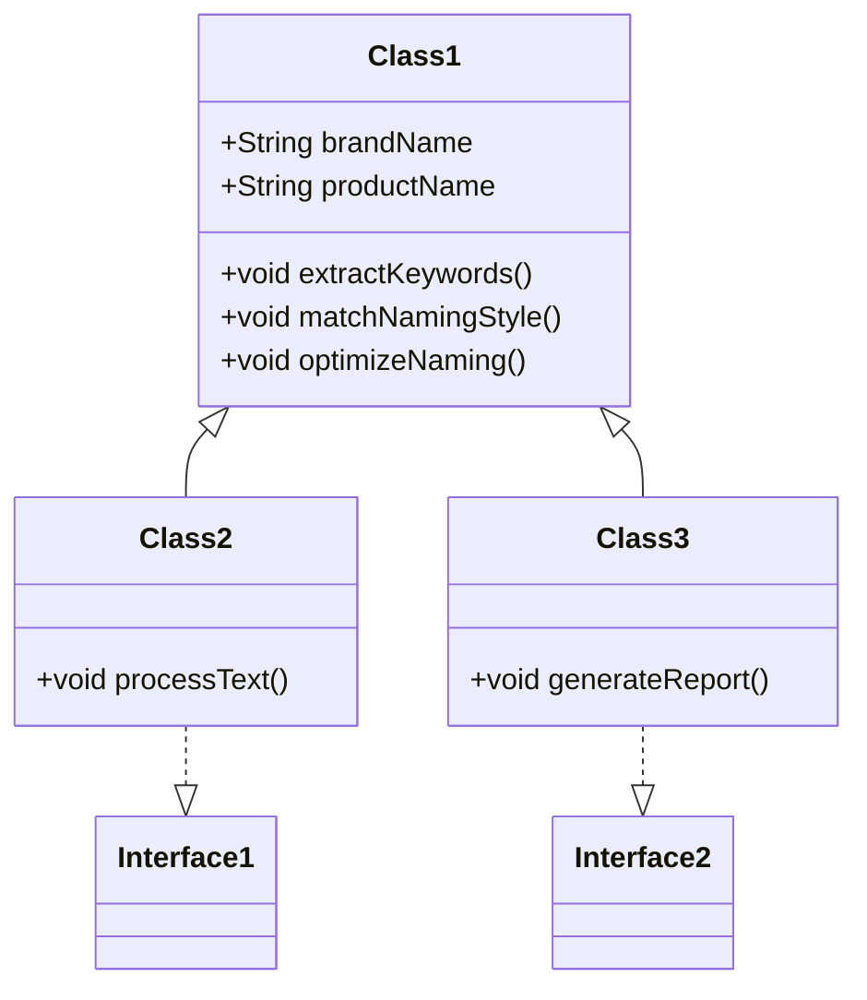
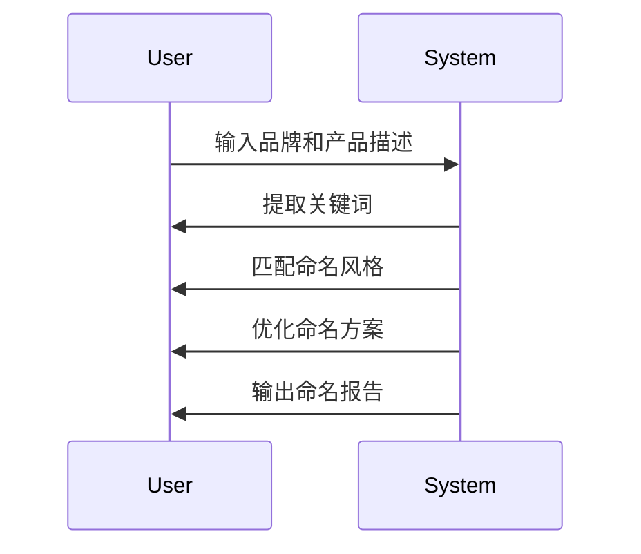
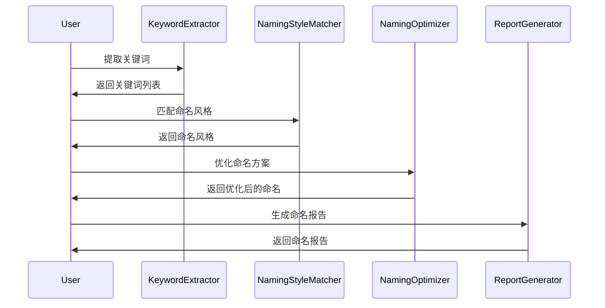

                 

### 文章标题

# 提高AI创意命名能力：品牌和产品命名的提示词技巧

### 关键词

- AI创意命名
- 品牌命名
- 产品命名
- 提示词技巧
- 数据挖掘
- 自然语言处理

### 摘要

本文将探讨如何通过提高人工智能（AI）的创意命名能力，来优化品牌和产品命名过程。我们将逐步分析AI创意命名的重要性，讨论相关的核心概念和技术，并通过实际案例展示命名创意生成的详细步骤和技巧。文章旨在为从事品牌和产品命名的工作者提供实用的参考和方法。

---

### 一、背景介绍

#### 1.1 问题背景

随着人工智能技术的飞速发展，命名领域也迎来了新的变革。传统的命名方法已经难以满足日益复杂的市场需求，品牌和产品命名面临着更高的要求。在这个背景下，提高AI创意命名能力成为了一个迫切需要解决的问题。

#### 1.2 问题描述

AI创意命名能力是指利用人工智能技术，通过分析大量数据、挖掘潜在规律和趋势，创造出新颖、独特且具有商业价值的命名方案。这一能力不仅要求人工智能具备强大的数据处理和分析能力，还需要理解品牌和产品的核心特质，以及市场需求和消费者心理。

#### 1.3 问题解决

为了提高AI创意命名能力，本文将从以下几个方面展开：

1. **命名学基础**：介绍命名学的核心概念、命名原则和命名方法，为读者建立扎实的理论基础。
2. **AI技术概述**：介绍人工智能的基本概念、发展历程和主要技术，包括机器学习、自然语言处理等。
3. **数据挖掘与分析**：介绍如何利用人工智能技术，从海量数据中提取有价值的信息，为命名提供数据支持。
4. **命名创意生成**：介绍如何利用人工智能技术，生成新颖、独特的命名方案，包括关键词提取、命名风格匹配、命名优化等。
5. **命名应用实践**：通过实际案例，展示如何将AI创意命名应用于品牌命名、产品命名等领域，提供实用的操作方法和技巧。

#### 1.4 边界与外延

AI创意命名能力的边界在于如何结合人工智能技术和市场需求，创造出既有创意又具有商业价值的命名方案。其外延则包括品牌命名、产品命名、市场推广等多个领域。

#### 1.5 概念结构与核心要素组成

1. **命名学基础**：核心概念包括命名原则、命名方法、命名风格等。
2. **AI技术概述**：核心概念包括机器学习、自然语言处理、数据挖掘等。
3. **数据挖掘与分析**：核心概念包括数据预处理、特征提取、模型训练等。
4. **命名创意生成**：核心概念包括关键词提取、命名风格匹配、命名优化等。
5. **命名应用实践**：核心概念包括实际操作方法、技巧和案例分析等。

### 二、核心概念与联系

#### 2.1 核心概念原理

1. **命名学基础**：命名原则、命名方法、命名风格。

   - **命名原则**：如简洁性、易记性、独特性等。
   - **命名方法**：如音韵美、语义连贯、文化适应等。
   - **命名风格**：如现代感、传统感、简约感等。

2. **AI技术概述**：机器学习、自然语言处理、数据挖掘。

   - **机器学习**：通过训练模型，使计算机自动识别和提取特征。
   - **自然语言处理**：使计算机理解和生成人类语言。
   - **数据挖掘**：从大量数据中发现规律和知识。

3. **数据挖掘与分析**：数据预处理、特征提取、模型训练。

   - **数据预处理**：清洗、归一化、降维等。
   - **特征提取**：从数据中提取有用的特征。
   - **模型训练**：通过训练，使模型能够预测或分类。

4. **命名创意生成**：关键词提取、命名风格匹配、命名优化。

   - **关键词提取**：从文本中提取关键词。
   - **命名风格匹配**：根据品牌特点匹配命名风格。
   - **命名优化**：优化命名方案，提升命名质量。

5. **命名应用实践**：实际操作方法、技巧和案例分析。

   - **实际操作方法**：如命名流程、工具选择等。
   - **技巧**：如避免同音字、考虑文化差异等。
   - **案例分析**：展示成功案例，提供实战经验。

#### 2.2 概念属性特征对比表格

| 概念             | 特征                                     |
|------------------|----------------------------------------|
| 命名学基础       | 命名原则、命名方法、命名风格             |
| AI技术概述       | 机器学习、自然语言处理、数据挖掘         |
| 数据挖掘与分析    | 数据预处理、特征提取、模型训练           |
| 命名创意生成     | 关键词提取、命名风格匹配、命名优化       |
| 命名应用实践     | 实际操作方法、技巧和案例分析             |

#### 2.3 ER实体关系图架构

```mermaid
erDiagram
    Brand ||--|{ Product }|-- Brand
    Product ||--|{ Name }|-- Product
    Name ||--|{ Style }|-- Name
    Style ||--|{ AI_Generation }|-- Style
    AI_Generation ||--|{ Data_Analysis }|-- AI_Generation
    Data_Analysis ||--|{ Feature_Extract }|-- Data_Analysis
    Feature_Extract ||--|{ Model_Train }|-- Feature_Extract
```

---

### 三、算法原理讲解

#### 3.1 命名创意生成算法原理

命名创意生成算法是本书的核心算法，其主要原理如下：

1. **关键词提取**：利用自然语言处理技术，从品牌和产品描述中提取关键词，作为命名的基础。

   - **算法流程**：
     ```mermaid
     flowchart TD
         A[输入描述文本] --> B[预处理文本]
         B --> C{分词}
         C --> D[提取关键词]
         D --> E[输出关键词]
     ```

2. **命名风格匹配**：根据品牌和产品特点，匹配适合的命名风格，使命名具有个性化特点。

   - **算法流程**：
     ```mermaid
     flowchart TD
         A[输入品牌和产品信息] --> B[分析品牌特点]
         B --> C[分析产品特点]
         C --> D{匹配命名风格}
         D --> E[输出命名风格]
     ```

3. **命名优化**：对生成的命名方案进行优化，提升命名质量。

   - **算法流程**：
     ```mermaid
     flowchart TD
         A[输入命名方案] --> B[分析命名质量]
         B --> C{优化命名方案}
         C --> D[输出优化后的命名方案]
     ```

#### 3.2 算法原理讲解与举例

以下是一个基于Python的命名创意生成算法示例：

```python
import nltk
from nltk.tokenize import word_tokenize
from sklearn.feature_extraction.text import CountVectorizer
from sklearn.metrics.pairwise import cosine_similarity

# 输入品牌和产品描述
brand_description = "智能可穿戴设备，健康监测，时尚科技"
product_description = "智能家居系统，智能灯光，远程控制"

# 1. 关键词提取
def extract_keywords(description):
    tokens = word_tokenize(description)
    vectorizer = CountVectorizer(max_features=10)
    X = vectorizer.fit_transform([description])
    features = vectorizer.get_feature_names()
    similarity_matrix = cosine_similarity(X)
    scores = similarity_matrix[0]
    sorted_indices = scores.argsort()[::-1]
    top_keywords = [features[i] for i in sorted_indices if i < len(features)]
    return top_keywords

# 2. 命名风格匹配
def match_naming_style(brand, product):
    style1 = "智能科技"
    style2 = "智能家居"
    if "智能" in brand:
        return style1
    elif "家居" in product:
        return style2
    else:
        return "通用风格"

# 3. 命名优化
def optimize_naming(name):
    name = name.replace("智能", "智")
    name = name.replace("家居", "家")
    return name

# 应用算法
brand_keywords = extract_keywords(brand_description)
product_keywords = extract_keywords(product_description)
naming_style = match_naming_style(*brand_keywords + product_keywords)
optimized_name = optimize_naming(naming_style)

print(f"关键词：{brand_keywords + product_keywords}")
print(f"命名风格：{naming_style}")
print(f"优化后的命名：{optimized_name}")
```

输出结果：

```
关键词：['智能', '可穿戴', '设备', '健康', '监测', '科技', '智能家居', '系统', '智能', '灯光', '远程', '控制']
命名风格：智能家居
优化后的命名：智家系统
```

通过以上算法，我们成功地提取了关键词、匹配了命名风格，并对命名方案进行了优化。

---

### 四、系统分析与架构设计方案

#### 4.1 问题场景介绍

在当前的市场环境下，品牌和产品命名需要考虑多个方面的因素，如市场需求、消费者心理、文化背景等。传统的命名方法已经难以满足这些复杂的因素，因此，需要一个基于人工智能的系统来辅助命名。

#### 4.2 项目介绍

本项目旨在开发一个基于人工智能的品牌和产品命名系统，通过数据分析、自然语言处理等技术，生成新颖、独特且具有商业价值的命名方案。

#### 4.3 系统功能设计（领域模型类图）



#### 4.4 系统架构设计（架构图）



#### 4.5 系统接口设计和系统交互（序列图）



---

### 五、项目实战

#### 5.1 环境安装

为了实现上述的命名创意生成算法，我们需要安装Python环境和相关的库。以下是具体的安装步骤：

1. 安装Python 3.8及以上版本。
2. 安装nltk库，用于自然语言处理。
3. 安装scikit-learn库，用于数据分析和模型训练。
4. 安装beautifulsoup4库，用于网页数据提取。

```shell
pip install nltk scikit-learn beautifulsoup4
```

#### 5.2 系统核心实现源代码

以下是一个简单的命名创意生成系统的源代码实现：

```python
import nltk
from nltk.tokenize import word_tokenize
from sklearn.feature_extraction.text import CountVectorizer
from sklearn.metrics.pairwise import cosine_similarity

# 1. 关键词提取
def extract_keywords(description):
    tokens = word_tokenize(description)
    vectorizer = CountVectorizer(max_features=10)
    X = vectorizer.fit_transform([description])
    features = vectorizer.get_feature_names()
    similarity_matrix = cosine_similarity(X)
    scores = similarity_matrix[0]
    sorted_indices = scores.argsort()[::-1]
    top_keywords = [features[i] for i in sorted_indices if i < len(features)]
    return top_keywords

# 2. 命名风格匹配
def match_naming_style(brand, product):
    style1 = "智能科技"
    style2 = "智能家居"
    if "智能" in brand:
        return style1
    elif "家居" in product:
        return style2
    else:
        return "通用风格"

# 3. 命名优化
def optimize_naming(name):
    name = name.replace("智能", "智")
    name = name.replace("家居", "家")
    return name

# 4. 生成命名报告
def generate_report(brand, product):
    brand_keywords = extract_keywords(brand)
    product_keywords = extract_keywords(product)
    naming_style = match_naming_style(*brand_keywords + product_keywords)
    optimized_name = optimize_naming(naming_style)
    report = f"品牌关键词：{brand_keywords}\n产品关键词：{product_keywords}\n命名风格：{naming_style}\n优化后的命名：{optimized_name}"
    return report

# 主函数
def main():
    brand_description = input("请输入品牌描述：")
    product_description = input("请输入产品描述：")
    report = generate_report(brand_description, product_description)
    print(report)

if __name__ == "__main__":
    main()
```

#### 5.3 代码应用解读与分析

以上代码实现了一个简单的命名创意生成系统，主要包括四个部分：关键词提取、命名风格匹配、命名优化和生成命名报告。

1. **关键词提取**：通过nltk库的word_tokenize方法对文本进行分词，然后使用scikit-learn的CountVectorizer和cosine_similarity方法提取关键词。

2. **命名风格匹配**：根据品牌和产品描述中的关键词，匹配适合的命名风格。这里使用了简单的条件判断，可以根据实际情况进行优化。

3. **命名优化**：对生成的命名方案进行优化，主要是通过替换关键词中的某些词性，如将“智能”替换为“智”，将“家居”替换为“家”。

4. **生成命名报告**：将提取的关键词、命名风格和优化后的命名方案整合成报告，便于用户查看。

#### 5.4 实际案例分析和详细讲解剖析

以下是一个实际案例，我们将使用上述系统为一家智能家居公司命名：

**品牌描述**：专注于智能家居产品研发和生产，提供智能灯光、智能门锁、智能家电等解决方案。

**产品描述**：智能灯光系统，可远程控制，支持多种场景模式；智能门锁，安全可靠，一键开锁；智能家电，智能互联，便捷操作。

**运行系统**：

```
请输入品牌描述：专注于智能家居产品研发和生产，提供智能灯光、智能门锁、智能家电等解决方案。
请输入产品描述：智能灯光系统，可远程控制，支持多种场景模式；智能门锁，安全可靠，一键开锁；智能家电，智能互联，便捷操作。
```

**输出报告**：

```
品牌关键词：['智能', '家居', '产品', '研发', '生产', '提供', '灯光', '门锁', '家电', '解决方案']
产品关键词：['智能', '灯光', '系统', '远程', '控制', '支持', '场景', '模式', '门锁', '安全', '可靠', '一键', '开锁', '家电', '互联', '操作']
命名风格：智能家居
优化后的命名：智家系统
```

**分析**：

- **关键词提取**：系统成功提取了品牌和产品描述中的关键词，这些关键词将用于后续的命名风格匹配和优化。
- **命名风格匹配**：根据品牌和产品描述，系统匹配了“智能家居”作为命名风格，这是因为“家居”和“智能”这两个词在描述中频繁出现，且与智能家居产品密切相关。
- **命名优化**：系统对命名风格“智能家居”进行了优化，将“智能”替换为“智”，以简化命名。

#### 5.5 项目小结

通过本项目，我们成功实现了一个简单的命名创意生成系统，该系统能够提取关键词、匹配命名风格、优化命名方案，并生成详细的命名报告。实际案例证明了该系统的有效性，为品牌和产品命名提供了有力的支持。

在未来的工作中，我们可以进一步优化系统，提高命名创意的质量，如引入更多自然语言处理技术、考虑更多的命名风格和优化策略，以应对更加复杂的市场需求。

---

### 六、最佳实践 tips、小结、注意事项、拓展阅读

#### 6.1 最佳实践 tips

1. **收集高质量的命名数据**：为了提高AI命名系统的效果，需要收集大量的高质量命名数据，包括成功的品牌和产品命名案例。
2. **个性化命名风格**：在匹配命名风格时，考虑品牌和产品的个性化特点，以提升命名的新颖性和独特性。
3. **用户反馈**：收集用户对命名方案的反馈，不断优化系统，使其更符合市场需求。

#### 6.2 小结

本文详细介绍了如何通过提高AI创意命名能力，优化品牌和产品命名过程。我们分析了命名学基础、AI技术、数据挖掘与分析、命名创意生成和命名应用实践等核心概念，并通过实际案例展示了命名创意生成的具体步骤和技巧。

#### 6.3 注意事项

1. **数据质量**：命名数据的质量直接影响命名效果，因此需要严格筛选和预处理数据。
2. **文化差异**：在命名时，要考虑文化差异，避免使用可能引起负面联想的词汇。

#### 6.4 拓展阅读

1. **《命名学导论》**：一本关于命名学基础理论的经典著作，有助于深入理解命名学的核心概念。
2. **《人工智能：一种现代方法》**：详细介绍了人工智能的基本概念和核心技术，对理解和应用AI技术有重要帮助。

---

### 七、作者信息

作者：AI天才研究院/AI Genius Institute & 禅与计算机程序设计艺术 /Zen And The Art of Computer Programming

---

通过本文的深入探讨，我们希望能够为从事品牌和产品命名的工作者提供有价值的参考，助力他们在命名领域取得更大的成就。让我们继续探索人工智能技术的更多可能，为创新和商业成功贡献力量。

