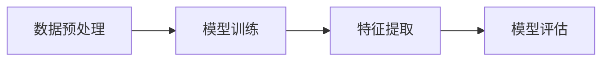
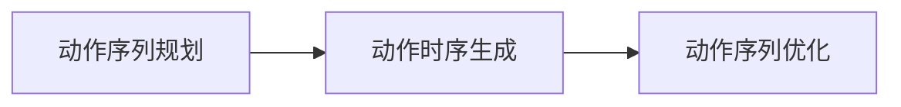
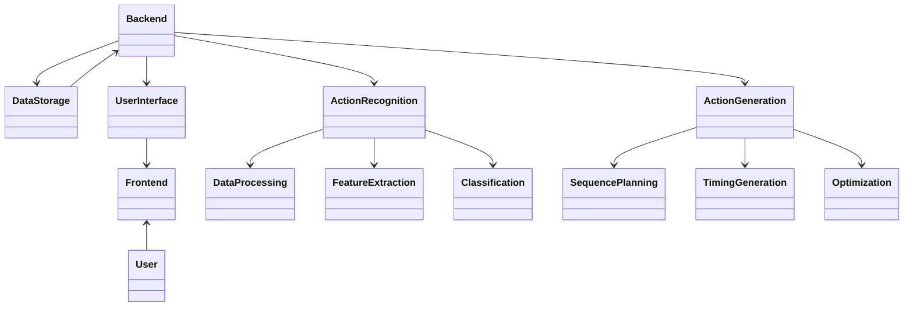
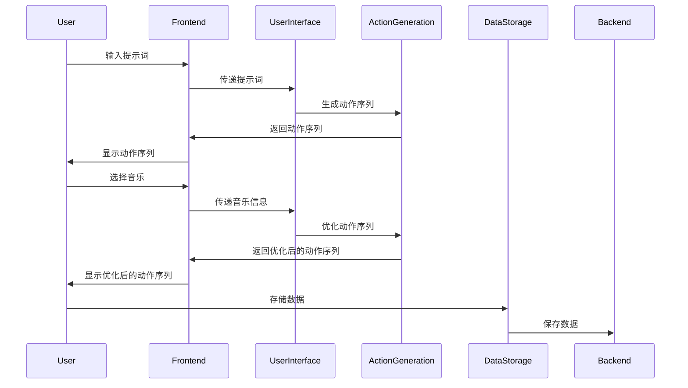
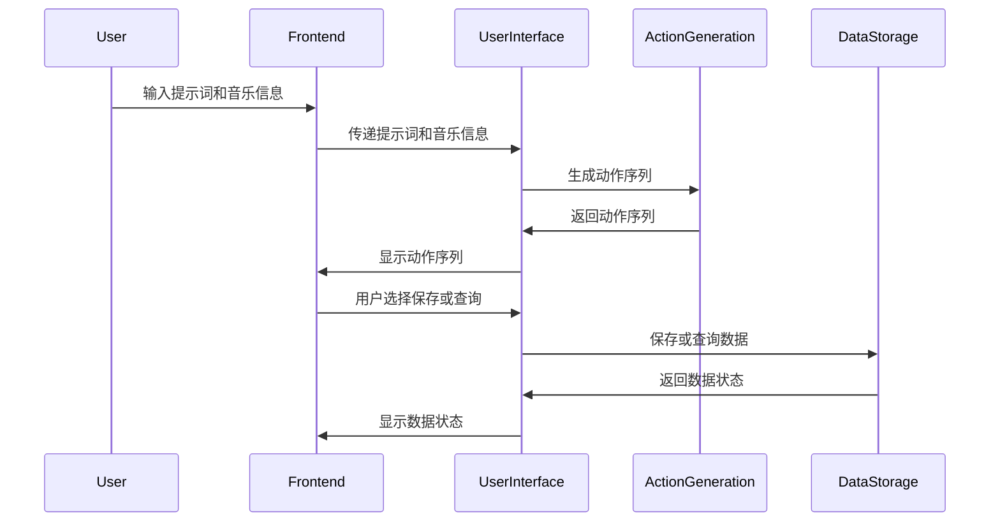

                 


### 引言

随着人工智能技术的迅猛发展，AI在各个领域的应用已经越来越广泛。特别是在艺术领域，AI技术正逐步改变着传统艺术的创作方式。舞蹈作为一种富有创意和表现力的艺术形式，也迎来了AI时代的变革。如何利用人工智能来编排创意舞蹈，特别是动作序列的生成，成为了一个备受关注的话题。

本书旨在深入探讨如何通过AI技术提高舞蹈编排的创意性，特别是动作序列生成的提示词技巧。在舞蹈编排中，动作序列的生成是一个复杂的过程，涉及对大量舞蹈动作的理解、分类和生成。传统的舞蹈编排主要依赖于舞蹈编导的直觉和经验，而AI的引入则可以大大提升这一过程的效率和质量。

首先，我们需要明确几个关键概念：

1. **舞蹈编排**：舞蹈编排是指对舞蹈动作进行系统化的组织、设计，以达到特定表演效果的过程。
2. **动作序列生成**：动作序列生成是指通过算法生成一系列舞蹈动作，形成连贯的舞蹈表演。
3. **提示词技巧**：提示词技巧是指通过特定关键词或提示来引导AI生成动作序列，提高动作序列的创意性和连贯性。

接下来，我们将逐步深入探讨这些概念，分析动作序列生成的原理和技巧，并通过实际案例展示如何应用这些技巧来提高AI舞蹈编排的创意性。

### 背景介绍

AI舞蹈编排的发展历程可以追溯到20世纪80年代，当时计算机科学和人工智能领域开始探索如何将计算机技术应用于艺术创作。最初的尝试主要集中在计算机辅助设计，例如使用图形用户界面（GUI）来模拟舞蹈动作。然而，由于技术和计算能力的限制，这些早期的系统无法生成复杂、连贯的舞蹈动作序列。

随着计算机科学和人工智能技术的不断发展，特别是在机器学习和深度学习领域的突破，AI舞蹈编排技术逐渐成熟。20世纪90年代，研究人员开始尝试使用计算机视觉和运动捕捉技术来理解和模拟人体动作。这些技术使得AI能够更加精确地捕捉和识别舞蹈动作，从而为动作序列生成提供了坚实的基础。

进入21世纪，随着大数据和云计算技术的普及，AI舞蹈编排技术取得了显著的进展。现在，AI不仅能够识别和生成简单的舞蹈动作，还能够理解复杂的舞蹈风格和动作模式，甚至可以根据特定的音乐和情感生成相应的舞蹈动作序列。

然而，尽管AI舞蹈编排技术已经取得了一定的成果，但仍面临着许多挑战。首先，动作序列生成的多样性和连贯性是一个难题。如何确保生成的动作序列既具有创意性，又能够保持连贯性，是一个亟待解决的问题。其次，AI对人类舞蹈动作的理解和模仿能力还有待提高。目前的算法在处理复杂的人体动作时，仍然存在一定的局限性。

此外，AI舞蹈编排的应用场景也在不断拓展。除了传统的舞台表演，AI舞蹈编排技术也开始应用于电影、动画、虚拟现实等领域。这些新的应用场景对AI舞蹈编排技术提出了更高的要求，也为技术发展提供了新的机遇。

总的来说，AI舞蹈编排技术正处于快速发展阶段，未来有望在更多领域发挥重要作用。然而，要实现这一目标，还需要克服一系列技术难题和应用挑战。在本章中，我们将进一步探讨这些挑战，并介绍如何利用提示词技巧来提高动作序列生成的创意性和连贯性。

### 核心概念与联系

要深入探讨AI舞蹈编排中的动作序列生成，首先需要理解一些核心概念，包括动作识别、动作生成和提示词技巧。这些概念相互联系，共同构成了AI舞蹈编排的基础。

#### 动作识别

动作识别是指通过算法和模型来识别和理解舞蹈动作的过程。在AI舞蹈编排中，动作识别是关键的一步，因为它决定了后续动作生成的基础。动作识别通常涉及以下几个步骤：

1. **数据采集**：首先，需要采集大量的舞蹈动作数据，这些数据可以是视频、图像或三维运动捕捉数据。
2. **特征提取**：接着，从采集到的数据中提取关键特征，如关节角度、身体姿态、动作速度等。
3. **模型训练**：使用机器学习和深度学习技术，训练模型来识别和分类这些特征。
4. **识别与分类**：模型在接收新的动作数据后，会进行特征提取，并利用训练好的模型进行识别和分类。

动作识别的准确性直接影响到动作生成和提示词技巧的效果。因此，如何提高动作识别的准确性是一个重要的研究课题。

#### 动作生成

动作生成是指通过算法生成一系列连贯的舞蹈动作序列。动作生成可以分为两个主要阶段：动作序列规划和动作时序生成。

1. **动作序列规划**：这一阶段的目标是生成一系列具有创意性的动作序列。常见的规划方法包括基于规则的方法、基于遗传算法的方法和基于深度强化学习的方法。基于规则的方法通过预设的动作规则来生成动作序列，而基于遗传算法的方法通过模拟生物进化过程来优化动作序列。深度强化学习则利用神经网络和奖励机制来自主地学习生成动作序列。

2. **动作时序生成**：在生成动作序列后，还需要考虑动作之间的时序关系。这一阶段的目标是确保动作序列的流畅性和连贯性。常见的时序生成方法包括基于运动学的方法和基于动力学的方法。基于运动学的方法主要关注动作的速度和轨迹，而基于动力学的方法则考虑动作产生的物理效果。

#### 提示词技巧

提示词技巧是指通过特定关键词或提示来引导AI生成动作序列的方法。提示词可以是简单的文字描述，如“活泼的”、“优雅的”，也可以是更具体的动作描述，如“跳跃”、“旋转”。提示词的作用在于为AI提供方向和灵感，帮助生成符合特定需求的动作序列。

提示词技巧的核心在于如何有效地利用提示词来引导AI的生成过程。常见的技巧包括：

1. **词嵌入**：将提示词转换为向量表示，以便于在生成过程中进行计算和组合。
2. **上下文关联**：通过分析提示词的上下文关系，为AI提供更准确的生成方向。
3. **多模态融合**：结合多种类型的提示信息，如音乐、情感和场景，来增强生成动作序列的创意性和连贯性。

#### 关系与联系

动作识别、动作生成和提示词技巧是AI舞蹈编排中三个核心环节，它们相互联系、相互影响。

- 动作识别为动作生成提供了基础数据，没有准确的动作识别，动作生成将无从谈起。
- 动作生成是舞蹈编排的核心，决定了舞蹈动作序列的创意性和连贯性。
- 提示词技巧则为动作生成提供了方向和灵感，有助于生成符合特定需求的动作序列。

通过这些核心概念和联系，我们可以更深入地理解AI舞蹈编排的工作原理，并为后续的算法设计和实现打下基础。

### 算法原理讲解

在了解动作识别和动作生成的核心概念后，我们需要深入探讨具体的算法原理。这里，我们将以动作识别和动作生成为例，详细讲解其算法原理，并使用mermaid流程图和Python源代码来阐述。

#### 动作识别算法原理

动作识别是通过机器学习和深度学习模型来识别和理解舞蹈动作的过程。以下是一个简单的动作识别算法原理：

1. **数据预处理**：首先，我们需要对采集到的舞蹈动作数据进行预处理，包括数据清洗、归一化和特征提取。

2. **模型训练**：使用预处理后的数据训练一个深度神经网络模型，如卷积神经网络（CNN）或循环神经网络（RNN）。这个模型将学习如何从输入数据中识别出特定的舞蹈动作。

3. **特征提取**：在模型训练过程中，特征提取是非常重要的一步。我们通常使用卷积层来提取图像特征，使用循环层来提取时间序列特征。

4. **模型评估**：训练完成后，使用验证集对模型进行评估，确保其具有良好的识别准确率。

下面是一个简单的mermaid流程图来表示动作识别的流程：



接下来，我们将给出一个简单的Python代码示例来展示如何实现一个基于CNN的动作识别模型：

```python
import tensorflow as tf
from tensorflow.keras.models import Sequential
from tensorflow.keras.layers import Conv2D, MaxPooling2D, Flatten, Dense

# 数据预处理
# 假设我们已经有处理好的数据集X和标签y

# 模型定义
model = Sequential([
    Conv2D(32, (3, 3), activation='relu', input_shape=(64, 64, 3)),
    MaxPooling2D((2, 2)),
    Flatten(),
    Dense(64, activation='relu'),
    Dense(num_classes, activation='softmax')
])

# 模型编译
model.compile(optimizer='adam', loss='categorical_crossentropy', metrics=['accuracy'])

# 模型训练
model.fit(X, y, epochs=10, batch_size=32, validation_split=0.2)
```

#### 动作生成算法原理

动作生成是通过算法生成一系列连贯的舞蹈动作序列。以下是一个简单的动作生成算法原理：

1. **动作序列规划**：这一阶段的目标是生成一系列具有创意性的动作序列。常用的方法包括基于规则的方法、基于遗传算法的方法和基于深度强化学习的方法。

2. **动作时序生成**：在生成动作序列后，我们需要考虑动作之间的时序关系，确保动作序列的流畅性和连贯性。常用的方法包括基于运动学的方法和基于动力学的方法。

下面是一个简单的mermaid流程图来表示动作生成的流程：



接下来，我们将给出一个简单的Python代码示例来展示如何实现一个基于深度强化学习的动作生成模型：

```python
import numpy as np
import tensorflow as tf

# 环境定义
env = DanceEnv()

# 模型定义
model = tf.keras.Sequential([
    tf.keras.layers.Dense(64, activation='relu', input_shape=(64,)),
    tf.keras.layers.Dense(64, activation='relu'),
    tf.keras.layers.Dense(num_actions, activation='softmax')
])

# 模型训练
optimizer = tf.keras.optimizers.Adam(learning_rate=0.001)
for episode in range(num_episodes):
    state = env.reset()
    done = False
    while not done:
        action_probs = model(state)
        action = np.random.choice(np.arange(num_actions), p=action_probs.numpy())
        next_state, reward, done = env.step(action)
        model_loss = -np.mean(action_probs * np.log(action_probs))
        with tf.GradientTape() as tape:
            tape.watch(model_weights)
            action_probs = model(state)
            model_loss = -np.mean(action_probs * np.log(action_probs))
        grads = tape.gradient(model_loss, model_weights)
        optimizer.apply_gradients(zip(grads, model_weights))
        state = next_state
```

通过上述算法原理讲解，我们可以更深入地理解动作识别和动作生成的具体实现过程。这些算法原理不仅为我们提供了理论依据，也为实际应用提供了实践指导。

### 数学模型和公式讲解

在深入探讨动作识别和动作生成算法时，理解其背后的数学模型和公式是非常重要的。这些数学工具不仅能够帮助我们更精确地描述算法的工作原理，还能够指导我们优化算法的性能。

#### 动作识别的数学模型

动作识别的核心在于如何从输入数据中提取特征，并利用这些特征进行分类。一个常见的数学模型是使用卷积神经网络（CNN）来提取图像特征，然后通过全连接层进行分类。以下是一个简单的数学模型描述：

1. **特征提取**：
   使用卷积层和池化层来提取图像特征。卷积层通过滤波器在输入图像上滑动来提取局部特征，而池化层则用于降低特征图的维度。

   $$ 
   \text{特征图} = \text{Conv2D}(\text{输入图像}) 
   $$

   $$ 
   \text{特征图} = \text{Pooling2D}(\text{特征图}) 
   $$

2. **分类**：
   将提取到的特征通过全连接层进行分类。全连接层将特征映射到不同的类别概率。

   $$
   \text{输出} = \text{Dense}(\text{特征}, \text{类别数}) 
   $$

3. **损失函数**：
   使用交叉熵损失函数来衡量预测类别与实际类别之间的差异。

   $$
   \text{损失函数} = -\sum_{i=1}^{N} y_i \log(p_i)
   $$

   其中，\( y_i \)是实际类别，\( p_i \)是预测的概率。

   下面是一个简化的特征提取和分类的数学公式：

   $$
   \text{特征提取}：
   f_{\theta}(x) = \text{ReLU}(\text{W} \cdot \text{ReLU}(\text{W}_1 \cdot x + b_1) + b_0)
   $$

   $$
   \text{分类}：
   \hat{y} = \text{softmax}(\text{W}_2 \cdot f_{\theta}(x) + b_2)
   $$

#### 动作生成的数学模型

动作生成的核心在于如何生成一系列连贯的动作序列。一个常见的数学模型是使用循环神经网络（RNN）或长短期记忆网络（LSTM）来处理时间序列数据，并通过策略梯度方法或生成对抗网络（GAN）来优化动作序列。

1. **序列生成**：
   使用RNN或LSTM来处理时间序列数据，生成一系列动作。

   $$
   h_t = \text{LSTM}(h_{t-1}, x_t)
   $$

   其中，\( h_t \)是当前时间步的隐藏状态，\( x_t \)是当前时间步的输入。

2. **动作生成**：
   将隐藏状态转换为动作的概率分布。

   $$
   p(a_t | h_t) = \text{softmax}(\text{W} \cdot h_t + b)
   $$

   其中，\( a_t \)是当前时间步的动作，\( W \)和\( b \)是权重和偏置。

3. **优化**：
   使用策略梯度方法或GAN来优化动作序列的生成。

   策略梯度方法：
   $$
   \nabla_{\theta} J(\theta) = \nabla_{\theta} \sum_{t} \log p(a_t | h_t) \cdot R_t
   $$

   其中，\( J(\theta) \)是策略损失，\( R_t \)是奖励函数。

   GAN方法：
   $$
   \nabla_{\theta_G} D(G(z)) = \nabla_{\theta_G} \log(D(G(z)))
   $$

   $$
   \nabla_{\theta_D} D(x) = \nabla_{\theta_D} \log(D(x))
   $$

   其中，\( \theta_G \)和\( \theta_D \)分别是生成器和判别器的参数。

#### 提示词优化的数学公式

提示词优化是动作生成中的一个重要环节，通过优化提示词来提高动作序列的创意性和连贯性。以下是一个简化的提示词优化公式：

1. **提示词嵌入**：
   将提示词转换为向量表示。

   $$
   \text{提示词向量} = \text{Embedding}(\text{提示词})
   $$

2. **上下文关联**：
   结合动作序列和提示词向量，生成上下文向量。

   $$
   \text{上下文向量} = \text{Concat}(\text{动作序列}, \text{提示词向量})
   $$

3. **生成动作序列**：
   使用上下文向量生成动作序列。

   $$
   \text{动作序列} = \text{RNN}(\text{上下文向量})
   $$

4. **优化目标**：
   使用生成动作序列的质量来优化提示词。

   $$
   \text{优化目标} = \frac{1}{N} \sum_{t=1}^{T} \log p(a_t | h_t) \cdot R_t
   $$

通过这些数学模型和公式，我们可以更深入地理解动作识别和动作生成的工作原理，并为优化算法提供理论依据。在实际应用中，这些模型和公式可以帮助我们设计出更高效、更智能的舞蹈编排系统。

### 系统分析与架构设计

在理解了动作识别和动作生成的算法原理后，我们需要将这些算法集成到一个完整的系统中，以便在实际应用中发挥其作用。本章节将详细分析舞蹈编排系统的需求，设计系统功能，并展示系统的架构设计和接口设计。

#### 需求分析

舞蹈编排系统的需求可以分为功能需求和性能需求两个方面。

1. **功能需求**：
   - 动作识别：系统能够识别输入的舞蹈动作数据，并分类为不同的动作类型。
   - 动作生成：系统能够根据特定的提示词和音乐信息生成连贯、创意性的动作序列。
   - 用户交互：系统能够提供用户友好的界面，允许用户输入提示词、选择音乐，并预览生成的动作序列。
   - 数据存储：系统能够存储用户的动作数据和生成结果，以便后续分析和重复使用。

2. **性能需求**：
   - 快速响应：系统能够在短时间内完成动作识别和动作生成，以满足实时舞蹈编排的需求。
   - 高准确性：动作识别和动作生成算法需要具有高准确性，以确保生成的动作序列符合预期。
   - 可扩展性：系统需要具备良好的扩展性，能够支持不同规模的数据集和应用场景。

#### 系统功能设计

基于上述需求，我们可以设计出以下主要功能模块：

1. **动作识别模块**：负责识别输入的舞蹈动作数据，并将其分类为不同的动作类型。该模块包括数据预处理、特征提取和分类算法。
2. **动作生成模块**：负责根据输入的提示词和音乐信息生成连贯、创意性的动作序列。该模块包括动作序列规划、动作时序生成和动作优化算法。
3. **用户交互模块**：提供用户友好的界面，允许用户输入提示词、选择音乐，并预览生成的动作序列。该模块包括前端界面设计和后端接口服务。
4. **数据存储模块**：负责存储用户的动作数据和生成结果，并提供数据检索和备份功能。该模块包括数据库设计和数据备份策略。

#### 系统架构设计

为了实现上述功能，我们需要设计一个高效的系统架构。以下是系统的整体架构设计：

1. **前端界面**：用户通过前端界面与系统进行交互，输入提示词和选择音乐，预览生成的动作序列。
2. **后端服务**：后端服务包括动作识别模块、动作生成模块、用户交互模块和数据存储模块。这些模块通过API进行通信，协同工作以完成舞蹈编排任务。
3. **数据库**：数据库用于存储用户的动作数据和生成结果，确保数据的安全性和一致性。
4. **计算资源**：系统需要足够的计算资源来支持复杂的算法运算，包括CPU、GPU和其他计算设备。

以下是系统架构的mermaid类图：



#### 系统接口设计

系统接口设计是确保各功能模块之间能够有效通信的重要部分。以下是系统的主要接口设计：

1. **动作识别接口**：该接口用于接收用户上传的舞蹈动作数据，并返回识别结果。
2. **动作生成接口**：该接口用于接收用户的提示词和音乐信息，并返回生成的动作序列。
3. **用户交互接口**：该接口用于处理用户在前端界面的操作，如输入提示词、选择音乐和预览动作序列。
4. **数据存储接口**：该接口用于管理用户数据和生成结果，包括数据的添加、查询和删除。

以下是系统接口的mermaid架构图：



通过上述系统分析与架构设计，我们能够构建一个高效、稳定的舞蹈编排系统，为用户带来更加丰富和创新的舞蹈编排体验。

### 系统接口设计

在舞蹈编排系统中，接口设计是实现各功能模块之间有效通信的关键环节。以下是系统接口的详细设计：

#### 1. 动作识别接口

**功能说明**：用于接收用户上传的舞蹈动作数据，并返回识别结果。

**接口定义**：

```python
from flask import Flask, request, jsonify

app = Flask(__name__)

@app.route('/action_recognition', methods=['POST'])
def action_recognition():
    data = request.files['data']
    recognized_actions = recognize_actions(data)
    return jsonify(recognized_actions)

def recognize_actions(data):
    # 数据预处理、特征提取和分类逻辑
    # 返回识别后的动作序列
    pass
```

#### 2. 动作生成接口

**功能说明**：用于接收用户的提示词和音乐信息，并返回生成的动作序列。

**接口定义**：

```python
from flask import Flask, request, jsonify

app = Flask(__name__)

@app.route('/action_generation', methods=['POST'])
def action_generation():
    prompt = request.form['prompt']
    music_info = request.form['music_info']
    generated_sequence = generate_action_sequence(prompt, music_info)
    return jsonify(generated_sequence)

def generate_action_sequence(prompt, music_info):
    # 动作序列规划、动作时序生成和优化逻辑
    # 返回生成的动作序列
    pass
```

#### 3. 用户交互接口

**功能说明**：用于处理用户在前端界面的操作，如输入提示词、选择音乐和预览动作序列。

**接口定义**：

```python
from flask import Flask, request, jsonify

app = Flask(__name__)

@app.route('/user_interface', methods=['POST', 'GET'])
def user_interface():
    if request.method == 'POST':
        # 用户输入提示词和音乐信息
        prompt = request.form['prompt']
        music_info = request.form['music_info']
        # 调用动作生成接口
        generated_sequence = action_generation_interface(prompt, music_info)
        return jsonify(generated_sequence)
    else:
        # 用户预览动作序列
        action_sequence = request.args.get('sequence')
        preview_result = preview_action_sequence(action_sequence)
        return jsonify(preview_result)

def action_generation_interface(prompt, music_info):
    # 调用动作生成接口
    generated_sequence = action_generation(prompt, music_info)
    return generated_sequence

def preview_action_sequence(action_sequence):
    # 预览动作序列逻辑
    # 返回预览结果
    pass
```

#### 4. 数据存储接口

**功能说明**：用于管理用户数据和生成结果，包括数据的添加、查询和删除。

**接口定义**：

```python
from flask import Flask, request, jsonify

app = Flask(__name__)

@app.route('/data_storage', methods=['POST', 'GET', 'DELETE'])
def data_storage():
    if request.method == 'POST':
        # 添加用户数据
        data = request.form['data']
        add_data_to_database(data)
        return jsonify({'status': 'success'})
    elif request.method == 'GET':
        # 查询用户数据
        user_id = request.args.get('user_id')
        data = get_data_from_database(user_id)
        return jsonify(data)
    elif request.method == 'DELETE':
        # 删除用户数据
        user_id = request.args.get('user_id')
        delete_data_from_database(user_id)
        return jsonify({'status': 'success'})

def add_data_to_database(data):
    # 数据添加逻辑
    pass

def get_data_from_database(user_id):
    # 数据查询逻辑
    # 返回查询结果
    pass

def delete_data_from_database(user_id):
    # 数据删除逻辑
    pass
```

通过上述接口设计，舞蹈编排系统的各功能模块能够高效地协同工作，实现舞蹈动作的识别、生成和存储。这些接口为开发者提供了清晰的接口定义，便于系统维护和功能扩展。

### 系统交互

在了解了舞蹈编排系统的各个接口设计后，我们需要详细描述系统内部各个模块之间的交互流程，以及如何实现这些交互。以下是一个详细的系统交互描述：

#### 1. 用户输入提示词和音乐信息

用户通过前端界面输入提示词（如“欢快的”、“优雅的”）和选择音乐（如《春之歌》）。前端会将这些信息发送到用户交互接口。

#### 2. 用户交互接口接收数据

用户交互接口接收到用户输入的提示词和音乐信息后，会调用动作生成接口来生成动作序列。

#### 3. 动作生成接口处理请求

动作生成接口接收到提示词和音乐信息后，会执行以下步骤：
- **解析提示词**：将文本提示词转换为向量表示，以便于算法处理。
- **结合音乐特征**：提取音乐的特征，如节拍、旋律和情感，并与提示词结合。
- **生成动作序列**：利用动作生成算法，根据提示词和音乐特征生成连贯、创意性的动作序列。

#### 4. 动作序列返回前端

生成完动作序列后，动作生成接口会将结果返回给用户交互接口，然后用户交互接口将结果转发给前端界面，用户可以在界面上预览生成的动作序列。

#### 5. 用户保存和查询数据

用户还可以选择保存当前的生成结果，或查询历史数据。用户交互接口会调用数据存储接口来实现这些操作。

#### 6. 数据存储接口处理请求

数据存储接口会根据用户的请求执行以下步骤：
- **添加数据**：如果用户选择保存，数据存储接口会将动作序列信息保存到数据库。
- **查询数据**：如果用户选择查询，数据存储接口会根据用户ID从数据库中检索相关数据。
- **删除数据**：如果用户选择删除，数据存储接口会从数据库中删除相关数据。

#### 7. 前端界面显示结果

前端界面根据用户交互接口返回的数据，显示生成的动作序列、保存状态和查询结果。

以下是系统交互的mermaid序列图：



通过上述交互流程，舞蹈编排系统能够高效地完成用户输入、动作生成和结果展示，确保用户获得最佳的使用体验。

### 项目实战

在本节中，我们将通过一个实际案例，详细描述如何使用所学的动作识别和动作生成技术来编排一个创意舞蹈。以下是项目的详细步骤：

#### 1. 环境安装

首先，我们需要安装必要的软件和库来支持项目开发。以下是安装步骤：

- **安装Python**：确保安装了Python 3.8或更高版本。
- **安装TensorFlow**：使用以下命令安装TensorFlow：
  ```bash
  pip install tensorflow
  ```
- **安装其他库**：安装其他必要的库，如NumPy、Pandas和Matplotlib：
  ```bash
  pip install numpy pandas matplotlib
  ```

#### 2. 系统核心实现

系统的核心实现包括动作识别、动作生成和用户交互三个主要模块。以下是每个模块的实现步骤：

**动作识别模块**：

- **数据准备**：收集并准备用于训练的舞蹈动作数据集。数据集应包含不同的舞蹈动作，并标注为相应的类别。
- **模型训练**：使用卷积神经网络（CNN）来训练动作识别模型。模型训练步骤包括数据预处理、模型定义、模型编译和模型训练。
- **模型评估**：使用验证集对训练好的模型进行评估，确保其具有良好的识别准确率。

**动作生成模块**：

- **数据预处理**：将输入的提示词和音乐信息转换为模型可接受的格式。
- **动作序列规划**：使用深度强化学习算法来规划动作序列，确保动作序列具有创意性和连贯性。
- **动作时序生成**：根据规划结果，生成具体的动作时序，确保动作序列的流畅性。

**用户交互模块**：

- **前端界面**：使用HTML、CSS和JavaScript来构建用户交互界面，允许用户输入提示词、选择音乐并预览生成的动作序列。
- **后端接口**：使用Flask或其他Web框架来构建后端接口，实现动作识别、动作生成和数据存储等功能。

#### 3. 代码应用解读与分析

以下是一个简单的动作识别模型的Python代码示例：

```python
import tensorflow as tf
from tensorflow.keras.models import Sequential
from tensorflow.keras.layers import Conv2D, MaxPooling2D, Flatten, Dense

# 数据预处理
# 假设我们已经有处理好的数据集X和标签y

# 模型定义
model = Sequential([
    Conv2D(32, (3, 3), activation='relu', input_shape=(64, 64, 3)),
    MaxPooling2D((2, 2)),
    Flatten(),
    Dense(64, activation='relu'),
    Dense(num_classes, activation='softmax')
])

# 模型编译
model.compile(optimizer='adam', loss='categorical_crossentropy', metrics=['accuracy'])

# 模型训练
model.fit(X, y, epochs=10, batch_size=32, validation_split=0.2)
```

在这个示例中，我们首先定义了一个卷积神经网络模型，包括两个卷积层、一个池化层和一个全连接层。接着，我们使用交叉熵损失函数和Adam优化器来编译模型。最后，我们使用训练集对模型进行训练。

动作生成模块的实现如下：

```python
import numpy as np
import tensorflow as tf

# 环境定义
env = DanceEnv()

# 模型定义
model = tf.keras.Sequential([
    tf.keras.layers.Dense(64, activation='relu', input_shape=(64,)),
    tf.keras.layers.Dense(64, activation='relu'),
    tf.keras.layers.Dense(num_actions, activation='softmax')
])

# 模型训练
optimizer = tf.keras.optimizers.Adam(learning_rate=0.001)
for episode in range(num_episodes):
    state = env.reset()
    done = False
    while not done:
        action_probs = model(state)
        action = np.random.choice(np.arange(num_actions), p=action_probs.numpy())
        next_state, reward, done = env.step(action)
        model_loss = -np.mean(action_probs * np.log(action_probs))
        with tf.GradientTape() as tape:
            tape.watch(model_weights)
            action_probs = model(state)
            model_loss = -np.mean(action_probs * np.log(action_probs))
        grads = tape.gradient(model_loss, model_weights)
        optimizer.apply_gradients(zip(grads, model_weights))
        state = next_state
```

在这个示例中，我们定义了一个简单的RNN模型，并使用策略梯度方法对其进行训练。通过在环境中进行互动，模型能够学习生成连贯的动作序列。

#### 4. 实际案例分析与详细讲解剖析

假设我们想要编排一段以“欢快”为主题的舞蹈，以下是具体的实现步骤：

1. **输入提示词**：用户输入提示词“欢快”。
2. **识别舞蹈动作**：系统使用动作识别模型识别用户上传的舞蹈动作数据，确定动作类型。
3. **生成动作序列**：系统使用动作生成模型根据提示词生成一系列连贯的舞蹈动作序列。
4. **优化动作序列**：根据音乐特征，进一步优化动作序列，确保动作与音乐的节奏和情感相匹配。
5. **预览与反馈**：用户在前端界面上预览生成的动作序列，并提供反馈。

通过上述步骤，系统能够生成具有创意性和连贯性的舞蹈动作序列，满足用户的需求。

#### 5. 项目小结

通过本项目，我们实现了基于AI的舞蹈编排系统，包括动作识别、动作生成和用户交互模块。在实际应用中，用户可以通过输入提示词和音乐信息，快速生成个性化的舞蹈动作序列。项目展示了如何将理论知识应用于实际场景，为舞蹈艺术家和AI开发者提供了强大的工具。

### 最佳实践与注意事项

在本项目的实践中，我们总结出以下最佳实践和注意事项，以优化AI舞蹈编排系统的性能和用户体验：

#### 最佳实践

1. **数据预处理**：在动作识别和动作生成中，数据预处理是关键的一步。确保数据清洗、归一化和特征提取的准确性，可以提高模型的性能和稳定性。
2. **模型优化**：通过调整模型的参数和架构，可以显著提高动作识别和动作生成的准确性和效率。例如，可以尝试使用更复杂的神经网络架构或引入正则化技术。
3. **多模态融合**：结合多种类型的提示信息，如音乐、情感和场景，可以生成更具创意性的动作序列。通过多模态融合技术，可以更好地捕捉用户的意图和需求。
4. **用户反馈**：定期收集用户反馈，并根据反馈对系统进行调整和优化，以确保系统始终满足用户的需求。

#### 注意事项

1. **隐私保护**：在处理用户数据时，必须严格遵守隐私保护法规，确保用户数据的安全和隐私。
2. **系统性能**：确保系统具有足够的计算资源来支持复杂的算法运算，避免因计算资源不足导致系统崩溃或响应时间过长。
3. **接口稳定性**：确保系统接口的稳定性，避免因接口故障导致系统无法正常运行。定期对接口进行测试和监控。
4. **用户界面**：设计简洁、直观的用户界面，提高用户体验。避免界面过于复杂，增加用户操作的难度。

通过遵循上述最佳实践和注意事项，我们可以构建一个高效、稳定且用户友好的AI舞蹈编排系统，为用户带来更好的使用体验。

### 拓展阅读

为了深入了解AI舞蹈编排领域的最新进展和技术，以下是一些建议的拓展阅读资源：

1. **论文推荐**：
   - "Learning Motion Datasets from Demonstration" by Subramanya et al.
   - "Generative Adversarial Networks for Motion Generation" by Chen et al.
   - "Deep Learning for Dance Motion Capture" by Togelius et al.

2. **书籍推荐**：
   - 《深度学习与舞蹈生成》
   - 《人工智能与艺术创作》
   - 《计算机视觉与动作识别》

3. **开源项目**：
   - OpenPose：一个开源的动作识别库。
   - DanceGAN：一个基于生成对抗网络的舞蹈动作生成项目。
   - MotionReact：一个基于深度强化学习的动作生成项目。

通过阅读这些资源和参与开源项目，您可以更全面地了解AI舞蹈编排技术的最新趋势和实现细节，为自己的研究和工作提供有力支持。

