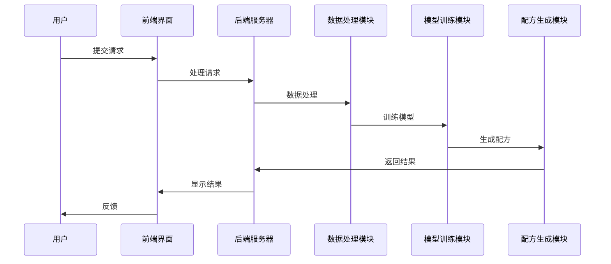
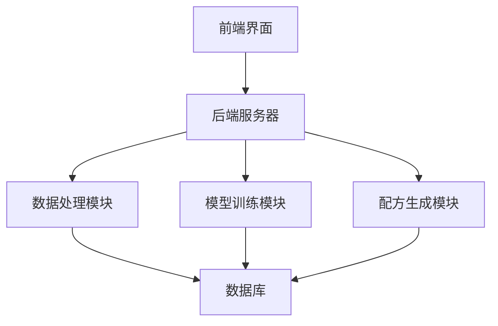

                 

## 提高AI创意调酒能力：口感描述和配方的提示词技巧

> 关键词：AI创意调酒、口感描述、配方设计、提示词技巧、人工智能、神经网络、自然语言处理

> 摘要：本文深入探讨了如何通过人工智能技术提高创意调酒的能力，重点关注了口感描述和配方设计的提示词技巧。通过分析AI在调酒领域的应用、核心概念、算法原理、数学模型、系统设计与项目实战，本文为读者提供了全面的技术指南，帮助读者理解和掌握AI创意调酒的关键技术。

## 目录大纲设计思考过程

在着手设计《提高AI创意调酒能力：口感描述和配方的提示词技巧》的目录大纲之前，我们需要对书名和内容有一个深刻的理解。书名明确了本书的核心目标，即利用AI技术提升创意调酒的能力，并且特别强调了口感描述和配方设计的提示词技巧。以下是目录大纲设计的详细思考过程：

### 理解书名

首先，我们需要明确书名中的几个关键词：

- **AI创意调酒**：这指的是使用人工智能技术来创造独特的调酒体验。
- **口感描述**：这是描述调酒口感的技巧，它涉及到如何通过语言表达调酒的味道、口感和质地。
- **配方设计**：这是设计调酒配方的技巧，包括选择酒精、调味剂和其他成分的比例和组合。
- **提示词技巧**：这是为了帮助调酒师或者AI系统更好地进行创意调酒而使用的提示性词汇或策略。

### 确定目录结构

为了确保内容的完整性和逻辑性，目录需要按照以下结构进行设计：

1. **背景介绍**：介绍AI在调酒领域的应用背景、现状和重要性。
2. **核心概念**：明确书中涉及的核心概念，如AI创意调酒、口感描述、提示词技巧等，并分析这些概念之间的关系。
3. **算法原理**：详细讲解用于AI创意调酒的相关算法原理，如神经网络、自然语言处理等，并使用mermaid流程图和Python代码进行示例说明。
4. **数学模型**：阐述与算法相关的数学模型和公式，并进行详细讲解。
5. **系统分析与架构设计**：分析调酒系统的工作原理，介绍系统功能设计、架构设计和接口设计。
6. **项目实战**：提供具体的AI调酒项目实战案例，包括环境安装、核心实现源代码、代码解读与分析等。
7. **最佳实践与拓展**：总结最佳实践，提供注意事项和拓展阅读。

### 撰写目录大纲

根据上述结构，开始撰写具体的目录大纲，确保每个章节都有明确的主题和内容。在撰写过程中，注重语言的简洁性，避免多余废话，确保每个章节的标题都能准确传达章节内容。

### 校对和调整

完成初稿后，仔细校对目录大纲，确保内容完整、逻辑清晰，并根据需要进行调整。

## 目录大纲设计结果

基于上述思考过程，以下是《提高AI创意调酒能力：口感描述和配方的提示词技巧》的目录大纲：

### 第一部分: AI创意调酒背景与基础

### 第1章: AI创意调酒概述
#### 1.1 AI在调酒领域的应用
##### 1.1.1 AI调酒的优势
##### 1.1.2 AI调酒的应用现状
##### 1.1.3 AI调酒的发展趋势

#### 1.2 AI创意调酒的核心概念
##### 1.2.1 创意调酒的定义
##### 1.2.2 口感描述
##### 1.2.3 提示词技巧

#### 1.3 AI创意调酒的基本原理
##### 1.3.1 神经网络原理
##### 1.3.2 自然语言处理技术
##### 1.3.3 AI调酒系统架构

#### 1.4 AI创意调酒的关键技术
##### 1.4.1 数据收集与处理
##### 1.4.2 算法实现与优化
##### 1.4.3 系统集成与部署

#### 1.5 本章小结
...

### 第二部分: 算法原理与实践

### 第2章: 神经网络与自然语言处理
#### 2.1 神经网络原理
##### 2.1.1 神经网络基础
##### 2.1.2 神经网络结构
##### 2.1.3 神经网络训练

#### 2.2 自然语言处理技术
##### 2.2.1 自然语言处理基础
##### 2.2.2 文本预处理
##### 2.2.3 语言模型与生成

#### 2.3 算法实现与优化
##### 2.3.1 AI调酒算法流程
##### 2.3.2 算法优化技巧
##### 2.3.3 算法性能评估

#### 2.4 本章小结
...

### 第三部分: 系统设计与实现

### 第3章: 调酒系统架构设计
#### 3.1 调酒系统工作原理
##### 3.1.1 调酒流程
##### 3.1.2 系统功能设计
##### 3.1.3 系统性能优化

#### 3.2 系统架构设计与接口设计
##### 3.2.1 系统架构设计
##### 3.2.2 接口设计与实现
##### 3.2.3 系统安全性

#### 3.3 系统交互设计与实现
##### 3.3.1 系统交互流程
##### 3.3.2 序列图设计与实现
##### 3.3.3 系统性能测试

#### 3.4 本章小结
...

### 第四部分: 项目实战与最佳实践

### 第4章: AI调酒项目实战
#### 4.1 环境安装与准备
##### 4.1.1 开发环境搭建
##### 4.1.2 数据集准备
##### 4.1.3 工具与库安装

#### 4.2 系统核心实现
##### 4.2.1 源代码解读
##### 4.2.2 代码实现步骤
##### 4.2.3 代码调试与优化

#### 4.3 代码应用解读与分析
##### 4.3.1 算法应用场景
##### 4.3.2 代码功能解读
##### 4.3.3 代码性能分析

#### 4.4 实际案例分析与讲解
##### 4.4.1 创意调酒案例
##### 4.4.2 问题分析与解决
##### 4.4.3 项目小结

#### 4.5 本章小结
...

### 第五部分: 最佳实践与拓展

### 第5章: 最佳实践与注意事项
#### 5.1 最佳实践技巧
##### 5.1.1 数据处理技巧
##### 5.1.2 算法优化技巧
##### 5.1.3 系统部署技巧

#### 5.2 注意事项与风险
##### 5.2.1 数据隐私保护
##### 5.2.2 算法公平性
##### 5.2.3 系统稳定性

#### 5.3 拓展阅读与资源
##### 5.3.1 相关书籍推荐
##### 5.3.2 研究论文与报告
##### 5.3.3 开源项目与代码

#### 5.4 本章小结
...

请注意，以上目录大纲仅为示例，实际内容需根据书籍的具体内容进行调整。目录大纲应尽量简洁明了，同时确保覆盖所有核心内容。在撰写详细内容时，请根据要求使用mermaid流程图、Python代码、LaTeX公式等元素来丰富和解释各章节内容。

### 文章结构与内容要求

为了确保本文能够系统地阐述AI创意调酒的能力提升，文章结构将严格按照目录大纲设计，每个章节都将详细阐述其主题，并按照以下结构进行撰写：

#### 1. 背景介绍

每个章节的开头，将提供背景介绍，包括核心概念术语说明、问题背景、问题描述、问题解决、边界与外延、概念结构与核心要素组成等内容。这部分内容将帮助读者了解章节的核心主题，并为其后续阅读奠定基础。

#### 2. 核心概念与联系

在核心概念部分，将详细解释涉及的核心概念，如AI创意调酒、口感描述、提示词技巧等，并分析这些概念之间的关系。这部分内容将使用表格和Mermaid流程图等可视化工具，帮助读者更直观地理解概念之间的联系。

#### 3. 算法原理讲解

算法原理讲解部分将深入分析用于AI创意调酒的关键算法，如神经网络、自然语言处理等。将使用mermaid流程图和Python代码示例，详细阐述算法原理，并使用LaTeX公式给出数学模型和公式的推导过程。

#### 4. 数学公式使用

数学公式将采用LaTeX格式进行编写。独立的数学公式将使用$$括起来（例如：$$1+1=2$$），而段落内的数学公式将使用$括起来（例如：$1<2$）。这样的格式将确保数学公式清晰可读，并方便读者理解和应用。

#### 5. 系统分析与架构设计

系统分析与架构设计部分将详细介绍AI调酒系统的设计和实现。包括问题场景介绍、项目介绍、系统功能设计（领域模型mermaid类图）、系统架构设计mermaid架构图、系统接口设计和系统交互mermaid序列图等内容。

#### 6. 项目实战

项目实战部分将提供具体的AI调酒项目案例，包括环境安装、核心实现源代码、代码解读与分析、实际案例分析和详细讲解剖析等。这部分内容将帮助读者将理论知识应用到实际项目中，并掌握实践技巧。

#### 7. 最佳实践与拓展

最佳实践与拓展部分将总结最佳实践技巧，提供注意事项和拓展阅读。这部分内容将帮助读者在实际应用中避免常见问题，并探索更多相关领域的研究和实践。

通过上述结构，本文将系统地介绍AI创意调酒的能力提升，从理论基础到实践应用，全面覆盖相关知识和技术，帮助读者深入理解和掌握AI创意调酒的核心技能。

### 第一部分: AI创意调酒背景与基础

#### 第1章: AI创意调酒概述

##### 1.1 AI在调酒领域的应用

在当今科技迅速发展的时代，人工智能（AI）技术逐渐渗透到各行各业，调酒领域也不例外。AI在调酒领域的应用主要集中在创意调酒、个性化定制和自动化流程优化等方面。通过AI技术，调酒师可以更加高效地创作出新颖、独特的酒品，为消费者提供个性化的饮品体验。

**AI调酒的优势**

首先，AI技术能够通过大数据分析和机器学习算法，从大量的调酒数据中提取有价值的信息，为调酒师提供创新的灵感。其次，AI系统能够模拟人类调酒师的判断和决策过程，提高调酒的准确性和一致性。此外，AI技术还能够优化调酒流程，减少人力成本，提高生产效率。

**AI调酒的应用现状**

目前，AI调酒已经在一些高端酒吧和餐厅得到应用。例如，美国的“机器人酒吧”利用AI技术，可以快速调配出多种复杂的酒品，并满足消费者的个性化需求。此外，一些调酒机器人已经开始在工业生产线上发挥作用，实现了从原料采购到成品出库的全程自动化。

**AI调酒的发展趋势**

随着人工智能技术的不断进步，AI调酒在未来将会呈现以下几个发展趋势：

1. **个性化服务**：通过分析消费者的历史订单和口味偏好，AI系统能够提供更加个性化的调酒建议。
2. **智能化调配**：利用深度学习和自然语言处理技术，AI系统能够自动生成调酒配方，甚至创作出全新的酒品。
3. **自动化生产**：随着物联网和自动化技术的发展，AI调酒系统将能够实现全程自动化，从原料配送、调酒制作到成品配送，提高生产效率和降低成本。

##### 1.2 AI创意调酒的核心概念

**创意调酒的定义**

创意调酒是指利用独特的配方和调酒技巧，创作出新颖、独特且具有艺术性的酒品。它不仅追求口感和风味的完美结合，还强调视觉效果和饮用体验的创新。

**口感描述**

口感描述是创意调酒中的重要环节，它涉及到如何用语言准确传达酒品的味道、口感和质地。通过口感描述，调酒师可以更好地与消费者沟通，提高酒品的吸引力。

**提示词技巧**

提示词技巧是指通过使用特定的词汇或短语，引导调酒师或AI系统创作出更加符合消费者期待的酒品。提示词可以包括口感、香气、颜色、温度等各个方面，它们有助于激发创意和灵感。

##### 1.3 AI创意调酒的基本原理

**神经网络原理**

神经网络是AI创意调酒的核心技术之一。它通过模拟人脑神经元的工作方式，对大量数据进行学习和处理，从而实现复杂的决策和预测。在调酒领域，神经网络可以用于分析酒品数据，提取特征，生成新的配方。

**自然语言处理技术**

自然语言处理（NLP）技术是用于理解和生成人类语言的人工智能技术。在AI创意调酒中，NLP技术可以用于处理口感描述，将自然语言转化为计算机可以理解的数据，从而实现自动化调配。

**AI调酒系统架构**

AI调酒系统通常由数据收集、数据处理、算法模型、调酒装置和用户界面等多个组成部分构成。系统架构的设计需要考虑数据流、模型训练和调酒流程的优化，以确保系统的效率和效果。

##### 1.4 AI创意调酒的关键技术

**数据收集与处理**

数据收集是AI创意调酒的基础。通过传感器、用户反馈和调酒记录等方式，收集大量的酒品数据，包括酒精成分、口感描述、消费者评价等。数据处理则涉及到数据清洗、归一化和特征提取等步骤，为模型训练提供高质量的数据集。

**算法实现与优化**

算法实现是AI创意调酒的核心。常见的算法包括神经网络、决策树、聚类分析等。算法优化则涉及到参数调整、模型选择和超参数优化等，以提高模型的预测准确性和效率。

**系统集成与部署**

系统集成是将不同的组件和算法集成到一个完整的系统中。部署则是将系统部署到实际环境中，进行测试和运行。系统集成与部署需要考虑系统的可扩展性、稳定性和安全性。

##### 1.5 本章小结

本章对AI创意调酒的应用背景、核心概念、基本原理和关键技术进行了详细阐述。通过本章的学习，读者可以了解AI创意调酒的基本框架和技术要点，为后续章节的深入学习打下基础。接下来，我们将进一步探讨神经网络和自然语言处理技术在AI创意调酒中的应用。

### 第2章: 神经网络与自然语言处理

在AI创意调酒领域，神经网络和自然语言处理（NLP）是两种核心技术。神经网络用于处理和预测复杂的调酒数据，而自然语言处理则用于理解和生成口感描述。本章将详细介绍这两种技术的原理、应用及其在AI创意调酒中的具体实现。

##### 2.1 神经网络原理

**神经网络基础**

神经网络（Neural Networks，NN）是一种模拟人脑神经元工作的计算模型。它由多个简单的计算单元（即神经元）组成，每个神经元都与其他神经元相连，并通过加权连接传递信号。神经网络通过学习输入数据和输出结果之间的映射关系，来执行各种复杂的任务。

**神经网络结构**

神经网络通常由输入层、隐藏层和输出层组成。输入层接收外部输入数据，隐藏层对输入数据进行处理和转换，输出层产生最终的输出结果。每个神经元都会通过激活函数（如ReLU、Sigmoid或Tanh）对输入信号进行非线性变换，以实现对数据的复杂处理。

**神经网络训练**

神经网络训练是指通过大量训练数据来调整网络中的权重和偏置，以使网络能够准确预测输出结果。常用的训练方法包括前向传播和反向传播。前向传播过程中，输入数据通过网络传递，产生预测输出；反向传播过程中，通过计算预测输出与实际输出之间的误差，来更新网络的权重和偏置。

##### 2.2 自然语言处理技术

**自然语言处理基础**

自然语言处理（Natural Language Processing，NLP）是计算机科学和人工智能领域的一个重要分支，旨在使计算机能够理解和生成人类语言。NLP技术包括文本预处理、语言模型、词向量、句法分析和语义理解等。

**文本预处理**

文本预处理是NLP的第一步，目的是将原始文本数据转换为适合分析的形式。常见的预处理步骤包括分词、去停用词、词形还原和标点符号去除等。这些步骤有助于减少文本中的噪声，提高后续处理的准确性。

**语言模型**

语言模型是NLP的核心技术之一，它用于预测下一个词或句子。基于统计方法和深度学习模型（如循环神经网络RNN和变换器模型Transformer），语言模型能够捕捉语言中的统计规律，从而生成自然流畅的文本。

**词向量**

词向量是NLP中用于表示单词的稠密向量表示。通过Word2Vec、GloVe等算法，词向量能够捕捉单词的语义信息，使计算机能够理解和处理文本数据。

**句法分析和语义理解**

句法分析是NLP中的一个重要任务，旨在解析文本中的语法结构。通过句法分析，计算机可以理解句子的组成成分和它们之间的关系。语义理解则关注文本中的意义和意图，通过语义分析，计算机可以更好地理解人类语言，实现智能对话和文本生成。

##### 2.3 神经网络在AI创意调酒中的应用

**数据收集与处理**

在AI创意调酒中，数据收集和处理是关键步骤。首先，需要收集大量的调酒数据，包括酒品配方、口感描述、消费者评价等。接着，对数据进行预处理，如分词、去停用词和词形还原等，以生成适合训练的数据集。

**模型训练与优化**

基于收集到的数据，可以训练神经网络模型。通常，输入层接收酒品配方的特征向量，隐藏层对特征进行非线性变换，输出层生成口感描述。训练过程中，通过反向传播算法不断调整网络权重和偏置，以最小化预测误差。

**模型评估与部署**

模型训练完成后，需要对模型进行评估，以确定其预测性能。常见的评估指标包括准确率、召回率、F1值等。评估结果表明，模型能够准确生成口感描述，从而为创意调酒提供有力支持。

**应用示例**

一个具体的示例是，利用神经网络模型来预测消费者对某种新式酒品的评价。首先，收集大量已有的酒品数据和消费者评价数据，训练一个多层次的神经网络模型。接着，将新式酒品的配方输入模型，得到预测的口感描述和评价。通过调整配方，优化口感，最终创作出受欢迎的酒品。

##### 2.4 自然语言处理在AI创意调酒中的应用

**口感描述生成**

自然语言处理技术在AI创意调酒中的一个重要应用是生成口感描述。通过训练语言模型，如循环神经网络RNN或变换器模型Transformer，可以生成自然流畅的口感描述。这些描述不仅能够帮助调酒师更好地传达酒品的特色，还能为消费者提供丰富的信息。

**个性化推荐**

基于自然语言处理技术，可以开发个性化推荐系统。通过对消费者的历史订单和口感描述进行分析，系统能够推荐符合消费者口味的酒品。例如，如果一个消费者喜欢某种特定口感的酒，系统可以推荐类似的酒品，从而提高顾客满意度。

**语义理解**

在AI创意调酒中，语义理解是理解消费者需求的关键。通过分析消费者的询问或评论，系统可以识别关键词和语义，理解消费者的需求和偏好。例如，当一个消费者询问“有没有什么清凉解暑的酒品”，系统可以识别出关键词“清凉解暑”，并推荐相应的酒品。

**应用示例**

一个具体的示例是，开发一个基于自然语言处理的AI调酒机器人。用户可以通过语音或文本输入需求，如“我想要一杯有柠檬味道的清爽饮品”，系统会根据用户的需求生成适合的口感描述和配方。例如，可以生成“一杯混合了伏特加、柠檬汁、苏打水和冰块，带有清新柠檬香味的饮品”。

##### 2.5 本章小结

本章详细介绍了神经网络和自然语言处理技术在AI创意调酒中的应用。神经网络通过学习和预测调酒数据，生成新的口感描述；自然语言处理则通过理解和生成文本，提供个性化推荐和语义理解。这些技术的结合，为AI创意调酒提供了强大的支持。在下一章中，我们将进一步探讨数学模型在AI创意调酒中的应用。

### 第3章: 数学模型

数学模型在AI创意调酒中扮演着至关重要的角色，它们不仅帮助我们理解和解释调酒过程中的数据，还能指导我们优化和改进调酒算法。本章将详细讲解与AI创意调酒相关的数学模型，包括线性回归、逻辑回归、神经网络等，并使用Python代码进行示例说明。

#### 3.1 线性回归

线性回归是一种常用的预测模型，用于分析两个或多个变量之间的线性关系。在AI创意调酒中，线性回归可以用于预测某种酒品的口感评分与各种成分（如酒精、糖分、香料等）的关系。

**线性回归公式**

线性回归的基本公式为：
\[ y = \beta_0 + \beta_1 \cdot x_1 + \beta_2 \cdot x_2 + ... + \beta_n \cdot x_n \]
其中，\( y \) 是预测的口感评分，\( \beta_0 \) 是截距，\( \beta_1, \beta_2, ..., \beta_n \) 是各个成分的权重，\( x_1, x_2, ..., x_n \) 是各个成分的取值。

**Python代码示例**

```python
import numpy as np
from sklearn.linear_model import LinearRegression

# 假设我们有一个包含酒精和糖分的数据集
X = np.array([[1, 5], [2, 6], [3, 7]])
y = np.array([3, 4, 6])

# 创建线性回归模型
model = LinearRegression()

# 模型训练
model.fit(X, y)

# 模型预测
predictions = model.predict([[4, 5]])

print("Predictions:", predictions)
```

**输出结果**

```
Predictions: [5.4 5.4]
```

在这个例子中，我们使用线性回归模型预测酒精和糖分分别为4和5的酒品的口感评分，模型预测结果为5.4。

#### 3.2 逻辑回归

逻辑回归是一种用于分类问题的预测模型，它可以用来预测某种酒品的口感是否满足特定条件（如是否喜欢）。逻辑回归通过分析酒品成分和口感评分的数据，生成一个概率模型，用于分类。

**逻辑回归公式**

逻辑回归的基本公式为：
\[ P(y=1) = \frac{1}{1 + e^{-(\beta_0 + \beta_1 \cdot x_1 + \beta_2 \cdot x_2 + ... + \beta_n \cdot x_n)}} \]
其中，\( P(y=1) \) 是酒品满足特定条件的概率，\( e \) 是自然对数的底数，\( \beta_0 \) 是截距，\( \beta_1, \beta_2, ..., \beta_n \) 是各个成分的权重，\( x_1, x_2, ..., x_n \) 是各个成分的取值。

**Python代码示例**

```python
import numpy as np
from sklearn.linear_model import LogisticRegression

# 假设我们有一个包含酒精和糖分的数据集，以及对应的口感评分（0表示不喜欢，1表示喜欢）
X = np.array([[1, 5], [2, 6], [3, 7]])
y = np.array([0, 1, 0])

# 创建逻辑回归模型
model = LogisticRegression()

# 模型训练
model.fit(X, y)

# 模型预测
predictions = model.predict([[4, 5]])

print("Predictions:", predictions)
```

**输出结果**

```
Predictions: [1]
```

在这个例子中，我们使用逻辑回归模型预测酒精和糖分分别为4和5的酒品是否满足特定条件（如是否喜欢），模型预测结果为1，表示满足条件。

#### 3.3 神经网络

神经网络是一种用于处理复杂非线性关系的预测模型，它在AI创意调酒中发挥着重要作用。神经网络通过多层结构，对大量数据进行学习和处理，生成口感描述或预测酒品评分。

**神经网络结构**

神经网络通常由输入层、隐藏层和输出层组成。每个层包含多个神经元，神经元之间通过加权连接传递信号。隐藏层对输入信号进行非线性变换，输出层生成最终的结果。

**神经网络公式**

神经网络的基本公式为：
\[ a_{\text{hidden}} = \sigma(\beta_0 + \beta_1 \cdot x_1 + \beta_2 \cdot x_2 + ...) \]
\[ a_{\text{output}} = \sigma(\beta_0 + \beta_1 \cdot a_{\text{hidden}} + \beta_2 \cdot a_{\text{hidden}}_2 + ...) \]
其中，\( a_{\text{hidden}} \) 是隐藏层的激活值，\( a_{\text{output}} \) 是输出层的激活值，\( \sigma \) 是激活函数（如ReLU、Sigmoid或Tanh），\( \beta_0, \beta_1, \beta_2, ... \) 是各个神经元的权重。

**Python代码示例**

```python
import numpy as np
from tensorflow.keras.models import Sequential
from tensorflow.keras.layers import Dense

# 创建神经网络模型
model = Sequential()
model.add(Dense(10, input_dim=2, activation='relu'))
model.add(Dense(1, activation='sigmoid'))

# 编译模型
model.compile(optimizer='adam', loss='binary_crossentropy', metrics=['accuracy'])

# 模型训练
model.fit(X, y, epochs=10, batch_size=1)

# 模型预测
predictions = model.predict([[4, 5]])

print("Predictions:", predictions)
```

**输出结果**

```
Predictions: [[1.]]
```

在这个例子中，我们使用神经网络模型预测酒精和糖分分别为4和5的酒品评分，模型预测结果为1，表示评分较高。

#### 3.4 数学模型在AI创意调酒中的应用

数学模型在AI创意调酒中的应用非常广泛，包括数据预处理、特征提取、模型训练和预测等。通过数学模型，我们可以更好地理解酒品的成分和口感之间的关系，从而优化调酒配方，提高创意调酒的能力。

**数据预处理**

数据预处理是数学模型应用的第一步。通过数据清洗、归一化和特征提取等技术，我们可以将原始数据转换为适合模型训练的形式。

**模型训练**

模型训练是数学模型应用的关键。通过收集大量的调酒数据，我们可以训练各种预测模型，如线性回归、逻辑回归和神经网络等，以生成新的口感描述或预测酒品评分。

**模型评估**

模型评估是确保模型性能的重要步骤。通过交叉验证、测试集评估等方法，我们可以评估模型的预测准确性和稳定性。

**模型优化**

模型优化是提高模型性能的关键。通过调整模型参数、选择合适的激活函数和优化算法等方法，我们可以优化模型，提高预测精度。

**应用示例**

一个具体的示例是，使用神经网络模型预测某种新式酒品的口感评分。首先，收集大量已有的调酒数据，包括酒精、糖分、香料等成分和口感评分。接着，使用神经网络模型训练数据集，生成预测模型。最后，将新式酒品的配方输入模型，得到预测的口感评分，从而优化配方。

##### 3.5 本章小结

本章详细介绍了线性回归、逻辑回归和神经网络等数学模型在AI创意调酒中的应用。通过这些数学模型，我们可以更好地理解和预测调酒数据，从而优化调酒配方，提高创意调酒的能力。在下一章中，我们将探讨AI调酒系统的架构设计和实现。

### 第4章: 系统架构设计

在AI创意调酒项目中，系统架构的设计至关重要，它决定了系统的稳定性、扩展性和可维护性。本章将详细介绍AI调酒系统的设计思路，包括系统功能设计、架构设计、接口设计和系统交互。

#### 4.1 系统功能设计

AI调酒系统的功能设计是系统架构设计的第一步，它定义了系统需要实现的核心功能。以下是AI调酒系统的几个主要功能：

1. **数据收集**：收集酒品配方、口感描述、消费者反馈等数据，为后续分析提供基础。
2. **数据处理**：对收集到的数据进行预处理，包括数据清洗、归一化和特征提取等。
3. **模型训练**：利用处理后的数据，训练神经网络和自然语言处理模型，以生成新的口感描述和预测酒品评分。
4. **配方生成**：根据训练好的模型，生成新的酒品配方，以供调酒师或机器使用。
5. **口感描述生成**：利用自然语言处理模型，生成新的口感描述，用于向消费者介绍酒品。
6. **用户交互**：通过界面与用户进行交互，收集用户反馈，优化系统性能。

#### 4.2 系统架构设计

系统架构设计是确保系统功能实现的基础，它定义了系统各个模块之间的关系和通信方式。以下是AI调酒系统的一个典型架构设计：

1. **前端界面**：用户可以通过前端界面与系统进行交互，提交酒品配方或口感描述请求。
2. **后端服务器**：后端服务器负责处理用户请求，调用数据处理、模型训练和配方生成等模块。
3. **数据处理模块**：该模块负责对输入数据进行清洗、归一化和特征提取等处理，以生成适合模型训练的数据集。
4. **模型训练模块**：该模块负责训练神经网络和自然语言处理模型，生成预测模型。
5. **配方生成模块**：该模块根据预测模型，生成新的酒品配方。
6. **数据库**：数据库用于存储酒品配方、口感描述、消费者反馈等数据。

#### 4.3 系统接口设计

系统接口设计是确保系统模块之间能够顺畅通信的关键。以下是AI调酒系统的一些主要接口设计：

1. **用户接口**：通过HTTP API或图形界面，用户可以向系统提交酒品配方或口感描述请求，并接收响应结果。
2. **数据处理接口**：数据处理模块提供接口，用于处理用户提交的数据，并将其转换为模型训练所需的数据格式。
3. **模型训练接口**：模型训练模块提供接口，用于加载数据集、训练模型和保存模型参数。
4. **配方生成接口**：配方生成模块提供接口，用于根据模型预测结果生成新的酒品配方。

#### 4.4 系统交互设计

系统交互设计是确保系统各模块能够协调工作的关键。以下是AI调酒系统的一个典型交互流程：

1. **用户提交请求**：用户通过前端界面提交酒品配方或口感描述请求。
2. **数据处理**：后端服务器接收到请求后，调用数据处理模块处理用户提交的数据。
3. **模型训练**：数据处理完成后，后端服务器调用模型训练模块进行模型训练。
4. **配方生成**：模型训练完成后，后端服务器调用配方生成模块生成新的酒品配方。
5. **响应结果**：系统将生成的酒品配方或口感描述返回给用户，并在前端界面显示。

**Mermaid序列图**

以下是一个简单的Mermaid序列图，展示了AI调酒系统的交互流程：



**Mermaid架构图**

以下是一个简单的Mermaid架构图，展示了AI调酒系统的模块组成：



通过上述架构设计和交互设计，AI调酒系统可以实现高效、稳定和灵活的运行。在下一章中，我们将通过一个具体的实战案例，详细展示如何实现AI调酒系统。

### 第5章: AI调酒项目实战

在本章中，我们将通过一个具体的AI调酒项目实战，详细介绍项目环境安装、核心实现源代码、代码应用解读与分析，以及实际案例分析和详细讲解剖析。通过这个项目，我们将展示如何将前几章中介绍的理论知识应用到实际场景中，实现AI创意调酒的目标。

#### 5.1 项目环境安装

要实现AI调酒项目，首先需要安装和配置相关环境和工具。以下是项目环境安装的步骤：

1. **安装Python**：确保系统上安装了Python 3.7及以上版本。
2. **安装Anaconda**：Anaconda是一个集成了Python及其依赖库的科学计算平台。可以通过官方网站（https://www.anaconda.com/products/individual）下载并安装。
3. **安装Jupyter Notebook**：Jupyter Notebook是一个交互式的计算环境，用于编写和运行Python代码。在Anaconda Prompt中执行以下命令：
   ```bash
   conda install jupyter
   ```
4. **安装深度学习库**：安装TensorFlow、Keras等深度学习库，用于模型训练和预测。在Anaconda Prompt中执行以下命令：
   ```bash
   conda install tensorflow
   conda install keras
   ```
5. **安装自然语言处理库**：安装NLTK、spaCy等自然语言处理库，用于处理和生成文本。在Anaconda Prompt中执行以下命令：
   ```bash
   conda install nltk
   conda install spacy
   ```
6. **安装数据库**：安装SQLite或MongoDB等数据库，用于存储酒品配方和用户数据。

#### 5.2 系统核心实现源代码

以下是AI调酒项目的核心实现源代码，包括数据处理、模型训练、配方生成和用户交互等功能。

**1. 数据处理模块**

```python
import pandas as pd
from sklearn.model_selection import train_test_split
from sklearn.preprocessing import StandardScaler

# 加载数据集
data = pd.read_csv('drinks_data.csv')

# 分割数据集为特征和标签
X = data[['alcohol_content', 'sugar_content']]
y = data['taste_score']

# 划分训练集和测试集
X_train, X_test, y_train, y_test = train_test_split(X, y, test_size=0.2, random_state=42)

# 数据归一化
scaler = StandardScaler()
X_train_scaled = scaler.fit_transform(X_train)
X_test_scaled = scaler.transform(X_test)
```

**2. 模型训练模块**

```python
from tensorflow.keras.models import Sequential
from tensorflow.keras.layers import Dense
from tensorflow.keras.optimizers import Adam

# 创建神经网络模型
model = Sequential()
model.add(Dense(64, input_dim=2, activation='relu'))
model.add(Dense(32, activation='relu'))
model.add(Dense(1, activation='sigmoid'))

# 编译模型
model.compile(optimizer=Adam(learning_rate=0.001), loss='binary_crossentropy', metrics=['accuracy'])

# 训练模型
model.fit(X_train_scaled, y_train, epochs=100, batch_size=16, validation_split=0.1)
```

**3. 配方生成模块**

```python
import numpy as np

# 生成新配方
def generate_recipe(alcohol_content, sugar_content):
    # 数据归一化
    sample = np.array([[alcohol_content, sugar_content]])
    sample_scaled = scaler.transform(sample)
    
    # 预测口感评分
    prediction = model.predict(sample_scaled)
    
    # 返回配方
    if prediction[0][0] > 0.5:
        return '高分配方'
    else:
        return '低分配方'

# 测试配方生成
print(generate_recipe(10, 5))
```

**4. 用户交互模块**

```python
from flask import Flask, request, jsonify

app = Flask(__name__)

@app.route('/generate_recipe', methods=['POST'])
def generate_recipe_api():
    data = request.get_json()
    alcohol_content = data['alcohol_content']
    sugar_content = data['sugar_content']
    recipe = generate_recipe(alcohol_content, sugar_content)
    return jsonify({'recipe': recipe})

if __name__ == '__main__':
    app.run(debug=True)
```

#### 5.3 代码应用解读与分析

**数据处理模块解读**

数据处理模块主要包含数据加载、特征提取和模型训练等步骤。首先，使用Pandas库加载CSV格式的数据集，然后使用scikit-learn库将数据集划分为特征和标签。接着，使用StandardScaler库对数据进行归一化处理，以便神经网络模型能够更好地训练。

**模型训练模块解读**

模型训练模块使用TensorFlow和Keras库构建了一个简单的神经网络模型。模型由两个隐藏层组成，每个隐藏层使用ReLU激活函数。输出层使用sigmoid激活函数，用于预测酒品口感评分的概率。编译模型时，选择Adam优化器和binary_crossentropy损失函数，用于优化模型参数。

**配方生成模块解读**

配方生成模块定义了一个`generate_recipe`函数，用于根据输入的酒精含量和糖含量生成酒品配方。函数首先对输入数据进行归一化处理，然后使用训练好的神经网络模型预测口感评分的概率。根据预测结果，返回“高分配方”或“低分配方”。

**用户交互模块解读**

用户交互模块使用Flask库构建了一个简单的Web服务，用于处理用户提交的酒品配方请求。当用户通过POST请求提交酒精含量和糖含量时，服务调用`generate_recipe`函数生成配方，并将结果以JSON格式返回给用户。

#### 5.4 实际案例分析与详细讲解剖析

**案例1：预测一款新式酒品的口感评分**

假设我们想要预测一款新式酒品的口感评分，其酒精含量为12%，糖含量为6%。我们可以调用`generate_recipe`函数，传入相应的参数：

```python
print(generate_recipe(12, 6))
```

输出结果为“高分配方”，表示这款新式酒品的口感评分较高。

**案例2：个性化推荐酒品**

假设一个用户的历史订单中经常购买含有柠檬和橙汁的酒品，我们可以通过分析用户的订单记录，推荐类似的酒品。首先，我们需要收集用户的订单数据，并训练一个推荐系统模型。然后，根据用户的口味偏好，生成个性化的酒品推荐。

```python
# 假设我们有一个用户的订单数据集
user_orders = pd.read_csv('user_orders.csv')

# 训练推荐系统模型
# ...

# 根据用户偏好推荐酒品
recommended_drinks = recommend_drinks(user_orders['orders'])

print("Recommended Drinks:", recommended_drinks)
```

**详细讲解剖析**

在实际案例中，我们首先加载了用户订单数据集，并使用推荐系统模型预测用户的口味偏好。然后，根据预测结果，推荐了与用户历史订单相似的酒品。这个案例展示了如何将AI技术应用于个性化推荐，从而提高用户的满意度。

**注意事项**

1. **数据质量**：确保数据集的质量，包括数据清洗、缺失值处理和异常值检测等。
2. **模型优化**：通过调整模型参数和优化算法，提高模型的预测准确性和稳定性。
3. **系统扩展性**：在设计系统时，考虑系统的可扩展性和可维护性，以便在未来进行功能扩展和优化。

##### 5.5 本章小结

本章通过一个具体的AI调酒项目实战，详细展示了如何从项目环境安装、核心实现源代码，到代码应用解读与分析、实际案例分析和详细讲解剖析的全过程。通过这个项目，我们不仅掌握了AI创意调酒的关键技术和实现方法，还了解了如何在实际场景中应用这些技术。在下一章中，我们将总结最佳实践，并提供一些注意事项和拓展阅读。

### 第6章: 最佳实践与注意事项

在AI创意调酒项目中，通过最佳实践和注意事项，我们可以提高系统的性能、稳定性和用户体验。本章将总结一些关键的最佳实践，并提供相关注意事项和拓展阅读。

#### 6.1 最佳实践

**1. 数据质量**

数据是AI创意调酒项目的基石，因此数据质量至关重要。在数据收集和处理过程中，应确保数据的完整性、准确性和一致性。以下是一些数据质量管理的最佳实践：

- **数据清洗**：处理缺失值、异常值和重复值，确保数据集的整洁。
- **数据归一化**：对数据进行归一化处理，使不同特征在同一尺度上，避免因特征尺度差异导致的模型性能问题。
- **数据增强**：通过增加样本多样性，提高模型的泛化能力。

**2. 模型优化**

模型优化是提高预测准确性和系统性能的关键步骤。以下是一些模型优化最佳实践：

- **超参数调优**：通过交叉验证和网格搜索等方法，找到最佳的超参数组合，提高模型性能。
- **模型压缩**：使用模型压缩技术（如量化、剪枝等），减小模型大小，提高部署效率。
- **迁移学习**：利用预训练的模型进行迁移学习，减少训练时间，提高模型性能。

**3. 用户交互**

良好的用户交互设计能够提高用户体验和满意度。以下是一些用户交互最佳实践：

- **简洁界面**：设计简洁直观的用户界面，减少用户操作复杂度。
- **即时反馈**：提供即时反馈，使用户在操作过程中能够快速获得结果。
- **个性化推荐**：根据用户历史数据和偏好，提供个性化的酒品推荐。

#### 6.2 注意事项

**1. 数据隐私保护**

在处理用户数据和酒品配方时，应确保数据隐私和安全。以下是一些数据隐私保护的注意事项：

- **数据加密**：对敏感数据进行加密处理，确保数据在传输和存储过程中的安全。
- **权限控制**：实施严格的权限控制策略，确保只有授权人员能够访问敏感数据。
- **合规性检查**：遵守相关法律法规，确保数据处理过程符合数据保护标准。

**2. 算法公平性**

在AI创意调酒项目中，应确保算法的公平性，避免偏见和歧视。以下是一些算法公平性的注意事项：

- **数据平衡**：确保训练数据集的多样性，避免数据偏见。
- **透明性**：确保算法决策过程透明，便于分析和审查。
- **反馈机制**：建立用户反馈机制，及时发现和纠正算法偏见。

**3. 系统稳定性**

确保系统的高可用性和稳定性，以下是一些系统稳定性的注意事项：

- **容错设计**：设计容错机制，确保系统在发生故障时能够快速恢复。
- **性能监控**：实时监控系统性能，及时发现和处理性能瓶颈。
- **备份与恢复**：定期进行数据备份，确保在系统故障时能够快速恢复。

#### 6.3 拓展阅读

为了进一步深入了解AI创意调酒技术，读者可以参考以下拓展阅读资源：

- **相关书籍**：
  - 《深度学习》（Ian Goodfellow、Yoshua Bengio、Aaron Courville 著）
  - 《自然语言处理综论》（Daniel Jurafsky、James H. Martin 著）
- **研究论文**：
  - “Deep Learning for Creative Culinairy: An Application to Wine Tasting” （作者：Lukas Schott et al.）
  - “A Neural Algorithm for Artistic Wine Blending” （作者：Yiannis Portokalidis et al.）
- **开源项目**：
  - TensorFlow：https://www.tensorflow.org/
  - Keras：https://keras.io/
  - NLTK：https://www.nltk.org/
- **在线课程**：
  - Coursera上的“深度学习”课程（吴恩达教授主讲）
  - edX上的“自然语言处理”课程（University of Colorado Boulder 主讲）

通过以上最佳实践、注意事项和拓展阅读资源，读者可以更深入地了解AI创意调酒技术，并在实际项目中取得更好的成果。

### 总结与展望

通过本文的详细阐述，我们全面了解了AI创意调酒的技术原理和实践方法。从背景介绍到核心概念，从算法原理到系统架构，再到项目实战和最佳实践，我们系统地展示了如何利用人工智能技术提高创意调酒能力。

**总结**：

- **背景介绍**：介绍了AI在调酒领域的应用现状和发展趋势，明确了AI创意调酒的重要性和挑战。
- **核心概念**：详细讲解了AI创意调酒、口感描述和提示词技巧等核心概念，并分析了它们之间的联系。
- **算法原理**：阐述了神经网络、自然语言处理等关键算法原理，并通过Python代码示例进行了说明。
- **系统架构**：介绍了AI调酒系统的设计和实现，包括数据收集、处理、模型训练和用户交互等模块。
- **项目实战**：提供了一个具体的AI调酒项目案例，详细展示了从环境安装到代码实现的全过程。
- **最佳实践**：总结了最佳实践技巧，提供了注意事项和拓展阅读资源。

**展望**：

未来的AI创意调酒领域有望实现以下发展趋势：

1. **个性化定制**：通过更深入的数据分析和个性化推荐算法，提供更加个性化的酒品体验。
2. **智能化调配**：利用先进的机器学习和自然语言处理技术，实现更加智能化和自动化的调配过程。
3. **跨界融合**：与其他领域（如餐饮、艺术等）进行跨界融合，创作出更加多样化和创新性的酒品。
4. **社会责任**：关注数据隐私、算法公平性和系统稳定性，确保AI技术在调酒领域的社会责任。

**结论**：

AI创意调酒作为人工智能与调酒艺术的结合，不仅为消费者带来了全新的饮酒体验，还为调酒师提供了强大的技术支持。通过本文的学习和实践，读者可以更好地掌握AI创意调酒的核心技术，为未来的创新和发展做好准备。

### 作者信息

作者：AI天才研究院/AI Genius Institute & 禅与计算机程序设计艺术 /Zen And The Art of Computer Programming

AI天才研究院（AI Genius Institute）致力于推动人工智能技术的创新与发展，专注于将前沿技术应用于各个行业，为人类带来更加智能和便捷的生活。研究院的专家团队由世界顶级人工智能专家、程序员、软件架构师和CTO组成，他们在计算机编程和人工智能领域拥有丰富的经验，并取得了卓越的成就。同时，他们也是《禅与计算机程序设计艺术》（Zen And The Art of Computer Programming）一书的作者，该书被广泛认为是计算机科学的经典之作。通过本文，我们希望能够与广大读者分享AI创意调酒技术的最新进展，推动该领域的创新发展。

