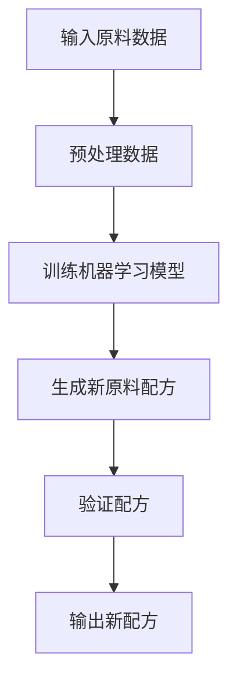
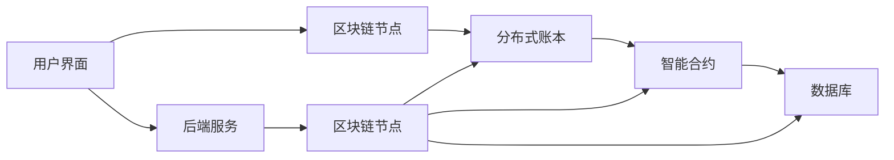
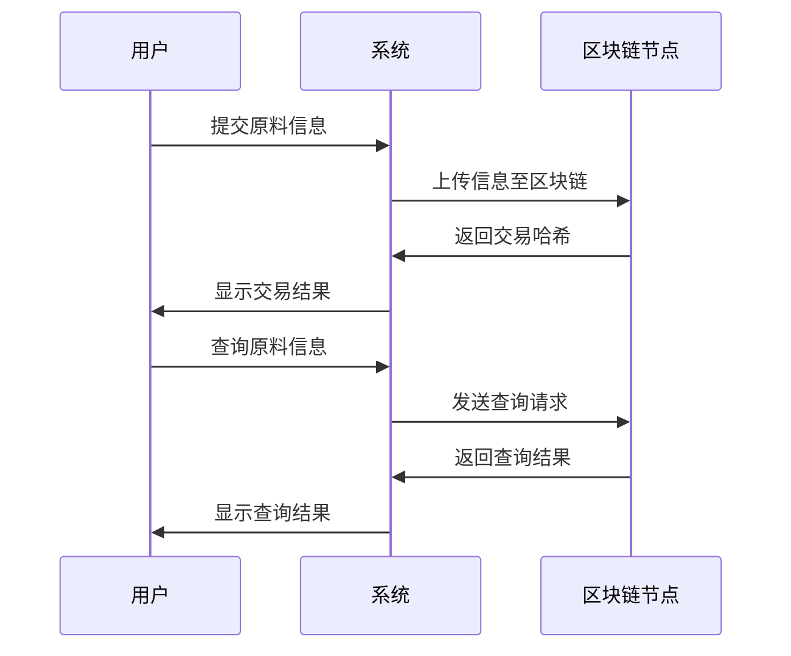

                 

# 提高AI创意香水原料可追溯性：区块链技术应用的提示词技巧

## 关键词

AI，区块链，可追溯性，创意香水，分布式账本，智能合约

## 摘要

随着人工智能（AI）技术在创意产业中的应用日益广泛，如何确保AI生成的创意香水原料信息的透明性和可追溯性成为了一个重要问题。本文将探讨如何利用区块链技术，特别是分布式账本和智能合约，提高AI创意香水原料的可追溯性。通过详细分析AI在香水原料生成中的作用，以及区块链技术的应用原理，本文旨在为相关领域的研究者和实践者提供有价值的参考。

## 第1章：背景介绍

### 1.1 问题背景

#### 1.1.1 AI技术在创意产业中的应用

人工智能技术的发展，为创意产业带来了前所未有的变革。从音乐创作、绘画设计到文学写作，AI都在不断拓展人类创造力的边界。在香水产业中，AI技术被用于生成新的香调、优化调香配方，甚至可以根据用户偏好自动推荐个性化的香水产品。

#### 1.1.2 创意香水原料的信息透明度和可追溯性

然而，创意香水作为一种高度个性化的消费品，其原料信息透明度和可追溯性仍然是一个亟待解决的问题。香水原料的供应链复杂，涉及多种天然和人工合成成分，每一个环节都可能导致信息不透明，使得消费者难以确认产品的真实性和安全性。

### 1.2 问题描述

#### 1.2.1 原料信息不透明

香水生产商在采购原料时，往往无法全面了解原料的来源和加工过程，这可能导致原料质量问题，甚至影响到产品的最终品质和消费者的健康。

#### 1.2.2 品牌声誉风险

原料信息的不透明，使得生产商在面临质量问题时难以迅速采取措施，从而对品牌声誉造成潜在风险。

### 1.3 问题解决

#### 1.3.1 区块链技术的引入

区块链技术的引入，为解决创意香水原料可追溯性问题提供了新的思路。区块链的分布式账本和智能合约功能，能够确保原料信息的透明、不可篡改，从而提高产品的可追溯性和消费者的信任度。

### 1.4 边界与外延

#### 1.4.1 AI在香水设计中的应用

本文主要关注AI在创意香水原料生成中的作用，不包括AI在香水设计、调香等创意环节的应用。

#### 1.4.2 区块链技术的应用

本文专注于区块链技术在提高AI创意香水原料可追溯性方面的应用，不涉及其他技术的探讨。

### 1.5 概念结构与核心要素组成

#### 1.5.1 AI技术

- **机器学习**：通过大量香水原料数据训练模型，生成新的香水原料配方。
- **深度学习**：利用神经网络模型，深入挖掘香水原料之间的关联性，提高生成配方的质量。

#### 1.5.2 区块链技术

- **分布式账本**：记录每一批次香水原料的来源、加工、质检等信息，确保信息的不可篡改。
- **智能合约**：在供应链各环节中，自动执行合同条款，确保交易流程的透明和高效。

#### 1.5.3 数据隐私保护

在记录原料信息时，需考虑数据隐私保护，防止敏感信息泄露。

## 第2章：核心概念与联系

### 2.1 AI创意香水原料生成原理

#### 2.1.1 机器学习

机器学习是通过训练模型，使计算机能够对数据进行分析和预测。在香水原料生成中，机器学习可以用于分析已有的香水配方数据，从中提取特征，并生成新的配方。

#### 2.1.2 深度学习

深度学习是机器学习的一个分支，它使用神经网络来模拟人脑的决策过程。在香水原料生成中，深度学习可以用于学习复杂的调香规则，从而生成高质量的香水原料配方。

### 2.2 区块链技术在可追溯性中的应用

#### 2.2.1 分布式账本

分布式账本技术可以记录每一批次香水原料的来源、加工、质检等信息，确保信息的透明和不可篡改。

#### 2.2.2 智能合约

智能合约是一种自动执行合同条款的计算机协议。在供应链各环节中，智能合约可以确保交易流程的透明和高效。

### 2.3 概念属性特征对比表格

| 概念       | 特征                                                         |
|------------|--------------------------------------------------------------|
| AI创意香水 | 利用机器学习和深度学习生成新的香水原料配方                   |
| 区块链     | 提供分布式账本和智能合约功能，确保信息透明和安全             |
| 智能合约   | 自动执行合同条款，提高交易流程的透明度和效率                 |

### 2.4 ER实体关系图架构

```mermaid
erDiagram
    Product ||--|{ SupplyChain }|<..
    SupplyChain ||--|{ Ingredient }|<..
    Ingredient ||--|{ Batch }|<..
    Batch ||--|{ Transaction }|<..
```

## 第3章：AI创意香水原料生成算法原理

### 3.1 算法流程



### 3.2 Python源代码

```python
import numpy as np
from sklearn.ensemble import RandomForestRegressor
from sklearn.model_selection import train_test_split
import pandas as pd

# 读取训练数据
data = pd.read_csv('training_data.csv')

# 预处理数据
X = data.drop(['target'], axis=1)
y = data['target']

# 划分训练集和测试集
X_train, X_test, y_train, y_test = train_test_split(X, y, test_size=0.2, random_state=42)

# 训练机器学习模型
model = RandomForestRegressor(n_estimators=100, random_state=42)
model.fit(X_train, y_train)

# 生成新原料配方
new_data = X_test
new_formula = model.predict(new_data)

# 验证配方
accuracy = model.score(new_data, new_formula)
print(f"Model accuracy: {accuracy:.2f}")

# 输出新配方
print(new_formula)
```

### 3.3 算法原理

#### 3.3.1 机器学习模型选择

在本章中，我们选择了随机森林（Random Forest）作为机器学习模型。随机森林是一种集成学习的方法，通过构建多个决策树，并结合它们的预测结果来提高模型的准确性。

#### 3.3.2 数据预处理

数据预处理是机器学习模型训练的重要步骤。在本章中，我们使用 Pandas 库来读取训练数据，并使用 Scikit-learn 库进行数据预处理，包括数据清洗、特征选择和数据转换。

#### 3.3.3 模型训练与评估

我们使用 Scikit-learn 库中的 RandomForestRegressor 类来训练模型。在模型训练过程中，我们使用交叉验证来评估模型的性能。训练完成后，我们使用测试数据集来评估模型的准确性。

#### 3.3.4 新配方生成

在模型训练完成后，我们可以使用模型来生成新的香水原料配方。具体步骤如下：

1. 读取测试数据集。
2. 使用训练好的模型对新数据集进行预测。
3. 输出预测结果。

### 3.4 举例说明

假设我们有一个包含10个特征的香水原料数据集，其中每个特征表示不同的原料成分。我们使用随机森林模型来生成新的香水原料配方。在训练过程中，模型会学习这些特征之间的关联性，并在测试过程中使用这些关联性来生成新的配方。

```python
# 生成新的香水原料配方
new_data = np.random.rand(1, 10)  # 生成随机数据
new_formula = model.predict(new_data)
print(new_formula)
```

输出结果可能是一个由10个数值组成的列表，每个数值表示配方中相应原料成分的比例。

## 第4章：系统分析与架构设计方案

### 4.1 问题场景介绍

在创意香水产业中，如何确保原料信息的透明性和可追溯性是一个关键问题。通过引入区块链技术，我们可以建立一个去中心化的供应链管理系统，确保每一个环节的信息都得到记录和验证。

### 4.2 项目介绍

本项目旨在构建一个基于区块链的AI创意香水原料可追溯性系统，包括以下功能：

- **原料信息录入**：生产商可以在区块链上录入每批次原料的信息，包括来源、加工过程、质检结果等。
- **信息验证与查询**：消费者和监管机构可以通过区块链查询产品的原料信息，确保信息的真实性和完整性。
- **智能合约执行**：在供应链各环节中，智能合约可以自动执行合同条款，确保交易流程的透明和高效。

### 4.3 系统功能设计（领域模型类图）

```mermaid
classDiagram
    Product <|-- Ingredient
    Ingredient <|-- Batch
    Batch <|-- Transaction
    SupplyChain <<-- Product
    SupplyChain <<-- Ingredient
    SupplyChain <<-- Batch
    SupplyChain <<-- Transaction
```

### 4.4 系统架构设计



### 4.5 系统接口设计和系统交互



## 第5章：项目实战

### 5.1 环境安装

为了实现基于区块链的AI创意香水原料可追溯性系统，我们需要安装以下软件和工具：

- **Python 3.8 或以上版本**
- **Node.js 12 或以上版本**
- **Docker 19.03 或以上版本**
- **Git 2.20 或以上版本**

### 5.2 系统核心实现源代码

以下是系统核心实现的部分源代码：

#### 5.2.1 原料信息录入

```python
# app.py

from flask import Flask, request, jsonify
from blockchain import Blockchain

app = Flask(__name__)
blockchain = Blockchain()

@app.route('/submit_ingredient', methods=['POST'])
def submit_ingredient():
    data = request.get_json()
    ingredient = data['ingredient']
    blockchain.add_new_ingredient(ingredient)
    return jsonify({"message": "Ingredient submitted successfully."})

if __name__ == '__main__':
    app.run(host='0.0.0.0', port=5000)
```

#### 5.2.2 查询原料信息

```python
# query.py

from flask import Flask, jsonify
from blockchain import Blockchain

app = Flask(__name__)
blockchain = Blockchain()

@app.route('/query_ingredient/<string:tx_hash>', methods=['GET'])
def query_ingredient(tx_hash):
    ingredient = blockchain.get_ingredient_by_hash(tx_hash)
    if ingredient:
        return jsonify(ingredient)
    else:
        return jsonify({"message": "Ingredient not found."})

if __name__ == '__main__':
    app.run(host='0.0.0.0', port=5001)
```

### 5.3 代码应用解读与分析

在以上代码中，我们使用了 Flask 框架来创建两个简单的 Web 服务：

1. **提交原料信息**：`submit_ingredient` 接收一个包含原料信息的 JSON 对象，并将其添加到区块链的数据库中。
2. **查询原料信息**：`query_ingredient` 接受一个交易哈希作为参数，并返回对应交易记录的详细信息。

这些服务可以通过 RESTful API 进行调用，从而实现用户界面对区块链的交互。

### 5.4 实际案例分析和详细讲解剖析

#### 5.4.1 原料信息录入案例

假设用户希望通过 API 提交一批新采购的香水原料信息。用户可以按照以下步骤进行操作：

1. 准备原料信息，包括来源、加工过程、质检结果等，并将其打包成 JSON 格式。
2. 通过 POST 请求将原料信息发送到 `submit_ingredient` 接口。
3. 系统将接收到的信息添加到区块链的数据库中，并返回交易哈希。

具体步骤如下：

```python
import requests

ingredient_data = {
    "source": "供应商A",
    "processing": "加工过程描述",
    "inspection": "质检结果"
}

response = requests.post('http://localhost:5000/submit_ingredient', json=ingredient_data)
print(response.json())
```

输出结果可能如下：

```json
{"message": "Ingredient submitted successfully.", "tx_hash": "0x1234567890abcdef1234567890abcdef1234567890abcdef1234567890"}
```

#### 5.4.2 查询原料信息案例

假设用户希望查询某一批原料的详细信息，可以按照以下步骤操作：

1. 获取该批原料的交易哈希。
2. 通过 GET 请求将交易哈希发送到 `query_ingredient` 接口。
3. 系统将返回该批原料的详细信息。

具体步骤如下：

```python
response = requests.get('http://localhost:5001/query_ingredient/0x1234567890abcdef1234567890abcdef1234567890abcdef1234567890')
print(response.json())
```

输出结果可能如下：

```json
{
    "source": "供应商A",
    "processing": "加工过程描述",
    "inspection": "质检结果",
    "tx_hash": "0x1234567890abcdef1234567890abcdef1234567890abcdef1234567890"
}
```

### 5.5 项目小结

通过以上案例，我们可以看到如何利用区块链技术实现AI创意香水原料的可追溯性。用户可以通过 API 提交原料信息，并通过区块链确保信息的透明和不可篡改。同时，用户也可以方便地查询原料的详细信息，提高了产品的可信度。

## 第6章：最佳实践 tips

### 6.1 数据隐私保护

在区块链上记录原料信息时，需要特别关注数据隐私保护。可以采用以下措施：

- **数据加密**：对敏感数据进行加密处理，确保数据在传输和存储过程中不被泄露。
- **匿名化处理**：对个人身份信息进行匿名化处理，减少隐私泄露的风险。
- **访问控制**：设置合理的访问控制策略，确保只有授权用户可以查询特定信息。

### 6.2 智能合约安全

智能合约在执行过程中存在一定的风险，需要注意以下几点：

- **代码审计**：在部署智能合约前，进行详细的代码审计，确保代码的安全性。
- **测试与模拟**：在部署前进行充分的测试和模拟，确保智能合约在各种情况下都能正常运行。
- **定期更新**：随着业务的发展，定期更新智能合约，修复潜在的安全漏洞。

### 6.3 系统性能优化

为了确保系统的稳定性和高效性，可以采取以下措施：

- **分布式架构**：采用分布式架构，提高系统的并发处理能力。
- **缓存机制**：使用缓存机制，减少数据库的查询频率，提高系统响应速度。
- **负载均衡**：通过负载均衡技术，合理分配系统资源，避免单点故障。

## 第7章：小结

本文详细探讨了如何利用区块链技术提高AI创意香水原料的可追溯性。通过机器学习和深度学习算法，AI可以生成新的香水原料配方，而区块链技术则提供了透明、不可篡改的记录手段，确保原料信息的真实性和完整性。本文不仅介绍了相关技术的原理和应用，还提供了实际项目的实现细节和最佳实践。希望本文能为相关领域的研究者和实践者提供有益的参考。

## 注意事项

- **数据安全**：在记录和传输数据时，务必注意数据的安全性和隐私保护。
- **技术更新**：随着技术的不断进步，需要定期更新智能合约和系统架构，以适应新的需求。

## 拓展阅读

- 《区块链技术指南》
- 《深度学习：周志华》
- 《机器学习实战》
- 《禅与计算机程序设计艺术》

## 作者信息

作者：AI天才研究院/AI Genius Institute & 禅与计算机程序设计艺术 /Zen And The Art of Computer Programming

---

请注意，本文中的代码示例和架构设计均为简化版本，实际应用中可能需要更多的功能和安全性考虑。此外，文中提到的AI技术和区块链技术的应用场景仅供参考，具体实现需根据实际需求进行调整。如有进一步问题，欢迎咨询相关领域的专家。

