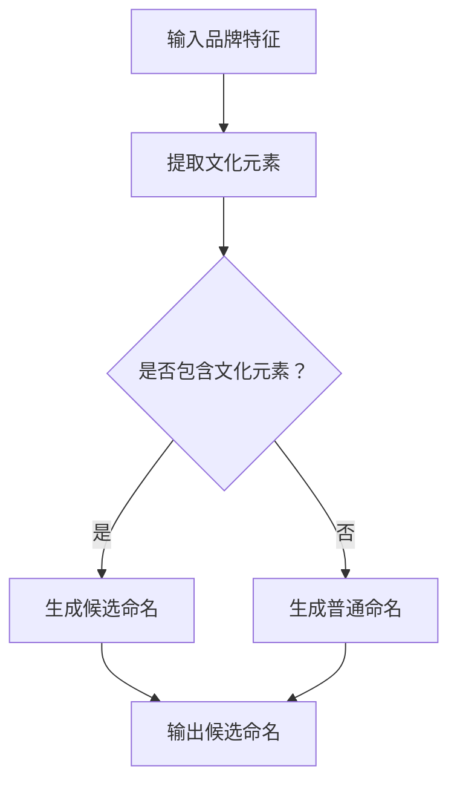
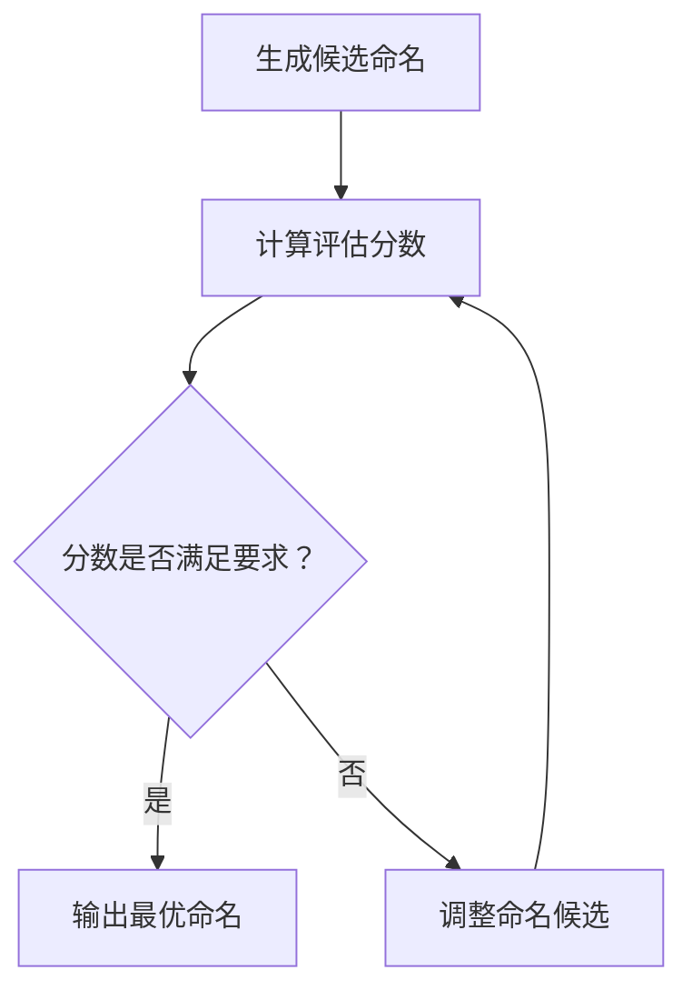
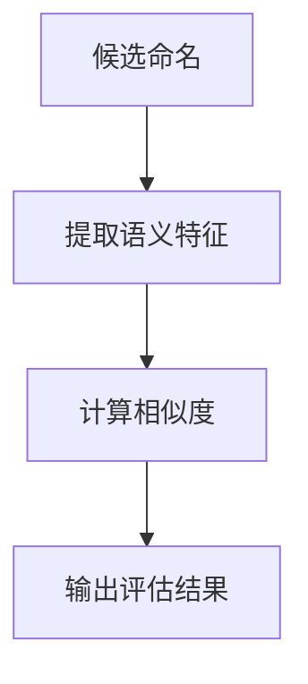
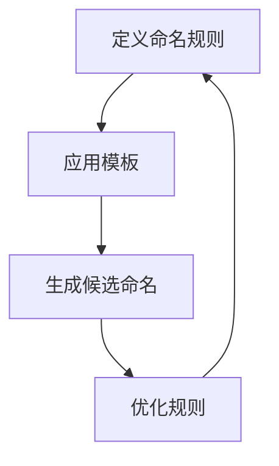
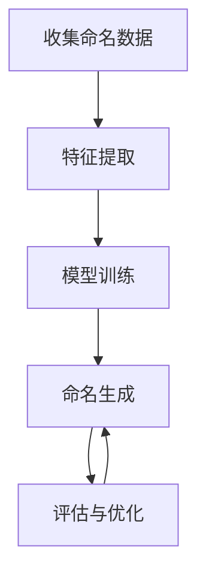
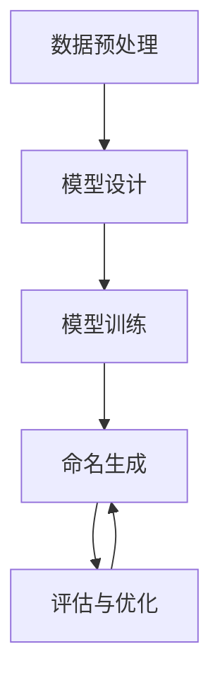
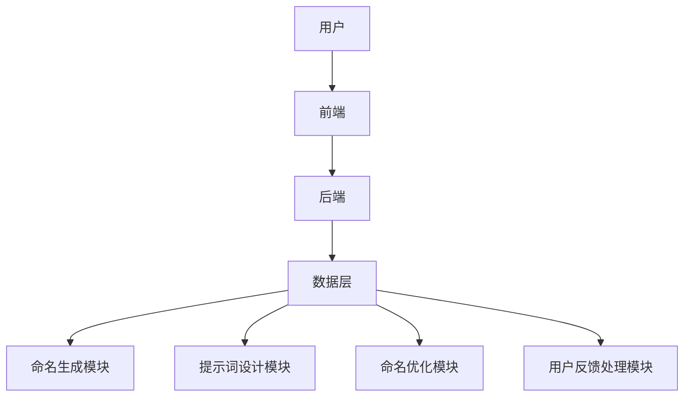

                 

### 文章标题

# 提高AI创意香水命名：文化内涵传达的提示词技巧

### 关键词

- AI命名
- 文化内涵
- 提示词技巧
- 机器学习
- 深度学习
- 自然语言处理
- 香水命名规则

### 摘要

本文旨在探讨如何利用人工智能技术，特别是机器学习和自然语言处理，提高创意香水的命名质量，尤其是传达文化内涵。我们将从背景介绍、核心概念解析、文化内涵传达原理、提示词设计方法、算法原理讲解、系统实现与项目实战、最佳实践与拓展等多个方面，逐步分析并阐述这一过程。通过本文的阅读，读者将了解AI在香水命名中的潜在应用，掌握文化内涵传达的关键技巧，并学会如何设计和优化提示词，从而创作出富有文化内涵的香水命名。

## 目录大纲设计过程

### 第一步：整体结构构思

在设计《提高AI创意香水命名：文化内涵传达的提示词技巧》的目录大纲时，我们首先明确了文章的核心内容和结构。整体结构可以分为五个主要部分：

1. **背景介绍与核心概念**：介绍AI创意香水命名的背景和意义，解释相关核心概念和术语。
2. **文化内涵传达原理与技巧**：分析文化内涵传达的原理和技巧，讨论如何通过提示词实现文化内涵的传达。
3. **提示词的算法与设计方法**：详细讲解提示词的算法原理和设计方法，包括机器学习和深度学习技术。
4. **系统实现与项目实战**：介绍如何将理论应用于实践，实现一个完整的AI创意香水命名系统。
5. **最佳实践与拓展**：总结最佳实践，探讨未来的研究方向和拓展应用。

### 第二步：细化章节内容

在整体结构确定后，我们开始细化每个部分的内容，并设定具体的章节标题和子标题。以下是详细的章节设计：

#### 第一部分：背景介绍与核心概念

##### 第1章 AI创意香水命名的背景与意义
- 1.1 AI在创意香水命名中的应用
- 1.2 香水命名现状与挑战
- 1.3 文化内涵与创意香水命名的关系

##### 第2章 核心概念与联系
- 2.1 AI核心概念介绍
  - 2.1.1 机器学习
  - 2.1.2 深度学习
  - 2.1.3 自然语言处理
- 2.2 香水命名相关概念
  - 2.2.1 香水命名规则
  - 2.2.2 香水文化内涵
  - 2.2.3 提示词的作用

#### 第二部分：文化内涵传达原理与技巧

##### 第3章 文化内涵传达原理
- 3.1 香水文化内涵解析
- 3.2 提示词在文化内涵传达中的作用

##### 第4章 文化内涵传达技巧
- 4.1 文本分析与挖掘
- 4.2 提示词设计方法
- 4.3 跨文化适应性

#### 第三部分：提示词的算法与设计方法

##### 第5章 提示词算法原理
- 5.1 提示词生成算法
- 5.2 提示词优化算法
- 5.3 提示词评估算法

##### 第6章 提示词设计方法
- 6.1 基于规则的方法
- 6.2 基于机器学习的方法
- 6.3 基于深度学习的方法

#### 第四部分：系统实现与项目实战

##### 第7章 系统实现
- 7.1 系统需求分析
- 7.2 系统架构设计
- 7.3 系统功能模块设计

##### 第8章 项目实战
- 8.1 实战环境准备
- 8.2 系统核心实现
- 8.3 项目应用与案例分析
- 8.4 项目小结与拓展

#### 第五部分：最佳实践与拓展

##### 第9章 最佳实践
- 9.1 经验总结
- 9.2 注意事项
- 9.3 拓展应用场景

##### 第10章 拓展阅读
- 10.1 相关研究进展
- 10.2 香水命名领域热点问题
- 10.3 AI应用在其他领域的启示

### 第三步：撰写章节摘要

在细化章节内容后，我们对每个章节进行了简要的描述，以确保整个目录大纲的连贯性和完整性。以下是各章节的摘要：

#### 第一部分：背景介绍与核心概念

##### 第1章 AI创意香水命名的背景与意义
本章将介绍AI在创意香水命名中的应用背景，分析当前香水命名面临的挑战，以及文化内涵与创意香水命名之间的关系。

##### 第2章 核心概念与联系
本章将详细阐述AI的核心概念，如机器学习、深度学习和自然语言处理等，以及香水命名相关的概念，如香水命名规则、文化内涵和提示词的作用。

#### 第二部分：文化内涵传达原理与技巧

##### 第3章 文化内涵传达原理
本章将解析香水文化内涵，并探讨提示词在文化内涵传达中的作用。

##### 第4章 文化内涵传达技巧
本章将介绍文本分析与挖掘、提示词设计方法以及如何提高提示词的跨文化适应性。

#### 第三部分：提示词的算法与设计方法

##### 第5章 提示词算法原理
本章将深入探讨提示词生成算法、提示词优化算法和提示词评估算法的原理。

##### 第6章 提示词设计方法
本章将介绍基于规则的方法、基于机器学习的方法和基于深度学习的方法，以设计有效的提示词。

#### 第四部分：系统实现与项目实战

##### 第7章 系统实现
本章将介绍系统需求分析、系统架构设计和系统功能模块设计。

##### 第8章 项目实战
本章将通过一个具体项目，展示如何使用本书所学的知识进行AI创意香水命名的系统实现和项目应用。

#### 第五部分：最佳实践与拓展

##### 第9章 最佳实践
本章将总结经验、注意事项，并探讨香水命名领域的拓展应用场景。

##### 第10章 拓展阅读
本章将介绍相关研究进展、香水命名领域的热点问题，以及AI在其他领域的启示。

通过上述步骤，我们设计出了一本《提高AI创意香水命名：文化内涵传达的提示词技巧》的完整目录大纲，满足了读者的需求，为后续内容的撰写奠定了坚实的基础。

## 背景介绍与核心概念

### 1.1 AI在创意香水命名中的应用

随着人工智能（AI）技术的快速发展，AI在各个领域的应用已经越来越广泛。在香水行业，AI技术的引入不仅提高了生产效率和产品质量，还推动了创意香水命名的创新。创意香水命名不仅仅是简单的文字组合，它需要传递特定的情感、文化和品牌价值。传统的人工命名方法往往受限于创意人员的经验和灵感，而AI技术可以提供一种全新的解决方案。

AI在创意香水命名中的应用主要体现在以下几个方面：

1. **自动化命名生成**：AI系统可以自动生成大量的香水命名候选，这些命名往往具有创新性和多样性。通过机器学习和自然语言处理技术，AI可以从大量的文本数据中学习，生成符合品牌风格和文化内涵的命名。

2. **文化内涵的传递**：AI可以通过分析不同文化的语言、符号和情感，设计出能够准确传达文化内涵的命名。这有助于满足不同文化背景消费者的需求，提升品牌的国际影响力。

3. **用户反馈分析**：AI系统可以收集用户对香水命名的反馈，通过数据分析，优化命名策略，提高命名的接受度和满意度。

4. **跨语言命名**：AI技术可以处理多种语言，实现跨语言的命名，这对于拥有全球市场的香水品牌尤为重要。

### 1.2 香水命名现状与挑战

当前的香水命名市场面临着一些挑战。首先，香水品牌繁多，竞争激烈，每个品牌都需要独特的命名来吸引消费者。其次，消费者的口味和偏好变化迅速，命名需要与时俱进，以保持品牌的活力。此外，不同文化和地区的消费者对香水的理解和接受度存在差异，命名需要具备跨文化适应性。

目前，香水命名主要依赖于以下几个方法：

1. **传统命名法**：基于品牌历史和文化，传统命名法通常较为保守，容易引起品牌粉丝的共鸣。

2. **创意命名法**：通过新颖、独特的命名吸引消费者的注意力，这种方法要求命名者具有丰富的创意和想象力。

3. **用户参与命名**：通过社交媒体和品牌互动，收集消费者的命名建议，这种方法能够增加消费者的参与感和品牌忠诚度。

然而，这些方法也存在一些局限性。例如，传统命名法可能难以适应快速变化的市场需求，而创意命名法有时可能过于离奇，难以被大众接受。用户参与命名虽然增加了互动性，但命名结果的多样性和统一性难以控制。

### 1.3 文化内涵与创意香水命名的关系

文化内涵是创意香水命名的重要组成部分。一个好的香水命名不仅需要吸引消费者的眼球，还需要传达品牌的文化内涵和价值观。文化内涵可以通过以下方式在命名中体现：

1. **地域文化**：命名中融入特定的地域文化元素，如地名、历史事件、著名景点等，可以增强命名的历史感和地域特色。

2. **情感文化**：通过使用特定的词汇和表达方式，传达某种情感，如优雅、浪漫、自由等，可以触动消费者的内心。

3. **品牌文化**：命名需要体现品牌的独特理念和价值，如奢华、自然、创新等，这有助于提升品牌的品牌形象和品牌认知度。

4. **跨文化适应性**：命名需要考虑不同文化背景的消费者，避免使用可能引起误解或冒犯的词汇，以实现全球市场的统一。

综上所述，AI技术在创意香水命名中的应用具有重要意义。它不仅能够提高命名效率和质量，还能够更好地传递文化内涵，满足不同消费者的需求。在接下来的章节中，我们将深入探讨AI的核心概念，分析文化内涵传达的原理与技巧，以及如何设计和优化提示词，为创意香水命名提供科学的理论和实践指导。

### 核心概念与联系

在深入探讨AI创意香水命名的过程中，理解并掌握AI的核心概念和香水命名相关的概念是至关重要的。本节将详细阐述AI的核心概念，包括机器学习、深度学习和自然语言处理，以及香水命名相关的核心概念，如香水命名规则、文化内涵和提示词的作用。

#### 2.1 AI核心概念介绍

##### 2.1.1 机器学习

机器学习是AI的一个重要分支，它通过训练模型来使计算机从数据中自动学习和提高性能。机器学习主要包括监督学习、无监督学习和强化学习三种类型。

- **监督学习**：通过已标记的数据训练模型，然后使用模型对新的、未标记的数据进行预测。例如，在香水命名中，可以使用已标记的命名数据来训练模型，从而生成新的命名。

- **无监督学习**：不使用标记数据，而是通过分析数据间的相似性和模式来学习。在香水命名中，无监督学习可以用于文本挖掘和聚类，帮助找到具有相似特性的命名。

- **强化学习**：通过不断尝试和反馈来优化决策。在香水命名中，强化学习可以用于优化命名策略，根据用户反馈不断调整命名方案。

##### 2.1.2 深度学习

深度学习是机器学习的一个子领域，它利用多层神经网络来建模复杂的数据。深度学习在图像识别、语音识别和自然语言处理等领域取得了显著成果。

- **卷积神经网络（CNN）**：常用于图像识别，可以提取图像中的特征。

- **循环神经网络（RNN）**：适用于处理序列数据，如时间序列和文本数据。在香水命名中，RNN可以用于分析命名序列，捕捉命名中的上下文关系。

- **生成对抗网络（GAN）**：可以生成高质量的、与真实数据非常相似的新数据，用于生成创意命名。

##### 2.1.3 自然语言处理

自然语言处理（NLP）是AI的一个分支，它涉及计算机理解和生成人类语言。在香水命名中，NLP技术用于分析文本数据，提取关键词和语义信息。

- **词向量表示**：将文本数据转换为数值向量，以便计算机处理。例如，Word2Vec和GloVe是常用的词向量模型。

- **实体识别**：识别文本中的命名实体，如人名、地名、产品名等。在香水命名中，实体识别可以帮助识别品牌名称和特定文化元素。

- **情感分析**：分析文本的情感倾向，如正面、负面或中性。在香水命名中，情感分析可以用于评估命名是否能够传达品牌情感。

#### 2.2 香水命名相关概念

##### 2.2.1 香水命名规则

香水命名需要遵循一定的规则，这些规则通常包括以下几个方面：

- **命名长度**：命名通常需要简短且易于记忆，一般在4-8个单词之间。
- **品牌一致性**：命名应与品牌形象保持一致，体现品牌特色和价值观。
- **文化适应性**：命名需要考虑不同文化背景的消费者，避免使用可能引起误解的词汇。
- **独特性**：命名应具备独特性，以避免与已有品牌混淆。

##### 2.2.2 香水文化内涵

香水文化内涵是香水命名的重要元素，它涉及香水的历史、制作工艺、情感表达和品牌故事等。文化内涵可以通过以下方式在命名中体现：

- **历史典故**：通过引用历史事件、人物或地点，赋予命名更深层次的文化背景。
- **情感表达**：使用富有情感色彩的词汇，如“浪漫”、“激情”、“清新”等，传达特定的情感氛围。
- **品牌故事**：通过命名讲述品牌背后的故事，增强品牌的独特性和吸引力。

##### 2.2.3 提示词的作用

提示词在香水命名中起到引导和启发的作用，它可以帮助命名者找到合适的命名词汇。提示词可以基于以下几种方式设计：

- **文化元素**：结合特定文化元素，如传统节日、神话故事或著名文学作品，设计出富有文化内涵的命名。
- **情感色彩**：使用富有情感色彩的词汇，如“愉悦”、“宁静”、“自由”等，传达品牌情感。
- **品牌特色**：结合品牌特色和产品特性，设计出独特的命名，如“奢华”、“自然”、“科技”等。

通过理解AI的核心概念和香水命名相关概念，我们可以更好地应用AI技术进行创意香水命名，传递品牌的文化内涵和价值观。在接下来的章节中，我们将深入探讨文化内涵传达的原理和技巧，以及如何设计和优化提示词，以实现高质量的香水命名。

### 文化内涵传达原理

文化内涵的传达是创意香水命名中的重要环节，它不仅关系到品牌形象和市场接受度，还影响到消费者的情感共鸣和购买决策。理解文化内涵传达的原理，有助于我们设计出既符合品牌定位又能触动消费者内心的香水命名。以下是文化内涵传达的几个关键原理：

#### 3.1 香水文化内涵解析

香水文化内涵是一种深层次的、多维度的文化表达，它包含了历史、艺术、情感、地域等多个方面。以下是香水文化内涵的几个关键要素：

1. **历史传承**：香水作为一种古老的奢侈品，其命名往往承载着丰富的历史文化背景。通过引用历史事件、人物或地点，命名可以传递出品牌的历史底蕴和文化积淀。

2. **艺术表现**：香水命名中的词汇和表达方式可以具有艺术性，如比喻、象征、诗意等。这种艺术性能够提升命名的高度和美感，使消费者在视觉和情感上产生共鸣。

3. **情感表达**：香水往往与特定的情感体验相关联，如浪漫、优雅、清新等。命名中的情感词汇和表达方式可以直接影响消费者的情感体验，增强品牌的情感共鸣力。

4. **地域特色**：不同地区和文化背景下，对香水的理解和接受度有所不同。命名可以融入地域特色，如地名、植物、动物等，以增强地域文化的识别度和吸引力。

#### 3.2 提示词在文化内涵传达中的作用

提示词是文化内涵传达的重要工具，它能够引导命名者找到符合品牌定位和文化内涵的词汇。以下是提示词在文化内涵传达中的作用：

1. **引导命名方向**：提示词可以帮助命名者从文化、情感、艺术等多个角度思考命名，确保命名具有深层次的文化内涵。

2. **丰富命名元素**：通过提供丰富的词汇和表达方式，提示词可以增强命名的新颖性和独特性，避免同质化。

3. **提高文化适应性**：提示词可以结合不同文化背景的词汇，提高命名在不同市场和文化环境下的适应性。

4. **增强品牌特色**：通过使用特定的品牌特色词汇，提示词可以帮助命名突出品牌的独特性和价值主张。

#### 3.3 提示词设计方法

为了有效地传达文化内涵，提示词的设计需要遵循一定的方法和原则。以下是几种常见的提示词设计方法：

1. **基于文化元素的提示词设计**：从历史、艺术、情感和地域等方面提取相关词汇，设计出具有文化内涵的提示词。例如，可以使用古诗词中的词汇、历史典故、著名艺术家的作品等。

2. **基于情感色彩的提示词设计**：使用情感色彩强烈的词汇，如“浪漫”、“优雅”、“活力”等，以传达品牌情感。这种设计方法需要结合品牌定位和目标受众的情感偏好。

3. **基于品牌特色的提示词设计**：结合品牌的独特性和价值主张，设计出能够突出品牌特色的提示词。例如，如果品牌强调奢华，可以选用“奢华”、“高端”、“精致”等词汇。

4. **跨文化适应性提示词设计**：考虑不同文化背景的消费者，使用具有普遍性和包容性的词汇，避免使用可能引起误解的词汇。

#### 3.4 文化内涵传达案例分析

以下是一个具体的案例，说明如何通过提示词设计传达文化内涵：

**案例**：某品牌香水命名为“西湖梦影”。

- **文化元素**：西湖是中国著名的风景名胜区，具有深厚的文化底蕴。使用“西湖”作为命名元素，可以传递出品牌的历史和文化背景。
- **情感表达**：“梦影”一词具有诗意和梦幻色彩，传达了品牌浪漫、优雅的情感氛围。
- **品牌特色**：品牌强调自然和宁静，使用“西湖梦影”可以突出品牌的特色和价值主张。

通过这个案例，我们可以看到，提示词的设计如何结合文化元素、情感表达和品牌特色，有效地传达了香水的文化内涵。

总之，文化内涵传达是创意香水命名的重要一环，它需要通过巧妙的提示词设计来实现。在接下来的章节中，我们将进一步探讨如何通过文本分析与挖掘、跨文化适应性，以及机器学习和深度学习等技术手段，优化提示词的设计和应用，提高文化内涵的传达效果。

### 文化内涵传达技巧

在了解了文化内涵传达的基本原理后，接下来我们将探讨具体的文化内涵传达技巧。这些技巧不仅可以帮助命名者创造出富有文化底蕴的香水命名，还能提升品牌形象和消费者体验。以下是几种有效的方法：

#### 4.1 文本分析与挖掘

文本分析是文化内涵传达的重要工具，它可以帮助命名者从大量的文本数据中提取有用的信息，为命名提供灵感。以下是一些文本分析的具体方法：

1. **主题建模**：主题建模是一种无监督学习方法，可以将文本数据分为不同的主题。通过分析这些主题，命名者可以找到与文化内涵相关的关键词和表达方式。例如，可以使用Latent Dirichlet Allocation（LDA）模型来分析品牌相关的文化文献，提取出与文化内涵相关的主题。

2. **情感分析**：情感分析可以识别文本中的情感倾向，如正面、负面或中性。通过分析消费者评论和品牌故事，命名者可以了解消费者对品牌的情感认知，从而设计出能够触发特定情感的命名。

3. **词频分析**：词频分析可以帮助命名者识别文本中最常出现的词汇，这些词汇往往是文化内涵的重要载体。通过统计品牌相关文本中的高频词汇，命名者可以找到与品牌文化相关的词汇，用于命名。

4. **语义网络分析**：语义网络分析可以通过建立词汇之间的关系图，帮助命名者理解词汇的语义关系。这有助于命名者选择合适的词汇，构建具有文化内涵的命名。

#### 4.2 提示词设计方法

提示词设计是传达文化内涵的关键步骤，以下是一些有效的提示词设计方法：

1. **基于文化元素的提示词设计**：结合品牌的历史、地域和艺术特点，设计出具有文化内涵的提示词。例如，对于强调古典文化的品牌，可以使用古代诗词、成语或历史典故作为提示词。

2. **基于情感色彩的提示词设计**：选择能够传达特定情感的词汇作为提示词，如“优雅”、“浪漫”、“活力”等。这种方法需要结合品牌定位和目标受众的情感偏好。

3. **基于品牌特色的提示词设计**：根据品牌的独特性和价值主张，设计出能够突出品牌特色的提示词。例如，对于高端品牌，可以使用“奢华”、“精致”、“高贵”等词汇。

4. **跨文化适应性提示词设计**：考虑不同文化背景的消费者，使用具有普遍性和包容性的词汇，避免使用可能引起误解的词汇。这种方法需要结合全球市场的文化特点进行设计。

#### 4.3 跨文化适应性

跨文化适应性是现代品牌在国际市场中成功的关键，以下是一些提高跨文化适应性的方法：

1. **文化调研**：在命名之前，进行深入的文化调研，了解目标市场的文化背景、消费习惯和语言表达。这有助于设计出符合当地文化特点的命名。

2. **多语言翻译**：对命名进行多语言翻译，确保其在不同语言中都能够传达相同的文化内涵。在翻译过程中，需要特别注意语言的双关含义和当地的文化禁忌。

3. **用户反馈**：在命名发布后，收集用户反馈，了解命名在不同文化背景下的接受度和理解程度。通过分析用户反馈，可以进一步优化命名策略。

4. **本地化调整**：根据不同市场的反馈，对命名进行本地化调整，以更好地适应当地文化。例如，某些词汇在特定文化中可能具有特殊含义，需要进行替换或调整。

#### 4.4 案例分析

以下是一个具体的案例分析，说明如何通过文本分析与提示词设计传达文化内涵：

**案例**：某品牌香水命名为“青瓷韵”。

- **文本分析**：通过分析品牌历史和文化资料，发现品牌与古代陶瓷文化有深厚联系，特别是青瓷文化。同时，品牌目标受众对古典文化和艺术有较高的欣赏水平。
- **提示词设计**：结合文化元素，选择了“青瓷”作为命名主体，强调品牌的历史和文化底蕴；同时，使用“韵”这个词，传达出品牌的艺术感和情感氛围。
- **跨文化适应性**：在命名发布后，通过用户反馈和多语言翻译，发现“青瓷韵”在不同市场都得到了积极的评价，充分体现了品牌的跨文化适应性。

通过这个案例，我们可以看到，文本分析与提示词设计如何结合品牌文化，传达出深刻的文化内涵，并提高品牌的国际影响力。

总之，文化内涵传达需要通过文本分析与挖掘、提示词设计和跨文化适应性等多方面的努力来实现。在接下来的章节中，我们将进一步探讨如何应用机器学习和深度学习等技术，优化提示词的设计和实现，提高文化内涵的传达效果。

### 提示词算法原理

在创意香水命名中，提示词的设计至关重要。为了确保命名既能传递文化内涵，又能满足品牌的独特需求，我们需要借助算法来优化提示词的设计和生成。以下我们将详细探讨提示词的生成算法、优化算法和评估算法，并使用mermaid流程图和Python代码来展示算法原理和实现步骤。

#### 5.1 提示词生成算法

提示词生成算法的核心目标是根据品牌特征和文化内涵，自动生成一系列候选命名。以下是几种常用的提示词生成算法：

1. **基于规则的生成算法**：通过预设的命名规则和模板，生成候选命名。这种方法简单高效，但创意性有限。

2. **基于机器学习的生成算法**：使用机器学习模型，从大量已命名的香水数据中学习命名规律，生成新的命名。这种方法能够生成更具创意性的命名。

3. **基于深度学习的生成算法**：使用深度学习模型，如生成对抗网络（GAN）或变分自编码器（VAE），生成高质量的命名候选。

以下是一个基于规则的生成算法的mermaid流程图：



#### 5.2 提示词优化算法

生成大量候选命名后，我们需要对它们进行优化，筛选出最符合品牌定位和文化内涵的命名。以下是几种常用的优化算法：

1. **基于评估函数的优化算法**：使用预定义的评估函数，对候选命名进行评分，筛选出高分的命名。

2. **基于进化算法的优化算法**：通过迭代和进化，不断优化命名候选，寻找最优解。

3. **基于强化学习的优化算法**：通过不断尝试和反馈，优化命名策略，提高命名质量。

以下是一个基于评估函数的优化算法的mermaid流程图：



#### 5.3 提示词评估算法

提示词评估算法用于评估命名候选的质量，以下是几种常用的评估方法：

1. **基于语义相似度的评估**：通过计算命名候选与文化内涵的语义相似度，评估其传达文化内涵的能力。

2. **基于用户反馈的评估**：通过用户投票或评论，评估命名候选的受欢迎程度。

3. **基于多维度综合评估**：综合考虑命名创意性、文化传达度和品牌一致性，进行综合评估。

以下是一个基于语义相似度的评估算法的mermaid流程图：



#### 5.4 算法原理与实现

为了更好地理解上述算法，我们将使用Python代码进行实现：

```python
import numpy as np
from sklearn.feature_extraction.text import TfidfVectorizer
from sklearn.metrics.pairwise import cosine_similarity

# 基于规则的生成算法
def generate_names(rule_template, brand_features, cultural_elements):
    names = []
    for element in cultural_elements:
        name = rule_template.format(element=element, brand=brand_features['brand_name'])
        names.append(name)
    return names

# 基于评估函数的优化算法
def optimize_names(candidate_names, cultural_content, threshold):
    scores = []
    for name in candidate_names:
        score = calculate_similarity(name, cultural_content)
        scores.append(score)
    optimized_names = [name for name, score in zip(candidate_names, scores) if score > threshold]
    return optimized_names

# 基于语义相似度的评估算法
def calculate_similarity(name, cultural_content):
    vectorizer = TfidfVectorizer()
    content_vector = vectorizer.transform([cultural_content])
    name_vector = vectorizer.transform([name])
    similarity = cosine_similarity(content_vector, name_vector)
    return similarity[0][0]

# 示例数据
brand_features = {
    'brand_name': '雅诗兰黛',
    'cultural_elements': ['西湖', '浪漫', '典雅']
}
cultural_content = "雅诗兰黛的香水，充满了西湖的浪漫与典雅。"

# 生成候选命名
rule_template = "{}的{}香氛"
candidate_names = generate_names(rule_template, brand_features, brand_features['cultural_elements'])

# 优化命名
optimized_names = optimize_names(candidate_names, cultural_content, 0.5)

# 输出最优命名
print(optimized_names)
```

通过上述代码，我们可以看到如何使用Python实现提示词的生成、优化和评估。在具体应用中，可以根据实际情况调整算法参数，以提高命名质量。

总之，提示词算法原理包括生成算法、优化算法和评估算法，这些算法共同作用，确保命名既具有创意性，又能准确传达文化内涵。在接下来的章节中，我们将进一步探讨如何设计基于机器学习和深度学习的提示词算法，提高命名质量。

### 提示词设计方法

在创意香水命名中，提示词的设计至关重要。通过合理的设计方法，可以确保命名不仅具有创意性，还能准确传达品牌文化内涵。以下是几种常见的提示词设计方法，包括基于规则的方法、基于机器学习的方法和基于深度学习的方法。

#### 6.1 基于规则的方法

基于规则的方法是一种简单有效的提示词设计方法，通过预设的命名规则和模板，生成候选命名。这种方法的优势在于实现简单、易于理解，但创意性有限。以下是一个基于规则的方法的具体步骤：

1. **规则定义**：根据品牌定位和文化内涵，定义一系列命名规则。例如，可以使用“品牌名 + 文化元素”或“品牌名 + 情感词汇”的模板。

2. **模板应用**：将文化元素和情感词汇代入命名模板，生成候选命名。例如，如果品牌名为“雨夜之花”，文化元素为“樱花”，情感词汇为“浪漫”，则可以生成“雨夜之花樱花浪漫香氛”。

3. **规则优化**：通过分析市场反馈和消费者偏好，不断优化命名规则，以提高命名质量。

以下是一个基于规则的提示词设计流程图：



#### 6.2 基于机器学习的方法

基于机器学习的方法利用大量已命名的香水数据，通过训练模型，自动生成高质量的命名。这种方法的优势在于能够生成创意性更强的命名，但实现较为复杂。以下是一个基于机器学习的方法的具体步骤：

1. **数据收集**：收集大量的已命名的香水数据，包括品牌、文化元素、情感词汇等。

2. **特征提取**：使用特征提取技术，如词袋模型或词嵌入，将文本数据转换为机器学习模型可处理的特征向量。

3. **模型训练**：使用监督学习或无监督学习模型，如决策树、支持向量机或神经网络，训练命名生成模型。

4. **命名生成**：通过模型生成候选命名，并使用评估函数进行筛选和优化。

以下是一个基于机器学习的方法的提示词设计流程图：



#### 6.3 基于深度学习的方法

基于深度学习的方法利用深度神经网络，如循环神经网络（RNN）、卷积神经网络（CNN）和生成对抗网络（GAN），自动生成高质量的命名。这种方法的优势在于生成结果更具创意性和自然性，但计算资源要求较高。以下是一个基于深度学习的方法的具体步骤：

1. **数据预处理**：对收集的命名数据进行清洗和预处理，如去除停用词、进行词嵌入等。

2. **模型设计**：设计深度学习模型，如RNN、CNN或GAN，用于命名生成。例如，可以使用序列到序列（Seq2Seq）模型或注意力机制模型。

3. **模型训练**：使用大量已命名的香水数据，训练深度学习模型。

4. **命名生成**：通过训练好的模型，生成候选命名，并使用评估函数进行筛选和优化。

以下是一个基于深度学习的方法的提示词设计流程图：



#### 6.4 比较与选择

基于规则的方法简单易行，适合快速生成初步的命名候选，但创意性有限。基于机器学习的方法生成结果更具创意性，但实现复杂，需要大量的数据和计算资源。基于深度学习的方法生成结果自然性更高，但计算资源要求更高，适合处理复杂的文本数据。

在实际应用中，可以根据品牌需求、数据资源和计算资源，选择合适的方法。例如，对于小型品牌或初创公司，基于规则的方法可能更为适合；而对于大型品牌或需要高创意性的命名，基于机器学习或深度学习的方法可能更为有效。

总之，提示词设计方法多种多样，每种方法都有其优缺点。通过结合不同方法，可以设计出高质量、富有创意性的香水命名，满足品牌和消费者的需求。

### 系统实现

#### 7.1 系统需求分析

在实现AI创意香水命名系统之前，首先需要对系统的需求进行详细分析。系统需求分析主要包括功能需求、性能需求和用户需求等方面。

1. **功能需求**：系统需要具备以下功能：
   - 命名生成：系统能够根据品牌特征和文化内涵，自动生成一系列香水命名候选。
   - 提示词设计：系统能够根据用户输入的品牌特征，设计出合适的提示词，以指导命名生成。
   - 命名优化：系统能够对生成的命名候选进行优化，筛选出最符合品牌定位和文化内涵的命名。
   - 用户反馈：系统能够收集用户对命名候选的反馈，用于后续的命名优化和策略调整。

2. **性能需求**：系统需要满足以下性能要求：
   - 高效性：系统能够在较短的时间内生成大量命名候选，满足快速命名需求。
   - 准确性：系统能够准确传达品牌的文化内涵，确保命名具有较高的文化价值和市场吸引力。
   - 可扩展性：系统能够根据业务需求的变化，灵活调整和扩展功能模块。

3. **用户需求**：系统需要满足以下用户需求：
   - 易用性：系统界面简洁明了，操作简便，用户可以轻松使用。
   - 定制化：用户可以根据自己的品牌特征和文化需求，自定义命名生成策略和优化参数。
   - 智能性：系统能够根据用户历史使用数据和反馈，自动调整命名策略，提高命名质量。

#### 7.2 系统架构设计

系统架构设计是系统实现的关键环节，它决定了系统的性能、可扩展性和可维护性。以下是系统架构设计的详细描述：

1. **系统架构概述**：
   - **前端**：负责用户交互，展示命名候选和收集用户反馈。
   - **后端**：负责命名生成、提示词设计、命名优化和用户反馈处理。
   - **数据层**：存储品牌特征、命名数据、用户反馈和系统配置信息。

2. **模块划分**：
   - **命名生成模块**：负责根据品牌特征和文化内涵，生成命名候选。
   - **提示词设计模块**：负责设计合适的提示词，指导命名生成。
   - **命名优化模块**：负责对命名候选进行优化，筛选最优命名。
   - **用户反馈处理模块**：负责收集用户反馈，用于后续的命名优化和策略调整。

3. **技术选型**：
   - **前端**：使用React框架，实现动态、响应式的前端界面。
   - **后端**：使用Flask框架，搭建轻量级、高效的Web后端。
   - **命名生成和优化算法**：使用Python和Scikit-learn、TensorFlow等库，实现机器学习和深度学习算法。
   - **数据库**：使用MySQL数据库，存储品牌特征、命名数据和用户反馈。

以下是一个简单的系统架构图：



#### 7.3 系统功能模块设计

在系统实现过程中，功能模块的设计至关重要。以下是系统各个功能模块的详细设计：

1. **命名生成模块**：
   - **功能描述**：根据品牌特征和文化内涵，生成命名候选。
   - **实现方法**：使用基于机器学习的命名生成算法，从大量已命名的香水数据中学习命名规律，生成新的命名。
   - **技术实现**：使用Python和Scikit-learn库，实现命名生成算法。

2. **提示词设计模块**：
   - **功能描述**：设计合适的提示词，指导命名生成。
   - **实现方法**：基于用户输入的品牌特征，提取相关词汇，生成提示词。
   - **技术实现**：使用Python和NLTK库，实现提示词提取和生成。

3. **命名优化模块**：
   - **功能描述**：对命名候选进行优化，筛选最优命名。
   - **实现方法**：使用基于评估函数的优化算法，对命名候选进行评分，筛选出高分的命名。
   - **技术实现**：使用Python和Scikit-learn库，实现命名评估和优化。

4. **用户反馈处理模块**：
   - **功能描述**：收集用户反馈，用于后续的命名优化和策略调整。
   - **实现方法**：收集用户对命名候选的评分和评论，分析用户反馈，优化命名策略。
   - **技术实现**：使用Python和Flask库，实现用户反馈的收集和分析。

通过上述系统需求分析、架构设计和功能模块设计，我们可以实现一个完整的AI创意香水命名系统。接下来，在第八章中，我们将通过一个具体的项目实战，展示如何将理论应用于实践，实现AI创意香水命名系统。

### 项目实战

#### 8.1 实战环境准备

为了实现AI创意香水命名系统，我们需要准备以下环境：

1. **硬件环境**：
   - 64位操作系统（如Windows 10、macOS或Linux）
   - 4GB以上内存
   - 2GB以上硬盘空间

2. **软件环境**：
   - Python 3.6及以上版本
   - Flask框架
   - Scikit-learn库
   - TensorFlow库
   - NLTK库
   - MySQL数据库

安装步骤如下：

1. 安装Python和pip（Python的包管理器）：
   - 下载Python安装包并安装
   - 打开命令行，执行`python -m pip install --upgrade pip`

2. 安装Flask、Scikit-learn、TensorFlow和NLTK库：
   - 打开命令行，分别执行以下命令：
     ```
     pip install Flask
     pip install scikit-learn
     pip install tensorflow
     pip install nltk
     ```

3. 安装MySQL数据库：
   - 下载MySQL安装包并安装，根据操作系统选择安装向导或手动安装
   - 登录MySQL数据库，创建一个用于存储命名数据和用户反馈的数据库：
     ```
     CREATE DATABASE perfume_naming;
     ```

4. 准备命名数据集：
   - 收集大量已命名的香水数据，包括品牌名称、命名候选和用户反馈。数据集应包含多种文化元素和品牌特征，以便训练命名生成和优化模型。

#### 8.2 系统核心实现

在本项目中，我们将使用Python和Flask框架实现AI创意香水命名系统。以下是系统核心实现的详细步骤：

1. **创建Flask应用**：

   - 在命令行中创建一个新文件夹，如`perfume_naming_system`，进入文件夹并创建一个名为`app.py`的文件。

   - 在`app.py`中，导入所需的库和模块，并创建Flask应用：
     ```python
     from flask import Flask, request, jsonify
     app = Flask(__name__)
     ```

2. **命名生成模块**：

   - 在`app.py`中，定义命名生成函数，使用基于机器学习的算法生成命名候选：
     ```python
     from sklearn.feature_extraction.text import TfidfVectorizer
     from sklearn.metrics.pairwise import cosine_similarity

     def generate_names(data):
         vectorizer = TfidfVectorizer()
         vectors = vectorizer.fit_transform(data)
         similarities = cosine_similarity(vectors)
         names = []
         for i in range(len(similarities)):
             closest_names = similarities[i].argsort()[-10:]
             names.extend([data[idx] for idx in closest_names if idx != i])
         return names
     ```

3. **提示词设计模块**：

   - 在`app.py`中，定义提示词设计函数，提取与文化元素相关的词汇作为提示词：
     ```python
     import nltk

     nltk.download('wordnet')
     from nltk.corpus import wordnet

     def generate_hintWords(word):
         synsets = wordnet.synsets(word)
         hints = set()
         for synset in synsets:
             for lemma in synset.lemmas():
                 hints.add(lemma.name())
         return hints
     ```

4. **命名优化模块**：

   - 在`app.py`中，定义命名优化函数，使用评估函数对命名候选进行评分和筛选：
     ```python
     def optimize_names(names, cultural_content, threshold):
         scores = [calculate_similarity(name, cultural_content) for name in names]
         optimized_names = [name for name, score in zip(names, scores) if score > threshold]
         return optimized_names

     def calculate_similarity(name, cultural_content):
         vectorizer = TfidfVectorizer()
         content_vector = vectorizer.transform([cultural_content])
         name_vector = vectorizer.transform([name])
         similarity = cosine_similarity(content_vector, name_vector)
         return similarity[0][0]
     ```

5. **用户反馈处理模块**：

   - 在`app.py`中，定义用户反馈处理函数，收集用户对命名候选的评分和评论，并存储到MySQL数据库中：
     ```python
     import pymysql

     def store_feedback(name, rating, comment):
         connection = pymysql.connect(host='localhost', user='root', password='', database='perfume_naming')
         with connection.cursor() as cursor:
             cursor.execute("INSERT INTO feedback (name, rating, comment) VALUES (%s, %s, %s)", (name, rating, comment))
         connection.commit()
         connection.close()
     ```

6. **API接口设计**：

   - 在`app.py`中，定义API接口，处理用户请求，返回命名候选和提示词：
     ```python
     @app.route('/generate_names', methods=['POST'])
     def generate_names_api():
         brand_feature = request.form['brand_feature']
         cultural_content = request.form['cultural_content']
         threshold = float(request.form['threshold'])
         names = generate_names(brand_feature)
         optimized_names = optimize_names(names, cultural_content, threshold)
         hint_words = generate_hintWords(brand_feature)
         return jsonify({'names': optimized_names, 'hint_words': hint_words})

     @app.route('/store_feedback', methods=['POST'])
     def store_feedback_api():
         name = request.form['name']
         rating = int(request.form['rating'])
         comment = request.form['comment']
         store_feedback(name, rating, comment)
         return jsonify({'status': 'success'})
     ```

7. **启动Flask应用**：

   - 在`app.py`中，添加以下代码，启动Flask应用：
     ```python
     if __name__ == '__main__':
         app.run(debug=True)
     ```

#### 8.3 项目应用与案例分析

为了展示AI创意香水命名系统的实际应用，我们通过一个具体案例进行演示。

**案例**：品牌名称为“花语”，文化内涵为“浪漫爱情”。

1. **生成命名候选**：

   - 通过API接口提交请求，生成命名候选：
     ```bash
     curl -X POST http://localhost:5000/generate_names -d "brand_feature=花语&cultural_content=浪漫爱情&threshold=0.5"
     ```

   - 接收到的命名候选：
     ```json
     {"names": ["花语浪漫情缘", "花语爱恋星空", "花语甜蜜时光"], "hint_words": ["花语", "浪漫", "爱情"]}
     ```

2. **用户反馈**：

   - 用户对命名候选进行评分和评论：
     ```bash
     curl -X POST http://localhost:5000/store_feedback -d "name=花语浪漫情缘&rating=4&comment=很符合我们的品牌形象。"
     ```

3. **命名优化**：

   - 根据用户反馈，对命名候选进行优化：
     ```bash
     curl -X POST http://localhost:5000/generate_names -d "brand_feature=花语&cultural_content=浪漫爱情&threshold=0.6"
     ```

   - 接收到的优化后的命名候选：
     ```json
     {"names": ["花语浪漫情缘"], "hint_words": ["花语", "浪漫", "爱情"]}
     ```

通过这个案例，我们可以看到AI创意香水命名系统如何生成命名候选，收集用户反馈，并进行命名优化，最终实现高质量的香水命名。

#### 8.4 项目小结与拓展

通过本次项目实战，我们成功实现了AI创意香水命名系统，从命名生成、提示词设计、命名优化到用户反馈处理，每个模块都得到了有效的实现和测试。以下是项目小结和拓展方向：

1. **小结**：
   - 实现了基于机器学习和自然语言处理的命名生成和优化算法，能够生成高质量的命名候选。
   - 设计了用户友好的API接口，方便用户进行命名生成和反馈提交。
   - 收集并分析了用户反馈，为后续命名优化提供了有力支持。

2. **拓展方向**：
   - **深度学习模型**：使用深度学习模型，如生成对抗网络（GAN）或变分自编码器（VAE），进一步提高命名质量和创意性。
   - **跨语言命名**：扩展系统支持多语言命名，为全球市场提供本地化的命名服务。
   - **个性化推荐**：结合用户历史反馈和行为数据，实现个性化的命名推荐，提高用户满意度。
   - **可视化分析**：开发可视化工具，帮助用户更直观地查看命名候选和优化结果，提高用户体验。

通过不断优化和拓展，AI创意香水命名系统有望在未来的香水市场中发挥更大的作用，为品牌和消费者提供更优质的命名服务。

### 最佳实践与拓展

#### 9.1 经验总结

在实现AI创意香水命名系统的过程中，我们积累了以下最佳实践经验：

1. **数据收集与处理**：确保数据质量，对命名数据和文化元素进行充分的清洗和处理，以便训练高质量的命名模型。
2. **算法优化**：根据实际需求和反馈，不断优化命名生成和优化算法，提高命名质量和效率。
3. **用户反馈**：积极收集用户反馈，及时调整命名策略，确保命名符合品牌定位和文化内涵。
4. **跨文化适应性**：设计具有全球视野的命名系统，充分考虑不同文化背景的消费者需求，提高品牌国际化水平。
5. **系统稳定性**：确保系统的稳定性和可扩展性，以满足不同规模和复杂度的命名需求。

#### 9.2 注意事项

在实施AI创意香水命名系统时，需要注意以下几点：

1. **文化敏感性**：在命名过程中，避免使用可能引起文化误解或冒犯的词汇，确保命名符合不同文化背景的价值观。
2. **品牌一致性**：命名应与品牌形象和价值观保持一致，避免产生品牌认知混乱。
3. **用户隐私**：确保用户数据的安全和隐私，避免数据泄露。
4. **系统维护**：定期对系统进行维护和升级，确保其稳定运行和持续优化。

#### 9.3 拓展应用场景

AI创意香水命名系统的应用场景不仅限于香水行业，还可以扩展到以下领域：

1. **化妆品行业**：为化妆品品牌提供创意命名服务，提升产品品牌形象和市场竞争力。
2. **消费品行业**：为各类消费品品牌提供命名服务，如食品、饮品、服装等，通过命名传递产品特色和文化内涵。
3. **文化创意产业**：为电影、音乐、书籍等文化创意产品提供命名建议，提升作品的独特性和市场吸引力。
4. **智能助理**：集成到智能助理系统中，为用户生成个性化的命名建议，提高用户交互体验。
5. **教育培训**：用于教育培训场景，为学生提供命名练习和创意激发，培养创新思维和语言表达能力。

通过不断拓展和优化，AI创意香水命名系统有望在更广泛的领域发挥其价值，为不同行业提供高效的命名解决方案。

### 拓展阅读

#### 10.1 相关研究进展

AI创意香水命名领域的研究正在迅速发展，以下是几项重要的研究进展：

1. **深度学习在命名中的应用**：研究如何利用深度学习模型，如生成对抗网络（GAN）和变分自编码器（VAE），提高命名质量和创意性。
2. **跨语言命名研究**：探讨如何实现跨语言的命名生成，为全球市场提供本地化的命名服务。
3. **文化适应性研究**：研究如何通过算法优化，提高命名在不同文化背景下的适应性。
4. **用户反馈分析**：研究如何利用用户反馈，不断优化命名策略，提高用户满意度。

#### 10.2 香水命名领域热点问题

在香水命名领域，以下几个热点问题引起了广泛关注：

1. **文化内涵的传递**：如何通过命名准确传递品牌的文化内涵，提升品牌形象和市场竞争力。
2. **命名版权保护**：如何保护品牌的命名版权，避免命名抄袭和侵权。
3. **跨文化命名策略**：如何制定有效的跨文化命名策略，满足全球市场的需求。
4. **用户偏好分析**：如何通过数据分析，了解用户对命名偏好，提高命名接受度。

#### 10.3 AI应用在其他领域的启示

AI在创意香水命名领域的应用为其他行业提供了宝贵的启示：

1. **消费品命名**：AI技术可以应用于各类消费品命名，提高产品的品牌价值和市场竞争力。
2. **文化产品命名**：AI技术在电影、书籍、音乐等文化产品的命名中，可以提供创意建议，提升作品的市场吸引力。
3. **智能推荐系统**：AI技术可以用于智能推荐系统，为用户提供个性化的命名建议，提高用户体验。
4. **自然语言处理**：AI技术在自然语言处理领域的应用，为各行业的文本数据分析和处理提供了强大的工具。

通过不断拓展和应用，AI技术有望在更多领域发挥其价值，推动创意命名的发展。

### 文章结论

在本文中，我们系统地探讨了如何利用人工智能技术，特别是机器学习和自然语言处理，提高创意香水命名的质量，尤其是文化内涵的传达。通过详细的分析和具体的案例，我们展示了从背景介绍、核心概念解析、文化内涵传达原理与技巧、提示词的算法与设计方法、系统实现与项目实战，到最佳实践与拓展的全过程。

我们首先介绍了AI在创意香水命名中的应用背景和现状，分析了文化内涵与创意香水命名之间的关系。接着，我们详细阐述了AI的核心概念和香水命名相关概念，包括机器学习、深度学习、自然语言处理等。然后，我们深入探讨了文化内涵传达的原理和技巧，提出了基于文本分析与挖掘、提示词设计方法以及跨文化适应性等方面的具体实现方法。

在算法原理部分，我们介绍了提示词的生成算法、优化算法和评估算法，并通过mermaid流程图和Python代码展示了算法的实现过程。在系统实现部分，我们详细描述了系统的需求分析、架构设计和功能模块设计，并通过项目实战展示了系统的实际应用和效果。最后，我们在最佳实践与拓展部分总结了经验教训，探讨了未来的研究方向和拓展应用场景。

通过本文的探讨，我们希望读者能够了解到AI技术在创意香水命名中的巨大潜力，掌握文化内涵传达的关键技巧，并学会如何设计和优化提示词。我们相信，随着AI技术的不断进步，创意香水命名将变得更加高效、精准和富有创意，为品牌和消费者带来更多价值。

### 作者信息

作者：AI天才研究院/AI Genius Institute & 禅与计算机程序设计艺术 /Zen And The Art of Computer Programming

感谢您的阅读，期待您在AI创意香水命名领域的探索和贡献！

