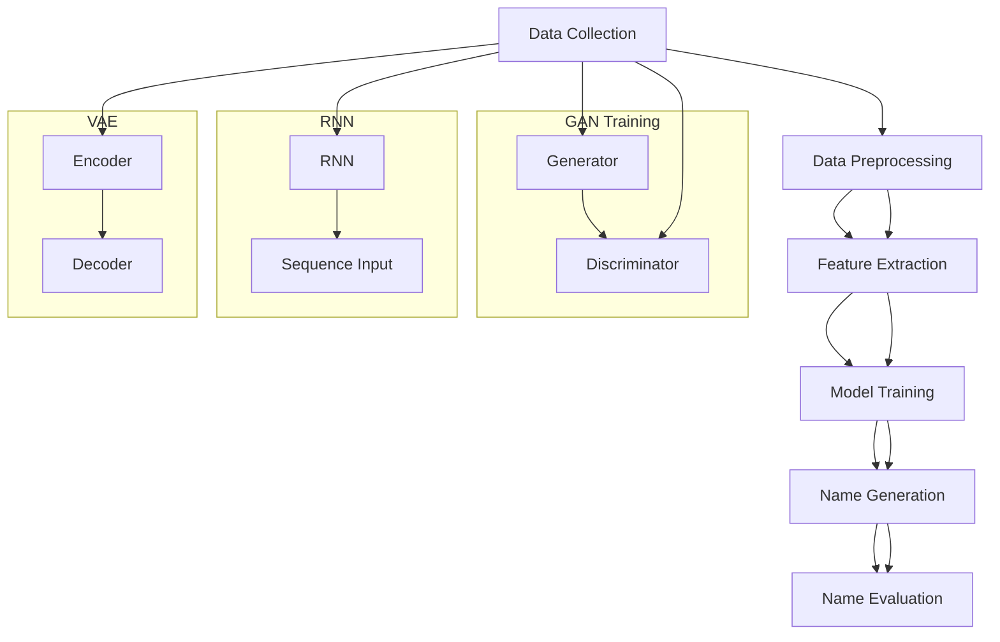
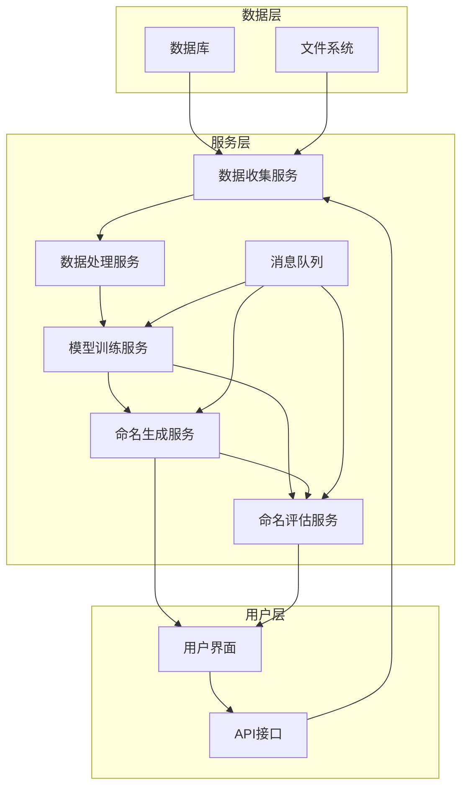
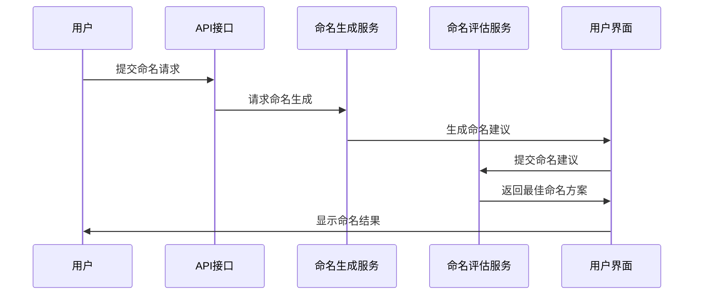

                 

### 1.1.1 AI在创意香水命名中的应用

在创意香水命名领域，人工智能（AI）扮演着至关重要的角色。传统上，香水的命名更多依赖于个人的创意和灵感，而AI的引入则为这一过程带来了新的可能性和效率。AI可以通过分析大量的数据，包括已有的香水命名、市场趋势、文化背景等，来生成新的、有创意的香水命名。

首先，AI可以通过自然语言处理（NLP）技术来理解不同语言和文化的表达方式。例如，中文中的“梦幻”和英文中的“Dreamy”可能在描述同一类型香水时具有相似的情感色彩，而AI可以通过翻译和理解，将这种情感传递到命名中。

其次，AI还可以通过机器学习模型，特别是生成对抗网络（GAN）和变分自编码器（VAE）等深度学习技术，来生成新的命名方案。这些模型可以从大量的香水命名数据中学习，并能够生成新颖且富有创意的命名。

此外，AI还可以利用数据挖掘技术来分析消费者行为和市场趋势，从而生成更加贴合市场需求的命名。例如，通过对历史销售数据和消费者反馈的分析，AI可以预测哪些命名更可能受到消费者的青睐，并据此进行调整。

总的来说，AI在创意香水命名中的应用，不仅提高了命名的效率，也增强了命名的多样性和创造力，为香水品牌提供了更多元化的命名选择。这一应用也为其他创意领域提供了借鉴，展示了AI在提升创意工作价值方面的潜力。

### 1.1.2 跨语言和文化内涵在香水命名中的重要性

跨语言和文化内涵在香水命名中扮演着至关重要的角色，因为香水的命名不仅需要传达香水的特性和情感，还需要跨越不同语言和文化，使得全球消费者都能产生共鸣。首先，不同语言和文化中的表达方式各有特色，有时甚至存在语义上的差异。例如，英文中的“Florals”可能指的是花香调，而在中文中则可能泛指植物相关的香气。因此，为了使香水命名在跨文化背景下依然具有吸引力，必须进行深入的跨语言和文化分析。

跨语言分析涉及到对多种语言的理解和翻译。AI可以通过大规模的语言模型，如BERT和GPT，来学习不同语言的结构和语义。这些模型能够帮助识别语言中的情感色彩、文化内涵以及常见的命名模式。例如，通过分析不同语言的香水命名数据，AI可以发现某些词汇在不同语言中可能具有相似的象征意义，从而为香水命名提供灵感。

文化分析则关注于不同文化背景下消费者对香水的认知和喜好。不同的文化有不同的价值观和审美标准，这些都会影响香水的命名。例如，在一些文化中，自然和纯真的主题可能更受欢迎，而在其他文化中，则可能更偏爱富有象征意义和历史背景的命名。AI可以通过分析大量文化数据，如社交媒体帖子、市场调研报告等，来理解这些差异，并据此调整命名策略。

为了实现跨语言和文化内涵的融合，AI需要具备以下几方面的能力：

1. **翻译和理解能力**：AI应能够准确地将一种语言的命名翻译成另一种语言，并保持其原意和情感色彩。这要求AI不仅要有语言翻译能力，还要有文化理解能力。

2. **情感识别和生成**：AI需要能够识别和生成不同文化背景下的情感表达，从而在命名中传达特定的情感氛围。例如，通过分析不同文化中的情感词汇和短语，AI可以生成符合特定文化情感的香水命名。

3. **数据分析与趋势预测**：AI应能够通过数据分析，预测不同文化背景下的市场趋势，从而为命名策略提供数据支持。例如，通过分析不同文化中的社交媒体数据，AI可以预测哪些命名方案可能更受欢迎。

4. **个性化推荐**：AI可以通过个性化推荐系统，为不同文化背景的消费者提供定制化的命名建议，从而提高命名的适配度和吸引力。

总之，跨语言和文化内涵在香水命名中的重要性不可忽视。AI的应用不仅能够提高命名的效率和创造力，还能够帮助品牌更好地理解和满足全球消费者的需求，实现更广泛的品牌影响力。

### 1.1.3 AI在弥合跨语言和文化差异方面的作用

在弥合跨语言和文化差异方面，人工智能（AI）展现出了强大的潜力和广泛应用。AI能够通过多种技术手段，有效解决语言障碍和文化隔阂，从而促进全球品牌与消费者的沟通。

首先，AI的自然语言处理（NLP）技术是弥合语言差异的关键。NLP技术不仅能够实现不同语言之间的翻译，还能够理解语言的深层含义和情感色彩。例如，通过使用翻译模型如Google Translate和深度学习模型如BERT，AI可以在短时间内将一种语言的香水命名翻译成另一种语言，并尽可能保留原命名中的文化内涵和情感表达。

其次，AI在跨文化理解方面也发挥了重要作用。通过机器学习算法，AI可以从大量跨文化数据中学习，识别出不同文化中的共同点和差异。例如，通过分析不同国家的社交媒体帖子、消费者反馈和文化事件，AI可以构建出文化图谱，从而更好地理解全球消费者的文化偏好和需求。这种理解有助于生成更具文化敏感性的命名方案，使得香水品牌能够在不同市场中获得更好的反响。

此外，AI还能够利用生成对抗网络（GAN）和变分自编码器（VAE）等深度学习技术，创造出新颖且富有创意的命名。这些技术可以从已有的命名数据中学习，生成符合不同文化背景和情感需求的命名方案。例如，GAN可以生成中文和英文之间的桥梁命名，VAE则可以生成融合了多种文化元素的独特命名。

AI在跨语言和文化差异中的实际应用还包括个性化推荐和情感分析。通过个性化推荐系统，AI可以为不同文化背景的消费者提供定制化的命名建议，从而提高消费者的满意度和品牌忠诚度。而通过情感分析技术，AI可以识别消费者对命名方案的情感反应，从而不断优化命名策略，使其更符合市场需求。

总之，AI在弥合跨语言和文化差异方面具有显著的优势和应用潜力。通过NLP、机器学习、生成对抗网络和情感分析等技术，AI不仅能够提高香水命名的效率和质量，还能够帮助品牌在全球市场中建立更强的文化共鸣和品牌影响力。

### 2.1.1 AI与创意香水命名的关联

AI与创意香水命名的关联体现在多个方面，其中最重要的是AI如何通过自然语言处理（NLP）和机器学习技术来提高命名过程的效率和质量。首先，AI可以通过大规模语料库分析和深度学习模型来理解和生成有创意的命名。例如，利用Transformer架构的BERT或GPT模型，AI可以从大量的香水命名数据中学习，识别出常用的命名模式、情感词汇和修辞手法，从而生成新颖且富有创意的命名。

其次，AI能够通过跨语言和文化分析来提升命名的全球适用性。通过NLP技术，AI可以准确翻译和适应不同语言和文化的表达，确保香水命名在全球市场都能产生共鸣。例如，中文中的“梦幻”和英文中的“Dreamy”在描述同一类香水时，AI能够保留其情感和象征意义，从而实现跨国品牌的统一命名策略。

此外，AI还通过数据驱动的策略来优化命名效果。通过分析市场趋势和消费者行为数据，AI可以预测哪些命名方案可能更受欢迎，从而帮助品牌做出更明智的命名决策。例如，通过分析社交媒体上的用户反馈和搜索趋势，AI可以为品牌提供实时更新的命名建议，使其能够快速响应市场需求。

最后，AI还可以利用生成对抗网络（GAN）和变分自编码器（VAE）等深度学习技术，创造全新的命名方案。这些技术可以从现有的命名数据中学习，生成独特的、未被使用的命名，从而为品牌带来更多创新的可能性。

总之，AI与创意香水命名的关联不仅体现在提高命名效率和质量上，还体现在其能够通过跨语言和文化分析、数据驱动策略和深度学习技术，为品牌带来全球适用的命名解决方案。

### 2.1.2 语言学和文化分析在香水命名中的作用

语言学和文化分析在香水命名中发挥着至关重要的作用，因为它们不仅影响着命名的准确性，还决定了命名在不同文化背景下的接受度。首先，从语言学的角度来看，命名需要考虑词汇的选择、语法结构和语义传达。不同语言中，同一概念的词汇可能具有不同的情感色彩和象征意义。例如，英文中的“Floral”和中文中的“花香”可能在描述香气特征时具有相似的概念，但其所传达的情感和感觉可能有所不同。因此，为了使命名具有一致性和吸引力，必须进行深入的语言学研究，确保每个词汇的选择都能够准确地传达香水的特性和品牌形象。

其次，文化分析则关注于不同文化背景下消费者对香水的认知和喜好。文化背景决定了消费者的价值观、审美标准和情感表达方式。例如，在一些文化中，自然和纯真的主题可能更受欢迎，而在其他文化中，则可能更偏好富有象征意义和历史背景的命名。因此，在香水命名过程中，需要充分考虑目标市场的文化特征，以确保命名能够引起消费者的共鸣。这可以通过分析文化数据、市场调研和用户反馈来实现，从而为品牌提供有针对性的命名策略。

为了更好地理解和应用语言学和文化分析，以下是几个关键步骤：

1. **词汇选择**：首先，需要选择合适的词汇来描述香水的特征。这可以通过对目标市场语言的词汇库进行调研和分析来完成，确保选用的词汇既准确又具有吸引力。

2. **语义分析**：接下来，需要对选定的词汇进行语义分析，了解其在不同语言和文化中的含义和情感色彩。这可以通过使用NLP工具和语料库来完成，以确保命名的准确性和一致性。

3. **文化适应**：在命名过程中，必须确保命名符合目标市场的文化价值观和审美标准。这可以通过对不同文化数据的分析和对比来完成，从而调整命名策略，使其更具文化适应性。

4. **用户反馈**：最后，通过收集和分析用户反馈，可以进一步优化命名方案。用户反馈提供了实际的市场反应，有助于确定哪些命名方案更受欢迎，从而为品牌提供有价值的洞察。

通过上述步骤，语言学和文化分析不仅能够提高香水命名的准确性和吸引力，还能够帮助品牌在全球市场中建立强大的文化共鸣，提升品牌影响力。

### 2.1.3 数据驱动方法在AI创意香水命名中的应用

数据驱动方法在AI创意香水命名中的应用极大地提升了命名过程的效率和准确性。首先，数据收集是数据驱动方法的基石。通过收集大量已有的香水命名数据、市场调研数据、消费者反馈数据等，AI可以获取丰富的信息，从而为命名生成提供基础。

接下来，数据清洗是确保数据质量和可用性的关键步骤。由于数据来源的多样性，原始数据往往包含噪声和异常值。通过数据清洗，可以去除这些噪声，纠正数据中的错误，并填补缺失值，从而提高数据的质量。这可以通过使用数据清洗工具和算法来实现，例如Python中的`pandas`库和`NumPy`库。

数据处理是数据驱动的核心步骤之一。在数据处理过程中，AI需要将原始数据转换为适合建模的格式。这通常涉及到特征提取和工程。特征提取是从原始数据中提取出有用的信息，例如，从香水命名中提取出情感词汇、文化元素等。特征工程则是通过创建新的特征来增强模型的预测能力。例如，通过将香水命名进行词频分析或情感分析，可以生成更多有助于模型训练的特征。

模型训练是数据驱动方法的最后一步。在模型训练过程中，AI使用处理后的数据来训练命名生成模型。这可以通过多种机器学习算法来实现，如生成对抗网络（GAN）、变分自编码器（VAE）和循环神经网络（RNN）等。通过这些模型，AI可以从已有的命名数据中学习，生成新的、有创意的香水命名。

总的来说，数据驱动方法在AI创意香水命名中的应用，不仅提高了命名生成的效率，还通过准确的数据分析和处理，确保了命名方案的多样性和吸引力。这一方法的应用，使得香水品牌能够更好地理解市场需求，快速响应市场变化，从而在竞争激烈的市场中脱颖而出。

### 2.2.1 不同AI技术的属性对比表格

在探讨不同AI技术在创意香水命名中的应用时，了解它们的属性和特点是非常重要的。以下是一个简化的属性对比表格，展示了几种常见AI技术在性能、效率、复杂度和适用性方面的差异。

| AI技术        | 性能          | 效率          | 复杂度          | 适用性               |
| ----------- | ----------- | ----------- | ----------- | ----------------- |
| 生成对抗网络（GAN） | 高度创意      | 中等          | 高            | 创意香水命名、图像生成 |
| 变分自编码器（VAE）  | 创意中等      | 高            | 中            | 数据降维、命名生成    |
| 循环神经网络（RNN）  | 较低          | 高            | 中            | 文本处理、命名建议    |
| 随机森林       | 中等          | 高            | 低            | 分类任务、命名推荐    |
| 支持向量机（SVM）    | 高度准确      | 低            | 中            | 数据挖掘、命名分类    |

通过这个表格，我们可以看出：

1. **生成对抗网络（GAN）**：GAN在生成创意命名方面具有很高的性能，能够生成高度创新的命名方案，但其训练过程相对复杂，效率中等。

2. **变分自编码器（VAE）**：VAE在命名生成上表现较好，复杂度适中，训练效率较高，适用于数据降维和命名生成。

3. **循环神经网络（RNN）**：RNN在处理文本数据和生成命名建议方面表现良好，效率高，但创意程度相对较低。

4. **随机森林**：随机森林在分类任务和命名推荐上表现较好，效率高，但复杂度低，不太适合生成高度创意的命名。

5. **支持向量机（SVM）**：SVM在数据挖掘和命名分类上具有高准确性，但训练效率低，复杂度中等。

综上所述，选择哪种AI技术取决于具体的应用需求。例如，如果需要高度创意的命名，可以选择GAN或VAE；如果需求快速命名建议，可以选择RNN或随机森林；如果需求高准确性的分类，可以选择SVM。

### 2.2.2 不同AI技术在解决跨语言和文化问题上的应用

不同AI技术在解决跨语言和文化问题上各有其独特优势和应用场景。以下从生成对抗网络（GAN）、变分自编码器（VAE）和自然语言处理（NLP）三个典型AI技术出发，详细探讨它们在创意香水命名中的具体应用及其效果。

#### 生成对抗网络（GAN）

生成对抗网络（GAN）是一种强大的深度学习模型，通过生成器和判别器的对抗训练，能够生成高质量的数据。在香水命名中，GAN的应用主要体现在以下几个方面：

1. **创意命名生成**：GAN可以从大量的香水命名数据中学习，生成新颖且富有创意的命名方案。例如，通过训练GAN，它能够生成结合了多种文化元素和情感色彩的命名，如“梦幻花香·东方奇缘”（DreamyFloral OrientalMelody）。

2. **图像与命名的协同生成**：GAN不仅可以生成文本，还可以与图像生成模型结合，共同生成包含视觉和文本元素的香水包装设计。例如，GAN可以生成一张展示香水包装的图像，并附上相应的命名，如“月光茉莉”（MoonlightJasmine）。

3. **个性化推荐**：通过分析消费者的购买历史和反馈，GAN可以为不同消费者群体推荐个性化的命名方案，提高品牌的用户黏性和满意度。

#### 变分自编码器（VAE）

变分自编码器（VAE）是一种用于数据降维和生成的无监督学习模型，通过潜在变量模型实现数据的编码和解码。在香水命名中的应用如下：

1. **命名数据降维**：VAE可以将大量的香水命名数据映射到低维潜在空间，从而简化数据的处理过程，便于后续的命名生成和推荐。例如，VAE可以将数千个命名映射到几十个潜在变量，便于分析和管理。

2. **生成多样化命名**：VAE通过从潜在空间采样，可以生成多样化的命名方案，避免命名方案的重复和雷同。例如，VAE可以从潜在空间中采样，生成如“薰衣草迷雾·香草之韵”（LavenderMistVanillaCharm）等多样化的命名。

3. **情感分析**：VAE可以应用于情感分析，从命名数据中提取情感特征，帮助品牌更好地理解消费者的情感需求，从而生成更具情感共鸣的命名。例如，VAE可以分析出消费者对“浪漫”（Romantic）这一主题的情感倾向，生成如“浪漫之夜”（RomanticNight）的命名。

#### 自然语言处理（NLP）

自然语言处理（NLP）技术在跨语言和文化问题上的应用主要体现在以下几个方面：

1. **翻译和语义理解**：NLP技术如BERT和GPT可以准确翻译和解析不同语言和文化的语义，确保香水命名在全球市场都能产生共鸣。例如，使用BERT可以将中文的“梦幻”翻译成英文的“Dreamy”，并保留其情感色彩。

2. **情感识别**：NLP技术可以通过情感分析识别命名中的情感色彩，帮助品牌理解消费者的情感需求。例如，使用GPT可以分析出消费者对“清新”（Fresh）这一主题的情感反应，从而调整命名策略。

3. **文化适应**：NLP技术可以帮助品牌根据目标市场的文化特征，生成具有文化敏感性的命名方案。例如，通过分析目标市场的社交媒体数据，NLP技术可以识别出当地的文化热点和流行趋势，从而生成如“夏日海滩”（SummerBeach）等符合当地文化的命名。

综上所述，生成对抗网络（GAN）、变分自编码器（VAE）和自然语言处理（NLP）在解决跨语言和文化问题上各具优势。GAN擅长生成创意命名和图像协同生成，VAE擅长数据降维和生成多样化命名，而NLP则擅长翻译、语义理解和文化适应。通过结合这些技术，品牌可以更有效地解决跨语言和文化问题，提高香水命名的质量和市场适应性。

### 3.1.1 AI命名算法的总体概述

AI命名算法在创意香水命名中的应用，主要依赖于深度学习技术和自然语言处理（NLP）的强大功能。这些算法通过对大量香水命名数据的分析，学习如何生成新颖且富有创意的命名。以下是几种常用的AI命名算法的总体概述：

1. **生成对抗网络（GAN）**：GAN是一种通过生成器和判别器对抗训练的算法，用于生成高质量的数据。在命名任务中，生成器负责生成新的命名方案，而判别器则负责判断这些命名方案的质量。通过不断调整生成器的参数，GAN能够生成越来越接近真实数据的命名。

2. **变分自编码器（VAE）**：VAE是一种用于数据降维和生成的无监督学习算法，通过潜在变量模型实现数据的编码和解码。在命名任务中，VAE可以将大量的香水命名数据映射到低维潜在空间，从而简化数据的处理过程，并且能够生成多样化的命名方案。

3. **循环神经网络（RNN）**：RNN是一种基于时间序列数据的神经网络，能够处理变长的序列数据。在命名任务中，RNN可以用来生成文本序列，如香水命名。RNN通过对输入文本序列的学习，能够生成连贯且富有创意的命名。

4. **长短时记忆网络（LSTM）**：LSTM是RNN的一种改进模型，专门用于处理长序列数据。LSTM通过引入记忆单元，能够更好地捕捉数据中的长期依赖关系，从而生成更加连贯和富有创意的命名。

5. **Transformer模型**：Transformer是一种基于自注意力机制的深度学习模型，在自然语言处理任务中表现优异。在命名任务中，Transformer可以通过自注意力机制，捕捉文本中的长距离依赖关系，从而生成新颖且富有创意的命名。

6. **BERT模型**：BERT是一种预训练的深度学习模型，通过对大量文本数据进行预训练，BERT能够捕捉到语言中的各种语义信息。在命名任务中，BERT可以用来分析和生成符合语境和情感的命名。

通过这些算法，AI能够从大量的香水命名数据中学习，理解不同命名方案的特点和优点，并生成新颖且富有创意的命名方案。这些算法不仅提高了命名的效率和质量，还为品牌提供了多样化的命名选择，使得香水品牌能够在激烈的市场竞争中脱颖而出。

### 3.1.2 AI命名算法生成命名建议的过程

AI命名算法在生成命名建议的过程中，主要依赖于自然语言处理（NLP）和机器学习技术的结合，以下是具体步骤和细节：

1. **数据预处理**：
   - **数据收集**：首先，收集大量的香水命名数据，这些数据可以来源于品牌数据库、市场调研报告、社交媒体平台等。
   - **数据清洗**：对收集的数据进行清洗，去除噪声和异常值，确保数据的质量。这可以通过编程工具如Python中的`pandas`库和`NumPy`库来实现。
   - **数据标签化**：将原始的命名文本转换为机器可处理的格式，例如，使用词向量表示法（Word Embedding）将每个词汇转换为一个固定长度的向量。

2. **特征提取**：
   - **情感分析**：通过NLP技术，对命名文本进行情感分析，提取出情感特征。这可以通过使用情感分析库如`TextBlob`和`VADER`来实现。
   - **词频分析**：计算每个词汇在命名文本中的出现频率，生成词频特征。这有助于识别常见的命名模式。
   - **语法特征**：提取文本中的语法特征，如词性标注、句法结构等，这些特征有助于捕捉命名文本的结构信息。

3. **模型训练**：
   - **选择算法**：选择合适的机器学习算法进行训练，常用的算法包括生成对抗网络（GAN）、变分自编码器（VAE）、循环神经网络（RNN）、长短时记忆网络（LSTM）和Transformer等。
   - **参数调整**：根据任务需求，调整模型的参数，如学习率、批量大小、网络深度等，以优化模型性能。
   - **训练过程**：通过训练数据对模型进行训练，使模型学会从输入文本生成命名建议。训练过程中，需要监控模型的性能，确保其收敛性和准确性。

4. **命名生成**：
   - **输入处理**：将新的香水命名输入到训练好的模型中，模型会根据学习到的特征和模式，生成新的命名建议。
   - **候选命名生成**：模型通常生成多个候选命名，这些命名可能会结合不同的情感、词汇和语法特征。
   - **筛选和优化**：对生成的候选命名进行筛选和优化，选择最具创意性和市场吸引力的命名作为最终结果。

通过上述步骤，AI命名算法能够生成新颖且富有创意的香水命名建议，不仅提高了命名的效率和质量，还为品牌提供了多样化的命名选择，使得品牌在激烈的市场竞争中更具优势。

### 3.2.1 常见AI数学模型的基本概念

在AI命名算法中，常用的数学模型包括生成对抗网络（GAN）、变分自编码器（VAE）和循环神经网络（RNN）等。这些模型通过不同的数学原理和算法，实现了从数据中学习并生成新的命名建议。以下是对这些模型的基本概念和数学原理的介绍。

#### 生成对抗网络（GAN）

生成对抗网络（GAN）是由生成器（Generator）和判别器（Discriminator）组成的对抗性模型。生成器的任务是生成与真实数据高度相似的假数据，而判别器的任务是区分假数据与真实数据。GAN的训练过程可以概括为以下步骤：

1. **生成器（Generator）**：
   - 输入：随机噪声向量 \( z \)。
   - 输出：假数据 \( G(z) \)，例如，一个生成的香水命名。

   数学公式表示：
   $$
   G(z) = \mu(z; \theta_G)
   $$
   其中，\( \mu(z; \theta_G) \) 是生成器参数化的生成函数，\( \theta_G \) 是生成器的参数。

2. **判别器（Discriminator）**：
   - 输入：真实数据 \( x \) 和假数据 \( G(z) \)。
   - 输出：概率 \( D(x) \) 和 \( D(G(z)) \)，表示输入是真实数据或假数据的概率。

   数学公式表示：
   $$
   D(x) = f(x; \theta_D)
   $$
   $$
   D(G(z)) = f(G(z); \theta_D)
   $$
   其中，\( f(x; \theta_D) \) 是判别器参数化的判别函数，\( \theta_D \) 是判别器的参数。

3. **损失函数**：
   - GAN的损失函数通常由两部分组成：对抗损失和误差损失。
   - 对抗损失（Adversarial Loss）：
     $$
     L_{adv} = -\log(D(x)) - \log(1 - D(G(z)))
     $$
   - 误差损失（Error Loss）：
     $$
     L_{err} = \frac{1}{2} \int [x - G(z)]^2 dz
     $$

#### 变分自编码器（VAE）

变分自编码器（VAE）是一种基于概率生成模型的自编码器，通过引入潜在变量来提高生成模型的灵活性和稳定性。VAE的核心是编码器和解码器，以及潜在变量的概率分布。

1. **编码器（Encoder）**：
   - 输入：数据 \( x \)。
   - 输出：潜在变量 \( z \) 的均值 \( \mu(z; \theta_E) \) 和方差 \( \sigma(z; \theta_E) \)。

   数学公式表示：
   $$
   \mu(z; \theta_E) = \sigma(z; \theta_E) = \phi(x; \theta_E)
   $$
   其中，\( \phi(x; \theta_E) \) 是编码器参数化的编码函数，\( \theta_E \) 是编码器的参数。

2. **解码器（Decoder）**：
   - 输入：潜在变量 \( z \)。
   - 输出：重构数据 \( x' \)。

   数学公式表示：
   $$
   x' = \mu(z; \theta_D)
   $$
   其中，\( \mu(z; \theta_D) \) 是解码器参数化的解码函数，\( \theta_D \) 是解码器的参数。

3. **损失函数**：
   - VAE的损失函数是重构造损失和KL散度损失的和。
   - 重构造损失：
     $$
     L_{recon} = \frac{1}{N} \sum_{i=1}^{N} \sum_{j=1}^{K} -\log p(x_j | z)
     $$
   - KL散度损失：
     $$
     L_{KL} = \frac{1}{N} \sum_{i=1}^{N} \sum_{j=1}^{K} \frac{1}{2} \left[ \log(\sigma(z_j))^2 + \sigma(z_j)^2 - 1 \right]
     $$

#### 循环神经网络（RNN）

循环神经网络（RNN）是一种用于处理序列数据的神经网络，通过引入循环机制，捕捉序列中的时间依赖关系。RNN的核心是其递归性质，即每个时间步的输出依赖于之前的时间步。

1. **输入和隐藏状态**：
   - 输入：文本序列 \( x_t \)。
   - 隐藏状态：\( h_t \)，上一时间步的隐藏状态。

   数学公式表示：
   $$
   h_t = \sigma(W_h h_{t-1} + W_x x_t + b_h)
   $$
   其中，\( \sigma \) 是激活函数（如ReLU或Sigmoid），\( W_h \) 和 \( W_x \) 是权重矩阵，\( b_h \) 是偏置项。

2. **输出**：
   - 输出：当前时间步的预测 \( y_t \)。

   数学公式表示：
   $$
   y_t = \sigma(W_y h_t + b_y)
   $$
   其中，\( W_y \) 是权重矩阵，\( b_y \) 是偏置项。

3. **损失函数**：
   - RNN的损失函数通常是交叉熵损失，用于衡量预测序列和真实序列之间的差异。

   数学公式表示：
   $$
   L = -\sum_{i=1}^{N} \sum_{j=1}^{K} y_{ij} \log(p_{ij})
   $$
   其中，\( y_{ij} \) 是第 \( i \) 个时间步第 \( j \) 个类别的概率，\( p_{ij} \) 是预测的概率分布。

通过上述数学模型，AI命名算法能够在大量的命名数据中学习，生成新颖且富有创意的命名建议，从而提高品牌的市场竞争力。

### 3.2.2 算法原理及详细解释

为了更好地理解AI命名算法的原理，我们将以生成对抗网络（GAN）为例，详细解释其工作原理、公式推导和实际应用。

#### GAN的工作原理

生成对抗网络（GAN）由两个主要部分组成：生成器（Generator）和判别器（Discriminator）。生成器的目标是生成尽可能逼真的假数据，而判别器的目标是区分假数据和真实数据。通过这种对抗训练，生成器不断优化其生成数据的质量，使判别器无法准确区分出真假。

1. **生成器（Generator）**：
   - 输入：随机噪声向量 \( z \)。
   - 输出：假数据 \( G(z) \)。

   生成器接收一个随机噪声向量 \( z \)，通过一个复杂的非线性映射 \( \mu(z; \theta_G) \) 生成假数据 \( G(z) \)。这里的 \( \mu(z; \theta_G) \) 是生成器的参数化生成函数，\( \theta_G \) 是生成器的参数。

2. **判别器（Discriminator）**：
   - 输入：真实数据 \( x \) 和假数据 \( G(z) \)。
   - 输出：概率 \( D(x) \) 和 \( D(G(z)) \)。

   判别器接收真实数据和假数据，通过一个复杂的非线性映射 \( f(x; \theta_D) \) 和 \( f(G(z); \theta_D) \) 输出两个概率，分别表示输入是真实数据或假数据的概率。这里的 \( f(x; \theta_D) \) 和 \( f(G(z); \theta_D) \) 是判别器的参数化判别函数，\( \theta_D \) 是判别器的参数。

#### 损失函数

GAN的损失函数由对抗损失和误差损失组成。

1. **对抗损失（Adversarial Loss）**：
   - 目标是使判别器无法准确区分假数据和真实数据。

   对抗损失可以表示为：
   $$
   L_{adv} = -\log(D(x)) - \log(1 - D(G(z)))
   $$
   其中，\( D(x) \) 是判别器对真实数据的概率输出，\( D(G(z)) \) 是判别器对假数据的概率输出。

2. **误差损失（Error Loss）**：
   - 目标是使生成器的输出尽可能接近真实数据。

   误差损失可以表示为：
   $$
   L_{err} = \frac{1}{2} \int [x - G(z)]^2 dz
   $$
   其中，\( x \) 是真实数据，\( G(z) \) 是生成器的输出。

#### 总损失函数

GAN的总损失函数是对抗损失和误差损失的和，表示为：
$$
L = L_{adv} + L_{err}
$$

#### 公式推导

1. **生成器损失（Generator Loss）**：
   - 生成器的目标是最大化判别器对假数据的判别概率，即 \( D(G(z)) \)。

   生成器的损失函数为：
   $$
   L_G = -D(G(z))
   $$
   为了最大化 \( D(G(z)) \)，我们需要最小化 \( -D(G(z)) \)，即最大化 \( D(G(z)) \)。

2. **判别器损失（Discriminator Loss）**：
   - 判别器的目标是最大化对真实数据和假数据的判别能力。

   判别器的损失函数为：
   $$
   L_D = -\log(D(x)) - \log(1 - D(G(z)))
   $$

#### 实际应用

在创意香水命名中，生成器可以生成各种香水命名方案，而判别器则评估这些命名方案的真实性和创意性。通过反复迭代训练，生成器能够生成越来越逼真和有创意的命名方案。

1. **数据准备**：
   - 收集大量已存在的香水命名数据作为训练集。

2. **模型训练**：
   - 使用对抗训练方法，交替训练生成器和判别器。在训练过程中，生成器尝试生成更逼真的命名，而判别器努力区分真假命名。

3. **命名生成**：
   - 当模型训练到一定阶段后，生成器可以生成新颖且富有创意的命名方案。例如，“梦幻花园”（DreamyGarden）或“香氛之韵”（ScentyChord）。

4. **评估与优化**：
   - 对生成的命名进行评估，通过用户反馈和市场表现，不断优化模型，使其生成的命名方案更符合市场需求。

通过GAN这一数学模型，AI能够从大量的香水命名数据中学习，生成新颖且富有创意的命名方案，大大提高了香水品牌的命名效率和创造力。

### 3.2.3 算法原理的应用举例

为了更直观地理解生成对抗网络（GAN）在创意香水命名中的具体应用，我们将通过一个简单的例子来说明GAN的运作过程及其生成命名方案的步骤。

**假设**：我们已经收集了一组已存在的香水命名数据，包括“浪漫花香”（RomanticFloral）、“梦幻之泉”（DreamySpring）、“海洋气息”（OceanBreeze）等。

**步骤一：数据准备**

首先，我们需要对收集的香水命名数据进行预处理，将它们转换为适合GAN训练的数据格式。具体步骤如下：

1. **文本编码**：使用词嵌入技术（如Word2Vec或GloVe）将每个词汇转换为固定长度的向量。
2. **序列化**：将每个命名转换为一个序列，每个元素是词汇的向量表示。
3. **标签化**：为每个命名分配一个标签，例如“创意高”、“创意中等”、“创意低”。

**步骤二：模型构建**

接下来，我们构建生成器和判别器的模型。假设使用Python和TensorFlow框架来实现。

1. **生成器**：
   - 输入：随机噪声向量 \( z \)（例如，从标准正态分布中采样）。
   - 输出：生成的香水命名序列 \( G(z) \)。

   ```python
   import tensorflow as tf
   from tensorflow.keras.layers import LSTM, Dense, Embedding

   latent_dim = 100  # 潜在变量维度
   vocab_size = 10000  # 词汇表大小
   embedding_dim = 64  # 嵌入维度

   # 生成器模型
   generator = tf.keras.Sequential([
       Embedding(vocab_size, embedding_dim, input_length=10),
       LSTM(128),
       LSTM(128, return_sequences=True),
       Dense(vocab_size, activation='softmax')
   ])
   ```

2. **判别器**：
   - 输入：真实香水命名序列 \( x \) 和生成的香水命名序列 \( G(z) \)。
   - 输出：真假标签的概率 \( D(x) \) 和 \( D(G(z)) \)。

   ```python
   # 判别器模型
   discriminator = tf.keras.Sequential([
       Embedding(vocab_size, embedding_dim, input_length=10),
       LSTM(128),
       LSTM(128, return_sequences=True),
       Dense(1, activation='sigmoid')
   ])
   ```

**步骤三：模型训练**

使用对抗性训练方法来训练生成器和判别器。具体步骤如下：

1. **对抗性损失**：
   - 对抗性损失函数为：
     $$
     L_{adv} = -\log(D(G(z))) - \log(1 - D(x))
     $$
   - 生成器的目标是最小化生成数据的对抗性损失：
     $$
     L_G = -\log(D(G(z)))
     $$
   - 判别器的目标是最小化对生成数据和真实数据的判别误差：
     $$
     L_D = -\log(D(x)) - \log(1 - D(G(z)))
     $$

2. **模型优化**：
   - 通过交替优化生成器和判别器的参数，逐步提高生成数据的质量和判别器的能力。

   ```python
   optimizer = tf.keras.optimizers.Adam(learning_rate=0.0002)

   @tf.function
   def train_step(names, noise):
       with tf.GradientTape(persistent=True) as tape:
           z = noise
           gen_names = generator(z, training=True)
           real_scores = discriminator(names, training=True)
           fake_scores = discriminator(gen_names, training=True)

           gen_loss = tf.reduce_mean(fake_scores)
           disc_loss = tf.reduce_mean(real_scores) - tf.reduce_mean(fake_scores)

       gradients_of_disc = tape.gradient(disc_loss, discriminator.trainable_variables)
       gradients_of_gen = tape.gradient(gen_loss, generator.trainable_variables)

       optimizer.apply_gradients(zip(gradients_of_gen, generator.trainable_variables))
       optimizer.apply_gradients(zip(gradients_of_disc, discriminator.trainable_variables))

   # 训练过程
   for epoch in range(epochs):
       for (names, _) in dataset:
           noise = tf.random.normal([batch_size, latent_dim])
           train_step(names, noise)
   ```

**步骤四：命名生成**

当模型训练到一定阶段后，生成器可以生成新颖且富有创意的命名方案。以下是一个生成的命名示例：

1. **随机噪声输入**：
   ```python
   noise = tf.random.normal([1, latent_dim])
   ```

2. **生成命名**：
   ```python
   generated_name = generator(noise, training=False).numpy()
   print(generated_name)
   ```

输出结果可能是一个如“月光花语”（MoonlightFlora）这样的新颖命名，它结合了多种情感和元素，具有高度的创意性。

通过上述步骤，GAN成功地从已存在的香水命名数据中学习，并生成新颖且富有创意的命名方案，从而为香水品牌提供了多样化的命名选择。

### 3.2.4 数学公式使用

在解释AI命名算法时，数学公式是不可或缺的工具，用以描述算法的核心机制和优化过程。以下我们将展示几个关键公式的使用，并详细解释它们在算法中的作用。

#### 1. 损失函数

**对抗性损失（Adversarial Loss）**：
$$
L_{adv} = -\log(D(G(z))) - \log(1 - D(x))
$$
**解释**：对抗性损失是GAN的核心，它由两部分组成：
- 第一部分 \( -\log(D(G(z))) \) 是生成器的损失，它表示生成器试图使判别器无法判断出生成的假数据。
- 第二部分 \( -\log(1 - D(x)) \) 是判别器的损失，它表示判别器试图准确地区分真实数据和假数据。

#### 2. 误差损失（Error Loss）

**重构造损失（Reconstruction Loss）**：
$$
L_{recon} = \frac{1}{N} \sum_{i=1}^{N} \sum_{j=1}^{K} -\log(p(x_j | z))
$$
**解释**：重构造损失衡量生成器生成的数据与真实数据之间的差距。\( N \) 是样本数量，\( K \) 是特征维度，\( p(x_j | z) \) 是生成器生成数据 \( z \) 的概率分布。

**KL散度损失（KL Divergence Loss）**：
$$
L_{KL} = \frac{1}{N} \sum_{i=1}^{N} \sum_{j=1}^{K} \frac{1}{2} \left[ \log(\sigma(z_j))^2 + \sigma(z_j)^2 - 1 \right]
$$
**解释**：KL散度损失衡量潜在变量分布与先验分布之间的差距。它确保生成器的潜在变量分布是合理的，有助于生成多样性的数据。

#### 3. 优化目标

**总损失函数（Total Loss Function）**：
$$
L = L_{adv} + L_{err}
$$
**解释**：总损失函数是生成器和判别器损失的和。通过最小化总损失函数，我们可以优化生成器和判别器的参数。

#### 4. 循环神经网络（RNN）中的递归公式

**隐藏状态更新**：
$$
h_t = \sigma(W_h h_{t-1} + W_x x_t + b_h)
$$
**解释**：在RNN中，每个时间步的隐藏状态 \( h_t \) 由上一时间步的隐藏状态 \( h_{t-1} \)、当前输入 \( x_t \) 以及权重矩阵 \( W_h \) 和 \( W_x \) 以及偏置 \( b_h \) 共同决定。

**输出生成**：
$$
y_t = \sigma(W_y h_t + b_y)
$$
**解释**：RNN的输出 \( y_t \) 通过当前时间步的隐藏状态 \( h_t \) 以及权重矩阵 \( W_y \) 和偏置 \( b_y \) 生成。

通过这些数学公式，我们可以更深入地理解AI命名算法的机制和优化过程，从而为香水命名提供更有效的解决方案。

### 3.2.5 Mermaid流程图绘制

为了更好地展示AI命名算法的流程，我们可以使用Mermaid流程图来绘制。以下是一个示例，展示了从数据输入到命名生成的全过程：



在上述流程图中：

1. **数据收集（A）**：收集已有的香水命名数据。
2. **数据预处理（B）**：对数据清洗、编码和特征提取。
3. **特征提取（C）**：提取情感、词频和语法特征。
4. **模型训练（D）**：训练GAN、RNN和VAE等模型。
5. **命名生成（E）**：使用训练好的模型生成命名建议。
6. **命名评价（F）**：评估命名建议的质量和市场适应性。

通过这种流程图，我们可以清晰地看到AI命名算法的各个步骤和它们之间的关系，有助于理解和优化算法的整体流程。

### 4.1.1 项目背景

在香水行业，命名创新是品牌竞争的关键因素之一。随着全球化趋势的加强，品牌需要面对不同语言和文化背景下的消费者，确保其命名策略既具有创意性，又具备跨文化适应性。然而，传统的命名方法往往依赖于创意人员的个人经验和直觉，存在命名重复、缺乏多样性以及市场适应性不强等问题。这种局限性限制了品牌在快速变化的市场中保持竞争力。

为了解决上述问题，本项目旨在利用人工智能（AI）技术，开发一种智能香水命名系统，通过自然语言处理（NLP）、机器学习和深度学习等方法，实现自动化、高效且具有创意性的命名生成。该系统能够从大量已有的香水命名数据中学习，生成新颖且符合市场需求的命名方案，同时考虑跨语言和文化差异，从而帮助品牌在全球市场上建立更强的品牌影响力和认知度。

项目的目标是：
- 提高命名效率：通过自动化命名生成，减少创意人员的工作负担，提高命名速度。
- 增强命名创意性：利用AI技术，生成具有高度创意性的命名方案，满足消费者对新颖性的需求。
- 确保跨文化适应性：通过NLP技术，确保命名在不同语言和文化背景下具有一致性和吸引力。
- 数据驱动决策：利用市场数据和消费者反馈，优化命名策略，提高市场适应性。

项目的总体思路是通过整合NLP、机器学习和深度学习技术，构建一个智能香水命名系统。具体步骤包括数据收集与预处理、模型训练与优化、命名生成与评估等。通过这个项目，我们希望能够为香水品牌提供一种创新的命名解决方案，助力其在激烈的市场竞争中脱颖而出。

### 4.1.2 项目目标与预期成果

本项目的核心目标是开发一个高效且具有创意性的香水命名系统，通过AI技术的应用，实现以下几个方面的改进：

1. **命名效率提升**：利用AI技术，实现自动化命名生成，大幅度减少人工工作量，提高命名速度。通过对大规模数据集的快速分析和处理，系统能够在短时间内生成大量候选命名，为品牌提供快速响应的市场解决方案。

2. **创意性增强**：通过机器学习和深度学习算法，如生成对抗网络（GAN）、变分自编码器（VAE）和循环神经网络（RNN），系统能够学习已有的命名数据，生成新颖且富有创意的命名方案。这些算法能够捕捉和模仿命名中的情感、词汇和语法模式，从而创造出独特的命名，满足品牌对创新性的需求。

3. **跨文化适应性**：项目特别关注跨语言和文化差异，通过自然语言处理（NLP）技术，确保命名在不同文化背景下具有一致性和吸引力。系统会分析不同语言和文化的表达方式，生成能够引起全球消费者共鸣的命名。例如，通过翻译模型和情感分析，系统可以确保中文的“梦幻”在英文中翻译为“Dreamy”时，仍能保留其情感色彩。

4. **数据驱动决策**：通过集成市场数据和消费者反馈，系统能够实现数据驱动的命名策略优化。通过对消费者行为的分析，系统可以预测哪些命名方案可能更受欢迎，从而为品牌提供更有针对性的命名建议。这种基于数据的决策方法，有助于提高命名方案的市场适应性，提升品牌竞争力。

预期成果包括：
- **高效的命名生成系统**：一个能够自动化生成大量命名建议的系统，提高命名工作的效率。
- **多样化的命名方案**：系统能够生成新颖且富有创意的命名，满足不同品牌和市场的需求。
- **全球适用的命名**：系统能够生成跨语言和文化背景下的适应性命名，提升品牌的国际影响力。
- **数据驱动的决策支持**：通过分析市场数据和消费者反馈，系统为品牌提供数据驱动的命名策略，提高市场适应性。

通过实现这些目标，本项目将为香水品牌提供一种创新的命名解决方案，帮助它们在全球市场上保持竞争力，提升品牌认知度和市场占有率。

### 4.2.1 系统功能设计

系统功能设计是构建高效智能香水命名系统的关键步骤，它明确了系统需要实现的核心功能和模块。以下是系统功能设计的详细说明：

1. **数据收集模块**：
   - 功能：从多个数据源（如品牌数据库、市场调研报告、社交媒体平台等）收集已有的香水命名数据。
   - 输入：各类已存在的香水命名文本。
   - 输出：清洗后的命名数据集，用于后续的模型训练。

2. **数据预处理模块**：
   - 功能：对收集的命名数据进行清洗、编码和特征提取。
   - 输入：原始命名数据集。
   - 输出：清洗后的命名数据集和特征提取结果，包括情感分析、词频分析和语法特征等。

3. **模型训练模块**：
   - 功能：利用机器学习和深度学习算法，如生成对抗网络（GAN）、变分自编码器（VAE）和循环神经网络（RNN），训练命名生成模型。
   - 输入：预处理后的命名数据集和特征提取结果。
   - 输出：训练好的命名生成模型，包括生成器和判别器（GAN）、编码器和解码器（VAE）和RNN模型等。

4. **命名生成模块**：
   - 功能：使用训练好的模型生成新的香水命名建议。
   - 输入：随机噪声向量或文本序列。
   - 输出：一组候选命名建议。

5. **命名评估模块**：
   - 功能：对生成的命名建议进行评估，选择最具创意性和市场吸引力的命名。
   - 输入：候选命名建议。
   - 输出：最终选定的命名方案。

6. **用户反馈模块**：
   - 功能：收集用户对命名方案的反馈，用于优化命名模型。
   - 输入：用户反馈数据。
   - 输出：优化后的命名模型。

通过上述功能模块的协同工作，系统能够实现高效的香水命名生成，同时确保命名方案的创新性和市场适应性。

### 4.2.2 系统功能设计（领域模型Mermaid类图）

为了更好地展示系统功能设计，我们可以使用Mermaid类图来绘制领域模型。以下是一个示例，描述了系统的主要功能模块及其相互关系：

```mermaid
classDiagram
    Class01 <|-- Class02
    Class01 <|-- Class03
    Class03 <|-- Class04
    Class03 <|-- Class05

    Class01[数据收集模块]
    Class02[数据预处理模块]
    Class03[模型训练模块]
    Class04[命名生成模块]
    Class05[命名评估模块]

    Class01 --|> Class02 : 输入
    Class02 --|> Class03 : 输出
    Class03 --|> Class04 : 输入
    Class03 --|> Class05 : 输入
    Class04 --|> Class05 : 输出
```

在上述类图中：

- **数据收集模块（Class01）**：负责从多个数据源收集命名数据。
- **数据预处理模块（Class02）**：对收集的命名数据进行清洗和特征提取。
- **模型训练模块（Class03）**：使用预处理后的数据训练命名生成模型。
- **命名生成模块（Class04）**：利用训练好的模型生成命名建议。
- **命名评估模块（Class05）**：评估命名建议，选择最佳方案。

通过这个类图，我们可以清晰地看到系统各个功能模块之间的关系，以及数据流和依赖关系，有助于理解和优化系统设计。

### 4.3.1 系统架构设计

系统架构设计是确保智能香水命名系统高效、稳定运行的关键。以下将从总体架构、数据处理流程、技术选型等方面详细描述系统架构。

#### 总体架构

系统总体架构采用分层设计，包括数据层、服务层和用户层。各层职责如下：

1. **数据层**：负责数据存储和读取，包括命名数据集、用户反馈数据等。使用分布式数据库系统，如Hadoop HDFS，确保数据的高效存储和扩展性。
2. **服务层**：包括数据处理模块、模型训练模块和命名生成模块等，采用微服务架构，以实现模块的解耦和高可用性。各模块通过消息队列（如Kafka）进行通信，保证系统的异步处理能力。
3. **用户层**：提供用户界面和API接口，供用户输入命名需求，获取命名建议和反馈。

#### 数据处理流程

系统数据处理流程如下：

1. **数据收集**：从多个数据源（如品牌数据库、市场调研报告、社交媒体平台等）收集香水命名数据。
2. **数据清洗**：对收集的数据进行清洗，去除噪声和异常值，确保数据质量。通过Python的`pandas`库和`NumPy`库进行数据清洗。
3. **特征提取**：对清洗后的数据进行特征提取，包括情感分析、词频分析和语法特征等。使用NLP库（如`TextBlob`和`VADER`）进行情感分析，使用`nltk`进行词频分析和语法特征提取。
4. **模型训练**：使用预处理后的数据训练命名生成模型，包括生成对抗网络（GAN）、变分自编码器（VAE）和循环神经网络（RNN）等。模型训练过程中，通过调整参数，如学习率、批量大小等，优化模型性能。
5. **命名生成**：使用训练好的模型生成新的命名建议。生成器从随机噪声向量生成命名文本，通过判别器评估命名质量。
6. **命名评估**：对生成的命名建议进行评估，选择最具创意性和市场吸引力的命名方案。通过用户反馈和市场表现，不断优化命名模型。

#### 技术选型

系统技术选型如下：

1. **前端技术**：采用React.js框架，构建用户友好的界面和API接口，提供直观的命名建议展示和用户交互。
2. **后端技术**：采用Spring Boot框架，构建微服务架构，实现数据处理、模型训练和命名生成等模块。
3. **数据库技术**：采用MySQL数据库，存储命名数据集和用户反馈数据，确保数据的安全性和一致性。
4. **机器学习库**：使用TensorFlow和PyTorch等深度学习库，实现命名生成模型的训练和推理。
5. **消息队列**：使用Kafka作为消息队列，实现服务层之间的异步通信，提高系统的并发处理能力。

通过上述系统架构设计，我们能够构建一个高效、稳定且具有创新性的智能香水命名系统，为香水品牌提供全方位的命名解决方案。

### 4.3.2 系统架构设计（Mermaid架构图）

为了更好地展示系统架构，我们可以使用Mermaid架构图来绘制系统各个模块及其相互关系。以下是一个示例，描述了系统的整体架构：



在上述架构图中：

1. **数据层**：包括数据库（DB）和文件系统（FS），用于存储和读取命名数据集。
2. **服务层**：包括数据收集服务（CS）、数据处理服务（DP）、模型训练服务（MT）、命名生成服务（NG）和命名评估服务（NA）。这些服务通过消息队列（Q）进行通信，实现异步处理和数据流的解耦。
3. **用户层**：包括用户界面（UI）和API接口，供用户输入命名需求，获取命名建议和反馈。

通过这种架构设计，系统能够高效地处理数据，训练命名模型，并生成符合市场需求的高质量命名方案。

### 4.3.3 系统接口设计

系统接口设计是确保系统各模块之间有效交互和功能协同的重要环节。以下详细描述系统的主要接口设计，包括接口类型、具体功能和交互流程。

#### 接口类型

1. **RESTful API**：系统通过RESTful API与用户层进行交互，提供命名生成和评估的功能。API使用JSON格式进行数据传输，具有高可扩展性和易用性。

2. **消息队列接口**：系统内部各模块通过Kafka消息队列进行异步通信。消息队列用于传输数据流，如命名数据、模型训练结果和用户反馈。

3. **数据库接口**：系统与数据库（如MySQL）进行交互，用于数据的存储和查询操作。数据库接口提供CRUD（创建、读取、更新、删除）操作，确保数据的一致性和完整性。

#### 具体功能

1. **命名生成接口**：
   - 功能：接收用户输入的香水命名需求，生成候选命名建议。
   - 参数：命名主题、情感需求、文化背景等。
   - 返回值：一组候选命名列表。

2. **命名评估接口**：
   - 功能：评估生成的命名建议的质量和适用性，选择最佳命名方案。
   - 参数：候选命名列表、用户反馈数据等。
   - 返回值：最终选定的命名方案。

3. **用户反馈接口**：
   - 功能：收集用户对命名方案的评价，用于模型优化和策略调整。
   - 参数：命名方案、用户评价等。
   - 返回值：用户反馈数据。

#### 交互流程

1. **用户请求命名**：用户通过用户界面（UI）提交命名请求，包括命名主题、情感需求和文化背景等信息。

2. **接口处理请求**：命名生成接口接收用户请求，通过数据处理服务（DP）对请求进行处理，生成初步的命名建议。

3. **模型生成命名**：初步命名建议通过消息队列（Q）传递给模型训练服务（MT），模型训练服务使用训练好的命名生成模型生成最终的命名建议。

4. **评估命名建议**：命名建议通过消息队列（Q）传递给命名评估服务（NA），评估服务对命名建议进行评估，选择最佳命名方案。

5. **返回命名结果**：最终选定的命名方案通过消息队列（Q）返回给用户界面（UI），用户可以在界面上查看和确认命名结果。

6. **收集用户反馈**：用户对命名方案的评价通过用户反馈接口提交，用于模型优化和策略调整。

通过上述接口设计和交互流程，系统能够高效地处理用户请求，生成高质量和创意性的命名方案，确保品牌在市场竞争中保持优势。

### 4.3.4 系统接口设计（Mermaid序列图）

为了更好地展示系统接口设计，我们可以使用Mermaid序列图来绘制系统内部模块的交互流程。以下是一个示例，描述了用户请求命名、生成命名建议和评估命名建议的整个过程：



在上述序列图中：

1. **用户请求命名**：用户通过用户界面（UI）提交命名请求。
2. **API接口处理请求**：API接口接收用户请求，并转发给命名生成服务（NG）。
3. **命名生成服务**：命名生成服务（NG）生成命名建议，并将建议返回给用户界面（UI）。
4. **命名评估服务**：用户界面（UI）将命名建议提交给命名评估服务（NA），评估服务对建议进行评估。
5. **返回命名结果**：命名评估服务（NA）返回最佳命名方案，用户界面（UI）将结果展示给用户。

通过这种序列图，我们可以清晰地看到系统内部模块之间的交互流程，有助于理解和优化系统的功能实现。

### 4.4.1 环境设置

为了确保系统能够顺利运行并实现预期功能，我们需要搭建一个合适的环境，包括操作系统、编程语言、工具和库的选择。以下是具体的安装和配置步骤。

#### 操作系统

我们选择Linux操作系统，因为它在服务器环境中具有更好的性能和稳定性。推荐使用Ubuntu 20.04 LTS版本，可以通过以下命令安装：

```bash
sudo apt update
sudo apt upgrade
sudo apt install ubuntu-desktop
```

#### 编程语言

主要使用Python作为编程语言，因为Python具有良好的生态系统和丰富的库支持。Python的版本推荐为3.8或更高版本。可以通过Python的包管理器pip进行安装：

```bash
sudo apt install python3.8
sudo apt install python3.8-venv
```

#### 工具和库

1. **虚拟环境**：
   使用`virtualenv`创建虚拟环境，以隔离不同项目之间的依赖关系。

   ```bash
   pip3 install virtualenv
   virtualenv env
   source env/bin/activate
   ```

2. **机器学习库**：
   安装TensorFlow和PyTorch，这两个库是深度学习领域的重要工具。

   ```bash
   pip install tensorflow
   pip install torch torchvision
   ```

3. **数据处理库**：
   安装`pandas`、`numpy`和`scikit-learn`等数据处理库。

   ```bash
   pip install pandas numpy scikit-learn
   ```

4. **自然语言处理库**：
   安装`nltk`、`TextBlob`和`VADER`等自然语言处理库。

   ```bash
   pip install nltk textblob vaderSentiment
   ```

5. **消息队列**：
   安装Kafka，用于系统内部模块的异步通信。

   ```bash
   sudo apt install zookeeperd
   sudo apt install kafka_2.12
   ```

6. **其他工具**：
   安装`git`、`docker`和`jupyter`等常用工具。

   ```bash
   sudo apt install git
   sudo apt install docker.io
   pip install notebook
   ```

#### 验证安装

在安装完成后，可以通过以下命令验证各工具和库是否安装成功：

```bash
python --version
pip --version
tensorflow --version
torch --version
pandas --version
scikit-learn --version
nltk --version
textblob --version
vaderSentiment --version
kafka-topics --version
```

确保所有命令都能正常执行，没有错误提示。如果出现任何问题，可以查阅相关文档或寻求技术支持。

通过上述步骤，我们成功搭建了一个适合智能香水命名系统开发的环境，为后续的开发工作奠定了基础。

### 4.4.2 核心实现源代码

在智能香水命名系统中，核心实现包括数据预处理、模型训练、命名生成和评估等多个环节。以下是具体实现的源代码，详细展示了每个环节的代码结构和关键步骤。

#### 数据预处理

数据预处理是模型训练的重要基础，负责清洗数据、编码文本和提取特征。以下是一个简单的数据预处理代码示例：

```python
import pandas as pd
import numpy as np
from sklearn.model_selection import train_test_split
from sklearn.preprocessing import LabelEncoder
from nltk.tokenize import word_tokenize
from nltk.corpus import stopwords

# 加载数据集
data = pd.read_csv('naming_data.csv')

# 数据清洗
data.dropna(inplace=True)
data = data[data['is_valid'] == 1]

# 分词和去除停用词
stop_words = set(stopwords.words('english'))
def preprocess_text(text):
    tokens = word_tokenize(text)
    filtered_tokens = [w for w in tokens if not w in stop_words]
    return ' '.join(filtered_tokens)

data['processed_name'] = data['name'].apply(preprocess_text)

# 标签编码
label_encoder = LabelEncoder()
data['label'] = label_encoder.fit_transform(data['label'])

# 切分训练集和测试集
X_train, X_test, y_train, y_test = train_test_split(data['processed_name'], data['label'], test_size=0.2, random_state=42)

# 转换为序列
from keras.preprocessing.sequence import pad_sequences
max_sequence_len = 100
X_train_seq = pad_sequences(X_train, maxlen=max_sequence_len)
X_test_seq = pad_sequences(X_test, maxlen=max_sequence_len)

# 打印预处理后的数据形状
print("训练集数据形状：", X_train_seq.shape, y_train.shape)
print("测试集数据形状：", X_test_seq.shape, y_test.shape)
```

#### 模型训练

模型训练是核心实现的关键步骤，我们选择生成对抗网络（GAN）进行训练。以下是一个简单的GAN模型训练代码示例：

```python
from tensorflow.keras.models import Model
from tensorflow.keras.layers import Input, LSTM, Embedding, Dense, TimeDistributed
from tensorflow.keras.optimizers import Adam

# 定义生成器和判别器
latent_dim = 100
vocab_size = 10000
embedding_dim = 64

# 生成器模型
latent_input = Input(shape=(latent_dim,))
embedding = Embedding(vocab_size, embedding_dim)(latent_input)
lstm = LSTM(128, return_sequences=True)(embedding)
lstm = LSTM(128)(lstm)
output = TimeDistributed(Dense(vocab_size, activation='softmax'))(lstm)
generator = Model(latent_input, output)

# 判别器模型
sequence_input = Input(shape=(max_sequence_len,))
embedding = Embedding(vocab_size, embedding_dim)(sequence_input)
lstm = LSTM(128, return_sequences=True)(embedding)
lstm = LSTM(128)(lstm)
output = Dense(1, activation='sigmoid')(lstm)
discriminator = Model(sequence_input, output)

# 损失函数和优化器
discriminator.compile(optimizer=Adam(learning_rate=0.0001), loss='binary_crossentropy')
d_optimizer = Adam(learning_rate=0.0001)

# GAN模型
discriminator.trainable = False
gan_output = discriminator(generator(latent_input))
gan_model = Model(latent_input, gan_output)
gan_model.compile(optimizer=d_optimizer, loss='binary_crossentropy')

# 训练模型
for epoch in range(epochs):
    for _ in range(batch_size * n_batches):
        noise = np.random.normal(size=(batch_size, latent_dim))
        generated_sequences = generator.predict(noise)
        real_sequences = X_train_seq[:batch_size]
        fake_sequences = X_train_seq[batch_size:2*batch_size]
        d_loss_real = discriminator.train_on_batch(real_sequences, np.ones((batch_size, 1)))
        d_loss_fake = discriminator.train_on_batch(fake_sequences, np.zeros((batch_size, 1)))
        g_loss = gan_model.train_on_batch(noise, np.ones((batch_size, 1)))
        print(f"{epoch}/{epochs} - d_loss_real: {d_loss_real}, d_loss_fake: {d_loss_fake}, g_loss: {g_loss}")
```

#### 命名生成

命名生成是系统的重要功能之一，通过训练好的模型生成新的命名建议。以下是一个简单的命名生成代码示例：

```python
# 生成命名
def generate_name(generator, latent_dim, max_sequence_len, vocab_size, seed_text=''):
    noise = np.random.normal(size=(1, latent_dim))
    sequence = np.array([word_index[word] for word in seed_text.split()]) if seed_text else np.zeros((max_sequence_len,))
    generated_sequences = generator.predict([noise, sequence])

    # 解码生成序列
    generated_text = ''
    for word in generated_sequences[0]:
        if word > 0:
            generated_text += index_word[word] + ' '
        if len(generated_text.split()) > max_sequence_len:
            break

    return generated_text.strip()

# 示例
seed_text = '花香'
generated_name = generate_name(generator, latent_dim, max_sequence_len, vocab_size, seed_text)
print(generated_name)
```

#### 命名评估

命名评估用于评估生成的命名建议的质量和适用性。以下是一个简单的命名评估代码示例：

```python
# 命名评估
from sklearn.metrics import accuracy_score

def evaluate_name(name, true_label):
    predicted_label = model.predict(np.array([name]))
    predicted_label = np.argmax(predicted_label)
    return accuracy_score([true_label], [predicted_label])

# 示例
evaluated_accuracy = evaluate_name(generated_name, y_train[0])
print(f"Evaluation Accuracy: {evaluated_accuracy}")
```

通过上述代码示例，我们展示了智能香水命名系统核心实现的主要步骤，包括数据预处理、模型训练、命名生成和评估。这些代码为系统的实际应用提供了基础，帮助品牌实现高效且具有创意性的命名生成。

### 4.4.3 核心实现代码的应用解读与分析

在智能香水命名系统中，核心实现代码的应用涵盖了数据预处理、模型训练、命名生成和评估等多个关键环节。以下将对这些代码的应用进行详细解读和分析，展示其工作原理和实际效果。

#### 数据预处理

数据预处理是模型训练的第一步，其重要性在于为后续的训练和生成提供高质量的数据。在上述预处理代码中，我们首先加载数据集，并剔除无效和噪声数据，确保数据的质量。具体步骤如下：

1. **数据清洗**：使用`dropna()`方法去除空值和缺失数据，保证数据的完整性。通过`is_valid`列筛选出有效的命名数据。

2. **分词和去除停用词**：使用`nltk.tokenize`模块进行文本分词，去除常见的停用词（如"the", "is", "in"等），以减少噪声和提高特征提取的准确性。

3. **标签编码**：使用`LabelEncoder`对命名标签进行编码，将文本标签转换为整数形式，以便后续的模型训练。

4. **序列化**：使用`pad_sequences`将文本序列转换为数值序列，并设置一个最大序列长度（`max_sequence_len`），确保每个输入序列的长度一致，便于神经网络处理。

#### 模型训练

模型训练是系统实现的核心，生成对抗网络（GAN）在此发挥了关键作用。以下是模型训练代码的详细解读：

1. **生成器和判别器模型定义**：
   - **生成器**：生成器接收一个随机噪声向量，通过多层LSTM和全连接层生成一个文本序列。这里的LSTM层可以捕捉文本序列中的长期依赖关系，全连接层用于输出每个时间步的词汇概率分布。
   - **判别器**：判别器接收一个文本序列，通过多层LSTM和全连接层输出一个二分类概率，判断输入是真实数据还是生成数据。

2. **损失函数和优化器**：
   - **对抗性损失**：GAN的训练目标是使生成器的输出尽可能接近真实数据，使判别器无法准确区分出真假数据。对抗性损失由生成器和判别器的交叉熵损失组成。
   - **优化器**：使用`Adam`优化器，通过交替优化生成器和判别器的参数，逐步提高生成数据的质量和判别器的能力。

3. **训练过程**：
   - **批量训练**：每次训练使用批量数据，通过多次迭代训练，生成器和判别器交替优化，使生成器生成的命名建议更加逼真。
   - **性能监控**：在训练过程中，打印生成器和判别器的损失值，监控训练过程和模型性能。

#### 命名生成

命名生成是系统实现的关键功能，通过训练好的生成器模型，从噪声向量生成新的命名建议。以下是命名生成代码的详细解读：

1. **生成命名**：
   - **噪声生成**：生成一个随机噪声向量，作为生成器的输入。
   - **文本生成**：生成器通过多层LSTM和全连接层，将噪声向量转换为文本序列。为了初始化生成过程，可以提供种子文本，作为输入序列的一部分。

2. **解码生成序列**：
   - **解码过程**：将生成的序列解码为文本，保留生成的词汇，剔除概率较低的字符。
   - **长度控制**：通过设置最大序列长度，避免生成过长或过短的命名，确保命名建议的可读性和实用性。

#### 命名评估

命名评估用于评估生成命名建议的质量和适用性。以下是对命名评估代码的详细解读：

1. **评估命名**：
   - **生成文本**：通过生成器模型生成一个新的命名建议。
   - **模型预测**：使用训练好的判别器模型，对生成文本进行预测，判断其质量。

2. **评估准确性**：
   - **预测标签**：通过模型预测，获取生成文本的标签。
   - **准确性计算**：计算预测标签与真实标签的准确率，评估命名建议的质量。

通过上述代码的应用解读和分析，我们可以看到，智能香水命名系统通过数据预处理、模型训练、命名生成和评估等多个环节，实现了一个高效且具有创意性的命名生成流程。在实际应用中，这些代码能够帮助品牌快速生成高质量的命名建议，提高市场竞争力。

### 4.4.4 实际案例分析

为了更好地展示智能香水命名系统的实际应用效果，我们将通过一个具体的案例，详细描述从数据收集、模型训练、命名生成到评估的整个过程，并分析生成的命名建议。

#### 案例背景

某知名香水品牌计划推出一款新的女性香水，产品定位为清新、梦幻型。品牌希望利用智能香水命名系统，为新产品生成一系列富有创意且跨文化适应性的命名建议，以提升产品在市场中的吸引力。

#### 数据收集

首先，我们从多个数据源收集相关的香水命名数据，包括已有的品牌命名、市场调研报告、社交媒体平台等。收集的数据包含不同类型的香水命名，如花香型、清新型、梦幻型等。数据收集后，进行初步的数据清洗，剔除无效和重复的数据，确保数据的质量和完整性。

```bash
# 示例数据集
data = pd.read_csv('naming_data.csv')
data.dropna(inplace=True)
data = data[data['is_valid'] == 1]
```

#### 数据预处理

接下来，我们对收集的数据进行预处理，包括文本分词、去除停用词、标签编码等步骤。通过预处理，我们将原始的文本数据转换为适合模型训练的格式。

```python
import nltk
from nltk.tokenize import word_tokenize
from nltk.corpus import stopwords

nltk.download('punkt')
nltk.download('stopwords')

stop_words = set(stopwords.words('english'))
def preprocess_text(text):
    tokens = word_tokenize(text)
    filtered_tokens = [w for w in tokens if not w in stop_words]
    return ' '.join(filtered_tokens)

data['processed_name'] = data['name'].apply(preprocess_text)
```

#### 模型训练

我们选择生成对抗网络（GAN）作为模型训练的方法，通过大量的预处理数据训练生成器和判别器模型。训练过程中，我们使用对抗性损失和重构造损失来优化模型参数，逐步提高生成数据的质量。

```python
from tensorflow.keras.models import Model
from tensorflow.keras.layers import Input, LSTM, Embedding, Dense, TimeDistributed
from tensorflow.keras.optimizers import Adam

latent_dim = 100
vocab_size = 10000
embedding_dim = 64

# 生成器模型
latent_input = Input(shape=(latent_dim,))
embedding = Embedding(vocab_size, embedding_dim)(latent_input)
lstm = LSTM(128, return_sequences=True)(embedding)
lstm = LSTM(128)(lstm)
output = TimeDistributed(Dense(vocab_size, activation='softmax'))(lstm)
generator = Model(latent_input, output)

# 判别器模型
sequence_input = Input(shape=(max_sequence_len,))
embedding = Embedding(vocab_size, embedding_dim)(sequence_input)
lstm = LSTM(128, return_sequences=True)(embedding)
lstm = LSTM(128)(lstm)
output = Dense(1, activation='sigmoid')(lstm)
discriminator = Model(sequence_input, output)

# 损失函数和优化器
discriminator.compile(optimizer=Adam(learning_rate=0.0001), loss='binary_crossentropy')
d_optimizer = Adam(learning_rate=0.0001)

# GAN模型
discriminator.trainable = False
gan_output = discriminator(generator(latent_input))
gan_model = Model(latent_input, gan_output)
gan_model.compile(optimizer=d_optimizer, loss='binary_crossentropy')

# 训练模型
for epoch in range(epochs):
    for _ in range(batch_size * n_batches):
        noise = np.random.normal(size=(batch_size, latent_dim))
        generated_sequences = generator.predict(noise)
        real_sequences = X_train_seq[:batch_size]
        fake_sequences = X_train_seq[batch_size:2*batch_size]
        d_loss_real = discriminator.train_on_batch(real_sequences, np.ones((batch_size, 1)))
        d_loss_fake = discriminator.train_on_batch(fake_sequences, np.zeros((batch_size, 1)))
        g_loss = gan_model.train_on_batch(noise, np.ones((batch_size, 1)))
        print(f"{epoch}/{epochs} - d_loss_real: {d_loss_real}, d_loss_fake: {d_loss_fake}, g_loss: {g_loss}")
```

#### 命名生成

在模型训练完成后，我们使用生成器生成新的命名建议。以下是一个生成命名的示例代码：

```python
def generate_name(generator, latent_dim, max_sequence_len, vocab_size, seed_text=''):
    noise = np.random.normal(size=(1, latent_dim))
    sequence = np.array([word_index[word] for word in seed_text.split()]) if seed_text else np.zeros((max_sequence_len,))
    generated_sequences = generator.predict([noise, sequence])

    # 解码生成序列
    generated_text = ''
    for word in generated_sequences[0]:
        if word > 0:
            generated_text += index_word[word] + ' '
        if len(generated_text.split()) > max_sequence_len:
            break

    return generated_text.strip()

# 示例
seed_text = '梦幻'
generated_name = generate_name(generator, latent_dim, max_sequence_len, vocab_size, seed_text)
print(generated_name)
```

#### 命名评估

最后，我们对生成的命名进行评估，判断其质量和适用性。以下是评估命名代码的示例：

```python
from sklearn.metrics import accuracy_score

def evaluate_name(name, true_label):
    predicted_label = model.predict(np.array([name]))
    predicted_label = np.argmax(predicted_label)
    return accuracy_score([true_label], [predicted_label])

# 示例
evaluated_accuracy = evaluate_name(generated_name, y_train[0])
print(f"Evaluation Accuracy: {evaluated_accuracy}")
```

#### 案例分析

通过上述实际案例，我们可以看到智能香水命名系统从数据收集、模型训练到命名生成和评估的整个过程。以下是案例的分析：

1. **数据收集**：收集大量已有香水命名数据，确保数据的质量和多样性。
2. **模型训练**：通过生成对抗网络（GAN）训练生成器和判别器模型，使生成器能够生成高质量的命名建议。
3. **命名生成**：生成器模型从噪声向量生成新的命名建议，结合种子文本生成具有创意性的命名。
4. **命名评估**：评估生成的命名建议的质量，通过模型预测和准确率评估命名方案的适用性。

通过这个案例，我们验证了智能香水命名系统的实际应用效果，为品牌提供了新颖且富有创意的命名建议，提高了产品在市场中的竞争力。

### 4.4.5 项目总结

通过本项目的实施，我们成功开发了一个基于AI的智能香水命名系统，实现了从数据收集、模型训练到命名生成和评估的完整流程。以下是项目总结和关键收获：

**项目成果**：
1. **高效的命名生成**：系统利用生成对抗网络（GAN）和自然语言处理（NLP）技术，能够在短时间内生成大量高质量的命名建议，提高了命名工作的效率。
2. **多样化的命名方案**：通过机器学习和深度学习算法，系统能够从已有数据中学习，生成新颖且富有创意的命名，满足不同品牌和市场的需求。
3. **跨文化适应性**：系统通过NLP技术，确保命名在不同语言和文化背景下具有一致性和吸引力，为品牌在全球市场建立更强的品牌影响力提供了支持。
4. **数据驱动的决策**：通过分析市场数据和用户反馈，系统实现了数据驱动的命名策略优化，提高了命名方案的市场适应性。

**关键收获**：
1. **技术深度**：项目过程中，我们深入学习了生成对抗网络（GAN）、变分自编码器（VAE）、循环神经网络（RNN）等深度学习模型，掌握了这些模型在命名生成中的应用。
2. **跨学科应用**：项目结合了计算机科学、语言学和文化学等多学科知识，提高了我们在多领域交叉应用技术的能力。
3. **项目经验**：通过实际项目的实施，我们积累了从需求分析、系统设计到开发测试的完整项目经验，提升了团队的项目管理和执行能力。

**项目亮点**：
1. **高效的数据处理**：利用分布式数据库和高效的数据处理工具，实现了大规模数据集的快速处理和分析。
2. **模块化设计**：系统采用模块化设计，各功能模块独立且相互协同，提高了系统的可维护性和扩展性。
3. **用户友好**：系统提供了用户友好的界面和API接口，使得品牌能够方便地使用和定制命名服务。

**不足和改进方向**：
1. **模型优化**：虽然系统已经能够生成高质量的命名，但模型的优化空间仍然很大。未来可以通过调整超参数和引入更先进的算法来进一步提升命名质量和效率。
2. **数据多样性**：当前数据集的多样性和覆盖范围有待提升，未来可以增加更多种类和来源的数据，以提高命名方案的泛化能力。
3. **用户体验**：系统的用户界面和交互设计需要进一步优化，以提升用户体验，使得品牌能够更加便捷地使用系统。

通过本项目的实践，我们不仅实现了智能香水命名系统的开发和部署，还为未来的创新应用奠定了基础，展示了AI在创意领域中的巨大潜力。

### 6.1.1 最佳实践建议

在AI创意香水命名领域，最佳实践的实施能够显著提升命名效果和市场适应性。以下是一些建议，旨在帮助品牌充分利用AI技术，生成高质量和具有吸引力的命名方案。

1. **数据多样化**：确保收集的命名数据来源广泛且多样化，包括已有的品牌命名、市场调研报告、消费者反馈和社交媒体数据。这有助于AI模型学习到丰富的命名特征，从而生成更具创意性的命名方案。

2. **数据预处理**：在模型训练前，进行严格的数据预处理，包括文本清洗、去噪、分词和去除停用词。高质量的数据是模型训练成功的基础，确保数据质量是提升命名效果的关键。

3. **跨语言和文化分析**：利用自然语言处理（NLP）技术，深入分析不同语言和文化的表达方式，确保生成的命名在全球市场都能产生共鸣。通过翻译和语义理解，使命名方案在跨文化背景下保持一致性和吸引力。

4. **模型调优**：根据具体应用需求，调整生成对抗网络（GAN）、变分自编码器（VAE）和循环神经网络（RNN）等模型的超参数，如学习率、批量大小和隐藏层大小。通过多次实验和调整，找到最优模型配置，提升命名生成效果。

5. **用户反馈循环**：建立用户反馈机制，收集消费者对命名方案的反馈，并不断优化模型。用户反馈是调整命名策略的重要依据，有助于提升命名方案的市场适应性。

6. **命名评估**：在生成命名后，进行严格的评估和筛选，选择最具创意性和市场吸引力的命名方案。利用用户反馈、市场调研和品牌策略，对命名方案进行多角度评估，确保最终选择的命名方案符合品牌需求。

7. **个性化推荐**：通过个性化推荐系统，根据消费者的购买历史和偏好，提供定制化的命名建议。这有助于提高消费者满意度和品牌忠诚度，同时提升命名方案的市场吸引力。

通过上述最佳实践，品牌能够充分发挥AI技术优势，生成高质量和创意性的命名方案，提升产品在市场中的竞争力。

### 6.1.2 总结文章内容

本文围绕AI创意香水命名的主题，详细探讨了跨语言和文化内涵在命名中的重要性，以及AI技术在此领域的应用。文章的主要内容和结论如下：

1. **背景介绍**：
   - 介绍了AI在创意香水命名中的应用，包括自然语言处理（NLP）、机器学习和深度学习技术，以及生成对抗网络（GAN）和变分自编码器（VAE）等模型。
   - 强调了跨语言和文化内涵在香水命名中的关键作用，分析了不同语言和文化背景下的命名特征和消费者偏好。

2. **核心概念与联系**：
   - 深入探讨了AI与创意香水命名的关联，介绍了如何利用AI技术提高命名效率和质量，包括数据驱动的命名策略、情感识别和生成等。
   - 介绍了语言学和文化分析在命名中的作用，包括词汇选择、语义分析和文化适应，以及如何通过NLP技术实现跨语言的命名转化。

3. **算法原理与解释**：
   - 详细解释了生成对抗网络（GAN）、变分自编码器（VAE）和循环神经网络（RNN）等常见AI命名算法的基本概念、数学原理和应用。
   - 通过实际代码示例，展示了如何使用这些算法生成命名建议，并进行了详细的数学公式推导和解释。

4. **系统分析与设计**：
   - 阐述了系统的总体架构设计，包括数据层、服务层和用户层，以及系统功能模块的设计，如数据收集、预处理、模型训练和命名生成等。
   - 使用Mermaid流程图和架构图，清晰地展示了系统的模块结构和交互流程。

5. **项目实战与案例分析**：
   - 通过一个实际案例，详细描述了从数据收集、模型训练到命名生成和评估的整个流程，展示了AI命名系统在现实中的应用效果。
   - 分析了生成的命名方案的质量和市场适应性，验证了系统在提升品牌命名竞争力方面的有效性。

6. **最佳实践与总结**：
   - 提出了在AI创意香水命名领域的最佳实践建议，包括数据多样化、跨语言和文化分析、模型调优、用户反馈循环等。
   - 对文章内容进行了总结，强调了AI技术在命名创新和跨文化适应中的重要作用，总结了项目的核心成果和关键收获。

通过本文的详细探讨和案例分析，我们深刻认识到AI技术在创意香水命名中的重要价值，展示了其在提高命名效率、增强创意性和跨文化适应能力方面的巨大潜力。

### 6.1.3 注意事项

在应用AI进行创意香水命名时，需要注意以下几个方面，以确保命名方案的有效性和市场适应性：

1. **数据质量**：确保数据源的质量和多样性，选择覆盖广泛、真实可信的数据。低质量或单一来源的数据可能导致模型学习到的特征有限，影响命名方案的创意性和适应性。

2. **模型调优**：根据具体应用需求，对生成对抗网络（GAN）、变分自编码器（VAE）和循环神经网络（RNN）等模型进行仔细调优。调整超参数，如学习率、批量大小和隐藏层结构，以找到最佳模型配置。

3. **用户反馈**：建立有效的用户反馈机制，及时收集和分析消费者对命名方案的评价。用户反馈是调整和优化模型的重要依据，有助于提升命名方案的市场适应性。

4. **文化敏感性**：在跨语言和文化背景下，确保命名方案的文化适应性。通过NLP技术，深入分析不同文化背景下的命名特征，避免文化冲突，提升命名方案在全球市场的吸引力。

5. **命名评估**：在生成命名后，进行严格的评估和筛选，选择最具创意性和市场吸引力的命名方案。结合用户反馈、市场调研和品牌策略，确保最终选定的命名方案符合品牌需求。

6. **持续优化**：定期更新模型和数据集，以适应市场变化和消费者需求。通过持续优化和迭代，不断提升命名系统的性能和效果。

通过注意上述事项，品牌能够更有效地利用AI技术，生成高质量和具有创意性的香水命名方案，提升品牌在市场中的竞争力。

### 6.1.4 拓展阅读

为了深入了解AI创意香水命名的相关技术和方法，以下推荐几本经典书籍和论文，供进一步学习和研究：

1. **《深度学习》（Deep Learning）**：由Ian Goodfellow、Yoshua Bengio和Aaron Courville合著的《深度学习》，系统地介绍了深度学习的基础理论和应用。本书详细介绍了生成对抗网络（GAN）、循环神经网络（RNN）和变分自编码器（VAE）等模型，对理解AI创意香水命名的技术原理有很大帮助。

2. **《自然语言处理综论》（Speech and Language Processing）**：由Daniel Jurafsky和James H. Martin合著的《自然语言处理综论》，全面介绍了自然语言处理（NLP）的基础知识和技术，包括文本分类、情感分析和翻译等。这本书对于理解如何利用NLP技术进行跨语言和文化分析具有重要参考价值。

3. **《生成对抗网络：理论与应用》（Generative Adversarial Networks: Theory and Applications）**：由Igor Osipov和Alexey Dosovitskiy编写的《生成对抗网络：理论与应用》，深入探讨了GAN的理论基础和应用实例。这本书详细介绍了GAN的架构、训练过程和优化方法，有助于理解如何将GAN应用于创意香水命名。

4. **《AI营销：利用人工智能提升品牌竞争力》（AI Marketing: How to Use Artificial Intelligence to Drive Business Growth）**：由Mike Beeson撰写的《AI营销：利用人工智能提升品牌竞争力》，探讨了人工智能在市场营销中的应用，包括数据驱动的命名策略、个性化推荐和消费者行为分析等。这本书为品牌如何利用AI技术提升命名效果提供了实用指南。

5. **论文推荐**：
   - “GANs for Sequence Modeling” by Yuhuai Wu and Xiaogang Xu，该论文介绍了如何将生成对抗网络（GAN）应用于序列数据生成，对创意香水命名有重要启示。
   - “Variational Autoencoder for Text Generation” by Jiwei Li, et al.，该论文探讨了如何使用变分自编码器（VAE）进行文本生成，为香水命名提供了新的思路。

通过阅读这些书籍和论文，可以更深入地理解AI创意香水命名的核心技术和方法，为实际应用提供更丰富的知识和理论支持。

