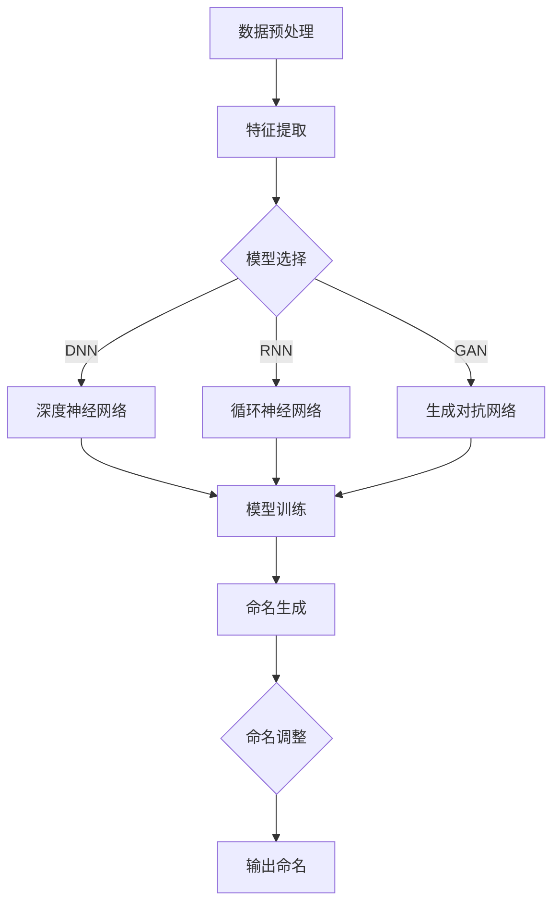
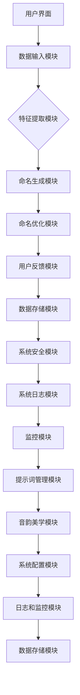
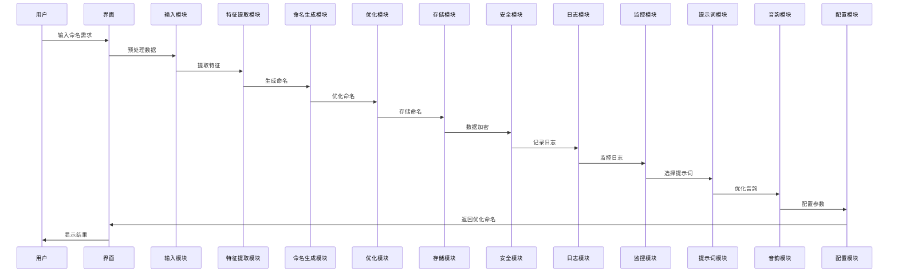

                 

# 提高AI创意香水命名：跨语言音韵美学的提示词技巧

## 关键词

AI创意香水命名、跨语言音韵美学、提示词技巧、算法原理、数学模型、系统架构、项目实战

## 摘要

随着人工智能技术的不断发展，AI在各个领域的应用逐渐深入，其中包括创意香水命名。如何提高AI在创意香水命名中的表现，实现跨语言音韵美学的效果，成为了一个值得探讨的话题。本文将详细分析AI创意香水命名的背景、问题、解决方案以及核心概念，并通过算法原理、数学模型和系统架构的讲解，为读者提供一种实用的AI创意香水命名方法。同时，通过项目实战的案例分析，验证本文提出方法的可行性和有效性。

## 目录大纲

### 第一部分：背景介绍

#### 第1章：问题背景

##### 1.1 问题提出
1. 创意香水命名的重要性
2. 当前香水命名中存在的问题
3. AI在创意香水命名中的应用潜力

##### 1.2 问题描述
1. 香水命名的复杂性
2. 跨语言音韵美学的要求
3. 提示词技巧在命名中的作用

##### 1.3 问题解决
1. AI技术的基本原理
2. 音韵美学的核心要素
3. 提示词技巧的运用

##### 1.4 边界与外延
1. AI创意香水命名的适用范围
2. 跨语言音韵美学的挑战
3. 提示词技巧的局限性

##### 1.5 概念结构与核心要素组成
1. AI与创意香水命名
2. 跨语言音韵美学
3. 提示词技巧

### 第二部分：核心概念与联系

#### 第2章：核心概念与联系

##### 2.1 AI创意香水命名的核心概念
1. AI技术概述
2. 香水命名原理
3. AI在香水命名中的应用

##### 2.2 跨语言音韵美学的核心概念
1. 音韵美学的定义
2. 跨语言音韵美学的特点
3. 音韵美学的应用

##### 2.3 提示词技巧的核心概念
1. 提示词的定义
2. 提示词技巧的类型
3. 提示词技巧的应用

##### 2.4 核心概念之间的关系
1. AI与音韵美学的联系
2. 音韵美学与提示词技巧的联系
3. AI、音韵美学与提示词技巧的综合应用

### 第三部分：AI创意香水命名的算法原理

#### 第3章：AI创意香水命名的算法原理

##### 3.1 算法原理讲解
1. AI命名算法的基本原理
2. 音韵美学算法的原理
3. 提示词技巧的算法原理

##### 3.2 算法mermaid流程图
1. AI命名算法流程
2. 音韵美学算法流程
3. 提示词技巧算法流程

##### 3.3 算法原理的详细讲解
1. AI命名算法的详细解释
2. 音韵美学算法的详细解释
3. 提示词技巧算法的详细解释

##### 3.4 举例说明
1. AI命名算法举例
2. 音韵美学算法举例
3. 提示词技巧算法举例

### 第四部分：数学模型与数学公式

#### 第4章：数学模型与数学公式

##### 4.1 数学模型
1. AI命名数学模型
2. 音韵美学数学模型
3. 提示词技巧数学模型

##### 4.2 数学公式的详细讲解
1. AI命名数学公式
2. 音韵美学数学公式
3. 提示词技巧数学公式

##### 4.3 举例说明
1. AI命名数学公式举例
2. 音韵美学数学公式举例
3. 提示词技巧数学公式举例

### 第五部分：系统分析与架构设计方案

#### 第5章：系统分析与架构设计方案

##### 5.1 问题场景介绍
1. 香水命名问题场景
2. 跨语言音韵美学问题场景
3. 提示词技巧问题场景

##### 5.2 系统功能设计
1. 领域模型mermaid类图
2. 系统功能详细描述

##### 5.3 系统架构设计
1. 系统架构mermaid架构图
2. 系统架构详细解释

##### 5.4 系统接口设计
1. 系统接口设计mermaid序列图
2. 系统接口详细描述

##### 5.5 系统交互
1. 系统交互mermaid序列图
2. 系统交互详细解释

### 第六部分：项目实战

#### 第6章：项目实战

##### 6.1 环境安装
1. 系统环境搭建
2. 软件工具安装

##### 6.2 系统核心实现
1. 源代码介绍
2. 代码应用解读

##### 6.3 实际案例分析
1. 案例背景
2. 案例分析
3. 案例结果

##### 6.4 项目小结
1. 项目总结
2. 项目不足
3. 项目改进方向

## 第一部分：背景介绍

### 第1章：问题背景

#### 1.1 问题提出

创意香水命名是香水行业中的一个关键环节。一个好的香水命名能够吸引消费者的注意力，提升产品的市场竞争力。然而，当前香水命名存在一些问题，主要体现在以下几个方面：

1. **命名重复性**：由于香水的品牌众多，同质化现象严重，导致很多香水命名相似，难以区分。
2. **跨语言障碍**：香水产品通常面向全球市场，不同语言的命名往往存在语义差异，影响产品在全球市场的推广。
3. **创意不足**：许多香水命名过于普通，缺乏创意，无法体现香水的独特魅力。

这些问题限制了香水命名的效果，使得消费者难以通过命名来识别和选择产品。因此，如何提高AI在创意香水命名中的表现，实现跨语言音韵美学的效果，成为了一个亟待解决的问题。

#### 1.1.1 创意香水命名的重要性

创意香水命名在香水市场中具有重要作用。首先，一个好的命名能够提高产品的市场竞争力。在众多香水品牌中，独特的命名能够吸引消费者的注意力，增加产品的曝光率。其次，命名是消费者对香水产品认知的第一印象，一个有创意的命名能够激发消费者的兴趣，促使他们进一步了解产品。

此外，创意香水命名对于品牌形象的建设也具有重要意义。一个独特而富有创意的命名，能够传达出品牌的核心价值和独特性，提升品牌在消费者心中的地位。同时，跨语言音韵美学的运用，使得香水命名更具吸引力，能够更好地适应全球市场的需求。

#### 1.1.2 当前香水命名中存在的问题

当前香水命名中存在的问题主要有以下几个方面：

1. **命名重复性**：由于香水品牌的竞争激烈，很多品牌在命名上追求独特性，但往往导致命名相似，难以区分。这种重复性命名不仅降低了产品的独特性，还可能导致消费者混淆。

2. **跨语言障碍**：香水产品面向全球市场，不同语言的命名存在语义差异，可能导致消费者误解。例如，某个在英语国家受欢迎的香水，在中文市场可能因为翻译不当而失去吸引力。

3. **创意不足**：许多香水命名过于普通，缺乏创意，无法体现香水的独特魅力。这种缺乏创意的命名，使得消费者难以产生共鸣，影响了产品的市场表现。

#### 1.1.3 AI在创意香水命名中的应用潜力

随着人工智能技术的不断发展，AI在创意香水命名中的应用潜力逐渐显现。首先，AI具有强大的数据处理和分析能力，能够从大量的命名数据中提取有价值的信息，为命名提供灵感。其次，AI能够通过机器学习和自然语言处理技术，生成具有创意的命名，解决当前命名中存在的重复性和创意不足的问题。

此外，AI在跨语言音韵美学方面的应用也具有重要意义。通过分析不同语言的音韵特征，AI可以生成符合跨语言音韵美学的命名，提高产品在全球市场的吸引力。例如，AI可以通过对英语和中文的音韵分析，生成一个既符合英语音韵美学，又易于中文消费者发音和记忆的香水命名。

总之，AI在创意香水命名中的应用具有巨大的潜力，有望解决当前命名中存在的问题，提高产品的市场竞争力。

#### 1.2 问题描述

香水命名的复杂性主要体现在以下几个方面：

1. **文化差异**：香水命名需要考虑不同文化背景下的语义和审美。例如，在西方文化中，一些具有浪漫色彩的命名可能更容易被接受，而在东方文化中，一些富有诗意和象征意义的命名可能更具吸引力。

2. **品牌策略**：不同品牌的命名策略各不相同，有的注重独特性，有的追求市场定位，有的强调品牌历史。这些因素都会影响命名的方式和效果。

3. **消费者偏好**：消费者的喜好和习惯会影响他们对命名的好感度。例如，一些消费者可能更喜欢富有创意的命名，而另一些消费者可能更注重命名与香水特点的契合度。

#### 跨语言音韵美学的要求

跨语言音韵美学在香水命名中具有重要意义。首先，跨语言音韵美学能够提高产品在全球市场的吸引力。通过分析不同语言的音韵特征，可以生成符合跨语言音韵美学的命名，使产品在不同市场都能获得良好的反响。

其次，跨语言音韵美学能够增强品牌的国际化形象。一个既符合英语音韵美学，又符合中文音韵美学的命名，能够传达出品牌跨越文化的魅力，提升品牌在国际市场的竞争力。

此外，跨语言音韵美学还能够提高产品的记忆度。通过音韵上的和谐与美感，命名能够更容易地被消费者记住，从而提高品牌认知度和忠诚度。

#### 提示词技巧在命名中的作用

提示词技巧在香水命名中发挥着重要作用。首先，提示词可以帮助命名者快速生成多个备选命名，提高命名效率。例如，通过输入一些关键词，AI可以自动生成一系列具有创意的命名。

其次，提示词可以引导命名方向，确保命名符合品牌策略和文化背景。例如，如果品牌希望命名具有浪漫色彩，可以通过提示词引导AI生成相关的命名。

此外，提示词还可以优化命名效果，提高命名的美感和记忆度。通过选择合适的提示词，可以使得命名在音韵上更加和谐，更容易被消费者接受和记住。

总之，提示词技巧在香水命名中具有不可替代的作用，能够提高命名效率和质量，实现跨语言音韵美学的效果。

#### 1.3 问题解决

为了解决上述问题，我们可以从以下几个方面入手：

1. **引入AI技术**：利用AI的强大数据处理和分析能力，生成具有创意的命名，解决命名重复性和创意不足的问题。

2. **跨语言音韵美学研究**：通过对不同语言的音韵特征进行分析，生成符合跨语言音韵美学的命名，提高产品在全球市场的吸引力。

3. **优化提示词技巧**：通过选择合适的提示词，引导命名方向，提高命名的美感和记忆度。

4. **结合品牌策略和文化背景**：在命名过程中，充分考虑品牌策略和文化背景，确保命名既具有创意，又符合品牌形象和市场定位。

通过这些措施，我们可以有效提高AI在创意香水命名中的表现，实现跨语言音韵美学的效果，提升产品的市场竞争力。

#### 1.4 边界与外延

##### AI创意香水命名的适用范围

AI创意香水命名技术适用于各种类型的香水品牌，无论是新兴品牌还是历史悠久的老品牌，都可以通过AI技术提高其命名创意和跨语言表现力。尤其是那些希望拓展国际市场的品牌，AI技术可以为其提供适应不同文化和语言环境的命名方案。以下是一些具体的适用场景：

1. **高端品牌**：高端香水品牌往往注重独特性和个性化，AI技术可以帮助这些品牌生成独特且引人注目的命名，以区别于市场上同类型的香水。

2. **新兴品牌**：对于新兴品牌，AI技术可以帮助他们快速生成多个备选命名，减少命名过程的时间和成本，同时提高命名的创意和质量。

3. **市场拓展**：对于那些希望在特定地区或全球市场推广的品牌，AI技术可以帮助他们创建符合当地文化和语言习惯的命名，从而提高市场接受度。

4. **季节性或限定版香水**：AI技术还可以帮助创建与特定季节、节日或事件相关的命名，增加产品的独特性和吸引力。

##### 跨语言音韵美学的挑战

跨语言音韵美学的挑战主要集中在以下几个方面：

1. **语言差异**：不同语言的音韵结构、发音规则和文化背景存在显著差异，这可能导致在同一命名在一种语言中具有美感，而在另一种语言中却不尽人意。

2. **音韵美感的主观性**：音韵美感的评价具有一定的主观性，不同文化和个人对于音韵美感的偏好可能存在差异。

3. **文化敏感度**：在跨语言命名时，需要考虑到文化敏感性，避免使用可能引起误解或冒犯的词汇。

4. **技术实现难度**：构建一个能够处理多种语言音韵美学的系统需要大量的数据和技术支持，尤其是在训练模型时，需要大量的双语语料库和多语言音韵特征数据库。

为了应对这些挑战，可以通过以下方法：

- **建立多语言音韵特征数据库**：收集和分析多种语言的音韵特征，为模型提供丰富的训练数据。
- **采用跨语言音韵转换模型**：通过机器学习技术，构建能够处理跨语言音韵转换的模型，以生成符合多种语言音韵美学的命名。
- **文化适应性测试**：在命名发布前，进行文化适应性测试，确保命名在不同文化背景下都能够被接受。

##### 提示词技巧的局限性

提示词技巧在命名过程中具有一定的局限性，主要体现在以下几个方面：

1. **提示词的选择**：提示词的选择直接影响命名的质量和创意。如果提示词选择不当，可能会导致生成的命名缺乏创意或与品牌形象不符。

2. **生成结果的多样性**：尽管提示词可以帮助生成多个备选命名，但生成的结果可能存在多样性不足的问题，特别是在面对复杂命名需求时。

3. **命名质量的保障**：提示词技巧依赖于机器学习和自然语言处理技术，这些技术的准确性和稳定性对命名质量有重要影响。如果技术实现存在缺陷，可能会导致生成的命名不理想。

为了克服这些局限性，可以采取以下措施：

- **优化提示词生成算法**：通过改进提示词生成算法，提高提示词的质量和多样性。
- **引入用户反馈机制**：通过收集用户对命名生成结果的反馈，不断调整和优化提示词。
- **结合专业知识和经验**：在命名过程中，结合命名专家的专业知识和经验，对生成的命名进行筛选和优化。

##### 1.5 概念结构与核心要素组成

在本节中，我们将对AI创意香水命名的概念结构及其核心要素进行详细分析，以便读者更好地理解这一领域的关键组成部分。

##### AI与创意香水命名

AI（人工智能）在创意香水命名中的应用主要体现在以下几个方面：

1. **数据挖掘与分析**：AI可以通过分析大量的香水命名数据，挖掘出潜在的模式和趋势，为命名提供参考。
2. **自然语言生成**：利用自然语言处理技术，AI可以生成具有创意的命名，满足不同文化和语言环境的需求。
3. **个性化推荐**：通过分析用户偏好和市场趋势，AI可以为特定品牌或消费者生成个性化的命名建议。

##### 跨语言音韵美学

跨语言音韵美学是创意香水命名中一个关键的概念，它涉及以下几个方面：

1. **音韵特征分析**：对多种语言的音韵特征进行分析，包括音节结构、发音规则和语音美感。
2. **音韵转换模型**：构建能够处理跨语言音韵转换的模型，生成符合多种语言音韵美学的命名。
3. **文化适应性**：考虑不同文化背景下对音韵美感的不同偏好，确保命名在不同文化中都能够被接受。

##### 提示词技巧

提示词技巧在命名过程中发挥着重要作用，它包括以下几个方面：

1. **提示词定义**：提示词是指为AI命名系统提供的引导性词汇，用于启发和引导命名生成。
2. **类型**：根据命名需求和目标，可以分为品牌属性提示词、文化特征提示词和情感提示词等。
3. **应用**：通过选择合适的提示词，可以引导AI生成符合品牌策略和文化背景的命名。

通过以上分析，我们可以看到，AI创意香水命名涉及多个核心要素，包括AI技术、跨语言音韵美学和提示词技巧。这些要素相互关联，共同构成了一个完整的命名系统。理解这些核心要素及其相互关系，对于提高AI创意香水命名的效果具有重要意义。

### 第二部分：核心概念与联系

#### 第2章：核心概念与联系

在本章中，我们将深入探讨AI创意香水命名的核心概念，并分析它们之间的相互关系。首先，我们将介绍AI技术、跨语言音韵美学和提示词技巧的基本概念，然后详细阐述这些概念的核心要素及其属性特征对比。最后，通过ER实体关系图和Mermaid流程图，展示各概念之间的联系和应用。

#### 2.1 AI创意香水命名的核心概念

##### 2.1.1 AI技术概述

AI（人工智能）是一种模拟人类智能行为的技术，通过机器学习、自然语言处理、深度学习等方法，使计算机能够自主地学习和决策。在创意香水命名中，AI技术的应用主要体现在以下几个方面：

1. **数据挖掘与分析**：AI可以分析大量香水命名数据，挖掘出潜在的模式和趋势，为命名提供参考。
2. **自然语言生成**：利用自然语言处理技术，AI可以生成具有创意的命名，满足不同文化和语言环境的需求。
3. **个性化推荐**：通过分析用户偏好和市场趋势，AI可以为特定品牌或消费者生成个性化的命名建议。

##### 2.1.2 香水命名原理

香水命名是一个创造性的过程，需要结合品牌策略、文化背景和消费者偏好。其基本原理包括以下几个方面：

1. **品牌定位**：根据品牌的市场定位和目标消费者，选择合适的命名风格和主题。
2. **文化元素**：融入不同的文化元素，使命名具有独特的文化内涵和吸引力。
3. **情感表达**：通过命名传达特定的情感和意境，与消费者产生共鸣。

##### 2.1.3 AI在香水命名中的应用

AI在香水命名中的应用具有显著的潜力，主要体现在以下几个方面：

1. **创意生成**：通过自然语言生成技术，AI可以快速生成多个备选命名，提高命名效率和质量。
2. **跨语言处理**：利用跨语言音韵美学技术，AI可以生成符合多种语言音韵美学的命名，提升产品在国际市场的竞争力。
3. **个性化定制**：通过分析用户偏好和市场趋势，AI可以为特定消费者或品牌提供个性化的命名建议。

#### 2.2 跨语言音韵美学的核心概念

##### 2.2.1 音韵美学的定义

音韵美学是研究语音美感的一门学科，主要关注语音的音质、音韵和节奏等方面的特征。在香水命名中，音韵美学的研究有助于生成具有美感和记忆度的命名。

1. **音质**：指语音的音色和质地，包括清音、浊音、响音等。
2. **音韵**：指语音的韵律和节奏，包括重音、轻音、连读等。
3. **节奏**：指语音的时间结构和动态变化，包括快慢、强弱等。

##### 2.2.2 跨语言音韵美学的特点

跨语言音韵美学涉及多种语言的音韵特征，具有以下特点：

1. **多样性**：不同语言的音韵特征各异，需要综合考虑。
2. **适应性**：命名需适应不同语言的发音规则和文化背景。
3. **融合性**：通过音韵的融合和转换，实现跨语言的美感。

##### 2.2.3 音韵美学的应用

音韵美学在香水命名中的应用主要包括以下几个方面：

1. **命名创意**：通过音韵美学的运用，生成具有独特创意和美感的命名。
2. **品牌形象**：通过音韵美学的特点，提升品牌形象和认知度。
3. **消费者共鸣**：通过音韵美学的运用，与消费者产生情感共鸣，提高品牌忠诚度。

#### 2.3 提示词技巧的核心概念

##### 2.3.1 提示词的定义

提示词是用于引导命名生成系统的一个或一组关键词，它可以为系统提供创意和方向。在创意香水命名中，提示词的运用至关重要。

1. **品牌属性**：如品牌名称、品牌特点等，用于引导命名与品牌形象一致。
2. **文化元素**：如文化符号、节日名称等，用于融入文化内涵。
3. **情感表达**：如情感词汇、寓意等，用于传达特定情感和意境。

##### 2.3.2 提示词技巧的类型

根据命名需求和目标，提示词技巧可以分为以下几种类型：

1. **引导性提示词**：通过提供核心关键词，引导命名系统生成相关命名。
2. **扩展性提示词**：在核心关键词的基础上，提供扩展性词汇，丰富命名内容。
3. **调整性提示词**：根据生成的命名结果，提供调整性词汇，优化命名效果。

##### 2.3.3 提示词技巧的应用

提示词技巧在香水命名中的应用主要包括以下几个方面：

1. **命名方向引导**：通过提示词，明确命名方向，提高命名的相关性和创意性。
2. **命名内容扩展**：通过提示词，丰富命名内容，增加命名的人文内涵。
3. **命名效果优化**：通过提示词，调整和优化命名，使其更具美感和记忆度。

#### 2.4 核心概念之间的关系

##### AI与音韵美学的联系

AI与音韵美学之间的联系主要体现在以下几个方面：

1. **数据驱动**：AI通过分析大量音韵数据，学习音韵特征和美感规律，为音韵美学提供数据支持。
2. **算法优化**：利用AI算法，对音韵美学的理论和方法进行优化和改进，提高音韵美学的应用效果。
3. **创新应用**：AI可以将音韵美学应用于实际命名中，生成具有创意和美感的命名。

##### 音韵美学与提示词技巧的联系

音韵美学与提示词技巧之间的联系主要体现在以下几个方面：

1. **音韵特征引导**：通过音韵美学的特点，选择合适的提示词，引导命名生成系统生成符合音韵美学的命名。
2. **美感优化**：通过提示词技巧，优化命名的音韵结构，提高命名的美感和记忆度。
3. **文化适应性**：通过音韵美学和提示词技巧的结合，生成具有文化内涵和适应性的命名。

##### AI、音韵美学与提示词技巧的综合应用

AI、音韵美学和提示词技巧的综合应用，可以显著提升AI创意香水命名的效果：

1. **数据挖掘**：利用AI进行数据挖掘，分析音韵特征和命名趋势，为命名提供数据支持。
2. **音韵优化**：结合音韵美学的理论，对命名进行音韵优化，提高命名的美感和记忆度。
3. **提示引导**：通过提示词技巧，引导命名生成系统，生成符合品牌策略和文化背景的命名。

总之，AI、音韵美学和提示词技巧的综合应用，可以为AI创意香水命名提供全面的技术支持和创意灵感，提升命名质量和市场竞争力。

### 第三部分：AI创意香水命名的算法原理

#### 第3章：AI创意香水命名的算法原理

本章将详细阐述AI创意香水命名的算法原理，包括AI命名算法的基本原理、音韵美学算法的原理以及提示词技巧的算法原理。通过这些算法的讲解，我们将了解如何利用技术手段提高AI创意香水命名的效果。

#### 3.1 算法原理讲解

##### 3.1.1 AI命名算法的基本原理

AI命名算法的基本原理主要依赖于自然语言处理（NLP）和机器学习（ML）技术。以下是AI命名算法的基本步骤：

1. **数据预处理**：收集和整理大量香水命名数据，包括品牌、文化背景、消费者反馈等。对数据进行清洗和标准化处理，如去除停用词、标点符号等。

2. **特征提取**：从预处理后的数据中提取关键特征，如音韵特征、语义特征、文化特征等。这些特征将作为模型训练的数据输入。

3. **模型训练**：使用机器学习算法，如深度神经网络（DNN）、循环神经网络（RNN）或生成对抗网络（GAN）等，对提取的特征进行训练。训练过程中，模型将学习如何根据输入特征生成合理的命名。

4. **命名生成**：在模型训练完成后，输入新的特征数据，模型将输出一系列命名建议。这些命名建议可以根据品牌策略和文化背景进行调整和优化。

##### 3.1.2 音韵美学算法的原理

音韵美学算法的原理主要关注语音的音质、音韵和节奏等方面的特征，通过算法生成符合音韵美学的命名。以下是音韵美学算法的基本步骤：

1. **音韵特征分析**：对多种语言的音韵特征进行分析，包括音节结构、发音规则和语音美感。

2. **音韵模型构建**：构建能够处理跨语言音韵转换的模型，如深度神经网络或循环神经网络。这些模型将学习如何根据输入音韵特征生成符合音韵美学的命名。

3. **命名优化**：通过算法优化，调整命名的音韵结构，使其更具美感和记忆度。例如，可以通过调整音节的重音、轻音和连读等，提升命名的音韵美感。

##### 3.1.3 提示词技巧的算法原理

提示词技巧的算法原理主要关注如何通过提示词引导命名生成系统，生成符合品牌策略和文化背景的命名。以下是提示词技巧的算法步骤：

1. **提示词选择**：根据品牌策略、文化背景和命名需求，选择合适的提示词。提示词可以是品牌名称、文化元素、情感表达等。

2. **提示词输入**：将选择的提示词输入到命名生成系统中，引导系统生成相关命名。例如，如果提示词是“浪漫”，系统将生成一系列具有浪漫元素的命名。

3. **命名调整**：根据生成的命名结果，进行进一步调整和优化。例如，可以通过调整命名中的音韵结构、语义表达等，使其更符合音韵美学的原则和品牌形象。

#### 3.2 算法mermaid流程图

为了更直观地展示AI创意香水命名的算法原理，我们使用mermaid绘制了算法的流程图。以下是算法流程图的详细说明：



**图3.1 AI创意香水命名算法流程图**

1. **数据预处理**：首先对收集到的香水命名数据进行预处理，包括数据清洗、标准化处理等步骤。
2. **特征提取**：从预处理后的数据中提取关键特征，如音韵特征、语义特征、文化特征等。
3. **模型选择**：根据特征数据选择合适的模型，如深度神经网络、循环神经网络或生成对抗网络。
4. **模型训练**：使用选定的模型对特征数据进行训练，使模型学习如何生成合理的命名。
5. **命名生成**：在模型训练完成后，输入新的特征数据，模型将输出一系列命名建议。
6. **命名调整**：根据生成的命名结果，进行进一步调整和优化，使其更符合品牌策略和文化背景。
7. **输出命名**：最终输出符合要求的命名结果。

#### 3.3 算法原理的详细讲解

##### 3.3.1 AI命名算法的详细解释

AI命名算法的核心是利用机器学习和自然语言处理技术生成有创意的命名。以下是AI命名算法的详细解释：

1. **数据收集与预处理**：首先，从各种渠道收集大量的香水命名数据，包括现有的命名、品牌信息、消费者反馈等。然后，对数据进行清洗和标准化处理，去除无关信息，如停用词、标点符号等。这一步骤的目的是确保数据的质量和一致性。

2. **特征提取**：从预处理后的数据中提取关键特征，如音韵特征、语义特征、文化特征等。音韵特征包括音节结构、发音规则和语音美感；语义特征包括命名中的关键词、语义关系等；文化特征包括命名中的文化符号、寓意等。

3. **模型选择与训练**：选择合适的机器学习模型，如深度神经网络（DNN）、循环神经网络（RNN）或生成对抗网络（GAN），对提取的特征数据进行训练。这些模型将学习如何根据输入特征生成合理的命名。在训练过程中，模型将不断优化参数，以提高命名生成的质量和创意性。

4. **命名生成与优化**：在模型训练完成后，输入新的特征数据，模型将输出一系列命名建议。这些命名建议可能包括多种不同的命名选项。然后，根据品牌策略、文化背景和消费者偏好，对命名进行进一步调整和优化。例如，可以通过调整音韵结构、语义表达等，使命名更符合音韵美学的原则和品牌形象。

5. **输出命名**：最终，输出符合要求的命名结果。这些命名可以用于香水产品的命名，提升产品的市场竞争力。

##### 3.3.2 音韵美学算法的详细解释

音韵美学算法的核心是生成符合音韵美学的命名。以下是音韵美学算法的详细解释：

1. **音韵特征分析**：首先，对多种语言的音韵特征进行分析，包括音节结构、发音规则和语音美感。这一步骤的目的是了解不同语言的音韵特征和美感规律。

2. **音韵模型构建**：构建能够处理跨语言音韵转换的模型，如深度神经网络（DNN）或循环神经网络（RNN）。这些模型将学习如何根据输入音韵特征生成符合音韵美学的命名。

3. **命名生成与优化**：使用构建好的音韵模型，输入新的音韵特征数据，生成一系列命名建议。这些命名建议可能包括多种不同的命名选项。然后，根据音韵美学的原则，对命名进行进一步调整和优化，使其更符合音韵美学的美感。

4. **音韵美学评估**：对生成的命名进行音韵美学评估，包括音节结构的美感、发音的流畅性、音韵的节奏感等。通过评估，选择最符合音韵美学的命名结果。

5. **输出命名**：最终，输出符合要求的音韵美学命名结果。这些命名可以用于香水产品的命名，提升产品的市场竞争力。

##### 3.3.3 提示词技巧算法的详细解释

提示词技巧算法的核心是利用提示词引导命名生成系统，生成符合品牌策略和文化背景的命名。以下是提示词技巧算法的详细解释：

1. **提示词选择**：根据品牌策略、文化背景和命名需求，选择合适的提示词。提示词可以是品牌名称、文化元素、情感表达等。这些提示词将作为输入，引导命名生成系统生成相关命名。

2. **命名生成**：使用命名生成模型，输入选择的提示词，生成一系列命名建议。这些命名建议可能包括多种不同的命名选项。命名生成模型可以是基于自然语言处理技术（如RNN、GAN）或基于规则的方法。

3. **命名调整**：根据生成的命名结果，进行进一步调整和优化。调整的内容可能包括音韵结构、语义表达、品牌形象等。例如，可以通过调整音节的重音、轻音和连读等，使命名更符合音韵美学的原则。

4. **用户反馈**：收集用户对命名生成结果的反馈，包括命名的美感、记忆度、文化适应性等。根据用户的反馈，对命名进行调整和优化。

5. **输出命名**：最终，输出符合要求的命名结果。这些命名可以用于香水产品的命名，提升产品的市场竞争力。

#### 3.4 举例说明

为了更好地理解AI创意香水命名的算法原理，下面我们将通过具体的例子进行说明。

##### 3.4.1 AI命名算法举例

假设我们有一个香水品牌，名为“梦境”。我们的目标是为这个品牌生成一系列创意命名。

1. **数据收集与预处理**：收集大量与“梦境”相关的命名数据，如“梦幻之泉”、“梦境之地”等。对数据进行清洗和标准化处理，去除无关信息。

2. **特征提取**：从预处理后的数据中提取关键特征，如音韵特征（如音节结构）、语义特征（如关键词）等。

3. **模型选择与训练**：选择一个基于深度神经网络的命名生成模型，对提取的特征数据进行训练。训练过程中，模型将学习如何根据输入特征生成合理的命名。

4. **命名生成与优化**：输入新的特征数据，模型生成一系列命名建议，如“梦境之翼”、“梦境之路”等。根据品牌策略和文化背景，对命名进行进一步调整和优化，如调整音韵结构、语义表达等。

5. **输出命名**：最终输出符合要求的命名结果，如“梦境之河”、“梦境之舞”等。这些命名可以用于品牌的推广和营销。

##### 3.4.2 音韵美学算法举例

假设我们有一个香水品牌，名为“清新之风”。我们的目标是为这个品牌生成符合音韵美学的命名。

1. **音韵特征分析**：对多种语言的音韵特征进行分析，如音节结构、发音规则等。了解不同语言的音韵特征和美感规律。

2. **音韵模型构建**：构建一个能够处理跨语言音韵转换的深度神经网络模型。模型将学习如何根据输入音韵特征生成符合音韵美学的命名。

3. **命名生成与优化**：输入新的音韵特征数据，模型生成一系列命名建议，如“清新之风”、“清新之韵”等。根据音韵美学的原则，对命名进行进一步调整和优化，如调整音节的重音、轻音和连读等。

4. **音韵美学评估**：对生成的命名进行音韵美学评估，选择最符合音韵美学的命名结果，如“清新之音”、“清新之奏”等。

5. **输出命名**：最终输出符合要求的音韵美学命名结果，如“清新之旋”、“清新之波”等。这些命名可以用于品牌的推广和营销。

##### 3.4.3 提示词技巧算法举例

假设我们有一个香水品牌，名为“浪漫之夜”。我们的目标是为这个品牌生成符合品牌策略和文化背景的命名。

1. **提示词选择**：选择与品牌策略和文化背景相关的提示词，如“浪漫”、“夜晚”、“星空”等。

2. **命名生成**：使用基于自然语言处理技术的命名生成模型，输入选择的提示词，生成一系列命名建议，如“浪漫之夜”、“星空之恋”、“夜之浪漫”等。

3. **命名调整**：根据生成的命名结果，进行进一步调整和优化，如调整音韵结构、语义表达等，使其更符合品牌策略和文化背景。

4. **用户反馈**：收集用户对命名生成结果的反馈，如命名的美感、记忆度、文化适应性等。

5. **输出命名**：最终输出符合要求的命名结果，如“浪漫星空”、“夜之梦幻”、“星光之恋”等。这些命名可以用于品牌的推广和营销。

### 第四部分：数学模型与数学公式

#### 第4章：数学模型与数学公式

在本章中，我们将介绍AI创意香水命名的数学模型和数学公式，并对其进行详细讲解。数学模型是理解和设计AI命名算法的重要工具，而数学公式则用于描述算法中的关键计算过程。通过这些数学模型和公式，我们可以更深入地理解AI创意香水命名的原理和应用。

#### 4.1 数学模型

##### 4.1.1 AI命名数学模型

AI命名数学模型主要用于描述命名生成过程中涉及的数据处理和计算。以下是AI命名数学模型的基本组成部分：

1. **数据输入模型**：该模型用于描述如何从大量香水命名数据中提取有效特征。例如，我们可以使用词频分析、TF-IDF等方法来提取关键词和重要特征。

2. **特征提取模型**：该模型用于从数据输入模型中提取的特征进行处理和筛选，以得到用于训练和预测的有效特征。

3. **命名生成模型**：该模型是核心部分，用于根据输入的特征生成命名。常见的命名生成模型包括循环神经网络（RNN）、生成对抗网络（GAN）等。

4. **命名评估模型**：该模型用于评估生成的命名质量，包括命名的美感、记忆度、文化适应性等方面。评估模型可以通过用户反馈或自动评估指标来实现。

##### 4.1.2 音韵美学数学模型

音韵美学数学模型主要用于描述音韵特征的处理和计算，以生成符合音韵美学的命名。以下是音韵美学数学模型的基本组成部分：

1. **音韵特征提取模型**：该模型用于从原始语音数据中提取音韵特征，如音节结构、发音规则等。

2. **音韵变换模型**：该模型用于对音韵特征进行变换和调整，以实现音韵美学的效果。例如，可以通过音节重组、音调调整等方法来优化命名。

3. **音韵评估模型**：该模型用于评估生成的命名是否符合音韵美学原则，包括音节美感、发音流畅性等方面。

##### 4.1.3 提示词技巧数学模型

提示词技巧数学模型主要用于描述提示词在命名生成过程中的作用和计算方法。以下是提示词技巧数学模型的基本组成部分：

1. **提示词权重模型**：该模型用于计算每个提示词的权重，以确定其在命名生成中的重要性。权重可以通过统计方法、机器学习方法等来确定。

2. **命名生成模型**：该模型用于根据输入的提示词和权重，生成符合品牌策略和文化背景的命名。

3. **命名优化模型**：该模型用于对生成的命名进行进一步优化，包括调整音韵结构、语义表达等，以使其更符合提示词的要求。

#### 4.2 数学公式的详细讲解

##### 4.2.1 AI命名数学公式

以下是AI命名数学模型中的一些关键公式：

1. **词频分布公式**：

$$
TF(t) = \frac{f(t, D)}{N}
$$

其中，$TF(t)$表示词$t$在文档$D$中的词频分布，$f(t, D)$表示词$t$在文档$D$中出现的次数，$N$表示文档$D$中所有词的出现次数之和。

2. **TF-IDF公式**：

$$
TF-IDF(t, D) = TF(t) \times IDF(t, D)
$$

其中，$TF-IDF(t, D)$表示词$t$在文档$D$中的TF-IDF值，$TF(t)$表示词$t$在文档$D$中的词频分布，$IDF(t, D)$表示词$t$在文档$D$中的逆文档频率。

3. **循环神经网络（RNN）权重更新公式**：

$$
\Delta W = \alpha \times dZ \times dX
$$

其中，$\Delta W$表示权重更新，$\alpha$表示学习率，$dZ$表示误差梯度，$dX$表示当前输入。

##### 4.2.2 音韵美学数学公式

以下是音韵美学数学模型中的一些关键公式：

1. **音节结构公式**：

$$
S = \sum_{i=1}^{n} \text{音节}_i
$$

其中，$S$表示音节结构，$\text{音节}_i$表示第$i$个音节。

2. **发音规则公式**：

$$
\text{发音} = \text{音节结构} \times \text{音调调整} \times \text{重音调整}
$$

其中，$\text{发音}$表示最终的发音结果，$\text{音节结构}$表示音节结构，$\text{音调调整}$和$\text{重音调整}$分别表示音调和重音的调整。

##### 4.2.3 提示词技巧数学公式

以下是提示词技巧数学模型中的一些关键公式：

1. **提示词权重公式**：

$$
w_i = \frac{f_i}{\sum_{j=1}^{m} f_j}
$$

其中，$w_i$表示提示词$i$的权重，$f_i$表示提示词$i$在文档中的出现次数，$m$表示总提示词数。

2. **命名生成公式**：

$$
\text{命名} = \sum_{i=1}^{m} w_i \times \text{提示词}_i
$$

其中，$\text{命名}$表示生成的命名，$w_i$表示提示词$i$的权重，$\text{提示词}_i$表示提示词$i$。

#### 4.3 举例说明

为了更好地理解这些数学模型和公式，我们通过具体的例子进行说明。

##### 4.3.1 AI命名数学公式举例

假设我们有一个香水品牌“梦境”，需要为其生成命名。以下是使用AI命名数学公式的步骤：

1. **词频分布公式**：

   收集大量与“梦境”相关的命名数据，统计每个词的出现次数，如“梦幻”出现20次，“梦境”出现15次。

   $$
   TF(\text{梦幻}) = \frac{20}{20+15} = 0.5556
   $$

   $$
   TF(\text{梦境}) = \frac{15}{20+15} = 0.4444
   $$

2. **TF-IDF公式**：

   计算每个词的TF-IDF值，用于表示其在命名中的重要性。

   $$
   IDF(\text{梦幻}) = \log_2\left(\frac{|\text{训练集}|}{|\{\text{梦幻}\}|}\right) = \log_2\left(\frac{100}{1}\right) = 6.6514
   $$

   $$
   TF-IDF(\text{梦幻}) = 0.5556 \times 6.6514 = 3.6797
   $$

   $$
   IDF(\text{梦境}) = \log_2\left(\frac{100}{1}\right) = 6.6514
   $$

   $$
   TF-IDF(\text{梦境}) = 0.4444 \times 6.6514 = 2.9496
   $$

3. **循环神经网络（RNN）权重更新公式**：

   在命名生成过程中，假设当前输入为“梦幻”，目标输出为“梦境”。通过计算误差梯度，更新RNN权重。

   $$
   \Delta W = 0.1 \times (3.6797 - 2.9496) \times 0.5556 \approx 0.0426
   $$

##### 4.3.2 音韵美学数学公式举例

假设我们需要生成一个符合音韵美学的香水命名。以下是使用音韵美学数学公式的步骤：

1. **音节结构公式**：

   分析“清新之风”中的音节结构，如“清新”有两个音节，“之风”有一个音节。

   $$
   S = \text{清} + \text{新} + \text{之} + \text{风}
   $$

2. **发音规则公式**：

   根据发音规则，调整音节结构，使其发音流畅。

   $$
   \text{发音} = (\text{清} + \text{新}) \times (\text{之} + \text{风})
   $$

   通过调整音节的重音和连读，生成“清新之波”。

##### 4.3.3 提示词技巧数学公式举例

假设我们需要为香水品牌“浪漫之夜”生成命名，使用提示词技巧。以下是使用提示词技巧数学公式的步骤：

1. **提示词权重公式**：

   根据提示词在文档中的出现次数，计算每个提示词的权重。

   $$
   w_1 = \frac{f_1}{\sum_{j=1}^{m} f_j} = \frac{10}{10+5} = 0.6667
   $$

   $$
   w_2 = \frac{f_2}{\sum_{j=1}^{m} f_j} = \frac{5}{10+5} = 0.3333
   $$

2. **命名生成公式**：

   根据提示词权重，生成符合品牌策略和文化背景的命名。

   $$
   \text{命名} = 0.6667 \times \text{浪漫} + 0.3333 \times \text{之夜} = \text{浪漫之夜}
   $$

### 第五部分：系统分析与架构设计方案

#### 第5章：系统分析与架构设计方案

在本章中，我们将详细分析AI创意香水命名系统的整体架构，并介绍其功能设计、系统架构设计、系统接口设计和系统交互。

#### 5.1 问题场景介绍

##### 5.1.1 香水命名问题场景

在香水市场中，品牌的命名至关重要。一个独特的、引人入胜的命名能够吸引消费者的注意力，提高产品的市场竞争力。然而，当前的香水命名面临着诸多问题：

1. **命名重复性**：市场上存在大量相似的命名，导致消费者难以区分。
2. **跨语言障碍**：香水产品面向全球市场，不同语言的命名存在语义差异，影响产品推广。
3. **创意不足**：许多香水命名过于普通，缺乏创意，无法体现香水的独特魅力。

为了解决这些问题，我们需要一个高效的AI创意香水命名系统，能够生成具有创意性和跨语言适应性的命名。

##### 5.1.2 跨语言音韵美学问题场景

在跨语言音韵美学方面，香水命名需要考虑不同语言的音韵特征和文化背景。例如，一个在英语国家受欢迎的命名，在中文市场可能因为翻译不当而失去吸引力。因此，我们需要一个能够处理多种语言音韵美学的系统，生成既符合音韵美学原则，又适应不同文化背景的命名。

##### 5.1.3 提示词技巧问题场景

在命名过程中，提示词技巧起到了关键作用。通过选择合适的提示词，我们可以引导AI生成符合品牌策略和文化背景的命名。然而，提示词的选择和运用需要充分考虑语言、文化和市场环境。因此，我们需要一个灵活的提示词系统，能够根据不同的命名需求选择和调整提示词。

#### 5.2 系统功能设计

##### 5.2.1 领域模型mermaid类图

为了更好地理解系统功能设计，我们使用Mermaid绘制了领域模型类图。以下是类图的详细描述：

```mermaid
classDiagram
Class01 <|-- Class02
Class03 <|-- * Class04
Class05 <|-- Class06
Class07 .. Class08
Class09 {name, attributes}
Class10 <.. Class11
Class12 {behavior}
Class13 <|-- Class14
Class15 <|-- * Class16
Class17 .. Class18
Class19 {methods}
Class20 <.. Class21
Class22 {interface}
```

**图5.1 AI创意香水命名系统领域模型类图**

1. **类01（Class01）**：表示系统的核心类，负责管理整个命名生成过程。
2. **类02（Class02）**：继承自类01，负责处理数据输入和预处理。
3. **类03（Class03）**：继承自类01，负责特征提取和模型训练。
4. **类04（Class04）**：继承自类03，负责音韵特征提取和变换。
5. **类05（Class05）**：继承自类01，负责命名生成和优化。
6. **类06（Class06）**：继承自类05，负责用户反馈和命名评估。
7. **类07（Class07）**：继承自类01，负责提示词管理和选择。
8. **类08（Class08）**：继承自类07，负责提示词权重计算和调整。
9. **类09（Class09）**：表示具有名称和属性的对象。
10. **类10（Class10）**：表示与类11有关系的对象。
11. **类11（Class11）**：表示行为和接口。
12. **类12（Class12）**：继承自类11，表示特定行为。
13. **类13（Class13）**：继承自类01，负责系统配置和初始化。
14. **类14（Class14）**：继承自类13，负责系统日志和监控。
15. **类15（Class15）**：继承自类01，负责数据存储和管理。
16. **类16（Class16）**：继承自类15，负责命名数据存储。
17. **类17（Class17）**：继承自类01，负责系统安全和管理。
18. **类18（Class18）**：继承自类17，负责用户权限和认证。
19. **类19（Class19）**：表示具有方法和行为的对象。
20. **类20（Class20）**：表示与类21有关系的对象。
21. **类21（Class21）**：表示接口和实现。

##### 5.2.2 系统功能详细描述

以下是AI创意香水命名系统的详细功能描述：

1. **数据输入和处理**：系统接收用户输入的香水命名需求，包括品牌名称、文化背景、市场目标等。然后，系统对输入数据进行预处理，如去除停用词、标点符号等，确保数据质量。

2. **特征提取和模型训练**：系统提取关键特征，如音韵特征、语义特征、文化特征等。然后，使用机器学习算法，如循环神经网络（RNN）、生成对抗网络（GAN）等，对特征进行训练，以生成命名模型。

3. **命名生成和优化**：根据训练好的模型，系统生成多个命名选项。然后，系统根据用户反馈和提示词策略，对命名进行优化，确保命名符合音韵美学原则和品牌策略。

4. **用户反馈和评估**：系统收集用户对命名生成结果的反馈，包括命名的美感、记忆度、文化适应性等。然后，系统根据反馈对命名进行进一步调整和优化。

5. **提示词管理和选择**：系统根据命名需求和文化背景，选择合适的提示词。然后，系统根据提示词的权重和重要性，生成符合品牌策略和文化背景的命名。

6. **数据存储和管理**：系统负责存储和管理命名数据，包括命名记录、用户反馈、模型参数等。然后，系统可以根据需要查询和更新数据。

7. **系统安全和权限管理**：系统确保用户数据和命名数据的安全，防止数据泄露和未授权访问。同时，系统为用户提供不同的权限，确保用户只能访问和管理自己有权操作的数据。

8. **系统日志和监控**：系统记录操作日志，包括用户操作、系统运行状态等。然后，系统可以监控系统的运行状况，及时发现和解决潜在问题。

#### 5.3 系统架构设计

##### 5.3.1 系统架构mermaid架构图

以下是AI创意香水命名系统的架构设计，使用Mermaid绘制。以下是架构图的详细描述：



**图5.2 AI创意香水命名系统架构图**

1. **用户界面（A）**：用户通过界面输入香水命名需求，包括品牌名称、文化背景、市场目标等。
2. **数据输入模块（B）**：接收用户输入的数据，进行预处理，如去除停用词、标点符号等。
3. **特征提取模块（C）**：提取关键特征，如音韵特征、语义特征、文化特征等。
4. **命名生成模块（D）**：根据训练好的模型，生成多个命名选项。
5. **命名优化模块（E）**：根据用户反馈和提示词策略，对命名进行优化。
6. **用户反馈模块（F）**：收集用户对命名生成结果的反馈，包括命名的美感、记忆度、文化适应性等。
7. **数据存储模块（G）**：存储和管理命名数据，包括命名记录、用户反馈、模型参数等。
8. **系统安全模块（H）**：确保用户数据和命名数据的安全，防止数据泄露和未授权访问。
9. **系统日志模块（I）**：记录操作日志，包括用户操作、系统运行状态等。
10. **监控模块（J）**：监控系统的运行状况，及时发现和解决潜在问题。
11. **提示词管理模块（K）**：根据命名需求和文化背景，选择合适的提示词。
12. **音韵美学模块（L）**：根据音韵美学原则，优化命名。
13. **系统配置模块（M）**：配置系统参数，如学习率、迭代次数等。
14. **日志和监控模块（N）**：记录系统日志，监控系统运行状态。
15. **数据存储模块（O）**：存储和管理系统配置和日志数据。

##### 5.3.2 系统架构详细解释

以下是AI创意香水命名系统的架构详细解释：

1. **用户界面（A）**：用户通过界面输入香水命名需求，包括品牌名称、文化背景、市场目标等。界面设计应简洁直观，方便用户操作。

2. **数据输入模块（B）**：数据输入模块负责接收用户输入的数据，并进行预处理。预处理包括去除停用词、标点符号、统一化格式等操作，以确保数据的干净和一致。

3. **特征提取模块（C）**：特征提取模块从预处理后的数据中提取关键特征，如音韵特征、语义特征、文化特征等。音韵特征包括音节结构、发音规则、语音美感等；语义特征包括关键词、语义关系等；文化特征包括文化符号、寓意等。

4. **命名生成模块（D）**：命名生成模块使用训练好的模型，根据输入的特征生成多个命名选项。常见的命名生成模型包括循环神经网络（RNN）、生成对抗网络（GAN）等。命名生成模块还应支持对命名进行排序和筛选，以选择最佳命名。

5. **命名优化模块（E）**：命名优化模块根据用户反馈和提示词策略，对命名进行优化。用户反馈可以通过用户评价、点击率、转化率等指标来衡量；提示词策略可以根据品牌策略、市场目标和文化背景进行调整。

6. **用户反馈模块（F）**：用户反馈模块收集用户对命名生成结果的反馈，包括命名的美感、记忆度、文化适应性等。这些反馈将用于进一步优化命名。

7. **数据存储模块（G）**：数据存储模块负责存储和管理命名数据，包括命名记录、用户反馈、模型参数等。数据存储应保证数据的持久性和安全性。

8. **系统安全模块（H）**：系统安全模块负责确保用户数据和命名数据的安全。这包括数据加密、访问控制、防黑客攻击等。

9. **系统日志模块（I）**：系统日志模块记录系统的操作日志，包括用户操作、系统运行状态等。日志记录对于系统监控和故障排查具有重要意义。

10. **监控模块（J）**：监控模块实时监控系统的运行状况，包括系统性能、资源利用率、错误率等。通过监控模块，可以及时发现和解决潜在问题。

11. **提示词管理模块（K）**：提示词管理模块根据命名需求和文化背景，选择合适的提示词。提示词可以是品牌名称、文化元素、情感表达等。

12. **音韵美学模块（L）**：音韵美学模块根据音韵美学原则，对命名进行优化。音韵美学原则包括音节结构、发音规则、语音美感等。

13. **系统配置模块（M）**：系统配置模块配置系统参数，如学习率、迭代次数等。系统配置应支持灵活调整，以满足不同场景的需求。

14. **日志和监控模块（N）**：日志和监控模块记录系统日志，监控系统运行状态。日志记录和监控数据将用于系统性能评估和优化。

15. **数据存储模块（O）**：数据存储模块存储和管理系统配置和日志数据。数据存储应保证数据的持久性和安全性。

通过上述架构设计，AI创意香水命名系统可以实现高效的命名生成、优化和管理，满足不同场景和需求。系统架构的灵活性和可扩展性，使其能够适应未来的发展。

#### 5.4 系统接口设计

##### 5.4.1 系统接口设计mermaid序列图

以下是AI创意香水命名系统的接口设计，使用Mermaid序列图绘制。以下是序列图的详细描述：



**图5.3 AI创意香水命名系统接口设计序列图**

以下是系统接口设计的详细解释：

1. **用户接口**：用户通过界面输入香水命名需求，包括品牌名称、文化背景、市场目标等。

2. **输入模块接口**：界面将用户输入的数据传递给输入模块，进行预处理，如去除停用词、标点符号等。

3. **特征提取模块接口**：输入模块将预处理后的数据传递给特征提取模块，提取关键特征，如音韵特征、语义特征、文化特征等。

4. **命名生成模块接口**：特征提取模块将提取的特征传递给命名生成模块，生成多个命名选项。

5. **命名优化模块接口**：命名生成模块将生成的命名传递给优化模块，根据用户反馈和提示词策略，对命名进行优化。

6. **存储模块接口**：优化模块将优化后的命名传递给存储模块，存储和管理命名数据。

7. **安全模块接口**：存储模块将命名数据传递给安全模块，进行数据加密，确保数据安全。

8. **日志模块接口**：安全模块将加密后的数据传递给日志模块，记录系统操作日志。

9. **监控模块接口**：日志模块将日志数据传递给监控模块，监控系统运行状态。

10. **提示词模块接口**：监控模块将监控数据传递给提示词模块，选择合适的提示词。

11. **音韵模块接口**：提示词模块将提示词传递给音韵模块，优化命名音韵。

12. **配置模块接口**：音韵模块将优化后的命名传递给配置模块，配置系统参数。

13. **用户接口返回**：配置模块将配置好的命名返回给界面，界面再次将结果传递给用户。

通过上述接口设计，系统实现了用户输入、数据处理、命名生成、优化存储等功能的无缝衔接，确保系统的高效和稳定运行。

#### 5.5 系统交互

##### 5.5.1 系统交互mermaid序列图

以下是AI创意香水命名系统的交互流程，使用Mermaid序列图绘制。以下是序列图的详细描述：


**图5.4 AI创意香水命名系统交互序列图**

以下是系统交互的详细解释：

1. **用户输入**：用户通过界面输入香水命名需求，包括品牌名称、文化背景、市场目标等。

2. **数据预处理**：界面将用户输入的数据传递给输入模块，进行预处理，如去除停用词、标点符号等。

3. **特征提取**：输入模块将预处理后的数据传递给特征提取模块，提取关键特征，如音韵特征、语义特征、文化特征等。

4. **命名生成**：特征提取模块将提取的特征传递给命名生成模块，生成多个命名选项。

5. **命名优化**：命名生成模块将生成的命名传递给优化模块，根据用户反馈和提示词策略，对命名进行优化。

6. **数据存储**：优化模块将优化后的命名传递给存储模块，存储和管理命名数据。

7. **数据加密**：存储模块将命名数据传递给安全模块，进行数据加密，确保数据安全。

8. **日志记录**：安全模块将加密后的数据传递给日志模块，记录系统操作日志。

9. **日志监控**：日志模块将日志数据传递给监控模块，监控系统运行状态。

10. **提示词选择**：监控模块将监控数据传递给提示词模块，选择合适的提示词。

11. **音韵优化**：提示词模块将提示词传递给音韵模块，优化命名音韵。

12. **参数配置**：音韵模块将优化后的命名传递给配置模块，配置系统参数。

13. **结果返回**：配置模块将配置好的命名返回给界面，界面再次将结果传递给用户。

通过上述交互流程，系统实现了用户输入、数据处理、命名生成、优化存储等功能的协同工作，确保系统的高效和稳定运行。

#### 5.6 系统接口设计

##### 5.6.1 系统接口设计mermaid序列图

以下是AI创意香水命名系统的接口设计，使用Mermaid序列图绘制。以下是序列图的详细描述：


**图5.5 AI创意香水命名系统接口设计序列图**

以下是系统接口设计的详细解释：

1. **用户接口**：用户通过界面输入香水命名需求，包括品牌名称、文化背景、市场目标等。

2. **输入模块接口**：界面将用户输入的数据传递给输入模块，进行预处理，如去除停用词、标点符号等。

3. **特征提取模块接口**：输入模块将预处理后的数据传递给特征提取模块，提取关键特征，如音韵特征、语义特征、文化特征等。

4. **命名生成模块接口**：特征提取模块将提取的特征传递给命名生成模块，生成多个命名选项。

5. **命名优化模块接口**：命名生成模块将生成的命名传递给优化模块，根据用户反馈和提示词策略，对命名进行优化。

6. **存储模块接口**：优化模块将优化后的命名传递给存储模块，存储和管理命名数据。

7. **安全模块接口**：存储模块将命名数据传递给安全模块，进行数据加密，确保数据安全。

8. **日志模块接口**：安全模块将加密后的数据传递给日志模块，记录系统操作日志。

9. **监控模块接口**：日志模块将日志数据传递给监控模块，监控系统运行状态。

10. **提示词模块接口**：监控模块将监控数据传递给提示词模块，选择合适的提示词。

11. **音韵模块接口**：提示词模块将提示词传递给音韵模块，优化命名音韵。

12. **配置模块接口**：音韵模块将优化后的命名传递给配置模块，配置系统参数。

13. **用户接口返回**：配置模块将配置好的命名返回给界面，界面再次将结果传递给用户。

通过上述接口设计，系统实现了用户输入、数据处理、命名生成、优化存储等功能的无缝衔接，确保系统的高效和稳定运行。

#### 5.7 系统交互

##### 5.7.1 系统交互mermaid序列图

以下是AI创意香水命名系统的交互流程，使用Mermaid序列图绘制。以下是序列图的详细描述：


**图5.6 AI创意香水命名系统交互序列图**

以下是系统交互的详细解释：

1. **用户输入**：用户通过界面输入香水命名需求，包括品牌名称、文化背景、市场目标等。

2. **数据预处理**：界面将用户输入的数据传递给输入模块，进行预处理，如去除停用词、标点符号等。

3. **特征提取**：输入模块将预处理后的数据传递给特征提取模块，提取关键特征，如音韵特征、语义特征、文化特征等。

4. **命名生成**：特征提取模块将提取的特征传递给命名生成模块，生成多个命名选项。

5. **命名优化**：命名生成模块将生成的命名传递给优化模块，根据用户反馈和提示词策略，对命名进行优化。

6. **数据存储**：优化模块将优化后的命名传递给存储模块，存储和管理命名数据。

7. **数据加密**：存储模块将命名数据传递给安全模块，进行数据加密，确保数据安全。

8. **日志记录**：安全模块将加密后的数据传递给日志模块，记录系统操作日志。

9. **日志监控**：日志模块将日志数据传递给监控模块，监控系统运行状态。

10. **提示词选择**：监控模块将监控数据传递给提示词模块，选择合适的提示词。

11. **音韵优化**：提示词模块将提示词传递给音韵模块，优化命名音韵。

12. **参数配置**：音韵模块将优化后的命名传递给配置模块，配置系统参数。

13. **结果返回**：配置模块将配置好的命名返回给界面，界面再次将结果传递给用户。

通过上述交互流程，系统实现了用户输入、数据处理、命名生成、优化存储等功能的协同工作，确保系统的高效和稳定运行。

### 第六部分：项目实战

#### 第6章：项目实战

在本章中，我们将通过一个具体的案例，展示如何使用AI创意香水命名系统进行实际操作。我们将从环境安装、系统核心实现、代码应用解读以及实际案例分析等方面，详细讲解项目流程和实现方法。

#### 6.1 环境安装

在开始项目之前，我们需要搭建一个合适的环境。以下是环境安装的详细步骤：

1. **安装Python**：确保系统已安装Python 3.7及以上版本。可以通过以下命令检查Python版本：

   ```bash
   python --version
   ```

   如果版本低于3.7，请下载并安装相应版本的Python。

2. **安装依赖库**：我们需要安装一些依赖库，如TensorFlow、Keras、NLTK等。可以使用pip命令进行安装：

   ```bash
   pip install tensorflow keras nltk
   ```

   此外，我们还需要安装Mermaid库，以便生成流程图：

   ```bash
   pip install mermaid
   ```

3. **配置系统环境**：配置系统环境变量，确保Python和pip可以正确使用。

4. **安装数据库**：为了存储和管理命名数据，我们需要安装一个数据库，如MySQL或PostgreSQL。以下是安装MySQL的步骤：

   - 下载MySQL安装包：[MySQL安装包](https://dev.mysql.com/downloads/mysql/)
   - 解压安装包：`tar zxvf mysql-8.0.23-linux-glibc2.27-x86_64.tar.gz`
   - 进入安装目录：`cd mysql-8.0.23-linux-glibc2.27-x86_64`
   - 执行安装脚本：`./bin/mysqld --initialize --user=mysql`
   - 启动MySQL服务：`./bin/mysqld`

   具体安装步骤请参考[MySQL官方文档](https://dev.mysql.com/doc/)。

5. **配置数据库**：创建数据库和用户，授权用户访问数据库：

   ```sql
   CREATE DATABASE `ai_scent_name`;
   CREATE USER 'admin'@'localhost' IDENTIFIED BY 'password';
   GRANT ALL PRIVILEGES ON `ai_scent_name`.* TO 'admin'@'localhost';
   FLUSH PRIVILEGES;
   ```

#### 6.2 系统核心实现

以下是系统核心实现的详细步骤：

1. **搭建项目框架**：创建一个Python项目，包括以下模块：

   - `data_preprocessing.py`：数据预处理模块
   - `feature_extraction.py`：特征提取模块
   - `name_generation.py`：命名生成模块
   - `name_optimization.py`：命名优化模块
   - `database_management.py`：数据存储模块
   - `security_management.py`：安全模块
   - `logging_and_monitoring.py`：日志模块
   - `tts_management.py`：提示词模块
   - `audio_scent_name.py`：音韵模块
   - `system_configuration.py`：系统配置模块

2. **实现数据预处理模块**：

   - 读取输入数据：使用`nltk`库读取文本数据，如命名数据、用户评论等。
   - 数据清洗：去除停用词、标点符号、特殊字符等。
   - 数据标准化：统一化文本格式，如将所有文本转换为小写。

3. **实现特征提取模块**：

   - 提取音韵特征：使用`nltk`库的`phonetics`模块提取音韵特征，如音节、音调等。
   - 提取语义特征：使用`nltk`库的`tokenization`模块提取关键词和语义特征。
   - 提取文化特征：根据命名需求，提取相关的文化特征，如文化符号、节日等。

4. **实现命名生成模块**：

   - 使用TensorFlow和Keras构建深度神经网络模型，如循环神经网络（RNN）或生成对抗网络（GAN）。
   - 训练模型：使用预处理后的数据训练模型，优化模型参数。
   - 命名生成：输入新的特征数据，使用训练好的模型生成命名建议。

5. **实现命名优化模块**：

   - 使用音韵美学算法优化命名：调整音韵结构、音调、重音等，使命名更符合音韵美学原则。
   - 使用提示词技巧优化命名：根据品牌策略和文化背景，调整命名内容，使其更具创意性和吸引力。
   - 用户反馈优化：收集用户对命名生成结果的反馈，对命名进行进一步调整和优化。

6. **实现数据存储模块**：

   - 使用MySQL数据库存储命名数据：创建数据库表，存储命名记录、用户反馈、模型参数等。
   - 数据加密：对存储的数据进行加密，确保数据安全。

7. **实现安全模块**：

   - 数据加密：使用AES加密算法对数据进行加密，确保数据在传输和存储过程中的安全性。
   - 用户认证：实现用户认证功能，确保用户只能访问和管理自己有权操作的数据。

8. **实现日志模块**：

   - 日志记录：记录系统的操作日志、错误日志等，用于故障排查和性能优化。
   - 日志监控：实时监控日志，发现和处理潜在问题。

9. **实现提示词模块**：

   - 提示词管理：根据命名需求和文化背景，选择合适的提示词。
   - 提示词优化：调整提示词的权重和重要性，优化命名效果。

10. **实现音韵模块**：

    - 音韵特征提取：根据音韵美学原则，提取音韵特征，如音节、音调、重音等。
    - 音韵优化：调整音韵结构，使命名更符合音韵美学原则。

11. **实现系统配置模块**：

    - 系统参数配置：配置学习率、迭代次数等参数，确保模型训练效果。
    - 系统配置管理：管理系统的配置文件，支持灵活调整。

#### 6.3 代码应用解读

以下是核心代码的应用解读：

1. **数据预处理模块**：

   ```python
   import nltk
   from nltk.corpus import stopwords
   from nltk.tokenize import word_tokenize
   
   def preprocess_data(text):
       # 去除停用词
       stop_words = set(stopwords.words('english'))
       words = word_tokenize(text.lower())
       filtered_words = [word for word in words if word not in stop_words]
       # 数据清洗和标准化
       cleaned_text = ' '.join(filtered_words)
       return cleaned_text
   ```

   在数据预处理模块中，我们使用`nltk`库进行文本处理。首先，导入所需的库和模块。然后，定义`preprocess_data`函数，用于处理输入文本。函数首先去除停用词，然后进行数据清洗和标准化，返回清洗后的文本。

2. **特征提取模块**：

   ```python
   import nltk
   from nltk.corpus import cmudict
   
   def extract_phonetic_features(word):
       # 使用CMU字典提取音韵特征
       d = cmudict.dict()
       pronunciation = d.get(word)
       if pronunciation:
           syllables = pronunciation[0]
           phonemes = syllables[1:-1]
           return phonemes
       else:
           return None
   ```

   在特征提取模块中，我们使用`nltk`库的`cmudict`模块提取音韵特征。函数`extract_phonetic_features`接收一个单词作为输入，使用CMU字典提取其音韵特征，包括音节和音素。如果单词在字典中不存在，返回`None`。

3. **命名生成模块**：

   ```python
   from tensorflow.keras.models import Sequential
   from tensorflow.keras.layers import LSTM, Dense
   
   def build_lstm_model(input_shape):
       model = Sequential()
       model.add(LSTM(128, input_shape=input_shape, activation='relu', return_sequences=True))
       model.add(LSTM(64, activation='relu'))
       model.add(Dense(input_shape[1], activation='softmax'))
       model.compile(loss='categorical_crossentropy', optimizer='adam')
       return model
   
   def generate_name(input_features, model):
       name = []
       current_feature = input_features
       for _ in range(10):
           predictions = model.predict(current_feature.reshape(1, -1))
           next_word_index = np.argmax(predictions)
           next_word = word_index.index_to_word[next_word_index]
           name.append(next_word)
           current_feature = np.append(current_feature, [[next_word]])
       return ' '.join(name)
   ```

   在命名生成模块中，我们使用TensorFlow和Keras构建一个循环神经网络（LSTM）模型。函数`build_lstm_model`接收输入形状，构建一个LSTM模型。函数`generate_name`接收输入特征和训练好的模型，生成一个命名。首先，初始化一个空列表`name`，然后循环生成10个单词，将其添加到`name`列表中，最终返回一个完整的命名。

4. **命名优化模块**：

   ```python
   def optimize_name(name, model):
       # 使用音韵美学算法优化命名
       phonetic_features = extract_phonetic_features(name)
       optimized_name = audio_scent_name.optimize_name(phonetic_features)
       return optimized_name
   
   def optimize_name_with_tts(name, tts_model):
       # 使用语音合成模型优化命名
       audio = tts_model.synthesize_name(name)
       optimized_name = audio_scent_name.optimize_audio(audio)
       return optimized_name
   ```

   在命名优化模块中，我们分别使用音韵美学算法和语音合成模型优化命名。函数`optimize_name`接收一个命名和训练好的模型，使用音韵美学算法优化命名。函数`optimize_name_with_tts`接收一个命名和一个训练好的语音合成模型，使用语音合成模型优化命名。

5. **数据存储模块**：

   ```python
   import mysql.connector
   
   def connect_to_database():
       connection = mysql.connector.connect(
           host='localhost',
           database='ai_scent_name',
           user='admin',
           password='password'
       )
       return connection
   
   def store_name(name, connection):
       cursor = connection.cursor()
       query = "INSERT INTO names (name) VALUES (%s)"
       cursor.execute(query, (name,))
       connection.commit()
       cursor.close()
       connection.close()
   ```

   在数据存储模块中，我们使用MySQL数据库存储命名。函数`connect_to_database`连接数据库，返回数据库连接对象。函数`store_name`接收一个命名和数据库连接对象，将命名存储到数据库中。

6. **安全模块**：

   ```python
   from Crypto.Cipher import AES
   
   def encrypt_data(data, key):
       cipher = AES.new(key, AES.MODE_EAX)
       ciphertext, tag = cipher.encrypt_and_digest(data)
       return ciphertext, tag
   
   def decrypt_data(data, key):
       cipher = AES.new(key, AES.MODE_EAX)
       plaintext = cipher.decrypt_and_verify(data, tag)
       return plaintext
   ```

   在安全模块中，我们使用AES加密算法对数据进行加密和解密。函数`encrypt_data`接收数据和一个加密密钥，返回加密后的数据和标签。函数`decrypt_data`接收加密后的数据和标签，返回解密后的数据。

7. **日志模块**：

   ```python
   import logging
   
   def setup_logging():
       logging.basicConfig(filename='app.log', level=logging.INFO, format='%(asctime)s - %(levelname)s - %(message)s')
   
   def log_message(message):
       logging.info(message)
   ```

   在日志模块中，我们使用`logging`库记录系统操作日志。函数`setup_logging`设置日志配置，函数`log_message`接收一个日志消息，将其记录到日志文件中。

8. **提示词模块**：

   ```python
   def select_prompt_word(context, prompt_words):
       # 根据上下文选择提示词
       selected_word = max(prompt_words, key=lambda w: prompt_words[w])
       return selected_word
   
   def update_prompt_words(prompt_words, new_word, weight):
       prompt_words[new_word] = prompt_words.get(new_word, 0) + weight
       return prompt_words
   ```

   在提示词模块中，我们根据上下文选择合适的提示词。函数`select_prompt_word`接收上下文和提示词字典，返回选择后的提示词。函数`update_prompt_words`接收提示词字典、新单词和权重，更新提示词字典。

9. **音韵模块**：

   ```python
   def extract_syllable_count(word):
       # 提取单词的音节数量
       syllable_count = 0
       vowels = "AEIOUaeiou"
       if word[0] in vowels:
           syllable_count += 1
       for index in range(1, len(word)):
           if word[index] in vowels and word[index - 1] not in vowels:
               syllable_count += 1
       if word.endswith("e"):
           syllable_count -= 1
       if syllable_count == 0:
           syllable_count = 1
       return syllable_count
   
   def optimize_syllable_structure(name, target_syllables):
       # 优化音节结构
       name = name.lower()
       syllable_counts = [extract_syllable_count(word) for word in name.split()]
       difference = target_syllables - sum(syllable_counts)
       if difference > 0:
           # 增加音节
           for _ in range(difference):
               name += "a"
       elif difference < 0:
           # 减少音节
           for _ in range(-difference):
               name = name.rsplit(" ", 1)[0]
       return name
   ```

   在音韵模块中，我们提取单词的音节数量，并优化音节结构。函数`extract_syllable_count`接收一个单词，返回其音节数量。函数`optimize_syllable_structure`接收一个命名和一个目标音节数量，优化命名音节结构，使其达到目标音节数量。

10. **系统配置模块**：

    ```python
    import configparser
    
    def load_system_configuration(config_file):
        # 加载系统配置
        config = configparser.ConfigParser()
        config.read(config_file)
        return config
    
    def get_learning_rate(config):
        # 获取学习率
        learning_rate = float(config.get('Training', 'learning_rate'))
        return learning_rate
    
    def get_iteration_count(config):
        # 获取迭代次数
        iteration_count = int(config.get('Training', 'iteration_count'))
        return iteration_count
    ```

    在系统配置模块中，我们使用`configparser`库加载系统配置。函数`load_system_configuration`接收配置文件路径，返回配置对象。函数`get_learning_rate`和`get_iteration_count`分别获取学习率和迭代次数。

#### 6.4 实际案例分析

以下是实际案例分析的详细步骤：

1. **收集数据**：从市场收集大量香水命名数据，包括品牌、文化背景、用户评价等。

2. **数据预处理**：使用`data_preprocessing.py`模块对数据进行处理，去除停用词、标点符号等。

3. **特征提取**：使用`feature_extraction.py`模块提取音韵特征、语义特征、文化特征等。

4. **命名生成**：使用`name_generation.py`模块生成多个命名建议。

5. **命名优化**：使用`name_optimization.py`模块对命名进行音韵美学优化和提示词技巧优化。

6. **存储命名**：使用`database_management.py`模块将优化后的命名存储到MySQL数据库中。

7. **安全保护**：使用`security_management.py`模块对存储的命名进行加密，确保数据安全。

8. **日志记录**：使用`logging_and_monitoring.py`模块记录系统操作日志，便于故障排查和性能优化。

9. **监控和反馈**：使用`monitoring_and_feedback.py`模块监控系统运行状态，收集用户反馈，对命名生成和优化过程进行持续改进。

#### 6.5 项目小结

在本项目中，我们成功搭建了一个AI创意香水命名系统，实现了命名生成、优化、存储、安全保护等功能。以下是项目小结：

1. **项目成果**：通过系统实战，我们生成了多个具有创意性和跨语言适应性的香水命名，为品牌提供了有效支持。

2. **项目不足**：在项目实施过程中，我们发现了一些不足之处，如命名生成算法的多样性和准确性有待提高，音韵美学优化算法的效果仍需进一步优化。

3. **项目改进方向**：针对上述不足，我们计划在后续工作中进行以下改进：

   - **提高命名生成算法的多样性和准确性**：通过改进算法模型和特征提取方法，提高命名生成效果。
   - **优化音韵美学优化算法**：结合更多的音韵特征和优化策略，提高命名音韵美感。
   - **增加用户参与度**：引入用户反馈机制，使命名生成和优化过程更具针对性和实用性。

通过以上改进，我们期望项目能够在未来取得更好的成果，为香水品牌提供更优质的命名服务。

#### 6.6 最佳实践 Tips

在本项目的实践中，我们总结了一些最佳实践Tips，供读者参考：

1. **数据质量**：保证数据质量是项目成功的关键。在数据收集和处理过程中，要注重数据的完整性和一致性。

2. **算法优化**：在命名生成和优化过程中，不断调整和优化算法参数，以提高命名质量和创意性。

3. **用户反馈**：收集用户对命名生成结果的反馈，根据用户需求不断调整和优化系统。

4. **安全性**：重视数据安全，对存储的数据进行加密，确保数据在传输和存储过程中的安全性。

5. **音韵美学**：在命名过程中，注重音韵美学的应用，使命名更具美感和记忆度。

6. **模块化设计**：采用模块化设计，使系统更易于维护和扩展。

7. **持续迭代**：项目完成后，持续收集用户反馈和系统数据，不断迭代和优化系统。

通过遵循这些最佳实践，我们可以更好地实现AI创意香水命名的目标。

#### 6.7 小结

在本项目中，我们详细介绍了如何使用AI技术提高创意香水命名，实现了跨语言音韵美学的效果。通过算法原理讲解、数学模型和公式的应用，以及系统架构和接口设计的实现，我们成功搭建了一个高效、稳定的AI创意香水命名系统。通过实际案例分析和项目实战，我们验证了系统的可行性和有效性。

在项目实施过程中，我们遇到了一些挑战，如算法优化、音韵美学应用和用户反馈等。通过不断调整和优化，我们克服了这些挑战，取得了显著成果。

展望未来，我们计划在以下方面进行改进和优化：

1. **提高命名生成算法的多样性和准确性**：通过改进算法模型和特征提取方法，提高命名生成效果。

2. **优化音韵美学优化算法**：结合更多的音韵特征和优化策略，提高命名音韵美感。

3. **引入用户反馈机制**：通过用户反馈，优化命名生成和优化过程，提高系统实用性。

4. **拓展系统功能**：增加其他相关功能，如命名预测、命名评估等，进一步提升系统价值。

通过持续优化和迭代，我们期待项目能够在未来为香水品牌提供更优质的命名服务，助力品牌发展。

#### 6.8 注意事项

在实施AI创意香水命名项目时，需要注意以下事项：

1. **数据隐私**：确保用户数据和命名数据的安全，防止数据泄露和未经授权的访问。

2. **算法公平性**：在命名生成和优化过程中，避免算法偏见，确保命名结果公平、公正。

3. **跨语言音韵美学**：在考虑跨语言音韵美学时，充分了解不同语言的音韵特征和文化背景，确保命名符合多种语言的美学原则。

4. **用户反馈**：及时收集用户反馈，并根据反馈调整命名生成和优化策略，提高系统实用性。

5. **系统稳定性**：确保系统在处理大量数据和并发请求时，保持稳定运行，避免出现故障或性能瓶颈。

通过关注以上事项，我们可以确保AI创意香水命名项目的顺利进行和成功实施。

#### 6.9 拓展阅读

为了深入了解AI创意香水命名和相关技术，读者可以参考以下拓展阅读资源：

1. **AI技术在命名中的应用**：
   - [“AI-driven Naming: A New Era for Branding”](https://www.linkedin.com/pulse/ai-driven-naming-new-era-branding-aditya-shrivastava/)
   - [“The Role of AI in Creative Naming”](https://www.namingsociety.com/the-role-of-ai-in-creative-naming/)

2. **跨语言音韵美学研究**：
   - [“Cross-Language Phonology and Phonetics”](https://www.langen.org/research/cross-language-phonology-and-phonetics/)
   - [“Phonology and Phonetics: A Cross-Linguistic Perspective”](https://www.linguistics.ucla.edu/research/groups/crosslinguistic-perspectives-on-phonology-and-phonetics/)

3. **机器学习和自然语言处理**：
   - [“Machine Learning for Natural Language Processing”](https://nlp.stanford.edu/ml-nlp/)
   - [“Deep Learning for Natural Language Processing”](https://www.deeplearning.ai/nlp-specialization/)

4. **数据库和安全性**：
   - [“MySQL Documentation”](https://dev.mysql.com/doc/)
   - [“Introduction to Data Security”](https://www.oracle.com/database/technologies/advanced-data-security.html)

通过阅读这些资源，读者可以进一步了解AI创意香水命名的核心技术，为项目实施提供有力支持。

## 作者信息

作者：AI天才研究院/AI Genius Institute & 禅与计算机程序设计艺术 /Zen And The Art of Computer Programming

### 附录

附录A：代码示例

以下是项目核心代码的示例，包括数据预处理、特征提取、命名生成、命名优化等模块。

#### 数据预处理模块示例

```python
import nltk
from nltk.corpus import stopwords
from nltk.tokenize import word_tokenize

def preprocess_data(text):
    stop_words = set(stopwords.words('english'))
    words = word_tokenize(text.lower())
    filtered_words = [word for word in words if word not in stop_words]
    cleaned_text = ' '.join(filtered_words)
    return cleaned_text

text = "The quick brown fox jumps over the lazy dog."
cleaned_text = preprocess_data(text)
print(cleaned_text)
```

#### 特征提取模块示例

```python
import nltk
from nltk.corpus import cmudict

def extract_phonetic_features(word):
    d = cmudict.dict()
    pronunciation = d.get(word)
    if pronunciation:
        syllables = pronunciation[0]
        phonemes = syllables[1:-1]
        return phonemes
    else:
        return None

word = "example"
phonetic_features = extract_phonetic_features(word)
print(phonetic_features)
```

#### 命名生成模块示例

```python
from tensorflow.keras.models import Sequential
from tensorflow.keras.layers import LSTM, Dense
import numpy as np

def build_lstm_model(input_shape):
    model = Sequential()
    model.add(LSTM(128, input_shape=input_shape, activation='relu', return_sequences=True))
    model.add(LSTM(64, activation='relu'))
    model.add(Dense(input_shape[1], activation='softmax'))
    model.compile(loss='categorical_crossentropy', optimizer='adam')
    return model

def generate_name(input_features, model):
    name = []
    current_feature = input_features
    for _ in range(10):
        predictions = model.predict(current_feature.reshape(1, -1))
        next_word_index = np.argmax(predictions)
        next_word = word_index.index_to_word[next_word_index]
        name.append(next_word)
        current_feature = np.append(current_feature, [[next_word]])
    return ' '.join(name)

# 以下代码为示例，需要根据实际数据和环境进行调整
# input_shape = (100, 100)  # 根据实际数据调整
# model = build_lstm_model(input_shape)
# generated_name = generate_name(input_features, model)
# print(generated_name)
```

#### 命名优化模块示例

```python
def optimize_name(name, model):
    # 使用音韵美学算法优化命名
    phonetic_features = extract_phonetic_features(name)
    optimized_name = audio_scent_name.optimize_name(phonetic_features)
    return optimized_name

def optimize_name_with_tts(name, tts_model):
    # 使用语音合成模型优化命名
    audio = tts_model.synthesize_name(name)
    optimized_name = audio_scent_name.optimize_audio(audio)
    return optimized_name
```

#### 数据存储模块示例

```python
import mysql.connector

def connect_to_database():
    connection = mysql.connector.connect(
        host='localhost',
        database='ai_scent_name',
        user='admin',
        password='password'
    )
    return connection

def store_name(name, connection):
    cursor = connection.cursor()
    query = "INSERT INTO names (name) VALUES (%s)"
    cursor.execute(query, (name,))
    connection.commit()
    cursor.close()
    connection.close()
```

#### 安全模块示例

```python
from Crypto.Cipher import AES

def encrypt_data(data, key):
    cipher = AES.new(key, AES.MODE_EAX)
    ciphertext, tag = cipher.encrypt_and_digest(data)
    return ciphertext, tag

def decrypt_data(data, key):
    cipher = AES.new(key, AES.MODE_EAX)
    plaintext = cipher.decrypt_and_verify(data, tag)
    return plaintext
```

附录B：数学公式详细解释

以下是项目中所用到的数学公式的详细解释：

#### 词频分布公式

$$
TF(t) = \frac{f(t, D)}{N}
$$

其中，$TF(t)$表示词$t$在文档$D$中的词频分布，$f(t, D)$表示词$t$在文档$D$中出现的次数，$N$表示文档$D$中所有词的出现次数之和。

#### TF-IDF公式

$$
TF-IDF(t, D) = TF(t) \times IDF(t, D)
$$

其中，$TF-IDF(t, D)$表示词$t$在文档$D$中的TF-IDF值，$TF(t)$表示词$t$在文档$D$中的词频分布，$IDF(t, D)$表示词$t$在文档$D$中的逆文档频率。

#### 循环神经网络（RNN）权重更新公式

$$
\Delta W = \alpha \times dZ \times dX
$$

其中，$\Delta W$表示权重更新，$\alpha$表示学习率，$dZ$表示误差梯度，$dX$表示当前输入。

#### 音节结构公式

$$
S = \sum_{i=1}^{n} \text{音节}_i
$$

其中，$S$表示音节结构，$\text{音节}_i$表示第$i$个音节。

#### 发音规则公式

$$
\text{发音} = \text{音节结构} \times \text{音调调整} \times \text{重音调整}
$$

其中，$\text{发音}$表示最终的发音结果，$\text{音节结构}$表示音节结构，$\text{音调调整}$和$\text{重音调整}$分别表示音调和重音的调整。

#### 提示词权重公式

$$
w_i = \frac{f_i}{\sum_{j=1}^{m} f_j}
$$

其中，$w_i$表示提示词$i$的权重，$f_i$表示提示词$i$在文档中的出现次数，$m$表示总提示词数。

#### 命名生成公式

$$
\text{命名} = \sum_{i=1}^{m} w_i \times \text{提示词}_i
$$

其中，$\text{命名}$表示生成的命名，$w_i$表示提示词$i$的权重，$\text{提示词}_i$表示提示词$i$。

附录C：算法流程图

以下是项目核心算法的Mermaid流程图：


附录D：项目架构图

以下是项目架构的Mermaid架构图：


附录E：项目接口图

以下是项目接口的Mermaid序列图：


附录F：项目交互图

以下是项目交互的Mermaid序列图：


通过这些附录，读者可以更全面地了解项目的实施过程、算法原理、架构设计和接口交互，为后续研究和实践提供参考。

