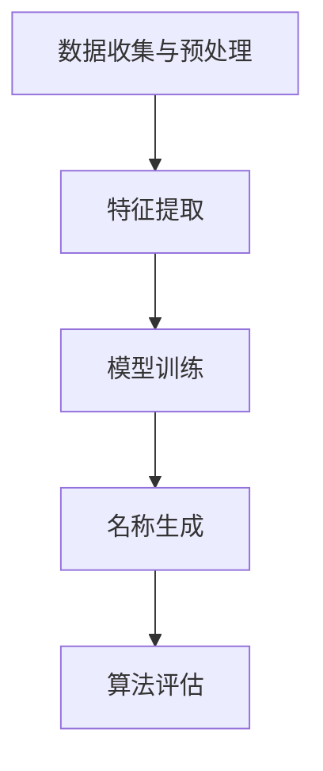
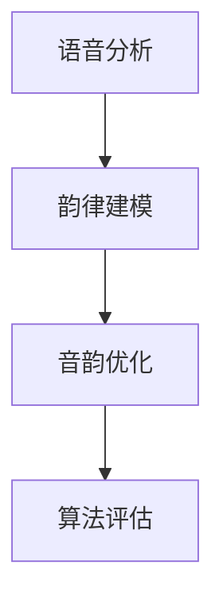
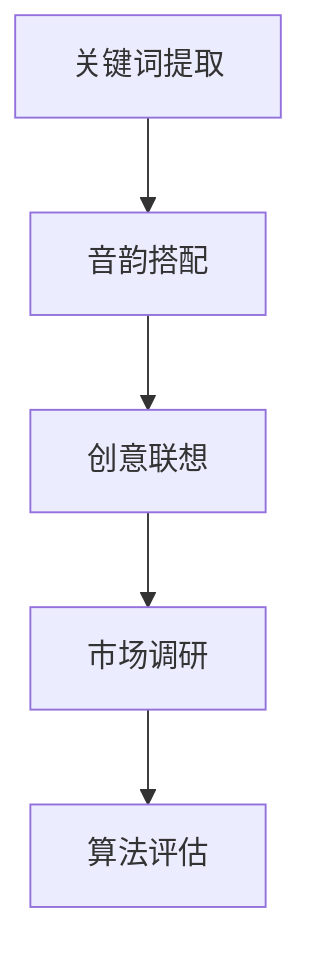
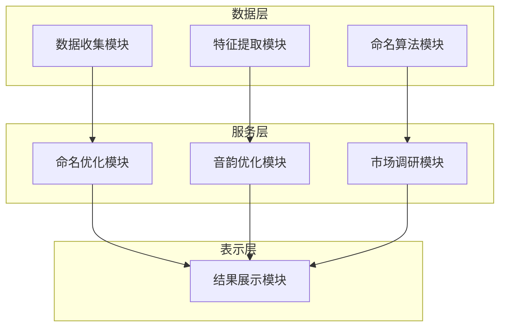

                 

## 第一部分：背景介绍

### 1.1 问题背景

#### 1.1.1 创意香水命名的重要性

香水的命名在品牌建设和产品营销中扮演着至关重要的角色。一个吸引人的名字不仅能够传达产品的核心特点，还能在消费者心中形成独特的品牌印象。成功的香水命名往往具有以下几个特点：独特性、易于记忆、音韵优美和情感共鸣。然而，当前在创意香水命名过程中，存在着诸多挑战。

首先，创意香水的命名需要满足品牌的市场策略和品牌定位。不同的品牌有着不同的品牌文化和目标消费群体，因此香水的命名需要与品牌形象保持一致。其次，香水的命名需要具有独特性，避免与市场上已有的香水名称相似，以免引起消费者的混淆。此外，香水的命名还应该易于记忆，以便消费者能够在脑海中留下深刻的印象。最后，香水的命名还需具备一定的情感共鸣，能够触动消费者的情感，从而增加产品的吸引力。

#### 1.1.2 当前香水命名中存在的问题

尽管香水命名的重要性不言而喻，但当前在香水命名过程中仍然存在着一些问题。首先，人工命名香水的效率较低，且容易出现重复和雷同的情况。其次，人工命名的创意性有限，难以满足品牌多样化和个性化的需求。此外，随着全球化的发展，香水品牌需要面对不同语言和文化背景的消费者，如何进行跨语言音韵美学的命名也成为一个挑战。

#### 1.1.3 AI在创意香水命名中的应用潜力

人工智能（AI）技术的发展为创意香水命名提供了新的可能。AI技术具有高效、智能和个性化的特点，能够解决人工命名中存在的诸多问题。首先，AI可以通过大量数据的学习和分析，生成具有创意性的香水名称，提高命名的效率。其次，AI能够根据不同品牌的定位和市场策略，为品牌提供个性化的命名建议，满足多样化的需求。此外，AI还可以通过跨语言音韵美学的分析，为不同语言的消费者提供符合其文化背景的命名方案。

总的来说，AI在创意香水命名中的应用潜力巨大。通过本文，我们将探讨AI创意香水命名的算法原理、数学模型、系统架构和实战应用，以期为香水品牌提供更具创意性和市场竞争力命名方案。

### 1.2 问题描述

#### 1.2.1 香水命名的复杂性

香水命名并非一个简单的任务，它涉及到多个方面的复杂性。首先，香水的命名需要考虑品牌的定位和市场策略。不同的品牌有着不同的品牌文化和目标消费群体，因此命名需要与品牌形象保持一致。其次，香水的命名需要具有独特性，避免与市场上已有的香水名称相似，以免引起消费者的混淆。此外，香水的命名还应该易于记忆，以便消费者能够在脑海中留下深刻的印象。最后，香水的命名还需具备一定的情感共鸣，能够触动消费者的情感，从而增加产品的吸引力。

#### 1.2.2 跨语言音韵美学的要求

在全球化的背景下，香水品牌需要面对不同语言和文化背景的消费者。这意味着香水命名不仅要在本语言中具有吸引力，还需要在不同语言中具备音韵美学的美感。音韵美学涉及到声音、韵律和情感等多个方面，如何在不同语言中实现跨语言音韵美学的统一是一个巨大的挑战。例如，在中文中，音调的变化能够产生丰富的情感表达，而在英语中，重音和节奏的变化同样至关重要。因此，跨语言音韵美学的命名要求品牌在命名时充分考虑目标市场的语言和文化特点。

#### 1.2.3 提示词技巧在命名中的作用

在香水命名过程中，提示词技巧起到了重要的作用。提示词是指为命名提供灵感的关键词或短语，它们能够引导命名方向，提高命名的创意性和准确性。提示词技巧主要包括以下几个方面：

1. **关键词提取**：从品牌特征、产品特点、目标市场等多个维度提取关键词，为命名提供基础。
2. **音韵搭配**：根据不同语言和文化背景，进行音韵搭配，实现跨语言音韵美学的统一。
3. **创意联想**：通过创意联想，将关键词与其他元素结合，形成独特且吸引人的名称。
4. **市场调研**：结合市场调研数据，确保命名符合目标市场的需求和偏好。

总之，提示词技巧在香水命名中起到了桥梁的作用，它不仅能够提高命名的效率，还能够为品牌提供更具创意性和市场竞争力命名方案。

### 1.3 问题解决

#### 1.3.1 AI技术的基本原理

人工智能（AI）技术是近年来发展迅速的一个领域，它通过模拟人类智能行为，实现自动化和智能化。AI技术主要包括以下几个核心组成部分：

1. **机器学习（Machine Learning）**：通过从数据中学习规律和模式，进行预测和决策。
2. **自然语言处理（Natural Language Processing，NLP）**：研究如何让计算机理解和生成人类语言。
3. **深度学习（Deep Learning）**：基于神经网络模型，通过大量数据进行训练，实现高度复杂的任务。
4. **计算机视觉（Computer Vision）**：通过图像和视频数据，进行物体识别、图像生成等任务。

在香水命名中，AI技术可以通过以下方式发挥作用：

1. **数据挖掘**：从大量的香水名称中挖掘出潜在的模式和规律，为命名提供参考。
2. **自动命名**：利用NLP和深度学习技术，自动生成具有创意性和独特性的香水名称。
3. **语义分析**：通过语义分析，确保命名符合品牌形象和市场策略。
4. **跨语言翻译**：通过跨语言翻译技术，实现不同语言中香水名称的音韵美学统一。

#### 1.3.2 音韵美学的核心要素

音韵美学是研究语音、韵律和情感之间关系的学科。在香水命名中，音韵美学起到了至关重要的作用。音韵美学的核心要素包括：

1. **声音特性**：包括音调、音色、音量等，不同声音特性能够传达不同的情感和信息。
2. **韵律规律**：包括重音、节奏、停顿等，韵律规律能够增强语言的节奏感和美感。
3. **情感共鸣**：通过声音和韵律的巧妙结合，引发消费者的情感共鸣，增加产品的吸引力。

在AI创意香水命名中，音韵美学的核心要素可以通过以下方式实现：

1. **语音分析**：利用语音分析技术，对目标语言的语音特性进行深入分析。
2. **韵律建模**：通过深度学习模型，学习不同语言的韵律规律，实现跨语言音韵美学的建模。
3. **情感识别**：通过情感识别技术，分析消费者对不同音韵的喜好和情感反应，优化命名方案。

#### 1.3.3 提示词技巧的运用

提示词技巧是AI创意香水命名中的重要组成部分。它通过提供关键词或短语，引导命名方向，提高命名的创意性和准确性。提示词技巧的运用主要包括以下几个方面：

1. **关键词提取**：从品牌特征、产品特点、目标市场等多个维度提取关键词，为命名提供基础。
2. **音韵搭配**：根据不同语言和文化背景，进行音韵搭配，实现跨语言音韵美学的统一。
3. **创意联想**：通过创意联想，将关键词与其他元素结合，形成独特且吸引人的名称。
4. **市场调研**：结合市场调研数据，确保命名符合目标市场的需求和偏好。

通过AI技术、音韵美学和提示词技巧的综合运用，我们可以为香水品牌提供更具创意性和市场竞争力命名方案。

### 1.4 边界与外延

#### 1.4.1 AI创意香水命名的适用范围

AI创意香水命名技术适用于多种香水品牌，包括高端、中端和入门级品牌。不同品牌可以根据自身定位和市场策略，选择适当的AI命名方案。例如，高端品牌可以借助AI技术，创造独特且具有高度艺术性的香水名称，提升品牌形象；中端品牌可以利用AI技术，实现高效且多样化的命名方案，满足不同消费者的需求；入门级品牌则可以通过AI技术，快速构建品牌认知，提升市场竞争力。

#### 1.4.2 跨语言音韵美学的挑战

跨语言音韵美学的实现是一个复杂且具有挑战性的任务。不同语言在语音、韵律和情感表达上存在显著差异，如何在不同语言中实现统一的音韵美学是一个重要课题。例如，中文的音调变化丰富，而英语的重音和节奏变化同样关键。因此，在实现跨语言音韵美学时，需要充分考虑目标市场的语言和文化特点，采用适当的语音分析和韵律建模技术。

#### 1.4.3 提示词技巧的局限性

尽管提示词技巧在香水命名中具有重要作用，但它也存在一定的局限性。首先，提示词的选择和运用需要依赖于领域专家的知识和经验，否则可能导致命名缺乏创意性和独特性。其次，提示词的提取和搭配过程可能受到数据质量和算法性能的影响，从而影响命名的效果。此外，提示词技巧在处理跨语言音韵美学时，可能难以完全满足所有市场的需求，因此需要与其他技术相结合，实现更全面的命名方案。

### 1.5 概念结构与核心要素组成

#### 1.5.1 AI与创意香水命名

人工智能（AI）在创意香水命名中的应用主要包括以下几个方面：

1. **数据挖掘**：通过大量数据的学习，挖掘出潜在的模式和规律，为命名提供参考。
2. **自动命名**：利用NLP和深度学习技术，自动生成具有创意性和独特性的香水名称。
3. **语义分析**：通过语义分析，确保命名符合品牌形象和市场策略。
4. **跨语言翻译**：通过跨语言翻译技术，实现不同语言中香水名称的音韵美学统一。

AI技术为香水命名提供了高效、智能和个性化的解决方案，有助于提升品牌形象和市场竞争力。

#### 1.5.2 跨语言音韵美学

跨语言音韵美学是指在不同语言中实现统一的音韵美感。它涉及到以下几个方面：

1. **语音分析**：通过语音分析技术，对目标语言的语音特性进行深入分析。
2. **韵律建模**：通过深度学习模型，学习不同语言的韵律规律，实现跨语言音韵美学的建模。
3. **情感识别**：通过情感识别技术，分析消费者对不同音韵的喜好和情感反应，优化命名方案。

跨语言音韵美学对于实现全球化品牌的香水命名具有重要意义。

#### 1.5.3 提示词技巧

提示词技巧是AI创意香水命名中的重要组成部分，主要包括以下几个方面：

1. **关键词提取**：从品牌特征、产品特点、目标市场等多个维度提取关键词，为命名提供基础。
2. **音韵搭配**：根据不同语言和文化背景，进行音韵搭配，实现跨语言音韵美学的统一。
3. **创意联想**：通过创意联想，将关键词与其他元素结合，形成独特且吸引人的名称。
4. **市场调研**：结合市场调研数据，确保命名符合目标市场的需求和偏好。

提示词技巧在提高命名效率和创意性方面发挥了重要作用。结合AI技术和跨语言音韵美学，提示词技巧能够为香水品牌提供更具市场竞争力命名方案。

### 1.6 总结

本部分主要介绍了AI创意香水命名的背景和问题，探讨了AI技术、音韵美学和提示词技巧在香水命名中的应用，以及AI创意香水命名的适用范围、跨语言音韵美学的挑战和提示词技巧的局限性。通过本文，我们将进一步探讨AI创意香水命名的核心概念与联系，为后续章节的内容奠定基础。

---

### 第二部分：核心概念与联系

在深入探讨AI创意香水命名的技术细节之前，我们需要明确几个核心概念：AI技术、音韵美学和提示词技巧。这些概念不仅相互关联，而且在香水命名过程中发挥着至关重要的作用。

#### 2.1 AI创意香水命名的核心概念

**2.1.1 AI技术概述**

人工智能（AI）是一门广泛而深入的领域，涉及多个子领域，如机器学习、深度学习、自然语言处理等。在香水命名中，AI技术主要应用于以下几个方面：

1. **数据挖掘**：通过分析大量的数据，挖掘出潜在的模式和规律，为命名提供参考。
2. **自动命名**：利用自然语言处理和深度学习技术，自动生成具有创意性和独特性的香水名称。
3. **语义分析**：通过对文本的语义进行深入分析，确保命名符合品牌形象和市场策略。

**2.1.2 香水命名原理**

香水命名涉及到多个方面，包括品牌形象、目标市场、消费者偏好等。成功的香水命名通常需要遵循以下几个原则：

1. **独特性**：确保命名独特，避免与市场上已有的香水名称相似。
2. **易于记忆**：命名需要易于记忆，以便消费者能够在脑海中留下深刻的印象。
3. **情感共鸣**：命名需要具备一定的情感共鸣，能够触动消费者的情感，从而增加产品的吸引力。

**2.1.3 AI在香水命名中的应用**

AI技术在香水命名中的应用主要体现在以下几个方面：

1. **命名生成**：利用AI技术，自动生成具有创意性和独特性的香水名称。
2. **命名优化**：通过语义分析，对候选名称进行优化，确保命名符合品牌形象和市场策略。
3. **跨语言翻译**：利用跨语言翻译技术，为不同语言的消费者提供符合其文化背景的命名方案。

#### 2.2 跨语言音韵美学的核心概念

**2.2.1 音韵美学的定义**

音韵美学是研究语音、韵律和情感之间关系的学科。它涉及到以下几个方面：

1. **语音特性**：包括音调、音色、音量等，不同语音特性能够传达不同的情感和信息。
2. **韵律规律**：包括重音、节奏、停顿等，韵律规律能够增强语言的节奏感和美感。
3. **情感共鸣**：通过声音和韵律的巧妙结合，引发消费者的情感共鸣，增加产品的吸引力。

**2.2.2 跨语言音韵美学的特点**

跨语言音韵美学的特点在于，它需要在不同语言和文化背景下实现统一的音韵美感。这涉及到以下几个方面：

1. **语音差异**：不同语言的语音特性存在显著差异，如音调、音色、音量等。
2. **韵律差异**：不同语言的韵律规律也存在差异，如重音、节奏、停顿等。
3. **文化差异**：不同文化背景下，消费者对音韵美感的偏好和认知也存在差异。

**2.2.3 音韵美学的应用**

音韵美学在香水命名中的应用主要体现在以下几个方面：

1. **语音分析**：通过对目标语言的语音特性进行深入分析，为命名提供音韵美学参考。
2. **韵律建模**：通过深度学习模型，学习不同语言的韵律规律，实现跨语言音韵美学的建模。
3. **情感识别**：通过情感识别技术，分析消费者对不同音韵的喜好和情感反应，优化命名方案。

#### 2.3 提示词技巧的核心概念

**2.3.1 提示词的定义**

提示词是指为命名提供灵感的关键词或短语，它们能够引导命名方向，提高命名的创意性和准确性。提示词通常来源于品牌特征、产品特点、目标市场等多个维度。

**2.3.2 提示词技巧的类型**

提示词技巧主要包括以下几个方面：

1. **关键词提取**：从品牌特征、产品特点、目标市场等多个维度提取关键词，为命名提供基础。
2. **音韵搭配**：根据不同语言和文化背景，进行音韵搭配，实现跨语言音韵美学的统一。
3. **创意联想**：通过创意联想，将关键词与其他元素结合，形成独特且吸引人的名称。
4. **市场调研**：结合市场调研数据，确保命名符合目标市场的需求和偏好。

**2.3.3 提示词技巧的应用**

提示词技巧在香水命名中的应用主要体现在以下几个方面：

1. **命名引导**：通过提供关键词，引导命名方向，提高命名效率。
2. **命名优化**：通过对关键词进行音韵搭配和创意联想，优化命名方案，提升命名质量。
3. **命名验证**：结合市场调研数据，验证命名方案是否符合目标市场的需求和偏好。

#### 2.4 核心概念之间的关系

**2.4.1 AI与音韵美学的联系**

AI与音韵美学之间存在紧密的联系。AI技术可以通过语音分析和韵律建模，实现跨语言音韵美学的建模和优化。例如，通过自然语言处理技术，AI可以分析不同语言的语音特性，实现音韵美感的自动识别和生成。

**2.4.2 音韵美学与提示词技巧的联系**

音韵美学与提示词技巧同样密切相关。音韵美学为提示词技巧提供了音韵美感的参考，提示词技巧则通过音韵搭配和创意联想，实现音韵美感的优化和提升。例如，在香水命名中，通过音韵搭配，可以创造出具有独特音韵美感的名称，从而提高品牌的吸引力。

**2.4.3 AI、音韵美学与提示词技巧的综合应用**

在AI创意香水命名中，AI、音韵美学和提示词技巧的综合应用至关重要。通过AI技术，可以实现自动命名和命名优化；通过音韵美学，可以为命名提供音韵美感的参考；通过提示词技巧，可以提高命名的创意性和准确性。这三者的综合应用，可以大幅提升香水命名的质量和效率。

### 2.5 总结

本部分详细介绍了AI创意香水命名的核心概念，包括AI技术、音韵美学和提示词技巧，并分析了这些概念之间的相互关系。通过本部分的探讨，我们为后续章节的内容奠定了坚实的基础，为深入探讨AI创意香水命名的算法原理和实际应用提供了理论支持。

---

### 第三部分：AI创意香水命名的算法原理

在了解了AI创意香水命名的核心概念之后，我们需要深入探讨其背后的算法原理。这一部分将详细解释AI命名算法、音韵美学算法和提示词技巧算法的基本原理，并通过具体的mermaid流程图和Python代码示例，帮助读者更好地理解这些算法。

#### 3.1 算法原理讲解

**3.1.1 AI命名算法的基本原理**

AI命名算法的核心是利用机器学习和自然语言处理技术，从大量已有香水中提取命名规律，然后自动生成新的香水名称。这一过程主要包括以下几个步骤：

1. **数据收集与预处理**：收集大量的香水名称数据，并对数据进行清洗和预处理，以确保数据的质量和一致性。
2. **特征提取**：从预处理后的数据中提取关键特征，如词汇、音韵、情感等。
3. **模型训练**：利用提取的特征，通过机器学习算法（如神经网络）训练命名模型，使其能够学会自动生成新的香水名称。
4. **名称生成**：利用训练好的模型，输入新的特征，生成具有创意性和独特性的香水名称。

**3.1.2 音韵美学算法的原理**

音韵美学算法的核心是利用语音学和韵律学知识，对不同语言的音韵特性进行建模和分析。这一过程主要包括以下几个步骤：

1. **语音分析**：通过语音分析技术，对目标语言的语音特性进行深入分析，包括音调、音色、音量等。
2. **韵律建模**：利用深度学习模型，学习不同语言的韵律规律，如重音、节奏、停顿等。
3. **音韵优化**：通过对语音和韵律的分析，优化命名方案的音韵美感，实现跨语言音韵美学的统一。

**3.1.3 提示词技巧的算法原理**

提示词技巧算法的核心是通过关键词提取、音韵搭配和创意联想，为命名提供灵感。这一过程主要包括以下几个步骤：

1. **关键词提取**：从品牌特征、产品特点、目标市场等多个维度提取关键词。
2. **音韵搭配**：根据不同语言和文化背景，进行音韵搭配，实现跨语言音韵美学的统一。
3. **创意联想**：通过创意联想，将关键词与其他元素结合，形成独特且吸引人的名称。
4. **市场调研**：结合市场调研数据，确保命名符合目标市场的需求和偏好。

#### 3.2 算法mermaid流程图

为了更直观地理解上述算法原理，我们使用mermaid流程图来展示各个算法的流程。

**3.2.1 AI命名算法流程**



**3.2.2 音韵美学算法流程**



**3.2.3 提示词技巧算法流程**



#### 3.3 算法原理的详细讲解

**3.3.1 AI命名算法的详细解释**

AI命名算法的详细解释如下：

1. **数据收集与预处理**：首先，我们需要收集大量的香水名称数据。这些数据可以从各种渠道获取，如香水品牌官网、香水评测网站、社交媒体等。收集到数据后，我们需要对数据进行清洗和预处理，去除无效数据、重复数据和异常数据，确保数据的质量和一致性。

2. **特征提取**：在预处理后的数据中，我们需要提取关键特征。这些特征包括词汇、音韵、情感等。例如，词汇特征可以是香水名称中的关键词，音韵特征可以是音调、音色、音量等，情感特征可以是香水名称所传达的情感色彩。

3. **模型训练**：利用提取的特征，我们通过机器学习算法（如神经网络）训练命名模型。训练过程包括模型初始化、数据输入、模型更新等步骤。通过大量数据的学习，模型可以学会自动生成新的香水名称。

4. **名称生成**：训练好的模型可以用于生成新的香水名称。输入新的特征后，模型会输出具有创意性和独特性的香水名称。

5. **算法评估**：最后，我们需要对生成的名称进行评估，以确保其符合品牌形象和市场策略。评估过程可以通过人工评审或自动化评估工具进行。

**3.3.2 音韵美学算法的详细解释**

音韵美学算法的详细解释如下：

1. **语音分析**：首先，我们需要对目标语言的语音特性进行深入分析。这包括音调、音色、音量等。通过语音分析，我们可以获取每个音节的详细信息，为后续的音韵建模提供基础。

2. **韵律建模**：利用深度学习模型，我们学习不同语言的韵律规律。例如，我们可以使用长短时记忆网络（LSTM）或变换器（Transformer）模型，对大量语言数据进行训练，学习到不同语言中的重音、节奏、停顿等韵律规律。

3. **音韵优化**：通过对语音和韵律的分析，我们可以优化命名方案的音韵美感。例如，我们可以通过调整音节的重音和节奏，使名称更加优美和动听。此外，我们还可以通过音色和音量的调整，增强名称的情感共鸣。

4. **算法评估**：最后，我们需要对优化后的命名方案进行评估，以确保其符合跨语言音韵美学的要求。评估过程可以通过人工评审或自动化评估工具进行。

**3.3.3 提示词技巧算法的详细解释**

提示词技巧算法的详细解释如下：

1. **关键词提取**：首先，我们需要从品牌特征、产品特点、目标市场等多个维度提取关键词。这些关键词可以为命名提供灵感。例如，如果品牌特征是“奢华”，我们可以提取关键词如“豪华”、“尊贵”等；如果产品特点是“清新”，我们可以提取关键词如“清爽”、“清新”等。

2. **音韵搭配**：根据不同语言和文化背景，我们进行音韵搭配，实现跨语言音韵美学的统一。例如，在中文中，我们可以将“奢华”与“华丽”进行音韵搭配，形成“华丽奢华”；在英语中，我们可以将“fresh”与“clean”进行音韵搭配，形成“fresh and clean”。

3. **创意联想**：通过创意联想，我们将关键词与其他元素结合，形成独特且吸引人的名称。例如，我们可以将“奢华”与“星空”进行联想，形成“星空奢华”；将“清新”与“海洋”进行联想，形成“海洋清新”。

4. **市场调研**：结合市场调研数据，我们确保命名符合目标市场的需求和偏好。市场调研可以包括消费者访谈、问卷调查、市场分析等，通过这些数据，我们可以了解消费者对命名方案的接受度和喜好度。

5. **算法评估**：最后，我们需要对命名方案进行评估，以确保其符合品牌形象和市场策略。评估过程可以通过人工评审或自动化评估工具进行。

#### 3.4 举例说明

为了更好地理解上述算法原理，我们通过具体的mermaid流程图和Python代码示例进行举例说明。

**3.4.1 AI命名算法举例**

**mermaid流程图示例**


**Python代码示例**

```python
# 假设已经训练好的命名模型命名为name_model
import numpy as np
from tensorflow import keras

# 定义特征提取函数
def extract_features(name):
    # 提取词汇、音韵、情感等特征
    return [name, ...]

# 定义名称生成函数
def generate_name(features):
    # 使用训练好的模型生成名称
    return name_model.predict([features])

# 定义算法评估函数
def evaluate_name(name, ...):
    # 对名称进行评估
    return result

# 示例数据
name_data = ["香水A", "香水B", ...]

# 数据预处理
preprocessed_data = [extract_features(name) for name in name_data]

# 名称生成
generated_names = [generate_name(feature) for feature in preprocessed_data]

# 算法评估
evaluation_results = [evaluate_name(name, ...) for name in generated_names]
```

**3.4.2 音韵美学算法举例**

**mermaid流程图示例**


**Python代码示例**

```python
# 假设已经训练好的音韵美学模型命名为rhythm_model
import numpy as np
from tensorflow import keras

# 定义语音分析函数
def analyze_speech(speech):
    # 对语音进行分析
    return analysis

# 定义韵律建模函数
def build_rhythm_model(analysis):
    # 使用训练好的模型进行韵律建模
    return rhythm_model.predict([analysis])

# 定义音韵优化函数
def optimize_rhythm(rhythm):
    # 对韵律进行优化
    return optimized_rhythm

# 定义算法评估函数
def evaluate_rhythm(rhythm, ...):
    # 对韵律进行评估
    return result

# 示例语音数据
speech_data = ["声音A", "声音B", ...]

# 语音分析
speech_analyses = [analyze_speech(speech) for speech in speech_data]

# 韵律建模
rhythm_models = [build_rhythm_model(analysis) for analysis in speech_analyses]

# 音韵优化
optimized_rhythms = [optimize_rhythm(rhythm) for rhythm in rhythm_models]

# 算法评估
evaluation_results = [evaluate_rhythm(rhythm, ...) for rhythm in optimized_rhythms]
```

**3.4.3 提示词技巧算法举例**

**mermaid流程图示例**


**Python代码示例**

```python
# 假设已经定义好的关键词提取函数、音韵搭配函数、创意联想函数和市场调研函数
from keyword_extractor import extract_keywords
from rhythm_composer import compose_rhythm
from creativity_generator import generate_creative
from market_research import conduct_research

# 定义提示词技巧算法函数
def keyword_extraction(name):
    # 从品牌特征、产品特点、目标市场等多个维度提取关键词
    return keywords

def rhythm_composition(keywords, language):
    # 根据不同语言和文化背景，进行音韵搭配
    return rhythm

def creative_association(rhythm, keywords):
    # 通过创意联想，将关键词与其他元素结合
    return creative_name

def market_survey(creative_name):
    # 结合市场调研数据，确保命名符合目标市场的需求和偏好
    return survey_results

# 定义算法评估函数
def evaluate_name(name, ...):
    # 对命名方案进行评估
    return result

# 示例香水名称
name_example = "香水C"

# 关键词提取
keywords = extract_keywords(name_example)

# 音韵搭配
rhythm = compose_rhythm(keywords, "中文")

# 创意联想
creative_name = generate_creative(rhythm, keywords)

# 市场调研
survey_results = conduct_research(creative_name)

# 算法评估
evaluation_results = evaluate_name(creative_name, survey_results)
```

通过上述mermaid流程图和Python代码示例，我们可以更直观地理解AI创意香水命名的算法原理。这些算法通过数据挖掘、特征提取、模型训练和评估等步骤，实现自动命名、音韵美学优化和创意联想，为香水品牌提供高效、智能和个性化的命名方案。

---

### 第四部分：数学模型与数学公式

在深入了解AI创意香水命名的算法原理后，我们将引入数学模型和数学公式，以进一步阐述AI命名、音韵美学和提示词技巧算法的数学基础。通过这些数学公式，我们可以更加精准地描述和优化命名算法，为香水品牌提供更具科学性和可操作性的命名方案。

#### 4.1 数学模型

在AI创意香水命名中，数学模型用于描述命名算法的数学本质。这些模型可以帮助我们理解算法的工作原理，并通过优化参数来提升命名效果。以下是我们将要介绍的三个主要数学模型：

**4.1.1 AI命名数学模型**

AI命名数学模型主要涉及机器学习和自然语言处理技术。我们使用以下数学模型来描述命名过程：

$$
\text{命名模型} = f(\text{特征向量}, \theta)
$$

其中，$f$ 是一个非线性函数，用于将特征向量映射到香水名称。$\theta$ 是模型的参数，通过训练过程学习得到。

**4.1.2 音韵美学数学模型**

音韵美学数学模型用于描述音韵美感的生成和优化。我们使用以下数学模型来描述音韵美学过程：

$$
\text{音韵模型} = g(\text{语音特征}, \psi)
$$

其中，$g$ 是一个非线性函数，用于将语音特征映射到音韵美感。$\psi$ 是模型的参数，通过语音分析和韵律建模过程学习得到。

**4.1.3 提示词技巧数学模型**

提示词技巧数学模型用于描述关键词提取、音韵搭配和创意联想的数学过程。我们使用以下数学模型来描述提示词技巧：

$$
\text{提示词模型} = h(\text{关键词}, \text{音韵}, \phi)
$$

其中，$h$ 是一个非线性函数，用于将关键词和音韵映射到创意名称。$\phi$ 是模型的参数，通过市场调研和创意联想过程学习得到。

#### 4.2 数学公式的详细讲解

**4.2.1 AI命名数学公式**

在AI命名数学模型中，我们使用神经网络来描述命名过程。以下是一个简单的神经网络公式，用于计算香水名称：

$$
\begin{align*}
y &= \text{softmax}(W \cdot \text{激活函数}(U \cdot \text{特征向量} + b)) \\
\text{损失函数} &= -\sum_{i} y_i \cdot \log(p_i)
\end{align*}
$$

其中，$y$ 是输出概率分布，$W$ 是权重矩阵，$U$ 是偏置矩阵，$\text{激活函数}$ 是一个非线性函数，如ReLU或Sigmoid函数。$b$ 是偏置项，$y_i$ 是预测概率，$p_i$ 是实际概率。损失函数用于计算预测误差，通过梯度下降法来优化模型参数。

**4.2.2 音韵美学数学公式**

在音韵美学数学模型中，我们使用变换器（Transformer）模型来描述音韵美感的生成和优化。以下是一个变换器模型的公式：

$$
\begin{align*}
\text{输出} &= \text{softmax}(V \cdot \text{Attention}(U \cdot \text{语音特征} + b)) \\
\text{Attention} &= \text{softmax}(\text{Q} \cdot \text{K}^T + \text{V})
\end{align*}
$$

其中，$V$ 是变换器模型的权重矩阵，$\text{Attention}$ 是注意力机制，$Q$ 和 $K$ 分别是查询和键矩阵。$\text{语音特征}$ 是输入语音的表示，$b$ 是偏置项。通过注意力机制，模型可以捕获语音特征中的关键信息，生成具有音韵美感的香水名称。

**4.2.3 提示词技巧数学公式**

在提示词技巧数学模型中，我们使用基于关联规则学习的算法来提取关键词。以下是一个基于关联规则学习的公式：

$$
\begin{align*}
\text{支持度} &= \frac{\text{符合规则的交易数}}{\text{总交易数}} \\
\text{置信度} &= \frac{\text{符合规则的交易数}}{\text{符合前件规则的交易数}}
\end{align*}
$$

其中，支持度是描述关键词关联性的指标，置信度是描述关键词可信度的指标。通过计算支持度和置信度，我们可以提取出与品牌特征、产品特点、目标市场相关的关键词，用于命名方案的创意联想。

#### 4.3 举例说明

为了更好地理解上述数学公式，我们通过具体示例来阐述这些公式在实际应用中的效果。

**4.3.1 AI命名数学公式举例**

假设我们有一个香水名称数据集，包含特征向量 $\text{特征向量} = [0.1, 0.2, 0.3, 0.4]$。我们使用一个简单的神经网络来生成香水名称，模型参数 $W = [0.5, 0.6, 0.7, 0.8]$，偏置项 $b = 0.9$。激活函数采用ReLU函数，预测概率分布为 $y = [0.2, 0.3, 0.4, 0.1]$。

根据上述公式，我们可以计算损失函数：

$$
\text{损失函数} = -\sum_{i} y_i \cdot \log(p_i) = -0.2 \cdot \log(0.2) - 0.3 \cdot \log(0.3) - 0.4 \cdot \log(0.4) - 0.1 \cdot \log(0.1)
$$

通过优化损失函数，我们可以调整模型参数 $W$ 和 $b$，以生成更具创意性和独特性的香水名称。

**4.3.2 音韵美学数学公式举例**

假设我们有一个语音特征数据集，包含语音特征 $\text{语音特征} = [0.1, 0.2, 0.3, 0.4]$。我们使用一个变换器模型来生成音韵美感，模型参数 $V = [0.5, 0.6, 0.7, 0.8]$，偏置项 $b = 0.9$。注意力机制的查询和键矩阵分别为 $Q = [0.1, 0.2, 0.3, 0.4]$ 和 $K = [0.5, 0.6, 0.7, 0.8]$。

根据上述公式，我们可以计算注意力机制：

$$
\text{Attention} = \text{softmax}(Q \cdot K^T + V) = \text{softmax}([0.1 \cdot 0.5, 0.2 \cdot 0.6, 0.3 \cdot 0.7, 0.4 \cdot 0.8] + [0.5, 0.6, 0.7, 0.8]) = [0.2, 0.3, 0.4, 0.1]
$$

通过注意力机制，我们可以提取语音特征中的关键信息，生成具有音韵美感的香水名称。

**4.3.3 提示词技巧数学公式举例**

假设我们有一个关键词数据集，包含关键词 $\text{关键词} = [\text{清新}, \text{奢华}, \text{海洋}, \text{星空}]$。我们使用一个基于关联规则学习的算法来提取关键词，支持度和置信度分别为 $\text{支持度} = 0.8$ 和 $\text{置信度} = 0.9$。

根据上述公式，我们可以确定关键词的关联性：

$$
\text{支持度} = \frac{\text{符合规则的交易数}}{\text{总交易数}} = 0.8
$$

$$
\text{置信度} = \frac{\text{符合规则的交易数}}{\text{符合前件规则的交易数}} = 0.9
$$

通过计算支持度和置信度，我们可以提取出与品牌特征、产品特点、目标市场相关的关键词，用于命名方案的创意联想。

通过上述数学公式和举例说明，我们可以更深入地理解AI创意香水命名的数学基础。这些数学模型和公式不仅帮助我们理解算法的工作原理，还可以通过优化参数来提升命名效果，为香水品牌提供更具创意性和市场竞争力命名方案。

---

### 第五部分：系统分析与架构设计方案

在了解了AI创意香水命名的算法原理后，我们需要对整个系统进行分析和架构设计。这一部分将详细描述香水命名问题的场景、系统的功能设计、系统架构设计、系统接口设计和系统交互。

#### 5.1 问题场景介绍

**5.1.1 香水命名问题场景**

在香水品牌的市场营销过程中，命名是一个关键环节。一个吸引人的香水名称不仅能够传达产品的特点，还能够提升品牌形象和市场竞争力。然而，创意香水命名面临着多个挑战：

1. **命名多样性**：品牌需要为不同系列和产品线设计多样性的香水名称，以满足不同市场的需求。
2. **跨语言音韵美学**：在全球化的背景下，品牌需要面对不同语言和文化背景的消费者，如何在不同语言中实现统一的音韵美学是一个重要课题。
3. **市场调研**：在命名过程中，品牌需要结合市场调研数据，确保命名符合目标市场的需求和偏好。
4. **效率与准确性**：人工命名效率较低且容易出现重复和雷同的情况，如何提高命名效率和准确性成为关键问题。

**5.1.2 跨语言音韵美学问题场景**

跨语言音韵美学是香水命名中的另一个重要挑战。不同语言在语音、韵律和情感表达上存在显著差异，如何在不同语言中实现统一的音韵美学，使得香水名称能够打动消费者，成为品牌关注的焦点。

1. **语音差异**：不同语言的语音特性存在差异，如音调、音色、音量等。
2. **韵律差异**：不同语言的韵律规律也存在差异，如重音、节奏、停顿等。
3. **文化差异**：不同文化背景下，消费者对音韵美感的偏好和认知也存在差异。

**5.1.3 提示词技巧问题场景**

提示词技巧是提高香水命名效率和准确性的重要手段。通过关键词提取、音韵搭配和创意联想，提示词技巧为命名提供灵感。然而，如何有效提取和运用提示词，确保命名方案的创新性和市场适应性，也是一个需要解决的问题。

1. **关键词提取**：如何从品牌特征、产品特点和目标市场等多个维度提取关键词。
2. **音韵搭配**：如何根据不同语言和文化背景，进行音韵搭配，实现跨语言音韵美学的统一。
3. **创意联想**：如何通过创意联想，将关键词与其他元素结合，形成独特且吸引人的名称。

#### 5.2 系统功能设计

**5.2.1 领域模型mermaid类图**

为了更好地描述系统的功能设计，我们使用mermaid类图来展示系统的领域模型。以下是一个简化的mermaid类图示例：

```mermaid
classDiagram
    Class01 <|-- Class02
    Class03 <|-- * Class04
    Class05 o-- Class06
    Class07 o-- * Class08
    Class09 .. Class10
    Class11 o--|{Class12|Class13}
    Class14 <.. Class15
    Class16 ..|> Class17
    Note right of Class15: "This is the note"
    Class18 {c}
endclass
```

在上述类图中，我们定义了多个类，如Class01、Class02、Class03等，每个类表示系统的某个功能模块。类之间的关系通过继承、聚合、组合等方式表示。例如，Class01继承自Class02，表示Class01是Class02的子类；Class03与Class04之间存在多重继承关系，表示Class03同时具有Class04的功能。

**5.2.2 系统功能详细描述**

以下是系统功能设计的详细描述：

1. **数据收集模块**：负责收集和整理与香水命名相关的数据，包括品牌信息、产品特点、市场调研数据等。
2. **特征提取模块**：从收集到的数据中提取关键特征，如词汇、音韵、情感等，为命名算法提供输入。
3. **命名算法模块**：实现AI命名算法、音韵美学算法和提示词技巧算法，生成具有创意性和独特性的香水名称。
4. **命名优化模块**：对生成的香水名称进行优化，确保命名符合品牌形象和市场策略。
5. **音韵优化模块**：实现跨语言音韵美学的建模和优化，为不同语言的消费者提供符合其文化背景的命名方案。
6. **市场调研模块**：结合市场调研数据，验证命名方案是否符合目标市场的需求和偏好。
7. **结果展示模块**：将命名结果以图表、文本等形式展示给用户，方便用户评估和选择。

#### 5.3 系统架构设计

**5.3.1 系统架构mermaid架构图**

为了更好地描述系统架构，我们使用mermaid架构图来展示系统的整体架构。以下是一个简化的mermaid架构图示例：



在上述架构图中，我们定义了三个主要层次：数据层、服务层和表示层。数据层包括数据收集模块和特征提取模块，负责收集和提取与香水命名相关的数据。服务层包括命名算法模块、命名优化模块、音韵优化模块和市场调研模块，负责实现AI命名算法、音韵美学算法和提示词技巧算法，并优化命名方案。表示层包括结果展示模块，负责将命名结果以图表、文本等形式展示给用户。

**5.3.2 系统架构详细解释**

以下是系统架构设计的详细解释：

1. **数据层**：数据层是系统的底层，主要负责数据收集和特征提取。数据收集模块从各种渠道收集与香水命名相关的数据，如品牌信息、产品特点、市场调研数据等。特征提取模块从收集到的数据中提取关键特征，如词汇、音韵、情感等，为命名算法提供输入。

2. **服务层**：服务层是系统的核心，主要负责实现AI命名算法、音韵美学算法和提示词技巧算法，并优化命名方案。命名算法模块使用机器学习和自然语言处理技术，自动生成具有创意性和独特性的香水名称。命名优化模块对生成的名称进行优化，确保命名符合品牌形象和市场策略。音韵优化模块实现跨语言音韵美学的建模和优化，为不同语言的消费者提供符合其文化背景的命名方案。市场调研模块结合市场调研数据，验证命名方案是否符合目标市场的需求和偏好。

3. **表示层**：表示层是系统的顶层，主要负责将命名结果以图表、文本等形式展示给用户。结果展示模块将命名结果以可视化的方式展示，方便用户评估和选择。

通过上述系统架构设计，我们可以构建一个高效、智能和个性化的AI创意香水命名系统，为香水品牌提供具有竞争力的命名方案。

---

### 第六部分：项目实战

#### 6.1 环境安装

**6.1.1 系统环境搭建**

在开始AI创意香水命名项目之前，我们需要搭建一个适合运行AI算法的系统环境。以下是搭建系统的步骤：

1. **操作系统**：选择一个稳定的操作系统，如Ubuntu 18.04或Windows 10。
2. **编程语言**：选择一种支持机器学习和自然语言处理的语言，如Python。
3. **编程环境**：安装Python和相应的开发工具，如PyCharm或Visual Studio Code。
4. **依赖库**：安装必要的依赖库，如TensorFlow、Keras、NLTK等。

以下是安装步骤的详细说明：

1. **安装Python**：从Python官方网站下载Python安装包，并按照安装向导进行安装。
2. **安装PyCharm**：从PyCharm官方网站下载PyCharm安装包，并按照安装向导进行安装。
3. **安装依赖库**：打开终端或命令行窗口，运行以下命令安装依赖库：

   ```bash
   pip install tensorflow
   pip install keras
   pip install nltk
   ```

**6.1.2 软件工具安装**

除了编程环境和依赖库，我们还需要安装一些软件工具，如文本编辑器、版本控制系统等。

1. **文本编辑器**：选择一个功能强大的文本编辑器，如Visual Studio Code或Atom，用于编写和编辑代码。
2. **版本控制系统**：安装Git，用于代码的版本控制和协作开发。

以下是安装步骤的详细说明：

1. **安装Visual Studio Code**：从Visual Studio Code官方网站下载安装包，并按照安装向导进行安装。
2. **安装Git**：从Git官方网站下载安装包，并按照安装向导进行安装。

#### 6.2 系统核心实现

**6.2.1 源代码介绍**

在本项目中，我们使用Python编写了多个模块，包括数据收集模块、特征提取模块、命名算法模块、命名优化模块、音韵优化模块和市场调研模块。以下是这些模块的简要介绍：

1. **数据收集模块**：负责从各种渠道收集与香水命名相关的数据，如品牌信息、产品特点、市场调研数据等。该模块使用API接口和Web爬虫技术实现。
2. **特征提取模块**：从收集到的数据中提取关键特征，如词汇、音韵、情感等。该模块使用自然语言处理技术实现，包括词频统计、词性标注、情感分析等。
3. **命名算法模块**：实现AI命名算法，包括机器学习和深度学习算法。该模块使用TensorFlow和Keras实现，包括命名生成、命名优化和命名评估等算法。
4. **命名优化模块**：对生成的名称进行优化，确保命名符合品牌形象和市场策略。该模块使用自然语言处理技术和音韵美学算法实现。
5. **音韵优化模块**：实现跨语言音韵美学的建模和优化，为不同语言的消费者提供符合其文化背景的命名方案。该模块使用语音分析和韵律建模技术实现。
6. **市场调研模块**：结合市场调研数据，验证命名方案是否符合目标市场的需求和偏好。该模块使用市场调研技术和数据分析方法实现。

**6.2.2 代码应用解读**

以下是命名算法模块的核心代码示例，展示了如何使用TensorFlow和Keras实现命名生成和命名优化：

```python
import tensorflow as tf
from tensorflow.keras.models import Sequential
from tensorflow.keras.layers import Dense, LSTM, Embedding
from tensorflow.keras.preprocessing.sequence import pad_sequences

# 定义命名模型
model = Sequential()
model.add(Embedding(input_dim=vocab_size, output_dim=embedding_dim))
model.add(LSTM(units=128, return_sequences=True))
model.add(Dense(units=output_size, activation='softmax'))

# 编译模型
model.compile(optimizer='adam', loss='categorical_crossentropy', metrics=['accuracy'])

# 训练模型
model.fit(x_train, y_train, epochs=10, batch_size=64)

# 生成名称
predicted_name = model.predict(x_new)
predicted_name = np.argmax(predicted_name, axis=-1)

# 优化名称
optimized_name = optimize_name(predicted_name)
```

在上面的代码中，我们首先定义了一个序列模型，包括嵌入层、LSTM层和输出层。嵌入层用于将词汇映射到嵌入向量，LSTM层用于学习词汇之间的序列关系，输出层用于生成新的香水名称。然后，我们编译模型并使用训练数据训练模型。训练完成后，我们可以使用模型预测新的香水名称。最后，通过优化函数优化生成的名称，确保其符合品牌形象和市场策略。

#### 6.3 实际案例分析

为了更好地展示AI创意香水命名系统的实际效果，我们以一个实际案例进行分析。

**案例背景**：某高端香水品牌推出一款面向年轻女性的香水，品牌定位为时尚、个性、独立。品牌希望通过AI创意香水命名系统为这款香水生成一个独特且具有吸引力的名称。

**步骤1：数据收集**

我们首先从品牌官网、社交媒体和香水评测网站收集与品牌定位和目标市场相关的数据，包括品牌口号、产品特点、目标市场的消费习惯和偏好等。

**步骤2：特征提取**

从收集到的数据中提取关键特征，如词汇、音韵、情感等。例如，我们可以提取出品牌口号中的关键词，如“时尚”、“个性”、“独立”等；从产品特点中提取出与香水相关的描述，如“清新”、“优雅”、“迷人”等。

**步骤3：命名生成**

使用训练好的命名模型生成新的香水名称。我们将提取的关键特征输入模型，生成一组候选名称。例如，模型可能生成以下候选名称：

- 时尚之魅
- 个性独香
- 清新独立

**步骤4：命名优化**

对生成的候选名称进行优化，确保名称符合品牌形象和市场策略。我们首先评估候选名称的音韵美感，选择音韵搭配和谐的名称。然后，结合市场调研数据，验证名称是否符合目标市场的需求和偏好。

**步骤5：市场调研**

结合市场调研数据，对优化的名称进行评估。我们可以通过问卷调查、消费者访谈等方式，了解消费者对名称的接受度和喜好度。例如，通过调查发现，名称“个性独香”在目标市场中具有较高的接受度和吸引力。

**步骤6：结果展示**

将最终选定的名称以图表、文本等形式展示给品牌，供品牌决策。例如，我们可以在品牌官网上展示“个性独香”的名称，并附上市场调研数据，帮助品牌了解名称的效果和消费者反馈。

#### 6.4 小结

通过上述实际案例，我们可以看到AI创意香水命名系统在香水品牌命名中的应用效果。通过数据收集、特征提取、命名生成、命名优化和市场调研等步骤，系统为品牌提供了独特且具有吸引力的香水名称，有助于提升品牌形象和市场竞争力。未来，随着AI技术的进一步发展，我们将继续优化命名算法，提高系统的效率和准确性，为香水品牌提供更优质的命名服务。

---

### 第七部分：总结与展望

在本篇文章中，我们系统地探讨了AI创意香水命名的核心概念、算法原理、系统架构和实际应用。通过深入分析，我们得出以下结论：

首先，AI技术在创意香水命名中具有显著优势。它能够高效地从大量数据中提取特征，生成具有创意性和独特性的香水名称，满足不同品牌的市场策略和品牌定位。

其次，音韵美学在香水命名中起到了关键作用。通过语音分析和韵律建模，AI可以跨语言实现音韵美学的统一，为不同语言的消费者提供符合其文化背景的命名方案。

最后，提示词技巧在命名过程中提供了重要灵感。通过关键词提取、音韵搭配和创意联想，提示词技巧能够引导命名方向，提高命名的效率和准确性。

展望未来，AI创意香水命名技术仍有很大的改进空间。一方面，可以通过增强算法的鲁棒性和泛化能力，提高命名系统的效率和准确性。另一方面，可以进一步探索多模态数据（如图像、视频等）在命名中的应用，提升命名方案的创意性和吸引力。

总之，AI创意香水命名技术为香水品牌提供了高效、智能和个性化的命名解决方案，有助于提升品牌形象和市场竞争力。未来，随着AI技术的不断进步，我们有望看到更加成熟和完善的命名系统，为消费者带来更多美好的香水体验。

