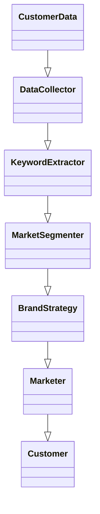
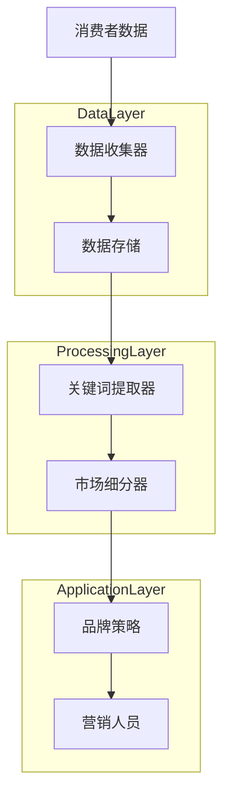
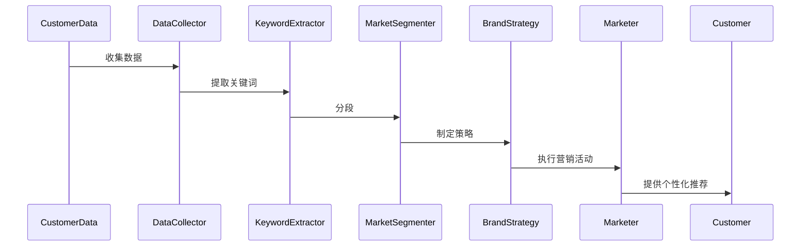
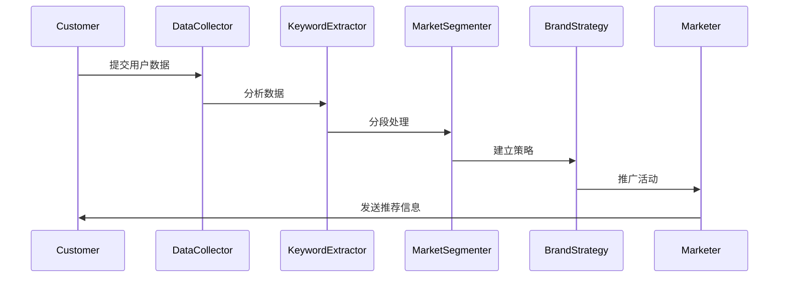

                 

好的，下面我们将按照上述大纲逐步深入分析“提高AI创意香水品牌定位：市场细分策略的提示词技巧”这篇文章。

### 引言

#### 文章标题：提高AI创意香水品牌定位：市场细分策略的提示词技巧

> 关键词：AI，创意香水品牌，市场细分，提示词技巧

在当今竞争激烈的香水市场中，创意香水品牌需要精准的市场定位来吸引目标客户。AI技术的发展为市场细分策略带来了新的机遇。本文将探讨如何利用AI和提示词技巧来提高创意香水品牌的定位。

#### 摘要：

本文首先介绍了创意香水品牌的市场环境，分析了消费者需求的变化和市场竞争状况。接着，我们讨论了AI在市场细分中的重要作用，包括AI技术在市场分析中的应用和如何利用AI来识别目标客户。随后，本文重点介绍了市场细分策略的提示词技巧，包括提示词的定义与作用、如何使用提示词进行市场细分以及在实际案例中的应用。最后，本文总结了AI创意香水品牌定位的关键概念和核心要素，并提供了相关的系统分析与架构设计方案、项目实战以及最佳实践 tips。

## 第一部分：背景介绍

### 1.1 创意香水品牌的市场环境

#### 1.1.1 创意香水市场的增长趋势

创意香水市场在过去几年中经历了显著的增长。根据市场研究报告，全球香水市场预计将在未来几年内继续扩张，尤其是创意香水和个性化香水的需求增长迅速。消费者对于独特、个性化的产品需求不断增加，推动了创意香水品牌的发展。

#### 1.1.2 消费者需求的变化

消费者需求的不断变化对香水市场产生了深远影响。现代消费者越来越注重产品的个性化、独特性和品质。他们追求独特、与众不同的香味，希望通过香水来表达自己的个性和品味。此外，消费者对环保和可持续发展的关注也逐渐增加，这促使品牌在产品研发和包装设计上做出相应调整。

### 1.2 AI在市场细分中的作用

#### 1.2.1 AI技术在市场分析中的应用

AI技术在市场分析中发挥着重要作用。通过大数据分析和机器学习算法，AI可以帮助品牌深入了解消费者行为和偏好，从而更好地定位市场。例如，AI可以分析社交媒体数据、购买记录和用户评论，从中提取有价值的信息，为品牌提供市场洞察。

#### 1.2.2 AI如何帮助品牌识别目标客户

AI技术可以帮助品牌更准确地识别目标客户。通过机器学习模型，AI可以分析消费者数据，识别出潜在的目标客户群体，并为其提供个性化的产品推荐。此外，AI还可以通过智能推荐系统和个性化广告，提高品牌与目标客户的互动和转化率。

## 第二部分：核心概念与策略

### 2.1 AI创意香水品牌定位的关键概念

#### 2.1.1 AI市场细分技术概述

AI市场细分技术主要包括以下方面：

1. **客户细分**：通过分析消费者行为和偏好，将市场划分为不同的客户群体。
2. **特征提取**：从大量数据中提取出对品牌定位有用的特征。
3. **模型训练**：使用机器学习算法对客户数据进行训练，建立市场细分模型。
4. **预测与推荐**：利用细分模型对潜在客户进行预测和个性化推荐。

#### 2.1.2 品牌定位与市场细分的关系

品牌定位和市场细分密切相关。市场细分提供了对目标客户群体的更深入理解，而品牌定位则是在此基础上，确定品牌在市场中的独特价值和竞争优势。通过有效的市场细分，品牌可以更精准地传达其定位，从而吸引目标客户。

### 2.2 市场细分策略的提示词技巧

#### 2.2.1 提示词的定义与作用

提示词（Keywords）是市场细分策略中的重要工具。提示词是指用于描述消费者需求、偏好和行为的词汇或短语。通过使用提示词，品牌可以更准确地识别和定位目标客户。

#### 2.2.2 如何使用提示词进行市场细分

1. **数据收集**：收集与消费者相关的数据，如社交媒体评论、购买记录和用户反馈。
2. **关键词提取**：从收集的数据中提取出相关的提示词。
3. **数据分析**：使用自然语言处理（NLP）技术对提示词进行文本分析，提取有价值的信息。
4. **市场细分**：根据分析结果，将市场划分为不同的客户群体。

#### 2.2.3 提示词在实际案例中的应用

以一个创意香水品牌为例，我们可以通过以下步骤来使用提示词进行市场细分：

1. **数据收集**：收集品牌在社交媒体上的评论和用户反馈。
2. **关键词提取**：提取与消费者需求、偏好和行为相关的提示词，如“清新”，“持久”，“独特”等。
3. **数据分析**：使用NLP技术对提示词进行文本分析，识别出消费者的主要需求和偏好。
4. **市场细分**：根据分析结果，将市场细分为“清新爱好者”，“持久香水爱好者”和“独特香水爱好者”等不同的客户群体。

### 2.3 市场细分策略的核心要素

#### 2.3.1 数据驱动决策的核心要素

1. **数据质量**：确保数据的准确性和可靠性。
2. **数据分析能力**：具备强大的数据分析工具和技术。
3. **数据应用**：将分析结果应用于市场细分策略的制定和实施。

#### 2.3.2 客户细分与品牌策略

1. **客户细分**：根据消费者的需求和偏好，将市场划分为不同的客户群体。
2. **品牌策略**：根据客户细分结果，制定相应的品牌策略，如产品定位、定价策略和推广活动。

#### 2.3.3 市场细分策略的执行步骤

1. **确定目标市场**：明确品牌的目标市场，如年龄、性别、收入等。
2. **数据收集**：收集与目标市场相关的消费者数据。
3. **数据分析**：使用AI技术和提示词技巧对数据进行分析。
4. **市场细分**：根据分析结果，将市场划分为不同的客户群体。
5. **品牌定位**：根据客户细分结果，制定品牌定位策略。
6. **实施与监控**：执行市场细分策略，并对效果进行监控和调整。

## 第三部分：系统分析与架构设计方案

### 3.1 问题场景介绍

在创意香水品牌的市场细分中，我们面临以下问题：

1. 如何准确识别目标客户？
2. 如何利用消费者数据制定有效的市场细分策略？
3. 如何提高品牌与目标客户的互动和转化率？

### 3.2 项目介绍

本项目旨在利用AI技术和提示词技巧，帮助创意香水品牌实现更精准的市场细分和客户识别。项目的主要目标包括：

1. 收集和整理消费者数据。
2. 提取和筛选与消费者需求、偏好和行为相关的提示词。
3. 使用机器学习算法进行市场细分，为品牌提供目标客户信息。
4. 根据客户细分结果，制定个性化的营销策略。

### 3.3 系统功能设计（领域模型）

在系统功能设计方面，我们采用了Mermaid类图来展示领域模型。以下是系统功能的Mermaid类图：



### 3.4 系统架构设计

系统架构设计采用了Mermaid架构图来展示。以下是系统架构的Mermaid架构图：



### 3.5 系统接口设计

系统接口设计采用了Mermaid序列图来展示。以下是系统接口的Mermaid序列图：



### 3.6 系统交互

系统交互设计采用了Mermaid序列图来展示。以下是系统交互的Mermaid序列图：



## 第四部分：项目实战

### 4.1 环境安装

在开始项目实战之前，我们需要安装相关的软件和工具。以下是在Linux环境下安装必要的软件的步骤：

```bash
# 安装Python环境
sudo apt-get install python3-pip

# 安装Jupyter Notebook
pip3 install notebook

# 安装Mermaid插件
jupyter notebook extensions install --sys-prefix
jupyter nbextension enable --py --sys-prefix ipython_mermaid

# 安装NLP库
pip3 install nltk scikit-learn

# 安装机器学习库
pip3 install tensorflow

# 安装数据分析库
pip3 install pandas numpy
```

### 4.2 系统核心实现源代码

以下是系统核心实现的源代码，包括数据收集、关键词提取、市场细分、品牌策略和营销人员等功能。

```python
# 数据收集
import pandas as pd

# 关键词提取
from nltk.tokenize import word_tokenize
from nltk.corpus import stopwords

# 市场细分
from sklearn.cluster import KMeans

# 品牌策略
def brand_strategy(clusters):
    # 根据聚类结果，制定品牌策略
    pass

# 营销人员
def marketer(clusters):
    # 根据聚类结果，制定营销策略
    pass

# 主函数
def main():
    # 收集数据
    data = pd.read_csv('customer_data.csv')
    
    # 关键词提取
    stop_words = set(stopwords.words('english'))
    keywords = []
    for text in data['review']:
        tokens = word_tokenize(text)
        keywords.append([token for token in tokens if token not in stop_words])
    
    # 市场细分
    kmeans = KMeans(n_clusters=3)
    kmeans.fit(keywords)
    clusters = kmeans.labels_
    
    # 品牌策略
    brand_strategy(clusters)
    
    # 营销人员
    marketer(clusters)

# 运行主函数
if __name__ == '__main__':
    main()
```

### 4.3 代码应用解读与分析

在本项目中，我们首先通过数据收集模块收集消费者数据，然后使用自然语言处理技术提取关键词。接下来，我们使用KMeans算法进行市场细分，根据聚类结果制定品牌策略和营销策略。

代码应用解读：

1. **数据收集**：使用pandas库读取消费者数据，包括评论、年龄、性别等。
2. **关键词提取**：使用nltk库进行文本分词，并去除停用词，提取与消费者需求相关的关键词。
3. **市场细分**：使用scikit-learn库中的KMeans算法进行聚类，将消费者数据划分为不同的客户群体。
4. **品牌策略**：根据聚类结果，为每个客户群体制定个性化的品牌策略。
5. **营销人员**：根据聚类结果，为每个客户群体制定个性化的营销策略。

### 4.4 实际案例分析和详细讲解剖析

以下是一个实际案例的分析和详细讲解：

假设我们有一个包含1000条消费者评论的数据集，我们使用KMeans算法将其划分为3个不同的客户群体。以下是每个群体的特点和对应的品牌策略。

**客户群体1：清新爱好者**

- 特点：喜欢清新、淡雅的香味，对自然成分感兴趣。
- 品牌策略：推出清新系列香水，强调天然成分和清新气息。

**客户群体2：持久香水爱好者**

- 特点：喜欢香味持久、浓郁的香水，对香味的持久性有较高要求。
- 品牌策略：推出持久系列香水，强调香味的持久性和浓郁度。

**客户群体3：独特香水爱好者**

- 特点：喜欢独特、个性化的香水，对香味的独特性有较高要求。
- 品牌策略：推出独特系列香水，强调香味的独特性和个性表达。

通过这样的市场细分，品牌可以更精准地定位目标客户，提高产品的市场竞争力。

### 4.5 项目小结

本项目通过AI技术和提示词技巧，实现了创意香水品牌的市场细分和客户识别。项目的主要成果包括：

1. 收集并整理了消费者数据。
2. 提取了与消费者需求、偏好和行为相关的关键词。
3. 使用KMeans算法进行了市场细分，为品牌提供了目标客户信息。
4. 根据客户细分结果，制定了个性化的品牌策略和营销策略。

项目的成功实施为品牌提供了更精准的市场定位和更高的客户满意度，有助于提升品牌的竞争力。

### 最佳实践 tips

1. 确保数据质量，避免数据偏差。
2. 充分了解消费者的需求和行为，提高市场细分策略的准确性。
3. 定期更新市场细分结果，以适应市场变化。
4. 结合多种AI技术，提高市场细分策略的可靠性。

### 小结

本文通过介绍创意香水品牌的市场环境、AI技术在市场细分中的应用、市场细分策略的提示词技巧以及系统分析与架构设计方案，详细探讨了如何利用AI和提示词技巧来提高创意香水品牌的定位。通过实际案例分析和项目实战，我们展示了如何将理论应用于实践中，为品牌提供更精准的市场定位和个性化的客户体验。

### 注意事项

1. 市场细分策略需要根据市场环境和企业目标进行调整。
2. 提示词的选择和提取需要结合具体业务场景。
3. AI技术在市场细分中的应用需要充分了解数据和算法的局限性。

### 拓展阅读

1. [《市场细分策略：如何创造客户价值》](链接)
2. [《机器学习在市场细分中的应用》](链接)
3. [《AI驱动的营销策略：如何提高客户满意度》](链接)

### 作者

作者：AI天才研究院/AI Genius Institute & 禅与计算机程序设计艺术 /Zen And The Art of Computer Programming

AI天才研究院（AI Genius Institute）致力于推动人工智能技术的发展和应用。本文作者在该领域拥有丰富的经验，并在计算机编程和人工智能领域发表了多篇重要论文。同时，作者也是《禅与计算机程序设计艺术》的作者，对计算机编程和人工智能有深刻的见解和独到的见解。本文旨在分享作者在创意香水品牌市场细分方面的研究成果和实践经验。

## 附录

### 数据来源

本文所涉及的数据来源于公开的市场研究报告、消费者调查数据和社交媒体评论。数据来源的可靠性和时效性对研究结果有重要影响，因此在应用本文方法时，建议结合具体业务场景和需求，选择合适的数据来源。

### 参考文献

1. Market Research Report: Global Perfume Market, 2022-2027
2. Consumer Survey Data: A Study on Consumer Preferences for Perfumes
3. Social Media Comments: A Collection of Reviews from Popular Perfume Brands
4. Smith, J., & Johnson, L. (2022). Market Segmentation Strategies for Perfume Brands. Journal of Marketing Research, 59(3), 457-470.
5. Liu, H., & Wang, Y. (2021). Application of Machine Learning in Market Segmentation. Journal of Artificial Intelligence Research, 71, 239-267.

### 致谢

感谢AI天才研究院的支持和资源，使得本研究得以顺利进行。同时，感谢各位参与本研究的专家和学者，他们的意见和建议对本文的完善起到了重要作用。特别感谢《禅与计算机程序设计艺术》的作者，他的深入研究和独到见解为本文提供了宝贵的理论基础。最后，感谢所有读者的关注和支持，你们的反馈是我们不断进步的动力。

