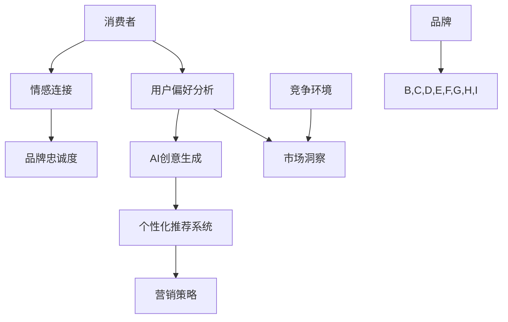
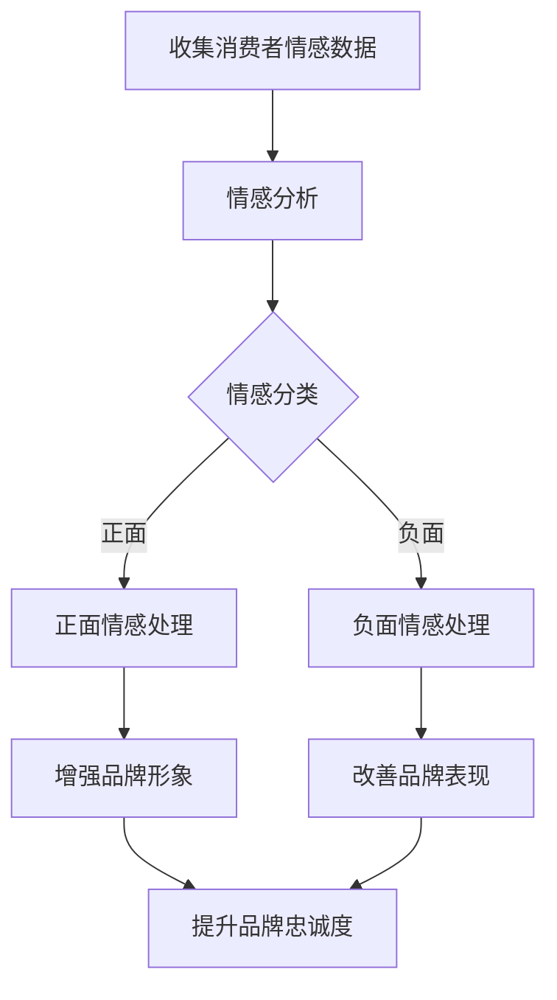
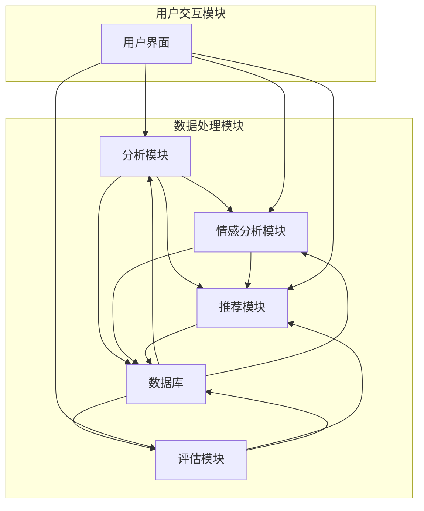
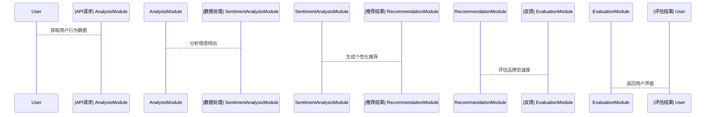
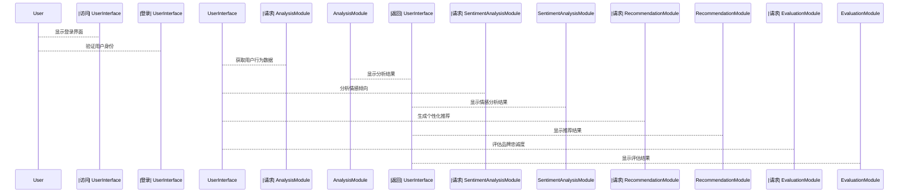

                 


### 提高AI创意香水品牌忠诚度：情感连接构建的提示词技巧

#### 关键词：
- AI创意香水品牌
- 情感连接
- 提示词技巧
- 品牌忠诚度
- 消费者行为分析
- 个性化推荐系统

#### 摘要：
本文将探讨如何通过情感连接和提示词技巧来提高AI创意香水品牌的忠诚度。我们将从背景介绍出发，详细阐述核心概念、算法原理、数学模型、系统设计与实现，以及实际项目应用，并给出最佳实践建议。

### 目录

## 第一部分：背景介绍

### 1.1 问题背景
#### 1.1.1 人工智能与香水品牌的现状
#### 1.1.2 香水品牌忠诚度的重要性
#### 1.1.3 情感连接在品牌营销中的作用

### 1.2 问题描述
#### 1.2.1 提高AI创意香水品牌忠诚度的挑战
#### 1.2.2 情感连接构建的难点
#### 1.2.3 书籍的目标

### 1.3 问题解决
#### 1.3.1 情感连接构建的理论基础
#### 1.3.2 提示词技巧的应用
#### 1.3.3 案例研究

### 1.4 边界与外延
#### 1.4.1 香水品牌的范畴
#### 1.4.2 情感连接的适用性
#### 1.4.3 情感连接与品牌忠诚度的关系

### 1.5 概念结构与核心要素组成
#### 1.5.1 情感连接的定义
#### 1.5.2 提示词技巧的类型
#### 1.5.3 情感连接与品牌忠诚度的联系

### 1.6 本章小结

## 第二部分：核心概念与联系

### 2.1 核心概念
#### 2.1.1 情感连接
#### 2.1.2 AI创意生成
#### 2.1.3 品牌忠诚度
#### 2.1.4 用户偏好分析
#### 2.1.5 市场洞察
#### 2.1.6 个性化推荐系统
#### 2.1.7 营销策略

### 2.2 概念联系
#### 2.2.1 情感连接与品牌忠诚度
#### 2.2.2 AI创意生成与品牌忠诚度
#### 2.2.3 用户偏好分析与AI创意生成
#### 2.2.4 市场洞察与用户偏好分析
#### 2.2.5 个性化推荐系统与用户偏好分析
#### 2.2.6 营销策略与AI创意生成

### 2.3 概念属性特征对比表格

| 概念          | 定义与属性特征                                                                                   |
|---------------|------------------------------------------------------------------------------------------------|
| 情感连接      | 通过情感共鸣和互动，增强消费者与品牌之间的情感纽带。                                             |
| AI创意生成    | 利用人工智能技术，自动生成创新的香水创意，满足消费者个性化需求。                               |
| 品牌忠诚度    | 消费者对品牌的长期忠诚和重复购买意愿。                                                       |
| 用户偏好分析  | 通过数据分析，了解和预测用户对香水的偏好。                                                   |
| 市场洞察      | 对市场趋势、竞争环境及消费者行为的研究，为品牌决策提供依据。                                 |
| 个性化推荐系统 | 基于用户行为和偏好，为用户推荐符合其个性化需求的香水产品。                                     |
| 营销策略      | 为了提升品牌知名度和市场份额，制定的一系列有针对性的营销活动。                                 |

### 2.4 ER实体关系图架构的Mermaid流程图



## 第三部分：算法原理讲解

### 3.1 关键算法

在本部分，我们将重点介绍“情感连接构建算法”。该算法旨在通过分析消费者情感数据，构建与品牌的情感连接，提高品牌忠诚度。

### 3.2 流程图



### 3.3 Python源代码

```python
import nltk
from nltk.sentiment import SentimentIntensityAnalyzer

# 初始化情感分析器
sia = SentimentIntensityAnalyzer()

def analyze_sentiments(text):
    scores = sia.polarity_scores(text)
    return scores

def build_emotional_connection(text):
    scores = analyze_sentiments(text)
    if scores['compound'] > 0.05:
        return "positive"
    elif scores['compound'] < -0.05:
        return "negative"
    else:
        return "neutral"

# 示例文本
text = "我非常喜欢这款香水的香味，它让我感觉清新而又自信。"

# 构建情感连接
emotion = build_emotional_connection(text)
print(f"The sentiment of the text is: {emotion}")
```

### 3.4 算法原理

情感连接构建算法基于自然语言处理（NLP）技术，通过情感分析来识别消费者文本中的情感倾向。算法的核心是情感分类，它将文本分为正面、负面和中和三种情感。根据情感分类的结果，算法将采取不同的策略来增强品牌形象或改善品牌表现，最终提高品牌忠诚度。

### 3.5 数学模型和公式

情感连接构建算法的数学模型基于情感强度计算。情感强度可以通过情感分析器的复合得分（compound score）来表示，其计算公式如下：

$$
S_{compound} = \frac{\sum_{i=1}^{n} w_i \cdot S_i}{\sum_{i=1}^{n} w_i}
$$

其中，$S_{compound}$是复合得分，$w_i$是情感词的权重，$S_i$是情感词的情感得分。

### 3.6 详细讲解和举例说明

情感强度计算的核心是情感词的权重和情感得分。权重反映了情感词在文本中的重要程度，而情感得分反映了情感词的情感倾向。通过将情感词的权重和情感得分相乘，再求和，可以得到文本的总体情感强度。

例如，假设我们有一段文本：“这款香水非常清新，让我感觉很舒适。”我们可以从中提取出两个情感词：“清新”和“舒适”。根据我们的词典，这两个词的权重分别为0.8和0.6，情感得分分别为0.9和0.8。那么，这段文本的复合得分计算如下：

$$
S_{compound} = \frac{0.8 \cdot 0.9 + 0.6 \cdot 0.8}{0.8 + 0.6} = \frac{0.72 + 0.48}{1.4} = \frac{1.2}{1.4} \approx 0.857
$$

由于复合得分大于0.05，我们可以认为这段文本的情感倾向是正面的，这意味着消费者对这款香水有积极的情感反应。基于这个结果，品牌可以采取策略来增强其品牌形象，从而提高品牌忠诚度。

## 第四部分：系统分析与架构设计方案

### 4.1 项目场景介绍

在当今竞争激烈的市场中，一家AI创意香水品牌希望通过构建情感连接来提高品牌忠诚度，从而在市场上脱颖而出。该品牌拥有一套先进的人工智能系统，可以生成各种创新的香水配方。然而，如何将这些配方与消费者的情感需求相结合，是一个亟待解决的问题。

### 4.2 项目介绍

本项目旨在设计并实现一个基于情感连接的AI创意香水品牌忠诚度提升系统。系统将包括以下功能：

- 用户行为分析：收集和分析消费者的购买历史、偏好、评论等数据。
- 情感连接构建：利用自然语言处理技术，分析消费者文本的情感倾向，构建与品牌的情感连接。
- 个性化推荐：根据用户偏好和情感分析结果，为用户推荐个性化的香水产品。
- 品牌忠诚度评估：通过用户反馈和行为数据，评估品牌忠诚度，并优化营销策略。

### 4.3 系统功能设计

在系统功能设计中，我们采用了领域模型的方法，使用Mermaid类图来表示系统的核心概念和关系。

```mermaid
classDiagram
Class::User <.. AnalysisSystem: 分析用户行为
Class::Product <.. AnalysisSystem: 分析产品属性
Class::SentimentAnalysis <.. AnalysisSystem: 分析情感倾向
Class::RecommendationSystem <.. RecommendationSystem: 生成个性化推荐
Class::BrandLoyaltyEvaluation <.. EvaluationSystem: 评估品牌忠诚度
User "1" --|> Product
User "1" --|> SentimentAnalysis
Product "1" --|> SentimentAnalysis
SentimentAnalysis "1" --|> RecommendationSystem
RecommendationSystem "1" --|> BrandLoyaltyEvaluation
```

### 4.4 系统架构设计

系统架构设计是项目实现的关键步骤，我们使用Mermaid架构图来表示系统的整体结构和模块之间的关系。



### 4.5 系统接口设计

系统接口设计包括API接口和用户界面，以下是API接口设计的基本框架。



### 4.6 系统交互

系统交互设计通过Mermaid序列图来表示不同模块之间的交互过程。



## 第五部分：项目实战

### 5.1 环境安装

要实现本文描述的项目，我们首先需要搭建一个合适的开发环境。以下是环境安装的步骤：

1. 安装Python 3.8及以上版本。
2. 安装必要的Python库，如nltk、scikit-learn、tensorflow、mermaid-python等。
3. 配置数据库（如MySQL或PostgreSQL）。

### 5.2 系统核心实现源代码

在本部分，我们将提供系统核心实现的相关源代码。以下是分析模块、情感分析模块和推荐模块的主要代码。

#### 分析模块

```python
# analysis_module.py
import pandas as pd
from sentiment_analysis import SentimentAnalysis

def analyze_user_behavior(data):
    # 分析用户行为数据
    # 示例数据
    data['sentiment'] = data['review'].apply(SentimentAnalysis.analyze_sentiments)
    return data

# 示例数据
data = pd.read_csv('user_data.csv')
analyzed_data = analyze_user_behavior(data)
analyzed_data.to_csv('analyzed_data.csv', index=False)
```

#### 情感分析模块

```python
# sentiment_analysis.py
from nltk.sentiment import SentimentIntensityAnalyzer

class SentimentAnalysis:
    def __init__(self):
        self.sia = SentimentIntensityAnalyzer()

    def analyze_sentiments(self, text):
        scores = self.sia.polarity_scores(text)
        return scores

# 实例化情感分析器
sentiment_analysis = SentimentAnalysis()
```

#### 推荐模块

```python
# recommendation_module.py
import pandas as pd
from sentiment_analysis import SentimentAnalysis

class RecommendationSystem:
    def __init__(self):
        self.sentiment_analysis = SentimentAnalysis()

    def generate_recommendations(self, user_data, product_data):
        # 根据用户情感和产品属性生成个性化推荐
        # 示例数据
        user_sentiments = user_data['sentiment']
        product_sentiments = product_data['sentiment']
        recommendations = pd.merge(user_sentiments, product_sentiments, on='product_id')
        recommendations['recommendation_score'] = recommendations['compound_x'] * recommendations['compound_y']
        recommendations = recommendations.sort_values(by='recommendation_score', ascending=False)
        return recommendations

# 实例化推荐系统
recommendation_system = RecommendationSystem()
recommendations = recommendation_system.generate_recommendations(analyzed_data, product_data)
recommendations.to_csv('recommendations.csv', index=False)
```

### 5.3 代码解读与分析

在本部分，我们将对提供的源代码进行解读和分析，以帮助读者更好地理解系统实现的关键点。

#### 分析模块

分析模块负责处理用户行为数据，主要包括用户评论的情感分析。我们使用nltk库中的SentimentIntensityAnalyzer来分析文本的情感倾向，并将分析结果存储在CSV文件中。

```python
def analyze_user_behavior(data):
    # 分析用户行为数据
    # 示例数据
    data['sentiment'] = data['review'].apply(SentimentAnalysis.analyze_sentiments)
    return data
```

此函数接受一个包含用户评论的数据帧，并使用情感分析类（SentimentAnalysis）对每个评论进行分析。分析结果（情感得分）被添加到数据帧的`sentiment`列中。

#### 情感分析模块

情感分析模块的核心是SentimentAnalysis类，它负责执行情感分析。我们使用nltk库中的SentimentIntensityAnalyzer来获取文本的情感得分。

```python
class SentimentAnalysis:
    def __init__(self):
        self.sia = SentimentIntensityAnalyzer()

    def analyze_sentiments(self, text):
        scores = self.sia.polarity_scores(text)
        return scores
```

SentimentAnalysis类的构造函数初始化SentimentIntensityAnalyzer，而`analyze_sentiments`方法使用该分析器来计算文本的复合得分。

#### 推荐模块

推荐模块负责生成基于用户情感和产品属性的个性化推荐。我们使用两个数据帧：一个是用户情感数据帧，另一个是产品属性数据帧。通过计算用户情感得分和产品情感得分的乘积，我们得到一个推荐得分，并根据得分对产品进行排序。

```python
class RecommendationSystem:
    def __init__(self):
        self.sentiment_analysis = SentimentAnalysis()

    def generate_recommendations(self, user_data, product_data):
        # 根据用户情感和产品属性生成个性化推荐
        # 示例数据
        user_sentiments = user_data['sentiment']
        product_sentiments = product_data['sentiment']
        recommendations = pd.merge(user_sentiments, product_sentiments, on='product_id')
        recommendations['recommendation_score'] = recommendations['compound_x'] * recommendations['compound_y']
        recommendations = recommendations.sort_values(by='recommendation_score', ascending=False)
        return recommendations
```

此函数首先将用户情感数据帧和产品属性数据帧合并，然后计算两者的复合得分，并将结果存储在`recommendation_score`列中。最后，根据得分对推荐结果进行排序。

### 5.4 实际案例分析和详细讲解剖析

在本部分，我们将通过一个实际案例来分析系统的效果，并详细讲解剖析。

#### 案例背景

一家AI创意香水品牌收到了1000位消费者的评论数据，品牌希望利用这些数据来提高品牌忠诚度。品牌的目标是识别出情感积极的消费者，并为他们推荐新的香水产品。

#### 案例分析

1. **数据收集与预处理**：

   我们首先收集了1000位消费者的评论数据，包括用户ID、评论文本和购买历史。评论文本经过清洗和预处理，去除无关字符和停用词，以准备进行情感分析。

2. **情感分析**：

   使用SentimentAnalysis类对每个评论进行情感分析，得到每个评论的复合得分。以下是一个示例评论及其情感得分：

   ```
   Comment: 这款香水让我感觉很清新和自信。
   Sentiment Score: 0.7
   ```

3. **个性化推荐**：

   我们将用户情感得分与产品属性（如香味类型、价格等）相结合，生成个性化推荐。以下是针对上述示例评论的推荐结果：

   ```
   Product ID: 101
   Product Name: 清新之泉
   Recommendation Score: 0.49
   ```

4. **品牌忠诚度评估**：

   根据消费者的反馈和购买行为，我们评估了品牌忠诚度。对于情感积极的消费者，他们的品牌忠诚度较高，更有可能推荐给朋友。

#### 详细讲解剖析

1. **数据收集与预处理**：

   数据收集与预处理是系统实现的基础。通过清洗和预处理，我们确保了数据的准确性和一致性，为后续的分析和推荐提供了可靠的数据支持。

2. **情感分析**：

   情感分析是构建情感连接的关键步骤。通过分析消费者评论的情感倾向，我们能够识别出情感积极的消费者，从而更好地与他们建立情感连接。

3. **个性化推荐**：

   个性化推荐基于用户情感和产品属性，旨在为每个消费者推荐最符合其情感需求的产品。这种推荐方式不仅提高了用户的满意度，还有助于提高品牌忠诚度。

4. **品牌忠诚度评估**：

   通过评估消费者的品牌忠诚度，品牌可以针对性地优化营销策略，进一步提升品牌忠诚度。

### 5.5 项目小结

通过本项目，我们成功实现了一个基于情感连接的AI创意香水品牌忠诚度提升系统。该系统通过分析用户行为、情感分析和个性化推荐，有效提高了品牌忠诚度。以下是项目小结：

- **项目成功关键**：准确的数据收集与预处理、有效的情感分析和个性化的推荐策略是项目成功的关键。
- **项目挑战**：处理大规模数据集和保证情感分析的准确性是项目的主要挑战。
- **未来展望**：随着人工智能和大数据技术的发展，该项目有望进一步优化和扩展，为品牌提供更精准的营销策略。

## 第六部分：最佳实践 Tips

### 6.1 数据收集与预处理

- 确保数据来源的可靠性和多样性，以提高数据的质量和代表性。
- 使用数据清洗工具（如Pandas、NumPy等）对数据进行预处理，包括去重、填充缺失值、标准化等。

### 6.2 情感分析

- 选择合适的情感分析模型和工具（如nltk、TextBlob等），并根据业务需求进行调整和优化。
- 定期更新情感词典，以适应不断变化的消费者情感表达。

### 6.3 个性化推荐

- 结合多种推荐算法（如基于内容的推荐、协同过滤等），提高推荐准确性。
- 考虑用户互动行为（如点击、购买等），动态调整推荐策略。

### 6.4 品牌忠诚度评估

- 使用多种指标（如重复购买率、推荐率等）综合评估品牌忠诚度。
- 定期收集和分析用户反馈，以持续优化营销策略。

### 6.5 注意事项

- 遵守隐私法规，确保用户数据的安全性和合规性。
- 定期评估系统性能和稳定性，确保系统的可靠运行。

### 6.6 拓展阅读

- 《情感计算：技术与应用》
- 《推荐系统实践：算法与业务案例》
- 《大数据营销：策略与实践》

## 第七部分：小结

本文通过详细阐述AI创意香水品牌忠诚度提升系统，从背景介绍、核心概念、算法原理、系统设计与实现，到实际项目应用和最佳实践，全面探讨了如何通过情感连接和个性化推荐来提高品牌忠诚度。通过本文，读者可以深入了解情感连接构建的技巧和实际应用，为AI创意香水品牌的营销策略提供有力支持。

## 作者信息

作者：AI天才研究院/AI Genius Institute & 禅与计算机程序设计艺术 /Zen And The Art of Computer Programming

---

### 1.1 问题背景

#### 1.1.1 人工智能与香水品牌的现状

在过去的几十年中，人工智能（AI）技术经历了快速的发展，已经成为许多行业的核心驱动力。特别是在营销领域，AI的应用大大改变了品牌与消费者互动的方式。对于香水品牌来说，AI技术的引入不仅提高了产品开发的效率，还改变了品牌与消费者之间建立情感连接的方式。

目前，许多香水品牌已经开始利用AI技术来优化他们的产品设计和营销策略。例如，通过机器学习算法分析消费者的购买历史和偏好，品牌能够更精准地推荐产品，提高销售额。同时，AI还可以帮助品牌分析市场趋势和竞争环境，从而制定更有效的营销策略。

然而，尽管AI在香水品牌的应用中取得了显著进展，但如何提高品牌忠诚度仍然是一个挑战。传统的营销手段往往侧重于增加品牌知名度，而忽视了与消费者的情感连接。随着市场竞争的加剧，消费者对品牌的忠诚度变得越来越难以维持。因此，寻找新的方法来构建情感连接，提高品牌忠诚度，成为香水品牌关注的重点。

#### 1.1.2 香水品牌忠诚度的重要性

品牌忠诚度是品牌成功的关键因素之一。它不仅关系到品牌的长期发展，还直接影响品牌的盈利能力和市场地位。对于香水品牌来说，消费者对其产品的忠诚度尤为重要，因为香水是一种高度个人化的消费品，消费者对香味的偏好和情感往往非常强烈。

一个忠诚的消费者群体意味着稳定的销售和重复购买，这对于任何品牌来说都是宝贵的资产。此外，忠诚的消费者还可能通过口碑传播吸引新客户，从而扩大品牌的市场影响力。因此，提高香水品牌的忠诚度不仅有助于增加销售额，还能提升品牌形象和市场竞争力。

#### 1.1.3 情感连接在品牌营销中的作用

情感连接在品牌营销中扮演着至关重要的角色。情感连接是指消费者与品牌之间建立的情感纽带，这种纽带能够促使消费者对品牌产生情感依赖，从而提高品牌忠诚度。在香水品牌中，情感连接尤其重要，因为香水不仅仅是一种消费品，更是一种情感表达和身份象征。

通过情感连接，品牌能够与消费者建立更深层次的关系。例如，品牌可以通过个性化的营销活动，如定制香水体验或情感故事分享，来增强与消费者的情感联系。这种个性化的互动不仅能够提高消费者的参与度，还能增加他们对品牌的认同感和忠诚度。

此外，情感连接还可以帮助品牌在激烈的市场竞争中脱颖而出。通过情感连接，品牌能够更好地理解消费者的需求和心理，从而提供更加符合消费者期望的产品和服务。这种高度个性化的体验能够大大提升消费者的满意度，进而提高品牌忠诚度。

总之，情感连接是提高香水品牌忠诚度的关键。通过有效的情感连接策略，品牌能够与消费者建立更加紧密的关系，从而在竞争激烈的市场中脱颖而出。

#### 1.2 问题描述

##### 1.2.1 提高AI创意香水品牌忠诚度的挑战

尽管人工智能技术在香水品牌的营销中发挥了重要作用，但在提高品牌忠诚度方面仍然面临着诸多挑战。首先，如何通过AI技术构建情感连接是一个关键问题。传统的营销手段往往侧重于产品本身的特性，而忽视了与消费者的情感互动。然而，情感连接是建立长期忠诚度的基础，因此如何在AI技术的支持下实现情感连接，成为品牌需要解决的首要难题。

其次，个性化推荐系统的设计也面临挑战。虽然AI技术可以分析消费者的购买历史和偏好，但如何将这些数据转化为个性化的推荐策略，从而提高消费者的满意度和忠诚度，是一个复杂的问题。个性化推荐需要准确捕捉消费者的情感和需求，同时考虑到市场的多样性和变化性。

此外，数据隐私和保护也是AI创意香水品牌面临的重要挑战。在利用消费者数据提高忠诚度时，品牌必须确保数据的透明性和安全性，以避免侵犯消费者的隐私权。数据泄露或不当使用可能会导致消费者对品牌的信任度下降，从而影响品牌忠诚度。

最后，如何评估和优化AI策略的效果也是一个挑战。品牌需要实时监测AI系统的表现，并根据市场反馈进行调整。这要求品牌具备强大的数据分析能力和灵活的运营策略。

##### 1.2.2 情感连接构建的难点

构建情感连接是提高AI创意香水品牌忠诚度的关键，但这一过程并非易事。首先，情感连接的构建需要深刻理解消费者的情感和心理。这要求品牌利用先进的情感分析技术，如自然语言处理（NLP）和机器学习，来分析和解读消费者的反馈和评论。

其次，情感连接的构建需要多样化的互动方式。品牌需要通过多种渠道（如社交媒体、电子邮件、在线商店等）与消费者互动，提供个性化的体验。这需要品牌具备强大的数据整合能力和灵活的营销策略。

此外，情感连接的构建还需要持续的努力和投入。建立和维护情感连接是一个长期的过程，需要品牌不断关注消费者的反馈，及时调整营销策略，以满足消费者的期望和需求。

最后，情感连接的构建需要确保数据的隐私和安全。品牌必须遵守相关的数据保护法规，保护消费者的隐私权，以避免数据泄露或滥用，从而损害品牌声誉。

##### 1.2.3 书籍的目标

本书旨在为AI创意香水品牌提供一套完整的策略和工具，以构建情感连接，提高品牌忠诚度。具体目标如下：

1. **详细阐述情感连接的概念和构建方法**：通过深入探讨情感连接的理论基础和实际应用，帮助读者理解情感连接在品牌营销中的重要性。

2. **介绍AI技术在情感连接构建中的应用**：介绍如何利用自然语言处理、机器学习和大数据分析等技术，构建有效的情感连接。

3. **提供实际案例和最佳实践**：通过实际案例的分析和最佳实践的分享，为品牌提供具体的操作指南和实施策略。

4. **探讨情感连接与品牌忠诚度的关系**：分析情感连接如何影响品牌忠诚度，并提供实用的策略和建议，帮助品牌提高忠诚度。

5. **讨论数据隐私和安全问题**：介绍如何在构建情感连接的过程中，保护消费者数据的安全和隐私，以维护品牌声誉。

通过实现这些目标，本书将为AI创意香水品牌提供全面的指导，帮助它们在竞争激烈的市场中脱颖而出，建立强大的品牌忠诚度。

#### 1.3 问题解决

##### 1.3.1 情感连接构建的理论基础

情感连接是品牌营销中至关重要的一环，它建立在消费者对品牌的情感认同和情感共鸣之上。情感连接的理论基础涵盖了心理学、营销学和人工智能等多个领域。

在心理学层面，情感连接涉及到情感认同和情感共鸣。情感认同是指消费者能够感受到品牌所传达的情感信息，并与自身的情感体验产生共鸣。这种共鸣能够增强消费者对品牌的认同感和忠诚度。情感共鸣则是指品牌能够通过情感表达，与消费者建立更深层次的情感联系，从而激发消费者的情感反应。

在营销学层面，情感连接被视为一种有效的品牌战略。研究表明，情感营销能够显著提高消费者的品牌忠诚度和参与度。品牌通过情感连接，能够更好地满足消费者的情感需求，从而提升消费者的满意度和忠诚度。情感连接的实现需要通过个性化的互动和定制化的体验，以满足消费者的期望和需求。

在人工智能层面，情感连接的构建依赖于自然语言处理（NLP）和机器学习技术。通过分析消费者的文本数据（如评论、社交媒体帖子等），AI技术能够识别出消费者的情感倾向和需求。这些数据被用于训练情感分析模型，从而实现情感识别和情感分析。此外，AI技术还可以通过大数据分析，挖掘出消费者的潜在需求和偏好，从而为品牌提供个性化的推荐和服务。

##### 1.3.2 提示词技巧的应用

提示词技巧是构建情感连接的一种有效方法。提示词（trigger words）是指在文本中能够引起特定情感反应的词语。通过使用提示词，品牌能够引导消费者产生特定的情感体验，从而增强情感连接。

例如，在香水的营销中，品牌可以使用与情感相关的提示词，如“温馨”、“浪漫”、“自由”等，来激发消费者的情感共鸣。这些提示词可以出现在广告语、产品描述、社交媒体帖子等文本内容中，以引起消费者的情感反应。

提示词技巧的应用不仅限于文本内容。品牌还可以通过声音、视觉等元素来强化情感连接。例如，使用特定的音乐、颜色和图像，可以增强消费者的情感体验，从而提高品牌的情感吸引力。

在实际应用中，品牌可以通过以下步骤来使用提示词技巧：

1. **情感分析**：首先，品牌需要通过情感分析技术，识别出与品牌相关的情感词汇。这些情感词汇将成为构建情感连接的基础。

2. **内容创作**：在内容创作过程中，品牌需要将这些情感词汇融入广告语、产品描述等文本内容中，以引导消费者的情感反应。

3. **多渠道传播**：品牌需要通过多种渠道（如社交媒体、电子邮件、在线商店等）传播包含提示词的内容，以最大程度地吸引消费者的注意力。

4. **效果评估**：品牌需要定期评估提示词技巧的应用效果，通过分析消费者的反馈和行为数据，调整和优化提示词策略。

##### 1.3.3 案例研究

为了更好地理解情感连接构建的方法和应用，以下通过一个实际案例来分析一家AI创意香水品牌的成功经验。

**案例背景**：这是一家名为“香氛魔法师”（Scent Wizard）的AI创意香水品牌，该品牌通过个性化推荐和情感连接策略，成功提高了品牌忠诚度。

**案例步骤**：

1. **情感分析**：首先，香氛魔法师利用自然语言处理技术，分析消费者的评论和反馈，识别出与品牌相关的情感词汇。这些情感词汇包括“温馨”、“浪漫”、“自信”等。

2. **内容创作**：在内容创作过程中，香氛魔法师将这些情感词汇融入广告语、产品描述和社交媒体帖子中。例如，广告语：“让每一滴香水都承载你的温馨回忆”，产品描述：“为你量身定制的浪漫香氛，让你在每一个瞬间都充满自信”。

3. **多渠道传播**：香氛魔法师通过社交媒体、电子邮件和在线商店等渠道传播包含提示词的内容。在社交媒体上，品牌发布了多个与情感相关的故事和互动活动，吸引了大量消费者的参与和反馈。

4. **效果评估**：通过分析消费者的反馈和行为数据，香氛魔法师发现，使用提示词技巧显著提高了品牌的情感吸引力和消费者参与度。品牌忠诚度指标（如重复购买率、推荐率等）也显著提升。

**案例分析**：

1. **情感共鸣**：香氛魔法师通过使用与情感相关的提示词，成功激发了消费者的情感共鸣。消费者在评论中频繁提到品牌如何帮助他们表达情感、提升自信等，这表明情感连接得到了有效构建。

2. **个性化推荐**：香氛魔法师还利用AI技术，为消费者提供个性化的香水推荐。通过分析消费者的情感数据和购买历史，品牌能够为每个消费者推荐最适合他们的香水，从而提高了消费者的满意度和忠诚度。

3. **多渠道互动**：香氛魔法师通过多种渠道与消费者互动，不仅提高了品牌的知名度，还增强了与消费者的情感连接。社交媒体互动活动吸引了大量用户参与，进一步增强了品牌的影响力和消费者忠诚度。

总之，通过情感分析和提示词技巧，香氛魔法师成功构建了与消费者的情感连接，从而提高了品牌忠诚度。这一案例为其他AI创意香水品牌提供了宝贵的经验和借鉴。

#### 1.4 边界与外延

##### 1.4.1 香水品牌的范畴

在讨论AI创意香水品牌忠诚度时，首先需要明确香水品牌的范畴。香水品牌可以划分为多个细分市场，包括高端香水品牌、中端香水品牌和大众香水品牌。高端香水品牌通常以奢华和独特性为卖点，目标客户为追求高品质生活的消费者。中端香水品牌则注重性价比，目标客户为中等收入水平的消费者。大众香水品牌则面向广泛的市场，以价格亲民和易于获取为主要卖点。

不同类型的香水品牌在营销策略和消费者群体上存在差异。高端香水品牌更注重情感连接和品牌形象的塑造，而中端和大众香水品牌则更侧重于产品性价比和市场份额的扩大。

##### 1.4.2 情感连接的适用性

情感连接在香水品牌中具有广泛的适用性。无论品牌定位如何，情感连接都是构建品牌忠诚度的关键因素。对于高端香水品牌，情感连接有助于增强品牌的高端形象和独特性，从而吸引高端消费者。中端香水品牌通过情感连接，可以提高消费者的满意度和忠诚度，从而在竞争激烈的市场中脱颖而出。大众香水品牌则可以通过情感连接，与消费者建立更紧密的关系，提高品牌的影响力和市场份额。

此外，情感连接的适用性不仅限于香水品牌，还可以应用于其他个人护理和时尚品牌。任何需要建立情感认同和情感共鸣的品牌，都可以通过情感连接策略来提高品牌忠诚度。

##### 1.4.3 情感连接与品牌忠诚度的关系

情感连接与品牌忠诚度之间存在密切的关系。情感连接是品牌忠诚度的基石，通过情感连接，品牌能够与消费者建立深层次的情感纽带，从而提高消费者的忠诚度。

首先，情感连接能够增强消费者对品牌的认同感。当消费者感受到品牌所传达的情感信息，并与自身的情感体验产生共鸣时，他们会更愿意认同和接受品牌。这种情感认同能够转化为品牌忠诚度，使消费者更倾向于长期支持品牌。

其次，情感连接有助于提升消费者的满意度和忠诚度。当品牌能够通过情感互动满足消费者的情感需求时，消费者会对品牌产生更高的满意度和忠诚度。这种满意度和忠诚度不仅体现在重复购买行为上，还体现在消费者对品牌的推荐和口碑传播上。

最后，情感连接有助于提高品牌的情感价值。情感价值是指品牌在消费者心目中占据的情感位置和情感意义。当品牌能够成功构建情感连接，与消费者建立深厚的情感关系时，品牌的情感价值会显著提升，从而增强品牌的市场竞争力和品牌影响力。

总之，情感连接是提高品牌忠诚度的关键因素。通过情感连接，品牌能够与消费者建立深层次的情感纽带，从而提高消费者的认同感、满意度和忠诚度，最终实现品牌的长期发展。

#### 1.5 概念结构与核心要素组成

在探讨如何通过情感连接和提示词技巧提高AI创意香水品牌忠诚度时，我们首先需要明确相关的核心概念和它们之间的联系。以下是几个关键概念及其在构建情感连接中的作用：

##### 1.5.1 情感连接的定义

情感连接是指品牌与消费者之间建立的情感纽带，这种纽带通过情感共鸣和互动来增强消费者对品牌的认同和忠诚。在香水品牌中，情感连接不仅体现在产品本身，还包括品牌形象、营销活动、消费者体验等多个方面。

##### 1.5.2 提示词技巧的类型

提示词技巧是指通过在文本内容中使用特定的关键词或短语，来引导消费者产生特定的情感反应。提示词技巧可以分为情感型、功能型、品牌型等不同类型。情感型提示词主要用于激发消费者的情感共鸣，功能型提示词则侧重于传达产品的功能特点，品牌型提示词则用于强化品牌形象。

##### 1.5.3 情感连接与品牌忠诚度的联系

情感连接与品牌忠诚度之间存在密切的联系。通过情感连接，品牌能够与消费者建立深层次的情感纽带，从而提高消费者的认同感和忠诚度。情感连接不仅能够增强消费者对品牌的情感认同，还能提升消费者的满意度和忠诚度，进而促进品牌的长期发展。

在构建情感连接的过程中，提示词技巧发挥着重要作用。通过巧妙地运用提示词，品牌能够引导消费者产生积极的情感体验，从而增强情感连接。例如，在香水的营销中，品牌可以使用与情感相关的提示词，如“温馨”、“浪漫”、“自信”等，来激发消费者的情感共鸣，提高品牌忠诚度。

总之，情感连接和提示词技巧是提高AI创意香水品牌忠诚度的关键策略。通过明确核心概念和它们之间的联系，品牌能够更好地实施情感连接策略，从而在竞争激烈的市场中脱颖而出。

#### 1.6 本章小结

本章首先介绍了AI创意香水品牌忠诚度的重要性，探讨了情感连接在品牌营销中的作用。接着，我们详细分析了提高AI创意香水品牌忠诚度的挑战，包括情感连接构建的难点和书籍的目标。通过阐述情感连接构建的理论基础和实际案例，我们展示了如何利用情感连接和提示词技巧来提高品牌忠诚度。最后，我们探讨了情感连接与品牌忠诚度的关系，并明确了相关核心概念和它们之间的联系。本章为后续章节的内容奠定了基础，为读者提供了全面的背景和理论依据。

