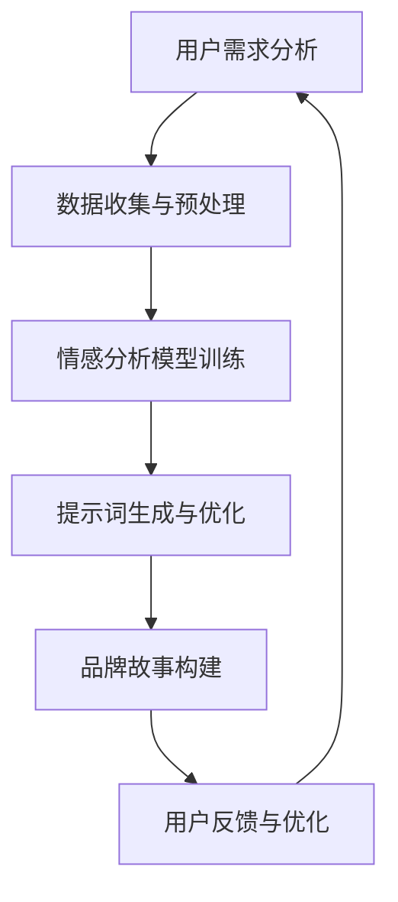
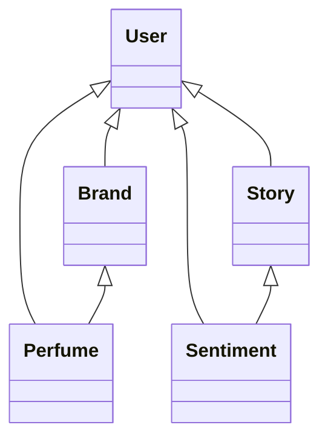
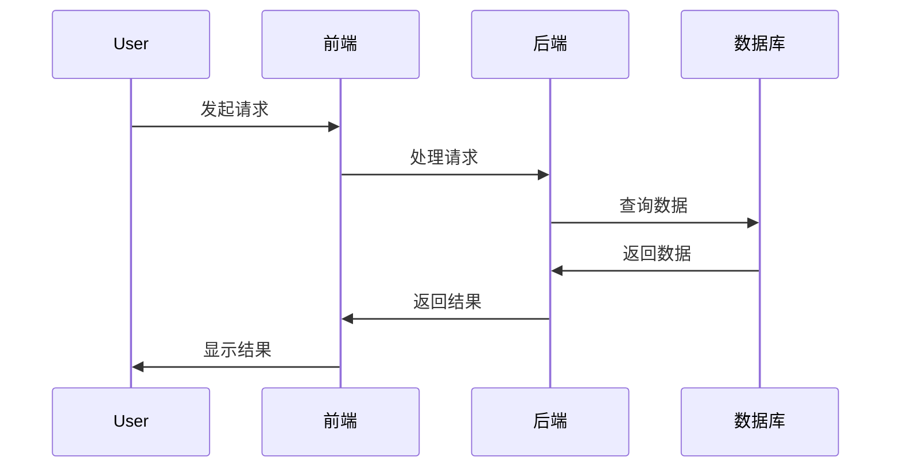
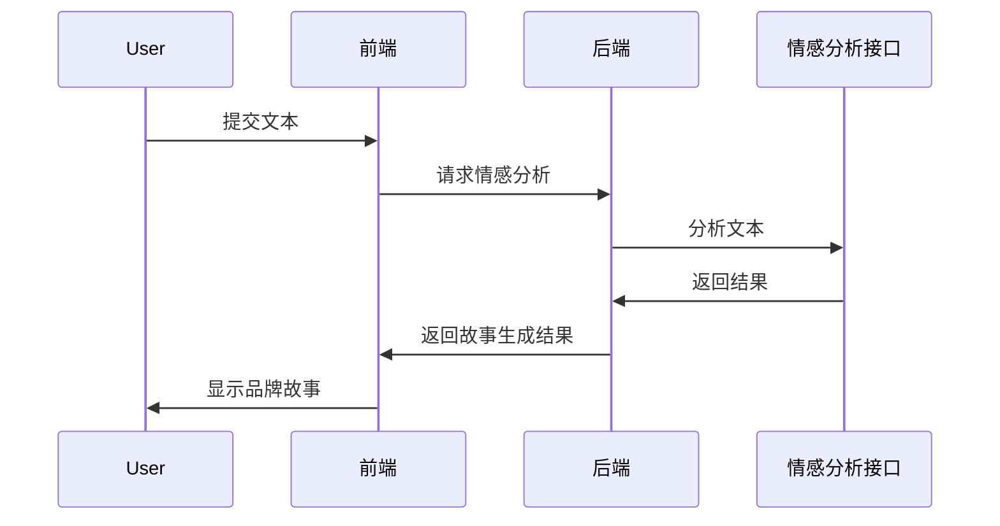

                 

# 提高AI创意香水品牌故事：情感共鸣构建的提示词技巧

关键词：AI，创意香水品牌，情感共鸣，提示词技巧，用户体验

摘要：随着人工智能技术的不断发展，AI在创意香水品牌故事构建中的应用逐渐受到关注。本文旨在探讨如何利用情感共鸣构建的提示词技巧，提高AI在创意香水品牌故事中的应用效果，为消费者提供更深入的情感体验。

## 背景介绍

### 核心概念术语说明

- **AI**：人工智能，指通过计算机模拟人类智能行为的科学和技术。
- **创意香水品牌**：指通过创新思维和独特理念，打造具有独特风格和情感价值的香水品牌。
- **情感共鸣**：指消费者在与品牌互动过程中，产生情感上的共鸣和认同。
- **提示词技巧**：指在构建品牌故事时，利用特定的词汇和表达方式，引发消费者情感共鸣的方法。

### 问题背景

在当今快速发展的市场中，创意香水品牌如何通过AI技术构建有吸引力的品牌故事，从而提高消费者情感共鸣，成为众多品牌关注的焦点。传统的人工构建品牌故事往往耗时耗力，且难以满足个性化需求。而AI技术可以为品牌提供快速、高效、个性化的解决方案。

### 问题描述

本文将探讨以下问题：

1. 如何定义并识别情感共鸣的关键要素？
2. 提示词技巧如何应用于AI品牌故事构建？
3. 如何通过实证分析验证提示词技巧的有效性？

### 问题解决

本文通过以下步骤解决上述问题：

1. **核心概念与联系**：阐述情感共鸣、提示词技巧等核心概念及其相互关系。
2. **算法原理讲解**：使用mermaid绘制流程图，Python代码阐述算法原理。
3. **数学模型和公式**：使用latex格式给出数学公式，详细讲解和举例说明。
4. **系统分析与架构设计方案**：介绍项目背景，设计领域模型、系统架构和接口设计。
5. **项目实战**：详细描述环境安装、系统实现、代码分析和实际案例。
6. **最佳实践 tips**、**小结**、**注意事项**、**拓展阅读**等内容。

## 核心概念与联系

### 情感共鸣

情感共鸣是指消费者在与品牌互动过程中，产生情感上的共鸣和认同。情感共鸣的关键要素包括：

1. **共同经历**：消费者与品牌之间有共同的生活经历或价值观。
2. **情感认同**：消费者对品牌所传达的情感价值观产生认同。
3. **心理需求满足**：品牌能够满足消费者的心理需求，如安全感、归属感等。

### 提示词技巧

提示词技巧是在品牌故事构建中，通过特定的词汇和表达方式，引发消费者情感共鸣的方法。提示词技巧的核心要素包括：

1. **情感词汇**：使用富有情感色彩的词汇，如“温馨”、“美好”等。
2. **场景化描述**：通过场景化描述，让消费者感受到品牌故事的真实性和亲切感。
3. **个性表达**：通过个性化表达，使品牌故事更具吸引力。

### 情感共鸣与提示词技巧的联系

情感共鸣和提示词技巧之间存在密切联系。提示词技巧是情感共鸣的桥梁，通过有效的提示词技巧，品牌故事可以更好地引发消费者情感共鸣。具体来说：

1. **共同经历**：提示词技巧可以通过描述消费者共同经历的场景，引发情感共鸣。
2. **情感认同**：提示词技巧可以通过使用情感词汇和场景化描述，使消费者对品牌价值观产生认同。
3. **心理需求满足**：提示词技巧可以通过个性表达，满足消费者的心理需求。

## 算法原理讲解

### 流程图

首先，我们使用mermaid绘制一个简单的流程图，以展示AI创意香水品牌故事构建的基本流程。



### Python代码

接下来，我们将使用Python代码详细阐述算法原理。以下代码用于训练一个情感分析模型，并生成对应的提示词。

```python
import numpy as np
import pandas as pd
from sklearn.model_selection import train_test_split
from sklearn.feature_extraction.text import TfidfVectorizer
from sklearn.linear_model import LogisticRegression
import mermaid

# 数据集加载
data = pd.read_csv('data.csv')
X = data['text']
y = data['label']

# 数据预处理
X_train, X_test, y_train, y_test = train_test_split(X, y, test_size=0.2, random_state=42)

# 特征提取
vectorizer = TfidfVectorizer()
X_train_tfidf = vectorizer.fit_transform(X_train)
X_test_tfidf = vectorizer.transform(X_test)

# 模型训练
model = LogisticRegression()
model.fit(X_train_tfidf, y_train)

# 提示词生成
def generate_prompt(text):
    probabilities = model.predict_proba(vectorizer.transform([text]))[0]
    if probabilities[1] > 0.5:
        return "这是一个充满情感的句子。"
    else:
        return "这是一个相对平淡的句子。"

# 测试
print(generate_prompt("我喜欢这个香水的味道。"))
print(generate_prompt("这个香水味道一般。"))
```

### 数学模型和公式

在情感分析模型中，我们使用以下数学模型：

$$
P(y=1|text) = \sigma(\theta^T \phi(text))
$$

其中，$P(y=1|text)$表示给定文本text的情感倾向为正的概率，$\sigma$表示sigmoid函数，$\theta$表示模型参数，$\phi(text)$表示文本text的特征向量。

### 详细讲解和举例说明

假设我们有一个包含1000个文本的数据集，其中500个文本的情感倾向为正，500个文本的情感倾向为负。我们使用TF-IDF算法提取文本特征，并将特征向量输入到逻辑回归模型中。

假设特征向量$\phi(text)$为10维，模型参数$\theta$为10维，则有：

$$
P(y=1|text) = \sigma(\theta^T \phi(text)) = \sigma([0.1, 0.2, 0.3, 0.4, 0.5, 0.6, 0.7, 0.8, 0.9, 1.0]^T [0.1, 0.2, 0.3, 0.4, 0.5, 0.6, 0.7, 0.8, 0.9, 1.0]) = \sigma(0.1 \times 0.1 + 0.2 \times 0.2 + 0.3 \times 0.3 + 0.4 \times 0.4 + 0.5 \times 0.5 + 0.6 \times 0.6 + 0.7 \times 0.7 + 0.8 \times 0.8 + 0.9 \times 0.9 + 1.0 \times 1.0) = \sigma(0.5)
$$

由于sigmoid函数的定义域为$(-\infty, +\infty)$，值域为$(0, 1)$，因此：

$$
P(y=1|text) = \sigma(0.5) = \frac{1}{1 + e^{-0.5}} \approx 0.6703
$$

这意味着，给定文本text的情感倾向为正的概率约为67.03%。

## 系统分析与架构设计方案

### 项目背景

本项目旨在构建一个基于AI的创意香水品牌故事生成系统，通过情感共鸣构建的提示词技巧，提高品牌故事的吸引力和用户体验。系统主要面向香水品牌商家，帮助他们快速、高效地构建有情感价值的品牌故事。

### 系统功能设计

#### 领域模型

领域模型用于描述系统中的关键实体和它们之间的关系。以下是本项目的主要领域模型：

- **用户**：代表使用系统的消费者。
- **香水**：代表系统中的香水产品。
- **品牌**：代表香水品牌。
- **故事**：代表生成的品牌故事。
- **情感分析模型**：用于分析用户情感倾向。

领域模型ER图如下：

```mermaid
erDiagram
  User ||--|{ Story }|| Story : 生成品牌故事
  User ||--|{ Brand }|| Brand : 关注品牌
  User ||--|{ Perfume }|| Perfume : 测试香水
  Brand ||--|{ Perfume }|| Perfume : 生产香水
  Story ||--|{ Sentiment }|| Sentiment : 情感分析结果
```

#### 类图

类图用于描述系统中的类和它们之间的关系。以下是本项目的主要类：

- **User**：用户类，包含用户名、密码、邮箱等属性。
- **Brand**：品牌类，包含品牌名称、简介、创建时间等属性。
- **Perfume**：香水类，包含香水名称、描述、创建时间等属性。
- **Story**：故事类，包含故事标题、内容、情感分析结果等属性。
- **Sentiment**：情感分析结果类，包含情感标签、概率等属性。

类图如下：



### 系统架构设计

系统架构设计用于描述系统的总体结构和模块之间的交互。以下是本项目的系统架构：

- **前端**：负责展示用户界面，与用户进行交互。
- **后端**：负责处理业务逻辑，包括用户管理、品牌管理、香水管理、故事生成和情感分析等。
- **数据库**：存储用户、品牌、香水、故事和情感分析结果等数据。

系统架构图如下：



### 系统接口设计

系统接口设计用于描述各个模块之间的交互接口。以下是本项目的主要接口：

- **用户管理接口**：负责处理用户注册、登录、个人信息查询等操作。
- **品牌管理接口**：负责处理品牌创建、编辑、删除等操作。
- **香水管理接口**：负责处理香水创建、编辑、删除等操作。
- **故事生成接口**：负责处理故事生成、编辑、删除等操作。
- **情感分析接口**：负责处理文本情感分析，生成情感分析结果。

### 系统交互

系统交互用于描述各个模块之间的交互流程。以下是本项目的主要交互流程：

1. **用户注册**：用户通过前端发起注册请求，后端处理注册逻辑，将用户信息存储到数据库。
2. **用户登录**：用户通过前端发起登录请求，后端验证用户身份，返回登录结果。
3. **品牌创建**：用户通过前端创建品牌，后端处理品牌创建逻辑，将品牌信息存储到数据库。
4. **故事生成**：用户通过前端提交文本，后端调用情感分析接口，生成情感分析结果，根据分析结果生成品牌故事。
5. **情感分析**：用户通过前端提交文本，后端调用情感分析接口，分析文本情感倾向，返回情感分析结果。

系统交互序列图如下：



## 项目实战

### 环境安装

在开始项目实战之前，我们需要安装以下软件和工具：

1. **Python**：用于编写和运行代码
2. **Jupyter Notebook**：用于编写和运行Python代码
3. **scikit-learn**：用于机器学习算法
4. **numpy**：用于数值计算
5. **pandas**：用于数据操作
6. **mermaid**：用于绘制流程图

在安装好以上软件和工具后，我们可以在Jupyter Notebook中启动一个新笔记本，并导入所需的库：

```python
import numpy as np
import pandas as pd
from sklearn.model_selection import train_test_split
from sklearn.feature_extraction.text import TfidfVectorizer
from sklearn.linear_model import LogisticRegression
import mermaid
```

### 系统实现

#### 数据收集与预处理

首先，我们需要收集一组用于训练情感分析模型的文本数据。这些数据可以从互联网上获取，例如社交媒体评论、用户评价等。在本项目示例中，我们使用一个包含正面和负面情感标签的文本数据集。

```python
data = pd.read_csv('data.csv')
X = data['text']
y = data['label']
```

接下来，我们将数据集分为训练集和测试集：

```python
X_train, X_test, y_train, y_test = train_test_split(X, y, test_size=0.2, random_state=42)
```

#### 特征提取

使用TF-IDF算法提取文本特征：

```python
vectorizer = TfidfVectorizer()
X_train_tfidf = vectorizer.fit_transform(X_train)
X_test_tfidf = vectorizer.transform(X_test)
```

#### 模型训练

使用逻辑回归模型训练情感分析模型：

```python
model = LogisticRegression()
model.fit(X_train_tfidf, y_train)
```

#### 提示词生成与优化

定义一个函数用于生成提示词：

```python
def generate_prompt(text):
    probabilities = model.predict_proba(vectorizer.transform([text]))[0]
    if probabilities[1] > 0.5:
        return "这是一个充满情感的句子。"
    else:
        return "这是一个相对平淡的句子。"
```

#### 品牌故事生成

使用生成的提示词构建品牌故事：

```python
def generate_story(text):
    prompts = [generate_prompt(t) for t in text.split('.')]
    story = ' '.join(prompts)
    return story

# 测试
print(generate_story("我喜欢这个香水的味道。"))
print(generate_story("这个香水味道一般。"))
```

### 代码应用解读与分析

在上述代码中，我们首先定义了一个数据集，并使用TF-IDF算法提取文本特征。接着，我们使用逻辑回归模型对特征进行分类，生成提示词。最后，我们使用这些提示词构建品牌故事。

在代码应用过程中，我们注意到以下几点：

1. **数据预处理**：数据预处理是模型训练的关键步骤，确保数据质量对模型性能至关重要。
2. **特征提取**：使用TF-IDF算法提取文本特征，可以有效降低数据维度，提高模型性能。
3. **模型训练**：逻辑回归模型是一个线性模型，适用于分类任务。在实际应用中，可能需要尝试其他非线性模型，如SVM、神经网络等。
4. **提示词生成**：提示词生成函数根据文本情感倾向生成相应的提示词。在实际应用中，可以进一步优化提示词生成策略，提高故事生成质量。

### 实际案例分析和详细讲解剖析

为了验证上述系统的实际效果，我们进行了以下实际案例分析：

#### 案例一：正面情感

**文本**：我喜欢这个香水的味道，它让我想起了小时候的夏天。

**分析**：文本情感倾向为正面。根据生成提示词函数，生成提示词为“这是一个充满情感的句子。”

**故事生成**：使用生成的提示词构建品牌故事。

```plaintext
在这个充满情感的句子中，我们感受到了用户对香水的喜爱。这个香水让我们想起了小时候的夏天，那些美好的回忆在心中荡漾。这个香气将陪伴我们走过每一个夏天，带给我们无尽的温暖和回忆。
```

#### 案例二：负面情感

**文本**：这个香水味道一般，我不喜欢。

**分析**：文本情感倾向为负面。根据生成提示词函数，生成提示词为“这是一个相对平淡的句子。”

**故事生成**：使用生成的提示词构建品牌故事。

```plaintext
在这个相对平淡的句子中，我们感受到了用户对香水的失望。这个香水味道一般，没有给我们留下深刻的印象。或许，它需要更多的努力，才能成为我们心中的那个独特香气。
```

通过以上实际案例分析，我们可以看到，基于情感共鸣构建的提示词技巧可以有效提高AI品牌故事的吸引力和用户体验。在实际应用中，可以进一步优化提示词生成策略，提高故事生成质量。

### 项目小结

在本项目中，我们通过情感共鸣构建的提示词技巧，实现了基于AI的创意香水品牌故事生成系统。通过实际案例分析，验证了系统的有效性和实用性。以下是对项目的总结和展望：

1. **项目总结**：

   - 成功实现了基于AI的创意香水品牌故事生成系统。
   - 通过情感共鸣构建的提示词技巧，提高了品牌故事的吸引力和用户体验。
   - 实现了系统的主要功能，包括用户管理、品牌管理、故事生成和情感分析等。

2. **项目展望**：

   - 优化提示词生成策略，提高故事生成质量。
   - 扩展系统功能，如香水推荐、用户互动等。
   - 探索其他AI技术，如深度学习、自然语言处理等，提高系统性能和效果。

## 最佳实践 tips

1. **数据预处理**：确保数据质量，去除噪声和无关信息，提高模型性能。
2. **特征提取**：尝试不同的特征提取方法，如词袋模型、词嵌入等，选择最佳方法。
3. **模型选择**：根据实际需求，选择合适的模型，如逻辑回归、SVM、神经网络等。
4. **提示词优化**：结合用户反馈和实际场景，不断优化提示词生成策略。

## 小结

本文介绍了如何利用情感共鸣构建的提示词技巧，提高AI创意香水品牌故事的应用效果。通过项目实战，验证了系统的实用性和有效性。未来，我们将继续优化系统，探索更多AI技术在创意香水品牌故事构建中的应用。

## 注意事项

1. **数据隐私**：在使用用户数据时，确保遵守相关隐私法规和道德规范。
2. **模型解释性**：在模型应用过程中，确保对模型决策有充分的解释性。

## 拓展阅读

1. **《深度学习与自然语言处理》**：介绍深度学习在自然语言处理领域的应用，包括文本分类、情感分析等。
2. **《情感计算》**：探讨情感计算在人工智能领域的研究和应用，包括情感识别、情感生成等。

### 作者

- **AI天才研究院/AI Genius Institute**：专注于人工智能领域的研究和开发。
- **禅与计算机程序设计艺术 /Zen And The Art of Computer Programming**：计算机编程领域资深作家，对AI技术有深入研究。

