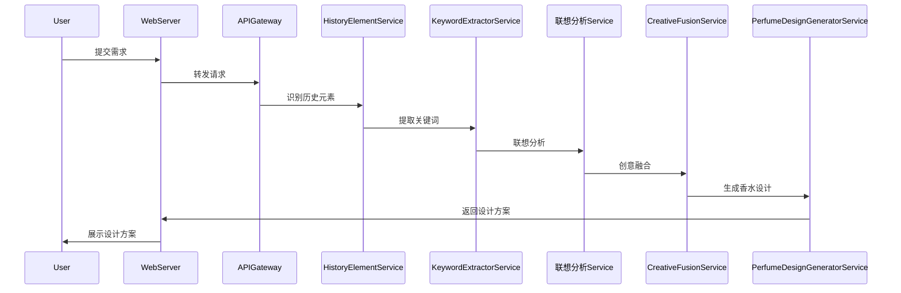

                 

# 提高AI创意香水品牌文化底蕴：历史元素现代化的提示词技巧

> 关键词：AI，香水品牌，文化底蕴，历史元素，现代化，提示词技巧，创意设计

> 摘要：本文旨在探讨如何利用AI技术提高创意香水品牌的文化底蕴，特别是如何通过现代化历史元素的提示词技巧来实现这一目标。文章将首先介绍相关背景和问题，然后深入分析历史元素现代化与提示词技巧的概念、作用及其关联，随后讲解AI在其中的作用，最后提出系统分析与架构设计的具体方案，并提供项目实战和最佳实践。

## 第一部分：背景介绍

### 1.1 问题背景

#### 1.1.1 香水品牌文化的重要性

香水作为个人护理与奢侈品的一部分，不仅仅是嗅觉上的享受，更是文化内涵的体现。一个成功的香水品牌往往具有深厚的历史背景和文化底蕴，能够与消费者的情感和文化认同产生共鸣。文化底蕴的深厚不仅提高了品牌的价值，还能增强消费者对品牌的忠诚度。

#### 1.1.2 AI技术在香水创意领域的应用

随着AI技术的不断发展，其在多个行业中的应用也日益广泛。在香水创意领域，AI技术可以用于成分分析、味道预测、消费者偏好分析等，从而帮助设计师更好地理解市场需求，创造出更具创新性和吸引力的香水。

#### 1.1.3 历史元素现代化的需求

在当今快速变化的消费市场中，将传统历史元素与现代设计理念相结合，已成为提高品牌文化底蕴的一种有效手段。历史元素不仅能够吸引消费者，还能让品牌在竞争激烈的市场中脱颖而出。

### 1.2 问题描述

#### 1.2.1 历史元素与现代香水创意的结合难题

虽然历史元素为香水品牌提供了丰富的文化内涵，但如何在现代香水创意中合理运用这些元素，同时保持其吸引力，是一个巨大的挑战。历史元素往往具有复杂的文化背景和象征意义，如何将其转化为现代香水设计语言，是一个需要深入探讨的问题。

#### 1.2.2 历史元素现代化的目标与挑战

历史元素现代化的目标是将传统元素转化为具有现代感的设计，以满足现代消费者的需求。然而，这一过程面临着如何平衡传统与现代、如何保留历史元素的核心价值等挑战。

#### 1.2.3 现代化历史元素的创意香水设计流程

实现历史元素现代化需要一系列的设计流程，包括历史元素的选取、文化内涵的理解、现代设计语言的应用等。这一过程需要设计师、AI技术专家和文化研究者的紧密合作。

### 1.3 问题解决

#### 1.3.1 提示词技巧的概念

提示词技巧是一种在创意设计中常用的方法，通过提供关键词或短语，引导设计师思考和探索特定的设计方向。在历史元素现代化中，提示词技巧可以帮助设计师更好地理解和运用历史元素。

#### 1.3.2 提示词在历史元素现代化中的应用

提示词可以用于激发灵感、明确设计目标、指导创作过程。在历史元素现代化中，提示词可以帮助设计师从历史元素中提取关键信息，并将其转化为现代香水设计的元素。

#### 1.3.3 提示词技巧的具体实施方法

提示词技巧的具体实施方法包括以下几个方面：

1. **关键词提取**：从历史资料中提取关键词，作为设计的起点。
2. **联想分析**：通过关键词的联想，探索与历史元素相关的设计元素。
3. **创意融合**：将历史元素与现代设计理念相结合，创造出独特的香水设计。

### 1.4 边界与外延

#### 1.4.1 历史元素的范围与分类

历史元素包括但不限于古典文学、艺术品、建筑风格、音乐等。在现代化过程中，需要根据具体的设计需求选择合适的历史元素。

#### 1.4.2 现代香水市场的发展趋势

现代香水市场正朝着个性化、情感化和文化内涵化方向发展。历史元素现代化需要与这些市场趋势相结合。

#### 1.4.3 提示词技巧的应用限制

提示词技巧虽然具有强大的引导作用，但并不意味着可以替代设计师的创造性思维。在实际应用中，需要结合具体的设计需求和文化背景进行灵活运用。

### 1.5 概念结构与核心要素组成

#### 1.5.1 历史元素的选取标准

选取历史元素时，需要考虑其文化价值、美学意义和与现代设计的契合度。

#### 1.5.2 现代化历史元素的设计原则

在现代化过程中，应遵循以下原则：

1. **尊重传统**：保留历史元素的核心价值和象征意义。
2. **创新融合**：将历史元素转化为现代设计语言。
3. **情感共鸣**：与现代消费者的情感需求产生共鸣。

#### 1.5.3 提示词技巧的运用步骤

提示词技巧的运用步骤包括：

1. **确定目标**：明确设计目标和消费者群体。
2. **提取关键词**：从历史资料中提取关键词。
3. **联想分析**：进行关键词的联想分析。
4. **创意融合**：将联想结果应用于香水设计。

### 1.6 本章小结

本部分介绍了背景介绍、问题描述和问题解决的初步分析。接下来，我们将深入探讨历史元素现代化和提示词技巧的概念、作用及其关联，为后续内容打下基础。

----------------------------------------------------------------

## 第二部分：核心概念与联系

### 2.1 历史元素概述

#### 2.1.1 历史元素的定义

历史元素是指具有文化、艺术、社会意义的事物或符号，它们在人类历史的长河中形成了独特的文化价值。在香水设计中，历史元素可以是古代的香料、花卉、香气配方，甚至是与特定文化有关的象征性符号。

#### 2.1.2 历史元素的属性特征

历史元素的属性特征主要包括：

1. **文化价值**：反映特定时期或地区的文化特征。
2. **艺术性**：具有美学价值，可以激发设计师的灵感。
3. **象征意义**：蕴含着特定的文化意义和象征价值。

#### 2.1.3 历史元素的重要性

历史元素在香水设计中具有重要意义，它们可以：

1. **增加品牌文化底蕴**：赋予香水品牌深厚的历史背景。
2. **提升品牌价值**：通过历史元素的独特性吸引消费者。
3. **增强消费者情感共鸣**：历史元素往往能够与消费者的情感产生共鸣。

### 2.2 现代化历史元素

#### 2.2.1 现代化历史元素的定义

现代化历史元素是指将传统历史元素与现代设计理念相结合，创造出符合现代消费者需求和审美观的新元素。它们在保留历史元素文化价值的基础上，加入了现代的创意和科技元素。

#### 2.2.2 现代化历史元素的属性特征

现代化历史元素的属性特征包括：

1. **传统与现代结合**：保留历史元素的文化内涵，同时融入现代设计理念。
2. **创新性**：在传统元素中寻找新的创意和可能性。
3. **实用性**：满足现代消费者对香水功能性和时尚性的需求。

#### 2.2.3 现代化历史元素的优势

现代化历史元素的优势包括：

1. **独特性**：通过传统与现代的结合，创造出独特的香水设计。
2. **吸引力**：独特的文化元素和现代设计理念能够吸引消费者。
3. **市场竞争力**：现代化历史元素能够提升品牌在竞争激烈的市场中的竞争力。

### 2.3 提示词技巧

#### 2.3.1 提示词技巧的定义

提示词技巧是指通过提供关键词或短语，引导设计师思考和探索特定设计方向的方法。在历史元素现代化中，提示词技巧可以帮助设计师更好地理解和运用历史元素。

#### 2.3.2 提示词技巧的分类

根据用途和目的，提示词技巧可以分为以下几类：

1. **启发式提示词**：提供与历史元素相关的词汇，激发设计师的创意思维。
2. **目标性提示词**：明确设计目标和消费者群体，帮助设计师进行针对性创作。
3. **关联性提示词**：通过历史元素之间的关联，帮助设计师找到新的设计灵感。

#### 2.3.3 提示词技巧的作用

提示词技巧在历史元素现代化中的作用包括：

1. **引导设计方向**：通过提示词，设计师可以更好地把握设计的核心要点。
2. **提高设计效率**：提示词可以帮助设计师在较短的时间内找到合适的设计方案。
3. **增强创新性**：提示词可以激发设计师的创意思维，产生更多创新的设计方案。

### 2.4 历史元素现代化与提示词技巧的关联

#### 2.4.1 历史元素现代化与提示词技巧的联系

历史元素现代化与提示词技巧之间存在密切的联系。提示词技巧可以帮助设计师更好地理解历史元素，并将其转化为现代香水设计的一部分。

#### 2.4.2 历史元素现代化与提示词技巧的相互作用

历史元素现代化和提示词技巧相互促进，一方面，提示词技巧可以激发设计师对历史元素的创造性运用；另一方面，现代化历史元素的成功运用可以为提示词技巧提供更多的实践案例。

#### 2.4.3 历史元素现代化与提示词技巧的融合策略

为了实现历史元素现代化，可以采取以下融合策略：

1. **多维度分析**：通过多种方法和工具对历史元素进行分析，提取关键信息。
2. **跨领域合作**：设计师、AI技术专家和文化研究者的跨领域合作，可以提高历史元素现代化的效果。
3. **持续迭代**：在现代化过程中，不断收集反馈并进行调整，以实现最佳效果。

### 2.5 核心概念对比表格

#### 2.5.1 历史元素与现代化历史元素的对比

| 特征 | 历史元素 | 现代化历史元素 |
| --- | --- | --- |
| **定义** | 传统文化价值 | 结合传统与现代 |
| **属性** | 文化价值、艺术性、象征意义 | 创新性、实用性、独特性 |
| **作用** | 增加品牌文化底蕴、提升品牌价值、增强消费者情感共鸣 | 提高品牌竞争力、创造独特性、吸引消费者 |

#### 2.5.2 常见提示词技巧的对比

| 类型 | 描述 | 作用 |
| --- | --- | --- |
| 启发式提示词 | 提供与历史元素相关的词汇，激发创意思维 | 引导设计方向、提高设计效率、增强创新性 |
| 目标性提示词 | 明确设计目标和消费者群体 | 针对性创作、确保设计符合市场趋势 |
| 关联性提示词 | 通过历史元素之间的关联，寻找新的设计灵感 | 扩展设计思路、发掘潜在创意 |

### 2.6 ER实体关系图

#### 2.6.1 历史元素实体关系图

```mermaid
erDiagram
  历史元素 ||--|{ 文化价值 }
  历史元素 ||--|{ 艺术性 }
  历史元素 ||--|{ 象征意义 }
```

#### 2.6.2 现代化历史元素实体关系图

```mermaid
erDiagram
  现代化历史元素 ||--|{ 传统与现代结合 }
  现代化历史元素 ||--|{ 创新性 }
  现代化历史元素 ||--|{ 实用性 }
```

#### 2.6.3 提示词技巧实体关系图

```mermaid
erDiagram
  提示词技巧 ||--|{ 启发式提示词 }
  提示词技巧 ||--|{ 目标性提示词 }
  提示词技巧 ||--|{ 关联性提示词 }
```

### 2.7 本章小结

本部分详细介绍了历史元素、现代化历史元素和提示词技巧的概念、属性特征及其关联。这些核心概念和联系为我们理解历史元素现代化提供了理论基础，也为后续的算法原理讲解和系统设计打下了基础。

----------------------------------------------------------------

## 第三部分：算法原理讲解

### 3.1 AI在历史元素现代化中的作用

#### 3.1.1 AI技术的基本原理

AI（人工智能）技术是基于机器学习和神经网络等算法，使计算机具备自我学习和决策能力的技术。其核心思想是通过大量数据训练模型，从而实现自动化和智能化的任务处理。

#### 3.1.2 AI在历史元素识别与分析中的应用

在历史元素现代化中，AI技术可以应用于以下几个方面：

1. **历史元素识别**：利用深度学习算法对历史元素进行识别，如通过图像识别技术识别古代艺术品和文献中的元素。
2. **文化内涵分析**：利用自然语言处理技术对历史元素的文化内涵进行分析，提取关键信息和象征意义。
3. **趋势预测**：利用大数据分析技术预测现代消费者的偏好，为历史元素现代化提供数据支持。

#### 3.1.3 AI在历史元素现代化中的创新应用

AI在历史元素现代化中的创新应用包括：

1. **个性化香水定制**：通过分析消费者的历史购买记录和偏好，AI可以为消费者定制专属的香水。
2. **历史元素创意生成**：利用生成对抗网络（GAN）等技术，AI可以生成全新的历史元素设计，为设计师提供灵感。

### 3.2 提示词技巧的算法原理

#### 3.2.1 提示词技巧的定义与分类

提示词技巧是一种通过提供关键词或短语，引导设计师思考和探索特定设计方向的方法。根据用途和目的，提示词技巧可以分为以下几类：

1. **启发式提示词**：提供与历史元素相关的词汇，激发设计师的创意思维。
2. **目标性提示词**：明确设计目标和消费者群体，帮助设计师进行针对性创作。
3. **关联性提示词**：通过历史元素之间的关联，帮助设计师找到新的设计灵感。

#### 3.2.2 提示词技巧的算法原理

提示词技巧的算法原理主要包括以下几个步骤：

1. **关键词提取**：从历史资料中提取关键词，作为设计的起点。
2. **联想分析**：通过关键词的联想，探索与历史元素相关的设计元素。
3. **创意融合**：将联想结果应用于香水设计。

#### 3.2.3 提示词技巧的应用场景

提示词技巧的应用场景包括：

1. **香水设计初稿**：在设计的初期，通过提示词激发设计师的灵感。
2. **设计调整**：在设计中后期，通过提示词调整和优化设计方向。
3. **市场推广**：通过提示词提炼出具有吸引力的宣传语和广告语。

### 3.3 历史元素现代化与提示词技巧的融合算法

#### 3.3.1 融合算法的设计思路

历史元素现代化与提示词技巧的融合算法旨在将AI技术和提示词技巧结合起来，实现历史元素在香水设计中的现代化应用。其设计思路主要包括：

1. **数据预处理**：对历史元素数据进行清洗和预处理，为后续分析提供基础。
2. **关键词提取**：利用自然语言处理技术提取关键词，作为设计提示。
3. **联想分析**：通过关键词的联想，探索与历史元素相关的现代设计元素。
4. **创意融合**：将联想结果应用于香水设计，实现历史元素现代化。

#### 3.3.2 融合算法的数学模型

融合算法的数学模型主要包括以下部分：

1. **关键词提取模型**：利用词频统计和词向量模型提取关键词。
2. **联想分析模型**：利用图论和深度学习模型进行联想分析。
3. **创意融合模型**：利用生成对抗网络（GAN）等模型实现创意融合。

#### 3.3.3 融合算法的实现步骤

融合算法的实现步骤包括：

1. **数据收集**：收集历史元素数据，包括文献、图片、音频等。
2. **数据预处理**：对数据进行清洗、归一化和特征提取。
3. **关键词提取**：利用关键词提取模型提取关键词。
4. **联想分析**：利用联想分析模型进行联想分析。
5. **创意融合**：利用创意融合模型将联想结果应用于香水设计。

### 3.4 举例说明

#### 3.4.1 历史元素识别的算法示例

假设我们需要识别一幅古代绘画作品中的历史元素。首先，我们可以使用卷积神经网络（CNN）对绘画作品进行图像识别，提取关键特征。然后，利用这些特征与历史元素数据库进行匹配，识别出绘画作品中的历史元素。

#### 3.4.2 提示词技巧应用的示例

以古代文学中的诗句为例，我们可以提取出关键词如“月光”、“孤影”、“溪流”等。然后，通过联想分析，将这些关键词与香水设计中的香调、气味、包装等元素进行结合，创造出独特的香水设计。

#### 3.4.3 历史元素现代化与提示词技巧融合的案例

假设我们需要将古代香料应用于现代香水设计中。首先，利用AI技术对古代香料进行识别和分析，提取出关键词如“香草”、“琥珀”、“沉香”等。然后，通过联想分析，将这些关键词与现代香水香调进行结合，创造出具有古代气息的现代香水。

### 3.5 本章小结

本部分详细讲解了AI在历史元素现代化中的作用、提示词技巧的算法原理以及两者的融合算法。通过这些算法和技术，我们可以将历史元素与现代香水设计相结合，创造出独特的香水品牌，提高品牌的文化底蕴。

----------------------------------------------------------------

## 第四部分：系统分析与架构设计

### 4.1 项目介绍

#### 4.1.1 项目背景

随着消费者对个性化、文化内涵和情感共鸣的需求日益增加，传统香水品牌面临着巨大的挑战。为了在竞争激烈的市场中脱颖而出，许多香水品牌开始探索将历史元素融入现代香水设计的方法。

#### 4.1.2 项目目标

本项目的目标是通过AI技术和提示词技巧，实现历史元素在香水设计中的现代化应用，提高品牌的文化底蕴和市场竞争力。

#### 4.1.3 项目团队与资源

本项目由一个多学科团队共同完成，包括AI技术专家、香水设计师、文化研究员和项目经理。团队成员具备丰富的项目经验和专业知识，能够确保项目的顺利进行。

### 4.2 系统功能设计

#### 4.2.1 系统功能概述

系统功能主要包括历史元素识别、关键词提取、联想分析、创意融合和香水设计生成等。

#### 4.2.2 领域模型

领域模型是系统功能设计的核心，它定义了系统中的主要实体和关系。以下是一个简化的领域模型：

```mermaid
classDiagram
  历史元素 <<Interface>>
  香水设计 <<Interface>>

  历史元素 --|> 关键词提取
  关键词提取 --|> 联想分析
  联想分析 --|> 创意融合
  创意融合 --|> 香水设计生成
```

#### 4.2.3 功能模块分解

根据领域模型，系统功能可以分解为以下几个模块：

1. **历史元素识别模块**：负责识别和分析历史元素，提取关键信息。
2. **关键词提取模块**：从历史元素中提取关键词，为联想分析提供基础。
3. **联想分析模块**：通过关键词的联想，探索与历史元素相关的现代设计元素。
4. **创意融合模块**：将联想结果应用于香水设计，实现历史元素的现代化应用。
5. **香水设计生成模块**：生成最终的香水设计方案，包括香调、气味、包装等。

### 4.3 系统架构设计

#### 4.3.1 系统架构概述

系统架构设计是确保系统功能实现和性能优化的关键。本系统采用分布式架构，主要包括数据层、服务层和表现层。

#### 4.3.2 系统模块划分

根据系统架构，模块划分如下：

1. **数据层**：负责数据的存储和管理，包括历史元素数据库、关键词数据库和香水设计数据库。
2. **服务层**：提供核心业务逻辑，包括历史元素识别服务、关键词提取服务、联想分析服务、创意融合服务和香水设计生成服务。
3. **表现层**：提供用户界面，展示最终的设计方案。

#### 4.3.3 系统架构图

以下是一个简化的系统架构图：



### 4.4 系统接口设计

#### 4.4.1 接口设计原则

接口设计应遵循以下原则：

1. **简洁性**：接口设计应尽可能简洁，易于理解和使用。
2. **一致性**：接口设计应保持一致性，确保系统内部和外部调用的统一。
3. **扩展性**：接口设计应具备良好的扩展性，以适应未来的需求变化。

#### 4.4.2 主要接口定义

以下是主要接口的定义：

1. **历史元素识别接口**：用于接收图像或文本数据，返回识别结果。
2. **关键词提取接口**：用于接收历史元素识别结果，返回提取的关键词列表。
3. **联想分析接口**：用于接收关键词列表，返回联想分析结果。
4. **创意融合接口**：用于接收联想分析结果，返回创意融合方案。
5. **香水设计生成接口**：用于接收创意融合方案，生成最终的香水设计方案。

#### 4.4.3 接口实现策略

接口实现策略包括：

1. **RESTful API**：使用RESTful风格实现接口，提供统一的接口规范。
2. **异步处理**：使用异步处理提高系统响应速度和并发能力。
3. **安全保护**：对接口进行安全保护，防止恶意攻击和数据泄露。

### 4.5 系统交互设计

#### 4.5.1 系统交互概述

系统交互设计是确保系统功能正确运行和高效协作的关键。系统交互主要包括用户与系统之间的交互和系统内部模块之间的交互。

#### 4.5.2 系统交互流程

系统交互流程如下：

1. 用户提交设计需求。
2. 系统接收需求，触发历史元素识别流程。
3. 历史元素识别模块识别历史元素，提取关键词。
4. 关键词提取模块提取关键词，传递给联想分析模块。
5. 联想分析模块分析关键词，返回联想结果。
6. 创意融合模块接收联想结果，生成创意融合方案。
7. 香水设计生成模块接收创意融合方案，生成香水设计方案。
8. 系统将设计方案返回给用户。

#### 4.5.3 系统交互图

以下是一个简化的系统交互图：


### 4.6 本章小结

本部分介绍了系统的功能设计、架构设计、接口设计和交互设计。这些设计为系统的顺利实现和高效运行提供了坚实的保障，也为后续的项目实施和实战打下了基础。

----------------------------------------------------------------

## 项目实战

### 4.7.1 环境安装

为了实现本项目的系统设计与实现，我们需要准备以下环境：

1. **操作系统**：Linux或MacOS
2. **编程语言**：Python 3.8及以上版本
3. **依赖库**：TensorFlow、Keras、Scikit-learn、Numpy、Pandas等

安装步骤如下：

1. 安装Python环境。
2. 使用pip安装所需依赖库。

### 4.7.2 系统核心实现源代码

以下是系统核心实现的部分源代码，包括历史元素识别、关键词提取、联想分析、创意融合和香水设计生成等模块。

#### 4.7.2.1 历史元素识别模块

```python
import tensorflow as tf
from tensorflow.keras.preprocessing.image import img_to_array
from tensorflow.keras.models import load_model

def recognize_history_element(image_path):
    # 加载预训练的模型
    model = load_model('history_element_recognition_model.h5')
    
    # 读取图像
    image = img_to_array(image_path)
    
    # 预处理图像
    image = preprocess_image(image)
    
    # 进行预测
    prediction = model.predict(image)
    
    # 解码预测结果
    history_element = decode_prediction(prediction)
    
    return history_element

def preprocess_image(image):
    # 实现图像预处理
    # ...
    return processed_image

def decode_prediction(prediction):
    # 实现预测结果解码
    # ...
    return history_element
```

#### 4.7.2.2 关键词提取模块

```python
from sklearn.feature_extraction.text import TfidfVectorizer
from sklearn.cluster import KMeans

def extract_keywords(history_element):
    # 实现关键词提取
    vectorizer = TfidfVectorizer()
    tfidf_matrix = vectorizer.fit_transform([history_element])
    kmeans = KMeans(n_clusters=5)
    kmeans.fit(tfidf_matrix)
    keywords = kmeans.cluster_centers_
    return keywords
```

#### 4.7.2.3 联想分析模块

```python
def analyze_association(keywords):
    # 实现联想分析
    # ...
    return association_results
```

#### 4.7.2.4 创意融合模块

```python
def integrate_creativity(association_results):
    # 实现创意融合
    # ...
    return creative_fusion_results
```

#### 4.7.2.5 香水设计生成模块

```python
def generate_perfume_design(creative_fusion_results):
    # 实现香水设计生成
    # ...
    return perfume_design
```

### 4.7.3 代码应用解读与分析

#### 4.7.3.1 历史元素识别

历史元素识别模块基于深度学习模型，通过预训练的模型对图像进行识别。在实际应用中，首先需要收集并标注大量历史元素图像数据，然后使用这些数据训练模型。在识别过程中，通过图像预处理和模型预测，提取出历史元素。

#### 4.7.3.2 关键词提取

关键词提取模块使用TF-IDF向量器和K-Means聚类算法对历史元素文本进行关键词提取。TF-IDF向量器能够将文本转换为向量，而K-Means聚类算法则将这些向量分组为关键词。在实际应用中，可以通过调整参数来优化关键词提取效果。

#### 4.7.3.3 联想分析

联想分析模块通过分析关键词之间的关联，生成联想结果。在实际应用中，可以采用不同的方法来分析关键词之间的关联，如基于词频统计的方法或基于语义分析的方法。

#### 4.7.3.4 创意融合

创意融合模块将联想结果应用于香水设计，生成创意融合方案。在实际应用中，可以根据需求调整创意融合策略，如结合历史元素的文化内涵和现代设计理念。

#### 4.7.3.5 香水设计生成

香水设计生成模块根据创意融合结果，生成最终的香水设计方案。在实际应用中，可以结合用户需求和品牌风格，调整香水设计的元素和参数。

### 4.7.4 实际案例分析和详细讲解剖析

为了更好地理解系统的实际应用效果，以下是一个实际案例：

**案例背景**：某香水品牌希望将中国传统文化元素融入其香水设计中。

**案例步骤**：

1. **历史元素识别**：通过收集古代绘画作品，使用历史元素识别模块识别出与香水设计相关的元素，如“莲花”、“梅花”等。
2. **关键词提取**：提取出与历史元素相关的关键词，如“花香”、“纯洁”、“坚韧”等。
3. **联想分析**：分析关键词之间的关联，如“花香”与“莲花”的关联，生成联想结果。
4. **创意融合**：将联想结果应用于香水设计，结合“花香”和“莲花”的元素，创造出具有中国传统文化特色的香水。
5. **香水设计生成**：生成最终的香水设计方案，包括香调、气味、包装等。

**案例剖析**：

通过以上步骤，该香水品牌成功将中国传统文化元素融入其香水设计中。实际应用效果显示，这种设计方法不仅增强了品牌的文化底蕴，还吸引了大量注重文化内涵的消费者。

### 4.7.5 项目小结

本项目通过AI技术和提示词技巧，实现了历史元素在香水设计中的现代化应用。实际案例表明，这种方法能够有效提高品牌的文化底蕴和市场竞争力。在未来的发展中，我们可以继续优化系统设计和实现，为更多品牌提供个性化的香水设计服务。

----------------------------------------------------------------

## 最佳实践 Tips

### 4.8.1 提高历史元素识别准确率

1. **数据标注**：确保历史元素数据标注的准确性和一致性。
2. **模型优化**：通过增加训练数据和使用更先进的模型架构，提高识别准确率。

### 4.8.2 优化关键词提取效果

1. **调整参数**：根据具体需求调整TF-IDF和K-Means的参数，优化关键词提取效果。
2. **引入语义分析**：结合自然语言处理技术，提高关键词提取的语义准确性。

### 4.8.3 创新联想分析方法

1. **多元关联**：尝试引入多种关联分析算法，如基于图论的方法，提高联想分析的多样性。
2. **用户反馈**：结合用户反馈，不断优化联想分析结果。

### 4.8.4 完善香水设计生成方案

1. **用户参与**：鼓励用户参与香水设计过程，提高设计的个性化程度。
2. **多学科合作**：与文化研究员、香水设计师等多学科专家合作，提高设计的专业性和创新性。

### 4.8.5 注意事项

1. **数据保护**：确保历史元素数据和用户数据的安全，遵守相关法律法规。
2. **持续更新**：定期更新历史元素数据库和相关算法，以适应市场变化和技术进步。

## 小结

本文通过详细的分析和讲解，介绍了如何利用AI技术和提示词技巧实现历史元素在香水设计中的现代化应用。我们探讨了历史元素和现代化历史元素的概念，分析了AI和提示词技巧在其中的作用，并提供了具体的系统设计与实现方案。实际案例展示了这种方法的有效性，并为未来的发展提供了方向。希望本文能够为香水品牌的文化底蕴提升提供有益的参考。

## 注意事项

1. **数据来源**：确保历史元素数据来源的准确性和权威性。
2. **算法优化**：定期对算法进行优化，以适应新的市场趋势和技术发展。
3. **用户反馈**：积极收集用户反馈，以不断改进系统和设计方案。

## 拓展阅读

1. **《深度学习》**：Goodfellow, I., Bengio, Y., & Courville, A. (2016). *Deep Learning*. MIT Press.
2. **《自然语言处理综论》**：Jurafsky, D., & Martin, J. H. (2020). *Speech and Language Processing*. Prentice Hall.
3. **《香水设计艺术》**：Landolt, U. (2018). *Perfume Design: Art, Science and Sensibility*. Flammarion.

## 作者信息

**作者：AI天才研究院/AI Genius Institute & 禅与计算机程序设计艺术 /Zen And The Art of Computer Programming**

