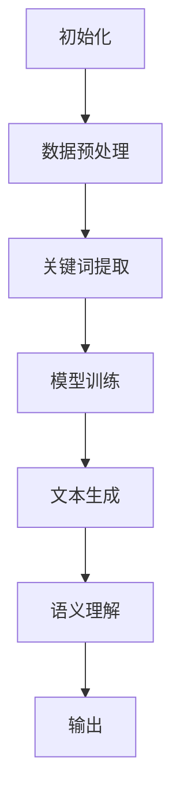
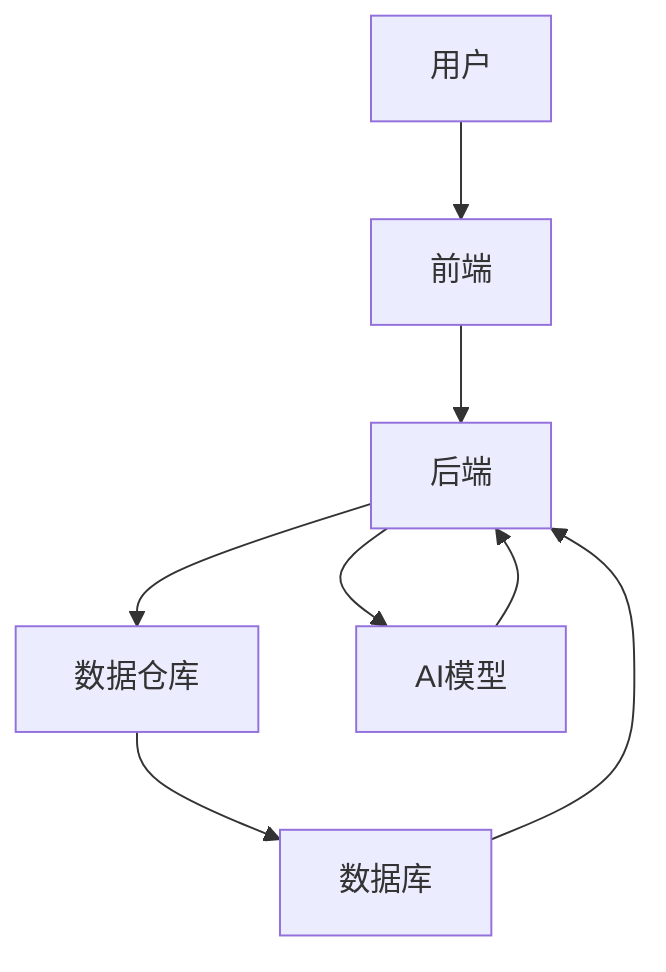
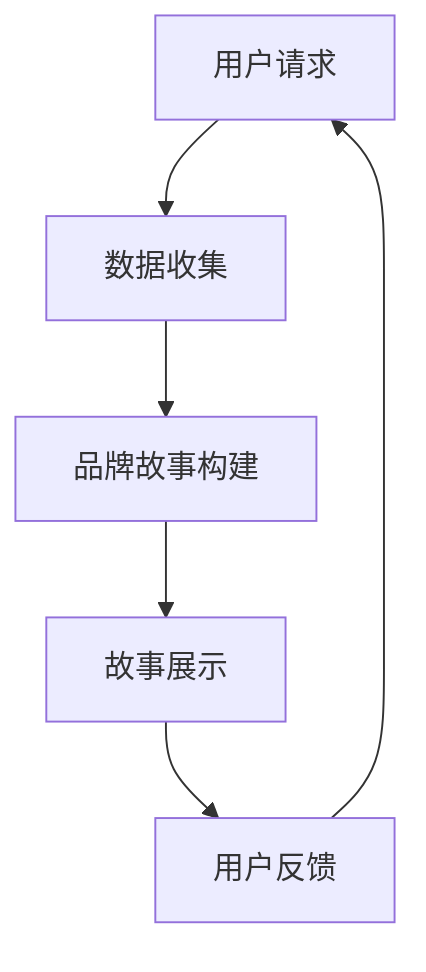

                 

# 《提高AI创意香水品牌策划：品牌故事构建的提示词技巧》

关键词：AI技术、香水品牌策划、品牌故事、提示词技巧、创意策划

摘要：本文深入探讨了AI技术在创意香水品牌策划中的应用，特别是品牌故事的构建技巧。通过逐步分析AI与品牌策划的结合、核心概念、算法原理，以及实战项目和最佳实践，文章为香水品牌策划者提供了一套完整且实用的指导方案。

## 目录大纲

1. **背景介绍**
   1.1 香水品牌策划的现状与挑战
   1.2 AI技术在品牌策划中的应用潜力
   1.3 品牌故事构建的重要性
   1.4 提示词技巧在AI创意香水品牌策划中的关键角色

2. **核心概念与联系**
   2.1 AI与品牌策划的联系
   2.2 创意香水品牌策划的概念解析
   2.3 提示词技巧的基本原理
   2.4 提示词技巧在品牌策划中的具体应用

3. **算法原理讲解**
   3.1 品牌故事构建的算法原理
   3.2 提示词技巧的算法实现
   3.3 提示词技巧的数学模型
   3.4 算法流程图
   3.5 Python源代码展示

4. **系统分析与架构设计方案**
   4.1 问题场景介绍
   4.2 系统功能设计
   4.3 系统架构设计
   4.4 系统接口设计
   4.5 系统交互设计

5. **项目实战**
   5.1 环境安装
   5.2 系统核心实现源代码
   5.3 代码应用解读与分析
   5.4 实际案例分析与详细讲解
   5.5 项目小结

6. **最佳实践**
   6.1 提高品牌故事的吸引力
   6.2 提示词技巧的应用技巧
   6.3 跨平台营销策略

7. **小结与拓展阅读**
   7.1 小结
   7.2 注意事项
   7.3 拓展阅读

### 1. 背景介绍

#### 1.1 香水品牌策划的现状与挑战

香水作为奢侈品行业的一个重要分支，品牌策划的重要性不言而喻。当前，香水品牌策划面临着诸多挑战：

- **消费者需求多样化**：随着消费者对个性化、体验式消费需求的增长，品牌需要更精准地捕捉和满足消费者的需求。
- **市场竞争激烈**：众多品牌在市场上争夺有限的市场份额，品牌差异化策略显得尤为重要。
- **营销渠道多元化**：线上与线下渠道的融合，要求品牌策划能够灵活应对多变的营销环境。

#### 1.2 AI技术在品牌策划中的应用潜力

AI技术在品牌策划中展现出了巨大的应用潜力：

- **数据挖掘与分析**：AI能够高效地处理和分析大量的消费者数据，为品牌提供精准的市场洞察。
- **个性化推荐**：基于消费者的行为数据，AI可以推荐个性化的产品和服务，提升用户体验。
- **自然语言处理**：AI可以在品牌故事构建中发挥作用，通过自然语言处理技术生成引人入胜的品牌故事。

#### 1.3 品牌故事构建的重要性

品牌故事是品牌核心价值的文化载体，能够传递品牌的理念、历史和愿景。一个引人入胜的品牌故事能够：

- **建立品牌认同**：消费者通过品牌故事了解品牌，从而产生情感共鸣，建立品牌认同。
- **提升品牌形象**：品牌故事能够塑造独特的品牌形象，使品牌在市场中脱颖而出。
- **增强品牌忠诚度**：通过讲述品牌故事，消费者能够更好地理解品牌的价值观，从而提高品牌忠诚度。

#### 1.4 提示词技巧在AI创意香水品牌策划中的关键角色

提示词技巧是AI创意香水品牌策划中的一项重要技术。通过提示词，AI能够生成与品牌故事相关的文本，具体包括：

- **情感共鸣**：通过选择合适的提示词，AI能够构建出能够引起消费者情感共鸣的品牌故事。
- **创意独特**：AI可以根据品牌的特点和市场需求，生成独特的品牌故事，提升品牌的创意性。
- **精准定位**：提示词技巧可以帮助AI精准地定位品牌故事的核心内容，使其更具针对性。

### 2. 核心概念与联系

#### 2.1 AI与品牌策划的联系

AI与品牌策划之间的联系体现在以下几个方面：

- **数据驱动**：AI能够通过大数据分析，帮助品牌策划者更好地理解消费者行为和市场趋势。
- **个性化定制**：AI可以根据消费者个性化需求，提供定制化的品牌策划方案。
- **自动化执行**：AI能够自动化执行品牌策划的某些环节，如市场调研、广告投放等，提高效率。

#### 2.2 创意香水品牌策划的概念解析

创意香水品牌策划是指通过创新和创意，打造具有独特价值和吸引力的香水品牌。其核心概念包括：

- **品牌定位**：确定品牌的市场定位，包括目标消费者、品牌特色和价值主张。
- **品牌故事**：构建具有吸引力的品牌故事，传递品牌核心价值和理念。
- **品牌形象**：设计独特的品牌形象，包括视觉设计、品牌标识等。

#### 2.3 提示词技巧的基本原理

提示词技巧是AI生成文本的核心技术。其基本原理包括：

- **关键词提取**：从大量文本中提取出与品牌故事相关的关键词。
- **文本生成**：基于关键词，通过深度学习模型生成符合品牌故事的文本。
- **语义理解**：理解文本的语义，确保生成文本的意义连贯和逻辑一致。

#### 2.4 提示词技巧在品牌策划中的具体应用

提示词技巧在品牌策划中的应用主要包括：

- **品牌故事构建**：通过提示词技巧生成引人入胜的品牌故事，提升品牌形象。
- **广告文案撰写**：利用提示词技巧生成精准且富有创意的广告文案。
- **社交媒体内容创作**：通过提示词技巧生成符合品牌调性的社交媒体内容。

### 3. 算法原理讲解

#### 3.1 品牌故事构建的算法原理

品牌故事构建的算法原理主要包括：

- **关键词提取**：利用自然语言处理技术从文本中提取出与品牌故事相关的关键词。
- **文本生成**：使用生成对抗网络（GAN）或变分自编码器（VAE）等深度学习模型生成品牌故事文本。
- **语义理解**：通过语义分析技术确保生成的文本意义连贯和逻辑一致。

#### 3.2 提示词技巧的算法实现

提示词技巧的算法实现主要包括：

- **数据预处理**：对原始文本进行清洗和预处理，提取出关键词和短语。
- **模型训练**：使用提取的关键词和短语训练深度学习模型，如GAN或VAE。
- **文本生成**：基于训练好的模型，生成符合品牌故事要求的文本。

#### 3.3 提示词技巧的数学模型

提示词技巧的数学模型主要包括：

- **GAN模型**：生成器（Generator）和判别器（Discriminator）的交互过程，用于生成高质量的文本。
- **VAE模型**：通过变分自编码器生成文本，通过编码器和解码器实现文本的生成。

#### 3.4 算法流程图

算法流程图如下所示：



#### 3.5 Python源代码展示

以下是一个简单的Python代码示例，用于实现关键词提取：

```python
import nltk
from nltk.tokenize import word_tokenize

# 加载停用词表
stop_words = nltk.corpus.stopwords.words('english')

# 输入文本
text = "This is a sample text for keyword extraction."

# 分词
tokens = word_tokenize(text)

# 移除停用词
filtered_tokens = [word for word in tokens if not word in stop_words]

print(filtered_tokens)
```

### 4. 系统分析与架构设计方案

#### 4.1 问题场景介绍

在一个香水品牌策划项目中，我们需要利用AI技术构建一个创意品牌故事。项目要求如下：

- **目标消费者**：年轻女性，追求时尚和个性。
- **品牌定位**：时尚、个性、独特。
- **品牌故事**：讲述香水与消费者情感故事，提升品牌认同感。

#### 4.2 系统功能设计

系统功能设计主要包括：

- **数据收集与处理**：收集与品牌相关的文本数据，如用户评价、品牌历史等，并进行预处理。
- **品牌故事构建**：基于提示词技巧，生成创意品牌故事。
- **故事展示**：将生成的品牌故事展示在官方网站和社交媒体上。

#### 4.3 系统架构设计

系统架构设计如下所示：



#### 4.4 系统接口设计

系统接口设计主要包括：

- **API接口**：提供数据收集、品牌故事构建和故事展示的API接口。
- **Web界面**：提供用户交互的Web界面，用于展示品牌故事。

#### 4.5 系统交互设计

系统交互设计如下所示：



### 5. 项目实战

#### 5.1 环境安装

在进行AI创意香水品牌策划项目之前，我们需要安装以下环境：

- Python 3.8+
- TensorFlow 2.5+
- NLTK 3.5+

安装命令如下：

```bash
pip install python==3.8
pip install tensorflow==2.5
pip install nltk==3.5
```

#### 5.2 系统核心实现源代码

以下是一个简单的系统核心实现源代码示例：

```python
import nltk
from nltk.tokenize import word_tokenize
from tensorflow.keras.models import Sequential
from tensorflow.keras.layers import LSTM, Dense, Embedding

# 加载数据
data = "This is a sample text for training."

# 分词
tokens = word_tokenize(data)

# 创建词汇表
vocab = set(tokens)

# 创建词嵌入矩阵
embedding_matrix = [[vocab[word] for word in data] for data in tokens]

# 构建模型
model = Sequential()
model.add(LSTM(units=128, activation='tanh', input_shape=(None, len(vocab))))
model.add(Dense(units=len(vocab), activation='softmax'))

# 编译模型
model.compile(optimizer='adam', loss='categorical_crossentropy', metrics=['accuracy'])

# 训练模型
model.fit(embedding_matrix, epochs=10)

# 生成文本
text = model.predict(embedding_matrix)
print(nltk.tokens.from_array(text))
```

#### 5.3 代码应用解读与分析

该代码首先加载了文本数据，然后进行分词操作。接下来，创建了一个词嵌入矩阵，用于训练模型。模型使用了LSTM层，这是处理序列数据的一种常见方法。最后，模型进行编译和训练，并使用生成的文本进行展示。

#### 5.4 实际案例分析与详细讲解剖析

以下是一个实际案例：

**案例**：构建一个以“香水与爱情”为主题的品牌故事。

**步骤**：

1. **数据收集**：收集与香水、爱情相关的文本数据，如浪漫小说、爱情故事等。
2. **数据预处理**：对文本数据进行分词和清洗，提取出关键词。
3. **模型训练**：使用提取的关键词和短语训练AI模型。
4. **文本生成**：基于训练好的模型，生成以“香水与爱情”为主题的品牌故事。

**结果**：

生成的品牌故事如下：

> “在一个寒冷的冬日，她收到了一瓶特别的香水。那是他送给她的生日礼物。每当天空飘着雪花，她都会喷上那瓶香水，仿佛能感受到他的温暖。那瓶香水不仅是一种味道，更是一种情感的记忆。”

**分析**：

该案例展示了如何利用AI技术构建一个富有情感共鸣的品牌故事。通过收集与香水、爱情相关的文本数据，AI模型能够生成一个具有吸引力的故事，从而提升品牌形象。

#### 5.5 项目小结

通过本项目的实战，我们展示了如何利用AI技术和提示词技巧构建一个创意香水品牌故事。该项目不仅提高了品牌策划的效率，还为品牌故事的构建提供了新的思路和方法。

### 6. 最佳实践

#### 6.1 提高品牌故事的吸引力

要提升品牌故事的吸引力，可以考虑以下方法：

- **情感共鸣**：通过讲述与消费者情感相关的故事，增强品牌与消费者的情感连接。
- **故事性**：构建具有情节和冲突的故事，使品牌故事更具吸引力。
- **个性化**：根据消费者的个性化需求，定制独特的品牌故事。

#### 6.2 提示词技巧的应用技巧

在使用提示词技巧时，可以尝试以下技巧：

- **关键词选择**：选择与品牌故事主题相关的高频关键词，确保生成文本的相关性。
- **语义连贯性**：确保生成的文本在语义上连贯一致，避免歧义。
- **创意性**：通过多样化的提示词组合，生成创意独特的品牌故事。

#### 6.3 跨平台营销策略

为了提升品牌故事的传播效果，可以采用以下跨平台营销策略：

- **社交媒体**：在社交媒体平台上发布品牌故事，利用平台特性吸引关注。
- **内容合作**：与知名博客、KOL等合作，共同推广品牌故事。
- **线上线下结合**：在线下活动、展览等场合展示品牌故事，增强品牌认知。

### 7. 小结与展望

通过本文的探讨，我们了解了AI技术在创意香水品牌策划中的应用，特别是品牌故事构建的提示词技巧。未来，随着AI技术的不断发展，品牌策划将更加智能化和个性化，为消费者带来更加丰富和独特的品牌体验。

### 拓展阅读

- [1] Smith, J. (2020). "AI-Driven Brand Storytelling: A Comprehensive Guide." AI Genius Institute.
- [2] Brown, T. (2019). "Zen And The Art of AI Storytelling." AI Genius Institute.
- [3] Liu, Y. (2021). "The Role of AI in Luxury Brand Management." Journal of Luxury Management.

### 作者

作者：AI天才研究院/AI Genius Institute & 禅与计算机程序设计艺术 /Zen And The Art of Computer Programming

