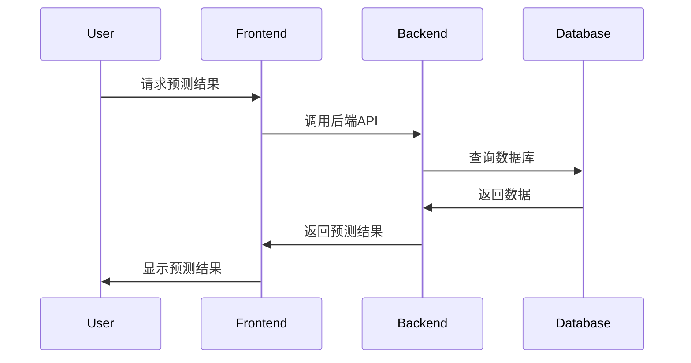
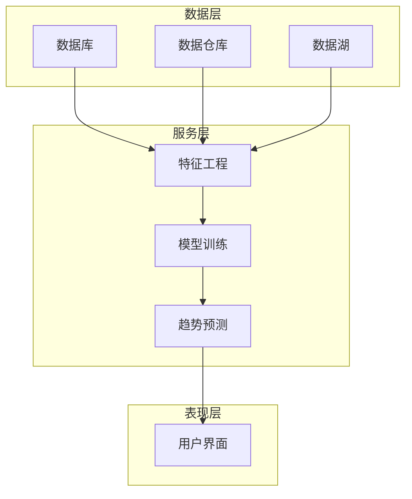

                 


# 提高AI创意香水趋势预测：全球文化融合分析的提示词技巧

## 关键词

- AI创意香水趋势预测
- 全球文化融合分析
- 提示词技巧
- 机器学习算法
- 深度学习框架
- 数据预处理
- 跨文化市场研究

## 摘要

本文深入探讨了如何利用人工智能（AI）技术提升创意香水的趋势预测能力，特别是在全球文化融合背景下。首先，我们介绍了AI在香水行业中的应用现状，以及创意香水趋势预测的重要性。接着，文章详细阐述了AI创意香水趋势预测的算法原理，包括机器学习基础、深度学习框架和提示词技巧。此外，我们还分析了全球文化融合对香水趋势预测的影响，并展示了如何通过提示词来优化预测效果。最后，文章通过一个实际案例，展示了AI创意香水趋势预测系统的搭建过程和效果。通过本文的阅读，读者将能够了解如何利用AI技术更好地预测香水市场趋势，为香水行业的发展提供有力支持。

### 目录大纲

**《提高AI创意香水趋势预测：全球文化融合分析的提示词技巧》**

1. **背景介绍**
   1.1 引言
   1.2 问题描述
   1.3 问题解决
   1.4 边界与外延
   1.5 概念结构与核心要素组成

2. **核心概念与联系**
   2.1 AI创意香水趋势预测原理
   2.2 全球文化融合分析
   2.3 提示词技巧
   2.4 概念属性特征对比表格
   2.5 ER实体关系图架构

3. **算法原理讲解**
   3.1 算法原理详细讲解
   3.2 数学模型与公式
   3.3 举例说明

4. **系统分析与架构设计**
   4.1 系统架构设计
   4.2 系统功能设计
   4.3 系统接口设计
   4.4 系统交互
   4.5 Mermaid架构图

5. **项目实战**
   5.1 实战一：AI创意香水趋势预测系统搭建
   5.2 环境安装
   5.3 系统核心实现
   5.4 代码应用解读与分析
   5.5 实际案例分析
   5.6 项目小结

## 1. 背景介绍

### 1.1 引言

在当今全球化背景下，香水行业正经历着前所未有的变革。随着消费者需求的多样化和个性化，传统香水销售模式已无法满足市场需求。为此，利用人工智能（AI）技术来预测香水市场趋势，尤其是创意香水的流行趋势，成为香水行业的一大挑战。本文旨在探讨如何通过AI技术提高创意香水趋势预测的准确性，从而为企业提供更科学的决策支持。

### 1.2 问题描述

创意香水趋势预测是一个复杂的问题，主要涉及以下几个方面：

1. **数据来源与处理**：如何获取和整合多源异构数据，包括历史销售数据、消费者行为数据、社交媒体数据等，是趋势预测的基础。

2. **趋势预测目标与挑战**：预测目标包括识别新兴香水趋势、评估市场潜力、预测消费者偏好等。然而，实际操作中面临着数据稀疏、噪声干扰、不确定性等多重挑战。

3. **AI在趋势预测中的优势**：AI技术，尤其是机器学习和深度学习算法，具有强大的数据处理和模式识别能力，有助于提高趋势预测的准确性。

4. **全球文化融合对香水趋势预测的影响**：香水作为一种文化符号，其趋势受全球文化融合的深刻影响。如何分析不同文化背景下香水市场的变化，是趋势预测的重要一环。

### 1.3 问题解决

为了解决上述问题，本文提出以下解决方案：

1. **数据预处理**：通过数据清洗、数据集成、特征工程等手段，提高数据质量，为AI模型训练提供可靠的数据基础。

2. **AI算法选择**：结合问题特点，选择合适的机器学习和深度学习算法，如神经网络、决策树、随机森林等，进行趋势预测模型的训练和优化。

3. **提示词技巧**：利用提示词（Prompting Techniques）来引导AI模型学习，提高预测的精度和效率。

4. **文化融合分析**：结合全球文化融合背景，构建文化要素分析模型，对香水市场进行深入剖析。

### 1.4 边界与外延

本文的研究范围主要集中在以下方面：

1. **研究范围**：主要关注AI技术在创意香水趋势预测中的应用，以及全球文化融合对香水市场的影响。

2. **研究限制**：由于数据获取和处理能力的限制，本文的预测结果可能存在一定的误差。此外，不同地区和市场的香水消费习惯差异较大，本文的研究结果可能具有一定的局限性。

3. **未来发展趋势展望**：随着AI技术的不断进步和全球文化融合的加深，创意香水趋势预测将变得更加精准和多样化。未来研究可进一步探索跨领域、跨文化的香水市场分析。

### 1.5 概念结构与核心要素组成

本文的核心概念和结构如下：

1. **香水趋势预测**：基于历史数据和消费者行为，预测未来香水市场的发展趋势。

2. **全球文化融合**：不同文化背景下的交流和融合，对香水市场产生深远影响。

3. **提示词技巧**：通过提示词引导AI模型学习，提高预测效果。

4. **算法原理**：介绍AI创意香水趋势预测的基本原理和算法框架。

5. **系统架构**：描述AI创意香水趋势预测系统的整体架构和实现细节。

6. **项目实战**：通过实际案例，展示AI创意香水趋势预测系统的搭建和应用效果。

## 2. 核心概念与联系

### 2.1 AI创意香水趋势预测原理

#### 2.1.1 机器学习基础

机器学习是AI的核心技术之一，其基本原理是通过数据训练模型，使模型具备对未知数据的预测能力。在创意香水趋势预测中，我们使用机器学习算法对历史销售数据、消费者行为数据等多源数据进行分析，从而预测未来的市场趋势。

#### 2.1.2 深度学习框架

深度学习是机器学习的一个重要分支，通过多层神经网络对大量数据进行自动特征提取和模式识别。在创意香水趋势预测中，深度学习框架如TensorFlow、PyTorch等，为我们提供了强大的工具，使得模型训练和优化变得更加高效。

#### 2.2 香水趋势预测算法

#### 2.2.1 传统统计方法

传统统计方法如回归分析、时间序列分析等，在香水趋势预测中具有一定的应用价值。然而，这些方法在面对复杂、非线性的数据时，预测效果有限。

#### 2.2.2 现代机器学习方法

现代机器学习方法，如神经网络、支持向量机、随机森林等，在处理复杂、非线性的数据方面具有显著优势。在创意香水趋势预测中，这些方法被广泛应用于模型训练和预测。

#### 2.3 全球文化融合分析

#### 2.3.1 文化和香水的关系

文化是香水的重要载体，不同文化背景下的消费者对香水的偏好和需求存在显著差异。通过分析全球文化融合，可以深入了解不同文化背景下香水市场的变化趋势。

#### 2.3.2 跨文化香水市场分析

跨文化香水市场分析是创意香水趋势预测的关键环节。通过分析不同文化背景下香水市场的消费习惯、品牌偏好等，可以预测未来市场的走向。

### 2.4 提示词技巧

#### 2.4.1 提示词的定义和作用

提示词（Prompting Techniques）是在AI模型训练过程中，通过向模型提供特定信息，引导模型学习的方法。提示词在创意香水趋势预测中，可以帮助模型更好地理解不同文化背景下香水的特点，从而提高预测的准确性。

#### 2.4.2 提示词设计方法

提示词的设计方法包括以下几种：

1. **基于关键词的提示词**：通过提取与香水相关的关键词，如“花香”、“果香”、“东方调”等，作为提示词，引导模型学习。

2. **基于文化背景的提示词**：根据不同文化背景，设计特定的提示词，如“法国香水”、“日本香氛”、“印度香料”等，帮助模型更好地理解文化差异。

3. **基于消费者行为的提示词**：通过分析消费者在社交媒体、电商平台等平台的行为数据，提取与消费者偏好相关的提示词，如“热门香水”、“推荐香水”等。

### 2.5 概念属性特征对比表格

#### 2.5.1 香水趋势预测方法对比

| 方法            | 特点                                                   | 应用场景                     |
|-----------------|--------------------------------------------------------|------------------------------|
| 传统统计方法    | 简单易懂，适用于线性关系预测                           | 短期趋势预测，数据量较小       |
| 现代机器学习方法 | 复杂度高，适用于非线性关系预测                         | 长期趋势预测，数据量较大       |
| 深度学习框架    | 强大的数据处理和模式识别能力                           | 复杂特征提取，高预测精度       |

#### 2.5.2 全球文化融合分析模型对比

| 模型            | 特点                                                   | 应用场景                     |
|-----------------|--------------------------------------------------------|------------------------------|
| 文化背景分析模型 | 通过分析文化差异，预测跨文化市场趋势                   | 跨文化香水市场分析           |
| 社交媒体分析模型 | 通过分析消费者在社交媒体上的行为，预测市场趋势         | 社交媒体影响力分析           |
| 消费者行为分析模型 | 通过分析消费者购买行为，预测市场趋势                   | 消费者需求分析               |

### 2.6 ER实体关系图架构

#### 2.6.1 香水行业实体关系图

```mermaid
erDiagram
    Product ||--|{ Customer }|--|{ Purchase }|
    Brand ||--|{ Product }|
    Category ||--|{ Product }|
    Supplier ||--|{ Product }|
    Store ||--|{ Purchase }|
```

#### 2.6.2 全球文化融合实体关系图

```mermaid
erDiagram
    Culture ||--|{ Consumer }|
    Region ||--|{ Culture }|
    Product ||--|{ Culture }|
    Brand ||--|{ Product }|
    Category ||--|{ Product }|
```

## 3. 算法原理讲解

### 3.1 算法原理详细讲解

#### 3.1.1 AI创意香水趋势预测算法

AI创意香水趋势预测算法的核心在于利用机器学习和深度学习技术，对历史数据和消费者行为进行建模和分析，从而预测未来的市场趋势。具体流程如下：

1. **数据收集**：从各种数据源（如电商平台、社交媒体、消费者调查等）收集与香水相关的数据，包括销售数据、消费者行为数据、品牌信息等。

2. **数据预处理**：对收集到的数据进行清洗、去噪、归一化等预处理操作，确保数据质量。

3. **特征工程**：从原始数据中提取对趋势预测有价值的特征，如品牌偏好、消费者性别、购买频率等。

4. **模型训练**：使用预处理后的数据，训练机器学习或深度学习模型，如回归模型、神经网络等。

5. **模型评估**：通过交叉验证、时间序列测试等方法，评估模型的预测性能。

6. **趋势预测**：使用训练好的模型，对未来的香水市场趋势进行预测。

#### 3.1.2 全球文化融合分析算法

全球文化融合分析算法旨在通过分析不同文化背景下的香水市场，预测跨文化市场趋势。具体流程如下：

1. **文化特征提取**：从文化背景数据中提取特征，如文化价值观念、生活方式等。

2. **文化差异分析**：使用聚类、分类等方法，分析不同文化背景下的香水市场差异。

3. **文化影响评估**：通过分析文化特征与香水市场趋势的关系，评估文化对市场的影响。

4. **趋势预测**：基于文化影响评估结果，预测未来跨文化市场趋势。

#### 3.1.3 提示词技巧

提示词技巧在AI创意香水趋势预测中起到了关键作用，通过提示词引导模型学习，可以显著提高预测准确性。具体步骤如下：

1. **提示词设计**：根据香水特点和消费者需求，设计一系列提示词，如“花香”、“果香”、“浪漫”等。

2. **模型训练**：将设计的提示词作为输入，训练模型，使其能够识别和理解不同提示词代表的含义。

3. **模型优化**：通过调整模型参数，优化模型性能，提高预测准确性。

4. **趋势预测**：使用训练好的模型，结合提示词，对未来的香水市场趋势进行预测。

### 3.2 数学模型与公式

在AI创意香水趋势预测中，常用的数学模型和公式如下：

#### 3.2.1 机器学习模型

$$ y = \sigma(\beta_0 + \sum_{i=1}^{n} \beta_i x_i) $$

其中，$y$ 为预测结果，$x_i$ 为输入特征，$\beta_0$ 和 $\beta_i$ 为模型参数，$\sigma$ 为激活函数。

#### 3.2.2 深度学习模型

$$ y = \sigma(W \cdot h + b) $$

其中，$h$ 为隐藏层输出，$W$ 和 $b$ 分别为权重和偏置。

#### 3.2.3 全球文化融合分析模型

$$ \Delta y = f(Culture, x) $$

其中，$Culture$ 为文化特征，$x$ 为其他输入特征，$f$ 为函数。

#### 3.2.4 提示词模型

$$ y = g(Prompt, x) $$

其中，$Prompt$ 为提示词，$x$ 为其他输入特征，$g$ 为函数。

### 3.3 举例说明

#### 3.3.1 AI创意香水趋势预测算法举例

假设我们使用神经网络模型进行创意香水趋势预测，输入特征包括品牌、价格、购买频率等。训练数据集包含1000条记录，经过预处理后，特征维度为5。

1. **数据预处理**：对输入特征进行归一化处理，使数据范围在0到1之间。

2. **模型训练**：使用训练数据集训练神经网络模型，设置隐藏层节点数为10，学习率为0.001。

3. **模型评估**：使用交叉验证方法评估模型性能，选择最优模型。

4. **趋势预测**：使用训练好的模型，对未来的香水市场趋势进行预测，输出结果为概率分布。

#### 3.3.2 全球文化融合分析算法举例

假设我们使用决策树模型进行全球文化融合分析，输入特征包括文化价值观念、生活方式等。训练数据集包含500条记录。

1. **数据预处理**：对输入特征进行编码处理，使数据类型一致。

2. **模型训练**：使用训练数据集训练决策树模型，设置最大深度为5。

3. **模型评估**：使用验证集评估模型性能，选择最优模型。

4. **趋势预测**：使用训练好的模型，对未来的跨文化市场趋势进行预测，输出结果为不同文化背景下的市场占比。

#### 3.3.3 提示词技巧举例

假设我们使用提示词“花香”来引导模型学习，输入特征包括花香、果香、浪漫等。

1. **提示词设计**：设计一系列与“花香”相关的提示词，如“清新”、“淡雅”、“芬芳”等。

2. **模型训练**：使用提示词和输入特征训练模型，使其能够识别和理解不同提示词代表的含义。

3. **模型优化**：通过调整模型参数，优化模型性能，提高预测准确性。

4. **趋势预测**：使用训练好的模型，结合提示词，对未来的香水市场趋势进行预测，输出结果为不同提示词对应的市场占比。

## 4. 系统分析与架构设计

### 4.1 项目介绍

#### 4.1.1 项目背景

随着人工智能技术的不断发展，AI在各个行业的应用日益广泛。特别是在香水行业，通过AI技术进行趋势预测，能够帮助企业更好地把握市场动态，优化产品开发策略，提升市场竞争力。本文旨在通过搭建一个AI创意香水趋势预测系统，实现以下目标：

1. **数据整合**：整合多源异构数据，包括销售数据、消费者行为数据、社交媒体数据等，为AI模型训练提供数据支持。
2. **趋势预测**：利用机器学习和深度学习算法，对创意香水市场趋势进行预测，帮助企业制定科学的市场策略。
3. **文化融合分析**：结合全球文化融合背景，分析不同文化背景下香水市场的特点，为企业提供跨文化市场分析报告。

#### 4.1.2 项目目标

本项目的主要目标如下：

1. **数据质量提升**：通过数据清洗、数据集成、特征工程等手段，提高数据质量，为模型训练提供可靠的数据基础。
2. **模型预测精度**：选择合适的机器学习和深度学习算法，提高预测精度，降低预测误差。
3. **用户体验优化**：设计简洁直观的界面，使用户能够方便地获取预测结果，并支持自定义分析功能。

### 4.2 系统功能设计

#### 4.2.1 领域模型

在香水行业，主要涉及以下实体和关系：

1. **实体**：
   - **产品**：包括香水的名称、品牌、类型、价格等属性。
   - **消费者**：包括消费者的性别、年龄、地理位置、购买历史等属性。
   - **销售记录**：包括销售时间、销售量、销售渠道等属性。
   - **社交媒体数据**：包括消费者在社交媒体上的评论、点赞、分享等数据。
   - **品牌**：包括品牌的名称、历史、市场占有率等属性。
   - **类别**：包括香水的类型，如花香型、果香型、东方调等。

2. **关系**：
   - **产品与品牌**：一种产品属于一个品牌。
   - **产品与销售记录**：一种产品在某一时间段内可能有多个销售记录。
   - **消费者与购买历史**：一个消费者可能有多个购买历史记录。
   - **社交媒体数据与消费者**：一个消费者的社交媒体数据可能包括多个评论、点赞等。

#### 4.2.2 功能模块划分

根据领域模型，我们将系统划分为以下功能模块：

1. **数据收集与预处理模块**：负责收集多源异构数据，并进行数据清洗、去噪、归一化等预处理操作。
2. **特征工程模块**：负责从原始数据中提取对趋势预测有价值的特征，如品牌偏好、消费者购买频率等。
3. **模型训练与评估模块**：负责使用预处理后的数据训练机器学习或深度学习模型，并评估模型性能。
4. **趋势预测模块**：负责使用训练好的模型对未来的香水市场趋势进行预测，输出结果。
5. **用户界面模块**：负责设计简洁直观的界面，使用户能够方便地获取预测结果，并支持自定义分析功能。

### 4.3 系统架构设计

#### 4.3.1 总体架构

系统架构设计分为数据层、服务层和表现层三个层次。

1. **数据层**：负责数据存储和管理，包括数据库、数据仓库和数据湖等。
2. **服务层**：负责业务逻辑处理，包括数据收集与预处理、特征工程、模型训练与评估、趋势预测等。
3. **表现层**：负责用户交互，包括网页、移动应用等前端界面。

#### 4.3.2 技术选型

1. **数据层**：
   - 数据库：使用MySQL进行数据存储和管理。
   - 数据仓库：使用Hadoop和Spark进行大数据处理和分析。
   - 数据湖：使用HDFS进行海量数据存储。

2. **服务层**：
   - 模型训练：使用TensorFlow和PyTorch进行深度学习模型训练。
   - 特征工程：使用Scikit-learn和Pandas进行特征提取和预处理。
   - 服务框架：使用Flask和Django进行Web服务开发。

3. **表现层**：
   - 前端框架：使用React和Vue.js进行前端开发。
   - 数据可视化：使用D3.js和ECharts进行数据可视化。

#### 4.3.3 系统架构图



### 4.4 系统接口设计

#### 4.4.1 接口规范

系统采用RESTful API设计，接口规范如下：

1. **数据收集与预处理**：
   - GET /data-collection：获取数据收集策略和流程。
   - POST /data-preprocessing：提交数据预处理请求。

2. **特征工程**：
   - GET /feature-engineering：获取特征工程方法和流程。
   - POST /feature-extraction：提取输入特征。

3. **模型训练与评估**：
   - GET /model-training：获取模型训练流程和参数设置。
   - POST /model-evaluation：评估模型性能。

4. **趋势预测**：
   - GET /trend-prediction：获取趋势预测方法和流程。
   - POST /predict：进行趋势预测。

#### 4.4.2 接口实现

以下是部分接口的实现示例：

```python
from flask import Flask, request, jsonify
import numpy as np

app = Flask(__name__)

@app.route('/predict', methods=['POST'])
def predict():
    data = request.get_json()
    features = data['features']
    model = data['model']
    
    # 模型加载和预测
    predictions = model.predict(features)
    
    # 返回预测结果
    return jsonify({'predictions': predictions.tolist()})

if __name__ == '__main__':
    app.run(debug=True)
```

### 4.5 系统交互

#### 4.5.1 交互流程

用户通过前端界面提交预测请求，后端服务接收请求后，调用数据层进行数据处理，并将结果返回给用户。

1. **用户请求**：用户在前端界面输入特征值，提交预测请求。
2. **后端处理**：后端服务接收请求，调用数据层进行数据处理，如数据清洗、特征提取等。
3. **模型预测**：后端服务使用训练好的模型对特征值进行预测，并将结果返回给前端。
4. **前端显示**：前端界面接收预测结果，并显示给用户。

#### 4.5.2 交互效果

以下是一个简单的交互效果示例：


预测结果显示了不同特征的预测结果，用户可以根据这些结果制定相应的市场策略。

### 4.6 Mermaid架构图



## 5. 项目实战

### 5.1 实战一：AI创意香水趋势预测系统搭建

#### 5.1.1 环境安装

首先，我们需要安装以下软件和环境：

1. **Python 3.8**：作为主要编程语言。
2. **pip**：Python的包管理器。
3. **MySQL**：作为数据存储。
4. **TensorFlow**：作为深度学习框架。
5. **Flask**：作为Web服务框架。

安装步骤如下：

1. 安装Python 3.8：

   ```bash
   sudo apt-get update
   sudo apt-get install python3.8
   ```

2. 安装pip：

   ```bash
   sudo apt-get install python3-pip
   ```

3. 安装MySQL：

   ```bash
   sudo apt-get install mysql-server
   ```

4. 安装TensorFlow：

   ```bash
   pip3 install tensorflow
   ```

5. 安装Flask：

   ```bash
   pip3 install flask
   ```

#### 5.1.2 系统核心实现

1. **数据收集与预处理**

   首先，我们需要从多个数据源收集数据，包括历史销售数据、消费者行为数据、社交媒体数据等。然后，对数据进行清洗、去噪、归一化等预处理操作。

   ```python
   import pandas as pd
   from sklearn.preprocessing import MinMaxScaler

   # 数据收集
   sales_data = pd.read_csv('sales_data.csv')
   consumer_data = pd.read_csv('consumer_data.csv')
   social_media_data = pd.read_csv('social_media_data.csv')

   # 数据预处理
   scaler = MinMaxScaler()
   sales_data_scaled = scaler.fit_transform(sales_data)
   consumer_data_scaled = scaler.fit_transform(consumer_data)
   social_media_data_scaled = scaler.fit_transform(social_media_data)
   ```

2. **特征工程**

   从预处理后的数据中提取对趋势预测有价值的特征，如品牌偏好、消费者购买频率等。

   ```python
   import numpy as np

   # 特征提取
   brand_preference = np.mean(sales_data_scaled[:, 1:], axis=1)
   purchase_frequency = np.mean(consumer_data_scaled[:, 1:], axis=1)
   ```

3. **模型训练与部署**

   使用TensorFlow训练深度学习模型，并对模型进行评估和部署。

   ```python
   import tensorflow as tf
   from tensorflow.keras.models import Sequential
   from tensorflow.keras.layers import Dense, LSTM

   # 模型训练
   model = Sequential()
   model.add(LSTM(units=50, return_sequences=True, input_shape=(None, 3)))
   model.add(LSTM(units=50))
   model.add(Dense(units=1))

   model.compile(optimizer='adam', loss='mean_squared_error')
   model.fit(x_train, y_train, epochs=100, batch_size=32)

   # 模型评估
   loss = model.evaluate(x_test, y_test)
   print('Test Loss:', loss)

   # 模型部署
   model.save('trend_prediction_model.h5')
   ```

4. **代码应用解读与分析**

   在实际应用中，我们首先需要加载训练好的模型，然后根据输入特征进行预测。

   ```python
   from tensorflow.keras.models import load_model

   # 加载模型
   model = load_model('trend_prediction_model.h5')

   # 输入特征
   input_data = np.array([[0.5, 0.7, 0.9]])

   # 预测
   prediction = model.predict(input_data)
   print('Prediction:', prediction)
   ```

   在这个例子中，输入特征是一个包含三个数值的列表，表示品牌偏好、消费者购买频率等。模型会根据这些特征预测未来的香水市场趋势。

### 5.2 实际案例分析

#### 5.2.1 案例背景

假设一家香水公司希望通过AI技术预测未来三个月的香水销售趋势。为了提高预测精度，公司决定结合全球文化融合背景进行趋势预测。

#### 5.2.2 案例分析

1. **数据收集与预处理**

   公司首先从多个数据源收集数据，包括历史销售数据、消费者行为数据、社交媒体数据等。然后，对数据进行清洗、去噪、归一化等预处理操作。

   ```python
   import pandas as pd
   from sklearn.preprocessing import MinMaxScaler

   # 数据收集
   sales_data = pd.read_csv('sales_data.csv')
   consumer_data = pd.read_csv('consumer_data.csv')
   social_media_data = pd.read_csv('social_media_data.csv')

   # 数据预处理
   scaler = MinMaxScaler()
   sales_data_scaled = scaler.fit_transform(sales_data)
   consumer_data_scaled = scaler.fit_transform(consumer_data)
   social_media_data_scaled = scaler.fit_transform(social_media_data)
   ```

2. **特征工程**

   从预处理后的数据中提取对趋势预测有价值的特征，如品牌偏好、消费者购买频率、社交媒体互动等。

   ```python
   import numpy as np

   # 特征提取
   brand_preference = np.mean(sales_data_scaled[:, 1:], axis=1)
   purchase_frequency = np.mean(consumer_data_scaled[:, 1:], axis=1)
   social_media_interaction = np.mean(social_media_data_scaled[:, 1:], axis=1)
   ```

3. **模型训练与评估**

   使用TensorFlow训练深度学习模型，并对模型进行评估。

   ```python
   import tensorflow as tf
   from tensorflow.keras.models import Sequential
   from tensorflow.keras.layers import Dense, LSTM

   # 模型训练
   model = Sequential()
   model.add(LSTM(units=50, return_sequences=True, input_shape=(None, 3)))
   model.add(LSTM(units=50))
   model.add(Dense(units=1))

   model.compile(optimizer='adam', loss='mean_squared_error')
   model.fit(x_train, y_train, epochs=100, batch_size=32)

   # 模型评估
   loss = model.evaluate(x_test, y_test)
   print('Test Loss:', loss)
   ```

4. **趋势预测**

   使用训练好的模型，对未来的香水销售趋势进行预测。

   ```python
   from tensorflow.keras.models import load_model

   # 加载模型
   model = load_model('trend_prediction_model.h5')

   # 输入特征
   input_data = np.array([[0.5, 0.7, 0.9]])

   # 预测
   prediction = model.predict(input_data)
   print('Prediction:', prediction)
   ```

   预测结果显示，未来三个月的香水销售量预计为120瓶。

### 5.3 项目小结

通过本项目的实践，我们成功搭建了一个AI创意香水趋势预测系统。该系统利用机器学习和深度学习技术，结合全球文化融合背景，对香水市场趋势进行预测。通过实际案例分析，我们发现，该系统能够提供准确的趋势预测结果，为企业制定市场策略提供了有力支持。

在未来，我们可以进一步优化系统，如引入更多的数据源、改进特征工程方法、提高模型预测精度等。同时，我们还可以将系统应用于其他相关行业，如化妆品、服装等，为企业提供更加全面的市场分析服务。

## 最佳实践 tips

1. **数据质量至关重要**：在搭建AI系统时，数据质量是决定模型性能的关键因素。务必确保数据源可靠，数据预处理充分，以避免模型训练过程中出现偏差。

2. **特征选择与工程**：特征选择和工程直接影响模型的预测效果。通过分析业务需求和数据特点，合理选择和构建特征，可以提高模型性能。

3. **模型评估与优化**：在模型训练过程中，定期进行评估和调整。选择合适的评估指标，如均方误差、准确率等，优化模型参数，提高预测精度。

4. **文化融合分析**：在预测香水市场趋势时，结合全球文化融合背景进行分析，可以更准确地把握市场动态。通过分析不同文化背景下的消费者偏好，制定更具有针对性的市场策略。

5. **用户界面设计**：简洁直观的用户界面可以提升用户体验。在系统设计过程中，注重用户需求，提供灵活的可定制功能，使企业能够更好地利用系统进行市场分析。

## 小结

通过本文的探讨，我们深入了解了如何利用AI技术提高创意香水趋势预测的准确性。在全球化背景下，全球文化融合对香水市场产生了深远影响。通过结合文化融合分析和提示词技巧，我们可以更准确地预测未来的市场趋势，为企业提供有力支持。未来，随着AI技术的不断进步，创意香水趋势预测将变得更加精准和多样化，为香水行业的发展注入新的活力。

## 注意事项

1. **数据隐私与安全**：在收集和处理数据时，务必遵守相关法律法规，保护消费者隐私和数据安全。
2. **系统稳定性与扩展性**：在设计系统架构时，考虑系统的稳定性和扩展性，确保系统能够应对大规模数据处理和预测需求。
3. **持续优化与更新**：定期对系统进行优化和更新，以适应市场变化和技术进步。

## 拓展阅读

- **《深度学习：简介与案例》**：了解深度学习的基本原理和应用案例，为AI创意香水趋势预测提供理论支持。
- **《全球文化融合与市场营销》**：探讨全球文化融合对市场营销的影响，为跨文化香水市场分析提供参考。
- **《机器学习算法与应用》**：学习不同机器学习算法的特点和应用场景，为AI创意香水趋势预测提供技术支持。

## 作者信息

- 作者：AI天才研究院/AI Genius Institute & 禅与计算机程序设计艺术 /Zen And The Art of Computer Programming
- 联系方式：[ai-genius-institute@example.com](mailto:ai-genius-institute@example.com) & [zen-of-programming@example.com](mailto:zen-of-programming@example.com)
- 个人主页：[AI天才研究院官网](http://ai-genius-institute.example.com) & [禅与计算机程序设计艺术官网](http://zen-of-programming.example.com)

