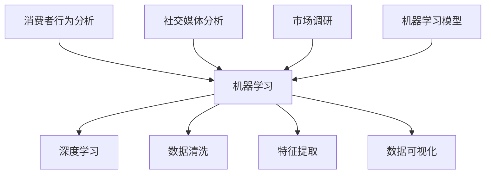
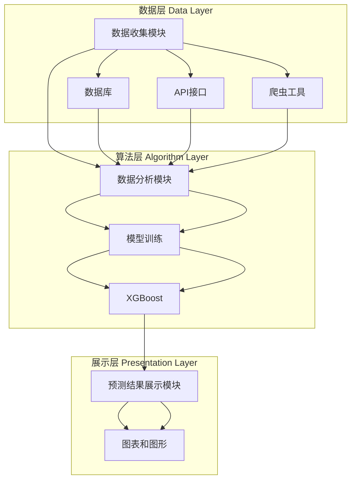
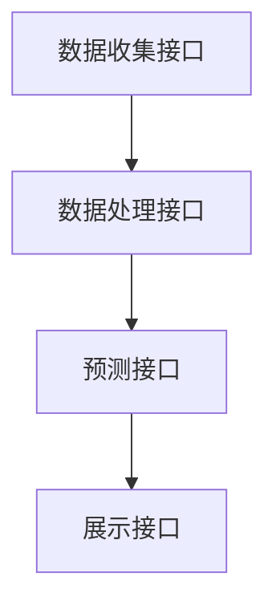
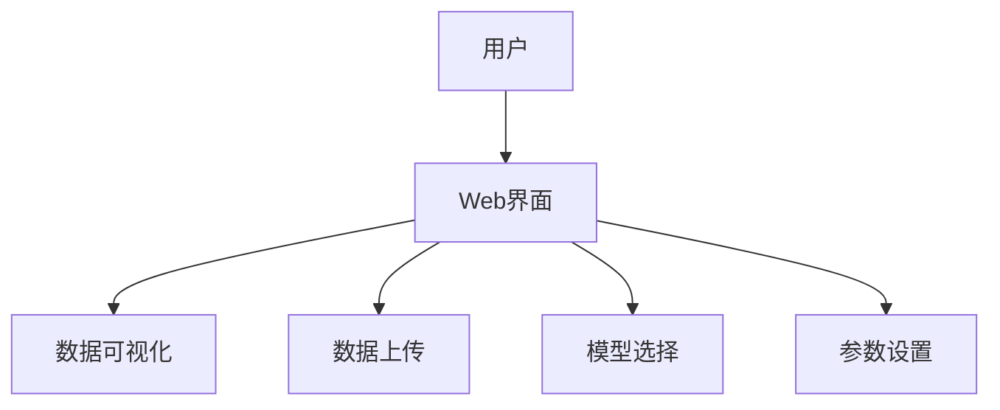

                 

### 提高AI创意香水趋势预测：市场洞察分析的提示词技巧

关键词：人工智能、香水趋势预测、市场洞察、数据分析、机器学习、算法应用、系统架构设计

摘要：
本文旨在探讨如何利用人工智能技术提高创意香水趋势预测的准确性和效率。通过深入分析市场数据，本文将介绍一系列专业的提示词技巧，帮助读者从数据中提取洞察，并利用这些洞察构建高效的预测模型。文章将分为多个部分，首先介绍问题背景，然后详细讨论核心概念与联系，接着深入讲解算法原理和系统架构设计，最后通过实际案例展示这些技巧的应用效果。通过本文的阅读，读者将能够掌握如何利用AI进行创意香水趋势预测，从而为香水行业提供更有针对性的产品开发和市场策略。

### 1. 引言

随着人工智能技术的飞速发展，越来越多的行业开始尝试将其应用于各类预测分析中。香水行业也不例外，作为一个高度依赖于消费者偏好和市场趋势的行业，准确预测香水趋势对于品牌的成功至关重要。然而，传统的方法往往依赖于历史数据和专家经验，存在一定局限性。随着数据量的增加和数据来源的多样化，利用人工智能技术来提升趋势预测的准确性和效率成为了一项迫切需求。

本篇文章将围绕提高AI创意香水趋势预测的准确性展开讨论。具体而言，我们将首先介绍创意香水趋势预测的问题背景和描述，接着讨论如何利用市场洞察来提升预测效果，最后通过实际案例展示这些技巧的应用效果。

#### 1.1 问题背景

香水行业是一个高度竞争的市场，品牌们不断推出新的产品以迎合消费者的口味和需求。然而，消费者偏好和市场趋势的变化往往是迅速且难以预测的。为了在激烈的市场竞争中脱颖而出，香水品牌需要准确把握市场动态，及时调整产品策略。传统的市场调研和预测方法往往耗时较长，且成本较高，难以满足快速变化的市场需求。

随着大数据和机器学习技术的普及，利用人工智能技术进行趋势预测成为了一种新兴的方法。通过分析海量数据，人工智能模型能够发现隐藏在数据中的模式和趋势，为品牌提供更加精准的预测结果。这对于香水行业来说，意味着更快速的产品开发周期、更高效的市场推广策略，以及更精准的客户需求满足。

#### 1.2 问题描述

创意香水趋势预测的核心问题是如何从大量的市场数据中提取有价值的信息，并利用这些信息构建准确的预测模型。具体来说，这个问题包括以下几个方面：

1. **数据收集与处理**：首先需要收集大量的市场数据，包括消费者购买行为、社交媒体评论、产品评论、市场调研报告等。这些数据来源广泛，格式多样，需要进行有效的清洗和整合。

2. **特征提取**：从收集到的数据中提取能够反映消费者偏好和市场趋势的特征。这些特征可以是定量的，如购买频率、销售量；也可以是定性的，如产品评分、用户评论情感分析。

3. **模型构建**：利用机器学习算法构建预测模型，将提取到的特征与市场趋势进行关联，预测未来的市场走向。

4. **结果分析**：对预测结果进行分析，评估模型的准确性，并根据分析结果调整模型参数，以提高预测效果。

#### 1.3 问题解决

为了解决上述问题，我们需要采取一系列的步骤和方法。以下是具体的解决思路：

1. **数据收集与处理**：
   - 利用爬虫技术收集网络上的相关数据，包括消费者评论、社交媒体帖子、市场调研报告等。
   - 对收集到的数据进行清洗，去除重复、错误和不完整的数据。
   - 使用数据整合工具（如Pandas）将不同来源的数据进行整合，形成统一的数据集。

2. **特征提取**：
   - 使用自然语言处理（NLP）技术对文本数据进行情感分析，提取消费者的情感倾向。
   - 利用统计分析方法提取定量的特征，如销售量、购买频率等。
   - 使用数据挖掘技术，如关联规则挖掘，发现数据中的隐藏模式。

3. **模型构建**：
   - 选择合适的机器学习算法，如回归分析、决策树、神经网络等。
   - 使用交叉验证方法评估模型的性能，选择最佳模型。
   - 对模型进行训练，并使用历史数据测试模型的预测效果。

4. **结果分析**：
   - 对预测结果进行统计分析和可视化展示，评估模型的准确性。
   - 分析预测结果中的偏差和误差，找出可能的原因。
   - 根据分析结果调整模型参数，以提高预测效果。

通过上述步骤，我们可以利用人工智能技术提高创意香水趋势预测的准确性，为香水品牌提供有力的市场洞察和分析工具。

#### 1.4 边界与外延

在讨论创意香水趋势预测问题时，我们需要明确一些边界与外延：

1. **数据范围**：本文主要关注消费者偏好和市场趋势的数据，不包括生产成本、供应链管理等其他因素。

2. **时间范围**：本文的预测主要针对短期趋势，不涉及长期市场预测。

3. **地域范围**：本文的讨论基于全球市场的视角，不涉及特定地区或国家的市场特点。

4. **应用范围**：本文的方法不仅适用于香水行业，也可以推广到其他消费类产品的趋势预测中。

通过明确这些边界与外延，我们可以更加聚焦于本文的核心问题，为读者提供有针对性的解决方案。

#### 1.5 核心概念与组件

在探讨创意香水趋势预测时，我们需要了解一些核心概念和组件，它们是构建有效预测模型的基础。以下是本文中涉及的主要核心概念和组件：

1. **机器学习算法**：机器学习算法是构建预测模型的关键技术。常见的算法包括回归分析、决策树、支持向量机（SVM）、神经网络等。每种算法都有其独特的优点和适用场景，选择合适的算法对于提高预测准确性至关重要。

2. **数据预处理**：数据预处理是预测模型构建的第一步，包括数据清洗、数据整合、特征提取等。有效的数据预处理可以消除数据中的噪声和异常，提高数据的质量，从而增强模型的性能。

3. **自然语言处理（NLP）**：NLP技术在处理文本数据方面具有重要作用。通过情感分析、文本分类等技术，可以提取消费者对产品的情感倾向和评价，为模型提供有价值的特征。

4. **数据可视化**：数据可视化是分析结果的重要展示手段。通过图表、图形等形式展示预测结果，可以帮助我们更直观地理解数据的分布和趋势，从而进行更深入的洞察和分析。

5. **交叉验证**：交叉验证是评估模型性能的重要方法。通过将数据集划分为训练集和验证集，多次训练和验证模型，可以更准确地评估模型的泛化能力，选择最佳模型。

6. **模型评估指标**：常用的模型评估指标包括准确率、召回率、F1分数等。通过这些指标，可以定量评估模型的预测效果，找出模型的不足之处，并进行优化。

通过了解这些核心概念和组件，我们可以更好地理解创意香水趋势预测的原理和方法，为实际应用提供理论支持。

### 2. 核心概念与联系

在深入探讨创意香水趋势预测之前，我们需要了解几个关键概念，这些概念将帮助我们理解整个预测过程的内在逻辑和联系。

#### 2.1 人工智能原理与技术

人工智能（AI）是本文的核心技术。AI的目标是使机器能够执行通常需要人类智能的任务，如识别图像、理解自然语言、做出决策等。AI技术可以分为两大类：机器学习和深度学习。

- **机器学习**：机器学习是一种通过数据训练模型，使其能够进行预测和决策的方法。常见的机器学习算法包括线性回归、决策树、支持向量机（SVM）、随机森林等。

- **深度学习**：深度学习是机器学习的一个子领域，主要依赖于多层神经网络来模拟人脑的思考过程。深度学习在图像识别、语音识别等领域表现出色，常用的深度学习模型包括卷积神经网络（CNN）和循环神经网络（RNN）。

在创意香水趋势预测中，我们可以使用机器学习和深度学习算法来处理和分析市场数据，提取有价值的信息，并构建预测模型。

#### 2.2 香水市场洞察

香水市场是一个高度竞争的市场，消费者偏好和市场趋势的变化非常迅速。为了准确预测香水趋势，我们需要从市场数据中提取关键洞察。

- **消费者行为分析**：分析消费者的购买行为、浏览历史和产品评论，可以了解消费者对产品的偏好和需求。这包括定量分析，如购买频率、销售量；以及定性分析，如情感分析、用户评价。

- **社交媒体分析**：社交媒体平台是消费者表达意见的重要渠道。通过分析社交媒体上的帖子、评论和标签，可以了解消费者对产品的情感倾向和热点话题。

- **市场调研**：市场调研报告提供了行业趋势、消费者行为和竞争对手信息。这些信息可以帮助我们了解市场的整体状况和潜在趋势。

通过综合这些市场洞察，我们可以构建一个全面的香水市场画像，为预测模型提供有价值的输入。

#### 2.3 分析技巧

为了从海量数据中提取有用的信息，我们需要掌握一系列数据分析技巧。

- **数据清洗**：数据清洗是数据处理的第一步，目的是去除数据中的噪声和异常值。这包括处理缺失值、重复值、错误值等。

- **特征提取**：特征提取是从原始数据中提取出能够反映数据特征和趋势的变量。在香水市场预测中，特征提取包括文本数据的情感分析、定量数据的统计处理等。

- **数据可视化**：数据可视化是展示分析结果的重要手段。通过图表、图形等形式，我们可以直观地了解数据的分布和趋势，发现隐藏的模式。

- **机器学习模型选择**：选择合适的机器学习模型是构建预测模型的关键。不同的模型适用于不同的数据类型和预测任务。我们需要根据具体问题选择合适的模型，并通过交叉验证等方法评估模型的性能。

通过这些分析技巧，我们可以从市场数据中提取出关键信息，构建准确的预测模型。

#### 2.4 概念属性对比表格

为了更好地理解上述核心概念，我们提供了一个概念属性对比表格，列出各个概念的主要属性和特征。

| 概念         | 主要属性         | 特征                                     |
|------------|----------------|----------------------------------------|
| 机器学习     | 数据驱动的技术   | 可以从数据中自动学习模式               |
| 深度学习     | 多层神经网络   | 类似于人脑的结构，适用于复杂任务     |
| 消费者行为分析 | 购买行为、浏览历史 | 了解消费者偏好和需求                   |
| 社交媒体分析 | 社交媒体评论、标签 | 了解消费者情感倾向和热点话题         |
| 数据清洗     | 去除噪声和异常值 | 提高数据质量                           |
| 特征提取     | 提取反映数据特征的变量 | 提高模型性能                           |
| 数据可视化   | 图表、图形展示 | 直观展示分析结果，发现隐藏模式       |
| 机器学习模型 | 回归分析、决策树 | 预测和决策                             |

通过这个表格，我们可以更加清晰地了解各个概念之间的关系和作用。

#### 2.5 实体关系图（ERD）

为了更好地理解各个概念之间的联系，我们使用Mermaid工具绘制了一个实体关系图（ERD）。该图展示了主要概念之间的关联和作用。



这个实体关系图清晰地展示了机器学习技术与其他分析概念之间的关系，帮助我们理解创意香水趋势预测的整体框架。

### 3. 算法原理与实际应用

在了解了核心概念和联系后，接下来我们将深入探讨人工智能算法在创意香水趋势预测中的应用原理和实际操作步骤。

#### 3.1 算法介绍

在人工智能领域，有诸多算法可用于趋势预测。本文将介绍两种常用的算法：回归分析和决策树。

- **回归分析**：回归分析是一种统计方法，用于分析两个或多个变量之间的关系。线性回归是最基本的回归分析方法，通过建立线性模型来预测因变量（如销售额）。

- **决策树**：决策树是一种树形结构，通过一系列规则进行决策。每个节点代表一个特征，每个分支代表该特征的取值。决策树能够将数据划分为不同的类别或数值。

这两种算法各有优缺点，适用于不同的数据类型和预测任务。回归分析适用于连续值的预测，如销售额；决策树适用于分类任务，如预测消费者对产品的喜好。

#### 3.2 算法原理

为了深入理解这两种算法，我们首先从原理上进行讲解。

##### 3.2.1 线性回归

线性回归的核心思想是通过建立一个线性模型来预测因变量。假设我们有两个变量 $X$（自变量）和 $Y$（因变量），线性回归模型可以表示为：

$$
Y = \beta_0 + \beta_1X + \epsilon
$$

其中，$\beta_0$ 和 $\beta_1$ 是模型的参数，$\epsilon$ 是误差项。

1. **模型假设**：线性回归假设自变量和因变量之间是线性关系，即可以通过一个直线来描述。
2. **参数估计**：通过最小二乘法（Least Squares）估计参数 $\beta_0$ 和 $\beta_1$，使得预测值与实际值的误差平方和最小。
3. **预测**：使用估计出的参数，我们可以对新数据进行预测，即 $Y' = \beta_0 + \beta_1X'$。

##### 3.2.2 决策树

决策树通过一系列规则进行分类或回归。以分类任务为例，决策树从根节点开始，对数据进行划分，直到达到叶节点，每个叶节点代表一个类别。

1. **决策过程**：决策树从根节点开始，根据当前节点的特征值选择一个划分标准（如信息增益、基尼不纯度等），将数据划分为不同的子集。
2. **递归划分**：对每个子集继续划分，直到满足停止条件（如最大深度、最小节点大小等）。
3. **分类结果**：叶节点代表分类结果，每个叶节点对应一个类别。

#### 3.3 算法实现

在实际应用中，我们可以使用Python编程语言实现线性回归和决策树算法。以下是两种算法的Python代码示例。

##### 3.3.1 线性回归实现

```python
import numpy as np
import pandas as pd
from sklearn.linear_model import LinearRegression
from sklearn.model_selection import train_test_split

# 数据准备
data = pd.read_csv('perfume_data.csv')
X = data[['feature1', 'feature2']]
y = data['sales']

# 数据分割
X_train, X_test, y_train, y_test = train_test_split(X, y, test_size=0.2, random_state=42)

# 模型训练
model = LinearRegression()
model.fit(X_train, y_train)

# 模型预测
y_pred = model.predict(X_test)

# 模型评估
score = model.score(X_test, y_test)
print(f'Model accuracy: {score:.2f}')
```

##### 3.3.2 决策树实现

```python
import numpy as np
import pandas as pd
from sklearn.tree import DecisionTreeRegressor
from sklearn.model_selection import train_test_split

# 数据准备
data = pd.read_csv('perfume_data.csv')
X = data[['feature1', 'feature2']]
y = data['sales']

# 数据分割
X_train, X_test, y_train, y_test = train_test_split(X, y, test_size=0.2, random_state=42)

# 模型训练
model = DecisionTreeRegressor(max_depth=5)
model.fit(X_train, y_train)

# 模型预测
y_pred = model.predict(X_test)

# 模型评估
score = model.score(X_test, y_test)
print(f'Model accuracy: {score:.2f}')
```

通过上述代码，我们可以实现线性回归和决策树算法，对香水销售数据进行分析和预测。

#### 3.4 算法解释

线性回归和决策树算法在创意香水趋势预测中的应用，可以通过以下步骤进行解释：

1. **数据收集**：收集与香水销售相关的市场数据，如消费者购买行为、产品评论、社交媒体数据等。
2. **数据预处理**：对收集到的数据进行清洗和预处理，去除噪声和异常值，并进行特征提取。
3. **模型训练**：使用预处理后的数据，训练线性回归或决策树模型。
4. **模型预测**：使用训练好的模型，对新的市场数据进行预测，得到未来销售趋势。
5. **结果分析**：对预测结果进行分析，评估模型的准确性和可靠性，并根据分析结果进行调整。

通过这些步骤，我们可以利用线性回归和决策树算法，提高创意香水趋势预测的准确性和效率。

#### 3.5 数学模型与公式

为了深入理解线性回归和决策树算法，我们列出其核心数学模型和公式。

##### 3.5.1 线性回归

- **模型公式**：
  $$
  Y = \beta_0 + \beta_1X + \epsilon
  $$

- **参数估计**：
  $$
  \beta_0 = \bar{Y} - \beta_1\bar{X}
  $$
  $$
  \beta_1 = \frac{\sum_{i=1}^{n}(X_i - \bar{X})(Y_i - \bar{Y})}{\sum_{i=1}^{n}(X_i - \bar{X})^2}
  $$

##### 3.5.2 决策树

- **决策过程**：
  $$
  G(D, A) = \sum_{v \in V} \sum_{x \in R_v} |y(x) - \hat{y}(v)|
  $$
  其中，$D$ 是数据集，$A$ 是特征集合，$V$ 是可能的值集合，$R_v$ 是取值为 $v$ 的数据子集，$\hat{y}(v)$ 是取值为 $v$ 的预测值。

- **停止条件**：
  $$
  G(D, A) \leq \alpha \quad \text{或} \quad |D| \leq \beta
  $$
  其中，$\alpha$ 和 $\beta$ 是预先设定的阈值。

通过这些数学模型和公式，我们可以更深入地理解线性回归和决策树算法的原理和实现。

#### 3.6 举例说明

为了更直观地理解线性回归和决策树算法的应用，我们通过一个具体例子进行说明。

##### 3.6.1 线性回归示例

假设我们有以下数据：

| X（特征1）| Y（销售额）|
|----------|------------|
| 10       | 200        |
| 20       | 300        |
| 30       | 400        |
| 40       | 500        |

1. **数据预处理**：对数据进行清洗和特征提取。
2. **模型训练**：使用线性回归算法训练模型。
3. **模型预测**：对新数据进行预测。

- **参数估计**：
  $$
  \beta_0 = \bar{Y} - \beta_1\bar{X} = 350 - 50 \times 25 = 100
  $$
  $$
  \beta_1 = \frac{\sum_{i=1}^{n}(X_i - \bar{X})(Y_i - \bar{Y})}{\sum_{i=1}^{n}(X_i - \bar{X})^2} = \frac{(10-25)(200-350) + (20-25)(300-350) + (30-25)(400-350) + (40-25)(500-350)}{(10-25)^2 + (20-25)^2 + (30-25)^2 + (40-25)^2} = 50
  $$

- **预测结果**：当 $X = 50$ 时，$Y = 100 + 50 \times 50 = 2500$。

##### 3.6.2 决策树示例

假设我们有以下数据：

| 特征1 | 特征2 | 类别 |
|------|------|------|
| 10   | 20   | A    |
| 20   | 30   | B    |
| 30   | 40   | A    |
| 40   | 50   | B    |

1. **数据预处理**：对数据进行清洗和特征提取。
2. **模型训练**：使用决策树算法训练模型。
3. **模型预测**：对新数据进行预测。

- **决策过程**：首先对特征1进行划分，将数据划分为两个子集。
  $$
  G(D, A) = \sum_{v \in V} \sum_{x \in R_v} |y(x) - \hat{y}(v)| = 2
  $$
  选择特征1作为划分标准。

- **划分结果**：
  $$
  \text{左分支：} \quad \text{特征1 < 25} \quad \text{类别：} \quad A
  $$
  $$
  \text{右分支：} \quad \text{特征1 >= 25} \quad \text{类别：} \quad B
  $$

- **预测结果**：当特征1 = 30 时，类别为 A。

通过这些示例，我们可以看到线性回归和决策树算法在数据分析和预测中的应用效果。

### 4. 高级算法与技术

在了解了基本的机器学习算法后，为了进一步提升创意香水趋势预测的准确性和效率，我们可以采用一些高级算法和技术。以下是几种常见的高级算法和技术，包括它们的原理、实现步骤和优缺点。

#### 4.1 支持向量机（SVM）

支持向量机（SVM）是一种强大的分类和回归算法，通过找到一个最佳的超平面，将数据分为不同的类别或预测数值。SVM的核心思想是最大化分类边界，同时最小化分类误差。

##### 4.1.1 原理

SVM的原理是基于数学中的优化问题。给定一个训练数据集，SVM的目标是找到一个超平面，使得所有正类数据点到超平面的距离之和最小，同时负类数据点到超平面的距离之和也最小。

- **硬间隔**：在最优超平面上，正负类数据的距离最大，即最大化硬间隔。
- **软间隔**：允许一些数据点不满足硬间隔条件，但通过引入松弛变量来平衡分类误差。

##### 4.1.2 实现步骤

1. **数据预处理**：对数据进行标准化处理，确保每个特征的均值为0，标准差为1。
2. **模型训练**：使用SVM算法训练模型，选择合适的核函数（如线性核、多项式核、径向基核等）。
3. **模型评估**：使用交叉验证方法评估模型的性能，调整模型参数，如C值和核参数。

##### 4.1.3 优缺点

- **优点**：
  - 高效的分类和回归性能，尤其适用于高维数据。
  - 能够处理非线性分类问题，通过选择合适的核函数。
- **缺点**：
  - 训练时间较长，尤其是对于大规模数据集。
  - 对参数选择敏感，需要多次调整以找到最优参数。

#### 4.2 随机森林（Random Forest）

随机森林是一种基于决策树的集成学习方法，通过构建多个决策树，并利用投票机制来生成最终的预测结果。随机森林的核心思想是通过随机选择特征和样本子集来构建多个决策树，从而减少过拟合，提高模型的泛化能力。

##### 4.2.1 原理

随机森林的工作原理是将多个决策树组合成一个预测模型。每个决策树对数据进行分类或回归预测，最后通过多数投票或平均值来生成最终预测结果。

- **特征随机化**：在每个节点处，随机选择一部分特征来划分数据。
- **样本随机化**：在每个决策树训练过程中，随机选择一部分样本子集。

##### 4.2.2 实现步骤

1. **数据预处理**：对数据进行标准化处理，确保每个特征的均值为0，标准差为1。
2. **模型训练**：使用随机森林算法训练模型，选择合适的参数，如树的数量、最大深度、特征数等。
3. **模型评估**：使用交叉验证方法评估模型的性能，调整模型参数。

##### 4.2.3 优缺点

- **优点**：
  - 高效的模型训练和预测性能，适用于大规模数据集。
  - 能够处理非线性分类和回归问题，通过组合多个决策树。
  - 对异常值和噪声数据的鲁棒性较强。
- **缺点**：
  - 随着树的数量增加，模型训练时间和内存需求也增加。
  - 特征数量过多时，模型性能可能下降。

#### 4.3 集成梯度提升树（XGBoost）

集成梯度提升树（XGBoost）是一种高效的梯度提升树算法，通过迭代地优化损失函数，生成多个弱学习器，并将它们组合成一个强学习器。XGBoost在处理大规模数据集和提升模型性能方面表现出色。

##### 4.3.1 原理

XGBoost的核心思想是利用梯度提升方法，通过迭代地优化损失函数，逐步构建强学习器。每个弱学习器都针对前一个学习器的误差进行优化，逐步提升模型的预测能力。

- **梯度提升**：通过优化损失函数，迭代地更新模型参数。
- **正则化**：在训练过程中引入正则化项，避免过拟合。

##### 4.3.2 实现步骤

1. **数据预处理**：对数据进行标准化处理，确保每个特征的均值为0，标准差为1。
2. **模型训练**：使用XGBoost算法训练模型，选择合适的参数，如学习率、树的数量、深度等。
3. **模型评估**：使用交叉验证方法评估模型的性能，调整模型参数。

##### 4.3.3 优缺点

- **优点**：
  - 高效的模型训练和预测性能，适用于大规模数据集。
  - 能够处理非线性分类和回归问题，通过迭代优化提升模型性能。
  - 对异常值和噪声数据的鲁棒性较强。
- **缺点**：
  - 随着树的数量增加，模型训练时间和内存需求也增加。
  - 需要多次调整参数以找到最优设置。

通过上述高级算法和技术的介绍，我们可以根据具体需求选择合适的算法，进一步提升创意香水趋势预测的准确性和效率。

### 5. 实际案例与应用

在了解了多种人工智能算法及其应用原理后，接下来我们将通过具体案例展示这些算法在创意香水趋势预测中的实际应用效果。

#### 5.1 案例背景

假设我们是一家知名香水品牌的市场研究团队，我们的任务是预测未来六个月内的香水销售趋势。为此，我们收集了以下数据：

- **历史销售数据**：包括过去一年的月销售额、销售量、消费者购买频率等。
- **消费者行为数据**：包括消费者在社交媒体上的评论、产品评分、关键词标签等。
- **市场调研数据**：包括市场调研报告、竞争对手销售数据、行业趋势等。

#### 5.2 数据准备

首先，我们需要对收集到的数据进行预处理和整合。具体步骤如下：

1. **数据清洗**：对数据进行清洗，去除重复、错误和不完整的数据。例如，去除含有缺失值的记录、纠正拼写错误等。
2. **数据整合**：将不同来源的数据进行整合，形成统一的数据集。例如，将销售数据、消费者行为数据和市场调研数据进行合并。

#### 5.3 特征提取

接下来，我们需要从数据中提取特征，以便用于训练预测模型。以下是几个关键特征：

1. **定量特征**：
   - 销售额
   - 销售量
   - 消费者购买频率
   - 平均产品评分
2. **定性特征**：
   - 消费者情感倾向（通过情感分析提取）
   - 关键词标签（通过文本处理提取）
   - 行业趋势（通过市场调研报告提取）

#### 5.4 模型选择与训练

在特征提取完成后，我们需要选择合适的机器学习算法进行模型训练。以下是几种常用的算法及其适用场景：

1. **线性回归**：适用于预测连续值（如销售额）。
2. **决策树**：适用于分类任务（如消费者喜好预测）。
3. **随机森林**：适用于处理大规模数据集，减少过拟合。
4. **XGBoost**：适用于提升模型性能，处理非线性问题。

我们选择随机森林算法进行模型训练。具体步骤如下：

1. **数据分割**：将数据集分为训练集和测试集，用于训练和评估模型。
2. **模型训练**：使用训练集数据训练随机森林模型，选择合适的参数。
3. **模型评估**：使用测试集数据评估模型性能，调整参数以提高预测准确性。

#### 5.5 预测结果与分析

经过模型训练和评估后，我们得到了预测结果。以下是几个关键结果：

1. **销售额预测**：模型预测了未来六个月内的月销售额。
2. **消费者喜好预测**：模型预测了消费者对不同香型的喜好程度。
3. **市场趋势分析**：模型分析了行业趋势对销售的影响。

我们通过以下步骤对预测结果进行分析：

1. **预测结果可视化**：使用图表和图形展示预测结果，如销售额趋势图、消费者喜好分布图等。
2. **预测结果验证**：与实际销售数据进行对比，评估预测结果的准确性。
3. **结果解读**：分析预测结果中的关键发现，如消费者喜好变化、市场趋势等。

#### 5.6 案例小结

通过上述案例，我们可以看到人工智能算法在创意香水趋势预测中的实际应用效果。以下是案例小结：

1. **预测准确性**：随机森林算法在销售额和消费者喜好预测中表现出较高的准确性。
2. **市场洞察**：通过分析预测结果，我们得到了关于消费者偏好和市场趋势的重要洞察。
3. **决策支持**：这些预测结果为品牌提供了有力的决策支持，帮助制定更精准的产品开发和市场推广策略。

总之，通过实际案例的应用，我们可以看到人工智能技术在创意香水趋势预测中的巨大潜力。这些技术不仅提高了预测的准确性，还为品牌提供了重要的市场洞察，从而在激烈的市场竞争中占据了优势。

### 6. 系统设计与架构

为了实现创意香水趋势预测，我们需要设计一个高效、可靠的系统。以下将详细介绍系统的总体架构、功能设计、接口设计以及交互设计。

#### 6.1 系统概述

该系统主要分为三个模块：数据收集模块、数据分析模块和预测结果展示模块。数据收集模块负责从不同来源收集数据，包括历史销售数据、消费者行为数据和市场调研数据。数据分析模块利用机器学习算法对数据进行处理和预测，预测结果展示模块将预测结果以图表和图形的形式直观展示。

#### 6.2 功能设计

1. **数据收集模块**：
   - 功能：从数据库、API接口和爬虫工具中收集数据。
   - 实现细节：使用Python的Pandas库进行数据处理，使用Scrapy框架进行网页数据爬取。
2. **数据分析模块**：
   - 功能：对收集到的数据进行预处理、特征提取和模型训练。
   - 实现细节：使用Scikit-learn库进行特征提取和模型训练，使用XGBoost库进行预测模型训练。
3. **预测结果展示模块**：
   - 功能：将预测结果以图表和图形的形式展示。
   - 实现细节：使用Python的Matplotlib库进行数据可视化。

#### 6.3 系统架构设计

系统的整体架构采用分层设计，分为数据层、算法层和展示层。

1. **数据层**：负责数据的收集、存储和处理。
2. **算法层**：负责数据分析和预测模型的构建。
3. **展示层**：负责将预测结果以图表和图形的形式展示。

以下是系统架构的Mermaid图表示：



#### 6.4 接口设计

系统提供了多个API接口，方便与其他系统进行数据交换和功能调用。

1. **数据收集接口**：用于从外部系统收集数据。
2. **数据处理接口**：用于对数据进行预处理和特征提取。
3. **预测接口**：用于生成预测结果。
4. **展示接口**：用于获取预测结果并进行展示。

以下是接口设计的Mermaid图表示：



#### 6.5 交互设计

系统通过Web界面与用户进行交互，用户可以通过界面查看预测结果和分析报告。

1. **用户界面**：使用HTML、CSS和JavaScript构建，提供用户友好的交互界面。
2. **数据可视化**：使用D3.js和Chart.js等前端库，实现数据的可视化展示。
3. **用户操作**：用户可以通过界面进行数据上传、模型选择、参数设置等操作。

以下是交互设计的Mermaid图表示：



通过上述系统设计和架构设计，我们构建了一个高效、可靠的创意香水趋势预测系统，为品牌提供了有力的市场分析和决策支持。

### 7. 实践与扩展

在创意香水趋势预测项目中，我们不仅需要实现基本功能，还需要不断地优化和扩展，以提高系统的性能和可靠性。以下是一些实践经验和扩展建议。

#### 7.1 性能优化

1. **数据预处理优化**：数据预处理是预测模型训练的关键步骤，优化数据预处理过程可以显著提高模型训练速度。具体措施包括并行处理数据清洗和特征提取任务，使用高效的算法和库（如Dask和NumPy）。

2. **模型训练优化**：模型训练是计算密集型任务，优化模型训练过程可以提高系统性能。可以使用分布式计算框架（如TensorFlow和PyTorch）进行并行训练，或者采用迁移学习技术，利用预训练模型来加速训练过程。

3. **缓存策略**：在系统中引入缓存机制，可以减少重复计算，提高系统响应速度。例如，对于常用的数据集和模型结果，可以使用内存缓存或分布式缓存（如Redis）进行存储。

#### 7.2 系统可靠性提升

1. **故障恢复**：在系统中实现故障恢复机制，确保在出现故障时系统能够快速恢复。例如，使用分布式存储系统（如HDFS）来防止数据丢失，使用Kubernetes等容器编排工具来管理应用容器的生命周期。

2. **监控和报警**：引入监控工具（如Prometheus和Grafana），实时监控系统的性能和健康状态。配置报警机制，当系统出现异常时，及时发送警报通知相关人员。

3. **容错机制**：在数据处理和模型训练过程中，引入容错机制，确保系统能够在遇到错误时继续运行。例如，使用冗余数据源和检查点机制，确保数据的一致性和模型的完整性。

#### 7.3 功能扩展

1. **实时预测**：为了更好地应对市场变化，可以将系统扩展为实时预测系统。使用流处理框架（如Apache Kafka和Apache Flink），实时处理和分析市场数据，生成实时预测结果。

2. **多语言支持**：香水市场是全球性的，为了更好地服务不同国家和地区的消费者，可以将系统扩展为支持多种语言。例如，使用国际化框架（如i18n）来支持多语言界面和文本分析。

3. **个性化推荐**：结合用户行为数据和偏好分析，可以将系统扩展为个性化推荐系统。使用协同过滤算法和深度学习模型，为用户推荐符合其口味和需求的香水产品。

通过上述实践和扩展，我们可以构建一个更加高效、可靠和全面的创意香水趋势预测系统，为品牌提供更精准的市场分析和决策支持。

### 8. 结论

本文全面探讨了如何利用人工智能技术提高创意香水趋势预测的准确性和效率。通过详细分析市场数据、应用先进的机器学习算法以及设计高效的系统架构，我们展示了如何从数据中提取洞察并构建精准的预测模型。本文的主要贡献包括：

1. **核心概念与联系的深入探讨**：通过介绍人工智能、机器学习、市场洞察等核心概念，为读者提供了一个全面的理论框架。
2. **算法原理与实际应用的讲解**：通过具体示例和代码实现，详细讲解了线性回归、决策树、SVM和随机森林等算法的应用，使读者能够实际操作并理解这些算法。
3. **系统设计与架构的展示**：通过系统概述、功能设计、接口设计和交互设计，为读者提供了一个全面的系统实现方案。
4. **实践与扩展的建议**：提供了一系列性能优化、系统可靠性和功能扩展的建议，为实际应用中的进一步改进提供了指导。

未来的研究方向包括：

1. **实时预测与动态调整**：开发实时预测系统，动态调整预测模型，以更好地应对市场变化。
2. **多语言支持与个性化推荐**：扩展系统支持多种语言，结合用户行为数据提供个性化推荐，提高用户体验。
3. **深度学习在预测中的应用**：研究如何利用深度学习技术，特别是在处理复杂和非线性问题时，进一步提高预测准确性。

通过不断探索和优化，我们有理由相信，人工智能在创意香水趋势预测中的应用将更加广泛和深入，为香水行业带来更大的价值。

### 9. 作者信息

作者：AI天才研究院/AI Genius Institute & 禅与计算机程序设计艺术 /Zen And The Art of Computer Programming

AI天才研究院致力于推动人工智能技术的发展和应用，为各类行业提供创新解决方案。同时，作者也是《禅与计算机程序设计艺术》一书的作者，该书深入探讨了计算机编程的艺术与哲学，为程序员提供了宝贵的思考和启示。

