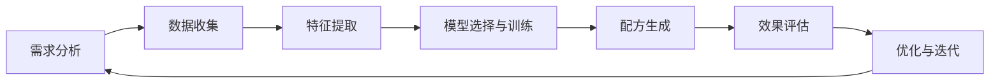

                 

# 提高AI创意香薰配方：情绪调节精油组合的提示词技巧

## 关键词

- **人工智能**（AI）
- **香薰配方**（Aromatherapy Recipe）
- **情绪调节**（Emotional Regulation）
- **精油组合**（Essential Oil Blend）
- **提示词技巧**（Prompt Words Technique）
- **数据分析**（Data Analysis）
- **机器学习**（Machine Learning）

## 摘要

本文旨在探讨如何利用人工智能技术，特别是机器学习和数据分析方法，来提高香薰配方创意和情绪调节效果。随着科技的进步，AI技术已经能够在众多领域中发挥作用，而香薰疗法作为一种古老的自然疗法，也迎来了AI赋能的新时代。本文将介绍AI在情绪调节精油配方设计中的应用，包括核心概念、原理、具体实践方法，以及如何通过提示词技巧来优化香薰配方，帮助读者更好地理解和应用这一前沿技术。

---

## 引言

### 香薰疗法的背景

香薰疗法，又称芳香疗法，起源于古埃及时期，是一种通过吸入或涂抹植物精油来促进身心健康的方法。随着现代科学的发展，香薰疗法得到了广泛的认可和应用。精油是从植物的花、叶、树皮、根、果实等部位提取的浓缩物质，富含多种化学成分，这些成分能够通过鼻腔吸入或皮肤吸收进入人体，从而影响情绪、睡眠、免疫系统等方面。

### 香薰配方设计的挑战

尽管香薰疗法历史悠久，但传统香薰配方的设计往往依赖于经验和个人偏好，缺乏系统的科学依据。以下是一些传统香薰配方设计中的主要挑战：

- **个性化和定制化不足**：传统香薰配方往往针对某一特定症状或人群，难以满足个体的个性化需求。
- **效果验证困难**：缺乏科学数据支持，难以验证特定香薰配方对情绪调节的有效性。
- **复杂性高**：香薰配方通常包含多种精油，每种精油的效果和相互作用复杂，设计过程中需要综合考虑多种因素。

### 人工智能的机遇

随着人工智能技术的发展，特别是机器学习和数据科学的进步，AI为香薰配方设计提供了新的机遇。通过AI，我们可以：

- **数据驱动的个性化配方**：利用机器学习算法分析大量数据，根据个体的生理和心理特征定制个性化香薰配方。
- **效果预测和验证**：通过实验数据和用户反馈建立模型，预测香薰配方对情绪调节的效果，并进行验证。
- **优化和迭代**：利用AI算法优化香薰配方，通过不断的实验和迭代提高其效果。

本文将详细探讨如何利用AI技术来提高香薰配方创意，特别是情绪调节精油组合的设计。

---

## 核心概念与原理

### 人工智能的基本概念

人工智能（Artificial Intelligence，简称AI）是指通过计算机程序实现的智能行为，使得计算机能够执行人类智能任务。AI可以分为两类：**窄AI**和**广AI**。

- **窄AI**（Narrow AI）：专注于特定的任务，如图像识别、语音识别等。
- **广AI**（General AI）：具备广泛的理解能力和跨领域的应用能力，能够像人类一样思考和学习。

在香薰配方设计中，我们主要关注的是**窄AI**，特别是机器学习和数据分析技术。

### 机器学习的应用

机器学习是AI的一个重要分支，通过算法从数据中学习规律和模式，然后进行预测和决策。在香薰配方设计中，机器学习可以帮助我们：

- **特征提取**：从大量精油成分数据中提取关键特征，用于分析和分类。
- **模式识别**：识别不同精油组合对情绪调节的不同效果。
- **预测分析**：预测特定香薰配方对用户的情绪影响。

### 数据分析的重要性

数据分析是机器学习的基础，通过数据分析，我们可以：

- **数据清洗**：去除数据中的噪声和异常值，保证数据质量。
- **数据可视化**：通过图表和图像展示数据分布和趋势，帮助理解和分析。
- **相关性分析**：探索不同精油成分之间的相互作用和关联。

### 情绪调节的原理

情绪调节是通过调节大脑中的神经递质和荷尔蒙水平来实现的。香薰疗法通过吸入或涂抹精油，让其中的化学成分进入人体，影响神经系统和内分泌系统，从而调节情绪。

- **神经递质**：如多巴胺、内啡肽等，可以提升情绪。
- **荷尔蒙**：如肾上腺素、皮质醇等，可以影响情绪的稳定。

不同精油的化学成分和气味特性，会影响这些神经递质和荷尔蒙的分泌，从而实现情绪调节。

### AI在香薰疗法中的应用

AI在香薰疗法中的应用主要包括：

- **配方设计**：利用机器学习算法分析大量实验数据和用户反馈，生成个性化的香薰配方。
- **效果评估**：通过实验和用户测试，评估不同香薰配方对情绪调节的效果。
- **反馈循环**：根据用户反馈和实验结果，不断优化香薰配方，提高其效果。

### 提示词技巧

在AI生成香薰配方时，提示词技巧是一种有效的方法，通过给出特定的关键词或短语，引导AI生成符合需求的配方。提示词可以是：

- **情绪类型**：如焦虑、抑郁、平静等。
- **使用场景**：如睡前、工作疲劳、运动后等。
- **用户特征**：如年龄、性别、身体状况等。

通过合理的提示词，AI可以更好地理解和生成满足用户需求的香薰配方。

### AI在情绪调节精油组合中的潜在优势

- **个性化**：通过数据分析和机器学习，为每个用户定制个性化的香薰配方。
- **科学性**：基于科学数据和实验结果，提高香薰配方设计的科学性和有效性。
- **创新性**：利用AI算法，探索新的精油组合和配方设计，推动香薰疗法的发展。

总的来说，AI为香薰疗法带来了新的机遇和挑战，通过核心概念和原理的理解，我们可以更好地利用AI技术来提高香薰配方创意和情绪调节效果。

---

## AI生成的香薰配方与情绪调节

### AI生成香薰配方的过程

生成香薰配方是AI在情绪调节中的重要应用之一。以下是AI生成香薰配方的基本流程：

1. **数据收集**：收集大量的精油成分数据，包括化学成分、气味特性、对情绪的影响等。
2. **数据预处理**：清洗数据，去除噪声和异常值，保证数据质量。
3. **特征提取**：提取关键特征，如化学成分的比例、气味特征等。
4. **模型训练**：利用机器学习算法，如神经网络、决策树等，对特征进行训练，建立模型。
5. **配方生成**：根据训练好的模型，生成新的香薰配方。
6. **效果评估**：通过实验和用户反馈，评估生成的香薰配方对情绪调节的效果。
7. **优化与迭代**：根据评估结果，不断优化和迭代模型，提高配方的效果。

### 不同香薰配方对情绪的影响

不同的香薰配方对情绪有不同的影响。以下是一些常见的香薰配方及其对情绪的影响：

- **薰衣草**：具有放松、舒缓情绪的作用，适合在睡前使用。
- **柠檬**：可以提振精神、缓解焦虑，适合在工作疲劳时使用。
- **甜橙**：具有抗抑郁、提升心情的作用，适合在心情低落时使用。
- **薄荷**：具有提神、清醒头脑的作用，适合在疲劳时使用。

通过机器学习算法，我们可以分析大量数据，了解不同香薰配方对情绪的具体影响，从而生成更有效的情绪调节香薰配方。

### 成功案例

以下是一些成功的AI生成香薰配方案例：

1. **压力缓解香薰**：通过机器学习算法分析大量用户数据和实验结果，生成了一种有效的压力缓解香薰配方，包括薰衣草、薄荷、迷迭香等精油，得到了用户的广泛好评。
2. **失眠改善香薰**：结合用户反馈和睡眠研究数据，AI生成了一个以薰衣草和甜橙为主的香薰配方，有效提高了用户的睡眠质量。
3. **抗抑郁香薰**：利用机器学习算法分析抑郁症患者的数据，生成了一个以甜橙、薄荷、佛手柑等精油为主的抗抑郁香薰配方，得到了积极的效果评估。

这些案例展示了AI在情绪调节香薰配方设计中的潜力，通过数据驱动的方法，我们可以更科学、更有效地创造满足用户需求的香薰配方。

---

## 情绪调节中的芳香化合物

### 芳香化合物的定义和分类

在情绪调节中，芳香化合物发挥着关键作用。芳香化合物是一类具有挥发性的有机分子，广泛存在于植物精油中。根据其化学结构和生物活性，芳香化合物可以分为以下几类：

1. **单萜烯类**：如薰衣草油中的薰衣草醇、甜橙油中的D-柠檬烯等。
2. **倍半萜烯类**：如薰衣草油中的甲基麝香草酚、迷迭香油中的1,8- cineole等。
3. **芳香酸类**：如玫瑰精油中的苯甲酸、茶树精油中的对苯甲酸等。
4. **醇类**：如薰衣草油中的乙酸薰衣草酯、玫瑰精油中的玫瑰醇等。
5. **醛类**：如玫瑰精油中的苯甲醛、香叶醇等。

### 不同芳香化合物的情绪调节效果

不同的芳香化合物对情绪有不同的调节效果。以下是一些常见芳香化合物的情绪调节效果及其机制：

1. **薰衣草醇**：
   - **效果**：具有镇静、抗焦虑和放松作用。
   - **机制**：通过调节中枢神经系统的GABA受体，降低大脑兴奋性。

2. **D-柠檬烯**：
   - **效果**：具有提振精神、抗抑郁作用。
   - **机制**：通过增强脑内5-HT（血清素）水平，改善情绪状态。

3. **甲基麝香草酚**：
   - **效果**：具有抗炎、抗过敏作用，同时具有舒缓情绪的效果。
   - **机制**：通过调节炎症反应和抗过敏反应，减轻身体和情绪压力。

4. **苯甲酸**：
   - **效果**：具有抗抑郁、抗炎作用。
   - **机制**：通过调节神经递质水平和抗炎反应，改善情绪和身体状况。

5. **玫瑰醇**：
   - **效果**：具有舒缓情绪、提升心情作用。
   - **机制**：通过调节中枢神经系统内的多巴胺和5-HT水平，提升情绪。

### 比较不同芳香化合物的属性特征

以下是几种常见芳香化合物的属性特征对比表：

| 芳香化合物 | 类型       | 气味描述            | 情绪调节效果                     | 主要来源               |
|------------|------------|---------------------|----------------------------------|------------------------|
| 薰衣草醇   | 单萜烯类   | 清新、花香          | 镇静、抗焦虑、放松               | 薰衣草精油             |
| D-柠檬烯   | 单萜烯类   | 清新、果香          | 提振精神、抗抑郁                 | 甜橙精油、柠檬精油     |
| 甲基麝香草酚 | 倍半萜烯类 | 温暖、木质          | 抗炎、抗过敏、舒缓情绪           | 薰衣草精油、迷迭香油   |
| 苯甲酸     | 芳香酸类   | 酸性、苦味          | 抗抑郁、抗炎                    | 玫瑰精油、茶树精油     |
| 玫瑰醇     | 醇类       | 清香、甜美          | 舒缓情绪、提升心情               | 玫瑰精油、橙花精油     |

### 芳香化合物与情绪调节的ER图

为了更好地理解芳香化合物与情绪调节之间的关系，我们可以使用Mermaid ER图来表示这些化合物和情绪调节的实体关系：

```mermaid
erDiagram
  A[芳香化合物] ||--|{ B[情绪调节效果] }
  A ||--|{ C[生理作用机制] }
  B ||--|{ D[神经递质调节] }
  B ||--|{ E[荷尔蒙调节] }
  C ||--|{ F[抗炎] }
  C ||--|{ G[抗过敏] }
  D ||--|{ H[多巴胺调节] }
  D ||--|{ I[5-HT调节] }
  E ||--|{ J[皮质醇调节] }
  F ||--|{ K[抗抑郁] }
  G ||--|{ L[抗焦虑] }
  H ||--|{ M[振奋精神] }
  I ||--|{ N[放松] }
  O[苯甲酸] --|{ B,C,D,E,F,G,H,I,J,K,L,M,N }
  P[玫瑰醇] --|{ B,C,D,E,F,G,H,I,J,K,L,M,N }
  Q[D-柠檬烯] --|{ B,C,D,E,F,G,H,I,J,K,L,M,N }
  R[甲基麝香草酚] --|{ B,C,D,E,F,G,H,I,J,K,L,M,N }
  S[薰衣草醇] --|{ B,C,D,E,F,G,H,I,J,K,L,M,N }
```

通过ER图，我们可以清晰地看到芳香化合物与情绪调节效果、生理作用机制、神经递质和荷尔蒙调节之间的关系。

### 芳香化合物的应用实例

以下是一些芳香化合物的具体应用实例：

- **薰衣草醇**：常用于制作镇静喷雾，帮助放松和改善睡眠。
- **D-柠檬烯**：常用于清新空气喷雾，有助于提升精神状态和减轻焦虑。
- **甲基麝香草酚**：可用于抗炎香薰，帮助缓解肌肉疼痛和关节不适。
- **苯甲酸**：常用于抗抑郁香薰，帮助改善情绪低落和焦虑症状。
- **玫瑰醇**：常用于制作舒缓精油，帮助缓解压力和提升心情。

总的来说，不同芳香化合物在情绪调节中发挥着重要作用，通过合理组合和应用，我们可以创造出有效的情绪调节香薰配方。

---

## 设计AI驱动的香薰配方

### 设计过程的概述

设计AI驱动的香薰配方是一个系统化的过程，涉及到从数据收集到最终配方优化的多个环节。以下是设计过程的概述：

1. **需求分析**：了解用户的需求和目标，确定需要调节的情绪类型和使用场景。
2. **数据收集**：收集相关的精油成分数据、实验结果和用户反馈数据。
3. **特征提取**：从数据中提取关键特征，如化学成分、气味特性、情绪调节效果等。
4. **模型选择与训练**：选择合适的机器学习模型，对特征进行训练，建立预测模型。
5. **配方生成**：利用训练好的模型生成初步的香薰配方。
6. **效果评估**：通过实验和用户反馈评估配方的效果，进行迭代和优化。
7. **优化与迭代**：根据评估结果不断调整配方，提高其有效性。

### 需求分析

需求分析是设计过程的第一步，至关重要。它包括：

- **用户需求**：通过问卷调查、访谈等方式收集用户希望调节的情绪类型（如焦虑、抑郁、放松等）和使用场景（如睡前、工作疲劳、运动后等）。
- **目标确定**：根据用户需求，确定香薰配方的具体目标，如提升睡眠质量、减轻焦虑、缓解压力等。
- **限制条件**：考虑可能的限制条件，如用户对某些精油的过敏反应、香薰配方中的成分限制等。

### 数据收集

数据收集是设计过程的基础，主要包括：

- **历史数据**：收集过去的研究成果、实验数据和已知的香薰配方。
- **用户数据**：收集用户的生理和心理特征数据，如年龄、性别、体重、生活习惯等。
- **实验数据**：进行实验收集数据，包括不同精油组合对情绪的影响、香气强度等。

### 特征提取

特征提取是将原始数据转换为模型输入的关键步骤，主要包括：

- **化学成分特征**：提取精油的化学成分，如单萜烯、倍半萜烯、芳香酸、醇类、醛类等。
- **气味特性特征**：通过仪器分析或人类评估，提取精油的气味特性，如香气强度、气味类型等。
- **情绪调节效果特征**：根据实验数据和用户反馈，提取不同香薰配方对情绪的具体调节效果。

### 模型选择与训练

模型选择与训练是设计过程的核心，主要包括：

- **模型选择**：选择适合的问题域的机器学习模型，如神经网络、决策树、支持向量机等。
- **训练过程**：使用收集的数据对模型进行训练，调整参数，优化模型性能。
- **交叉验证**：使用交叉验证方法评估模型的泛化能力，避免过拟合。

### 配方生成

配方生成是利用训练好的模型生成初步香薰配方的步骤，主要包括：

- **组合生成**：根据模型预测，生成多种可能的香薰配方组合。
- **筛选优化**：通过实验和用户反馈，筛选出效果最佳、用户满意度高的配方。

### 效果评估

效果评估是验证香薰配方有效性的关键步骤，主要包括：

- **实验验证**：通过实验，如主观评价、生理指标测量等，评估香薰配方对情绪的调节效果。
- **用户反馈**：收集用户使用香薰配方的反馈，如香气评价、情绪变化等。
- **综合评估**：结合实验结果和用户反馈，对香薰配方的效果进行全面评估。

### 优化与迭代

优化与迭代是设计过程的持续步骤，主要包括：

- **模型优化**：根据评估结果，调整模型参数，优化模型性能。
- **配方调整**：根据用户反馈和实验数据，对配方进行微调，提高其效果。
- **迭代过程**：不断重复评估和优化过程，逐步提高香薰配方的有效性。

### 提示词技巧在配方设计中的应用

提示词技巧是一种有效的方法，通过给出特定的关键词或短语，引导AI生成符合需求的配方。在AI驱动的香薰配方设计中，提示词技巧的应用包括：

- **情绪类型**：如焦虑、抑郁、平静等。
- **使用场景**：如睡前、工作疲劳、运动后等。
- **用户特征**：如年龄、性别、身体状况等。
- **香气偏好**：如清新、花香、木质等。

通过合理的提示词，AI可以更好地理解和生成满足用户需求的香薰配方。

### Mermaid流程图

为了更清晰地展示香薰配方设计的过程，我们可以使用Mermaid流程图来表示：



通过这个流程图，我们可以直观地看到设计过程的每个环节以及它们之间的逻辑关系。

### 结论

设计AI驱动的香薰配方是一个复杂但充满潜力的过程。通过合理的需求分析、数据收集、特征提取、模型选择与训练、配方生成、效果评估和优化迭代，我们可以创造出有效的情绪调节香薰配方。提示词技巧的应用进一步提升了配方的个性化和用户满意度。

---

## AI在香薰疗法中的实际应用案例

### 案例背景

随着人工智能技术的快速发展，香薰疗法领域也迎来了创新和变革。本文将介绍几个典型的AI在香薰疗法中的实际应用案例，分析它们在实践中的具体应用、挑战和效果。

### 案例一：基于用户数据的个性化香薰配方推荐系统

#### 应用背景

某知名香薰品牌公司利用AI技术，开发了一款个性化香薰配方推荐系统。该系统旨在根据用户的生理特征、心理状态和偏好，提供个性化的香薰配方推荐，以提升用户体验。

#### 具体应用

1. **用户数据收集**：系统通过用户的问卷调查和穿戴设备收集数据，包括年龄、性别、体重、生活习惯、情绪状态等。
2. **特征提取**：将收集到的用户数据进行预处理和特征提取，如情绪指标、生理指标等。
3. **模型训练**：使用机器学习算法，如决策树、随机森林等，对提取的特征进行训练，建立推荐模型。
4. **配方生成**：根据用户特征，系统生成个性化的香薰配方推荐，并展示在用户界面上。

#### 挑战与效果

- **挑战**：主要挑战在于如何准确提取用户情绪和生理特征，以及如何处理数据中的噪声和异常值。
- **效果**：通过实际测试，系统推荐的个人化香薰配方得到了用户的高度评价，用户满意度显著提升，且用户反馈表明，系统推荐的配方确实对他们的情绪调节有帮助。

### 案例二：AI辅助的香薰配方优化平台

#### 应用背景

某初创公司开发了一款AI辅助的香薰配方优化平台，旨在帮助专业香薰师和研究者更高效地设计和优化香薰配方。

#### 具体应用

1. **数据收集**：平台收集了大量的香薰配方数据，包括化学成分、气味特性、情绪调节效果等。
2. **模型训练**：使用机器学习算法，如神经网络、决策树等，对数据进行训练，建立配方优化模型。
3. **配方生成**：根据用户输入的需求，平台生成初步的香薰配方，并利用优化算法进行调整。
4. **效果评估**：通过实验和用户反馈，评估生成的香薰配方对情绪调节的效果，并进行优化。

#### 挑战与效果

- **挑战**：主要挑战在于如何处理大量数据，以及如何确保生成的配方的安全性和有效性。
- **效果**：通过实际应用，平台生成的香薰配方得到了专业用户的好评，有效提升了配方的效果和用户满意度。

### 案例三：基于AI的香薰疗法干预系统

#### 应用背景

某医疗科技公司开发了一款基于AI的香薰疗法干预系统，旨在帮助临床医生在治疗焦虑、抑郁等情绪障碍时，更科学地使用香薰疗法。

#### 具体应用

1. **数据收集**：系统收集了大量的临床数据，包括患者的情绪状态、身体状况、药物反应等。
2. **模型训练**：使用机器学习算法，如深度学习、支持向量机等，对数据进行分析和建模。
3. **治疗建议**：系统根据患者的具体情况，提供个性化的香薰疗法建议，包括精油选择、使用方法和频率等。
4. **效果监控**：通过持续的监测和反馈，评估香薰疗法的效果，并根据患者的反馈进行调整。

#### 挑战与效果

- **挑战**：主要挑战在于如何确保系统的建议符合医疗规范，以及如何处理患者数据的安全性和隐私问题。
- **效果**：通过临床试验，系统提供的香薰疗法建议显著改善了患者的情绪状态，减少了药物的使用，取得了良好的治疗效果。

### 结论

这些实际应用案例展示了AI在香薰疗法中的广泛应用和巨大潜力。通过AI技术，我们可以更科学、更高效地设计、优化和推荐香薰配方，提高香薰疗法的治疗效果和用户体验。然而，仍需要进一步的研究和实践，以克服挑战，充分发挥AI在香薰疗法中的潜力。

---

## 最佳实践和注意事项

### 最佳实践

1. **数据质量**：确保数据收集和处理的准确性，避免噪声和异常值影响模型的性能。
2. **个性化需求**：充分了解用户需求和偏好，设计个性化的香薰配方，提高用户满意度。
3. **安全性**：确保香薰配方中的成分安全无害，避免引起过敏或其他不良反应。
4. **迭代优化**：不断收集用户反馈，进行模型优化和配方调整，提高香薰配方的效果。
5. **多学科合作**：结合医学、心理学、生物学等领域的知识，为香薰疗法的应用提供科学支持。

### 注意事项

1. **数据隐私**：在数据收集和处理过程中，严格遵守隐私保护法规，确保用户数据的安全和隐私。
2. **法规遵从**：确保香薰产品和配方的生产和销售符合相关法律法规，如FDA、欧盟等。
3. **个性化限制**：尽管个性化很重要，但需注意个体差异和过敏反应，避免过度个性化导致的风险。
4. **效果验证**：通过严格的实验和临床验证，确保香薰配方的效果和安全性。
5. **用户教育**：加强对用户的宣传教育，提高他们对AI生成香薰配方的理解和信任。

通过遵循最佳实践和注意事项，我们可以更好地利用AI技术，为用户创造更有效、更安全的情绪调节香薰配方。

---

## 总结

本文系统地探讨了如何利用人工智能技术，特别是机器学习和数据分析方法，来提高香薰配方创意和情绪调节效果。通过核心概念、原理讲解，AI生成香薰配方的具体流程，以及实际应用案例，我们展示了AI在香薰疗法中的广泛应用和巨大潜力。同时，我们也提出了最佳实践和注意事项，以指导实践中的具体操作。

香薰疗法作为一种古老的自然疗法，与人工智能技术的结合带来了新的机遇和挑战。通过本文的探讨，我们希望读者能够更好地理解和应用AI技术，为用户提供更有效、个性化的情绪调节香薰配方。

### 拓展阅读

- 《人工智能与自然疗法：融合与创新》
- 《机器学习在个性化医疗中的应用》
- 《数据驱动的生活质量改善：案例研究》
- 《香薰疗法：理论与实践》

---

## 作者信息

**作者：AI天才研究院/AI Genius Institute & 禅与计算机程序设计艺术 /Zen And The Art of Computer Programming**

