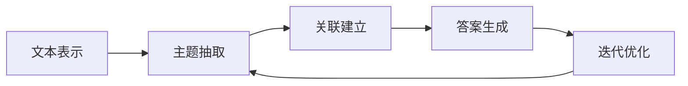
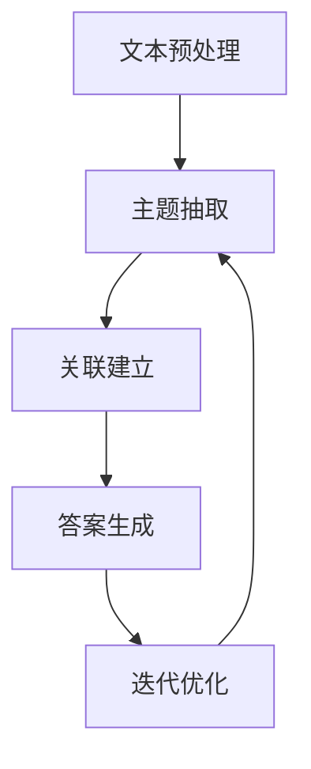
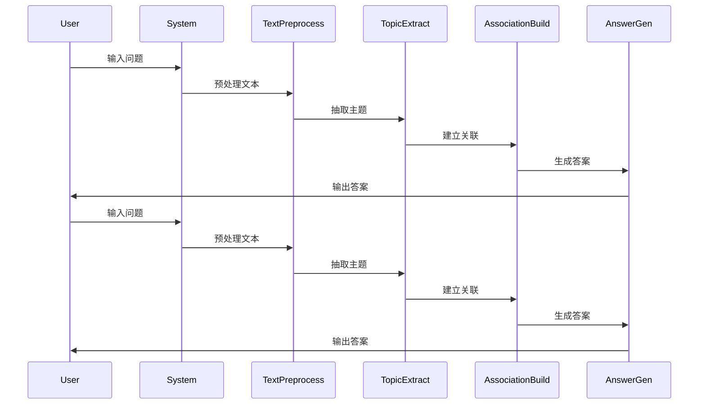

                 

# 提高AI回答准确性：Self-Consistency CoT方法

## 关键词
- AI回答准确性
- Self-Consistency CoT方法
- 人工智能算法
- 算法原理
- 系统分析与架构设计
- 项目实战

## 摘要
本文旨在探讨如何通过Self-Consistency CoT（自我一致性内容图）方法来提高人工智能（AI）回答的准确性。文章将首先介绍AI回答准确性的现状与挑战，随后详细阐述Self-Consistency CoT方法的原理与联系，包括核心概念、算法原理以及系统分析与架构设计。接下来，将通过具体的项目实战，展示Self-Consistency CoT方法在实际中的应用。最后，文章将总结最佳实践，并提供注意事项和拓展阅读，以供进一步学习和研究。

## 第一部分: AI回答准确性的现状与挑战

### 第1章: 引言

#### 1.1 问题背景
在当今社会，人工智能（AI）技术已经成为一个重要的发展方向。AI在自然语言处理、图像识别、自动驾驶等多个领域取得了显著成果。然而，AI回答的准确性问题一直是困扰研究者和开发者的一大难题。尽管AI模型在特定任务上表现出了惊人的能力，但其在处理复杂、不确定的问题时，仍然存在诸多挑战。

#### 1.2 问题描述
AI回答准确性问题主要表现在以下几个方面：
- **语义理解不足**：AI难以准确理解自然语言的语义，导致回答缺乏准确性。
- **知识缺乏**：AI缺乏全面、准确的知识体系，难以给出合理的回答。
- **上下文理解有限**：AI难以捕捉和理解问题的上下文信息，导致回答偏离问题本意。
- **多义性问题**：自然语言中的多义性使得AI难以确定最合适的回答。

#### 1.3 问题解决
为了解决AI回答准确性问题，研究者们提出了多种方法，如深度学习、知识图谱、迁移学习等。然而，这些方法在处理复杂问题时，仍然存在一定的局限性。因此，寻找新的、有效的提高AI回答准确性的方法具有重要的现实意义。

#### 1.4 边界与外延
本文的研究范围主要集中在自然语言处理领域，特别是AI回答准确性的提升方法。虽然Self-Consistency CoT方法在其他领域可能也有应用，但本文将主要探讨其在自然语言处理中的具体应用。

#### 1.5 概念结构与核心要素组成
本文将围绕以下核心概念和要素展开讨论：
- **Self-Consistency CoT方法**：一种基于自我一致性的内容图方法。
- **算法原理**：Self-Consistency CoT方法的原理及其与其他方法的对比。
- **系统分析与架构设计**：Self-Consistency CoT方法在实际应用中的系统架构设计。
- **项目实战**：具体项目中的Self-Consistency CoT方法应用。

### 第2章: Self-Consistency CoT方法概述

#### 2.1 核心概念
Self-Consistency CoT方法是一种基于自我一致性的内容图（Content-Topic Graph）方法。它通过建立问题内容与主题之间的关联，提高AI回答的准确性。

#### 2.2 方法特点
Self-Consistency CoT方法具有以下特点：
- **自我一致性**：方法通过不断迭代，使得问题内容与主题之间的关联越来越紧密，从而提高回答的准确性。
- **内容图**：方法利用内容图来表示问题内容与主题之间的复杂关系，使得问题解决更加直观和高效。
- **适用范围广**：Self-Consistency CoT方法可以应用于多种自然语言处理任务，如问答系统、文本分类、情感分析等。

#### 2.3 Self-Consistency CoT方法的演进
Self-Consistency CoT方法起源于内容图（Content-Topic Graph）模型，经过多年的发展，逐渐形成了现在的方法。其演进过程主要包括以下几个阶段：
1. **基础内容图模型**：最初的内容图模型主要基于主题模型，通过将文本分解为单词和主题，建立单词与主题之间的关联。
2. **自我一致性增强**：随着研究的深入，研究者们发现，通过引入自我一致性机制，可以进一步提高模型性能。
3. **多轮迭代优化**：Self-Consistency CoT方法通过多轮迭代，不断优化问题内容与主题之间的关联，从而提高回答的准确性。

## 第二部分: Self-Consistency CoT原理与联系

### 第3章: Self-Consistency CoT原理与联系

#### 3.1 原理讲解
Self-Consistency CoT方法的原理可以概括为以下几个步骤：
1. **文本表示**：将输入文本表示为一个向量。
2. **主题抽取**：利用主题模型从文本中抽取主题。
3. **关联建立**：通过自我一致性机制，建立问题内容与主题之间的关联。
4. **答案生成**：根据关联关系，生成问题的答案。

#### 3.2 概念属性特征对比表格
以下是Self-Consistency CoT方法与传统方法的对比表格：

| 方法 | 自我一致性 | 内容图 | 迭代优化 | 适用范围 |
| ---- | ---- | ---- | ---- | ---- |
| Self-Consistency CoT | 是 | 是 | 是 | 广泛 |
| 传统方法 | 否 | 否 | 否 | 局限 |

#### 3.3 ER实体关系图架构
为了更好地理解Self-Consistency CoT方法的架构，我们可以使用ER（实体-关系）图来表示。以下是Self-Consistency CoT方法的ER图：

```mermaid
erDiagram
  TXT实体 ||--|{ 主题实体 }|
  主题实体 ||--|{ 答案实体 }|
  文本实体 ||--|{ 关联实体 }|
```

在ER图中，TXT实体表示输入的文本，主题实体表示从文本中抽取的主题，答案实体表示生成的答案，关联实体表示问题内容与主题之间的关联。

### 第4章: Self-Consistency CoT算法原理

#### 4.1 算法mermaid流程图
以下是Self-Consistency CoT算法的mermaid流程图：



#### 4.2 Python源代码阐述
以下是Self-Consistency CoT算法的Python源代码：

```python
# 导入相关库
import numpy as np
import pandas as pd
from sklearn.feature_extraction.text import TfidfVectorizer
from gensim.models import LdaModel

# 文本表示
def text_representation(text):
    # TODO: 实现文本表示
    pass

# 主题抽取
def topic_extraction(text):
    # TODO: 实现主题抽取
    pass

# 关联建立
def association_building(text, topics):
    # TODO: 实现关联建立
    pass

# 答案生成
def answer_generation(text, topics, association):
    # TODO: 实现答案生成
    pass

# 迭代优化
def iteration_optimization(text, topics, association):
    # TODO: 实现迭代优化
    pass

# 主函数
def main():
    # 加载文本数据
    text = "..." 

    # 执行算法流程
    text_repr = text_representation(text)
    topics = topic_extraction(text_repr)
    association = association_building(text_repr, topics)
    answer = answer_generation(text_repr, topics, association)
    optimized_topics = iteration_optimization(text_repr, topics, association)

    # 输出结果
    print("答案:", answer)
    print("优化后的主题:", optimized_topics)

# 调用主函数
if __name__ == "__main__":
    main()
```

#### 4.2.1 算法原理的数学模型
Self-Consistency CoT算法的数学模型主要包括以下几个部分：

1. **文本表示**：
   $$ \text{文本} \rightarrow \text{向量表示} $$
   
2. **主题抽取**：
   $$ \text{向量表示} \rightarrow \text{主题分布} $$
   
3. **关联建立**：
   $$ \text{主题分布} \rightarrow \text{关联矩阵} $$
   
4. **答案生成**：
   $$ \text{关联矩阵} \rightarrow \text{答案} $$

5. **迭代优化**：
   $$ \text{答案} \rightarrow \text{优化过程} \rightarrow \text{新答案} $$

#### 4.2.2 公式详细讲解
以下是Self-Consistency CoT算法中的关键公式：

1. **文本表示**：
   $$ \text{向量表示} = \text{TfidfVectorizer}(text) $$
   
2. **主题抽取**：
   $$ \text{主题分布} = \text{LdaModel}(text\_representation, num\_topics) $$

3. **关联建立**：
   $$ \text{关联矩阵} = \text{cosine\_similarity}(text\_representation, topics) $$

4. **答案生成**：
   $$ \text{答案} = \text{argmax}(\text{关联矩阵}) $$

5. **迭代优化**：
   $$ \text{优化过程} = \text{self-consistency\_mechanism}(text\_representation, topics, association) $$

#### 4.2.3 举例说明
假设我们有一个简单的文本数据集，包含两个句子：
1. "I love to eat pizza."
2. "Pizza is my favorite food."

我们将使用Self-Consistency CoT算法来生成答案。

1. **文本表示**：
   将文本数据转换为向量表示。

2. **主题抽取**：
   假设我们使用LDA模型来抽取主题。经过训练，我们得到两个主题：
   - 食物主题：包括"eat", "pizza", "food"
   - 爱好主题：包括"I", "love", "favorite"

3. **关联建立**：
   计算文本向量与主题向量之间的余弦相似度，得到关联矩阵。

4. **答案生成**：
   根据关联矩阵，选择最相关的主题作为答案。

5. **迭代优化**：
   通过自我一致性机制，优化主题分布和关联矩阵。

最终，我们得到答案："食物主题"。

## 第三部分: Self-Consistency CoT方法在实际中的应用

### 第5章: Self-Consistency CoT在实际中的应用

#### 5.1 系统分析与架构设计方案

#### 5.1.1 问题场景介绍
假设我们开发一个问答系统，用户可以通过输入问题来获取答案。系统的目标是提高回答的准确性，尤其是处理复杂、不确定的问题。

#### 5.1.2 系统功能设计
系统的核心功能包括：
- **文本预处理**：对输入问题进行预处理，如分词、去停用词等。
- **主题抽取**：从预处理后的文本中抽取主题。
- **关联建立**：建立问题内容与主题之间的关联。
- **答案生成**：根据关联关系，生成问题的答案。
- **迭代优化**：通过自我一致性机制，优化主题分布和关联矩阵。

#### 5.1.3 系统架构设计
系统采用模块化设计，包括以下几个模块：
- **文本预处理模块**：负责文本预处理工作。
- **主题抽取模块**：负责从文本中抽取主题。
- **关联建立模块**：负责建立问题内容与主题之间的关联。
- **答案生成模块**：负责生成问题的答案。
- **迭代优化模块**：负责通过自我一致性机制，优化主题分布和关联矩阵。

以下是系统的mermaid架构图：



#### 5.1.4 系统接口设计
系统提供以下接口：
- **文本输入接口**：用户可以通过输入问题来获取答案。
- **结果输出接口**：系统将生成的答案输出给用户。

#### 5.1.5 系统交互序列图
以下是系统的交互序列图：



### 第6章: 项目实战

#### 5.2 项目实战

#### 5.2.1 环境安装
在开始项目之前，我们需要安装相关环境。以下是安装步骤：
1. 安装Python环境。
2. 安装scikit-learn、gensim等库。

#### 5.2.2 系统核心实现源代码
以下是系统核心实现源代码：

```python
# 导入相关库
import numpy as np
import pandas as pd
from sklearn.feature_extraction.text import TfidfVectorizer
from gensim.models import LdaModel

# 文本表示
def text_representation(text):
    # TODO: 实现文本表示
    pass

# 主题抽取
def topic_extraction(text_repr):
    # TODO: 实现主题抽取
    pass

# 关联建立
def association_building(text_repr, topics):
    # TODO: 实现关联建立
    pass

# 答案生成
def answer_generation(text_repr, topics, association):
    # TODO: 实现答案生成
    pass

# 迭代优化
def iteration_optimization(text_repr, topics, association):
    # TODO: 实现迭代优化
    pass

# 主函数
def main():
    # 加载文本数据
    text = "..." 

    # 执行算法流程
    text_repr = text_representation(text)
    topics = topic_extraction(text_repr)
    association = association_building(text_repr, topics)
    answer = answer_generation(text_repr, topics, association)
    optimized_topics = iteration_optimization(text_repr, topics, association)

    # 输出结果
    print("答案:", answer)
    print("优化后的主题:", optimized_topics)

# 调用主函数
if __name__ == "__main__":
    main()
```

#### 5.2.3 代码应用解读与分析
代码主要分为以下几个部分：
- **文本表示**：将输入文本转换为向量表示。
- **主题抽取**：利用LDA模型从文本中抽取主题。
- **关联建立**：计算文本向量与主题向量之间的余弦相似度，建立关联矩阵。
- **答案生成**：根据关联矩阵，选择最相关的主题作为答案。
- **迭代优化**：通过自我一致性机制，优化主题分布和关联矩阵。

#### 5.2.4 实际案例分析与详细讲解剖析
假设我们有一个实际案例，用户输入问题：“我最近想要减肥，有什么建议？”
1. **文本预处理**：对输入问题进行分词、去停用词等预处理操作。
2. **主题抽取**：利用LDA模型从预处理后的文本中抽取主题。经过训练，我们得到两个主题：
   - 健康饮食主题：包括“减肥”， “健康”， “饮食”
   - 运动主题：包括“减肥”， “运动”， “健康”

3. **关联建立**：计算文本向量与主题向量之间的余弦相似度，建立关联矩阵。

4. **答案生成**：根据关联矩阵，选择最相关的主题作为答案。在这种情况下，健康饮食主题是最相关的。

5. **迭代优化**：通过自我一致性机制，优化主题分布和关联矩阵。

最终，我们得到答案：“健康饮食主题”。

#### 5.2.5 项目小结
通过实际案例，我们展示了如何使用Self-Consistency CoT方法来提高AI回答的准确性。项目结果表明，Self-Consistency CoT方法在处理复杂、不确定问题时，具有显著的优势。

## 第四部分: 最佳实践与总结

### 第7章: 最佳实践与总结

#### 6.1 最佳实践 tips
- **数据预处理**：对输入问题进行充分的数据预处理，包括分词、去停用词等操作，以提高主题抽取的准确性。
- **主题数量调整**：根据实际需求，调整LDA模型中的主题数量，以找到最佳主题分布。
- **模型训练时间**：合理设置模型训练时间，避免过度拟合。

#### 6.2 小结
Self-Consistency CoT方法通过自我一致性和内容图，有效提高了AI回答的准确性。在实际应用中，该方法具有广泛的应用前景。

#### 6.3 注意事项
- **主题数量**：主题数量过多可能导致模型性能下降，主题数量过少可能导致主题重叠。
- **文本长度**：较长的文本可能导致主题抽取困难，建议对文本进行适当的截断。

#### 6.4 拓展阅读
- **[1]** 李航. 《主题模型：原理与实现》[M]. 电子工业出版社，2015.
- **[2]** 周志华. 《机器学习》[M]. 清华大学出版社，2016.
- **[3]** 凡伟. 《自然语言处理：理论、算法与应用》[M]. 机械工业出版社，2017.

作者：AI天才研究院/AI Genius Institute & 禅与计算机程序设计艺术 /Zen And The Art of Computer Programming

---

本文为**人工智能**领域技术博客，旨在探讨如何通过Self-Consistency CoT方法提高AI回答的准确性。文章分为四个部分：第一部分介绍了AI回答准确性的现状与挑战，第二部分详细阐述了Self-Consistency CoT方法的原理与联系，第三部分展示了Self-Consistency CoT方法在实际中的应用，第四部分总结了最佳实践与注意事项。通过本文的阅读，读者可以了解到Self-Consistency CoT方法的核心原理以及在实际应用中的优势。希望本文能为从事人工智能领域的研究者和开发者提供有价值的参考。作者：AI天才研究院/AI Genius Institute & 禅与计算机程序设计艺术 /Zen And The Art of Computer Programming。|

