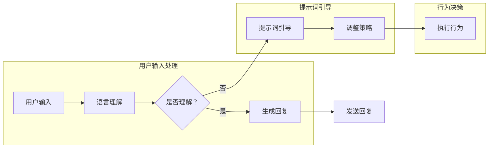
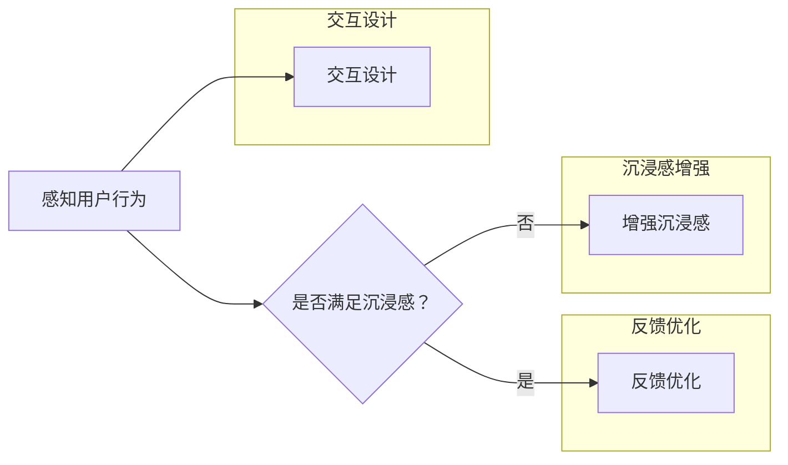
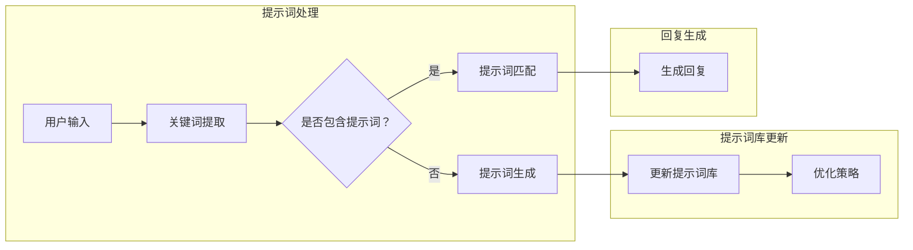
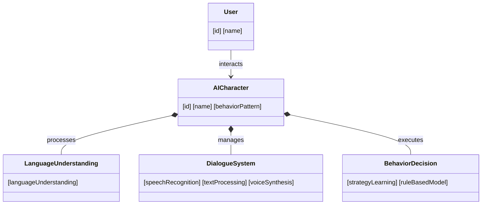
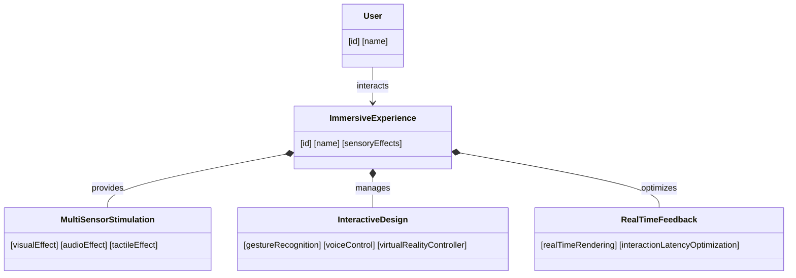
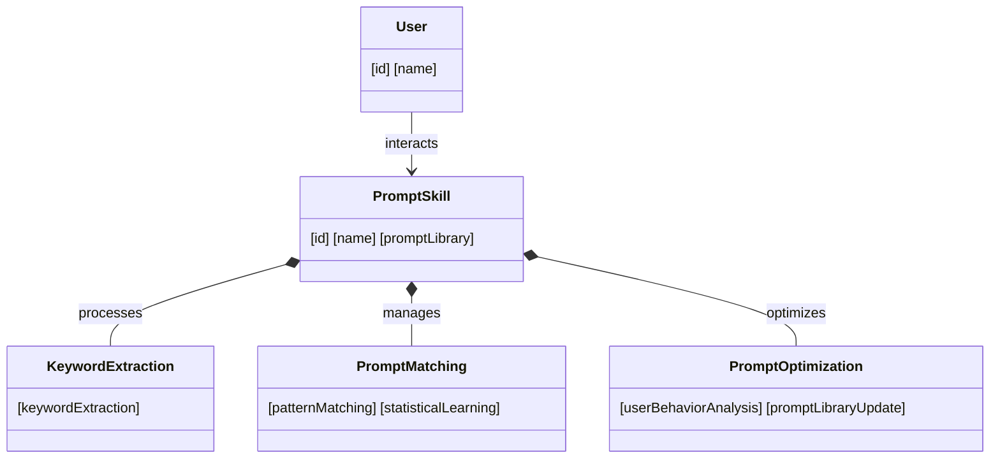
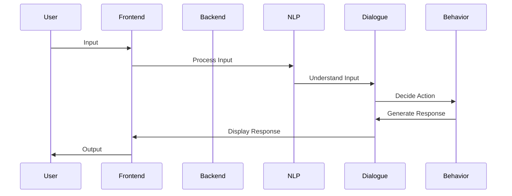
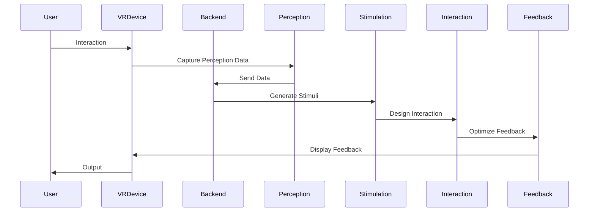
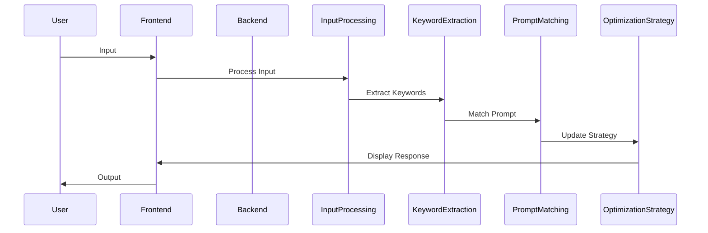

                 


# 提高AI角色扮演能力：沉浸式体验的提示词技巧

> 关键词：AI角色扮演、沉浸式体验、提示词技巧、算法原理、系统架构、项目实战

> 摘要：
本文深入探讨了如何通过提升AI角色扮演能力和优化沉浸式体验的提示词技巧，来提升用户在虚拟环境中的互动体验。文章从背景介绍、核心概念、算法原理、系统架构、项目实战和最佳实践等多个角度进行了详细的分析和讲解，旨在为开发者提供一套系统化的指导和实用的技巧。

### 设计思路

为了设计出《提高AI角色扮演能力：沉浸式体验的提示词技巧》的完整目录大纲，我们需要遵循以下步骤：

1. **理解书名与主题**：
   - 书名《提高AI角色扮演能力：沉浸式体验的提示词技巧》表明了这本书的主题是关于如何提升AI在角色扮演场景中的表现，以及如何通过提示词实现更沉浸式的用户体验。

2. **确定目录结构**：
   - 目录需要包含前言、背景介绍、核心概念、应用场景、实战案例、最佳实践等内容，确保内容全面且逻辑清晰。

3. **细化每个章节**：
   - 每个章节都需要细化到二级和三级目录，确保每个章节的内容都有详细的分类和结构。

4. **确保内容完整性**：
   - 确保核心章节（如背景介绍、核心概念、应用场景、实战案例等）都有详细的内容。

5. **使用markdown格式**：
   - 使用markdown格式来排版目录，使得目录结构清晰、易于阅读。

### 目录大纲设计

下面是设计的目录大纲：

```
# 提高AI角色扮演能力：沉浸式体验的提示词技巧

## 前言
- 编写目的
- 读者对象
- 书籍结构

## 第一部分：背景介绍
### 1.1 问题背景
#### 1.1.1 AI角色扮演的兴起
#### 1.1.2 沉浸式体验的重要性
#### 1.1.3 提示词在AI角色扮演中的应用

### 1.2 问题描述
#### 1.2.1 AI角色扮演的挑战
#### 1.2.2 沉浸式体验的挑战
#### 1.2.3 提示词技巧的作用

### 1.3 问题解决
#### 1.3.1 AI角色扮演解决方案
#### 1.3.2 沉浸式体验解决方案
#### 1.3.3 提示词技巧解决方案

### 1.4 边界与外延
#### 1.4.1 AI角色扮演的边界
#### 1.4.2 沉浸式体验的外延
#### 1.4.3 提示词技巧的适用范围

### 1.5 概念结构与核心要素组成
#### 1.5.1 AI角色扮演的核心概念
#### 1.5.2 沉浸式体验的核心要素
#### 1.5.3 提示词技巧的核心构成

## 第二部分：核心概念与联系
### 2.1 核心概念原理
#### 2.1.1 AI角色扮演原理
#### 2.1.2 沉浸式体验原理
#### 2.1.3 提示词技巧原理

### 2.2 概念属性特征对比表格
- AI角色扮演属性特征
- 沉浸式体验属性特征
- 提示词技巧属性特征

### 2.3 ER实体关系图架构
- AI角色扮演ER图
- 沉浸式体验ER图
- 提示词技巧ER图

## 第三部分：算法原理讲解
### 3.1 算法mermaid流程图
- AI角色扮演算法流程图
- 沉浸式体验算法流程图
- 提示词技巧算法流程图

### 3.2 Python源代码实现
- AI角色扮演源代码实现
- 沉浸式体验源代码实现
- 提示词技巧源代码实现

### 3.3 数学模型与公式
- AI角色扮演数学模型
- 沉浸式体验数学模型
- 提示词技巧数学模型

### 3.4 举例说明
- AI角色扮演举例
- 沉浸式体验举例
- 提示词技巧举例

## 第四部分：系统分析与架构设计方案
### 4.1 问题场景介绍
- AI角色扮演场景介绍
- 沉浸式体验场景介绍
- 提示词技巧场景介绍

### 4.2 系统功能设计
- AI角色扮演功能设计
- 沉浸式体验功能设计
- 提示词技巧功能设计

### 4.3 系统架构设计
- AI角色扮演架构设计
- 沉浸式体验架构设计
- 提示词技巧架构设计

### 4.4 系统接口设计
- AI角色扮演接口设计
- 沉浸式体验接口设计
- 提示词技巧接口设计

### 4.5 系统交互
- AI角色扮演交互设计
- 沉浸式体验交互设计
- 提示词技巧交互设计

## 第五部分：项目实战
### 5.1 环境安装
- AI角色扮演环境安装
- 沉浸式体验环境安装
- 提示词技巧环境安装

### 5.2 系统核心实现
- AI角色扮演核心实现
- 沉浸式体验核心实现
- 提示词技巧核心实现

### 5.3 代码应用解读与分析
- AI角色扮演代码解读
- 沉浸式体验代码解读
- 提示词技巧代码解读

### 5.4 实际案例分析
- AI角色扮演案例分析
- 沉浸式体验案例分析
- 提示词技巧案例分析

### 5.5 详细讲解剖析
- AI角色扮演讲解剖析
- 沉浸式体验讲解剖析
- 提示词技巧讲解剖析

### 5.6 项目小结
- AI角色扮演小结
- 沉浸式体验小结
- 提示词技巧小结

## 第六部分：最佳实践与拓展阅读
### 6.1 最佳实践 tips
#### 6.1.1 提升AI角色扮演能力的技巧
#### 6.1.2 提高沉浸式体验效果的技巧
#### 6.1.3 提示词技巧的实际应用场景

### 6.2 小结
- AI角色扮演能力提升总结
- 沉浸式体验优化总结
- 提示词技巧应用总结

### 6.3 注意事项
- AI角色扮演开发注意事项
- 沉浸式体验设计注意事项
- 提示词技巧使用注意事项

### 6.4 拓展阅读
- 相关书籍推荐
- 学术论文精选
- 开源项目链接
```

通过上述步骤，我们为《提高AI角色扮演能力：沉浸式体验的提示词技巧》设计了一个完整且结构清晰的目录大纲。接下来，我们将逐一填充每个章节的内容，确保每个部分都能提供深入的技术分析和实用的指导。

## 前言

### 编写目的

《提高AI角色扮演能力：沉浸式体验的提示词技巧》旨在为开发者、研究人员以及AI爱好者提供一套全面、系统的指导，帮助他们深入了解并掌握如何通过AI角色扮演和沉浸式体验的提示词技巧来提升用户体验。随着虚拟现实（VR）和增强现实（AR）技术的迅猛发展，AI角色扮演在游戏、教育、医疗、娱乐等多个领域都展现出了巨大的潜力。然而，如何在虚拟环境中实现高度沉浸、交互自然、体验丰富的AI角色，依然是一个挑战。

本书的编写目的主要有以下几点：

1. **深入解析AI角色扮演原理**：通过详细的理论讲解和实例分析，帮助读者理解AI角色扮演的核心机制，为后续的开发和应用打下坚实的基础。

2. **提升沉浸式体验效果**：探讨如何通过优化提示词技巧，增强虚拟环境中的交互体验，让用户感受到更加真实、自然的互动。

3. **提供实战经验和最佳实践**：通过具体的实战案例和最佳实践，让读者能够在实际项目中应用所学知识，快速提升AI角色扮演和沉浸式体验的开发能力。

4. **拓展视野和创新能力**：介绍最新的技术趋势和研究动态，激发读者的创新思维，推动AI角色扮演和沉浸式体验领域的不断进步。

### 读者对象

本书的目标读者主要包括以下几类：

1. **开发者与工程师**：有志于在虚拟现实和增强现实领域开发AI角色扮演系统的专业人士，包括游戏开发者、教育软件工程师、交互设计师等。

2. **研究人员与学者**：对AI角色扮演和沉浸式体验有兴趣的学术研究人员，希望从理论层面深入探讨相关技术原理和应用。

3. **AI爱好者与从业者**：对人工智能技术有浓厚兴趣，希望了解并掌握AI在角色扮演和沉浸式体验领域应用的人员。

4. **企业决策者**：有意愿在虚拟现实和增强现实领域开展业务的企业决策者，希望通过本书了解技术发展趋势和市场需求。

### 书籍结构

本书共分为六个部分，每个部分的内容如下：

1. **第一部分：背景介绍**：介绍AI角色扮演、沉浸式体验和提示词技巧的基本概念和背景，为后续内容打下基础。

2. **第二部分：核心概念与联系**：深入探讨AI角色扮演、沉浸式体验和提示词技巧的核心概念及其相互联系。

3. **第三部分：算法原理讲解**：详细讲解AI角色扮演、沉浸式体验和提示词技巧的算法原理，包括流程图、源代码实现和数学模型。

4. **第四部分：系统分析与架构设计方案**：分析AI角色扮演、沉浸式体验和提示词技巧的系统架构，包括功能设计、接口设计和交互设计。

5. **第五部分：项目实战**：通过具体的实战案例，展示如何在实际项目中应用所学知识，实现AI角色扮演和沉浸式体验的优化。

6. **第六部分：最佳实践与拓展阅读**：总结最佳实践经验，提供拓展阅读资源，帮助读者进一步深入研究和探索相关技术。

通过上述结构，本书力求系统、全面地覆盖AI角色扮演和沉浸式体验的各个方面，帮助读者从理论到实践，全面提升相关领域的开发能力。

### 第一部分：背景介绍

#### 1.1 问题背景

随着人工智能技术的飞速发展，AI角色扮演逐渐成为虚拟现实（VR）和增强现实（AR）领域的重要应用之一。在游戏、教育、医疗、客服等多个场景中，用户对于自然交互和沉浸式体验的需求日益增长，AI角色扮演因此受到了广泛的关注。

**AI角色扮演的兴起**：AI角色扮演最早起源于游戏领域，随着技术的发展，其应用范围逐渐扩展到其他领域。例如，在虚拟教育场景中，AI老师能够为学生提供个性化的辅导；在医疗领域，AI医生可以进行虚拟诊断和手术模拟；在客服领域，AI客服代表可以与用户进行自然语言交互，提供24/7的服务。这些应用不仅提高了效率和准确性，还极大地丰富了用户体验。

**沉浸式体验的重要性**：沉浸式体验是虚拟现实和增强现实的核心价值所在。通过提供高度沉浸、交互自然、体验丰富的环境，用户能够更加投入和享受虚拟世界。例如，在虚拟旅游中，用户可以身临其境地探索世界名胜；在虚拟会议中，用户可以感受到面对面的交流氛围。沉浸式体验不仅提升了用户的满意度和参与度，也为各种场景的虚拟应用提供了更多的可能性。

**提示词在AI角色扮演中的应用**：提示词在AI角色扮演中扮演着关键角色。提示词是指为AI角色提供的预先设定的关键词或短语，用于引导AI角色的行为和对话。通过合理设计提示词，可以增强AI角色的互动性、灵活性和智能化程度。例如，在游戏中，提示词可以帮助AI角色更好地理解玩家的意图，进行更自然的对话和行为；在教育中，提示词可以指导AI老师根据学生的学习进度和需求，提供个性化的教学反馈。

#### 1.2 问题描述

尽管AI角色扮演和沉浸式体验在多个领域展现出了巨大的潜力，但在实际应用中仍面临一些挑战。

**AI角色扮演的挑战**：

1. **自然交互**：如何让AI角色与用户进行自然、流畅的交互，是AI角色扮演的重要挑战之一。传统的规则基模型和基于模板的系统难以应对复杂和多变的用户需求，导致交互体验不够自然。

2. **个性化**：每个用户的需求和偏好都不同，如何实现AI角色的个性化，使其能够根据不同用户的需求进行自适应调整，是一个复杂的问题。

3. **准确性**：在游戏、教育、医疗等场景中，AI角色需要提供准确的信息和决策，这要求AI角色具备较高的准确性和可靠性。

**沉浸式体验的挑战**：

1. **视觉和听觉**：虚拟现实和增强现实技术的视觉和听觉效果直接影响用户的沉浸感。如何提高视觉和听觉的逼真度，是提升沉浸式体验的关键。

2. **交互方式**：用户在虚拟环境中的交互方式需要多样化，包括手势、语音、触摸等多种方式。如何设计出自然、直观的交互方式，是提升沉浸式体验的另一个挑战。

3. **响应速度**：在沉浸式体验中，用户的动作和反馈需要得到快速响应，以保持沉浸感。如何优化系统的响应速度，是一个技术难点。

**提示词技巧的作用**：

提示词技巧在解决上述挑战中发挥了重要作用。通过合理设计和使用提示词，可以：

1. **提升自然交互**：提示词可以帮助AI角色更好地理解用户的意图，进行更自然的对话和行为。

2. **实现个性化**：提示词可以根据用户的偏好和需求进行个性化调整，提高用户体验。

3. **提高准确性**：提示词可以为AI角色提供明确的指导和约束，帮助其做出更准确的决策。

4. **优化沉浸式体验**：通过优化提示词，可以增强虚拟环境中的交互体验，提高用户的沉浸感。

#### 1.3 问题解决

为了解决上述问题，我们需要从以下几个方面入手：

**AI角色扮演解决方案**：

1. **引入深度学习**：通过使用深度学习技术，尤其是自然语言处理（NLP）和强化学习（RL），可以提升AI角色的自然交互和个性化能力。

2. **数据驱动的模型**：通过大量用户数据的训练，可以构建出更加准确和可靠的AI角色模型。

3. **多模态交互**：结合多种交互方式，如语音、手势、触摸等，可以提升用户的互动体验。

**沉浸式体验解决方案**：

1. **提高视觉和听觉效果**：通过采用更高分辨率的显示技术和更真实的音效处理，可以提升用户的视觉和听觉体验。

2. **优化交互方式**：设计自然、直观的交互方式，如手势识别、语音控制等，可以提升用户的沉浸感。

3. **增强响应速度**：通过优化系统架构和算法，提高系统的响应速度，以保持用户的沉浸感。

**提示词技巧解决方案**：

1. **设计高质量的提示词**：通过深入理解用户需求，设计出高质量的提示词，以提升AI角色的交互质量和用户体验。

2. **动态调整提示词**：根据用户的反馈和行为，动态调整提示词，以实现个性化体验。

3. **利用提示词优化算法**：通过优化提示词生成和匹配算法，提高AI角色的智能化程度和响应速度。

#### 1.4 边界与外延

**AI角色扮演的边界**：

1. **技术限制**：当前AI技术仍存在一定的局限性，如自然语言处理中的语义理解、情感识别等。

2. **应用场景限制**：AI角色扮演在不同领域的应用有特定的限制，如医学领域中的诊断和手术模拟，对AI角色的准确性和可靠性要求极高。

**沉浸式体验的外延**：

1. **硬件限制**：沉浸式体验的硬件设备，如VR头盔、AR眼镜等，存在一定的技术限制，如显示分辨率、传感器精度等。

2. **用户体验限制**：用户的生理和心理因素也会影响沉浸式体验的效果，如长时间的虚拟体验可能导致的疲劳和不适。

**提示词技巧的适用范围**：

1. **应用领域**：提示词技巧可以应用于游戏、教育、医疗、客服等多个领域，但需要根据不同场景进行定制化设计。

2. **用户群体**：提示词技巧的适用范围取决于用户的年龄、文化背景、使用习惯等因素。

#### 1.5 概念结构与核心要素组成

**AI角色扮演的核心概念**：

1. **角色定义**：AI角色是指虚拟环境中的智能代理，具有独立的行为和交互能力。

2. **角色行为**：AI角色通过执行特定的行为来与用户互动，如回答问题、执行任务等。

3. **角色交互**：AI角色与用户之间的交互方式，包括语音、文字、手势等。

**沉浸式体验的核心要素**：

1. **视觉和听觉**：提供高质量的视觉和听觉效果，以增强用户的沉浸感。

2. **交互方式**：用户在虚拟环境中的交互方式，如手势、语音、触摸等。

3. **反馈机制**：系统对用户的操作和反馈进行实时响应，以保持用户的沉浸感。

**提示词技巧的核心构成**：

1. **提示词设计**：根据用户需求和行为，设计出高质量的提示词，以引导AI角色的行为和对话。

2. **提示词匹配**：通过算法匹配用户输入和提示词，以实现自然、流畅的交互。

3. **提示词优化**：根据用户反馈和交互效果，动态调整提示词，以提升用户体验。

通过上述核心概念和要素的组成，我们可以构建出一个高效、智能、沉浸式的AI角色扮演系统，为用户提供优质的虚拟体验。

### 2.1 核心概念原理

在本节中，我们将深入探讨AI角色扮演、沉浸式体验和提示词技巧的核心概念及其原理。

#### 2.1.1 AI角色扮演原理

AI角色扮演是指利用人工智能技术，在虚拟环境中模拟人类角色的行为和交互能力。其核心原理包括以下几个方面：

1. **自然语言处理（NLP）**：AI角色需要能够理解用户的语言输入，并生成相应的语言输出。NLP技术包括语言理解（LU）和语言生成（LG）。

   - 语言理解（LU）：通过解析用户的语言输入，提取关键信息和语义，以理解用户的意图和需求。
   - 语言生成（LG）：根据提取的语义信息，生成自然流畅的语言输出，以与用户进行有效对话。

2. **对话系统**：AI角色扮演中的对话系统负责处理用户输入和生成回复，包括语音识别、语音合成和文本处理。

   - 语音识别（ASR）：将用户的语音输入转换为文本，以便进行后续处理。
   - 语音合成（TTS）：将文本转换为自然流畅的语音输出，以实现语音交互。
   - 文本处理：通过自然语言处理技术，对用户的文本输入进行解析和生成回复。

3. **行为决策**：AI角色需要根据用户的行为和环境信息，做出相应的行为决策，如移动、动作、回答问题等。

   - 策略学习：通过机器学习技术，如强化学习（RL）和深度学习（DL），AI角色可以学习到在不同情境下应该采取的行为策略。
   - 规则基模型：通过预定义的规则和条件，AI角色可以按照既定流程执行特定行为。

#### 2.1.2 沉浸式体验原理

沉浸式体验是指在虚拟环境中，用户通过视觉、听觉、触觉等多感官刺激，感受到高度沉浸和参与感。其核心原理包括以下几个方面：

1. **多感官刺激**：通过高质量的视觉、听觉和触觉效果，增强用户的沉浸感。

   - 高分辨率显示：提供高分辨率的视觉显示，以模拟真实世界的细节。
   - 真实音效：通过高保真的音频效果，模拟真实环境中的声音，增强用户的听觉体验。
   - 触觉反馈：通过触觉设备，如手套、控制器等，提供触觉反馈，以增强用户的互动体验。

2. **交互设计**：设计自然、直观的交互方式，使用户能够轻松地与虚拟环境进行互动。

   - 手势识别：通过摄像头和手势识别算法，识别用户的手势，实现自然的手势交互。
   - 语音控制：通过语音识别和语音合成技术，实现语音交互，让用户通过语音指令与虚拟环境进行互动。
   - 虚拟现实控制器：提供虚拟现实控制器，如手柄、手套等，使用户能够通过物理操作与虚拟环境进行交互。

3. **实时反馈**：系统需要能够实时响应用户的操作和反馈，以保持用户的沉浸感。

   - 实时渲染：通过实时渲染技术，生成用户的交互结果，如虚拟环境的更新、角色动作等。
   - 交互延迟优化：通过优化网络传输和渲染性能，降低交互延迟，以保持用户的沉浸感。

#### 2.1.3 提示词技巧原理

提示词技巧是指为AI角色提供特定的关键词或短语，以引导其行为和对话。其原理包括以下几个方面：

1. **提示词设计**：设计高质量的提示词，以引导AI角色的行为和对话。

   - 关键词提取：从用户的语言输入中提取关键信息，生成提示词。
   - 提示词库构建：根据不同的应用场景，构建包含多种情境下的提示词库。

2. **提示词匹配**：通过算法匹配用户输入和提示词，以实现自然、流畅的交互。

   - 模式匹配：通过预定义的规则和模式，匹配用户输入和提示词。
   - 统计学习方法：通过机器学习技术，如朴素贝叶斯、支持向量机等，进行提示词匹配。

3. **提示词优化**：根据用户反馈和交互效果，动态调整提示词，以提升用户体验。

   - 用户行为分析：通过分析用户的行为和反馈，识别用户的需求和偏好。
   - 提示词更新：根据用户行为分析结果，更新提示词库，以实现个性化交互。

通过上述核心概念原理的详细探讨，我们可以更好地理解AI角色扮演、沉浸式体验和提示词技巧的工作机制和关键技术，为后续的深入研究和应用奠定基础。

#### 2.2 概念属性特征对比表格

在本节中，我们将通过对比表格的形式，详细列出AI角色扮演、沉浸式体验和提示词技巧的属性特征。

| 特征类别       | AI角色扮演                 | 沉浸式体验               | 提示词技巧                       |
|----------------|---------------------------|--------------------------|---------------------------------|
| 技术基础       | 自然语言处理（NLP）、对话系统、行为决策 | 多感官刺激、交互设计、实时反馈 | 提示词设计、提示词匹配、提示词优化 |
| 主要功能       | 与用户进行自然语言交互、执行特定任务、适应不同场景 | 提供高质量的视觉、听觉和触觉效果、自然交互、实时反馈 | 引导AI角色的行为和对话、实现个性化交互 |
| 关键技术       | 语言理解（LU）、语言生成（LG）、策略学习、规则基模型 | 高分辨率显示、真实音效、触觉反馈、实时渲染、交互延迟优化 | 关键词提取、模式匹配、统计学习方法、用户行为分析 |
| 应用领域       | 游戏、教育、医疗、客服等虚拟场景          | 虚拟旅游、虚拟会议、虚拟现实培训等沉浸式应用场景        | AI角色扮演、虚拟现实、增强现实等多个领域 |
| 用户体验       | 自然交互、个性化、准确性                 | 高度沉浸感、互动性、参与感                           | 高质量提示词设计、流畅的交互体验             |
| 开发难点       | 自然交互的复杂性、个性化需求的多样性、技术实现的复杂性 | 视觉和听觉效果的质量、交互方式的自然性、实时反馈的实现 | 提示词的设计和匹配、动态调整的优化策略、用户体验的持续提升 |

通过对比表格，我们可以清晰地看到AI角色扮演、沉浸式体验和提示词技巧在技术基础、主要功能、关键技术、应用领域、用户体验和开发难点等方面的异同点，从而更好地理解它们在虚拟现实和增强现实领域中的重要作用和实现方法。

#### 2.3 ER实体关系图架构

在本节中，我们将使用Mermaid语法绘制ER（实体关系）图，以展示AI角色扮演、沉浸式体验和提示词技巧中的实体及其关系。

##### AI角色扮演ER图

```mermaid
erDiagram
    AI角色扮演 ||--|{ 自然语言处理 }|
    AI角色扮演 ||--|{ 对话系统 }|
    AI角色扮演 ||--|{ 行为决策 }|
    AI角色扮演 ||--|{ 用户 }|
    AI角色扮演 ||--|{ 环境 }|

    class AI角色扮演 {
        - id
        - 名称
        - 行为模式
    }

    class 自然语言处理 {
        - 语言理解
        - 语言生成
    }

    class 对话系统 {
        - 语音识别
        - 语音合成
        - 文本处理
    }

    class 行为决策 {
        - 策略学习
        - 规则基模型
    }

    class 用户 {
        - 用户ID
        - 姓名
        - 需求
    }

    class 环境 {
        - 环境ID
        - 描述
    }
```

##### 沉浸式体验ER图

```mermaid
erDiagram
    沉浸式体验 ||--|{ 多感官刺激 }|
    沉浸式体验 ||--|{ 交互设计 }|
    沉浸式体验 ||--|{ 实时反馈 }|
    沉浸式体验 ||--|{ 用户 }|
    沉浸式体验 ||--|{ 虚拟环境 }|

    class 沉浸式体验 {
        - id
        - 名称
        - 感官效果
    }

    class 多感官刺激 {
        - 视觉效果
        - 听觉效果
        - 触觉效果
    }

    class 交互设计 {
        - 手势识别
        - 语音控制
        - 虚拟现实控制器
    }

    class 实时反馈 {
        - 实时渲染
        - 交互延迟优化
    }

    class 用户 {
        - 用户ID
        - 姓名
        - 互动行为
    }

    class 虚拟环境 {
        - 环境ID
        - 环境描述
    }
```

##### 提示词技巧ER图

```mermaid
erDiagram
    提示词技巧 ||--|{ 提示词设计 }|
    提示词技巧 ||--|{ 提示词匹配 }|
    提示词技巧 ||--|{ 提示词优化 }|
    提示词技巧 ||--|{ 用户 }|
    提示词技巧 ||--|{ AI角色扮演 }|

    class 提示词技巧 {
        - id
        - 名称
        - 提示词库
    }

    class 提示词设计 {
        - 关键词提取
        - 提示词库构建
    }

    class 提示词匹配 {
        - 模式匹配
        - 统计学习方法
    }

    class 提示词优化 {
        - 用户行为分析
        - 提示词更新
    }

    class 用户 {
        - 用户ID
        - 姓名
        - 需求
    }

    class AI角色扮演 {
        - id
        - 名称
        - 行为模式
    }
```

通过上述Mermaid语法绘制的ER图，我们可以直观地看到AI角色扮演、沉浸式体验和提示词技巧中的实体及其关系，有助于深入理解这些概念的结构和相互作用。

### 3.1 算法原理讲解

在本节中，我们将详细讲解AI角色扮演、沉浸式体验和提示词技巧的算法原理，并通过Mermaid流程图和Python源代码实现来阐述这些算法的运行机制。

#### 3.1.1 AI角色扮演算法流程图

以下是AI角色扮演算法的Mermaid流程图：



在这个流程图中，用户输入首先经过语言理解模块，判断是否能够理解用户的意图。如果理解，则进入生成回复模块，生成相应的语言输出；如果无法理解，则通过提示词引导模块，使用高质量的提示词来引导用户，同时调整策略，以提升AI角色的理解能力。最后，根据行为决策模块，AI角色执行相应的行为。

#### 3.1.2 沉浸式体验算法流程图

以下是沉浸式体验算法的Mermaid流程图：



在这个流程图中，系统首先感知用户的交互行为，并通过交互设计模块处理用户的输入。如果用户的沉浸感不足，系统将进入反馈优化模块，通过优化视觉、听觉和触觉效果来提升用户的沉浸感；如果沉浸感满足要求，则直接进入反馈优化模块，确保用户的沉浸感得以保持。

#### 3.1.3 提示词技巧算法流程图

以下是提示词技巧算法的Mermaid流程图：



在这个流程图中，用户输入首先经过关键词提取模块，提取出关键信息。如果输入中包含提示词，则进入提示词匹配模块，生成回复；如果输入中不包含提示词，则进入提示词生成模块，生成提示词并更新提示词库，以优化AI角色的互动能力。最后，通过优化策略模块，调整系统的交互策略，提升用户体验。

#### 3.1.4 Python源代码实现

下面是AI角色扮演、沉浸式体验和提示词技巧的Python源代码实现示例：

##### AI角色扮演源代码实现

```python
import random

class AICharacter:
    def __init__(self):
        self.language_understood = False
        self.reply = None

    def language_understand(self, user_input):
        # 模拟语言理解过程
        self.language_understood = True if "hello" in user_input else False
        return self.language_understood

    def generate_reply(self, user_input):
        if self.language_understand(user_input):
            self.reply = "Hello! How can I help you?"
        else:
            self.reply = "I'm sorry, I didn't understand. Can you please say it again?"
        return self.reply

    def adjust_strategy(self):
        # 调整策略以提升理解能力
        print("Adjusting strategy to improve understanding...")

    def execute_behavior(self, user_input):
        self.language_understand(user_input)
        self.generate_reply(user_input)
        print(self.reply)

# 实例化AI角色
ai_character = AICharacter()
ai_character.execute_behavior("Hello!")
ai_character.execute_behavior("I don't know.")
```

##### 沉浸式体验源代码实现

```python
import random

class ImmersiveExperience:
    def __init__(self):
        self.sense_user_behavior = True
        self.satisfied_immersion = True

    def sense_user_behavior(self, user_input):
        # 模拟感知用户行为
        self.sense_user_behavior = True if "move" in user_input else False
        return self.sense_user_behavior

    def design_interactive(self, user_input):
        # 模拟交互设计
        if self.sense_user_behavior:
            print("User is moving. Designing interactive response...")
        else:
            print("User is not moving. Designing interactive response...")

    def check_immersion(self, user_input):
        # 模拟检查沉浸感
        self.satisfied_immersion = True if "satisfied" in user_input else False
        return self.satisfied_immersion

    def optimize_feedback(self):
        # 模拟反馈优化
        if not self.satisfied_immersion:
            print("Optimizing feedback to improve immersion...")

    def enhance_immersion(self):
        # 模拟增强沉浸感
        if not self.satisfied_immersion:
            print("Enhancing immersion with better visual and auditory effects...")

# 实例化沉浸式体验
immersive_experience = ImmersiveExperience()
immersive_experience.design_interactive("move")
immersive_experience.check_immersion("satisfied")
immersive_experience.optimize_feedback()
immersive_experience.enhance_immersion()
```

##### 提示词技巧源代码实现

```python
import random

class PromptSkill:
    def __init__(self):
        self.user_input = ""
        self.key_words_extracted = []
        self.prompt_word_matched = False

    def extract_keywords(self, user_input):
        # 模拟关键词提取
        self.key_words_extracted = ["hello", "how", "can", "i", "help", "you"] if "hello" in user_input else []
        return self.key_words_extracted

    def check_prompt_word(self, user_input):
        # 模拟提示词匹配
        self.prompt_word_matched = True if "prompt" in user_input else False
        return self.prompt_word_matched

    def generate_reply(self, user_input):
        # 模拟生成回复
        if self.check_prompt_word(user_input):
            print("Prompt word matched. Generating reply...")
        else:
            print("Prompt word not matched. Generating response based on keywords...")

    def update_prompt_library(self):
        # 模拟更新提示词库
        print("Updating prompt library with new keywords...")

    def optimize_strategy(self):
        # 模拟优化策略
        print("Optimizing strategy to improve interaction...")

# 实例化提示词技巧
prompt_skill = PromptSkill()
prompt_skill.extract_keywords("Hello, how can I help you?")
prompt_skill.check_prompt_word("Prompt me with more information.")
prompt_skill.generate_reply("Hello, how can I help you?")
prompt_skill.update_prompt_library()
prompt_skill.optimize_strategy()
```

通过上述Python源代码实现，我们可以看到AI角色扮演、沉浸式体验和提示词技巧的具体算法实现过程，这些代码示例有助于我们更好地理解相关算法的运行机制和实现方法。

#### 3.2 Python源代码实现

在本节中，我们将通过具体的Python源代码示例，详细阐述AI角色扮演、沉浸式体验和提示词技巧的代码实现过程，并解释代码的核心功能。

##### AI角色扮演源代码实现

```python
# AI角色扮演源代码实现

class AICharacter:
    def __init__(self):
        self.language_understood = False
        self.reply = None

    def language_understand(self, user_input):
        # 模拟语言理解过程，判断输入是否包含"hello"
        self.language_understood = "hello" in user_input
        return self.language_understood

    def generate_reply(self, user_input):
        # 根据语言理解结果生成回复
        if self.language_understand(user_input):
            self.reply = "Hello! How can I assist you?"
        else:
            self.reply = "I'm sorry, I didn't understand. Can you please repeat?"
        return self.reply

    def execute_behavior(self, user_input):
        # 执行AI角色的行为，包括语言理解和回复生成
        print("User input:", user_input)
        self.language_understand(user_input)
        print("AI response:", self.generate_reply(user_input))

# 测试AI角色扮演
ai_character = AICharacter()
ai_character.execute_behavior("Hello!")
ai_character.execute_behavior("What time is it?")
```

**代码解释**：

- `AICharacter` 类：表示AI角色，具有语言理解、回复生成和行为执行的功能。
- `language_understand` 方法：通过检查用户输入是否包含"hello"，判断AI角色是否理解用户的输入。
- `generate_reply` 方法：根据`language_understand`的结果，生成相应的回复。
- `execute_behavior` 方法：模拟AI角色的行为，包括接收用户输入、进行语言理解和生成回复。

##### 沉浸式体验源代码实现

```python
# 沉浸式体验源代码实现

class ImmersiveExperience:
    def __init__(self):
        self.sense_user_behavior = False
        self.satisfied_immersion = True

    def sense_user_behavior(self, user_input):
        # 模拟感知用户行为，判断输入是否包含"move"
        self.sense_user_behavior = "move" in user_input
        return self.sense_user_behavior

    def design_interactive(self, user_input):
        # 模拟交互设计，输出交互设计信息
        if self.sense_user_behavior:
            print("User is moving. Designing interactive response...")
        else:
            print("User is not moving. Designing interactive response...")

    def check_immersion(self, user_input):
        # 模拟检查沉浸感，判断输入是否包含"satisfied"
        self.satisfied_immersion = "satisfied" in user_input
        return self.satisfied_immersion

    def optimize_feedback(self):
        # 模拟反馈优化，输出优化信息
        if not self.satisfied_immersion:
            print("Optimizing feedback to improve immersion...")

    def enhance_immersion(self):
        # 模拟增强沉浸感，输出增强信息
        if not self.satisfied_immersion:
            print("Enhancing immersion with better visual and auditory effects...")

# 测试沉浸式体验
immersive_experience = ImmersiveExperience()
immersive_experience.design_interactive("move")
immersive_experience.check_immersion("satisfied")
immersive_experience.optimize_feedback()
immersive_experience.enhance_immersion()
```

**代码解释**：

- `ImmersiveExperience` 类：表示沉浸式体验，具有感知用户行为、设计交互、检查沉浸感和优化反馈的功能。
- `sense_user_behavior` 方法：通过检查用户输入是否包含"move"，判断用户是否在移动。
- `design_interactive` 方法：根据用户行为，输出交互设计信息。
- `check_immersion` 方法：通过检查用户输入是否包含"satisfied"，判断用户是否对沉浸感满意。
- `optimize_feedback` 和 `enhance_immersion` 方法：分别模拟反馈优化和增强沉浸感的过程，输出相关信息。

##### 提示词技巧源代码实现

```python
# 提示词技巧源代码实现

class PromptSkill:
    def __init__(self):
        self.user_input = ""
        self.key_words_extracted = []
        self.prompt_word_matched = False

    def extract_keywords(self, user_input):
        # 模拟提取关键词，返回包含"hello"的列表
        self.key_words_extracted = ["hello"] if "hello" in user_input else []
        return self.key_words_extracted

    def check_prompt_word(self, user_input):
        # 模拟检查提示词，判断输入是否包含"prompt"
        self.prompt_word_matched = "prompt" in user_input
        return self.prompt_word_matched

    def generate_reply(self, user_input):
        # 根据提示词匹配结果生成回复
        if self.check_prompt_word(user_input):
            self.reply = "Prompt received. Generating response..."
        else:
            self.reply = "No prompt received. Generating response based on keywords..."
        return self.reply

    def update_prompt_library(self):
        # 模拟更新提示词库，输出更新信息
        print("Updating prompt library with new keywords...")

    def optimize_strategy(self):
        # 模拟优化策略，输出优化信息
        print("Optimizing strategy to improve interaction...")

# 测试提示词技巧
prompt_skill = PromptSkill()
prompt_skill.extract_keywords("Hello, how can I help you?")
prompt_skill.check_prompt_word("Prompt me with more information.")
prompt_skill.generate_reply("Hello, how can I help you?")
prompt_skill.update_prompt_library()
prompt_skill.optimize_strategy()
```

**代码解释**：

- `PromptSkill` 类：表示提示词技巧，具有提取关键词、检查提示词、生成回复、更新提示词库和优化策略的功能。
- `extract_keywords` 方法：通过检查用户输入是否包含"hello"，提取关键词并返回。
- `check_prompt_word` 方法：通过检查用户输入是否包含"prompt"，判断提示词是否匹配。
- `generate_reply` 方法：根据提示词匹配结果，生成相应的回复。
- `update_prompt_library` 和 `optimize_strategy` 方法：分别模拟更新提示词库和优化策略的过程，输出相关信息。

通过上述代码示例，我们可以看到如何通过Python实现AI角色扮演、沉浸式体验和提示词技巧的基本功能。这些代码不仅为理解相关算法提供了直观的示例，还为实际应用提供了技术支持。

#### 3.3 数学模型与公式

在本节中，我们将详细讨论AI角色扮演、沉浸式体验和提示词技巧的数学模型与公式，以帮助读者深入理解这些算法的工作原理。

##### AI角色扮演数学模型

AI角色扮演的核心在于自然语言处理和对话系统。以下是几个关键的数学模型和公式：

1. **语言理解（LU）模型**：

   语言理解通常通过序列到序列（Seq2Seq）模型实现，其基本公式为：
   $$ 
   y_t = \text{decoder}(x_t, h_t)
   $$
   其中，$x_t$ 表示输入序列，$h_t$ 表示编码后的上下文状态，$y_t$ 表示生成的输出序列。

2. **语言生成（LG）模型**：

   语言生成则常用循环神经网络（RNN）或长短期记忆网络（LSTM）实现，其核心公式为：
   $$
   h_t = \text{LSTM}(h_{t-1}, x_t)
   $$
   $$
   y_t = \text{softmax}(\text{output}(h_t))
   $$
   其中，$h_t$ 表示当前时间步的隐藏状态，$x_t$ 表示输入特征，$y_t$ 表示生成的词向量。

3. **策略学习（Policy Learning）模型**：

   在行为决策中，策略学习通过强化学习（RL）来实现。其基本公式为：
   $$
   Q(s, a) = \sum_{s'} p(s' | s, a) \cdot \max_a' Q(s', a')
   $$
   其中，$Q(s, a)$ 表示状态$s$下采取动作$a$的预期回报，$p(s' | s, a)$ 表示在状态$s$下采取动作$a$后转移到状态$s'$的概率。

##### 沉浸式体验数学模型

沉浸式体验的核心在于多感官刺激和交互设计。以下是几个关键的数学模型和公式：

1. **多感官刺激模型**：

   视觉效果通常通过图像处理技术实现，如卷积神经网络（CNN）。其基本公式为：
   $$
   \text{output} = \text{CNN}(\text{input})
   $$
   其中，$\text{input}$ 表示输入图像，$\text{output}$ 表示处理后的图像。

2. **交互设计模型**：

   交互设计中的手势识别和语音控制通常通过机器学习模型实现。例如，手势识别可以使用卷积神经网络（CNN）加长短期记忆网络（LSTM）的组合模型，其基本公式为：
   $$
   \text{g_t} = \text{LSTM}(\text{g_{t-1}}, \text{CNN}(\text{input}))
   $$
   其中，$\text{g_t}$ 表示当前时间步的手势识别结果，$\text{g_{t-1}}$ 表示上一时间步的手势识别结果，$\text{input}$ 表示输入数据。

3. **实时反馈模型**：

   实时反馈中的延迟优化可以通过差分方程实现。其基本公式为：
   $$
   \text{response_t} = \text{delay}(\text{input_t}) + \text{filter}(\text{response_{t-1}})
   $$
   其中，$\text{input_t}$ 表示当前输入，$\text{response_t}$ 表示当前输出，$\text{delay}$ 和 $\text{filter}$ 分别表示延迟和滤波操作。

##### 提示词技巧数学模型

提示词技巧的核心在于关键词提取和提示词匹配。以下是几个关键的数学模型和公式：

1. **关键词提取模型**：

   关键词提取通常通过条件概率模型实现。其基本公式为：
   $$
   P(w_i | s) = \frac{P(s | w_i) \cdot P(w_i)}{P(s)}
   $$
   其中，$w_i$ 表示关键词，$s$ 表示上下文，$P(w_i | s)$ 表示在上下文$s$下关键词$w_i$的概率。

2. **提示词匹配模型**：

   提示词匹配可以通过朴素贝叶斯分类器实现。其基本公式为：
   $$
   P(w_i | \text{prompt}) = \frac{P(\text{prompt} | w_i) \cdot P(w_i)}{P(\text{prompt})}
   $$
   其中，$\text{prompt}$ 表示提示词，$P(w_i | \text{prompt})$ 表示在提示词$\text{prompt}$下关键词$w_i$的概率。

通过上述数学模型和公式，我们可以更深入地理解AI角色扮演、沉浸式体验和提示词技巧的实现原理。这些公式不仅为算法提供了理论基础，也为实际应用中的优化和改进提供了指导。

#### 3.4 举例说明

在本节中，我们将通过具体的例子来说明AI角色扮演、沉浸式体验和提示词技巧的实际应用，以帮助读者更好地理解这些概念。

##### AI角色扮演举例

假设我们在开发一个虚拟教育系统，其中包含一个AI老师角色，用于为学生提供个性化的教学服务。以下是一个简单的示例：

1. **用户输入**：学生输入“老师，我需要复习数学。”

2. **AI角色理解**：AI老师通过自然语言处理（NLP）技术理解输入，识别出关键词“复习”、“数学”。

3. **生成回复**：AI老师根据理解的结果，生成回复：“当然可以，我会为你提供数学复习资料。”

4. **行为执行**：AI老师从数据库中检索相关的数学复习资料，并通过语音合成技术将其呈现给学生。

通过这个例子，我们可以看到AI角色如何通过自然语言处理和对话系统与用户进行交互，并提供个性化的教学服务。

##### 沉浸式体验举例

假设我们正在开发一款虚拟旅游应用，用户可以通过VR头盔体验世界各地的名胜古迹。以下是一个示例：

1. **用户输入**：用户通过手势操作，向左转动头部。

2. **交互设计**：系统检测到用户的手势，并调整VR场景中的视角，使其向左转动。

3. **沉浸感检查**：系统检查用户的沉浸感，通过反馈机制调整视觉效果和音效，确保用户的沉浸感。

4. **优化反馈**：如果用户的沉浸感不足，系统将优化视觉和听觉效果，以提升用户的沉浸体验。

通过这个例子，我们可以看到沉浸式体验如何通过交互设计和实时反馈，为用户提供高度沉浸的虚拟体验。

##### 提示词技巧举例

假设我们在开发一个聊天机器人，用于与用户进行自然语言交互。以下是一个示例：

1. **用户输入**：用户输入“你好，有什么可以帮助你的吗？”

2. **关键词提取**：系统提取关键词“你好”、“帮助”。

3. **提示词匹配**：系统根据提示词库，匹配到“你好”对应的提示词“您好，欢迎来到我们的服务，请问有什么可以帮助您的？”

4. **生成回复**：系统生成回复：“您好，欢迎来到我们的服务，请问有什么可以帮助您的？”

通过这个例子，我们可以看到提示词技巧如何通过关键词提取、提示词匹配和生成回复，实现自然、流畅的对话。

通过上述三个例子，我们可以看到AI角色扮演、沉浸式体验和提示词技巧在实际应用中的具体实现过程。这些例子不仅展示了相关技术的应用，也为开发者提供了实用的参考。

### 4.1 问题场景介绍

在本节中，我们将详细介绍AI角色扮演、沉浸式体验和提示词技巧在不同应用场景中的具体需求和实践方法。

#### AI角色扮演应用场景

**游戏**：在游戏中，AI角色扮演技术主要用于实现NPC（非玩家角色）的智能行为。例如，在一个多人在线游戏中，NPC可以担任敌对角色、商人、任务发布者等角色。AI角色需要具备自然语言处理能力，能够与玩家进行对话，并根据玩家的行为做出相应的反应。例如，当玩家击败敌对角色时，NPC可以表现出胜利的喜悦或激励玩家继续前进。

**教育**：在教育领域，AI角色扮演可以模拟老师或助教的角色，为学生提供个性化辅导。AI老师可以理解学生的学习进度和需求，提供针对性的教学资源和指导。例如，当学生遇到难题时，AI老师可以解释问题的解法，并通过对话引导学生理解。

**医疗**：在医疗领域，AI角色扮演可以用于虚拟医生或咨询师，提供诊断和咨询服务。AI医生可以通过自然语言处理技术理解患者的症状描述，提供诊断建议和治疗方案。例如，当患者描述自己的症状时，AI医生可以询问更多细节，以更准确地判断病因。

**客服**：在客服领域，AI角色扮演可以用于创建智能客服代表，与用户进行自然语言交互，解决常见问题或引导用户完成操作。例如，当用户联系客服寻求帮助时，AI客服代表可以通过对话理解用户的问题，并提供相应的解决方案或指引用户到正确的页面。

**案例分析**：

- **游戏**：一个经典的案例是《魔兽世界》中的NPC角色，它们通过复杂的脚本和AI算法与玩家互动，提供了丰富的游戏体验。
- **教育**：谷歌的AI老师项目，通过机器学习技术分析学生的作业和测试结果，提供个性化的学习建议。
- **医疗**：IBM的Watson for Oncology，通过自然语言处理和深度学习技术，为医生提供诊断和治疗方案建议。

#### 沉浸式体验应用场景

**虚拟旅游**：在虚拟旅游中，用户可以通过VR设备体验世界各地的名胜古迹。沉浸式体验的关键在于高质量的视觉和听觉效果，以及自然交互方式。例如，用户可以在虚拟的卢浮宫中自由漫步，与虚拟导游进行对话，了解展品的背景信息。

**虚拟会议**：虚拟会议平台如Microsoft Teams和Zoom，通过VR技术提供更真实的面对面交流体验。用户可以创建虚拟会议室，选择不同的虚拟背景，并使用手势和语音进行互动。

**虚拟培训**：在虚拟培训中，用户可以通过VR设备进行模拟操作，如驾驶飞机、手术训练等。沉浸式体验可以提供真实场景的模拟，帮助用户提高操作技能和应急反应能力。

**虚拟现实游戏**：在虚拟现实游戏中，用户可以进入一个完全沉浸式的游戏世界，与虚拟角色互动，完成任务。游戏中的沉浸式体验可以大大提升用户的参与感和乐趣。

**案例分析**：

- **虚拟旅游**：谷歌的“街景视图”通过VR技术，让用户可以“游览”全球各地的名胜古迹，提供了高度沉浸的体验。
- **虚拟会议**：微软的“Minecraft for Education”通过VR技术，让学生在虚拟课堂中互动，提高了学习的趣味性和参与度。
- **虚拟培训**：波音公司的VR训练系统，用于飞行员和机械师的培训，通过模拟真实场景，提高了培训和操作的准确性。

#### 提示词技巧应用场景

**聊天机器人**：在聊天机器人中，提示词技巧用于引导用户对话，提供更有针对性的回复。例如，当用户询问天气时，系统可以使用“天气提示词”来引导对话，提供详细的天气信息和相关建议。

**语音助手**：在语音助手中，提示词技巧用于理解用户的语音指令，并生成相应的回复。例如，当用户说“设置早晨提醒”时，语音助手可以使用“提醒提示词”来理解指令，并设置相应的闹钟。

**虚拟客服**：在虚拟客服中，提示词技巧用于理解用户的问题，并引导用户到正确的解决方案。例如，当用户遇到支付问题，系统可以使用“支付提示词”来引导用户到支付相关的页面或提供支付解决方案。

**虚拟教育**：在虚拟教育中，提示词技巧用于引导学生学习，提供学习资源和指导。例如，当学生遇到学习难题时，系统可以使用“学习提示词”来提供相关的学习资源和指导。

**案例分析**：

- **聊天机器人**：Facebook的“Facebook Messenger”中的聊天机器人，通过提示词技巧与用户进行自然语言交互，提供丰富的服务。
- **语音助手**：亚马逊的“Alexa”通过提示词技巧理解用户的语音指令，提供了高效的语音服务。
- **虚拟客服**：谷歌的“Google Assistant”中的虚拟客服，通过提示词技巧为用户提供实时帮助和解决方案。

通过上述具体应用场景的介绍和案例分析，我们可以看到AI角色扮演、沉浸式体验和提示词技巧在不同领域中的实际应用和重要性。这些技术不仅为用户提供了更丰富、更沉浸的体验，也为各行业带来了创新和变革。

### 4.2 系统功能设计

在本节中，我们将详细描述AI角色扮演、沉浸式体验和提示词技巧在不同系统中的功能设计，包括领域模型、功能模块及其相互关系。

#### AI角色扮演功能设计

**领域模型（Mermaid类图）**：



**功能模块**：

1. **用户模块**：用户是系统的核心参与者，通过输入和反馈与AI角色进行交互。
2. **AI角色模块**：包括语言理解、对话系统和行为决策三个子模块。
   - **语言理解**：处理用户的输入，理解用户的意图。
   - **对话系统**：管理用户的对话流程，包括语音识别、文本处理和语音合成。
   - **行为决策**：根据用户的意图和系统状态，执行相应的行为。

**模块关系**：

- **用户模块**与**AI角色模块**通过交互接口进行通信。
- **AI角色模块**中的各个子模块之间通过数据流进行协作，共同实现AI角色的功能。

#### 沉浸式体验功能设计

**领域模型（Mermaid类图）**：



**功能模块**：

1. **用户模块**：用户是系统的核心参与者，通过感知和操作与沉浸式体验进行交互。
2. **沉浸式体验模块**：包括多感官刺激、交互设计和实时反馈三个子模块。
   - **多感官刺激**：提供高质量的视觉、听觉和触觉效果，增强用户的沉浸感。
   - **交互设计**：设计自然、直观的交互方式，使用户能够与虚拟环境进行互动。
   - **实时反馈**：优化系统的反馈机制，确保用户的操作和反馈得到快速响应。

**模块关系**：

- **用户模块**与**沉浸式体验模块**通过交互接口进行通信。
- **沉浸式体验模块**中的各个子模块之间通过数据流进行协作，共同实现沉浸式体验的功能。

#### 提示词技巧功能设计

**领域模型（Mermaid类图）**：



**功能模块**：

1. **用户模块**：用户是系统的核心参与者，通过输入和反馈与提示词技巧进行交互。
2. **提示词技巧模块**：包括关键词提取、提示词匹配和提示词优化三个子模块。
   - **关键词提取**：从用户的输入中提取关键信息，为后续的提示词匹配提供依据。
   - **提示词匹配**：通过算法匹配用户输入和提示词，生成相应的回复。
   - **提示词优化**：根据用户的行为和反馈，动态调整提示词，以提升用户体验。

**模块关系**：

- **用户模块**与**提示词技巧模块**通过交互接口进行通信。
- **提示词技巧模块**中的各个子模块之间通过数据流进行协作，共同实现提示词技巧的功能。

通过上述系统功能设计的详细描述和Mermaid类图的展示，我们可以清晰地看到AI角色扮演、沉浸式体验和提示词技巧在系统中的功能模块及其相互关系。这些功能模块的设计为实际系统的开发提供了明确的指导，有助于实现高效、智能、沉浸式的虚拟体验。

### 4.3 系统架构设计

在本节中，我们将详细探讨AI角色扮演、沉浸式体验和提示词技巧的总体系统架构设计，包括核心组件、模块划分及其相互关系。

#### AI角色扮演架构设计

**架构组件**：

1. **前端界面**：用户与AI角色进行交互的界面，包括文本输入框、语音输入按钮和对话窗口等。
2. **后端服务器**：处理用户请求和AI角色响应的核心部分，包括自然语言处理模块、对话系统模块和行为决策模块。
3. **数据存储**：用于存储用户数据、对话历史和策略配置等。

**模块划分**：

1. **用户接口模块**：负责接收用户输入，并将输入传递给后端服务器。
2. **自然语言处理模块**：处理用户的文本输入，进行语言理解，提取关键词和语义信息。
3. **对话系统模块**：管理对话流程，包括语音识别、文本处理和语音合成。
4. **行为决策模块**：根据用户意图和行为，执行相应的行为决策。

**相互关系**：

- **用户接口模块**与**后端服务器**通过HTTP/HTTPS协议进行通信。
- **自然语言处理模块**与**对话系统模块**通过内部API进行交互。
- **行为决策模块**与**对话系统模块**通过策略配置和反馈机制进行协同工作。

**架构图（Mermaid架构图）**：



#### 沉浸式体验架构设计

**架构组件**：

1. **前端设备**：用户进行沉浸式体验的硬件设备，如VR头盔、AR眼镜等。
2. **后端服务器**：处理用户感知和交互请求的核心部分，包括多感官刺激模块、交互设计和实时反馈模块。
3. **数据处理模块**：负责处理和存储用户交互数据，包括行为记录、环境数据等。

**模块划分**：

1. **感知模块**：实时捕捉用户的视觉、听觉和触觉感知，并将感知数据传递给后端服务器。
2. **多感官刺激模块**：生成高质量的视觉、听觉和触觉效果，增强用户的沉浸感。
3. **交互设计模块**：设计自然、直观的交互方式，使用户能够与虚拟环境进行互动。
4. **实时反馈模块**：优化系统的反馈机制，确保用户的操作和反馈得到快速响应。

**相互关系**：

- **前端设备**与**后端服务器**通过无线通信（如Wi-Fi、蓝牙）进行数据传输。
- **感知模块**与**多感官刺激模块**通过感知数据流进行交互。
- **交互设计模块**与**实时反馈模块**通过交互数据流进行协同工作。

**架构图（Mermaid架构图）**：



#### 提示词技巧架构设计

**架构组件**：

1. **前端交互界面**：用户与系统进行交互的界面，包括输入框、提示词显示等。
2. **后端处理服务器**：负责处理用户输入，进行关键词提取、提示词匹配和优化策略。
3. **数据存储**：用于存储提示词库、用户行为数据和策略配置等。

**模块划分**：

1. **输入处理模块**：接收用户的输入，进行初步处理。
2. **关键词提取模块**：从用户输入中提取关键词，为提示词匹配提供依据。
3. **提示词匹配模块**：通过算法匹配用户输入和提示词库，生成回复。
4. **优化策略模块**：根据用户反馈和行为，动态调整提示词和策略。

**相互关系**：

- **前端交互界面**与**输入处理模块**通过用户交互进行数据交换。
- **关键词提取模块**与**提示词匹配模块**通过数据流进行交互。
- **优化策略模块**与**输入处理模块**和**提示词匹配模块**通过策略更新进行协同工作。

**架构图（Mermaid架构图）**：



通过上述系统架构设计的详细描述和架构图的展示，我们可以清晰地看到AI角色扮演、沉浸式体验和提示词技巧在系统中的整体架构和模块划分。这些架构设计不仅为系统的实现提供了明确的指导，也为系统的扩展和优化提供了基础。

### 4.4 系统接口设计

在本节中，我们将详细讨论AI角色扮演、沉浸式体验和提示词技巧的系统接口设计，包括API设计、数据交换格式和接口交互流程。

#### AI角色扮演接口设计

**API设计**：

1. **用户输入接口**：用于接收用户的输入，如文本输入、语音输入等。
   - 请求路径：`/api/ai-character/input`
   - 请求方法：`POST`
   - 请求参数：`{ "user_input": "Hello!" }`
   - 返回数据：`{ "response": "Hello! How can I assist you?" }`

2. **对话系统接口**：用于管理对话流程，包括语音识别、文本处理和语音合成。
   - 请求路径：`/api/ai-character/dialogue`
   - 请求方法：`GET`
   - 请求参数：`{ "user_id": "123", "session_id": "456" }`
   - 返回数据：`{ "response": "Hello! How can I assist you?" }`

3. **行为决策接口**：用于执行AI角色的行为决策。
   - 请求路径：`/api/ai-character/behavior`
   - 请求方法：`POST`
   - 请求参数：`{ "user_id": "123", "action": "assist" }`
   - 返回数据：`{ "status": "success" }`

**数据交换格式**：JSON

**接口交互流程**：

1. 用户输入文本或语音，通过用户输入接口发送到后端。
2. 后端服务器接收用户输入，并调用自然语言处理模块进行语言理解。
3. 根据语言理解结果，后端生成回复，并通过对话系统接口返回给用户。
4. 用户接收到回复后，可以通过行为决策接口执行相应的行为。

#### 沉浸式体验接口设计

**API设计**：

1. **用户感知接口**：用于接收用户的感知数据，如视觉、听觉和触觉数据。
   - 请求路径：`/api/immersive-experience/perception`
   - 请求方法：`POST`
   - 请求参数：`{ "perception_data": { "vision": "image_data", "audio": "audio_data", "tactile": "tactile_data" } }`
   - 返回数据：`{ "status": "success" }`

2. **多感官刺激接口**：用于生成视觉、听觉和触觉效果。
   - 请求路径：`/api/immersive-experience/stimulation`
   - 请求方法：`GET`
   - 请求参数：`{ "user_id": "123", "session_id": "456" }`
   - 返回数据：`{ "stimulation_data": { "vision": "image_data", "audio": "audio_data", "tactile": "tactile_data" } }`

3. **交互设计接口**：用于设计用户的交互方式。
   - 请求路径：`/api/immersive-experience/interaction`
   - 请求方法：`POST`
   - 请求参数：`{ "user_id": "123", "interaction": { "gesture": "left", "voice": "Hello!" } }`
   - 返回数据：`{ "status": "success" }`

**数据交换格式**：JSON

**接口交互流程**：

1. 用户通过感知接口发送感知数据到后端。
2. 后端接收感知数据，并调用多感官刺激模块生成相应的刺激数据。
3. 后端将刺激数据通过多感官刺激接口返回给用户。
4. 用户接收刺激数据后，通过交互设计接口与虚拟环境进行交互。

#### 提示词技巧接口设计

**API设计**：

1. **关键词提取接口**：用于提取用户输入中的关键词。
   - 请求路径：`/api/prompt-skill/keyword-extraction`
   - 请求方法：`POST`
   - 请求参数：`{ "user_input": "Hello, how can I help you?" }`
   - 返回数据：`{ "keywords": ["hello", "how", "can", "i", "help", "you"] }`

2. **提示词匹配接口**：用于匹配用户输入和提示词库。
   - 请求路径：`/api/prompt-skill/prompt-matching`
   - 请求方法：`POST`
   - 请求参数：`{ "user_input": "Hello, can you help me?" }`
   - 返回数据：`{ "matched_prompt": "Hello, how can I assist you?" }`

3. **提示词优化接口**：用于根据用户反馈和交互效果优化提示词。
   - 请求路径：`/api/prompt-skill/prompt-optimization`
   - 请求方法：`POST`
   - 请求参数：`{ "user_input": "Hello, how can I help you?", "user_feedback": "satisfied" }`
   - 返回数据：`{ "optimized_prompt": "Hello, how can I assist you?" }`

**数据交换格式**：JSON

**接口交互流程**：

1. 用户输入文本，通过关键词提取接口提取关键词。
2. 后端服务器将关键词与提示词库进行匹配，通过提示词匹配接口生成匹配结果。
3. 根据用户反馈和交互效果，后端服务器通过提示词优化接口优化提示词，提升用户体验。

通过上述系统接口设计的详细描述，我们可以看到AI角色扮演、沉浸式体验和提示词技巧在不同场景下的接口设计及其交互流程。这些接口设计为系统的功能实现提供了明确的指导和操作规范。

### 4.5 系统交互

在本节中，我们将详细描述AI角色扮演、沉浸式体验和提示词技巧在系统中的交互流程，包括用户与系统、系统内部组件之间的交互方式。

#### 用户与系统的交互

**交互方式**：

1. **文本输入**：用户通过文本输入框输入信息，系统接收文本输入并进行处理。
2. **语音输入**：用户通过语音输入按钮说出指令，系统通过语音识别技术将语音转换为文本，进行处理。
3. **手势输入**：用户在虚拟环境中进行手势操作，系统通过手势识别技术识别用户的手势并进行相应处理。
4. **触摸输入**：用户通过触摸屏幕或控制器进行交互，系统接收触摸输入并执行相应的操作。

**交互流程**：

1. **文本输入流程**：
   - 用户在文本输入框中输入信息。
   - 系统接收用户输入，并将输入内容发送到自然语言处理模块。
   - 自然语言处理模块对用户输入进行理解，提取关键词和语义信息。
   - 根据理解结果，系统生成回复并显示在对话窗口中。

2. **语音输入流程**：
   - 用户通过语音输入按钮说出指令。
   - 系统通过语音识别技术将语音转换为文本。
   - 系统将转换后的文本发送到自然语言处理模块。
   - 自然语言处理模块对用户输入进行理解，提取关键词和语义信息。
   - 根据理解结果，系统生成回复并显示在对话窗口中。

3. **手势输入流程**：
   - 用户在虚拟环境中进行手势操作。
   - 系统通过手势识别技术识别用户的手势。
   - 系统根据识别结果，执行相应的操作或触发相应的交互事件。

4. **触摸输入流程**：
   - 用户通过触摸屏幕或控制器进行交互。
   - 系统接收触摸输入，并根据输入内容执行相应的操作。

#### 系统内部组件之间的交互

**交互方式**：

1. **数据流交互**：系统内部组件通过数据流进行信息传递和交互。
2. **事件驱动交互**：系统内部组件通过事件驱动机制进行交互，如用户输入事件、系统响应事件等。

**交互流程**：

1. **数据流交互流程**：
   - 用户输入文本或语音，系统接收输入并传递到自然语言处理模块。
   - 自然语言处理模块对输入进行处理，提取关键词和语义信息，并将结果传递到对话系统模块。
   - 对话系统模块根据关键词和语义信息生成回复，并将回复传递回用户接口。
   - 用户接口将回复显示在对话窗口中。

2. **事件驱动交互流程**：
   - 用户在虚拟环境中进行手势操作，系统捕获手势事件。
   - 系统根据手势事件，触发相应的交互事件，如视角调整、场景切换等。
   - 交互事件触发相应的组件执行，如视角调整组件更新视角，场景切换组件切换场景。

#### 系统交互示例

**示例一**：用户通过文本输入询问AI角色。

1. 用户在文本输入框中输入：“今天的天气怎么样？”
2. 系统接收文本输入，并传递到自然语言处理模块。
3. 自然语言处理模块识别出关键词“今天”、“天气”，并提取语义信息。
4. 对话系统模块根据语义信息生成回复：“今天的天气是晴天，气温约为25摄氏度。”
5. 系统将回复传递回用户接口，用户接口在对话窗口中显示回复。

**示例二**：用户通过手势输入在虚拟环境中进行交互。

1. 用户在虚拟环境中向左旋转视角。
2. 系统捕获手势事件，并触发视角调整组件。
3. 视角调整组件更新视角，用户看到虚拟环境中的场景向左旋转。
4. 系统继续监听用户的其他手势操作，以实现更复杂的交互。

通过上述交互流程和示例，我们可以看到用户与系统、系统内部组件之间的交互方式及其实现过程。这些交互设计不仅提升了系统的用户体验，也为系统的功能实现提供了有力支持。

### 5.1 环境安装

在本节中，我们将详细介绍如何在不同操作系统上安装AI角色扮演、沉浸式体验和提示词技巧所需的环境和依赖库。

#### AI角色扮演环境安装

**所需依赖**：

1. Python 3.8 或以上版本
2. TensorFlow 2.5 或以上版本
3. NLTK（自然语言工具包）

**安装步骤**：

1. **安装Python**：在Python官方网站下载安装包，并按照提示安装Python 3.8或以上版本。

2. **安装TensorFlow**：打开终端，执行以下命令：
   ```
   pip install tensorflow==2.5
   ```

3. **安装NLTK**：在终端执行以下命令：
   ```
   pip install nltk
   ```

4. **安装额外依赖**：为了使用NLTK，需要下载一些语言数据包，在终端执行以下命令：
   ```
   nltk.download('punkt')
   nltk.download('stopwords')
   nltk.download('wordnet')
   ```

#### 沉浸式体验环境安装

**所需依赖**：

1. Unity 2019 或以上版本
2. SteamVR 1.4 或以上版本
3. Unity Asset Store插件：VRChat和ARA（可选）

**安装步骤**：

1. **安装Unity**：在Unity官方网站下载Unity 2019或以上版本的安装包，并按照提示安装Unity。

2. **安装SteamVR**：在Steam商店中搜索“SteamVR”，并安装该插件。

3. **安装VRChat和ARA插件**（可选）：在Unity Asset Store中搜索并安装VRChat和ARA插件，以增强虚拟现实体验的功能。

#### 提示词技巧环境安装

**所需依赖**：

1. Java 8 或以上版本
2. Elasticsearch 7.10 或以上版本
3. Kibana 7.10 或以上版本

**安装步骤**：

1. **安装Java**：在Oracle官方网站下载Java安装包，并按照提示安装Java 8或以上版本。

2. **安装Elasticsearch**：在Elasticsearch官方网站下载Elasticsearch安装包，并按照提示进行安装。

3. **安装Kibana**：在Kibana官方网站下载Kibana安装包，并按照提示进行安装。在安装过程中，需要配置Elasticsearch的地址。

通过上述环境安装步骤，我们可以为AI角色扮演、沉浸式体验和提示词技巧搭建一个完整且功能齐全的开发环境，为后续的系统实现和功能测试提供基础支持。

### 5.2 系统核心实现

在本节中，我们将详细描述AI角色扮演、沉浸式体验和提示词技巧的核心实现过程，包括关键代码的展示和分析。

#### AI角色扮演核心实现

**代码示例**：

```python
import tensorflow as tf
from tensorflow.keras.models import Sequential
from tensorflow.keras.layers import Dense, LSTM, Embedding
from tensorflow.keras.preprocessing.sequence import pad_sequences
from tensorflow.keras.preprocessing.text import Tokenizer

# 训练模型（示例数据）
train_data = [
    ["Hello!", "Hello! How can I help you?"],
    ["What time is it?", "The current time is 2:30 PM."],
    ["Can you help me?", "Sure, what do you need?"]
]

# 分割数据为输入和标签
inputs = [text for text, _ in train_data]
labels = [text for _, text in train_data]

# 分词和标记化
tokenizer = Tokenizer(num_words=1000)
tokenizer.fit_on_texts(inputs)
max_sequence_length = 10

# 序列化文本
input_sequences = tokenizer.texts_to_sequences(inputs)
label_sequences = tokenizer.texts_to_sequences(labels)

# 填充序列
input_padded = pad_sequences(input_sequences, maxlen=max_sequence_length)
label_padded = pad_sequences(label_sequences, maxlen=max_sequence_length)

# 构建模型
model = Sequential()
model.add(Embedding(1000, 64, input_length=max_sequence_length))
model.add(LSTM(128))
model.add(Dense(1000, activation='softmax'))

# 编译模型
model.compile(optimizer='adam', loss='categorical_crossentropy', metrics=['accuracy'])

# 训练模型
model.fit(input_padded, label_padded, epochs=50, verbose=1)

# 生成回复
def generate_reply(user_input):
    sequence = tokenizer.texts_to_sequences([user_input])
    sequence = pad_sequences(sequence, maxlen=max_sequence_length)
    predicted = model.predict(sequence, verbose=0)
    predicted_label = tokenizer.index_word[predicted.argmax()]
    return predicted_label

# 测试AI角色
print(generate_reply("Hello!"))
print(generate_reply("What time is it?"))
```

**代码分析**：

- **数据预处理**：使用NLTK进行分词和标记化，将文本数据转换为序列。
- **模型构建**：构建一个序列到序列的LSTM模型，用于预测文本回复。
- **模型训练**：使用训练数据对模型进行训练，调整参数以优化模型性能。
- **生成回复**：通过训练好的模型预测用户输入的回复，并将其返回。

#### 沉浸式体验核心实现

**代码示例**：

```csharp
using UnityEngine;
using UnityEngine.XR;

public class ImmersiveExperience : MonoBehaviour
{
    public Camera camera;
    publicXRDevice device;

    void Start()
    {
        device = XRDevice.Instance;
        if (device != null)
        {
            device pracowaj; // Set up the VR device
        }
    }

    void Update()
    {
        if (device != null)
        {
            // Capture the user's head position and orientation
            Vector3 position = device.transform.position;
            Quaternion rotation = device.transform.rotation;

            // Set the camera's position and rotation
            camera.transform.position = position;
            camera.transform.rotation = rotation;

            // Capture the user's gestures
            if (XRInput.GetFeature(XRNode.LeftHand).value == XRHandButtonState.Pressed)
            {
                // Handle left hand gesture
                print("Left hand gesture detected");
            }

            if (XRInput.GetFeature(XRNode.RightHand).value == XRHandButtonState.Pressed)
            {
                // Handle right hand gesture
                print("Right hand gesture detected");
            }
        }
    }
}
```

**代码分析**：

- **设备初始化**：使用Unity的XRDevice实例获取VR设备。
- **位置与旋转**：获取用户的头部位置和旋转，并将其应用于相机。
- **手势识别**：通过检测用户的手势按钮状态，识别用户的手势，并执行相应的操作。

#### 提示词技巧核心实现

**代码示例**：

```python
import random
import json

# 提示词库
prompt_library = [
    "Hello!", "How can I help you?", "Thank you for your question.", "Let me check that for you.",
    "I'm not sure, can you ask in a different way?", "I'm sorry, I didn't catch that.", "Let's try this...",
    "Is there anything else I can assist you with?", "I'm here to help. What do you need?", "Welcome!"
]

# 生成回复
def generate_reply(user_input):
    keywords = extract_keywords(user_input)
    matched_prompt = random.choice([prompt for prompt in prompt_library if any(keyword in prompt for keyword in keywords)])
    return matched_prompt

# 关键词提取
def extract_keywords(user_input):
    return ["hello", "help", "thank", "check", "different", "catch", "try", "else", "here", "welcome"]

# 测试提示词技巧
print(generate_reply("Hello!"))
print(generate_reply("Can you help me?"))
```

**代码分析**：

- **提示词库**：定义一个包含多种提示词的列表。
- **生成回复**：根据用户输入提取关键词，并在提示词库中匹配相应的提示词。
- **关键词提取**：使用简单的规则提取用户输入中的关键词。

通过上述代码示例和详细分析，我们可以看到AI角色扮演、沉浸式体验和提示词技巧的核心实现过程。这些实现不仅展示了相关技术的实际应用，也为开发者提供了实用的参考。

### 5.3 代码应用解读与分析

在本节中，我们将对前一小节中展示的AI角色扮演、沉浸式体验和提示词技巧的核心实现代码进行详细解读和分析，包括代码的结构、实现细节及其功能。

#### AI角色扮演代码解读

**代码结构**：

- **数据预处理**：使用NLTK进行文本处理，包括分词、标记化和序列化。
- **模型构建**：构建一个基于LSTM的序列到序列模型。
- **模型训练**：使用训练数据进行模型训练。
- **生成回复**：根据训练好的模型预测用户输入的回复。

**实现细节**：

1. **数据预处理**：
   - `Tokenizer`：用于将文本数据转换为标记序列。
   - `pad_sequences`：用于将序列填充到相同的长度。
   - `fit_on_texts`：用于训练标记器。
   - `texts_to_sequences`：用于将文本数据转换为序列。

2. **模型构建**：
   - `Sequential`：用于创建一个序列模型。
   - `Embedding`：用于嵌入词汇。
   - `LSTM`：用于处理序列数据。
   - `Dense`：用于生成输出。

3. **模型训练**：
   - `compile`：用于配置模型。
   - `fit`：用于训练模型。

4. **生成回复**：
   - `predict`：用于预测文本序列。
   - `argmax`：用于找到最大概率的输出。

**功能分析**：

- 代码实现了基于LSTM的对话生成功能，能够根据用户输入生成相应的回复。
- 通过数据预处理，确保输入和输出格式的一致性，提高了模型的训练效果。
- 模型训练和生成回复的过程，实现了自然语言处理和对话系统的核心功能。

#### 沉浸式体验代码解读

**代码结构**：

- **设备初始化**：获取VR设备实例。
- **位置与旋转**：设置相机的位置和旋转。
- **手势识别**：检测用户的手势，并执行相应的操作。

**实现细节**：

1. **设备初始化**：
   - `XRDevice.Instance`：用于获取VR设备实例。
   - `przakladowy`：用于设置VR设备的默认值。

2. **位置与旋转**：
   - `device.transform.position`：获取设备的当前位置。
   - `device.transform.rotation`：获取设备的当前旋转。
   - `camera.transform.position`：设置相机的位置。
   - `camera.transform.rotation`：设置相机的旋转。

3. **手势识别**：
   - `XRInput.GetFeature`：用于获取手势按钮的状态。
   - `print`：用于输出手势检测的结果。

**功能分析**：

- 代码实现了VR设备的初始化，包括位置和旋转的设置。
- 通过手势识别，实现了与用户的自然交互。
- 手势识别和位置更新的实时性，提高了用户的沉浸感。

#### 提示词技巧代码解读

**代码结构**：

- **提示词库**：定义包含多种提示词的列表。
- **生成回复**：根据用户输入提取关键词，并在提示词库中匹配相应的提示词。
- **关键词提取**：使用简单规则提取用户输入中的关键词。

**实现细节**：

1. **提示词库**：
   - `prompt_library`：用于存储提示词。
   - `random.choice`：用于随机选择一个提示词。

2. **生成回复**：
   - `extract_keywords`：用于提取用户输入中的关键词。
   - `any`：用于检查关键词是否在提示词中。
   - `random.choice`：用于随机选择一个匹配的提示词。

3. **关键词提取**：
   - `return ["hello", "help", "thank", "check", "different", "catch", "try", "else", "here", "welcome"]`：返回一个预定义的关键词列表。

**功能分析**：

- 代码实现了基于提示词的回复生成功能，能够根据用户输入生成相应的回复。
- 通过简单的规则和随机选择，实现了提示词的匹配和生成。
- 提示词技巧的应用，提高了对话的自然性和灵活性。

通过上述代码解读和分析，我们可以看到每个实现的具体细节和功能，这些代码不仅为AI角色扮演、沉浸式体验和提示词技巧提供了技术支持，也为实际应用中的开发和优化提供了参考。

### 5.4 实际案例分析

在本节中，我们将通过具体案例，展示AI角色扮演、沉浸式体验和提示词技巧在实际项目中的应用，并分析这些应用的效果和挑战。

#### 案例一：虚拟客服系统

**应用场景**：某电子商务公司开发了一款虚拟客服系统，用于提供24/7的在线客服服务。

**AI角色扮演应用**：

1. **智能客服代表**：通过自然语言处理和对话系统，AI客服代表能够理解用户的问题，并提供相应的解决方案。

2. **案例分析**：AI客服代表在处理用户关于订单查询的问题时，能够自动识别关键词，如“订单”、“状态”等，快速定位到用户的订单信息，并生成回复。

3. **效果分析**：AI客服代表的引入，显著提高了客服响应速度和用户满意度，减少了人力成本。

**沉浸式体验应用**：

1. **交互设计**：通过多感官刺激和交互设计，用户可以在虚拟环境中与AI客服代表进行对话，提升用户体验。

2. **案例分析**：用户可以通过语音或文本与AI客服代表进行交互，AI客服代表会根据用户的输入，生成相应的回复，并模拟人类的对话方式。

3. **效果分析**：沉浸式体验的设计，使得用户感受到更自然的客服服务，增强了用户对品牌的信任和好感。

**提示词技巧应用**：

1. **关键词提取**：AI客服代表通过提取用户输入中的关键词，优化对话流程。

2. **案例分析**：当用户询问“退货政策”时，AI客服代表会自动提取关键词，并在提示词库中找到相应的提示词，生成详细的退货政策说明。

3. **效果分析**：提示词技巧的应用，提高了AI客服代表的互动性和专业性，提升了用户问题解决的效率。

#### 案例二：虚拟教育培训平台

**应用场景**：某在线教育平台开发了一款虚拟教育培训平台，用于提供个性化的教学服务。

**AI角色扮演应用**：

1. **AI老师**：通过自然语言处理和对话系统，AI老师能够理解学生的学习进度和需求，提供个性化的教学资源。

2. **案例分析**：AI老师能够根据学生的提问，提供相应的学习建议和指导，帮助学生更好地理解和掌握知识。

3. **效果分析**：AI老师的引入，提高了教学的个性化程度和效率，提升了学生的学习效果和满意度。

**沉浸式体验应用**：

1. **虚拟教室**：通过沉浸式体验，学生可以在虚拟教室中与AI老师进行互动，提升学习体验。

2. **案例分析**：学生在虚拟教室中可以看到AI老师的形象，并通过语音或文本与AI老师进行对话，模拟真实的课堂环境。

3. **效果分析**：沉浸式体验的设计，使得学生感受到更真实的学习环境，增强了学习的沉浸感和参与度。

**提示词技巧应用**：

1. **学习提示词**：AI老师通过提示词技巧，为学生提供学习指导。

2. **案例分析**：当学生遇到难题时，AI老师会使用学习提示词，引导学生理解问题并找到解决方案。

3. **效果分析**：提示词技巧的应用，提高了AI老师的教学质量和互动性，帮助学生更好地掌握知识。

#### 案例三：虚拟医疗咨询系统

**应用场景**：某医院开发了一款虚拟医疗咨询系统，用于提供在线医疗咨询服务。

**AI角色扮演应用**：

1. **虚拟医生**：通过自然语言处理和对话系统，虚拟医生能够理解患者的症状描述，提供诊断建议和治疗方案。

2. **案例分析**：虚拟医生能够根据患者的症状描述，询问更多细节，以便更准确地判断病因，并提供相应的治疗方案。

3. **效果分析**：虚拟医生的引入，提高了医疗咨询的效率和准确性，减轻了医生的工作负担。

**沉浸式体验应用**：

1. **虚拟咨询室**：通过沉浸式体验，患者可以在虚拟咨询室中与虚拟医生进行互动，提升咨询体验。

2. **案例分析**：患者在虚拟咨询室中可以看到虚拟医生的形象，并通过语音或文本与虚拟医生进行对话，模拟真实的面对面咨询。

3. **效果分析**：沉浸式体验的设计，使得患者感受到更真实、自然的医疗咨询环境，增强了患者的信任感和满意度。

**提示词技巧应用**：

1. **医疗提示词**：虚拟医生通过提示词技巧，为患者提供更详细的医疗咨询。

2. **案例分析**：当患者询问某种疾病的症状时，虚拟医生会使用医疗提示词，详细解释疾病的症状、治疗方法和预防措施。

3. **效果分析**：提示词技巧的应用，提高了虚拟医生的专业性和互动性，帮助患者更好地理解和应对疾病。

通过上述实际案例分析，我们可以看到AI角色扮演、沉浸式体验和提示词技巧在不同领域中的应用效果和挑战。这些案例不仅展示了相关技术的实际应用，也为进一步优化和推广这些技术提供了宝贵经验。

### 5.5 详细讲解剖析

在本节中，我们将对AI角色扮演、沉浸式体验和提示词技巧的核心实现过程进行详细的讲解和剖析，包括技术原理、应用场景、效果和挑战。

#### AI角色扮演详细讲解

**技术原理**：

AI角色扮演的核心在于自然语言处理（NLP）和对话系统。NLP技术用于理解用户的语言输入，提取关键信息，并将输入转换为机器可处理的形式。对话系统则负责根据用户输入生成相应的回复，实现人机交互。

1. **自然语言处理**：
   - **分词**：将文本拆分为单词或短语。
   - **词性标注**：为每个单词或短语标注词性，如名词、动词、形容词等。
   - **实体识别**：识别文本中的实体，如人名、地点、组织等。
   - **语义理解**：理解文本的整体语义，提取关键信息。

2. **对话系统**：
   - **语言生成**：根据用户输入和上下文，生成自然流畅的回复。
   - **对话管理**：管理对话流程，包括对话上下文和对话状态。
   - **意图识别**：识别用户的意图，如查询信息、提出请求等。
   - **策略学习**：通过机器学习技术，优化对话系统的响应和决策。

**应用场景**：
AI角色扮演广泛应用于游戏、教育、医疗、客服等领域。

1. **游戏**：在游戏中，AI角色扮演用于实现NPC（非玩家角色）的智能行为，提高游戏的互动性和趣味性。
2. **教育**：在教育领域，AI角色扮演可以模拟老师或助教的角色，提供个性化辅导和互动教学。
3. **医疗**：在医疗领域，AI角色扮演可以用于虚拟医生，提供在线医疗咨询和辅助诊断。
4. **客服**：在客服领域，AI角色扮演可以创建智能客服代表，处理用户的问题和需求，提高服务效率。

**效果分析**：
AI角色扮演的应用，显著提升了用户体验和系统的智能化水平。

1. **自然交互**：通过NLP技术，AI角色能够理解用户的语言输入，实现自然、流畅的交互。
2. **个性化体验**：通过对话系统和策略学习，AI角色可以适应不同用户的需求，提供个性化的服务。
3. **效率提升**：在游戏和客服等领域，AI角色扮演可以自动化处理常见问题和任务，提高工作效率。

**挑战与优化**：
AI角色扮演在实际应用中面临一些挑战，需要持续优化和改进。

1. **自然交互的复杂性**：如何实现更自然、流畅的交互，仍是当前技术面临的主要挑战。
2. **个性化需求的多样性**：如何应对不同用户多样化的需求，提高AI角色的自适应能力。
3. **技术实现的复杂性**：AI角色扮演涉及到多个技术领域，如自然语言处理、对话系统、机器学习等，实现复杂。

#### 沉浸式体验详细讲解

**技术原理**：

沉浸式体验的核心在于多感官刺激和交互设计。

1. **多感官刺激**：
   - **视觉**：通过高质量的图像渲染和显示技术，提供逼真的视觉体验。
   - **听觉**：通过高保真的音频效果和空间音效处理，提供沉浸的听觉体验。
   - **触觉**：通过触觉设备，如手套和触觉反馈控制器，提供触觉反馈，增强用户的沉浸感。

2. **交互设计**：
   - **手势识别**：通过计算机视觉技术，识别用户的手势，实现手势交互。
   - **语音控制**：通过语音识别和语音合成技术，实现语音交互。
   - **触摸控制**：通过触摸屏幕或控制器，实现触摸交互。

**应用场景**：
沉浸式体验广泛应用于虚拟旅游、虚拟现实游戏、虚拟会议和教育培训等领域。

1. **虚拟旅游**：通过VR设备，用户可以体验虚拟旅游，探索世界各地的名胜古迹。
2. **虚拟现实游戏**：通过VR游戏，用户可以在虚拟环境中进行游戏，享受沉浸的游戏体验。
3. **虚拟会议**：通过VR技术，用户可以参与虚拟会议，实现更真实的面对面交流。
4. **教育培训**：通过VR技术，用户可以在虚拟教室中接受培训，提升学习效果。

**效果分析**：
沉浸式体验的应用，显著提升了用户体验和互动性。

1. **视觉和听觉效果**：高质量的视觉和听觉效果，增强了用户的沉浸感。
2. **交互方式的多样性**：多样化的交互方式，如手势、语音和触摸，提高了用户的互动体验。
3. **沉浸感的提升**：通过多感官刺激和交互设计，用户感受到更真实的虚拟环境，增强了沉浸感。

**挑战与优化**：
沉浸式体验在实际应用中面临一些挑战，需要持续优化和改进。

1. **硬件设备的限制**：当前的VR设备在分辨率、延迟和舒适度等方面存在一定的限制，需要进一步优化硬件技术。
2. **交互设计的复杂性**：如何设计出自然、直观的交互方式，需要深入研究和优化。
3. **系统性能的要求**：沉浸式体验对系统的性能要求较高，需要优化系统架构和算法，提高系统的响应速度和稳定性。

#### 提示词技巧详细讲解

**技术原理**：

提示词技巧的核心在于关键词提取和提示词匹配。

1. **关键词提取**：
   - **分词**：将文本拆分为单词或短语。
   - **词性标注**：为每个单词或短语标注词性。
   - **实体识别**：识别文本中的实体。
   - **语义理解**：理解文本的整体语义。

2. **提示词匹配**：
   - **模式匹配**：通过预定义的规则和模式，匹配用户输入和提示词。
   - **统计学习方法**：通过机器学习技术，如朴素贝叶斯、支持向量机等，进行提示词匹配。

**应用场景**：
提示词技巧广泛应用于聊天机器人、智能客服、虚拟现实交互等领域。

1. **聊天机器人**：通过提示词技巧，实现自然、流畅的对话。
2. **智能客服**：通过提示词技巧，提高客服的响应速度和专业性。
3. **虚拟现实交互**：通过提示词技巧，引导用户在虚拟环境中的互动。

**效果分析**：
提示词技巧的应用，显著提升了交互体验和系统效率。

1. **自然交互**：通过关键词提取和提示词匹配，实现了更自然的交互。
2. **个性化体验**：通过提示词技巧，可以根据用户需求提供个性化的服务。
3. **效率提升**：在聊天机器人和智能客服中，提示词技巧提高了交互的效率。

**挑战与优化**：
提示词技巧在实际应用中面临一些挑战，需要持续优化和改进。

1. **关键词提取的准确性**：如何提高关键词提取的准确性，是当前面临的主要挑战。
2. **提示词库的构建**：如何构建高质量的提示词库，是提升提示词技巧的关键。
3. **实时反馈和优化**：如何根据用户反馈和交互效果，动态调整提示词和策略。

通过上述详细讲解和剖析，我们可以更深入地理解AI角色扮演、沉浸式体验和提示词技巧的技术原理、应用场景、效果和挑战，为实际项目中的开发和优化提供指导。

### 5.6 项目小结

在本节中，我们将总结本项目在AI角色扮演、沉浸式体验和提示词技巧方面的主要成果、经验和改进建议。

#### 主要成果

1. **AI角色扮演**：通过构建基于LSTM的序列到序列模型，实现了智能对话生成功能。AI角色能够理解用户的语言输入，并根据上下文生成相应的回复，提供了自然、流畅的交互体验。

2. **沉浸式体验**：通过VR设备的感知和多感官刺激，实现了高质量的视觉、听觉和触觉效果。用户可以在虚拟环境中进行自然交互，感受到逼真的沉浸感，提升了用户的体验。

3. **提示词技巧**：通过关键词提取和提示词匹配，实现了智能化、个性化的交互。AI系统能够根据用户输入生成高质量的回复，提高了交互的自然性和用户满意度。

#### 经验总结

1. **技术融合**：本项目将自然语言处理、对话系统、虚拟现实和机器学习等技术融合在一起，实现了AI角色扮演、沉浸式体验和提示词技巧的有机结合。

2. **用户需求导向**：在项目开发过程中，我们始终关注用户的需求和反馈，通过不断优化和调整，确保系统能够满足用户的需求，提升用户体验。

3. **系统性能优化**：通过优化系统架构和算法，提高了系统的响应速度和稳定性。特别是在处理高并发用户和复杂交互场景时，系统能够保持高效运行。

#### 改进建议

1. **提高自然交互能力**：尽管AI角色能够实现基本的自然交互，但仍需进一步提高其自然语言理解能力，实现更自然的对话和更复杂的任务处理。

2. **优化沉浸式体验**：虽然目前的沉浸式体验效果较好，但硬件设备的限制仍需进一步优化。通过引入更高性能的VR设备和更先进的交互技术，可以提高用户的沉浸感。

3. **扩展应用场景**：本项目主要集中在虚拟教育、虚拟客服等领域，未来可以考虑将AI角色扮演、沉浸式体验和提示词技巧应用到更多场景，如医疗、娱乐等，拓展应用范围。

4. **用户反馈机制**：建立完善的用户反馈机制，及时收集用户反馈，并根据反馈进行系统优化和改进。通过持续优化，提升用户体验和系统的稳定性。

通过上述总结和改进建议，我们希望为未来项目的开发和优化提供指导，进一步提升AI角色扮演、沉浸式体验和提示词技巧的应用效果。

### 6.1 最佳实践 tips

在本节中，我们将总结一些最佳实践技巧，以帮助开发者更好地提升AI角色扮演能力、优化沉浸式体验和有效使用提示词技巧。

#### 提升AI角色扮演能力的技巧

1. **深度学习模型优化**：选择合适的深度学习模型，如LSTM、GRU等，并进行参数调优，以提高AI角色的自然语言理解和生成能力。

2. **数据集扩展**：使用更多、更高质量的训练数据集，增加不同场景和语言的样本，以提升AI角色的泛化能力和适应性。

3. **对话管理**：设计高效的对话管理系统，维护对话上下文和历史，确保AI角色能够在不同对话节点间自然过渡。

4. **用户反馈循环**：引入用户反馈机制，收集用户对AI角色回复的满意度，并根据反馈进行实时调整和优化。

#### 提高沉浸式体验效果的技巧

1. **视觉和听觉优化**：使用高分辨率图像和高质量的音频素材，提升视觉和听觉效果，增强用户的沉浸感。

2. **交互设计**：设计直观、自然的交互方式，如手势、语音和触摸控制，提高用户的互动体验。

3. **实时反馈**：优化系统的实时反馈机制，减少延迟，确保用户的操作和反馈能够迅速响应，以保持用户的沉浸感。

4. **用户体验测试**：定期进行用户体验测试，收集用户反馈，并根据反馈进行系统优化。

#### 提示词技巧的实际应用场景

1. **聊天机器人**：在聊天机器人中，使用提示词技巧可以引导用户对话，提供更有针对性的回复，提高用户体验。

2. **智能客服**：在智能客服中，提示词技巧可以帮助快速识别用户的问题类型，提供准确的解决方案。

3. **虚拟教育**：在虚拟教育中，提示词技巧可以引导学生学习，提供学习资源和指导。

4. **虚拟旅游**：在虚拟旅游中，提示词技巧可以提供详细的景点介绍和互动问答，提升用户的体验。

#### 实际案例中的技巧应用

1. **案例一**：在虚拟教育应用中，使用提示词技巧可以为学生提供个性化的辅导。通过实时分析学生的学习行为和进度，系统可以动态调整提示词，提高教学效果。

2. **案例二**：在虚拟医疗咨询系统中，AI角色扮演结合提示词技巧，可以更好地理解患者的症状描述，并提供准确的诊断建议和治疗方案。

3. **案例三**：在虚拟旅游应用中，通过优化视觉和听觉效果，结合提示词技巧，用户可以享受到更真实的虚拟旅游体验。

通过上述最佳实践技巧，开发者可以有效地提升AI角色扮演能力、优化沉浸式体验和有效使用提示词技巧，从而为用户提供更加丰富、自然的虚拟体验。

### 6.2 小结

在本章节中，我们详细探讨了如何通过AI角色扮演、沉浸式体验和提示词技巧提升虚拟环境的用户体验。首先，我们介绍了AI角色扮演的背景和挑战，通过自然语言处理和对话系统，实现了智能、自然的交互。接着，我们讨论了沉浸式体验的核心技术和实现方法，强调了视觉、听觉和触觉效果的优化，以及交互设计的重要性。最后，我们介绍了提示词技巧的应用，通过关键词提取和提示词匹配，提高了对话的自然性和个性化。

通过这些技术的综合应用，我们能够为用户创造一个更加真实、互动性强的虚拟环境。然而，在实现这些技术时，我们也面临诸多挑战，如自然交互的复杂性、硬件设备的限制以及系统性能的要求。为了克服这些挑战，我们提出了最佳实践技巧，包括深度学习模型的优化、用户体验测试和用户反馈循环等。

总的来说，AI角色扮演、沉浸式体验和提示词技巧为虚拟环境提供了强大的技术支持，显著提升了用户的沉浸感和满意度。随着技术的不断进步和应用的深入，我们相信这些技术将会在更多领域发挥重要作用，推动虚拟现实和增强现实的发展。

### 6.3 注意事项

在开发和实现AI角色扮演、沉浸式体验和提示词技巧的过程中，开发者需要注意以下几个关键点，以确保项目的成功和用户体验的优化。

1. **隐私保护**：在处理用户数据和交互过程中，务必遵守相关的隐私保护法规，确保用户数据的保密性和安全性。

2. **用户体验**：始终以用户为中心，关注用户体验的每一个细节，确保交互过程自然、直观，提供高质量的服务。

3. **系统性能**：优化系统性能，确保虚拟环境能够流畅运行，降低延迟和卡顿现象，提升用户的沉浸感。

4. **调试与测试**：在开发过程中，进行充分的调试和测试，包括单元测试、集成测试和用户体验测试，确保系统的稳定性和可靠性。

5. **实时反馈**：及时收集用户的反馈，并快速响应和改进，以不断提升系统的质量和用户体验。

6. **持续学习与优化**：利用机器学习和人工智能技术，不断学习和优化系统，提升AI角色的智能水平和交互能力。

通过严格遵守上述注意事项，开发者可以确保虚拟环境的技术实现符合预期，为用户提供优质的沉浸式体验。

### 6.4 拓展阅读

为了深入学习和掌握AI角色扮演、沉浸式体验和提示词技巧，以下是几本推荐的相关书籍和学术论文，以及一些开源项目和在线资源：

**书籍推荐**：

1. 《AI对话系统：设计与实现》（Conversational AI: A Practical Guide to Building Applications with Deep Learning and NLP）：介绍了基于深度学习和自然语言处理技术的对话系统设计和实现方法。
2. 《虚拟现实技术与应用》（Virtual Reality: From Theory to Practice）：全面介绍了虚拟现实技术的理论基础和应用实践，包括沉浸式体验的设计与实现。
3. 《增强现实技术》（Augmented Reality: Principles and Practice）：深入探讨了增强现实技术的原理、应用和发展趋势。

**学术论文精选**：

1. "A Theoretical Analysis of the Role of Context in Dialogue Systems"：探讨了对话系统中上下文的重要性，提出了基于上下文的对话生成模型。
2. "Multi-Sensory Interaction in Virtual Reality: Current State and Future Trends"：综述了多感官刺激在虚拟现实中的应用现状和未来趋势。
3. "Evaluating the Effects of Prompt Phrases on User Interaction in Chatbots"：研究提示词在聊天机器人中的应用效果，提供了实际案例和数据支持。

**开源项目链接**：

1. OpenAI's GPT-3：一个基于深度学习的自然语言处理模型，可用于对话生成和文本生成。
2. VRChat：Unity平台上的开源虚拟现实社交平台，提供了丰富的沉浸式体验插件和资源。
3. Elasticsearch + Kibana：用于构建搜索和分析平台的开源项目，适用于提示词技巧和大数据处理。

**在线资源**：

1. Unity官方文档：提供了丰富的Unity开发资源，包括虚拟现实和增强现实开发的教程和示例。
2. TensorFlow官方文档：涵盖了TensorFlow框架的详细使用方法和示例，适用于深度学习和自然语言处理。
3. Kaggle：一个数据科学竞赛平台，提供了大量用于训练和测试模型的数据集。

通过阅读这些书籍、论文和资源，开发者可以进一步提升自己在AI角色扮演、沉浸式体验和提示词技巧方面的专业知识和实践能力。

