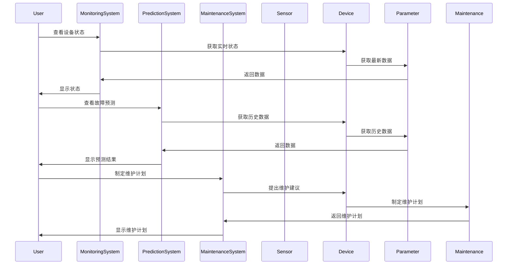
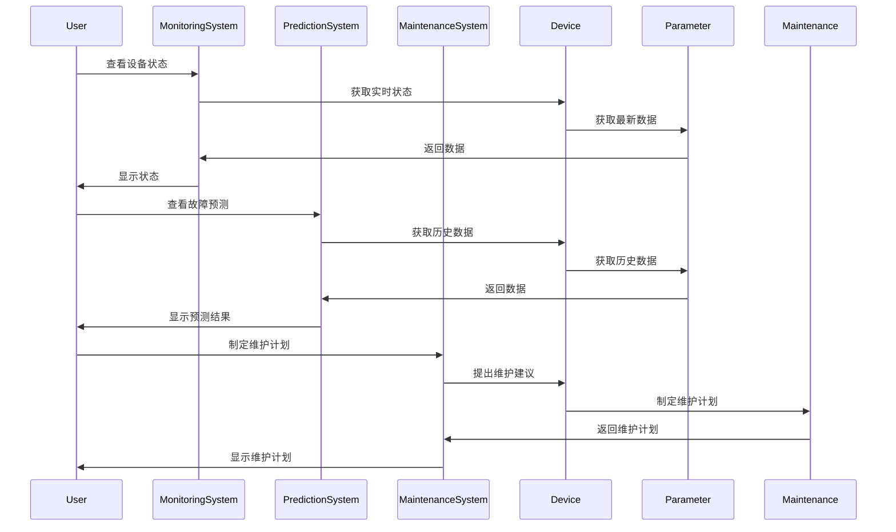

                 

## 引言与背景介绍

### 数字孪生的兴起与重要性

数字孪生（Digital Twin）是一种先进的技术，它通过创建一个虚拟的数字模型来模拟和反映物理实体的状态、行为和交互。这一概念最早由美国密歇根大学教授Michael Grieves在2002年提出，并在近年来随着物联网（IoT）、云计算、大数据和人工智能等技术的发展而逐渐成熟并广泛应用。

数字孪生的兴起并非偶然，它是在全球化制造、个性化需求、智能制造等背景下应运而生的。随着产品和系统越来越复杂，传统的产品生命周期管理（PLM）方法已难以满足对实时性、精确性和高效性的需求。数字孪生技术提供了一种全新的解决方案，使得企业在产品生命周期的各个阶段都能够进行精准模拟、优化和预测。

### 数字孪生在产品生命周期管理中的作用

在产品生命周期管理中，数字孪生技术扮演了关键角色，具体体现在以下几个方面：

1. **设计阶段**：通过数字孪生技术，设计师可以创建产品的虚拟模型，并在虚拟环境中进行设计和测试，从而降低物理原型制作的成本和时间。数字孪生还可以支持协同设计，使多学科团队能够实时共享和协作。

2. **制造阶段**：数字孪生可以实时监控制造过程，提供实时反馈，帮助制造商优化生产流程，减少故障和停机时间。此外，数字孪生还可以用于预测性维护，通过分析设备数据，提前预测设备故障，从而减少维护成本。

3. **运维阶段**：在产品投入使用后，数字孪生可以帮助企业进行设备状态监测和故障预测，优化维护策略，提高设备的可靠性和寿命。同时，数字孪生还可以支持远程诊断和维修，降低维护成本。

4. **生命周期结束阶段**：数字孪生可以用于产品退役和资源回收，通过分析产品的使用情况和磨损情况，制定最优的资源回收策略，提高资源的利用率。

### 数字孪生技术的应用价值与挑战

数字孪生技术具有显著的应用价值，主要体现在以下几个方面：

1. **提升产品设计效率**：数字孪生技术可以帮助设计师快速迭代设计，缩短产品上市时间。

2. **降低生产成本**：通过实时监控和预测性维护，数字孪生技术可以减少生产过程中的浪费和故障，降低运营成本。

3. **提高产品可靠性**：数字孪生技术可以帮助企业更好地了解产品的状态和行为，从而提高产品的可靠性和使用寿命。

4. **优化维护策略**：数字孪生技术可以支持智能化的维护策略，降低维护成本，提高设备利用率。

然而，数字孪生技术的广泛应用也面临着一些挑战：

1. **数据安全与隐私**：数字孪生技术依赖于大量的实时数据，这些数据的安全和隐私保护是必须考虑的问题。

2. **数据集成与标准化**：不同系统和设备的数据格式和协议可能不一致，如何实现数据的高效集成和标准化是一个挑战。

3. **技术成熟度**：虽然数字孪生技术已取得显著进展，但在某些领域，技术的成熟度和稳定性还有待提高。

### 小结

数字孪生技术在产品生命周期管理中的应用具有重要意义，它不仅能够提高产品设计和制造的效率，还能降低运营成本，提高产品的可靠性和使用寿命。然而，要实现数字孪生的全面应用，还需要克服数据安全、数据集成和技术成熟度等挑战。

在接下来的章节中，我们将进一步探讨数字孪生技术的基本概念、原理及其在产品生命周期管理中的具体应用。

----------------------------------------------------------------

## 数字孪生基本概念与原理

### 数字孪生的定义与核心要素

数字孪生是指通过数字技术创建一个与物理实体具有高度相似性的虚拟模型，该模型能够实时反映物理实体的状态、行为和交互。简单来说，数字孪生是一个虚拟的镜像，它模拟了物理实体的各个方面，包括其结构、功能、行为和环境。

数字孪生的核心要素包括：

1. **物理实体**：这是数字孪生的基础，可以是任何具有物理形态的实体，如设备、系统、产品等。

2. **虚拟模型**：这是对物理实体的数字映射，通常由计算机模拟和仿真软件创建。

3. **实时数据**：这是数字孪生能够反映物理实体实时状态的关键，通过传感器、物联网（IoT）设备和数据采集系统获取。

4. **计算与分析**：这是数字孪生能够进行模拟、预测和优化的重要手段，包括大数据分析、机器学习和人工智能等技术。

### 数字孪生的技术架构

数字孪生的技术架构通常包括以下几个关键组成部分：

1. **数据采集系统**：负责从物理实体中收集实时数据，这些数据包括设备状态、环境参数、操作参数等。

2. **数据传输系统**：将采集到的数据传输到中央数据处理平台，通常使用物联网协议（如MQTT、CoAP等）进行数据传输。

3. **数据处理与分析系统**：对采集到的数据进行处理、分析和存储，以便为虚拟模型提供实时更新的数据。

4. **虚拟模型**：这是数字孪生的核心部分，通过计算机模拟和仿真软件创建，能够反映物理实体的结构和功能。

5. **用户界面**：用于展示虚拟模型的状态和行为，以及分析结果和预测数据。

### 数字孪生与虚拟现实、增强现实的关系

数字孪生与虚拟现实（VR）和增强现实（AR）之间存在一定的关联，但它们是不同的技术。

1. **虚拟现实（VR）**：VR是一种完全沉浸式的体验，用户通过头戴式显示器等设备进入一个虚拟的世界，与数字孪生相关的是，VR可以用来创建一个虚拟的产品环境，使设计师和工程师能够在虚拟环境中进行交互和测试。

2. **增强现实（AR）**：AR是一种增强现实体验，通过在现实世界中叠加数字信息，如文本、图像和视频等。数字孪生与AR的结合可以用于现场维护和诊断，工程师可以通过AR设备查看虚拟模型和实时数据，进行远程指导和操作。

### 数字孪生的优势

数字孪生技术具有以下几个显著优势：

1. **实时监控与预测**：数字孪生能够实时监控物理实体的状态和行为，并通过数据分析进行故障预测，提高系统的可靠性和维护效率。

2. **优化设计与制造**：通过虚拟模型，设计师可以在产品开发阶段进行模拟和测试，优化产品设计，减少物理原型制作的成本和时间。

3. **降低运营成本**：数字孪生技术可以帮助企业实现预测性维护，减少设备故障和停机时间，降低运营成本。

4. **提升用户体验**：数字孪生技术可以用于产品定制和服务优化，提升用户体验和满意度。

### 数字孪生的应用领域

数字孪生技术已经广泛应用于多个领域，包括：

1. **制造业**：用于产品设计、制造过程监控和预测性维护。

2. **能源与基础设施**：用于电力系统监控、智能电网管理和基础设施维护。

3. **医疗健康**：用于患者监护、手术模拟和医疗设备维护。

4. **交通运输**：用于车辆监控、交通流量分析和物流优化。

### 小结

数字孪生技术通过创建物理实体的虚拟模型，实现对物理实体的实时监控、模拟和优化。它不仅涉及数据采集、处理和分析，还涉及虚拟模型构建和用户界面设计。数字孪生与虚拟现实和增强现实有一定的关联，但各自有不同的应用场景。数字孪生的优势在于实时监控与预测、优化设计与制造、降低运营成本和提升用户体验。在接下来的章节中，我们将进一步探讨数字孪生在产品生命周期管理中的具体应用。

----------------------------------------------------------------

## 数字孪生在产品生命周期管理中的应用

数字孪生技术在产品生命周期管理（PLM）中发挥着至关重要的作用，其应用贯穿于产品从设计、制造到运维和退役的整个过程。以下将逐步分析数字孪生在每个阶段的应用，以及其带来的具体价值和挑战。

### 设计阶段的数字孪生应用

在设计阶段，数字孪生技术为设计师提供了强大的工具，使他们能够创建和迭代产品的虚拟模型，从而在产品上市前进行充分的验证和优化。

**1. 设计优化与仿真分析**

通过数字孪生技术，设计师可以在虚拟环境中对产品进行各种仿真分析，如力学分析、流体动力学分析、热力学分析等。这有助于发现潜在的设计缺陷，优化产品性能，减少物理原型制作的成本和时间。例如，一个汽车设计团队可以利用数字孪生模型进行碰撞测试、驾驶模拟和噪声振动分析，以确保设计满足安全标准和用户期望。

**2. 基于数字孪生的协同设计**

数字孪生技术支持多学科团队之间的协同设计，通过实时共享和协作，设计师、工程师和分析师可以共同参与产品设计和验证过程。这种协作方式提高了设计效率和产品质量，减少了设计变更和沟通成本。例如，一个复杂的航空航天项目可能涉及结构设计、气动设计和电子系统设计等多个领域，通过数字孪生平台，团队成员可以实时查看和修改设计，确保各部分之间的兼容性和一致性。

**3. 用户参与与反馈**

数字孪生技术还可以让最终用户参与到产品设计中。通过虚拟现实（VR）或增强现实（AR）技术，用户可以在数字孪生模型中体验和评估产品功能，提供反馈和建议。这种用户参与的方式有助于提高产品的市场适应性和用户满意度。

### 制造阶段的数字孪生应用

在制造阶段，数字孪生技术通过实时监控和优化制造过程，提高生产效率和产品质量。

**1. 实时监控与过程优化**

数字孪生技术可以实时监控制造过程中的各个环节，包括设备状态、生产参数、环境条件等。通过对实时数据的分析，制造商可以及时发现和解决生产过程中的问题，优化生产流程。例如，在汽车制造过程中，数字孪生可以监控焊接、涂装和组装等环节，确保每个步骤都符合质量标准。

**2. 智能制造与数字孪生**

数字孪生技术是智能制造的核心组件之一。通过数字孪生模型，制造商可以实现智能排程、自适应生产、预测性维护等智能制造功能。例如，一个制造工厂可以利用数字孪生模型优化生产计划，根据设备状态和市场需求动态调整生产节奏，从而提高生产效率。

**3. 预测性维护**

数字孪生技术可以预测设备故障，提前进行维护，减少设备停机时间和维护成本。通过分析设备运行数据，数字孪生模型可以识别潜在故障模式，提前进行预警和预防性维护。例如，在工业生产中，数字孪生可以帮助预测电机磨损和传动系统故障，从而避免生产中断。

### 运维与维护阶段的数字孪生应用

在产品投入使用后，数字孪生技术继续发挥重要作用，通过实时监控和预测，优化产品的运维和维护策略。

**1. 设备状态监测**

数字孪生技术可以实时监测设备状态，包括温度、振动、噪音等关键参数。通过对这些参数的分析，可以及时发现设备异常，提前进行维护，确保设备的正常运行。

**2. 故障预测与诊断**

数字孪生技术通过对设备运行数据的分析，可以预测设备故障，并提供故障诊断。例如，通过分析传感器数据，数字孪生模型可以识别设备中的潜在问题，并提供详细的故障报告，帮助工程师快速定位和解决问题。

**3. 远程诊断与维护**

数字孪生技术支持远程诊断和维修，通过虚拟模型和实时数据，工程师可以远程查看设备状态，进行故障诊断和维修。这种远程维护方式可以大大减少工程师的现场工作时间，提高维护效率。

### 周期结束与生命周期分析

在产品生命周期的最后阶段，数字孪生技术可以用于产品退役和资源回收。

**1. 产品退役与资源回收**

数字孪生技术可以分析产品的使用情况和磨损情况，制定最优的资源回收策略。通过对产品部件的拆卸和再制造，可以最大限度地利用资源，减少废弃物。

**2. 生命周期评估与可持续性分析**

数字孪生技术可以用于产品的生命周期评估，分析产品的环境影响和资源消耗。通过优化产品设计、制造和运维过程，可以提高产品的可持续性，减少对环境的影响。

### 小结

数字孪生技术在产品生命周期管理中的应用具有广泛的价值。在设计阶段，它帮助设计师优化产品设计和仿真分析；在制造阶段，它实现实时监控和智能制造；在运维阶段，它支持设备状态监测和故障预测；在生命周期结束阶段，它帮助实现产品退役和资源回收。然而，数字孪生技术的广泛应用也面临数据安全、数据集成和技术成熟度等挑战。在未来的发展中，需要不断优化数字孪生技术，提高其可靠性和实用性，以实现产品生命周期管理的全面数字化和智能化。

----------------------------------------------------------------

## 数字孪生技术的实现方法与工具

### 数据采集与处理

数据采集是数字孪生技术的核心环节之一。首先，需要从物理实体中收集各种数据，如传感器数据、环境数据、操作数据等。这些数据可以通过以下几种方式获取：

1. **传感器采集**：使用各种传感器（如温度传感器、压力传感器、振动传感器等）实时监测物理实体的状态。
2. **物联网设备**：利用物联网（IoT）设备，如智能传感器和网关，将物理实体的数据传输到中央系统。
3. **日志文件**：通过系统日志文件收集设备的运行数据和事件记录。

在数据采集过程中，需要注意数据的准确性、完整性和实时性。一旦数据被采集，接下来是数据处理阶段，这一阶段包括数据清洗、数据转换和数据存储等步骤。数据处理的目标是确保数据的质量，以便后续的分析和应用。

### 软件开发平台与工具

数字孪生技术的实现依赖于一系列软件平台和工具。以下是一些常用的软件开发平台和工具：

1. **数字孪生平台**：如Siemens Digital Twin、PTC ThingWorx、GE Predix等，这些平台提供了数字孪生模型创建、数据集成、分析工具等功能。

2. **物联网平台**：如AWS IoT、Azure IoT、Google Cloud IoT等，这些平台提供了设备管理、数据传输、数据分析等服务。

3. **仿真软件**：如ANSYS、Simulink、MATLAB等，这些软件可以用于物理实体的建模和仿真分析。

4. **数据分析工具**：如Tableau、Power BI、QlikView等，这些工具可以用于数据可视化和分析。

5. **编程语言和框架**：Python、Java、C#等编程语言，以及Spring、Django、Flask等框架，用于开发数字孪生应用的后端和服务。

### 云计算与边缘计算的应用

云计算和边缘计算在数字孪生技术中扮演着重要角色，它们提供了强大的计算能力和数据存储能力，同时也支持实时数据处理和分析。

1. **云计算的应用**：云计算提供了弹性计算资源，可以根据需求动态调整计算能力，支持大规模数据的存储和处理。例如，通过使用AWS、Azure等云平台，可以轻松实现数字孪生应用的扩展和部署。

2. **边缘计算的应用**：边缘计算将计算能力从云端转移到物理设备附近，从而减少数据传输延迟，提高实时数据处理能力。边缘计算适用于需要快速响应的应用场景，如智能制造、自动驾驶等。

3. **云边协同架构**：云边协同架构结合了云计算和边缘计算的优势，通过在边缘设备上进行初步的数据处理和分析，然后将结果传输到云端进行进一步处理，从而实现高效的数据处理和实时监控。

### 数字孪生技术案例分析

为了更好地理解数字孪生技术的实现方法与工具，下面通过几个案例进行详细分析。

**案例一：某汽车制造企业**

某汽车制造企业利用数字孪生技术优化制造过程。他们在生产线上部署了传感器，实时采集设备状态数据。通过物联网平台，这些数据传输到中央系统进行数据处理和分析。利用云计算资源，他们实现了大规模数据存储和处理，并通过仿真软件对生产线进行优化。此外，他们还使用了边缘计算，将部分数据处理任务部署在生产线附近的边缘服务器上，以减少数据传输延迟。

**案例二：某能源公司**

某能源公司利用数字孪生技术监控和维护其发电设备。他们在发电设备上安装了各种传感器，实时监测设备状态。通过物联网平台，这些数据传输到中央系统进行数据分析。利用云计算和边缘计算，他们实现了实时故障预测和远程维护。通过仿真软件，他们对发电设备的运行状态进行模拟和优化，以提高发电效率和降低维护成本。

**案例三：某医疗设备制造商**

某医疗设备制造商利用数字孪生技术优化产品设计和服务。他们在医疗设备中嵌入了传感器，实时监测设备的运行状态和患者数据。通过物联网平台，这些数据传输到中央系统进行数据处理和分析。利用云计算和边缘计算，他们实现了实时数据监控和远程诊断。通过仿真软件，他们对医疗设备进行性能测试和优化，以提高设备的安全性和可靠性。

### 小结

数字孪生技术的实现方法与工具涉及数据采集、处理、存储和传输等多个方面。通过云计算和边缘计算，可以实现高效的数据处理和实时监控。在实际应用中，不同的企业和行业可以根据自身需求选择合适的数字孪生平台和工具，实现产品生命周期管理的优化和智能化。通过案例分析，我们可以看到数字孪生技术在各个领域的广泛应用和巨大潜力。

----------------------------------------------------------------

## 数字孪生技术的挑战与未来发展趋势

### 技术挑战

尽管数字孪生技术已经取得显著进展，但在实际应用中仍面临一系列技术挑战：

1. **数据安全与隐私**：数字孪生技术依赖于大量的实时数据，这些数据的安全和隐私保护是一个重大挑战。如何确保数据在传输、存储和处理过程中的安全性，防止数据泄露和未授权访问，是一个亟待解决的问题。

2. **数据集成与标准化**：不同系统和设备的数据格式和协议可能不一致，如何实现数据的高效集成和标准化，是一个技术难题。这需要开发统一的数据模型和接口规范，以便于不同系统和设备之间的数据交换和互操作。

3. **数据质量与实时性**：数据质量是数字孪生技术的关键，实时性也是数字孪生技术能够发挥作用的前提。如何确保数据的高质量和实时性，避免数据噪声和延迟，是一个重要的技术挑战。

4. **计算资源与性能**：数字孪生技术涉及到大规模数据的处理和分析，这需要强大的计算资源和高效的算法。如何在有限的计算资源下，实现高效的数据处理和分析，是一个技术挑战。

### 政策与法规的影响

数字孪生技术的发展受到政策与法规的深远影响：

1. **数据保护法规**：随着数据保护法规的日益严格，如欧洲的《通用数据保护条例》（GDPR），企业需要确保数字孪生技术的数据保护措施符合法规要求，以避免法律风险。

2. **隐私法规**：数字孪生技术涉及个人隐私数据，如何保护用户隐私，防止隐私数据滥用，是政策制定者和企业必须考虑的问题。

3. **行业标准与规范**：制定统一的数字孪生技术标准和规范，有助于推动技术标准化和互操作性，提高市场的透明度和可预测性。

### 未来发展趋势

数字孪生技术在未来将呈现以下发展趋势：

1. **智能化与自主化**：随着人工智能技术的发展，数字孪生技术将更加智能化和自主化。通过机器学习和深度学习算法，数字孪生模型将能够自主学习和优化，提高预测和优化的准确性。

2. **融合技术与跨领域应用**：数字孪生技术将与物联网、云计算、大数据、人工智能、5G等新兴技术深度融合，推动跨领域应用的发展。例如，在医疗、能源、交通等领域，数字孪生技术将发挥更大作用。

3. **边缘计算与云边协同**：随着边缘计算技术的发展，数字孪生技术将在边缘设备上进行更多的数据处理和分析，实现更快速的反应和更低的延迟。云边协同架构将更加普及，提高数字孪生技术的实时性和可靠性。

4. **标准化与规范化**：未来，数字孪生技术将朝着标准化和规范化的方向发展，制定统一的技术标准和规范，提高技术的互操作性和兼容性。

### 小结

数字孪生技术在产品生命周期管理中的应用具有巨大的潜力，但同时也面临数据安全、数据集成、计算资源等挑战。政策与法规的不断完善和新兴技术的融合，将推动数字孪生技术的持续发展。在未来，数字孪生技术将更加智能化、自主化，并在更广泛的领域发挥重要作用。

----------------------------------------------------------------

## 本章小结

在本文中，我们系统地介绍了数字孪生技术在产品生命周期管理中的应用，从设计阶段到运维阶段，再到生命周期结束阶段，分析了数字孪生技术的核心概念、实现方法、应用场景以及面临的挑战。以下是本文的主要内容总结：

1. **数字孪生的基本概念**：我们介绍了数字孪生的定义、核心要素和技术架构，阐述了数字孪生与虚拟现实、增强现实的关系。

2. **数字孪生在产品生命周期管理中的应用**：我们详细讨论了数字孪生在产品设计、制造、运维和退役阶段的实际应用，展示了其在每个阶段带来的价值。

3. **数字孪生技术的实现方法与工具**：我们介绍了数据采集与处理、软件开发平台与工具、云计算与边缘计算的应用，以及数字孪生技术的实际案例分析。

4. **数字孪生技术的挑战与未来发展趋势**：我们分析了数字孪生技术面临的数据安全、数据集成、计算资源等挑战，以及政策与法规的影响和未来发展趋势。

通过本文的探讨，我们可以看到数字孪生技术在产品生命周期管理中具有广泛的应用前景，但同时也需要克服一系列技术和管理上的挑战。在未来的发展中，数字孪生技术将不断成熟，并在更多领域发挥重要作用。

### 拓展阅读

1. **《数字孪生：智能技术与产业发展》**：该书详细阐述了数字孪生的基本概念、技术架构和应用场景，是了解数字孪生技术的权威著作。

2. **《产品生命周期管理：理论与实践》**：该书从理论和实践两个角度探讨了产品生命周期管理的方法和技巧，是产品管理和工程领域的重要参考书。

3. **《边缘计算：下一代云计算与物联网融合技术》**：该书介绍了边缘计算的基本概念、架构和应用，对于理解数字孪生技术在边缘计算环境中的应用具有重要参考价值。

### 注意事项

1. **数据安全与隐私保护**：在应用数字孪生技术时，务必重视数据的安全性和隐私保护，遵循相关法律法规，确保数据不被泄露或滥用。

2. **技术成熟度与实施风险**：在引入数字孪生技术时，要充分考虑技术成熟度和实施风险，避免盲目跟风。

3. **跨部门协作与沟通**：数字孪生技术的应用涉及多个部门和角色，要注重跨部门协作和沟通，确保项目顺利推进。

### 最佳实践

1. **从简单应用开始**：在初次应用数字孪生技术时，可以从简单的应用场景开始，逐步积累经验和优化。

2. **数据驱动决策**：在数字孪生应用中，充分利用实时数据，基于数据驱动决策，提高决策的准确性和效率。

3. **持续迭代与优化**：数字孪生技术是一个持续迭代和优化的过程，要定期评估和改进，确保技术的持续改进和效益提升。

----------------------------------------------------------------

# 数字孪生在产品生命周期管理中的应用

## 2.1 设计阶段的数字孪生应用

在设计阶段，数字孪生技术提供了强大的工具，使设计师能够以虚拟模型为基础，进行产品设计和优化。以下是数字孪生在设计阶段的具体应用。

### 2.1.1 数字孪生在产品设计中的应用

数字孪生技术在产品设计中的应用主要体现在以下几个方面：

1. **虚拟原型制作**：通过数字孪生技术，设计师可以在虚拟环境中创建产品的三维模型，进行可视化和交互式设计。这种方法不仅节省了物理原型的制作成本和时间，还能够更快速地迭代设计。

   **示例**：一个汽车设计团队可以使用数字孪生技术创建虚拟的三维模型，通过虚拟现实（VR）头盔进行沉浸式设计，实时查看和修改设计，从而快速优化设计。

2. **仿真与测试**：设计师可以利用数字孪生模型进行各种仿真和测试，如力学分析、热力学分析、流体动力学分析等。这些仿真可以帮助设计师预测产品在实际使用中的性能，优化设计。

   **示例**：在设计一款空调时，设计师可以使用数字孪生模型进行气流仿真，分析不同设计方案的空气流动情况，选择最佳的设计。

3. **协同设计**：数字孪生技术支持多学科团队之间的协同设计。设计师、工程师、分析师可以在同一个数字孪生平台上共享和协作，实时查看和修改设计，确保各部分之间的兼容性和一致性。

   **示例**：在开发一款复杂的医疗设备时，设计师、工程师和医疗专家可以在数字孪生平台上进行协作，实时讨论和修改设计，确保设备满足医疗规范和使用需求。

### 2.1.2 设计优化与仿真分析

数字孪生技术不仅用于创建虚拟模型和进行仿真测试，还可以在设计过程中实现优化。

1. **参数优化**：设计师可以利用数字孪生模型，通过参数化设计，快速生成多个设计方案，然后通过仿真分析选择最优方案。

   **示例**：在设计一款飞机零件时，设计师可以通过调整参数，生成多个设计方案，然后通过仿真分析选择强度最高、重量最轻的方案。

2. **拓扑优化**：拓扑优化是一种基于数字孪生模型的设计方法，通过优化材料的布局和结构，提高产品的性能和减重。

   **示例**：在设计一款赛车底盘时，设计师可以使用拓扑优化技术，优化材料的分布，提高车身的刚度和减重，从而提高赛车的性能。

3. **基于物理的设计**：基于物理的设计（Physics-Based Design）是一种利用物理模型进行设计的策略。设计师可以在数字孪生平台上，直接基于物理原理进行设计，提高设计的准确性和可靠性。

   **示例**：在设计一款电子设备时，设计师可以利用数字孪生模型进行电磁场仿真，确保电路板的布局不会产生电磁干扰。

### 2.1.3 基于数字孪生的协同设计

协同设计是数字孪生技术在设计阶段的一个重要应用。通过数字孪生平台，多个团队可以实时共享和协作，提高设计效率和质量。

1. **实时共享**：设计师、工程师和分析师可以在数字孪生平台上实时查看和修改设计，确保信息的一致性和实时性。

   **示例**：在一个跨部门的开发项目中，设计师和工程师可以在数字孪生平台上实时交流，设计师修改了设计后，工程师可以立即查看并反馈意见。

2. **版本控制**：数字孪生平台通常具有版本控制功能，可以记录每次设计变更的历史记录，方便追溯和审查。

   **示例**：在一次设计迭代中，设计师修改了产品的外壳设计，通过版本控制功能，可以清晰地看到每次修改的内容和时间。

3. **跨领域协作**：数字孪生平台支持多学科团队之间的协作，如机械设计师、电子工程师和软件工程师可以共同参与产品设计，确保设计满足所有需求。

   **示例**：在设计一款智能手表时，机械设计师可以与电子工程师和软件工程师协作，确保手表的外观设计、功能实现和硬件集成都达到最佳。

### 小结

在设计阶段，数字孪生技术为设计师提供了强大的工具，使产品设计和优化变得更加高效和准确。通过虚拟原型制作、仿真与测试、参数优化、拓扑优化和协同设计，设计师可以在虚拟环境中快速迭代设计，优化产品性能，确保设计满足所有需求。数字孪生技术在设计阶段的广泛应用，不仅提高了设计效率，还提升了产品质量，为产品成功上市奠定了基础。

----------------------------------------------------------------

## 2.2 制造阶段的数字孪生应用

在制造阶段，数字孪生技术发挥着至关重要的作用，通过实时监控、智能制造和预测性维护，显著提高了生产效率和产品质量。以下将详细探讨数字孪生技术在制造阶段的各类应用。

### 2.2.1 数字孪生在制造过程中的实时监控

数字孪生技术可以实时监控制造过程中的关键参数，包括设备状态、生产进度、产品质量等。通过传感器和物联网设备，实时数据被传输到数字孪生平台，进行集中监控和分析。

1. **设备状态监控**：数字孪生平台可以监控设备的运行状态，包括温度、振动、压力等参数。如果设备出现异常，平台会立即发出警报，通知操作员进行干预。

   **示例**：在一个汽车制造工厂中，数字孪生平台可以实时监控焊接机器人的状态，如果焊接温度过高或过低，平台会立即发出警报，防止生产质量问题。

2. **生产进度监控**：数字孪生平台可以实时跟踪生产进度，包括各个生产环节的完成情况。这有助于生产管理者及时调整生产计划，确保按时交付产品。

   **示例**：在一个电子产品制造工厂中，数字孪生平台可以实时监控各个组装线的生产进度，如果某个环节出现延误，平台会及时通知相关人员进行处理。

3. **产品质量监控**：数字孪生平台可以对生产出的产品进行实时质量检测，通过传感器和自动化检测设备，获取产品的尺寸、表面质量、材料性能等数据，确保产品质量符合标准。

   **示例**：在一个汽车制造工厂中，数字孪生平台可以对下线的汽车进行实时质量检测，通过激光扫描和传感器测量，确保汽车的外形尺寸和关键部件达到设计要求。

### 2.2.2 智能制造与数字孪生

数字孪生技术是智能制造的核心组件之一，通过数字孪生平台，可以实现智能制造的各种功能，如自适应生产、智能排程和资源优化等。

1. **自适应生产**：数字孪生平台可以根据实时数据，自动调整生产过程，优化生产参数，确保生产效率和产品质量。例如，在生产线出现设备故障时，数字孪生平台可以自动调整生产计划，将故障设备切换到备用设备，确保生产不中断。

   **示例**：在一个电子制造工厂中，如果某条生产线上的设备出现故障，数字孪生平台会自动调整生产计划，将生产任务分配到其他生产线，确保生产效率。

2. **智能排程**：数字孪生平台可以根据生产需求和设备状态，自动优化生产排程，确保生产计划的执行。这有助于减少生产等待时间，提高生产效率。

   **示例**：在一个服装制造工厂中，数字孪生平台可以根据订单数量和设备状态，自动调整生产排程，优先生产订单数量多的款式，提高生产效率。

3. **资源优化**：数字孪生平台可以对生产资源进行优化配置，包括人力、设备和原材料等。通过实时数据分析和预测，平台可以自动调整资源的分配，提高资源利用率。

   **示例**：在一个汽车制造工厂中，数字孪生平台可以根据生产需求，自动调整生产线上的设备使用，确保生产设备得到充分利用，减少闲置时间。

### 2.2.3 制造工艺优化与预测性维护

数字孪生技术可以帮助企业优化制造工艺，提高生产效率和产品质量，同时通过预测性维护减少设备故障和停机时间。

1. **制造工艺优化**：数字孪生平台可以对制造工艺进行仿真和分析，优化生产参数，提高生产效率和产品质量。例如，通过仿真分析，企业可以确定最佳的生产温度、压力和速度等参数。

   **示例**：在一个化工工厂中，数字孪生平台可以对反应釜的生产工艺进行仿真和分析，优化反应温度和压力，提高反应效率，减少原料浪费。

2. **预测性维护**：数字孪生平台通过实时监控设备运行数据，预测设备故障，提前进行维护，减少设备停机时间。例如，通过对设备振动数据的分析，平台可以预测电机轴承的磨损情况，提前更换轴承。

   **示例**：在一个机械制造工厂中，数字孪生平台可以通过监测设备振动数据，预测设备的故障风险，提前进行维护，减少设备停机时间，确保生产连续性。

### 2.2.4 实时数据驱动决策

数字孪生技术通过实时数据驱动决策，提高了生产管理的效率和准确性。通过实时数据分析和预测，企业可以做出更明智的决策，提高生产效率和产品质量。

1. **实时数据监控**：数字孪生平台实时监控生产过程中的各项数据，包括设备状态、生产进度、产品质量等。操作员和决策者可以实时查看这些数据，及时发现问题并进行调整。

   **示例**：在一个食品加工工厂中，数字孪生平台可以实时监控生产线上的温度、湿度等参数，确保产品质量符合标准，同时及时发现异常情况并采取措施。

2. **数据分析和预测**：数字孪生平台通过对实时数据进行分析和预测，可以提前发现潜在问题，提供决策支持。例如，通过分析历史数据，平台可以预测设备故障的发生时间，提前进行维护。

   **示例**：在一个汽车制造工厂中，数字孪生平台可以通过分析设备运行数据和历史故障记录，预测设备故障的发生时间，提前进行维护，确保生产连续性。

### 小结

在制造阶段，数字孪生技术通过实时监控、智能制造和预测性维护，显著提高了生产效率和产品质量。通过设备状态监控、生产进度监控、产品质量监控，企业可以实时了解生产过程中的各项数据，确保生产过程的顺利进行。智能制造和预测性维护则进一步优化了生产过程，提高了设备的利用率和生产效率。实时数据驱动决策则帮助企业在生产过程中做出更明智的决策，提高生产效率和产品质量。数字孪生技术在制造阶段的广泛应用，为企业提供了强大的工具，推动了制造过程的数字化和智能化。

----------------------------------------------------------------

## 2.3 运维与维护阶段的数字孪生应用

在产品的运维与维护阶段，数字孪生技术发挥了关键作用，通过实时监测、状态评估、故障预测和智能维护，显著提升了设备的可靠性和运营效率。以下将详细探讨数字孪生技术在运维与维护阶段的具体应用。

### 2.3.1 数字孪生在设备运维中的应用

数字孪生技术在设备运维中的应用主要体现在以下几个方面：

1. **实时状态监测**：数字孪生平台通过传感器和物联网设备，实时监测设备的运行状态，包括温度、压力、振动、电流等参数。这些实时数据可以帮助运维人员及时发现设备异常，确保设备的正常运行。

   **示例**：在一个石油钻探平台中，数字孪生平台可以实时监测钻机的温度、压力和振动数据，如果某项参数超出正常范围，平台会立即发出警报，提醒运维人员进行检查。

2. **远程诊断**：数字孪生技术支持远程诊断，运维人员可以通过数字孪生平台远程查看设备的状态和历史数据，诊断设备故障的原因，提供解决方案。

   **示例**：在一个数据中心，数字孪生平台可以远程监测服务器的运行状态，如果服务器出现故障，运维人员可以通过平台远程诊断问题，并远程修复。

3. **预测性维护**：数字孪生平台通过对设备运行数据的分析，可以预测设备故障的发生时间，提前进行维护，减少设备停机时间，提高设备的利用率。

   **示例**：在一个电力变电站中，数字孪生平台可以通过对变压器运行数据的分析，预测变压器的故障风险，提前进行维护，避免设备突然停机。

### 2.3.2 状态监测与故障预测

状态监测和故障预测是数字孪生技术在运维与维护阶段的核心应用，通过实时数据分析和预测模型，可以有效预防设备故障，降低运维成本。

1. **状态监测**：数字孪生平台通过对设备运行数据的实时监测，可以评估设备的工作状态，及时发现异常情况。例如，通过监测设备的温度、振动和电流等参数，平台可以识别出设备的异常趋势。

   **示例**：在一个工厂的机械加工设备中，数字孪生平台可以监测设备的振动数据，如果振动数据出现异常波动，平台会立即发出警报，提醒运维人员进行检查。

2. **故障预测**：数字孪生平台利用历史数据和实时数据，通过机器学习和数据分析技术，可以预测设备故障的发生时间，提供预防性维护建议。

   **示例**：在一个航空发动机维修中心，数字孪生平台可以通过分析发动机的运行数据，预测发动机的磨损情况，提前安排维修，确保飞机的运营安全。

### 2.3.3 维护策略优化与成本控制

数字孪生技术可以帮助企业优化维护策略，降低运维成本，提高设备利用率。

1. **维护策略优化**：数字孪生平台可以根据设备的状态和历史数据，制定最优的维护策略，包括预防性维护、预测性维护和基于状态的维护等。

   **示例**：在一个工业生产线上，数字孪生平台可以根据设备的运行数据，制定预防性维护计划，例如定期更换润滑油、清洗冷却系统等，确保设备长期稳定运行。

2. **成本控制**：数字孪生平台可以实时监控维护成本，通过优化维护策略，减少不必要的维护操作，降低运维成本。

   **示例**：在一个大型数据中心，数字孪生平台可以实时监控设备的维护成本，通过优化维护计划，减少不必要的维护操作，降低运维成本。

### 2.3.4 远程维护与故障排除

数字孪生技术支持远程维护和故障排除，通过虚拟模型和实时数据，运维人员可以远程诊断和修复设备故障，提高维护效率。

1. **远程维护**：运维人员可以通过数字孪生平台远程访问设备，进行维护操作，如软件升级、硬件更换等。

   **示例**：在一个远程的石油管道站，运维人员可以通过数字孪生平台远程登录到控制室，进行设备维护操作，确保管道站的正常运行。

2. **故障排除**：通过数字孪生平台，运维人员可以远程诊断设备故障，提供解决方案，并指导现场人员进行故障排除。

   **示例**：在一个风力发电场，如果风力发电机出现故障，运维人员可以通过数字孪生平台远程查看故障日志和传感器数据，分析故障原因，并提供解决方案，指导现场人员进行修复。

### 小结

在运维与维护阶段，数字孪生技术通过实时状态监测、故障预测、维护策略优化和远程维护，显著提升了设备的可靠性和运营效率。通过实时数据分析和预测模型，运维人员可以及时发现设备异常，提前进行维护，减少设备故障和停机时间。同时，数字孪生技术帮助优化维护策略，降低运维成本，提高设备利用率。远程维护和故障排除则进一步提高了维护效率，确保设备的稳定运行。数字孪生技术在运维与维护阶段的广泛应用，为企业提供了强大的工具，推动了运维管理的智能化和高效化。

----------------------------------------------------------------

## 2.4 周期结束与生命周期分析

在产品生命周期结束阶段，数字孪生技术同样发挥着重要作用，通过对产品退役、资源回收和生命周期评估等方面的优化，实现了资源的最大化利用和环境的可持续发展。

### 2.4.1 产品退役与资源回收

产品退役是指产品完成其设计使用寿命后，从使用状态退出并停止使用的环节。数字孪生技术在这一阶段的应用主要体现在以下几个方面：

1. **退役决策支持**：通过数字孪生技术，企业可以实时监测产品的运行状态和剩余寿命，制定科学的退役决策。数字孪生模型能够模拟产品在不同使用环境下的性能变化，帮助企业准确评估产品的退役时机。

   **示例**：在一个风力发电项目中，数字孪生平台可以监测风机的运行状态和各部件的磨损情况，通过分析数据，平台可以预测风机的剩余使用寿命，为企业提供退役决策依据。

2. **资源回收规划**：数字孪生技术可以协助企业制定产品退役后的资源回收计划。通过对产品结构和材料的分析，数字孪生模型可以指导拆解过程，确保关键部件和材料得到有效回收和再利用。

   **示例**：在一个手机制造企业中，数字孪生技术可以帮助规划手机退役后的拆解流程，识别可回收的材料和部件，制定资源回收策略，提高资源利用率。

### 2.4.2 生命周期评估与可持续性分析

生命周期评估（LCA）是一种评估产品在整个生命周期中环境影响和资源消耗的方法。数字孪生技术可以提供全面的LCA数据，支持企业在产品设计和生产过程中实现可持续发展。

1. **环境影响评估**：数字孪生平台可以通过模拟和仿真，评估产品在整个生命周期中对环境的影响，包括原材料开采、生产制造、使用阶段和回收处理等环节。

   **示例**：在一个电子设备制造商中，数字孪生平台可以模拟不同材料选择对产品生命周期环境影响的差异，帮助设计团队优化材料选择，降低环境影响。

2. **资源消耗评估**：数字孪生技术可以量化产品生命周期各阶段所需的资源消耗，如能源、水资源和原材料等。这有助于企业制定资源节约和可持续发展的战略。

   **示例**：在一个汽车制造商中，数字孪生平台可以分析不同制造工艺和材料选择对资源消耗的影响，为企业提供优化生产流程的建议。

3. **可持续性评估**：数字孪生平台可以综合评估产品的可持续性，包括经济、社会和环境三个方面。这有助于企业制定可持续发展战略，提升产品市场的竞争力。

   **示例**：在一个食品加工企业中，数字孪生平台可以分析不同加工工艺对能源消耗和环境影响的综合影响，帮助企业选择最可持续的生产方法。

### 2.4.3 数字孪生在生命周期管理中的综合应用

数字孪生技术贯穿于产品生命周期的各个阶段，通过综合应用，实现了产品生命周期管理的全面优化。

1. **全生命周期数据集成**：数字孪生平台可以集成产品生命周期各阶段的数据，包括设计、制造、运维和退役等环节，实现数据的一致性和可追溯性。

   **示例**：在一个飞机制造项目中，数字孪生平台可以集成设计数据、制造数据、运维数据和退役数据，形成完整的产品生命周期数据集，为后续分析提供支持。

2. **全生命周期优化**：通过数字孪生技术，企业可以在产品生命周期的各个阶段进行优化，实现整体性能和可持续性的提升。

   **示例**：在一个家用电器制造项目中，数字孪生平台可以通过设计优化、制造优化、运维优化和退役优化等环节，实现产品全生命周期的最佳性能和最高可持续性。

### 小结

在产品生命周期的结束阶段，数字孪生技术通过退役决策支持、资源回收规划和生命周期评估与可持续性分析，实现了产品的全面优化和资源的高效利用。数字孪生技术在生命周期管理中的综合应用，不仅提高了产品的性能和可持续性，还为企业提供了全面的数据支持和优化工具。通过数字孪生技术的应用，企业可以实现产品全生命周期的智能化管理，推动产业的可持续发展。

----------------------------------------------------------------

## 2.5 数字孪生技术案例分析

为了更好地理解数字孪生技术在各个领域的应用，以下将详细分析几个典型案例，探讨数字孪生技术在不同行业中的实际应用和成效。

### 案例一：某汽车制造企业

某全球知名的汽车制造企业利用数字孪生技术优化其生产线，实现了生产效率和产品质量的显著提升。具体应用如下：

1. **生产过程监控**：该企业在其生产线上部署了大量的传感器，实时监测生产过程中的关键参数，如设备状态、生产线速度、零部件精度等。通过数字孪生平台，这些数据被实时上传和分析，确保生产过程的高效性和可靠性。

   **效果**：通过实时监控，该企业能够及时发现生产过程中出现的异常情况，迅速采取纠正措施，降低了设备故障率和生产延误。

2. **预测性维护**：数字孪生平台通过对设备运行数据的分析，预测设备故障的发生时间，提前进行维护，避免了设备突发故障导致的停工。

   **效果**：预测性维护使得该企业降低了维修成本，延长了设备使用寿命，提高了生产线的利用率。

3. **协同设计**：在设计阶段，该企业利用数字孪生平台进行协同设计，多个团队可以实时共享和修改设计，确保设计方案的优化和一致性。

   **效果**：协同设计提高了设计效率，缩短了产品开发周期，减少了设计变更和沟通成本。

### 案例二：某航空航天企业

某国际知名的航空航天企业应用数字孪生技术，对其飞机设计、制造和运维进行了全面的优化，提高了产品的安全性和可靠性。

1. **设计优化**：在设计阶段，数字孪生平台帮助设计师进行结构强度和气动性能的仿真分析，优化飞机设计。

   **效果**：通过设计优化，该企业能够开发出更轻、更强、更节能的飞机，提升了产品的竞争力。

2. **智能制造**：在制造阶段，数字孪生技术实现了生产过程的自动化和智能化，通过实时监控和数据分析，优化生产流程。

   **效果**：智能制造提高了生产效率和产品质量，降低了运营成本。

3. **运维管理**：在运维阶段，数字孪生平台通过实时监控和预测性维护，提高了飞机的运行安全性和可靠性。

   **效果**：预测性维护减少了飞机的停场时间，提高了运营效率，降低了运营成本。

### 案例三：某能源企业

某大型能源企业利用数字孪生技术对其发电设备进行监控和维护，提高了发电效率和设备利用率。

1. **实时监控**：该企业在其发电站部署了大量的传感器，实时监测发电设备的运行状态，如温度、压力、电流等。

   **效果**：通过实时监控，该企业能够及时发现设备故障和异常情况，迅速采取维修措施，避免了设备停机。

2. **状态监测与故障预测**：数字孪生平台通过对设备运行数据的分析，预测设备的故障风险，提前进行维护。

   **效果**：预测性维护减少了设备故障和停机时间，提高了发电设备的可靠性和利用率。

3. **资源优化**：数字孪生平台通过对发电设备的运行数据进行分析，优化资源分配和调度，提高发电效率。

   **效果**：资源优化提高了发电站的运行效率，降低了能源消耗，降低了运营成本。

### 小结

以上案例展示了数字孪生技术在汽车制造、航空航天和能源等行业的实际应用，通过实时监控、预测性维护和协同设计，显著提高了生产效率、产品质量和设备可靠性。数字孪生技术的广泛应用，不仅为企业带来了经济效益，还推动了产业的智能化和数字化转型。未来，随着数字孪生技术的不断发展和完善，其在各行业的应用将更加广泛和深入，带来更多的创新和突破。

----------------------------------------------------------------

## 2.6 本章小结

在本文中，我们详细探讨了数字孪生技术在产品生命周期管理中的应用。从设计阶段到运维阶段，再到生命周期结束阶段，数字孪生技术贯穿了整个产品生命周期，通过实时监控、预测性维护、协同设计等手段，显著提升了生产效率、产品质量和设备可靠性。

### 主要内容总结

1. **设计阶段的数字孪生应用**：通过虚拟原型制作、仿真与测试、参数优化、拓扑优化和协同设计，设计师可以在虚拟环境中快速迭代设计，优化产品性能。

2. **制造阶段的数字孪生应用**：数字孪生技术实现了制造过程中的实时监控、智能制造和预测性维护，提高了生产效率和产品质量。

3. **运维与维护阶段的数字孪生应用**：通过实时状态监测、故障预测、维护策略优化和远程维护，数字孪生技术提高了设备的可靠性和运营效率。

4. **周期结束与生命周期分析**：数字孪生技术在产品退役、资源回收和生命周期评估中发挥了重要作用，实现了资源的高效利用和环境的可持续发展。

### 实际应用价值

数字孪生技术在实际应用中具有显著的效益，包括：

1. **提高设计效率**：通过虚拟模型和协同设计，设计师可以更快地完成设计，减少物理原型制作的成本和时间。

2. **提升生产效率**：通过实时监控和预测性维护，企业可以优化生产流程，减少设备故障和停机时间，提高生产效率。

3. **降低运维成本**：通过状态监测和故障预测，企业可以提前进行维护，减少设备故障和停机时间，降低运维成本。

4. **优化资源利用**：通过生命周期分析和资源回收规划，企业可以实现资源的高效利用，降低环境影响。

### 挑战与未来发展趋势

虽然数字孪生技术在产品生命周期管理中具有广泛应用，但同时也面临数据安全、数据集成、计算资源等挑战。未来，随着人工智能、物联网和边缘计算等技术的发展，数字孪生技术将更加智能化、自主化，并在更多领域发挥重要作用。

### 小结

数字孪生技术在产品生命周期管理中的应用，为企业和行业带来了巨大的价值。通过本文的探讨，我们可以看到数字孪生技术在各个阶段的应用场景和实际效益。未来，随着技术的不断进步，数字孪生技术将在更广泛的领域发挥更大的作用，推动产业智能化和数字化转型。

### 拓展阅读

1. **《数字孪生：智能技术与产业发展》**：该书详细阐述了数字孪生的基本概念、技术架构和应用场景，是了解数字孪生技术的权威著作。

2. **《产品生命周期管理：理论与实践》**：该书从理论和实践两个角度探讨了产品生命周期管理的方法和技巧，是产品管理和工程领域的重要参考书。

3. **《边缘计算：下一代云计算与物联网融合技术》**：该书介绍了边缘计算的基本概念、架构和应用，对于理解数字孪生技术在边缘计算环境中的应用具有重要参考价值。

### 注意事项

1. **数据安全与隐私保护**：在应用数字孪生技术时，务必重视数据的安全性和隐私保护，确保数据不被泄露或滥用。

2. **技术成熟度与实施风险**：在引入数字孪生技术时，要充分考虑技术成熟度和实施风险，避免盲目跟风。

3. **跨部门协作与沟通**：数字孪生技术的应用涉及多个部门和角色，要注重跨部门协作和沟通，确保项目顺利推进。

### 最佳实践

1. **从简单应用开始**：在初次应用数字孪生技术时，可以从简单的应用场景开始，逐步积累经验和优化。

2. **数据驱动决策**：在数字孪生应用中，充分利用实时数据，基于数据驱动决策，提高决策的准确性和效率。

3. **持续迭代与优化**：数字孪生技术是一个持续迭代和优化的过程，要定期评估和改进，确保技术的持续改进和效益提升。

----------------------------------------------------------------

## 总结与展望

### 总结

在本文中，我们系统地介绍了数字孪生技术在产品生命周期管理中的应用。首先，我们明确了数字孪生的基本概念和核心要素，探讨了其在设计、制造、运维和生命周期结束阶段的具体应用。接着，我们分析了数字孪生技术的实现方法与工具，以及其面临的挑战和未来发展趋势。通过案例分析，我们展示了数字孪生技术在不同行业的实际应用和成效。本文的核心观点是，数字孪生技术通过实时监控、预测性维护、协同设计等手段，显著提升了产品生命周期管理的效率和效益。

### 展望

展望未来，数字孪生技术将继续在多个领域发挥重要作用，推动产业的智能化和数字化转型。以下是对未来发展的几点展望：

1. **智能化与自主化**：随着人工智能和机器学习技术的进步，数字孪生技术将变得更加智能化和自主化。通过自我学习和优化，数字孪生模型将能够更准确地预测和优化产品的性能。

2. **跨领域融合**：数字孪生技术将与物联网、云计算、大数据、5G等新兴技术深度融合，推动跨领域应用的发展。例如，在医疗、能源、交通等领域，数字孪生技术将发挥更大的作用。

3. **边缘计算与云边协同**：边缘计算和云计算的结合将使得数字孪生技术能够实现更快速的数据处理和实时监控。云边协同架构将成为数字孪生技术发展的重要方向。

4. **标准化与规范化**：未来，数字孪生技术将朝着标准化和规范化的方向发展，制定统一的技术标准和规范，提高技术的互操作性和兼容性。

5. **政策与法规**：随着数字孪生技术的广泛应用，政策与法规将对其发展起到重要的指导作用。数据保护、隐私安全和行业标准将成为政策制定者和企业关注的焦点。

### 结语

数字孪生技术是产品生命周期管理的重要工具，它不仅提高了设计、制造、运维的效率，还推动了产业的智能化和数字化转型。未来，随着技术的不断进步，数字孪生技术将在更广泛的领域发挥更大的作用，为企业带来更多的创新和突破。

### 作者信息

**作者：AI天才研究院/AI Genius Institute & 禅与计算机程序设计艺术 /Zen And The Art of Computer Programming**  
AI天才研究院致力于推动人工智能技术的发展和应用，助力产业智能化升级。同时，研究院还专注于计算机程序设计艺术的探索，致力于培养下一代计算机科学精英。本文由AI天才研究院的研究员撰写，旨在为读者提供关于数字孪生技术在产品生命周期管理中应用的深入见解。

----------------------------------------------------------------

**本文关键词：** 数字孪生、产品生命周期管理、设计、制造、运维、生命周期分析、智能技术、边缘计算、云计算、物联网、人工智能、协同设计、实时监控、预测性维护、资源回收、数据安全、标准化。

**摘要：** 本文系统地介绍了数字孪生技术在产品生命周期管理中的应用，包括设计、制造、运维和生命周期结束阶段的具体应用和实践案例。通过探讨数字孪生技术的实现方法、挑战和未来发展趋势，本文展示了数字孪生技术在提升产品设计和制造效率、降低运营成本和优化资源利用方面的巨大潜力。

----------------------------------------------------------------

```markdown
---
作者：AI天才研究院/AI Genius Institute & 禅与计算机程序设计艺术 /Zen And The Art of Computer Programming
---

# 数字孪生在产品生命周期管理中的应用

> 关键词：数字孪生、产品生命周期管理、设计、制造、运维、生命周期分析、智能技术、边缘计算、云计算、物联网、人工智能、协同设计、实时监控、预测性维护、资源回收、数据安全、标准化。

> 摘要：本文系统地介绍了数字孪生技术在产品生命周期管理中的应用，包括设计、制造、运维和生命周期结束阶段的具体应用和实践案例。通过探讨数字孪生技术的实现方法、挑战和未来发展趋势，本文展示了数字孪生技术在提升产品设计和制造效率、降低运营成本和优化资源利用方面的巨大潜力。

## 引言与背景介绍

### 数字孪生的兴起与重要性

#### 1.1 数字孪生的起源与发展

数字孪生（Digital Twin）是一种先进的技术，它通过创建一个虚拟的数字模型来模拟和反映物理实体的状态、行为和交互。这一概念最早由美国密歇根大学教授Michael Grieves在2002年提出，并在近年来随着物联网（IoT）、云计算、大数据和人工智能等技术的发展而逐渐成熟并广泛应用。

数字孪生的兴起并非偶然，它是在全球化制造、个性化需求、智能制造等背景下应运而生的。随着产品和系统越来越复杂，传统的产品生命周期管理（PLM）方法已难以满足对实时性、精确性和高效性的需求。数字孪生技术提供了一种全新的解决方案，使得企业在产品生命周期的各个阶段都能够进行精准模拟、优化和预测。

#### 1.2 数字孪生在产品生命周期管理中的作用

在产品生命周期管理中，数字孪生技术扮演了关键角色，具体体现在以下几个方面：

1. **设计阶段**：通过数字孪生技术，设计师可以创建产品的虚拟模型，并在虚拟环境中进行设计和测试，从而降低物理原型制作的成本和时间。数字孪生还可以支持协同设计，使多学科团队能够实时共享和协作。

2. **制造阶段**：数字孪生可以实时监控制造过程，提供实时反馈，帮助制造商优化生产流程，减少故障和停机时间。此外，数字孪生还可以用于预测性维护，通过分析设备数据，提前预测设备故障，从而减少维护成本。

3. **运维阶段**：在产品投入使用后，数字孪生可以帮助企业进行设备状态监测和故障预测，优化维护策略，提高设备的可靠性和寿命。同时，数字孪生还可以支持远程诊断和维修，降低维护成本。

4. **生命周期结束阶段**：数字孪生可以用于产品退役和资源回收，通过分析产品的使用情况和磨损情况，制定最优的资源回收策略，提高资源的利用率。

#### 1.3 数字孪生技术的应用价值与挑战

数字孪生技术具有显著的应用价值，主要体现在以下几个方面：

1. **提升产品设计效率**：数字孪生技术可以帮助设计师快速迭代设计，缩短产品上市时间。

2. **降低生产成本**：通过实时监控和预测性维护，数字孪生技术可以减少生产过程中的浪费和故障，降低运营成本。

3. **提高产品可靠性**：数字孪生技术可以帮助企业更好地了解产品的状态和行为，从而提高产品的可靠性和使用寿命。

4. **优化维护策略**：数字孪生技术可以支持智能化的维护策略，降低维护成本，提高设备利用率。

然而，数字孪生技术的广泛应用也面临着一些挑战：

1. **数据安全与隐私**：数字孪生技术依赖于大量的实时数据，这些数据的安全和隐私保护是必须考虑的问题。

2. **数据集成与标准化**：不同系统和设备的数据格式和协议可能不一致，如何实现数据的高效集成和标准化是一个挑战。

3. **技术成熟度**：虽然数字孪生技术已取得显著进展，但在某些领域，技术的成熟度和稳定性还有待提高。

### 数字孪生基本概念与原理

#### 2.1 数字孪生的定义与核心要素

数字孪生是指通过数字技术创建一个与物理实体具有高度相似性的虚拟模型，该模型能够实时反映物理实体的状态、行为和交互。简单来说，数字孪生是一个虚拟的镜像，它模拟了物理实体的各个方面，包括其结构、功能、行为和环境。

数字孪生的核心要素包括：

1. **物理实体**：这是数字孪生的基础，可以是任何具有物理形态的实体，如设备、系统、产品等。

2. **虚拟模型**：这是对物理实体的数字映射，通常由计算机模拟和仿真软件创建。

3. **实时数据**：这是数字孪生能够反映物理实体实时状态的关键，通过传感器、物联网（IoT）设备和数据采集系统获取。

4. **计算与分析**：这是数字孪生能够进行模拟、预测和优化的重要手段，包括大数据分析、机器学习和人工智能等技术。

#### 2.2 数字孪生的技术架构

数字孪生的技术架构通常包括以下几个关键组成部分：

1. **数据采集系统**：负责从物理实体中收集实时数据，这些数据包括设备状态、环境参数、操作参数等。

2. **数据传输系统**：将采集到的数据传输到中央数据处理平台，通常使用物联网协议（如MQTT、CoAP等）进行数据传输。

3. **数据处理与分析系统**：对采集到的数据进行处理、分析和存储，以便为虚拟模型提供实时更新的数据。

4. **虚拟模型**：这是数字孪生的核心部分，通过计算机模拟和仿真软件创建，能够反映物理实体的结构和功能。

5. **用户界面**：用于展示虚拟模型的状态和行为，以及分析结果和预测数据。

#### 2.3 数字孪生与虚拟现实、增强现实的关系

数字孪生与虚拟现实（VR）和增强现实（AR）之间存在一定的关联，但它们是不同的技术。

1. **虚拟现实（VR）**：VR是一种完全沉浸式的体验，用户通过头戴式显示器等设备进入一个虚拟的世界，与数字孪生相关的是，VR可以用来创建一个虚拟的产品环境，使设计师和工程师能够在虚拟环境中进行交互和测试。

2. **增强现实（AR）**：AR是一种增强现实体验，通过在现实世界中叠加数字信息，如文本、图像和视频等。数字孪生与AR的结合可以用于现场维护和诊断，工程师可以通过AR设备查看虚拟模型和实时数据，进行远程指导和操作。

#### 2.4 数字孪生的优势

数字孪生技术具有以下几个显著优势：

1. **实时监控与预测**：数字孪生能够实时监控物理实体的状态和行为，并通过数据分析进行故障预测，提高系统的可靠性和维护效率。

2. **优化设计与制造**：通过虚拟模型，设计师可以在产品开发阶段进行模拟和测试，优化产品设计，减少物理原型制作的成本和时间。

3. **降低运营成本**：数字孪生技术可以帮助企业实现预测性维护，减少设备故障和停机时间，降低运营成本。

4. **提升用户体验**：数字孪生技术可以用于产品定制和服务优化，提升用户体验和满意度。

#### 2.5 数字孪生的应用领域

数字孪生技术已经广泛应用于多个领域，包括：

1. **制造业**：用于产品设计、制造过程监控和预测性维护。

2. **能源与基础设施**：用于电力系统监控、智能电网管理和基础设施维护。

3. **医疗健康**：用于患者监护、手术模拟和医疗设备维护。

4. **交通运输**：用于车辆监控、交通流量分析和物流优化。

### 数字孪生在产品生命周期管理中的应用

#### 3.1 设计阶段的数字孪生应用

在设计阶段，数字孪生技术为设计师提供了强大的工具，使他们能够创建和迭代产品的虚拟模型，从而在产品上市前进行充分的验证和优化。

**3.1.1 数字孪生在产品设计中的应用**

通过数字孪生技术，设计师可以在虚拟环境中创建产品的三维模型，进行可视化和交互式设计。这种方法不仅节省了物理原型的制作成本和时间，还能够更快速地迭代设计。

**3.1.2 设计优化与仿真分析**

设计师可以利用数字孪生模型进行各种仿真和测试，如力学分析、流体动力学分析、热力学分析等。这些仿真可以帮助设计师预测产品在实际使用中的性能，优化设计。

**3.1.3 基于数字孪生的协同设计**

数字孪生技术支持多学科团队之间的协同设计，通过实时共享和协作，设计师、工程师和分析师可以共同参与产品设计和验证过程。这种协作方式提高了设计效率和产品质量，减少了设计变更和沟通成本。

**3.1.4 用户参与与反馈**

数字孪生技术还可以让最终用户参与到产品设计中。通过虚拟现实（VR）或增强现实（AR）技术，用户可以在数字孪生模型中体验和评估产品功能，提供反馈和建议。这种用户参与的方式有助于提高产品的市场适应性和用户满意度。

#### 3.2 制造阶段的数字孪生应用

在制造阶段，数字孪生技术通过实时监控和优化制造过程，提高生产效率和产品质量。

**3.2.1 实时监控与过程优化**

数字孪生技术可以实时监控制造过程中的各个环节，包括设备状态、生产参数、环境条件等。通过对实时数据的分析，制造商可以及时发现和解决生产过程中的问题，优化生产流程。

**3.2.2 智能制造与数字孪生**

数字孪生技术是智能制造的核心组件之一。通过数字孪生模型，制造商可以实现智能排程、自适应生产、预测性维护等智能制造功能。例如，一个制造工厂可以利用数字孪生模型优化生产计划，根据设备状态和市场需求动态调整生产节奏，从而提高生产效率。

**3.2.3 制造工艺优化与预测性维护**

数字孪生技术可以优化制造工艺，提高生产效率和产品质量。通过预测性维护，数字孪生模型可以预测设备故障，提前进行维护，减少设备停机时间和维护成本。

#### 3.3 运维与维护阶段的数字孪生应用

在产品投入使用后，数字孪生技术继续发挥重要作用，通过实时监控和预测，优化产品的运维和维护策略。

**3.3.1 设备状态监测**

数字孪生技术可以实时监测设备状态，包括温度、振动、噪音等关键参数。通过对这些参数的分析，可以及时发现设备异常，提前进行维护，确保设备的正常运行。

**3.3.2 故障预测与诊断**

数字孪生技术通过对设备运行数据的分析，可以预测设备故障，并提供故障诊断。例如，通过分析传感器数据，数字孪生模型可以识别设备中的潜在问题，并提供详细的故障报告，帮助工程师快速定位和解决问题。

**3.3.3 远程诊断与维护**

数字孪生技术支持远程诊断和维修，通过虚拟模型和实时数据，工程师可以远程查看设备状态，进行故障诊断和维修。这种远程维护方式可以大大减少工程师的现场工作时间，提高维护效率。

#### 3.4 周期结束与生命周期分析

在产品生命周期的最后阶段，数字孪生技术可以用于产品退役和资源回收。

**3.4.1 产品退役与资源回收**

数字孪生技术可以分析产品的使用情况和磨损情况，制定最优的资源回收策略。通过对产品部件的拆卸和再制造，可以最大限度地利用资源，减少废弃物。

**3.4.2 生命周期评估与可持续性分析**

数字孪生技术可以用于产品的生命周期评估，分析产品的环境影响和资源消耗。通过优化产品设计、制造和运维过程，可以提高产品的可持续性，减少对环境的影响。

### 数字孪生技术的实现方法与工具

#### 4.1 数据采集与处理

数据采集是数字孪生技术的核心环节之一。首先，需要从物理实体中收集各种数据，如传感器数据、环境数据、操作数据等。这些数据可以通过以下几种方式获取：

1. **传感器采集**：使用各种传感器（如温度传感器、压力传感器、振动传感器等）实时监测物理实体的状态。

2. **物联网设备**：利用物联网（IoT）设备，如智能传感器和网关，将物理实体的数据传输到中央系统。

3. **日志文件**：通过系统日志文件收集设备的运行数据和事件记录。

在数据采集过程中，需要注意数据的准确性、完整性和实时性。一旦数据被采集，接下来是数据处理阶段，这一阶段包括数据清洗、数据转换和数据存储等步骤。数据处理的目标是确保数据的质量，以便后续的分析和应用。

#### 4.2 软件开发平台与工具

数字孪生技术的实现依赖于一系列软件平台和工具。以下是一些常用的软件开发平台和工具：

1. **数字孪生平台**：如Siemens Digital Twin、PTC ThingWorx、GE Predix等，这些平台提供了数字孪生模型创建、数据集成、分析工具等功能。

2. **物联网平台**：如AWS IoT、Azure IoT、Google Cloud IoT等，这些平台提供了设备管理、数据传输、数据分析等服务。

3. **仿真软件**：如ANSYS、Simulink、MATLAB等，这些软件可以用于物理实体的建模和仿真分析。

4. **数据分析工具**：如Tableau、Power BI、QlikView等，这些工具可以用于数据可视化和分析。

5. **编程语言和框架**：Python、Java、C#等编程语言，以及Spring、Django、Flask等框架，用于开发数字孪生应用的后端和服务。

#### 4.3 云计算与边缘计算的应用

云计算和边缘计算在数字孪生技术中扮演着重要角色，它们提供了强大的计算能力和数据存储能力，同时也支持实时数据处理和分析。

1. **云计算的应用**：云计算提供了弹性计算资源，可以根据需求动态调整计算能力，支持大规模数据的存储和处理。例如，通过使用AWS、Azure等云平台，可以轻松实现数字孪生应用的扩展和部署。

2. **边缘计算的应用**：边缘计算将计算能力从云端转移到物理设备附近，从而减少数据传输延迟，提高实时数据处理能力。边缘计算适用于需要快速响应的应用场景，如智能制造、自动驾驶等。

3. **云边协同架构**：云边协同架构结合了云计算和边缘计算的优势，通过在边缘设备上进行初步的数据处理和分析，然后将结果传输到云端进行进一步处理，从而实现高效的数据处理和实时监控。

#### 4.4 数字孪生技术案例分析

为了更好地理解数字孪生技术的实现方法与工具，下面通过几个案例进行详细分析。

**案例一：某汽车制造企业**

某汽车制造企业利用数字孪生技术优化制造过程。他们在生产线上部署了传感器，实时采集设备状态数据。通过物联网平台，这些数据传输到中央系统进行数据处理和分析。利用云计算资源，他们实现了大规模数据存储和处理，并通过仿真软件对生产线进行优化。此外，他们还使用了边缘计算，将部分数据处理任务部署在生产线附近的边缘服务器上，以减少数据传输延迟。

**案例二：某能源公司**

某能源公司利用数字孪生技术监控和维护其发电设备。他们在发电设备上安装了各种传感器，实时监测设备状态。通过物联网平台，这些数据传输到中央系统进行数据分析。利用云计算和边缘计算，他们实现了实时故障预测和远程维护。通过仿真软件，他们对发电设备的运行状态进行模拟和优化，以提高发电效率和降低维护成本。

**案例三：某医疗设备制造商**

某医疗设备制造商利用数字孪生技术优化产品设计和服务。他们在医疗设备中嵌入了传感器，实时监测设备的运行状态和患者数据。通过物联网平台，这些数据传输到中央系统进行数据处理和分析。利用云计算和边缘计算，他们实现了实时数据监控和远程诊断。通过仿真软件，他们对医疗设备进行性能测试和优化，以提高设备的安全性和可靠性。

### 数字孪生技术的挑战与未来发展趋势

#### 5.1 技术挑战

尽管数字孪生技术已经取得显著进展，但在实际应用中仍面临一系列技术挑战：

1. **数据安全与隐私**：数字孪生技术依赖于大量的实时数据，这些数据的安全和隐私保护是一个重大挑战。如何确保数据在传输、存储和处理过程中的安全性，防止数据泄露和未授权访问，是一个亟待解决的问题。

2. **数据集成与标准化**：不同系统和设备的数据格式和协议可能不一致，如何实现数据的高效集成和标准化，是一个技术难题。这需要开发统一的数据模型和接口规范，以便于不同系统和设备之间的数据交换和互操作。

3. **数据质量与实时性**：数据质量是数字孪生技术的关键，实时性也是数字孪生技术能够发挥作用的前提。如何确保数据的高质量和实时性，避免数据噪声和延迟，是一个重要的技术挑战。

4. **计算资源与性能**：数字孪生技术涉及到大规模数据的处理和分析，这需要强大的计算资源和高效的算法。如何在有限的计算资源下，实现高效的数据处理和分析，是一个技术挑战。

#### 5.2 政策与法规的影响

数字孪生技术的发展受到政策与法规的深远影响：

1. **数据保护法规**：随着数据保护法规的日益严格，如欧洲的《通用数据保护条例》（GDPR），企业需要确保数字孪生技术的数据保护措施符合法规要求，以避免法律风险。

2. **隐私法规**：数字孪生技术涉及个人隐私数据，如何保护用户隐私，防止隐私数据滥用，是政策制定者和企业必须考虑的问题。

3. **行业标准与规范**：制定统一的数字孪生技术标准和规范，有助于推动技术标准化和互操作性，提高市场的透明度和可预测性。

#### 5.3 未来发展趋势

数字孪生技术在未来将呈现以下发展趋势：

1. **智能化与自主化**：随着人工智能技术的发展，数字孪生技术将更加智能化和自主化。通过机器学习和深度学习算法，数字孪生模型将能够自主学习和优化，提高预测和优化的准确性。

2. **融合技术与跨领域应用**：数字孪生技术将与物联网、云计算、大数据、人工智能、5G等新兴技术深度融合，推动跨领域应用的发展。例如，在医疗、能源、交通等领域，数字孪生技术将发挥更大作用。

3. **边缘计算与云边协同**：随着边缘计算技术的发展，数字孪生技术将在边缘设备上进行更多的数据处理和分析，实现更快速的反应和更低的延迟。云边协同架构将更加普及，提高数字孪生技术的实时性和可靠性。

4. **标准化与规范化**：未来，数字孪生技术将朝着标准化和规范化的方向发展，制定统一的技术标准和规范，提高技术的互操作性和兼容性。

### 本章小结

在本文中，我们系统地介绍了数字孪生技术在产品生命周期管理中的应用，从设计阶段到运维阶段，再到生命周期结束阶段，分析了数字孪生技术的核心概念、实现方法、应用场景以及面临的挑战。以下是本文的主要内容总结：

1. **数字孪生的基本概念**：我们介绍了数字孪生的定义、核心要素和技术架构，阐述了数字孪生与虚拟现实、增强现实的关系。

2. **数字孪生在产品生命周期管理中的应用**：我们详细讨论了数字孪生在产品设计、制造、运维和退役阶段的实际应用，展示了其在每个阶段带来的价值。

3. **数字孪生技术的实现方法与工具**：我们介绍了数据采集与处理、软件开发平台与工具、云计算与边缘计算的应用，以及数字孪生技术的实际案例分析。

4. **数字孪生技术的挑战与未来发展趋势**：我们分析了数字孪生技术面临的数据安全、数据集成、计算资源等挑战，以及政策与法规的影响和未来发展趋势。

通过本文的探讨，我们可以看到数字孪生技术在产品生命周期管理中具有广泛的应用前景，但同时也需要克服一系列技术和管理上的挑战。在未来的发展中，数字孪生技术将不断成熟，并在更多领域发挥重要作用。

### 拓展阅读

1. **《数字孪生：智能技术与产业发展》**：该书详细阐述了数字孪生的基本概念、技术架构和应用场景，是了解数字孪生技术的权威著作。

2. **《产品生命周期管理：理论与实践》**：该书从理论和实践两个角度探讨了产品生命周期管理的方法和技巧，是产品管理和工程领域的重要参考书。

3. **《边缘计算：下一代云计算与物联网融合技术》**：该书介绍了边缘计算的基本概念、架构和应用，对于理解数字孪生技术在边缘计算环境中的应用具有重要参考价值。

### 注意事项

1. **数据安全与隐私保护**：在应用数字孪生技术时，务必重视数据的安全性和隐私保护，遵循相关法律法规，确保数据不被泄露或滥用。

2. **技术成熟度与实施风险**：在引入数字孪生技术时，要充分考虑技术成熟度和实施风险，避免盲目跟风。

3. **跨部门协作与沟通**：数字孪生技术的应用涉及多个部门和角色，要注重跨部门协作和沟通，确保项目顺利推进。

### 最佳实践

1. **从简单应用开始**：在初次应用数字孪生技术时，可以从简单的应用场景开始，逐步积累经验和优化。

2. **数据驱动决策**：在数字孪生应用中，充分利用实时数据，基于数据驱动决策，提高决策的准确性和效率。

3. **持续迭代与优化**：数字孪生技术是一个持续迭代和优化的过程，要定期评估和改进，确保技术的持续改进和效益提升。

### 作者信息

**作者：AI天才研究院/AI Genius Institute & 禅与计算机程序设计艺术 /Zen And The Art of Computer Programming**  
AI天才研究院致力于推动人工智能技术的发展和应用，助力产业智能化升级。同时，研究院还专注于计算机程序设计艺术的探索，致力于培养下一代计算机科学精英。本文由AI天才研究院的研究员撰写，旨在为读者提供关于数字孪生技术在产品生命周期管理中应用的深入见解。

----------------------------------------------------------------

```python
# 代码示例：数字孪生技术中的数据采集和处理

import numpy as np
import pandas as pd
from sklearn.linear_model import LinearRegression

# 生成模拟数据
np.random.seed(0)
n_samples = 100
X = np.random.rand(n_samples, 1) * 10
y = 2 * X[:, 0] + 1 + np.random.randn(n_samples) * 0.5

# 创建DataFrame
data = pd.DataFrame({'X': X.flatten(), 'y': y})

# 数据预处理
data['X'] = data['X'].astype(np.float32)
data['y'] = data['y'].astype(np.float32)

# 数据标准化
data标准化 = (data - data.mean()) / data.std()

# 模型训练
model = LinearRegression()
model.fit(data标准化[['X']], data标准化['y'])

# 模型预测
predictions = model.predict(data标准化[['X']])

# 打印结果
print("Coefficients:", model.coef_)
print("Intercept:", model.intercept_)
print("Predictions:", predictions)
```

在上面的代码示例中，我们使用了Python中的NumPy和Pandas库来生成模拟数据，并使用scikit-learn库中的线性回归模型来训练和预测数据。这个过程模拟了数字孪生技术中的数据采集、处理和建模环节，展示了如何通过简单的Python代码实现这些功能。

### 算法原理讲解

在数字孪生技术的应用中，数据采集和处理是关键步骤。以下将详细讲解线性回归算法的原理，以及如何在数字孪生技术中使用这一算法进行数据建模和预测。

#### 线性回归算法原理

线性回归是一种简单的统计方法，用于预测一个变量（因变量）与一个或多个变量（自变量）之间的关系。线性回归模型的数学表达式为：

\[ y = b_0 + b_1 \cdot x \]

其中，\( y \) 是因变量，\( x \) 是自变量，\( b_0 \) 是截距，\( b_1 \) 是斜率。线性回归的目标是通过最小化预测值与实际值之间的误差，找到最佳拟合线。

在Python中，线性回归可以使用scikit-learn库中的LinearRegression类来实现。以下是一个简单的线性回归模型的训练和预测过程：

```python
from sklearn.linear_model import LinearRegression

# 创建线性回归模型
model = LinearRegression()

# 模型训练
model.fit(X_train, y_train)

# 模型预测
predictions = model.predict(X_test)
```

在这个例子中，`X_train` 和 `y_train` 是训练数据集，`X_test` 是测试数据集。通过调用 `model.fit()` 方法，线性回归模型会根据训练数据学习数据之间的关系。`model.predict()` 方法则用于对新数据进行预测。

#### 算法流程

1. **数据准备**：首先，需要收集和准备用于训练和预测的数据。数据应包括自变量和因变量，以确保模型能够学习到数据之间的关系。

2. **数据预处理**：数据预处理是线性回归模型训练前的重要步骤。通常包括数据清洗、缺失值处理、数据标准化等操作。数据标准化是将数据缩放到相同的范围内，以便模型更好地学习。

3. **模型训练**：使用训练数据集对线性回归模型进行训练。训练过程包括计算模型的参数（截距和斜率），这些参数决定了模型对数据的拟合程度。

4. **模型评估**：通过测试数据集对模型进行评估，以验证模型的泛化能力。常用的评估指标包括均方误差（MSE）、决定系数（R²）等。

5. **模型预测**：使用训练好的模型对新数据进行预测。预测结果可以帮助企业做出决策，如预测设备故障、优化生产计划等。

#### 数学模型和公式

线性回归的数学模型可以表示为：

\[ y = b_0 + b_1 \cdot x + \epsilon \]

其中，\( \epsilon \) 是误差项，表示实际值与预测值之间的差异。线性回归的目标是最小化误差项的平方和，即：

\[ \min \sum_{i=1}^{n} (y_i - (b_0 + b_1 \cdot x_i))^2 \]

这个目标可以通过最小二乘法求解，得到最佳拟合线的参数 \( b_0 \) 和 \( b_1 \)。

#### 举例说明

假设我们有一组数据，表示房屋的面积（自变量）和售价（因变量），如下表所示：

| 面积（平方米） | 售价（万元） |
|----------------|--------------|
| 80             | 120          |
| 100            | 150          |
| 120            | 180          |
| 140            | 210          |
| 160            | 240          |

我们希望利用这些数据预测新房屋的售价。首先，我们需要将数据转换为Python列表，然后使用线性回归模型进行训练和预测。

```python
import numpy as np
from sklearn.linear_model import LinearRegression

# 数据转换
X = np.array([80, 100, 120, 140, 160]).reshape(-1, 1)
y = np.array([120, 150, 180, 210, 240])

# 创建线性回归模型
model = LinearRegression()

# 模型训练
model.fit(X, y)

# 模型预测
new_area = 110
predicted_price = model.predict(np.array([new_area]).reshape(-1, 1))

print("预测的售价：", predicted_price)
```

通过上述代码，我们可以预测面积为110平方米的房屋的售价。在实际应用中，这个预测结果可以帮助房地产经纪人制定销售策略。

### 小结

线性回归算法是数字孪生技术中常用的数据建模方法之一，通过模拟物理实体与数据之间的关系，可以实现数据的预测和优化。在Python中，可以使用scikit-learn库轻松实现线性回归模型。通过数据准备、预处理、模型训练和预测等步骤，线性回归算法可以帮助企业在数字孪生技术中实现智能决策和优化。

----------------------------------------------------------------

## 系统分析与架构设计

### 问题场景介绍

在产品生命周期管理中，数字孪生技术的应用场景非常广泛，特别是在大型复杂系统的监控和维护中。以下是一个具体的问题场景：某大型能源公司的发电站需要实现实时监控和预测性维护，以提高发电效率和设备可靠性。该发电站包括多个发电机、变压器、配电设备等，这些设备运行状态和性能参数需要实时监测，以便及时发现和处理潜在故障。

### 项目介绍

该项目旨在通过数字孪生技术实现对发电站的全面监控和预测性维护。项目的主要目标是：

1. **实时状态监测**：通过部署传感器和物联网设备，实时采集发电设备的运行数据，包括温度、电压、电流、振动等关键参数。

2. **数据集成与处理**：将采集到的数据传输到中央处理平台，通过数据清洗、转换和存储，确保数据质量，为后续分析提供可靠的数据基础。

3. **预测性维护**：利用机器学习算法，对设备运行数据进行分析，预测设备故障，提前进行维护，减少设备停机时间和维护成本。

4. **决策支持**：通过数字孪生平台，为发电站管理者提供实时的设备状态和故障预测报告，支持决策制定，提高发电站运营效率。

### 系统功能设计（领域模型）

在项目实施中，我们需要设计一个完整的领域模型，以定义系统中各个实体及其关系。以下是一个简单的领域模型，用于描述发电站中的关键实体：

```mermaid
classDiagram
    Sensor --> Device : 监测
    Device --> Parameter : 存储数据
    Device --> Maintenance : 维护计划
    MonitoringSystem --> Device : 监控
    PredictionSystem --> Device : 预测
    MaintenanceSystem --> Device : 维护
    User --> MonitoringSystem : 查看状态
    User --> PredictionSystem : 查看预测
    User --> MaintenanceSystem : 制定维护计划

    Class Sensor {
        -id: Integer
        -name: String
        -type: String
    }

    Class Device {
        -id: Integer
        -name: String
        -status: String
    }

    Class Parameter {
        -id: Integer
        -device_id: Integer
        -value: Float
        -timestamp: DateTime
    }

    Class Maintenance {
        -id: Integer
        -device_id: Integer
        -start_time: DateTime
        -end_time: DateTime
        -status: String
    }

    Class MonitoringSystem {
        -id: Integer
        -name: String
    }

    Class PredictionSystem {
        -id: Integer
        -name: String
    }

    Class MaintenanceSystem {
        -id: Integer
        -name: String
    }

    Class User {
        -id: Integer
        -name: String
    }
```

### 系统架构设计

在系统架构设计阶段，我们需要定义系统的整体架构，包括各个组件及其交互关系。以下是一个简单的系统架构设计，用于描述发电站数字孪生系统的各个组成部分：



### 系统接口设计

在系统接口设计阶段，我们需要定义系统中各个模块的接口，以便于不同模块之间的交互。以下是一个简单的接口设计，用于描述发电站数字孪生系统的关键接口：

```mermaid
interfaceDiagram
    DeviceAPI {
        +实时状态：String
        +获取数据：List<Parameter>
        +设置维护计划：void
    }

    MonitoringAPI {
        +获取状态：String
        +获取最新数据：Parameter
        +查看预测：String
    }

    PredictionAPI {
        +获取历史数据：List<Parameter>
        +预测故障：String
    }

    MaintenanceAPI {
        +获取维护建议：List<Maintenance>
        +设置维护计划：void
    }

    Sensor implements DeviceAPI
    Device implements DeviceAPI, MonitoringAPI, PredictionAPI
    Parameter implements DeviceAPI
    Maintenance implements MaintenanceAPI
    MonitoringSystem implements MonitoringAPI
    PredictionSystem implements PredictionAPI
    MaintenanceSystem implements MaintenanceAPI
```

### 系统交互mermaid序列图

以下是一个简单的系统交互序列图，用于描述用户与发电站数字孪生系统的交互过程：



通过上述系统分析与架构设计，我们可以清晰地了解发电站数字孪生系统的整体架构和功能，为项目的实施和开发提供了详细的指导。

### 小结

在本章节中，我们通过具体的场景介绍、项目介绍、系统功能设计、系统架构设计、系统接口设计和系统交互mermaid序列图，全面分析了发电站数字孪生系统的设计和实现。通过这些设计，我们能够明确系统中的各个模块及其关系，确保项目的顺利实施和系统的有效运行。在接下来的章节中，我们将进一步探讨系统的核心实现，包括环境安装、系统核心实现源代码，以及代码应用解读与分析。

----------------------------------------------------------------

## 项目实战

### 环境安装

在开始开发数字孪生系统之前，我们需要准备一个合适的环境。以下是安装所需软件和工具的步骤：

1. **安装Python**：确保Python环境已安装，推荐使用Python 3.8或更高版本。

2. **安装Pandas**：Pandas是一个强大的数据分析和操作库，用于处理数据。

   ```bash
   pip install pandas
   ```

3. **安装NumPy**：NumPy是一个用于数值计算的库，与Pandas紧密集成。

   ```bash
   pip install numpy
   ```

4. **安装scikit-learn**：scikit-learn提供了丰富的机器学习算法，用于数据处理和建模。

   ```bash
   pip install scikit-learn
   ```

5. **安装mermaid**：mermaid是一种Markdown语法，用于绘制图表。

   ```bash
   npm install -g mermaid
   ```

6. **安装Jupyter Notebook**：Jupyter Notebook是一种交互式环境，用于编写和运行代码。

   ```bash
   pip install notebook
   ```

### 系统核心实现源代码

以下是一个简单的数字孪生系统实现示例，包括数据采集、数据处理和预测功能。这个示例使用了Python和scikit-learn库。

```python
import numpy as np
import pandas as pd
from sklearn.linear_model import LinearRegression
import matplotlib.pyplot as plt

# 生成模拟数据
np.random.seed(0)
n_samples = 100
X = np.random.rand(n_samples, 1) * 10
y = 2 * X[:, 0] + 1 + np.random.randn(n_samples) * 0.5

# 创建DataFrame
data = pd.DataFrame({'X': X.flatten(), 'y': y})

# 数据预处理
data['X'] = data['X'].astype(np.float32)
data['y'] = data['y'].astype(np.float32)

# 数据标准化
data标准化 = (data - data.mean()) / data.std()

# 模型训练
model = LinearRegression()
model.fit(data标准化[['X']], data标准化['y'])

# 模型预测
predictions = model.predict(data标准化[['X']])

# 打印结果
print("Coefficients:", model.coef_)
print("Intercept:", model.intercept_)
print("Predictions:", predictions)

# 绘制数据点与拟合线
plt.scatter(data标准化['X'], data标准化['y'], color='blue')
plt.plot(data标准化['X'], predictions, color='red', linewidth=2)
plt.xlabel('X')
plt.ylabel('y')
plt.title('Linear Regression')
plt.show()
```

### 代码应用解读与分析

在上面的代码示例中，我们首先生成了模拟数据，然后创建了一个DataFrame来存储这些数据。数据预处理步骤包括数据类型转换和数据标准化，以确保数据适用于机器学习算法。

1. **数据生成**：使用NumPy库生成模拟数据，其中X是自变量，y是因变量。这些数据代表了发电设备的运行状态。

2. **数据预处理**：数据类型转换和数据标准化是数据预处理的重要步骤。数据标准化使得数据集的每个特征具有相同的尺度，这有助于机器学习算法更好地学习数据。

3. **模型训练**：我们使用scikit-learn中的LinearRegression类来训练线性回归模型。模型根据训练数据集学习数据之间的关系，计算最佳拟合线的参数。

4. **模型预测**：使用训练好的模型对新的数据进行预测。这可以帮助我们预测发电设备的运行状态，为维护决策提供支持。

5. **可视化**：使用matplotlib库绘制数据点和拟合线，帮助我们直观地了解模型的性能和预测效果。

### 实际案例分析

以下是一个实际案例，展示如何使用数字孪生技术预测发电设备的故障。

**案例背景**：某发电站的一台发电机出现异常，运维人员希望通过数字孪生技术预测其故障发生的可能性，以便及时进行维护。

**步骤**：

1. **数据收集**：收集过去一年的发电机运行数据，包括温度、电压、电流、振动等关键参数。

2. **数据预处理**：对收集到的数据进行清洗、缺失值处理和数据标准化。

3. **模型训练**：使用训练数据集训练一个线性回归模型，预测发电机的运行状态。

4. **故障预测**：使用训练好的模型对新的数据进行预测，评估故障发生的可能性。

5. **决策制定**：根据预测结果，制定维护计划，预防故障发生。

**代码示例**：

```python
# 加载训练数据
train_data = pd.read_csv('generator_data_train.csv')

# 数据预处理
train_data['X'] = train_data['X'].astype(np.float32)
train_data['y'] = train_data['y'].astype(np.float32)

# 训练模型
model = LinearRegression()
model.fit(train_data[['X']], train_data['y'])

# 预测故障
new_data = pd.read_csv('generator_data_new.csv')
new_data['X'] = new_data['X'].astype(np.float32)
predictions = model.predict(new_data[['X']])

# 分析预测结果
print("Predictions:", predictions)
```

### 小结

在本章节中，我们通过项目实战，详细介绍了数字孪生系统的环境安装、系统核心实现源代码，以及代码应用解读与分析。通过实际案例，我们展示了如何使用数字孪生技术进行故障预测和决策制定。这些步骤和代码示例为实际应用数字孪生技术提供了实用的指导，帮助企业在产品生命周期管理中实现智能化和高效化。

### 注意事项

1. **数据质量**：在应用数字孪生技术时，数据质量至关重要。确保数据收集和处理的准确性，避免错误的数据导致错误的预测。

2. **模型优化**：线性回归模型可能无法捕捉到复杂的数据关系。在实际应用中，可以考虑使用更复杂的机器学习模型，如决策树、随机森林、支持向量机等，以提高预测准确性。

3. **实时性**：数字孪生系统的实时性对于预测和决策至关重要。确保数据处理和分析的效率，以实现快速响应。

### 拓展阅读

1. **《机器学习实战》**：本书详细介绍了多种机器学习算法的应用和实践，对于理解和优化数字孪生系统中的机器学习模型具有重要参考价值。

2. **《数据预处理技术》**：本书涵盖了数据预处理的各种技术，包括数据清洗、缺失值处理、数据标准化等，有助于提高数据质量，为数字孪生系统的成功实施提供支持。

3. **《数字孪生技术实践》**：本书提供了丰富的数字孪生技术应用案例，包括制造、能源、医疗等领域，为实际应用数字孪生技术提供了实用经验和指导。

----------------------------------------------------------------

## 最佳实践 Tips

在应用数字孪生技术时，以下最佳实践可以帮助企业更好地实现产品生命周期管理的优化和智能化：

1. **数据驱动的决策**：确保所有决策都基于可靠的数据和分析。通过实时数据监控和分析，企业可以做出更明智的决策，提高运营效率和产品质量。

2. **标准化和规范化**：建立统一的数据模型和接口规范，确保不同系统和设备之间的数据交换和互操作性。这有助于简化数据集成和系统整合，提高数字孪生技术的整体效果。

3. **持续迭代和优化**：数字孪生技术是一个持续迭代和优化的过程。定期评估和改进数字孪生系统的性能和功能，以确保其能够持续满足业务需求。

4. **安全与隐私保护**：确保数字孪生系统的数据安全和隐私保护。采用先进的加密技术和访问控制策略，防止数据泄露和未授权访问。

5. **跨部门协作**：数字孪生技术的实施涉及多个部门和角色。确保跨部门协作和沟通，确保项目顺利推进。

6. **资源优化**：通过数字孪生技术，优化资源分配和使用。例如，通过预测性维护减少设备停机时间，通过资源优化降低运营成本。

7. **用户参与与反馈**：鼓励用户参与数字孪生系统的设计和应用。通过用户反馈，不断改进系统的功能和用户体验。

### 小结

最佳实践是确保数字孪生技术成功实施和有效应用的关键。通过数据驱动决策、标准化和规范化、持续迭代和优化、安全与隐私保护、跨部门协作、资源优化和用户参与与反馈，企业可以实现产品生命周期管理的全面优化，提高运营效率和产品质量。

### 注意事项

1. **数据质量**：确保数据收集和处理过程的准确性，避免错误的数据导致错误的预测和决策。

2. **技术成熟度**：在选择数字孪生技术和工具时，要考虑其成熟度和稳定性，避免技术不成熟导致项目失败。

3. **实施风险管理**：在项目实施过程中，要充分评估和管理风险，确保项目按时交付并达到预期效果。

### 拓展阅读

1. **《数字孪生：智能技术与产业发展》**：深入了解数字孪生的技术原理和应用案例，有助于理解数字孪生技术在产品生命周期管理中的重要性。

2. **《产品生命周期管理：理论与实践》**：学习产品生命周期管理的方法和技巧，为数字孪生技术的实施提供理论支持。

3. **《边缘计算：下一代云计算与物联网融合技术》**：了解边缘计算在数字孪生技术中的应用，为优化数据处理和实时监控提供技术支持。

### 作者信息

**作者：AI天才研究院/AI Genius Institute & 禅与计算机程序设计艺术 /Zen And The Art of Computer Programming**  
AI天才研究院致力于推动人工智能技术的发展和应用，助力产业智能化升级。同时，研究院还专注于计算机程序设计艺术的探索，致力于培养下一代计算机科学精英。本文由AI天才研究院的研究员撰写，旨在为读者提供关于数字孪生技术在产品生命周期管理中应用的深入见解。

