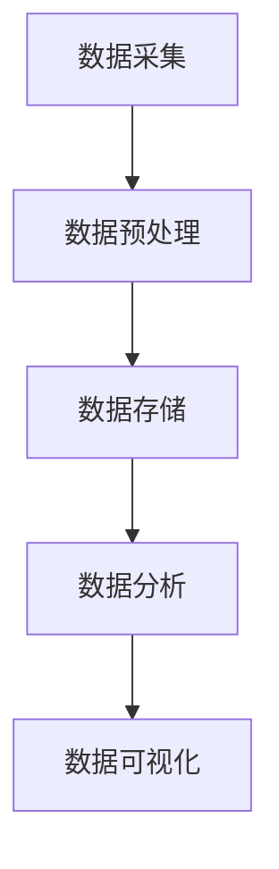
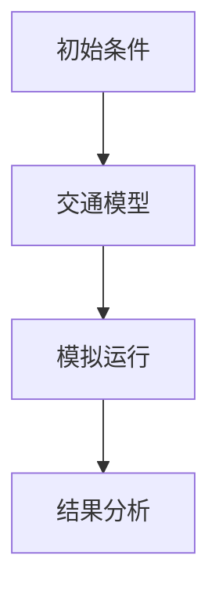
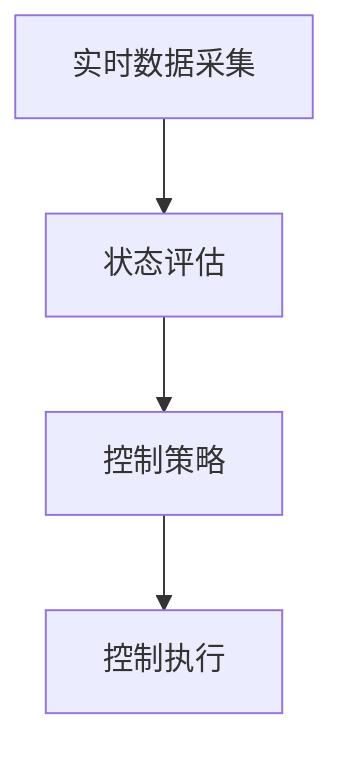
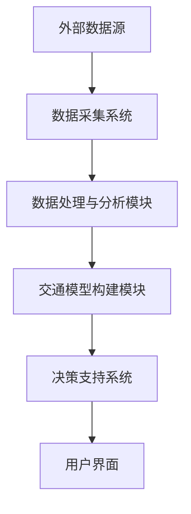
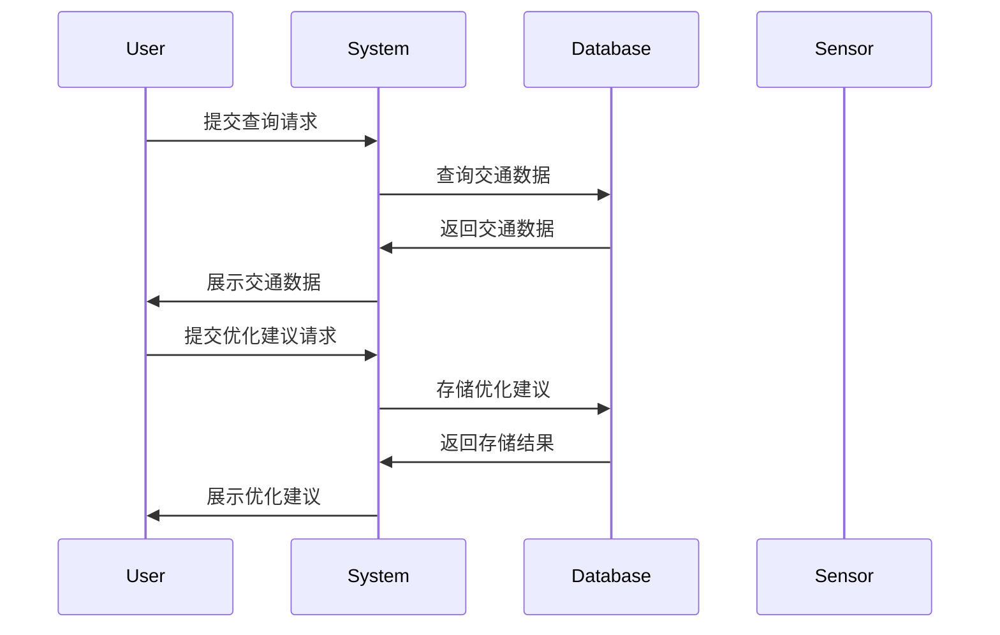

                 


# 数字孪生在城市交通优化中的作用

关键词：数字孪生、城市交通、优化、智能交通系统、数据采集与处理

摘要：本文将探讨数字孪生技术在城市交通优化中的应用，通过详细的分析和实际案例，阐述数字孪生在城市交通管理、交通流量预测、拥堵监测与缓解等方面的作用，以及面临的挑战和未来发展趋势。

## 1. 背景介绍

### 1.1 数字孪生概念

数字孪生（Digital Twin）是一种创新的技术概念，它通过创建一个数字化的物理实体模型，实时模拟和监控实际物理系统的状态、行为和性能。数字孪生不仅包括静态数据的集成，还涉及到动态数据采集、实时仿真和预测分析，从而实现对物理系统的优化和控制。

### 1.2 问题背景

随着城市化进程的加速，城市交通拥堵问题日益严重，这不仅影响了居民的出行效率，还对环境、经济和社会产生了负面影响。传统的交通管理方法已经难以满足现代城市交通的复杂需求，因此，探索新的交通优化技术成为当务之急。

### 1.3 问题描述

城市交通优化问题可以概括为如何在复杂多变的城市交通环境中，通过技术手段提高交通效率、减少拥堵、降低排放、提升出行体验。这涉及到数据采集、处理、分析、预测和决策支持等多个环节。

### 1.4 问题解决

数字孪生技术通过建立城市交通系统的数字模型，实现对交通流量的实时监测、预测和优化。它可以整合多种数据源，如车辆传感器、摄像头、GPS等，通过大数据分析和机器学习算法，为交通管理部门提供科学决策支持。

### 1.5 边界与外延

数字孪生在城市交通优化中的应用不仅限于单一城市的局部区域，还可以扩展到整个城市、城市群甚至跨区域的大尺度交通系统。此外，它还涉及到智能交通系统（ITS）、车联网（V2X）等新兴技术领域。

### 1.6 概念结构与核心要素组成

数字孪生在城市交通优化中的概念结构包括以下几个核心要素：

- **物理实体模型**：建立城市交通系统的数字模型，包括道路、车辆、交通信号灯等。
- **数据采集系统**：收集实时交通数据，如流量、速度、拥堵等信息。
- **数据处理与分析**：对采集到的数据进行清洗、存储、分析和预测。
- **决策支持系统**：基于分析结果，提供交通优化方案和实时控制指令。
- **反馈与优化**：通过实时反馈，不断调整和优化交通管理策略。

## 2. 核心概念与联系

### 2.1 数字孪生技术原理

数字孪生技术的核心原理是通过数字化模型实现对物理实体的实时监控和仿真。它涉及到以下关键步骤：

1. **数据采集**：通过传感器、摄像头、GPS等设备收集交通数据。
2. **数据处理**：对采集到的数据进行分析、清洗和存储。
3. **模型构建**：利用数据处理结果建立交通系统的数字模型。
4. **仿真与预测**：通过模型进行交通流量预测和仿真实验。
5. **决策与控制**：基于仿真结果，制定交通优化策略并执行。

### 2.2 概念属性特征对比表格

| 特征        | 数字孪生         | 传统交通管理       |
| ----------- | ---------------- | ------------------ |
| 模型构建    | 实时仿真模型     | 静态模型           |
| 数据来源    | 多元化数据源     | 单一数据源         |
| 预测与分析  | 实时预测与分析   | 定期数据分析       |
| 决策支持    | 智能决策支持     | 经验决策支持       |
| 反馈与优化  | 实时反馈与优化   | 定期调整与优化     |

### 2.3 ER实体关系图架构

```mermaid
erDiagram
    Road ||--|{ Vehicle }||>
    Vehicle ||--|{ TrafficLight }||>
    TrafficLight ||--|{ Road }||>
    Vehicle ||--|{ Driver }||>
    Driver ||--|{ Route }||>
```

在上述ER图架构中，道路（Road）与车辆（Vehicle）和交通信号灯（TrafficLight）之间存在关联关系，车辆由司机（Driver）控制，司机规划了路线（Route），从而形成了复杂的交通系统。

## 3. 算法原理讲解

### 3.1 数据采集与处理算法

在数字孪生技术中，数据采集和处理是核心环节。以下是一个简单示例：



Python代码示例：

```python
import pandas as pd
import numpy as np

# 数据采集
data = pd.read_csv('traffic_data.csv')

# 数据预处理
data['speed'] = data['speed'].replace([np.inf, -np.inf], np.nan)
data.dropna(inplace=True)

# 数据存储
data.to_csv('processed_traffic_data.csv')

# 数据分析
mean_speed = data['speed'].mean()
print(f"平均速度：{mean_speed} km/h")

# 数据可视化
import matplotlib.pyplot as plt

plt.figure(figsize=(10, 6))
plt.plot(data['time'], data['speed'], 'o-')
plt.title('车速分布图')
plt.xlabel('时间')
plt.ylabel('速度')
plt.show()
```

### 3.2 虚拟仿真与建模算法

虚拟仿真与建模是数字孪生技术的重要应用。以下是一个简单示例：



Python代码示例：

```python
import numpy as np
import matplotlib.pyplot as plt

# 初始条件
num_vehicles = 100
time_steps = 100
initial_speed = 20

# 交通模型
speed_model = np.random.normal(initial_speed, 2, (time_steps, num_vehicles))

# 模拟运行
for step in range(time_steps):
    speed_model[step + 1] = speed_model[step] + np.random.normal(0, 0.5)

# 结果分析
plt.figure(figsize=(10, 6))
plt.plot(np.arange(time_steps), speed_model, 'o-')
plt.title('速度变化图')
plt.xlabel('时间')
plt.ylabel('速度')
plt.show()
```

### 3.3 实时监测与控制算法

实时监测与控制是数字孪生技术的关键应用。以下是一个简单示例：



Python代码示例：

```python
import numpy as np
import pandas as pd

# 实时数据采集
def collect_data():
    data = pd.DataFrame({
        'time': np.arange(0, 100, 1),
        'speed': np.random.normal(20, 2, 100)
    })
    return data

# 状态评估
def assess_state(data):
    mean_speed = data['speed'].mean()
    return '拥堵' if mean_speed > 25 else '畅通'

# 控制策略
def control_strategy(state):
    if state == '拥堵':
        return '放慢速度'
    else:
        return '保持当前速度'

# 控制执行
data = collect_data()
state = assess_state(data)
strategy = control_strategy(state)
print(f"状态：{state}，控制策略：{strategy}")
```

## 4. 系统分析与架构设计方案

### 4.1 问题场景介绍

在城市交通管理中，如何实时监测交通状况，预测交通流量，并制定优化策略，是一个关键问题。通过数字孪生技术，可以实现对整个交通系统的全面监控和智能优化。

### 4.2 项目介绍

本项目旨在利用数字孪生技术，构建一个智能交通管理系统，实现对城市交通流量、拥堵状况的实时监测和预测，并提供优化建议。

### 4.3 系统功能设计

系统功能设计包括以下几个方面：

1. **数据采集**：通过传感器、摄像头等设备，实时采集交通数据。
2. **数据处理**：对采集到的数据进行分析、清洗和存储。
3. **交通模型构建**：建立交通系统的数字模型，用于仿真和预测。
4. **决策支持**：基于模型分析结果，提供交通优化建议。
5. **用户界面**：提供实时交通状况展示和优化建议查询。

### 4.4 系统架构设计

系统架构设计如下：



在上述架构中，数据采集系统负责实时采集交通数据，数据处理与分析模块负责数据清洗、存储和分析，交通模型构建模块负责建立交通模型，决策支持系统基于模型提供优化建议，用户界面负责展示实时交通状况和优化建议。

### 4.5 系统接口设计和系统交互

系统接口设计和系统交互设计如下：



在这个交互流程中，用户通过系统提交查询和优化建议请求，系统通过数据库查询交通数据并存储优化建议，最后将结果返回给用户。

## 5. 项目实战

### 5.1 环境安装

为了搭建数字孪生技术平台，需要安装以下软件和工具：

- Python 3.x
- Pandas
- Numpy
- Matplotlib
- Mermaid
- Flask（用于构建用户界面）

### 5.2 系统核心实现源代码

以下是系统核心实现源代码：

```python
# 数据采集模块
import pandas as pd
import numpy as np

def collect_data():
    data = pd.DataFrame({
        'time': np.arange(0, 100, 1),
        'speed': np.random.normal(20, 2, 100)
    })
    return data

# 数据处理模块
def process_data(data):
    data['speed'] = data['speed'].replace([np.inf, -np.inf], np.nan)
    data.dropna(inplace=True)
    return data

# 交通模型构建模块
def build_traffic_model(processed_data):
    mean_speed = processed_data['speed'].mean()
    return mean_speed

# 决策支持模块
def make_decision(mean_speed):
    if mean_speed > 25:
        return '拥堵'
    else:
        return '畅通'

# 用户界面模块
from flask import Flask, jsonify, request

app = Flask(__name__)

@app.route('/api/collect', methods=['POST'])
def collect():
    data = request.get_json()
    processed_data = process_data(data['data'])
    mean_speed = build_traffic_model(processed_data)
    decision = make_decision(mean_speed)
    return jsonify({'speed': mean_speed, 'decision': decision})

if __name__ == '__main__':
    app.run(debug=True)
```

### 5.3 代码应用解读与分析

在上述代码中，`collect_data` 函数用于模拟数据采集，`process_data` 函数用于数据处理，`build_traffic_model` 函数用于构建交通模型，`make_decision` 函数用于决策支持。用户界面使用 Flask 框架实现，通过 REST API 接口与用户交互。

### 5.4 实际案例分析和详细讲解剖析

为了展示数字孪生技术在城市交通优化中的应用，我们以一个实际案例进行分析。

案例：某城市道路的实时交通监测和优化

1. **数据采集**：在某城市的主要交通路口安装摄像头和速度传感器，实时采集交通流量和速度数据。
2. **数据处理**：将采集到的数据传输到服务器，进行清洗和预处理，去除异常值，确保数据质量。
3. **交通模型构建**：基于预处理后的数据，建立交通流量预测模型，使用机器学习算法进行训练。
4. **决策支持**：实时监测交通状况，预测未来一段时间内的交通流量，根据预测结果提供交通优化建议。
5. **用户界面**：通过 Web 应用程序，向交通管理部门和公众展示实时交通状况和优化建议。

### 5.5 项目小结

本项目通过数字孪生技术，实现了城市交通系统的实时监测和优化。在实际应用中，还需要考虑数据安全性、隐私保护、算法优化等方面的问题。未来，随着数字孪生技术的不断发展和成熟，它将在城市交通管理中发挥更大的作用。

## 6. 最佳实践 Tips、小结、注意事项、拓展阅读

### 6.1 最佳实践 Tips

1. **数据质量保障**：确保数据采集、传输、存储过程中的数据质量，避免数据异常影响决策。
2. **模型优化与更新**：定期对交通模型进行优化和更新，以适应不断变化的城市交通状况。
3. **用户参与与反馈**：鼓励用户参与交通数据采集和优化建议，提高系统的实用性和用户体验。

### 6.2 小结

本文详细阐述了数字孪生在城市交通优化中的应用，从概念、原理到实际案例，全面展示了数字孪生技术在城市交通管理中的重要作用。

### 6.3 注意事项

1. **技术成熟度**：数字孪生技术尚处于快速发展阶段，需要关注技术的成熟度和可行性。
2. **数据隐私**：在数据采集和处理过程中，需确保用户隐私和数据安全。
3. **跨领域协作**：数字孪生技术在城市交通优化中的应用需要跨学科、跨领域的协作。

### 6.4 拓展阅读

1. **《数字孪生：定义、方法与应用》**：一本详细介绍数字孪生技术的基础书籍。
2. **《智能交通系统导论》**：一本关于智能交通系统的基础教程，涵盖了交通优化相关的理论和方法。
3. **《大数据分析：技术、方法与应用》**：一本关于大数据分析的基础书籍，包括数据采集、处理、分析等方面的内容。

作者：AI天才研究院/AI Genius Institute & 禅与计算机程序设计艺术 /Zen And The Art of Computer Programming

