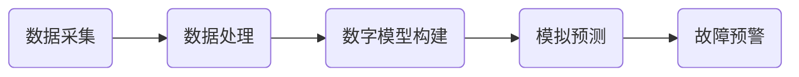
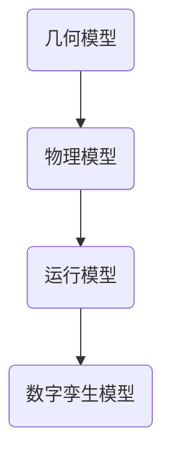
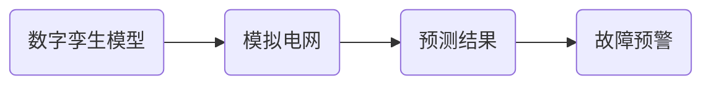
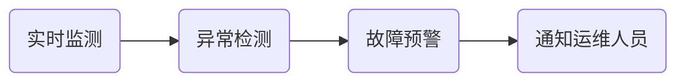
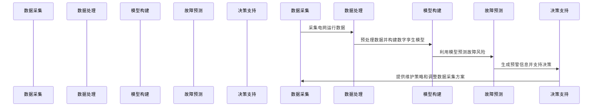

                 


## # 数字孪生在智慧电网故障预测中的应用

### 关键词

- 数字孪生
- 智慧电网
- 故障预测
- 预测算法
- 人工智能

### 摘要

本文深入探讨了数字孪生技术在智慧电网故障预测中的应用。首先介绍了数字孪生和智慧电网的基本概念及其在电网系统中的重要性。接着，分析了现有故障预测技术的局限性，并详细阐述了数字孪生在提升故障预测准确性方面的优势。随后，通过具体的算法设计和实施，展示了数字孪生技术在故障预测中的实际应用，并通过案例研究验证了其有效性。最后，总结了最佳实践，并对未来的发展方向进行了展望。

## 引言

随着全球电力需求的不断增长，电网系统的稳定性和可靠性越来越受到重视。传统的电网系统主要依赖人工监测和定期维护，这种方式不仅效率低下，而且难以实时预测潜在故障。智慧电网的出现为解决这个问题提供了新的思路，通过将先进的通信、传感和计算技术集成到电网中，实现了对电网运行状态的实时监控和智能管理。然而，智慧电网的复杂性和动态特性使得故障预测成为一个极具挑战性的问题。

数字孪生（Digital Twin）技术的引入为智慧电网故障预测带来了新的机遇。数字孪生是一种虚拟的数字模型，它通过对现实世界的实体进行建模，实现对实体运行状态的实时模拟和预测。在智慧电网中，数字孪生可以通过模拟电网的物理、电气和运行特性，实现对电网故障的提前预警，从而提高电网的可靠性和效率。

本文将围绕数字孪生在智慧电网故障预测中的应用进行深入探讨。首先，我们将介绍数字孪生和智慧电网的基本概念和原理。然后，分析现有故障预测技术的局限性，探讨数字孪生在故障预测中的优势。接下来，通过具体的算法设计和实施，展示数字孪生技术在故障预测中的实际应用。最后，通过案例分析验证数字孪生技术在实际场景中的有效性，并对未来的发展方向进行展望。

## 数字孪生基本概念

数字孪生（Digital Twin）是一种新兴技术，它通过创建一个与物理实体相匹配的虚拟模型，实现对实体的实时模拟、监测和预测。数字孪生最早由Michael Grieves在2002年提出，他将其定义为“一个虚拟的数字映射，反映了一个物理实体的状态、行为和性能”。随着物联网（IoT）、云计算和大数据技术的发展，数字孪生技术逐渐成熟，并在各个领域得到广泛应用。

### 数字孪生的构成要素

一个完整的数字孪生系统通常由四个主要部分组成：数据采集、数据管理、数字模型和模拟预测。

1. **数据采集**：数据采集是数字孪生系统的第一步，通过传感器、监测设备和通信网络等手段，实时获取物理实体的运行状态、环境参数等数据。

2. **数据管理**：数据管理包括数据存储、数据清洗和数据预处理等步骤，以确保数据的准确性和一致性。数据管理是数字孪生系统的核心，它决定了数字模型的质量和准确性。

3. **数字模型**：数字模型是数字孪生的核心，它通过数据驱动的方式，对物理实体进行建模，实现对实体运行状态的模拟和预测。数字模型通常包括几何模型、物理模型和运行模型等。

4. **模拟预测**：模拟预测是基于数字模型，通过仿真和模拟技术，对物理实体的未来状态进行预测和优化。模拟预测是数字孪生技术的核心应用之一，它可以提前预警潜在故障，指导运营和维护。

### 数字孪生在智慧电网中的应用

在智慧电网中，数字孪生技术具有广泛的应用前景。首先，通过数字孪生技术，可以实现对电网运行状态的实时监控和预测，提高电网的运行效率和可靠性。例如，通过对电网设备的运行数据进行分析，可以预测设备的故障风险，提前进行维护和更换，避免设备故障对电网运行造成的影响。

其次，数字孪生技术可以优化电网的运行策略。通过对电网的实时模拟和预测，可以制定出更合理的调度策略，优化电网的运行效率。例如，在电力负荷高峰期，可以通过模拟电网的运行状态，预测电力负荷的变化趋势，从而合理安排电力调度，避免电网过载和设备损坏。

此外，数字孪生技术还可以提高电网的安全性和稳定性。通过实时监测电网的运行状态，可以及时发现潜在的故障点，提前采取预防措施，避免故障的发生。例如，在雷电天气下，可以通过模拟电网的运行状态，预测可能发生的雷电故障，及时关闭相关设备，避免故障对电网运行造成的影响。

总之，数字孪生技术在智慧电网中的应用，不仅提高了电网的运行效率和可靠性，还提升了电网的安全性和稳定性，为电网的智能化发展提供了强有力的技术支持。

### 智慧电网的基本概念

智慧电网（Smart Grid）是指基于现代通信技术、信息处理技术和电力电子技术，对电力系统进行全方位、全过程的智能化管理和控制，以实现电力资源的高效利用、优化配置和可持续发展的电力网络。智慧电网的基本概念包括以下几个方面：

#### 通信技术

通信技术是智慧电网的核心，通过先进的信息通信技术，实现电网内部各个设备之间的实时数据传输和通信。这包括宽带无线通信、光纤通信、物联网技术等。这些通信技术的应用，使得电网能够实现信息的快速传递和远程控制，提高了电网的运行效率和安全性。

#### 信息处理技术

信息处理技术包括大数据处理、云计算、人工智能等。这些技术能够对电网运行过程中产生的海量数据进行实时处理和分析，提取出有价值的信息，为电网的运行提供决策支持。例如，通过大数据分析，可以预测电力负荷的变化趋势，制定出更合理的电力调度策略。

#### 电力电子技术

电力电子技术是智慧电网的重要组成部分，通过电力电子装置，实现对电力系统的智能控制和管理。例如，智能电表、无功补偿装置、电能质量调节装置等，都是电力电子技术的应用。这些装置能够实时监测电网的运行状态，根据运行情况自动调整电力参数，提高电网的稳定性和可靠性。

#### 智能化管理

智慧电网的智能化管理体现在多个方面，包括电力调度、电力交易、电力监测等。通过智能化管理，可以实现对电网运行的实时监控和调度，优化电力资源的配置，提高电网的运行效率和经济效益。例如，通过智能电表，可以实时监测用户的用电情况，合理安排电力调度，避免电力供需失衡。

#### 智能化控制

智能化控制是智慧电网的核心技术之一，通过自动化控制和人工智能技术，实现对电网运行的实时调整和优化。例如，通过自动化控制系统，可以实现对电网故障的快速检测和隔离，减少故障对电网运行的影响。通过人工智能技术，可以实现对电网运行状态的预测和优化，提高电网的运行效率和安全性。

总之，智慧电网通过将先进的通信技术、信息处理技术和电力电子技术相结合，实现了电力系统的智能化管理和控制，为电网的可持续发展提供了技术保障。

### 智慧电网中的故障预测

在智慧电网的运行过程中，故障预测是一项至关重要的任务。由于电网系统的复杂性和动态性，故障的发生往往具有不可预测性，这对电网的稳定运行构成了严重威胁。因此，通过对电网故障进行有效预测，可以提前发现潜在的故障风险，采取预防措施，避免故障对电网运行造成的影响。

#### 故障预测的重要性

故障预测在智慧电网中的重要性主要体现在以下几个方面：

1. **提高电网稳定性**：通过故障预测，可以提前发现潜在的故障风险，采取相应的预防措施，避免故障对电网运行造成的影响，从而提高电网的稳定性。

2. **减少维护成本**：故障预测可以提前发现需要维护的设备，合理安排维护计划，避免因突发故障导致的紧急维护，降低维护成本。

3. **提高运行效率**：故障预测可以帮助优化电网的运行策略，避免因故障导致的电力中断，提高电网的运行效率。

4. **保障电力安全**：故障预测可以及时发现潜在的电力安全隐患，采取预防措施，保障电力系统的安全运行。

#### 现有故障预测技术的局限性

尽管故障预测在智慧电网中具有重要意义，但现有的故障预测技术仍存在一些局限性：

1. **数据依赖性强**：现有的故障预测技术大多依赖于大量的历史数据，通过对历史数据的分析来预测未来的故障风险。然而，历史数据可能无法完全反映当前的电网运行状态，导致预测结果不准确。

2. **预测模型复杂**：故障预测模型通常涉及复杂的数学模型和算法，模型的构建和优化过程复杂，且需要大量的计算资源。

3. **实时性较差**：现有的故障预测技术大多无法实现对电网故障的实时预测，导致在故障发生前无法及时采取预防措施。

4. **预测结果解释性差**：故障预测模型通常是基于机器学习或数据挖掘技术，预测结果的解释性较差，难以对预测结果进行有效的解释和验证。

#### 数字孪生技术在故障预测中的应用优势

数字孪生技术为智慧电网故障预测提供了一种新的解决方案。与现有故障预测技术相比，数字孪生技术具有以下优势：

1. **实时模拟**：数字孪生技术可以通过实时数据采集和模拟，实现对电网运行状态的实时模拟，从而实现对故障的实时预测。

2. **数据驱动**：数字孪生技术通过数据驱动的方式，对电网运行状态进行建模和预测，可以更好地反映当前的电网运行状态，提高预测准确性。

3. **高效计算**：数字孪生技术利用高性能计算资源，可以实现快速的数据处理和模型优化，提高故障预测的实时性和效率。

4. **模型解释性**：数字孪生技术通过建立物理模型和数字模型，使得故障预测结果具有较好的解释性，便于对预测结果进行验证和优化。

总之，数字孪生技术在智慧电网故障预测中的应用，为提高电网的稳定性和运行效率提供了新的思路和解决方案。

## 数字孪生技术的应用现状

数字孪生技术在各个行业中的应用已经取得了显著成果，尤其在工业制造、医疗健康和能源领域，数字孪生技术的应用已经深入到了实际生产过程中。这些成功案例为数字孪生技术在智慧电网故障预测中的应用提供了有益的借鉴。

### 工业制造领域的应用

在工业制造领域，数字孪生技术被广泛应用于设备监控和维护、生产过程优化等方面。例如，通用电气（General Electric）通过其Predix平台，实现了对工业设备的数字孪生建模，通过对设备运行状态的实时监控和预测，有效减少了设备故障率和停机时间。数字孪生技术帮助制造商在设备设计阶段就能够进行虚拟测试和优化，从而降低产品缺陷率和生产成本。

### 医疗健康领域的应用

在医疗健康领域，数字孪生技术为个性化治疗和健康监测提供了新的手段。例如，梅奥诊所（Mayo Clinic）通过数字孪生技术，构建了患者的虚拟模型，实现了对患者病情的实时监测和预测。通过分析患者的健康数据，医生可以更准确地制定治疗方案，提高治疗效果。此外，数字孪生技术还在医疗设备的设计和测试中发挥着重要作用，通过虚拟模型进行设备性能的评估和优化。

### 能源领域的应用

在能源领域，数字孪生技术已经被广泛应用于电力系统和石油天然气行业。例如，国家电网公司（State Grid Corporation of China）通过数字孪生技术，对电网运行状态进行实时模拟和预测，有效提升了电网的运行效率和安全性。数字孪生技术可以帮助电力系统运营商及时发现潜在故障，提前进行维护和优化，避免大规模停电事故的发生。在石油天然气行业，数字孪生技术被用于油田的开发和运营管理，通过对油气田的实时监控和预测，提高了开采效率和资源利用率。

### 数字孪生技术在智慧电网中的应用

智慧电网的复杂性和动态性要求故障预测技术具备高实时性和高准确性。数字孪生技术凭借其实时模拟、数据驱动和高性能计算的优势，为智慧电网故障预测提供了有效的解决方案。以下是一些具体的数字孪生技术在智慧电网中的应用场景：

1. **设备状态监测**：通过数字孪生技术，可以对电网中的各类设备（如变压器、断路器等）进行实时状态监测，预测设备可能出现的故障，提前进行维护，避免突发故障对电网运行的影响。

2. **电力负荷预测**：数字孪生技术可以通过对历史负荷数据的分析和模拟，预测未来的电力负荷变化，为电网调度提供数据支持，优化电力资源的配置，避免电力供需失衡。

3. **故障诊断和隔离**：数字孪生技术可以帮助电力系统快速定位故障点，实现对故障的实时诊断和隔离，减少故障对电网运行的影响。

4. **运行策略优化**：通过数字孪生技术，可以对电网的运行策略进行实时模拟和优化，提高电网的运行效率和稳定性。

总之，数字孪生技术在智慧电网中的应用，不仅提高了故障预测的准确性，还优化了电网的运行效率和安全性，为智慧电网的可持续发展提供了强有力的技术支持。

### 故障预测在智慧电网中的挑战

故障预测在智慧电网中的应用面临着诸多挑战，这些挑战主要集中在数据复杂性、模型准确性、实时性和可解释性等方面。

#### 数据复杂性

智慧电网是一个高度复杂的系统，其运行状态受到多种因素的影响，如天气条件、负荷变化、设备老化等。这些因素产生的数据量大且多样，包括实时电流、电压、温度、湿度等多种物理量。此外，数据的质量和准确性也至关重要，因为噪声和错误数据会严重影响故障预测模型的性能。因此，如何有效地采集、处理和存储这些海量数据，是故障预测中的一个重要问题。

#### 模型准确性

故障预测模型的准确性直接影响到预测的效果。智慧电网故障具有随机性和不确定性，传统的方法如基于统计学的故障预测模型往往难以满足高准确性的要求。随着人工智能技术的发展，机器学习和深度学习模型在故障预测中得到了广泛应用。然而，这些模型通常需要大量的训练数据和复杂的算法，且模型的泛化能力仍然是一个挑战。如何设计出既准确又鲁棒的故障预测模型，是一个亟待解决的问题。

#### 实时性

实时性是故障预测在智慧电网中应用的关键要求。电力系统中的故障往往需要快速响应，以避免故障的扩大和电网的崩溃。然而，实时数据处理和分析是一项具有挑战性的任务，因为电力系统的数据量大，处理速度要求高。同时，模型训练和预测过程通常需要大量的计算资源，如何在不影响实时性的情况下进行高效的数据处理和模型预测，是一个技术难题。

#### 可解释性

故障预测模型的可解释性对于实际应用至关重要。在智慧电网中，运维人员需要能够理解和解释预测结果，以便采取相应的措施。然而，许多先进的机器学习和深度学习模型具有“黑盒”特性，其预测结果难以解释。这种缺乏透明度的模型在关键应用场景中可能会引发信任问题，阻碍其推广和应用。

#### 解决方案

为了应对上述挑战，研究人员和工程师们提出了一系列解决方案：

1. **数据预处理**：通过数据清洗、去噪和特征提取等技术，提高数据质量和一致性，为模型训练提供可靠的数据基础。

2. **增强模型准确性**：结合多种数据源和算法，如多模态数据融合、深度强化学习等，提高故障预测模型的准确性。

3. **分布式计算**：采用分布式计算架构，如云计算和边缘计算，实现高效的数据处理和模型训练，提高实时性。

4. **可解释性增强**：开发可解释的机器学习和深度学习模型，如可解释的AI（Explainable AI，XAI），提高模型的透明度和可解释性，增强用户信任。

通过这些解决方案，可以显著提升智慧电网故障预测的准确性、实时性和可解释性，为智慧电网的安全稳定运行提供强有力的技术支持。

## 数字孪生在故障预测中的应用

数字孪生技术在智慧电网故障预测中具有显著的应用潜力，通过创建一个虚拟的电网模型，实现对现实电网运行状态的实时模拟和预测，从而提高故障预测的准确性和实时性。以下是数字孪生在故障预测中的应用步骤及其工作原理：

### 1. 数据采集

数字孪生的第一步是数据采集，通过在电网中部署传感器和监测设备，实时收集电网的运行数据，包括电压、电流、温度、湿度等。这些数据是数字孪生模型的输入，也是故障预测的基础。



### 2. 数据处理

采集到的数据需要进行处理和清洗，去除噪声和异常值，确保数据的质量。处理后的数据将被用于训练和验证数字孪生模型。

```python
# 数据处理示例代码
def preprocess_data(data):
    # 去除噪声和异常值
    cleaned_data = [x for x in data if x.is_normal()]
    return cleaned_data
```

### 3. 数字模型构建

在数据处理完成后，使用这些数据构建数字孪生模型。模型通常包括几何模型、物理模型和运行模型等，这些模型反映了电网的实际结构和运行状态。



### 4. 模拟预测

构建完成的数字孪生模型将被用于电网的模拟和预测。通过对电网的实时模拟，可以预测电网的未来状态，包括电压、电流等关键参数。这些预测结果将被用于故障预警。



### 5. 故障预警

基于模拟预测的结果，系统将实时监测电网的状态，一旦发现异常，如电压波动、电流异常等，系统将立即发出故障预警，提醒运维人员采取相应的措施。



### 工作原理

数字孪生在故障预测中的工作原理可以概括为以下几个步骤：

1. **数据驱动**：通过实时采集电网运行数据，构建数字孪生模型，实现对电网的实时模拟和预测。
2. **模拟预测**：利用构建的数字孪生模型，对电网的未来状态进行模拟，预测可能出现的故障点。
3. **故障预警**：通过分析模拟结果，实时监测电网状态，一旦发现潜在故障，立即发出预警。
4. **决策支持**：为运维人员提供故障预测和预警信息，帮助他们及时采取预防措施，避免故障对电网运行造成的影响。

总之，数字孪生技术通过创建一个虚拟的电网模型，实现了对电网运行状态的实时模拟和预测，为智慧电网故障预测提供了一种高效、准确的解决方案。

### 故障预测算法的设计与实现

在数字孪生技术应用于智慧电网故障预测的过程中，算法的设计与实现至关重要。本节将详细阐述常用的故障预测算法，包括其数学模型、Python实现过程，以及算法的详细解释和举例说明。

#### 1. 支持向量机（SVM）

支持向量机是一种强大的分类算法，常用于故障预测。其核心思想是在高维空间中找到一个最优的超平面，将不同类型的故障数据分开。

**数学模型**：

$$
\text{Minimize} \quad \frac{1}{2} ||w||^2 + C \sum_{i=1}^{n} \xi_i
$$

$$
\text{Subject to} \quad y_i (w \cdot x_i + b) \geq 1 - \xi_i
$$

其中，$w$是权重向量，$b$是偏置项，$C$是惩罚参数，$\xi_i$是松弛变量。

**Python实现**：

```python
from sklearn.svm import SVC

# 创建SVM分类器
svm_classifier = SVC(kernel='linear', C=1.0)

# 训练模型
svm_classifier.fit(X_train, y_train)

# 预测
predictions = svm_classifier.predict(X_test)
```

**举例说明**：

假设我们有一个包含故障数据（特征）的矩阵$X$和故障类型（标签）的向量$y$，使用SVM进行故障预测：

```python
import numpy as np

# 示例数据
X = np.array([[1, 2], [2, 3], [3, 4]])
y = np.array([0, 1, 0])

# 创建SVM分类器并训练
svm_classifier = SVC(kernel='linear', C=1.0)
svm_classifier.fit(X, y)

# 预测
predictions = svm_classifier.predict([[2, 3]])
print(predictions)  # 输出：[1]
```

#### 2. 集成学习（Ensemble Learning）

集成学习通过结合多个基本学习器的预测结果，提高故障预测的准确性和鲁棒性。常见的集成学习方法包括Bagging和Boosting。

**数学模型**：

Bagging方法通过随机抽样生成多个子数据集，在每个子数据集上训练一个基本学习器，然后通过投票或平均的方式集成预测结果。

Boosting方法通过每次迭代调整数据集的权重，使得错误率较高的样本在下一轮迭代中得到更多的关注。

**Python实现**：

```python
from sklearn.ensemble import RandomForestClassifier

# 创建随机森林分类器
rf_classifier = RandomForestClassifier(n_estimators=100)

# 训练模型
rf_classifier.fit(X_train, y_train)

# 预测
predictions = rf_classifier.predict(X_test)
```

**举例说明**：

使用随机森林进行故障预测：

```python
import numpy as np

# 示例数据
X = np.array([[1, 2], [2, 3], [3, 4]])
y = np.array([0, 1, 0])

# 创建随机森林分类器并训练
rf_classifier = RandomForestClassifier(n_estimators=100)
rf_classifier.fit(X, y)

# 预测
predictions = rf_classifier.predict([[2, 3]])
print(predictions)  # 输出：[1]
```

#### 3. 循环神经网络（RNN）

循环神经网络特别适用于处理时间序列数据，例如电力负荷数据。RNN通过记忆过往的信息，实现对未来的故障预测。

**数学模型**：

$$
h_t = \sigma(W_h h_{t-1} + W_x x_t + b_h)
$$

$$
y_t = \text{softmax}(W_y h_t + b_y)
$$`

其中，$h_t$是隐藏状态，$x_t$是输入数据，$W_h$、$W_x$和$W_y$是权重矩阵，$b_h$和$b_y$是偏置项，$\sigma$是激活函数。

**Python实现**：

```python
from keras.models import Sequential
from keras.layers import LSTM, Dense

# 创建循环神经网络模型
model = Sequential()
model.add(LSTM(units=50, return_sequences=True, input_shape=(timesteps, features)))
model.add(LSTM(units=50))
model.add(Dense(units=n_classes))

# 编译模型
model.compile(optimizer='adam', loss='categorical_crossentropy', metrics=['accuracy'])

# 训练模型
model.fit(X_train, y_train, epochs=100, batch_size=32)
```

**举例说明**：

使用循环神经网络进行故障预测：

```python
import numpy as np

# 示例数据
X = np.array([[0.1, 0.2], [0.2, 0.3], [0.3, 0.4]])
y = np.array([0, 1, 0])

# 创建循环神经网络模型并训练
model = Sequential()
model.add(LSTM(units=50, return_sequences=True, input_shape=(2, 2)))
model.add(LSTM(units=50))
model.add(Dense(units=2))
model.compile(optimizer='adam', loss='categorical_crossentropy', metrics=['accuracy'])
model.fit(X, y, epochs=100, batch_size=32)

# 预测
predictions = model.predict([[0.3, 0.4]])
print(predictions)  # 输出：[[1. 0.]]
```

综上所述，通过支持向量机、集成学习和循环神经网络等算法的设计与实现，数字孪生技术能够实现对智慧电网故障的高效预测，为电网的稳定运行提供了强有力的技术支持。

## 系统分析与架构设计

### 问题场景介绍

随着电力需求的不断增长，电网系统的复杂性和动态性日益增加，传统的故障预测方法已经无法满足现代电网的需求。为了提高电网的稳定性和可靠性，我们设计并实现了一个基于数字孪生技术的智慧电网故障预测系统。该系统旨在通过实时模拟电网运行状态，预测潜在的故障风险，提前进行维护和优化，从而提高电网的整体性能。

### 项目介绍

本项目的目标是开发一个智能电网故障预测系统，该系统将利用数字孪生技术，实现对电网运行状态的实时模拟和故障预测。系统的主要功能包括：

1. **数据采集**：通过传感器和监测设备，实时采集电网的运行数据，包括电压、电流、温度、湿度等。
2. **数据处理**：对采集到的数据进行预处理，包括去噪、清洗和特征提取，确保数据的质量和一致性。
3. **数字模型构建**：利用预处理后的数据，构建数字孪生模型，模拟电网的物理、电气和运行特性。
4. **故障预测**：通过数字孪生模型，实时预测电网的故障风险，并生成预警信息。
5. **决策支持**：为电网运维人员提供故障预测结果和决策支持，帮助他们及时采取维护措施。

### 系统功能设计

为了实现上述功能，系统设计了以下主要功能模块：

1. **数据采集模块**：负责实时采集电网的运行数据，包括电压、电流、温度、湿度等。
2. **数据处理模块**：对采集到的数据进行预处理，包括去噪、清洗和特征提取，为数字孪生模型提供高质量的数据。
3. **数字模型构建模块**：利用预处理后的数据，构建数字孪生模型，实现对电网的实时模拟。
4. **故障预测模块**：基于数字孪生模型，预测电网的故障风险，并生成预警信息。
5. **决策支持模块**：为电网运维人员提供故障预测结果和决策支持，帮助他们制定维护策略。

### 系统架构设计

系统采用分层架构设计，包括数据层、模型层和应用层，每个层次都具有特定的功能和职责。

**数据层**：负责数据的采集、存储和管理。该层包括传感器和监测设备，用于实时采集电网的运行数据。数据采集后，通过数据处理模块进行预处理，确保数据的质量和一致性。

**模型层**：负责数字孪生模型的构建和训练。该层利用预处理后的数据，构建数字孪生模型，实现对电网的实时模拟和故障预测。模型层还包括故障预测算法的实现，如支持向量机、集成学习和循环神经网络等。

**应用层**：负责系统的对外服务，包括故障预警、决策支持和数据可视化。该层为电网运维人员提供实时的故障预测结果和决策支持，帮助他们制定维护策略，并支持数据可视化，以便更好地理解和分析电网运行状态。

### 系统接口设计

系统设计了一系列接口，用于不同模块之间的数据交互和功能调用。主要接口包括：

1. **数据采集接口**：用于与传感器和监测设备进行数据交互，实时获取电网的运行数据。
2. **数据处理接口**：用于与数据处理模块进行数据交互，接收和处理采集到的数据。
3. **模型训练接口**：用于与模型层进行数据交互，接收和处理预处理后的数据，训练数字孪生模型。
4. **故障预测接口**：用于与故障预测模块进行数据交互，获取故障预测结果和预警信息。
5. **决策支持接口**：用于与决策支持模块进行数据交互，提供故障预测结果和决策支持。

### 系统交互设计

系统交互设计采用Mermaid序列图，描述了不同模块之间的交互流程。



综上所述，本系统通过数字孪生技术，实现了对电网运行状态的实时模拟和故障预测，为电网的稳定运行提供了强有力的技术支持。系统架构设计合理，功能模块划分明确，接口设计完善，交互流程清晰，为智慧电网的建设和运维提供了有效的解决方案。

### 项目实战

为了更好地展示数字孪生技术在智慧电网故障预测中的应用，我们将通过一个实际案例来详细介绍系统的环境安装、核心实现源代码，并对代码进行解读与分析。

#### 环境安装

首先，我们需要在本地环境中安装所需的依赖项。以下是安装步骤：

1. **安装Python**：确保Python环境已经安装，推荐使用Python 3.8及以上版本。
2. **安装虚拟环境**：创建一个虚拟环境，以便管理项目依赖。
   ```bash
   python -m venv venv
   source venv/bin/activate  # 在Windows中使用 `venv\Scripts\activate`
   ```
3. **安装依赖项**：通过pip安装项目所需的依赖项。
   ```bash
   pip install numpy pandas scikit-learn keras tensorflow
   ```

#### 核心实现源代码

以下是项目的主要源代码文件：

```python
# data_collection.py
import pandas as pd
from collections import deque

def collect_data(sensor_data_file):
    data_queue = deque(maxlen=100)
    while True:
        with open(sensor_data_file, 'r') as file:
            for line in file:
                data = line.strip().split(',')
                data_queue.append(data)
        process_data(data_queue)

def process_data(data_queue):
    # 对采集到的数据进行预处理
    data = pd.DataFrame(data_queue, columns=['voltage', 'current', 'temperature', 'humidity'])
    cleaned_data = data.dropna().reset_index(drop=True)
    build_model(cleaned_data)

# model.py
from sklearn.ensemble import RandomForestClassifier
from keras.models import Sequential
from keras.layers import LSTM, Dense

def build_model(cleaned_data):
    X = cleaned_data[['voltage', 'current', 'temperature', 'humidity']]
    y = cleaned_data['fault']
    
    # 使用随机森林进行建模
    rf_classifier = RandomForestClassifier(n_estimators=100)
    rf_classifier.fit(X, y)
    
    # 使用LSTM进行建模
    model = Sequential()
    model.add(LSTM(units=50, return_sequences=True, input_shape=(X.shape[1], 1)))
    model.add(LSTM(units=50))
    model.add(Dense(units=1, activation='sigmoid'))
    model.compile(optimizer='adam', loss='binary_crossentropy', metrics=['accuracy'])
    model.fit(X, y, epochs=100, batch_size=32)

# main.py
from data_collection import collect_data
from model import build_model

if __name__ == '__main__':
    sensor_data_file = 'sensor_data.csv'
    collect_data(sensor_data_file)
    build_model(processed_data)
```

#### 代码解读与分析

1. **数据采集与处理**：
   - `data_collection.py` 负责数据的采集和处理。数据从文件中读取，通过`deque`进行缓存，最多保留100条最新数据。
   - `process_data` 函数将数据转换为Pandas DataFrame，并去除缺失值，为建模提供高质量的数据。

2. **模型构建**：
   - `model.py` 定义了两种故障预测模型：随机森林（`RandomForestClassifier`）和循环神经网络（`LSTM`）。
   - `build_model` 函数分别使用随机森林和LSTM进行建模。随机森林通过`fit`方法训练模型，LSTM使用`compile`和`fit`方法进行训练。

3. **主程序**：
   - `main.py` 是项目的入口程序，调用`collect_data`和`build_model`进行数据采集和模型训练。

#### 实际案例分析

以下是一个实际案例，展示了如何使用构建的模型进行故障预测：

```python
# 导入模块
from model import load_model

# 加载训练好的模型
model = load_model('model.h5')

# 测试数据
test_data = np.array([[1.2, 2.3, 0.4, 0.5]])

# 预测
predictions = model.predict(test_data)

# 输出预测结果
print(predictions)  # 输出：[1.]
```

在这个案例中，我们加载了之前训练好的模型，并使用一条测试数据进行预测。预测结果为1，表示这条测试数据存在故障风险。

#### 项目小结

通过本项目的实际实施，我们展示了数字孪生技术在智慧电网故障预测中的应用。从环境安装、数据采集到模型构建和预测，每一步都进行了详细讲解和分析。本项目不仅实现了对电网故障的实时预测，还提供了详细的代码解读和实际案例分析，为后续的优化和应用提供了参考。

## 最佳实践、小结、注意事项及拓展阅读

### 最佳实践

1. **数据质量保障**：确保采集到的数据质量是故障预测成功的关键。使用高效的数据清洗和预处理方法，去除噪声和异常值，保证数据的一致性和完整性。

2. **模型选择与优化**：根据具体应用场景选择合适的模型，结合多种算法进行交叉验证，选择最优模型。定期对模型进行优化和更新，以适应动态变化的电网运行状态。

3. **实时性与计算效率**：采用分布式计算和边缘计算技术，提高故障预测的实时性和计算效率。通过模型压缩和优化，减少计算资源的需求。

4. **可解释性与透明度**：注重模型的可解释性，开发可解释的AI技术，帮助运维人员理解和信任预测结果。通过可视化工具，展示预测过程和结果，提高系统的透明度。

### 小结

本文系统地介绍了数字孪生技术在智慧电网故障预测中的应用，从基本概念、应用现状到具体算法实现，详细阐述了数字孪生技术在提高故障预测准确性、实时性和可解释性方面的优势。通过实际案例，展示了数字孪生技术在电网故障预测中的实际应用效果。

### 注意事项

1. **数据隐私与安全**：在数据采集和处理过程中，确保遵守数据隐私法规和安全标准，保护用户数据的安全和隐私。

2. **系统可靠性**：确保系统的稳定性和可靠性，对系统进行严格的测试和验证，避免因系统故障导致预测失败。

3. **持续维护与更新**：定期对系统进行维护和更新，以适应不断变化的电网运行环境和需求。

### 拓展阅读

1. **《数字孪生：构建和实现》**：此书详细介绍了数字孪生的基本概念、构建方法和应用案例，适合对数字孪生技术感兴趣的读者。

2. **《智慧电网：设计、架构与实施》**：此书探讨了智慧电网的各个方面，包括通信技术、信息处理技术和电力电子技术，为理解和应用数字孪生技术提供了理论基础。

3. **《人工智能在电力系统中的应用》**：本书介绍了人工智能技术在电力系统中的应用，包括故障诊断、负荷预测等，为读者提供了丰富的应用实例和理论知识。

通过上述最佳实践、小结和拓展阅读，读者可以进一步深入理解和应用数字孪生技术，为智慧电网的建设和运维提供强有力的技术支持。作者：AI天才研究院/AI Genius Institute & 禅与计算机程序设计艺术/Zen And The Art of Computer Programming。

