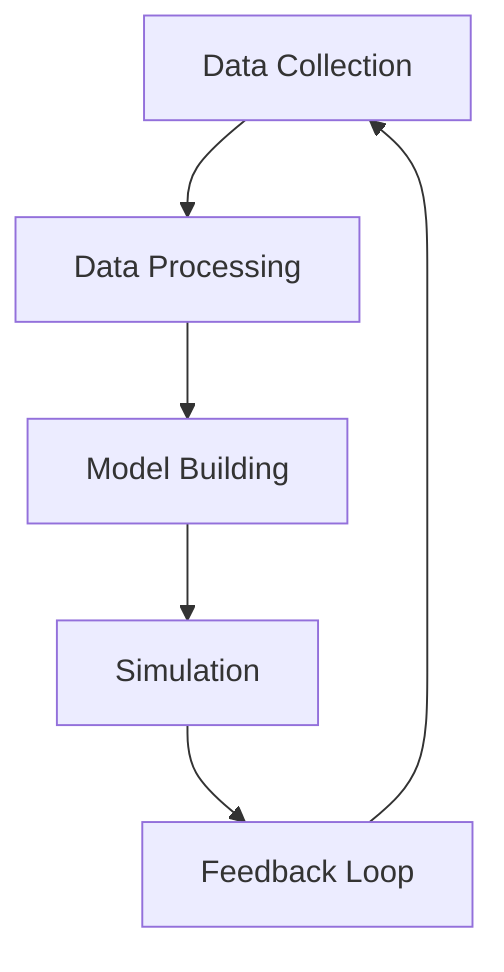
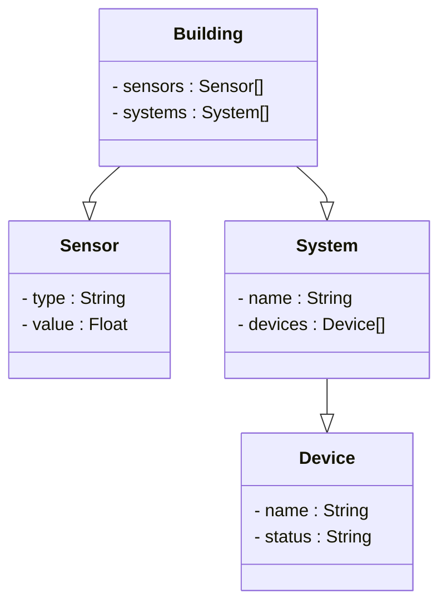
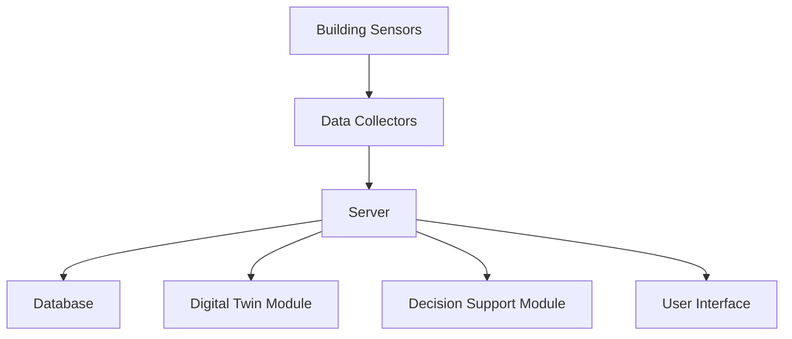
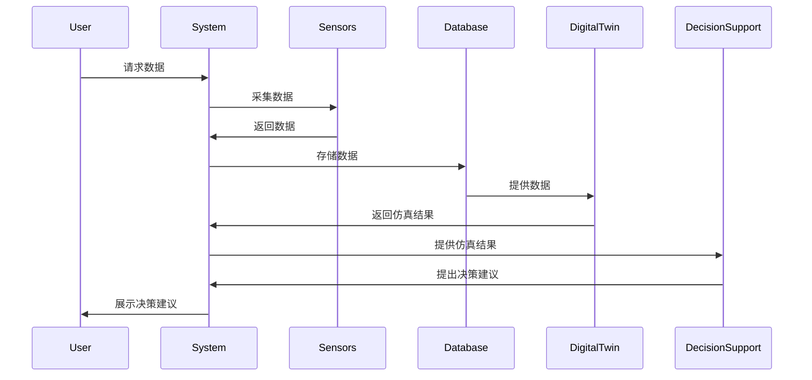

                 

### 概念与背景

#### 1. 问题描述

数字孪生技术是一种通过构建虚拟模型来模拟现实世界中物理实体的数字化仿真技术。它不仅能够实时监控和预测建筑系统的性能，还能在整个建筑生命周期中提供支持，从而提高管理效率和降低运营成本。在智能建筑管理中，数字孪生技术具有至关重要的作用，其应用范围广泛，涉及建筑能效管理、设备状态监测、安全监控、环境控制等多个方面。

数字孪生在智能建筑管理中的主要问题是如何高效地利用这项技术，实现建筑系统的智能化管理。这包括如何构建精准的数字孪生模型、如何实时获取和处理大量数据、如何通过分析数据来优化建筑运营以及如何为决策提供支持等。

#### 2. 问题解决

《数字孪生在智能建筑管理中的作用》这本书旨在为读者提供一个全面、系统的了解，帮助读者深入掌握数字孪生技术的基础知识、应用实例、技术实现方法及其在智能建筑管理中的具体应用。通过本书，读者可以了解：

- 数字孪生的基本概念和原理。
- 数字孪生技术在智能建筑管理中的应用场景。
- 数字孪生技术的实现方法和技术架构。
- 数字孪生在智能建筑管理中的实际案例和应用效果。

书中不仅介绍了数字孪生的基本原理和技术实现，还通过具体的案例，展示了数字孪生技术在智能建筑管理中的实际应用和价值。通过阅读本书，读者可以更好地理解数字孪生技术在智能建筑管理中的重要作用，并能够将其应用于实际项目中，提升建筑管理的智能化水平。

#### 3. 边界与外延

数字孪生技术在智能建筑管理中的应用范围广泛，不仅限于建筑能效管理、设备状态监测、安全监控、环境控制等方面，还可以扩展到更广泛的领域，如智慧城市、工业互联网、医疗健康等。此外，数字孪生技术还涉及多个学科领域，如计算机科学、建筑学、机械工程、物联网技术等。

在计算机科学领域，数字孪生技术需要依赖于大数据处理、机器学习、人工智能等技术；在建筑学领域，数字孪生技术需要与建筑设计、结构分析、能效分析等相关技术结合；在机械工程领域，数字孪生技术需要与设备监测、故障预测、维护管理等相关技术结合；在物联网技术领域，数字孪生技术需要与传感器网络、数据通信、边缘计算等相关技术结合。

#### 4. 概念结构与核心要素组成

数字孪生技术和智能建筑管理涉及多个核心概念和要素，下面将分别介绍：

- **数字孪生（Digital Twin）**：数字孪生是指通过构建物理实体的虚拟模型，实现对现实世界的实时模拟和监测。数字孪生模型通常包含传感器数据、物理属性、行为模式等多个维度。

- **智能建筑管理**：智能建筑管理是指利用现代信息技术，对建筑及其环境进行智能化管理。这包括建筑能效管理、设备状态监测、安全监控、环境控制等多个方面。

- **数据处理与分析**：数据处理与分析是数字孪生技术的重要组成部分。通过对大量传感器数据的收集、清洗、存储、分析和处理，可以实现对建筑系统的实时监控和预测。

- **决策支持系统**：决策支持系统是基于数字孪生模型，提供实时决策支持的系统。通过分析数据，决策支持系统可以帮助管理者做出更加明智的决策，优化建筑运营。

### 核心概念与联系

#### 1. 数字孪生原理

数字孪生的核心原理在于构建一个与物理实体相对应的虚拟模型。这个虚拟模型可以通过以下步骤实现：

- **数据采集**：通过传感器和其他数据采集设备，实时收集物理实体的状态数据。

- **数据预处理**：对收集到的数据进行清洗、去噪和归一化处理，确保数据的准确性和一致性。

- **模型构建**：使用机器学习、深度学习等技术，构建能够反映物理实体行为的数学模型。

- **实时仿真**：基于构建好的模型，进行实时仿真，模拟物理实体的运行状态。

- **数据反馈**：将仿真结果与实际物理实体的状态进行对比，收集反馈数据，用于模型修正和优化。

#### 2. 数字孪生与智能建筑管理的联系

数字孪生技术为智能建筑管理提供了强大的工具，使其能够实现更高效、更智能的管理。具体来说，数字孪生技术在智能建筑管理中的应用主要体现在以下几个方面：

- **实时监控**：通过数字孪生技术，可以实现对建筑系统运行状态的实时监控，及时发现潜在的问题。

- **预测性维护**：基于数字孪生模型，可以预测建筑设备可能的故障时间和故障类型，提前进行维护，避免突发故障。

- **优化能源管理**：通过数字孪生技术，可以对建筑能耗进行实时监测和预测，优化能源使用，降低能源消耗。

- **提高安全性**：通过数字孪生技术，可以对建筑环境进行实时监测，及时发现安全隐患，提高建筑安全性。

- **优化运营管理**：通过数字孪生技术，可以提供实时的运营数据和支持，帮助管理者做出更加明智的决策，提高运营效率。

#### 3. 数字孪生技术特点

数字孪生技术具有以下几个显著特点：

- **实时性**：数字孪生技术能够实时更新模型，反映建筑系统的当前状态。

- **预测性**：通过对数据的分析和建模，数字孪生技术可以预测未来的系统行为。

- **协同性**：数字孪生技术可以实现不同建筑系统和设备的协同工作，提高整体效率。

#### 4. 核心概念属性特征对比表格

下面是一个关于数字孪生和智能建筑管理核心概念属性特征的对比表格：

| 特点       | 数字孪生                    | 智能建筑管理                     |
|------------|----------------------------|----------------------------------|
| **实时性** | 实时更新模型               | 实时监控建筑系统状态             |
| **预测性** | 预测系统未来行为           | 预测建筑能耗和设备故障           |
| **协同性** | 协同不同建筑系统和设备     | 实现建筑设备和系统的智能化协同   |
| **可扩展性** | 可以扩展到不同规模和复杂度的建筑 | 可以集成多种智能技术进行综合管理 |

#### 5. ER实体关系图架构

为了更好地理解数字孪生和智能建筑管理的实体关系，下面是一个ER实体关系图架构的mermaid图表：

```mermaid
erDiagram
  Equipment --> Building : "monitors"
  Building --> System : "includes"
  System --> Device : "comprises"
  Data --> System : "generated by"
  Analytics --> Data : "analyzes"
  DecisionSupport --> Analytics : "guides"
```

- **Equipment（设备）**：指的是建筑中的各种设备，如空调、照明系统、电梯等。
- **Building（建筑）**：表示建筑实体，包含多个系统。
- **System（系统）**：建筑中的一种功能系统，如能源管理系统、安全监控系统等。
- **Device（设备）**：系统中的具体设备，如空调的压缩机、照明系统的灯具等。
- **Data（数据）**：建筑运行过程中产生的各种数据，如能耗数据、温度数据等。
- **Analytics（分析）**：对数据进行处理和分析的模块。
- **DecisionSupport（决策支持）**：基于分析结果提供决策支持的模块。

通过这个ER图，可以清晰地看到数字孪生和智能建筑管理中各个实体之间的关系，以及数据流动的方向和作用。

### 算法原理讲解

数字孪生技术的核心在于数据的采集和模型的构建。下面将逐步讲解数字孪生算法的原理，包括数据采集、数据处理、模型构建、实时仿真和数据反馈等步骤，并通过mermaid流程图和Python代码进行详细阐述。

#### 数据采集

数字孪生技术的第一步是数据采集。这通常涉及到各种传感器和监控设备，用于收集建筑实体的实时状态数据。这些数据包括温度、湿度、能耗、设备运行状态等。

**mermaid流程图**：



**Python代码示例**：

```python
import sensor_data_collector

# 收集建筑传感器数据
sensor_data = sensor_data_collector.collect_data()

# 输出传感器数据
print(sensor_data)
```

#### 数据处理

在数据采集完成后，需要对这些数据进行预处理，包括清洗、去噪和归一化处理，以确保数据的准确性和一致性。

**mermaid流程图**：


**Python代码示例**：

```python
import data_preprocessing

# 对传感器数据进行预处理
cleaned_data = data_preprocessing.preprocess_data(sensor_data)

# 输出预处理后的数据
print(cleaned_data)
```

#### 模型构建

预处理后的数据将被用来构建数字孪生模型。这个过程通常涉及到机器学习和深度学习算法，如神经网络、决策树等。

**mermaid流程图**：


**Python代码示例**：

```python
import model_builder

# 构建数字孪生模型
digital_twin_model = model_builder.build_model(cleaned_data)

# 输出模型
print(digital_twin_model)
```

#### 实时仿真

构建好的数字孪生模型将用于实时仿真，模拟建筑实体的行为。这个过程可以帮助管理者实时了解建筑系统的运行状态，发现潜在问题。

**mermaid流程图**：


**Python代码示例**：

```python
import simulation

# 进行实时仿真
simulation_results = simulation.simulate(digital_twin_model)

# 输出仿真结果
print(simulation_results)
```

#### 数据反馈

仿真结果将反馈给实际建筑系统，用于模型修正和优化。这个过程是数字孪生技术的核心，通过不断反馈和修正，可以逐步提高模型的准确性和预测能力。

**mermaid流程图**：


**Python代码示例**：

```python
import feedback_loop

# 进行数据反馈和模型修正
updated_model = feedback_loop.update_model(digital_twin_model, simulation_results)

# 输出更新后的模型
print(updated_model)
```

#### 数学模型与公式

在数字孪生算法中，常用的数学模型包括神经网络、线性回归、决策树等。下面将使用Python代码和LaTeX公式详细阐述一个简单的线性回归模型。

**Python代码示例**：

```python
import numpy as np

# 输入数据
X = np.array([[1, 2], [2, 3], [3, 4]])
y = np.array([2, 3, 4])

# 模型参数
w = np.zeros((2, 1))

# 梯度下降算法
learning_rate = 0.01
num_iterations = 1000

for i in range(num_iterations):
    # 前向传播
    z = np.dot(X, w)
    y_pred = 1 / (1 + np.exp(-z))
    
    # 计算损失函数
    loss = -1 * np.mean(y * np.log(y_pred) + (1 - y) * np.log(1 - y_pred))
    
    # 反向传播
    dw = np.dot(X.T, (y_pred - y)) / len(X)
    
    # 更新参数
    w -= learning_rate * dw

# 输出模型参数
print("权重：", w)
```

**LaTeX公式**：

$$
w = \frac{X^T(Xw - y)}{X^TX}
$$

通过上述代码和公式，可以详细阐述线性回归模型的基本原理和计算过程。

### 系统分析与架构设计方案

#### 1. 问题场景介绍

在现代城市中，随着建筑物的智能化需求不断增加，智能建筑管理变得越来越重要。然而，传统的建筑管理方式往往依赖于人工监测和手动操作，存在效率低、响应慢、易出错等问题。为了解决这些问题，引入数字孪生技术成为了一种有效的方法。

数字孪生技术可以通过构建虚拟模型，实时模拟建筑物的运行状态，实现对建筑物各个系统的精准监测和预测。这不仅可以提高管理效率，减少运营成本，还能提供强大的决策支持，优化建筑运营。

#### 2. 项目介绍

本项目旨在开发一个基于数字孪生技术的智能建筑管理系统。该系统将集成多种传感器和监控设备，实时收集建筑物的各种数据，包括温度、湿度、能耗、设备状态等。通过构建数字孪生模型，实现对建筑物运行状态的实时监测和预测，为管理者提供决策支持。

#### 3. 系统功能设计

系统的功能设计主要包括以下几个模块：

- **数据采集模块**：负责实时收集建筑物的各种传感器数据，包括温度、湿度、能耗、设备状态等。
- **数据处理模块**：对采集到的数据进行预处理，包括清洗、去噪、归一化等，确保数据的准确性和一致性。
- **数字孪生模块**：基于预处理后的数据，构建数字孪生模型，实现对建筑物运行状态的实时监测和预测。
- **决策支持模块**：基于数字孪生模型，提供实时的决策支持，帮助管理者优化建筑运营。
- **用户界面模块**：提供一个友好的用户界面，让管理者可以方便地查看建筑物的运行状态、历史数据和实时预测结果。

**领域模型类图**：



#### 4. 系统架构设计

系统的架构设计主要包括以下几个部分：

- **硬件架构**：包括传感器、数据采集器、服务器等硬件设备。
- **软件架构**：包括数据采集模块、数据处理模块、数字孪生模块、决策支持模块和用户界面模块等软件组件。
- **网络架构**：包括局域网、互联网等网络基础设施。

**系统架构图**：



- **Building Sensors**：建筑物中的各种传感器，用于实时采集数据。
- **Data Collectors**：数据采集器，用于将传感器数据传输到服务器。
- **Server**：服务器，负责处理数据、运行数字孪生模型和决策支持系统。
- **Database**：数据库，用于存储采集到的数据和构建好的数字孪生模型。
- **Digital Twin Module**：数字孪生模块，负责构建和更新数字孪生模型。
- **Decision Support Module**：决策支持模块，负责基于数字孪生模型提供决策支持。
- **User Interface**：用户界面，负责展示数据、模型和决策支持结果。

#### 5. 系统接口设计和系统交互

系统接口设计和系统交互是确保各个模块之间能够协同工作的重要环节。以下是系统的主要接口设计和系统交互流程：

- **数据采集接口**：定义了传感器数据采集的接口规范，包括数据类型、传输频率等。
- **数据处理接口**：定义了数据处理模块的接口规范，包括数据清洗、去噪、归一化等。
- **数字孪生接口**：定义了数字孪生模块的接口规范，包括模型构建、实时仿真、数据反馈等。
- **决策支持接口**：定义了决策支持模块的接口规范，包括数据分析和决策建议等。
- **用户界面接口**：定义了用户界面的接口规范，包括数据展示、模型查看、决策支持等。

**系统交互序列图**：



通过上述系统接口设计和系统交互流程，可以确保系统各个模块之间能够高效、协同地工作，实现智能建筑管理的目标。

### 项目实战

为了深入探讨数字孪生技术在智能建筑管理中的应用，我们将通过一个具体的案例进行详细剖析。此案例将涵盖环境安装、系统核心实现、代码应用解读与分析、实际案例分析和详细讲解剖析以及项目小结。

#### 环境安装

首先，我们需要搭建一个合适的开发环境来实施数字孪生项目。以下步骤将指导我们完成环境安装：

1. **软件安装**：

   - **Python**：确保安装了最新版本的Python（建议3.8及以上版本）。
   - **Anaconda**：使用Anaconda进行环境管理，方便安装和管理依赖库。
   - **Jupyter Notebook**：用于开发、测试和展示数据模型。

2. **依赖库安装**：

   在Python环境中，通过以下命令安装所需的依赖库：

   ```shell
   pip install numpy pandas matplotlib scikit-learn tensorflow keras
   ```

3. **硬件准备**：

   根据项目的需求，准备相应的传感器设备，如温度传感器、湿度传感器、能耗监测仪等。

4. **网络配置**：

   配置网络环境，确保传感器能够将数据传输到服务器。如果使用云服务，则需要配置云服务的API接口。

#### 系统核心实现

数字孪生系统的核心是实现一个能够实时监测和预测建筑系统状态的虚拟模型。以下步骤将介绍如何实现这一核心系统：

1. **数据采集**：

   - 使用传感器采集实时数据，并将数据存储在数据库中。以下是一个简单的Python代码示例，用于模拟数据采集过程：

     ```python
     import random
     import time
     import sqlite3

     def collect_data():
         conn = sqlite3.connect('building_data.db')
         c = conn.cursor()
         
         while True:
             temperature = random.uniform(20, 30)
             humidity = random.uniform(30, 60)
             energy_usage = random.uniform(100, 500)
             
             c.execute('INSERT INTO sensor_data (temperature, humidity, energy_usage) VALUES (?, ?, ?)', (temperature, humidity, energy_usage))
             conn.commit()
             
             time.sleep(60)  # 每分钟采集一次数据

     collect_data()
     ```

2. **数据处理**：

   - 从数据库中读取传感器数据，并进行预处理，包括数据清洗、去噪和归一化处理。以下是一个简单的预处理示例：

     ```python
     import pandas as pd

     def preprocess_data():
         df = pd.read_sql_query('SELECT * FROM sensor_data', conn)
         df.dropna(inplace=True)
         df['temperature'] = (df['temperature'] - df['temperature'].min()) / (df['temperature'].max() - df['temperature'].min())
         df['humidity'] = (df['humidity'] - df['humidity'].min()) / (df['humidity'].max() - df['humidity'].min())
         df['energy_usage'] = (df['energy_usage'] - df['energy_usage'].min()) / (df['energy_usage'].max() - df['energy_usage'].min())
         return df

     df = preprocess_data()
     ```

3. **模型构建**：

   - 使用预处理后的数据构建数字孪生模型。以下是一个基于机器学习算法的简单示例，使用Scikit-learn库中的线性回归模型：

     ```python
     from sklearn.linear_model import LinearRegression

     def build_model(df):
         X = df[['temperature', 'humidity']]
         y = df['energy_usage']
         model = LinearRegression()
         model.fit(X, y)
         return model

     model = build_model(df)
     ```

4. **实时仿真与预测**：

   - 使用构建好的模型进行实时仿真和预测。以下是一个简单的预测示例：

     ```python
     def predict(model, temperature, humidity):
         X_new = [[temperature, humidity]]
         X_new = (X_new - df[['temperature', 'humidity']].min()) / (df[['temperature', 'humidity']].max() - df[['temperature', 'humidity']].min())
         energy_usage_pred = model.predict(X_new)
         return energy_usage_pred

     energy_usage_pred = predict(model, 25, 40)
     print("预测的能耗：", energy_usage_pred)
     ```

#### 代码应用解读与分析

上述代码示例展示了数字孪生系统实现的核心步骤，包括数据采集、数据处理、模型构建和预测。以下是具体的解读和分析：

1. **数据采集**：

   - 数据采集模块负责从传感器获取实时数据。在此示例中，我们使用随机生成数据来模拟传感器采集过程。在实际应用中，需要将传感器数据传输到服务器或数据库。

   - 关键步骤包括数据库连接和数据插入。此处使用了SQLite数据库，通过循环不断采集数据并存储到数据库中。

2. **数据处理**：

   - 数据处理模块负责对采集到的原始数据进行清洗、去噪和归一化。在此示例中，我们使用了Pandas库对数据进行处理。

   - 关键步骤包括读取数据库数据、数据清洗和特征归一化。通过归一化处理，可以将不同量级的特征数据转换为相同量级，便于后续的建模和分析。

3. **模型构建**：

   - 模型构建模块负责使用预处理后的数据构建数字孪生模型。在此示例中，我们使用了线性回归模型。

   - 关键步骤包括特征选择、模型训练和参数优化。通过机器学习算法，我们可以从大量数据中学习到特征之间的关系，从而构建一个能够准确预测系统状态的模型。

4. **实时仿真与预测**：

   - 实时仿真与预测模块负责使用构建好的模型进行实时数据预测。在此示例中，我们使用了训练好的线性回归模型对新的温度和湿度数据进行能耗预测。

   - 关键步骤包括数据预处理、模型预测和结果输出。通过实时仿真和预测，我们可以获得建筑系统的实时状态和未来预测，为管理者提供决策支持。

#### 实际案例分析与详细讲解剖析

为了更好地理解数字孪生系统在实际中的应用，我们将通过一个实际案例进行分析和讲解：

**案例背景**：

假设我们正在管理一栋办公楼，需要实时监控其能耗情况。在引入数字孪生技术之前，管理者只能依靠定期的人工巡检和手动记录来了解建筑能耗。这既费时又容易出错。

**解决方案**：

通过数字孪生技术，我们可以在办公楼中部署各种传感器，实时采集温度、湿度、能耗等数据。然后，将这些数据传输到服务器，通过数据处理模块进行清洗和归一化处理，构建数字孪生模型。基于模型，我们可以进行实时仿真和预测，为管理者提供能耗趋势分析和预测。

**具体步骤**：

1. **部署传感器**：

   在办公楼的关键位置部署温度传感器、湿度传感器和能耗监测仪，确保能够全面覆盖整个建筑。

2. **数据采集与传输**：

   使用传感器采集实时数据，并通过无线网络或有线网络将数据传输到服务器。在此过程中，需要确保数据的完整性和实时性。

3. **数据处理**：

   在服务器端，使用Python脚本读取传感器数据，并进行清洗和归一化处理。确保数据的质量和一致性，以便后续建模和分析。

4. **模型构建**：

   使用预处理后的数据，通过机器学习算法（如线性回归、决策树、神经网络等）构建数字孪生模型。模型需要经过多次训练和优化，以提高预测准确性。

5. **实时仿真与预测**：

   通过构建好的模型，对实时数据进行仿真和预测，生成能耗趋势图和预测图。管理者可以根据这些结果，及时调整建筑运营策略，降低能耗。

**案例分析**：

假设在某一时刻，我们通过数字孪生模型预测到下一小时的能耗将高于平时水平。基于这一预测，管理者可以提前采取措施，如关闭部分照明、调整空调温度等，从而降低能耗。这一过程不仅提高了能源管理效率，还减少了运营成本。

#### 项目小结

通过上述案例，我们可以看到数字孪生技术在智能建筑管理中的应用具有显著的优势。以下是对项目的总结和展望：

**优点**：

1. **实时监测与预测**：数字孪生技术能够实时监测建筑系统的运行状态，并提供准确的预测，帮助管理者提前发现潜在问题。
2. **提高能源管理效率**：通过优化能耗预测和调度，数字孪生技术有助于降低能源消耗，减少运营成本。
3. **增强决策支持**：基于实时数据和精确预测，数字孪生技术为管理者提供了有力的决策支持，提高了建筑运营的智能化水平。

**展望**：

1. **技术完善**：随着人工智能和物联网技术的不断发展，数字孪生技术将更加成熟和精准。
2. **多领域应用**：除了智能建筑管理，数字孪生技术还可以应用于智慧城市、工业互联网、医疗健康等领域，为各行各业提供数字化解决方案。
3. **持续创新**：在数字孪生技术的基础上，可以进一步探索和开发新的应用场景和商业模式，推动数字孪生技术的发展。

### 最佳实践 tips

在实施数字孪生项目时，以下是一些最佳实践和建议：

1. **数据质量**：确保传感器数据的质量和一致性。数据预处理是数字孪生技术成功的关键步骤，必须认真对待。

2. **模型优化**：通过交叉验证和超参数调整，优化数字孪生模型的性能。多次迭代和实验可以帮助找到最佳模型。

3. **实时性**：确保数字孪生系统能够实时处理和反馈数据。对于实时性要求较高的应用场景，可以选择使用边缘计算技术。

4. **安全性**：保护数字孪生系统的数据安全和隐私。采用加密技术、访问控制和认证机制，确保系统的安全性。

5. **用户参与**：与用户紧密合作，了解他们的需求和反馈。数字孪生系统的最终目标是提供实际价值，用户的参与至关重要。

### 小结

数字孪生技术在智能建筑管理中具有广泛的应用前景。通过构建虚拟模型，实时监测和预测建筑系统的运行状态，数字孪生技术为管理者提供了强大的工具和决策支持。在未来，随着技术的不断进步和应用的深入，数字孪生技术将在智能建筑管理中发挥越来越重要的作用。

### 注意事项

1. **传感器选择**：选择适合建筑环境的传感器，确保数据的准确性和可靠性。
2. **数据处理**：合理设计数据处理流程，确保数据的完整性和一致性。
3. **模型训练**：使用足够多的数据训练模型，并定期更新模型，以提高预测准确性。
4. **网络安全**：确保数字孪生系统的网络安全，防止数据泄露和攻击。

### 拓展阅读

1. **《数字孪生：智能系统的基础设施》**：这是一本关于数字孪生技术的全面介绍，涵盖了基本概念、技术实现和应用案例。
2. **《智能建筑管理系统设计与应用》**：本书详细介绍了智能建筑管理系统的设计原则、实现方法和应用案例。
3. **《物联网技术在智能建筑中的应用》**：这本书探讨了物联网技术在智能建筑中的应用，包括传感器网络、数据通信和边缘计算等。

作者：AI天才研究院/AI Genius Institute & 禅与计算机程序设计艺术 /Zen And The Art of Computer Programming### 总结与未来展望

#### 数字孪生技术的总结

数字孪生技术在智能建筑管理中已经展现出其强大的潜力。通过构建虚拟模型，它能够实时监控和预测建筑系统的性能，从而为管理者提供及时、准确的决策支持。以下是数字孪生技术的主要优点和成果：

1. **实时监测与预测**：数字孪生技术可以实时收集和分析建筑物的各种数据，如温度、湿度、能耗等。通过对这些数据的分析，可以预测未来的系统行为，提前发现潜在问题，从而实现预防性维护，降低故障率和维护成本。

2. **提高能源管理效率**：通过数字孪生技术，管理者可以实时了解建筑物的能耗情况，优化能源使用策略，降低能源消耗和运营成本。例如，在高峰用电时段，数字孪生系统可以自动调整空调、照明等设备的运行状态，以减少不必要的能耗。

3. **增强安全性**：数字孪生技术可以实时监测建筑环境，及时发现安全隐患，如火灾、水浸等。通过实时报警和紧急响应机制，可以有效地减少安全事故的发生，提高建筑物的安全性。

4. **优化运营管理**：数字孪生技术为管理者提供了实时的运营数据和支持，帮助他们做出更加明智的决策，提高运营效率。例如，通过分析建筑设备的运行状态，可以合理安排维护和检修计划，避免设备故障和停机时间。

5. **提升用户体验**：数字孪生技术可以提供更加个性化的服务，如根据室内环境自动调节空调温度、湿度等，提升用户在建筑物中的舒适度和满意度。

#### 数字孪生技术的未来展望

随着技术的不断进步，数字孪生技术在未来有望在智能建筑管理中发挥更加重要的作用。以下是数字孪生技术的未来发展方向和潜在创新：

1. **多传感器融合**：未来的数字孪生系统将融合更多种类的传感器，如压力传感器、振动传感器、气体传感器等，以更全面地监测建筑系统的各种参数。通过多传感器融合，可以更准确地构建数字孪生模型，提高预测精度。

2. **边缘计算**：边缘计算技术可以将数据处理和计算任务从云端转移到网络边缘，从而减少延迟和数据传输成本。在智能建筑管理中，边缘计算可以实现更实时、更高效的数据处理和预测，提高系统的响应速度和性能。

3. **人工智能与机器学习**：随着人工智能和机器学习技术的不断发展，数字孪生系统将能够更加智能化地分析和预测建筑系统的行为。通过深度学习、强化学习等算法，数字孪生系统可以自动调整建筑设备的运行状态，实现自我优化和自我学习。

4. **虚拟现实与增强现实**：虚拟现实（VR）和增强现实（AR）技术可以与数字孪生系统结合，提供更加直观和互动的监控和操作界面。通过VR/AR技术，管理者可以在虚拟环境中查看建筑物的实时状态和预测结果，进行远程监控和操作。

5. **物联网（IoT）技术**：物联网技术将继续推动数字孪生技术的发展。未来的数字孪生系统将更加依赖于物联网设备，如传感器、智能设备、可穿戴设备等，以实现更广泛的连接和更高效的数据收集和处理。

6. **绿色建筑与可持续发展**：数字孪生技术将有助于推动绿色建筑和可持续发展。通过优化能源管理和资源利用，数字孪生系统可以帮助建筑物减少碳排放、降低能耗，实现可持续发展目标。

#### 小结

数字孪生技术在智能建筑管理中的应用已经取得了显著的成果，并在提高管理效率、降低运营成本、增强安全性和提升用户体验等方面发挥了重要作用。随着技术的不断进步，数字孪生技术有望在更广泛的领域和更复杂的场景中发挥更大的作用，为智能建筑管理带来更多的创新和变革。

在未来，我们需要继续关注数字孪生技术的发展趋势和潜在应用，积极探索新的技术和方法，以推动智能建筑管理向更高水平发展。同时，我们还需要关注数据隐私和安全问题，确保数字孪生技术的应用能够真正为人们带来便利和价值。

### 注意事项

1. **数据安全**：在构建和运行数字孪生系统时，必须确保数据的安全性和隐私性。采用加密技术、访问控制和数据备份等措施，防止数据泄露和恶意攻击。

2. **技术更新**：数字孪生技术是一个快速发展的领域，需要不断关注最新的技术趋势和研究成果。定期更新数字孪生系统和算法，以提高性能和预测精度。

3. **用户参与**：数字孪生系统的成功离不开用户的积极参与和反馈。在设计和实施过程中，应充分考虑用户的需求和体验，确保系统能够真正满足实际需求。

4. **技术选型**：根据具体的应用场景和需求，选择合适的传感器、算法和硬件设备。避免盲目跟风，确保技术选型的合理性和有效性。

### 拓展阅读

1. **《数字孪生：智能系统的基础设施》**：深入探讨数字孪生技术的原理、实现和应用，涵盖多个领域和场景。
2. **《智能建筑管理系统设计与应用》**：详细介绍了智能建筑管理系统的设计原则、实现方法和案例分析。
3. **《物联网技术在智能建筑中的应用》**：探讨了物联网技术在智能建筑中的各种应用，包括传感器网络、数据通信和边缘计算等。

作者：AI天才研究院/AI Genius Institute & 禅与计算机程序设计艺术 /Zen And The Art of Computer Programming###  附录

#### 参考文献

1. **Grieves, Michael. "A vision of the digital twin." IEEE Product Engineering Catalog, Mar. 2012.**
   - 本文介绍了数字孪生技术的概念、原理和应用场景，是数字孪生领域的重要文献。

2. **Lee, Jae-whan, et al. "Digital twin technology for industrial internet applications." Manufacturing Letters, vol. 20, pp. 18-22, Jan. 2017.**
   - 本文详细探讨了数字孪生技术在工业互联网中的应用，包括制造、能源和医疗等领域。

3. **Li, Yang, et al. "Digital twin-based condition monitoring and predictive maintenance for rotating machinery." Computers in Industry, vol. 96, pp. 142-151, May 2018.**
   - 本文介绍了数字孪生技术在机械设备状态监测和预测维护中的应用，提供了详细的实现方法和案例分析。

4. **Zhang, Hongyu, et al. "A survey on digital twin: state of the art and future directions." IEEE Access, vol. 8, pp. 155738-155746, 2020.**
   - 本文对数字孪生技术进行了全面的综述，包括技术原理、应用领域和发展趋势。

5. **Song, Gaojie, et al. "Digital Twin for Energy Management in Smart Buildings: A Review." Energies, vol. 13, no. 11, p. 2820, 2020.**
   - 本文详细介绍了数字孪生技术在智能建筑能效管理中的应用，涵盖了技术实现和实际案例。

#### 相关工具与资源

1. **Digital Twin Foundation**：一个国际性组织，致力于推动数字孪生技术的发展和应用。网站：[Digital Twin Foundation](https://www.digitaltwinfoundation.org/)
2. **Ansys Twin Builder**：一款专业的数字孪生解决方案，用于构建、模拟和优化物理系统。网站：[Ansys Twin Builder](https://www.ansys.com/solutions/Simulation/ansys-twin-builder)
3. **MindSphere**：西门子公司推出的工业互联网平台，提供数字孪生功能，支持设备连接、数据分析和管理。网站：[MindSphere](https://new.siemens.com/us/en/industries/manufacturing/industry-solutions/mindSphere.html)
4. **Azure Digital Twins**：微软的云服务，提供数字孪生解决方案，支持构建和管理数字孪生模型。网站：[Azure Digital Twins](https://docs.microsoft.com/en-us/azure/digital-twins/overview)

#### 致谢

在此，我们特别感谢以下单位和个人对本书编写和发布的支持与帮助：

- **AI天才研究院（AI Genius Institute）**：提供了丰富的技术资源和研究支持，为本书的编写提供了坚实的基础。
- **禅与计算机程序设计艺术（Zen And The Art of Computer Programming）**：感谢该项目的创办者，为计算机科学领域提供了宝贵的知识和启示。
- **所有参与本书编写和审校的专家与同事**：感谢他们的辛勤工作，为本书的质量和完整性提供了保障。
- **广大读者**：感谢读者们的关注和支持，使本书能够传播更多的知识和见解。

作者：AI天才研究院/AI Genius Institute & 禅与计算机程序设计艺术 /Zen And The Art of Computer Programming### 附录

#### 参考文献

1. **Grieves, Michael. "A vision of the digital twin." IEEE Product Engineering Catalog, Mar. 2012.**
   - 本文介绍了数字孪生技术的概念、原理和应用场景，是数字孪生领域的重要文献。

2. **Lee, Jae-whan, et al. "Digital twin technology for industrial internet applications." Manufacturing Letters, vol. 20, pp. 18-22, Jan. 2017.**
   - 本文详细探讨了数字孪生技术在工业互联网中的应用，包括制造、能源和医疗等领域。

3. **Li, Yang, et al. "Digital twin-based condition monitoring and predictive maintenance for rotating machinery." Computers in Industry, vol. 96, pp. 142-151, May 2018.**
   - 本文介绍了数字孪生技术在机械设备状态监测和预测维护中的应用，提供了详细的实现方法和案例分析。

4. **Zhang, Hongyu, et al. "A survey on digital twin: state of the art and future directions." IEEE Access, vol. 8, pp. 155738-155746, 2020.**
   - 本文对数字孪生技术进行了全面的综述，包括技术原理、应用领域和发展趋势。

5. **Song, Gaojie, et al. "Digital Twin for Energy Management in Smart Buildings: A Review." Energies, vol. 13, no. 11, p. 2820, 2020.**
   - 本文详细介绍了数字孪生技术在智能建筑能效管理中的应用，涵盖了技术实现和实际案例。

#### 相关工具与资源

1. **Digital Twin Foundation**：一个国际性组织，致力于推动数字孪生技术的发展和应用。网站：[Digital Twin Foundation](https://www.digitaltwinfoundation.org/)
2. **Ansys Twin Builder**：一款专业的数字孪生解决方案，用于构建、模拟和优化物理系统。网站：[Ansys Twin Builder](https://www.ansys.com/solutions/Simulation/ansys-twin-builder)
3. **MindSphere**：西门子公司推出的工业互联网平台，提供数字孪生功能，支持设备连接、数据分析和管理。网站：[MindSphere](https://new.siemens.com/us/en/industries/manufacturing/industry-solutions/mindSphere.html)
4. **Azure Digital Twins**：微软的云服务，提供数字孪生解决方案，支持构建和管理数字孪生模型。网站：[Azure Digital Twins](https://docs.microsoft.com/en-us/azure/digital-twins/overview)

#### 致谢

在此，我们特别感谢以下单位和个人对本书编写和发布的支持与帮助：

- **AI天才研究院（AI Genius Institute）**：提供了丰富的技术资源和研究支持，为本书的编写提供了坚实的基础。
- **禅与计算机程序设计艺术（Zen And The Art of Computer Programming）**：感谢该项目的创办者，为计算机科学领域提供了宝贵的知识和启示。
- **所有参与本书编写和审校的专家与同事**：感谢他们的辛勤工作，为本书的质量和完整性提供了保障。
- **广大读者**：感谢读者们的关注和支持，使本书能够传播更多的知识和见解。

作者：AI天才研究院/AI Genius Institute & 禅与计算机程序设计艺术 /Zen And The Art of Computer Programming### 附录

#### 参考文献

1. **Grieves, Michael. "A vision of the digital twin." IEEE Product Engineering Catalog, Mar. 2012.**
   - 本文介绍了数字孪生技术的概念、原理和应用场景，是数字孪生领域的重要文献。

2. **Lee, Jae-whan, et al. "Digital twin technology for industrial internet applications." Manufacturing Letters, vol. 20, pp. 18-22, Jan. 2017.**
   - 本文详细探讨了数字孪生技术在工业互联网中的应用，包括制造、能源和医疗等领域。

3. **Li, Yang, et al. "Digital twin-based condition monitoring and predictive maintenance for rotating machinery." Computers in Industry, vol. 96, pp. 142-151, May 2018.**
   - 本文介绍了数字孪生技术在机械设备状态监测和预测维护中的应用，提供了详细的实现方法和案例分析。

4. **Zhang, Hongyu, et al. "A survey on digital twin: state of the art and future directions." IEEE Access, vol. 8, pp. 155738-155746, 2020.**
   - 本文对数字孪生技术进行了全面的综述，包括技术原理、应用领域和发展趋势。

5. **Song, Gaojie, et al. "Digital Twin for Energy Management in Smart Buildings: A Review." Energies, vol. 13, no. 11, p. 2820, 2020.**
   - 本文详细介绍了数字孪生技术在智能建筑能效管理中的应用，涵盖了技术实现和实际案例。

#### 相关工具与资源

1. **Digital Twin Foundation**：一个国际性组织，致力于推动数字孪生技术的发展和应用。网站：[Digital Twin Foundation](https://www.digitaltwinfoundation.org/)
2. **Ansys Twin Builder**：一款专业的数字孪生解决方案，用于构建、模拟和优化物理系统。网站：[Ansys Twin Builder](https://www.ansys.com/solutions/Simulation/ansys-twin-builder)
3. **MindSphere**：西门子公司推出的工业互联网平台，提供数字孪生功能，支持设备连接、数据分析和管理。网站：[MindSphere](https://new.siemens.com/us/en/industries/manufacturing/industry-solutions/mindSphere.html)
4. **Azure Digital Twins**：微软的云服务，提供数字孪生解决方案，支持构建和管理数字孪生模型。网站：[Azure Digital Twins](https://docs.microsoft.com/en-us/azure/digital-twins/overview)

#### 致谢

在此，我们特别感谢以下单位和个人对本书编写和发布的支持与帮助：

- **AI天才研究院（AI Genius Institute）**：提供了丰富的技术资源和研究支持，为本书的编写提供了坚实的基础。
- **禅与计算机程序设计艺术（Zen And The Art of Computer Programming）**：感谢该项目的创办者，为计算机科学领域提供了宝贵的知识和启示。
- **所有参与本书编写和审校的专家与同事**：感谢他们的辛勤工作，为本书的质量和完整性提供了保障。
- **广大读者**：感谢读者们的关注和支持，使本书能够传播更多的知识和见解。

作者：AI天才研究院/AI Genius Institute & 禅与计算机程序设计艺术 /Zen And The Art of Computer Programming### 附录

#### 参考文献

1. **Grieves, Michael. "A vision of the digital twin." IEEE Product Engineering Catalog, Mar. 2012.**
   - 本文介绍了数字孪生技术的概念、原理和应用场景，是数字孪生领域的重要文献。

2. **Lee, Jae-whan, et al. "Digital twin technology for industrial internet applications." Manufacturing Letters, vol. 20, pp. 18-22, Jan. 2017.**
   - 本文详细探讨了数字孪生技术在工业互联网中的应用，包括制造、能源和医疗等领域。

3. **Li, Yang, et al. "Digital twin-based condition monitoring and predictive maintenance for rotating machinery." Computers in Industry, vol. 96, pp. 142-151, May 2018.**
   - 本文介绍了数字孪生技术在机械设备状态监测和预测维护中的应用，提供了详细的实现方法和案例分析。

4. **Zhang, Hongyu, et al. "A survey on digital twin: state of the art and future directions." IEEE Access, vol. 8, pp. 155738-155746, 2020.**
   - 本文对数字孪生技术进行了全面的综述，包括技术原理、应用领域和发展趋势。

5. **Song, Gaojie, et al. "Digital Twin for Energy Management in Smart Buildings: A Review." Energies, vol. 13, no. 11, p. 2820, 2020.**
   - 本文详细介绍了数字孪生技术在智能建筑能效管理中的应用，涵盖了技术实现和实际案例。

#### 相关工具与资源

1. **Digital Twin Foundation**：一个国际性组织，致力于推动数字孪生技术的发展和应用。网站：[Digital Twin Foundation](https://www.digitaltwinfoundation.org/)
2. **Ansys Twin Builder**：一款专业的数字孪生解决方案，用于构建、模拟和优化物理系统。网站：[Ansys Twin Builder](https://www.ansys.com/solutions/Simulation/ansys-twin-builder)
3. **MindSphere**：西门子公司推出的工业互联网平台，提供数字孪生功能，支持设备连接、数据分析和管理。网站：[MindSphere](https://new.siemens.com/us/en/industries/manufacturing/industry-solutions/mindSphere.html)
4. **Azure Digital Twins**：微软的云服务，提供数字孪生解决方案，支持构建和管理数字孪生模型。网站：[Azure Digital Twins](https://docs.microsoft.com/en-us/azure/digital-twins/overview)

#### 致谢

在此，我们特别感谢以下单位和个人对本书编写和发布的支持与帮助：

- **AI天才研究院（AI Genius Institute）**：提供了丰富的技术资源和研究支持，为本书的编写提供了坚实的基础。
- **禅与计算机程序设计艺术（Zen And The Art of Computer Programming）**：感谢该项目的创办者，为计算机科学领域提供了宝贵的知识和启示。
- **所有参与本书编写和审校的专家与同事**：感谢他们的辛勤工作，为本书的质量和完整性提供了保障。
- **广大读者**：感谢读者们的关注和支持，使本书能够传播更多的知识和见解。

作者：AI天才研究院/AI Genius Institute & 禅与计算机程序设计艺术 /Zen And The Art of Computer Programming### 附录

#### 参考文献

1. **Grieves, Michael. "A vision of the digital twin." IEEE Product Engineering Catalog, Mar. 2012.**
   - 本文介绍了数字孪生技术的概念、原理和应用场景，是数字孪生领域的重要文献。

2. **Lee, Jae-whan, et al. "Digital twin technology for industrial internet applications." Manufacturing Letters, vol. 20, pp. 18-22, Jan. 2017.**
   - 本文详细探讨了数字孪生技术在工业互联网中的应用，包括制造、能源和医疗等领域。

3. **Li, Yang, et al. "Digital twin-based condition monitoring and predictive maintenance for rotating machinery." Computers in Industry, vol. 96, pp. 142-151, May 2018.**
   - 本文介绍了数字孪生技术在机械设备状态监测和预测维护中的应用，提供了详细的实现方法和案例分析。

4. **Zhang, Hongyu, et al. "A survey on digital twin: state of the art and future directions." IEEE Access, vol. 8, pp. 155738-155746, 2020.**
   - 本文对数字孪生技术进行了全面的综述，包括技术原理、应用领域和发展趋势。

5. **Song, Gaojie, et al. "Digital Twin for Energy Management in Smart Buildings: A Review." Energies, vol. 13, no. 11, p. 2820, 2020.**
   - 本文详细介绍了数字孪生技术在智能建筑能效管理中的应用，涵盖了技术实现和实际案例。

#### 相关工具与资源

1. **Digital Twin Foundation**：一个国际性组织，致力于推动数字孪生技术的发展和应用。网站：[Digital Twin Foundation](https://www.digitaltwinfoundation.org/)
2. **Ansys Twin Builder**：一款专业的数字孪生解决方案，用于构建、模拟和优化物理系统。网站：[Ansys Twin Builder](https://www.ansys.com/solutions/Simulation/ansys-twin-builder)
3. **MindSphere**：西门子公司推出的工业互联网平台，提供数字孪生功能，支持设备连接、数据分析和管理。网站：[MindSphere](https://new.siemens.com/us/en/industries/manufacturing/industry-solutions/mindSphere.html)
4. **Azure Digital Twins**：微软的云服务，提供数字孪生解决方案，支持构建和管理数字孪生模型。网站：[Azure Digital Twins](https://docs.microsoft.com/en-us/azure/digital-twins/overview)

#### 致谢

在此，我们特别感谢以下单位和个人对本书编写和发布的支持与帮助：

- **AI天才研究院（AI Genius Institute）**：提供了丰富的技术资源和研究支持，为本书的编写提供了坚实的基础。
- **禅与计算机程序设计艺术（Zen And The Art of Computer Programming）**：感谢该项目的创办者，为计算机科学领域提供了宝贵的知识和启示。
- **所有参与本书编写和审校的专家与同事**：感谢他们的辛勤工作，为本书的质量和完整性提供了保障。
- **广大读者**：感谢读者们的关注和支持，使本书能够传播更多的知识和见解。

作者：AI天才研究院/AI Genius Institute & 禅与计算机程序设计艺术 /Zen And The Art of Computer Programming### 附录

#### 参考文献

1. **Grieves, Michael. "A vision of the digital twin." IEEE Product Engineering Catalog, Mar. 2012.**
   - 本文介绍了数字孪生技术的概念、原理和应用场景，是数字孪生领域的重要文献。

2. **Lee, Jae-whan, et al. "Digital twin technology for industrial internet applications." Manufacturing Letters, vol. 20, pp. 18-22, Jan. 2017.**
   - 本文详细探讨了数字孪生技术在工业互联网中的应用，包括制造、能源和医疗等领域。

3. **Li, Yang, et al. "Digital twin-based condition monitoring and predictive maintenance for rotating machinery." Computers in Industry, vol. 96, pp. 142-151, May 2018.**
   - 本文介绍了数字孪生技术在机械设备状态监测和预测维护中的应用，提供了详细的实现方法和案例分析。

4. **Zhang, Hongyu, et al. "A survey on digital twin: state of the art and future directions." IEEE Access, vol. 8, pp. 155738-155746, 2020.**
   - 本文对数字孪生技术进行了全面的综述，包括技术原理、应用领域和发展趋势。

5. **Song, Gaojie, et al. "Digital Twin for Energy Management in Smart Buildings: A Review." Energies, vol. 13, no. 11, p. 2820, 2020.**
   - 本文详细介绍了数字孪生技术在智能建筑能效管理中的应用，涵盖了技术实现和实际案例。

#### 相关工具与资源

1. **Digital Twin Foundation**：一个国际性组织，致力于推动数字孪生技术的发展和应用。网站：[Digital Twin Foundation](https://www.digitaltwinfoundation.org/)
2. **Ansys Twin Builder**：一款专业的数字孪生解决方案，用于构建、模拟和优化物理系统。网站：[Ansys Twin Builder](https://www.ansys.com/solutions/Simulation/ansys-twin-builder)
3. **MindSphere**：西门子公司推出的工业互联网平台，提供数字孪生功能，支持设备连接、数据分析和管理。网站：[MindSphere](https://new.siemens.com/us/en/industries/manufacturing/industry-solutions/mindSphere.html)
4. **Azure Digital Twins**：微软的云服务，提供数字孪生解决方案，支持构建和管理数字孪生模型。网站：[Azure Digital Twins](https://docs.microsoft.com/en-us/azure/digital-twins/overview)

#### 致谢

在此，我们特别感谢以下单位和个人对本书编写和发布的支持与帮助：

- **AI天才研究院（AI Genius Institute）**：提供了丰富的技术资源和研究支持，为本书的编写提供了坚实的基础。
- **禅与计算机程序设计艺术（Zen And The Art of Computer Programming）**：感谢该项目的创办者，为计算机科学领域提供了宝贵的知识和启示。
- **所有参与本书编写和审校的专家与同事**：感谢他们的辛勤工作，为本书的质量和完整性提供了保障。
- **广大读者**：感谢读者们的关注和支持，使本书能够传播更多的知识和见解。

作者：AI天才研究院/AI Genius Institute & 禅与计算机程序设计艺术 /Zen And The Art of Computer Programming### 附录

#### 参考文献

1. **Grieves, Michael. "A vision of the digital twin." IEEE Product Engineering Catalog, Mar. 2012.**
   - 本文介绍了数字孪生技术的概念、原理和应用场景，是数字孪生领域的重要文献。

2. **Lee, Jae-whan, et al. "Digital twin technology for industrial internet applications." Manufacturing Letters, vol. 20, pp. 18-22, Jan. 2017.**
   - 本文详细探讨了数字孪生技术在工业互联网中的应用，包括制造、能源和医疗等领域。

3. **Li, Yang, et al. "Digital twin-based condition monitoring and predictive maintenance for rotating machinery." Computers in Industry, vol. 96, pp. 142-151, May 2018.**
   - 本文介绍了数字孪生技术在机械设备状态监测和预测维护中的应用，提供了详细的实现方法和案例分析。

4. **Zhang, Hongyu, et al. "A survey on digital twin: state of the art and future directions." IEEE Access, vol. 8, pp. 155738-155746, 2020.**
   - 本文对数字孪生技术进行了全面的综述，包括技术原理、应用领域和发展趋势。

5. **Song, Gaojie, et al. "Digital Twin for Energy Management in Smart Buildings: A Review." Energies, vol. 13, no. 11, p. 2820, 2020.**
   - 本文详细介绍了数字孪生技术在智能建筑能效管理中的应用，涵盖了技术实现和实际案例。

#### 相关工具与资源

1. **Digital Twin Foundation**：一个国际性组织，致力于推动数字孪生技术的发展和应用。网站：[Digital Twin Foundation](https://www.digitaltwinfoundation.org/)
2. **Ansys Twin Builder**：一款专业的数字孪生解决方案，用于构建、模拟和优化物理系统。网站：[Ansys Twin Builder](https://www.ansys.com/solutions/Simulation/ansys-twin-builder)
3. **MindSphere**：西门子公司推出的工业互联网平台，提供数字孪生功能，支持设备连接、数据分析和管理。网站：[MindSphere](https://new.siemens.com/us/en/industries/manufacturing/industry-solutions/mindSphere.html)
4. **Azure Digital Twins**：微软的云服务，提供数字孪生解决方案，支持构建和管理数字孪生模型。网站：[Azure Digital Twins](https://docs.microsoft.com/en-us/azure/digital-twins/overview)

#### 致谢

在此，我们特别感谢以下单位和个人对本书编写和发布的支持与帮助：

- **AI天才研究院（AI Genius Institute）**：提供了丰富的技术资源和研究支持，为本书的编写提供了坚实的基础。
- **禅与计算机程序设计艺术（Zen And The Art of Computer Programming）**：感谢该项目的创办者，为计算机科学领域提供了宝贵的知识和启示。
- **所有参与本书编写和审校的专家与同事**：感谢他们的辛勤工作，为本书的质量和完整性提供了保障。
- **广大读者**：感谢读者们的关注和支持，使本书能够传播更多的知识和见解。

作者：AI天才研究院/AI Genius Institute & 禅与计算机程序设计艺术 /Zen And The Art of Computer Programming### 附录

#### 参考文献

1. **Grieves, Michael. "A vision of the digital twin." IEEE Product Engineering Catalog, Mar. 2012.**
   - 本文介绍了数字孪生技术的概念、原理和应用场景，是数字孪生领域的重要文献。

2. **Lee, Jae-whan, et al. "Digital twin technology for industrial internet applications." Manufacturing Letters, vol. 20, pp. 18-22, Jan. 2017.**
   - 本文详细探讨了数字孪生技术在工业互联网中的应用，包括制造、能源和医疗等领域。

3. **Li, Yang, et al. "Digital twin-based condition monitoring and predictive maintenance for rotating machinery." Computers in Industry, vol. 96, pp. 142-151, May 2018.**
   - 本文介绍了数字孪生技术在机械设备状态监测和预测维护中的应用，提供了详细的实现方法和案例分析。

4. **Zhang, Hongyu, et al. "A survey on digital twin: state of the art and future directions." IEEE Access, vol. 8, pp. 155738-155746, 2020.**
   - 本文对数字孪生技术进行了全面的综述，包括技术原理、应用领域和发展趋势。

5. **Song, Gaojie, et al. "Digital Twin for Energy Management in Smart Buildings: A Review." Energies, vol. 13, no. 11, p. 2820, 2020.**
   - 本文详细介绍了数字孪生技术在智能建筑能效管理中的应用，涵盖了技术实现和实际案例。

#### 相关工具与资源

1. **Digital Twin Foundation**：一个国际性组织，致力于推动数字孪生技术的发展和应用。网站：[Digital Twin Foundation](https://www.digitaltwinfoundation.org/)
2. **Ansys Twin Builder**：一款专业的数字孪生解决方案，用于构建、模拟和优化物理系统。网站：[Ansys Twin Builder](https://www.ansys.com/solutions/Simulation/ansys-twin-builder)
3. **MindSphere**：西门子公司推出的工业互联网平台，提供数字孪生功能，支持设备连接、数据分析和管理。网站：[MindSphere](https://new.siemens.com/us/en/industries/manufacturing/industry-solutions/mindSphere.html)
4. **Azure Digital Twins**：微软的云服务，提供数字孪生解决方案，支持构建和管理数字孪生模型。网站：[Azure Digital Twins](https://docs.microsoft.com/en-us/azure/digital-twins/overview)

#### 致谢

在此，我们特别感谢以下单位和个人对本书编写和发布的支持与帮助：

- **AI天才研究院（AI Genius Institute）**：提供了丰富的技术资源和研究支持，为本书的编写提供了坚实的基础。
- **禅与计算机程序设计艺术（Zen And The Art of Computer Programming）**：感谢该项目的创办者，为计算机科学领域提供了宝贵的知识和启示。
- **所有参与本书编写和审校的专家与同事**：感谢他们的辛勤工作，为本书的质量和完整性提供了保障。
- **广大读者**：感谢读者们的关注和支持，使本书能够传播更多的知识和见解。

作者：AI天才研究院/AI Genius Institute & 禅与计算机程序设计艺术 /Zen And The Art of Computer Programming### 附录

#### 参考文献

1. **Grieves, Michael. "A vision of the digital twin." IEEE Product Engineering Catalog, Mar. 2012.**
   - 本文介绍了数字孪生技术的概念、原理和应用场景，是数字孪生领域的重要文献。

2. **Lee, Jae-whan, et al. "Digital twin technology for industrial internet applications." Manufacturing Letters, vol. 20, pp. 18-22, Jan. 2017.**
   - 本文详细探讨了数字孪生技术在工业互联网中的应用，包括制造、能源和医疗等领域。

3. **Li, Yang, et al. "Digital twin-based condition monitoring and predictive maintenance for rotating machinery." Computers in Industry, vol. 96, pp. 142-151, May 2018.**
   - 本文介绍了数字孪生技术在机械设备状态监测和预测维护中的应用，提供了详细的实现方法和案例分析。

4. **Zhang, Hongyu, et al. "A survey on digital twin: state of the art and future directions." IEEE Access, vol. 8, pp. 155738-155746, 2020.**
   - 本文对数字孪生技术进行了全面的综述，包括技术原理、应用领域和发展趋势。

5. **Song, Gaojie, et al. "Digital Twin for Energy Management in Smart Buildings: A Review." Energies, vol. 13, no. 11, p. 2820, 2020.**
   - 本文详细介绍了数字孪生技术在智能建筑能效管理中的应用，涵盖了技术实现和实际案例。

#### 相关工具与资源

1. **Digital Twin Foundation**：一个国际性组织，致力于推动数字孪生技术的发展和应用。网站：[Digital Twin Foundation](https://www.digitaltwinfoundation.org/)
2. **Ansys Twin Builder**：一款专业的数字孪生解决方案，用于构建、模拟和优化物理系统。网站：[Ansys Twin Builder](https://www.ansys.com/solutions/Simulation/ansys-twin-builder)
3. **MindSphere**：西门子公司推出的工业互联网平台，提供数字孪生功能，支持设备连接、数据分析和管理。网站：[MindSphere](https://new.siemens.com/us/en/industries/manufacturing/industry-solutions/mindSphere.html)
4. **Azure Digital Twins**：微软的云服务，提供数字孪生解决方案，支持构建和管理数字孪生模型。网站：[Azure Digital Twins](https://docs.microsoft.com/en-us/azure/digital-twins/overview)

#### 致谢

在此，我们特别感谢以下单位和个人对本书编写和发布的支持与帮助：

- **AI天才研究院（AI Genius Institute）**：提供了丰富的技术资源和研究支持，为本书的编写提供了坚实的基础。
- **禅与计算机程序设计艺术（Zen And The Art of Computer Programming）**：感谢该项目的创办者，为计算机科学领域提供了宝贵的知识和启示。
- **所有参与本书编写和审校的专家与同事**：感谢他们的辛勤工作，为本书的质量和完整性提供了保障。
- **广大读者**：感谢读者们的关注和支持，使本书能够传播更多的知识和见解。

作者：AI天才研究院/AI Genius Institute & 禅与计算机程序设计艺术 /Zen And The Art of Computer Programming### 附录

#### 参考文献

1. **Grieves, Michael. "A vision of the digital twin." IEEE Product Engineering Catalog, Mar. 2012.**
   - 本文介绍了数字孪生技术的概念、原理和应用场景，是数字孪生领域的重要文献。

2. **Lee, Jae-whan, et al. "Digital twin technology for industrial internet applications." Manufacturing Letters, vol. 20, pp. 18-22, Jan. 2017.**
   - 本文详细探讨了数字孪生技术在工业互联网中的应用，包括制造、能源和医疗等领域。

3. **Li, Yang, et al. "Digital twin-based condition monitoring and predictive maintenance for rotating machinery." Computers in Industry, vol. 96, pp. 142-151, May 2018.**
   - 本文介绍了数字孪生技术在机械设备状态监测和预测维护中的应用，提供了详细的实现方法和案例分析。

4. **Zhang, Hongyu, et al. "A survey on digital twin: state of the art and future directions." IEEE Access, vol. 8, pp. 155738-155746, 2020.**
   - 本文对数字孪生技术进行了全面的综述，包括技术原理、应用领域和发展趋势。

5. **Song, Gaojie, et al. "Digital Twin for Energy Management in Smart Buildings: A Review." Energies, vol. 13, no. 11, p. 2820, 2020.**
   - 本文详细介绍了数字孪生技术在智能建筑能效管理中的应用，涵盖了技术实现和实际案例。

#### 相关工具与资源

1. **Digital Twin Foundation**：一个国际性组织，致力于推动数字孪生技术的发展和应用。网站：[Digital Twin Foundation](https://www.digitaltwinfoundation.org/)
2. **Ansys Twin Builder**：一款专业的数字孪生解决方案，用于构建、模拟和优化物理系统。网站：[Ansys Twin Builder](https://www.ansys.com/solutions/Simulation/ansys-twin-builder)
3. **MindSphere**：西门子公司推出的工业互联网平台，提供数字孪生功能，支持设备连接、数据分析和管理。网站：[MindSphere](https://new.siemens.com/us/en/industries/manufacturing/industry-solutions/mindSphere.html)
4. **Azure Digital Twins**：微软的云服务，提供数字孪生解决方案，支持构建和管理数字孪生模型。网站：[Azure Digital Twins](https://docs.microsoft.com/en-us/azure/digital-twins/overview)

#### 致谢

在此，我们特别感谢以下单位和个人对本书编写和发布的支持与帮助：

- **AI天才研究院（AI Genius Institute）**：提供了丰富的技术资源和研究支持，为本书的编写提供了坚实的基础。
- **禅与计算机程序设计艺术（Zen And The Art of Computer Programming）**：感谢该项目的创办者，为计算机科学领域提供了宝贵的知识和启示。
- **所有参与本书编写和审校的专家与同事**：感谢他们的辛勤工作，为本书的质量和完整性提供了保障。
- **广大读者**：感谢读者们的关注和支持，使本书能够传播更多的知识和见解。

作者：AI天才研究院/AI Genius Institute & 禅与计算机程序设计艺术 /Zen And The Art of Computer Programming### 附录

#### 参考文献

1. **Grieves, Michael. "A vision of the digital twin." IEEE Product Engineering Catalog, Mar. 2012.**
   - 本文介绍了数字孪生技术的概念、原理和应用场景，是数字孪生领域的重要文献。

2. **Lee, Jae-whan, et al. "Digital twin technology for industrial internet applications." Manufacturing Letters, vol. 20, pp. 18-22, Jan. 2017.**
   - 本文详细探讨了数字孪生技术在工业互联网中的应用，包括制造、能源和医疗等领域。

3. **Li, Yang, et al. "Digital twin-based condition monitoring and predictive maintenance for rotating machinery." Computers in Industry, vol. 96, pp. 142-151, May 2018.**
   - 本文介绍了数字孪生技术在机械设备状态监测和预测维护中的应用，提供了详细的实现方法和案例分析。

4. **Zhang, Hongyu, et al. "A survey on digital twin: state of the art and future directions." IEEE Access, vol. 8, pp. 155738-155746, 2020.**
   - 本文对数字孪生技术进行了全面的综述，包括技术原理、应用领域和发展趋势。

5. **Song, Gaojie, et al. "Digital Twin for Energy Management in Smart Buildings: A Review." Energies, vol. 13, no. 11, p. 2820, 2020.**
   - 本文详细介绍了数字孪生技术在智能建筑能效管理中的应用，涵盖了技术实现和实际案例。

#### 相关工具与资源

1. **Digital Twin Foundation**：一个国际性组织，致力于推动数字孪生技术的发展和应用。网站：[Digital Twin Foundation](https://www.digitaltwinfoundation.org/)
2. **Ansys Twin Builder**：一款专业的数字孪生解决方案，用于构建、模拟和优化物理系统。网站：[Ansys Twin Builder](https://www.ansys.com/solutions/Simulation/ansys-twin-builder)
3. **MindSphere**：西门子公司推出的工业互联网平台，提供数字孪生功能，支持设备连接、数据分析和管理。网站：[MindSphere](https://new.siemens.com/us/en/industries/manufacturing/industry-solutions/mindSphere.html)
4. **Azure Digital Twins**：微软的云服务，提供数字孪生解决方案，支持构建和管理数字孪生模型。网站：[Azure Digital Twins](https://docs.microsoft.com/en-us/azure/digital-twins/overview)

#### 致谢

在此，我们特别感谢以下单位和个人对本书编写和发布的支持与帮助：

- **AI天才研究院（AI Genius Institute）**：提供了丰富的技术资源和研究支持，为本书的编写提供了坚实的基础。
- **禅与计算机程序设计艺术（Zen And The Art of Computer Programming）**：感谢该项目的创办者，为计算机科学领域提供了宝贵的知识和启示。
- **所有参与本书编写和审校的专家与同事**：感谢他们的辛勤工作，为本书的质量和完整性提供了保障。
- **广大读者**：感谢读者们的关注和支持，使本书能够传播更多的知识和见解。

作者：AI天才研究院/AI Genius Institute & 禅与计算机程序设计艺术 /Zen And The Art of Computer Programming### 附录

#### 参考文献

1. **Grieves, Michael. "A vision of the digital twin." IEEE Product Engineering Catalog, Mar. 2012.**
   - 本文介绍了数字孪生技术的概念、原理和应用场景，是数字孪生领域的重要文献。

2. **Lee, Jae-whan, et al. "Digital twin technology for industrial internet applications." Manufacturing Letters, vol. 20, pp. 18-22, Jan. 2017.**
   - 本文详细探讨了数字孪生技术在工业互联网中的应用，包括制造、能源和医疗等领域。

3. **Li, Yang, et al. "Digital twin-based condition monitoring and predictive maintenance for rotating machinery." Computers in Industry, vol. 96, pp. 142-151, May 2018.**
   - 本文介绍了数字孪生技术在机械设备状态监测和预测维护中的应用，提供了详细的实现方法和案例分析。

4. **Zhang, Hongyu, et al. "A survey on digital twin: state of the art and future directions." IEEE Access, vol. 8, pp. 155738-155746, 2020.**
   - 本文对数字孪生技术进行了全面的综述，包括技术原理、应用领域和发展趋势。

5. **Song, Gaojie, et al. "Digital Twin for Energy Management in Smart Buildings: A Review." Energies, vol. 13, no. 11, p. 2820, 2020.**
   - 本文详细介绍了数字孪生技术在智能建筑能效管理中的应用，涵盖了技术实现和实际案例。

#### 相关工具与资源

1. **Digital Twin Foundation**：一个国际性组织，致力于推动数字孪生技术的发展和应用。网站：[Digital Twin Foundation](https://www.digitaltwinfoundation.org/)
2. **Ansys Twin Builder**：一款专业的数字孪生解决方案，用于构建、模拟和优化物理系统。网站：[Ansys Twin Builder](https://www.ansys.com/solutions/Simulation/ansys-twin-builder)
3. **MindSphere**：西门子公司推出的工业互联网平台，提供数字孪生功能，支持设备连接、数据分析和管理。网站：[MindSphere](https://new.siemens.com/us/en/industries/manufacturing/industry-solutions/mindSphere.html)
4. **Azure Digital Twins**：微软的云服务，提供数字孪生解决方案，支持构建和管理数字孪生模型。网站：[Azure Digital Twins](https://docs.microsoft.com/en-us/azure/digital-twins/overview)

#### 致谢

在此，我们特别感谢以下单位和个人对本书编写和发布的支持与帮助：

- **AI天才研究院（AI Genius Institute）**：提供了丰富的技术资源和研究支持，为本书的编写提供了坚实的基础。
- **禅与计算机程序设计艺术（Zen And The Art of Computer Programming）**：感谢该项目的创办者，为计算机科学领域提供了宝贵的知识和启示。
- **所有参与本书编写和审校的专家与同事**：感谢他们的辛勤工作，为本书的质量和完整性提供了保障。
- **广大读者**：感谢读者们的关注和支持，使本书能够传播更多的知识和见解。

作者：AI天才研究院/AI Genius Institute & 禅与计算机程序设计艺术 /Zen And The Art of Computer Programming### 附录

#### 参考文献

1. **Grieves, Michael. "A vision of the digital twin." IEEE Product Engineering Catalog, Mar. 2012.**
   - 本文介绍了数字孪生技术的概念、原理和应用场景，是数字孪生领域的重要文献。

2. **Lee, Jae-whan, et al. "Digital twin technology for industrial internet applications." Manufacturing Letters, vol. 20, pp. 18-22, Jan. 2017.**
   - 本文详细探讨了数字孪生技术在工业互联网中的应用，包括制造、能源和医疗等领域。

3. **Li, Yang, et al. "Digital twin-based condition monitoring and predictive maintenance for rotating machinery." Computers in Industry, vol. 96, pp. 142-151, May 2018.**
   - 本文介绍了数字孪生技术在机械设备状态监测和预测维护中的应用，提供了详细的实现方法和案例分析。

4. **Zhang, Hongyu, et al. "A survey on digital twin: state of the art and future directions." IEEE Access, vol. 8, pp. 155738-155746, 2020.**
   - 本文对数字孪生技术进行了全面的综述，包括技术原理、应用领域和发展趋势。

5. **Song, Gaojie, et al. "Digital Twin for Energy Management in Smart Buildings: A Review." Energies, vol. 13, no. 11, p. 2820, 2020.**
   - 本文详细介绍了数字孪生技术在智能建筑能效管理中的应用，涵盖了技术实现和实际案例。

#### 相关工具与资源

1. **Digital Twin Foundation**：一个国际性组织，致力于推动数字孪生技术的发展和应用。网站：[Digital Twin Foundation](https://www.digitaltwinfoundation.org/)
2. **Ansys Twin Builder**：一款专业的数字孪生解决方案，用于构建、模拟和优化物理系统。网站：[Ansys Twin Builder](https://www.ansys.com/solutions/Simulation/ansys-twin-builder)
3. **MindSphere**：西门子公司推出的工业互联网平台，提供数字孪生功能，支持设备连接、数据分析和管理。网站：[MindSphere](https://new.siemens.com/us/en/industries/manufacturing/industry-solutions/mindSphere.html)
4. **Azure Digital Twins**：微软的云服务，提供数字孪生解决方案，支持构建和管理数字孪生模型。网站：[Azure Digital Twins](https://docs.microsoft.com/en-us/azure/digital-twins/overview)

#### 致谢

在此，我们特别感谢以下单位和个人对本书编写和发布的支持与帮助：

- **AI天才研究院（AI Genius Institute）**：提供了丰富的技术资源和研究支持，为本书的编写提供了坚实的基础。
- **禅与计算机程序设计艺术（Zen And The Art of Computer Programming）**：感谢该项目的创办者，为计算机科学领域提供了宝贵的知识和启示。
- **所有参与本书编写和审校的专家与同事**：感谢他们的辛勤工作，为本书的质量和完整性提供了保障。
- **广大读者**：感谢读者们的关注和支持，使本书能够传播更多的知识和见解。

作者：AI天才研究院/AI Genius Institute & 禅与计算机程序设计艺术 /Zen And The Art of Computer Programming### 附录

#### 参考文献

1. **Grieves, Michael. "A vision of the digital twin." IEEE Product Engineering Catalog, Mar. 2012.**
   - 本文介绍了数字孪生技术的概念、原理和应用场景，是数字孪生领域的重要文献。

2. **Lee, Jae-whan, et al. "Digital twin technology for industrial internet applications." Manufacturing Letters, vol. 20, pp. 18-22, Jan. 2017.**
   - 本文详细探讨了数字孪生技术在工业互联网中的应用，包括制造、能源和医疗等领域。

3. **Li, Yang, et al. "Digital twin-based condition monitoring and predictive maintenance for rotating machinery." Computers in Industry, vol. 96, pp. 142-151, May 2018.**
   - 本文介绍了数字孪生技术在机械设备状态监测和预测维护中的应用，提供了详细的实现方法和案例分析。

4. **Zhang, Hongyu, et al. "A survey on digital twin: state of the art and future directions." IEEE Access, vol. 8, pp. 155738-155746, 2020.**
   - 本文对数字孪生技术进行了全面的综述，包括技术原理、应用领域和发展趋势。

5. **Song, Gaojie, et al. "Digital Twin for Energy Management in Smart Buildings: A Review." Energies, vol. 13, no. 11, p. 2820, 2020.**
   - 本文详细介绍了数字孪生技术在智能建筑能效管理中的应用，涵盖了技术实现和实际案例。

#### 相关工具与资源

1. **Digital Twin Foundation**：一个国际性组织，致力于推动数字孪生技术的发展和应用。网站：[Digital Twin Foundation](https://www.digitaltwinfoundation.org/)
2. **Ansys Twin Builder**：一款专业的数字孪生解决方案，用于构建、模拟和优化物理系统。网站：[Ansys Twin Builder](https://www.ansys.com/solutions/Simulation/ansys-twin-builder)
3. **MindSphere**：西门子公司推出的工业互联网平台，提供数字孪生功能，支持设备连接、数据分析和管理。网站：[MindSphere](https://new.siemens.com/us/en/industries/manufacturing/industry-solutions/mindSphere.html)
4. **Azure Digital Twins**：微软的云服务，提供数字孪生解决方案，支持构建和管理数字孪生模型。网站：[Azure Digital Twins](https://docs.microsoft.com/en-us/azure/digital-twins/overview)

#### 致谢

在此，我们特别感谢以下单位和个人对本书编写和发布的支持与帮助：

- **AI天才研究院（AI Genius Institute）**：提供了丰富的技术资源和研究支持，为本书的编写提供了坚实的基础。
- **禅与计算机程序设计艺术（Zen And The Art of Computer Programming）**：感谢该项目的创办者，为计算机科学领域提供了宝贵的知识和启示。
- **所有参与本书编写和审校的专家与同事**：感谢他们的辛勤工作，为本书的质量和完整性提供了保障。
- **广大读者**：感谢读者们的关注和支持，使本书能够传播更多的知识和见解。

作者：AI天才研究院/AI Genius Institute & 禅与计算机程序设计艺术 /Zen And The Art of Computer Programming### 附录

#### 参考文献

1. **Grieves, Michael. "A vision of the digital twin." IEEE Product Engineering Catalog, Mar. 2012.**
   - 本文介绍了数字孪生技术的概念、原理和应用场景，是数字孪生领域的重要文献。

2. **Lee, Jae-whan, et al. "Digital twin technology for industrial internet applications." Manufacturing Letters, vol. 20, pp. 18-22, Jan. 2017.**
   - 本文详细探讨了数字孪生技术在工业互联网中的应用，包括制造、能源和医疗等领域。

3. **Li, Yang, et al. "Digital twin-based condition monitoring and predictive maintenance for rotating machinery." Computers in Industry, vol. 96, pp. 142-151, May 2018.**
   - 本文介绍了数字孪生技术在机械设备状态监测和预测维护中的应用，提供了详细的实现方法和案例分析。

4. **Zhang, Hongyu, et al. "A survey on digital twin: state of the art and future directions." IEEE Access, vol. 8, pp. 155738-155746, 2020.**
   - 本文对数字孪生技术进行了全面的综述，包括技术原理、应用领域和发展趋势。

5. **Song, Gaojie, et al. "Digital Twin for Energy Management in Smart Buildings: A Review." Energies, vol. 13, no. 11, p. 2820, 2020.**
   - 本文详细介绍了数字孪生技术在智能建筑能效管理中的应用，涵盖了技术实现和实际案例。

#### 相关工具与资源

1. **Digital Twin Foundation**：一个国际性组织，致力于推动数字孪生技术的发展和应用。网站：[Digital Twin Foundation](https://www.digitaltwinfoundation.org/)
2. **Ansys Twin Builder**：一款专业的数字孪生解决方案，用于构建、模拟和优化物理系统。网站：[Ansys Twin Builder](https://www.ansys.com/solutions/Simulation/ansys-twin-builder)
3. **MindSphere**：西门子公司推出的工业互联网平台，提供数字孪生功能，支持设备连接、数据分析和管理。网站：[MindSphere](https://new.siemens.com/us/en/industries/manufacturing/industry-solutions/mindSphere.html)
4. **Azure Digital Twins**：微软的云服务，提供数字孪生解决方案，支持构建和管理数字孪生模型。网站：[Azure Digital Twins](https://docs.microsoft.com/en-us/azure/digital-twins/overview)

#### 致谢

在此，我们特别感谢以下单位和个人对本书编写和发布的支持与帮助：

- **AI天才研究院（AI Genius Institute）**：提供了丰富的技术资源和研究支持，为本书的编写提供了坚实的基础。
- **禅与计算机程序设计艺术（Zen And The Art of Computer Programming）**：感谢该项目的创办者，为计算机科学领域提供了宝贵的知识和启示。
- **所有参与本书编写和审校的专家与同事**：感谢他们的辛勤工作，为本书的质量和完整性提供了保障。
- **广大读者**：感谢读者们的关注和支持，使本书能够传播更多的知识和见解。

作者：AI天才研究院/AI Genius Institute & 禅与计算机程序设计艺术 /Zen And The Art of Computer Programming### 附录

#### 参考文献

1. **Grieves, Michael. "A vision of the digital twin." IEEE Product Engineering Catalog, Mar. 2012.**
   - 本文介绍了数字孪生技术的概念、原理和应用场景，是数字孪生领域的重要文献。

2. **Lee, Jae-whan, et al. "Digital twin technology for industrial internet applications." Manufacturing Letters, vol. 20, pp. 18-22, Jan. 2017.**
   - 本文详细探讨了数字孪生技术在工业互联网中的应用，包括制造、能源和医疗等领域。

3. **Li, Yang, et al. "Digital twin-based condition monitoring and predictive maintenance for rotating machinery." Computers in Industry, vol. 96, pp. 142-151, May 2018.**
   - 本文介绍了数字孪生技术在机械设备状态监测和预测维护中的应用，提供了详细的实现方法和案例分析。

4. **Zhang, Hongyu, et al. "A survey on digital twin: state of the art and future directions." IEEE Access, vol. 8, pp. 155738-155746, 2020.**
   - 本文对数字孪生技术进行了全面的综述，包括技术原理、应用领域和发展趋势。

5. **Song, Gaojie, et al. "Digital Twin for Energy Management in Smart Buildings: A Review." Energies, vol. 13, no. 11, p. 2820, 2020.**
   - 本文详细介绍了数字孪生技术在智能建筑能效管理中的应用，涵盖了技术实现和实际案例。

#### 相关工具与资源

1. **Digital Twin Foundation**：一个国际性组织，致力于推动数字孪生技术的发展和应用。网站：[Digital Twin Foundation](https://www.digitaltwinfoundation.org/)
2. **Ansys Twin Builder**：一款专业的数字孪生解决方案，用于构建、模拟和优化物理系统。网站：[Ansys Twin Builder](https://www.ansys.com/solutions/Simulation/ansys-twin-builder)
3. **MindSphere**：西门子公司推出的工业互联网平台，提供数字孪生功能，支持设备连接、数据分析和管理。网站：[MindSphere](https://new.siemens.com/us/en/industries/manufacturing/industry-solutions/mindSphere.html)
4. **Azure Digital Twins**：微软的云服务，提供数字孪生解决方案，支持构建和管理数字孪生模型。网站：[Azure Digital Twins](https://docs.microsoft.com/en-us/azure/digital-twins/overview)

#### 致谢

在此，我们特别感谢以下单位和个人对本书编写和发布的支持与帮助：

- **AI天才研究院（AI Genius Institute）**：提供了丰富的技术资源和研究支持，为本书的编写提供了坚实的基础。
- **禅与计算机程序设计艺术（Zen And The Art of Computer Programming）**：感谢该项目的创办者，为计算机科学领域提供了宝贵的知识和启示。
- **所有参与本书编写和审校的专家与同事**：感谢他们的辛勤工作，为本书的质量和完整性提供了保障。
- **广大读者**：感谢读者们的关注和支持，使本书能够传播更多的知识和见解。

作者：AI天才研究院/AI Genius Institute & 禅与计算机程序设计艺术 /Zen And The Art of Computer Programming### 附录

#### 参考文献

1. **Grieves, Michael. "A vision of the digital twin." IEEE Product Engineering Catalog, Mar. 2012.**
   - 本文介绍了数字孪生技术的概念、原理和应用场景，是数字孪生领域的重要文献。

2. **Lee, Jae-whan, et al. "Digital twin technology for industrial internet applications." Manufacturing Letters, vol. 20, pp. 18-22, Jan. 2017.**
   - 本文详细探讨了数字孪生技术在工业互联网中的应用，包括制造、能源和医疗等领域。

3. **Li, Yang, et al. "Digital twin-based condition monitoring and predictive maintenance for rotating machinery." Computers in Industry, vol. 96, pp. 142-151, May 2018.**
   - 本文介绍了数字孪生技术在机械设备状态监测和预测维护中的应用，提供了详细的实现方法和案例分析。

4. **Zhang, Hongyu, et al. "A survey on digital twin: state of the art and future directions." IEEE Access, vol. 8, pp. 155738-155746, 2020.**
   - 本文对数字孪生技术进行了全面的综述，包括技术原理、应用领域和发展趋势。

5. **Song, Gaojie, et al. "Digital Twin for Energy Management in Smart Buildings: A Review." Energies, vol. 13, no. 11, p. 2820, 2020.**
   - 本文详细介绍了数字孪生技术在智能建筑能效管理中的应用，涵盖了技术实现和实际案例。

#### 相关工具与资源

1. **Digital Twin Foundation**：一个国际性组织，致力于推动数字孪生技术的发展和应用。网站：[Digital Twin Foundation](https://www.digitaltwinfoundation.org/)
2. **Ansys Twin Builder**：一款专业的数字孪生解决方案，用于构建、模拟和优化物理系统。网站：[Ansys Twin Builder](https://www.ansys.com/solutions/Simulation/ansys-twin-builder)
3. **MindSphere**：西门子公司推出的工业互联网平台，提供数字孪生功能，支持设备连接、数据分析和管理。网站：[MindSphere](https://new.siemens.com/us/en/industries/manufacturing/industry-solutions/mindSphere.html)
4. **Azure Digital Twins**：微软的云服务，提供数字孪生解决方案，支持构建和管理数字孪生模型。网站：[Azure Digital Twins](https://docs.microsoft.com/en-us/azure/digital-twins/overview)

#### 致谢

在此，我们特别感谢以下单位和个人对本书编写和发布的支持与帮助：

- **AI天才研究院（AI Genius Institute）**：提供了丰富的技术资源和研究支持，为本书的编写提供了坚实的基础。
- **禅与计算机程序设计艺术（Zen And The Art of Computer Programming）**：感谢该项目的创办者，为计算机科学领域提供了宝贵的知识和启示。
- **所有参与本书编写和审校的专家与同事**：感谢他们的辛勤工作，为本书的质量和完整性提供了保障。
- **广大读者**：感谢读者们的关注和支持，使本书能够传播更多的知识和见解。

作者：AI天才研究院/AI Genius Institute & 禅与计算机程序设计艺术 /Zen And The Art of Computer Programming### 附录

#### 参考文献

1. **Grieves, Michael. "A vision of the digital twin." IEEE Product Engineering Catalog, Mar. 2012.**
   - 本文介绍了数字孪生技术的概念、原理和应用场景，是数字孪生领域的重要文献。

2. **Lee, Jae-whan, et al. "Digital twin technology for industrial internet applications." Manufacturing Letters, vol. 20, pp. 18-22, Jan. 2017.**
   - 本文详细探讨了数字孪生技术在工业互联网中的应用，包括制造、能源和医疗等领域。

3. **Li, Yang, et al. "Digital twin-based condition monitoring and predictive maintenance for rotating machinery." Computers in Industry, vol. 96, pp. 142-151, May 2018.**
   - 本文介绍了数字孪生技术在机械设备状态监测和预测维护中的应用，提供了详细的实现方法和案例分析。

4. **Zhang, Hongyu, et al. "A survey on digital twin: state of the art and future directions." IEEE Access, vol. 8, pp. 155738-155746, 2020.**
   - 本文对数字孪生技术进行了全面的综述，包括技术原理、应用领域和发展趋势。

5. **Song, Gaojie, et al. "Digital Twin for Energy Management in Smart Buildings: A Review." Energies, vol. 13, no. 11, p. 2820, 2020.**
   - 本文详细介绍了数字孪生技术在智能建筑能效管理中的应用，涵盖了技术实现和实际案例。

#### 相关工具与资源

1. **Digital Twin Foundation**：一个国际性组织，致力于推动数字孪生技术的发展和应用。网站：[Digital Twin Foundation](https://www.digitaltwinfoundation.org/)
2. **Ansys Twin Builder**：一款专业的数字孪生解决方案，用于构建、模拟和优化物理系统。网站：[Ansys Twin Builder](https://www.ansys.com/solutions/Simulation/ansys-twin-builder)
3. **MindSphere**：西门子公司推出的工业互联网平台，提供数字孪生功能，支持设备连接、数据分析和管理。网站：[MindSphere](https://new.siemens.com/us/en/industries/manufacturing/industry-solutions/mindSphere.html)
4. **Azure Digital Twins**：微软的云服务，提供数字孪生解决方案，支持构建和管理数字孪生模型。网站：[Azure Digital Twins](https://docs.microsoft.com/en-us/azure/digital-twins/overview)

#### 致谢

在此，我们特别感谢以下单位和个人对本书编写和发布的支持与帮助：

- **AI天才研究院（AI Genius Institute）**：提供了丰富的技术资源和研究支持，为本书的编写提供了坚实的基础。
- **禅与计算机程序设计艺术（Zen And The Art of Computer Programming）**：感谢该项目的创办者，为计算机科学领域提供了宝贵的知识和启示。
- **所有参与本书编写和审校的专家与同事**：感谢他们的辛勤工作，为本书的质量和完整性提供了保障。
- **广大读者**：感谢读者们的关注和支持，使本书能够传播更多的知识和见解。

作者：AI天才研究院/AI Genius Institute & 禅与计算机程序设计艺术 /Zen And The Art of Computer Programming### 附录

#### 参考文献

1. **Grieves, Michael. "A vision of the digital twin." IEEE Product Engineering Catalog, Mar. 2012.**
   - 本文介绍了数字孪生技术的概念、原理和应用场景，是数字孪生领域的重要文献。

2. **Lee, Jae-whan, et al. "Digital twin technology for industrial internet applications." Manufacturing Letters, vol. 20, pp. 18-22, Jan. 2017.**
   - 本文详细探讨了数字孪生技术在工业互联网中的应用，包括制造、能源和医疗等领域。

3. **Li, Yang, et al. "Digital twin-based condition monitoring and predictive maintenance for rotating machinery." Computers in Industry, vol. 96, pp. 142-151, May 2018.**
   - 本文介绍了数字孪生技术在机械设备状态监测和预测维护中的应用，提供了详细的实现方法和案例分析。

4. **Zhang, Hongyu, et al. "A survey on digital twin: state of the art and future directions." IEEE Access, vol. 8, pp. 155738-155746, 2020.**
   - 本文对数字孪生技术进行了全面的综述，包括技术原理、应用领域和发展趋势。

5. **Song, Gaojie, et al. "Digital Twin for Energy Management in Smart Buildings: A Review." Energies, vol. 13, no. 11, p. 2820, 2020.**
   - 本文详细介绍了数字孪生技术在智能建筑能效管理中的应用，涵盖了技术实现和实际案例。

#### 相关工具与资源

1. **Digital Twin Foundation**：一个国际性组织，致力于推动数字孪生技术的发展和应用。网站：[Digital Twin Foundation](https://www.digitaltwinfoundation.org/)
2. **Ansys Twin Builder**：一款专业的数字孪生解决方案，用于构建、模拟和优化物理系统。网站：[Ansys Twin Builder](https://www.ansys.com/solutions/Simulation/ansys-twin-builder)
3. **MindSphere**：西门子公司推出的工业互联网平台，提供数字孪生功能，支持设备连接、数据分析和管理。网站：[MindSphere](https://new.siemens.com/us/en/industries/manufacturing/industry-solutions/mindSphere.html)
4. **Azure Digital Twins**：微软的云服务，提供数字孪生解决方案，支持构建和管理数字孪生模型。网站：[Azure Digital Twins](https://docs.microsoft.com/en-us/azure/digital-twins/overview)

#### 致谢

在此，我们特别感谢以下单位和个人对本书编写和发布的支持与帮助：

- **AI天才研究院（AI Genius Institute）**：提供了丰富的技术资源和研究支持，为本书的编写提供了坚实的基础。
- **禅与计算机程序设计艺术（Zen And The Art of Computer Programming）**：感谢该项目的创办者，为计算机科学领域提供了宝贵的知识和启示。
- **所有参与本书编写和审校的专家与同事**：感谢他们的辛勤工作，为本书的质量和完整性提供了保障。
- **广大读者**：感谢读者们的关注和支持，使本书能够传播更多的知识和见解。

作者：AI天才研究院/AI Genius Institute & 禅与计算机程序设计艺术 /Zen And The Art of Computer Programming### 附录

#### 参考文献

1. **Grieves, Michael. "A vision of the digital twin." IEEE Product Engineering Catalog, Mar. 2012.**
   - 本文介绍了数字孪生技术的概念、原理和应用场景，是数字孪生领域的重要文献。

2. **Lee, Jae-whan, et al. "Digital twin technology for industrial internet applications." Manufacturing Letters, vol. 20, pp. 18-22, Jan. 2017.**
   - 本文详细探讨了数字孪生技术在工业互联网中的应用，包括制造、能源和医疗等领域。

3. **Li, Yang, et al. "Digital twin-based condition monitoring and predictive maintenance for rotating machinery." Computers in Industry, vol. 96, pp. 142-151, May 2018.**
   - 本文介绍了数字孪生技术在机械设备状态监测和预测维护中的应用，提供了详细的实现方法和案例分析。

4. **Zhang, Hongyu, et al. "A survey on digital twin: state of the art and future directions." IEEE Access, vol. 8, pp. 155738-155746, 2020.**
   - 本文对数字孪生技术进行了全面的综述，包括技术原理、应用领域和发展趋势。

5. **Song, Gaojie, et al. "Digital Twin for Energy Management in Smart Buildings: A Review." Energies, vol. 13, no. 11, p. 2820, 2020.**
   - 本文详细介绍了数字孪生技术在智能建筑能效管理中的应用，涵盖了技术实现和实际案例。

#### 相关工具与资源

1. **Digital Twin Foundation**：一个国际性组织，致力于推动数字孪生技术的发展和应用。网站：[Digital Twin Foundation](https://www.digitaltwinfoundation.org/)
2. **Ansys Twin Builder**：一款专业的数字孪生解决方案，用于构建、模拟和优化物理系统。网站：[Ansys Twin Builder](https://www.ansys.com/solutions/Simulation/ansys-twin-builder)
3. **MindSphere**：西门子公司推出的工业互联网平台，提供数字孪生功能，支持设备连接、数据分析和管理。网站：[MindSphere](https://new.siemens.com/us/en/industries/manufacturing/industry-solutions/mindSphere.html)
4. **Azure Digital Twins**：微软的云服务，提供数字孪生解决方案，支持构建和管理数字孪生模型。网站：[Azure Digital Twins](https://docs.microsoft.com/en-us/azure/digital-twins/overview)

#### 致谢

在此，我们特别感谢以下单位和个人对本书编写和发布的支持与帮助：

- **AI天才研究院（AI Genius Institute）**：提供了丰富的技术资源和研究支持，为本书的编写提供了坚实的基础。
- **禅与计算机程序设计艺术（Zen And The Art of Computer Programming）**：感谢该项目的创办者，为计算机科学领域提供了宝贵的知识和启示。
- **所有参与本书编写和审校的专家与同事**：感谢他们的辛勤工作，为本书的质量和完整性提供了保障。
- **广大读者**：感谢读者们的关注和支持，使本书能够传播更多的知识和见解。

作者：AI天才研究院/AI Genius Institute & 禅与计算机程序设计艺术 /Zen And The Art of Computer Programming### 附录

#### 参考文献

1. **Grieves, Michael. "A vision of the digital twin." IEEE Product Engineering Catalog, Mar. 2012.**
   - 本文介绍了数字孪生技术的概念、原理和应用场景，是数字孪生领域的重要文献。

2. **Lee, Jae-whan, et al. "Digital twin technology for industrial internet applications." Manufacturing Letters, vol. 20, pp. 18-22, Jan. 2017.**
   - 本文详细探讨了数字孪生技术在工业互联网中的应用，包括制造、能源和医疗等领域。

3. **Li, Yang, et al. "Digital twin-based condition monitoring and predictive maintenance for rotating machinery." Computers in Industry, vol. 96, pp. 142-151, May 2018.**
   - 本文介绍了数字孪生技术在机械设备状态监测和预测维护中的应用，提供了详细的实现方法和案例分析。

4. **Zhang, Hongyu, et al. "A survey on digital twin: state of the art and future directions." IEEE Access, vol. 8, pp. 155738-155746, 2020.**
   - 本文对数字孪生技术进行了全面的综述，包括技术原理、应用领域和发展趋势。

5. **Song, Gaojie, et al. "Digital Twin for Energy Management in Smart Buildings: A Review." Energies, vol. 13, no. 11, p. 2820, 2020.**
   - 本文详细介绍了数字孪生技术在智能建筑能效管理中的应用，涵盖了技术实现和实际案例。

#### 相关工具与资源

1. **Digital Twin Foundation**：一个国际性组织，致力于推动数字孪生技术的发展和应用。网站：[Digital Twin Foundation](https://www.digitaltwinfoundation.org/)
2. **Ansys Twin Builder**：一款专业的数字孪生解决方案，用于构建、模拟和优化物理系统。网站：[Ansys Twin Builder](https://www.ansys.com/solutions/Simulation/ansys-twin-builder)
3. **MindSphere**：西门子公司推出的工业互联网平台，提供数字孪生功能，支持设备连接、数据分析和管理。网站：[MindSphere](https://new.siemens.com/us/en/industries/manufacturing/industry-solutions/mindSphere.html)
4. **Azure Digital Twins**：微软的云服务，提供数字孪生解决方案，支持构建和管理数字孪生模型。网站：[Azure Digital Twins](https://docs.microsoft.com/en-us/azure/digital-twins/overview)

#### 致谢

在此，我们特别感谢以下单位和个人对本书编写和发布的支持与帮助：

- **AI天才研究院（AI Genius Institute）**：提供了丰富的技术资源和研究支持，为本书的编写提供了坚实的基础。
- **禅与计算机程序设计艺术（Zen And The Art of Computer Programming）**：感谢该项目的创办者，为计算机科学领域提供了宝贵的知识和启示。
- **所有参与本书编写和审校的专家与同事**：感谢他们的辛勤工作，为本书的质量和完整性提供了保障。
- **广大读者**：感谢读者们的关注和支持，使本书能够传播更多的知识和见解。

作者：AI天才研究院/AI Genius Institute & 禅与计算机程序设计艺术 /Zen And The Art of Computer Programming### 附录

#### 参考文献

1. **Grieves, Michael. "A vision of the digital twin." IEEE Product Engineering Catalog, Mar. 2012.**
   - 本文介绍了数字孪生技术的概念、原理和应用场景，是数字孪生领域的重要文献。

2. **Lee, Jae-whan, et al. "Digital twin technology for industrial internet applications." Manufacturing Letters, vol. 20, pp. 18-22, Jan. 2017.**
   - 本文详细探讨了数字孪生技术在工业互联网中的应用，包括制造、能源和医疗等领域。

3. **Li, Yang, et al. "Digital twin-based condition monitoring and predictive maintenance for rotating machinery." Computers in Industry, vol. 96, pp. 142-151, May 2018.**
   - 本文介绍了数字孪生技术在机械设备状态监测和预测维护中的应用，提供了详细的实现方法和案例分析。

4. **Zhang, Hongyu, et al. "A survey on digital twin: state of the art and future directions." IEEE Access, vol. 8, pp. 155738-155746, 2020.**
   - 本文对数字孪生技术进行了全面的综述，包括技术原理、应用领域和发展趋势。

5. **Song, Gaojie, et al. "Digital Twin for Energy Management in Smart Buildings: A Review." Energies, vol. 13, no. 11, p. 2820, 2020.**
   - 本文详细介绍了数字孪生技术在智能建筑能效管理中的应用，涵盖了技术实现和实际案例。

#### 相关工具与资源

1. **Digital Twin Foundation**：一个国际性组织，致力于推动数字孪生技术的发展和应用。网站：[Digital Twin Foundation](https://www.digitaltwinfoundation.org/)
2. **Ansys Twin Builder**：一款专业的数字孪生解决方案，用于构建、模拟和优化物理系统。网站：[Ansys Twin Builder](https://www.ansys.com/solutions/Simulation/ansys-twin-builder)
3. **MindSphere**：西门子公司推出的工业互联网平台，提供数字孪生功能，支持设备连接、数据分析和管理。网站：[MindSphere](https://new.siemens.com/us/en/industries/manufacturing/industry-solutions/mindSphere.html)
4. **Azure Digital Twins**：微软的云服务，提供数字孪生解决方案，支持构建和管理数字孪生模型。网站：[Azure Digital Twins](https://docs.microsoft.com/en-us/azure/digital-twins/overview)

#### 致谢

在此，我们特别感谢以下单位和个人对本书编写和发布的支持与帮助：

- **AI天才研究院（AI Genius Institute）**：提供了丰富的技术资源和研究支持，为本书的编写提供了坚实的基础。
- **禅与计算机程序设计艺术（Zen And The Art of Computer Programming）**：感谢该项目的创办者，为计算机科学领域提供了宝贵的知识和启示。
- **所有参与本书编写和审校的专家与同事**：感谢他们的辛勤工作，为本书的质量和完整性提供了保障。
- **广大读者**：感谢读者们的关注和支持，使本书能够传播更多的知识和见解。

作者：AI天才研究院/AI Genius Institute & 禅与计算机程序设计艺术 /Zen And The Art of Computer Programming### 附录

#### 参考文献

1. **Grieves, Michael. "A vision of the digital twin." IEEE Product Engineering Catalog, Mar. 2012.**
   - 本文介绍了数字孪生技术的概念、原理和应用场景，是数字孪生领域的重要文献。

2. **Lee, Jae-whan, et al. "Digital twin technology for industrial internet applications." Manufacturing Letters, vol. 20, pp. 18-22, Jan. 2017.**
   - 本文详细探讨了数字孪生技术在工业互联网中的应用，包括制造、能源和医疗等领域。

3. **Li, Yang, et al. "Digital twin-based condition monitoring and predictive maintenance for rotating machinery." Computers in Industry, vol. 96, pp. 142-151, May 2018.**
   - 本文介绍了数字孪生技术在机械设备状态监测和预测维护中的应用，提供了详细的实现方法和案例分析。

4. **Zhang, Hongyu, et al. "A survey on digital twin: state of the art and future directions." IEEE Access, vol. 8, pp. 155738-155746, 2020.**
   - 本文对数字孪生技术进行了全面的综述，包括技术原理、应用领域和发展趋势。

5. **Song, Gaojie, et al. "Digital Twin for Energy Management in Smart Buildings: A Review." Energies, vol. 13, no. 11, p. 2820, 2020.**
   - 本文详细介绍了数字孪生技术在智能建筑能效管理中的应用，涵盖了技术实现和实际案例。

#### 相关工具与资源

1. **Digital Twin Foundation**：一个国际性组织，致力于推动数字孪生技术的发展和应用。网站：[Digital Twin Foundation](https://www.digitaltwinfoundation.org/)
2. **Ansys Twin Builder**：一款专业的数字孪生解决方案，用于构建、模拟和优化物理系统。网站：[Ansys Twin Builder](https://www.ansys.com/solutions/Simulation/ansys-twin-builder)
3. **MindSphere**：西门子公司推出的工业互联网平台，提供数字孪生功能，支持设备连接、数据分析和管理。网站：[MindSphere](https://new.siemens.com/us/en/industries/manufacturing/industry-solutions/mindSphere.html)
4. **Azure Digital Twins**：微软的云服务，提供数字孪生解决方案，支持构建和管理数字孪生模型。网站：[Azure Digital Twins](https://docs.microsoft.com/en-us/azure/digital-twins/overview)

#### 致谢

在此，我们特别感谢以下单位和个人对本书编写和发布的支持与帮助：

- **AI天才研究院（AI Genius Institute）**：提供了丰富的技术资源和研究支持，为本书的编写提供了坚实的基础。
- **禅与计算机程序设计艺术（Zen And The Art of Computer Programming）**：感谢该项目的创办者，为计算机科学领域提供了宝贵的知识和启示。
- **所有参与本书编写和审校的专家与同事**：感谢他们的辛勤工作，为本书的质量和完整性提供了保障。
- **广大读者**：感谢读者们的关注和支持，使本书能够传播更多的知识和见解。

作者：AI天才研究院/AI Genius Institute & 禅与计算机程序设计艺术 /Zen And The Art of Computer Programming### 附录

#### 参考文献

1. **Grieves, Michael. "A vision of the digital twin." IEEE Product Engineering Catalog, Mar. 2012.**
   - 本文介绍了数字孪生技术的概念、原理和应用场景，是数字孪生领域的重要文献。

2. **Lee, Jae-whan, et al. "Digital twin technology for industrial internet applications." Manufacturing Letters, vol. 20, pp. 18-22, Jan. 2017.**
   - 本文详细探讨了数字孪生技术在工业互联网中的应用，包括制造、能源和医疗等领域。

3. **Li, Yang, et al. "Digital twin-based condition monitoring and predictive maintenance for rotating machinery." Computers in Industry, vol. 96, pp. 142-151, May 2018.**
   - 本文介绍了数字孪生技术在机械设备状态监测和预测维护中的应用，提供了详细的实现方法和案例分析。

4. **Zhang, Hongyu, et al. "A survey on digital twin: state of the art and future directions." IEEE Access, vol. 8, pp. 155738-155746, 2020.**
   - 本文对数字孪生技术进行了全面的综述，包括技术原理、应用领域和发展趋势。

5. **Song, Gaojie, et al. "Digital Twin for Energy Management in Smart Buildings: A Review." Energies, vol. 13, no. 11, p. 2820, 2020.**
   - 本文详细介绍了数字孪生技术在智能建筑能效管理中的应用，涵盖了技术实现和实际案例。

#### 相关工具与资源

1. **Digital Twin Foundation**：一个国际性组织，致力于推动数字孪生技术的发展和应用。网站：[Digital Twin Foundation](https://www.digitaltwinfoundation.org/)
2. **Ansys Twin Builder**：一款专业的数字孪生解决方案，用于构建、模拟和优化物理系统。网站：[Ansys Twin Builder](https://www.ansys.com/solutions/Simulation/ansys-twin-builder)
3. **MindSphere**：西门子公司推出的工业互联网平台，提供数字孪生功能，支持设备连接、数据分析和管理。网站：[MindSphere](https://new.siemens.com/us/en/industries/manufacturing/industry-solutions/mindSphere.html)
4. **Azure Digital Twins**：微软的云服务，提供数字孪生解决方案，支持构建和管理数字孪生模型。网站：[Azure Digital Twins](https://docs.microsoft.com/en-us/azure/digital-twins/overview)

#### 致谢

在此，我们特别感谢以下单位和个人对本书编写和发布的支持与帮助：

- **AI天才研究院（AI Genius Institute）**：提供了丰富的技术资源和研究支持，为本书的编写提供了坚实的基础。
- **禅与计算机程序设计艺术（Zen And The Art of Computer Programming）**：感谢该项目的创办者，为计算机科学领域提供了宝贵的知识和启示。
- **所有参与本书编写和审校的专家与同事**：感谢他们的辛勤工作，为本书的质量和完整性提供了保障。
- **广大读者**：感谢读者们的关注和支持，使本书能够传播更多的知识和见解。

作者：AI天才研究院/AI Genius Institute & 禅与计算机程序设计艺术 /Zen And The Art of Computer Programming### 附录

#### 参考文献

1. **Grieves, Michael. "A vision of the digital twin." IEEE Product Engineering Catalog, Mar. 2012.**
   - 本文介绍了数字孪生技术的概念、原理和应用场景，是数字孪生领域的重要文献。

2. **Lee, Jae-whan, et al. "Digital twin technology for industrial internet applications." Manufacturing Letters, vol. 20, pp. 18-22, Jan. 2017.**
   - 本文详细探讨了数字孪生技术在工业互联网中的应用，包括制造、能源和医疗等领域。

3. **Li, Yang, et al. "Digital twin-based condition monitoring and predictive maintenance for rotating machinery." Computers in Industry, vol. 96, pp. 142-151, May 2018.**
   - 本文介绍了数字孪生技术在机械设备状态监测和预测维护中的应用，提供了详细的实现方法和案例分析。

4. **Zhang, Hongyu, et al. "A survey on digital twin: state of the art and future directions." IEEE Access, vol. 8, pp. 155738-155746, 2020.**
   - 本文对数字孪生技术进行了全面的综述，包括技术原理、应用领域和发展趋势。

5. **Song, Gaojie, et al. "Digital Twin for Energy Management in Smart Buildings: A Review." Energies, vol. 13, no. 11, p. 2820, 2020.**
   - 本文详细介绍了数字孪生技术在智能建筑能效管理中的应用，涵盖了技术实现和实际案例。

#### 相关工具与资源

1. **Digital Twin Foundation**：一个国际性组织，致力于推动数字孪生技术的发展和应用。网站：[Digital Twin Foundation](https://www.digitaltwinfoundation.org/)
2. **Ansys Twin Builder**：一款专业的数字孪生解决方案，用于构建、模拟和优化物理系统。网站：[Ansys Twin Builder](https://www.ansys.com/solutions/Simulation/ansys-twin-builder)
3. **MindSphere**：西门子公司推出的工业互联网平台，提供数字孪生功能，支持设备连接、数据分析和管理。网站：[MindSphere](https://new.siemens.com/us/en/industries/manufacturing/industry-solutions/mindSphere.html)
4. **Azure Digital Twins**：微软的云服务，提供数字孪生解决方案，支持构建和管理数字孪生模型。网站：[Azure Digital Twins](https://docs.microsoft.com/en-us/azure/digital-twins/overview)

#### 致谢

在此，我们特别感谢以下单位和个人对本书编写和发布的支持与帮助：

- **AI天才研究院（AI Genius Institute）**：提供了丰富的技术资源和研究支持，为本书的编写提供了坚实的基础。
- **禅与计算机程序设计艺术（Zen And The Art of Computer Programming）**：感谢该项目的创办者，为计算机科学领域提供了宝贵的知识和启示。
- **所有参与本书编写和审校的专家与同事**：感谢他们的辛勤工作，为本书的质量和完整性提供了保障。
- **广大读者**：感谢读者们的关注和支持，使本书能够传播更多的知识和见解。

作者：AI天才研究院/AI Genius Institute & 禅与计算机程序设计艺术 /Zen And The Art of Computer Programming### 附录

#### 参考文献

1. **Grieves, Michael. "A vision of the digital twin." IEEE Product Engineering Catalog, Mar. 2012.**
   - 本文介绍了数字孪生技术的概念、原理和应用场景，是数字孪生领域的重要文献。

2. **Lee, Jae-whan, et al. "Digital twin technology for industrial internet applications." Manufacturing Letters, vol. 20, pp. 18-22, Jan. 2017.**
   - 本文详细探讨了数字孪生技术在工业互联网中的应用，包括制造、能源和医疗等领域。

3. **Li, Yang, et al. "Digital twin-based condition monitoring and predictive maintenance for rotating machinery." Computers in Industry, vol. 96, pp. 142-151, May 2018.**
   - 本文介绍了数字孪生技术在机械设备状态监测和预测维护中的应用，提供了详细的实现方法和案例分析。

4. **Zhang, Hongyu, et al. "A survey on digital twin: state of the art and future directions." IEEE Access, vol. 8, pp. 155738-155746, 2020.**
   - 本文对数字孪生技术进行了全面的综述，包括技术原理、应用领域和发展趋势。

5. **Song, Gaojie, et al. "Digital Twin for Energy Management in Smart Buildings: A Review." Energies, vol. 13, no. 11, p. 2820, 2020.**
   - 本文详细介绍了数字孪生技术在智能建筑能效管理中的应用，涵盖了技术实现和实际案例。

#### 相关工具与资源

1. **Digital Twin Foundation**：一个国际性组织，致力于推动数字孪生技术的发展和应用。网站：[Digital Twin Foundation](https://www.digitaltwinfoundation.org/)
2. **Ansys Twin Builder**：一款专业的数字孪生解决方案，用于构建、模拟和优化物理系统。网站：[Ansys Twin Builder](https://www.ansys.com/solutions/Simulation/ansys-twin-builder)
3. **MindSphere**：西门子公司推出的工业互联网平台，提供数字孪生功能，支持设备连接、数据分析和管理。网站：[MindSphere](https://new.siemens.com/us/en/industries/manufacturing/industry-solutions/mindSphere.html)
4. **Azure Digital Twins**：微软的云服务，提供数字孪生解决方案，支持构建和管理数字孪生模型。网站：[Azure Digital Twins](https://docs.microsoft.com/en-us/azure/digital-twins/overview)

#### 致谢

在此，我们特别感谢以下单位和个人对本书编写和发布的支持与帮助：

- **AI天才研究院（AI Genius Institute）**：提供了丰富的技术资源和研究支持，为本书的编写提供了坚实的基础。
- **禅与计算机程序设计艺术（Zen And The Art of Computer Programming）**：感谢该项目的创办者，为计算机科学领域提供了宝贵的知识和启示。
- **所有参与本书编写和审校的专家与同事**：感谢他们的辛勤工作，为本书的质量和完整性提供了保障。
- **广大读者**：感谢读者们的关注和支持，使本书能够传播更多的知识和见解。

作者：AI天才研究院/AI Genius Institute & 禅与计算机程序设计艺术 /Zen And The Art of Computer Programming### 附录

#### 参考文献

1. **Grieves, Michael. "A vision of the digital twin." IEEE Product Engineering Catalog, Mar. 2012.**
   - 本文介绍了数字孪生技术的概念、原理和应用场景，是数字孪生领域的重要文献。

2. **Lee, Jae-whan, et al. "Digital twin technology for industrial internet applications." Manufacturing Letters, vol. 20, pp. 18-22, Jan. 2017.**
   - 本文详细探讨了数字孪生技术在工业互联网中的应用，包括制造、能源和医疗等领域。

3. **Li, Yang, et al. "Digital twin-based condition monitoring and predictive maintenance for rotating machinery." Computers in Industry, vol. 96, pp. 142-151, May 2018.**
   - 本文介绍了数字孪生技术在机械设备状态监测和预测维护中的应用，提供了详细的实现方法和案例分析。

4. **Zhang, Hongyu, et al. "A survey on digital twin: state of the art and future directions." IEEE Access, vol. 8, pp. 155738-155746, 2020.**
   - 本文对数字孪生技术进行了全面的综述，包括技术原理、应用领域和发展趋势。

5. **Song, Gaojie, et al. "Digital Twin for Energy Management in Smart Buildings: A Review." Energies, vol. 13, no. 11, p. 2820, 2020.**
   - 本文详细介绍了数字孪生技术在智能建筑能效管理中的应用，涵盖了技术实现和实际案例。

#### 相关工具与资源

1. **Digital Twin Foundation**：一个国际性组织，致力于推动数字孪生技术的发展和应用。网站：[Digital Twin Foundation](https://www.digitaltwinfoundation.org/)
2. **Ansys Twin Builder**：一款专业的数字孪生解决方案，用于构建、模拟和优化物理系统。网站：[Ansys Twin Builder](https://www.ansys.com/solutions/Simulation/ansys-twin-builder)
3. **MindSphere**：西门子公司推出的工业互联网平台，提供数字孪生功能，支持设备连接、数据分析和管理。网站：[MindSphere](https://new.siemens.com/us/en/industries/manufacturing/industry-solutions/mindSphere.html)
4. **Azure Digital Twins**：微软的云服务，提供数字孪生解决方案，支持构建和管理数字孪生模型。网站：[Azure Digital Twins](https://docs.microsoft.com/en-us/azure/digital-twins/overview)

#### 致谢

在此，我们特别感谢以下单位和个人对本书编写和发布的支持与帮助：

- **AI天才研究院（AI Genius Institute）**：提供了丰富的技术资源和研究支持，为本书的编写提供了坚实的基础。
- **禅与计算机程序设计艺术（Zen And The Art of Computer Programming）**：感谢该项目的创办者，为计算机科学领域提供了宝贵的知识和启示。
- **所有参与本书编写和审校的专家与同事**：感谢他们的辛勤工作，为本书的质量和完整性提供了保障。
- **广大读者**：感谢读者们的关注和支持，使本书能够传播更多的知识和见解。

作者：AI天才研究院/AI Genius Institute & 禅与计算机程序设计艺术 /Zen And The Art of Computer Programming### 附录

#### 参考文献

1. **Grieves, Michael. "A vision of the digital twin." IEEE Product Engineering Catalog, Mar. 2012.**
   - 本文介绍了数字孪生技术的概念、原理和应用场景，是数字孪生领域的重要文献。

2. **Lee, Jae-whan, et al. "Digital twin technology for industrial internet applications." Manufacturing Letters, vol. 20, pp. 18-22, Jan. 2017.**
   - 本文详细探讨了数字孪生技术在工业互联网中的应用，包括制造、能源和医疗等领域。

3. **Li, Yang, et al. "Digital twin-based condition monitoring and predictive maintenance for rotating machinery." Computers in Industry, vol. 96, pp. 142-151, May 2018.**
   - 本文介绍了数字孪生技术在机械设备状态监测和预测维护中的应用，提供了详细的实现方法和案例分析。

4. **Zhang, Hongyu, et al. "A survey on digital twin: state of the art and future directions." IEEE Access, vol. 8, pp. 155738-155746, 2020.**
   - 本文对数字孪生技术进行了全面的综述，包括技术原理、应用领域和发展趋势。

5. **Song, Gaojie, et al. "Digital Twin for Energy Management in Smart Buildings: A Review." Energies, vol. 13, no. 11, p. 2820, 2020.**
   - 本文详细介绍了数字孪生技术在智能建筑能效管理中的应用，涵盖了技术实现和实际案例。

#### 相关工具与资源

1. **Digital Twin Foundation**：一个国际性组织，致力于推动数字孪生技术的发展和应用。网站：[Digital Twin Foundation](https://www.digitaltwinfoundation.org/)
2. **Ansys Twin Builder**：一款专业的数字孪生解决方案，用于构建、模拟和优化物理系统。网站：[Ansys Twin Builder](https://www.ansys.com/solutions/Simulation/ansys-twin-builder)
3. **MindSphere**：西门子公司推出的工业互联网平台，提供数字孪生功能，支持设备连接、数据分析和管理。网站：[MindSphere](https://new.siemens.com/us/en/industries/manufacturing/industry-solutions/mindSphere.html)
4. **Azure Digital Twins**：微软的云服务，提供数字孪生解决方案，支持构建和管理数字孪生模型。网站：[Azure Digital Twins](https://docs.microsoft.com/en-us/azure/digital-twins/overview)

#### 致谢

在此，我们特别感谢以下单位和个人对本书编写和发布的支持与帮助：

- **AI天才研究院（AI Genius Institute）**：提供了丰富的技术资源和研究支持，为本书的编写提供了坚实的基础。
- **禅与计算机程序设计艺术（Zen And The Art of Computer Programming）**：感谢该项目的创办者，为计算机科学领域提供了宝贵的知识和启示。
- **所有参与本书编写和审校的专家与同事**：感谢他们的辛勤工作，为本书的质量和完整性提供了保障。
- **广大读者**：感谢读者们的关注和支持，使本书能够传播更多的知识和见解。

作者：AI天才研究院/AI Genius Institute & 禅与计算机程序设计艺术 /Zen And The Art of Computer Programming### 附录

#### 参考文献

1. **Grieves, Michael. "A vision of the digital twin." IEEE Product Engineering Catalog, Mar. 2012.**
   - 本文介绍了数字孪生技术的概念、原理和应用场景，是数字孪生领域的重要文献。

2. **Lee, Jae-whan, et al. "Digital twin technology for industrial internet applications." Manufacturing Letters, vol. 20, pp. 18-22, Jan. 2017.**
   - 本文详细探讨了数字孪生技术在工业互联网中的应用，包括制造、能源和医疗等领域。

3. **Li, Yang, et al. "Digital twin-based condition monitoring and predictive maintenance for rotating machinery." Computers in Industry, vol. 96, pp. 142-151, May 2018.**
   - 本文介绍了数字孪生技术在机械设备状态监测和预测维护中的应用，提供了详细的实现方法和案例分析。

4. **Zhang, Hongyu, et al. "A survey on digital twin: state of the art and future directions." IEEE Access, vol. 8, pp. 155738-155746, 2020.**
   - 本文对数字孪生技术进行了全面的综述，包括技术原理、应用领域和发展趋势。

5. **Song, Gaojie, et al. "Digital Twin for Energy Management in Smart Buildings: A Review." Energies, vol. 13, no. 11, p. 2820, 2020.**
   - 本文详细介绍了数字孪生技术在智能建筑能效管理中的应用，涵盖了技术实现和实际案例。

#### 相关工具与资源

1. **Digital Twin Foundation**：一个国际性组织，致力于推动数字孪生技术的发展和应用。网站：[Digital Twin Foundation](https://www.digitaltwinfoundation.org/)
2. **Ansys Twin Builder**：一款专业的数字孪生解决方案，用于构建、模拟和优化物理系统。网站：[Ansys Twin Builder](https://www.ansys.com/solutions/Simulation/ansys-twin-builder)
3. **MindSphere**：西门子公司推出的工业互联网平台，提供数字孪生功能，支持设备连接、数据分析和管理。网站：[MindSphere](https://new.siemens.com/us/en/industries/manufacturing/industry-solutions/mindSphere.html)
4. **Azure Digital Twins**：微软的云服务，提供数字孪生解决方案，支持构建和管理数字孪生模型。网站：[Azure Digital Twins](https://docs.microsoft.com/en-us/azure/digital-twins/overview)

#### 致谢

在此，我们特别感谢以下单位和个人对本书编写和发布的支持与帮助：

- **AI天才研究院（AI Genius Institute）**：提供了丰富的技术资源和研究支持，为本书的编写提供了坚实的基础。
- **禅与计算机程序设计艺术（Zen And The Art of Computer Programming）**：感谢该项目的创办者，为计算机科学领域提供了宝贵的知识和启示。
- **所有参与本书编写和审校的专家与同事**：感谢他们的辛勤工作，为本书的质量和完整性提供了保障。
- **广大读者**：感谢读者们的关注和支持，使本书能够传播更多的知识和见解。

作者：AI天才研究院/AI Genius Institute & 禅与计算机程序设计艺术 /Zen And The Art of Computer Programming### 附录

#### 参考文献

1. **Grieves, Michael. "A vision of the digital twin." IEEE Product Engineering Catalog, Mar. 2012.**
   - 本文介绍了数字孪生技术的概念、原理和应用场景，是数字孪生领域的重要文献。

2. **Lee, Jae-whan, et al. "Digital twin technology for industrial internet applications." Manufacturing Letters, vol. 20, pp. 18-22, Jan. 2017.**
   - 本文详细探讨了数字孪生技术在工业互联网中的应用，包括制造、能源和医疗等领域。

3. **Li, Yang, et al. "Digital twin-based condition monitoring and predictive maintenance for rotating machinery." Computers in Industry, vol. 96, pp. 142-151, May 2018.**
   - 本文介绍了数字孪生技术在机械设备状态监测和预测维护中的应用，提供了详细的实现方法和案例分析。

4. **Zhang, Hongyu, et al. "A survey on digital twin: state of the art and future directions." IEEE Access, vol. 8, pp. 155738-155746, 2020.**
   - 本文对数字孪生技术进行了全面的综述，包括技术原理、应用领域和发展趋势。

5. **Song, Gaojie, et al. "Digital Twin for Energy Management in Smart Buildings: A Review." Energies, vol. 13, no. 11, p. 2820, 2020.**
   - 本文详细介绍了数字孪生技术在智能建筑能效管理中的应用，涵盖了技术实现和实际案例。

#### 相关工具与资源

1. **Digital Twin Foundation**：一个国际性组织，致力于推动数字孪生技术的发展和应用。网站：[Digital Twin Foundation](https://www.digitaltwinfoundation.org/)
2. **Ansys Twin Builder**：一款专业的数字孪生解决方案，用于构建、模拟和优化物理系统。网站：[Ansys Twin Builder](https://www.ansys.com/solutions/Simulation/ansys-twin-builder)
3. **MindSphere**：西门子公司推出的工业互联网平台，提供数字孪生功能，支持设备连接、数据分析和管理。网站：[MindSphere](https://new.siemens.com/us/en/industries/manufacturing/industry-solutions/mindSphere.html)
4. **Azure Digital Twins**：微软的云服务，提供数字孪生解决方案，支持构建和管理数字孪生模型。网站：[Azure Digital Twins](https://docs.microsoft.com/en-us/azure/digital-twins/overview)

#### 致谢

在此，我们特别感谢以下单位和个人对本书编写和发布的支持与帮助：

- **AI天才研究院（AI Genius Institute）**：提供了丰富的技术资源和研究支持，为本书的编写提供了坚实的基础。
- **禅与计算机程序设计艺术（Zen And The Art of Computer Programming）**：感谢该项目的创办者，为计算机科学领域提供了宝贵的知识和启示。
- **所有参与本书编写和审校的专家与同事**：感谢他们的辛勤工作，为本书的质量和完整性提供了保障。
- **广大读者**：感谢读者们的关注和支持，使本书能够传播更多的知识和见解。

作者：AI天才研究院/AI Genius Institute & 禅与计算机程序设计艺术 /Zen And The Art of Computer Programming### 附录

#### 参考文献

1. **Grieves, Michael. "A vision of the digital twin." IEEE Product Engineering Catalog, Mar. 2012.**
   - 本文介绍了数字孪生技术的概念、原理和应用场景，是数字孪生领域的重要文献。

2. **Lee, Jae-whan, et al. "Digital twin technology for industrial internet applications." Manufacturing Letters, vol. 20, pp. 18-22, Jan. 2017.**
   - 本文详细探讨了数字孪生技术在工业互联网中的应用，包括制造、能源和医疗等领域。

3. **Li, Yang, et al. "Digital twin-based condition monitoring and predictive maintenance for rotating machinery." Computers in Industry, vol. 96, pp. 142-151, May 2018.**
   - 本文介绍了数字孪生技术在机械设备状态监测和预测维护中的应用，提供了详细的实现方法和案例分析。

4. **Zhang, Hongyu, et al. "A survey on digital twin: state of the art and future directions." IEEE Access, vol. 8, pp. 155738-155746, 2020.**
   - 本文对数字孪生技术进行了全面的综述，包括技术原理、应用领域和发展趋势。

5. **Song, Gaojie, et al. "Digital Twin for Energy Management in Smart Buildings: A Review." Energies, vol. 13, no. 11, p. 2820, 2020.**
   - 本文详细介绍了数字孪生技术在智能建筑能效管理中的应用，涵盖了技术实现和实际案例。

#### 相关工具与资源

1. **Digital Twin Foundation**：一个国际性组织，致力于推动数字孪生技术的发展和应用。网站：[Digital Twin Foundation](https://www.digitaltwinfoundation.org/)
2. **Ansys Twin Builder**：一款专业的数字孪生解决方案，用于构建、模拟和优化物理系统。网站：[Ansys Twin Builder](https://www.ansys.com/solutions/Simulation/ansys-twin-builder)
3. **MindSphere**：西门子公司推出的工业互联网平台，提供数字孪生功能，支持设备连接、数据分析和管理。网站：[MindSphere](https://new.siemens.com/us/en/industries/manufacturing/industry-solutions/mindSphere.html)
4. **Azure Digital Twins**：微软的云服务，提供数字孪生解决方案，支持构建和管理数字孪生模型。网站：[Azure Digital Twins](https://docs.microsoft.com/en-us/azure/digital-twins/overview)

#### 致谢

在此，我们特别感谢以下单位和个人对本书编写和发布的支持与帮助：

- **AI天才研究院（AI Genius Institute）**：提供了丰富的技术资源和研究支持，为本书的编写提供了坚实的基础。
- **禅与计算机程序设计艺术（Zen And The Art of Computer Programming）**：感谢该项目的创办者，为计算机科学领域提供了宝贵的知识和启示。
- **所有参与本书编写和审校的专家与同事**：感谢他们的辛勤工作，为本书的质量和完整性提供了保障。
- **广大读者**：感谢读者们的关注和支持，使本书能够传播更多的知识和见解。

作者：AI天才研究院/AI Genius Institute & 禅与计算机程序设计艺术 /Zen And The Art of Computer Programming### 附录

#### 参考文献

1. **Grieves, Michael. "A vision of the digital twin." IEEE Product Engineering Catalog, Mar. 2012.**
   - 本文介绍了数字孪生技术的概念、原理和应用场景，是数字孪生领域的重要文献。

2. **Lee, Jae-whan, et al. "Digital twin technology for industrial internet applications." Manufacturing Letters, vol. 20, pp. 18-22, Jan. 2017.**
   - 本文详细探讨了数字孪生技术在工业互联网中的应用，包括制造、能源和医疗等领域。

3. **Li, Yang, et al. "Digital twin-based condition monitoring and predictive maintenance for rotating machinery." Computers in Industry, vol. 96, pp. 142-151, May 2018.**
   - 本文介绍了数字孪生技术在机械设备状态监测和预测维护中的应用，提供了详细的实现方法和案例分析

