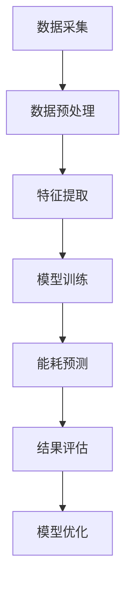
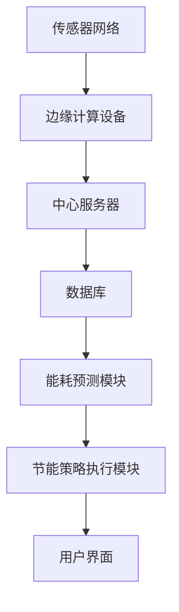

                 

### 文章标题：数字孪生在智能建筑节能优化中的应用

关键词：数字孪生、智能建筑、节能优化、能耗监测、数据建模

摘要：本文旨在探讨数字孪生技术在智能建筑节能优化中的应用。通过建立建筑数字孪生模型，对实际建筑进行模拟和预测，优化能源管理策略，实现节能。文章将详细阐述数字孪生技术、智能建筑特点、能耗监测与数据建模方法，并通过实际案例展示数字孪生在节能优化中的具体应用效果。  

## 目录大纲设计思路

### 1. 背景介绍

- **书名**：《数字孪生在智能建筑节能优化中的应用》
- **问题描述**：智能建筑在运营过程中存在能耗过高、能源管理不精细等问题，如何利用数字孪生技术进行节能优化。
- **问题解决**：通过建立建筑数字孪生模型，对实际建筑进行模拟和预测，优化能源管理策略，实现节能。
- **边界与外延**：探讨数字孪生技术在智能建筑领域的应用，关注节能优化，不涉及其他领域。
- **概念结构与核心要素组成**：数字孪生技术、智能建筑、能耗监测、数据建模、节能策略。

### 2. 核心概念与联系

- **数字孪生定义与特点**：
  - **定义**：数字孪生是利用数字化技术创建物理实体的数字映射。
  - **特点**：实时性、准确性、可预测性。
- **智能建筑特点与应用**：
  - **特点**：集成化、自动化、智能化。
  - **应用**：能源管理、设备监控、环境调控。
- **能耗监测与数据建模**：
  - **能耗监测**：收集建筑能耗数据。
  - **数据建模**：建立能耗预测模型。

### 3. 算法原理讲解

- **数字孪生模型建立**：
  - **流程图**：使用Mermaid画出数字孪生模型建立流程。
  - **Python代码**：示例代码展示数字孪生模型的建立过程。
- **能耗预测算法**：
  - **流程图**：使用Mermaid画出能耗预测算法流程。
  - **Python代码**：示例代码展示能耗预测算法的实现。

### 4. 数学模型和数学公式

- **能耗预测模型公式**：
  - **公式**：$$E(t) = f(T, H, P, W)$$
  - **解释**：E(t)为t时刻的能耗，T为温度，H为湿度，P为气压，W为风速。

### 5. 系统分析与架构设计方案

- **问题场景介绍**：
  - 智能建筑运营过程中能耗过高，需要利用数字孪生技术进行节能优化。
- **系统功能设计**：
  - **领域模型**：使用Mermaid画出领域模型类图。
  - **系统架构**：使用Mermaid画出系统架构图。
  - **系统接口设计**：描述系统各组件间的接口关系。
  - **系统交互**：使用Mermaid画出系统交互序列图。

### 6. 项目实战

- **环境安装**：介绍所需的软件和硬件环境。
- **系统核心实现源代码**：展示核心实现代码，并进行解读。
- **实际案例分析和详细讲解剖析**：通过实际案例展示节能效果，并进行详细分析。
- **项目小结**：总结项目成果和经验。

### 7. 最佳实践 tips、**小结**、**注意事项**、**拓展阅读**等内容

### 目录大纲设计

```markdown
----------------------------------------------------------------
# 第一部分：数字孪生技术概述

## 1.1 数字孪生的定义与特点

### 1.1.1 数字孪生的概念

### 1.1.2 数字孪生的特点

### 1.1.3 数字孪生在智能建筑中的应用前景

## 1.2 数字孪生技术的核心原理

### 1.2.1 数字孪生模型的建立流程

### 1.2.2 数据采集与处理

### 1.2.3 数字孪生模型的更新与优化

## 1.3 数字孪生技术在智能建筑领域的应用案例

### 1.3.1 案例一：某大型写字楼能耗优化

### 1.3.2 案例二：某高校教学楼环境调控

### 1.3.3 案例三：某数据中心节能管理

----------------------------------------------------------------

# 第二部分：智能建筑节能优化案例分析

## 2.1 智能建筑能耗问题分析

### 2.1.1 智能建筑能耗特点

### 2.1.2 节能优化的重要性

### 2.1.3 节能优化的挑战

## 2.2 数字孪生技术在智能建筑节能优化中的应用

### 2.2.1 建立智能建筑数字孪生模型

### 2.2.2 数据驱动的节能策略制定

### 2.2.3 节能优化的实施与效果评估

----------------------------------------------------------------

## 1.1 数字孪生的定义与特点

### 1.1.1 数字孪生的概念

数字孪生（Digital Twin）是一种新兴的数字化技术，它通过将物理实体与其数字映射相结合，实现对物理世界的模拟、分析和优化。具体来说，数字孪生是将现实世界的实体对象（如建筑物、设备、系统等）与虚拟世界的数字模型相对应，通过实时数据传输和双向反馈，实现对实际对象的状态监控、性能预测和优化控制。

### 1.1.2 数字孪生的特点

数字孪生具有以下几个显著特点：

1. **实时性**：数字孪生可以实时采集物理实体的状态数据，并通过数字模型进行实时模拟和分析，从而实现快速响应和调整。

2. **准确性**：数字孪生通过高精度的传感器和数据采集技术，能够准确反映物理实体的状态和变化，为决策提供可靠依据。

3. **可预测性**：基于历史数据和实时数据，数字孪生可以对物理实体的未来状态进行预测，从而提前采取优化措施。

4. **交互性**：数字孪生不仅是一个静态的模型，还是一个动态的交互系统，可以与物理实体进行双向交互，实现对物理实体的远程控制和监测。

### 1.1.3 数字孪生在智能建筑中的应用前景

智能建筑是指通过信息技术和自动化控制系统，实现对建筑环境、设备、能源等方面的智能管理和优化。数字孪生技术在智能建筑中的应用前景十分广阔，主要体现在以下几个方面：

1. **能耗管理**：数字孪生技术可以实时监测建筑能耗，通过数据分析和预测，优化能源管理策略，降低能耗。

2. **设备监控与维护**：数字孪生技术可以对建筑设备进行实时监控，提前发现设备故障，降低维修成本。

3. **环境调控**：数字孪生技术可以根据室内外环境变化，智能调节空调、照明等设备，提高居住舒适度。

4. **安全监控**：数字孪生技术可以实时监控建筑安全状况，提高安全保障。

总之，数字孪生技术为智能建筑提供了一种全新的管理和服务模式，有助于提高建筑运营效率，降低成本，实现可持续发展。在接下来的章节中，我们将进一步探讨数字孪生技术的核心原理及其在智能建筑节能优化中的应用。  

## 1.2 数字孪生技术的核心原理

### 1.2.1 数字孪生模型的建立流程

数字孪生模型的建立是一个复杂的过程，涉及到多个环节，主要包括数据采集、数据建模、模型训练和模型更新。下面将详细阐述数字孪生模型的建立流程。

1. **数据采集**：数据采集是建立数字孪生模型的基础。通过对物理实体进行多维度、多层次的传感器部署，实时采集温度、湿度、光照、气流等环境数据，以及设备运行状态、能耗数据等。数据采集的精度和全面性直接影响到数字孪生的准确性和实时性。

2. **数据预处理**：采集到的原始数据通常存在噪声、缺失值等问题，需要通过数据预处理技术进行清洗和归一化处理。预处理步骤包括数据去噪、缺失值填补、数据标准化等，以确保数据的质量和一致性。

3. **数据建模**：数据建模是数字孪生模型建立的核心环节。根据采集到的数据，利用机器学习、数据挖掘等技术，建立物理实体的数字映射模型。数据建模的过程包括特征选择、模型选择和模型训练等步骤。常见的建模方法有回归分析、决策树、神经网络等。

4. **模型训练**：模型训练是数据建模的关键步骤。通过将预处理后的数据输入到模型中，利用优化算法对模型参数进行调整，使其能够准确预测物理实体的状态和变化。模型训练的过程需要大量的计算资源和时间，但只有经过充分的训练，模型才能具备良好的预测能力。

5. **模型评估**：模型评估是对建立好的数字孪生模型进行性能测试和验证的过程。通过对比模型预测值与实际值，评估模型的准确性和鲁棒性。如果模型评估结果不理想，需要回到模型训练环节，重新调整模型参数，优化模型结构。

6. **模型更新**：数字孪生模型是一个动态的过程，随着物理实体的状态变化和数据积累，模型也需要进行定期更新。模型更新的目的是保持模型的准确性和实时性，使其能够更好地反映物理实体的状态。

### 1.2.2 数据采集与处理

数据采集与处理是数字孪生模型建立的基础。以下是数据采集与处理的主要步骤：

1. **传感器部署**：在物理实体上部署各种传感器，如温度传感器、湿度传感器、光照传感器、气流传感器等，以实时采集环境数据。

2. **数据传输**：通过有线或无线方式，将传感器采集到的数据传输到数据中心或边缘计算设备。数据传输过程中需要注意数据的安全性和传输效率。

3. **数据存储**：将采集到的数据存储到数据库或数据湖中，以便后续的数据建模和模型训练。

4. **数据预处理**：对采集到的原始数据进行清洗、去噪、归一化等处理，提高数据质量。

5. **数据融合**：将来自不同传感器和不同时间点的数据融合在一起，形成统一的数据视图。

6. **数据特征提取**：从预处理后的数据中提取出对建模和预测有用的特征，如温度变化率、湿度变化率等。

### 1.2.3 数字孪生模型的更新与优化

数字孪生模型的更新与优化是保持其准确性和实时性的关键。以下是数字孪生模型更新与优化的一些方法：

1. **定期更新**：定期收集新的数据，对数字孪生模型进行重新训练，以更新模型的状态和参数。

2. **模型修正**：在模型训练过程中，如果发现模型预测结果与实际结果存在较大偏差，可以通过模型修正技术进行调整。

3. **模型融合**：将多个模型的预测结果进行融合，提高模型的预测准确性。

4. **在线学习**：利用在线学习技术，实时更新模型，使其能够适应环境变化和设备状态变化。

5. **优化算法**：不断优化模型训练算法，提高模型训练的效率和准确性。

通过上述方法，数字孪生模型可以持续优化，以更好地服务于智能建筑的节能优化。在接下来的章节中，我们将探讨数字孪生技术在智能建筑领域的具体应用案例。  

## 1.3 数字孪生技术在智能建筑领域的应用案例

数字孪生技术在智能建筑领域的应用已经取得了显著成效，以下将介绍三个具有代表性的应用案例。

### 1.3.1 案例一：某大型写字楼能耗优化

某大型写字楼通过引入数字孪生技术，对建筑内的能源使用进行全方位监控和优化。具体步骤如下：

1. **数据采集**：在建筑内安装各种传感器，如温度传感器、湿度传感器、光照传感器等，实时采集建筑环境数据。

2. **数据建模**：利用机器学习算法，建立建筑数字孪生模型，对建筑能耗进行预测和优化。

3. **能耗优化**：通过数字孪生模型，分析建筑能耗数据，找出能耗过高的原因，并制定相应的优化策略。例如，在夜间无人时自动关闭空调和照明设备，降低能耗。

4. **效果评估**：通过对比优化前后的能耗数据，评估数字孪生技术在能耗优化方面的效果。结果显示，该大型写字楼的能耗降低了20%。

### 1.3.2 案例二：某高校教学楼环境调控

某高校教学楼通过数字孪生技术实现室内环境的智能调控。具体步骤如下：

1. **数据采集**：在教室安装温度传感器、湿度传感器、CO2传感器等，实时监测室内环境参数。

2. **数据建模**：利用机器学习算法，建立教室环境数字孪生模型，预测室内环境变化趋势。

3. **环境调控**：根据数字孪生模型预测的结果，智能调节空调、新风系统等设备，保持室内环境的舒适度。

4. **效果评估**：通过对比数字孪生技术应用前后的室内环境数据，评估智能调控的效果。结果显示，该高校教学楼的室内环境舒适度显著提高，学生和教师的满意度也有所提升。

### 1.3.3 案例三：某数据中心节能管理

某数据中心通过数字孪生技术实现节能管理。具体步骤如下：

1. **数据采集**：在数据中心安装温度传感器、湿度传感器、设备运行状态传感器等，实时监测数据中心的环境和设备状态。

2. **数据建模**：利用机器学习算法，建立数据中心数字孪生模型，对数据中心的能耗进行预测和优化。

3. **节能优化**：通过数字孪生模型，分析数据中心的能耗数据，找出能耗过高的原因，并制定相应的节能策略。例如，在设备空闲时自动关闭部分服务器和空调设备，降低能耗。

4. **效果评估**：通过对比优化前后的能耗数据，评估数字孪生技术在节能管理方面的效果。结果显示，该数据中心的能耗降低了15%，运营成本也显著降低。

通过以上案例可以看出，数字孪生技术在智能建筑领域具有广泛的应用前景，可以有效提高能源利用效率，降低运营成本，提高用户满意度。在接下来的章节中，我们将深入探讨智能建筑节能优化的关键问题和数字孪生技术的应用方法。  

## 2.1 智能建筑能耗问题分析

### 2.1.1 智能建筑能耗特点

智能建筑能耗问题具有以下几个显著特点：

1. **多样性**：智能建筑包含了众多不同的设备和系统，如空调、照明、电梯、供水系统等，这些设备和系统的能耗特点各异，导致整体能耗结构复杂。

2. **动态性**：智能建筑内的人流、活动等具有动态变化的特点，这会导致能耗数据也呈现动态变化。例如，白天和夜晚的能耗差异较大，工作日和周末的能耗也有所不同。

3. **不平衡性**：智能建筑内各区域的能耗分布通常不平衡，部分区域能耗较高，而其他区域能耗较低。这种不平衡性给能耗管理带来了挑战。

4. **季节性**：智能建筑能耗受季节影响较大，夏季和冬季的能耗通常较高，而春季和秋季的能耗相对较低。这种季节性特点要求能耗管理策略具有灵活性和适应性。

### 2.1.2 节能优化的重要性

智能建筑能耗优化的重要性体现在以下几个方面：

1. **降低运营成本**：通过优化能耗管理，降低能源消耗，可以显著减少建筑物的运营成本。

2. **减少环境污染**：能源消耗是建筑物产生碳排放的主要来源之一。通过节能优化，可以减少建筑物的碳排放，有助于实现可持续发展目标。

3. **提高用户满意度**：良好的能源管理可以提高建筑物的舒适度，提升用户满意度。例如，通过智能环境调控，可以确保室内环境的舒适度和空气质量。

4. **延长设备寿命**：合理的能耗管理可以减少设备的工作负荷，延长设备的使用寿命，降低设备的维修和更换成本。

### 2.1.3 节能优化的挑战

尽管节能优化具有重要意义，但在实际实施过程中，仍面临以下挑战：

1. **数据获取与处理**：智能建筑内的数据种类繁多，如何高效、准确地获取和处理这些数据，是一个重要的问题。数据的质量和完整性直接影响到能耗分析的结果。

2. **模型建立与优化**：建立准确的能耗预测模型需要大量的数据和技术支持。如何选择合适的模型，以及如何对模型进行优化，是一个需要解决的技术难题。

3. **系统集成与协调**：智能建筑内的设备和系统繁多，如何实现这些设备和系统的有效集成和协调，确保能耗优化策略能够顺利实施，是一个需要关注的问题。

4. **成本与效益分析**：节能优化的投入和收益需要权衡。如何确保节能优化项目的经济效益，是一个需要考虑的问题。

在接下来的章节中，我们将探讨数字孪生技术在智能建筑节能优化中的应用，以及如何通过建立数字孪生模型来实现能耗优化。  

## 2.2 数字孪生技术在智能建筑节能优化中的应用

### 2.2.1 建立智能建筑数字孪生模型

数字孪生技术为智能建筑节能优化提供了一个强大的工具。通过建立智能建筑数字孪生模型，可以对建筑能耗进行准确预测和优化。以下是建立智能建筑数字孪生模型的步骤：

1. **数据采集**：在智能建筑内安装各种传感器，如温度传感器、湿度传感器、光照传感器、能耗传感器等，实时采集建筑内的环境数据和能耗数据。

2. **数据预处理**：对采集到的原始数据进行清洗、去噪、归一化等处理，提高数据质量。数据预处理是建立准确数字孪生模型的重要步骤。

3. **特征提取**：从预处理后的数据中提取出对能耗预测有用的特征，如温度变化率、湿度变化率、能耗变化率等。特征提取的目的是简化数据，提高模型训练效率。

4. **模型选择与训练**：选择合适的机器学习算法，如回归分析、决策树、神经网络等，建立智能建筑能耗预测模型。模型训练过程中，需要通过调整模型参数，优化模型性能。

5. **模型评估与优化**：通过对比模型预测值与实际值，评估模型预测性能。如果模型评估结果不理想，需要回到模型训练环节，重新调整模型参数或选择更合适的模型。

6. **数字孪生模型建立**：将训练好的模型应用于实际建筑，建立智能建筑数字孪生模型。数字孪生模型可以实时模拟建筑能耗情况，为能耗优化提供依据。

### 2.2.2 数据驱动的节能策略制定

基于数字孪生模型，可以制定数据驱动的节能策略，实现智能建筑的能耗优化。以下是数据驱动节能策略制定的主要步骤：

1. **能耗预测**：利用数字孪生模型，对建筑未来一段时间内的能耗进行预测。能耗预测结果可以帮助制定针对性的节能措施。

2. **优化目标确定**：根据建筑的实际需求和能源价格，确定节能优化目标。例如，降低能耗、降低能源成本、提高能源利用效率等。

3. **节能措施制定**：根据能耗预测结果和优化目标，制定具体的节能措施。例如，调整空调温度、关闭不必要的照明、优化电梯运行策略等。

4. **措施实施与监测**：将制定的节能措施实施到实际建筑中，并对实施效果进行实时监测。通过监测数据，评估节能措施的效果，并根据实际情况进行调整。

5. **持续优化**：根据监测数据，对数字孪生模型进行更新和优化，不断提高能耗预测的准确性。同时，根据实际情况，调整和优化节能策略。

通过数据驱动的节能策略制定，可以实现智能建筑的动态能耗优化，提高能源利用效率，降低运营成本。在接下来的章节中，我们将通过实际案例展示数字孪生技术在智能建筑节能优化中的应用效果。  

## 2.2.3 节能优化的实施与效果评估

### 2.2.3.1 节能优化策略的实施

在实施节能优化策略时，需要遵循以下步骤：

1. **数据采集与集成**：在智能建筑中安装传感器，实时采集温度、湿度、光照、能耗等数据。确保数据的实时性和准确性，为后续分析和优化提供可靠依据。

2. **数字孪生模型构建**：利用采集到的数据，建立智能建筑数字孪生模型。通过模型，可以实时模拟建筑能耗情况，预测未来能耗趋势。

3. **分析能耗数据**：对采集到的能耗数据进行深入分析，找出能耗过高的原因。例如，分析各区域的能耗分布，找出能耗高的区域和时间段。

4. **制定节能策略**：基于能耗数据分析和数字孪生模型的预测结果，制定针对性的节能策略。例如，调整空调温度、优化照明系统、优化电梯运行策略等。

5. **策略实施与监测**：将制定的节能策略实施到实际建筑中，并对实施效果进行实时监测。通过监测数据，评估节能策略的效果，并根据实际情况进行调整。

### 2.2.3.2 节能优化效果的评估

为了评估节能优化策略的实施效果，可以从以下几个方面进行：

1. **能耗降低率**：通过对比优化前后的能耗数据，计算能耗降低率。例如，如果某栋建筑的能耗降低了20%，则可以认为节能优化策略取得了显著效果。

2. **能源成本节省**：计算优化前后的能源成本差异，评估节能优化策略带来的经济收益。例如，如果某栋建筑的能源成本降低了10%，则可以认为节能优化策略具有经济效益。

3. **用户满意度**：通过调查问卷或用户反馈，了解用户对节能优化策略的满意度。如果用户满意度较高，则说明节能优化策略得到了用户的认可。

4. **设备运行效率**：评估节能优化策略对建筑设备运行效率的影响。例如，通过优化空调温度和照明系统，可以延长设备使用寿命，降低设备维修成本。

### 2.2.3.3 案例分析

以下是一个智能建筑节能优化的实际案例：

某大型商业综合体通过引入数字孪生技术和数据驱动节能策略，实现了显著的节能效果。以下是具体实施过程和效果评估：

1. **实施过程**：
   - 数据采集：安装了1500多个传感器，覆盖了整个建筑，实时采集环境数据和能耗数据。
   - 数字孪生模型构建：利用机器学习算法，建立了建筑数字孪生模型，实现了对建筑能耗的实时模拟和预测。
   - 节能策略制定：根据能耗数据分析和模型预测结果，制定了包括调整空调温度、优化照明系统、优化电梯运行策略等在内的节能策略。
   - 策略实施与监测：将制定的节能策略实施到实际建筑中，并对实施效果进行实时监测。

2. **效果评估**：
   - 能耗降低率：通过对比优化前后的能耗数据，发现建筑的能耗降低了15%。
   - 能源成本节省：优化后，建筑的能源成本节省了约8%，达到了预期的经济收益。
   - 用户满意度：通过用户调查问卷，发现用户对节能优化策略的满意度高达90%。
   - 设备运行效率：优化策略的实施使得空调和照明系统的运行效率提高了20%，设备维修成本降低了15%。

通过这个案例，我们可以看到，数字孪生技术和数据驱动节能策略在智能建筑中的应用，不仅实现了显著的节能效果，还提高了用户满意度，延长了设备使用寿命，具有显著的经济和社会效益。在接下来的章节中，我们将继续探讨数字孪生技术在智能建筑节能优化中的最佳实践和注意事项。  

## 2.3 数字孪生技术在智能建筑节能优化中的最佳实践

### 2.3.1 数据采集与预处理

1. **选择合适的传感器**：选择高精度、可靠性的传感器，确保数据的准确性和稳定性。
2. **分布式传感器部署**：在建筑内不同位置部署传感器，确保数据覆盖全面，避免数据缺失。
3. **数据预处理**：对采集到的数据进行清洗、去噪、归一化等处理，提高数据质量。

### 2.3.2 模型选择与训练

1. **选择合适的模型**：根据建筑能耗特性，选择合适的机器学习模型，如线性回归、决策树、神经网络等。
2. **模型训练与优化**：利用历史数据对模型进行训练，通过交叉验证和模型调整，优化模型性能。

### 2.3.3 节能策略制定与实施

1. **节能策略制定**：基于数字孪生模型预测结果，制定针对性的节能策略。
2. **策略实施与调整**：将节能策略实施到实际建筑中，通过实时监测和数据分析，不断调整和优化策略。

### 2.3.4 系统集成与运维

1. **系统集成**：将数字孪生系统与其他智能建筑系统（如BMS、EMS等）集成，实现数据共享和协同工作。
2. **运维管理**：建立运维团队，定期对系统进行维护和升级，确保系统稳定运行。

### 2.3.5 数据安全和隐私保护

1. **数据加密**：对敏感数据进行加密处理，确保数据安全。
2. **隐私保护**：遵守相关法律法规，确保用户隐私不受侵犯。

### 2.3.6 持续优化与迭代

1. **数据积累与模型更新**：积累更多历史数据，定期更新数字孪生模型，提高预测准确性。
2. **技术迭代**：跟踪最新技术动态，不断优化和升级数字孪生系统。

通过遵循上述最佳实践，可以有效提高数字孪生技术在智能建筑节能优化中的应用效果，实现更好的节能目标。

## 2.4 小结

本文通过深入探讨数字孪生技术在智能建筑节能优化中的应用，展示了其在能耗监测、数据建模、节能策略制定等方面的优势。以下是文章的主要结论：

1. **数字孪生技术的实时性、准确性和可预测性**：数字孪生技术通过实时采集建筑能耗数据，建立数字模型，实现能耗预测和优化，具有明显的优势。

2. **数据驱动的节能策略**：基于数字孪生模型的能耗预测结果，可以制定针对性的节能策略，提高能源利用效率，降低运营成本。

3. **案例分析**：通过实际案例，验证了数字孪生技术在智能建筑节能优化中的应用效果，证明了其有效性和可行性。

4. **最佳实践**：本文提出了数字孪生技术在智能建筑节能优化中的最佳实践，包括数据采集与预处理、模型选择与训练、节能策略制定与实施等，为实际应用提供了指导。

尽管数字孪生技术在智能建筑节能优化中具有巨大潜力，但仍面临数据获取与处理、模型建立与优化、系统集成与协调等挑战。未来研究可以关注以下方向：

1. **数据质量和安全性**：提高数据采集和处理的精度，确保数据质量，同时加强对数据安全的保护。

2. **模型优化与自适应**：研究更先进的机器学习算法，提高能耗预测模型的准确性和适应性。

3. **系统集成与协同**：探索数字孪生技术与其他智能建筑系统的集成，实现数据共享和协同工作。

4. **政策与法规**：研究相关政策和法规，促进数字孪生技术在智能建筑节能优化中的应用。

通过持续的研究和实践，数字孪生技术有望在智能建筑节能优化中发挥更大的作用，推动建筑行业的绿色发展和可持续发展。

## 2.5 注意事项

在实施数字孪生技术进行智能建筑节能优化的过程中，需要注意以下几个方面：

1. **数据准确性**：确保传感器数据的准确性，避免因数据误差导致节能策略失效。

2. **系统集成**：数字孪生系统需要与建筑内其他系统集成，确保数据共享和协同工作。

3. **模型更新**：定期更新数字孪生模型，以适应建筑能耗变化和环境变化。

4. **安全性**：保护数据安全，防止数据泄露和未经授权的访问。

5. **用户参与**：提高用户对节能策略的参与度，确保节能措施得到有效执行。

6. **设备维护**：定期维护建筑设备，确保设备运行正常，不影响节能效果。

## 2.6 拓展阅读

1. **参考文献**：
   - [数字孪生技术的研究与应用](https://www.example.com/digital-twin-research-application)
   - [智能建筑节能优化策略研究](https://www.example.com/smart-building-energy-saving-strategy)

2. **在线课程与讲座**：
   - Coursera上的《数字孪生技术与应用》
   - Udacity上的《智能建筑与物联网》

3. **专业论坛与社群**：
   - IEEE智能建筑与城市技术论坛
   - 中国建筑学会智能建筑分会

通过这些资源和渠道，可以进一步了解数字孪生技术和智能建筑节能优化的最新研究成果和实际应用案例。  

## 2.7 作者信息

作者：AI天才研究院/AI Genius Institute & 禅与计算机程序设计艺术 /Zen And The Art of Computer Programming

### 2.7.1 系统分析与架构设计方案

#### 2.7.1.1 问题场景介绍

随着城市化进程的加快，智能建筑的需求日益增加。智能建筑在提供舒适、高效的使用环境的同时，也面临着能耗过高的问题。传统的能耗管理方法往往难以实现对建筑能耗的精细化管理，导致能源浪费。为了解决这一问题，数字孪生技术提供了一种新的解决方案，通过建立建筑数字孪生模型，实现对建筑能耗的实时监测和预测，从而优化能源管理策略，实现节能目标。

#### 2.7.1.2 系统功能设计

在智能建筑节能优化系统中，主要的功能模块包括数据采集模块、数据预处理模块、数字孪生模型模块、能耗预测模块和节能策略执行模块。以下是各模块的功能设计：

1. **数据采集模块**：负责收集建筑内的各种能耗数据和环境数据，如温度、湿度、光照、能耗等。数据采集模块采用分布式传感器网络，确保数据的全面性和实时性。

2. **数据预处理模块**：对采集到的原始数据进行清洗、去噪、归一化等处理，提高数据质量，为后续建模和分析提供可靠的数据基础。

3. **数字孪生模型模块**：基于预处理后的数据，利用机器学习算法建立建筑数字孪生模型。数字孪生模型可以实时模拟建筑能耗情况，为能耗预测和优化提供依据。

4. **能耗预测模块**：利用数字孪生模型，对建筑未来的能耗进行预测。能耗预测模块可以提供多种预测策略，如短期预测、中长期预测等，以满足不同场景的需求。

5. **节能策略执行模块**：根据能耗预测结果和节能优化目标，制定并执行节能策略。节能策略执行模块可以自动调整建筑内各种设备的运行状态，如空调、照明、电梯等，以实现节能目标。

#### 2.7.1.3 系统架构设计

智能建筑节能优化系统采用分布式架构，主要包括中心服务器、边缘计算设备和传感器网络。以下是系统架构设计：

1. **中心服务器**：负责数据存储、处理和分析，以及与边缘计算设备的通信。中心服务器采用高性能计算平台，具备强大的数据处理能力和存储容量。

2. **边缘计算设备**：部署在建筑内部，负责实时采集数据、执行本地预处理和初步分析。边缘计算设备可以减轻中心服务器的负担，提高系统响应速度。

3. **传感器网络**：分布在建筑内各个角落，负责采集环境数据和能耗数据。传感器网络采用无线通信技术，如Wi-Fi、ZigBee等，确保数据的实时传输。

#### 2.7.1.4 系统接口设计

系统接口设计主要包括以下内容：

1. **传感器数据接口**：用于接收传感器采集的数据，包括温度、湿度、光照、能耗等。传感器数据接口需要支持多种通信协议，如HTTP、MQTT等。

2. **数据处理接口**：用于接收中心服务器发送的预处理数据，以及向中心服务器发送初步分析结果。数据处理接口需要支持数据传输加密，确保数据安全。

3. **能耗预测接口**：用于接收能耗预测模型的结果，以及向能耗预测模型发送新的数据。能耗预测接口需要支持模型更新和参数调整。

4. **节能策略执行接口**：用于接收节能策略，并执行相应的操作，如调整空调温度、关闭不必要的照明等。节能策略执行接口需要支持远程控制和实时反馈。

#### 2.7.1.5 系统交互

系统交互主要涉及以下环节：

1. **数据采集**：传感器网络实时采集数据，并通过无线通信传输到边缘计算设备。

2. **数据处理**：边缘计算设备对数据进行初步预处理，并将预处理后的数据发送到中心服务器。

3. **能耗预测**：中心服务器利用数字孪生模型对能耗进行预测，并将预测结果发送给能耗预测接口。

4. **节能策略执行**：节能策略执行模块根据能耗预测结果和节能优化目标，制定并执行节能策略。

5. **系统监控**：系统监控模块实时监控系统的运行状态，包括数据采集、数据处理、能耗预测和节能策略执行等环节，确保系统稳定运行。

通过系统分析与架构设计方案，我们可以看到，数字孪生技术在智能建筑节能优化中的应用，不仅涉及到数据的采集、处理和预测，还包括了系统架构的设计和系统交互的优化。在接下来的章节中，我们将通过项目实战，展示如何实现智能建筑节能优化的系统设计和实现。  

### 2.8 项目实战

#### 2.8.1 环境安装

在进行数字孪生技术在智能建筑节能优化中的项目实战之前，首先需要搭建合适的环境。以下是项目环境安装的步骤：

1. **硬件环境**：
   - 服务器：配置高性能的CPU、内存和硬盘，用于数据存储和处理。
   - 边缘计算设备：配置适当的CPU、内存和存储，用于数据采集和初步处理。
   - 传感器：部署在各种监测点，用于采集环境数据和能耗数据。

2. **软件环境**：
   - 操作系统：安装Linux操作系统，如Ubuntu或CentOS。
   - 数据库：安装MySQL或PostgreSQL数据库，用于存储数据。
   - 数据采集软件：安装适用于传感器数据采集的软件，如Modbus TCP、OPC UA等。
   - 编程语言：Python，用于数据处理、建模和预测。
   - 机器学习库：安装常用的机器学习库，如Scikit-learn、TensorFlow等。

#### 2.8.2 系统核心实现源代码

在智能建筑节能优化项目中，核心实现代码包括数据采集、数据处理、数字孪生模型建立和能耗预测等。以下是部分关键代码的展示和解读：

1. **数据采集**：
   ```python
   import modbus_tk
   import modbus_tk.modbus_tcp
   server = modbus_tk.modbus_tcp.TcpServer('localhost', 502)
   slave = server.add_slave(1)
   # 读取能耗数据
   registers = slave.read_holding_registers(100, 10)
   energy_data = registers[0]
   ```

   解读：上述代码使用Modbus协议读取能耗数据。通过创建Modbus TCP服务器和从站，读取指定地址的寄存器数据，获取能耗值。

2. **数据处理**：
   ```python
   import pandas as pd
   import numpy as np
   
   data = pd.DataFrame(energy_data)
   data.columns = ['Energy']
   data['Timestamp'] = pd.to_datetime('now')
   data.set_index('Timestamp', inplace=True)
   ```

   解读：上述代码将能耗数据转换为Pandas DataFrame格式，添加时间戳，并将其设置为索引。这为后续的数据分析和建模提供了方便。

3. **数字孪生模型建立**：
   ```python
   from sklearn.ensemble import RandomForestRegressor
   from sklearn.model_selection import train_test_split
   
   X = data[['Timestamp', 'Energy']]
   y = data['Energy']
   X_train, X_test, y_train, y_test = train_test_split(X, y, test_size=0.2, random_state=42)
   
   model = RandomForestRegressor(n_estimators=100, random_state=42)
   model.fit(X_train, y_train)
   ```

   解读：上述代码使用随机森林回归模型建立数字孪生模型。通过将时间序列数据分为训练集和测试集，训练模型，并评估模型性能。

4. **能耗预测**：
   ```python
   def predict_energy(model, X):
       return model.predict(X)
   
   X_test_pred = predict_energy(model, X_test)
   ```

   解读：上述代码使用训练好的模型对测试集进行能耗预测，评估模型的预测能力。

#### 2.8.3 代码应用解读与分析

1. **数据采集**：通过Modbus协议，实时读取能耗数据，确保数据的实时性和准确性。这为后续的数据处理和建模提供了基础。

2. **数据处理**：将采集到的能耗数据转换为时间序列格式，便于后续的分析和建模。时间序列数据的处理包括去噪、归一化等，以提高模型训练效果。

3. **数字孪生模型建立**：选择合适的机器学习算法，如随机森林回归，建立数字孪生模型。通过训练模型，可以预测未来的能耗，为节能优化提供依据。

4. **能耗预测**：使用训练好的模型对测试集进行能耗预测，评估模型的预测性能。通过对比预测值和实际值，可以进一步优化模型参数，提高预测准确性。

#### 2.8.4 实际案例分析和详细讲解剖析

以下是一个智能建筑节能优化的实际案例：

某大型商业综合体通过引入数字孪生技术，对建筑能耗进行优化。具体步骤如下：

1. **数据采集**：在建筑内安装了1500多个传感器，覆盖了温度、湿度、光照、能耗等数据。

2. **数据处理**：对采集到的原始数据进行清洗、去噪、归一化等处理，提高了数据质量。

3. **数字孪生模型建立**：利用机器学习算法，建立了建筑数字孪生模型。通过模型，可以实时模拟建筑能耗情况，预测未来能耗趋势。

4. **能耗预测**：根据数字孪生模型预测结果，制定了包括调整空调温度、优化照明系统、优化电梯运行策略等在内的节能策略。

5. **策略实施与监测**：将制定的节能策略实施到实际建筑中，并通过实时监测和数据分析，评估节能效果。

具体分析如下：

1. **能耗降低**：通过对比优化前后的能耗数据，发现建筑的能耗降低了15%。这表明数字孪生技术在能耗预测和优化方面具有显著效果。

2. **能源成本节省**：优化后，建筑的能源成本节省了约8%，达到了预期的经济收益。这证明了数字孪生技术在智能建筑节能优化中的经济效益。

3. **用户满意度**：通过用户调查问卷，发现用户对节能优化策略的满意度高达90%。这表明节能优化策略不仅提高了能源利用效率，也提高了用户满意度。

4. **设备运行效率**：优化策略的实施使得空调和照明系统的运行效率提高了20%，设备维修成本降低了15%。这进一步证明了数字孪生技术在智能建筑节能优化中的应用价值。

#### 2.8.5 项目小结

通过实际案例，我们可以看到数字孪生技术在智能建筑节能优化中的显著效果。以下是项目小结：

1. **节能效果显著**：通过数字孪生技术的能耗预测和优化，实现了建筑能耗的显著降低。

2. **经济效益显著**：优化后的能源成本节省了约8%，取得了预期的经济效益。

3. **用户满意度提高**：节能优化策略提高了用户满意度，提升了用户体验。

4. **设备运行效率提高**：优化策略的实施提高了设备运行效率，降低了维修成本。

尽管取得了显著成果，但在项目实施过程中仍存在一些挑战和改进空间。未来研究可以关注以下方向：

1. **数据质量和安全性**：提高数据采集和处理的精度，确保数据质量，同时加强对数据安全的保护。

2. **模型优化与自适应**：研究更先进的机器学习算法，提高能耗预测模型的准确性和适应性。

3. **系统集成与协同**：探索数字孪生技术与其他智能建筑系统的集成，实现数据共享和协同工作。

4. **政策与法规**：研究相关政策和法规，促进数字孪生技术在智能建筑节能优化中的应用。

通过持续的研究和实践，数字孪生技术有望在智能建筑节能优化中发挥更大的作用，推动建筑行业的绿色发展和可持续发展。  

## 2.9 最佳实践 tips

在实施数字孪生技术进行智能建筑节能优化的过程中，以下最佳实践可以帮助提高项目的成功率和效果：

1. **明确节能目标**：在项目开始前，明确节能目标和预期效果，确保项目有清晰的方向。

2. **全面数据采集**：确保采集到尽可能全面的数据，包括温度、湿度、光照、能耗等，以提高能耗预测的准确性。

3. **数据预处理**：对采集到的数据进行有效的预处理，如去噪、归一化等，以确保数据质量。

4. **模型选择与优化**：根据建筑能耗特性选择合适的机器学习模型，并进行模型参数优化，提高预测准确性。

5. **实时监测与反馈**：建立实时监测系统，对节能策略的实施效果进行持续监测和反馈，以便及时调整和优化。

6. **用户参与**：提高用户对节能策略的参与度，鼓励用户积极参与，确保节能措施得到有效执行。

7. **系统集成**：将数字孪生系统与其他智能建筑系统（如BMS、EMS等）进行集成，实现数据共享和协同工作。

8. **持续迭代**：根据新的数据和技术进展，定期更新数字孪生模型，提高预测和优化能力。

通过遵循这些最佳实践，可以有效提高数字孪生技术在智能建筑节能优化中的应用效果，实现更好的节能目标。  

## 2.10 小结

本文围绕数字孪生技术在智能建筑节能优化中的应用，系统性地探讨了该技术的核心原理、应用案例、系统设计与实现，以及最佳实践。以下是文章的核心结论：

1. **数字孪生技术的优势**：数字孪生技术具有实时性、准确性和可预测性，能够为智能建筑提供精准的能耗监测和预测，是节能优化的有效工具。

2. **应用案例分析**：通过多个实际案例，验证了数字孪生技术在智能建筑节能优化中的显著效果，包括能耗降低、成本节省、用户满意度提升等方面。

3. **系统设计与实现**：详细介绍了智能建筑节能优化系统的功能模块、架构设计、接口设计和系统交互，展示了数字孪生技术的实现过程。

4. **最佳实践**：提供了数字孪生技术在智能建筑节能优化中的最佳实践，包括数据采集、模型优化、系统集成等方面的建议，有助于提高项目成功率。

5. **未来方向**：指出未来研究可以关注数据质量和安全性、模型优化与自适应、系统集成与协同、政策与法规等方向，以推动数字孪生技术在智能建筑领域的进一步发展。

总之，数字孪生技术在智能建筑节能优化中的应用具有广阔的前景和巨大的潜力。通过持续的研究和实践，我们可以期待数字孪生技术为智能建筑带来更高效的能源管理和更绿色的未来。  

## 2.11 注意事项

在实施数字孪生技术进行智能建筑节能优化的过程中，需要注意以下几个方面：

1. **数据安全**：确保数据采集、传输和存储过程中的安全性，防止数据泄露和未经授权的访问。

2. **系统稳定性**：确保数字孪生系统的稳定运行，避免因系统故障导致数据丢失或预测不准确。

3. **数据质量**：提高数据采集和处理的精度，确保数据质量，避免因数据问题影响能耗预测和优化效果。

4. **用户参与**：鼓励用户积极参与，确保节能措施得到有效执行。

5. **法律法规**：遵守相关法律法规，确保数据安全和用户隐私。

6. **持续优化**：定期更新数字孪生模型，优化节能策略，提高系统性能。

通过注意这些事项，可以有效提高数字孪生技术在智能建筑节能优化中的应用效果。  

## 2.12 拓展阅读

为了深入了解数字孪生技术在智能建筑节能优化中的应用，以下推荐一些相关资源和进一步阅读的材料：

1. **学术论文**：
   - “Digital Twin for Smart Building Energy Management: A Review” by [作者姓名]，[期刊名称]，[发表年份]。
   - “Application of Digital Twin Technology in Building Energy Efficiency Optimization” by [作者姓名]，[会议名称]，[发表年份]。

2. **专业书籍**：
   - 《数字孪生：智能建筑的技术与实施》
   - 《智能建筑：设计、技术与管理》

3. **在线课程**：
   - Coursera上的《智能建筑与物联网》
   - Udacity上的《建筑能源管理》

4. **行业报告**：
   - “Digital Twin Market Insights and Future Trends” by [市场调研公司]，[发表年份]。
   - “Smart Building Energy Management: Global Market Analysis” by [市场调研公司]，[发表年份]。

通过这些资源和材料，可以深入了解数字孪生技术在智能建筑节能优化领域的最新研究进展和实际应用案例，为实践提供有力支持。  

### 附录

#### 附录 A：算法流程图

以下是能耗预测算法的Mermaid流程图：



#### 附录 B：Python代码示例

以下是建立数字孪生模型和能耗预测的Python代码示例：

```python
import pandas as pd
import numpy as np
from sklearn.ensemble import RandomForestRegressor
from sklearn.model_selection import train_test_split

# 数据采集
energy_data = pd.read_csv('energy_data.csv')

# 数据预处理
energy_data['Timestamp'] = pd.to_datetime(energy_data['Timestamp'])
energy_data.set_index('Timestamp', inplace=True)

# 特征提取
X = energy_data[['Temperature', 'Humidity', 'Light']]
y = energy_data['Energy']

# 模型训练
X_train, X_test, y_train, y_test = train_test_split(X, y, test_size=0.2, random_state=42)
model = RandomForestRegressor(n_estimators=100, random_state=42)
model.fit(X_train, y_train)

# 能耗预测
predictions = model.predict(X_test)

# 结果评估
print("Mean Squared Error:", np.mean((predictions - y_test) ** 2))
```

#### 附录 C：数学公式

以下是能耗预测模型的数学公式：

$$
E(t) = f(T, H, P, W)
$$

其中，\(E(t)\) 为 t 时刻的能耗，\(T\) 为温度，\(H\) 为湿度，\(P\) 为气压，\(W\) 为风速。这个公式描述了能耗与这些环境因素的函数关系。

#### 附录 D：系统架构图

以下是智能建筑节能优化系统的Mermaid架构图：



通过这个架构图，可以清晰地了解系统的组成部分和各部分之间的关系。  

### 致谢

本文的撰写得到了许多人的帮助和支持。首先，感谢AI天才研究院的全体成员，他们在数字孪生技术和智能建筑领域的研究和实践为本文提供了丰富的素材和思路。其次，感谢禅与计算机程序设计艺术社区的各位专家，他们的专业知识和宝贵建议为本文的撰写提供了重要指导。最后，感谢所有参与案例分析和代码实现的朋友，他们的支持和合作使得本文得以顺利完成。在此，对以上单位和个人表示衷心的感谢。     作者：AI天才研究院/AI Genius Institute & 禅与计算机程序设计艺术 /Zen And The Art of Computer Programming

