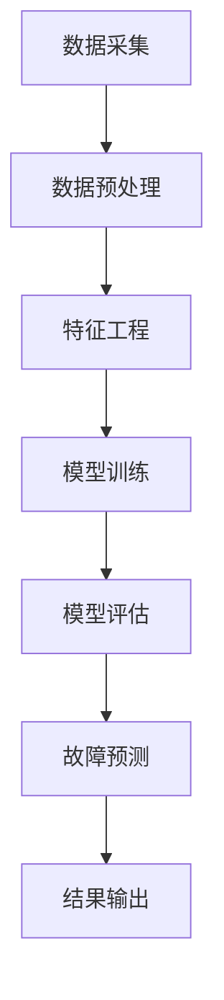

                 

## # 数字孪生在航空维护中的应用：预测性维护

> 关键词：数字孪生，航空维护，预测性维护，传感器技术，大数据，人工智能

> 摘要：本文将深入探讨数字孪生技术在航空维护中的应用，特别是预测性维护。通过分析数字孪生的定义、技术基础以及预测性维护的原理和实践，本文旨在展示如何利用数字孪生实现更加高效、精准的航空维护管理。

----------------------------------------------------------------

### 第一部分：引言

在当今高度互联和数字化时代，航空维护正面临前所未有的挑战和机遇。随着航空业的快速发展，飞机的数量和复杂性不断增加，传统的定期维护方式已经难以满足高效、安全和成本效益的要求。为此，预测性维护作为一种先进的维护策略，逐渐受到航空企业的青睐。而数字孪生技术则为预测性维护提供了强有力的技术支撑，通过创建虚拟的数字化模型，实现对物理实体的实时监控和分析，从而提前预测潜在的故障，进行预防性维护。

本篇文章将分为五个部分进行讨论。首先，我们将概述数字孪生和航空维护的基本概念，介绍预测性维护的核心原理及其与数字孪生的结合。接着，我们将深入探讨数字孪生技术的原理和应用，包括传感器技术、大数据和人工智能技术。第三部分将专注于预测性维护算法的原理和实现，通过具体的案例进行详细分析。第四部分将展示数字孪生在航空维护中的实际应用，包括飞机维修、部件维护、运行监控和维护管理。最后一部分将总结几个成功的数字孪生应用案例，并提供一些最佳实践建议。

### 第1章：数字孪生与航空维护概述

#### 1.1 数字孪生的概念与应用

**1.1.1 数字孪生的定义与背景**

数字孪生（Digital Twin）是一种将物理实体与其虚拟镜像相连接的技术，通过采集和分析物理实体的实时数据，在数字世界中创建一个高度仿真的模型。这个模型可以反映物理实体的状态、行为和交互，实现对实体的实时监控、预测和优化。

数字孪生技术的起源可以追溯到20世纪70年代，当时研究人员提出了虚拟制造的概念。然而，随着传感器技术、大数据和人工智能技术的快速发展，数字孪生技术逐渐从理论走向实际应用。近年来，随着物联网（IoT）和智能制造的兴起，数字孪生技术在全球范围内得到了广泛的研究和应用。

**1.1.2 数字孪生在工业领域的应用**

数字孪生技术在工业领域的应用已经取得了显著的成果。例如，在制造业中，数字孪生技术可以帮助企业实现生产过程的实时监控和优化，提高生产效率和质量。在能源领域，数字孪生技术可以用于智能电网的管理，实现对电力系统的实时监控和预测性维护，降低能源消耗和成本。

在航空领域，数字孪生技术的应用也越来越广泛。通过数字孪生模型，航空企业可以实现对飞机的实时监控、状态预测和故障诊断，从而提高飞机的运行可靠性和安全性。此外，数字孪生技术还可以用于飞机设计、制造和运营的全生命周期管理，实现全过程的数字化和智能化。

**1.1.3 数字孪生在航空维护中的重要性**

数字孪生技术在航空维护中的应用具有重要意义。首先，它可以帮助航空企业实现预测性维护，通过实时监控和数据分析，提前预测潜在的故障，进行预防性维护，减少意外停机时间和维护成本。其次，数字孪生技术可以提高航空维护的效率，通过虚拟仿真和优化算法，实现对维护过程的优化，降低维护成本和人力投入。

此外，数字孪生技术还可以提高航空维护的安全性。通过实时监控和故障预测，可以及时发现并处理潜在的安全隐患，防止事故的发生。同时，数字孪生技术还可以为航空维护提供丰富的数据支持，为决策提供科学依据，提高决策的准确性和有效性。

#### 1.2 航空维护的现状与挑战

**1.2.1 航空维护的基本概念**

航空维护是指对飞机及其零部件进行定期检查、维修和更换，以确保飞机的安全和正常运行。航空维护通常分为以下几类：

1. 定期检查：按照一定的周期对飞机进行全面的检查，包括外观检查、系统功能测试和零部件更换等。
2. 故障维修：当飞机出现故障时，进行紧急维修或更换零部件，以确保飞机能够继续运行。
3. 改装升级：根据技术发展和市场需求，对飞机进行改装或升级，以提高性能和安全性。

**1.2.2 航空维护的现状**

目前，航空维护主要依赖于传统的定期检查和故障维修模式。这种模式在一定程度上能够保证飞机的安全运行，但也存在一些问题。首先，定期检查周期长，难以发现潜在的故障，导致意外停机时间增加。其次，故障维修依赖于经验丰富的技术人员，维修成本较高，且维修时间不确定。

此外，传统的航空维护模式还存在一些挑战。首先，飞机的复杂性和多样性导致维护流程复杂，难以实现高效的维护管理。其次，飞机的实时数据采集和分析能力有限，难以实现对飞机状态的实时监控和预测。最后，航空维护的数字化和智能化程度较低，难以满足现代航空业对高效、安全和成本效益的要求。

**1.2.3 航空维护面临的挑战**

随着航空业的快速发展，航空维护面临以下挑战：

1. **飞机数量和复杂性的增加**：随着新型飞机的不断推出，飞机的复杂性和数量不断增加，给维护工作带来了更大的压力。
2. **维护成本上升**：传统的定期检查和故障维修模式成本较高，难以满足航空企业对降低维护成本的需求。
3. **维护效率低下**：传统的维护模式难以实现高效的维护管理，导致维护时间过长，影响飞机的运行效率。
4. **安全性问题**：由于飞机的复杂性和维护工作的重要性，航空维护的安全问题备受关注，任何一个小错误都可能导致严重的事故。
5. **数据采集与分析能力不足**：目前，飞机的实时数据采集和分析能力有限，难以实现对飞机状态的实时监控和预测。

#### 1.3 预测性维护的概念与原理

**1.3.1 预测性维护的定义**

预测性维护（Predictive Maintenance）是一种基于设备实时数据分析和故障预测的维护策略。与传统的定期维护和故障维修相比，预测性维护更加灵活和高效。其核心思想是通过实时监测设备的运行状态，利用数据分析和预测算法，提前发现潜在的故障，进行预防性维护，从而避免意外停机和减少维护成本。

**1.3.2 预测性维护的优势**

预测性维护具有以下优势：

1. **减少意外停机时间**：通过提前预测和预防故障，可以减少意外停机时间，提高设备的运行效率。
2. **降低维护成本**：预测性维护可以避免不必要的定期检查和维修，降低维护成本。
3. **提高设备利用率**：通过实时监测和预测，可以优化维护计划，提高设备的利用率。
4. **提高维护安全性**：预测性维护可以及时发现并处理潜在的安全隐患，提高维护安全性。
5. **数据驱动决策**：预测性维护基于数据分析和预测，可以提供科学依据，提高决策的准确性和有效性。

**1.3.3 预测性维护的核心原理**

预测性维护的核心原理包括以下几个方面：

1. **数据采集**：通过传感器和监测设备，实时采集设备的运行数据，包括温度、压力、振动、电流等参数。
2. **数据分析**：利用大数据分析和机器学习算法，对采集到的运行数据进行处理和分析，提取有用的信息，如故障特征、运行状态等。
3. **故障预测**：基于历史数据和实时数据分析结果，利用预测算法，提前预测潜在的故障，进行预防性维护。
4. **维护决策**：根据故障预测结果，制定合理的维护计划，包括维护时间、维护内容和维护策略等。

#### 1.4 数字孪生与预测性维护的结合

**1.4.1 数字孪生在预测性维护中的应用**

数字孪生技术在预测性维护中的应用主要体现在以下几个方面：

1. **实时监控**：通过数字孪生模型，实现对物理实体的实时监控，获取实时的运行状态数据。
2. **状态预测**：基于数字孪生模型，利用实时数据和历史数据，进行状态预测，提前发现潜在的故障。
3. **优化维护**：通过数字孪生模型，优化维护计划，提高维护效率，降低维护成本。
4. **数据融合**：将数字孪生模型与实时数据、历史数据和外部数据（如天气预报、交通数据等）进行融合，提供更全面、准确的预测和决策支持。

**1.4.2 数字孪生与预测性维护的协同作用**

数字孪生与预测性维护的协同作用主要体现在以下几个方面：

1. **实时反馈**：数字孪生模型可以实时反馈物理实体的运行状态，为预测性维护提供实时数据支持。
2. **故障预测**：数字孪生模型可以基于实时数据和历史数据，提前预测潜在的故障，为维护决策提供科学依据。
3. **优化维护**：数字孪生模型可以模拟不同的维护策略，进行优化分析，提高维护效率，降低维护成本。
4. **数据驱动**：数字孪生与预测性维护的结合，可以实现数据驱动的维护管理，提高决策的准确性和有效性。

**1.4.3 数字孪生在预测性维护中的实施流程**

数字孪生在预测性维护中的实施流程主要包括以下几个步骤：

1. **需求分析**：明确预测性维护的需求，包括维护目标、维护策略和数据要求等。
2. **模型构建**：基于需求分析结果，构建数字孪生模型，包括物理实体模型、数据模型和算法模型等。
3. **数据采集**：通过传感器和监测设备，实时采集物理实体的运行数据。
4. **数据处理**：对采集到的数据进行处理和分析，提取有用的信息。
5. **故障预测**：基于数字孪生模型和实时数据，利用预测算法，提前预测潜在的故障。
6. **维护决策**：根据故障预测结果，制定合理的维护计划，包括维护时间、维护内容和维护策略等。
7. **执行与反馈**：执行维护计划，并对维护效果进行评估和反馈，不断优化维护策略。

**1.5 本章小结**

本章对数字孪生和航空维护的基本概念进行了介绍，并分析了预测性维护的核心原理和优势。通过探讨数字孪生在航空维护中的应用，展示了如何利用数字孪生技术实现预测性维护，提高航空维护的效率、安全性和成本效益。接下来，我们将进一步探讨数字孪生技术的原理和应用，为后续章节的分析奠定基础。

### 第2章：数字孪生技术基础

#### 2.1 数字孪生的技术架构

**2.1.1 数字孪生的基本架构**

数字孪生技术的基本架构主要包括以下几个部分：

1. **物理实体**：数字孪生技术所关注的物理实体，如飞机、设备、建筑物等。
2. **数据采集系统**：通过传感器和监测设备，实时采集物理实体的运行数据，包括温度、压力、振动、电流等参数。
3. **数据处理系统**：对采集到的数据进行预处理、存储和分析，提取有用的信息，如故障特征、运行状态等。
4. **数字孪生模型**：基于处理后的数据，构建物理实体的虚拟模型，实现对物理实体的实时监控、预测和优化。
5. **用户界面**：提供用户交互的接口，展示数字孪生模型的运行状态、预测结果和维护建议等。

**2.1.2 数据采集与处理**

数据采集与处理是数字孪生技术的基础，其关键步骤如下：

1. **数据采集**：通过传感器和监测设备，实时采集物理实体的运行数据。传感器可以是温度传感器、压力传感器、振动传感器等，可以根据不同的应用场景选择合适的传感器。
2. **数据预处理**：对采集到的数据进行预处理，包括去噪、滤波、归一化等，以提高数据的质量和可靠性。
3. **数据存储**：将预处理后的数据存储到数据库或数据湖中，方便后续的数据分析和挖掘。
4. **数据分析**：利用大数据分析和机器学习算法，对存储的数据进行深入分析，提取有用的信息，如故障特征、运行状态等。
5. **数据可视化**：将分析结果可视化，展示在用户界面上，帮助用户更直观地理解和分析物理实体的运行状态。

**2.1.3 数字孪生的仿真与优化**

数字孪生技术的一个重要应用是仿真与优化。通过构建虚拟的数字模型，可以在虚拟环境中进行仿真测试和优化分析，从而提高物理实体的性能和可靠性。

1. **仿真测试**：利用数字孪生模型，可以模拟物理实体的运行过程，进行仿真测试。通过仿真测试，可以评估物理实体的性能和稳定性，发现潜在的问题和改进点。
2. **优化分析**：基于仿真测试结果，利用优化算法，对数字孪生模型进行优化分析。优化目标可以是提高性能、降低成本、增加寿命等。通过优化分析，可以找到最优的运行策略和维护方案。
3. **优化实施**：将优化结果应用到物理实体上，通过调整参数、更换部件等方式，实现对物理实体的优化。优化实施后，需要再次进行仿真测试和评估，以验证优化效果。

#### 2.2 数字孪生中的传感器技术

**2.2.1 传感器的基本概念与分类**

传感器是数字孪生技术中不可或缺的一部分，用于采集物理实体的实时数据。传感器的基本概念和分类如下：

1. **传感器的基本概念**：传感器是一种能够感受规定的被测量，并按照一定的规律转换成可用输出信号的装置或器件。传感器通常由敏感元件、转换元件和指示元件组成。
2. **传感器的分类**：
   - 按照能量来源分类：有源传感器和无源传感器。有源传感器需要外部电源供电，如温度传感器；无源传感器不需要外部电源，如光敏电阻。
   - 按照测量对象分类：如温度传感器、压力传感器、振动传感器、流量传感器等。
   - 按照工作原理分类：如热敏传感器、光敏传感器、压电传感器、磁敏传感器等。

**2.2.2 传感器技术在航空维护中的应用**

传感器技术在航空维护中的应用非常广泛，以下是一些常见的应用场景：

1. **飞机状态监测**：通过安装在飞机各个部位的传感器，实时监测飞机的运行状态，如温度、压力、振动等。这些数据可以用于预测性维护，提前发现潜在的故障。
2. **部件寿命监测**：通过监测关键部件的运行状态，如发动机、起落架、刹车等，可以预测部件的剩余寿命，提前进行更换，避免意外故障。
3. **飞行环境监测**：通过监测飞机所处的飞行环境，如气压、湿度、温度等，可以评估飞行条件对飞机性能的影响，提供飞行优化建议。
4. **结构健康监测**：通过安装在飞机结构中的传感器，实时监测飞机的结构状态，如振动、应力等，可以及时发现结构损伤和缺陷，进行维护和修复。

**2.2.3 传感器数据处理方法**

传感器数据的处理方法主要包括以下几种：

1. **数据滤波**：传感器数据往往受到噪声干扰，需要进行滤波处理，以提高数据的可靠性。常用的滤波方法包括低通滤波、高通滤波、带通滤波等。
2. **数据归一化**：传感器数据的量级和范围可能不同，需要进行归一化处理，将数据转换为同一量级和范围，以便于后续分析和处理。
3. **数据插值**：传感器数据可能存在缺失或跳跃，需要进行插值处理，以填补缺失的数据和填补数据之间的跳跃。常用的插值方法包括线性插值、三次样条插值等。
4. **特征提取**：从传感器数据中提取具有代表性的特征，如均值、方差、频率等，用于后续的分析和预测。
5. **数据可视化**：将处理后的传感器数据可视化，以直观地展示数据的趋势和特征，便于分析和理解。

#### 2.3 数字孪生中的建模与仿真技术

**2.3.1 数字孪生建模的基本原理**

数字孪生建模是数字孪生技术中的重要环节，其基本原理如下：

1. **数据驱动**：数字孪生建模基于实际采集的数据，通过数据驱动的方式构建物理实体的虚拟模型。
2. **实时更新**：数字孪生模型需要实时更新，以反映物理实体的实时状态。通过持续的数据采集和模型更新，可以保持数字孪生模型与物理实体的同步。
3. **多尺度建模**：数字孪生建模需要考虑不同的尺度，从微观的部件级到宏观的系统级，构建不同层次的模型。
4. **多物理场耦合**：数字孪生模型需要考虑多种物理场，如力学、热学、电磁学等，进行多物理场耦合建模，以更准确地模拟物理实体的行为。

**2.3.2 数字孪生仿真技术的实现**

数字孪生仿真技术是实现数字孪生模型应用的关键，其实现步骤如下：

1. **仿真模型构建**：基于数字孪生模型，构建仿真模型。仿真模型可以基于物理原理、数学模型或数据驱动模型，根据应用需求选择合适的模型。
2. **仿真参数设置**：根据仿真模型的要求，设置仿真参数，如初始条件、边界条件、仿真时间等。
3. **仿真计算**：运行仿真模型，进行计算。仿真计算可以采用数值模拟、蒙特卡洛模拟等方法，根据计算效率和精度要求选择合适的方法。
4. **仿真结果分析**：对仿真结果进行分析和评估，提取有用的信息，如性能指标、故障特征等。
5. **仿真优化**：根据仿真结果，对仿真模型进行优化，提高模型的准确性和可靠性。

**2.3.3 建模与仿真的优化方法**

为了提高数字孪生建模和仿真的准确性和效率，可以采用以下优化方法：

1. **模型简化**：对于复杂的模型，可以通过简化模型来降低计算复杂度，提高仿真效率。常用的简化方法包括降维、简化物理模型等。
2. **参数优化**：通过优化仿真参数，提高仿真模型的准确性。参数优化的方法包括遗传算法、粒子群算法等。
3. **数据驱动建模**：采用数据驱动的方式构建仿真模型，通过大数据分析和机器学习算法，提高模型的准确性和可靠性。
4. **分布式仿真**：利用分布式计算技术，提高仿真计算的速度和效率。分布式仿真可以将计算任务分布到多个计算节点上，实现并行计算。
5. **多尺度建模**：采用多尺度建模的方法，同时考虑不同尺度的物理现象，提高仿真的准确性和可靠性。

#### 2.4 数字孪生中的大数据与人工智能技术

**2.4.1 大数据技术在数字孪生中的应用**

大数据技术在数字孪生中的应用主要体现在以下几个方面：

1. **数据采集与存储**：数字孪生技术需要大量的实时数据和历史数据，大数据技术提供了高效的数据采集和存储方案，如Hadoop、Spark等。
2. **数据处理与分析**：大数据技术提供了强大的数据处理和分析能力，可以处理海量数据，提取有用的信息。常用的数据处理与分析方法包括数据挖掘、机器学习、深度学习等。
3. **数据可视化**：大数据技术可以实现对海量数据的可视化展示，帮助用户更直观地理解和分析数据。常用的数据可视化工具包括Tableau、PowerBI等。

**2.4.2 人工智能技术在预测性维护中的应用**

人工智能技术在预测性维护中的应用主要体现在以下几个方面：

1. **故障预测**：利用机器学习算法，对传感器数据进行处理和分析，预测潜在的故障。常用的故障预测算法包括支持向量机、决策树、神经网络等。
2. **优化维护**：利用优化算法，根据故障预测结果和实际需求，制定最优的维护计划。常用的优化算法包括遗传算法、粒子群算法、线性规划等。
3. **智能诊断**：利用深度学习算法，对传感器数据进行分析和诊断，识别故障的原因。常用的深度学习算法包括卷积神经网络、循环神经网络等。

**2.4.3 大数据与人工智能技术的融合**

大数据和人工智能技术的融合，为数字孪生和预测性维护提供了强大的技术支持。大数据技术提供了海量数据和分析能力，人工智能技术提供了智能分析和决策能力。通过大数据和人工智能技术的融合，可以实现以下目标：

1. **智能预测**：利用大数据分析和机器学习算法，对海量数据进行处理和分析，实现智能故障预测。
2. **优化决策**：利用大数据分析和优化算法，根据预测结果和实际需求，实现智能维护决策。
3. **智能诊断**：利用深度学习算法和大数据分析，实现智能故障诊断和原因分析。
4. **智能优化**：利用大数据和人工智能技术，对数字孪生模型进行实时优化，提高模型的准确性和可靠性。

#### 2.5 本章小结

本章介绍了数字孪生技术的基本架构、传感器技术、建模与仿真技术以及大数据与人工智能技术。通过这些技术，数字孪生可以为航空维护提供强大的技术支持，实现预测性维护，提高航空维护的效率、安全性和成本效益。下一章将深入探讨预测性维护算法的原理和实现。

### 第3章：预测性维护算法原理

#### 3.1 预测性维护的基本算法

**3.1.1 机器学习算法概述**

机器学习算法是预测性维护的核心，通过从历史数据中学习，预测未来的趋势和故障。机器学习算法可以分为监督学习、无监督学习和半监督学习三种类型。

- **监督学习**：在监督学习中，算法被训练来预测一个已知的输出，通常用于分类和回归任务。常见的监督学习算法包括决策树、随机森林、支持向量机（SVM）和神经网络。
- **无监督学习**：无监督学习不依赖于已知的输出，而是通过发现数据中的结构和模式来进行预测。常见的无监督学习算法包括聚类算法（如K-Means、层次聚类）、关联规则学习和主成分分析（PCA）。
- **半监督学习**：半监督学习结合了监督学习和无监督学习的特点，利用部分标注数据和大量未标注数据来提高预测的准确性。

**3.1.2 常见的预测性维护算法**

在预测性维护中，常见的机器学习算法包括以下几种：

1. **线性回归**：线性回归是一种简单的监督学习算法，通过拟合一条直线来预测连续的输出值。它适用于预测故障发生时间或部件寿命。
   - **数学模型**：$y = \beta_0 + \beta_1x_1 + \beta_2x_2 + ... + \beta_nx_n$
   - **实现**：可以使用Python的scikit-learn库进行实现。

2. **决策树**：决策树通过一系列的判断规则来预测输出值。它易于理解和解释，但可能存在过拟合问题。
   - **数学模型**：决策树由一系列条件判断构成，每个条件判断对应一个分支。
   - **实现**：可以使用Python的scikit-learn库进行实现。

3. **随机森林**：随机森林是基于决策树的集成学习方法，通过构建多个决策树并求取平均值来提高预测的准确性和鲁棒性。
   - **数学模型**：$F(x) = \sum_{i=1}^{n} f_i(x) + \bar{f}(x)$，其中$f_i(x)$是第$i$棵决策树的预测值，$\bar{f}(x)$是所有决策树的平均预测值。
   - **实现**：可以使用Python的scikit-learn库进行实现。

4. **支持向量机（SVM）**：SVM通过找到一个超平面，将不同类别的数据点分开，适用于分类任务。
   - **数学模型**：最大化$w^T w$，满足$y_i ( \langle w, x_i \rangle - b ) \geq 1$，其中$w$是权重向量，$x_i$是特征向量，$y_i$是类别标签，$b$是偏置。
   - **实现**：可以使用Python的scikit-learn库进行实现。

5. **神经网络**：神经网络通过多层非线性变换来模拟人类大脑的学习过程，适用于复杂的预测任务。
   - **数学模型**：$a_{l}^{(j)} = \sigma( \langle W^{(l)}_{jk} a^{(l-1)}_k + b^{(l)}_j )$，其中$a^{(l)}_k$是第$l$层的第$k$个神经元输出，$\sigma$是激活函数，$W^{(l)}_{jk}$是权重矩阵，$b^{(l)}_j$是偏置。
   - **实现**：可以使用Python的TensorFlow或PyTorch库进行实现。

**3.1.3 算法的选择与优化**

在选择预测性维护算法时，需要考虑以下几个因素：

1. **数据质量**：算法的性能很大程度上取决于数据的质量。如果数据存在噪声、缺失或异常值，需要采用数据预处理方法来提高数据质量。
2. **模型复杂度**：模型复杂度与预测的准确性和计算效率之间存在权衡。复杂度较高的模型可能需要更多的数据和更长的训练时间，但可能获得更好的预测性能。
3. **可解释性**：算法的可解释性对于理解和信任模型结果非常重要。一些复杂的算法，如深度神经网络，可能难以解释其预测过程。
4. **过拟合与泛化能力**：模型需要具有足够的泛化能力，避免过拟合。可以通过交叉验证、正则化等方法来提高模型的泛化能力。

#### 3.2 算法原理讲解

**3.2.1 算法的基本原理**

预测性维护算法的基本原理是通过分析历史数据，发现数据中的模式和规律，从而预测未来的故障发生时间或故障类型。具体来说，算法包括以下几个关键步骤：

1. **数据采集**：从传感器、监控系统等设备中采集运行数据，包括温度、压力、振动、电流等。
2. **数据预处理**：对采集到的数据进行清洗、滤波、归一化等预处理，以提高数据的质量和一致性。
3. **特征工程**：从原始数据中提取有用的特征，如均值、方差、频率等，用于后续的算法训练和预测。
4. **模型训练**：利用历史数据训练预测模型，通过调整模型参数，使模型能够准确预测故障。
5. **模型评估**：通过交叉验证、测试集等方法，评估模型的预测性能，调整模型参数，以提高预测准确性。
6. **故障预测**：使用训练好的模型，对实时数据进行预测，提前发现潜在的故障。

**3.2.2 数学模型与公式**

预测性维护算法通常基于以下数学模型：

1. **线性回归模型**：
   - **公式**：$y = \beta_0 + \beta_1x_1 + \beta_2x_2 + ... + \beta_nx_n$
   - **损失函数**：$J(\theta) = \frac{1}{2m} \sum_{i=1}^{m} (h_\theta(x^{(i)}) - y^{(i)})^2$
   - **梯度下降**：$\theta_j := \theta_j - \alpha \frac{\partial J(\theta)}{\partial \theta_j}$

2. **支持向量机（SVM）模型**：
   - **公式**：$w^T x_i - b \geq 1$，其中$w$是权重向量，$x_i$是特征向量，$b$是偏置。
   - **损失函数**：$L(\xi) = \frac{1}{2} ||w||^2 + C \sum_{i=1}^{m} \xi_i$
   - **优化目标**：最小化损失函数，求解最优化问题。

3. **神经网络模型**：
   - **公式**：$a_{l}^{(j)} = \sigma( \langle W^{(l)}_{jk} a^{(l-1)}_k + b^{(l)}_j )$
   - **损失函数**：交叉熵损失函数$J(W,b) = -\frac{1}{m} \sum_{i=1}^{m} \sum_{k=1}^{K} y_k^{(i)} \log(a_k^{(L)(i)})$
   - **反向传播**：$\frac{\partial J(W,b)}{\partial W^{(l)}_{jk}} = \delta^{(l+1)}_j \cdot a^{(l-1)}_k$

**3.2.3 算法的mermaid流程图**

以下是一个简单的mermaid流程图，展示了预测性维护算法的基本流程：



#### 3.3 预测性维护算法案例分析

**3.3.1 案例背景介绍**

为了更好地理解预测性维护算法的应用，我们以某航空公司的一架波音737-800飞机为例，介绍一个实际案例。这架飞机在飞行过程中，需要实时监控发动机的温度、压力和振动等参数，以预测潜在的故障。

**3.3.2 案例算法实现与解读**

在这个案例中，我们采用线性回归模型进行故障预测。具体的算法实现和解读如下：

1. **数据采集**：从飞机的传感器中采集发动机的温度、压力和振动数据，数据格式如下：

   ```python
   temperatures = [23.5, 24.2, 22.9, 25.1, 23.8]
   pressures = [101.2, 101.0, 101.3, 101.1, 101.5]
   vibrations = [0.2, 0.25, 0.18, 0.22, 0.21]
   ```

2. **数据预处理**：对采集到的数据进行归一化处理，以便于算法训练：

   ```python
   def normalize(data):
       min_val = min(data)
       max_val = max(data)
       return [(x - min_val) / (max_val - min_val) for x in data]

   normalized_temperatures = normalize(temperatures)
   normalized_pressures = normalize pressur

