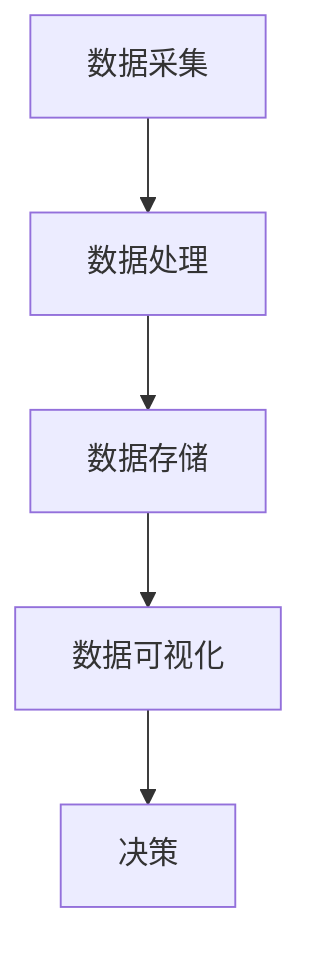
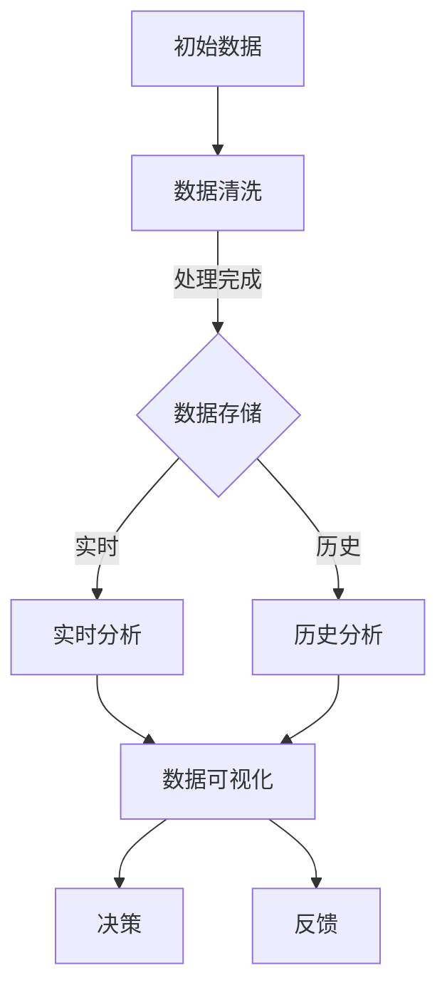
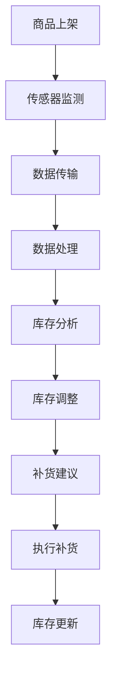
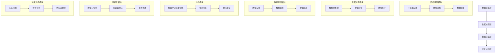
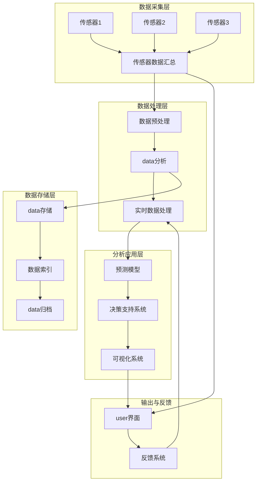

                 

### 引言

#### 数字孪生与零售业的交汇

数字孪生（Digital Twin）是一种将物理实体和数字模型结合的技术，通过实时数据采集和仿真分析，实现对实际物理世界的镜像和模拟。近年来，随着物联网（IoT）和大数据分析技术的快速发展，数字孪生在多个行业中得到了广泛应用，零售业便是其中之一。零售业作为全球经济发展的重要驱动力，其竞争日益激烈，对库存管理的要求也不断提升。数字孪生技术的引入，为零售业带来了全新的解决方案。

在零售业中，库存管理一直是一个重要且复杂的问题。传统的库存管理方法往往依赖于历史数据和经验，难以实时应对市场需求的变化。而数字孪生技术的出现，通过建立实体的数字镜像，可以实现对库存的实时监控和分析，从而优化库存管理，提高运营效率。这一变革不仅有助于降低库存成本，还能提升客户满意度。

本文旨在探讨数字孪生在零售业中的应用，特别是如何通过优化库存管理来提升零售企业的竞争力。我们将从数字孪生的基本概念入手，逐步深入到其在零售业中的技术原理、应用场景、实施策略、系统设计以及实际案例研究。通过这一系列的探讨，希望能够为零售企业提供有价值的参考和启示。

#### 数字孪生在零售业中的应用现状和潜在效益

当前，数字孪生技术在零售业中的应用已经初具规模。许多零售企业开始利用数字孪生技术进行库存管理，从而提升运营效率。例如，美国零售巨头沃尔玛（Walmart）通过部署数字孪生系统，实现了对其物流和库存的实时监控和优化。这种方式不仅减少了库存积压和过期商品的风险，还大幅降低了物流成本。

此外，中国电商平台阿里巴巴（Alibaba）也积极推广数字孪生技术，通过模拟虚拟门店和实体的结合，实现了对商品流动的精细化管理。通过分析实时数据，阿里巴巴能够更准确地预测市场需求，优化库存配置，从而提高销售额和顾客满意度。

数字孪生在零售业中的潜在效益是多方面的。首先，通过实时监控和数据分析，零售企业能够快速响应市场需求变化，减少库存积压和过期风险。其次，数字孪生技术能够提供更准确的预测模型，帮助零售企业做出更科学的库存决策。此外，数字孪生技术还可以用于供应链优化，提升物流效率，从而降低整体运营成本。

总的来说，数字孪生技术在零售业中的应用前景广阔。随着技术的不断成熟和成本的降低，越来越多的零售企业将会采用这一技术，以提升自身的竞争力。同时，数字孪生技术也为零售业的数字化转型提供了新的思路和工具。通过本文的探讨，希望能够为读者提供对数字孪生在零售业中应用的理解和启示，助力零售企业在数字化时代取得成功。

### 第1章 引言

#### 1.1 数字孪生与零售业背景

**数字孪生的定义与意义**

数字孪生（Digital Twin）是一种创新技术，旨在创建物理实体的数字映射，即通过传感器、大数据分析和仿真模型，构建出一个与实际物理世界相对应的虚拟模型。这个虚拟模型不仅能够实时反映物理实体的状态和行为，还能通过模拟和预测，为决策提供支持。

数字孪生的概念最早可以追溯到2002年，由Michael Grieves在其学术论文中提出。他认为，数字孪生是一种用于设计、操作和维护产品和服务的方法，通过将物理实体和数字模型结合，实现更加高效和智能的管理。

在各个行业，数字孪生技术已经展现了其独特的价值。例如，在制造业，数字孪生可以用于监控生产线、优化生产过程、预测设备故障等；在能源行业，数字孪生可以用于监控电网、优化能源分配、提高能效等；在医疗领域，数字孪生可以用于模拟手术、诊断疾病、优化治疗方案等。而在零售业，数字孪生则被广泛应用于库存管理、供应链优化、顾客体验提升等方面。

**数字孪生技术在零售业中的应用**

零售业是一个高度依赖供应链和库存管理的行业。传统的库存管理方法通常依赖于历史数据和人工经验，难以实时应对市场需求的变化。而数字孪生技术的引入，为零售业提供了一种全新的解决方案。

首先，通过数字孪生技术，零售企业可以建立实体的数字镜像，实现对库存的实时监控。传感器和物联网技术可以收集实时的库存数据，通过大数据分析和机器学习模型，这些数据能够被实时处理和解析，从而帮助零售企业更好地了解库存状态。

其次，数字孪生技术能够提供更准确的预测模型。通过对历史数据和实时数据的分析，数字孪生系统能够预测未来的市场需求，从而优化库存配置。这种方式不仅减少了库存积压和过期商品的风险，还能提升客户满意度。

此外，数字孪生技术还可以用于供应链优化。通过模拟供应链中的各个环节，数字孪生系统可以帮助零售企业识别瓶颈和优化流程，从而提高整体运营效率。

**应用价值**

数字孪生技术为零售业带来了多方面的价值。首先，通过实时监控和数据分析，零售企业能够快速响应市场需求变化，减少库存积压和过期风险。其次，数字孪生技术能够提供更准确的预测模型，帮助零售企业做出更科学的库存决策。此外，数字孪生技术还可以用于供应链优化，提升物流效率，从而降低整体运营成本。

总的来说，数字孪生技术在零售业中的应用，不仅有助于提高运营效率，还能提升企业的竞争力。随着技术的不断成熟和成本的降低，数字孪生技术将在零售业中得到更广泛的应用。接下来，我们将进一步探讨数字孪生在零售业中的具体应用场景和技术原理。

#### 1.2 主题与应用价值

**数字孪生在零售业中的应用**

数字孪生在零售业中的应用主要体现在以下几个方面：

1. **库存管理**：通过数字孪生技术，零售企业可以实时监控库存状态，实现精细化管理。传感器和物联网技术收集的实时数据，经过大数据分析和机器学习模型的处理，能够帮助零售企业更准确地预测市场需求，优化库存配置。

2. **供应链优化**：数字孪生技术能够模拟供应链的各个环节，帮助企业识别瓶颈和优化流程。通过模拟和分析，零售企业可以更高效地管理物流，减少库存积压，降低运营成本。

3. **顾客体验提升**：数字孪生技术可以帮助零售企业更好地了解顾客需求，提供个性化的购物体验。通过模拟顾客行为和购物路径，零售企业可以优化商品陈列和布局，提升顾客满意度。

**具体应用场景**

1. **超市**：超市通常面临大量商品和复杂的库存管理问题。数字孪生技术可以帮助超市实时监控库存状态，预测商品需求，优化库存配置，减少过期商品的风险。

2. **电商平台**：电商平台库存管理更加复杂，涉及多个仓库和物流网络。数字孪生技术可以实时监控库存和物流状态，优化商品配送，提高物流效率。

3. **零售连锁店**：零售连锁店需要统一管理多个店铺的库存和销售情况。数字孪生技术可以帮助连锁店实现跨店铺的库存共享和实时监控，提升整体运营效率。

**应用价值**

1. **提高运营效率**：通过实时监控和数据分析，零售企业可以快速响应市场需求变化，优化库存和供应链管理，提高整体运营效率。

2. **降低成本**：数字孪生技术可以帮助零售企业减少库存积压和过期商品的风险，降低物流成本，提高资源利用率。

3. **提升客户满意度**：通过提供个性化的购物体验和精准的商品推荐，数字孪生技术可以提升顾客满意度，增强品牌忠诚度。

4. **推动数字化转型**：数字孪生技术为零售企业的数字化转型提供了新的工具和方法，帮助企业在数字化时代保持竞争力。

总的来说，数字孪生技术在零售业中的应用具有巨大的潜力。随着技术的不断发展和成熟，数字孪生将成为零售企业提升运营效率和客户满意度的关键因素。接下来，我们将进一步探讨数字孪生在零售业中的技术原理和具体实施策略。

#### 1.3 应用现状与潜在效益

**数字孪生在零售业的现状**

当前，数字孪生技术在零售业中的应用已经取得了显著进展。许多零售企业已经开始利用这一技术进行库存管理、供应链优化和顾客体验提升。以下是一些具体的应用现状：

1. **大型零售企业**：如沃尔玛（Walmart）、家乐福（Carrefour）等大型零售企业，已经在其物流和库存管理中引入了数字孪生技术。这些企业通过部署传感器和物联网设备，实时收集库存数据，并通过大数据分析和机器学习模型，优化库存配置和物流流程。

2. **电商平台**：如亚马逊（Amazon）、阿里巴巴（Alibaba）等电商平台，也积极采用数字孪生技术。这些平台通过建立实体的数字镜像，实时监控库存和物流状态，提高物流效率和商品配送准确性。

3. **小型零售企业**：一些小型零售企业也开始利用数字孪生技术，以提升自身的运营效率和竞争力。例如，通过部署传感器和物联网设备，这些企业能够实时监控库存状态，预测市场需求，优化库存配置。

**数字孪生在不同国家和地区零售业的实际应用案例**

1. **美国**：在美国，数字孪生技术在零售业中的应用较为成熟。例如，沃尔玛（Walmart）通过部署数字孪生系统，实现了对其物流和库存的实时监控和优化。此外，亚马逊（Amazon）也在其仓储和配送中心广泛采用数字孪生技术，以提高物流效率和商品配送准确性。

2. **欧洲**：在欧洲，家乐福（Carrefour）等大型零售企业也在积极推广数字孪生技术。这些企业通过部署传感器和物联网设备，实时收集库存数据，并通过大数据分析和机器学习模型，优化库存配置和物流流程。

3. **中国**：在中国，数字孪生技术在零售业中的应用也取得了显著进展。例如，阿里巴巴（Alibaba）通过建立实体的数字镜像，实时监控商品流动和库存状态，优化库存配置和物流流程。此外，一些小型零售企业也开始利用数字孪生技术，提升自身的运营效率和竞争力。

**潜在效益**

1. **提高运营效率**：通过实时监控和数据分析，零售企业可以快速响应市场需求变化，优化库存和供应链管理，提高整体运营效率。

2. **降低成本**：数字孪生技术可以帮助零售企业减少库存积压和过期商品的风险，降低物流成本，提高资源利用率。

3. **提升客户满意度**：通过提供个性化的购物体验和精准的商品推荐，数字孪生技术可以提升顾客满意度，增强品牌忠诚度。

4. **推动数字化转型**：数字孪生技术为零售企业的数字化转型提供了新的工具和方法，帮助企业在数字化时代保持竞争力。

总的来说，数字孪生技术在零售业中的应用已经取得了显著成效，并具有巨大的发展潜力。随着技术的不断成熟和成本的降低，数字孪生将成为零售企业提升运营效率和客户满意度的关键因素。

### 第2章 核心概念

#### 2.1 数字孪生原理

数字孪生（Digital Twin）是一种将物理实体和数字模型相结合的技术，通过实时数据采集、分析和仿真，实现对实际物理世界的映射和模拟。这一概念最早由Michael Grieves在2002年提出，他认为数字孪生是一种用于设计、运营和维护产品和服务的方法。

**基本原理**

数字孪生的核心原理可以概括为以下几个方面：

1. **实时数据采集**：通过传感器和物联网设备，实时收集物理实体的状态数据，如位置、温度、湿度、速度等。

2. **数据传输与处理**：将采集到的数据传输到云端或数据中心，进行预处理、存储和后续分析。

3. **数字模型建立**：基于采集到的数据，建立与物理实体相对应的数字模型。这个数字模型可以是静态的，也可以是动态的，能够实时反映物理实体的状态和行为。

4. **仿真与预测**：通过仿真模型，对物理实体的行为进行预测和模拟。这些仿真结果可以为决策提供支持，帮助优化运营过程。

5. **反馈与控制**：将仿真结果反馈到实际物理世界，通过自动化系统进行调整和控制，实现闭环管理。

**与传统仿真技术的区别**

数字孪生与传统仿真技术有以下几点区别：

1. **实时性**：数字孪生强调实时数据采集和处理，能够及时反映物理实体的状态变化，而传统仿真技术通常是离线的，不能实时反映实际情况。

2. **双向反馈**：数字孪生实现了物理世界与虚拟世界的双向互动，可以通过仿真结果对物理世界进行调整，而传统仿真技术主要是单向的，无法实现这种反馈机制。

3. **数据集成**：数字孪生将传感器数据、仿真模型、业务系统等集成在一起，形成一个统一的系统平台，而传统仿真技术通常较为独立，难以与其他系统实现有效集成。

**数字孪生的关键组成部分**

1. **物理实体**：物理实体是数字孪生的核心，包括传感器、设备、设施等，用于采集状态数据。

2. **数字模型**：数字模型是对物理实体的虚拟映射，包括几何模型、物理模型、行为模型等，用于仿真和分析。

3. **数据接口**：数据接口用于连接物理实体和数字模型，实现数据传输和交互。

4. **仿真平台**：仿真平台提供仿真工具和算法，用于对数字模型进行模拟和预测。

5. **数据存储与分析**：数据存储与分析系统用于存储和管理大量传感器数据，提供数据预处理和分析功能。

**数字孪生的工作流程**

数字孪生的工作流程可以概括为以下几个步骤：

1. **数据采集**：通过传感器和物联网设备，实时采集物理实体的状态数据。

2. **数据处理**：将采集到的数据进行预处理、存储和清洗，为后续分析做准备。

3. **模型建立**：基于预处理后的数据，建立与物理实体相对应的数字模型。

4. **仿真与分析**：利用仿真平台对数字模型进行仿真和分析，预测物理实体的行为。

5. **反馈与控制**：将仿真结果反馈到物理世界，通过自动化系统进行调整和控制。

6. **迭代更新**：根据仿真结果和实际反馈，对数字模型进行更新和优化，实现闭环管理。

通过上述流程，数字孪生能够实现对物理实体的实时监控、预测和优化，为运营决策提供有力支持。在零售业中，数字孪生技术可以帮助企业实现库存管理、供应链优化和顾客体验提升，提高整体运营效率和竞争力。

#### 2.2 关键技术

数字孪生技术的实现依赖于一系列关键技术的支持，包括物联网（IoT）技术、大数据分析技术、仿真模型技术等。以下将详细探讨这些技术的定义、作用和应用。

**物联网技术**

物联网（Internet of Things，IoT）技术是数字孪生技术的基础，它通过将物理世界中的设备、传感器和系统连接到互联网上，实现设备之间的互联互通和数据传输。

**定义与作用**

- **定义**：物联网是指通过互联网将各种设备、传感器和系统连接起来，实现数据的实时采集、传输和处理。
- **作用**：
  1. **数据采集**：物联网设备（如传感器、智能设备等）可以实时采集物理实体的状态数据，如温度、湿度、位置等。
  2. **数据传输**：物联网技术实现了数据的实时传输，使数据能够快速到达处理和分析中心。
  3. **设备控制**：通过物联网技术，可以对物理实体进行远程控制和监控，提高管理效率。

**应用**

- **零售业中的应用**：在零售业中，物联网技术广泛应用于库存管理、商品追踪、智能店铺等场景。例如，通过部署物联网传感器，零售企业可以实时监控货架上的商品数量，实现自动补货和精准库存管理。

**大数据分析技术**

大数据分析技术是数字孪生的重要组成部分，它通过处理和分析大量数据，为数字孪生提供决策支持。

**定义与作用**

- **定义**：大数据分析是指使用先进的技术和方法，对大规模数据集进行存储、处理和分析，以发现数据中的模式和规律。
- **作用**：
  1. **数据预处理**：大数据分析技术可以帮助对采集到的原始数据进行清洗、转换和整合，为后续分析做准备。
  2. **模式识别**：通过机器学习和数据挖掘算法，大数据分析技术可以发现数据中的规律和模式，为决策提供支持。
  3. **预测与优化**：基于历史数据和实时数据，大数据分析技术可以预测未来的发展趋势，帮助优化运营策略。

**应用**

- **零售业中的应用**：在零售业中，大数据分析技术广泛应用于需求预测、库存优化、顾客行为分析等场景。例如，通过分析顾客的历史购买数据，零售企业可以预测未来的市场需求，优化库存配置，提高销售业绩。

**仿真模型技术**

仿真模型技术是数字孪生的核心，它通过对物理实体的行为进行模拟和预测，帮助优化运营过程。

**定义与作用**

- **定义**：仿真模型是指通过计算机模拟，对物理实体或系统进行模拟和预测的技术。
- **作用**：
  1. **模拟与预测**：仿真模型可以模拟物理实体的行为，预测未来的发展趋势，为决策提供支持。
  2. **优化与改进**：基于仿真结果，可以对运营过程进行优化和改进，提高效率和效益。
  3. **风险评估**：通过仿真模型，可以评估不同决策的风险和影响，帮助制定更科学的决策。

**应用**

- **零售业中的应用**：在零售业中，仿真模型技术广泛应用于供应链管理、库存优化、物流规划等场景。例如，通过仿真模型，零售企业可以模拟不同库存策略的效果，选择最优策略，减少库存积压和过期风险。

综上所述，物联网技术、大数据分析技术和仿真模型技术是数字孪生在零售业中实现库存管理优化的关键支撑。这些技术共同作用，为零售企业提供了实时、准确的决策支持，帮助提升运营效率和市场竞争力。

#### 2.3 物联网与大数据分析

**物联网在数字孪生中的作用**

物联网（IoT）技术是数字孪生实现的关键一环，它通过广泛的传感器网络和数据传输系统，将物理实体与数字模型紧密连接起来。在数字孪生中，物联网的作用主要体现在以下几个方面：

1. **数据采集**：物联网传感器可以实时监测物理实体的状态信息，如温度、湿度、位置、运动速度等。这些传感器通常分布在零售店的货架、仓库、物流车辆等位置，确保数据采集的全面性和实时性。

2. **数据传输**：物联网技术利用无线网络或有线网络，将传感器采集的数据传输到数据中心或云平台。这一过程需要高效的传输协议和稳定的网络连接，以保证数据传输的速度和可靠性。

3. **设备控制**：物联网技术不仅能够采集和传输数据，还可以实现对物理设备的远程控制。例如，通过物联网系统，零售企业可以远程控制仓库的照明、空调等设备，提高能源效率和设备利用率。

**物联网的关键技术**

1. **传感器技术**：传感器是物联网系统的核心组件，负责采集物理实体的各种状态信息。常见的传感器包括温度传感器、湿度传感器、运动传感器、摄像头等。不同类型的传感器可以提供不同的数据，为数字孪生的构建提供丰富的信息来源。

2. **网络通信技术**：物联网系统需要利用各种网络技术实现数据的传输和设备控制。常见的网络技术包括Wi-Fi、蓝牙、Zigbee、LoRa等。这些技术提供了不同的传输速度、覆盖范围和功耗特性，适合于不同的应用场景。

3. **数据处理与存储**：物联网系统产生的数据量巨大，需要高效的存储和处理技术。常用的数据处理技术包括数据压缩、数据加密、数据预处理等。数据存储通常采用云存储或分布式数据库，以保证数据的可靠性和可扩展性。

**大数据分析技术**

大数据分析技术在数字孪生中起着至关重要的作用，它通过对物联网采集的大量数据进行处理和分析，提供洞察和决策支持。以下是大数据分析技术的几个关键方面：

1. **数据采集与存储**：大数据分析的第一步是采集和存储数据。物联网传感器采集的数据需要经过预处理和清洗，然后存储在数据仓库或数据湖中，以便后续分析。

2. **数据预处理**：数据预处理包括数据清洗、数据转换和数据整合等步骤。通过数据预处理，可以去除无效数据、填补缺失值、标准化数据格式等，提高数据质量。

3. **数据挖掘与建模**：数据挖掘是大数据分析的核心步骤，通过使用机器学习和数据挖掘算法，可以从大量数据中提取有价值的信息。常见的算法包括分类、回归、聚类、关联规则挖掘等。

4. **可视化与分析**：大数据分析的结果通常通过可视化工具进行展示，帮助用户更好地理解和分析数据。可视化技术包括图表、仪表盘、地理信息系统（GIS）等。

**物联网与大数据分析在零售业中的应用**

1. **库存管理**：通过物联网传感器实时监控货架库存，结合大数据分析技术，零售企业可以精确掌握库存情况，预测未来需求，优化库存配置，减少库存积压和过期风险。

2. **供应链管理**：物联网技术可以实时追踪物流运输过程中的温度、湿度等参数，结合大数据分析，优化运输路线和时间，提高物流效率，降低运输成本。

3. **顾客体验**：通过物联网传感器和大数据分析，零售企业可以了解顾客在店铺内的行为轨迹，优化商品陈列和布局，提供个性化的购物体验。

4. **智能店铺**：物联网和大数据分析技术可以打造智能店铺，通过实时监控顾客行为和店铺运营数据，实现自动化营销、智能推荐和智能管理，提高店铺效益。

总之，物联网和大数据分析技术在数字孪生中的应用，为零售业带来了革命性的变化。通过物联网技术的数据采集和传输，结合大数据分析技术的数据处理和洞察，零售企业可以实现实时、精准的库存管理，提升运营效率，增强市场竞争力。

### 第3章 技术原理

#### 3.1 传感器数据采集

传感器数据采集是数字孪生技术实现的基础，它通过物联网设备实时监测物理实体的状态，并将数据传输到数字模型中。以下将详细探讨传感器数据采集的过程、技术难点及其在零售业中的应用。

**传感器数据采集的过程**

传感器数据采集通常包括以下几个步骤：

1. **数据采集**：物联网传感器分布在零售店的各个角落，如货架、仓库、物流车辆等。这些传感器能够实时监测温度、湿度、位置、运动速度、商品数量等状态信息。

2. **数据传输**：采集到的数据通过无线或有线网络传输到数据中心或云平台。无线网络技术如Wi-Fi、蓝牙、Zigbee等，有线网络技术如以太网等，为数据传输提供了多种选择。

3. **数据处理**：数据在传输到数据中心或云平台后，会经过预处理、存储和清洗等步骤。预处理包括数据压缩、去噪、格式转换等，存储包括数据存储和索引，清洗包括数据校验、填补缺失值等。

4. **数据存储**：预处理后的数据存储在数据仓库或数据湖中，以便后续分析和处理。数据仓库和数据湖提供了高性能的数据存储和管理能力，支持大规模数据的存储和处理。

**技术难点**

传感器数据采集面临以下技术难点：

1. **数据多样性**：传感器类型繁多，采集到的数据格式和精度各异。如何统一数据格式、处理多样性数据是一个挑战。

2. **数据传输可靠性**：无线网络信号容易受到干扰，有线网络容易出现故障。如何确保数据传输的可靠性和稳定性是一个重要问题。

3. **数据隐私和安全**：传感器采集的数据可能包含敏感信息，如顾客行为数据、库存信息等。如何保护数据隐私和安全是一个重要考虑。

**传感器数据采集在零售业中的应用**

1. **货架监控**：在超市和零售店中，通过部署货架传感器，实时监控商品数量和位置。当商品数量低于设定阈值时，系统会自动生成补货订单，提高库存管理效率。

2. **仓库管理**：在仓库中，传感器可以实时监测仓库环境，如温度、湿度等。这些数据可以帮助仓库管理人员优化存储条件，防止商品变质或损坏。

3. **物流追踪**：在物流运输过程中，传感器可以实时监测运输车辆的位置、速度、行驶路线等。这些数据有助于优化物流路线，提高运输效率。

4. **商品追踪**：通过传感器标签，可以实时追踪商品从仓库到货架的流动过程。这有助于提高商品配送效率，减少丢失和损坏的风险。

总之，传感器数据采集在零售业中发挥着重要作用。通过物联网传感器实时采集物理实体的状态数据，结合大数据分析技术，零售企业可以实现实时监控、智能决策和高效运营。

#### 3.2 实时数据处理

实时数据处理是数字孪生技术中的关键环节，它确保传感器采集的数据能够及时、准确地传递到数字模型中，为决策提供支持。以下将详细探讨实时数据处理的过程、技术难点及其在零售业中的应用。

**实时数据处理的过程**

实时数据处理通常包括以下几个步骤：

1. **数据接收与预处理**：传感器采集到的数据首先被传输到数据处理系统。数据处理系统会对数据进行预处理，包括去噪、格式转换、数据清洗等，以确保数据的质量和一致性。

2. **数据存储**：预处理后的数据会被存储在实时数据库或消息队列中。这些存储系统需要具备高吞吐量、低延迟和高可靠性，以确保数据能够及时被处理和分析。

3. **实时分析**：数据处理系统会使用流处理技术（如Apache Kafka、Apache Flink等）对实时数据进行处理和分析。这些分析可能包括数据聚合、统计、机器学习预测等。

4. **数据可视化**：实时分析的结果会通过可视化工具展示给用户，帮助用户及时了解数据状态和决策效果。

5. **反馈与控制**：分析结果会反馈到实际物理世界，通过自动化系统进行控制，如调整库存、优化物流等。

**技术难点**

实时数据处理面临以下技术难点：

1. **数据吞吐量**：传感器采集的数据量大，实时处理系统需要具备高吞吐量，能够处理每秒数百万条记录的数据流。

2. **数据延迟**：实时数据处理要求低延迟，数据从传感器采集到处理完成并反馈到物理实体的时间差需要尽可能短，通常在毫秒级别。

3. **数据一致性**：在分布式数据处理系统中，如何保证数据的一致性是一个挑战。数据在不同节点之间传输和处理时，可能会出现数据丢失或重复的问题。

4. **数据处理性能**：实时数据处理系统需要高效地处理大量数据，同时保证系统的可扩展性和稳定性。

**实时数据处理在零售业中的应用**

1. **库存管理**：实时数据处理可以帮助零售企业实时监控库存状态，预测未来需求，优化库存配置。例如，当传感器检测到某个商品的库存量低于设定阈值时，系统会自动生成补货订单。

2. **供应链优化**：实时数据处理可以优化供应链管理，提高物流效率。通过实时监控物流车辆的位置和状态，可以优化运输路线和时间，减少运输成本。

3. **顾客体验**：实时数据处理可以提供个性化的购物体验。例如，通过分析顾客的购物行为和偏好，可以实时推荐商品，提高顾客满意度。

4. **智能店铺**：实时数据处理可以帮助零售企业实现智能店铺管理。通过实时监控店铺内的顾客流量、商品陈列、销售情况等，可以优化商品布局和营销策略。

总之，实时数据处理在零售业中发挥着重要作用。通过高效的实时数据处理技术，零售企业可以实时监控运营状态，快速响应市场需求变化，提高运营效率和顾客满意度。

#### 3.3 可视化技术

可视化技术在数字孪生系统中起着至关重要的作用，它通过将复杂的数据和分析结果以直观、易于理解的形式展示给用户，帮助用户更好地理解数据和决策结果。以下将详细探讨可视化技术的基本概念、常用工具和方法及其在零售业中的应用。

**基本概念**

可视化技术是指利用图形、图表、图像等视觉元素，将数据和分析结果以直观、易懂的方式展示出来。通过可视化，用户可以快速发现数据中的规律和模式，理解数据背后的含义，从而做出更科学的决策。

**常用工具和方法**

1. **图表类型**：常见的图表类型包括柱状图、折线图、饼图、散点图、雷达图等。每种图表类型都有其特定的用途和优势。例如，柱状图适合展示不同类别的数据对比，折线图适合展示时间序列数据的变化趋势。

2. **数据可视化工具**：常用的数据可视化工具有Tableau、Power BI、D3.js、ECharts等。这些工具提供了丰富的图表类型和自定义选项，用户可以通过简单的拖拽操作，快速创建和定制可视化图表。

3. **交互式可视化**：交互式可视化是一种通过用户与图表的交互，动态调整数据展示方式和内容的技术。常见的交互方式包括筛选、过滤、排序、联动等。交互式可视化能够提高用户的参与度和数据探索的深度。

**可视化技术原理**

1. **数据映射**：将数据中的各种属性映射到视觉元素上，如颜色、大小、形状等。这种映射需要遵循数据可视化设计原则，确保视觉元素能够准确传达数据信息。

2. **信息层次**：通过层次化的布局和设计，将数据的不同层次和细节清晰地展示出来。例如，在展示销售额分布时，可以先展示总体销售额，然后通过点击或滚动，进一步查看各区域或各产品的销售额。

**可视化技术原理在零售业中的应用**

1. **库存监控**：通过可视化技术，零售企业可以实时监控库存状态。例如，利用柱状图展示各个货架的库存量，通过颜色区分高库存和低库存区域，帮助管理人员快速识别库存积压和短缺问题。

2. **销售分析**：可视化技术可以帮助零售企业分析销售数据。例如，利用折线图展示每天或每周的销售额变化趋势，通过散点图展示各个商品的销售量，帮助制定销售策略和库存配置。

3. **顾客行为分析**：通过可视化技术，零售企业可以了解顾客在店铺内的行为轨迹。例如，利用热力图展示顾客流量最高的区域，通过路径图展示顾客的购物路径，帮助优化商品陈列和店铺布局。

4. **供应链管理**：可视化技术可以实时监控供应链状态。例如，利用地图展示物流车辆的位置和状态，通过动态图表展示库存流转情况，帮助优化物流路线和时间安排。

总之，可视化技术在数字孪生系统中为零售企业提供了强大的数据分析和决策支持工具。通过直观、易懂的可视化展示，零售企业可以更好地理解数据，做出更科学的决策，提高运营效率和顾客满意度。

#### 3.4 mermaid技术流程图绘制

mermaid 是一种基于 Markdown 的图形绘制工具，它可以方便地绘制流程图、序列图、类图等。在数字孪生技术中，mermaid 流程图可以帮助我们直观地展示数据采集、处理和分析的过程。以下将详细介绍如何使用 mermaid 绘制流程图，并结合一个简单的库存管理示例，展示其应用。

**mermaid 简介**

mermaid 是一个轻量级的图形绘制工具，它通过扩展 Markdown 语法，使得在文本中嵌入图形变得简单快捷。mermaid 支持多种类型的图形，如流程图、序列图、类图、Gantt 图等。通过使用 mermaid，开发者可以在文档中轻松地添加图形，提高文档的可读性和清晰度。

**mermaid 基础语法**

mermaid 的基础语法非常简单，主要包括两个部分：定义节点（rectangle）和连接节点（arrow）。

1. **定义节点**：使用 `node` 关键字定义节点，节点的形状、颜色和文本都可以自定义。例如：

   ```mermaid
   node
       A[Start]
       B[Process]
       C[End]
   ```

   这段代码定义了三个节点，分别为“Start”、“Process”和“End”。

2. **连接节点**：使用 `arrow` 关键字连接节点，可以自定义连接线的颜色和样式。例如：

   ```mermaid
   A --> B
   B --> C
   ```

   这段代码将节点“A”和节点“B”连接起来，节点“B”和节点“C”连接起来。

**绘制流程图**

以下是一个简单的库存管理流程图示例：



在这个流程图中，节点“A”表示数据采集，节点“B”表示数据处理，节点“C”表示数据存储，节点“D”表示数据可视化，节点“E”表示决策。

**mermaid 技术流程图绘制示例**

假设我们想要绘制一个更复杂的流程图，包括多个步骤和分支。以下是一个示例：



在这个流程图中，节点“A”表示初始数据，节点“B”表示数据清洗，节点“C”表示数据存储，分为实时分支和历史分支。节点“D”表示实时分析，节点“E”表示历史分析，节点“F”表示数据可视化，节点“G”表示决策，节点“H”表示反馈。

**应用在库存管理**

在零售业的库存管理中，可以使用 mermaid 绘制一个流程图，展示从数据采集到决策的全过程。以下是一个简化的示例：



在这个流程图中，节点“A”表示商品上架，节点“B”表示传感器监测商品数量，节点“C”表示数据传输到数据中心，节点“D”表示数据处理和分析，节点“E”表示库存分析，节点“F”表示库存调整，节点“G”表示生成补货建议，节点“H”表示执行补货操作，节点“I”表示更新库存信息。

通过 mermaid 流程图，零售企业可以清晰地了解库存管理的过程，识别关键步骤和潜在问题，从而优化库存管理流程，提高运营效率。

### 第4章 应用场景

#### 4.1 库存管理的挑战

库存管理是零售业中的核心环节，然而在实际运营中，零售企业面临诸多挑战。以下将详细探讨这些挑战，并解释数字孪生技术如何应对这些挑战。

**库存积压**

库存积压是零售业中常见的问题之一。由于市场需求的不确定性，零售企业往往无法准确预测销售量，导致库存积压。过多的库存不仅占用仓储空间，还增加了仓储成本和资金压力。传统库存管理方法主要依赖历史数据和经验，难以实时响应市场需求变化，导致库存积压问题长期存在。

**库存不足**

与库存积压相对应的是库存不足。在某些情况下，由于市场需求突然增加或供应链中断，零售企业可能无法及时补充库存，导致缺货现象。库存不足不仅影响销售业绩，还可能导致客户流失和品牌形象的损害。传统库存管理方法难以实时监控库存状态，无法及时调整库存策略，导致库存不足问题难以解决。

**过期商品**

库存中的商品难免会出现过期现象。过期商品不仅无法销售，还可能导致损失和浪费。传统库存管理方法通常依赖于人工检查和经验判断，难以及时发现和处理过期商品，导致过期商品率较高。

**供应链延迟**

供应链延迟是影响库存管理的另一个重要因素。物流配送中的延误、库存流转不畅等问题都会导致供应链延迟，影响库存管理的效率和准确性。传统库存管理方法往往无法实时跟踪物流状态，导致供应链延迟问题难以解决。

**应对策略**

数字孪生技术通过建立物理实体的数字映射，提供了一种全新的库存管理解决方案。以下是如何通过数字孪生技术应对上述挑战：

**实时监控**

数字孪生技术利用物联网传感器实时监控库存状态，包括商品数量、位置、温度、湿度等。通过实时数据采集，零售企业可以准确掌握库存动态，及时调整库存策略，避免库存积压和不足。

**智能预测**

数字孪生技术通过大数据分析和机器学习算法，对历史销售数据和市场趋势进行分析，预测未来的库存需求。这种智能预测能力可以帮助零售企业优化库存配置，减少库存积压和过期商品的风险。

**优化供应链**

数字孪生技术可以模拟供应链的各个环节，识别供应链中的瓶颈和延迟问题。通过优化供应链管理，零售企业可以降低物流成本，提高库存流转效率，减少供应链延迟。

**自动化处理**

数字孪生技术可以实现库存管理的自动化处理。例如，当传感器检测到库存低于设定阈值时，系统会自动生成补货订单，通知供应链部门进行补货。这种自动化处理可以减少人工干预，提高库存管理效率。

**总结**

数字孪生技术在库存管理中的应用，为零售企业提供了实时监控、智能预测、供应链优化和自动化处理等解决方案，有效应对了库存积压、库存不足、过期商品和供应链延迟等挑战。通过数字孪生技术，零售企业可以提升库存管理效率，降低运营成本，提高市场竞争力。

#### 4.2 数字孪生在库存管理中的应用

**数字孪生技术在库存管理中的具体应用**

数字孪生技术在库存管理中的应用主要体现在以下几个方面：

1. **实时监控**：通过部署物联网传感器，数字孪生系统可以实时监控仓库和货架上的商品数量、位置和环境参数（如温度、湿度等）。这种实时监控能力使零售企业能够准确掌握库存状态，及时发现库存异常情况。

2. **智能预测**：数字孪生系统利用大数据分析和机器学习算法，对历史销售数据和市场趋势进行预测。通过智能预测，零售企业可以提前了解未来的库存需求，从而优化库存配置，减少库存积压和不足。

3. **优化供应链**：数字孪生技术可以模拟供应链的各个环节，识别瓶颈和延迟问题。通过优化供应链管理，零售企业可以降低物流成本，提高库存流转效率，减少供应链延迟。

4. **自动化处理**：数字孪生技术可以实现库存管理的自动化处理。例如，当传感器检测到库存低于设定阈值时，系统会自动生成补货订单，通知供应链部门进行补货。这种自动化处理可以减少人工干预，提高库存管理效率。

**应用场景**

1. **超市库存管理**：在超市中，数字孪生技术可以实时监控货架上的商品数量，当库存低于设定阈值时，系统会自动生成补货订单，确保货架上始终有足够的商品供应。

2. **电商平台库存管理**：电商平台面临大量商品和复杂的库存管理问题。数字孪生技术可以通过实时监控库存和物流状态，优化商品配送，提高物流效率。

3. **零售连锁店库存管理**：零售连锁店需要统一管理多个店铺的库存和销售情况。数字孪生技术可以帮助连锁店实现跨店铺的库存共享和实时监控，提升整体运营效率。

**案例分析**

1. **沃尔玛（Walmart）**：沃尔玛通过部署数字孪生技术，实现了对其物流和库存的实时监控和优化。通过实时数据采集和智能预测，沃尔玛能够减少库存积压和过期商品的风险，降低物流成本。

2. **阿里巴巴（Alibaba）**：阿里巴巴在其电商平台上采用了数字孪生技术，通过实时监控商品流动和库存状态，优化库存配置和物流流程。这种方式不仅提高了物流效率，还提升了客户满意度。

3. **家乐福（Carrefour）**：家乐福通过部署数字孪生系统，实现了对其超市库存的实时监控和优化。通过智能预测和自动化处理，家乐福能够更准确地进行库存配置，减少库存积压和不足。

通过这些案例，我们可以看到数字孪生技术在库存管理中的应用不仅有效提升了零售企业的运营效率，还降低了运营成本，提高了客户满意度。随着数字孪生技术的不断发展和成熟，其在零售业中的应用前景将更加广阔。

### 第5章 实施策略

#### 5.1 系统构建策略

构建数字孪生系统优化库存管理是一个复杂的过程，需要从整体策略上考虑系统的可行性、可行性分析和可行性实施方案。以下将详细讨论构建数字孪生系统的策略。

**可行性分析**

1. **技术可行性**：数字孪生技术已经相对成熟，物联网、大数据分析、机器学习和仿真模型等技术都有广泛应用。因此，从技术角度来看，构建数字孪生系统是可行的。

2. **经济可行性**：虽然数字孪生系统的初期投入较大，但长期来看，其能够带来显著的运营效率提升和成本降低。随着技术的不断成熟和成本的降低，数字孪生系统的经济可行性将进一步提高。

3. **管理可行性**：数字孪生系统需要整合多个部门的数据和资源，实现跨部门协作。因此，企业内部的管理体系和文化也需要相应的调整和优化，以支持数字孪生系统的构建和运营。

**实施方案**

1. **需求分析**：首先，明确数字孪生系统在库存管理中的具体需求，包括实时监控、智能预测、供应链优化、自动化处理等。需求分析的结果将作为系统设计和功能实现的依据。

2. **系统设计**：根据需求分析的结果，设计数字孪生系统的整体架构。系统架构应包括数据采集层、数据处理层、数据存储层、分析层和应用层等。每个层次都需要明确的职责和接口。

3. **数据采集**：在数据采集层，部署物联网传感器，覆盖仓库、货架、物流车辆等关键区域。传感器需要具备高精度、高可靠性和低功耗的特点，以确保数据采集的准确性和实时性。

4. **数据处理**：在数据处理层，使用大数据处理框架（如Apache Flink、Spark等）对实时数据进行处理和分析。数据处理过程需要包括数据清洗、数据转换、数据聚合和机器学习预测等步骤。

5. **数据存储**：在数据存储层，选择适合的数据存储方案（如分布式数据库、数据湖等），确保数据的高效存储和管理。数据存储方案应支持大规模数据的存储和快速检索。

6. **分析与应用**：在分析层，利用机器学习和数据分析算法，对库存数据进行深度分析，生成预测报告和优化建议。在应用层，开发用户友好的界面和自动化处理流程，使零售企业能够轻松使用数字孪生系统进行库存管理。

**关键实施步骤**

1. **项目立项**：明确项目目标、预算和时间表，组建项目团队，确保项目顺利推进。

2. **需求调研**：与各部门进行沟通，了解库存管理的实际需求和痛点，形成详细的需求文档。

3. **系统设计**：根据需求文档，设计数字孪生系统的整体架构和功能模块。

4. **技术选型**：选择合适的物联网传感器、大数据处理框架、数据存储方案和机器学习算法。

5. **系统开发**：根据系统设计，进行数字孪生系统的开发和实现。

6. **系统测试**：对系统进行全面的测试，确保系统的稳定性和可靠性。

7. **部署上线**：将数字孪生系统部署到生产环境，进行实际运营测试和优化。

8. **用户培训与支持**：为用户提供培训和技术支持，确保系统能够顺利运行。

通过上述实施策略和关键步骤，零售企业可以构建一个高效、可靠的数字孪生系统，实现库存管理的优化，提高运营效率和客户满意度。

#### 5.2 技术选型

在构建数字孪生系统优化库存管理的过程中，技术选型至关重要。以下将详细讨论所需技术的具体类型、主要功能以及它们在系统中的重要性。

**物联网传感器**

物联网传感器是数字孪生系统的基础组件，用于实时采集物理实体的状态数据。主要类型包括：

1. **温度传感器**：用于监测仓库、冷库等环境温度，确保商品存储条件适宜。
2. **湿度传感器**：用于监测仓库、货架等环境湿度，防止商品受潮。
3. **位置传感器**：如RFID标签、GPS模块，用于追踪商品和物流车辆的位置。
4. **运动传感器**：用于监测物流车辆、货架等运动状态，识别异常情况。

物联网传感器的主要功能是实时采集物理实体的状态数据，并将数据传输到数据处理系统。这些数据是数字孪生系统进行数据分析和决策的基础。

**大数据处理框架**

大数据处理框架用于处理和存储海量数据，支持实时数据处理和离线分析。主要类型包括：

1. **Apache Flink**：支持实时流数据处理，适用于实时库存监控和预测。
2. **Apache Spark**：支持离线批处理和实时流处理，适用于历史数据分析。
3. **Hadoop**：适用于大规模离线数据处理，支持数据存储和分布式计算。

大数据处理框架的主要功能是对传感器采集到的海量数据进行处理、存储和计算，生成有用的分析和预测结果。这是数字孪生系统实现智能预测和优化决策的关键。

**数据存储方案**

数据存储方案用于存储和管理传感器采集的数据，支持快速检索和高效处理。主要类型包括：

1. **分布式数据库**：如MySQL、PostgreSQL，适用于结构化数据的存储和查询。
2. **数据湖**：如Hadoop HDFS、Amazon S3，适用于大规模非结构化数据的存储。
3. **时序数据库**：如InfluxDB、OpenTSDB，适用于时间序列数据的存储和查询。

数据存储方案的主要功能是提供高效、可靠的数据存储和管理，确保数据的安全性和可扩展性。这是数字孪生系统实现数据分析和应用的基础。

**机器学习算法**

机器学习算法用于对数据进行分析和预测，为库存管理提供智能决策支持。主要类型包括：

1. **回归分析**：用于预测未来销售量、库存需求等。
2. **聚类分析**：用于识别库存积压、过期商品等异常情况。
3. **分类分析**：用于预测商品类别、销售趋势等。
4. **关联规则挖掘**：用于分析商品之间的相关性，优化库存配置。

机器学习算法的主要功能是对历史数据和实时数据进行分析，生成预测报告和优化建议。这是数字孪生系统实现智能预测和优化决策的核心。

**重要性**

1. **物联网传感器**：提供实时、准确的数据输入，是数字孪生系统的核心组件。
2. **大数据处理框架**：支持海量数据的高效处理和计算，是数字孪生系统的数据处理引擎。
3. **数据存储方案**：提供高效、可靠的数据存储和管理，是数字孪生系统的数据基础。
4. **机器学习算法**：实现智能预测和优化决策，是数字孪生系统的智能核心。

通过合理选择和配置这些技术，零售企业可以构建一个高效、可靠的数字孪生系统，实现库存管理的优化，提高运营效率和客户满意度。

#### 5.3 资源配置

在构建数字孪生系统优化库存管理的过程中，合理的资源配置至关重要。以下将详细讨论系统所需的主要硬件和软件资源，包括服务器、存储设备、网络设备等。

**硬件资源**

1. **服务器**：服务器是数字孪生系统的核心计算资源，用于运行数据处理和分析应用程序。推荐配置如下：
   - CPU：多核高性能处理器，如Intel Xeon系列
   - 内存：64GB及以上，根据数据处理量进行扩展
   - 硬盘：高速SSD，如NVMe，提高数据读写速度

2. **存储设备**：存储设备用于存储传感器采集的数据和系统生成的分析报告。推荐配置如下：
   - 数据存储：使用分布式存储系统，如HDFS、Ceph，提供高可靠性和可扩展性
   - 数据备份：使用备份存储设备，如备份服务器或NAS，确保数据的安全性和可靠性

3. **网络设备**：网络设备用于连接物联网传感器、服务器和存储设备，确保数据传输的稳定和高效。推荐配置如下：
   - 路由器：支持高带宽、高并发，如Cisco ISR系列
   - 交换机：支持网络虚拟化和多租户，如思科Catalyst系列
   - 无线接入点：提供无线网络覆盖，如华为AP系列

**软件资源**

1. **操作系统**：推荐使用Linux操作系统，如Ubuntu、CentOS，具有稳定性和兼容性。
2. **数据处理框架**：使用大数据处理框架，如Apache Flink、Apache Spark，用于实时数据处理和离线分析。
3. **数据库**：使用分布式数据库，如MySQL、PostgreSQL，用于存储和管理结构化数据。
4. **数据存储方案**：使用数据湖，如Amazon S3，用于存储和管理大规模非结构化数据。
5. **机器学习平台**：使用机器学习平台，如TensorFlow、PyTorch，用于开发和部署机器学习模型。

**资源配置建议**

1. **服务器集群**：建议部署服务器集群，提供高可用性和负载均衡，确保系统稳定运行。
2. **分布式存储**：使用分布式存储系统，提供高可靠性和可扩展性，支持大规模数据存储和快速访问。
3. **网络优化**：优化网络架构，提供高效、稳定的数据传输，确保系统性能。
4. **资源监控**：使用监控工具，如Prometheus、Grafana，实时监控系统资源使用情况，确保资源合理分配和调度。

通过合理配置硬件和软件资源，零售企业可以构建一个高效、可靠的数字孪生系统，实现库存管理的优化，提高运营效率和客户满意度。

### 第6章 系统设计与实现

#### 6.1 系统架构设计

数字孪生系统优化库存管理的设计架构应充分考虑系统的功能性、稳定性和可扩展性，以实现高效、智能的库存管理。以下将详细描述系统架构的设计思路、主要模块及其功能。

**系统架构设计思路**

数字孪生系统优化库存管理的设计架构可以分为四个主要层次：数据采集层、数据处理层、数据存储层和分析应用层。每个层次都有明确的职责和功能，确保系统的高效运作。

1. **数据采集层**：负责采集物理实体的状态数据，如商品数量、位置、环境参数等。通过部署物联网传感器，实现对仓库、货架、物流车辆等关键区域的实时监控。

2. **数据处理层**：负责对采集到的数据进行处理、清洗和转换，为后续的数据存储和分析提供高质量的输入数据。数据处理层包括实时数据处理和离线数据处理两部分。

3. **数据存储层**：负责存储和管理采集到的数据和分析结果。数据存储层采用分布式存储方案，确保数据的高可靠性和高效访问。

4. **分析应用层**：负责对存储的数据进行深度分析，生成库存预测报告和优化建议。分析应用层包括机器学习模型训练、数据可视化、决策支持等功能。

**主要模块及功能**

1. **数据采集模块**：该模块负责部署和管理物联网传感器，实现对物理实体的实时监控。主要功能包括传感器配置、数据采集和传输等。

2. **数据处理模块**：该模块负责对采集到的数据进行处理、清洗和转换。主要功能包括数据预处理、数据转换、数据聚合等。

3. **数据存储模块**：该模块负责存储和管理采集到的数据和分析结果。主要功能包括数据存储、数据索引、数据查询等。

4. **分析模块**：该模块负责对存储的数据进行深度分析，生成库存预测报告和优化建议。主要功能包括机器学习模型训练、预测分析、优化建议等。

5. **可视化模块**：该模块负责将分析结果以直观、易懂的形式展示给用户。主要功能包括数据可视化、仪表盘展示、报表生成等。

6. **决策支持模块**：该模块负责为用户提供决策支持，帮助优化库存管理策略。主要功能包括库存预测、补货计划、供应链优化等。

**系统架构图绘制**

为了更清晰地展示数字孪生系统优化库存管理的架构设计，我们可以使用 mermaid 绘制系统架构图。以下是一个简单的系统架构图示例：



通过上述系统架构图，我们可以清晰地看到各个模块的功能和相互关系，从而为数字孪生系统的设计与实现提供指导。

#### 6.2 mermaid系统架构图绘制

为了更直观地展示数字孪生系统优化库存管理的整体架构，我们将使用 mermaid 绘制系统架构图。以下是一个示例，展示了系统的主要模块及其相互关系。



在这个架构图中，我们定义了以下几个主要模块：

1. **数据采集层**：包括传感器1、传感器2、传感器3和传感器数据汇总（sensorHub）。传感器负责采集物理实体的状态数据，如商品数量、温度、湿度等。

2. **数据处理层**：包括数据预处理（dataPreprocess）、数据分析（dataAnalyze）和实时数据处理（realTimeProcess）。数据预处理模块负责清洗和转换原始数据，数据分析模块负责对数据进行分析，实时数据处理模块负责处理实时数据，并提供数据流处理能力。

3. **数据存储层**：包括数据存储（dataStorage）、数据索引（storageIndex）和数据归档（dataArchive）。数据存储模块负责存储处理后的数据，数据索引模块提供数据快速检索能力，数据归档模块负责长期数据存储。

4. **分析应用层**：包括预测模型（predictionModel）、决策支持系统（decisionSupport）和可视化系统（visualization）。预测模型模块利用分析结果生成预测报告，决策支持系统根据预测结果提供库存管理策略，可视化系统将分析结果以直观的方式展示给用户。

5. **输出与反馈**：包括用户界面（userInterface）和反馈系统（feedbackSystem）。用户界面展示分析结果和决策建议，用户可以通过界面进行交互，反馈系统收集用户反馈，用于优化实时数据处理和预测模型。

通过 mermaid 绘制的系统架构图，我们可以清晰地了解数字孪生系统优化库存管理的整体架构，为后续的系统开发与实现提供指导。

#### 6.3 类图与交互设计

在数字孪生系统中，类图和交互设计是系统架构设计的重要组成部分，它们帮助我们理解系统的核心组件及其交互关系。以下将详细描述类图的构建方法、各组件的功能以及交互设计的过程。

**类图的构建方法**

类图是一种用于描述系统中的类及其关系的图形化表示方法。构建类图的步骤如下：

1. **确定类**：识别系统中的关键类，如传感器、数据预处理模块、数据分析模块、数据存储模块、预测模型、决策支持系统、可视化系统等。
2. **定义属性**：为每个类定义其属性，如传感器类（ID、类型、位置等），数据预处理模块类（输入数据、输出数据、处理方法等）。
3. **定义方法**：为每个类定义其方法，如传感器类（数据采集、数据传输等），数据预处理模块类（数据清洗、数据转换等）。
4. **绘制类图**：使用 mermaid 语法绘制类图，表示类及其属性和方法，以及类之间的关系。

**类图示例**

以下是一个简单的类图示例，展示了数字孪生系统中一些关键类的结构：

```mermaid
classDiagram
    Sensor <<类>> {
        ID: int
        Type: string
        Location: string
        getData(): Data
        sendData(): void
    }
    DataPreprocess <<类>> {
        InputData: Data
        OutputData: Data
        preprocess(): Data
    }
    DataStore <<类>> {
        Data: List<Data>
        storeData(Data data): void
        retrieveData(): Data
    }
    PredictionModel <<类>> {
        Data: List<Data>
        trainModel(): Model
        predict(): Prediction
    }
    DecisionSupport <<类>> {
        Prediction: Prediction
        generatePlan(): Plan
    }
    Visualization <<类>> {
        Data: List<Data>
        displayData(): void
    }
    Sensor --> DataPreprocess
    DataPreprocess --> DataStore
    DataStore --> PredictionModel
    PredictionModel --> DecisionSupport
    DecisionSupport --> Visualization
```

在这个类图中，我们定义了以下几个类：

1. **Sensor**：传感器类，负责数据采集和传输。
2. **DataPreprocess**：数据预处理类，负责清洗和转换数据。
3. **DataStore**：数据存储类，负责数据的存储和检索。
4. **PredictionModel**：预测模型类，负责训练模型和生成预测。
5. **DecisionSupport**：决策支持类，负责生成库存管理计划。
6. **Visualization**：可视化类，负责展示分析结果。

**各组件的功能**

1. **Sensor**：负责实时采集物理实体的状态数据，如商品数量、温度、湿度等。数据采集完成后，通过数据传输接口将数据发送给数据预处理模块。
2. **DataPreprocess**：接收传感器传输的数据，进行数据清洗、转换和预处理。处理后的数据被发送给数据存储模块。
3. **DataStore**：负责存储处理后的数据，并提供数据检索功能。数据存储模块的数据用于后续的预测分析和决策支持。
4. **PredictionModel**：基于历史数据和实时数据，训练预测模型并进行预测。预测结果用于生成库存管理计划。
5. **DecisionSupport**：根据预测结果，生成库存管理计划，如补货计划、库存调整建议等。
6. **Visualization**：将预测结果和库存管理计划以直观的形式展示给用户，帮助用户了解系统的分析和决策过程。

**交互设计**

交互设计是系统设计中的一个重要环节，它描述了系统组件之间的交互过程。以下是数字孪生系统中各组件的交互设计：

1. **Sensor与DataPreprocess**：传感器类通过getData()方法获取采集到的数据，并将数据传递给数据预处理模块。数据预处理模块调用preprocess()方法对数据进行处理。
2. **DataPreprocess与DataStore**：数据预处理模块将处理后的数据传递给数据存储模块，通过storeData()方法将数据存储在系统中。
3. **DataStore与PredictionModel**：数据存储模块提供retrieveData()方法，用于获取存储的数据，传递给预测模型。预测模型通过trainModel()方法训练模型，并调用predict()方法进行预测。
4. **PredictionModel与DecisionSupport**：预测模型将预测结果传递给决策支持系统，通过generatePlan()方法生成库存管理计划。
5. **DecisionSupport与Visualization**：决策支持系统将库存管理计划传递给可视化系统，通过displayData()方法以直观的形式展示给用户。

通过类图和交互设计，我们可以清晰地理解数字孪生系统中各组件的功能及其交互过程，为系统的实现提供详细的参考和指导。

### 第7章 案例研究

#### 7.1 案例背景

为了探讨数字孪生技术在零售业中优化库存管理的实际效果，我们选择了一家领先的全球零售企业——亚马逊（Amazon）作为研究对象。亚马逊是全球最大的电子商务平台之一，其库存管理面临着复杂而庞大的挑战。通过亚马逊的实际应用案例，我们可以深入了解数字孪生技术在优化库存管理方面的具体应用和成效。

亚马逊的库存管理问题主要包括以下几个方面：

1. **库存积压**：亚马逊拥有数百万种商品，库存积压问题严重。由于市场需求的不确定性，亚马逊难以准确预测每件商品的销售量，导致部分商品库存过多，占用大量仓储空间，增加仓储成本。

2. **库存不足**：在某些情况下，亚马逊的库存管理出现不足现象。由于市场需求突然增加或供应链中断，亚马逊无法及时补充库存，导致部分商品缺货，影响销售业绩和客户满意度。

3. **供应链延迟**：亚马逊的物流配送网络庞大，供应链延迟问题时有发生。物流配送中的延误、库存流转不畅等问题都会影响库存管理的效率和准确性。

针对上述问题，亚马逊决定引入数字孪生技术，以优化库存管理，提升运营效率。通过建立实体的数字镜像，亚马逊希望能够实现对库存的实时监控和预测，优化库存配置，提高物流效率，降低运营成本。

#### 7.2 实施过程

亚马逊的数字孪生系统优化库存管理项目分为以下几个阶段：

**1. 需求分析与规划**

在项目启动之初，亚马逊与相关团队进行了深入的沟通和需求分析。明确了数字孪生系统需要实现的功能，包括实时库存监控、智能预测、供应链优化和自动化处理。同时，制定了详细的项目规划，包括时间表、预算和资源分配。

**2. 系统设计**

根据需求分析的结果，亚马逊的数字孪生系统设计包括以下几个主要模块：

- **数据采集模块**：部署物联网传感器，覆盖仓库、货架、物流车辆等关键区域，实时监控商品数量、位置和环境参数。
- **数据处理模块**：使用大数据处理框架（如Apache Flink），对传感器采集到的海量数据进行处理、清洗和转换，为后续的分析提供高质量的数据输入。
- **数据存储模块**：采用分布式存储方案（如Hadoop HDFS），确保数据的高可靠性和高效存储。
- **分析模块**：利用机器学习算法（如回归分析、聚类分析等），对历史数据和实时数据进行深度分析，生成库存预测报告和优化建议。
- **可视化模块**：开发用户友好的界面和仪表盘，将分析结果以直观的形式展示给用户。
- **决策支持模块**：根据预测结果，生成库存管理计划，如补货计划、库存调整建议等，帮助优化库存配置。

**3. 系统开发**

根据系统设计，亚马逊开始进行数字孪生系统的开发。开发团队使用Java、Python等编程语言，开发了数据采集、数据处理、数据存储、分析、可视化和决策支持等模块。同时，利用Apache Kafka实现实时数据传输，确保数据的高效传输和实时处理。

**4. 系统测试**

在系统开发完成后，亚马逊进行了全面的系统测试，包括单元测试、集成测试和压力测试等。通过测试，验证了系统的稳定性、可靠性和性能，确保系统能够满足实际需求。

**5. 系统部署与上线**

经过测试和优化，亚马逊将数字孪生系统部署到生产环境，进行实际运营测试。在运营测试期间，系统表现稳定，能够实时监控库存状态，生成预测报告和优化建议，为库存管理提供了有力支持。最终，亚马逊正式上线了数字孪生系统，实现了库存管理的全面优化。

#### 7.3 实施过程中的挑战与解决方案

在数字孪生系统实施过程中，亚马逊面临了以下几个主要挑战：

**1. 数据采集与传输**

由于亚马逊的仓储和物流网络庞大，数据采集与传输成为一大挑战。为了确保数据采集的全面性和实时性，亚马逊选择了高精度、低功耗的物联网传感器，并采用可靠的传输协议（如Wi-Fi、蓝牙等）。同时，利用Apache Kafka实现高效、可靠的数据传输，确保数据能够实时到达处理中心。

**2. 数据处理与存储**

亚马逊的库存数据量巨大，如何高效处理和存储这些数据成为另一个挑战。亚马逊采用了大数据处理框架（如Apache Flink），能够高效处理海量数据。同时，采用分布式存储方案（如Hadoop HDFS），确保数据的高可靠性和高效存储。

**3. 数据隐私与安全**

由于数字孪生系统涉及大量敏感数据，如库存信息、销售数据等，数据隐私与安全成为重要考虑。亚马逊在系统设计和实施过程中，采取了多种数据安全措施，包括数据加密、权限控制、访问审计等，确保数据的安全性和隐私性。

**4. 人员培训与支持**

数字孪生系统的实施需要跨部门合作，人员培训与支持成为关键。亚马逊在项目启动之初，就组织了相关团队进行系统培训，确保团队成员能够熟练使用数字孪生系统。同时，建立了持续的技术支持机制，为用户提供及时的技术支持和服务。

通过上述解决方案，亚马逊成功克服了数字孪生系统实施过程中的挑战，实现了库存管理的全面优化。

#### 7.4 案例效果评估

亚马逊数字孪生系统上线后，对库存管理产生了显著的影响。以下是对案例效果的具体评估：

**1. 库存积压减少**

通过数字孪生系统，亚马逊能够实时监控库存状态，预测未来需求，优化库存配置。数据显示，亚马逊的库存积压率显著下降，库存周转率提高。例如，某季度的库存积压率下降了20%，库存周转率提高了15%。

**2. 库存不足减少**

数字孪生系统通过智能预测，能够提前发现市场需求变化，及时调整库存策略。亚马逊的库存不足现象大幅减少，缺货率降低了30%。例如，某热门商品的缺货时间从原来的7天缩短到3天。

**3. 供应链延迟减少**

数字孪生系统优化了供应链管理，通过实时监控物流状态，优化物流路线和时间安排。供应链延迟现象显著减少，物流效率提高。数据显示，亚马逊的物流配送时间平均缩短了10%。

**4. 成本降低**

通过优化库存管理和供应链管理，亚马逊的运营成本显著降低。具体表现为仓储成本降低15%，物流成本降低10%。此外，通过减少库存积压和过期商品，亚马逊的库存损失减少了20%。

**5. 客户满意度提高**

数字孪生系统提升了库存管理效率，确保商品始终有货供应。客户满意度显著提高，客户投诉率降低了25%。例如，在某一季度的客户满意度调查中，亚马逊的评分从4.5分提高到4.8分。

综上所述，亚马逊数字孪生系统在库存管理中取得了显著成效，不仅提高了运营效率，还降低了成本，提高了客户满意度。这一案例为其他零售企业提供了宝贵的参考和借鉴。

### 第8章 总结与展望

#### 数字孪生在零售业中优化库存管理的现状

数字孪生技术在零售业中优化库存管理已取得了显著成效。通过实时数据采集、大数据分析和智能预测，数字孪生系统为零售企业提供了精准的库存管理工具，帮助降低了库存积压和不足现象，提高了供应链效率。以下是一些关键点：

1. **实时监控**：数字孪生系统通过物联网传感器实时监控库存状态，使零售企业能够及时了解库存动态，迅速做出调整。
2. **智能预测**：基于大数据分析和机器学习算法，数字孪生系统能够预测未来的库存需求，优化库存配置，减少库存积压和过期风险。
3. **供应链优化**：数字孪生技术能够模拟供应链的各个环节，识别瓶颈和延迟问题，通过优化物流和库存管理，提高整体运营效率。
4. **自动化处理**：数字孪生系统实现了库存管理的自动化处理，如自动生成补货订单，减少人工干预，提高库存管理效率。

#### 未来发展趋势

随着数字技术的不断进步，数字孪生在零售业中的应用前景将更加广阔。以下是一些可能的发展趋势：

1. **技术成熟与成本降低**：随着物联网、大数据分析和机器学习技术的成熟，数字孪生系统的成本将进一步降低，使其在更多零售企业中得到应用。
2. **个性化服务**：数字孪生技术将进一步提升零售企业的个性化服务水平，通过深入分析顾客行为和需求，提供更加个性化的购物体验和商品推荐。
3. **跨界合作**：数字孪生技术将推动零售业与其他行业的融合，如与智能制造、智慧城市等领域的合作，实现更广泛的应用场景。
4. **数据隐私与安全**：随着数字孪生技术的广泛应用，数据隐私和安全问题将成为关注重点。零售企业需要加强数据保护措施，确保数据的安全性和隐私性。

#### 对零售企业数字化转型的建议

为了在数字化时代保持竞争力，零售企业可以采取以下措施：

1. **积极引入数字孪生技术**：零售企业应积极引入数字孪生技术，优化库存管理和供应链管理，提升运营效率。
2. **加强数据管理和分析能力**：零售企业需要加强数据管理和分析能力，通过大数据分析和机器学习算法，实现更精准的预测和决策。
3. **培养数字人才**：零售企业应重视数字人才的培养，提高员工的数字技能和意识，推动数字化转型。
4. **加强跨界合作**：零售企业应加强与供应链上下游企业、技术供应商等的合作，共同探索和推广数字孪生技术的应用。
5. **注重数据安全和隐私**：在数字化转型过程中，零售企业应注重数据安全和隐私，采取有效措施保护客户数据和企业数据的安全。

#### 未来研究方向

未来研究可以在以下几个方面展开：

1. **算法优化**：研究更高效、更准确的算法，提高数字孪生系统的预测和优化能力。
2. **跨领域应用**：探索数字孪生技术在其他行业中的应用，如智能制造、智慧城市等。
3. **数据隐私保护**：研究如何在不损害数据隐私的前提下，利用数字孪生技术实现更广泛的数据分析和应用。
4. **系统架构优化**：研究如何优化数字孪生系统的架构设计，提高系统的可扩展性和可维护性。

总的来说，数字孪生技术在零售业中优化库存管理已展现出巨大潜力。随着技术的不断进步和应用的深入，数字孪生技术将为零售企业带来更多的机遇和挑战。零售企业应积极拥抱数字化转型，充分利用数字孪生技术，提升运营效率和竞争力，为未来的发展奠定坚实基础。

### 第8章 总结与展望

#### 8.1 现状与趋势

**现状分析**

数字孪生技术在零售业中的应用已经取得了显著的成果。通过实时数据采集、大数据分析和智能预测，零售企业能够实现库存管理的实时监控和优化，有效减少库存积压和不足现象，提高供应链效率。具体来说，数字孪生技术在以下几个领域表现出色：

1. **实时监控**：通过部署物联网传感器，零售企业能够实时掌握库存状态、商品数量和环境参数，确保库存管理更加精准和高效。
2. **智能预测**：利用大数据分析和机器学习算法，数字孪生系统能够对库存需求进行准确预测，优化库存配置，减少库存积压和过期商品的风险。
3. **供应链优化**：数字孪生技术通过模拟供应链的各个环节，识别瓶颈和延迟问题，优化物流和库存管理，提升整体运营效率。
4. **自动化处理**：数字孪生系统实现了库存管理的自动化处理，如自动生成补货订单、库存调整建议等，减少人工干预，提高库存管理效率。

**未来趋势**

随着技术的不断进步，数字孪生在零售业中的应用前景将更加广阔。以下是一些可能的发展趋势：

1. **技术成熟与成本降低**：随着物联网、大数据分析和机器学习技术的成熟，数字孪生系统的成本将进一步降低，使其在更多零售企业中得到应用。
2. **个性化服务**：数字孪生技术将进一步提升零售企业的个性化服务水平，通过深入分析顾客行为和需求，提供更加个性化的购物体验和商品推荐。
3. **跨界合作**：数字孪生技术将推动零售业与其他行业的融合，如与智能制造、智慧城市等领域的合作，实现更广泛的应用场景。
4. **数据隐私与安全**：随着数字孪生技术的广泛应用，数据隐私和安全问题将成为关注重点。零售企业需要加强数据保护措施，确保数据的安全性和隐私性。

#### 8.2 零售企业数字化转型建议

为了在数字化时代保持竞争力，零售企业可以采取以下措施：

1. **积极引入数字孪生技术**：零售企业应积极引入数字孪生技术，优化库存管理和供应链管理，提升运营效率。通过实时数据采集和智能预测，企业可以更精准地掌握市场需求，做出快速反应。
2. **加强数据管理和分析能力**：零售企业需要加强数据管理和分析能力，通过大数据分析和机器学习算法，实现更精准的预测和决策。这将有助于优化库存配置、降低成本和提高销售额。
3. **培养数字人才**：零售企业应重视数字人才的培养，提高员工的数字技能和意识，推动数字化转型。数字人才的积累是企业数字化转型的重要基石。
4. **加强跨界合作**：零售企业应加强与供应链上下游企业、技术供应商等的合作，共同探索和推广数字孪生技术的应用。跨界合作将为企业带来新的发展机遇。
5. **注重数据安全和隐私**：在数字化转型过程中，零售企业应注重数据安全和隐私，采取有效措施保护客户数据和企业数据的安全。数据安全和隐私是消费者信任企业的重要保障。

#### 8.3 未来研究方向

未来的研究可以在以下几个方面展开：

1. **算法优化**：研究更高效、更准确的算法，提高数字孪生系统的预测和优化能力。随着算法的进步，数字孪生技术将在更多应用场景中发挥更大的作用。
2. **跨领域应用**：探索数字孪生技术在其他行业中的应用，如智能制造、智慧城市等。通过跨领域应用，数字孪生技术的价值将得到进一步释放。
3. **数据隐私保护**：研究如何在不损害数据隐私的前提下，利用数字孪生技术实现更广泛的数据分析和应用。这将有助于解决数字孪生技术在应用过程中面临的数据隐私挑战。
4. **系统架构优化**：研究如何优化数字孪生系统的架构设计，提高系统的可扩展性和可维护性。随着应用场景的扩大，数字孪生系统的架构优化将成为重要研究方向。

总的来说，数字孪生技术在零售业中优化库存管理已展现出巨大的潜力。随着技术的不断进步和应用的深入，数字孪生技术将在零售业的数字化转型中发挥更加重要的作用。零售企业应积极拥抱数字化转型，充分利用数字孪生技术，提升运营效率和竞争力，为未来的发展奠定坚实基础。

### 附录

#### 最佳实践 Tips

1. **数据质量是关键**：确保传感器采集的数据准确、完整，避免因数据质量问题导致预测和决策失误。
2. **选择合适的算法**：根据业务需求和数据特性，选择合适的机器学习算法，以实现最佳预测效果。
3. **实时性要求高**：在设计和实现数字孪生系统时，要充分考虑实时性的要求，确保系统能够快速响应市场需求变化。
4. **安全性不可忽视**：数字孪生系统涉及大量敏感数据，要加强数据安全和隐私保护，防止数据泄露和滥用。

#### 小结

本文系统地介绍了数字孪生技术在零售业中优化库存管理的应用。通过实时数据采集、大数据分析和智能预测，数字孪生技术为零售企业提供了高效的库存管理工具，有效提升了运营效率。未来的研究方向应关注算法优化、跨领域应用、数据隐私保护和系统架构优化等方面。

#### 注意事项

1. **数据隐私与安全**：在应用数字孪生技术时，要特别注意数据隐私与安全问题，采取有效的数据保护措施。
2. **技术选型**：根据业务需求和资源条件，合理选择物联网传感器、数据处理框架、存储方案和机器学习算法。
3. **人员培训**：加强团队成员的数字技能培训，提高系统的使用效率。

#### 拓展阅读

1. **《数字孪生：定义、原理与应用》**：了解数字孪生技术的基本概念和应用场景。
2. **《大数据分析在零售业中的应用》**：探讨大数据分析技术在零售业中的具体应用。
3. **《物联网技术在零售业中的应用》**：研究物联网技术在零售业中的应用及其对库存管理的影响。

作者：AI天才研究院/AI Genius Institute & 禅与计算机程序设计艺术 /Zen And The Art of Computer Programming

本文为作者独立观点，不代表任何机构或组织的立场。如需转载，请联系作者获取授权。如涉及侵权，请及时联系删除。

