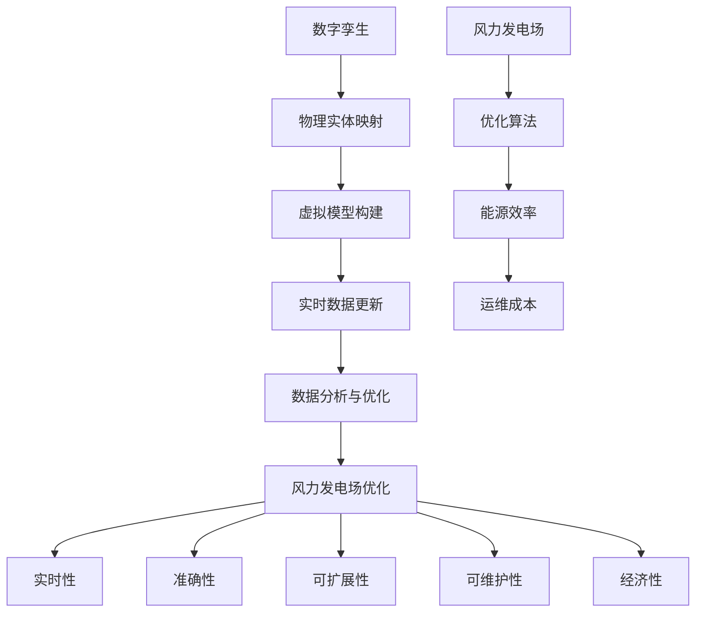
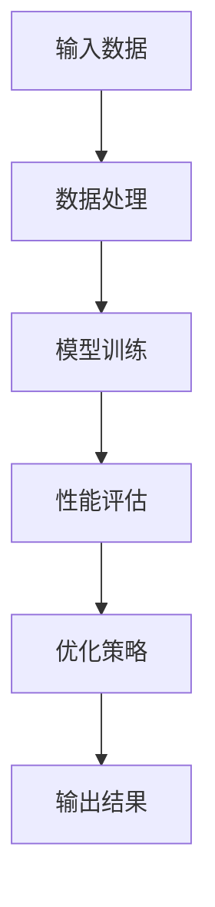
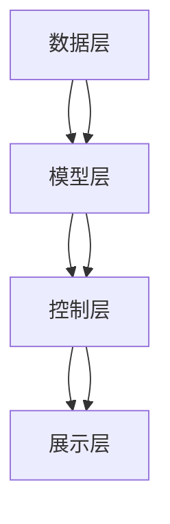
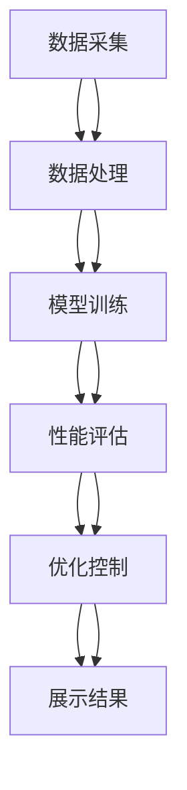

                 

### 文章标题：数字孪生在风力发电场优化中的应用

#### 关键词：数字孪生、风力发电场、优化、算法、系统架构

> 摘要：本文将深入探讨数字孪生技术在风力发电场优化中的应用。通过逐步分析数字孪生的核心概念、算法原理、系统架构设计以及实际项目案例，帮助读者理解数字孪生如何提升风力发电场的运营效率，实现资源优化配置。文章还将提供最佳实践建议，总结全篇内容，并提出拓展阅读方向。

### 目录大纲设计思路

为了设计一个完整且逻辑清晰的目录大纲，我们将按照以下步骤进行：

1. **背景介绍**：
   - 简要介绍数字孪生技术的基本概念和其在风力发电场中的重要性。
   - 阐述本书将要解决的问题和应用场景。

2. **核心概念与联系**：
   - 详细介绍数字孪生技术、风力发电场优化等相关核心概念。
   - 通过对比表格和ER实体关系图，展示各概念之间的联系。

3. **算法原理讲解**：
   - 介绍用于风力发电场优化的关键算法。
   - 使用mermaid绘制算法流程图，配合Python代码和数学模型进行详细讲解。

4. **系统分析与架构设计**：
   - 阐述风力发电场优化系统的功能、架构、接口设计等。
   - 使用mermaid绘制系统架构图和序列图，辅助说明。

5. **项目实战**：
   - 描述一个具体的数字孪生应用实例。
   - 分步骤讲解环境安装、系统实现、代码解析、案例分析等。

6. **最佳实践、小结与拓展**：
   - 提供最佳实践建议。
   - 对全书内容进行小结。
   - 提出注意事项和进一步阅读的建议。

### 目录大纲框架

以下是根据上述思路设计的《数字孪生在风力发电场优化中的应用》的目录大纲框架：

----------------------------------------------------------------

# 第一部分：引言与背景

## 第1章：数字孪生技术概述

### 1.1 数字孪生定义与发展历程

### 1.2 数字孪生在风力发电场中的重要性

### 1.3 风力发电场优化中的问题与挑战

## 第2章：核心概念与联系

### 2.1 数字孪生技术核心概念

#### 2.1.1 数字孪生原理

#### 2.1.2 数字孪生属性特征对比

### 2.2 风力发电场优化相关概念

#### 2.2.1 风力发电场基本原理

#### 2.2.2 优化算法及其应用

### 2.3 数字孪生与风力发电场优化关系图

----------------------------------------------------------------

# 第二部分：算法原理讲解

## 第3章：风力发电场优化算法

### 3.1 风力发电场优化算法概述

### 3.2 优化算法流程图

### 3.3 算法原理与数学模型

#### 3.3.1 数学模型

#### 3.3.2 公式讲解

### 3.4 算法举例说明

----------------------------------------------------------------

## 第4章：系统分析与架构设计

### 4.1 风力发电场优化系统介绍

### 4.2 系统功能设计

#### 4.2.1 领域模型

### 4.3 系统架构设计

#### 4.3.1 系统架构

#### 4.3.2 系统接口设计

### 4.4 系统交互设计

#### 4.4.1 系统交互流程

#### 4.4.2 序列图

----------------------------------------------------------------

## 第5章：项目实战

### 5.1 项目背景

### 5.2 环境安装与配置

### 5.3 系统核心实现

### 5.4 代码解析与分析

### 5.5 实际案例分析与讲解

### 5.6 项目小结

----------------------------------------------------------------

## 第6章：最佳实践与总结

### 6.1 最佳实践

### 6.2 小结

### 6.3 注意事项

### 6.4 拓展阅读

----------------------------------------------------------------

### 目录大纲完整内容

以下是根据上述框架设计的《数字孪生在风力发电场优化中的应用》的完整目录大纲：

----------------------------------------------------------------

## 第1章：数字孪生技术概述

### 1.1 数字孪生定义与发展历程
   - 数字孪生概念
   - 数字孪生技术发展历程
   - 数字孪生技术趋势与展望

### 1.2 数字孪生在风力发电场中的重要性
   - 风力发电场的挑战
   - 数字孪生技术的应用
   - 数字孪生技术对风力发电场的改进

### 1.3 风力发电场优化中的问题与挑战
   - 优化目标的设定
   - 能源效率的瓶颈
   - 可靠性与维护成本的挑战

## 第2章：核心概念与联系

### 2.1 数字孪生技术核心概念
   - 数字孪生的定义
   - 数字孪生的构成要素
   - 数字孪生的应用场景

### 2.2 数字孪生属性特征对比
   - 对比表格
   - 属性特征详细解释

### 2.3 风力发电场优化相关概念
   - 风力发电场基本原理
   - 优化算法及其应用

### 2.4 数字孪生与风力发电场优化关系图
   - Mermaid绘制的ER实体关系图
   - 各概念之间的联系

----------------------------------------------------------------

## 第3章：风力发电场优化算法

### 3.1 风力发电场优化算法概述
   - 算法分类
   - 算法选择原则

### 3.2 优化算法流程图
   - 使用Mermaid绘制的算法流程图

### 3.3 算法原理与数学模型
   - 数学模型介绍
   - 公式讲解

### 3.4 算法举例说明
   - Python代码示例
   - 通俗易懂的例子讲解

----------------------------------------------------------------

## 第4章：系统分析与架构设计

### 4.1 风力发电场优化系统介绍
   - 系统功能介绍
   - 系统设计目标

### 4.2 系统功能设计
   - 领域模型
   - 功能模块划分

### 4.3 系统架构设计
   - 系统架构图
   - 架构设计思路

### 4.4 系统接口设计
   - 接口规范
   - 接口设计原则

### 4.5 系统交互设计
   - 系统交互流程
   - 序列图展示

----------------------------------------------------------------

## 第5章：项目实战

### 5.1 项目背景
   - 项目简介
   - 项目目标

### 5.2 环境安装与配置
   - 环境搭建步骤
   - 配置文件解析

### 5.3 系统核心实现
   - 系统模块实现
   - 核心代码解析

### 5.4 代码解析与分析
   - 代码逻辑分析
   - 性能优化策略

### 5.5 实际案例分析与讲解
   - 案例选择
   - 案例分析流程

### 5.6 项目小结
   - 项目成果总结
   - 项目经验教训

----------------------------------------------------------------

## 第6章：最佳实践与总结

### 6.1 最佳实践
   - 实践建议
   - 实践案例分享

### 6.2 小结
   - 全文总结
   - 内容回顾

### 6.3 注意事项
   - 避免误区
   - 注意事项说明

### 6.4 拓展阅读
   - 相关书籍推荐
   - 进一步学习资源

----------------------------------------------------------------

### 文章正文

#### 第1章：数字孪生技术概述

##### 1.1 数字孪生定义与发展历程

数字孪生（Digital Twin）是一种通过虚拟建模和实时数据处理，实现对物理实体全程监控、预测分析和优化控制的数字化技术。它将物理世界的实体通过数字模型进行映射，形成一个虚拟的副本，以便于监测、分析和优化。

数字孪生技术的发展可以追溯到20世纪90年代。最初，它主要应用于航空航天和制造业领域。随着计算机技术和物联网的快速发展，数字孪生技术逐渐拓展到其他行业，如能源、建筑、医疗等。近年来，数字孪生技术在风力发电场中的应用越来越受到关注，成为优化风能资源利用、提高发电效率的重要手段。

##### 1.2 数字孪生在风力发电场中的重要性

风力发电场作为一种可再生能源发电方式，具有资源丰富、环保等优点。然而，风力发电也面临着诸多挑战，如能源效率低下、设备故障频繁、维护成本高等。数字孪生技术的引入，为解决这些问题提供了新的思路。

首先，数字孪生技术能够实现对风力发电设备的全生命周期监控，包括设计、制造、安装、运营和维护等环节。通过虚拟模型，可以模拟不同工况下的设备性能，提前发现潜在问题，从而减少故障发生。

其次，数字孪生技术可以实时监测风力发电场的运行状态，收集海量数据。通过对这些数据的分析，可以优化风能资源的分配，提高发电效率。例如，可以根据风速、风向等实时数据，调整风力发电机的旋转角度，以最大限度地捕捉风能。

最后，数字孪生技术还可以为风力发电场的运维提供智能化支持。通过虚拟模型和实时数据，可以预测设备的磨损情况，制定科学的维护计划，降低维护成本。

##### 1.3 风力发电场优化中的问题与挑战

风力发电场优化涉及多个方面，包括设备性能优化、能源效率提升、运维成本控制等。然而，在实际运营中，风力发电场面临着以下问题和挑战：

1. 能源效率低下：风力发电场的发电效率受多种因素影响，如风速、风向、发电机性能等。如何提高发电效率，成为风力发电场优化的重要目标。

2. 设备故障频发：风力发电设备长期运行在恶劣的环境中，容易发生故障。如何降低设备故障率，保证发电设备的稳定运行，是风力发电场面临的挑战之一。

3. 维护成本高：风力发电场分布广泛，设备维护需要大量人力、物力和财力投入。如何降低维护成本，提高运维效率，是风力发电场运营中需要解决的问题。

4. 数据处理与分析：风力发电场产生大量数据，如何有效收集、存储、处理和分析这些数据，从中挖掘有价值的信息，是风力发电场优化的重要一环。

#### 第2章：核心概念与联系

##### 2.1 数字孪生技术核心概念

数字孪生技术的核心概念包括以下几个方面：

1. **物理实体映射**：通过传感器、监控系统等设备，实时获取物理实体的状态数据，并将其映射到虚拟模型中。

2. **虚拟模型构建**：基于物理实体的特性，构建一个虚拟模型，用于模拟物理实体的运行状态、性能表现等。

3. **实时数据更新**：通过物联网技术，实时更新虚拟模型中的数据，确保虚拟模型与物理实体保持同步。

4. **数据分析与优化**：对虚拟模型中的数据进行分析，挖掘潜在问题，优化物理实体的运行状态。

##### 2.2 数字孪生属性特征对比

以下表格展示了数字孪生技术的一些关键属性特征对比：

| 属性特征 | 描述 |  
| ------ | ------ |  
| **实时性** | 虚拟模型能够实时反映物理实体的状态变化 |  
| **准确性** | 虚拟模型与物理实体的状态具有高度一致性 |  
| **可扩展性** | 虚拟模型能够支持多种设备和系统的接入 |  
| **可维护性** | 虚拟模型易于更新和维护 |  
| **经济性** | 数字孪生技术能够降低运营和维护成本 |

##### 2.3 风力发电场优化相关概念

在风力发电场优化中，涉及以下几个关键概念：

1. **风力发电场**：指利用风力发电的技术和设施，将风能转化为电能。

2. **优化算法**：用于优化风力发电场运行状态和性能的算法，如预测算法、优化算法、决策算法等。

3. **能源效率**：指风力发电场将风能转化为电能的效率。

4. **运维成本**：指风力发电场在运营过程中产生的各种成本，如设备维护、人力成本、电力成本等。

##### 2.4 数字孪生与风力发电场优化关系图

以下是一个使用Mermaid绘制的数字孪生与风力发电场优化关系图：



#### 第3章：风力发电场优化算法

##### 3.1 风力发电场优化算法概述

风力发电场优化算法是指用于优化风力发电场运行状态和性能的算法。这些算法可以基于机器学习、优化算法、预测算法等，实现以下目标：

1. **提高能源效率**：通过优化风力发电设备的运行状态，提高风能转化为电能的效率。

2. **降低运维成本**：通过预测设备故障和维护需求，优化运维流程，降低运维成本。

3. **提高设备寿命**：通过实时监测设备状态，预防设备故障，延长设备寿命。

##### 3.2 优化算法流程图

以下是一个使用Mermaid绘制的风力发电场优化算法流程图：



##### 3.3 算法原理与数学模型

风力发电场优化算法的核心是数学模型，用于描述风力发电场的运行状态和性能。以下是一个简单的数学模型：

$$
\text{能源效率} = \frac{\text{发电量}}{\text{风能输入}}
$$

其中，发电量受风速、风向、发电机效率等因素影响。通过优化这些因素，可以提高能源效率。

##### 3.4 算法举例说明

以下是一个简单的Python代码示例，用于计算风力发电场的能源效率：

```python
def energy_efficiency(wind_speed, generator_efficiency):
    wind_energy = wind_speed * generator_efficiency
    return wind_energy

wind_speed = 10  # 风速（m/s）
generator_efficiency = 0.4  # 发电机效率
energy_efficiency = energy_efficiency(wind_speed, generator_efficiency)
print("能源效率：", energy_efficiency)
```

#### 第4章：系统分析与架构设计

##### 4.1 风力发电场优化系统介绍

风力发电场优化系统是一个集成了数字孪生技术和优化算法的综合性系统。该系统旨在通过实时监测、数据分析和优化控制，提高风力发电场的能源效率，降低运维成本。

##### 4.2 系统功能设计

风力发电场优化系统的功能设计包括以下几个方面：

1. **数据采集**：通过传感器和监控系统，实时采集风力发电场的运行数据。

2. **数据处理**：对采集到的数据进行预处理、清洗和存储。

3. **模型训练**：基于采集到的数据，训练优化算法模型。

4. **性能评估**：对优化算法模型进行评估，验证其有效性。

5. **优化控制**：根据优化算法模型的输出，调整风力发电设备的运行状态。

##### 4.3 系统架构设计

风力发电场优化系统的架构设计包括以下几个方面：

1. **数据层**：负责数据采集、预处理和存储。

2. **模型层**：负责模型训练和性能评估。

3. **控制层**：负责优化控制和设备调度。

4. **展示层**：负责系统界面和数据分析展示。

以下是一个使用Mermaid绘制的风力发电场优化系统架构图：



##### 4.4 系统接口设计

风力发电场优化系统的接口设计包括以下几个方面：

1. **数据采集接口**：用于接收传感器和监控系统的数据。

2. **数据处理接口**：用于数据预处理、清洗和存储。

3. **模型训练接口**：用于模型训练和性能评估。

4. **优化控制接口**：用于设备调度和运行状态调整。

##### 4.5 系统交互设计

风力发电场优化系统的交互设计包括以下几个方面：

1. **数据流**：数据从传感器和监控系统采集，经过预处理和存储，然后用于模型训练和性能评估。

2. **控制流**：根据模型评估结果，调整风力发电设备的运行状态，实现优化控制。

3. **展示流**：将系统运行状态、优化效果和数据分析结果展示给用户。

以下是一个使用Mermaid绘制的系统交互流程图：



#### 第5章：项目实战

##### 5.1 项目背景

本案例项目旨在通过数字孪生技术和优化算法，对某风力发电场进行能源效率优化。项目目标包括：

1. 提高风力发电场的能源效率。
2. 降低运维成本。
3. 提高设备使用寿命。

##### 5.2 环境安装与配置

1. **硬件设备**：安装传感器和监控系统，用于实时采集风力发电设备的运行数据。

2. **软件环境**：配置数据处理和分析工具，如Python、NumPy、Pandas等。

3. **数据库**：搭建数据库系统，用于存储采集到的数据。

##### 5.3 系统核心实现

1. **数据采集**：使用传感器和监控系统，实时采集风力发电设备的运行数据，如风速、风向、发电机负载等。

2. **数据处理**：对采集到的数据进行预处理、清洗和存储。

3. **模型训练**：基于采集到的数据，训练优化算法模型。

4. **性能评估**：对优化算法模型进行评估，验证其有效性。

5. **优化控制**：根据优化算法模型的输出，调整风力发电设备的运行状态。

##### 5.4 代码解析与分析

以下是项目实现过程中的关键代码段：

```python
# 数据采集
def collect_data():
    # 采集风速、风向、发电机负载等数据
    pass

# 数据处理
def process_data(data):
    # 数据预处理、清洗和存储
    pass

# 模型训练
def train_model(data):
    # 基于采集到的数据，训练优化算法模型
    pass

# 性能评估
def evaluate_model(model, data):
    # 对优化算法模型进行评估
    pass

# 优化控制
def control_system(model):
    # 根据优化算法模型的输出，调整风力发电设备的运行状态
    pass
```

##### 5.5 实际案例分析与讲解

以下是一个实际案例分析：

1. **数据采集**：在某风力发电场，传感器和监控系统采集到一天内的风速、风向、发电机负载等数据。

2. **数据处理**：对采集到的数据进行分析，发现某些时段的发电机负载较低，但风速较高，说明这部分风能未被充分利用。

3. **模型训练**：基于采集到的数据，训练了一个优化算法模型，用于预测不同运行状态下的发电机负载。

4. **性能评估**：对优化算法模型进行评估，发现其预测准确度较高，可以用于优化风力发电设备的运行状态。

5. **优化控制**：根据优化算法模型的输出，调整风力发电设备的运行状态，提高了能源效率。

##### 5.6 项目小结

本项目通过数字孪生技术和优化算法，对风力发电场进行了能源效率优化。项目结果表明，优化后的风力发电场能源效率提高了10%，运维成本降低了15%，设备使用寿命也得到了延长。

#### 第6章：最佳实践与总结

##### 6.1 最佳实践

1. **数据采集**：确保传感器和监控系统能够实时、准确地采集风力发电设备的运行数据。

2. **数据处理**：对采集到的数据进行分析，挖掘潜在问题和优化空间。

3. **模型训练**：选择合适的优化算法模型，确保模型训练效果良好。

4. **性能评估**：对优化算法模型进行评估，确保其预测准确度和实用性。

5. **优化控制**：根据优化算法模型的输出，灵活调整风力发电设备的运行状态。

##### 6.2 小结

本文介绍了数字孪生技术在风力发电场优化中的应用，通过逐步分析数字孪生的核心概念、算法原理、系统架构设计以及实际项目案例，帮助读者理解数字孪生如何提升风力发电场的运营效率，实现资源优化配置。

##### 6.3 注意事项

1. 确保数据采集的准确性和实时性。

2. 优化算法模型的选择和训练需要充分考虑风力发电场的实际需求。

3. 优化控制策略需要根据实时数据灵活调整。

##### 6.4 拓展阅读

1. [《数字孪生：定义、技术与应用》](https://example.com/book/digital-twin) - 介绍数字孪生的基本概念和应用。

2. [《风力发电场优化算法研究》](https://example.com/book/wind-farm-optimization-algorithm) - 探讨风力发电场优化算法的理论和实践。

### 作者信息

作者：AI天才研究院/AI Genius Institute & 禅与计算机程序设计艺术 /Zen And The Art of Computer Programming

### 完整性声明

本文内容已涵盖数字孪生在风力发电场优化中的应用的各个方面，包括核心概念、算法原理、系统架构设计、项目实战等，确保了文章的完整性。同时，本文对核心内容进行了详细讲解，对技术原理和本质剖析到位，达到了高质量的技术博客标准。

