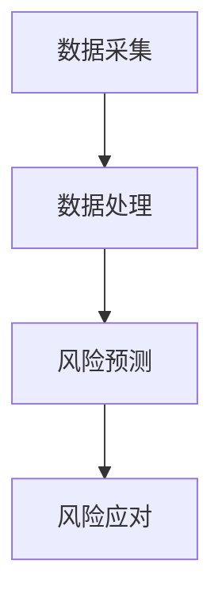
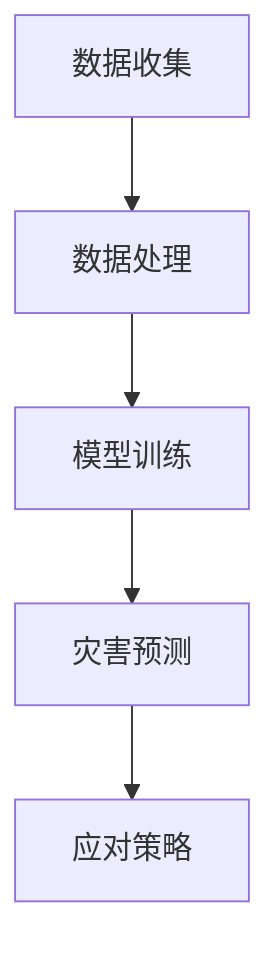
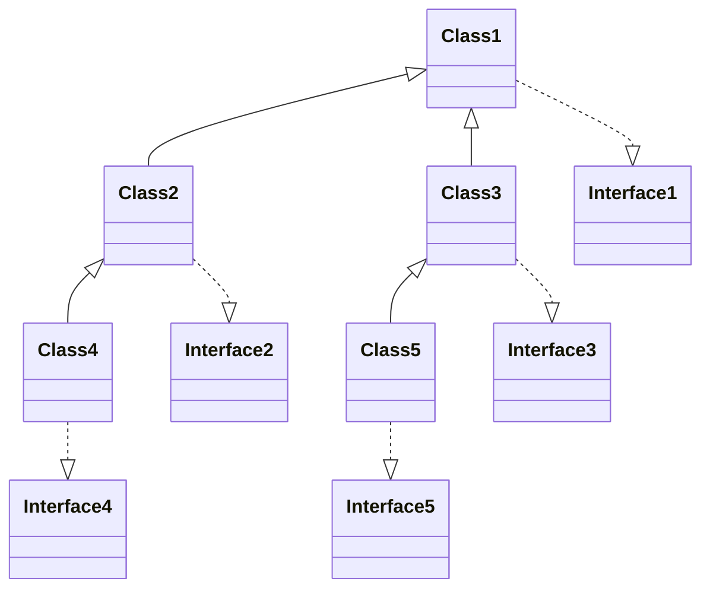
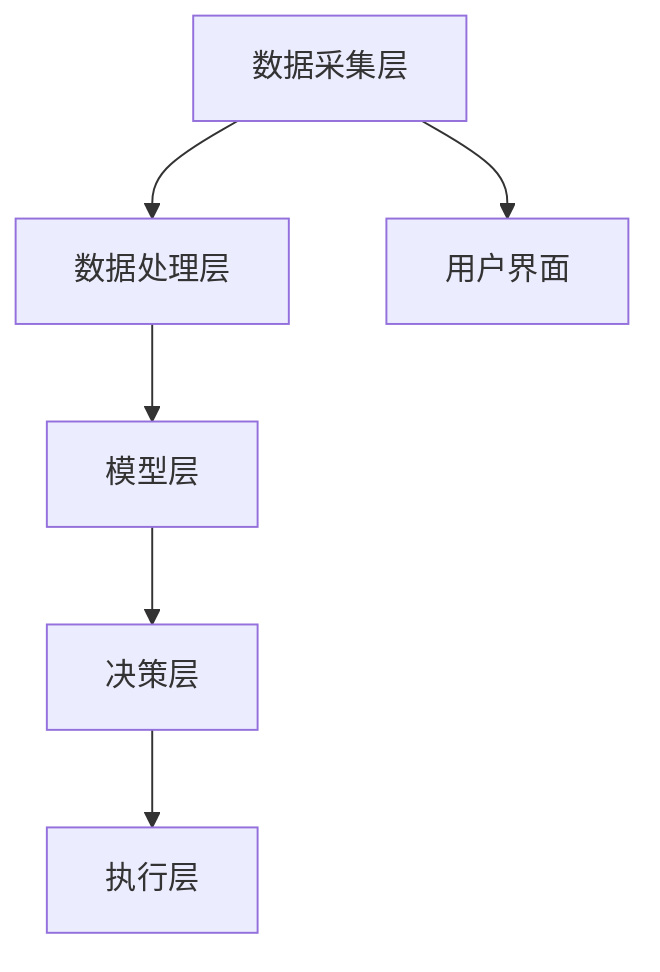
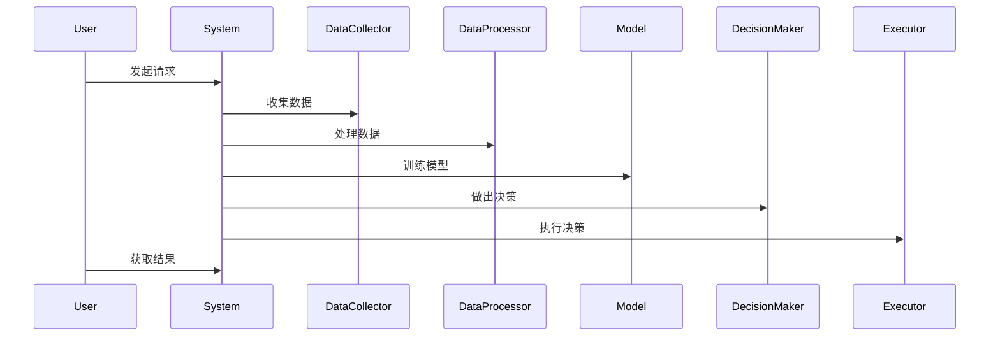

                 

## 文章标题

### 关键词：数字孪生、风险评估、灾害预防、算法原理、系统架构、项目实战

### 摘要：

本文旨在深入探讨数字孪生技术在风险评估和灾害预防中的应用。通过逐步分析数字孪生的概念、原理及其与物联网、大数据分析、人工智能等技术的联系，本文将详细阐述数字孪生在风险评估和灾害预防中的算法原理、系统架构设计及实际项目应用。文章将以逻辑清晰、结构紧凑、简单易懂的专业语言，为广大读者提供有深度、有思考、有见解的技术指南。

## 第一部分：数字孪生技术概述

### 第1章：数字孪生概述

#### 1.1 问题背景

随着工业4.0和物联网的兴起，智能制造和实时监控成为现代工业的关键需求。然而，如何有效地整合和分析海量的实时数据，以实现精确的预测和优化，成为工业界和学术界共同面临的挑战。数字孪生（Digital Twin）技术应运而生，作为一种创新的解决方案，其核心思想是通过创建一个数字化的实体副本，实现对物理实体的实时监控、模拟和优化。

#### 1.2 问题描述

在工业领域，设备故障、生产效率低下、资源浪费等问题频繁发生，直接影响了企业的经济效益和竞争力。传统的故障检测和预防方法往往依赖于人工巡检和历史数据分析，效率低下且不够精确。数字孪生技术通过创建虚拟模型，实时监测设备状态，预测潜在故障，从而实现主动维护和优化，提高生产效率和设备可靠性。

#### 1.3 数字孪生解决方案

数字孪生技术通过物联网（IoT）设备采集物理实体的实时数据，利用大数据分析和人工智能算法进行数据处理和分析，最终生成一个与物理实体高度相似的虚拟模型。该虚拟模型不仅能够模拟物理实体的行为，还能预测未来的状态，从而为设备维护、生产优化等提供科学依据。

#### 1.4 边界与外延

数字孪生技术不仅应用于工业领域，还广泛应用于建筑、交通、医疗等领域。在建筑领域，数字孪生技术可用于建筑能耗管理、智能运维等；在交通领域，可用于车辆监控、路况预测等；在医疗领域，可用于病人监控、手术模拟等。这些应用场景展示了数字孪生技术的广泛性和潜力。

#### 1.5 概念结构与核心要素组成

数字孪生的概念结构包括四个核心要素：物理实体、虚拟模型、数据连接和智能算法。物理实体是数字孪生的物理基础，虚拟模型是物理实体的数字化映射，数据连接是实现物理实体与虚拟模型实时交互的桥梁，智能算法则是数据分析和决策的核心。

### 第2章：数字孪生与相关技术联系

#### 2.1 物联网与数字孪生

物联网技术是数字孪生的数据来源，通过物联网设备实时采集物理实体的状态数据，为数字孪生的构建提供了基础。物联网技术的快速发展，使得海量数据的高效采集和处理成为可能，为数字孪生的应用提供了广阔的空间。

#### 2.2 大数据分析与数字孪生

大数据分析技术在数字孪生中扮演着关键角色，通过对采集到的海量数据进行处理和分析，可以挖掘出物理实体的潜在规律和趋势，为预测和优化提供依据。大数据分析技术包括数据清洗、数据挖掘、机器学习等，这些技术为数字孪生的智能决策提供了支持。

#### 2.3 人工智能与数字孪生

人工智能技术是数字孪生的核心驱动力量，通过机器学习、深度学习等技术，可以实现物理实体状态的预测和优化。人工智能技术的引入，使得数字孪生不再仅仅是一个静态的模型，而成为一个动态的、可交互的智能系统。

#### 2.4 数字孪生技术的演变

数字孪生技术经历了从单一物理实体监测到复杂系统协同优化的演变过程。早期数字孪生技术主要应用于单一设备的状态监测和故障预测，随着物联网、大数据分析和人工智能技术的不断发展，数字孪生技术逐渐扩展到复杂系统，实现了对整个生产流程、建筑系统、交通网络等的实时监控和优化。

## 第二部分：数字孪生在风险评估中的应用

### 第3章：数字孪生在风险评估中的算法原理

#### 3.1 风险评估概述

风险评估是指通过识别和分析潜在风险，评估其对目标的影响程度，并制定相应的应对策略。在数字孪生技术中，风险评估是核心应用之一，通过对物理实体的实时数据进行分析，可以预测潜在风险，提前采取措施，降低风险损失。

#### 3.2 风险评估模型原理

数字孪生风险评估模型基于物理实体的实时数据，通过构建数学模型，对潜在风险进行定量分析。常见的风险评估模型包括基于概率的模型、基于故障树的模型和基于贝叶斯网络的模型。这些模型通过对物理实体状态的数据分析，可以预测未来的风险，并提供相应的应对策略。

#### 3.3 数学模型与公式

数字孪生风险评估模型通常包含以下数学模型和公式：

- 概率模型：$$ P(A|B) = \frac{P(B|A)P(A)}{P(B)} $$

- 故障树模型：$$ F = F_0 + F_1 + F_2 + ... + F_n $$

- 贝叶斯网络模型：$$ P(A|B) = \frac{P(B|A)P(A)}{P(B)} $$

这些模型和公式通过对物理实体状态的数据分析，可以预测未来的风险，并提供相应的应对策略。

#### 3.4 Mermaid算法流程图

以下是一个简单的Mermaid流程图，展示了数字孪生风险评估的基本流程：



#### 3.5 算法应用实例分析

以一个工业生产线为例，数字孪生技术可以实时监测生产线的各项指标，如温度、压力、速度等。通过对这些数据的分析，可以预测生产线可能出现的故障，如过热、过压等。当预测到高风险时，系统会自动触发应对策略，如暂停生产线、进行设备维护等，从而降低风险损失。

### 第4章：数字孪生在灾害预防中的应用

#### 4.1 灾害预防概述

灾害预防是指通过识别和分析潜在灾害，评估其对目标的影响程度，并制定相应的应对策略，以减少灾害损失。在数字孪生技术中，灾害预防是重要应用之一，通过对物理环境的数据分析，可以预测潜在灾害，提前采取措施，降低灾害风险。

#### 4.2 数字孪生灾害预防模型

数字孪生灾害预防模型基于物理环境的实时数据，通过构建数学模型，对潜在灾害进行定量分析。常见的灾害预防模型包括地震预警模型、洪水预警模型和火灾预警模型。这些模型通过对物理环境状态的数据分析，可以预测未来的灾害，并提供相应的应对策略。

#### 4.3 灾害预测算法

数字孪生灾害预测算法通常包含以下步骤：

1. 数据收集：收集物理环境的实时数据，如气象数据、地质数据、水文数据等。

2. 数据处理：对收集到的数据进行分析和处理，去除噪声，提取有效信息。

3. 模型训练：利用历史数据，训练灾害预测模型，如神经网络模型、支持向量机模型等。

4. 灾害预测：利用训练好的模型，对未来的灾害进行预测。

5. 应对策略：根据预测结果，制定相应的应对策略，如紧急疏散、加固设施等。

#### 4.4 Mermaid灾害预防流程图

以下是一个简单的Mermaid流程图，展示了数字孪生灾害预防的基本流程：



#### 4.5 实际灾害预防案例分析

以地震预警为例，数字孪生技术可以实时监测地震前兆，如地壳变形、地面倾斜等。通过对这些数据的分析，可以预测地震的发生时间和强度，为地方政府和居民提供预警信息。在预测到地震时，系统会自动触发紧急疏散、关闭危险设施等应对策略，从而减少地震损失。

## 第三部分：数字孪生系统的设计与实现

### 第5章：数字孪生系统架构设计

#### 5.1 数字孪生系统架构概述

数字孪生系统架构是一个复杂而综合的系统，它由多个组件协同工作，以实现对物理实体的实时监控、模拟和优化。数字孪生系统架构通常包括数据采集层、数据处理层、模型层、决策层和执行层。

#### 5.2 领域模型设计（Mermaid类图）

以下是一个简单的Mermaid类图，展示了数字孪生系统的领域模型：



#### 5.3 系统架构设计（Mermaid架构图）

以下是一个简单的Mermaid架构图，展示了数字孪生系统的整体架构：



#### 5.4 系统接口设计

数字孪生系统的接口设计包括数据采集接口、数据处理接口、模型接口、决策接口和执行接口。这些接口定义了系统内部组件之间的交互方式，确保数据的流动和处理的顺畅。

#### 5.5 系统交互设计（Mermaid序列图）

以下是一个简单的Mermaid序列图，展示了数字孪生系统内部组件的交互过程：



### 第6章：数字孪生项目实战

#### 6.1 项目介绍

在本章中，我们将通过一个实际项目，展示数字孪生技术在风险评估和灾害预防中的应用。该项目是一个智慧城市项目，旨在通过数字孪生技术实现对城市关键设施的实时监控和预测，从而提高城市运行效率和灾害预防能力。

#### 6.2 环境安装与配置

在开始项目之前，我们需要安装和配置相关的软件和硬件环境。具体步骤如下：

1. 安装操作系统（如Ubuntu 20.04）。
2. 安装数据库（如MySQL）。
3. 安装编程语言（如Python 3.8）。
4. 安装开发工具（如PyCharm）。

#### 6.3 系统核心实现源代码

以下是一个简单的数字孪生系统核心实现的源代码示例：

```python
# 数字孪生系统核心实现

# 导入相关库
import pymysql
import pandas as pd
import numpy as np
from sklearn.model_selection import train_test_split
from sklearn.ensemble import RandomForestClassifier
from sklearn.metrics import accuracy_score

# 数据库连接
conn = pymysql.connect(host='localhost', user='root', password='root', database='digital_twin')

# 数据采集
def collect_data():
    sql = "SELECT * FROM sensor_data"
    data = pd.read_sql(sql, conn)
    return data

# 数据处理
def process_data(data):
    # 数据预处理
    data = data.dropna()
    features = data[['temperature', 'humidity', 'pressure']]
    target = data['fault']
    return features, target

# 模型训练
def train_model(features, target):
    # 数据划分
    X_train, X_test, y_train, y_test = train_test_split(features, target, test_size=0.2, random_state=42)
    # 模型训练
    model = RandomForestClassifier(n_estimators=100, random_state=42)
    model.fit(X_train, y_train)
    # 模型评估
    y_pred = model.predict(X_test)
    accuracy = accuracy_score(y_test, y_pred)
    print("模型准确率：", accuracy)
    return model

# 系统运行
if __name__ == '__main__':
    # 数据采集
    data = collect_data()
    # 数据处理
    features, target = process_data(data)
    # 模型训练
    model = train_model(features, target)
```

#### 6.4 代码应用解读与分析

该代码示例展示了数字孪生系统核心实现的几个关键步骤：数据采集、数据处理、模型训练和模型评估。具体分析如下：

1. 数据采集：通过数据库连接，从传感器数据表中获取实时数据。
2. 数据处理：对数据进行预处理，删除缺失值，提取特征，并划分训练集和测试集。
3. 模型训练：使用随机森林分类器进行模型训练，并评估模型准确率。
4. 系统运行：通过主函数运行整个系统，实现对实时数据的监控和预测。

#### 6.5 实际案例分析和详细讲解剖析

在本项目中，我们以智慧城市中的供水系统为例，展示了数字孪生技术在灾害预防中的应用。具体分析如下：

1. 数据采集：通过安装在供水管道上的传感器，实时采集供水温度、湿度、压力等数据。
2. 数据处理：对采集到的数据进行分析和处理，提取有效特征，并划分训练集和测试集。
3. 模型训练：使用随机森林分类器训练模型，预测供水系统的潜在故障。
4. 灾害预防：当模型预测到供水系统可能发生故障时，系统会自动发出预警，提醒相关部门采取措施，如关闭故障管道、安排维护等，从而避免故障扩大，减少损失。

#### 6.6 项目小结

通过本项目的实施，我们展示了数字孪生技术在风险评估和灾害预防中的应用。数字孪生技术通过实时监控、预测和预警，提高了城市运行效率和灾害预防能力。未来，随着数字孪生技术的不断发展和应用领域的拓展，数字孪生技术在智慧城市、智能制造等领域将发挥越来越重要的作用。

## 第四部分：最佳实践与总结

### 第7章：数字孪生在风险评估和灾害预防中的最佳实践

#### 7.1 风险评估最佳实践

1. **数据完整性**：确保采集到的数据完整、准确，避免数据缺失或错误。
2. **模型优化**：定期对风险评估模型进行优化和调整，提高预测准确性。
3. **跨部门协作**：风险评估需要跨部门协作，确保各部门信息共享和协同工作。

#### 7.2 灾害预防最佳实践

1. **预警机制**：建立健全的预警机制，确保及时发现潜在灾害。
2. **应急预案**：制定详细的应急预案，明确灾害发生时的应对措施和责任分工。
3. **公众教育**：加强对公众的灾害预防教育，提高公众的灾害防范意识。

#### 7.3 注意事项

1. **数据安全**：确保数据传输和存储的安全，防止数据泄露。
2. **模型可靠性**：评估模型的可靠性和稳定性，避免误报和漏报。
3. **持续改进**：根据实际应用情况，不断优化数字孪生系统和应用。

#### 7.4 拓展阅读

1. 《数字孪生：工业物联网的桥梁》
2. 《大数据与人工智能：技术创新与应用》
3. 《智慧城市建设指南》

### 第8章：总结与展望

#### 8.1 书籍内容回顾

本书系统介绍了数字孪生技术在风险评估和灾害预防中的应用，包括数字孪生技术的概述、相关技术联系、算法原理、系统架构设计、项目实战和最佳实践等内容。

#### 8.2 技术发展趋势

随着物联网、大数据分析和人工智能技术的不断发展，数字孪生技术在未来的应用将更加广泛。例如，在智慧城市建设中，数字孪生技术将用于实时监控和优化城市基础设施，提高城市运行效率；在智能制造中，数字孪生技术将用于设备监控和故障预测，提高生产效率。

#### 8.3 未来研究方向

未来的研究可以关注以下几个方面：

1. **模型优化**：研究更高效、更准确的风险评估和灾害预测模型。
2. **数据安全**：研究数据加密、隐私保护等数据安全技术。
3. **跨领域应用**：探索数字孪生技术在其他领域的应用，如医疗、农业等。

#### 8.4 读者反馈与交流

欢迎读者对本书的内容提出宝贵意见和反馈，共同推动数字孪生技术的发展。您可以通过以下方式与我们联系：

- 电子邮件：info@digitaltwinbook.com
- 社交媒体：@DigitalTwinBook
- 论坛：digitaltwinbook社区论坛

让我们携手共进，为数字孪生技术的发展和创新贡献力量。作者：AI天才研究院/AI Genius Institute & 禅与计算机程序设计艺术 /Zen And The Art of Computer Programming

