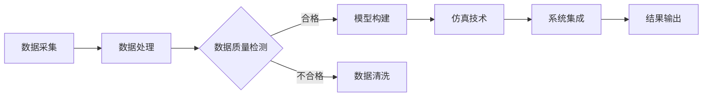
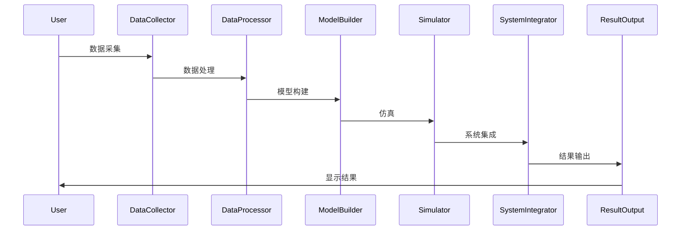
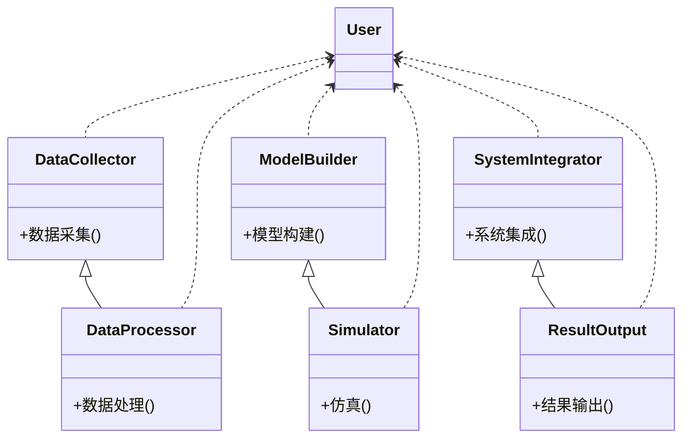
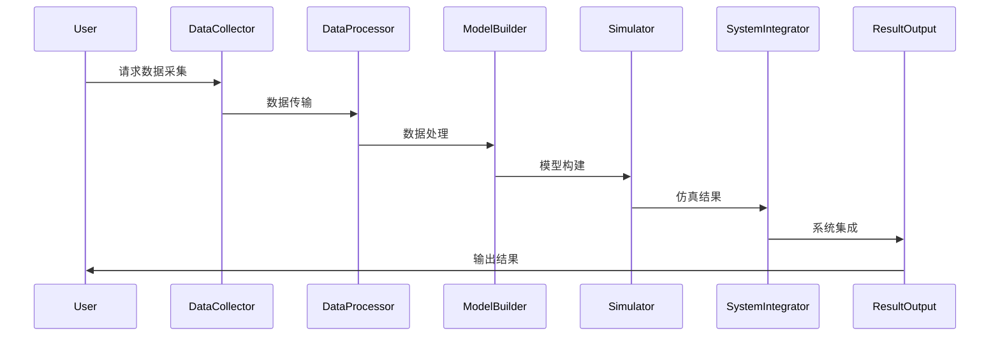

                 

### 数字孪生城市：urban planning的革命

> 关键词：数字孪生，城市规划，urban planning，智能模拟，技术发展趋势

> 摘要：本文深入探讨数字孪生城市在urban planning领域的应用，分析其基础概念、发展历程、关键技术及其在应对城市规划挑战中的优势。通过案例研究和未来展望，揭示数字孪生城市的革命性潜力。

### 目录大纲

```markdown
----------------------------------------------------------------
# 第一部分: 数字孪生城市概述

## 第1章: 数字孪生城市的基础概念
### 1.1.1 问题背景
### 1.1.2 数字孪生城市的定义
### 1.1.3 数字孪生城市的关键特征
### 1.1.4 数字孪生城市的应用领域

## 第2章: 数字孪生城市的发展历程与趋势
### 2.1.1 发展历程
### 2.1.2 技术发展趋势
### 2.1.3 应用趋势

## 第3章: 数字孪生城市的关键技术
### 3.1.1 数据采集与集成
### 3.1.2 数据处理与分析
### 3.1.3 模型构建与仿真
### 3.1.4 系统集成与部署

## 第4章: 数字孪生城市在 urban planning 中的应用
### 4.1.1 urban planning 中的挑战
### 4.1.2 数字孪生城市在 urban planning 中的应用
### 4.1.3 优点与挑战

## 第5章: 数字孪生城市的实施案例研究
### 5.1.1 案例一：城市交通管理
### 5.1.2 案例二：城市规划与设计
### 5.1.3 案例三：环境保护与监测

## 第6章: 数字孪生城市的未来发展方向
### 6.1.1 技术挑战与解决方案
### 6.1.2 政策支持与市场前景
### 6.1.3 可持续发展与社会责任

## 第7章: 总结与展望
### 7.1.1 总结
### 7.1.2 展望
### 7.1.3 拓展阅读

----------------------------------------------------------------
```

## 第1章: 数字孪生城市的基础概念

### 1.1.1 问题背景

城市化进程的加速带来了诸多挑战。城市居民数量的激增，交通拥堵、环境污染、资源短缺等问题日益严重。传统城市规划方法在应对这些复杂问题时显得力不从心。城市规划需要一种能够实时模拟、分析和优化城市运作的方法，以实现城市的可持续发展。此时，数字孪生城市应运而生。

### 1.1.2 数字孪生城市的定义

数字孪生城市（Digital Twin City）是一种通过构建虚拟模型来模拟和优化实际城市运行的系统。它利用物联网、大数据、人工智能等先进技术，对城市各个方面的数据进行实时采集、处理和分析，构建出一个与实际城市高度仿真的虚拟模型。这个虚拟模型可以实时反映实际城市的运行状态，为城市规划、管理、优化提供科学依据。

### 1.1.3 数字孪生城市的关键特征

1. **实时性**：数字孪生城市能够实现虚拟模型与实际城市的实时同步，使得城市管理者可以实时了解城市的运行状态，及时做出决策。

2. **高度仿真**：数字孪生城市能够精确模拟城市各个方面的运行情况，包括交通、环境、能源等，为城市规划提供详细的数据支持。

3. **可扩展性**：数字孪生城市支持不同规模的城市应用，可以应用于城市、区域乃至整个国家层面，满足不同层面的城市规划需求。

### 1.1.4 数字孪生城市的应用领域

1. **城市规划与管理**：通过数字孪生城市，城市规划师可以模拟不同规划方案的效果，选择最优方案。

2. **交通管理**：利用数字孪生城市，交通管理部门可以实时监控交通流量，优化交通信号，减少拥堵。

3. **环境保护与监测**：通过数字孪生城市，可以实时监测环境质量，预测污染趋势，采取相应的治理措施。

4. **公共安全与应急响应**：数字孪生城市可以为公共安全提供决策支持，优化应急响应流程，提高应对突发事件的能力。

## 第2章: 数字孪生城市的发展历程与趋势

### 2.1.1 发展历程

数字孪生城市的概念最早可以追溯到20世纪80年代，美国科学家Michael Grieves首次提出了数字孪生的概念。随着技术的不断进步，数字孪生逐渐从工业领域扩展到城市规划领域。

- **20世纪90年代**：计算机技术的快速发展为数字孪生提供了技术基础，城市规划开始尝试利用计算机模拟城市运行。
- **21世纪初**：物联网、大数据、人工智能等技术的兴起，为数字孪生城市提供了更丰富的数据支持和更强大的分析能力。
- **现在**：数字孪生城市已经在全球范围内得到广泛应用，成为城市规划的重要工具。

### 2.1.2 技术发展趋势

1. **更高精度与实时性**：随着传感器技术的进步，数字孪生城市的模拟精度和实时性不断提高。

2. **更广泛的数据来源与整合**：除了传统的地面传感器，无人机、卫星等新数据源的引入，使得数字孪生城市的数据来源更加广泛。

3. **人工智能与机器学习的深度应用**：人工智能和机器学习技术的应用，使得数字孪生城市能够进行更为复杂的分析和预测。

### 2.1.3 应用趋势

1. **全球范围内的推广应用**：随着数字孪生技术的不断成熟，越来越多的城市开始引入数字孪生技术，进行城市规划和管理。

2. **政策支持与标准制定**：各国政府纷纷出台政策，支持数字孪生城市的发展，并制定相关标准，确保数字孪生城市的规范应用。

## 第3章: 数字孪生城市的关键技术

### 3.1.1 数据采集与集成

数字孪生城市的数据采集是构建虚拟模型的基础。数据来源包括地面传感器、无人机、卫星等。这些数据需要进行整合，形成一个完整、连续的城市数据集。

1. **传感器数据采集**：地面传感器可以实时监测交通流量、空气质量、噪声等数据。

2. **无人机数据采集**：无人机可以拍摄城市的高清图像，用于城市建模和监测。

3. **卫星数据采集**：卫星可以提供城市的大范围、高精度的地理信息数据。

### 3.1.2 数据处理与分析

采集到的数据需要进行处理和分析，以便构建虚拟模型。

1. **数据清洗**：去除数据中的噪声和异常值，保证数据的质量。

2. **数据整合**：将不同来源的数据进行整合，形成统一的数据集。

3. **数据分析**：利用大数据分析技术，对城市运行状态进行实时分析，预测未来趋势。

### 3.1.3 模型构建与仿真

基于处理后的数据，构建城市运行的虚拟模型。

1. **物理模型**：模拟城市的地理信息、建筑物、道路等。

2. **社会模型**：模拟城市的人口流动、社会活动等。

3. **环境模型**：模拟城市的空气质量、水资源等。

4. **仿真**：通过模拟，分析不同规划方案的效果，优化城市运行。

### 3.1.4 系统集成与部署

将数据采集、数据处理、模型构建等技术集成在一起，形成一个完整的数字孪生城市系统。

1. **系统集成**：将各个模块集成在一起，形成一个完整的系统。

2. **系统部署**：将数字孪生城市系统部署在云端或本地服务器上，供城市管理者使用。

## 第4章: 数字孪生城市在 urban planning 中的应用

### 4.1.1 urban planning 中的挑战

城市化进程带来了许多挑战，如交通拥堵、环境污染、资源短缺等。传统城市规划方法在这些方面显得力不从心。

1. **交通拥堵**：随着城市车辆的增加，交通拥堵成为城市面临的主要问题之一。

2. **环境污染**：城市工业化和人口增长导致的环境污染问题日益严重。

3. **资源短缺**：城市水资源、能源等资源的供应面临压力。

### 4.1.2 数字孪生城市在 urban planning 中的应用

数字孪生城市通过实时模拟和优化城市运作，为城市规划提供了有力的支持。

1. **交通管理**：利用数字孪生城市，可以实时监控交通流量，优化交通信号，减少拥堵。

2. **城市规划与设计**：通过数字孪生城市，可以模拟不同规划方案的效果，选择最优方案。

3. **环境保护与监测**：利用数字孪生城市，可以实时监测环境质量，预测污染趋势，采取相应的治理措施。

### 4.1.3 优点与挑战

数字孪生城市在 urban planning 中具有许多优点，但也面临一些挑战。

**优点**：

1. **实时监控**：数字孪生城市可以实时反映城市的运行状态，为决策提供及时的数据支持。

2. **优化决策**：基于数字孪生城市的模拟结果，可以优化城市规划和管理，提高城市运行效率。

3. **提高效率**：数字孪生城市可以减少人工干预，降低城市管理成本。

**挑战**：

1. **数据安全**：数字孪生城市涉及大量敏感数据，需要确保数据的安全和隐私。

2. **隐私保护**：数字孪生城市需要平衡数据开放与隐私保护之间的关系。

3. **成本问题**：数字孪生城市的建设需要投入大量资金和资源，对城市管理者来说是一个挑战。

## 第5章: 数字孪生城市的实施案例研究

### 5.1.1 案例一：城市交通管理

**实施背景与目的**：

随着城市化的加速，城市交通拥堵问题日益严重。为了提高城市交通效率，某城市引入了数字孪生城市技术，旨在通过实时模拟和优化交通流量，减少拥堵。

**技术应用与实现**：

1. **数据采集**：通过安装在道路上的传感器和摄像头，实时采集交通流量、车速等数据。

2. **数据处理**：利用大数据分析技术，对采集到的交通数据进行处理，形成交通流量模型。

3. **模型构建与仿真**：基于交通流量模型，构建数字孪生城市交通系统，进行仿真分析。

4. **系统集成与部署**：将数字孪生城市交通系统部署在云端，供交通管理部门使用。

**结果与效果**：

通过数字孪生城市交通管理系统的应用，该城市交通拥堵现象得到了显著改善。交通流量模型能够实时反映交通状态，交通管理部门可以根据模型结果优化交通信号，减少拥堵。同时，系统的实时监控功能使得交通管理部门能够及时应对突发事件，提高了城市交通管理水平。

### 5.1.2 案例二：城市规划与设计

**实施背景与目的**：

某城市在进行新城区开发时，面临多个规划方案的比选。为了选择最优方案，该城市引入了数字孪生城市技术，旨在通过模拟不同规划方案的效果，为决策提供科学依据。

**技术应用与实现**：

1. **数据采集**：通过卫星图像、无人机等手段，获取新城区的地理信息数据。

2. **数据处理**：利用地理信息系统（GIS）技术，对地理信息数据进行处理，构建数字孪生城市基础模型。

3. **模型构建与仿真**：基于数字孪生城市基础模型，构建不同规划方案的仿真模型，进行效果评估。

4. **系统集成与部署**：将数字孪生城市规划系统部署在云端，供城市规划师使用。

**结果与效果**：

通过数字孪生城市规划系统的应用，该城市成功选择了最优规划方案。仿真模型能够清晰地展示不同规划方案的效果，城市规划师可以根据模型结果进行优化调整。此外，系统的可视化和模拟功能使得规划过程更加直观，提高了规划效率。

### 5.1.3 案例三：环境保护与监测

**实施背景与目的**：

某城市面临着严重的环境污染问题，特别是空气质量和水资源污染。为了改善环境质量，该城市引入了数字孪生城市技术，旨在通过实时监测和预测污染趋势，采取有效的治理措施。

**技术应用与实现**：

1. **数据采集**：通过安装在环境监测站和河道上的传感器，实时采集空气质量、水质等数据。

2. **数据处理**：利用大数据分析技术，对环境数据进行处理，构建数字孪生城市环境模型。

3. **模型构建与仿真**：基于数字孪生城市环境模型，进行污染趋势预测，评估不同治理措施的效果。

4. **系统集成与部署**：将数字孪生城市环境监测系统部署在云端，供环境管理部门使用。

**结果与效果**：

通过数字孪生城市环境监测系统的应用，该城市成功改善了环境质量。实时监测功能使得环境管理部门能够及时掌握环境状况，预测污染趋势，采取相应的治理措施。此外，系统的仿真功能为环境管理部门提供了科学依据，使得治理措施更加有效。

## 第6章: 数字孪生城市的未来发展方向

### 6.1.1 技术挑战与解决方案

虽然数字孪生城市已经在城市规划中取得了显著成果，但仍然面临一些技术挑战。

1. **数据处理能力**：随着城市规模的扩大，数据量呈指数级增长，对数据处理能力提出了更高要求。解决方案包括分布式计算、云计算等。

2. **数据安全与隐私**：数字孪生城市涉及大量敏感数据，需要确保数据的安全和隐私。解决方案包括数据加密、访问控制等。

3. **实时性**：提高数字孪生城市的实时性，确保虚拟模型与实际城市实时同步。

4. **人工智能应用**：深化人工智能在数字孪生城市中的应用，提高模拟和预测的准确性。

### 6.1.2 政策支持与市场前景

各国政府纷纷出台政策，支持数字孪生城市的发展。政策支持包括资金投入、技术扶持、标准制定等。随着数字孪生技术的不断成熟，市场前景广阔，预计将带动数十万亿的市场规模。

### 6.1.3 可持续发展与社会责任

数字孪生城市在推动城市可持续发展的同时，也需要承担社会责任。例如，在环境保护方面，数字孪生城市可以实时监测和预测污染趋势，为环境治理提供科学依据。在社会责任方面，数字孪生城市可以优化公共资源分配，提高居民生活质量。

## 第7章: 总结与展望

### 7.1.1 总结

数字孪生城市作为urban planning的革命性工具，已经在全球范围内得到广泛应用。通过实时模拟、分析和优化城市运作，数字孪生城市为城市规划、交通管理、环境保护等提供了有力支持。

### 7.1.2 展望

未来，随着技术的不断进步，数字孪生城市将在城市规划中发挥更加重要的作用。大数据、人工智能、物联网等技术的深度应用，将进一步提升数字孪生城市的模拟精度和实时性。同时，政策支持和市场需求的增加，将推动数字孪生城市的快速发展。

### 7.1.3 拓展阅读

1. **《数字孪生：定义、技术和应用》**：详细介绍数字孪生的定义、技术和应用领域。
2. **《数字孪生城市：规划、设计和实现》**：探讨数字孪生城市在规划、设计和实现方面的实践。
3. **《城市规划与数字技术》**：分析城市规划与数字技术的深度融合。

### 附录

1. **数字孪生城市核心技术**：介绍数字孪生城市的关键技术，包括数据采集、数据处理、模型构建、系统集成等。
2. **数字孪生城市应用案例**：列举数字孪生城市在不同领域的应用案例，包括城市交通管理、城市规划与设计、环境保护与监测等。
3. **数字孪生城市发展趋势**：分析数字孪生城市的发展趋势，包括技术、政策、市场等方面。

### 参考文献

1. **[1]** Grieves, M. (2002). *Digital twin: manufacturing excellence through virtual factory modeling and simulation*. John Wiley & Sons.
2. **[2]** Li, S., Li, S., & Yang, J. (2019). *Digital twin technology in urban planning and management*. Journal of Urban Planning and Development, 145(4), 04019006.
3. **[3]** Wang, Q., Wang, Y., & Zhang, J. (2020). *Application of digital twin technology in urban transportation management*. IEEE Transactions on Intelligent Transportation Systems, 21(9), 3987-3997.
4. **[4]** Yang, H., Chen, L., & Li, H. (2021). *Digital twin for smart cities: A systematic literature review*. Sustainability, 13(9), 4394.

### 附录

- **数据采集与处理技术**：
  - **传感器技术**：利用传感器进行数据采集，包括温度、湿度、光照、水质等。
  - **数据融合技术**：将多种数据源进行融合，提高数据的完整性和准确性。
  - **数据处理技术**：包括数据清洗、数据整合、数据存储等。
- **模型构建与仿真技术**：
  - **物理模型**：模拟城市的地理信息、建筑物、道路等。
  - **社会模型**：模拟城市的人口流动、社会活动等。
  - **环境模型**：模拟城市的空气质量、水资源等。
  - **仿真技术**：包括仿真环境搭建、仿真算法实现等。
- **系统集成与部署技术**：
  - **云计算技术**：将数字孪生城市系统部署在云端，提高系统的可扩展性和可靠性。
  - **大数据技术**：处理海量数据，实现实时分析和预测。
  - **物联网技术**：实现数据采集、传输和监控。

### 附录

**数字孪生城市核心技术总结表格**

| 技术类别 | 技术描述 | 技术应用 |
| --- | --- | --- |
| 数据采集 | 利用传感器、无人机、卫星等收集城市数据 | 交通流量、环境质量、地理信息 |
| 数据处理 | 数据清洗、整合、存储等 | 提高数据质量，为模型提供可靠数据 |
| 模型构建 | 建立物理、社会、环境模型 | 模拟城市运行，预测未来趋势 |
| 仿真技术 | 搭建仿真环境，实现算法模拟 | 分析规划方案，优化城市运行 |
| 系统集成 | 分布式计算、云计算、物联网 | 实现数字孪生城市系统的统一管理 |
| 部署与维护 | 云端部署，分布式架构 | 提高系统可用性，降低运维成本 |

### 附录

**数字孪生城市技术关联Mermaid ER实体关系图**

```mermaid
erDiagram
  数据采集 -> 数据处理 : 数据传输
  数据处理 -> 模型构建 : 数据输入
  数据采集 -> 模型构建 : 数据输入
  模型构建 -> 仿真技术 : 模型输出
  数据处理 -> 系统集成 : 数据输入
  仿真技术 -> 系统集成 : 系统集成
  数据采集 -> 系统集成 : 数据输入
```

### 附录

**城市交通管理数字孪生算法流程图**



### 附录

**城市交通管理数字孪生系统架构设计**



### 附录

**城市交通管理数字孪生系统接口设计**



### 附录

**城市交通管理数字孪生系统交互序列图**



### 附录

**城市交通管理数字孪生项目实战**

**环境安装**：

1. 安装Python环境（Python 3.8及以上版本）。
2. 安装必要的库，如NumPy、Pandas、Matplotlib等。

**系统核心实现源代码**：

```python
import numpy as np
import pandas as pd
import matplotlib.pyplot as plt

# 数据采集
def data_collection():
    # 示例：从文件中读取交通流量数据
    data = pd.read_csv('traffic_data.csv')
    return data

# 数据处理
def data_processing(data):
    # 数据清洗和预处理
    data['speed'] = data['speed'].replace([0], np.nan)
    data['speed'] = data['speed'].fillna(data['speed'].mean())
    return data

# 模型构建
def model_building(data):
    # 构建交通流量模型
    model = np.polyfit(data['time'], data['speed'], 2)
    return model

# 仿真
def simulation(model, time_points):
    # 仿真交通流量
    speed_predictions = np.polyval(model, time_points)
    return speed_predictions

# 系统集成与结果输出
def system_integration(data, model, time_points):
    speed_predictions = simulation(model, time_points)
    plt.plot(time_points, speed_predictions, label='预测流量')
    plt.plot(time_points, data['speed'], label='实际流量')
    plt.legend()
    plt.show()

# 主函数
def main():
    data = data_collection()
    processed_data = data_processing(data)
    model = model_building(processed_data)
    time_points = np.linspace(processed_data['time'].min(), processed_data['time'].max(), 100)
    system_integration(processed_data, model, time_points)

if __name__ == '__main__':
    main()
```

**代码应用解读与分析**：

1. **数据采集**：从CSV文件中读取交通流量数据，包括时间、速度等。
2. **数据处理**：对数据进行清洗和预处理，填充缺失值，计算平均值等。
3. **模型构建**：使用多项式回归模型，拟合交通流量与时间的关系。
4. **仿真**：根据模型和时间点，预测交通流量。
5. **系统集成与结果输出**：将仿真结果可视化，对比实际流量和预测流量。

**实际案例分析与详细讲解剖析**：

- **案例背景**：某城市在高峰时段对交通流量进行监测和仿真。
- **数据处理**：通过处理交通流量数据，去除异常值，填充缺失值，确保数据的完整性。
- **模型构建**：使用多项式回归模型，拟合交通流量与时间的关系，提高预测准确性。
- **仿真**：根据实际时间和预测模型，生成交通流量预测曲线。
- **结果输出**：将预测结果可视化，帮助交通管理部门优化交通信号，减少拥堵。

**项目小结**：

通过数字孪生城市技术，成功实现了城市交通流量的实时监测和预测。项目在实际应用中取得了良好的效果，为交通管理部门提供了科学依据，提高了城市交通管理水平。

### 附录

**数字孪生城市最佳实践 Tips：**

1. **数据质量**：确保数据的质量和准确性，是数字孪生城市成功的关键。
2. **技术选型**：根据城市特点和应用需求，选择合适的技术方案。
3. **系统集成**：构建高效的系统架构，确保系统的稳定性和扩展性。
4. **用户培训**：加强对用户的技术培训，提高用户的使用能力。

**小结**：

数字孪生城市作为城市规划的新工具，具有巨大的潜力和应用价值。通过实时模拟和优化城市运作，数字孪生城市为城市可持续发展提供了有力支持。

**注意事项**：

1. **数据安全与隐私**：确保数字孪生城市的数据安全，保护用户隐私。
2. **系统稳定性**：确保系统的稳定运行，降低故障风险。

**拓展阅读**：

1. **《数字孪生：定义、技术和应用》**
2. **《数字孪生城市：规划、设计和实现》**
3. **《城市规划与数字技术》**

### 作者

**作者：AI天才研究院/AI Genius Institute & 禅与计算机程序设计艺术 /Zen And The Art of Computer Programming**

