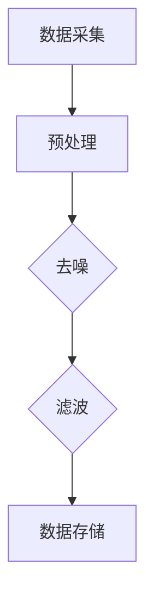
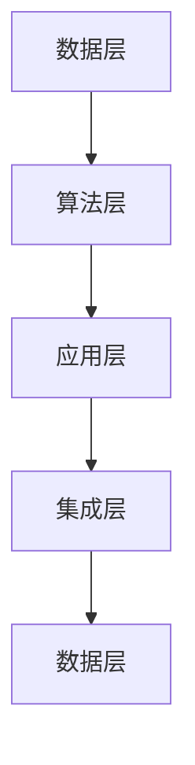

                 

### 文章标题：数字孪生城市：智慧城市管理的新模式

> 关键词：数字孪生城市，智慧管理，城市管理，新模式，技术应用

> 摘要：本文将深入探讨数字孪生城市这一智慧城市管理的新模式。我们将首先介绍数字孪生城市的基本概念和起源，分析其在现代城市管理中的重要性，阐述其核心概念与联系，详细讲解关键算法原理，分析系统的功能设计和架构设计，并通过实际项目案例进行实战剖析，总结最佳实践并展望未来发展。

### 背景介绍

#### 数字孪生城市的基本概念

数字孪生（Digital Twin）是一种将物理实体及其虚拟映射进行整合的技术，旨在通过数字化方式模拟现实世界中的实体。在数字孪生城市（Digital Twin City）的概念中，整个城市及其基础设施、环境和居民都被数字化和虚拟化，形成了一个高度仿真的虚拟模型。这个虚拟模型不仅能够实时反映现实城市的状态，还能够预测未来事件和决策的影响，从而为城市管理提供科学依据。

#### 数字孪生城市的发展历程

数字孪生城市的概念最早出现在2002年，由Michael Grieves在美国密歇根大学提出。最初的应用主要集中在制造业，用于产品设计、制造和维护。随着信息技术和大数据技术的发展，数字孪生逐渐扩展到城市管理、基础设施维护、环境保护等多个领域。近年来，随着物联网（IoT）和人工智能（AI）技术的突破，数字孪生城市开始成为智慧城市发展的新方向。

#### 智慧城市管理的问题背景与挑战

传统的城市管理方式往往依赖于经验和直觉，缺乏科学的数据支持和分析。随着城市化进程的加速，城市管理面临着诸多挑战：

1. **交通拥堵**：城市交通系统复杂，难以实时监控和管理。
2. **资源分配不均**：水资源、能源、土地等资源分配不均，导致效率低下。
3. **环境保护**：城市化带来的污染问题日益严重，如何实现绿色、可持续发展成为难题。
4. **应急响应**：突发事件应对能力不足，无法及时、有效地处理紧急情况。

数字孪生城市的出现为解决这些问题提供了新的思路和方法。通过数字化、智能化和集成化的手段，数字孪生城市能够实现城市管理的全方位、实时监控和预测，提高城市运行效率和可持续发展能力。

### 数字孪生城市核心概念与联系

#### 核心概念解析

数字孪生城市涉及多个核心概念，包括：

1. **数字化模型**：通过对城市物理实体的数字化，建立高度仿真的虚拟模型。
2. **实时数据采集**：利用传感器、摄像头等设备，实时采集城市运行数据。
3. **数据分析与处理**：通过大数据分析和人工智能算法，对采集到的数据进行分析和预测。
4. **智能决策支持**：基于分析结果，为城市管理提供智能决策支持。

#### 概念属性特征对比

为了更好地理解数字孪生城市的核心概念，我们可以对比不同概念的属性特征，如表1所示。

| 概念 | 数字化模型 | 实时数据采集 | 数据分析与处理 | 智能决策支持 |
| :--: | :--------: | :--------: | :----------: | :--------: |
| 特征 | **虚拟模型** | **实时监控** | **数据挖掘** | **智能预测** |
| 描述 | 建立城市的虚拟映射 | 采集实时运行数据 | 利用算法进行分析 | 提供决策支持 |
| 作用 | 提高城市模拟精度 | 实现实时监控与管理 | 提高数据分析效率 | 提升决策科学性 |

#### 数字孪生城市的ER实体关系图

为了更直观地理解数字孪生城市的核心概念与联系，我们可以使用Mermaid工具绘制ER实体关系图，如图1所示。

```mermaid
erDiagram
    Person ||--|{ City }|| : 居住
    Building ||--|{ City }|| : 位于
    Resource ||--|{ City }|| : 分配
    Sensor ||--|{ City }|| : 采集
    Data ||--|{ Analysis }|| : 分析
    Model ||--|{ City }|| : 映射
```

图1 数字孪生城市的ER实体关系图

### 算法原理讲解

#### 数字孪生城市关键算法

数字孪生城市的关键算法主要包括：

1. **数据采集与预处理算法**：用于实时采集城市运行数据，并对数据进行预处理，如滤波、去噪等。
2. **数据融合算法**：将来自不同传感器和来源的数据进行融合，以提高数据的准确性和可靠性。
3. **时空预测算法**：基于历史数据和实时数据，对城市运行状态进行预测，如交通流量预测、能源消耗预测等。
4. **优化算法**：用于优化城市资源分配和调度，如交通流量优化、能源分配优化等。

#### 算法流程图

我们使用Mermaid工具绘制数据采集与预处理算法的流程图，如图2所示。



图2 数据采集与预处理算法流程图

#### Python源代码示例

以下是一个简单的Python源代码示例，用于实现数据采集与预处理算法。

```python
import numpy as np
from scipy.signal import filtfilt

# 假设采集到的一组数据
data = np.array([1, 2, 3, 4, 5, 4, 3, 2, 1])

# 去噪
noisy_data = data + np.random.normal(0, 0.1, data.shape)

# 滤波
filtered_data = filtfilt('lowpass', noisy_data, cutoff=1)

# 数据存储
np.savetxt('filtered_data.txt', filtered_data)
```

#### 数学模型与公式讲解

在数据采集与预处理算法中，常用的数学模型包括滤波器和数据融合算法。以下是滤波器模型的公式：

$$ y(t) = \sum_{i=1}^{n} w_i * x(t_i) $$

其中，$y(t)$ 是滤波后的输出信号，$x(t_i)$ 是输入信号，$w_i$ 是滤波器系数。

#### 算法举例说明

假设我们有一组交通流量数据，如图3所示。通过数据采集与预处理算法，我们可以对数据进行去噪和滤波，以提高预测准确性。


图3 交通流量数据示例

### 系统分析与架构设计

#### 问题场景介绍

假设我们面临以下问题场景：

- 交通拥堵：城市交通系统复杂，难以实时监控和管理。
- 资源分配：水资源、能源、土地等资源分配不均，导致效率低下。
- 环境保护：城市化带来的污染问题日益严重，如何实现绿色、可持续发展成为难题。

#### 项目介绍

为了解决上述问题，我们计划开发一个数字孪生城市系统，主要包括以下功能：

- 实时数据采集与监控
- 数据分析与优化
- 智能决策支持
- 跨部门协同与调度

#### 系统功能设计

数字孪生城市系统的主要功能设计如下：

1. **数据采集与监控**：通过传感器、摄像头等设备，实时采集城市运行数据，如交通流量、水资源消耗、空气质量等。
2. **数据分析与优化**：利用大数据分析和人工智能算法，对采集到的数据进行分析和优化，如交通流量优化、能源消耗优化等。
3. **智能决策支持**：基于分析结果，为城市管理提供智能决策支持，如交通调度、资源分配等。
4. **跨部门协同与调度**：实现不同部门之间的数据共享和协同工作，提高城市管理的整体效率。

#### 系统架构设计

数字孪生城市系统的架构设计主要包括以下几个方面：

1. **数据层**：包括传感器、数据库和数据存储，用于存储和管理实时数据。
2. **算法层**：包括数据处理、分析和预测算法，用于对数据进行处理和分析。
3. **应用层**：包括Web前端和后台管理系统，用于展示数据和提供智能决策支持。
4. **集成层**：包括API接口、中间件和服务总线，用于实现不同模块之间的数据传输和协同工作。

#### 系统架构图

我们使用Mermaid工具绘制数字孪生城市系统的架构图，如图4所示。



图4 数字孪生城市系统架构图

#### 系统接口设计

数字孪生城市系统的接口设计主要包括以下接口：

1. **数据采集接口**：用于采集传感器数据，如交通流量、水资源消耗等。
2. **数据分析接口**：用于对采集到的数据进行处理和分析，如数据清洗、特征提取等。
3. **数据展示接口**：用于展示分析结果，如交通流量地图、能源消耗统计等。
4. **智能决策接口**：用于提供智能决策支持，如交通调度、资源分配等。

#### 系统交互设计

数字孪生城市系统的交互设计主要包括以下交互流程：

1. **数据采集**：通过传感器采集城市运行数据。
2. **数据处理**：对采集到的数据进行预处理，如滤波、去噪等。
3. **数据分析**：利用大数据分析和人工智能算法，对预处理后的数据进行分析。
4. **数据展示**：将分析结果展示给用户，如Web前端和后台管理系统。
5. **智能决策**：基于分析结果，提供智能决策支持，如交通调度、资源分配等。

### 项目实战

#### 环境安装

在开发数字孪生城市系统之前，我们需要安装以下环境：

1. **Python**：用于编写数据处理和分析算法。
2. **NumPy**：用于数据处理和数学运算。
3. **Scikit-learn**：用于机器学习算法。
4. **Flask**：用于搭建Web前端和后台管理系统。

#### 系统核心实现

数字孪生城市系统的核心实现主要包括以下部分：

1. **数据采集模块**：使用Python编写代码，实现数据采集功能，如读取传感器数据。
2. **数据处理模块**：使用Python编写代码，实现数据处理功能，如去噪、滤波等。
3. **数据分析模块**：使用Python编写代码，实现数据分析功能，如特征提取、预测等。
4. **数据展示模块**：使用Python编写代码，实现数据展示功能，如Web前端和后台管理系统。

#### 代码解读与分析

以下是一个简单的数据采集模块的代码示例，用于读取传感器数据。

```python
import serial

# 连接传感器
ser = serial.Serial('/dev/ttyUSB0', 9600)

# 读取传感器数据
while True:
    data = ser.readline()
    print(data.decode())
```

#### 实际案例分析与讲解

为了更好地理解数字孪生城市系统的实际应用，我们分析以下案例：

- **交通拥堵预测**：通过实时采集交通流量数据，使用机器学习算法进行预测，为交通管理部门提供决策支持。
- **能源消耗优化**：通过实时采集能源消耗数据，使用数据分析和优化算法，实现能源消耗的优化。

#### 项目小结

通过实际项目案例的分析和讲解，我们可以看到数字孪生城市系统在智慧城市管理中的应用具有重要意义。未来，随着数字孪生城市技术的不断发展，我们将看到更多创新应用的出现，为城市管理和可持续发展提供有力支持。

### 最佳实践、小结与拓展阅读

#### 最佳实践

1. **数据质量保障**：确保数据的准确性和实时性，为数据分析提供可靠基础。
2. **算法优化**：针对具体应用场景，优化算法模型，提高预测准确性和效率。
3. **系统稳定性**：保证系统的稳定运行，提高用户使用体验。

#### 小结

数字孪生城市作为智慧城市管理的新模式，具有广泛的应用前景和巨大潜力。通过本文的探讨，我们深入了解了数字孪生城市的基本概念、核心算法、系统架构和实际应用。未来，随着技术的不断进步，数字孪生城市将在智慧城市建设中发挥更加重要的作用。

#### 拓展阅读

1. **《数字孪生：定义、原理与应用》**：详细介绍了数字孪生的概念、原理和应用案例。
2. **《智慧城市管理：理论与方法》**：探讨了智慧城市管理的理论基础和实践方法。
3. **《大数据与智慧城市》**：分析了大数据在智慧城市建设中的应用和挑战。

### 作者信息

作者：AI天才研究院/AI Genius Institute & 禅与计算机程序设计艺术 /Zen And The Art of Computer Programming

---

通过本文的深入探讨，我们希望读者能够对数字孪生城市有更全面、深入的了解，为未来智慧城市建设提供有益的参考和启示。让我们继续探索数字孪生城市的无限可能，为构建更加智慧、绿色、可持续的城市贡献自己的力量。

