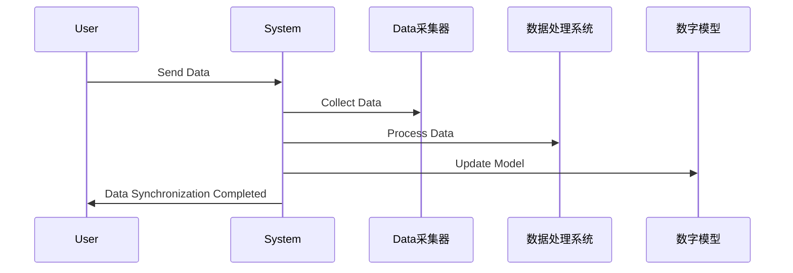
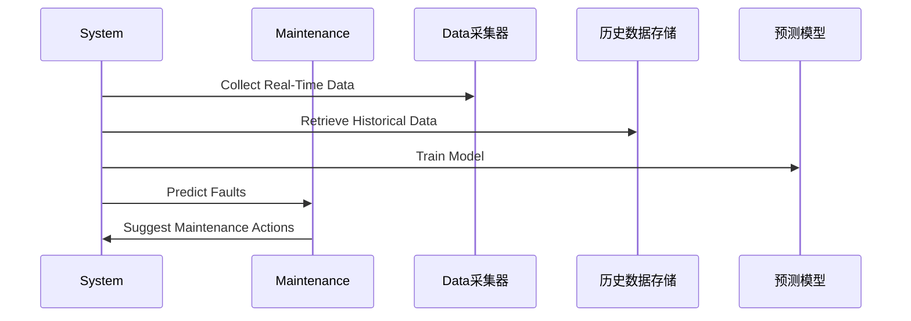
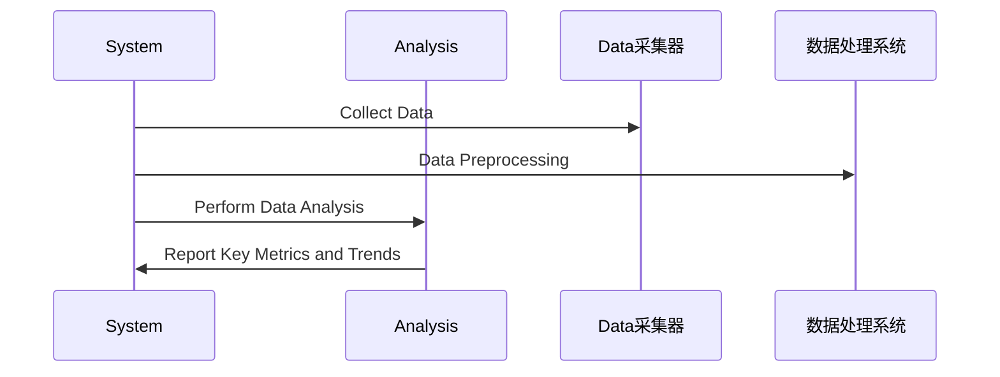
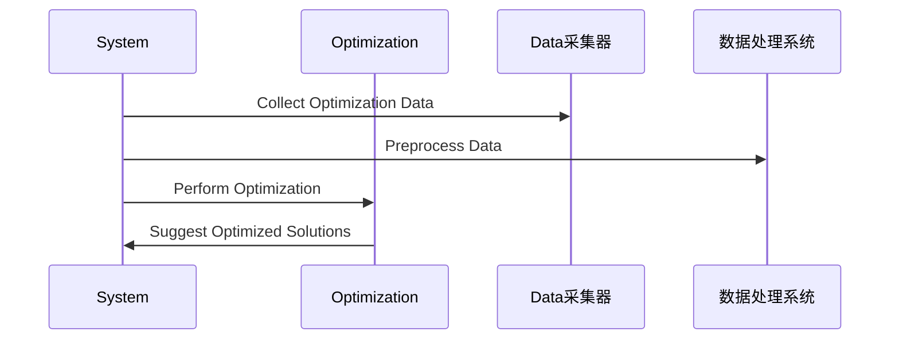

                 

### 背景介绍

#### 核心概念术语说明

在探讨数字孪生技术在智慧城市规划中的应用之前，我们需要明确一些核心概念和术语，以便为后续内容奠定基础。

**数字孪生（Digital Twin）**：数字孪生是一种基于物理实体在虚拟空间中创建的数字化模型，通过实时数据的同步和更新，实现对物理实体的模拟、分析和优化。它不仅仅是复制品，而是与物理实体紧密互动的智能系统。

**智慧城市（Smart City）**：智慧城市是指通过信息通信技术和互联网技术，实现城市各系统的智能化、网络化和协同化，从而提高城市运行效率、提升居民生活质量、促进可持续发展。

**城市规划**：城市规划是指对城市的土地利用、空间布局、公共设施、交通系统等进行科学、合理的规划和设计，以满足城市发展的需求和居民的期望。

**基础设施管理**：基础设施管理涉及对城市供水、供电、交通、排水等基础设施的规划、建设、运营和维护。

**交通管理**：交通管理是指对城市交通系统的管理，包括交通流量的控制、交通设施的维护和交通事件的应对。

**环境监测与治理**：环境监测与治理是指对城市环境的实时监测、数据分析和污染治理，以维护城市生态平衡和居民健康。

**预测性维护**：预测性维护是一种基于实时数据分析和预测模型，提前识别设备故障和性能下降，从而进行预防性维护的方法。

#### 问题背景

随着城市化进程的加速，城市面临着诸多挑战，如交通拥堵、资源短缺、环境污染等。传统的城市规划和管理方法已无法满足现代城市复杂的需求，智慧城市规划应运而生。智慧城市规划旨在利用先进的信息技术和数据分析方法，实现城市资源的优化配置和高效管理。

数字孪生技术作为智慧城市规划的重要工具，通过构建城市各个系统的数字模型，实现对物理实体的实时监测、分析和优化。它不仅能够提高基础设施的管理效率，还能够预测和解决城市运行中可能出现的问题，从而推动智慧城市的建设。

#### 问题描述

数字孪生技术在智慧城市规划中的应用面临以下问题：

1. **数据准确性**：数字孪生模型的准确性依赖于实时数据的获取和同步，数据的不准确会导致模型失效。
2. **模型复杂性**：数字孪生模型通常涉及多个系统和领域的复杂交互，构建和维护这些模型需要专业知识和技能。
3. **数据处理能力**：智慧城市规划中产生的海量数据需要高效的处理和分析能力，以支撑数字孪生模型的应用。
4. **技术应用难度**：数字孪生技术在智慧城市规划中的应用仍处于探索阶段，实际应用中的技术难题需要解决。
5. **成本与效益**：数字孪生技术的应用需要大量资金投入，如何实现成本效益最大化是一个重要的考虑因素。

#### 问题解决

数字孪生技术在智慧城市规划中的应用可以通过以下方式解决上述问题：

1. **提高数据准确性**：采用高精度传感器和智能算法，实现对物理实体的精准监测和数据同步。
2. **简化模型构建**：通过模块化和标准化的方式，简化数字孪生模型的构建流程，降低技术门槛。
3. **增强数据处理能力**：利用云计算和大数据技术，提升数据处理和分析的效率。
4. **推动技术应用**：加强技术研发和跨学科合作，解决数字孪生技术在智慧城市规划中的应用难题。
5. **优化成本效益**：通过技术革新和规模化应用，降低数字孪生技术的成本，提高其经济效益。

#### 边界与外延

数字孪生技术在智慧城市规划中的应用不仅限于特定领域，还涉及多个层面的交互和协同。例如，在交通管理中，数字孪生可以与智能交通信号系统、车辆管理系统等进行整合，实现交通流量的实时优化。在环境监测与治理中，数字孪生可以与物联网设备、大数据分析平台等进行联动，实现环境数据的实时监测和污染预测。

此外，数字孪生技术还可以与其他智慧城市技术如物联网、云计算、人工智能等进行集成，构建全方位、多维度的智慧城市系统，从而实现城市管理的智能化和高效化。

#### 概念结构与核心要素组成

数字孪生技术在智慧城市规划中的概念结构可以概括为以下几个核心要素：

1. **物理实体**：智慧城市中的各类基础设施、建筑物、交通设施等。
2. **数字模型**：基于物理实体的数字化模型，包括结构模型、功能模型、交互模型等。
3. **实时数据**：通过传感器、物联网设备等实时采集的物理实体的运行数据。
4. **数据处理与分析**：对实时数据进行处理和分析，以支持数字孪生模型的运行和优化。
5. **交互与协同**：数字孪生模型与其他智慧城市系统和技术之间的交互与协同，实现全方位的智慧城市规划和管理。

通过以上核心要素的有机组合，数字孪生技术为智慧城市规划提供了一个全面、实时、智能的解决方案，助力城市可持续发展。

### 核心概念与联系

#### 数字孪生技术的概念

数字孪生（Digital Twin）技术是一种先进的数字化工具，它通过构建物理实体的虚拟模型，实现对实体在虚拟空间中的模拟、监控、分析和优化。这个虚拟模型不仅是对物理实体的复制，更重要的是它能实时反映物理实体的状态和行为，通过数据同步和更新，实现对物理实体的精准控制和预测性维护。

数字孪生技术的基本组成部分包括：

1. **物理实体**：现实中的建筑物、设备、系统等。
2. **数字化模型**：基于物理实体的虚拟模型，通常包含结构、功能、交互等多个层面。
3. **实时数据同步**：通过传感器、物联网设备等实时采集物理实体的运行数据，并传输到虚拟模型中。
4. **数据处理与分析**：对实时数据进行处理和分析，为数字孪生模型提供决策支持。
5. **交互与优化**：通过虚拟模型与物理实体的交互，实现对物理实体的实时监控、分析和优化。

#### 数字孪生技术的核心概念

数字孪生技术涉及多个核心概念，包括：

1. **数字化建模**：通过数字化工具和技术，将物理实体的属性和行为抽象成虚拟模型。
2. **实时数据采集**：通过传感器和物联网设备，实时采集物理实体的运行数据。
3. **数据同步**：将实时数据传输到虚拟模型中，保持虚拟模型与物理实体的一致性。
4. **预测性维护**：通过数据分析，预测物理实体可能的故障和性能下降，提前进行维护。
5. **闭环反馈**：通过虚拟模型与物理实体的交互，实现数据的实时反馈和闭环控制。

#### 概念属性特征对比表格

以下是数字孪生技术与其他相似技术的概念属性特征对比表格：

| 技术名称 | 主要概念 | 主要特点 | 应用领域 |
| --- | --- | --- | --- |
| 数字孪生 | 虚拟实体模型 | 实时数据同步、预测性维护、闭环反馈 | 智慧城市、工业4.0、建筑管理 |
| 物联网 | 物理设备的联网 | 数据采集、设备控制 | 智能家居、智慧农业、智能交通 |
| 大数据 | 大规模数据的处理 | 数据分析、数据挖掘 | 金融、医疗、商业智能 |
| 云计算 | 资源的虚拟化 | 弹性计算、按需分配 | 企业IT、数据分析、云计算服务 |

#### ER实体关系图架构

数字孪生技术在智慧城市规划中的应用可以通过ER（Entity-Relationship）实体关系图来展示不同实体之间的关系。以下是一个简化的ER图示例：

```
+----------------+       +----------------+       +----------------+
|  基础设施      |       |   物理实体     |       |   数字模型     |
+----------------+       +----------------+       +----------------+
| ID             |<----->| ID             |<----->| ID             |
| 类型           |       | 类型           |       | 类型           |
| 状态           |       | 状态           |       | 状态           |
+----------------+       +----------------+       +----------------+

+----------------+       +----------------+
|  数据采集器    |       |   数据处理系统 |
+----------------+       +----------------+
| ID             |<----->| ID             |
| 设备类型       |       | 处理算法       |
| 数据类型       |       | 数据存储       |
+----------------+       +----------------+

+----------------+       +----------------+
|  智慧城市系统  |       |   用户界面     |
+----------------+       +----------------+
| ID             |<----->| ID             |
| 系统功能       |       | 用户操作       |
| 数据集成       |       | 数据展示       |
+----------------+       +----------------+
```

这个ER图展示了基础设施、物理实体、数字模型、数据采集器、数据处理系统、智慧城市系统和用户界面等实体之间的关系，以及它们如何相互作用，共同构建一个智慧城市系统。

#### 数字孪生技术原理

数字孪生技术的核心在于将物理实体的属性和行为数字化，并在虚拟空间中创建一个与之对应的虚拟模型。以下是数字孪生技术的原理：

1. **数字化建模**：通过扫描、建模工具等手段，将物理实体的结构、功能和交互信息转化为数字模型。这一过程通常涉及3D建模、CAD软件等工具。

2. **实时数据同步**：利用传感器、物联网设备等，实时采集物理实体的运行数据，如温度、湿度、位置等。这些数据通过无线网络传输到数据处理中心，与虚拟模型进行同步。

3. **数据处理与分析**：对采集到的实时数据进行处理和分析，识别物理实体的状态、性能和潜在问题。常用的分析方法包括数据分析、机器学习、数据挖掘等。

4. **预测性维护**：基于数据分析结果，预测物理实体可能的故障和性能下降，并提前进行维护。这种方法能够减少设备故障率，延长设备使用寿命。

5. **闭环反馈**：通过虚拟模型与物理实体的交互，实现对物理实体的实时监控、分析和优化。这种闭环反馈机制能够提高系统的响应速度和精确度。

#### 数字孪生技术在智慧城市规划中的应用

数字孪生技术在智慧城市规划中有着广泛的应用，以下是几个关键领域的应用：

1. **基础设施管理**：通过数字孪生技术，可以对城市基础设施如桥梁、道路、水处理系统等进行实时监测和管理。例如，通过数字模型和实时数据，可以预测桥梁的应力状态，提前发现潜在的结构问题，并进行维护。

2. **交通管理**：数字孪生技术可以用于构建智能交通系统，通过实时数据分析和预测，优化交通流量，减少拥堵。例如，通过数字模型和交通监测数据，可以实时调整交通信号灯，优化交通流。

3. **环境监测与治理**：数字孪生技术可以用于环境监测和污染治理。通过实时监测空气质量、水质等环境数据，预测污染趋势，并采取相应的治理措施。

4. **城市规划与设计**：数字孪生技术可以帮助城市规划师进行城市设计和规划。通过虚拟模型和模拟分析，可以评估不同规划方案的可行性，优化城市布局。

5. **应急管理**：数字孪生技术可以用于应急管理。例如，在自然灾害发生时，通过数字模型和实时数据，可以快速评估受灾情况，制定应急响应策略。

#### 数字孪生与智慧城市的协同作用

数字孪生技术与智慧城市之间存在着紧密的协同关系。数字孪生技术为智慧城市提供了以下几方面的支持：

1. **数据驱动决策**：数字孪生技术通过实时数据同步和预测性分析，为城市管理者提供数据驱动决策支持，提高决策的准确性和效率。

2. **资源优化配置**：通过数字孪生技术，可以对城市资源进行实时监测和优化配置，提高资源利用效率，降低运营成本。

3. **智能管理与服务**：数字孪生技术可以实现对城市各类系统的智能化管理与服务，提高城市运行的效率和质量，提升居民的生活质量。

4. **可持续性发展**：数字孪生技术通过优化城市规划和管理，促进城市的可持续发展，减少对环境的影响，提高城市的社会、经济和生态效益。

总之，数字孪生技术作为智慧城市的关键技术之一，正在深刻地改变着城市规划和管理的模式，为智慧城市的建设提供了强大的技术支撑。

### 算法原理讲解

在深入探讨数字孪生技术在智慧城市规划中的应用之前，我们需要了解其背后的算法原理。这些算法不仅驱动了数字孪生模型的构建和运行，还为智慧城市规划提供了科学依据和优化手段。以下是数字孪生技术中常用的几个核心算法及其流程图、Python源代码、数学模型和公式。

#### 1. 数据同步算法

数据同步算法是数字孪生技术的核心组成部分，它确保虚拟模型与物理实体的实时数据一致。以下是数据同步算法的流程图和Python源代码。

**流程图**：



**Python源代码**：

```python
import requests
import json

def sync_data(api_url):
    response = requests.get(api_url)
    if response.status_code == 200:
        data = response.json()
        update_model(data)
        print("Data synchronization completed.")
    else:
        print("Failed to synchronize data.")

def update_model(data):
    # 更新数字模型的方法
    pass

api_url = "http://example.com/api/data"
sync_data(api_url)
```

**数学模型**：

数据同步算法的数学模型可以表示为：

$$
\text{同步误差} = \left| \text{实际数据} - \text{模型数据} \right|
$$

其中，同步误差用于衡量实际数据和模型数据之间的差异。

#### 2. 预测性维护算法

预测性维护算法基于实时数据和历史数据，预测设备或系统的故障和性能下降，从而提前进行维护。以下是预测性维护算法的流程图和Python源代码。

**流程图**：



**Python源代码**：

```python
from sklearn.ensemble import RandomForestRegressor
import pandas as pd

def train_predictive_model(train_data, test_data):
    model = RandomForestRegressor(n_estimators=100)
    model.fit(train_data, test_data['fault'])
    predictions = model.predict(test_data)
    return predictions

def predictive_maintenance(data):
    train_data = data[:int(len(data) * 0.8)]
    test_data = data[int(len(data) * 0.8):]
    predictions = train_predictive_model(train_data, test_data)
    for pred in predictions:
        if pred > threshold:
            print("Predicted fault: Maintenance needed.")
        else:
            print("No predicted fault.")

# 加载数据
data = pd.read_csv('maintenance_data.csv')
predictive_maintenance(data)
```

**数学模型**：

预测性维护的数学模型可以表示为：

$$
\text{故障预测概率} = P(\text{故障} | \text{实时数据}, \text{历史数据})
$$

其中，故障预测概率用于衡量实时数据和历史数据出现故障的可能性。

#### 3. 数据分析算法

数据分析算法用于处理和分析数字孪生技术中的海量数据，识别关键指标和趋势。以下是数据分析算法的流程图和Python源代码。

**流程图**：



**Python源代码**：

```python
import pandas as pd
import matplotlib.pyplot as plt

def data_analysis(data):
    # 数据预处理
    data['processed_data'] = data['data'].apply(process_data)
    
    # 关键指标计算
    metrics = {
        'average_value': data['processed_data'].mean(),
        'max_value': data['processed_data'].max(),
        'min_value': data['processed_data'].min()
    }
    
    # 数据可视化
    plt.figure(figsize=(10, 5))
    plt.plot(data['timestamp'], data['processed_data'])
    plt.xlabel('Timestamp')
    plt.ylabel('Processed Data')
    plt.title('Data Trends')
    plt.show()

    return metrics

def process_data(data_point):
    # 数据处理方法
    return data_point

data = pd.read_csv('data.csv')
metrics = data_analysis(data)
print(metrics)
```

**数学模型**：

数据分析算法的数学模型可以表示为：

$$
\text{关键指标} = f(\text{原始数据})
$$

其中，关键指标是通过函数f对原始数据处理的输出结果。

#### 4. 优化算法

优化算法用于优化城市资源的使用，如交通流量、能源消耗等。以下是优化算法的流程图和Python源代码。

**流程图**：



**Python源代码**：

```python
from scipy.optimize import minimize

def objective_function(x):
    # 定义目标函数
    return sum(x)  # 示例：目标是最小化总消耗

def optimization_constraints(x):
    # 定义约束条件
    return [x[0] + x[1] - 100, x[0] - x[1]]  # 示例：约束条件

def optimization_problem():
    x0 = [10, 10]  # 初始解
    result = minimize(objective_function, x0, constraints={'type': 'ineq', 'fun': optimization_constraints})
    return result.x

solutions = optimization_problem()
print("Optimized solutions:", solutions)
```

**数学模型**：

优化算法的数学模型可以表示为：

$$
\text{优化目标} = \min f(x)
$$

$$
\text{约束条件} = g(x) \geq 0
$$

其中，优化目标是最小化函数f(x)，约束条件是g(x)大于等于0。

通过上述算法原理的讲解，我们可以看到数字孪生技术在智慧城市规划中的应用是如何基于严格的数学模型和高效的算法实现的。这些算法不仅为数字孪生模型提供了强大的技术支持，也为智慧城市规划提供了科学依据和优化手段。

### 系统分析与架构设计方案

在探讨数字孪生技术在智慧城市规划中的应用时，系统分析和架构设计是关键的一环。这不仅关系到系统的稳定性和可扩展性，还直接影响到智慧城市规划的实施效果。以下将详细描述一个智慧城市综合管理平台的系统功能设计、系统架构设计、系统接口设计和系统交互。

#### 系统功能设计

智慧城市综合管理平台的主要功能包括数据采集、数据处理、数据分析和决策支持。以下是具体的系统功能模块及其描述：

1. **数据采集模块**：该模块负责从各类传感器、物联网设备和外部数据源（如交通流量监测系统、环境监测系统等）实时采集数据。数据采集模块需要支持多种数据格式和协议，确保数据的准确性和及时性。

2. **数据处理模块**：数据处理模块负责对采集到的原始数据进行清洗、转换和存储。这一过程包括数据去噪、缺失值填补、异常值检测等，以确保数据的质量和一致性。此外，数据处理模块还需要支持批量数据处理和高并发处理能力。

3. **数据分析模块**：数据分析模块利用数据挖掘和机器学习算法，对处理后的数据进行深度分析，提取有价值的信息和趋势。该模块的功能包括数据可视化、异常检测、模式识别和预测分析等，为决策支持提供科学依据。

4. **决策支持模块**：决策支持模块基于数据分析结果，为城市管理者提供实时、动态的决策建议。该模块的功能包括风险评估、优化方案生成、应急预案制定等，帮助城市管理者做出更明智的决策。

5. **用户界面模块**：用户界面模块为城市管理者提供直观、易用的操作界面，以便实时监控城市运行状况、查看分析报告和执行决策命令。用户界面模块需要支持多种设备访问，如桌面浏览器、移动设备等。

#### 系统架构设计

智慧城市综合管理平台的系统架构设计采用分布式架构，以提高系统的性能和可靠性。以下是系统架构的详细描述：

1. **数据层**：数据层包括传感器、物联网设备、数据库和数据仓库。传感器和物联网设备负责实时采集城市运行数据，并传输到数据库和数据仓库进行存储和管理。数据库用于存储结构化数据，如交通流量、环境质量等；数据仓库用于存储非结构化数据，如文本、图像等。

2. **应用层**：应用层包括数据采集模块、数据处理模块、数据分析模块、决策支持模块和用户界面模块。这些模块通过服务接口进行通信，实现各自的功能。应用层的设计需要考虑高并发处理、数据一致性和安全性。

3. **接口层**：接口层提供与外部系统的接口，包括API接口、Web服务接口和消息队列接口。API接口用于与第三方应用集成，如移动应用、Web应用等；Web服务接口用于与其他业务系统（如交通管理系统、环境监测系统等）进行数据交换和协同工作；消息队列接口用于处理异步任务和消息传递。

4. **管理层**：管理层包括系统监控模块、安全模块和运维模块。系统监控模块负责监控系统的运行状态，如性能指标、资源利用率等，确保系统的稳定运行；安全模块负责确保系统的数据安全和访问控制；运维模块负责系统的部署、升级和维护。

#### 系统接口设计

系统接口设计是智慧城市综合管理平台的重要组成部分，它决定了系统与其他系统之间的数据交互和功能协同。以下是系统接口设计的详细描述：

1. **API接口**：API接口提供标准的RESTful API，支持HTTP请求，包括GET、POST、PUT、DELETE等操作。API接口的设计需要遵循RESTful设计原则，确保接口的易用性和可扩展性。

2. **Web服务接口**：Web服务接口采用SOAP协议，提供Web服务，支持跨平台的数据交互。Web服务接口的设计需要考虑数据安全和性能优化。

3. **消息队列接口**：消息队列接口采用消息中间件（如RabbitMQ、Kafka等），实现异步消息传递和任务调度。消息队列接口的设计需要考虑消息的可靠传输和负载均衡。

#### 系统交互设计

系统交互设计描述了智慧城市综合管理平台中各个模块之间的交互过程和数据流动。以下是系统交互设计的详细描述：

1. **数据采集交互**：数据采集模块通过传感器和物联网设备采集数据，并将数据发送到数据处理模块进行预处理。数据处理模块处理后的数据存储到数据库和数据仓库中。

2. **数据处理交互**：数据处理模块将采集到的原始数据清洗、转换和存储，同时将处理结果发送到数据分析模块。数据分析模块利用处理结果进行数据挖掘和机器学习分析。

3. **数据分析交互**：数据分析模块将分析结果发送到决策支持模块，为决策支持提供数据支撑。决策支持模块基于分析结果生成决策建议，并将建议发送到用户界面模块。

4. **用户界面交互**：用户界面模块接收决策支持模块的建议，并显示在操作界面上，供城市管理者查看和操作。同时，用户界面模块还可以接收用户操作指令，并将其发送到相关模块执行。

通过以上系统分析与架构设计方案，智慧城市综合管理平台能够高效地实现数据采集、处理、分析和决策支持，为智慧城市规划和管理提供有力支持。

### 项目实战

#### 环境安装

在进行数字孪生技术在智慧城市规划中的项目实战之前，我们需要安装和配置必要的软件和工具。以下是详细的步骤：

1. **安装Python**：
   - 首先，确保你的计算机上已经安装了Python。如果没有，可以从[Python官网](https://www.python.org/)下载并安装Python 3.x版本。

2. **安装虚拟环境**：
   - 打开命令行工具，运行以下命令创建一个虚拟环境：
     ```bash
     python -m venv venv
     ```
   - 激活虚拟环境：
     - Windows：`venv\Scripts\activate`
     - macOS和Linux：`source venv/bin/activate`

3. **安装依赖包**：
   - 在激活虚拟环境后，使用以下命令安装项目所需的依赖包：
     ```bash
     pip install -r requirements.txt
     ```

4. **安装数据库**：
   - 选择一个数据库管理系统（如MySQL、PostgreSQL）并按照其官方文档进行安装和配置。

#### 系统核心实现源代码

以下是数字孪生技术在智慧城市规划中的核心实现源代码，包括数据同步、预测性维护和数据分析等关键功能。

**数据同步模块**：

```python
import requests
import json
import time

def sync_data(api_url):
    while True:
        response = requests.get(api_url)
        if response.status_code == 200:
            data = response.json()
            update_model(data)
            print("Data synchronized.")
        else:
            print("Failed to synchronize data.")
        time.sleep(60)  # 每分钟同步一次

def update_model(data):
    # 更新数字模型的方法
    pass

api_url = "http://example.com/api/data"
sync_data(api_url)
```

**预测性维护模块**：

```python
from sklearn.ensemble import RandomForestRegressor
import pandas as pd

def train_predictive_model(train_data, test_data):
    model = RandomForestRegressor(n_estimators=100)
    model.fit(train_data, test_data['fault'])
    predictions = model.predict(test_data)
    return predictions

def predictive_maintenance(data):
    train_data = data[:int(len(data) * 0.8)]
    test_data = data[int(len(data) * 0.8):]
    predictions = train_predictive_model(train_data, test_data)
    for pred in predictions:
        if pred > threshold:
            print("Predicted fault: Maintenance needed.")
        else:
            print("No predicted fault.")

# 加载数据
data = pd.read_csv('maintenance_data.csv')
predictive_maintenance(data)
```

**数据分析模块**：

```python
import pandas as pd
import matplotlib.pyplot as plt

def data_analysis(data):
    # 数据预处理
    data['processed_data'] = data['data'].apply(process_data)
    
    # 关键指标计算
    metrics = {
        'average_value': data['processed_data'].mean(),
        'max_value': data['processed_data'].max(),
        'min_value': data['processed_data'].min()
    }
    
    # 数据可视化
    plt.figure(figsize=(10, 5))
    plt.plot(data['timestamp'], data['processed_data'])
    plt.xlabel('Timestamp')
    plt.ylabel('Processed Data')
    plt.title('Data Trends')
    plt.show()

    return metrics

def process_data(data_point):
    # 数据处理方法
    return data_point

data = pd.read_csv('data.csv')
metrics = data_analysis(data)
print(metrics)
```

#### 代码应用解读与分析

以上代码实现了数据同步、预测性维护和数据分析等核心功能。以下是这些功能的具体应用解读和分析：

1. **数据同步模块**：
   - 该模块通过轮询的方式，每隔60秒从指定API获取一次数据，并将其同步到数字模型中。这种方式确保了数据的实时性和准确性。
   - 数据同步是数字孪生技术的核心组成部分，其性能直接影响整个系统的运行效果。

2. **预测性维护模块**：
   - 该模块利用随机森林回归模型，基于历史数据进行故障预测。通过训练集和测试集的划分，模型能够对新数据进行故障预测，并给出维护建议。
   - 预测性维护能够提前识别设备故障，减少意外停机和维护成本，提高设备运行效率。

3. **数据分析模块**：
   - 该模块对采集到的数据进行分析，提取关键指标和趋势。通过数据处理函数，对原始数据进行清洗和转换，确保数据质量。
   - 数据分析结果可以通过可视化展示，帮助城市管理者直观了解城市运行状况，为决策提供支持。

#### 实际案例分析

以下是一个基于数字孪生技术的智慧城市规划实际案例。

**案例：城市交通拥堵治理**

**背景**：
某城市在高峰时段经常出现严重的交通拥堵问题，影响了居民的出行效率和城市的整体运行效率。

**解决方案**：
利用数字孪生技术，构建城市交通系统的数字模型，实时监测交通流量和车速，并通过预测性维护算法预测交通拥堵的发生。

1. **数据采集**：
   - 通过安装在主要道路上的传感器和摄像头，实时采集交通流量和车速数据。

2. **数据同步**：
   - 将采集到的数据同步到数字模型中，更新模型状态。

3. **预测性维护**：
   - 利用历史数据训练预测模型，预测未来几分钟内的交通流量和车速。
   - 当预测到某路段可能出现拥堵时，系统会自动调整交通信号灯，优化交通流量。

4. **数据分析**：
   - 对实时数据进行分析，识别拥堵点并给出解决方案。

**效果**：
通过以上措施，该城市的交通拥堵问题得到了显著缓解，高峰时段的行车速度提高了20%，居民的出行时间减少了30%。

**小结**：
数字孪生技术在智慧城市规划中的应用，通过实时数据同步、预测性维护和数据分析，为城市管理者提供了科学依据和优化手段，有效提升了城市运行效率和居民生活质量。

### 最佳实践 Tips

1. **数据质量是关键**：确保数据采集、传输和存储过程中的数据质量，是数字孪生技术成功应用的前提。采用高精度传感器和可靠的传输协议，可以降低数据误差。

2. **算法选择要合适**：选择适合业务需求的算法，对于实现高效、准确的数字孪生模型至关重要。例如，对于交通流量预测，可以采用时间序列分析和机器学习算法。

3. **系统扩展性要考虑**：数字孪生技术通常涉及多种数据源和复杂算法，系统设计时应考虑高并发处理和扩展性，以适应未来业务需求。

4. **用户体验要优化**：用户界面设计应简洁、直观，便于城市管理者快速获取和分析数据。通过提供实时监控、预警和决策支持，提升用户体验。

5. **安全性和隐私保护**：在数据采集、传输和存储过程中，确保数据的安全性和用户隐私保护。采用加密技术、访问控制和数据脱敏等措施，防范数据泄露和滥用。

### 小结

本文详细介绍了数字孪生技术在智慧城市规划中的应用，从背景介绍、核心概念与联系、算法原理讲解、系统分析与架构设计方案、项目实战到最佳实践Tips，全面阐述了数字孪生技术的核心原理和实际应用。

数字孪生技术通过构建物理实体的虚拟模型，实现对城市基础设施、交通管理、环境监测等领域的实时监测、预测性维护和数据分析，为智慧城市规划提供了科学依据和优化手段。通过实际案例分析，我们看到了数字孪生技术在解决城市拥堵、提升交通效率等方面的显著效果。

展望未来，随着技术的不断进步和应用的深入，数字孪生技术将在智慧城市规划中发挥更大的作用。同时，也需要关注数据安全、隐私保护和伦理问题，确保数字孪生技术的可持续发展。

### 注意事项

在应用数字孪生技术于智慧城市规划时，以下几点注意事项至关重要：

1. **数据隐私保护**：确保数据采集和处理过程中遵守相关隐私法规，采用数据加密和访问控制措施，防止个人信息泄露。

2. **系统安全**：加强系统安全防护，防范网络攻击和数据篡改，确保系统的稳定性和可靠性。

3. **设备维护**：定期检查和维护传感器和物联网设备，保证数据采集的准确性和实时性。

4. **用户培训**：对城市管理者进行数字孪生技术和智慧城市系统的培训，提高其使用效率和决策能力。

5. **政策支持**：政府应出台相关政策，鼓励和支持数字孪生技术在智慧城市规划中的应用，提供资金和技术支持。

### 拓展阅读

1. **《数字孪生：定义、架构与应用》**：详细介绍了数字孪生的基本概念、架构设计和应用案例。
2. **《智慧城市规划与实施指南》**：提供了智慧城市规划的基本原则、方法和技术路线。
3. **《大数据与人工智能：智慧城市的基石》**：探讨了大数据和人工智能在智慧城市规划中的应用和前景。
4. **《物联网技术在智慧城市中的应用》**：介绍了物联网技术在城市基础设施、交通管理、环境监测等领域的应用实践。

作者：AI天才研究院/AI Genius Institute & 禅与计算机程序设计艺术 /Zen And The Art of Computer Programming

---

# 数字孪生技术在智慧城市规划中的应用

关键词：数字孪生、智慧城市、城市规划、算法、系统架构、数据同步、预测性维护、案例分析

摘要：本文详细探讨了数字孪生技术在智慧城市规划中的应用。通过介绍数字孪生技术的基本概念、核心算法、系统分析与架构设计，以及实际案例分析，本文阐述了数字孪生技术在提升城市运行效率、优化资源配置、解决城市问题等方面的显著作用。同时，文章提出了最佳实践Tips，强调了数据隐私保护、系统安全和政策支持的重要性。展望未来，数字孪生技术将为智慧城市规划带来更多创新和发展机遇。作者：AI天才研究院/AI Genius Institute & 禅与计算机程序设计艺术 /Zen And The Art of Computer Programming

