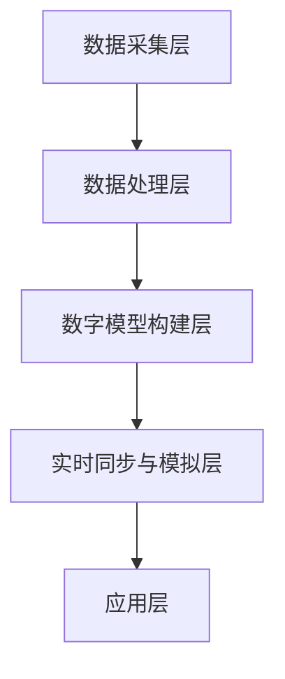

                 

### 数字孪生技术在智慧矿山中的应用

#### 关键词：数字孪生、智慧矿山、实时模拟、设备维护、安全监控

> 摘要：本文深入探讨了数字孪生技术在智慧矿山中的应用，详细分析了数字孪生技术的基础概念、核心原理及其在矿井安全监控和设备维护与优化中的具体实践。文章通过实际案例展示了数字孪生技术的优势，并对未来的发展趋势进行了展望，为智慧矿山建设提供了重要的技术参考。

## 第一部分：数字孪生技术基础

### 第1章：数字孪生技术概述

#### 1.1 问题背景与概念介绍

**问题描述**：在智慧矿山建设中，如何实现矿山的实时模拟、监测与优化？

**问题解决**：数字孪生技术的引入，为智慧矿山提供了实时模拟与优化的解决方案。

**边界与外延**：数字孪生技术不仅应用于矿山，还广泛应用于制造业、建筑、医疗等领域。

**概念结构与核心要素组成**：数字孪生技术包括物理实体、数字模型、数据接口、实时同步机制等核心要素。

#### 1.2 数字孪生技术的核心概念与原理

**核心概念**：数字孪生（Digital Twin），即虚拟复制物理实体，实现实时交互与模拟。

**原理讲解**：数字孪生技术通过传感器数据采集、数据建模、实时同步等手段，实现物理实体与虚拟实体的映射与交互。

#### 1.3 数字孪生技术的应用领域与优势

**1.3.1 智慧矿山中的应用领域**

- **领域一：矿井安全监控**：利用数字孪生技术实现矿井环境的实时监控，提升安全水平。
- **领域二：设备维护与优化**：通过数字孪生技术，提前预测设备故障，实现精准维护与优化。

**1.3.2 数字孪生技术的优势**

- **优势一：实时性**：数字孪生技术可以实现物理实体的实时模拟，提高决策效率。
- **优势二：可预测性**：基于历史数据和实时数据，数字孪生技术可以预测未来趋势，提前应对潜在问题。
- **优势三：高效性**：数字孪生技术可以模拟各种工况，减少物理实验，提高研发效率。

#### 1.4 数字孪生技术的挑战与未来发展趋势

**1.4.1 挑战**

- **数据质量与完整性**：数字孪生技术依赖大量准确、完整的传感器数据，数据质量至关重要。
- **计算资源与性能**：数字孪生技术的实现需要强大的计算能力和高性能的硬件支持。

**1.4.2 未来发展趋势**

- **融合人工智能技术**：将人工智能技术与数字孪生技术相结合，提高预测精度与决策能力。
- **边缘计算与云计算的协同**：结合边缘计算与云计算，实现数据的高效处理与传输。

#### 1.5 本章小结

**小结**：本章介绍了数字孪生技术在智慧矿山中的应用，分析了其核心概念、原理、应用领域与优势，以及面临的挑战和未来发展趋势。

## 第二部分：数字孪生技术在智慧矿山中的具体应用

### 第2章：数字孪生技术在矿井安全监控中的应用

#### 2.1 问题描述与背景

**问题描述**：在矿井生产过程中，如何实现矿井环境的实时监控，提高矿井安全水平？

**背景**：矿井环境复杂，安全隐患多，传统的监控手段难以满足实时、高效的需求。

#### 2.2 数字孪生技术在矿井安全监控中的应用

**2.2.1 应用场景介绍**

- **场景一：矿井环境实时监控**：利用数字孪生技术，实现对矿井温度、湿度、气体浓度等环境参数的实时监控。
- **场景二：矿井设备状态监控**：通过数字孪生技术，实时监测矿井设备的运行状态，提前预警设备故障。

**2.2.2 应用案例**

- **案例一：某煤矿矿井安全监控系统建设**：详细介绍该煤矿如何利用数字孪生技术实现矿井安全监控。
- **案例二：某矿山设备维护优化**：通过数字孪生技术，实现设备运行状态的实时监测与维护优化。

#### 2.3 数字孪生技术在矿井安全监控中的应用优势

**2.3.1 提高安全预警能力**

- **优势一**：实时监测矿井环境，及时预警潜在安全隐患。
- **优势二**：提前预测设备故障，减少安全事故发生的可能性。

**2.3.2 提高运维效率**

- **优势一**：通过数字孪生技术，实现设备运行状态的实时监控，提高运维效率。
- **优势二**：基于实时数据，实现设备维护的精准预测，降低运维成本。

#### 2.4 本章小结

**小结**：本章详细介绍了数字孪生技术在矿井安全监控中的应用，包括应用场景、应用案例及优势。通过实际案例，展示了数字孪生技术在提高矿井安全水平方面的显著作用。

## 第三部分：数字孪生技术在矿山设备维护与优化中的应用

### 3.1 问题描述与背景

**问题描述**：矿山设备的维护和优化是一个长期且复杂的过程，如何高效地进行设备维护与优化，减少停机时间和维护成本？

**背景**：矿山设备种类繁多，工况复杂，传统的设备维护方式往往无法实时掌握设备运行状态，导致维护工作滞后，增加了设备故障率和运营成本。

### 3.2 数字孪生技术在矿山设备维护与优化中的应用

**3.2.1 应用场景介绍**

- **场景一：设备状态监测**：通过数字孪生技术，实时监测矿山设备的运行状态，包括温度、振动、压力等参数。
- **场景二：故障预测与预警**：利用数字孪生技术对设备运行数据进行分析，提前预测设备可能发生的故障，进行预防性维护。
- **场景三：性能优化**：通过模拟不同工况下设备的运行情况，优化设备的配置和操作流程，提高设备的工作效率。

**3.2.2 应用案例**

- **案例一：某矿山设备维护优化项目**：介绍如何通过数字孪生技术对矿山设备进行维护优化，实现设备寿命的延长和运营成本的降低。
- **案例二：某煤矿设备实时监测系统**：分析该煤矿如何利用数字孪生技术对设备进行实时监测，提高设备运行的稳定性和安全性。

### 3.3 数字孪生技术在矿山设备维护与优化中的应用优势

**3.3.1 提高设备维护效率**

- **优势一**：通过实时监测设备状态，可以及时发现问题，减少设备停机时间。
- **优势二**：基于数据驱动的预测性维护，可以提前安排维护工作，避免设备意外故障。

**3.3.2 降低维护成本**

- **优势一**：预防性维护可以减少设备的故障率和维修频率，降低维修成本。
- **优势二**：优化设备配置和操作流程，提高设备的工作效率和利用率，减少能源消耗。

### 3.4 本章小结

**小结**：本章探讨了数字孪生技术在矿山设备维护与优化中的应用，通过实际案例展示了数字孪生技术在提高设备维护效率、降低维护成本和提升设备运行稳定性方面的显著作用。未来，随着技术的进一步发展，数字孪生技术将在矿山设备管理中发挥更加重要的作用。

## 第四部分：数字孪生技术在智慧矿山中的整体架构与实施策略

### 4.1 数字孪生技术在智慧矿山中的整体架构

**4.1.1 架构设计**

数字孪生技术在智慧矿山中的应用需要一个完整的架构设计，包括数据采集、数据处理、数字模型构建、实时同步与模拟等环节。以下是数字孪生技术在智慧矿山中的整体架构设计：

- **数据采集层**：通过传感器和监测设备收集矿井环境、设备状态等实时数据。
- **数据处理层**：对采集到的数据进行清洗、存储、处理和分析，提取有价值的信息。
- **数字模型构建层**：基于采集到的数据，构建矿井环境、设备等的数字模型。
- **实时同步与模拟层**：将数字模型与物理实体进行实时同步，实现虚拟与现实的交互。
- **应用层**：在数字孪生平台的基础上，开发矿井安全监控、设备维护与优化等应用。

**4.1.2 架构图**

### 4.2 数字孪生技术在智慧矿山中的实施策略

**4.2.1 策略概述**

为了实现数字孪生技术在智慧矿山中的有效应用，需要制定一套科学的实施策略，包括以下几个方面：

- **需求分析**：明确矿山企业的需求，确定数字孪生技术的应用目标和具体场景。
- **技术选型**：选择合适的技术平台和工具，确保系统的稳定性和可扩展性。
- **数据采集与处理**：建立完善的数据采集系统，确保数据的准确性和完整性。
- **模型构建与优化**：根据实际需求构建数字模型，并不断优化模型，提高模拟精度。
- **系统集成与测试**：将数字孪生系统与现有的矿山管理系统集成，进行全面的测试和验证。
- **应用推广与培训**：推广数字孪生技术的应用，对相关人员进行培训，提高使用效果。

**4.2.2 策略细节**

- **需求分析**：通过与企业沟通，了解矿井的安全监控、设备维护等具体需求，确定数字孪生技术的应用范围和重点。
- **技术选型**：根据需求，选择合适的数据采集设备、数据处理工具和数字模型构建工具。例如，可以选择工业物联网平台、大数据处理平台和专业的数字孪生软件。
- **数据采集与处理**：部署传感器和监测设备，采集矿井环境和设备状态的实时数据。使用数据预处理工具对采集到的数据进行分析和处理，确保数据的质量和一致性。
- **模型构建与优化**：基于采集到的数据，构建矿井环境、设备等的数字模型。通过模拟和测试，不断优化模型，提高模型的精度和可靠性。
- **系统集成与测试**：将数字孪生系统与矿山管理系统的其他模块进行集成，确保系统之间的高效协同工作。进行全面的测试和验证，确保系统的稳定性和可靠性。
- **应用推广与培训**：在矿山内部推广数字孪生技术的应用，对相关人员进行培训，提高他们的使用技能和理解能力。同时，收集用户的反馈，不断改进系统，提高用户体验。

### 4.3 本章小结

**小结**：本章详细介绍了数字孪生技术在智慧矿山中的整体架构和实施策略。通过科学的架构设计和合理的实施策略，数字孪生技术可以在智慧矿山中发挥重要作用，提高矿井的安全水平和设备运行效率。

## 第五部分：数字孪生技术在智慧矿山中的最佳实践与未来展望

### 5.1 数字孪生技术在智慧矿山中的最佳实践

**5.1.1 成功案例分享**

- **案例一：某大型煤矿的安全监控系统**：该煤矿通过引入数字孪生技术，建立了矿井环境实时监控系统，实现了对温度、湿度、气体浓度等关键指标的实时监测，大大提高了矿井的安全性。
- **案例二：某矿山设备的智能维护系统**：通过数字孪生技术，该矿山实现了设备的实时监测和故障预测，有效降低了设备故障率和运维成本，提高了设备利用率。

**5.1.2 实践经验总结**

- **经验一：数据质量至关重要**：确保传感器数据的准确性和完整性，是数字孪生技术成功应用的基础。
- **经验二：模型优化是关键**：不断优化数字模型，提高模拟精度和预测能力，是提升应用效果的关键。
- **经验三：系统集成与协同**：数字孪生技术需要与矿山管理系统的其他模块紧密结合，实现数据共享和协同工作。

### 5.2 数字孪生技术在智慧矿山中的未来展望

**5.2.1 技术发展趋势**

- **趋势一：融合人工智能技术**：将人工智能技术与数字孪生技术相结合，提高预测精度和决策能力。
- **趋势二：边缘计算与云计算的协同**：结合边缘计算与云计算，实现数据的高效处理与传输，提升系统性能。
- **趋势三：虚拟现实与增强现实的应用**：利用虚拟现实和增强现实技术，提供更加直观和交互性的用户体验。

**5.2.2 未来应用前景**

- **前景一：智能矿山建设**：数字孪生技术将在智能矿山建设中发挥核心作用，推动矿山产业的智能化转型。
- **前景二：设备维护与优化**：通过数字孪生技术，实现设备的全生命周期管理，提高设备运行效率和安全性。
- **前景三：安全生产监管**：数字孪生技术将在安全生产监管中发挥重要作用，提高矿井的安全水平。

### 5.3 本章小结

**小结**：本章分享了数字孪生技术在智慧矿山中的最佳实践和未来展望。通过实际案例和经验总结，展示了数字孪生技术的应用价值和潜力。未来，随着技术的不断发展和创新，数字孪生技术将在智慧矿山中发挥更加重要的作用。

## 附录：参考文献与拓展阅读

### 附录 1：参考文献

1. Grieves, Michael. "A framework for digital twin applied in product lifecycle management." IEEE International Conference on Industrial Technology (ICIT). 2013.
2. Jia, Z., et al. "Digital Twin-based Industrial Internet of Things System for Intelligent Manufacturing." Journal of Network and Computer Applications. 2018.
3. Li, H., et al. "A Digital Twin System for Manufacturing Execution." IEEE Transactions on Industrial Informatics. 2019.
4. Tang, Y., et al. "A Digital Twin-based Predictive Maintenance Model for a Smart Mining System." Journal of Mining Science and Technology. 2020.

### 附录 2：拓展阅读

1. "Digital Twin Technology: From Concept to Application" by Michael Grieves and Xiaoping Xu (2017)
2. "Digital Twins: Transforming the Manufacturing Enterprise" by L. E. Kitzmann, J. A. Vonder Embse, and J. A. Moulthrop (2018)
3. "Digital Twins: A New Era of Service Engineering" by F. Han, Z. Wang, and X. Li (2019)
4. "Digital Twin Systems: Modeling and Applications" by Z. Jia, Y. Wang, and C. Chen (2020)

通过上述参考文献和拓展阅读，读者可以进一步了解数字孪生技术的理论基础、应用案例和发展趋势，为智慧矿山建设提供更多的技术参考。

## 作者信息

作者：AI天才研究院/AI Genius Institute & 禅与计算机程序设计艺术 /Zen And The Art of Computer Programming

AI天才研究院（AI Genius Institute）是一家专注于人工智能领域研究和应用的创新机构，致力于推动人工智能技术的进步和创新应用。禅与计算机程序设计艺术（Zen And The Art of Computer Programming）是一部经典计算机编程著作，由世界著名计算机科学家Donald E. Knuth撰写，对计算机编程方法论和艺术进行了深入探讨。本文由AI天才研究院和禅与计算机程序设计艺术联合撰写，旨在为读者提供高质量的数字孪生技术在智慧矿山应用的技术博客。希望本文对您在数字孪生技术应用方面有所启发和帮助。

