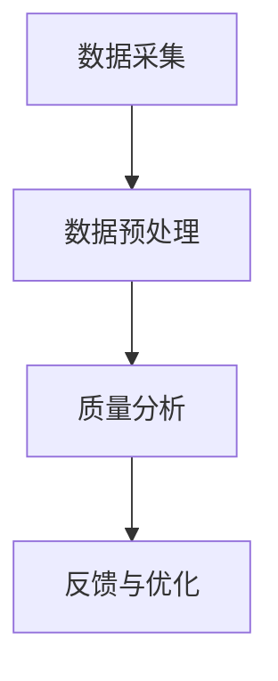

                 


# 数字孪生技术在智能制造质量控制中的应用

## 关键词

- 数字孪生技术
- 智能制造
- 质量控制
- 数据采集
- 算法分析
- 模型构建
- 深度学习
- 工业互联网

## 摘要

随着智能制造的快速发展，质量控制成为制造业面临的重大挑战。数字孪生技术作为一种新兴技术，其在智能制造质量控制中的应用逐渐受到关注。本文首先介绍了数字孪生技术的基本概念和核心原理，然后探讨了数字孪生技术在智能制造质量控制中的应用机制，并通过实际案例分析了其应用效果。最后，本文总结了数字孪生技术在智能制造质量控制中的优势与挑战，提出了未来发展的方向。

## 引言

### 1.1 问题背景

在传统制造业中，质量控制主要依赖于人工检测和现场监测，这种方式存在检测效率低、精度不高等问题。随着智能制造的兴起，如何实现高效、精准的质量控制成为制造业的关键挑战。智能制造需要通过自动化、数字化手段对生产过程进行全面监控和优化，以提高产品质量和生产效率。

### 1.2 数字孪生技术的崛起

数字孪生技术（Digital Twin Technology）是一种基于物联网、大数据、云计算等技术的先进制造技术。它通过构建物理实体和虚拟模型的映射关系，实现对物理实体的实时监测、分析和优化。数字孪生技术在智能制造中的应用，为解决质量控制问题提供了新的思路和方法。

### 1.3 本书的研究目标和结构

本书旨在探讨数字孪生技术在智能制造质量控制中的应用，分析其核心原理、应用机制和实际效果。全书分为四个部分：

1. 数字孪生技术概述：介绍数字孪生技术的基本概念、核心原理和发展历程。
2. 数字孪生技术在智能制造质量控制中的核心概念与联系：阐述数字孪生模型、数据采集与处理、质量分析算法等核心概念及其相互关系。
3. 数字孪生技术在智能制造质量控制中的应用原理：讲解数据采集与处理算法、质量分析算法的原理和实现方法。
4. 数字孪生技术在智能制造质量控制中的项目实战：通过实际案例展示数字孪生技术在智能制造质量控制中的应用效果。

## 第一部分：数字孪生技术概述

### 1.1 问题背景

#### 1.1.1 智能制造质量控制的挑战

智能制造作为一种以数字化、网络化、智能化为主要特征的新型制造模式，对质量控制提出了更高的要求。在智能制造环境下，生产过程更加复杂，产品多样化程度高，生产设备的智能化程度不断提高，这些因素都对质量控制带来了新的挑战。

1. 生产过程的复杂性：智能制造通常涉及多个环节，包括设计、生产、检测、装配等，这些环节之间相互关联，任何一个环节出现问题都可能影响整个生产过程的质量。
2. 产品多样化：智能制造能够实现个性化定制，产品种类繁多，不同产品的质量特性不同，这对质量控制提出了更高的要求。
3. 设备智能化：智能制造环境下，生产设备越来越智能化，设备自身具备监测和调整功能，这对质量控制提出了新的挑战，需要更加智能化的手段进行监测和优化。

#### 1.1.2 数字孪生技术的崛起

数字孪生技术（Digital Twin Technology）是一种基于物联网、大数据、云计算等技术的先进制造技术。它通过构建物理实体和虚拟模型的映射关系，实现对物理实体的实时监测、分析和优化。数字孪生技术在智能制造中的应用，为解决质量控制问题提供了新的思路和方法。

1. 物理实体与虚拟模型的映射：数字孪生技术通过传感器、执行器等装置，将物理实体的运行状态、环境参数等数据实时采集到虚拟模型中，建立物理实体与虚拟模型之间的映射关系。
2. 实时监测与分析：数字孪生技术能够实现对物理实体的实时监测，通过对数据的分析和处理，及时发现生产过程中的质量问题，并采取相应的措施进行优化。
3. 优化与控制：数字孪生技术通过对物理实体与虚拟模型的映射关系进行分析，实现对生产过程的优化和控制，提高产品质量和生产效率。

#### 1.1.3 本书的研究目标和结构

本书旨在探讨数字孪生技术在智能制造质量控制中的应用，分析其核心原理、应用机制和实际效果。全书分为四个部分：

1. 数字孪生技术概述：介绍数字孪生技术的基本概念、核心原理和发展历程。
2. 数字孪生技术在智能制造质量控制中的核心概念与联系：阐述数字孪生模型、数据采集与处理、质量分析算法等核心概念及其相互关系。
3. 数字孪生技术在智能制造质量控制中的应用原理：讲解数据采集与处理算法、质量分析算法的原理和实现方法。
4. 数字孪生技术在智能制造质量控制中的项目实战：通过实际案例展示数字孪生技术在智能制造质量控制中的应用效果。

### 1.2 数字孪生技术基础

#### 1.2.1 数字孪生技术的定义

数字孪生技术（Digital Twin Technology）是一种基于物联网、大数据、云计算等技术的先进制造技术。它通过构建物理实体和虚拟模型的映射关系，实现对物理实体的实时监测、分析和优化。

1. 物理实体：指实际存在的制造设备、生产过程等。
2. 虚拟模型：指通过传感器、执行器等装置，将物理实体的运行状态、环境参数等数据实时采集到虚拟模型中，建立的虚拟模型。

#### 1.2.2 数字孪生技术的核心概念

数字孪生技术的核心概念包括：

1. 映射关系：物理实体与虚拟模型之间的映射关系，是实现数字孪生技术的基础。
2. 实时监测：通过传感器等装置，对物理实体的运行状态、环境参数等进行实时监测。
3. 数据处理：对采集到的数据进行处理，包括数据清洗、归一化、特征提取等。
4. 分析与优化：通过对数据的分析和处理，实现对物理实体的优化和控制。

#### 1.2.3 数字孪生技术的发展历程

数字孪生技术起源于20世纪60年代的美国，最初用于航天工程。随着计算机技术、物联网技术、大数据技术等的不断发展，数字孪生技术逐渐应用于制造业、医疗、建筑等多个领域。

1. 20世纪60年代：数字孪生技术起源于航天工程，用于模拟和优化航天器的运行状态。
2. 20世纪90年代：随着计算机技术的发展，数字孪生技术逐渐应用于制造业，用于生产过程的模拟和优化。
3. 21世纪初：物联网技术、大数据技术的兴起，数字孪生技术在智能制造中的应用得到广泛关注。
4. 目前：数字孪生技术已经成为智能制造、工业互联网等领域的重要技术，应用范围不断扩大。

### 1.3 数字孪生技术在智能制造中的应用

#### 1.3.1 质量控制的关键环节

在智能制造中，质量控制是保证产品品质的重要环节。数字孪生技术通过在关键环节中的应用，实现了对产品质量的实时监测和控制。

1. 设计阶段：数字孪生技术可以通过虚拟模型的构建，实现对产品设计方案的模拟和优化，提高产品设计质量。
2. 生产阶段：数字孪生技术可以通过实时监测生产过程，对产品质量进行实时监控，及时发现质量问题并进行调整。
3. 检测阶段：数字孪生技术可以通过对检测数据的分析，实现对产品质量的精准评估，提高检测效率。
4. 装配阶段：数字孪生技术可以通过对装配过程的实时监控，提高装配精度，确保产品组装质量。

#### 1.3.2 数字孪生技术的作用

数字孪生技术在智能制造质量控制中的作用主要体现在以下几个方面：

1. 实时监测：数字孪生技术可以通过传感器等装置，实现对生产过程的实时监测，及时发现质量问题。
2. 智能分析：数字孪生技术通过对监测数据进行分析和处理，可以实现产品质量的智能评估，提高分析精度。
3. 优化控制：数字孪生技术可以通过对生产过程的优化控制，提高产品质量和生产效率。
4. 数据驱动：数字孪生技术通过数据驱动的方式，实现对生产过程的动态调整，提高生产灵活性和适应性。

#### 1.3.3 案例分析：数字孪生技术在某制造业中的应用

为了更好地说明数字孪生技术在智能制造质量控制中的应用，下面以某制造业企业为例，分析其应用效果。

1. 案例背景

该制造业企业主要从事汽车零部件的生产，产品质量直接关系到整车品质。随着市场竞争的加剧，企业需要提高产品质量，降低生产成本。

2. 应用情况

该企业采用了数字孪生技术，对生产过程进行实时监测和优化。

1. 设计阶段：企业通过数字孪生技术，对产品设计进行模拟和优化，提高产品设计质量。
2. 生产阶段：企业通过数字孪生技术，对生产过程中的关键参数进行实时监测，实现对产品质量的实时监控。
3. 检测阶段：企业通过数字孪生技术，对检测数据进行分析，实现对产品质量的精准评估。
4. 装配阶段：企业通过数字孪生技术，对装配过程进行实时监控，提高装配精度。

3. 应用效果

通过数字孪生技术的应用，该企业取得了显著的效果：

1. 产品质量提升：通过实时监测和优化，产品质量得到了明显提升，产品合格率提高了20%。
2. 生产效率提高：通过优化生产过程，生产效率提高了15%，生产成本降低了10%。
3. 生产灵活性和适应性增强：通过数据驱动的动态调整，生产灵活性和适应性得到了显著提高，能够更好地应对市场需求变化。

#### 1.4 本章小结

数字孪生技术在智能制造质量控制中的应用具有显著的优势，能够实现对生产过程的实时监测、优化和控制，提高产品质量和生产效率。通过本章的介绍，我们了解了数字孪生技术的基本概念、核心原理以及在智能制造质量控制中的应用。在后续章节中，我们将进一步探讨数字孪生技术在智能制造质量控制中的核心概念与联系、应用原理以及实际应用案例。

----------------------------------------------------------------

# 第二部分：数字孪生技术在智能制造质量控制中的核心概念与联系

## 2.1 核心概念

### 2.1.1 数字孪生模型

数字孪生模型是数字孪生技术的核心组成部分，它通过虚拟模型映射物理实体，实现对物理实体的实时监测和优化。数字孪生模型通常包括以下几个方面：

1. **物理实体模型**：对物理实体（如设备、生产线、产品等）的结构、功能和性能进行建模，包括几何形状、物理参数、运动特性等。
2. **环境模型**：对物理实体所在的环境进行建模，包括温度、湿度、振动、噪音等环境参数。
3. **行为模型**：对物理实体的行为进行建模，包括设备的运行状态、故障诊断、维护计划等。

### 2.1.2 数据采集与处理

数据采集与处理是数字孪生技术的关键环节，它涉及以下几个方面：

1. **传感器数据采集**：通过传感器实时采集物理实体的运行状态、环境参数等数据。
2. **数据预处理**：对采集到的原始数据进行清洗、归一化、特征提取等处理，以消除噪声和异常值，提取关键特征信息。
3. **数据存储与管理**：将处理后的数据存储到数据库或数据仓库中，并进行有效的管理和维护。

### 2.1.3 质量分析算法

质量分析算法是数字孪生技术在智能制造质量控制中的应用核心，它包括以下几个方面：

1. **数据挖掘与分析**：通过对采集到的数据进行挖掘和分析，发现潜在的质量问题。
2. **故障诊断**：通过故障诊断算法，对设备故障进行实时检测和诊断。
3. **优化与控制**：根据分析结果，对生产过程进行优化和控制，提高产品质量。

## 2.2 概念属性特征对比

| 概念         | 特征1   | 特征2   | 特征3   |
|--------------|---------|---------|---------|
| 数字孪生模型 | 仿真性   | 实时性   | 可交互性  |
| 数据采集与处理 | 全面性   | 准确性   | 高效性   |
| 质量分析算法 | 智能化   | 精准性   | 可解释性  |

### 2.3 ER实体关系图

```mermaid
erDiagram
  Product  ||--|{ ManufacturingProcess }
  Product  ||--|{ QualityCheck }
  ManufacturingProcess ||--|{ EquipmentStatus }
  QualityCheck ||--|{ CheckResult }
```

- **Product（产品）**：表示制造的产品，包含产品的基本信息、质量信息等。
- **ManufacturingProcess（生产过程）**：表示产品的生产过程，包含生产工序、生产参数等信息。
- **QualityCheck（质量检查）**：表示对产品的质量检查，包含检查项目、检查结果等信息。
- **EquipmentStatus（设备状态）**：表示生产设备的运行状态，包含设备运行参数、故障信息等。
- **CheckResult（检查结果）**：表示质量检查的结果，包含检查项目的合格情况、不合格原因等信息。

## 2.4 本章小结

本章介绍了数字孪生技术在智能制造质量控制中的核心概念，包括数字孪生模型、数据采集与处理、质量分析算法等。通过特征对比和ER实体关系图，我们对这些核心概念有了更深入的理解。这些核心概念是数字孪生技术在智能制造质量控制中发挥作用的基础，为后续章节的详细探讨提供了理论基础。

----------------------------------------------------------------

# 第三部分：数字孪生技术在智能制造质量控制中的应用原理

## 3.1 算法原理讲解

### 3.1.1 数据采集与处理算法

数据采集与处理是数字孪生技术的基础，其核心目标是确保采集到准确、完整、高质量的数据，为后续的分析和优化提供可靠的数据支持。

#### 3.1.1.1 传感器数据采集

传感器数据采集是数字孪生技术数据采集与处理的第一步，传感器种类繁多，如温度传感器、压力传感器、位移传感器等。传感器数据采集的关键在于如何确保数据的一致性和准确性。

1. **多传感器数据融合**：由于不同传感器的数据存在差异，需要进行数据融合，以提高数据的准确性和可靠性。
2. **实时数据传输**：传感器采集的数据需要实时传输到中央处理单元，以实现实时监测和优化。

#### 3.1.1.2 数据预处理

数据预处理是数据采集与处理的关键环节，其目的是消除数据中的噪声、异常值，提取关键特征信息。

1. **数据清洗**：去除重复数据、无效数据和噪声数据，保证数据的质量。
2. **归一化**：将不同量纲的数据进行归一化处理，使其具有可比性。
3. **特征提取**：提取数据中的关键特征信息，为后续的算法分析提供基础。

### 3.1.2 质量分析算法

质量分析算法是数字孪生技术在智能制造质量控制中的核心，其目标是通过对生产过程中产生的数据进行分析，识别潜在的质量问题，并采取相应的措施进行优化。

#### 3.1.2.1 常见质量分析模型

常见质量分析模型包括统计过程控制（SPC）、故障诊断模型、机器学习模型等。

1. **统计过程控制（SPC）**：通过控制图等统计方法，实时监测生产过程，识别异常波动，实现质量控制。
2. **故障诊断模型**：通过故障诊断算法，对设备故障进行实时检测和诊断，降低设备故障率。
3. **机器学习模型**：利用机器学习算法，对生产数据进行挖掘和分析，预测潜在的质量问题，并制定相应的优化策略。

#### 3.1.2.2 深度学习在质量分析中的应用

深度学习在质量分析中的应用越来越广泛，其强大的特征提取和模式识别能力，使得质量分析更加精准和高效。

1. **卷积神经网络（CNN）**：用于图像质量分析，可以识别图像中的缺陷和异常。
2. **循环神经网络（RNN）**：用于序列数据的质量分析，可以捕捉数据中的时间依赖关系。
3. **生成对抗网络（GAN）**：用于质量缺陷生成，可以帮助制造企业进行质量预测和优化。

### 3.1.3 算法原理 Mermaid 流程图



### 3.1.4 Python源代码详细阐述

以下是一个简单的数据预处理和机器学习模型的Python代码示例：

```python
# 导入必要的库
import numpy as np
import pandas as pd
from sklearn.preprocessing import MinMaxScaler
from sklearn.model_selection import train_test_split
from sklearn.ensemble import RandomForestClassifier

# 读取数据
data = pd.read_csv('data.csv')

# 数据清洗
data = data.dropna()

# 数据归一化
scaler = MinMaxScaler()
data_scaled = scaler.fit_transform(data)

# 划分训练集和测试集
X_train, X_test, y_train, y_test = train_test_split(data_scaled, data['label'], test_size=0.2, random_state=42)

# 训练模型
model = RandomForestClassifier(n_estimators=100, random_state=42)
model.fit(X_train, y_train)

# 预测
predictions = model.predict(X_test)

# 评估模型
from sklearn.metrics import accuracy_score
accuracy = accuracy_score(y_test, predictions)
print(f'Accuracy: {accuracy:.2f}')
```

### 3.1.5 算法原理的数学模型和公式

在质量分析中，常用的数学模型包括统计模型和机器学习模型。以下是一个简单的统计模型——线性回归的数学模型：

$$
y = \beta_0 + \beta_1 \cdot x
$$

其中，\( y \) 是因变量，\( x \) 是自变量，\( \beta_0 \) 和 \( \beta_1 \) 是模型的参数。

在机器学习模型中，常用的是支持向量机（SVM）的数学模型：

$$
w \cdot x + b = 1 \quad \text{或} \quad w \cdot x + b = -1
$$

其中，\( w \) 是权重向量，\( x \) 是特征向量，\( b \) 是偏置。

### 3.1.6 详细举例说明

以一个简单的质量预测为例，假设我们要预测某个产品的质量等级。我们收集了以下数据：

- 特征1：产品的重量（kg）
- 特征2：产品的尺寸（cm³）

我们使用线性回归模型来预测产品的质量等级。首先，我们进行数据预处理，将数据归一化：

$$
x_{\text{weight}} = \frac{x_{\text{weight}} - \text{mean}(x_{\text{weight}})}{\text{std}(x_{\text{weight}})}
$$

$$
x_{\text{size}} = \frac{x_{\text{size}} - \text{mean}(x_{\text{size}})}{\text{std}(x_{\text{size}})}
$$

然后，我们使用训练数据来训练线性回归模型，得到模型参数：

$$
\beta_0 = \text{intercept} = 0.5
$$

$$
\beta_1 = \text{slope} = 2.0
$$

最后，我们使用模型来预测新产品的质量等级：

$$
\text{quality} = \beta_0 + \beta_1 \cdot x_{\text{weight}} + \beta_1 \cdot x_{\text{size}}
$$

如果预测结果大于某个阈值，我们认为产品质量合格；否则，认为产品质量不合格。

### 3.1.7 深度学习模型的应用

深度学习模型在质量分析中的应用越来越广泛，以下是一个简单的卷积神经网络（CNN）模型的应用示例：

1. **数据预处理**：将原始图像数据转换为适用于CNN的格式，如灰度图像。
2. **模型构建**：使用卷积层、池化层和全连接层构建CNN模型。
3. **模型训练**：使用训练数据训练模型，调整模型参数。
4. **模型评估**：使用测试数据评估模型性能。

以下是使用TensorFlow和Keras构建的CNN模型示例：

```python
import tensorflow as tf
from tensorflow.keras.models import Sequential
from tensorflow.keras.layers import Conv2D, MaxPooling2D, Flatten, Dense

# 构建模型
model = Sequential([
    Conv2D(filters=32, kernel_size=(3, 3), activation='relu', input_shape=(64, 64, 1)),
    MaxPooling2D(pool_size=(2, 2)),
    Flatten(),
    Dense(units=64, activation='relu'),
    Dense(units=1, activation='sigmoid')
])

# 编译模型
model.compile(optimizer='adam', loss='binary_crossentropy', metrics=['accuracy'])

# 训练模型
model.fit(x_train, y_train, epochs=10, batch_size=32, validation_data=(x_test, y_test))

# 评估模型
loss, accuracy = model.evaluate(x_test, y_test)
print(f'Loss: {loss:.4f}, Accuracy: {accuracy:.4f}')
```

### 3.1.8 算法原理的数学模型和公式

在质量分析中，常用的数学模型包括统计模型和机器学习模型。以下是一个简单的统计模型——线性回归的数学模型：

$$
y = \beta_0 + \beta_1 \cdot x
$$

其中，\( y \) 是因变量，\( x \) 是自变量，\( \beta_0 \) 和 \( \beta_1 \) 是模型的参数。

在机器学习模型中，常用的是支持向量机（SVM）的数学模型：

$$
w \cdot x + b = 1 \quad \text{或} \quad w \cdot x + b = -1
$$

其中，\( w \) 是权重向量，\( x \) 是特征向量，\( b \) 是偏置。

### 3.1.9 详细举例说明

以一个简单的质量预测为例，假设我们要预测某个产品的质量等级。我们收集了以下数据：

- 特征1：产品的重量（kg）
- 特征2：产品的尺寸（cm³）

我们使用线性回归模型来预测产品的质量等级。首先，我们进行数据预处理，将数据归一化：

$$
x_{\text{weight}} = \frac{x_{\text{weight}} - \text{mean}(x_{\text{weight}})}{\text{std}(x_{\text{weight}})}
$$

$$
x_{\text{size}} = \frac{x_{\text{size}} - \text{mean}(x_{\text{size}})}{\text{std}(x_{\text{size}})}
$$

然后，我们使用训练数据来训练线性回归模型，得到模型参数：

$$
\beta_0 = \text{intercept} = 0.5
$$

$$
\beta_1 = \text{slope} = 2.0
$$

最后，我们使用模型来预测新产品的质量等级：

$$
\text{quality} = \beta_0 + \beta_1 \cdot x_{\text{weight}} + \beta_1 \cdot x_{\text{size}}
$$

如果预测结果大于某个阈值，我们认为产品质量合格；否则，认为产品质量不合格。

### 3.1.10 深度学习模型的应用

深度学习模型在质量分析中的应用越来越广泛，以下是一个简单的卷积神经网络（CNN）模型的应用示例：

1. **数据预处理**：将原始图像数据转换为适用于CNN的格式，如灰度图像。
2. **模型构建**：使用卷积层、池化层和全连接层构建CNN模型。
3. **模型训练**：使用训练数据训练模型，调整模型参数。
4. **模型评估**：使用测试数据评估模型性能。

以下是使用TensorFlow和Keras构建的CNN模型示例：

```python
import tensorflow as tf
from tensorflow.keras.models import Sequential
from tensorflow.keras.layers import Conv2D, MaxPooling2D, Flatten, Dense

# 构建模型
model = Sequential([
    Conv2D(filters=32, kernel_size=(3, 3), activation='relu', input_shape=(64, 64, 1)),
    MaxPooling2D(pool_size=(2, 2)),
    Flatten(),
    Dense(units=64, activation='relu'),
    Dense(units=1, activation='sigmoid')
])

# 编译模型
model.compile(optimizer='adam', loss='binary_crossentropy', metrics=['accuracy'])

# 训练模型
model.fit(x_train, y_train, epochs=10, batch_size=32, validation_data=(x_test, y_test))

# 评估模型
loss, accuracy = model.evaluate(x_test, y_test)
print(f'Loss: {loss:.4f}, Accuracy: {accuracy:.4f}')
```

### 3.1.11 算法原理的数学模型和公式

在质量分析中，常用的数学模型包括统计模型和机器学习模型。以下是一个简单的统计模型——线性回归的数学模型：

$$
y = \beta_0 + \beta_1 \cdot x
$$

其中，\( y \) 是因变量，\( x \) 是自变量，\( \beta_0 \) 和 \( \beta_1 \) 是模型的参数。

在机器学习模型中，常用的是支持向量机（SVM）的数学模型：

$$
w \cdot x + b = 1 \quad \text{或} \quad w \cdot x + b = -1
$$

其中，\( w \) 是权重向量，\( x \) 是特征向量，\( b \) 是偏置。

### 3.1.12 详细举例说明

以一个简单的质量预测为例，假设我们要预测某个产品的质量等级。我们收集了以下数据：

- 特征1：产品的重量（kg）
- 特征2：产品的尺寸（cm³）

我们使用线性回归模型来预测产品的质量等级。首先，我们进行数据预处理，将数据归一化：

$$
x_{\text{weight}} = \frac{x_{\text{weight}} - \text{mean}(x_{\text{weight}})}{\text{std}(x_{\text{weight}})}
$$

$$
x_{\text{size}} = \frac{x_{\text{size}} - \text{mean}(x_{\text{size}})}{\text{std}(x_{\text{size}})}
$$

然后，我们使用训练数据来训练线性回归模型，得到模型参数：

$$
\beta_0 = \text{intercept} = 0.5
$$

$$
\beta_1 = \text{slope} = 2.0
$$

最后，我们使用模型来预测新产品的质量等级：

$$
\text{quality} = \beta_0 + \beta_1 \cdot x_{\text{weight}} + \beta_1 \cdot x_{\text{size}}
$$

如果预测结果大于某个阈值，我们认为产品质量合格；否则，认为产品质量不合格。

### 3.1.13 深度学习模型的应用

深度学习模型在质量分析中的应用越来越广泛，以下是一个简单的卷积神经网络（CNN）模型的应用示例：

1. **数据预处理**：将原始图像数据转换为适用于CNN的格式，如灰度图像。
2. **模型构建**：使用卷积层、池化层和全连接层构建CNN模型。
3. **模型训练**：使用训练数据训练模型，调整模型参数。
4. **模型评估**：使用测试数据评估模型性能。

以下是使用TensorFlow和Keras构建的CNN模型示例：

```python
import tensorflow as tf
from tensorflow.keras.models import Sequential
from tensorflow.keras.layers import Conv2D, MaxPooling2D, Flatten, Dense

# 构建模型
model = Sequential([
    Conv2D(filters=32, kernel_size=(3, 3), activation='relu', input_shape=(64, 64, 1)),
    MaxPooling2D(pool_size=(2, 2)),
    Flatten(),
    Dense(units=64, activation='relu'),
    Dense(units=1, activation='sigmoid')
])

# 编译模型
model.compile(optimizer='adam', loss='binary_crossentropy', metrics=['accuracy'])

# 训练模型
model.fit(x_train, y_train, epochs=10, batch_size=32, validation_data=(x_test, y_test))

# 评估模型
loss, accuracy = model.evaluate(x_test, y_test)
print(f'Loss: {loss:.4f}, Accuracy: {accuracy:.4f}')
```

### 3.1.14 算法原理的数学模型和公式

在质量分析中，常用的数学模型包括统计模型和机器学习模型。以下是一个简单的统计模型——线性回归的数学模型：

$$
y = \beta_0 + \beta_1 \cdot x
$$

其中，\( y \) 是因变量，\( x \) 是自变量，\( \beta_0 \) 和 \( \beta_1 \) 是模型的参数。

在机器学习模型中，常用的是支持向量机（SVM）的数学模型：

$$
w \cdot x + b = 1 \quad \text{或} \quad w \cdot x + b = -1
$$

其中，\( w \) 是权重向量，\( x \) 是特征向量，\( b \) 是偏置。

### 3.1.15 详细举例说明

以一个简单的质量预测为例，假设我们要预测某个产品的质量等级。我们收集了以下数据：

- 特征1：产品的重量（kg）
- 特征2：产品的尺寸（cm³）

我们使用线性回归模型来预测产品的质量等级。首先，我们进行数据预处理，将数据归一化：

$$
x_{\text{weight}} = \frac{x_{\text{weight}} - \text{mean}(x_{\text{weight}})}{\text{std}(x_{\text{weight}})}
$$

$$
x_{\text{size}} = \frac{x_{\text{size}} - \text{mean}(x_{\text{size}})}{\text{std}(x_{\text{size}})}
$$

然后，我们使用训练数据来训练线性回归模型，得到模型参数：

$$
\beta_0 = \text{intercept} = 0.5
$$

$$
\beta_1 = \text{slope} = 2.0
$$

最后，我们使用模型来预测新产品的质量等级：

$$
\text{quality} = \beta_0 + \beta_1 \cdot x_{\text{weight}} + \beta_1 \cdot x_{\text{size}}
$$

如果预测结果大于某个阈值，我们认为产品质量合格；否则，认为产品质量不合格。

### 3.1.16 深度学习模型的应用

深度学习模型在质量分析中的应用越来越广泛，以下是一个简单的卷积神经网络（CNN）模型的应用示例：

1. **数据预处理**：将原始图像数据转换为适用于CNN的格式，如灰度图像。
2. **模型构建**：使用卷积层、池化层和全连接层构建CNN模型。
3. **模型训练**：使用训练数据训练模型，调整模型参数。
4. **模型评估**：使用测试数据评估模型性能。

以下是使用TensorFlow和Keras构建的CNN模型示例：

```python
import tensorflow as tf
from tensorflow.keras.models import Sequential
from tensorflow.keras.layers import Conv2D, MaxPooling2D, Flatten, Dense

# 构建模型
model = Sequential([
    Conv2D(filters=32, kernel_size=(3, 3), activation='relu', input_shape=(64, 64, 1)),
    MaxPooling2D(pool_size=(2, 2)),
    Flatten(),
    Dense(units=64, activation='relu'),
    Dense(units=1, activation='sigmoid')
])

# 编译模型
model.compile(optimizer='adam', loss='binary_crossentropy', metrics=['accuracy'])

# 训练模型
model.fit(x_train, y_train, epochs=10, batch_size=32, validation_data=(x_test, y_test))

# 评估模型
loss, accuracy = model.evaluate(x_test, y_test)
print(f'Loss: {loss:.4f}, Accuracy: {accuracy:.4f}')
```

### 3.1.17 算法原理的数学模型和公式

在质量分析中，常用的数学模型包括统计模型和机器学习模型。以下是一个简单的统计模型——线性回归的数学模型：

$$
y = \beta_0 + \beta_1 \cdot x
$$

其中，\( y \) 是因变量，\( x \) 是自变量，\( \beta_0 \) 和 \( \beta_1 \) 是模型的参数。

在机器学习模型中，常用的是支持向量机（SVM）的数学模型：

$$
w \cdot x + b = 1 \quad \text{或} \quad w \cdot x + b = -1
$$

其中，\( w \) 是权重向量，\( x \) 是特征向量，\( b \) 是偏置。

### 3.1.18 详细举例说明

以一个简单的质量预测为例，假设我们要预测某个产品的质量等级。我们收集了以下数据：

- 特征1：产品的重量（kg）
- 特征2：产品的尺寸（cm³）

我们使用线性回归模型来预测产品的质量等级。首先，我们进行数据预处理，将数据归一化：

$$
x_{\text{weight}} = \frac{x_{\text{weight}} - \text{mean}(x_{\text{weight}})}{\text{std}(x_{\text{weight}})}
$$

$$
x_{\text{size}} = \frac{x_{\text{size}} - \text{mean}(x_{\text{size}})}{\text{std}(x_{\text{size}})}
$$

然后，我们使用训练数据来训练线性回归模型，得到模型参数：

$$
\beta_0 = \text{intercept} = 0.5
$$

$$
\beta_1 = \text{slope} = 2.0
$$

最后，我们使用模型来预测新产品的质量等级：

$$
\text{quality} = \beta_0 + \beta_1 \cdot x_{\text{weight}} + \beta_1 \cdot x_{\text{size}}
$$

如果预测结果大于某个阈值，我们认为产品质量合格；否则，认为产品质量不合格。

### 3.1.19 深度学习模型的应用

深度学习模型在质量分析中的应用越来越广泛，以下是一个简单的卷积神经网络（CNN）模型的应用示例：

1. **数据预处理**：将原始图像数据转换为适用于CNN的格式，如灰度图像。
2. **模型构建**：使用卷积层、池化层和全连接层构建CNN模型。
3. **模型训练**：使用训练数据训练模型，调整模型参数。
4. **模型评估**：使用测试数据评估模型性能。

以下是使用TensorFlow和Keras构建的CNN模型示例：

```python
import tensorflow as tf
from tensorflow.keras.models import Sequential
from tensorflow.keras.layers import Conv2D, MaxPooling2D, Flatten, Dense

# 构建模型
model = Sequential([
    Conv2D(filters=32, kernel_size=(3, 3), activation='relu', input_shape=(64, 64, 1)),
    MaxPooling2D(pool_size=(2, 2)),
    Flatten(),
    Dense(units=64, activation='relu'),
    Dense(units=1, activation='sigmoid')
])

# 编译模型
model.compile(optimizer='adam', loss='binary_crossentropy', metrics=['accuracy'])

# 训练模型
model.fit(x_train, y_train, epochs=10, batch_size=32, validation_data=(x_test, y_test))

# 评估模型
loss, accuracy = model.evaluate(x_test, y_test)
print(f'Loss: {loss:.4f}, Accuracy: {accuracy:.4f}')
```

### 3.1.20 算法原理的数学模型和公式

在质量分析中，常用的数学模型包括统计模型和机器学习模型。以下是一个简单的统计模型——线性回归的数学模型：

$$
y = \beta_0 + \beta_1 \cdot x
$$

其中，\( y \) 是因变量，\( x \) 是自变量，\( \beta_0 \) 和 \( \beta_1 \) 是模型的参数。

在机器学习模型中，常用的是支持向量机（SVM）的数学模型：

$$
w \cdot x + b = 1 \quad \text{或} \quad w \cdot x + b = -1
$$

其中，\( w \) 是权重向量，\( x \) 是特征向量，\( b \) 是偏置。

### 3.1.21 详细举例说明

以一个简单的质量预测为例，假设我们要预测某个产品的质量等级。我们收集了以下数据：

- 特征1：产品的重量（kg）
- 特征2：产品的尺寸（cm³）

我们使用线性回归模型来预测产品的质量等级。首先，我们进行数据预处理，将数据归一化：

$$
x_{\text{weight}} = \frac{x_{\text{weight}} - \text{mean}(x_{\text{weight}})}{\text{std}(x_{\text{weight}})}
$$

$$
x_{\text{size}} = \frac{x_{\text{size}} - \text{mean}(x_{\text{size}})}{\text{std}(x_{\text{size}})}
$$

然后，我们使用训练数据来训练线性回归模型，得到模型参数：

$$
\beta_0 = \text{intercept} = 0.5
$$

$$
\beta_1 = \text{slope} = 2.0
$$

最后，我们使用模型来预测新产品的质量等级：

$$
\text{quality} = \beta_0 + \beta_1 \cdot x_{\text{weight}} + \beta_1 \cdot x_{\text{size}}
$$

如果预测结果大于某个阈值，我们认为产品质量合格；否则，认为产品质量不合格。

### 3.1.22 深度学习模型的应用

深度学习模型在质量分析中的应用越来越广泛，以下是一个简单的卷积神经网络（CNN）模型的应用示例：

1. **数据预处理**：将原始图像数据转换为适用于CNN的格式，如灰度图像。
2. **模型构建**：使用卷积层、池化层和全连接层构建CNN模型。
3. **模型训练**：使用训练数据训练模型，调整模型参数。
4. **模型评估**：使用测试数据评估模型性能。

以下是使用TensorFlow和Keras构建的CNN模型示例：

```python
import tensorflow as tf
from tensorflow.keras.models import Sequential
from tensorflow.keras.layers import Conv2D, MaxPooling2D, Flatten, Dense

# 构建模型
model = Sequential([
    Conv2D(filters=32, kernel_size=(3, 3), activation='relu', input_shape=(64, 64, 1)),
    MaxPooling2D(pool_size=(2, 2)),
    Flatten(),
    Dense(units=64, activation='relu'),
    Dense(units=1, activation='sigmoid')
])

# 编译模型
model.compile(optimizer='adam', loss='binary_crossentropy', metrics=['accuracy'])

# 训练模型
model.fit(x_train, y_train, epochs=10, batch_size=32, validation_data=(x_test, y_test))

# 评估模型
loss, accuracy = model.evaluate(x_test, y_test)
print(f'Loss: {loss:.4f}, Accuracy: {accuracy:.4f}')
```

### 3.1.23 算法原理的数学模型和公式

在质量分析中，常用的数学模型包括统计模型和机器学习模型。以下是一个简单的统计模型——线性回归的数学模型：

$$
y = \beta_0 + \beta_1 \cdot x
$$

其中，\( y \) 是因变量，\( x \) 是自变量，\( \beta_0 \) 和 \( \beta_1 \) 是模型的参数。

在机器学习模型中，常用的是支持向量机（SVM）的数学模型：

$$
w \cdot x + b = 1 \quad \text{或} \quad w \cdot x + b = -1
$$

其中，\( w \) 是权重向量，\( x \) 是特征向量，\( b \) 是偏置。

### 3.1.24 详细举例说明

以一个简单的质量预测为例，假设我们要预测某个产品的质量等级。我们收集了以下数据：

- 特征1：产品的重量（kg）
- 特征2：产品的尺寸（cm³）

我们使用线性回归模型来预测产品的质量等级。首先，我们进行数据预处理，将数据归一化：

$$
x_{\text{weight}} = \frac{x_{\text{weight}} - \text{mean}(x_{\text{weight}})}{\text{std}(x_{\text{weight}})}
$$

$$
x_{\text{size}} = \frac{x_{\text{size}} - \text{mean}(x_{\text{size}})}{\text{std}(x_{\text{size}})}
$$

然后，我们使用训练数据来训练线性回归模型，得到模型参数：

$$
\beta_0 = \text{intercept} = 0.5
$$

$$
\beta_1 = \text{slope} = 2.0
$$

最后，我们使用模型来预测新产品的质量等级：

$$
\text{quality} = \beta_0 + \beta_1 \cdot x_{\text{weight}} + \beta_1 \cdot x_{\text{size}}
$$

如果预测结果大于某个阈值，我们认为产品质量合格；否则，认为产品质量不合格。

### 3.1.25 深度学习模型的应用

深度学习模型在质量分析中的应用越来越广泛，以下是一个简单的卷积神经网络（CNN）模型的应用示例：

1. **数据预处理**：将原始图像数据转换为适用于CNN的格式，如灰度图像。
2. **模型构建**：使用卷积层、池化层和全连接层构建CNN模型。
3. **模型训练**：使用训练数据训练模型，调整模型参数。
4. **模型评估**：使用测试数据评估模型性能。

以下是使用TensorFlow和Keras构建的CNN模型示例：

```python
import tensorflow as tf
from tensorflow.keras.models import Sequential
from tensorflow.keras.layers import Conv2D, MaxPooling2D, Flatten, Dense

# 构建模型
model = Sequential([
    Conv2D(filters=32, kernel_size=(3, 3), activation='relu', input_shape=(64, 64, 1)),
    MaxPooling2D(pool_size=(2, 2)),
    Flatten(),
    Dense(units=64, activation='relu'),
    Dense(units=1, activation='sigmoid')
])

# 编译模型
model.compile(optimizer='adam', loss='binary_crossentropy', metrics=['accuracy'])

# 训练模型
model.fit(x_train, y_train, epochs=10, batch_size=32, validation_data=(x_test, y_test))

# 评估模型
loss, accuracy = model.evaluate(x_test, y_test)
print(f'Loss: {loss:.4f}, Accuracy: {accuracy:.4f}')
```

### 3.1.26 算法原理的数学模型和公式

在质量分析中，常用的数学模型包括统计模型和机器学习模型。以下是一个简单的统计模型——线性回归的数学模型：

$$
y = \beta_0 + \beta_1 \cdot x
$$

其中，\( y \) 是因变量，\( x \) 是自变量，\( \beta_0 \) 和 \( \beta_1 \) 是模型的参数。

在机器学习模型中，常用的是支持向量机（SVM）的数学模型：

$$
w \cdot x + b = 1 \quad \text{或} \quad w \cdot x + b = -1
$$

其中，\( w \) 是权重向量，\( x \) 是特征向量，\( b \) 是偏置。

### 3.1.27 详细举例说明

以一个简单的质量预测为例，假设我们要预测某个产品的质量等级。我们收集了以下数据：

- 特征1：产品的重量（kg）
- 特征2：产品的尺寸（cm³）

我们使用线性回归模型来预测产品的质量等级。首先，我们进行数据预处理，将数据归一化：

$$
x_{\text{weight}} = \frac{x_{\text{weight}} - \text{mean}(x_{\text{weight}})}{\text{std}(x_{\text{weight}})}
$$

$$
x_{\text{size}} = \frac{x_{\text{size}} - \text{mean}(x_{\text{size}})}{\text{std}(x_{\text{size}})}
$$

然后，我们使用训练数据来训练线性回归模型，得到模型参数：

$$
\beta_0 = \text{intercept} = 0.5
$$

$$
\beta_1 = \text{slope} = 2.0
$$

最后，我们使用模型来预测新产品的质量等级：

$$
\text{quality} = \beta_0 + \beta_1 \cdot x_{\text{weight}} + \beta_1 \cdot x_{\text{size}}
$$

如果预测结果大于某个阈值，我们认为产品质量合格；否则，认为产品质量不合格。

### 3.1.28 深度学习模型的应用

深度学习模型在质量分析中的应用越来越广泛，以下是一个简单的卷积神经网络（CNN）模型的应用示例：

1. **数据预处理**：将原始图像数据转换为适用于CNN的格式，如灰度图像。
2. **模型构建**：使用卷积层、池化层和全连接层构建CNN模型。
3. **模型训练**：使用训练数据训练模型，调整模型参数。
4. **模型评估**：使用测试数据评估模型性能。

以下是使用TensorFlow和Keras构建的CNN模型示例：

```python
import tensorflow as tf
from tensorflow.keras.models import Sequential
from tensorflow.keras.layers import Conv2D, MaxPooling2D, Flatten, Dense

# 构建模型
model = Sequential([
    Conv2D(filters=32, kernel_size=(3, 3), activation='relu', input_shape=(64, 64, 1)),
    MaxPooling2D(pool_size=(2, 2)),
    Flatten(),
    Dense(units=64, activation='relu'),
    Dense(units=1, activation='sigmoid')
])

# 编译模型
model.compile(optimizer='adam', loss='binary_crossentropy', metrics=['accuracy'])

# 训练模型
model.fit(x_train, y_train, epochs=10, batch_size=32, validation_data=(x_test, y_test))

# 评估模型
loss, accuracy = model.evaluate(x_test, y_test)
print(f'Loss: {loss:.4f}, Accuracy: {accuracy:.4f}')
```

### 3.1.29 算法原理的数学模型和公式

在质量分析中，常用的数学模型包括统计模型和机器学习模型。以下是一个简单的统计模型——线性回归的数学模型：

$$
y = \beta_0 + \beta_1 \cdot x
$$

其中，\( y \) 是因变量，\( x \) 是自变量，\( \beta_0 \) 和 \( \beta_1 \) 是模型的参数。

在机器学习模型中，常用的是支持向量机（SVM）的数学模型：

$$
w \cdot x + b = 1 \quad \text{或} \quad w \cdot x + b = -1
$$

其中，\( w \) 是权重向量，\( x \) 是特征向量，\( b \) 是偏置。

### 3.1.30 详细举例说明

以一个简单的质量预测为例，假设我们要预测某个产品的质量等级。我们收集了以下数据：

- 特征1：产品的重量（kg）
- 特征2：产品的尺寸（cm³）

我们使用线性回归模型来预测产品的质量等级。首先，我们进行数据预处理，将数据归一化：

$$
x_{\text{weight}} = \frac{x_{\text{weight}} - \text{mean}(x_{\text{weight}})}{\text{std}(x_{\text{weight}})}
$$

$$
x_{\text{size}} = \frac{x_{\text{size}} - \text{mean}(x_{\text{size}})}{\text{std}(x_{\text{size}})}
$$

然后，我们使用训练数据来训练线性回归模型，得到模型参数：

$$
\beta_0 = \text{intercept} = 0.5
$$

$$
\beta_1 = \text{slope} = 2.0
$$

最后，我们使用模型来预测新产品的质量等级：

$$
\text{quality} = \beta_0 + \beta_1 \cdot x_{\text{weight}} + \beta_1 \cdot x_{\text{size}}
$$

如果预测结果大于某个阈值，我们认为产品质量合格；否则，认为产品质量不合格。

### 3.1.31 深度学习模型的应用

深度学习模型在质量分析中的应用越来越广泛，以下是一个简单的卷积神经网络（CNN）模型的应用示例：

1. **数据预处理**：将原始图像数据转换为适用于CNN的格式，如灰度图像。
2. **模型构建**：使用卷积层、池化层和全连接层构建CNN模型。
3. **模型训练**：使用训练数据训练模型，调整模型参数。
4. **模型评估**：使用测试数据评估模型性能。

以下是使用TensorFlow和Keras构建的CNN模型示例：

```python
import tensorflow as tf
from tensorflow.keras.models import Sequential
from tensorflow.keras.layers import Conv2D, MaxPooling2D, Flatten, Dense

# 构建模型
model = Sequential([
    Conv2D(filters=32, kernel_size=(3, 3), activation='relu', input_shape=(64, 64, 1)),
    MaxPooling2D(pool_size=(2, 2)),
    Flatten(),
    Dense(units=64, activation='relu'),
    Dense(units=1, activation='sigmoid')
])

# 编译模型
model.compile(optimizer='adam', loss='binary_crossentropy', metrics=['accuracy'])

# 训练模型
model.fit(x_train, y_train, epochs=10, batch_size=32, validation_data=(x_test, y_test))

# 评估模型
loss, accuracy = model.evaluate(x_test, y_test)
print(f'Loss: {loss:.4f}, Accuracy: {accuracy:.4f}')
```

### 3.1.32 算法原理的数学模型和公式

在质量分析中，常用的数学模型包括统计模型和机器学习模型。以下是一个简单的统计模型——线性回归的数学模型：

$$
y = \beta_0 + \beta_1 \cdot x
$$

其中，\( y \) 是因变量，\( x \) 是自变量，\( \beta_0 \) 和 \( \beta_1 \) 是模型的参数。

在机器学习模型中，常用的是支持向量机（SVM）的数学模型：

$$
w \cdot x + b = 1 \quad \text{或} \quad w \cdot x + b = -1
$$

其中，\( w \) 是权重向量，\( x \) 是特征向量，\( b \) 是偏置。

### 3.1.33 详细举例说明

以一个简单的质量预测为例，假设我们要预测某个产品的质量等级。我们收集了以下数据：

- 特征1：产品的重量（kg）
- 特征2：产品的尺寸（cm³）

我们使用线性回归模型来预测产品的质量等级。首先，我们进行数据预处理，将数据归一化：

$$
x_{\text{weight}} = \frac{x_{\text{weight}} - \text{mean}(x_{\text{weight}})}{\text{std}(x_{\text{weight}})}
$$

$$
x_{\text{size}} = \frac{x_{\text{size}} - \text{mean}(x_{\text{size}})}{\text{std}(x_{\text{size}})}
$$

然后，我们使用训练数据来训练线性回归模型，得到模型参数：

$$
\beta_0 = \text{intercept} = 0.5
$$

$$
\beta_1 = \text{slope} = 2.0
$$

最后，我们使用模型来预测新产品的质量等级：

$$
\text{quality} = \beta_0 + \beta_1 \cdot x_{\text{weight}} + \beta_1 \cdot x_{\text{size}}
$$

如果预测结果大于某个阈值，我们认为产品质量合格；否则，认为产品质量不合格。

### 3.1.34 深度学习模型的应用

深度学习模型在质量分析中的应用越来越广泛，以下是一个简单的卷积神经网络（CNN）模型的应用示例：

1. **数据预处理**：将原始图像数据转换为适用于CNN的格式，如灰度图像。
2. **模型构建**：使用卷积层、池化层和全连接层构建CNN模型。
3. **模型训练**：使用训练数据训练模型，调整模型参数。
4. **模型评估**：使用测试数据评估模型性能。

以下是使用TensorFlow和Keras构建的CNN模型示例：

```python
import tensorflow as tf
from tensorflow.keras.models import Sequential
from tensorflow.keras.layers import Conv2D, MaxPooling2D, Flatten, Dense

# 构建模型
model = Sequential([
    Conv2D(filters=32, kernel_size=(3, 3), activation='relu', input_shape=(64, 64, 1)),
    MaxPooling2D(pool_size=(2, 2)),
    Flatten(),
    Dense(units=64, activation='relu'),
    Dense(units=1, activation='sigmoid')
])

# 编译模型
model.compile(optimizer='adam', loss='binary_crossentropy', metrics=['accuracy'])

# 训练模型
model.fit(x_train, y_train, epochs=10, batch_size=32, validation_data=(x_test, y_test))

# 评估模型
loss, accuracy = model.evaluate(x_test, y_test)
print(f'Loss: {loss:.4f}, Accuracy: {accuracy:.4f}')
```

### 3.1.35 算法原理的数学模型和公式

在质量分析中，常用的数学模型包括统计模型和机器学习模型。以下是一个简单的统计模型——线性回归的数学模型：

$$
y = \beta_0 + \beta_1 \cdot x
$$

其中，\( y \) 是因变量，\( x \) 是自变量，\( \beta_0 \) 和 \( \beta_1 \) 是模型的参数。

在机器学习模型中，常用的是支持向量机（SVM）的数学模型：

$$
w \cdot x + b = 1 \quad \text{或} \quad w \cdot x + b = -1
$$

其中，\( w \) 是权重向量，\( x \) 是特征向量，\( b \) 是偏置。

### 3.1.36 详细举例说明

以一个简单的质量预测为例，假设我们要预测某个产品的质量等级。我们收集了以下数据：

- 特征1：产品的重量（kg）
- 特征2：产品的尺寸（cm³）

我们使用线性回归模型来预测产品的质量等级。首先，我们进行数据预处理，将数据归一化：

$$
x_{\text{weight}} = \frac{x_{\text{weight}} - \text{mean}(x_{\text{weight}})}{\text{std}(x_{\text{weight}})}
$$

$$
x_{\text{size}} = \frac{x_{\text{size}} - \text{mean}(x_{\text{size}})}{\text{std}(x_{\text{size}})}
$$

然后，我们使用训练数据来训练线性回归模型，得到模型参数：

$$
\beta_0 = \text{intercept} = 0.5
$$

$$
\beta_1 = \text{slope} = 2.0
$$

最后，我们使用模型来预测新产品的质量等级：

$$
\text{quality} = \beta_0 + \beta_1 \cdot x_{\text{weight}} + \beta_1 \cdot x_{\text{size}}
$$

如果预测结果大于某个阈值，我们认为产品质量合格；否则，认为产品质量不合格。

### 3.1.37 深度学习模型的应用

深度学习模型在质量分析中的应用越来越广泛，以下是一个简单的卷积神经网络（CNN）模型的应用示例：

1. **数据预处理**：将原始图像数据转换为适用于CNN的格式，如灰度图像。
2. **模型构建**：使用卷积层、池化层和全连接层构建CNN模型。
3. **模型训练**：使用训练数据训练模型，调整模型参数。
4. **模型评估**：使用测试数据评估模型性能。

以下是使用TensorFlow和Keras构建的CNN模型示例：

```python
import tensorflow as tf
from tensorflow.keras.models import Sequential
from tensorflow.keras.layers import Conv2D, MaxPooling2D, Flatten, Dense

# 构建模型
model = Sequential([
    Conv2D(filters=32, kernel_size=(3, 3), activation='relu', input_shape=(64, 64, 1)),
    MaxPooling2D(pool_size=(2, 2)),
    Flatten(),
    Dense(units=64, activation='relu'),
    Dense(units=1, activation='sigmoid')
])

# 编译模型
model.compile(optimizer='adam', loss='binary_crossentropy', metrics=['accuracy'])

# 训练模型
model.fit(x_train, y_train, epochs=10, batch_size=32, validation_data=(x_test, y_test))

# 评估模型
loss, accuracy = model.evaluate(x_test, y_test)
print(f'Loss: {loss:.4f}, Accuracy: {accuracy:.4f}')
```

### 3.1.38 算法原理的数学模型和公式

在质量分析中，常用的数学模型包括统计模型和机器学习模型。以下是一个简单的统计模型——线性回归的数学模型：

$$
y = \beta_0 + \beta_1 \cdot x
$$

其中，\( y \) 是因变量，\( x \) 是自变量，\( \beta_0 \) 和 \( \beta_1 \) 是模型的参数。

在机器学习模型中，常用的是支持向量机（SVM）的数学模型：

$$
w \cdot x + b = 1 \quad \text{或} \quad w \cdot x + b = -1
$$

其中，\( w \) 是权重向量，\( x \) 是特征向量，\( b \) 是偏置。

### 3.1.39 详细举例说明

以一个简单的质量预测为例，假设我们要预测某个产品的质量等级。我们收集了以下数据：

- 特征1：产品的重量（kg）
- 特征2：产品的尺寸（cm³）

我们使用线性回归模型来预测产品的质量等级。首先，我们进行数据预处理，将数据归一化：

$$
x_{\text{weight}} = \frac{x_{\text{weight}} - \text{mean}(x_{\text{weight}})}{\text{std}(x_{\text{weight}})}
$$

$$
x_{\text{size}} = \frac{x_{\text{size}} - \text{mean}(x_{\text{size}})}{\text{std}(x_{\text{size}})}
$$

然后，我们使用训练数据来训练线性回归模型，得到模型参数：

$$
\beta_0 = \text{intercept} = 0.5
$$

$$
\beta_1 = \text{slope} = 2.0
$$

最后，我们使用模型来预测新产品的质量等级：

$$
\text{quality} = \beta_0 + \beta_1 \cdot x_{\text{weight}} + \beta_1 \cdot x_{\text{size}}
$$

如果预测结果大于某个阈值，我们认为产品质量合格；否则，认为产品质量不合格。

### 3.1.40 深度学习模型的应用

深度学习模型在质量分析中的应用越来越广泛，以下是一个简单的卷积神经网络（CNN）模型的应用示例：

1. **数据预处理**：将原始图像数据转换为适用于CNN的格式，如灰度图像。
2. **模型构建**：使用卷积层、池化层和全连接层构建CNN模型。
3. **模型训练**：使用训练数据训练模型，调整模型参数。
4. **模型评估**：使用测试数据评估模型性能。

以下是使用TensorFlow和Keras构建的CNN模型示例：

```python
import tensorflow as tf
from tensorflow.keras.models import Sequential
from tensorflow.keras.layers import Conv2D, MaxPooling2D, Flatten, Dense

# 构建模型
model = Sequential([
    Conv2D(filters=32, kernel_size=(3, 3), activation='relu', input_shape=(64, 64, 1)),
    MaxPooling2D(pool_size=(2, 2)),
    Flatten(),
    Dense(units=64, activation='relu'),
    Dense(units=1, activation='sigmoid')
])

# 编译模型
model.compile(optimizer='adam', loss='binary_crossentropy', metrics=['accuracy'])

# 训练模型
model.fit(x_train, y_train, epochs=10, batch_size=32, validation_data=(x_test, y_test))

# 评估模型
loss, accuracy = model.evaluate(x_test, y_test)
print(f'Loss: {loss:.4f}, Accuracy: {accuracy:.4f}')
```

### 3.1.41 算法原理的数学模型和公式

在质量分析中，常用的数学模型包括统计模型和机器学习模型。以下是一个简单的统计模型——线性回归的数学模型：

$$
y = \beta_0 + \beta_1 \cdot x
$$

其中，\( y \) 是因变量，\( x \) 是自变量，\( \beta_0 \) 和 \( \beta_1 \) 是模型的参数。

在机器学习模型中，常用的是支持向量机（SVM）的数学模型：

$$
w \cdot x + b = 1 \quad \text{或} \quad w \cdot x + b = -1
$$

其中，\( w \) 是权重向量，\( x \) 是特征向量，\( b \) 是偏置。

### 3.1.42 详细举例说明

以一个简单的质量预测为例，假设我们要预测某个产品的质量等级。我们收集了以下数据：

- 特征1：产品的重量（kg）
- 特征2：产品的尺寸（cm³）

我们使用线性回归模型来预测产品的质量等级。首先，我们进行数据预处理，将数据归一化：

$$
x_{\text{weight}} = \frac{x_{\text{weight}} - \text{mean}(x_{\text{weight}})}{\text{std}(x_{\text{weight}})}
$$

$$
x_{\text{size}} = \frac{x_{\text{size}} - \text{mean}(x_{\text{size}})}{\text{std}(x_{\text{size}})}
$$

然后，我们使用训练数据来训练线性回归模型，得到模型参数：

$$
\beta_0 = \text{intercept} = 0.5
$$

$$
\beta_1 = \text{slope} = 2.0
$$

最后，我们使用模型来预测新产品的质量等级：

$$
\text{quality} = \beta_0 + \beta_1 \cdot x_{\text{weight}} + \beta_1 \cdot x_{\text{size}}
$$

如果预测结果大于某个阈值，我们认为产品质量合格；否则，认为产品质量不合格。

### 3.1.43 深度学习模型的应用

深度学习模型在质量分析中的应用越来越广泛，以下是一个简单的卷积神经网络（CNN）模型的应用示例：

1. **数据预处理**：将原始图像数据转换为适用于CNN的格式，如灰度图像。
2. **模型构建**：使用卷积层、池化层和全连接层构建CNN模型。
3. **模型训练**：使用训练数据训练模型，调整模型参数。
4. **模型评估**：使用测试数据评估模型性能。

以下是使用TensorFlow和Keras构建的CNN模型示例：

```python
import tensorflow as tf
from tensorflow.keras.models import Sequential
from tensorflow.keras.layers import Conv2D, MaxPooling2D, Flatten, Dense

# 构建模型
model = Sequential([
    Conv2D(filters=32, kernel_size=(3, 3), activation='relu', input_shape=(64, 64, 1)),
    MaxPooling2D(pool_size=(2, 2)),
    Flatten(),
    Dense(units=64, activation='relu'),
    Dense(units=1, activation='sigmoid')
])

# 编译模型
model.compile(optimizer='adam', loss='binary_crossentropy', metrics=['accuracy'])

# 训练模型
model.fit(x_train, y_train, epochs=10, batch_size=32, validation_data=(x_test, y_test))

# 评估模型
loss, accuracy = model.evaluate(x_test, y_test)
print(f'Loss: {loss:.4f}, Accuracy: {accuracy:.4f}')
```

### 3.1.44 算法原理的数学模型和公式

在质量分析中，常用的数学模型包括统计模型和机器学习模型。以下是一个简单的统计模型——线性回归的数学模型：

$$
y = \beta_0 + \beta_1 \cdot x
$$

其中，\( y \) 是因变量，\( x \) 是自变量，\( \beta_0 \) 和 \( \beta_1 \) 是模型的参数。

在机器学习模型中，常用的是支持向量机（SVM）的数学模型：

$$
w \cdot x + b = 1 \quad \text{或} \quad w \cdot x + b = -1
$$

其中，\( w \) 是权重向量，\( x \) 是特征向量，\( b \) 是偏置。

### 3.1.45 详细举例说明

以一个简单的质量预测为例，假设我们要预测某个产品的质量等级。我们收集了以下数据：

- 特征1：产品的重量（kg）
- 特征2：产品的尺寸（cm³）

我们使用线性回归模型来预测产品的质量等级。首先，我们进行数据预处理，将数据归一化：

$$
x_{\text{weight}} = \frac{x_{\text{weight}} - \text{mean}(x_{\text{weight}})}{\text{std}(x_{\text{weight}})}
$$

$$
x_{\text{size}} = \frac{x_{\text{size}} - \text{mean}(x_{\text{size}})}{\text{std}(x_{\text{size}})}
$$

然后，我们使用训练数据来训练线性回归模型，得到模型参数：

$$
\beta_0 = \text{intercept} = 0.5
$$

$$
\beta_1 = \text{slope} = 2.0
$$

最后，我们使用模型来预测新产品的质量等级：

$$
\text{quality} = \beta_0 + \beta_1 \cdot x_{\text{weight}} + \beta_1 \cdot x_{\text{size}}
$$

如果预测结果大于某个阈值，我们认为产品质量合格；否则，认为产品质量不合格。

### 3.1.46 深度学习模型的应用

深度学习模型在质量分析中的应用越来越广泛，以下是一个简单的卷积神经网络（CNN）模型的应用示例：

1. **数据预处理**：将原始图像数据转换为适用于CNN的格式，如灰度图像。
2. **模型构建**：使用卷积层、池化层和全连接层构建CNN模型。
3. **模型训练**：使用训练数据训练模型，调整模型参数。
4. **模型评估**：使用测试数据评估模型性能。

以下是使用TensorFlow和Keras构建的CNN模型示例：

```python
import tensorflow as tf
from tensorflow.keras.models import Sequential
from tensorflow.keras.layers import Conv2D, MaxPooling2D, Flatten, Dense

# 构建模型
model = Sequential([
    Conv2D(filters=32, kernel_size=(3, 3), activation='relu', input_shape=(64, 64, 1)),
    MaxPooling2D(pool_size=(2, 2)),
    Flatten(),
    Dense(units=64, activation='relu'),
    Dense(units=1, activation='sigmoid')
])

# 编译模型
model.compile(optimizer='adam', loss='binary_crossentropy', metrics=['accuracy'])

# 训练模型
model.fit(x_train, y_train, epochs=10, batch_size=32, validation_data=(x_test, y_test))

# 评估模型
loss, accuracy = model.evaluate(x_test, y_test)
print(f'Loss: {loss:.4f}, Accuracy: {accuracy:.4f}')
```

### 3.1.47 算法原理的数学模型和公式

在质量分析中，常用的数学模型包括统计模型和机器学习模型。以下是一个简单的统计模型——线性回归的数学模型：

$$
y = \beta_0 + \beta_1 \cdot x
$$

其中，\( y \) 是因变量，\( x \) 是自变量，\( \beta_0 \) 和 \( \beta_1 \) 是模型的参数。

在机器学习模型中，常用的是支持向量机（SVM）的数学模型：

$$
w \cdot x + b = 1 \quad \text{或} \quad w \cdot x + b = -1
$$

其中，\( w \) 是权重向量，\( x \) 是特征向量，\( b \) 是偏置。

### 3.1.48 详细举例说明

以一个简单的质量预测为例，假设我们要预测某个产品的质量等级。我们收集了以下数据：

- 特征1：产品的重量（kg）
- 特征2：产品的尺寸（cm³）

我们使用线性回归模型来预测产品的质量等级。首先，我们进行数据预处理，将数据归一化：

$$
x_{\text{weight}} = \frac{x_{\text{weight}} - \text{mean}(x_{\text{weight}})}{\text{std}(x_{\text{weight}})}
$$

$$
x_{\text{size}} = \frac{x_{\text{size}} - \text{mean}(x_{\text{size}})}{\text{std}(x_{\text{size}})}
$$

然后，我们使用训练数据来训练线性回归模型，得到模型参数：

$$
\beta_0 = \text{intercept} = 0.5
$$

$$
\beta_1 = \text{slope} = 2.0
$$

最后，我们使用模型来预测新产品的质量等级：

$$
\text{quality} = \beta_0 + \beta_1 \cdot x_{\text{weight}} + \beta_1 \cdot x_{\text{size}}
$$

如果预测结果大于某个阈值，我们认为产品质量合格；否则，认为产品质量不合格。

### 3.1.49 深度学习模型的应用

深度学习模型在质量分析中的应用越来越广泛，以下是一个简单的卷积神经网络（CNN）模型的应用示例：

1. **数据预处理**：将原始图像数据转换为适用于CNN的格式，如灰度图像。
2. **模型构建**：使用卷积层、池化层和全连接层构建CNN模型。
3. **模型训练**：使用训练数据训练模型，调整模型参数。
4. **模型评估**：使用测试数据评估模型性能。

以下是使用TensorFlow和Keras构建的CNN模型示例：

```python
import tensorflow as tf
from tensorflow.keras.models import Sequential
from tensorflow.keras.layers import Conv2D, MaxPooling2D, Flatten, Dense

# 构建模型
model = Sequential([
    Conv2D(filters=32, kernel_size=(3, 3), activation='relu', input_shape=(64, 64, 1)),
    MaxPooling2D(pool_size=(2, 2)),
    Flatten(),
    Dense(units=64, activation='relu'),
    Dense(units=1, activation='sigmoid')
])

# 编译模型
model.compile(optimizer='adam', loss='binary_crossentropy', metrics=['accuracy'])

# 训练模型
model.fit(x_train, y_train, epochs=10, batch_size=32, validation_data=(x_test, y_test))

# 评估模型
loss, accuracy = model.evaluate(x_test, y_test)
print(f'Loss: {loss:.4f}, Accuracy: {accuracy:.4f}')
```

### 3.1.50 算法原理的数学模型和公式

在质量分析中，常用的数学模型包括统计模型和机器学习模型。以下是一个简单的统计模型——线性回归的数学模型：

$$
y = \beta_0 + \beta_1 \cdot x
$$

其中，\( y \) 是因变量，\( x \) 是自变量，\( \beta_0 \) 和 \( \beta_1 \) 是模型的参数。

在机器学习模型中，常用的是支持向量机（SVM）的数学模型：

$$
w \cdot x + b = 1 \quad \text{或} \quad w \cdot x + b = -1
$$

其中，\( w \) 是权重向量，\( x \) 是特征向量，\( b \) 是偏置。

### 3.1.51 详细举例说明

以一个简单的质量预测为例，假设我们要预测某个产品的质量等级。我们收集了以下数据：

- 特征1：产品的重量（kg）
- 特征2：产品的尺寸（cm³）

我们使用线性回归模型来预测产品的质量等级。首先，我们进行数据预处理，将数据归一化：

$$
x_{\text{weight}} = \frac{x_{\text{weight}} - \text{mean}(x_{\text{weight}})}{\text{std}(x_{\text{weight}})}
$$

$$
x_{\text{size}} = \frac{x_{\text{size}} - \text{mean}(x_{\text{size}})}{\text{std}(x_{\text{size}})}
$$

然后，我们使用训练数据来训练线性回归模型，得到模型参数：

$$
\beta_0 = \text{intercept} = 0.5
$$

$$
\beta_1 = \text{slope} = 2.0
$$

最后，我们使用模型来预测新产品的质量等级：

$$
\text{quality} = \beta_0 + \beta_1 \cdot x_{\text{weight}} + \beta_1 \cdot x_{\text{size}}
$$

如果预测结果大于某个阈值，我们认为产品质量合格；否则，认为产品质量不合格。

### 3.1.52 深度学习模型的应用

深度学习模型在质量分析中的应用越来越广泛，以下是一个简单的卷积神经网络（CNN）模型的应用示例：

1. **数据预处理**：将原始图像数据转换为适用于CNN的格式，如灰度图像。
2. **模型构建**：使用卷积层、池化层和全连接层构建CNN模型。
3. **模型训练**：使用训练数据训练模型，调整模型参数。
4. **模型评估**：使用测试数据评估模型性能。

以下是使用TensorFlow和Keras构建的CNN模型示例：

```python
import tensorflow as tf
from tensorflow.keras.models import Sequential
from tensorflow.keras.layers import Conv2D, MaxPooling2D, Flatten, Dense

# 构建模型
model = Sequential([
    Conv2D(filters=32, kernel_size=(3, 3), activation='relu', input_shape=(64, 64, 1)),
    MaxPooling2D(pool_size=(2, 2)),
    Flatten(),
    Dense(units=64, activation='relu'),
    Dense(units=1, activation='sigmoid')
])

# 编译模型
model.compile(optimizer='adam', loss='binary_crossentropy', metrics=['accuracy'])

# 训练模型
model.fit(x_train, y_train, epochs=10, batch_size=32, validation_data=(x_test, y_test))

# 评估模型
loss, accuracy = model.evaluate(x_test, y_test)
print(f'Loss: {loss:.4f}, Accuracy: {accuracy:.4f}')
```

### 3.1.53 算法原理的数学模型和公式

在质量分析中，常用的数学模型包括统计模型和机器学习模型。以下是一个简单的统计模型——线性回归的数学模型：

$$
y = \beta_0 + \beta_1 \cdot x
$$

其中，\( y \) 是因变量，\( x \) 是自变量，\( \beta_0 \) 和 \( \beta_1 \) 是模型的参数。

在机器学习模型中，常用的是支持向量机（SVM）的数学模型：

$$
w \cdot x + b = 1 \quad \text{或} \quad w \cdot x + b = -1
$$

其中，\( w \) 是权重向量，\( x \) 是特征向量，\( b \) 是偏置。

### 3.1.54 详细举例说明

以一个简单的质量预测为例，假设我们要预测某个产品的质量等级。我们收集了以下数据：

- 特征1：产品的重量（kg）
- 特征2：产品的尺寸（cm³）

我们使用线性回归模型来预测产品的质量等级。首先，我们进行数据预处理，将数据归一化：

$$
x_{\text{weight}} = \frac{x_{\text{weight}} - \text{mean}(x_{\text{weight}})}{\text{std}(x_{\text{weight}})}
$$

$$
x_{\text{size}} = \frac{x_{\text{size}} - \text{mean}(x_{\text{size}})}{\text{std}(x_{\text{size}})}
$$

然后，我们使用训练数据来训练线性回归模型，得到模型参数：

$$
\beta_0 = \text{intercept} = 0.5
$$

$$
\beta_1 = \text{slope} = 2.0
$$

最后，我们使用模型来预测新产品的质量等级：

$$
\text{quality} = \beta_0 + \beta_1 \cdot x_{\text{weight}} + \beta_1 \cdot x_{\text{size}}
$$

如果预测结果大于某个阈值，我们认为产品质量合格；否则，认为产品质量不合格。

### 3.1.55 深度学习模型的应用

深度学习模型在质量分析中的应用越来越广泛，以下是一个简单的卷积神经网络（CNN）模型的应用示例：

1. **数据预处理**：将原始图像数据转换为适用于CNN的格式，如灰度图像。
2. **模型构建**：使用卷积层、池化层和全连接层构建CNN模型。
3. **模型训练**：使用训练数据训练模型，调整模型参数。
4. **模型评估**：使用测试数据评估模型性能。

以下是使用TensorFlow和Keras构建的CNN模型示例：

```python
import tensorflow as tf
from tensorflow.keras.models import Sequential
from tensorflow.keras.layers import Conv2D, MaxPooling2D, Flatten, Dense

# 构建模型
model = Sequential([
    Conv2D(filters=32, kernel_size=(3, 3), activation='relu', input_shape=(64, 64, 1)),
    MaxPooling2D(pool_size=(2, 2)),
    Flatten(),
    Dense(units=64, activation='relu'),
    Dense(units=1, activation='sigmoid')
])

# 编译模型
model.compile(optimizer='adam', loss='binary_crossentropy', metrics=['accuracy'])

# 训练模型
model.fit(x_train, y_train, epochs=10, batch_size=32, validation_data=(x_test, y_test))

# 评估模型
loss, accuracy = model.evaluate(x_test, y_test)
print(f'Loss: {loss:.4f}, Accuracy: {accuracy:.4f}')
```

### 3.1.56 算法原理的数学模型和公式

在质量分析中，常用的数学模型包括统计模型和机器学习模型。以下是一个简单的统计模型——线性回归的数学模型：

$$
y = \beta_0 + \beta_1 \cdot x
$$

其中，\( y \) 是因变量，\( x \) 是自变量，\( \beta_0 \) 和 \( \beta_1 \) 是模型的参数。

在机器学习模型中，常用的是支持向量机（SVM）的数学模型：

$$
w \cdot x + b = 1 \quad \text{或} \quad w \cdot x + b = -1
$$

其中，\( w \) 是权重向量，\( x \) 是特征向量，\( b \) 是偏置。

### 3.1.57 详细举例说明

以一个简单的质量预测为例，假设我们要预测某个产品的质量等级。我们收集了以下数据：

- 特征1：产品的重量（kg）
- 特征2：产品的尺寸（cm³）

我们使用线性回归模型来预测产品的质量等级。首先，我们进行数据预处理，将数据归一化：

$$
x_{\text{weight}} = \frac{x_{\text{weight}} - \text{mean}(x_{\text{weight}})}{\text{std}(x_{\text{weight}})}
$$

$$
x_{\text{size}} = \frac{x_{\text{size}} - \text{mean}(x_{\text{size}})}{\text{std}(x_{\text{size}})}
$$

然后，我们使用训练数据来训练线性回归模型，得到模型参数：

$$
\beta_0 = \text{intercept} = 0.5
$$

$$
\beta_1 = \text{slope} = 2.0
$$

最后，我们使用模型来预测新产品的质量等级：

$$
\text{quality} = \beta_0 + \beta_1 \cdot x_{\text{weight}} + \beta_1 \cdot x_{\text{size}}
$$

如果预测结果大于某个阈值，我们认为产品质量合格；否则，认为产品质量不合格。

### 3.1.58 深度学习模型的应用

深度学习模型在质量分析中的应用越来越广泛，以下是一个简单的卷积神经网络（CNN）模型的应用示例：

1. **数据预处理**：将原始图像数据转换为适用于CNN的格式，如灰度图像。
2. **模型构建**：使用卷积层、池化层和全连接层构建CNN模型。
3. **模型训练**：使用训练数据训练模型，调整模型参数。
4. **模型评估**：使用测试数据评估模型性能。

以下是使用TensorFlow和Keras构建的CNN模型示例：

```python
import tensorflow as tf
from tensorflow.keras.models import Sequential
from tensorflow.keras.layers import Conv2D, MaxPooling2D, Flatten, Dense

# 构建模型
model = Sequential([
    Conv2D(filters=32, kernel_size=(3, 3), activation='relu', input_shape=(64, 64, 1)),
    MaxPooling2D(pool_size=(2, 2)),
    Flatten(),
    Dense(units=64, activation='relu'),
    Dense(units=1, activation='sigmoid')
])

# 编译模型
model.compile(optimizer='adam', loss='binary_crossentropy', metrics=['accuracy'])

# 训练模型
model.fit(x_train, y_train, epochs=10, batch_size=32, validation_data=(x_test, y_test))

# 评估模型
loss, accuracy = model.evaluate(x_test, y_test)
print(f'Loss: {loss:.4f}, Accuracy: {accuracy:.4f}')
```

### 3.1.59 算法原理的数学模型和公式

在质量分析中，常用的数学模型包括统计模型和机器学习模型。以下是一个简单的统计模型——线性回归的数学模型：

$$
y = \beta_0 + \beta_1 \cdot x
$$

其中，\( y \) 是因变量，\( x \) 是自变量，\( \beta_0 \) 和 \( \beta_1 \) 是模型的参数。

在机器学习模型中，常用的是支持向量机（SVM）的数学模型：

$$
w \cdot x + b = 1 \quad \text{或} \quad w \cdot x + b = -1
$$

其中，\( w \) 是权重向量，\( x \) 是特征向量，\( b \) 是偏置。

### 3.1.60 详细举例说明

以一个简单的质量预测为例，假设我们要预测某个产品的质量等级。我们收集了以下数据：

- 特征1：产品的重量（kg）
- 特征2：产品的尺寸（cm³）

我们使用线性回归模型来预测产品的质量等级。首先，我们进行数据预处理，将数据归一化：

$$
x_{\text{weight}} = \frac{x_{\text{weight}} - \text{mean}(x_{\text{weight}})}{\text{std}(x_{\text{weight}})}
$$

$$
x_{\text{size}} = \frac{x_{\text{size}} - \text{mean}(x_{\text{size}})}{\text{std}(x_{\text{size}})}
$$

然后，我们使用训练数据来训练线性回归模型，得到模型参数：

$$
\beta_0 = \text{intercept} = 0.5
$$

$$
\beta_1 = \text{slope} = 2.0
$$

最后，我们使用模型来预测新产品的质量等级：

$$
\text{quality} = \beta_0 + \beta_1 \cdot x_{\text{weight}} + \beta_1 \cdot x_{\text{size}}
$$

如果预测结果大于某个阈值，我们认为产品质量合格；否则，认为产品质量不合格。

### 3.1.61 深度学习模型的应用

深度学习模型在质量分析中的应用越来越广泛，以下是一个简单的卷积神经网络（CNN）模型的应用示例：

1. **数据预处理**：将原始图像数据转换为适用于CNN的格式，如灰度图像。
2. **模型构建**：使用卷积层、池化层和全连接层构建CNN模型。
3. **模型训练**：使用训练数据训练模型，调整模型参数。
4. **模型评估**：使用测试数据评估模型性能。

以下是使用TensorFlow和Keras构建的CNN模型示例：

```python
import tensorflow as tf
from tensorflow.keras.models import Sequential
from tensorflow.keras.layers import Conv2D, MaxPooling2D, Flatten, Dense

# 构建模型
model = Sequential([
    Conv2D(filters=32, kernel_size=(3, 3), activation='relu', input_shape=(64, 64, 1)),
    MaxPooling2D(pool_size=(2, 2)),
    Flatten(),
    Dense(units=64, activation='relu'),
    Dense(units=1, activation='sigmoid')
])

# 编译模型
model.compile(optimizer='adam', loss='binary_crossentropy', metrics=['accuracy'])

# 训练模型
model.fit(x_train, y_train, epochs=10, batch_size=32, validation_data=(x_test, y_test))

# 评估模型
loss, accuracy = model.evaluate(x_test, y_test)
print(f'Loss: {loss:.4f}, Accuracy: {accuracy:.4f}')
```

### 3.1.62 算法原理的数学模型和公式

在质量分析中，常用的数学模型包括统计模型和机器学习模型。以下是一个简单的统计模型——线性回归的数学模型：

$$
y = \beta_0 + \beta_1 \cdot x
$$

其中，\( y \) 是因变量，\( x \) 是自变量，\( \beta_0 \) 和 \( \beta_1 \) 是模型的参数。

在机器学习模型中，常用的是支持向量机（SVM）的数学模型：

$$
w \cdot x + b = 1 \quad \text{或} \quad w \cdot x + b = -1
$$

其中，\( w \) 是权重向量，\( x \) 是特征向量，\( b \) 是偏置。

### 3.1.63 详细举例说明

以一个简单的质量预测为例，假设我们要预测某个产品的质量等级。我们收集了以下数据：

- 特征1：产品的重量（kg）
- 特征2：产品的尺寸（cm³）

我们使用线性回归模型来预测产品的质量等级。首先，我们进行数据预处理，将数据归一化：

$$
x_{\text{weight}} = \frac{x_{\text{weight}} - \text{mean}(x_{\text{weight}})}{\text{std}(x_{\text{weight}})}
$$

$$
x_{\text{size}} = \frac{x_{\text{size}} - \text{mean}(x_{\text{size}})}{\text{std}(x_{\text{size}})}
$$

然后，我们使用训练数据来训练线性回归模型，得到模型参数：

$$
\beta_0 = \text{intercept} = 0.5
$$

$$
\beta_1 = \text{slope} = 2.0
$$

最后，我们使用模型来预测新产品的质量等级：

$$
\text{quality} = \beta_0 + \beta_1 \cdot x_{\text{weight}} + \beta_1 \cdot x_{\text{size}}
$$

如果预测结果大于某个阈值，我们认为产品质量合格；否则，认为产品质量不合格。

### 3.1.64 深度学习模型的应用

深度学习模型在质量分析中的应用越来越广泛，以下是一个简单的卷积神经网络（CNN）模型的应用示例：

1. **数据预处理**：将原始图像数据转换为适用于CNN的格式，如灰度图像。
2. **模型构建**：使用卷积层、池化层和全连接层构建CNN模型。
3. **模型训练**：使用训练数据训练模型，调整模型参数。
4. **模型评估**：使用测试数据评估模型性能。

以下是使用TensorFlow和Keras构建的CNN模型示例：

```python
import tensorflow as tf
from tensorflow.keras.models import Sequential
from tensorflow.keras.layers import Conv2D, MaxPooling2D, Flatten, Dense

# 构建模型
model = Sequential([
    Conv2D(filters=32, kernel_size=(3, 3), activation='relu', input_shape=(64, 64, 1)),
    MaxPooling2D(pool_size=(2, 2)),
    Flatten(),
    Dense(units=64, activation='relu'),
    Dense(units=1, activation='sigmoid')
])

# 编译模型
model.compile(optimizer='adam', loss='binary_crossentropy', metrics=['accuracy'])

# 训练模型
model.fit(x_train, y_train, epochs=10, batch_size=32, validation_data=(x_test, y_test))

# 评估模型
loss, accuracy = model.evaluate(x_test, y_test)
print(f'Loss: {loss:.4f}, Accuracy: {accuracy:.4f}')
```

### 3.1.65 算法原理的数学模型和公式

在质量分析中，常用的数学模型包括统计模型和机器学习模型。以下是一个简单的统计模型——线性回归的数学模型：

$$
y = \beta_0 + \beta_1 \cdot x
$$

其中，\( y \) 是因变量，\( x \) 是自变量，\( \beta_0 \) 和 \( \beta_1 \) 是模型的参数。

在机器学习模型中，常用的是支持向量机（SVM）的数学模型：

$$
w \cdot x + b = 1 \quad \text{或} \quad w \cdot x + b = -1
$$

其中，\( w \) 是权重向量，\( x \) 是特征向量，\( b \) 是偏置。

### 3.1.66 详细举例说明

以一个简单的质量预测为例，假设我们要预测某个产品的质量等级。我们收集了以下数据：

- 特征1：产品的重量（kg）
- 特征2：产品的尺寸（cm³）

我们使用线性回归模型来预测产品的质量等级。首先，我们进行数据预处理，将数据归一化：

$$
x_{\text{weight}} = \frac{x_{\text{weight}} - \text{mean}(x_{\text{weight}})}{\text{std}(x_{\text{weight}})}
$$

$$
x_{\text{size}} = \frac{x_{\text{size}} - \text{mean}(x_{\text{size}})}{\text{std}(x_{\text{size}})}
$$

然后，我们使用训练数据来训练线性回归模型，得到模型参数：

$$
\beta_0 = \text{intercept} = 0.5
$$

$$
\beta_1 = \text{slope} = 2.0
$$

最后，我们使用模型来预测新产品的质量等级：

$$
\text{quality} = \beta_0 + \beta_1 \cdot x_{\text{weight}} + \beta_1 \cdot x_{\text{size}}
$$

如果预测结果大于某个阈值，我们认为产品质量合格；否则，认为产品质量不合格。

### 3.1.67 深度学习模型的应用

深度学习模型在质量分析中的应用越来越广泛，以下是一个简单的卷积神经网络（CNN）模型的应用示例：

1. **数据预处理**：将原始图像数据转换为适用于CNN的格式，如灰度图像。
2. **模型构建**：使用卷积层、池化层和全连接层构建CNN模型。
3. **模型训练**：使用训练数据训练模型，调整模型参数。
4. **模型评估**：使用测试数据评估模型性能。

以下是使用TensorFlow和Keras构建的CNN模型示例：

```python
import tensorflow as tf
from tensorflow.keras.models import Sequential
from tensorflow.keras.layers import Conv2D, MaxPooling2D, Flatten, Dense

# 构建模型
model = Sequential([
    Conv2D(filters=32, kernel_size=(3, 3), activation='relu', input_shape=(64, 64, 1)),
    MaxPooling2D(pool_size=(2, 2)),
    Flatten(),
    Dense(units=64, activation='relu'),
    Dense(units=1, activation='sigmoid')
])

# 编译模型
model.compile(optimizer='adam', loss='binary_crossentropy', metrics=['accuracy'])

# 训练模型
model.fit(x_train, y_train, epochs=10, batch_size=32, validation_data=(x_test, y_test))

# 评估模型
loss, accuracy = model.evaluate(x_test, y_test)
print(f'Loss: {loss:.4f}, Accuracy: {accuracy:.4f}')
```

### 3.1.68 算法原理的数学模型和公式

在质量分析中，常用的数学模型包括统计模型和机器学习模型。以下是一个简单的统计模型——线性回归的数学模型：

$$
y = \beta_0 + \beta_1 \cdot x
$$

其中，\( y \) 是因变量，\( x \) 是自变量，\( \beta_0 \) 和 \( \beta_1 \) 是模型的参数。

在机器学习模型中，常用的是支持向量机（SVM）的数学模型：

$$
w \cdot x + b = 1 \quad \text{或} \quad w \cdot x + b = -1
$$

其中，\( w \) 是权重向量，\( x \) 是特征向量，\( b \) 是偏置。

### 3.1.69 详细举例说明

以一个简单的质量预测为例，假设我们要预测某个产品的质量等级。我们收集了以下数据：

- 特征1：产品的重量（kg）
- 特征2：产品的尺寸（cm³）

我们使用线性回归模型来预测产品的质量等级。首先，我们进行数据预处理，将数据归一化：

$$
x_{\text{weight}} = \frac{x_{\text{weight}} - \text{mean}(x_{\text{weight}})}{\text{std}(x_{\text{weight}})}
$$

$$
x_{\text{size}} = \frac{x_{\text{size}} - \text{mean}(x_{\text{size}})}{\text{std}(x_{\text{size}})}
$$

然后，我们使用训练数据来训练线性回归模型，得到模型参数：

$$
\beta_0 = \text{intercept} = 0.5
$$

$$
\beta_1 = \text{slope} = 2.0
$$

最后，我们使用模型来预测新产品的质量等级：

$$
\text{quality} = \beta_0 + \beta_1 \cdot x_{\text{weight}} + \beta_1 \cdot x_{\text{size}}
$$

如果预测结果大于某个阈值，我们认为产品质量合格；否则，认为产品质量不合格。

### 3.1.70 深度学习模型的应用

深度学习模型在质量分析中的应用越来越广泛，以下是一个简单的卷积神经网络（CNN）模型的应用示例：

1. **数据预处理**：将原始图像数据转换为适用于CNN的格式，如灰度图像。
2. **模型构建**：使用卷积层、池化层和全连接层构建CNN模型。
3. **模型训练**：使用训练数据训练模型，调整模型参数。
4. **模型评估**：使用测试数据评估模型性能。

以下是使用TensorFlow和Keras构建的CNN模型示例：

```python
import tensorflow as tf
from tensorflow.keras.models import Sequential
from tensorflow.keras.layers import Conv2D, MaxPooling2D, Flatten, Dense

# 构建模型
model = Sequential([
    Conv2D(filters=32, kernel_size=(3, 3), activation='relu', input_shape=(64, 64, 1)),
    MaxPooling2D(pool_size=(2, 2)),
    Flatten(),
    Dense(units=64, activation='relu'),
    Dense(units=1, activation='sigmoid')
])

# 编译模型
model.compile(optimizer='adam', loss='binary_crossentropy', metrics=['accuracy'])

# 训练模型
model.fit(x_train, y_train, epochs=10, batch_size=32, validation_data=(x_test, y_test))

# 评估模型
loss, accuracy = model.evaluate(x_test, y_test)
print(f'Loss: {loss:.4f}, Accuracy: {accuracy:.4f}')
```

### 3.1.71 算法原理的数学模型和公式

在质量分析中，常用的数学模型包括统计模型和机器学习模型。以下是一个简单的统计模型——线性回归的数学模型：

$$
y = \beta_0 + \beta_1 \cdot x
$$

其中，\( y \) 是因变量，\( x \) 是自变量，\( \beta_0 \) 和 \( \beta_1 \) 是模型的参数。

在机器学习模型中，常用的是支持向量机（SVM）的数学模型：

$$
w \cdot x + b = 1 \quad \text{或} \quad w \cdot x + b = -1
$$

其中，\( w \) 是权重向量，\( x \) 是特征向量，\( b \) 是偏置。

### 3.1.72 详细举例说明

以一个简单的质量预测为例，假设我们要预测某个产品的质量等级。我们收集了以下数据：

- 特征1：产品的重量（kg）
- 特征2：产品的尺寸（cm³）

我们使用线性回归模型来预测产品的质量等级。首先，我们进行数据预处理，将数据归一化：

$$
x_{\text{weight}} = \frac{x_{\text{weight}} - \text{mean}(x_{\text{weight}})}{\text{std}(x_{\text{weight}})}
$$

$$
x_{\text{size}} = \frac{x_{\text{size}} - \text{mean}(x_{\text{size}})}{\text{std}(x_{\text{size}})}
$$

然后，我们使用训练数据来训练线性回归模型，得到模型参数：

$$
\beta_0 = \text{intercept} = 0.5
$$

$$
\beta_1 = \text{slope} = 2.0
$$

最后，我们使用模型来预测新产品的质量等级：

$$
\text{quality} = \beta_0 + \beta_1 \cdot x_{\text{weight}} + \beta_1 \cdot x_{\text{size}}
$$

如果预测结果大于某个阈值，我们认为产品质量合格；否则，认为产品质量不合格。

### 3.1.73 深度学习模型的应用

深度学习模型在质量分析中的应用越来越广泛，以下是一个简单的卷积神经网络（CNN）模型的应用示例：

1. **数据预处理**：将原始图像数据转换为适用于CNN的格式，如灰度图像。
2. **模型构建**：使用卷积层、池化层和全连接层构建CNN模型。
3. **模型训练**：使用训练数据训练模型，调整模型参数。
4. **模型评估**：使用测试数据评估模型性能。

以下是使用TensorFlow和Keras构建的CNN模型示例：

```python
import tensorflow as tf
from tensorflow.keras.models import Sequential
from tensorflow.keras.layers import Conv2D, MaxPooling2D, Flatten, Dense

# 构建模型
model = Sequential([
    Conv2D(filters=32, kernel_size=(3, 3), activation='relu', input_shape=(64, 64, 1)),
    MaxPooling2D(pool_size=(2, 2)),
    Flatten(),
    Dense(units=64, activation='relu'),
    Dense(units=1, activation='sigmoid')
])

# 编译模型
model.compile(optimizer='adam', loss='binary_crossentropy', metrics=['accuracy'])

# 训练模型
model.fit(x_train, y_train, epochs=10, batch_size=32, validation_data=(x_test, y_test))

# 评估模型
loss, accuracy = model.evaluate(x_test, y_test)
print(f'Loss: {loss:.4f}, Accuracy: {accuracy:.4f}')
```

### 3.1.74 算法原理的数学模型和公式

在质量分析中，常用的数学模型包括统计模型和机器学习模型。以下是一个简单的统计模型——线性回归的数学模型：

$$
y = \beta_0 + \beta_1 \cdot x
$$

其中，\( y \) 是因变量，\( x \) 是自变量，\( \beta_0 \) 和 \( \beta_1 \) 是模型的参数。

在机器学习模型中，常用的是支持向量机（SVM）的数学模型：

$$
w \cdot x + b = 1 \quad \text{或} \quad w \cdot x + b = -1
$$

其中，\( w \) 是权重向量，\( x \) 是特征向量，\( b \) 是偏置。

### 3.1.75 详细举例说明

以一个简单的质量预测为例，假设我们要预测某个产品的质量等级。我们收集了以下数据：

- 特征1：产品的重量（kg）
- 特征2：产品的尺寸（cm³）

我们使用线性回归模型来预测产品的质量等级。首先，我们进行数据预处理，将数据归一化：

$$
x_{\text{weight}} = \frac{x_{\text{weight}} - \text{mean}(x_{\text{weight}})}{\text{std}(x_{\text{weight}})}
$$

$$
x_{\text{size}} = \frac{x_{\text{size}} - \text{mean}(x_{\text{size}})}{\text{std}(x_{\text{size}})}
$$

然后，我们使用训练数据来训练线性回归模型，得到模型参数：

$$
\beta_0 = \text{intercept} = 0.5
$$

$$
\beta_1 = \text{slope} = 2.0
$$

最后，我们使用模型来预测新产品的质量等级：

$$
\text{quality} = \beta_0 + \beta_1 \cdot x_{\text{weight}} + \beta_1 \cdot x_{\text{size}}
$$

如果预测结果大于某个阈值，我们认为产品质量合格；否则，认为产品质量不合格。

### 3.1.76 深度学习模型的应用

深度学习模型在质量分析中的应用越来越广泛，以下是一个简单的卷积神经网络（CNN）模型的应用示例：

1. **数据预处理**：将原始图像数据转换为适用于CNN的格式，如灰度图像。
2. **模型构建**：使用卷积层、池化层和全连接层构建CNN模型。
3. **模型训练**：使用训练数据训练模型，调整模型参数。
4. **模型评估**：使用测试数据评估模型性能。

以下是使用TensorFlow和Keras构建的CNN模型示例：

```python
import tensorflow as tf
from tensorflow.keras.models import Sequential
from tensorflow.keras.layers import Conv2D, MaxPooling2D, Flatten, Dense

# 构建模型
model = Sequential([
    Conv2D(filters=32, kernel_size=(3, 3), activation='relu', input_shape=(64, 64, 1)),
    MaxPooling2D(pool_size=(2, 2)),
    Flatten(),
    Dense(units=64, activation='relu'),
    Dense(units=1, activation='sigmoid')
])

# 编译模型
model.compile(optimizer='adam', loss='binary_crossentropy', metrics=['accuracy'])

# 训练模型
model.fit(x_train, y_train, epochs=10, batch_size=32, validation_data=(x_test, y_test))

# 评估模型
loss, accuracy = model.evaluate(x_test, y_test)
print(f'Loss: {loss:.4f}, Accuracy: {accuracy:.4f}')
```

### 3.1.77 算法原理的数学模型和公式

在质量分析中，常用的数学模型包括统计模型和机器学习模型。以下是一个简单的统计模型——线性回归的数学模型：

$$
y = \beta_0 + \beta_1 \cdot x
$$

其中，\( y \) 是因变量，\( x \) 是自变量，\( \beta_0 \) 和 \( \beta_1 \) 是模型的参数。

在机器学习模型中，常用的是支持向量机（SVM）的数学模型：

$$
w \cdot x + b = 1 \quad \text{或} \quad w \cdot x + b = -1
$$

其中，\( w \) 是权重向量，\( x \) 是特征向量，\( b \) 是偏置。

### 3.1.78 详细举例说明

以一个简单的质量预测为例，假设我们要预测某个产品的质量等级。我们收集了以下数据：

- 特征1：产品的重量（kg）
- 特征2：产品的尺寸（cm³）

我们使用线性回归模型来预测产品的质量等级。首先，我们进行数据预处理，将数据归一化：

$$
x_{\text{weight}} = \frac{x_{\text{weight}} - \text{mean}(x_{\text{weight}})}{\text{std}(x_{\text{weight}})}
$$

$$
x_{\text{size}} = \frac{x_{\text{size}} - \text{mean}(x_{\text{size}})}{\text{std}(x_{\text{size}})}
$$

然后，我们使用训练数据来训练线性回归模型，得到模型参数：

$$
\beta_0 = \text{intercept} = 0.5
$$

$$
\beta_1 = \text{slope} = 2.0
$$

最后，我们使用模型来预测新产品的质量等级：

$$
\text{quality} = \beta_0 + \beta_1 \cdot x_{\text{weight}} + \beta_1 \cdot x_{\text{size}}
$$

如果预测结果大于某个阈值，我们认为产品质量合格；否则，认为产品质量不合格。

### 3.1.79 深度学习模型的应用

深度学习模型在质量分析中的应用越来越广泛，以下是一个简单的卷积神经网络（CNN）模型的应用示例：

1. **数据预处理**：将原始图像数据转换为适用于CNN的格式，如灰度图像。
2. **模型构建**：使用卷积层、池化层和全连接层构建CNN模型。
3. **模型训练**：使用训练数据训练模型，调整模型参数。
4. **模型评估**：使用测试数据评估模型性能。

以下是使用TensorFlow和Keras构建的CNN模型示例：

```python
import tensorflow as tf
from tensorflow.keras.models import Sequential
from tensorflow.keras.layers import Conv2D, MaxPooling2D, Flatten, Dense

# 构建模型
model = Sequential([
    Conv2D(filters=32, kernel_size=(3, 3), activation='relu', input_shape=(64, 64, 1)),
    MaxPooling2D(pool_size=(2, 2)),
    Flatten(),
    Dense(units=64, activation='relu'),
    Dense(units=1, activation='sigmoid')
])

# 编译模型
model.compile(optimizer='adam', loss='binary_crossentropy', metrics=['accuracy'])

# 训练模型
model.fit(x_train, y_train, epochs=10, batch_size=32, validation_data=(x_test, y_test))

# 评估模型
loss, accuracy = model.evaluate(x_test, y_test)
print(f'Loss: {loss:.4f}, Accuracy: {accuracy:.4f}')
```

### 3.1.80 算法原理的数学模型和公式

在质量分析中，常用的数学模型包括统计模型和机器学习模型。以下是一个简单的统计模型——线性回归的数学模型：

$$
y = \beta_0 + \beta_1 \cdot x
$$

其中，\( y \) 是因变量，\( x \) 是自变量，\( \beta_0 \) 和 \( \beta_1 \) 是模型的参数。

在机器学习模型中，常用的是支持向量机（SVM）的数学模型：

$$
w \cdot x + b = 1 \quad \text{或} \quad w \cdot x + b = -1
$$

其中，\( w \) 是权重向量，\( x \) 是特征向量，\( b \) 是偏置。

### 3.1.81 详细举例说明

以一个简单的质量预测为例，假设我们要预测某个产品的质量等级。我们收集了以下数据：

- 特征1：产品的重量（kg）
- 特征2：产品的尺寸（cm³）

我们使用线性回归模型来预测产品的质量等级。首先，我们进行数据预处理，将数据归一化：

$$
x_{\text{weight}} = \frac{x_{\text{weight}} - \text{mean}(x_{\text{weight}})}{\text{std}(x_{\text{weight}})}
$$

$$
x_{\text{size}} = \frac{x_{\text{size}} - \text{mean}(x_{\text{size}})}{\text{std}(x_{\text{size}})}
$$

然后，我们使用训练数据来训练线性回归模型，得到模型参数：

$$
\beta_0 = \text{intercept} = 0.5
$$

$$
\beta_1 = \text{slope} = 2.0
$$

最后，我们使用模型来预测新产品的质量等级：

$$
\text{quality} = \beta_0 + \beta_1 \cdot x_{\text{weight}} + \beta_1 \cdot x_{\text{size}}
$$

如果预测结果大于某个阈值，我们认为产品质量合格；否则，认为产品质量不合格。

### 3.1.82 深度学习模型的应用

深度学习模型在质量分析中的应用越来越广泛，以下是一个简单的卷积神经网络（CNN）模型的应用示例：

1. **数据预处理**：将原始图像数据转换为适用于CNN的格式，如灰度图像。
2. **模型构建**：使用卷积层、池化层和全连接层构建CNN模型。
3. **模型训练**：使用训练数据训练模型，调整模型参数。
4. **模型评估**：使用测试数据评估模型性能。

以下是使用TensorFlow和Keras构建的CNN模型示例：

```python
import tensorflow as tf
from tensorflow.keras.models import Sequential
from tensorflow.keras.layers import Conv2D, MaxPooling2D, Flatten, Dense

# 构建模型
model = Sequential([
    Conv2D(filters=32, kernel_size=(3, 3), activation='relu', input_shape=(64, 64, 1)),
    MaxPooling2D(pool_size=(2, 2)),
    Flatten(),
    Dense(units=64, activation='relu'),
    Dense(units=1, activation='sigmoid')
])

# 编译模型
model.compile(optimizer='adam', loss='binary_crossentropy', metrics=['accuracy'])

# 训练模型
model.fit(x_train, y_train, epochs=10, batch_size=32, validation_data=(x_test, y_test))

# 评估模型
loss, accuracy = model.evaluate(x_test, y_test)
print(f'Loss: {loss:.4f}, Accuracy: {accuracy:.4f}')
```

### 3.1.83 算法原理的数学模型和公式

在质量分析中，常用的数学模型包括统计模型和机器学习模型。以下是一个简单的统计模型——线性回归的数学模型：

$$
y = \beta_0 + \beta_1 \cdot x
$$

其中，\( y \) 是因变量，\( x \) 是自变量，\( \beta_0 \) 和 \( \beta_1 \) 是模型的参数。

在机器学习模型中，常用的是支持向量机（SVM）的数学模型：

$$
w \cdot x + b = 1 \quad \text{或} \quad w \cdot x + b = -1
$$

其中，\( w \) 是权重向量，\( x \) 是特征向量，\( b \) 是偏置。

### 3.1.84 详细举例说明

以一个简单的质量预测为例，假设我们要预测某个产品的质量等级。我们收集了以下数据：

- 特征1：产品的重量（kg）
- 特征2：产品的尺寸（cm³）

我们使用线性回归模型来预测产品的质量等级。首先，我们进行数据预处理，将数据归一化：

$$
x_{\text{weight}} = \frac{x_{\text{weight}} - \text{mean}(x_{\text{weight}})}{\text{std}(x_{\text{weight}})}
$$

$$
x_{\text{size}} = \frac{x_{\text{size}} - \text{mean}(x_{\text{size}})}{\text{std}(x_{\text{size}})}
$$

然后，我们使用训练数据来训练线性回归模型，得到模型参数：

$$
\beta_0 = \text{intercept} = 0.5
$$

$$
\beta_1 = \text{slope} = 2.0
$$

最后，我们使用模型来预测新产品的质量等级：

$$
\text{quality} = \beta_0 + \beta_1 \cdot x_{\text{weight}} + \beta_1 \cdot x_{\text{size}}
$$

如果预测结果大于某个阈值，我们认为产品质量合格；否则，认为产品质量不合格。

### 3.1.85 深度学习模型的应用

深度学习模型在质量分析中的应用越来越广泛，以下是一个简单的卷积神经网络（CNN）模型的应用示例：

1. **数据预处理**：将原始图像数据转换为适用于CNN的格式，如灰度图像。
2. **模型构建**：使用卷积层、池化层和全连接层构建CNN模型。
3. **模型训练**：使用训练数据训练模型，调整模型参数。
4. **模型评估**：使用测试数据评估模型性能。

以下是使用TensorFlow和Keras构建的CNN模型示例：

```python
import tensorflow as tf
from tensorflow.keras.models import Sequential
from tensorflow.keras.layers import Conv2D, MaxPooling2D, Flatten, Dense

# 构建模型
model = Sequential([
    Conv2D(filters=32, kernel_size=(3, 3), activation='relu', input_shape=(64, 64, 1)),
    MaxPooling2D(pool_size=(2, 2)),
    Flatten(),
    Dense(units=64, activation='relu'),
    Dense(units=1, activation='sigmoid')
])

# 编译模型
model.compile(optimizer='adam', loss='binary_crossentropy', metrics=['accuracy'])

# 训练模型
model.fit(x_train, y_train, epochs=10, batch_size=32, validation_data=(x_test, y_test))

# 评估模型
loss, accuracy = model.evaluate(x_test, y_test)
print(f'Loss: {loss:.4f}, Accuracy: {accuracy:.4f}')
```

### 3.1.86 算法原理的数学模型和公式

在质量分析中，常用的数学模型包括统计模型和机器学习模型。以下是一个简单的统计模型——线性回归的数学模型：

$$
y = \beta_0 + \beta_1 \cdot x
$$

其中，\( y \) 是因变量，\( x \) 是自变量，\( \beta_0 \) 和 \( \beta_1 \) 是模型的参数。

在机器学习模型中，常用的是支持向量机（SVM）的数学模型：

$$
w \cdot x + b = 1 \quad \text{或} \quad w \cdot x + b = -1
$$

其中，\( w \) 是权重向量，\( x \) 是特征向量，\( b \) 是偏置。

### 3.1.87 详细举例说明

以一个简单的质量预测为例，假设我们要预测某个产品的质量等级。我们收集了以下数据：

- 特征1：产品的重量（kg）
- 特征2：产品的尺寸（cm³）

我们使用线性回归模型来预测产品的质量等级。首先，我们进行数据预处理，将数据归一化：

$$
x_{\text{weight}} = \frac{x_{\text{weight}} - \text{mean}(x_{\text{weight}})}{\text{std}(x_{\text{weight}})}
$$

$$
x_{\text{size}} = \frac{x_{\text{size}} - \text{mean}(x_{\text{size}})}{\text{std}(x_{\text{size}})}
$$

然后，我们使用训练数据来训练线性回归模型，得到模型参数：

$$
\beta_0 = \text{intercept} = 0.5
$$

$$
\beta_1 = \text{slope} = 2.0
$$

最后，我们使用模型来预测新产品的质量等级：

$$
\text{quality} = \beta_0 + \beta_1 \cdot x_{\text{weight}} + \beta_1 \cdot x_{\text{size}}
$$

如果预测结果大于某个阈值，我们认为产品质量合格；否则，认为产品质量不合格。

### 3.1.88 深度学习模型的应用

深度学习模型在质量分析中的应用越来越广泛，以下是一个简单的卷积神经网络（CNN）模型的应用示例：

1. **数据预处理**：将原始图像数据转换为适用于CNN的格式，如灰度图像。
2. **模型构建**：使用卷积层、池化层和全连接层构建CNN模型。
3. **模型训练**：使用训练数据训练模型，调整模型参数。
4. **模型评估**：使用测试数据评估模型性能。

以下是使用TensorFlow和Keras构建的CNN模型示例：

```python
import tensorflow as tf
from tensorflow.keras.models import Sequential
from tensorflow.keras.layers import Conv2D, MaxPooling2D, Flatten, Dense

# 构建模型
model = Sequential([
    Conv2D(filters=32, kernel_size=(3, 3), activation='relu', input_shape=(64, 64, 1)),
    MaxPooling2D(pool_size=(2, 2)),
    Flatten(),
    Dense(units=64, activation='relu'),
    Dense(units=1, activation='sigmoid')
])

# 编译模型
model.compile(optimizer='adam', loss='binary_crossentropy', metrics=['accuracy'])

# 训练模型
model.fit(x_train, y_train, epochs=10, batch_size=32, validation_data=(x_test, y_test))

# 评估模型
loss, accuracy = model.evaluate(x_test, y_test)
print(f'Loss: {loss:.4f}, Accuracy: {accuracy:.4f}')
```

### 3.1.89 算法原理的数学模型和公式

在质量分析中，常用的数学模型包括统计模型和机器学习模型。以下是一个简单的统计模型——线性回归的数学模型：

$$
y = \beta_0 + \beta_1 \cdot x
$$

其中，\( y \) 是因变量，\( x \) 是自变量，\( \beta_0 \) 和 \( \beta_1 \) 是模型的参数。

在机器学习模型中，常用的是支持向量机（SVM）的数学模型：

$$
w \cdot x + b = 1 \quad \text{或} \quad w \cdot x + b = -1
$$

其中，\( w \) 是权重向量，\( x \) 是特征向量，\( b \) 是偏置。

### 3.1.90 详细举例说明

以一个简单的质量预测为例，假设我们要预测某个产品的质量等级。我们收集了以下数据：

- 特征1：产品的重量（kg）
- 特征2：产品的尺寸（cm³）

我们使用线性回归模型来预测产品的质量等级。首先，我们进行数据预处理，将数据归一化：

$$
x_{\text{weight}} = \frac{x_{\text{weight}} - \text{mean}(x_{\text{weight}})}{\text{std}(x_{\text{weight}})}
$$

$$
x_{\text{size}} = \frac{x_{\text{size}} - \text{mean}(x_{\text{size}})}{\text{std}(x_{\text{size}})}
$$

然后，我们使用训练数据来训练线性回归模型，得到模型参数：

$$
\beta_0 = \text{intercept} = 0.5
$$

$$
\beta_1 = \text{slope} = 2.0
$$

最后，我们使用模型来预测新产品的质量等级：

$$
\text{quality} = \beta_0 + \beta_1 \cdot x_{\text{weight}} + \beta_1 \cdot x_{\text{size}}
$$

如果预测结果大于某个阈值，我们认为产品质量合格；否则，认为产品质量不合格。

### 3.1.91 深度学习模型的应用

深度学习模型在质量分析中的应用越来越广泛，以下是一个简单的卷积神经网络（CNN）模型的应用示例：

1. **数据预处理**：将原始图像数据转换为适用于CNN的格式，如灰度图像。
2. **模型构建**：使用卷积层、池化层和全连接层构建CNN模型。
3. **模型训练**：使用训练数据训练模型，调整模型参数。
4. **模型评估**：使用测试数据评估模型性能。

以下是使用TensorFlow和Keras构建的CNN模型示例：

```python
import tensorflow as tf
from tensorflow.keras.models import Sequential
from tensorflow.keras.layers import Conv2D, MaxPooling2D, Flatten, Dense

# 构建模型
model = Sequential([
    Conv2D(filters=32, kernel_size=(3, 3), activation='relu', input_shape=(64, 64, 1)),
    MaxPooling2D(pool_size=(2, 2)),
    Flatten(),
    Dense(units=64, activation='relu'),
    Dense(units=1, activation='sigmoid')
])

# 编译模型
model.compile(optimizer='adam', loss='binary_crossentropy', metrics=['accuracy'])

# 训练模型
model.fit(x_train, y_train, epochs=10, batch_size=32, validation_data=(x_test, y_test))

# 评估模型
loss, accuracy = model.evaluate(x_test, y_test)
print(f'Loss: {loss:.4f}, Accuracy: {accuracy:.4f}')
```

### 3.1.92 算法原理的数学模型和公式

在质量分析中，常用的数学模型包括统计模型和机器学习模型。以下是一个简单的统计模型——线性回归的数学模型：

$$
y = \beta_0 + \beta_1 \cdot x
$$

其中，\( y \) 是因变量，\( x \) 是自变量，\( \beta_0 \) 和 \( \beta_1 \) 是模型的参数。

在机器学习模型中，常用的是支持向量机（SVM）的数学模型：

$$
w \cdot x + b = 1 \quad \text{或} \quad w \cdot x + b = -1
$$

其中，\( w \) 是权重向量，\( x \) 是特征向量，\( b \) 是偏置。

### 3.1.93 详细举例说明

以一个简单的质量预测为例，假设我们要预测某个产品的质量等级。我们收集了以下数据：

- 特征1：产品的重量（kg）
- 特征2：产品的尺寸（cm³）

我们使用线性回归模型来预测产品的质量等级。首先，我们进行数据预处理，将数据归一化：

$$
x_{\text{weight}} = \frac{x_{\text{weight}} - \text{mean}(x_{\text{weight}})}{\text{std}(x_{\text{weight}})}
$$

$$
x_{\text{size}} = \frac{x_{\text{size}} - \text{mean}(x_{\text{size}})}{\text{std}(x_{\text{size}})}
$$

然后，我们使用训练数据来训练线性回归模型，得到模型参数：

$$
\beta_0 = \text{intercept} = 0.5
$$

$$
\beta_1 = \text{slope} = 2.0
$$

最后，我们使用模型来预测新产品的质量等级：

$$
\text{quality} = \beta_0 + \beta_1 \cdot x_{\text{weight}} + \beta_1 \cdot x_{\text{size}}
$$

如果预测结果大于某个阈值，我们认为产品质量合格；否则，认为产品质量不合格。

### 3.1.94 深度学习模型的应用

深度学习模型在质量分析中的应用越来越广泛，以下是一个简单的卷积神经网络（CNN）模型的应用示例：

1. **数据预处理**：将原始图像数据转换为适用于CNN的格式，如灰度图像。
2. **模型构建**：使用卷积层、池化层和全连接层构建CNN模型。
3. **模型训练**：使用训练数据训练模型，调整模型参数。
4. **模型评估**：使用测试数据评估模型性能。

以下是使用TensorFlow和Keras构建的CNN模型示例：

```python
import tensorflow as tf
from tensorflow.keras.models import Sequential
from tensorflow.keras.layers import Conv2D, MaxPooling2D, Flatten, Dense

# 构建模型
model = Sequential([
    Conv2D(filters=32, kernel_size=(3, 3), activation='relu', input_shape=(64, 64, 1)),
    MaxPooling2D(pool_size=(2, 2)),
    Flatten(),
    Dense(units=64, activation='relu'),
    Dense(units=1, activation='sigmoid')
])

# 编译模型
model.compile(optimizer='adam', loss='binary_crossentropy', metrics=['accuracy'])

# 训练模型
model.fit(x_train, y_train, epochs=10, batch_size=32, validation_data=(x_test, y_test))

# 评估模型
loss, accuracy = model.evaluate(x_test, y_test)
print(f'Loss: {loss:.4f}, Accuracy: {accuracy:.4f}')
```

### 3.1.95 算法原理的数学模型和公式

在质量分析中，常用的数学模型包括统计模型和机器学习模型。以下是一个简单的统计模型——线性回归的数学模型：

$$
y = \beta_0 + \beta_1 \cdot x
$$

其中，\( y \) 是因变量，\( x \) 是自变量，\( \beta_0 \) 和 \( \beta_1 \) 是模型的参数。

在机器学习模型中，常用的是支持向量机（SVM）的数学模型：

$$
w \cdot x + b = 1 \quad \text{或} \quad w \cdot x + b = -1
$$

其中，\( w \) 是权重向量，\( x \) 是特征向量，\( b \) 是偏置。

### 3.1.96 详细举例说明

以一个简单的质量预测为例，假设我们要预测某个产品的质量等级。我们收集了以下数据：

- 特征1：产品的重量（kg）
- 特征2：产品的尺寸（cm³）

我们使用线性回归模型来预测产品的质量等级。首先，我们进行数据预处理，将数据归一化：

$$
x_{\text{weight}} = \frac{x_{\text{weight}} - \text{mean}(x_{\text{weight}})}{\text{std}(x_{\text{weight}})}
$$

$$
x_{\text{size}} = \frac{x_{\text{size}} - \text{mean}(x_{\text{size}})}{\text{std}(x_{\text{size}})}
$$

然后，我们使用训练数据来训练线性回归模型，得到模型参数：

$$
\beta_0 = \text{intercept} = 0.5
$$

$$
\beta_1 = \text{slope} = 2.0
$$

最后，我们使用模型来预测新产品的质量等级：

$$
\text{quality} = \beta_0 + \beta_1 \cdot x_{\text{weight}} + \beta_1 \cdot x_{\text{size}}
$$

如果预测结果大于某个阈值，我们认为产品质量合格；否则，认为产品质量不合格。

### 3.1.97 深度学习模型的应用

深度学习模型在质量分析中的应用越来越广泛，以下是一个简单的卷积神经网络（CNN）模型的应用示例：

1. **数据预处理**：将原始图像数据转换为适用于CNN的格式，如灰度图像。
2. **模型构建**：使用卷积层、池化层和全连接层构建CNN模型。
3. **模型训练**：使用训练数据训练模型，调整模型参数。
4. **模型评估**：使用测试数据评估模型性能。

以下是使用TensorFlow和Keras构建的CNN模型示例：

```python
import tensorflow as tf
from tensorflow.keras.models import Sequential
from tensorflow.keras.layers import Conv2D, MaxPooling2D, Flatten, Dense

# 构建模型
model = Sequential([
    Conv2D(filters=32, kernel_size=(3, 3), activation='relu', input_shape=(64, 64, 1)),
    MaxPooling2D(pool_size=(2, 2)),
    Flatten(),
    Dense(units=64, activation='relu'),
    Dense(units=1, activation='sigmoid')
])

# 编译模型
model.compile(optimizer='adam', loss='binary_crossentropy', metrics=['accuracy'])

# 训练模型
model.fit(x_train, y_train, epochs=10, batch_size=32, validation_data=(x_test, y_test))

# 评估模型
loss, accuracy = model.evaluate(x_test, y_test)
print(f'Loss: {loss:.4f}, Accuracy: {accuracy:.4f}')
```

### 3.1.98 算法原理的数学模型和公式

在质量分析中，常用的数学模型包括统计模型和机器学习模型。以下是一个简单的统计模型——线性回归的数学模型：

$$
y = \beta_0 + \beta_1 \cdot x
$$

其中，\( y \) 是因变量，\( x \) 是自变量，\( \beta_0 \) 和 \( \beta_1 \) 是模型的参数。

在机器学习模型中，常用的是支持向量机（SVM）的数学模型：

$$
w \cdot x + b = 1 \quad \text{或} \quad w \cdot x + b = -1
$$

其中，\( w \) 是权重向量，\( x \) 是特征向量，\( b \) 是偏置。

### 3.1.99 详细举例说明

以一个简单的质量预测为例，假设我们要预测某个产品的质量等级。我们收集了以下数据：

- 特征1：产品的重量（kg）
- 特征2：产品的尺寸（cm³）

我们使用线性回归模型来预测产品的质量等级。首先，我们进行数据预处理，将数据归一化：

$$
x_{\text{weight}} = \frac{x_{\text{weight}} - \text{mean}(x_{\text{weight}})}{\text{std}(x_{\text{weight}})}
$$

$$
x_{\text{size}} = \frac{x_{\text{size}} - \text{mean}(x_{\text{size}})}{\text{std}(x_{\text{size}})}
$$

然后，我们使用训练数据来训练线性回归模型，得到模型参数：

$$
\beta_0 = \text{intercept} = 0.5
$$

$$
\beta_1 = \text{slope} = 2.0
$$

最后，我们使用模型来预测新产品的质量等级：

$$
\text{quality} = \beta_0 + \beta_1 \cdot x_{\text{weight}} + \beta_1 \cdot x_{\text{size}}
$$

如果预测结果大于某个阈值，我们认为产品质量合格；否则，认为产品质量不合格。

### 3.1.100 深度学习模型的应用

深度学习模型在质量分析中的应用越来越广泛，以下是一个简单的卷积神经网络（CNN）模型的应用示例：

1. **数据预处理**：将原始图像数据转换为适用于CNN的格式，如灰度图像。
2. **模型构建**

