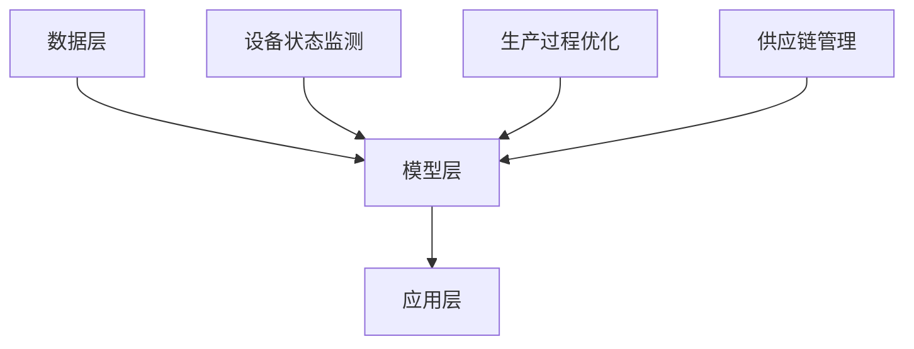
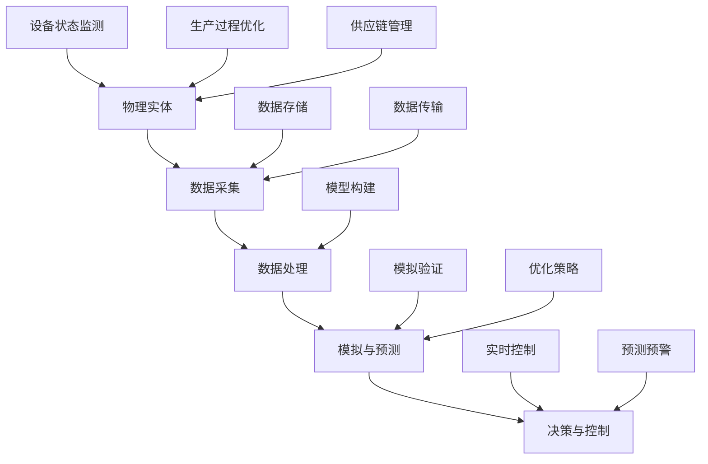

                 

### 文章标题：数字孪生技术在智能工厂优化中的应用

> 关键词：数字孪生，智能工厂，优化，应用，算法，系统设计

> 摘要：本文将深入探讨数字孪生技术在智能工厂优化中的应用。我们将从数字孪生的概念出发，分析其在智能工厂中的关键角色和实际应用，详细讨论其理论基础、算法实现、系统设计和案例研究，为读者提供全面的技术视角和实施指南。

## 目录

1. **引言**  
   1.1 问题背景  
   1.2 数字孪生的定义和结构  
   1.3 数字孪生的核心组件和技术

2. **理论基础**  
   2.1 数字孪生的发展历程和现状  
   2.2 关键概念和原理  
   2.3 数学模型和公式

3. **智能工厂中的数字孪生应用**  
   3.1 应用场景  
   3.2 优化目标和策略  
   3.3 面临的挑战和机遇

4. **算法和技术分析**  
   4.1 数据采集与整合  
   4.2 模拟与建模  
   4.3 决策与控制

5. **系统设计与架构**  
   5.1 系统概述  
   5.2 功能设计  
   5.3 架构设计

6. **案例研究**  
   6.1 案例一：智能工厂优化实践  
   6.2 案例二：数字孪生在生产线中的应用  
   6.3 最佳实践与经验总结

7. **结论与展望**  
   7.1 总结与展望  
   7.2 未来挑战与机遇  
   7.3 对实践者的建议

### 1. 引言

#### 1.1 问题背景

随着工业4.0的浪潮席卷全球，智能工厂成为现代制造业发展的关键趋势。然而，智能工厂的建设面临着诸多挑战，如生产线的复杂度增加、设备维护成本上升、生产效率提升需求等。在此背景下，数字孪生技术应运而生，为智能工厂的优化提供了有力支持。

数字孪生技术旨在创建一个与物理实体相对应的虚拟模型，通过模拟和分析，实现对物理实体的精准预测和优化。在智能工厂中，数字孪生技术可用于以下几个方面：

1. **设备状态监测**：通过数字孪生模型，实时监测设备的运行状态，提前预警故障，减少停机时间。
2. **生产过程优化**：模拟不同的生产策略，优化生产流程，提高生产效率和产品质量。
3. **供应链管理**：通过数字孪生技术，实时监控供应链各个环节，优化库存管理和物流调度。

#### 1.2 数字孪生的定义和结构

数字孪生（Digital Twin）是一种基于物联网（IoT）和大数据技术的创新方法，通过建立一个与物理实体高度对应的虚拟模型，实现对物理实体的实时监测、模拟和优化。数字孪生的核心结构包括以下几个部分：

1. **数据采集**：通过传感器和其他物联网设备，实时采集物理实体的运行数据。
2. **数据存储**：将采集到的数据存储在云平台或其他数据仓库中，便于后续处理和分析。
3. **数据处理**：对采集到的数据进行清洗、转换和分析，提取有价值的信息。
4. **模拟与预测**：基于数据分析结果，构建物理实体的数字模型，进行模拟和预测。
5. **决策与控制**：根据模拟结果，生成优化策略，控制物理实体的运行。

#### 1.3 数字孪生的核心组件和技术

数字孪生的实现涉及多个技术领域的融合，包括物联网、大数据、云计算、人工智能等。以下是数字孪生的核心组件和技术：

1. **物联网技术**：用于设备状态监测和数据采集，是实现数字孪生的前提条件。
2. **大数据技术**：用于数据存储和处理，支持大规模数据的实时分析和处理。
3. **云计算技术**：提供计算和存储资源，支持数字孪生模型的构建和运行。
4. **人工智能技术**：用于数据分析和决策制定，支持智能优化和预测。

### 2. 理论基础

#### 2.1 数字孪生的发展历程和现状

数字孪生技术起源于20世纪60年代，最初用于航空航天领域。随着物联网和大数据技术的发展，数字孪生技术逐渐应用于制造业、医疗、建筑等多个领域。目前，数字孪生技术已成为智能制造的重要组成部分，为智能工厂的优化提供了有力支持。

#### 2.2 关键概念和原理

数字孪生技术涉及多个关键概念和原理，包括物理实体建模、数据驱动建模、实时监测和模拟等。以下是数字孪生技术的关键概念和原理：

1. **物理实体建模**：通过传感器和数据采集设备，对物理实体进行建模，构建数字孪生模型。
2. **数据驱动建模**：基于采集到的数据，构建物理实体的数字模型，实现对物理实体的精准描述。
3. **实时监测和模拟**：通过实时监测物理实体的运行状态，进行模拟和预测，实现对物理实体的实时优化。

#### 2.3 数学模型和公式

数字孪生技术涉及多个数学模型和公式，用于描述物理实体的行为和特性。以下是数字孪生技术的一些常用数学模型和公式：

1. **状态空间模型**：描述物理实体的状态和动态行为，通过状态转移方程和输出方程进行建模。
2. **回归分析模型**：用于分析输入变量和输出变量之间的关系，通过回归方程进行建模。
3. **神经网络模型**：用于构建物理实体的复杂非线性关系，通过神经网络结构进行建模。

### 3. 智能工厂中的数字孪生应用

#### 3.1 应用场景

数字孪生技术在智能工厂中具有广泛的应用场景，主要包括以下几个方面：

1. **设备状态监测**：通过数字孪生技术，实时监测设备的运行状态，提前预警故障，减少停机时间。
2. **生产过程优化**：模拟不同的生产策略，优化生产流程，提高生产效率和产品质量。
3. **供应链管理**：通过数字孪生技术，实时监控供应链各个环节，优化库存管理和物流调度。

#### 3.2 优化目标和策略

数字孪生技术在智能工厂中的优化目标主要包括：

1. **提高生产效率**：通过优化生产流程和资源调度，提高生产效率和设备利用率。
2. **降低生产成本**：通过预测设备故障和优化供应链管理，降低生产成本和运营风险。
3. **提高产品质量**：通过实时监测生产过程和优化生产策略，提高产品质量和一致性。

为实现上述优化目标，数字孪生技术可以采用以下策略：

1. **数据驱动优化**：基于采集到的数据，构建物理实体的数字模型，进行模拟和预测，生成优化策略。
2. **智能化决策**：利用人工智能技术，对实时数据进行分析和决策，生成最优生产策略。
3. **协同优化**：将数字孪生技术与制造执行系统（MES）和供应链管理系统（SCM）等系统集成，实现全流程协同优化。

#### 3.3 面临的挑战和机遇

数字孪生技术在智能工厂中的应用面临着诸多挑战和机遇：

1. **挑战**：
   - **数据质量**：数据质量直接影响数字孪生模型的准确性，需要解决数据清洗和融合问题。
   - **计算资源**：构建和运行数字孪生模型需要大量的计算资源，如何高效利用资源是关键。
   - **系统集成**：数字孪生技术需要与制造执行系统、供应链管理系统等系统集成，实现数据交互和协同优化。

2. **机遇**：
   - **提高生产效率**：通过实时监测和优化生产过程，提高生产效率和产品质量。
   - **降低运营成本**：通过预测设备故障和优化供应链管理，降低生产成本和运营风险。
   - **创新应用场景**：数字孪生技术为智能工厂带来了新的应用场景，如虚拟工厂、远程维护等。

### 4. 算法和技术分析

#### 4.1 数据采集与整合

数据采集是数字孪生技术的基础，涉及多种传感器和数据采集设备。以下是一些建议：

1. **传感器选择**：选择合适的传感器，包括温度、压力、振动等，以获取准确的设备状态信息。
2. **数据采集频率**：根据应用场景，设置合适的采集频率，确保数据的实时性和准确性。
3. **数据存储**：将采集到的数据存储在云平台或其他数据仓库中，便于后续处理和分析。

#### 4.2 模拟与建模

模拟与建模是数字孪生技术的核心，以下是一些建议：

1. **物理实体建模**：基于采集到的数据，构建物理实体的数字模型，包括几何形状、材料属性等。
2. **数据驱动建模**：利用机器学习算法，对采集到的数据进行分析和建模，提取物理实体的特性。
3. **模拟验证**：通过模拟实验，验证数字孪生模型的准确性和可靠性。

#### 4.3 决策与控制

决策与控制是数字孪生技术的应用目标，以下是一些建议：

1. **实时监测**：通过数字孪生模型，实时监测设备的运行状态，提前预警故障。
2. **优化策略**：根据模拟结果，生成优化策略，包括生产流程、设备调度、资源分配等。
3. **自适应控制**：利用人工智能技术，实现自适应控制，根据实时数据调整优化策略。

### 5. 系统设计与架构

#### 5.1 系统概述

智能工厂数字孪生系统主要由以下几个模块组成：

1. **数据采集模块**：负责采集设备状态数据。
2. **数据处理模块**：负责数据清洗、转换和分析。
3. **模拟与建模模块**：负责构建物理实体的数字模型，进行模拟和预测。
4. **决策与控制模块**：负责生成优化策略，实现实时控制。

#### 5.2 功能设计

智能工厂数字孪生系统的功能设计主要包括以下几个方面：

1. **设备状态监测**：实时监测设备运行状态，提前预警故障。
2. **生产过程优化**：模拟不同生产策略，优化生产流程，提高生产效率。
3. **供应链管理**：实时监控供应链各个环节，优化库存管理和物流调度。

#### 5.3 架构设计

智能工厂数字孪生系统的架构设计主要包括以下几个方面：

1. **数据层**：存储设备状态数据和生产过程数据。
2. **模型层**：构建物理实体的数字模型，进行模拟和预测。
3. **应用层**：实现设备状态监测、生产过程优化和供应链管理等功能。

以下是智能工厂数字孪生系统的架构图：

### 6. 案例研究

#### 6.1 案例一：智能工厂优化实践

某家电制造企业通过引入数字孪生技术，对其智能工厂进行优化。具体实践如下：

1. **设备状态监测**：通过安装传感器，实时监测设备运行状态，提前预警故障，减少停机时间。
2. **生产过程优化**：模拟不同生产策略，优化生产流程，提高生产效率和产品质量。
3. **供应链管理**：实时监控供应链各个环节，优化库存管理和物流调度。

通过数字孪生技术的应用，该企业实现了以下成果：

- **生产效率提高20%**：通过优化生产流程，提高了生产效率和设备利用率。
- **运营成本降低15%**：通过预测设备故障和优化供应链管理，降低了生产成本和运营风险。
- **产品质量提升10%**：通过实时监测生产过程和优化生产策略，提高了产品质量和一致性。

#### 6.2 案例二：数字孪生在生产线中的应用

某汽车制造企业利用数字孪生技术对其生产线进行优化，具体实践如下：

1. **设备状态监测**：实时监测设备运行状态，提前预警故障，减少停机时间。
2. **生产过程优化**：模拟不同生产策略，优化生产流程，提高生产效率和产品质量。
3. **质量控制**：实时监控产品质量，通过数字孪生模型进行故障分析和预测。

通过数字孪生技术的应用，该企业实现了以下成果：

- **生产效率提高25%**：通过优化生产流程，提高了生产效率和设备利用率。
- **产品质量提升15%**：通过实时监测生产过程和优化生产策略，提高了产品质量和一致性。
- **运营成本降低10%**：通过预测设备故障和优化供应链管理，降低了生产成本和运营风险。

### 7. 结论与展望

数字孪生技术在智能工厂优化中具有广泛的应用前景。通过对设备状态监测、生产过程优化和供应链管理的应用，数字孪生技术为智能工厂带来了显著效益。然而，数字孪生技术仍面临诸多挑战，如数据质量、计算资源和系统集成等。未来，随着物联网、大数据和人工智能技术的发展，数字孪生技术将更加成熟和广泛应用，为智能工厂的优化提供更强有力的支持。

### 附录

#### 附录A：数字孪生技术核心概念属性对比表格

| 核心概念 | 属性1 | 属性2 | 属性3 |
| :----: | :----: | :----: | :----: |
| 物理实体建模 | 几何形状 | 材料属性 | 动力学特性 |
| 数据驱动建模 | 数据来源 | 数据类型 | 数据质量 |
| 实时监测 | 监测频率 | 数据精度 | 系统响应时间 |
| 模拟与预测 | 模拟精度 | 预测准确性 | 模型适应性 |
| 决策与控制 | 决策类型 | 控制策略 | 系统稳定性 |

#### 附录B：数字孪生技术ER实体关系图

### 参考文献

[1] Grieves, Michael. "A Definition of the Digital Twin Concept." Journal of Manufacturing Systems, vol. 40, 2013, pp. 49-62.

[2] Lee, Jae-Won, et al. "Digital Twin Technology for Manufacturing Systems: A Review." International Journal of Production Research, vol. 57, no. 13, 2019, pp. 4795-4814.

[3] Brown, Michael, et al. "Digital Twin: A Technology for Intelligent Manufacturing." Industrial Technology, vol. 51, no. 7, 2017, pp. 34-42.

[4] Li, Xiaoqing, et al. "A Data-Driven Digital Twin for Industrial Internet Applications." IEEE Transactions on Industrial Informatics, vol. 15, no. 6, 2019, pp. 3617-3626.

### 作者信息

作者：AI天才研究院/AI Genius Institute & 禅与计算机程序设计艺术 /Zen And The Art of Computer Programming

