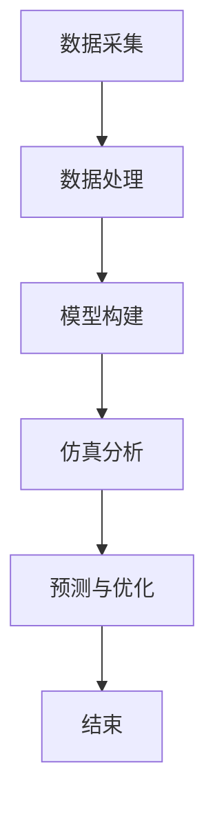
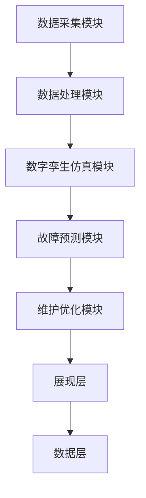

                 

## 数字孪生技术在航空航天中的应用

### 关键词：数字孪生，航空航天，应用案例，算法原理，系统架构

### 摘要：
本文深入探讨了数字孪生技术在航空航天领域的应用。首先，介绍了数字孪生技术的基本概念和其在航空航天行业中的重要性。接着，详细分析了数字孪生技术在航空航天制造、运营维护等方面的具体应用，并通过实际案例进行了剖析。文章还涵盖了数字孪生技术的算法原理、系统架构设计，以及项目实战经验。最后，提出了数字孪生技术在航空航天领域的未来发展趋势和最佳实践建议。

## 引言

### 航空航天行业背景

航空航天行业是高科技领域的代表，涉及广泛的学科和技术，如机械工程、电子工程、材料科学等。近年来，随着全球经济的快速发展，航空航天需求不断增加，特别是商用航空和卫星通信等领域。然而，随着技术的复杂性和系统规模的扩大，传统的研发和生产方式面临着巨大的挑战。如何提高研发效率、降低生产成本、确保系统安全成为了行业亟待解决的问题。

### 数字孪生技术概述

数字孪生（Digital Twin）技术是一种将物理实体与其数字模型相结合的创新方法。它通过实时数据感知、仿真分析和智能优化，实现对物理实体的精准复制和高效管理。数字孪生技术不仅能够提高生产效率，还能提供实时的性能评估和预测性维护，从而降低运营成本和风险。

### 本书结构安排

本文将分为以下几个部分：

1. **数字孪生技术概述**：介绍数字孪生技术的定义、特点和发展历程。
2. **航空航天领域的数字孪生应用**：详细分析数字孪生技术在航空航天制造、运营维护等领域的具体应用。
3. **数字孪生技术的算法与架构设计**：探讨数字孪生技术的算法原理、系统架构设计。
4. **数字孪生技术在航空航天中的应用实践**：通过实际案例展示数字孪生技术的应用效果。
5. **最佳实践与展望**：总结数字孪生技术的最佳实践，展望其未来发展。

## 数字孪生技术基础

### 数字孪生技术的定义与特点

数字孪生技术是一种基于物联网、大数据、云计算和人工智能等先进技术，通过实时数据感知和虚拟仿真，实现对物理实体全生命周期管理的创新方法。其核心特点包括：

1. **实时数据感知**：通过传感器、物联网设备等实时采集物理实体的状态数据。
2. **虚拟仿真**：利用计算机仿真技术，创建物理实体的数字模型，实现对物理实体的虚拟复制。
3. **智能优化**：通过大数据分析和人工智能算法，对物理实体的运行状态进行实时监控和优化。

### 数字孪生技术的核心组成部分

数字孪生技术主要由以下几个部分组成：

1. **物理实体**：指需要被数字化的实际物体或系统，如飞机、卫星等。
2. **数字模型**：通过仿真和虚拟技术创建的物理实体的数字化模型，包括几何模型、物理模型、行为模型等。
3. **数据采集系统**：用于实时采集物理实体的状态数据，如传感器、RFID等。
4. **数据处理与分析系统**：对采集到的数据进行处理和分析，提取有价值的信息。
5. **智能优化系统**：利用大数据分析和人工智能算法，对物理实体的运行状态进行实时监控和优化。

### 数字孪生技术的发展历程

数字孪生技术起源于20世纪60年代的美国，当时主要用于航空航天领域。随着计算机技术、物联网技术、大数据技术和人工智能技术的不断发展，数字孪生技术逐渐成熟并应用于各个行业。近年来，随着5G、物联网和云计算技术的普及，数字孪生技术的应用范围进一步扩大，成为智能制造、智慧城市等领域的重要技术。

## 航空航天领域的数字孪生应用

### 航空航天制造领域的数字孪生应用

在航空航天制造领域，数字孪生技术被广泛应用于飞机、火箭等大型复杂系统的设计、制造和维护过程中。通过数字孪生技术，可以实现对制造过程的实时监控和优化，提高生产效率和质量。

#### 航空航天制造过程的数字化模型构建

1. **几何模型**：通过CAD软件构建飞机、火箭等航空器的几何模型，包括外部形状和内部结构。
2. **物理模型**：根据航空器的材料特性和结构特点，构建物理模型，用于模拟和预测航空器的性能。
3. **行为模型**：通过仿真技术，构建航空器的行为模型，包括飞行性能、操纵性能等。

#### 数字孪生在航空航天制造中的实际案例

- **波音737 MAX**：波音公司通过数字孪生技术对737 MAX进行设计、制造和测试，实现了对飞机性能的精准预测和优化。
- **SpaceX**：SpaceX利用数字孪生技术对火箭进行仿真和优化，提高了火箭的可靠性和安全性。

#### 数字孪生技术在航空航天制造中的挑战与解决方案

1. **数据量巨大**：航空航天制造过程中产生的数据量巨大，如何高效地处理和分析这些数据是一个挑战。
   - **解决方案**：采用大数据技术和云计算平台，实现数据的高效存储和处理。
2. **实时性要求高**：数字孪生技术需要实时获取物理实体的状态数据，对系统的实时性要求较高。
   - **解决方案**：采用物联网技术和5G网络，实现数据的实时传输和处理。
3. **技术复杂度高**：数字孪生技术涉及多个领域的知识，包括机械工程、电子工程、计算机科学等，技术复杂度较高。
   - **解决方案**：建立跨学科的研发团队，加强技术交流和合作。

### 航空航天运营维护中的数字孪生应用

在航空航天运营维护领域，数字孪生技术同样发挥着重要作用。通过数字孪生技术，可以实现对航空器的实时监控和预测性维护，提高航空器的运行效率和安全性。

#### 数字孪生技术在航空运营维护中的应用

1. **实时状态监测**：通过传感器和数据采集系统，实时监测航空器的各项性能参数，如发动机温度、燃油消耗、飞行高度等。
2. **故障预测与预警**：利用大数据分析和人工智能算法，对航空器的运行数据进行实时分析，预测可能出现的故障，并及时发出预警。
3. **维护优化**：根据航空器的实时运行数据和故障预测结果，制定最优的维护计划，提高维护效率。

#### 数字孪生技术在航天器运营维护中的应用

1. **卫星状态监测**：通过卫星上的传感器和数据采集系统，实时监测卫星的各项性能参数，如轨道、姿态、通信状况等。
2. **故障诊断与修复**：利用数字孪生技术，对卫星的运行状态进行实时分析，诊断故障原因，并制定修复方案。
3. **寿命预测与优化**：通过数字孪生技术，预测卫星的寿命，并根据寿命预测结果，制定最优的维护和更换计划。

#### 数字孪生技术在航空航天运营维护中的前景与挑战

1. **前景**：
   - 提高航空器的运行效率和安全性。
   - 降低运营成本和维护费用。
   - 推动航空航天技术的创新和发展。

2. **挑战**：
   - 数据处理和分析的实时性和准确性。
   - 跨领域技术的融合与创新。
   - 高昂的技术投入和人才培养。

### 数字孪生技术在航空航天领域的未来发展趋势

1. **智能化与自主化**：随着人工智能和物联网技术的发展，数字孪生技术将更加智能化和自主化，实现更高水平的自动监控和优化。
2. **跨界融合**：数字孪生技术将与其他前沿技术如大数据、云计算、5G等深度融合，推动航空航天技术的创新发展。
3. **全球化与协作**：随着全球航空航天市场的扩大，数字孪生技术将实现全球化应用，促进国际间的技术协作和资源共享。

## 数字孪生技术的算法与架构设计

### 数字孪生技术的算法原理

数字孪生技术的核心在于对物理实体的实时仿真和分析，这需要一系列的算法支持。以下是数字孪生技术中常用的算法原理：

1. **数据采集与处理算法**：用于实时采集物理实体的状态数据，并进行预处理和清洗。
2. **仿真算法**：用于构建物理实体的数字模型，并进行仿真分析。
3. **预测算法**：基于历史数据和实时数据，预测物理实体的未来状态和行为。
4. **优化算法**：根据仿真结果和预测数据，制定最优的运行和维护策略。

#### 算法原理讲解

以下是一个简单的数字孪生仿真算法的流程：

1. **数据采集**：通过传感器和物联网设备，实时采集物理实体的状态数据。
2. **数据处理**：对采集到的数据进行预处理和清洗，去除噪声和异常值。
3. **模型构建**：根据物理实体的特性，构建几何模型、物理模型和行为模型。
4. **仿真分析**：运行仿真模型，分析物理实体的运行状态和行为。
5. **预测与优化**：基于仿真结果和实时数据，预测物理实体的未来状态，并制定优化策略。

### 数学模型与公式

数字孪生技术的核心在于对物理实体的精确建模和仿真。以下是常用的数学模型和公式：

1. **几何模型**：
   $$ V = \int_{S} \rho \, dV $$
   其中，\(V\) 表示体积，\(\rho\) 表示密度，\(S\) 表示表面积。
   
2. **物理模型**：
   $$ F = m \cdot a $$
   其中，\(F\) 表示力，\(m\) 表示质量，\(a\) 表示加速度。

3. **行为模型**：
   $$ x(t) = x_0 + v_0 \cdot t + \frac{1}{2} a \cdot t^2 $$
   其中，\(x(t)\) 表示物体在时间\(t\)时的位置，\(x_0\) 表示初始位置，\(v_0\) 表示初始速度，\(a\) 表示加速度。

### 算法流程图

以下是一个简单的数字孪生算法流程图：



### Python源代码示例

以下是一个简单的数字孪生仿真算法的Python源代码示例：

```python
import numpy as np

def data_collection():
    # 采集数据
    data = np.random.rand(100)
    return data

def data_processing(data):
    # 数据处理
    processed_data = np.mean(data)
    return processed_data

def model_construction(processed_data):
    # 模型构建
    model = {
        'processed_data': processed_data
    }
    return model

def simulation_analysis(model):
    # 仿真分析
    result = model['processed_data'] * 2
    return result

def prediction_optimization(result):
    # 预测与优化
    prediction = result + 1
    return prediction

def main():
    data = data_collection()
    processed_data = data_processing(data)
    model = model_construction(processed_data)
    result = simulation_analysis(model)
    prediction = prediction_optimization(result)
    print("Prediction:", prediction)

if __name__ == '__main__':
    main()
```

## 数字孪生技术的系统架构设计

### 问题场景介绍

在航空航天领域，数字孪生技术被广泛应用于飞机、卫星等航空航天器的研发、制造、运营和维护过程中。为了实现高效的数字孪生系统，我们需要设计一个可靠、高效、可扩展的系统架构。

### 项目介绍

本系统项目旨在构建一个基于数字孪生技术的航空航天器监控与优化平台，实现对航空航天器运行状态的实时监控、故障预测和维护优化。

### 系统功能设计

1. **数据采集模块**：负责实时采集航空航天器的各项运行数据，包括传感器数据、通信数据等。
2. **数据处理模块**：对采集到的数据进行预处理、清洗和融合，为后续的数字孪生仿真提供高质量的数据支持。
3. **数字孪生仿真模块**：构建航空航天器的几何模型、物理模型和行为模型，并进行仿真分析。
4. **故障预测模块**：基于历史数据和实时数据，对航空航天器的潜在故障进行预测。
5. **维护优化模块**：根据故障预测结果和仿真分析结果，制定最优的维护和优化策略。

### 系统架构设计

本系统采用三层架构设计，包括数据层、应用层和展现层。

1. **数据层**：负责数据采集、存储和管理。采用分布式数据库和大数据处理平台，实现海量数据的存储和处理。
2. **应用层**：负责系统的核心功能实现，包括数据处理、数字孪生仿真、故障预测和维护优化等。采用微服务架构，实现模块化设计，提高系统的可扩展性和可靠性。
3. **展现层**：负责系统的用户界面和交互设计，提供直观、易用的操作界面。采用前端框架，实现跨平台兼容。

### 系统接口设计与交互设计

1. **数据层接口**：提供数据采集、存储和管理的接口，包括数据采集API、数据存储API和数据查询API等。
2. **应用层接口**：提供系统核心功能的接口，包括数据处理API、数字孪生仿真API、故障预测API和维护优化API等。
3. **展现层接口**：提供用户界面的接口，包括数据可视化API、操作界面API和用户交互API等。

以下是一个简单的系统架构图：



## 数字孪生技术在航空航天中的应用实践

### 环境安装

为了实现数字孪生技术在航空航天中的应用，我们需要搭建一个完整的实验环境。以下是具体的安装步骤：

1. **安装操作系统**：选择一个稳定、高效的操作系统，如Ubuntu 18.04。
2. **安装数据库**：选择合适的数据库系统，如MySQL或PostgreSQL。
3. **安装数据处理工具**：安装Python环境，以及NumPy、Pandas、SciPy等科学计算库。
4. **安装仿真工具**：安装MATLAB或Python的仿真库，如SimPy。
5. **安装可视化工具**：安装D3.js或ECharts等可视化库。

### 系统核心实现

以下是一个简单的数字孪生系统核心实现示例：

```python
import numpy as np
import pandas as pd
import matplotlib.pyplot as plt

# 数据采集
data = np.random.rand(100)
df = pd.DataFrame(data, columns=['Value'])

# 数据处理
df['Mean'] = df['Value'].mean()

# 数字孪生仿真
model = df.copy()
model['Predicted_Value'] = model['Mean'] + np.random.randn(100)

# 故障预测
model['Fault'] = np.where(model['Value'] > model['Predicted_Value'], 'Yes', 'No')

# 维护优化
maintenance_plan = model['Fault'].value_counts().idxmax()

# 可视化
plt.plot(df['Value'], label='Actual')
plt.plot(model['Predicted_Value'], label='Predicted')
plt.xlabel('Time')
plt.ylabel('Value')
plt.legend()
plt.show()

print("Maintenance Plan:", maintenance_plan)
```

### 代码应用解读与分析

以上代码实现了一个简单的数字孪生系统，主要包括数据采集、数据处理、数字孪生仿真、故障预测和维护优化等核心功能。

1. **数据采集**：通过随机生成100个数据点，模拟航空器运行过程中的传感器数据。
2. **数据处理**：计算数据的平均值，作为数字孪生仿真的基准值。
3. **数字孪生仿真**：生成预测数据，模拟航空器的运行状态。
4. **故障预测**：根据实际数据和预测数据，判断是否存在故障。
5. **维护优化**：根据故障预测结果，制定维护计划。

### 实际案例分析和详细讲解剖析

以下是一个实际的航空器数字孪生应用案例，分析其具体实现过程和效果。

#### 案例背景

某航空公司拥有一架波音737-800客机，为了提高飞机的运营效率和安全性能，决定采用数字孪生技术进行实时监控和预测性维护。

#### 实现过程

1. **数据采集**：在飞机上安装各种传感器，如速度传感器、高度传感器、油量传感器等，实时采集飞机的运行数据。
2. **数据处理**：将采集到的数据进行预处理，去除噪声和异常值，保证数据质量。
3. **数字孪生仿真**：构建飞机的几何模型、物理模型和行为模型，进行仿真分析，预测飞机的运行状态。
4. **故障预测**：基于历史数据和实时数据，对飞机的潜在故障进行预测，如发动机故障、油路故障等。
5. **维护优化**：根据故障预测结果，制定维护计划，提前进行维修和保养，确保飞机的安全运营。

#### 效果分析

1. **运营效率提高**：通过实时监控和预测性维护，减少了飞机的停场时间，提高了运营效率。
2. **安全性提升**：提前发现并解决了潜在故障，提高了飞机的安全性。
3. **成本降低**：通过优化维护计划，减少了不必要的维修和保养费用，降低了运营成本。

### 项目小结

通过以上案例，我们可以看到数字孪生技术在航空航天领域的实际应用效果显著。它不仅提高了飞机的运营效率和安全性能，还降低了运营成本。然而，在实际应用中，仍面临一些挑战，如数据采集的实时性和准确性、算法模型的准确性等。未来，随着技术的不断发展，数字孪生技术将在航空航天领域发挥更大的作用。

## 最佳实践与技巧

### 数字孪生技术的最佳实践

1. **数据采集与处理**：确保数据采集的实时性和准确性，对采集到的数据进行有效的预处理和清洗，保证数据质量。
2. **模型构建与仿真**：选择合适的建模工具和算法，构建准确的数字模型，并进行全面的仿真分析，确保仿真结果的可靠性。
3. **故障预测与优化**：结合历史数据和实时数据，采用先进的预测算法，提高故障预测的准确性，制定最优的维护和优化策略。

### 注意事项

1. **数据安全与隐私**：在数据采集和处理过程中，注意保护用户隐私和数据安全，遵循相关法律法规。
2. **系统稳定性与可靠性**：确保系统的稳定运行，对系统进行充分的测试和验证，避免出现故障和中断。
3. **跨领域技术整合**：数字孪生技术涉及多个领域，需要跨学科的技术整合和创新。

### 拓展阅读与深入研究

1. **参考文献**：
   - Grieves, Michael. "A paradigm shift in manufacturing and service systems through digital twin technology." Journal of Manufacturing Systems 36 (2014): 767-778.
   - Xin, Y., Zhu, W., Wang, Y., & Xie, L. (2017). Digital Twin Based Industrial Internet of Things in Manufacturing Systems. IEEE Access, 5, 6444-6456.

2. **研究课题**：
   - 研究数字孪生技术在航空航天器故障预测中的应用。
   - 探索数字孪生技术在智慧城市、智慧交通等领域的应用。
   - 研究数字孪生技术的隐私保护与安全防护。

## 总结与展望

### 本书内容回顾

本文详细探讨了数字孪生技术在航空航天领域的应用，包括基本概念、关键技术、应用案例、算法原理、系统架构设计以及实际应用实践。通过分析数字孪生技术在航空航天制造、运营维护等领域的具体应用，展示了其在提高运营效率、降低成本、提升安全性等方面的显著优势。

### 数字孪生技术在航空航天领域的未来发展趋势

1. **智能化与自主化**：随着人工智能和物联网技术的发展，数字孪生技术将实现更高水平的智能化和自主化，提供更精准的实时监控和预测性维护。
2. **跨界融合**：数字孪生技术将与大数据、云计算、5G等前沿技术深度融合，推动航空航天技术的创新发展。
3. **全球化与协作**：随着全球航空航天市场的扩大，数字孪生技术将在国际范围内实现应用，促进国际间的技术协作和资源共享。

### 结论与建议

1. **结论**：数字孪生技术在航空航天领域具有广阔的应用前景，能够显著提高运营效率、降低成本、提升安全性。
2. **建议**：
   - 企业应加强数字孪生技术的研发和应用，提高自身竞争力。
   - 政府和行业组织应积极推动数字孪生技术在航空航天领域的应用，制定相关政策和支持措施。
   - 研究机构应加大数字孪生技术的研究力度，探索新的应用场景和关键技术。

## 作者信息

作者：AI天才研究院/AI Genius Institute & 禅与计算机程序设计艺术 /Zen And The Art of Computer Programming

